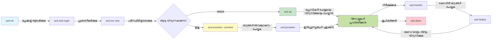
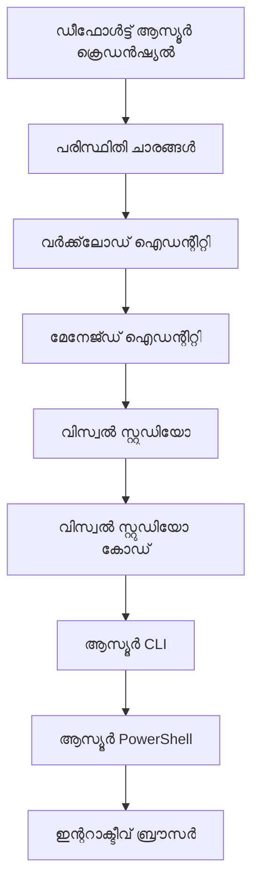

# AZD Basics - Understanding Azure Developer CLI

# AZD Basics - Core Concepts and Fundamentals

**Chapter Navigation:**
- **📚 Course Home**: [AZD For Beginners](../../README.md)
- **📖 Current Chapter**: Chapter 1 - Foundation & Quick Start
- **⬅️ Previous**: [Course Overview](../../README.md#-chapter-1-foundation--quick-start)
- **➡️ Next**: [Installation & Setup](installation.md)
- **🚀 Next Chapter**: [Chapter 2: AI-First Development](../chapter-02-ai-development/microsoft-foundry-integration.md)

## Introduction

ഈ പാഠം നിങ്ങളെ Azure Developer CLI (azd) എന്ന ശക്തമായ കമാൻഡ്-ലൈൻ ടൂളുമായി പരിചയപ്പെടുത്തുന്നു, ഇത് ലോക്കൽ ഡെവലപ്പ്മെന്റിൽ നിന്ന് Azure ഡിപ്ലോയ്മെന്റിലേക്ക് നിങ്ങളുടെ യാത്രയെ വേഗത്തിലാക്കുന്നു. ആപ്ലിക്കേഷൻ ക്ലൗഡ്-ശൈലിയിൽ നിർമ്മിക്കുകയും ഡിപ്ലോയും ചെയ്യുകയും നടത്തുന്നതെങ്ങനെ azd സാധ്യമാക്കുന്നുവെന്ന് നിങ്ങൾക്ക് പഠിക്കാം.

## Learning Goals

ഈ പാഠം അവസാനിക്കും വരെ, നിങ്ങൾ:
- Azure Developer CLI എന്താണെന്നും അതിന്റെ പ്രധാന ലക്ഷ്യവും മനസിലാക്കുക
- ടെംപ്ലേറ്റുകൾ, പരിസ്ഥിതികൾ, സേവനങ്ങൾ എന്നിങ്ങനെ കോർ ആശയങ്ങൾ പഠിക്കുക
- ടെംപ്ലേറ്റ്-ഡ്രിവൺ ഡെവലപ്പ്മെന്റും Infrastructure as Code ഉൾപ്പെടെയുള്ള പ്രധാന സവിശേഷതകൾ പരിശോധിക്കുക
- azd പ്രോജക്ട് ഘടനയും വർക്ക്‌ഫ്ലോയും മനസിലാക്കുക
- inyong development environment-നായി azd ഇൻസ്റ്റോൾ ചെയ്ത് കോൺഫിഗർ ചെയ്യാൻ തയ്യാറാകുക

## Learning Outcomes

ഈ പാഠം പൂർത്തിയാക്കിയശേഷം, നിങ്ങൾക്ക് സാധിക്കണം:
- ആധുനിക ക്ലൗഡ് ഡെവലപ്പ്മെന്റ് വർക്ക്‌ഫ്ലോയിൽ azd ന്റെ പങ്ക് വിവരിക്കുക
- azd പ്രോജക്ട് ഘടനയുടെ ഘടകങ്ങൾ തിരിച്ചറിയുക
- ടെംപ്ലേറ്റുകൾ, പരിസ്ഥിതികൾ, സേവനങ്ങൾ തമ്മിൽ എങ്ങനെ ചേർന്ന് പ്രവർത്തിക്കുന്നുവെന്ന് വിവരണം ചെയ്യുക
- azd ഉപയോഗിച്ച് Infrastructure as Code ന്റെ ഗുണങ്ങൾ മനസിലാക്കുക
- വിവിധ azd കമാൻഡുകൾക്കും അവയുടെ ലക്ഷ്യങ്ങൾക്കും തിരിച്ചറിയുക

## What is Azure Developer CLI (azd)?

Azure Developer CLI (azd) എന്നത് ലോക്കൽ ഡെവലപ്പ്മെന്റിൽ നിന്ന് Azure ഡിപ്ലോയ്മെന്റിലേക്ക് നിങ്ങളുടെ യാത്ര വേഗത്തിലാക്കാൻ രൂപകൽപ്പന ചെയ്‍ത ഒരു കമാൻഡ്-ലൈൻ ടൂൾ ആണ്. Azure-ൽ ക്ലൗഡ്-നേറ്റീവ് അപ്ലിക്കേഷനുകൾ നിർമ്മിക്കാനും ഡിപ്ലോയ് ചെയ്യാനും മാനേജ് ചെയ്യാനുമുള്ള പ്രക്രിയ ലളിതമാക്കുന്നു.

### 🎯 Why Use AZD? A Real-World Comparison

ചുവടെ ഒരു ലളിതമായ വെബ് ആപ്പ് ഡാറ്റാബേസുമായി ഡിപ്ലോയ് ചെയ്യുന്നതിന്റെ താരതമ്യം കാണാം:

#### ❌ WITHOUT AZD: Manual Azure Deployment (30+ minutes)

```bash
# പടി 1: റിസോഴ്‌സ് ഗ്രൂപ്പ് സൃഷ്ടിക്കുക
az group create --name myapp-rg --location eastus

# പടി 2: ആപ്പ് സർവീസ് പ്ലാൻ സൃഷ്ടിക്കുക
az appservice plan create --name myapp-plan \
  --resource-group myapp-rg \
  --sku B1 --is-linux

# പടി 3: വെബ് ആപ്പ് സൃഷ്ടിക്കുക
az webapp create --name myapp-web-unique123 \
  --resource-group myapp-rg \
  --plan myapp-plan \
  --runtime "NODE:18-lts"

# പടി 4: കോസ്‌മോസ് DB അക്കൗണ്ട് സൃഷ്ടിക്കുക (10-15 മിനിറ്റുകൾ)
az cosmosdb create --name myapp-cosmos-unique123 \
  --resource-group myapp-rg \
  --kind MongoDB

# പടി 5: ഡാറ്റാബേസ് സൃഷ്ടിക്കുക
az cosmosdb mongodb database create \
  --account-name myapp-cosmos-unique123 \
  --resource-group myapp-rg \
  --name tododb

# പടി 6: കോലക്ഷൻ സൃഷ്ടിക്കുക
az cosmosdb mongodb collection create \
  --account-name myapp-cosmos-unique123 \
  --resource-group myapp-rg \
  --database-name tododb \
  --name todos

# പടി 7: കണക്ഷൻ സ്ട്രിംഗ് നേടുക
CONN_STR=$(az cosmosdb keys list \
  --name myapp-cosmos-unique123 \
  --resource-group myapp-rg \
  --type connection-strings \
  --query "connectionStrings[0].connectionString" -o tsv)

# പടി 8: ആപ്പ് സജ്ജീകരണങ്ങൾ ക്രമീകരിക്കുക
az webapp config appsettings set \
  --name myapp-web-unique123 \
  --resource-group myapp-rg \
  --settings MONGODB_URI="$CONN_STR"

# പടി 9: ലോഗിംഗ് സജീവമാക്കുക
az webapp log config --name myapp-web-unique123 \
  --resource-group myapp-rg \
  --application-logging filesystem \
  --detailed-error-messages true

# പടി 10: അപ്ലിക്കേഷൻ ഇൻസൈറ്റ്സ് ക്രമീകരിക്കുക
az monitor app-insights component create \
  --app myapp-insights \
  --location eastus \
  --resource-group myapp-rg

# പടി 11: ആപ്പ് ഇൻസൈറ്റ്സ് വെബ് ആപ്പുമായി ലിങ്കുചെയ്യുക
INSTRUMENTATION_KEY=$(az monitor app-insights component show \
  --app myapp-insights \
  --resource-group myapp-rg \
  --query "instrumentationKey" -o tsv)

az webapp config appsettings set \
  --name myapp-web-unique123 \
  --resource-group myapp-rg \
  --settings APPINSIGHTS_INSTRUMENTATIONKEY="$INSTRUMENTATION_KEY"

# പടി 12: ആപ്ലിക്കേഷൻ ലോക്കലായി ബിൽഡ് ചെയ്യുക
npm install
npm run build

# പടി 13: ഡിപ്ലോയ്മെന്റ് പാക്കേജ് സൃഷ്ടിക്കുക
zip -r app.zip . -x "*.git*" "node_modules/*"

# പടി 14: ആപ്ലിക്കേഷൻ ഡിപ്ലോയ് ചെയ്യുക
az webapp deployment source config-zip \
  --resource-group myapp-rg \
  --name myapp-web-unique123 \
  --src app.zip

# പടി 15: കാത്തിരിക്കുക ഒപ്പം ഇത് പ്രവർത്തിക്കുമെന്ന് പ്രാർത്ഥിക്കുക 🙏
# (ഓട്ടോമേറ്റഡ് വാലിഡേഷൻ ഇല്ല, മാനുവൽ ടെസ്റ്റിംഗ് ആവശ്യമാണ്)
```

**Problems:**
- ❌ 15+ കമാൻഡുകൾ ഓർക്കുകയും ക്രമത്തിൽ എക്സിക്യൂട്ട് ചെയ്യുകയും ചെയ്യേണ്ടതുണ്ട്
- ❌ 30-45 നിമിഷം മാനുവൽ പ്രവൃത്തി
- ❌ തെറ്റുകൾ ചെയ്യാൻ ഇടമുണ്ട് (ടൈപ്പോസ്, തെറ്റായ പാരാമീറ്ററുകൾ)
- ❌ കണക്ഷൻ സ്ട്രിംഗുകൾ ടെർമിനൽ ഹിസ്ഥാനിൽ പുറത്ത് കാണപ്പെടണം
- ❌ എന്തെങ്കിലും പരാജയപ്പെടുകയാണെങ്കിൽ ഓട്ടോമാറ്റിക് റോള്ബാക്ക് ഇല്ല
- ❌ ടീമിന്റെയുമായി പുനരാവരണം ചെയ്യാൻ പ്രയാസം
- ❌ ഓരോ പ്രാവശ്യവും വ്യത്യസ്തം (പുനരുത്പാദനശേഷിയില്ല)

#### ✅ WITH AZD: Automated Deployment (5 commands, 10-15 minutes)

```bash
# വിവരം 1: ടെംപ്ലേറ്റിൽ നിന്ന് ആരംഭിക്കുക
azd init --template todo-nodejs-mongo

# Step 2: പ്രാമാണീകരിക്കുക
azd auth login

# Step 3: പരിസ്ഥിതി സൃഷ്ടിക്കുക
azd env new dev

# Step 4: മാറ്റങ്ങൾ മുൻകൂട്ടി കാണുക (ഐച്ഛികമാണ്, പക്ഷേ ശിപാർശ ചെയ്യപ്പെടുന്നു)
azd provision --preview

# Step 5: എല്ലാം വിന്യസിക്കുക
azd up

# ✨ പൂർത്തിയായി! എല്ലാം വിന്യസിച്ചും ക്രമീകരിച്ചും നിരീക്ഷണത്തിലുമുണ്ട്
```

**Benefits:**
- ✅ **5 കമാൻഡുകൾ** vs. 15+ മാനുവൽ ഘട്ടങ്ങൾ
- ✅ **10-15 മിനിറ്റ്** മൊത്തം സമയം (പ്രധാനമായും Azure കാത്തിരിക്കുക)
- ✅ **പിശകുകള്‍ കുറഞ്ഞു** - ഓട്ടോമേറ്റഡ് និង ടെസ്റ്റുചെയ്തത്
- ✅ **രഹസ്യങ്ങൾ സുരക്ഷിതമായി മാനേജ് ചെയ്യപ്പെടുന്നു** Key Vault വഴി
- ✅ **പരാജയങ്ങളിലുണ്ടാകുന്ന യാന്ത്രിക റോള്ബാക്ക്** സ്വതഃസിദ്ധം
- ✅ **പൂർണ്ണമായും പുനരുത്പാദനക്ഷമം** - ഓരോ പ്രാവശ്യവും ഒരേ ഫലമാകും
- ✅ **ടീം-റെഡ്** - ആരും ഒരേ കമാൻഡുകളിൽ ഡിപ്ലോയ് ചെയ്യാം
- ✅ **Infrastructure as Code** - Bicep ടെംപ്ലേറ്റുകൾ പതിപ്പു നിയന്ത്രണത്തിലാണ്
- ✅ **ഇന്റിഗ്രേറ്റഡ് മോണിറ്ററിംഗ്** - Application Insights സ്വയം കോൺഫിഗർ ചെയ്യപ്പെടുന്നു

### 📊 Time & Error Reduction

| Metric | Manual Deployment | AZD Deployment | Improvement |
|:-------|:------------------|:---------------|:------------|
| **Commands** | 15+ | 5 | 67% കുറവ് |
| **Time** | 30-45 min | 10-15 min | 60% വേഗം |
| **Error Rate** | ~40% | <5% | 88% കുറവ് |
| **Consistency** | Low (manual) | 100% (automated) | പരിപൂണ്യം |
| **Team Onboarding** | 2-4 hours | 30 minutes | 75% വേഗം |
| **Rollback Time** | 30+ min (manual) | 2 min (automated) | 93% വേഗം |

## Core Concepts

### Templates
ടെംപ്ലേറ്റുകൾ azd ന്റെ അടിസ്ഥാനം ആണ്. അവയിൽ ഉൾപ്പെടുന്നു:
- **Application code** - നിങ്ങളുടെ സോഴ്‌സ് കോഡ് এবং ഡിപ്പെൻഡൻസികൾ
- **Infrastructure definitions** - Bicep അല്ലെങ്കിൽ Terraform ൽ നിർവചിച്ച Azure റിസോഴ്‌സുകൾ
- **Configuration files** - ക്രമീകരണങ്ങളും പരിസ്ഥിതി ചേരുവകളും
- **Deployment scripts** - ഓട്ടോമേറ്റഡ് ഡിപ്ലോയ്മെന്റ് വർക്ക്‌ഫ്ലോകൾ

### Environments
പരിസ്ഥിതികൾ വ്യത്യസ്ത ഡിപ്ലോയ്മെന്റ് ലക്ഷ്യങ്ങളെ പ്രതിനിധാനം ചെയ്യുന്നു:
- **Development** - ടെസ്റ്റിംഗും ഡെവലപ്മെന്റിനും
- **Staging** - പ്രീ-പ്രൊഡക്ഷൻ പരിസ്ഥിതി
- **Production** - ലൈവ് പ്രൊഡക്ഷൻ പരിസ്ഥിതി

ഓരോ പരിസ്ഥിതിക്കും സ്വന്തമായി നിലനിൽക്കുന്നു:
- Azure resource group
- ക്രമീകരണ സെറ്റിംഗുകൾ
- ഡിപ്ലോയ്മെന്റ് സ്റ്റേറ്റ്

### Services
സേവനങ്ങൾ നിങ്ങളുടെ ആപ്ലിക്കേഷന്റെ നിർമ്മാണ ഘടകങ്ങളാണ്:
- **Frontend** - വെബ് ആപ്പുകൾ, SPAകൾ
- **Backend** - APIകൾ, മൈക്രോസർവീസുകൾ
- **Database** - ഡേറ്റാ സ്ടോറേജ് പരിഹാരങ്ങൾ
- **Storage** - ഫയൽ மற்றும் blob സ്ടോറേജ്

## Key Features

### 1. Template-Driven Development
```bash
# ലഭ്യമായ ടെംപ്ലേറ്റുകൾ ബ്രൗസ് ചെയ്യുക
azd template list

# ഒരു ടെംപ്ലേറ്റിൽ നിന്ന് ആരംഭിക്കുക
azd init --template <template-name>
```

### 2. Infrastructure as Code
- **Bicep** - Azureന്റെ ഡൊമെയ്ൻ-സ്പെസിഫിക് ഭാഷ
- **Terraform** - മൾട്ടി-ക്ലൗഡ് ഇൻഫ്രാസ്ട്രക്ചർ ടൂൾ
- **ARM Templates** - Azure Resource Manager ടെംപ്ലേറ്റുകൾ

### 3. Integrated Workflows
```bash
# പൂർണ്ണമായ വിന്യാസ പ്രവാഹം
azd up            # Provision + Deploy — ആദ്യ സജ്ജീകരണത്തിന് ഇത് മാനുവൽ ഇടപെടൽ ആവശ്യമില്ല

# 🧪 പുതിയത്: വിന്യసന മാറ്റങ്ങൾ വിന്യസിപ്പിക്കുന്നതിന് മുമ്പ് മുൻദർശനം ചെയ്യുക (സുരക്ഷിതം)
azd provision --preview    # മാറ്റങ്ങൾ വരുത്താതെ അടിസ്ഥാന സൗകര്യ വിന്യാസം അനുകരിക്കുക

azd provision     # ഇൻഫ്രാസ്ട്രക്ചർ അപ്‌ഡേറ്റ് ചെയ്യുമ്പോൾ ഇത് ഉപയോഗിച്ച് Azure റിസോഴ്‌സുകൾ സൃഷ്ടിക്കുക
azd deploy        # അപ്ലിക്കേഷൻ കോഡ് വിന്യസിക്കുക അല്ലെങ്കിൽ അപ്‌ഡേറ്റ് ചെയ്ത ശേഷം വീണ്ടും വിന്യസുക
azd down          # റിസോഴ്‌സുകൾ നീക്കം ചെയ്യുക
```

#### 🛡️ Safe Infrastructure Planning with Preview
`azd provision --preview` കമാൻഡ് സുരക്ഷിതമായ ഡിപ്ലോയ്മെന്റിന് ഗെയിം-ചേഞ്ചറാണ്:
- **Dry-run analysis** - എന്ത് സൃഷ്ടിക്കപ്പെടും, മാറ്റം വരുത്തപ്പെടും, ഇല്ലാതാക്കപ്പെടും എന്ന് കാണിക്കുന്നു
- **Zero risk** - നിങ്ങളുടെ Azure പരിസ്ഥിതിയിലുണ്ടായിട്ടുള്ള യഥാർത്ഥ മാറ്റങ്ങൾ വരുത്തരുത്
- **Team collaboration** - ഡിപ്ലോയ്മെന്റിന് മുമ്പ് പ്രിവ്യൂ ഫലങ്ങൾ പങ്ക് വെക്കാം
- **Cost estimation** - പ്രതിജ്ഞ ചേരുന്നതിന് മുൻപ് റിസോഴ്‌സ് ചിലവുകൾ മനസ്സിലാക്കുക

```bash
# ഉദാഹരണ പ്രിവ്യൂ പ്രവൃത്തി പ്രവാഹം
azd provision --preview           # എന്ത് മാറുമെന്ന് കാണുക
# ഫലങ്ങൾ അവലോകനം ചെയ്യുക, ടീമുമായി ചർച്ച ചെയ്യുക
azd provision                     # ആത്മവിശ്വാസത്തോടെ മാറ്റങ്ങൾ നടപ്പിലാക്കുക
```

### 📊 Visual: AZD Development Workflow


**Workflow Explanation:**
1. **Init** - ടെംപ്ലേറ്റിൽ നിന്നോ പുതിയ പ്രോജക്ടിൽ നിന്ന് തുടങ്ങുക
2. **Auth** - Azure-യിൽ പ്രാമാണികത ഉറപ്പാക്കുക
3. **Environment** - വേർതിരിച്ചിട്ടുള്ള ഡിപ്ലോയ്മെന്റ് പരിസ്ഥിതി സൃഷ്ടിക്കുക
4. **Preview** - 🆕 എപ്പോഴും ആദ്യം ഇൻഫ്രാസ്ട്രക്ചർ മാറ്റങ്ങൾ പ്രിവ്യൂ ചെയ്യുക (സുരക്ഷിത അഭ്യാസം)
5. **Provision** - Azure റിസോഴ്‌സുകൾ സൃഷ്ടിക്കുക/अप്ഡേറ്റ് ചെയ്യുക
6. **Deploy** - നിങ്ങളുടെ ആപ്ലിക്കേഷൻ കോഡ്_push ചെയ്യുക
7. **Monitor** - ആപ്ലിക്കേഷൻ പെർഫോമൻസ് നിരീക്ഷിക്കുക
8. **Iterate** - മാറ്റങ്ങൾ ഉണ്ടാക്കി കോഡ് വീണ്ടും ഡിപ്ലോയ് ചെയ്യുക
9. **Cleanup** - ആവശ്യമായപ്പോൾ റിസോഴ്‌സുകൾ നീക്കം ചെയ്യുക

### 4. Environment Management
```bash
# പരിസരങ്ങൾ സൃഷ്ടിക്കുകയും നിയന്ത്രിക്കുകയും ചെയ്യുക
azd env new <environment-name>
azd env select <environment-name>
azd env list
```

## 📁 Project Structure

ഒരു സാധാരണ azd പ്രോജക്ട് ഘടന:
```
my-app/
├── .azd/                    # azd configuration
│   └── config.json
├── .azure/                  # Azure deployment artifacts
├── .devcontainer/          # Development container config
├── .github/workflows/      # GitHub Actions
├── .vscode/               # VS Code settings
├── infra/                 # Infrastructure code
│   ├── main.bicep        # Main infrastructure template
│   ├── main.parameters.json
│   └── modules/          # Reusable modules
├── src/                  # Application source code
│   ├── api/             # Backend services
│   └── web/             # Frontend application
├── azure.yaml           # azd project configuration
└── README.md
```

## 🔧 Configuration Files

### azure.yaml
പ്രധാന പ്രോജക്ട് കോൺഫിഗറേഷൻ ഫയൽ:
```yaml
name: my-awesome-app
metadata:
  template: my-template@1.0.0

services:
  web:
    project: ./src/web
    language: js
    host: appservice
  api:
    project: ./src/api
    language: js
    host: appservice

hooks:
  preprovision:
    shell: pwsh
    run: echo "Preparing to provision..."
```

### .azure/config.json
പരിസ്ഥിതി-നിർദ്ദിഷ്ട കോൺഫിഗറേഷൻ:
```json
{
  "version": 1,
  "defaultEnvironment": "dev",
  "environments": {
    "dev": {
      "subscriptionId": "your-subscription-id",
      "location": "eastus"
    }
  }
}
```

## 🎪 Common Workflows with Hands-On Exercises

> **💡 Learning Tip:** ഈ വ്യായാമങ്ങൾ ക്രമത്തിൽ പിന്തുടർന്ന് നിങ്ങളുടെ AZD കഴിവുകൾ ഘടികാരമായി നിര്‍മ്മിക്കുക.

### 🎯 Exercise 1: Initialize Your First Project

**Goal:** ഒരു AZD പ്രോജക്ട് സൃഷ്ടിച്ച് അതിന്റെ ഘടന എക്‌സ്‌പ്ലോർ ചെയ്യുക

**Steps:**
```bash
# പരിശോധന നടത്തിയ ടെംപ്ലേറ്റ് ഉപയോഗിക്കുക
azd init --template todo-nodejs-mongo

# സൃഷ്ടിച്ച ഫയലുകൾ പരിശോധിക്കുക
ls -la  # മറച്ചിലിലുള്ളവയും ഉൾപ്പെടെ എല്ലാ ഫയലുകളും കാണുക

# സൃഷ്ടിച്ച പ്രധാന ഫയലുകൾ:
# - azure.yaml (പ്രധാന കോൺഫിഗറേഷൻ)
# - infra/ (ഇൻഫ്രാസ്ട്രക്ചർ കോഡ്)
# - src/ (അപ്ലിക്കേഷൻ കോഡ്)
```

**✅ Success:** നിങ്ങൾക്ക് azure.yaml, infra/, և src/ ഡയറക്ടറികൾ ഉണ്ട്

---

### 🎯 Exercise 2: Deploy to Azure

**Goal:** പൂർണ്ണ end-to-end ഡിപ്ലോയ്മെന്റ് പൂർത്തിയാക്കുക

**Steps:**
```bash
# 1. പ്രാമाणീകരിക്കുക
az login && azd auth login

# 2. പരിസ്ഥിതി സൃഷ്ടിക്കുക
azd env new dev
azd env set AZURE_LOCATION eastus

# 3. മാറ്റങ്ങൾ മുന്‍കാഴ്ചയ്ക്ക് കാണുക (ശുപാർശ ചെയ്യപ്പെടുന്നു)
azd provision --preview

# 4. എല്ലാം വിന്യസിക്കുക
azd up

# 5. വിന്യാസം പരിശോധിക്കുക
azd show    # നിങ്ങളുടെ ആപ്പ് URL കാണുക
```

**Expected Time:** 10-15 minutes  
**✅ Success:** ആപ്ലിക്കേഷൻ URL ബ്രൗസറിൽ തുറക്കും

---

### 🎯 Exercise 3: Multiple Environments

**Goal:** dev మరియు staging-ലേക്ക് ഡിപ്ലോയ് ചെയ്യുക

**Steps:**
```bash
# dev ഇതിനകം ഉണ്ട്, staging സൃഷ്ടിക്കുക
azd env new staging
azd env set AZURE_LOCATION westus2
azd up

# അവ തമ്മിൽ മാറുക
azd env list
azd env select dev
```

**✅ Success:** Azure പോർട്ടലിൽ രണ്ട് വേർതിരിച്ച resource groups കാണപ്പെടുന്നു

---

### 🛡️ Clean Slate: `azd down --force --purge`

പൂർണ്ണമായി റീസെറ്റ് ചെയ്യേണ്ടതുണ്ടെങ്കിൽ:

```bash
azd down --force --purge
```

**What it does:**
- `--force`: സ്ഥിരീകരണ പ്രോംപ്റ്റുകൾ ഇല്ലാതാക്കുന്നു
- `--purge`: എല്ലാ ലോക്കൽ സ്റ്റേറ്റും Azure റിസോഴ്സുകളും മായ്ക്കുന്നു

**Use when:**
- ഡിപ്ലോയ്മെന്റ് മദ്ധ്യത്തിൽ പരാജയപ്പെട്ടു
- പ്രോജക്ടുകൾ മാറ്റുന്നതാണ്
- പുതിയ തുടക്കം വേണം

---

## 🎪 Original Workflow Reference

### Starting a New Project
```bash
# രീതി 1: നിലവിലുള്ള ടെംപ്ലേറ്റ് ഉപയോഗിക്കുക
azd init --template todo-nodejs-mongo

# രീതി 2: തുടക്കത്തിൽ നിന്ന് ആരംഭിക്കുക
azd init

# രീതി 3: നിലവിലെ ഡയറക്ടറി ഉപയോഗിക്കുക
azd init .
```

### Development Cycle
```bash
# ഡെവലപ്പ്മെന്റ് പരിസ്ഥിതി സജ്ജമാക്കുക
azd auth login
azd env new dev
azd env select dev

# എല്ലാം വിന്യസിക്കുക
azd up

# മാറ്റങ്ങൾ ചെയ്യുകയും വീണ്ടും വിന്യസിക്കുക
azd deploy

# ജോലി കഴിഞ്ഞാൽ ശുചീകരിക്കുക
azd down --force --purge # Azure Developer CLI-യിലെ കമാൻഡ് നിങ്ങളുടെ പരിസ്ഥിതിക്ക് ഒരു പൂർണ്ണ റീസെറ്റാണ് — പ്രത്യേകിച്ച് നിങ്ങൾ പരാജയപ്പെട്ട വിന്യസനങ്ങൾ പ്രശ്നപരിഹാരമാക്കുമ്പോൾ, ഉപേക്ഷിക്കപ്പെട്ട റിസോഴ്‌സുകൾ ശുചീകരിക്കുമ്പോൾ, അല്ലെങ്കിൽ പുതുതായി വീണ്ടും വിന്യസിക്കാൻ തയ്യാറാക്കുമ്പോൾ ഇത് ഉപയോഗപ്രദമാണ്.
```

## Understanding `azd down --force --purge`
`azd down --force --purge` കമാൻഡ് നിങ്ങളുടെ azd പരിസ്ഥിതിയും അതുമായി ബന്ധപ്പെട്ട എല്ലാ റിസോഴ്സുകളും പൂർണ്ണമായും നശിപ്പിക്കാൻ ശക്തമായ ഒരു മാർഗ്ഗമാണ്. ഓരോ ഫ്ലാഗും എന്താ ചെയ്യുന്നത് എന്നതിന്റെ വിഭജനം ഇവിടെയാണ്:
```
--force
```
- സ്ഥിരീകരണ പ്രോംപ്റ്റുകൾ ഒഴിവാക്കുന്നു.
- മാനുവൽ ഇൻപുട്ട് സാധ്യമല്ലാത്ത ഓട്ടോമേഷൻ അല്ലെങ്കിൽ സ്ക്രിപ്റ്റിംഗിനുള്ളത് ഉപകാരപ്രദമാണ്.
- CLI അസംഗതികൾ കണ്ടെത്തിയാലും തകരാറില്ലാതെ ടയർഡൗൺ തുടരാൻ ഉറപ്പാക്കുന്നു.

```
--purge
```
Deletes **all associated metadata**, including:
Environment state
Local `.azure` folder
Cached deployment info
Prevents azd from "remembering" previous deployments, which can cause issues like mismatched resource groups or stale registry references.


### Why use both?
`azd up` ലെ നിലനിൽപ്പിലുള്ള സ്റ്റേറ്റ് അല്ലെങ്കിൽ ഭാഗിക ഡിപ്ലോയ്മെന്റുകൾ കാരണം നിങ്ങൾ തടസ്സപ്പെട്ടാൽ, ഈ കൂട്ടം **ക്ലീൻ സ്ലേറ്റ്** ഉറപ്പാക്കും.

Azure പോർട്ടലിൽ മാനുവൽ റിലീഷനുകൾ നടത്തിയ ശേഷം അല്ലെങ്കിൽ ടെംപ്ലേറ്റുകൾ, പരിസ്ഥിതികൾ, അല്ലെങ്കിൽ റിസോഴ്‌സ് ഗ്രൂപ്പ് നാമകരണം പരിവർത്തനം ചെയ്യുമ്പോൾ ഇത് പ്രത്യേകിച്ച് സഹായകരമാണ്.

### Managing Multiple Environments
```bash
# സ്റ്റേജിംഗ് പരിസ്ഥിതി സൃഷ്ടിക്കുക
azd env new staging
azd env select staging
azd up

# വീണ്ടും dev-ലേക്ക് മാറുക
azd env select dev

# പരിസ്ഥിതികള്‍ താരതമ്യം ചെയ്യുക
azd env list
```

## 🔐 Authentication and Credentials

പ്രാമാണീകരണം മനസിലാക്കുക azd ഡിപ്ലോയ്മെന്റുകൾ വിജയകരമാക്കാൻ നിർണായകമാണ്. Azure പല പ്രാമാണികതാ രീതി ഉപയോഗിക്കുന്നു, azd മറ്റ് Azure ടൂളുകൾ ഉപയോഗിക്കുന്നതേ credential ചെയ്ന്‍ ലെവറേജ് ചെയ്യുന്നു.

### Azure CLI Authentication (`az login`)

azd ഉപയോഗിക്കുന്നതിന് മുമ്പ്, നിങ്ങൾക്ക് Azure-യിൽ പ്രാമാണീകരണം ആവശ്യമുണ്ട്. ഏറ്റവും സാധാരണമായ രീതി Azure CLI ഉപയോഗിക്കുക ആണ്:

```bash
# ഇന്ററാക്ടീവ് ലോഗിൻ (ബ്രൗസർ തുറക്കുന്നു)
az login

# നിശ്ചിത ടെനന്റ് ഉപയോഗിച്ച് ലോഗിൻ
az login --tenant <tenant-id>

# സർവീസ് പ്രിൻസിപ്പലുമായി ലോഗിൻ
az login --service-principal -u <app-id> -p <password> --tenant <tenant-id>

# നിലവിലെ ലോഗിൻ നില പരിശോധിക്കുക
az account show

# ലഭ്യമായ സബ്‌സ്ക്രിപ്ഷനുകൾ ലിസ്റ്റ് ചെയ്യുക
az account list --output table

# ഡീഫോൾട്ട് സബ്‌സ്ക്രിപ്ഷൻ ക്രമീകരിക്കുക
az account set --subscription <subscription-id>
```

### Authentication Flow
1. **Interactive Login**: ഓടുന്ന ഡിഫോൾട്ട് ബ്രൗസർ ആരംഭിച്ച് പ്രാമാണീകരണം നടത്തും
2. **Device Code Flow**: ബ്ര라우സർ ആക്സസ് ഇല്ലാത്ത പരിസരങ്ങളിലേക്കുള്ളത്
3. **Service Principal**: ഓട്ടോമേഷന്‍ һәм CI/CD സാമ്പത്തിക സാഹചര്യങ്ങൾക്കായി
4. **Managed Identity**: Azure-ൽ ഹോസ്റ്റ് ചെയ്ത ആപ്ലിക്കേഷനുകൾക്കായി

### DefaultAzureCredential Chain

`DefaultAzureCredential` ഒരു ക്രെഡൻഷ്യൽ ടൈപ്പ് ആണ്, ഇത് സ്വതം നിഷ്പ്രയാസമായ പ്രാമാണികത അനുഭവം നൽകാൻ നിശ്ചിത ക്രമത്തിൽ പല ക്രെഡൻഷ്യൽ സ്രോതസ്സുകളും പരീക്ഷിക്കുന്നു:

#### Credential Chain Order

#### 1. Environment Variables
```bash
# സർവീസ് പ്രിൻസിപ്പലിനുവേണ്ടി പരിസ്ഥിതി വേരിയബിൾസ് ക്രമീകരിക്കുക
export AZURE_CLIENT_ID="<app-id>"
export AZURE_CLIENT_SECRET="<password>"
export AZURE_TENANT_ID="<tenant-id>"
```

#### 2. Workload Identity (Kubernetes/GitHub Actions)
താഴെ പ്രവർത്തിക്കാൻ സ്വയം ഉപയോഗിക്കപ്പെടുന്നു:
- Azure Kubernetes Service (AKS) Workload Identity-നൊപ്പം
- GitHub Actions OIDC ഫെഡറേഷനോടൊപ്പം
- മറ്റ് ഫെഡറേറ്റഡ് ഐഡന്റിറ്റി സാഹചര്യങ്ങൾ

#### 3. Managed Identity
Azure റിസോഴ്സുകൾക്ക് ഉദാഹരണമായി:
- Virtual Machines
- App Service
- Azure Functions
- Container Instances

```bash
# മാനേജ്ഡ് ഐഡന്റിറ്റിയുള്ള Azure റിസോർസിൽ ഓടുന്നുണ്ടോ എന്ന് പരിശോധിക്കുക
az account show --query "user.type" --output tsv
# ഫലമായി: മാനേജ്ഡ് ഐഡന്റിറ്റി ഉപയോഗിച്ചാൽ "servicePrincipal"
```

#### 4. Developer Tools Integration
- **Visual Studio**: സൈന്ഡ്-ഇൻ അക്കൗണ്ടിനെ സ്വയം ഉപയോഗിക്കുന്നു
- **VS Code**: Azure Account വിപുലീകരണ ക്രെഡൻഷ്യലുകൾ ഉപയോഗിക്കുന്നു
- **Azure CLI**: `az login` ക്രെഡൻഷ്യലുകൾ ഉപയോഗിക്കുന്നു (ലോക്കൽ ഡെവലപ്പ്മെന്റിന് സാധാരണമായതിനെ)

### AZD Authentication Setup

```bash
# രീതി 1: Azure CLI ഉപയോഗിക്കുക (വികസനത്തിന് ശുപാര്‍ശ ചെയ്യപ്പെടുന്നു)
az login
azd auth login  # നിലവിലുള്ള Azure CLI ക്രെഡന്‍ഷ്യലുകൾ ഉപയോഗിക്കുന്നു

# രീതി 2: നേരിട്ട് azd പ്രാമാണീകരണം
azd auth login --use-device-code  # ഹെഡ്ലെസ് പരിസ്ഥിതികൾക്കായി

# രീതി 3: പ്രാമാണീകരണ നില പരിശോധിക്കുക
azd auth login --check-status

# രീതി 4: ലോഗൗട്ട് ചെയ്ത് വീണ്ടും പ്രാമാണീകരിക്കുക
azd auth logout
azd auth login
```

### Authentication Best Practices

#### For Local Development
```bash
# 1. Azure CLI ഉപയോഗിച്ച് ലോഗിൻ ചെയ്യുക
az login

# 2. ശരിയായ സബ്സ്ക്രിപ്ഷൻ സ്ഥിരീകരിക്കുക
az account show
az account set --subscription "Your Subscription Name"

# 3. നിലവിലുള്ള ക്രെഡൻഷ്യലുകളോടുകൂടി azd ഉപയോഗിക്കുക
azd auth login
```

#### For CI/CD Pipelines
```yaml
# GitHub Actions example
- name: Azure Login
  uses: azure/login@v1
  with:
    creds: ${{ secrets.AZURE_CREDENTIALS }}

- name: Deploy with azd
  run: |
    azd auth login --client-id ${{ secrets.AZURE_CLIENT_ID }} \
                    --client-secret ${{ secrets.AZURE_CLIENT_SECRET }} \
                    --tenant-id ${{ secrets.AZURE_TENANT_ID }}
    azd up --no-prompt
```

#### For Production Environments
- Azure റിസോഴ്സുകളിൽ ഓടുമ്പോൾ **Managed Identity** ഉപയോഗിക്കുക
- ഓട്ടോമേഷൻ സാഹചര്യങ്ങൾക്ക് **Service Principal** ഉപയോഗിക്കുക
- ക്രെഡൻഷ്യലുകൾ കോഡ് അല്ലെങ്കിൽ കോൺഫിഗറേഷൻ ഫയലുകളിൽ സൂക്ഷിക്കുന്നത് ഒഴിവാക്കുക
- സംവേദനശീല ക്രമീകരണങ്ങൾക്ക് **Azure Key Vault** ഉപയോഗിക്കുക

### Common Authentication Issues and Solutions

#### Issue: "No subscription found"
```bash
# പരിഹാരം: ഡിഫോൾട്ട് സബ്സ്ക്രിപ്ഷൻ സജ്ജമാക്കുക
az account list --output table
az account set --subscription "<subscription-id>"
azd env set AZURE_SUBSCRIPTION_ID "<subscription-id>"
```

#### Issue: "Insufficient permissions"
```bash
# പരിഹാരം: ആവശ്യമായ റോളുകൾ പരിശോധിച്ച് നൽകുക
az role assignment list --assignee $(az account show --query user.name --output tsv)

# സാധാരണമായി ആവശ്യമായ റോളുകൾ:
# - Contributor (റിസോഴ്‌സ് മാനേജ്മെന്റിന്)
# - User Access Administrator (റോളുകൾ നിയോഗിക്കുന്നതിനായി)
```

#### Issue: "Token expired"
```bash
# പരിഹാരം: വീണ്ടും പ്രാമാണീകരിക്കുക
az logout
az login
azd auth logout
azd auth login
```

### Authentication in Different Scenarios

#### Local Development
```bash
# വ്യക്തിഗത വികസന അക്കൗണ്ട്
az login
azd auth login
```

#### Team Development
```bash
# സംഘടനയ്ക്ക് ഒരു പ്രത്യേക ടെനന്റ് ഉപയോഗിക്കുക
az login --tenant contoso.onmicrosoft.com
azd auth login
```

#### Multi-tenant Scenarios
```bash
# ടെനന്റുകൾ തമ്മിൽ മാറുക
az login --tenant tenant1.onmicrosoft.com
# ടെനന്റ് 1-ൽ വിന്യസിക്കുക
azd up

az login --tenant tenant2.onmicrosoft.com  
# ടെനന്റ് 2-ൽ വിന്യസിക്കുക
azd up
```

### Security Considerations

1. **Credential Storage**: ക്രെഡൻഷ്യലുകൾ സോഴ്‌സ് കോഡിൽ ഒരിക്കലും സൂക്ഷിക്കരുത്
2. **Scope Limitation**: സർവ്വീസ് പ്രിൻസിപ്പലുകൾക്കായി ലീസ്‌റ്റ്-പ്രിവിലേജ് സിദ്ധാന്തം ഉപയോഗിക്കുക
3. **Token Rotation**: സർവ്വീസ് പ്രിൻസിപ്പൽ രഹസ്യങ്ങൾ регулярно റൊട്ടേറ്റ് ചെയ്യുക
4. **Audit Trail**: പ്രാമാണികതയും ഡിപ്ലോയ്‌മെന്റ് പ്രവർത്തനങ്ങളും നിരീക്ഷിക്കുക
5. **Network Security**: കഴിയുമ്പോൾ പ്രൈവറ്റ് എന്റ്പോയിന്റുകൾ ഉപയോഗിക്കുക

### Troubleshooting Authentication

```bash
# പ്രാമാണീകരണ പ്രശ്‌നങ്ങൾ ഡീബഗ് ചെയ്യുക
azd auth login --check-status
az account show
az account get-access-token

# സാധാരണ ഡയഗ്നോസ്റ്റിക് കമാൻഡുകൾ
whoami                          # നിലവിലെ ഉപയോക്തൃ പരിസരം
az ad signed-in-user show      # Azure AD ഉപയോക്താവിന്റെ വിശദാംശങ്ങൾ
az group list                  # റിസോഴ്‌സ് പ്രവേശനം പരിശോധിക്കുക
```

## Understanding `azd down --force --purge`

### Discovery
```bash
azd template list              # ടെംപ്ലേറ്റുകൾ 브라우സ് ചെയ്യുക
azd template show <template>   # ടെംപ്ലേറ്റ് വിശദാംശങ്ങൾ
azd init --help               # ആരംഭ ക്രമീകരണ ഓപ്ഷനുകൾ
```

### Project Management
```bash
azd show                     # പ്രോജക്ട് അവലോകനം
azd env show                 # നിലവിലെ പരിസ്ഥിതി
azd config list             # ക്രമീകരണ സജ്ജീകരണങ്ങൾ
```

### Monitoring
```bash
azd monitor                  # Azure പോർട്ടൽ നിരീക്ഷണം തുറക്കുക
azd monitor --logs           # ആപ്ലിക്കേഷൻ ലോഗുകൾ കാണുക
azd monitor --live           # തത്സമയം മെട്രിക്‌സ് കാണുക
azd pipeline config          # CI/CD ക്രമീകരിക്കുക
```

## Best Practices

### 1. Use Meaningful Names
```bash
# നല്ലത്
azd env new production-east
azd init --template web-app-secure

# ഒഴിവാക്കുക
azd env new env1
azd init --template template1
```

### 2. Leverage Templates
- നിലവിലുള്ള ടെംപ്ലേറ്റുകൾ ഉപയോഗിച്ച് ആരംഭിക്കുക
- നിങ്ങളുടെ ആവശ്യങ്ങൾക്ക് അനുസരിച്ച് ആകർഷിക്കുക
- നിങ്ങളുടെ സംഘടനക്കായി പുനരുപയോഗയോഗ്യമായ ടെംപ്ലേറ്റുകൾ സൃഷ്ടിക്കുക

### 3. Environment Isolation
- dev/staging/prod മായ് വ്യത്യസ്ത പരിസ്ഥിതികൾ ഉപയോഗിക്കുക
- ലോക്കൽ മെഷീനിൽ നിന്നുതന്നെ നേരിട്ട് production-ലേക്ക് ഡിപ്ലോയ് ചെയ്യരുത്
- production ഡിപ്ലോയ്മെന്റുകൾക്കായി CI/CD പൈപ്പ്ലൈനുകൾ ഉപയോഗിക്കുക

### 4. Configuration Management
- സംവേദനശീല ഡാറ്റയ്ക്ക് പരിസ്ഥിതി വ്യര്ത്തനങ്ങൾ ഉപയോഗിക്കുക
- കോൺഫിഗറേഷൻ പതിപ്പു നിയന്ത്രണത്തിൽ വയ്ക്കുക
- പരിസ്ഥിതി-നിർദ്ദിഷ്ട സെറ്റിംഗുകൾ രേഖപ്പെടുത്തുക

## Learning Progression

### Beginner (Week 1-2)
1. azd ഇൻസ്റ്റാൾചെയ്യുകയും പ്രാമാണീകരണം നടത്തുക
2. ഒരു ലളിതം ടെംപ്ലേറ്റ് ഡിപ്ലോയ് ചെയ്യുക
3. പ്രോജക്ട് ഘടന മനസിലാക്കുക
4. അടിസ്ഥാന കമാൻഡുകൾ പഠിക്കുക (up, down, deploy)

### Intermediate (Week 3-4)
1. ടെംപ്ലേറ്റുകൾ കസ്റ്റമൈസ് ചെയ്യുക
2. বহু പരിസ്ഥിതികൾ മാനേജ് ചെയ്യുക
3. ഇൻഫ്രാസ്ട്രക്ചർ കോഡ് മനസിലാക്കുക
4. CI/CD പൈപ്പ്ലൈനുകൾ സജ്ജമാക്കുക

### Advanced (Week 5+)
1. ഇഷ്ടാനുസൃത ടെംപ്ലേറ്റുകൾ സൃഷ്ടിക്കുക
2. അഡ്വാൻസ്ഡ് ഇൻഫ്രാസ്ട്രക്ചർ മാതൃകകൾ
3. മൾട്ടി-റീജിയൻ ഡിപ്ലോയ്മെന്റുകൾ
4. എന്റർപ്രൈസ്-ഗ്രേഡ് കോൺഫിഗറേഷനുകൾ

## Next Steps

**📖 Continue Chapter 1 Learning:**
- [ഇൻസ്റ്റാളേഷൻ & ക്രമീകരണം](installation.md) - azd ഇൻസ്റ്റാൾ ചെയ്ത് ക്രമീകരിക്കുക
- [നിങ്ങളുടെ ആദ്യ പ്രോജക്ട്](first-project.md) - പൂർണ്ണമായ പ്രായോഗിക ട്യൂട്ടോറിയൽ
- [ക്രമീകരണ ഗൈഡ്](configuration.md) - ഉന്നത ക്രമീകരണ ഓപ്ഷനുകൾ

**🎯 അടുത്ത അധ്യായത്തിനായി തയ്യാറാണോ?**
- [അദ്ധ്യായം 2: AI-ഫസ്റ്റ് ഡവലപ്പ്മെന്റ്](../chapter-02-ai-development/microsoft-foundry-integration.md) - AI അപ്ലിക്കേഷനുകൾ നിർമ്മിക്കാൻ ആരംഭിക്കുക

## അധിക വിഭവങ്ങൾ

- [Azure Developer CLI അവലോകനം](https://learn.microsoft.com/en-us/azure/developer/azure-developer-cli/)
- [Template Gallery](https://azure.github.io/awesome-azd/)
- [Community Samples](https://github.com/Azure-Samples)

---

## 🙋 പലപ്പോഴും ചോദിക്കപ്പെടുന്ന ചോദ്യങ്ങൾ

### പൊതു ചോദ്യങ്ങൾ

**Q: AZDനും Azure CLIനും തമ്മിലുള്ള വ്യത്യാസം എന്താണ്?**

A: Azure CLI (`az`) വ്യക്തിഗത Azure റിസോഴ്‌സുകൾ കൈകാര്യം ചെയ്യുന്നതിനാണ്. AZD (`azd`) പൂർണ്ണമായ അപേക്ഷകൾ കൈകാര്യം ചെയ്യുന്നതിനാണ്:

```bash
# Azure CLI - താഴ്ന്ന തലത്തിലുള്ള റിസോഴ്‌സ് മാനേജ്മെന്റ്
az webapp create --name myapp --resource-group rg
az sql server create --name myserver --resource-group rg
# ...കൂടുതൽ അനേകം കമാൻഡുകൾ ആവശ്യമാണ്

# AZD - അപ്ലിക്കേഷൻ തലത്തിലുള്ള മാനേജ്മെന്റ്
azd up  # എല്ലാ റിസോഴ്‌സുകളോടൊപ്പം മുഴുവൻ ആപ്പ് വിന്യസിക്കുന്നു
```

**ഇങ്ങനെ ചിന്തിക്കൂ:**
- `az` = വ്യക്തിഗത ലെഗോ ബ്ലോക്കുകൾ ഓപ്പറേറ്റ് ചെയ്യുന്നത്
- `azd` = പൂർണ്ണ ലെഗോ സെറ്റുകളുമായി പ്രവർത്തിക്കുന്നത്

---

**Q: AZD ഉപയോഗിക്കാൻ Bicep അല്ലെങ്കിൽ Terraform അറിയേണ്ടതുണ്ടോ?**

A: ഇല്ല! ടെംപ്ലേറ്റുകളിൽ നിന്ന് തുടങ്ങുക:
```bash
# നിലവിലുള്ള ടെംപ്ലേറ്റ് ഉപയോഗിക്കുക - IaC അറിവ് ആവശ്യമില്ല
azd init --template todo-nodejs-mongo
azd up
```

Infrastructure കസ്റ്റമൈസ് ചെയ്യാൻ പിന്നീട് Bicep പഠിക്കാൻ കഴിയും. ടെംപ്ലേറ്റുകൾ പഠിക്കാൻ ഉപയോഗിക്കാൻ കഴിയുന്ന പ്രവർത്തനപരമായ ഉദാഹരണങ്ങൾ നൽകുന്നു.

---

**Q: AZD ടെംപ്ലേറ്റുകൾ പ്രവർത്തിപ്പിക്കാൻ ചെലവ് എത്രയാകും?**

A: ചെലവുകൾ ടെംപ്ലേറ്റ് അനുസരിച്ച് വ്യത്യാസമുണ്ട്. മിക്ക ഡെവലപ്‌മെന്റ് ടെംപ്ലേറ്റുകളും $50-150/മാസം ചിലവാകും:

```bash
# ഡിപ്ലോയ് ചെയ്യുന്നതിന് മുമ്പ് ചെലവുകൾ മുൻകൂർ അവലോകനം ചെയ്യുക
azd provision --preview

# ഉപയോഗിക്കാത്തപ്പോൾ എപ്പോഴും ശുദ്ധീകരണം ചെയ്യുക
azd down --force --purge  # എല്ലാ റിസോഴ്‌സുകളും നീക്കം ചെയ്യുക
```

**പ്രോ ടിപ്പ്:** ലഭ്യമായിടങ്ങളിൽ ഫ്രീ ടിയേഴ്‌സ് ഉപയോഗിക്കുക:
- App Service: F1 (Free) tier
- Azure OpenAI: 50,000 tokens/month free
- Cosmos DB: 1000 RU/s free tier

---

**Q: നിലവിലുള്ള Azure റിസോഴ്‌സുകളുമായി AZD ഉപയോഗിക്കാമോ?**

A: അതെ, പക്ഷേ свежരമായി ആരംഭിക്കുക എളുപ്പമാണ്. AZD മുഴുവൻ ലൈഫ്സൈകിള്‍ മാനേജ് ചെയ്യുമ്പോഴാണ് മികച്ചത്. നിലവിലുള്ള റിസോഴ്‌സുകൾക്കായി:

```bash
# ഓപ്ഷൻ 1: നിലവിലുള്ള സ്രോതസ്സുകൾ ഇറക്കുമതി ചെയ്യുക (ഉയർന്നവർക്കുള്ള)
azd init
# ശേഷം infra/യെ തിരുത്തി നിലവിലുള്ള സ്രോതസ്സുകൾക്ക് റഫറൻസ് നൽകുക

# ഓപ്ഷൻ 2: പുതുതായി തുടങ്ങുക (ശുപാർശ ചെയ്യപ്പെടുന്നു)
azd init --template matching-your-stack
azd up  # പുതിയ പരിസ്ഥിതി സൃഷ്ടിക്കുന്നു
```

---

**Q: എങ്ങനെ എന്റെ പ്രോജക്ട് ടീമംഗങ്ങളുമായി പങ്കുവെയ്ക്കാം?**

A: AZD പ്രോജക്ട് Git-ലേക്ക് commit ചെയ്യുക (എന്നാൽ .azure ഫോൾഡർ commit ചെയ്യരുത്):

```bash
# ഡിഫോൾട്ടായി ഇതിനകം .gitignore-ൽ ഉൾപ്പെടുത്തിയിട്ടുണ്ട്
.azure/        # രഹസ്യങ്ങളും പരിസ്ഥിതി വിവരങ്ങളും ഉൾക്കൊള്ളുന്നു
*.env          # പരിസ്ഥിതി ചරങ്ങൾ

# അപ്പോൾ ടീമംഗങ്ങൾ:
git clone <your-repo>
azd auth login
azd env new <their-name>-dev
azd up
```

എല്ലാവർക്കും նույն ടെംപ്ലേറ്റുകളിൽ നിന്നുള്ള സമാന ഇൻഫ്രാസ്ട്രക്ചർ ലഭിക്കും.

---

### പ്രശ്നപരിഹാര ചോദ്യങ്ങൾ

**Q: "azd up" പാതി വഴിയിൽ പരാജയപ്പെട്ടു. ഞാൻ എന്ത് ചെയ്യണം?**

A: എറർ പരിശോധിക്കുക, അതു തിരുത്തുക, പിന്നെ വീണ്ടും ശ്രമിക്കുക:

```bash
# വിശദമായ ലോഗുകൾ കാണുക
azd show

# സാധാരണ പരിഹാരങ്ങൾ:

# 1. ക്വോട്ടാ മറികടന്നാൽ:
azd env set AZURE_LOCATION "westus2"  # മറ്റൊരു റീജിയൻ പരീക്ഷിക്കുക

# 2. റിസോഴ്‌സ് നാമം സംഘർഷമുണ്ടെങ്കിൽ:
azd down --force --purge  # പുതുതായി തുടങ്ങുക
azd up  # വീണ്ടും ശ്രമിക്കുക

# 3. പ്രാമാണീകരണം കാലഹരണപ്പെട്ടാൽ:
az login
azd auth login
azd up
```

**സാധാരണ പ്രശ്നം:** തെറ്റായ Azure subscription തിരഞ്ഞെടുക്കപ്പെട്ടിരിക്കുന്നു
```bash
az account list --output table
az account set --subscription "<correct-subscription>"
```

---

**Q: റീപ്രൊവിഷനിംഗ് ചെയ്യാതെ കോഡ് മാറ്റങ്ങൾ മാത്രം എങ്ങനെ ഡിപ്പ്ലോയ് ചെയ്യാം?**

A: `azd up` ന്റെ പകരം `azd deploy` ഉപയോഗിക്കുക:

```bash
azd up          # ആദ്യവാരം: സജ്ജീകരണം + വിന്യാസം (മന്ദം)

# കോഡ് മാറ്റങ്ങൾ ചെയ്യുക...

azd deploy      # തുടർന്ന് വരുന്ന തവണകൾ: വെറും വിന്യാസം (വേഗം)
```

വേഗതയുടെ താരതമ്യം:
- `azd up`: 10-15 മിനിറ്റ് (ഇൻഫ്രാസ്ട്രക്ചർ പ്രൊവിഷൻ ചെയ്യുന്നു)
- `azd deploy`: 2-5 മിനിറ്റ് (കോഡ് മാത്രം)

---

**Q: ഇൻഫ്രാസ്ട്രക്ചർ ടെംപ്ലേറ്റുകൾ ഇഷ്ടാനുസൃതമാക്കാമോ?**

A: അതെ! `infra/`-ലുള്ള Bicep ഫയലുകൾ എഡിറ്റ് ചെയ്യുക:

```bash
# azd init കഴിഞ്ഞ്
cd infra/
code main.bicep  # VS Code-ൽ തിരുത്തുക

# മാറ്റങ്ങൾ മുൻകൂട്ടി കാണുക
azd provision --preview

# മാറ്റങ്ങൾ നടപ്പിലാക്കുക
azd provision
```

**ടിപ്പ്:** ചെറിയതിൽ നിന്ന് തുടങ്ങുക - ആദ്യമേ SKUകൾ മാറ്റുക:
```bicep
// infra/main.bicep
sku: {
  name: 'B1'  // Change to 'P1V2' for production
}
```

---

**Q: AZD സൃഷ്ടിച്ച എല്ലാം എങ്ങനെ നീക്കം ചെയ്യാം?**

A: ഒരൊറ്റ കമാൻഡ് എല്ലാ റിസോഴ്‌സുകളും നീക്കും:

```bash
azd down --force --purge

# ഇത് നീക്കം ചെയ്യുന്നു:
# - എല്ലാ Azure റിസോഴ്‌സുകളും
# - റിസോഴ്‌സ് ഗ്രൂപ്പ്
# - പ്രാദേശിക പരിസ്ഥിതി നില
# - കാഷ് ചെയ്ത ഡിപ്ലോയ്‌മെന്റ് ഡാറ്റ
```

**എപ്പോഴും ഇത് ഉപയോഗിക്കുക എന്നാൽ:**
- ടെംപ്ലേറ്റിന്റെ ടെസ്റ്റിംഗ് പൂർത്തിയാക്കിയപ്പോൾ
- വ്യത്യസ്ത പ്രോജക്ടിലേക്ക് മാറുമ്പോൾ
- പുതിയതായി ആരംഭിക്കാൻ ആഗ്രഹിക്കുമ്പോൾ

**ചെലവ് ലാഭം:** ഉപയോഗിക്കാത്ത റിസോഴ്‌സുകൾ നീക്കം ചെയ്യുക = $0 ചാർജുകൾ

---

**Q: ഞാൻ തെറ്റായി Azure Portal-ൽ റിസോഴ്‌സുകൾ മായിച്ചു പോയാൽ എന്ത് ചെയ്യും?**

A: AZD സ്റ്റേറ്റ് അസംകൃതമായേക്കാം. ക്ലീൻ സ്ലേറ്റ് സമീപനം സ്വീകരിക്കുക:

```bash
# 1. പ്രാദേശിക സ്റ്റേറ്റ് നീക്കം ചെയ്യുക
azd down --force --purge

# 2. പുതുതായി തുടങ്ങുക
azd up

# ബദൽ: AZD കണ്ടെത്തി പരിഹരിക്കട്ടെ
azd provision  # അനുപസ്ഥിതിയിലുള്ള റിസോഴ്സുകൾ സൃഷ്‌ടിക്കും
```

---

### അഡ്വാൻസ്ഡ് ചോദ്യങ്ങൾ

**Q: CI/CD പൈപ്പ്ലൈനുകളിൽ AZD ഉപയോഗിക്കാമോ?**

A: അതെ! GitHub Actions ഉദാഹരണം:

```yaml
# .github/workflows/deploy.yml
name: Deploy with AZD

on:
  push:
    branches: [main]

jobs:
  deploy:
    runs-on: ubuntu-latest
    steps:
      - uses: actions/checkout@v2
      
      - name: Install azd
        run: curl -fsSL https://aka.ms/install-azd.sh | bash
      
      - name: Azure Login
        run: |
          azd auth login \
            --client-id ${{ secrets.AZURE_CLIENT_ID }} \
            --client-secret ${{ secrets.AZURE_CLIENT_SECRET }} \
            --tenant-id ${{ secrets.AZURE_TENANT_ID }}
      
      - name: Deploy
        run: azd up --no-prompt
```

---

**Q: രഹസ്യങ്ങളും സ്പെൻസിറ്റീവ് ഡേറ്റയും എങ്ങനെ കൈകാര്യം ചെയ്യാം?**

A: AZD സ്വയം Azure Key Vault-ുമായി ഇന്റഗ്രേറ്റ് ചെയ്യുന്നു:

```bash
# രഹസ്യങ്ങൾ കോഡിൽ അല്ല, കീ വോൾട്ടിൽ സൂക്ഷിക്കപ്പെടുന്നു
azd env set DATABASE_PASSWORD "$(openssl rand -base64 32)"

# AZD സ്വയമായി:
# 1. കീ വോൾട്ട് സൃഷ്ടിക്കുന്നു
# 2. രഹസ്യം സൂക്ഷിക്കുന്നു
# 3. Managed Identity മുഖേന ആപ്പിന് ആക്സസ് അനുവദിക്കുന്നു
# 4. റൺടൈമിൽ ചേർക്കുന്നു
```

**ഒരിക്കലും commit ചെയ്യരുത്:**
- `.azure/` ഫോൾഡർ (പരിസ്ഥിതി ഡാറ്റ അടങ്ങിയിരിക്കുന്നു)
- `.env` ഫയലുകൾ (പ്രാദേശിക രഹസ്യങ്ങൾ)
- കണക്ഷൻ സ്ട്രിംഗ്‌സ്

---

**Q: പല റീജിയങ്ങളിലേക്കും ഡിപ്പ്ലോയ് ചെയ്യാമോ?**

A: അതെ, ഓരോ റീജിയത്തിനും ഓരോ environment സൃഷ്ടിക്കുക:

```bash
# കിഴക്കൻ യു.എസ്. പരിസ്ഥിതി
azd env new prod-eastus
azd env set AZURE_LOCATION eastus
azd up

# പശ്ചിമ യൂറോപ്പ് പരിസ്ഥിതി
azd env new prod-westeurope
azd env set AZURE_LOCATION westeurope
azd up

# ഓരോ പരിസ്ഥിതിയും സ്വതന്ത്രമാണ്
azd env list
```

യഥാർത്ഥ മൾട്ടി-റീജിയൺ ആപ്പുകൾക്കായി, Bicep ടെംപ്ലേറ്റുകൾ ഇഷ്ടാനുസരിച്ച് മാറി ഒരേ സമയം പല റീജിയങ്ങളിലേക്കും ഡിപ്പ്ലോയ് ചെയ്യുക.

---

**Q: കുടുങ്ങിയാൽ എവിടെ സഹായം ലഭിക്കും?**

1. **AZD ഡോക്യുമെന്റേഷൻ:** https://learn.microsoft.com/azure/developer/azure-developer-cli/
2. **GitHub Issues:** https://github.com/Azure/azure-dev/issues
3. **Discord:** [Azure Discord](https://discord.gg/microsoft-azure) - #azure-developer-cli ചാനൽ
4. **Stack Overflow:** Tag `azure-developer-cli`
5. **ഈ കോഴ്‌സ്:** [പ്രശ്നപരിഹാര ഗൈഡ്](../chapter-07-troubleshooting/common-issues.md)

**പ്രോ ടിപ്പ്:** ചോദിക്കുന്നതിന് മുമ്പ്, ഇത് ഓടിക്കുക:
```bash
azd show       # നിലവിലെ അവസ്ഥ കാണിക്കുന്നു
azd version    # നിങ്ങളുടെ പതിപ്പ് കാണിക്കുന്നു
```
വേഗത്തിൽ സഹായം ലഭിക്കാനായി നിങ്ങളുടെ ചോദ്യത്തിൽ ഈ വിവരങ്ങൾ ഉൾപ്പെടുത്തുക.

---

## 🎓 ഇനി എന്താണ്?

ഇപ്പോൾ നിങ്ങൾ AZD അടിസ്ഥാനങ്ങൾ മനസ്സിലാക്കി. നിങ്ങളുടെ വഴി തിരഞ്ഞെടുക്കുക:

### 🎯 തുടക്കക്കാര്ക്ക്:
1. **അടുത്തത്:** [ഇൻസ്റ്റാളേഷൻ & ക്രമീകരണം](installation.md) - നിങ്ങളുടെ മെഷീനിൽ AZD ഇൻസ്റ്റാൾ ചെയ്യുക
2. **പിന്നീട്:** [നിങ്ങളുടെ ആദ്യ പ്രോജക്ട്](first-project.md) - നിങ്ങളുടെ ആദ്യ ആപ്പ് ഡിപ്പ്ലോയ് ചെയ്യുക
3. **പരിശീലനം:** ഈ പാഠത്തിലെ 3 പരീക്ഷണങ്ങളും പൂർത്തിയാക്കുക

### 🚀 AI ഡെവലപ്പർമാർക്കായി:
1. **സ്കിപ്പ് ചെയ്യുക:** [അദ്ധ്യായം 2: AI-ഫസ്റ്റ് ഡവലപ്പ്മെന്റ്](../chapter-02-ai-development/microsoft-foundry-integration.md)
2. **ഡിപ്പ്ലോയ്:** `azd init --template get-started-with-ai-chat` ഉപയോഗിച്ച് ആരംഭിക്കുക
3. **പഠിക്കുക:** ഡിപ്പ്ലോയ് ചെയ്യുമ്പോഴും നിർമ്മിക്കുക

### 🏗️ പരിചയസമ്പന്ന ഡെവലപ്പർമാർക്കായി:
1. **പരിശോധിക്കുക:** [ക്രമീകരണ ഗൈഡ്](configuration.md) - ഉന്നത സെറ്റിംഗുകൾ
2. **അന്വേഷിക്കുക:** [Infrastructure as Code](../chapter-04-infrastructure/provisioning.md) - Bicep ഗഹന പഠനം
3. **നിർമിക്കുക:** നിങ്ങളുടെ സ്റ്റാക്കിന് കസ്റ്റം ടെംപ്ലേറ്റുകൾ സൃഷ്ടിക്കുക

---

**അദ്ധ്യായ നാവിഗേഷൻ:**
- **📚 കോഴ്‌സ് ഹോം**: [AZD തുടക്കക്കാർക്കായി](../../README.md)
- **📖 നിലവിലെ അധ്യായം**: അദ്ധ്യായം 1 - അടിസ്ഥാനവും ദ്രുത ആരംഭവും  
- **⬅️ മുൻപത്തെ**: [കോഴ്‌സ് അവലോകനം](../../README.md#-chapter-1-foundation--quick-start)
- **➡️ അടുത്തത്**: [ഇൻസ്റ്റാളേഷൻ & ക്രമീകരണം](installation.md)
- **🚀 അടുത്ത അധ്യായം**: [അദ്ധ്യായം 2: AI-ഫസ്റ്റ് ഡവലപ്പ്മെന്റ്](../chapter-02-ai-development/microsoft-foundry-integration.md)

---

<!-- CO-OP TRANSLATOR DISCLAIMER START -->
ഡിസ്‌ക്ലെയിമർ:
ഈ പ്രമാണം AI വിവർത്തന സേവനം Co-op Translator (https://github.com/Azure/co-op-translator) ഉപയോഗിച്ച് വിവർത്തരിച്ചു. ഞങ്ങൾ പരമാവധി കൃത്യതയ്ക്ക് ശ്രമിച്ചിട്ടുണ്ടെങ്കിലും, യന്ത്രവത്കൃത വിവർത്തനങ്ങളിൽ പിശകുകൾ അല്ലെങ്കിൽ അശുദ്ധതകൾ സംഭവിക്കാൻ സാധ്യതയുണ്ടെന്ന് ദയവായി ശ്രദ്ധിക്കുക. മൂലഭാഷയിൽ ഉള്ള പ്രമാണം അധികാരപരമായ ഉറവിടമായി പരിഗണിക്കേണ്ടതാണ്. നിർണായക വിവരങ്ങൾക്ക് പ്രൊഫഷണൽ മാനുഷിക വിവർത്തനം ശിപാർശിക്കപ്പെടുന്നു. ഈ വിവർത്തനം ഉപയോഗിച്ചതിൽ നിന്നുണ്ടാകുന്ന anumang തെറ്റിദ്ധാരണകൾക്കും തെറ്റായ വ്യാഖ്യാനങ്ങൾക്കും ഞങ്ങൾക്ക് ഉത്തരവാദിത്വം ഉണ്ടാകില്ല.
<!-- CO-OP TRANSLATOR DISCLAIMER END -->