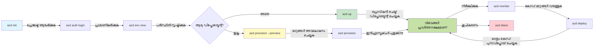
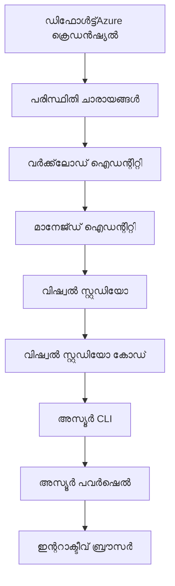

# AZD അടിസ്ഥാനങ്ങൾ - Azure Developer CLIയെ മനസിലാക്കുന്നു

# AZD അടിസ്ഥാനങ്ങൾ - കോർ ആശയങ്ങളും അടിസ്ഥാനങ്ങളും

**അധ്യായ നാവിഗേഷൻ:**
- **📚 കോഴ്‌സ് ഹോം**: [AZD For Beginners](../../README.md)
- **📖 നിലവിലെ അധ്യായം**: അധ്യായം 1 - അടിസ്ഥാനവും ക്വിക്ക് സ്റ്റാർട്ടും
- **⬅️ മുൻപത്തെ**: [കോഴ്‌സ് അവലോകനം](../../README.md#-chapter-1-foundation--quick-start)
- **➡️ അടുത്തത്**: [ഇൻസ്റ്റലേഷൻ & സെറ്റ്‌അപ്പ്](installation.md)
- **🚀 അടുത്ത അധ്യായം**: [അധ്യായം 2: AI-ഫസ്റ്റ് ഡെവലപ്‌മെന്റ്](../chapter-02-ai-development/microsoft-foundry-integration.md)

## പരിചയം

ഈ പാഠം Azure Developer CLI (azd) യെ പരിചയപ്പെടുത്തുന്നു, ഇത് നിങ്ങളുടെ ലൊക്കൽ ഡെവലപ്‌മെന്റിൽ നിന്ന് Azure ഡിപ്പ്ലോയ്മെന്റിലേക്ക് യാത്ര വേഗത്തിലാക്കുന്ന ശക്തമായ കമാൻഡ്-ലൈൻ ടൂൾ ആണ്. നിങ്ങൾ അടിസ്ഥാന ആശയങ്ങളും കോർ പ്രത്യേകതകളും പഠിക്കുകയും azd ക്ലൗഡ്-നേറ്റീവ് അപ്ലിക്കേഷൻ ഡിപ്പ്ലോയ്മെന്റ് എളുപ്പമാക്കുന്നത് എങ്ങനെയാണ് എന്നത് മനസിലാക്കും.

## പഠന ലക്ഷ്യങ്ങൾ

ഈ പാഠം അവസാനിക്കും മുമ്പ്, നിങ്ങൾ ഇങ്ങനെ ചെയ്യാൻ കഴിയും:
- Azure Developer CLI എന്താണെന്നും അതിന്റെ പ്രാഥമിക ലക്ഷ്യവും മനസിലാക്കുക
- ടെംപ്ലേറ്റുകൾ, പരിസരങ്ങൾ, സേവനങ്ങൾ എന്നിവയുടെ കോർ ആശയങ്ങൾ പഠിക്കുക
- ടെംപ്ലേറ്റ്-ഡ്രിവൻ ഡെവലപ്‌മെന്റ്, ഇൻഫ്രാസ്ട്രക്ചർ എസ്സ് കോഡ് എന്നിവ ഉൾപ്പെടെയുള്ള പ്രധാന ഫീച്ചറുകൾ പരിശോധിക്കുക
- azd പ്രോജക്ട് ഘടനയും പ്രവൃത്തി പ്രവാഹവും മനസിലാക്കുക
- നിങ്ങളുടെ ഡെവലപ്‌മെന്റ് പരിസ്ഥിതിക്ക് azd ഇൻസ്റ്റാൾ ചെയ്യാനും കോൺഫിഗർ ചെയ്യാനും തയ്യാറാകുക

## പഠന ഫലങ്ങൾ

ഈ പാഠം പൂർത്തിയാക്കിയപ്പോള്‍, നിങ്ങൾ കഴിയും:
- ആധുനിക ക്ലൗഡ് ഡെവലപ്‌മെന്റ് പ്രവൃത്തി പ്രക്രിയകളിൽ azd യുടെ പങ്ക് വിശദീകരിക്കുക
- azd പ്രോജക്ട് ഘടനയിലെ ഘടകങ്ങൾ തിരിച്ചറിയുക
- ടെംപ്ലേറ്റുകൾ, പരിസരങ്ങൾ, സേവനങ്ങൾ എങ്ങനെയാണ് ഒത്തുചേർന്ന് പ്രവർത്തിക്കുന്നത് എന്ന് വിവരിക്കുക
- azd ഉപയോഗിച്ചുള്ള ഇൻഫ്രാസ്ട്രക്ചർ എസ്സ് കോഡിന്റെ ഗുണങ്ങൾ മനസിലാക്കുക
- വ്യത്യസ്ത azd കമാൻഡുകളും അവയുടെ ഉപയോഗങ്ങളും തിരിച്ചറിയുക

## Azure Developer CLI (azd) എന്താണ്?

Azure Developer CLI (azd) നിങ്ങളുടെ ലൊക്കൽ ഡെവലപ്‌മെന്റിൽ നിന്ന് Azure ഡിപ്പ്ലോയ്മെന്റിലേക്ക് നിങ്ങളുടെ യാത്ര വേഗത്തിലാക്കാൻ രൂപകല്പന ചെയ്ത കമാൻഡ്-ലൈൻ ടൂൾ ആണ്. ഇത് Azure-ൽ ക്ലൗഡ്-നേറ്റീവ് അപ്ലിക്കേഷനുകൾ നിർമ്മിക്കുക, ഡിപ്പ്ലോയ് ചെയ്യുക, മാനേജ് ചെയ്യുക എന്ന പ്രക്രിയ എളുപ്പമാക്കുന്നു.

### azd ഉപയോഗിച്ച് നിങ്ങൾ എന്തെല്ലാം ഡിപ്പ്ലോയ് ചെയ്യാൻ കഴിയും?

azd വിവിധ തരത്തിലുള്ള വർക്ക് ലോഡുകൾക്ക് പിന്തുണയുള്ളതാണ്—പട്ടിക തുടുക്കുകയാണ്. ഇന്ന്, നിങ്ങൾ azd ഉപയോഗിച്ച് ഡിപ്പ്ലോയ് ചെയ്യാൻ കഴിയും:

| വർക്ക് ലോഡ് തരം | ഉദാഹരണങ്ങൾ | അതേ പ്രവൃത്തി പ്രവാഹമോ? |
|---------------|----------|----------------|
| **പരമ്പരാഗത അപ്ലിക്കേഷനുകൾ** | വെബ് ആപ്പുകൾ, REST APIs, സ്‌റ്റാറ്റിക്ക് സൈറ്റുകൾ | ✅ `azd up` |
| **സേവനങ്ങളും മൈക്രോസേവനങ്ങളും** | കണ്ടെയ്‌നർ ആപ്പുകൾ, ഫംഗ്ഷൻ ആപ്പുകൾ, നിരവധി സേവന ബാക്ക്‌എൻഡുകൾ | ✅ `azd up` |
| **AI പിന്തുണയുള്ള അപ്ലിക്കേഷനുകൾ** | Microsoft Foundry മോഡലുകളോടുകൂടെ ചാറ്റ് ആപ്പുകൾ, AI സെർച്ചുമായി RAG സംസാധനങ്ങൾ | ✅ `azd up` |
| **ബുദ്ധിമത്തമുള്ള ഏജന്റുകൾ** | Foundry-ലൊതുക്കിയ ഏജന്റുകൾ, ബഹുഏജന്റ് ഓർക്കസ്‌ട്രേഷനുകൾ | ✅ `azd up` |

പ്രധാന അറിവ് എന്തെന്നാല്‍ **നിങ്ങൾ എന്തു ഡിപ്പ്ലോയ് ചെയ്യുകയാണെങ്കിലും azd ലെ ജീവിതചക്രം ഒരേപോലെ തുടരും**. നിങ്ങൾ ഒരു പ്രോജക്ട് ആരംഭിക്കുന്നു, ഇൻഫ്രാസ്ട്രക്ചർ പ്രൊവിഷൻ ചെയ്യുന്നു, നിങ്ങളുടെ കോഡ് ഡിപ്പ്ലോയ് ചെയ്യുന്നു, നിങ്ങളുടെ ആപ്പ് നിരീക്ഷിക്കുന്നു, ക്ലീൻ അപ്പ് ചെയ്യുന്നു—ഇവ എല്ലാം ലളിതമായ വെബ്സൈറ്റോ സങ്കീರ್ಣമായ AI ഏജന്റോ ആകാം.

ഇത് രൂപകല്പന ചെയ്തതാണ്. azd AI ശേഷികളെ നിങ്ങളുടെ അപ്ലിക്കേഷൻ ഉപയോഗിക്കാവുന്ന മറ്റൊരു സേവനമായാണ് പരിഗണിക്കുന്നത്, അടിസ്ഥാനപരമായി വ്യത്യസ്തമായ ഒന്നായി അല്ല. Microsoft Foundry മോഡലുകളാൽ പിന്തുണയ്ക്കുന്ന ചാറ്റ് എന്റ്പോയിൻറ് azd കാഴ്ചപ്പാടിൽ മറ്റൊരു സേവനമായി മാത്രം تنظیم ചെയ്യാനും ഡിപ്പ്ലോയ് ചെയ്യാനും കൂടിയാണ്.

### 🎯 എന്തുകൊണ്ട് AZD ഉപയോഗിക്കണം? യാഥാർത്ഥ്യ അഭ്യസ്തവിദ്യാമായൊരു താരതമ്യം

ഒരു ലളിതമായ വെബ് ആപ്പ് ഡാറ്റാബേസോടുകൂടി ഡിപ്പ്ലോയ് ചെയ്യുന്നതെങ്ങനെ എന്ന കാര്യത്തിൽ നമുക്ക് താരതമ്യം ചെയ്യാം:

#### ❌ AZD ഇല്ലാതെ: മാനുവൽ Azure ഡിപ്പ്ലോയ്മെന്റ് (30+ മിനിറ്റ്)

```bash
# ഘട്ടം 1: റിസോഴ്‌സ് ഗ്രൂപ്പ് സൃഷ്ടിക്കുക
az group create --name myapp-rg --location eastus

# ഘട്ടം 2: ആപ്പ് സർവീസ് പ്ലാൻ സൃഷ്ടിക്കുക
az appservice plan create --name myapp-plan \
  --resource-group myapp-rg \
  --sku B1 --is-linux

# ഘട്ടം 3: വെബ് ആപ്പ് സൃഷ്ടിക്കുക
az webapp create --name myapp-web-unique123 \
  --resource-group myapp-rg \
  --plan myapp-plan \
  --runtime "NODE:18-lts"

# ഘട്ടം 4: കോസ്മോസ് DB അക്കൗണ്ട് സൃഷ്ടിക്കുക (10-15 മിനിറ്റ്)
az cosmosdb create --name myapp-cosmos-unique123 \
  --resource-group myapp-rg \
  --kind MongoDB

# ഘട്ടം 5: ഡാറ്റാബേസ് സൃഷ്ടിക്കുക
az cosmosdb mongodb database create \
  --account-name myapp-cosmos-unique123 \
  --resource-group myapp-rg \
  --name tododb

# ഘട്ടം 6: കളക്ഷൻ സൃഷ്ടിക്കുക
az cosmosdb mongodb collection create \
  --account-name myapp-cosmos-unique123 \
  --resource-group myapp-rg \
  --database-name tododb \
  --name todos

# ഘട്ടം 7: കണക്ഷൻ സ്ട്രിംഗ് നേടുക
CONN_STR=$(az cosmosdb keys list \
  --name myapp-cosmos-unique123 \
  --resource-group myapp-rg \
  --type connection-strings \
  --query "connectionStrings[0].connectionString" -o tsv)

# ഘട്ടം 8: ആപ്പ് സെറ്റിംഗുകൾ ക്രമീകരിക്കുക
az webapp config appsettings set \
  --name myapp-web-unique123 \
  --resource-group myapp-rg \
  --settings MONGODB_URI="$CONN_STR"

# ഘട്ടം 9: ലോഗിംഗ് സജീവമാക്കുക
az webapp log config --name myapp-web-unique123 \
  --resource-group myapp-rg \
  --application-logging filesystem \
  --detailed-error-messages true

# ഘട്ടം 10: അപ്ലിക്കേഷൻ ഇൻസൈറ്റ്സ് സജ്ജമാക്കുക
az monitor app-insights component create \
  --app myapp-insights \
  --location eastus \
  --resource-group myapp-rg

# ഘട്ടം 11: ആപ്പ് ഇൻസൈറ്റ്സ് വെബ് ആപ്പുമായി ബന്ധിപ്പിക്കുക
INSTRUMENTATION_KEY=$(az monitor app-insights component show \
  --app myapp-insights \
  --resource-group myapp-rg \
  --query "instrumentationKey" -o tsv)

az webapp config appsettings set \
  --name myapp-web-unique123 \
  --resource-group myapp-rg \
  --settings APPINSIGHTS_INSTRUMENTATIONKEY="$INSTRUMENTATION_KEY"

# ഘട്ടം 12: അപ്ലിക്കേഷൻ ലോക്കലിൽ നിർമിക്കുക
npm install
npm run build

# ഘട്ടം 13: ഡിപ്ലോയ്മെന്റ് പാക്കേജ് സൃഷ്ടിക്കുക
zip -r app.zip . -x "*.git*" "node_modules/*"

# ഘട്ടം 14: അപ്ലിക്കേഷൻ ഡിപ്ലോയ് ചെയ്യുക
az webapp deployment source config-zip \
  --resource-group myapp-rg \
  --name myapp-web-unique123 \
  --src app.zip

# ഘട്ടം 15: കാത്തിരിക്കുക അതും പ്രവർത്തിക്കുമെന്ന് പ്രാർത്ഥിക്കുക 🙏
# (സ്വയമേവ പരിശോധനയില്ല, മാനുവൽ പരിശോധന ആവശ്യമാണ്)
```

**സമസ്യകൾ:**
- ❌ ഓർമ്മിക്കാനും ക്രമത്തിൽ നിർവഹിക്കാനും 15+ കമാൻഡുകൾ
- ❌ 30-45 മിനിറ്റ് മാനുവൽ പ്രവർത്തനം
- ❌ തെറ്റുകൾ ചെയ്യുന്നതിനുള്ള സാധ്യത (ടൈപ്പോ, തെറ്റായ പാരാമീറ്ററുകൾ)
- ❌ കണക്ഷൻ സ്റ്റ്രിംഗ്‌സ് ടെർമിനൽ ചരിത്രത്തിൽ കാണപ്പെടുന്നു
- ❌ എന്തെങ്കിലും തകരാറ് വന്നാൽ ഓട്ടോമാറ്റിക് റോള്ബാക്ക് ഇല്ല
- ❌ ടീം അംഗങ്ങൾക്ക് പകർത്താൻ ബുദ്ധിമുട്ട്
- ❌ ഓരോ തവണയും വ്യത്യസ്തം (പുനരുജ്ജീവിപ്പിക്കാൻ കഴിയാത്തത്)

#### ✅ AZD ഉപയോഗിച്ച്: ഓട്ടോമേറ്റഡ് ഡിപ്പ്ലോയ്മെന്റ് (5 കമാൻഡുകൾ, 10-15 മിനിറ്റ്)

```bash
# പടി 1: ടെംപ്ലേറ്റ് നിന്ന് ആരംഭിക്കുക
azd init --template todo-nodejs-mongo

# പടി 2: പ്രാമാണീകരിക്കുക
azd auth login

# പടി 3: പരിസരം സൃഷ്ടിക്കുക
azd env new dev

# പടി 4: മാറ്റങ്ങൾ പ്രിവ്യൂ ചെയ്യുക (ഐച്ഛികം എന്നാൽ ശുപാർശചെയ്യപ്പെടുന്നു)
azd provision --preview

# പടി 5: എല്ലാം വിന്യസിക്കുക
azd up

# ✨ പൂർത്തിയായി! എല്ലാം വിന്യസിക്കുകയും, കോൺഫിഗർ ചെയ്യുകയും, നിരീക്ഷിക്കുകയും ചെയ്തു
```

**ഗുണങ്ങൾ:**
- ✅ **5 കമാൻഡുകൾ** vs. 15+ മാനുവൽ പടികളോട്
- ✅ **10-15 മിനിറ്റ്** മൊത്തം സമയം (ഏകദേശം Azure കാത്തിരിക്കൽ)
- ✅ **കുറഞ്ഞ മാനുവൽ പിഴവുകൾ** - സ്ഥിരതയുള്ള, ടെംപ്ലേറ്റ്-ഡ്രിവൻ പ്രവൃത്തി പ്രവാഹം
- ✅ **സുരക്ഷിത രഹസ്യ കൈകാര്യംചെയ്യല്‍** - നിരവധി ടെംപ്ലേറ്റുകൾ Azure- മാനേജുചെയ്യുന്ന രഹസ്യ സംഭരണം ഉപയോഗിക്കുന്നു
- ✅ **പുനരാവൃത ഡിപ്പ്ലോയ്മെന്റ്** - ഓരോ തവണയും അതേ പ്രവൃത്തി പ്രവാഹം
- ✅ **പൂർണ്ണ പുനരുജ്ജീവനക്ഷമത** - ഓരോ തവണയും ഒരേ ഫലമാണ്
- ✅ **ടീം-സജ്ജം** - ആരും ആ കമാൻഡുകൾ ഉപയോഗിച്ച് ഡിപ്പ്ലോയ് ചെയ്യാം
- ✅ **Infrastructure as Code** - വേർഷൻ നിയന്ത്രിത Bicep ടെംപ്ലേറ്റുകൾ
- ✅ **ഉൾപ്രദേശം നിരീക്ഷണം** - ആപ്പ്ലിക്കേഷൻ ഇൻസൈറ്റ്സ് സ്വയം ക്രമീകരിക്കുന്നു

### 📊 സമയം & പിഴവു കുറവ്

| മെട്രിക് | മാനുവൽ ഡിപ്പ്ലോയ്മെന്റ് | AZD ഡിപ്പ്ലോയ്മെന്റ് | മെച്ചപ്പെടുത്തൽ |
|:-------|:------------------|:---------------|:------------|
| **കമാൻഡുകൾ** | 15+ | 5 | 67% കുറവ് |
| **സമയം** | 30-45 മിനിറ്റ് | 10-15 മിനിറ്റ് | 60% വേഗം |
| **പിഴവ് നിരക്ക്** | ~40% | <5% | 88% കുറവ് |
| **നിരന്തരത** | കുറഞ്ഞത് (മാനുവൽ) | 100% (ഓട്ടോമേറ്റഡ്) | പൂർണ്ണം |
| **ടീം ഓൺബോർഡിംഗ്** | 2-4 മണിക്കൂർ | 30 മിനിറ്റ് | 75% വേഗത്തിൽ |
| **റോള്ബാക്ക് സമയം** | 30+ മിനിറ്റ് (മാനുവൽ) | 2 മിനിറ്റ് (ഓട്ടോമേറ്റഡ്) | 93% വേഗം |

## കോർ ആശയങ്ങൾ

### ടെംപ്ലേറ്റുകൾ
ടെംപ്ലേറ്റുകൾ azd ന്റെ അടിസ്ഥാനമാണ്. അവ ഉൾക്കൊള്ളുന്നു:
- **അപ്ലിക്കേഷൻ കോഡ്** - നിങ്ങളുടെ സോഴ്‌സ് കോഡ്, ആശ്രിതങ്ങൾ
- **ഇൻഫ്രാസ്ട്രക്ചർ നിർവ്വചനം** - Bicep അല്ലെങ്കിൽ Terraform ഉപയോഗിച്ച് Azure റീസോഴ്‌സുകൾ നിർവ്വചിച്ചിരിക്കുന്നു
- **കോൺഫിഗറേഷൻ ഫയലുകൾ** - ക്രമീകരണങ്ങളും പാരിസ്ഥിതിക വ്യതിയാനങ്ങളും
- **ഡിപ്പ്ലോയ്മെന്റ് സ്ക്രിപ്റ്റുകൾ** - ഓട്ടോമേറ്റഡ് ഡിപ്പ്ലോയ്മെന്റ് പ്രവൃത്തി പ്രവാഹങ്ങൾ

### പരിസരങ്ങൾ
പരിസരങ്ങൾ വിവിധ ഡിപ്പ്ലോയ്മെന്റ് ലക്ഷ്യങ്ങളെ പ്രതിനിധീകരിക്കുന്നു:
- **ഡെവലപ്‌മെന്റ്** - ടെസ്റ്റും ഡെവലപ്‌മെന്റിനും
- **സ്റ്റേജിംഗ്** - പ്രീ-പ്രൊഡക്ഷൻ പരിസരം
- **പ്രൊഡക്ഷൻ** - ലൈവ് പ്രൊഡക്ഷൻ പരിസരം

ഓരോ പരിസരം കൊണ്ടുപോകുന്നത്:
- Azure റീസോഴ്‌സ് ഗ്രൂപ്പ്
- കോൺഫിഗറേഷൻ ക്രമീകരണങ്ങൾ
- ഡിപ്പ്ലോയ്മെന്റ് സ്ഥിതി

### സേവനങ്ങൾ
സേവനങ്ങൾ നിങ്ങളുടെ അപ്ലിക്കേഷന്റെ നിർമ്മിത ഘടകങ്ങളാണ്:
- **ഫ്രണ്ട്‌ല എൻഡ്** - വെബ് ആപ്ലിക്കേഷനുകൾ, SPAകൾ
- **ബാക്ക്‌ല എൻഡ്** - APIs, മൈക്രോസേവനങ്ങൾ
- **ഡാറ്റാബേസ്** - ഡാറ്റാ സംഭരണ സൊല്യൂഷൻസ്
- **സ്റ്റോറേജ്** - ഫയൽ, ബ്ലോബ് സ്റ്റോറേജ്

## പ്രധാന ഫീച്ചറുകൾ

### 1. ടെംപ്ലേറ്റ്-ഡ്രിവൻ ഡെവലപ്‌മെന്റ്
```bash
# ലഭ്യമായ ടെംപ്ലേറ്റുകൾ ബ്രൗസ് ചെയ്യുക
azd template list

# ഒരു ടെംപ്ലേറ്റിൽ നിന്ന് ആരംഭിക്കുക
azd init --template <template-name>
```

### 2. Infrastructure as Code
- **Bicep** - Azure ന്റെ ഡൊമെയ്ൻ-സ്പെസിഫിക് ലാംഗ്വേജ്
- **Terraform** - മൾട്ടി-ക്ലൗഡ് ഇൻഫ്രാസ്ട്രക്ചർ ടൂൾ
- **ARM ടെംപ്ലേറ്റുകൾ** - Azure Resource Manager ടെംപ്ലേറ്റുകൾ

### 3. ഇന്റഗ്രേറ്റഡ് വർക്‌ഫ്ലോകൾ
```bash
# പൂർത്തിയാക്കിയ വിന്യാസ പ്രവൃത്തി പ്രവാഹം
azd up            # പ്രൊവിഷൻ + വിന്യസിക്കുക, ഇത് ആദ്യ തവണസജ്ജമാക്കലിന് ഹാൻഡ്‌സ് ഓഫ് ആണ്

# 🧪 പുതിയത്: വിന്യാസ മാറ്റങ്ങൾ വിന്യാസത്തിന് മുമ്പ് മുൻദൃശ്യപ്പെടുത്തുക (സുരക്ഷിതം)
azd provision --preview    # മാറ്റങ്ങൾ നടത്താതെ വിന്യാസ വിന്യസനം സിമുലേറ്റ് ചെയ്യുക

azd provision     # നിങ്ങൾ വിന്യാസം അപ്ഡേറ്റ് ചെയ്താൽ ആസ്യൂർ വിഭവങ്ങൾ സൃഷ്ടിക്കുക
azd deploy        # അപ്ലിക്കേഷൻ കോഡ് വിന്യസിക്കുക അല്ലെങ്കിൽ അപ്ഡേറ്റ് ചെയ്ത ശേഷം പുനഃവിന്യസിക്കുക
azd down          # വിഭവങ്ങൾ ശുചിത്വം നടത്തുക
```

#### 🛡️ സെഫു ഇൻഫ്രാസ്ട്രക്ചർ പ്ലാനിംഗ് (പ്രിവ്യൂ)
`azd provision --preview` കമാൻഡ് സുരക്ഷിത ഡിപ്പ്ലോയ്മെന്റിന് തീർച്ചയായ മാറ്റം കൂട്ടുന്നു:
- **ഡ്രൈ-റൺ വിശകലനം** - എന്ത് നിർമ്മിക്കുകയും, മാറ്റുകയും, ഇല്ലാതാക്കുകയുമാകും എന്ന് കാണിക്കുന്നു
- **സീറോ റിസ്‌ക്ക്** - നിങ്ങളുടെ Azure പരിസരത്തിൽ യഥാർത്ഥ മാറ്റങ്ങൾ ഒന്നും വരുത്തുകയില്ല
- **ടീം സഹകരണം** - ഡിപ്പ്ലോയ്മെന്റിന് മുമ്പ് പ്രിവ്യൂ ഫലങ്ങൾ പങ്കിടുന്നു
- **ചെലവ് കണക്കുകൂട്ടൽ** - പ്രതിജ്ഞയ്ക്ക് മുമ്പ് വിഭവ ചെലവുകൾ മനസിലാക്കുന്നു

```bash
# ഉദാഹരണ പ്രിവ്യൂ പ്രവൃത്തി രീതി
azd provision --preview           # എന്ത് മാറും എന്ന് നോക്കുക
# ഔട്ട്പുട്ട് അവലോകനം ചെയ്യുക, സംഘത്തോടൊപ്പം ചര്‍ച്ച ചെയ്യുക
azd provision                     # ആത്മവിശ്വാസത്തോടെ മാറ്റങ്ങള്‍ നടപ്പാക്കുക
```

### 📊 കാഴ്ചപ്പാട്: AZD ഡെവലപ്‌മെന്റ് പ്രവൃത്തി പ്രവാഹം



**Workflow വിശദീകരണം:**
1. **Init** - ടെംപ്ലേറ്റോ പുതിയ പ്രോജക്ടോദ്യോഗത്തോടെ ആരംഭിക്കുക
2. **Auth** - Azureഉം ഓതൻറ്റിക്കേറ്റ് ചെയ്യുക
3. **Environment** - വേർതിരിച്ച ഡിപ്പ്ലോയ്മെന്റ് പരിസ്ഥിതി സൃഷ്ടിക്കുക
4. **Preview** - 🆕 എപ്പോഴും ഇൻഫ്രാസ്ട്രക്ചർ മാറ്റങ്ങൾ പ്രിവ്യൂ ചെയ്യുക (സുരക്ഷിത പരിശീലനം)
5. **Provision** - Azure വിഭവങ്ങൾ സൃഷ്ടിക്കുക/अप്ഡേറ്റ് ചെയ്യുക
6. **Deploy** - നിങ്ങളുടെ അപ്ലിക്കേഷൻ കോഡ് പുഷ് ചെയ്യുക
7. **Monitor** - അപ്ലിക്കേഷൻ പ്രകടനം നിരീക്ഷിക്കുക
8. **Iterate** - മാറ്റങ്ങൾ വരുത്തി കോഡ് പുനഃഡിപ്പ്ലോയ് ചെയ്യുക
9. **Cleanup** - അവസാനിച്ചപ്പോൾ വിഭവങ്ങൾ നീക്കം ചെയ്യുക

### 4. പരിസ്ഥിതി മാനേജ്‌മെന്റ്
```bash
# പരിതസ്ഥിതികൾ സൃഷ്ടിക്കുകയും നിയന്ത്രിക്കുകയും ചെയ്യുക
azd env new <environment-name>
azd env select <environment-name>
azd env list
```

### 5. എക്സ്റ്റൻഷനുകളും AI കമാൻഡുകളും

azd കോർ CLIയെ അപ്പുറം ശേഷികൾ കൂട്ടാൻ ഒരു എക്സ്റ്റൻഷൻ സിസ്റ്റം ഉപയോഗിക്കുന്നു. പ്രത്യേകിച്ച് AI വർക്ക്‌ലോഡുകൾക്കായി ഇത് വളരെ ഉപകാരപ്രദമാണ്:

```bash
# ലഭ്യമായ എക്സ്റ്റൻഷനുകൾ ലിസ്റ്റ് ചെയ്യുക
azd extension list

# ഫൗണ്ട്രി ഏജന്റ്സിന്റെ എക്സ്റ്റൻഷൻ ഇൻസ്റ്റാൾ ചെയ്യുക
azd extension install azure.ai.agents

# ഒരു മാനിഫെസ്റ്റ്‌ നിന്ന് ഒരു AI ഏജന്റ് പ്രോജക്ട് ആരംഭിക്കുക
azd ai agent init -m agent-manifest.yaml

# വിന്യസിച്ച ഏജന്റ് പരീക്ഷിക്കുക (പ്രതീക്ഷിത തരം അനുസരിച്ച് വൈകി പ്രവർത്തിക്കൽയും ആദ്യ ബൈറ്റ് ലഭിക്കാൻ ഉള്ള സമയം കാണിക്കുന്നു)
azd ai agent invoke

# AI-സഹായത്തോടെ വികസനത്തിനായി MCP സെർവർ ആരംഭിക്കുക (ആൽഫ)
azd mcp start
```

**എജന്റ് ലൈഫ് سائ്ക്കിള്‍, ആരംഭം മുതൽ അവസാനം വരെ.** നിങ്ങൾ `azure.ai.agents` ഇൻസ്റ്റാൾ ചെയ്താൽ, ഒരു സിംഗിൾ വർക്ക്‌ഫ്ലോ ആശയം നിന്ന് പ്രവർത്തിക്കുന്ന, നിരീക്ഷിക്കപ്പെടുന്ന ഏജന്റ് വരെ ഉണ്ടാക്കും. നിങ്ങൾക്കു പ്രഥമദിനം ഇതിൽ എല്ലാം ആവശ്യമില്ല—അവ ഉണ്ടെന്ന് മാത്രം അറിഞ്ഞിരിക്കുക:

| ഘട്ടം | കമാൻഡ് | അതു ചെയ്യുന്നത് |
|-------|---------|--------------|
| **സ്കാഫോൾഡ്** | `azd ai agent init -m <manifest>` | ഒരു മാണിഫസ്റ്റ് ഉപയോഗിച്ചു ഏജന്റ് പ്രോജക്ട് ജനറേറ്റ് ചെയ്യുക |
| **ടെസ്റ്റ്** | `azd ai agent invoke` | ഏജന്റിനെ വിളിച്ച് പ്രതികരണ സമയമറിയുക |
| **അളക്കുക** | `azd ai agent eval generate` | ഏജന്റിനുള്ള മൂല്യനിർണയ ഡാറ്റാസെറ്റ് സൃഷ്ടിക്കുക |
| **മികച്ചത്** | `azd ai agent optimize` | നിങ്ങളുടെ ഡാറ്റയെ അടിസ്ഥാനമാക്കി ഏജന്റ് നിർദ്ദേശങ്ങൾ ഒപ്റ്റിമൈസ് ചെയ്യുക |
| **പരിശോധന** | `azd ai agent endpoint show` | ലൈവ് എന്റ്ഫോയിന്റ് കോൺഫിഗറേഷൻ കാണുക |
| **ക്ലീൻ അപ്പ്** | `azd ai agent delete` | ഹോസ്റ്റുചെയ്ത ഏജന്റും അതിന്റെ എല്ലാ പതിപ്പും മായ്ക്കുക |

> എക്സ്റ്റൻഷനുകൾ വിശദമായി [അധ്യായം 2: AI-ഫസ്റ്റ് ഡെവലപ്‌മെന്റ്](../chapter-02-ai-development/agents.md) ലും [AZD AI CLI കമാൻഡുകൾ](../chapter-08-production/production-ai-practices.md#azd-ai-cli-commands-and-extensions) റഫറൻസിലും ഉൾക്കൊള്ളുന്നു.

## 📁 പ്രോജക്ട് ഘടന

സാധാരണ azd പ്രോജക്ട് ഘടന:
```
my-app/
├── .azd/                    # azd configuration
│   └── config.json
├── .azure/                  # Azure deployment artifacts
├── .devcontainer/          # Development container config
├── .github/workflows/      # GitHub Actions
├── .vscode/               # VS Code settings
├── infra/                 # Infrastructure code
│   ├── main.bicep        # Main infrastructure template
│   ├── main.parameters.json
│   └── modules/          # Reusable modules
├── src/                  # Application source code
│   ├── api/             # Backend services
│   └── web/             # Frontend application
├── azure.yaml           # azd project configuration
└── README.md
```

## 🔧 കോൺഫിഗറേഷൻ ഫയലുകൾ

### azure.yaml
പ്രധാന പ്രോജക്ട് കോൺഫിഗറേഷൻ ഫയൽ:
```yaml
name: my-awesome-app
metadata:
  template: my-template@1.0.0

services:
  web:
    project: ./src/web
    language: js
    host: appservice
  api:
    project: ./src/api
    language: js
    host: appservice

hooks:
  preprovision:
    shell: pwsh
    run: echo "Preparing to provision..."
```

### .azure/config.json
പരിസ്ഥിതി-പ്രത്യേക കോൺഫിഗറേഷൻ:
```json
{
  "version": 1,
  "defaultEnvironment": "dev",
  "environments": {
    "dev": {
      "subscriptionId": "your-subscription-id",
      "location": "eastus"
    }
  }
}
```

## 🎪 സാധാരണ പ്രവൃത്തി പ്രവാഹങ്ങൾ പ്രായോഗിക അഭ്യാസങ്ങളോടെ

> **💡 പഠന ടിപ്പ്:** നിങ്ങളുടെ AZD കഴിവുകൾ ക്രമാനുസൃതമായി വളർത്താൻ ഈ അഭ്യാസങ്ങൾ പിന്തുടരുക.

### 🎯 അഭ്യാസം 1: നിങ്ങളുടെ ആദ്യ പ്രോജക്ട് ഇൻഷിയലൈസ് ചെയ്യുക

**ലക്ഷ്യം:** AZD പ്രോജക്ട് സൃഷ്ടിച്ച് അതിന്റെ ഘടന ഓർക്കുക

**പടிகள்:**
```bash
# തെളിഞ്ഞ മാതൃക ഉപയോഗിക്കുക
azd init --template todo-nodejs-mongo

# സൃഷ്ടിച്ച ഫയലുകൾ പരിശോധിക്കുക
ls -la  # മറഞ്ഞിരിക്കുന്നവ അടക്കം എല്ലാ ഫയലുകളും കാണുക

# സൃഷ്ടിച്ച പ്രധാന ഫയലുകൾ:
# - azure.yaml (പ്രധാന ക്രമീകരണം)
# - infra/ (അടിസ്ഥാന ഘടനാ കോഡ്)
# - src/ (ആപ്ലിക്കേഷൻ കോഡ്)
```

**✅ വിജയം:** നിങ്ങൾക്കുണ്ട് azure.yaml, infra/, src/ ഡയറക്ടറികൾ

---

### 🎯 അഭ്യാസം 2: Azure ലേക്ക് ഡിപ്പ്ലോയ് ചെയ്യുക

**ലക്ഷ്യം:** തുടക്കം മുതൽ അവസാനം വരെ ഡിപ്പ്ലോയ്മെന്റ് പൂർത്തിയാക്കുക

**പടികൾ:**
```bash
# 1. പ്രാമാണീകരിക്കുക
az login && azd auth login

# 2. പരിസ്ഥിതി സൃഷ്ടിക്കുക
azd env new dev
azd env set AZURE_LOCATION eastus

# 3. മാറ്റങ്ങൾ മുമ്പ്യേദിക്കുക (ശുപാർശ ചെയ്യുന്നவை)
azd provision --preview

# 4. എല്ലാം വിന്യസിക്കുക
azd up

# 5. വിന്യസനം ശരിയാണെന്ന് സ്ഥിരീകരിക്കുക
azd show    # നിങ്ങളുടെ ആപ്പ് URL കാണുക
```

**ആശയം സമയമാകും:** 10-15 മിനിറ്റ്  
**✅ വിജയം:** ആപ്പ്ലിക്കേഷൻ URL ബ്രൗസറിൽ തുറക്കുന്നു

---

### 🎯 അഭ്യാസം 3: അതേ സമയത്ത്‌ ഒന്നിലധികം പരിസരങ്ങൾ

**ലക്ഷ്യം:** ഡെവ്, സ്റ്റേജിങ് ഇൻവയ്റൺമെന്റുകളിൽ ഡിപ്പ്ലോയ് ചെയ്യുക

**പടികൾ:**
```bash
# ഇതിനകം ഡെവ് ഉണ്ടെങ്കിൽ, സ്റ്റേജിംഗ് സൃഷ്ടിക്കുക
azd env new staging
azd env set AZURE_LOCATION westus2
azd up

# അവയിൽ ഇടയിലായി സ്വിച്ച് ചെയ്യുക
azd env list
azd env select dev
```

**✅ വിജയം:** Azure പോർട്ടലിൽ രണ്ട് വേർതിരിച്ച റീസോഴ്‌സ് ഗ്രൂപ്പുകൾ

---

### 🛡️ ക്ലീൻ സ്റ്റേറ്റ്: `azd down --force --purge`

നിങ്ങൾ മുഴുവൻ പൂർണമായും റീസെറ്റ് ചെയ്യേണ്ടതിന്:

```bash
azd down --force --purge
```

**എന്ത് ചെയ്യും:**
- `--force`: സ്ഥിരീകരണ പ്രാമ്പുകൾ ഇല്ലാതെ
- `--purge`: എല്ലാ ലോക്കൽ നിലയും Azure വിഭവങ്ങളും ഇല്ലാതാക്കും

**ഇപ്പോൾ ഉപയോഗിക്കുക:**
- ഡിപ്പ്ലോയ്മെന്റ് പാതി വഴി പരാജയപ്പെട്ടു എങ്കിൽ
- പ്രോജക്ടുകൾ മാറുമ്പോൾ
- പുതിയ തുടക്കം വേണ്ടപ്പെട്ടപ്പോൾ

---

## 🎪 ഒറിജിനൽ പ്രവർത്തി പ്രവാഹ റഫറൻസ്

### പുതിയ പ്രോജക്ട് ആരംഭിക്കൽ
```bash
# രീതി 1: നിലവിലുള്ള ടെംപ്ലേറ്റ് ഉപയോഗിക്കുക
azd init --template todo-nodejs-mongo

# രീതി 2: മൂടുക തുരത്തുക
azd init

# രീതി 3: നിലവിലെ ഡയറക്ടറി ഉപയോഗിക്കുക
azd init .
```

### ഡെവലപ്‌മെന്റ് സൈകിൾ
```bash
# വികസന പരിസ്ഥിതി സജ്ജീകരിക്കുക
azd auth login
azd env new dev
azd env select dev

# എല്ലാം വിന്യസിക്കുക
azd up

# മാറ്റങ്ങൾ വരുത്തി വീണ്ടും വിന്യസിക്കുക
azd deploy

# ജോലി കഴിഞ്ഞാൽ ശുചീകരണം നടത്തുക
azd down --force --purge # Azure Developer CLI-യിലുള്ള കമാൻഡ് നിങ്ങളുടെ പരിസ്ഥിതിക്ക് **ഹാർഡ് റീസെറ്റ്** ആണ് - പ്രത്യേകിച്ച് പരാജയപ്പെട്ട വിന്യാസങ്ങൾ തിരുത്തുമ്പോൾ, ഒറഫാന്ഡ് റിസോഴ്‌സുകൾ ശുചീകരിക്കുമ്പോൾ, അല്ലെങ്കിൽ പുതിയ വിന്യാസത്തിനായി തയ്യാറാകുമ്പോൾ ഉപകാരപ്രദമാണ്.
```

## `azd down --force --purge` മനസ്സിലാക്കുക
`azd down --force --purge` കമാൻഡ് നിങ്ങളുടെ azd പരിസ്ഥിതിയും ബന്ധപ്പെട്ട എല്ലാ വിഭവങ്ങളും പൂർണമായി മാറ്റിവയ്ക്കാനുള്ള ശക്തമായ മാർഗമാണ്. ഓരോ ഫ്ലാഗും ചെയ്യുന്നതിന്‍റെ വിശദീകരണം ഇതാണ്:
```
--force
```
 - സ്ഥിരീകരണ പ്രാമ്പുകളിൽ നിന്ന് ഒഴിവാക്കുന്നു.
- മാനുവൽ ഇൻപുട്ട് കഴിയാത്ത ഓട്ടോമേഷൻ അല്ലെങ്കിൽ സ്ക്രിപ്റ്റിനുള്ളത്.
- CLI വെല്ലുവിളികൾ കണ്ടെത്തിയാലും ഇടപെടലില്ലാതെ ടിയർമെത്തുന്നു.

```
--purge
```
 എല്ലാ ബന്ധപ്പെടുത്തി മെടാഡേറ്റയും ഇല്ലാതാക്കുന്നു, ഉം:
പരിസരത്തിന്റെ നില
ലോക്കൽ `.azure` ഫോൾഡർ
കാഷേ ചെയ്‌ത ഡിപ്പ്ലോയ്മെന്റ് വിവരങ്ങൾ
azd മുമ്പത്തെ ഡിപ്പ്ലോയ്മെന്റ് "ഓർമ്മിക്കാൻ" തടയുന്നു, ഇത് റീസോഴ്‌സ് ഗ്രൂപ്പുകൾ പൊരുത്തക്കേടുകൾ അല്ലെങ്കിൽ പഴയ രജിസ്ട്രി റഫറൻസുകൾ പോലുള്ള പ്രശ്നങ്ങൾ ഉണ്ടാകാൻ ഇടയാക്കും.


### എന്തിന് ഇരുവരും ഉപയോഗിക്കുക?
നിങ്ങൾക്ക് `azd up` ഉപയോഗിക്കുമ്പോൾ നില നിലവാരത്തെ അല്ലെങ്കിൽ ഭാഗിക ഡിപ്പ്ലോയ്മെന്റ് കാരണം തടസ്സം വെച്ചപ്പോൾ, ഈ സംഗതികൾ ഒരു **ശുദ്ധമായ തുടക്കം** ഉറപ്പാക്കും.

ഇത് പ്രത്യേകിച്ച് Azure പോർട്ടലിൽ മാനുവൽ വിഭവങ്ങൾ ഇല്ലാതാക്കുമ്പോഴും ടെംപ്ലേറ്റുകൾ, പരിസരങ്ങൾ, റീസോഴ്‌സ് ഗ്രൂപ്പ് നാമകരണം മാറ്റുമ്പോഴും സഹായിക്കുന്നു.


### ഒരേ സമയത്ത്‌ ഒന്നിലധികം പരിസരങ്ങൾ കൈകാര്യം ചെയ്യുന്നു
```bash
# സ്റ്റേജിംഗ് പരിസരം സൃഷ്ടിക്കുക
azd env new staging
azd env select staging
azd up

# ഡെവിലേക്ക് മടക്കി മാറുക
azd env select dev

# പരിസരങ്ങൾ താരതമ്യം ചെയ്യുക
azd env list
```

## 🔐 ഓതന്റിക്കേഷൻ & ക്രെഡൻഷ്യലുകൾ

ഓതന്റിക്കേഷൻ മനസ്സിലാക്കുന്നത് വിജയകരമായ azd ഡിപ്പ്ലോയ്മെന്റിനായി അത്യന്താപേക്ഷിതമാണ്. Azure അനേകം ഓതന്റിക്കേഷൻ രീതികൾ ഉപയോഗിക്കുന്നു, azd മറ്റ് Azure ടൂളുകൾ ഉപയോഗിക്കുന്ന സമാന ക്രെഡൻഷ്യൽ ചെയിന് ഉപയോഗിക്കുന്നു.

### Azure CLI ഓതന്റിക്കേഷൻ (`az login`)

azd ഉപയോഗിക്കുന്നതിന് മുൻപ്, നിങ്ങൾക്ക് Azure ഉപയോഗിച്ച് ഓതന്റിക്കേറ്റ് ചെയ്യണമെന്ന് അഭ്യർത്ഥിക്കുന്നു. സാധാരണ രീതി Azure CLI ഉപയോഗിക്കയാണ്:

```bash
# ഇന്ററാക്ടീവ് ലോഗിൻ (ബ്രൗസർ തുറക്കും)
az login

# പ്രത്യേക ടെന്നന്റുമായി ലോഗിൻ ചെയ്യുക
az login --tenant <tenant-id>

# സർവീസ് പ്രിൻസിപ്പലുമായുള്ള ലോഗിൻ
az login --service-principal -u <app-id> -p <password> --tenant <tenant-id>

# നിലവിലുള്ള ലോഗിൻ നില പരിശോധിക്കുക
az account show

# ലഭ്യമായ സബ്സ്ക്രിപ്ഷനുകൾ പട്ടികപ്പെടുത്തുക
az account list --output table

# ഡീഫോൾട്ട് സബ്സ്ക്രിപ്ഷൻ സജ്ജമാക്കുക
az account set --subscription <subscription-id>
```

### ഓതന്റിക്കേഷൻ ഫ്ലോ
1. **ഇന്ററാക്ടീവ് ലോഗിൻ**: നിങ്ങളുടെ ഡിഫോൾട്ട് ബ്രൗസർ ഓതന്റിക്കേഷനായി തുറക്കുന്നു
2. **ഡിവൈസ് കോഡ് ഫ്ലോ**: ബ്രൗസർ ആക്സസ് ഇല്ലാത്ത പരിസരങ്ങൾക്ക്
3. **സെർവീസ് പ്രിൻസിപ്പൽ**: ഓട്ടോമേഷൻ, CI/CD സിനാരിയോകൾക്കായി
4. **മാനേജുഡ് ഐഡന്റിറ്റി**: Azure ഹോസ്റ്റുചെയ്ത അപ്ലിക്കേഷനുകൾക്കായി

### DefaultAzureCredential ചെയിന്

`DefaultAzureCredential` ഒരു ക്രെഡൻഷ്യൽ തരമാണ്, ഇത് പ്രത്യേകമായ ഒരു ക്രമത്തിൽ പല തരത്തിലുള്ള ക്രെഡൻഷ്യൽ ഉറവിടങ്ങൾ സ്വയം പരീക്ഷിച്ചുകൊണ്ട് ലളിതമായ ഓതന്റിക്കേഷൻ അനുഭവം നൽകുന്നു:

#### ക്രെഡൻഷ്യൽ ചെയിന് ഓർഡർ


#### 1. പരിസ്ഥിതി വ്യതിയാനങ്ങൾ
```bash
# സർവീസ് പ്രിൻസിപ്പലിന് വേണ്ടി പരിസ്ഥിതി മൂല്യങ്ങൾ ക്രമീകരിക്കുക
export AZURE_CLIENT_ID="<app-id>"
export AZURE_CLIENT_SECRET="<password>"
export AZURE_TENANT_ID="<tenant-id>"
```

#### 2. വർക്ക്ലോഡ് ഐഡന്റിറ്റി (കുബെർനെറ്റീസ്/ഗിറ്റ് ഹബ് ആക്ഷൻസ്)
സ്വയം ഉപയോഗിക്കുന്നു:
- Azure Kubernetes Service (AKS) വർക്ക്ലോഡ് ഐഡന്റിറ്റിയോടുകൂടെ
- GitHub ആക്ഷനുകളിലുളള OIDC ഫെഡറേഷൻ
- മറ്റു ഫെഡറേറ്റഡ് ഐഡന്റിറ്റി സിനാരിയോകൾ

#### 3. മാനേജുഡ് ഐഡന്റിറ്റി
Azure റീസോഴ്‌സുകൾക്കായി:
- വെർച്ച്വൽ മെഷീനുകൾ
- ആപ്പ് സർവീസ്
- Azure ഫംഗ്ഷനുകൾ
- കണ്ടെയ്‌നർ ഇൻസ്റ്‌യൻസുകൾ

```bash
# മാനേജ് ചെയ്ത ഐഡന്റിറ്റിയുള്ള Azure റിസോഴ്‌സിൽ നടത്തിപ്പ് നടക്കുന്നുണ്ടോ എന്ന് ചെക്ക് ചെയ്യുക
az account show --query "user.type" --output tsv
# manage ചെയ്ത ഐഡന്റിറ്റി ഉപയോഗിക്കുന്നുവെങ്കിൽ: "servicePrincipal" നൽകുന്നു
```

#### 4. ഡെവലപ്പർ ടൂൾസ് ഇന്റഗ്രേഷൻ
- **Visual Studio**: സ്വയം സൈൻ-ഇൻറ് ചെയ്ത അക്കൗണ്ട് ഉപയോഗിക്കുന്നു
- **VS കോഡ്**: Azure അക്കൗണ്ട് എക്സ്റ്റൻഷൻ ക്രെഡൻഷ്യലുകൾ ഉപയോഗിക്കുന്നു
- **Azure CLI**: `az login` ക്രെഡൻഷ്യലുകൾ ഉപയോഗിക്കുന്നു (ലൊക്കൽ ഡെവല്പ്മെന്റിന് ഏറ്റവും പൊതുവായത്)

### AZD ഓതന്റിക്കേഷൻ സജ്ജീകരണം

```bash
# രീതി 1: Azure CLI ഉപയോഗിക്കുക (വികസനത്തിന് ശിപാർശ ചെയ്യുന്നു)
az login
azd auth login  # നിലവിലുള്ള Azure CLI ക്രെഡൻഷ്യലുകൾ ഉപയോഗിക്കുന്നു

# രീതി 2: നേരിട്ടുള്ള azd പ്രാമാണികീകരണം
azd auth login --use-device-code  # ഹെഡ്‌ലസ് അന്തരീക്ഷങ്ങൾക്ക്

# രീതി 3: പ്രാമാണികീകരണ നില പരിശോധിക്കുക
azd auth login --check-status

# രീതി 4: ലോഗൗട്ട് ചെയ്ത് വീണ്ടും പ്രാമാണികീകരിക്കുക
azd auth logout
azd auth login
```

### ഓതന്റിക്കേഷൻ മികച്ച നടപടി രീതി

#### ലോക്കൽ ഡെവലപ്‌മെന്റിനായുള്ളത്

```bash
# 1. Azure CLI ഉപയോഗിച്ച് ലോഗിൻ ചെയ്യുക
az login

# 2. ശരിയായ സബ്‌സ്‌ക്രിപ്ഷൻ പരിശോധിക്കുക
az account show
az account set --subscription "Your Subscription Name"

# 3. നിലവിലുള്ള ക്രെഡൻഷ്യലുകളുമായി azd ഉപയോഗിക്കുക
azd auth login
```

#### CI/CD പൈപ്പ്ലൈനുകൾക്ക്
```yaml
# GitHub Actions example
- name: Azure Login
  uses: azure/login@v1
  with:
    creds: ${{ secrets.AZURE_CREDENTIALS }}

- name: Deploy with azd
  run: |
    azd auth login --client-id ${{ secrets.AZURE_CLIENT_ID }} \
                    --client-secret ${{ secrets.AZURE_CLIENT_SECRET }} \
                    --tenant-id ${{ secrets.AZURE_TENANT_ID }}
    azd up --no-prompt
```

#### പ്രൊഡക്ഷൻ പരിതസ്ഥിതികൾക്ക്
- Azure റിസോഴ്സുകളിൽ ഓടുമ്പോൾ **Managed Identity** ഉപയോഗിക്കുക
- ഓട്ടോമേഷൻ സീനാരിയോകള്ക്ക് **Service Principal** ഉപയോഗിക്കുക
- കോഡ് അല്ലെങ്കിൽ കോൺഫിഗറേഷൻ ഫയലുകളിൽ ക്രെഡൻഷ്യലുകൾ സേവ് ചെയ്യുന്നത് ഒഴിവാക്കുക
- സენსിറ്റീവ് കോൺഫിഗറേഷനുകൾക്ക് **Azure Key Vault** ഉപയോഗിക്കുക

### പൊതുവായ ഓതന്റിക്കേഷൻ പ്രശ്നങ്ങളും പരിഹാരങ്ങളും

#### പ്രശ്നം: "Subscription കണ്ടെത്തിയില്ല"
```bash
# പരിഹാരം: ഡിഫോൾട്ട് സബ്സ്ക്രിപ്ഷൻ സജ്ജമാക്കുക
az account list --output table
az account set --subscription "<subscription-id>"
azd env set AZURE_SUBSCRIPTION_ID "<subscription-id>"
```

#### പ്രശ്നം: "അനുമതികൾ കുറവാണ്"
```bash
# പരിഹാരം: ആവശ്യമായ റോളുകൾ പരിശോധിച്ച് നൽകുക
az role assignment list --assignee $(az account show --query user.name --output tsv)

# പൊതുവിലുള്ള ആവശ്യമായ റോളുകൾ:
# - കോൺട്രിബ്യൂട്ടർ (സ്രോതസ്സ് മാനേജ്മെന്റിന്)
# - യൂസർ ആക്സസ് അഡ്മിനിസ്‌ട്രേറ്റർ (രോൾ അസൈൻമെന്റുകൾക്കായി)
```

#### പ്രശ്നം: "ടോക്കൺ കാലഹരണപ്പെട്ടു"
```bash
# പരിഹാരം: വീണ്ടും പ്രാമാണീകരിക്കുക
az logout
az login
azd auth logout
azd auth login
```

### വ്യത്യസ്ത സീനാരിയോകളിലെ ഓതന്റിക്കേഷൻ

#### ലൊക്കൽ ഡെവലപ്പ്മെന്റ്
```bash
# വ്യക്തിഗത വികസന അക്കൗണ്ട്
az login
azd auth login
```

#### ടീം ഡെവലപ്പ്മെന്റ്
```bash
# സംഘടനക്കായി പ്രത്യേക ടെനന്റ് ഉപയോഗിക്കുക
az login --tenant contoso.onmicrosoft.com
azd auth login
```

#### മൾട്ടി-ടെന്നന്റ് സീനാരിയോസ്
```bash
# വാടകക്കാരെ മുറുകെ മാറ്റുക
az login --tenant tenant1.onmicrosoft.com
# വാടകക്കാരന് 1 പ്രയോഗിക്കുക
azd up

az login --tenant tenant2.onmicrosoft.com  
# വാടകക്കാരന് 2 പ്രയോഗിക്കുക
azd up
```

### സുരക്ഷാ പരിഗണനകൾ

1. **ക്രെഡൻഷ്യൽ സംഭരണം**: ക്രെഡൻഷ്യലുകൾ സോഴ്‌സ് കോഡിൽ ചേർക്കരുത്
2. **സ്കോപ്പ് പരിധി**: സർവീസ് പ്രിൻസിപ്പലുകൾക്ക് ഏറ്റവും കുറവ് അഡ്മിനിസ്ട്രേറ്റീവ് അവകാശങ്ങൾ നൽകുക
3. **ടോക്കൺ റൊട്ടേഷൻ**: സർവീസ് പ്രിൻസിപ്പലിന്റെ രഹസ്യങ്ങൾ regelmäßig അഡ്ജസ്റ്റ് ചെയ്യുക
4. **ഓഡിറ്റ് ട്രെയിൽ**: ഓതന്റിക്കേഷൻ, ഡിപ്ലോയ്മെന്റ് പ്രവർത്തനങ്ങൾ നിരീക്ഷിക്കുക
5. **നെറ്റ്‌വർക്ക് സുരക്ഷ**: പ്രൈവറ്റ് എൻഡ്പോയിന്റുകൾ ഉപയോഗിക്കുക

### ഓതന്റിക്കേഷനിൽ തകരാറുകൾ പരിഹരിക്കൽ

```bash
# സയൺ പ്രശ്‌നങ്ങൾ ഡീബഗ് ചെയ്യുക
azd auth login --check-status
az account show
az account get-access-token

# പൊതുവായ ഡയഗ്നോസ്റ്റിക് കമാൻഡുകൾ
whoami                          # നിലവിലെ ഉപയോക്തൃ സെറ്റ്‌റ്റിംഗ്
az ad signed-in-user show      # മൈക്രോസോഫ്റ്റ് എൻട്രാ ഐഡി ഉപയോക്തൃ വിശദാംശങ്ങൾ
az group list                  # റിസോഴ്‌സ് ആക്‌സസ് പരിശോധനാ
```

## `azd down --force --purge` ഓർക്കുക

### കണ്ടെത്തൽ
```bash
azd template list              # ടെംപ്ലേറ്റുകൾ ബ്രൗസ് ചെയ്യുക
azd template show <template>   # ടെംപ്ലേറ്റ് വിശദാംശങ്ങൾ
azd init --help               # ഇൻഷ്യലൈസേഷൻ ഓപ്ഷനുകൾ
```

### പ്രോജക്ട് മാനേജ്‌മെന്റ്
```bash
azd show                     # പ്രോജക്റ്റ് അവലോകനം
azd env list                # ലഭ്യമായ പരിസരങ്ങളും തിരഞ്ഞെടുത്ത ഡിഫോൾട്ട്
azd config show            # കോൺഫിഗറേഷൻ സജ്ജീകരണങ്ങൾ
```

### നിരീക്ഷിക്കൽ
```bash
azd monitor                  # അഷ്യൂർ പോർട്ടൽ നിരീക്ഷണം തുറക്കുക
azd monitor --logs           # അപ്ലിക്കേഷൻ ലോഗുകൾ കാണുക
azd monitor --live           # ലൈവ് മെട്രിക്‌സ് കാണുക
azd pipeline config          # CI/CD സജ്ജീകരിക്കുക
```

## അരുളപ്പെട്ട പ്രാക്ടീസുകൾ

### 1. അർത്ഥവത്തായ പേരുകൾ ഉപയോഗിക്കുക
```bash
# നല്ലത്
azd env new production-east
azd init --template web-app-secure

# ഒഴിവാക്കുക
azd env new env1
azd init --template template1
```

### 2. ടെംപ്ലേറ്റുകൾ പ്രയോജനം ചെയ്യുക
- നിലവിലുള്ള ടെംപ്ലേറ്റുകളിൽ നിന്ന് തുടങ്ങുക
- നിങ്ങളുടെ ആവശ്യങ്ങൾക്ക് 맞춤ം ചെയ്യുക
- നിങ്ങളുടെ സംഘടനയ്ക്കായി പുനരുപയോഗയോഗ്യമായ ടെംപ്ലേറ്റുകൾ സൃഷ്ടിക്കുക

### 3. പരിതസ്ഥിതി अलगावം
- ഡെവ്, സ്റ്റേജിംഗ്, പ്രൊഡിനായി വ്യത്യസ്ത പരിതസ്ഥിതികൾ ഉപയോഗിക്കുക
- ലൊക്കൽ മെഷീൻ നിന്നു നേരിട്ട് പ്രൊഡക്ഷനിലേക്ക് ഡിപ്ലോയ്മെന്റ് ചെയ്യരുത്
- പ്രൊഡക്ഷൻ ഡിപ്ലോയ്മെന്റുകൾക്ക് CI/CD പൈപ്പ്ലൈനുകൾ ഉപയോഗിക്കുക

### 4. കോൺഫിഗറേഷൻ മാനേജ്മെന്റ്
- സേന്സിറ്റീവ് ഡേറ്റയ്ക്ക് പരിതസ്ഥിതി വേരിയബിളുകൾ ഉപയോഗിക്കുക
- കോൺഫിഗറേഷൻ വേർഷൻ കൺട്രോളിൽ സൂക്ഷിക്കുക
- പരിതസ്ഥിതിക്ക് അനുയോജ്യമായ സജ്ജീകരണങ്ങൾ ഡോക്യുമെന്റ് ചെയ്യുക

## പഠന പുരോഗതി

### തുടക്കം (ആഴ്ച 1-2)
1. azd ഇൻസ്റ്റാൾ ചെയ്ത് ഓതന്റിക്കേറ്റ് ചെയ്യുക
2. ഒരു സിംപിൾ ടെംപ്ലോട്ട് ഡിപ്ലോയ് ചെയ്യുക
3. പ്രോജക്ട് ഘടന മനസിലാക്കുക
4. അടിസ്ഥാന കമാൻഡുകൾ പഠിക്കുക (up, down, deploy)

### ഇടനില (ആഴ്ച 3-4)
1. ടെംപ്ലേറ്റുകൾ കസ്റ്റമൈസ് ചെയ്യുക
2. എടുക്കുന്ന പരിതസ്ഥിതികൾ നിയന്ത്രിക്കുക
3. ഇൻഫ്രാസ്ട്രക്ചർ കോഡ് മനസ്സിലാക്കുക
4. CI/CD പൈപ്പ്ലൈനുകൾ സജ്ജമാക്കുക

### ഉയർന്നത് (ആഴ്ച 5+)
1. കസ്റ്റം ടെംപ്ലേറ്റുകൾ സൃഷ്ടിക്കുക
2. അതിമികച്ച ഇൻഫ്രാസ്ട്രക്ചർ മാതൃകകൾ
3. മൾട്ടി-റിയോൺ ഡിപ്ലോയ്മെന്റുകൾ
4. എന്റർപ്രൈസ്-ഗ്രേഡ് കോൺഫിഗറേഷനുകൾ

## തുടർന്ന് ചെയ്യാൻ കാര്യങ്ങൾ

**📖 അധ്യായം 1 പഠനം തുടരുക:**
- [Installation & Setup](installation.md) - azd ഇൻസ്റ്റാൾ ചെയ്ത് കോൺഫിഗർ ചെയ്യുക
- [Your First Project](first-project.md) - ഹാൻഡ്‌സ്-ഓൺ ട്യൂട്ടോറിയൽ പൂർത്തീകരിക്കുക
- [Configuration Guide](configuration.md) - ആധുനിക കോൺഫിഗറേഷൻ ഓപ്ഷനുകൾ

**🎯 അടുത്ത അധ്യായത്തിനായി തയ്യാറാവുന്നോ?**
- [Chapter 2: AI-First Development](../chapter-02-ai-development/microsoft-foundry-integration.md) - AI അപ്ലിക്കേഷനുകൾ വികസിപ്പിക്കാൻ തുടങ്ങി ശേഷം

## അധിക വിഭവങ്ങൾ

- [Azure Developer CLI അവലോകനം](https://learn.microsoft.com/en-us/azure/developer/azure-developer-cli/)
- [ടെംപ്ലേറ്റ് ഗ്യാലറി](https://azure.github.io/awesome-azd/)
- [കമ്മ്യൂണിറ്റി സാംപിളുകൾ](https://github.com/Azure-Samples)

---

## 🙋 പലപ്പോഴും ചോദിക്കുന്ന ചോദ്യങ്ങൾ

### പൊതു ചോദ്യങ്ങൾ

**Q: AZDനും Azure CLIനും有什么 വ്യത്യാസം?**

A: Azure CLI (`az`) എണ്ണം Azure റിസോഴ്സുകൾ നിയന്ത്രിക്കാൻ ആണ്. AZD (`azd`) മുഴുവൻ ആപ്ലിക്കേഷനുകൾ നിയന്ത്രിക്കാൻ ആണ്:

```bash
# Azure CLI - താഴ്ന്ന നിലയിലെ വിഭവം മാനേജ്മെന്റ്
az webapp create --name myapp --resource-group rg
az sql server create --name myserver --resource-group rg
# ...കൂടുതൽ പല കമാൻഡുകളും ആവശ്യമാണ്

# AZD - അനുപ്രയോഗ നിലയിലെ മാനേജ്മെന്റ്
azd up  # എല്ലാ വിഭവങ്ങളോടും കൂടിയ മുഴുവൻ ആപ്പ് വിന്യസ്തമാക്കുന്നു
```

**ഇങ്ങനെ കരുതുക:**
- `az` = വ്യക്തിഗത Lego ഇരുമ്പുകളെ പ്രവർത്തിപ്പിക്കുന്നത്
- `azd` = പൂര്‍ണ്ണ Lego സജ്ജങ്ങളുമായി ജോലി ചെയ്യൽ

---

**Q: AZD ഉപയോഗിക്കാൻ Bicep അല്ലെങ്കിൽ Terraform അറിയേണ്ടതുണ്ടോ?**

A: ഇല്ല! ടെംപ്ലേറ്റുകൾ ഉപയോഗിച്ച് തുടങ്ങുക:
```bash
# നിലവിലുള്ള ടെംപ്ലേറ്റ് ഉപയോഗിക്കുക - IaC വിവരം ആവശ്യമില്ല
azd init --template todo-nodejs-mongo
azd up
```

பின்னിൽ നിങ്ങൾക്ക് Bicep പഠിച്ച് ഇൻഫ്രാസ്ട്രക്ചർ കസ്റ്റമൈസ് ചെയ്യാം. ടെംപ്ലേറ്റുകൾ പ്രവർത്തിക്കുന്ന ഉദാഹരണങ്ങൾ ആണ്.

---

**Q: AZD ടെംപ്ലേറ്റുകൾ ഓടിക്കാൻ എത്ര ചിലവാണ്?**

A: ചിലവുകൾ ടെംപ്ലേറ്റിനും അനുസരിച്ചാണ്. മിക്ക ഡെവലപ്പ്മെന്റ് ടെംപ്ലേറ്റുകൾ $50-150/മാസമാണ്:

```bash
# വിന്യസിക്കുന്നതിന് മുൻപ് ചെലവുകൾ മുൻ ദൃശ്യമാക്കുക
azd provision --preview

# ഉപയോഗിക്കുന്നില്ലെങ്കിൽ എപ്പോഴും ശുചിത്വം പാലിക്കുക
azd down --force --purge  # എല്ലാ റിസോഴ്സുകളും നീക്കം ചെയ്യുന്നു
```

**പ്രോ ടിപ്പ്:** സൗജന്യ ടിയേഴ്സ് ഉപയോഗിക്കുക:
- App Service: F1 (Free) ടിയർ
- Microsoft Foundry മോഡലുകൾ: Azure OpenAI 50,000 ടോക്കൺ/മാസം സൗജന്യം
- Cosmos DB: 1000 RU/s സൗജന്യ ടിയർ

---

**Q: നിലവിലുള്ള Azure റിസോഴ്സുകളുമായി AZD ഉപയോഗിക്കാമോ?**

A: അതെ, പക്ഷേ പുതിയതായി തുടങ്ങാൻ എളുപ്പം. AZD lifecycle ന്റെ മുഴുവൻ മാനേജ്മെന്റ് ചെയ്യുമ്പോൾ മികച്ചതാണ്. നിലവിലുള്ള റിസോഴ്സുകൾക്കായി:

```bash
# ഓപ്ഷൻ 1: നിലവിലുള്ള വിഭവങ്ങൾ ഇറക്കുമതി ചെയ്യുക (ഉന്നത)
azd init
# ശേഷം infra/ നിലവിലുള്ള വിഭവങ്ങളെ സൂചിപ്പിക്കാൻ മാറ്റുക

# ഓപ്ഷൻ 2: പുതിയതായി ആരംഭിക്കുക (ശിപാർശ ചെയ്യുന്നു)
azd init --template matching-your-stack
azd up  # പുതിയ പരിസ്ഥിതി സൃഷ്ടിക്കുന്നു
```

---

**Q: എന്റെ പ്രോജക്ട് എങ്ങനെ സംഘാംഗങ്ങളുമായി പങ്കുവെക്കാം?**

A: AZD പ്രോജക്ട് Git ലേക്ക് കമ്മിറ്റ് ചെയ്യുക (.azure ഫോൾഡർ ഒഴികെ):

```bash
# ഡീഫോൾട്ടായി .gitignore ല്‍ ഇതിനകം ഉള്ളത്
.azure/        # രഹസ്യങ്ങളും പരിസ്ഥിതി ഡാറ്റയും ഉൾക്കൊള്ളുന്നു
*.env          # പരിസ്ഥിതിവ്യത്യാസങ്ങൾ

# ടീം അംഗങ്ങൾ പിന്നീട്:
git clone <your-repo>
azd auth login
azd env new <their-name>-dev
azd up
```

ഓരോരുത്തർക്കും ഒരേ ടെംപ്ലേറ്റുകളിൽ നിന്നുള്ള സമാന ഇൻഫ്രാസ്ട്രക്ചർ ലഭിക്കും.

---

### തകരാറുകൾ പരിഹരിക്കൽ ചോദ്യങ്ങൾ

**Q: "azd up" പാതി വഴി പരാജയപ്പെട്ടു. ഇനി എന്തു ചെയ്യണം?**

A: പിഴവ് പരിശോധിച്ച് ശരിയാക്കിയശേഷം വീണ്ടും ശ്രമിക്കുക:

```bash
# വിശദമായ ലോഗുകൾ കാണുക
azd show

# പൊതുവായ പരിഹാരങ്ങൾ:

# 1. ക്വോട്ടാ മೀರിയെങ്കിൽ:
azd env set AZURE_LOCATION "westus2"  # വ്യത്യസ്ത മേഖല പരീക്ഷിക്കുക

# 2. വనരംഗം പേരുതർക്കം ഉണ്ടെങ്കിൽ:
azd down --force --purge  # പുതിയ തുടക്കം
azd up  # വീണ്ടും ശ്രമിക്കുക

# 3. അംഗീകാരം കാലഹരണപ്പെട്ടാൽ:
az login
azd auth login
azd up
```

**ഏറ്റവും സാധാരണ പ്രശ്നം:** തെറ്റ് Azure subscription തിരഞ്ഞെടുക്കൽ
```bash
az account list --output table
az account set --subscription "<correct-subscription>"
```

---

**Q: പുനഃസംവിധാനം നടത്താതെ മാത്രമേ കോഡ് മാറ്റങ്ങൾ ഡിപ്ലോയ് ചെയ്യൂ?**

A: `azd deploy` ഉപയോഗിക്കുക `azd up` എല്ലാം ചെയ്യുന്നതിന് പകരം:

```bash
azd up          # ആദ്യമായി: ഒരുക്കുക + വിന്യാസം (മന്ദം)

# കോഡ് മാറ്റങ്ങൾ ചെയ്യുക...

azd deploy      # പുനരവതരണം സമയത്ത്: വിന്യാസം മാത്രം (വേഗം)
```

വേഗം താരതമ്യം:
- `azd up`: 10-15 മിനിറ്റ് (ഇൻഫ്രാസ്ട്രക്ചർ സെറ്റപ്പ്)
- `azd deploy`: 2-5 മിനിറ്റ് (കോഡ് മാത്രം)

---

**Q: ഇൻഫ്രാസ്ട്രക്ചർ ടെംപ്ലേറ്റുകൾ ഇഷ്ടാനുസൃതമാക്കാമോ?**

A: അതെ! `infra/` ನಲ್ಲಿ Bicep ഫയലുകൾ എഡിറ്റ് ചെയ്യുക:

```bash
# ആസ്ഡി ഇൻറിന്റെ ശേഷം
cd infra/
code main.bicep  # VS കോഡിൽ എഡിറ്റ് ചെയ്യുക

# മാറ്റങ്ങൾ മുമ്പ് കാണുക
azd provision --preview

# മാറ്റങ്ങൾ പ്രയോഗിക്കുക
azd provision
```

**ടിപ്പ്:** ചെറിയതായി തുടങ്ങിയ് - ആദ്യം SKU കളം മാറ്റുക:
```bicep
// infra/main.bicep
sku: {
  name: 'B1'  // Change to 'P1V2' for production
}
```

---

**Q: AZD സൃഷ്ടിച്ച എല്ലാം എങ്ങനെ ഡിലീറ്റ് ചെയ്യാം?**

A: ഒരു കമാൻഡിൽ എല്ലാം നീക്കം ചെയ്യൂ:

```bash
azd down --force --purge

# ഇത് നീക്കം ചെയ്യും:
# - എല്ലാ ആസ്യൂർ റിസോഴ്സുകളും
# - റിസോഴർ ഗ്രൂപ്പ്
# - ലൊക്കൽ പരിസ്ഥിതി അവസ്ഥ
# - കാഷ് ചെയ്ത ഡിപ്ലോയ്‌മെന്റ് ഡാറ്റ
```

**എപ്പോഴാണ് ഈ കമാൻഡ് ഓടിക്കേണ്ടത്:**
- ടെംപ്ലേറ്റ് പരീക്ഷണം കഴിഞ്ഞപ്പോൾ
- വ്യത്യസ്ത പ്രോജക്ടിലേക്ക് മാറുമ്പോൾ
- ഒന്ന് തുടങ്ങി ശ്രമിക്കാനായി

**ചിലവ് ലാഭം:** ഉപയോഗിക്കാത്ത റിസോഴ്‌സുകൾ നീക്കംചെയ്യുന്നതിലൂടെ $0 ബിൽ ലഭിക്കും

---

**Q: Azure പോർട്ടലിൽ പിഴച്ചു റിസോഴ്‌സുകൾ നീക്കം ചെയ്തു എങ്കിൽ?**

A: AZD സ്ഥിതി싱크്മിണ്ട് പുറത്തേക്ക് പോവാം. ക്ലീൻ സ്ലേറ്റ് സമീപനം:

```bash
# 1. ലൊക്കൽ സ്റ്റേറ്റ് മാറ്റിവെക്‌ച്
azd down --force --purge

# 2. പുതുതായി ആരംഭിക്കുക
azd up

# ബദൽ: AZD കണ്ടെത്തി പരിഹരിക്കുമെന്നാണ് അനുവദിക്കുക
azd provision  # ലഭ്യമല്ലാത്ത റിസോർസുകൾ സൃഷ്ടിക്കും
```

---

### അതിമധിക ചോദ്യങ്ങൾ

**Q: AZD CI/CD പൈപ്പ്ലൈനുകളിൽ ഉപയോഗിക്കാമോ?**

A: അതെ! GitHub Actions ഉദാഹരണം:

```yaml
# .github/workflows/deploy.yml
name: Deploy with AZD

on:
  push:
    branches: [main]

jobs:
  deploy:
    runs-on: ubuntu-latest
    steps:
      - uses: actions/checkout@v2
      
      - name: Install azd
        run: curl -fsSL https://aka.ms/install-azd.sh | bash
      
      - name: Azure Login
        run: |
          azd auth login \
            --client-id ${{ secrets.AZURE_CLIENT_ID }} \
            --client-secret ${{ secrets.AZURE_CLIENT_SECRET }} \
            --tenant-id ${{ secrets.AZURE_TENANT_ID }}
      
      - name: Deploy
        run: azd up --no-prompt
```

---

**Q: രഹസ്യങ്ങൾ, സენსിറ്റീവ് ഡേറ്റ കൈകാര്യം എങ്ങനെ?**

A: AZD സ്വയം Azure Key Vault ഒപ്പം സംയോജിപ്പിക്കുന്നു:

```bash
# രഹസ്യങ്ങൾ കോഡിൽ അല്ലാതെ കീ വാൾട്ടിൽ സംഭരിക്കുന്നു
azd env set DATABASE_PASSWORD "$(openssl rand -base64 32)"

# AZD സ്വയം:
# 1. കീ വാൾട്ട് സൃഷ്ടിക്കുന്നു
# 2. രഹസ്യം സംഭരിക്കുന്നു
# 3. മാനേജ് ചെയ്യുന്ന ഐഡന്റിറ്റി വഴി ആപ്പിന്റെ ആക്‌സസ് അനുവദിക്കുന്നു
# 4. റൺടൈമിൽ ഇൻജെക്റ്റ് ചെയ്യുന്നു
```

**ഇവ ഏതും കമ്മിറ്റ് ചെയ്യരുത്:**
- `.azure/` ഫോൾഡർ (പരിതസ്ഥിതി ഡാറ്റ)
- `.env` ഫയലുകൾ (ലൊക്കൽ രഹസ്യങ്ങൾ)
- കണക്ഷൻ സ്ട്രിംഗുകൾ

---

**Q: മൾട്ടിപ്പി മേഖലകളിൽ ഡിപ്ലോയ്മെന്റ് ചെയ്യാമോ?**

A: അതെ, ഓരോ മേഖലയ്ക്കും പരിതസ്ഥിതി സൃഷ്ടിക്കുക:

```bash
# ഈസ്റ്റ് യുഎസ് പരിസരം
azd env new prod-eastus
azd env set AZURE_LOCATION eastus
azd up

# വെസ്റ്റ് യൂറോപ് പരിസരം
azd env new prod-westeurope
azd env set AZURE_LOCATION westeurope
azd up

# ഓരോ പരിസരവും സ്വതന്ത്രമാണ്
azd env list
```

യഥാർത്ഥ മൾട്ടി-റിയോൺ ആപ്ലിക്കേഷനുകൾക്ക് Bicep ടെംപ്ലേറ്റുകൾ കസ്റ്റമൈസ് ചെയ്ത് വിവിധ മേഖലകളിൽ സമകാലികമായി ഡിപ്ലോയ്മെന്റ് ചെയ്യുക.

---

**Q: കുടുങ്ങിയാൽ എവിടെ സഹായം ലഭിക്കും?**

1. **AZD ഡോക്യുമെന്റേഷൻ:** https://learn.microsoft.com/azure/developer/azure-developer-cli/
2. **GitHub Issues:** https://github.com/Azure/azure-dev/issues
3. **Discord:** [Azure Discord](https://discord.gg/microsoft-azure) - #azure-developer-cli ചാനൽ
4. **Stack Overflow:** ടാഗ് `azure-developer-cli`
5. **ഈ കോഴ്‌സ്:** [Troubleshooting Guide](../chapter-07-troubleshooting/common-issues.md)

**പ്രോ ടിപ്പ്:** ചോദിക്കുന്ന മുൻപ്, റൺ ചെയ്യുക:
```bash
azd show       # നിലവിലെ സ്ഥിതി കാണിക്കുന്നു
azd version    # നിങ്ങളുടെ പതിപ്പ് കാണിക്കുന്നു
```
നിങ്ങളുടെ ചോദ്യത്തിൽ ഈ വിവരങ്ങൾ ഉൾപ്പെടുത്തിയാൽ സഹായം വേഗം ലഭിക്കും.

---

## 🎓 അടുത്തത് എന്താണ്?

നിങ്ങള്‍ക്ക് AZD അടിസ്ഥാനങ്ങൾ മനസ്സിലായി. നിങ്ങളുടെ പാത തിരഞ്ഞെടുക്കുക:

### 🎯 തുടക്കക്കാര്ക്ക്:
1. **അടുത്തത്:** [Installation & Setup](installation.md) - നിങ്ങളുടെ മെഷീനിൽ AZD ഇൻസ്റ്റാൾ ചെയ്യുക
2. **അപ്പോൾ:** [Your First Project](first-project.md) - നിങ്ങളുടെ ആദ്യ ആപ്പ് ഡിപ്ലോയ് ചെയ്യുക
3. **പ്രാക്ടീസ്:** ഈ അധ്യാപനത്തിലെ എല്ലാ 3 അഭ്യാസങ്ങളും പൂർത്തിയാക്കുക

### 🚀 AI ഡെവലപ്പർമാർക്ക്:
1. **കറങ്കിച്ച് പോയി:** [Chapter 2: AI-First Development](../chapter-02-ai-development/microsoft-foundry-integration.md)
2. **ഡിപ്ലോയ് ചെയ്യുക:** `azd init --template get-started-with-ai-chat` ഉപയോഗിച്ച് തുടങ്ങുക
3. **പഠിക്കുക:** build എടുക്കുമ്പോൾ തന്നെ

### 🏗️ പരിചയസമ്പന്നരായി:
1. **പരിശോധിക്കുക:** [Configuration Guide](configuration.md) - ആധുനിക സജ്ജീകരണങ്ങൾ
2. **അറിഞ്ഞുകൂടി:** [Infrastructure as Code](../chapter-04-infrastructure/provisioning.md) - Bicep വിശദമായ പഠനം
3. **സൃഷ്ടിക്കുക:** നിങ്ങളുടെ സ്ടാക് ന്റെ കസ്റ്റം ടെംപ്ലേറ്റുകൾ

---

**അധ്യായം നാവിഗേഷൻ:**
- **📚 കോഴ്‌സ് ഹോം**: [AZD For Beginners](../../README.md)
- **📖 നിലവിലെ അധ്യായം**: അധ്യായം 1 - അടിസ്ഥാനവും ക്വിക്ക് സ്റ്റാർട്ടും  
- **⬅️ മുമ്പോട്ട്**: [Course Overview](../../README.md#-chapter-1-foundation--quick-start)
- **➡️ അടുത്തത്**: [Installation & Setup](installation.md)
- **🚀 അടുത്ത അധ്യായം**: [Chapter 2: AI-First Development](../chapter-02-ai-development/microsoft-foundry-integration.md)

---

<!-- CO-OP TRANSLATOR DISCLAIMER START -->
**അറിയിപ്പ്**:
ഈ രേഖ AI പരിഭാഷാ സേവനം [Co-op Translator](https://github.com/Azure/co-op-translator) ഉപയോഗിച്ച് പരിഭാഷപ്പെടുത്തിയതാണ്. ഞങ്ങൾ കൃത്യതയ്ക്കായി ശ്രമിക്കുന്നുവെങ്കിലും, ഓട്ടോമേറ്റഡ് പരിഭാഷകളിൽ പിഴവുകൾ അല്ലെങ്കിൽ തെറ്റായ വിവരങ്ങൾ ഉണ്ടാകാൻ സാധ്യതയുണ്ട്. അതിന്റെ സ്വാഭാവിക ഭാഷയിലുള്ള അസൽ രേഖയാണ് പ്രാമാണികമായ ഉറവിടമായി പരിഗണിക്കേണ്ടത്. നിർണായകമായ വിവരങ്ങൾക്ക്, പ്രൊഫഷണൽ മനുഷ്യ പരിഭാഷ ശുപാർശ ചെയ്യുന്നു. ഈ പരിഭാഷ ഉപയോഗിച്ച് ഉണ്ടാകുന്ന തെറ്റിദ്ധാരണകൾ അല്ലെങ്കിൽ തെറ്റായ വ്യാഖ്യാനങ്ങൾക്കായി ഞങ്ങൾ ഉത്തരവാദികളല്ല.
<!-- CO-OP TRANSLATOR DISCLAIMER END -->