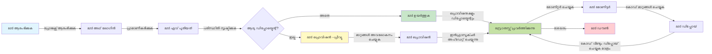
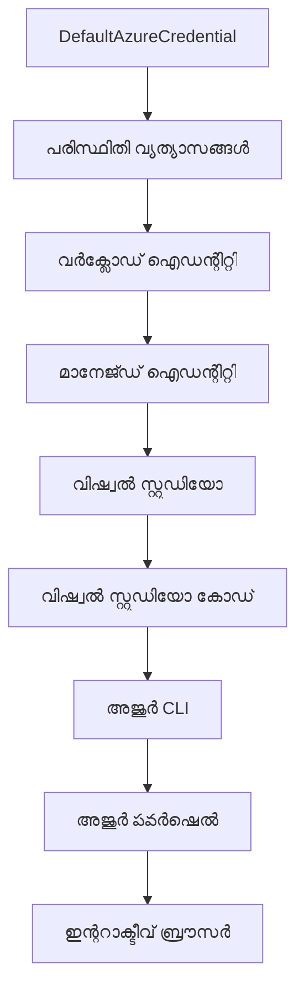

# AZD അടിസ്ഥാനങ്ങൾ - Azure Developer CLI ന്റെ മനസിലാക്കൽ

# AZD അടിസ്ഥാനങ്ങൾ - അടിസ്ഥാന ആശയങ്ങളും അടിസ്ഥാനങ്ങളും

**അദ്ധ്യായ നാവിഗേഷൻ:**
- **📚 കോഴ്‌സ് ഹോം**: [AZD For Beginners](../../README.md)
- **📖 നിലവിലെ അദ്ധ്യായം**: അദ്ധ്യായം 1 - ഫൗണ്ടേഷൻ & ക്വിക്ക് സ്റ്റാർട്ട്
- **⬅️ മുൻപ്**: [Course Overview](../../README.md#-chapter-1-foundation--quick-start)
- **➡️ അടുത്തത്**: [Installation & Setup](installation.md)
- **🚀 അടുത്ത അദ്ധ്യായം**: [Chapter 2: AI-First Development](../chapter-02-ai-development/microsoft-foundry-integration.md)

## പരിചയം

ഈ പാഠം നിങ്ങളെ Azure Developer CLI (azd) എന്ന ശക്തമായ കമാൻഡ്-ലൈൻ ടൂൾ പരിചയപ്പെടുത്തുന്നു, അത് നിങ്ങളുടെ പ്രാദേശിക വികസനത്തിൽ നിന്ന് Azure ഡിപ്ലോയ്മൻ്റിലേക്കുള്ള യാത്ര തീവ്രഗതിയാക്കുന്നു. നിങ്ങൾ അടിസ്ഥാന ആശയങ്ങളും മുഖ്യ ഫീച്ചറുകളും മനസിലാക്കും, കൂടാതെ azd ക്ലൗഡ്-നെറ്റീവ് ആപ്ലിക്കേഷൻ ഡിപ്ലോയ്മെന്റ് എളുപ്പമാക്കുന്നതെങ്ങനെ എന്ന് അറിയും.

## പഠന ലക്ഷ്യങ്ങൾ

ഈ പാഠം കഴിഞ്ഞാൽ നിങ്ങൾക്ക്:
- Azure Developer CLI എന്താണെന്ന് അതിന്റെ പ്രധാന ഉദ്ദേശ്യം മനസിലാക്കുക
- ടെംപ്ലേറ്റുകൾ, പരിതസ്ഥിതികൾ, സേവനങ്ങൾ എന്നീ മുഖ്യ ആശയങ്ങൾ പഠിക്കുക
- ടെംപ്ലേറ്റ്-ഡ്രിവൺ ഡവലപ്പ്മെന്റ്, ഇൻഫ്രാസ്ട്രക്ചർ അസ്സ് കോഡ് എന്നിവ ഉൾപ്പെടെയുള്ള പ്രധാന ഫീച്ചറുകൾ പരിശോധിക്കുക
- azd പ്രോജക്റ്റ് ഘടനയും പ്രവൃത്തിപ്രവാഹവും മനസിലാക്കുക
- നിങ്ങളുടെ വികസന പരിതസ്ഥിതിക്ക് azd ഇൻസ്റ്റാൾ ചെയ്യാനും കോൺഫിഗർ ചെയ്യാനുമായി ഒരുക്കം ഉണ്ടാക്കുക

## പഠന ഫലങ്ങൾ

ഈ പാഠം പൂർത്തിയാക്കിയ ശേഷം, നിങ്ങൾക്ക് കഴിയും:
- ആധുനിക ക്ലൗഡ് ഡവലപ്പ്മെന്റ് പ്രവൃത്തികളിൽ azd യുടെ പങ്ക് വിശദീകരിക്കുക
- azd പ്രോജക്റ്റ് ഘടനയുടെ ഘടകങ്ങൾ തിരിച്ചറിഞ്ഞു പറയുക
- ടെംപ്ലേറ്റുകൾ, പരിതസ്ഥിതികൾ, സേവനങ്ങൾ എങ്ങനെ ചേർന്ന് പ്രവർത്തിക്കുന്നുവെന്ന് വിവരിക്കുക
- azd ഉപയോഗിച്ച് ഇൻഫ്രാസ്ട്രക്ചർ അസ്സ് കോഡിന്റെ ഗുണങ്ങൾ മനസിലാക്കുക
- വിവിധ azd കമാൻഡുകളും അവയുടെ ഉദ്ദേശങ്ങളും തിരിച്ചറിയുക

## Azure Developer CLI (azd) എന്താണ്?

Azure Developer CLI (azd) ലൊക്കൽ ഡവലപ്പ്മെന്റിൽ നിന്ന് Azure ഡിപ്ലോയ്മെന്റിലേക്കുള്ള നിങ്ങളുടെ യാത്രയ്ക്ക് വേഗം കൂട്ടുന്ന കമാൻഡ്-ലൈൻ ടൂളാണ്. ഇത് Azure ൽ ക്ലൗഡ്-നെറ്റീവ് ആപ്ലിക്കേഷനുകൾ നിർമ്മിക്കുകയും ഡിപ്ലോയ് ചെയ്യുകയും മാനേജ് ചെയ്യുകയും ചെയ്യുന്ന പ്രക്രിയ എളുപ്പമാക്കുന്നു.

### azd ഉപയോഗിച്ച് നിങ്ങൾ എന്തെന്തുകൾ ഡിപ്ലോയ് ചെയ്യാവുന്നതാണ്?

azd വ്യാപകമായ പല വർക്ലോഡുകളും പിന്തുണയ്ക്കുന്നു—പട്ടിക കൂടിനടക്കുന്നു. ഇന്ന്, azd ഉപയോഗിച്ച് നിങ്ങൾക്ക് ഡിപ്ലോയ് ചെയ്യാൻ കഴിയുന്നത്:

| വർക്ലോഡ് തരം | ഉദ്ദാഹരണങ്ങൾ | 같െയ Workflow? |
|---------------|--------------|----------------|
| **പരമ്പരാഗത ആപ്ലിക്കേഷനുകൾ** | വെബ് ആപ്പുകൾ, REST API-കൾ, സ്റ്റാറ്റിക് സൈറ്റുകൾ | ✅ `azd up` |
| **സേവനങ്ങൾ һәм മൈക്രോസേവനുകൾ** | കൺടെയ്നർ ആപ്പുകൾ, ഫങ്ഷൻ ആപ്പുകൾ, മൾട്ടി-സേവീസ് ബാക്ക്‌എൻഡുകൾ | ✅ `azd up` |
| **AI-ാപഗ്രഹിത ആപ്ലിക്കേഷനുകൾ** | Microsoft Foundry മോഡലുകളുള്ള ചാറ്റ് ആപ്പുകൾ, AI Search ഉള്ള RAG സൊല്യൂഷനുകൾ | ✅ `azd up` |
| **ബുദ്ധിശാലിയായ ഏജന്റുകൾ** | Foundry-ഹോസ്റ്റ് ചെയ്ത ഏജന്റുകൾ, മൾട്ടി-ഏജന്റ് ഓർക്കസ്ട്രേഷനുകൾ | ✅ `azd up` |

പ്രധാനമായ കാര്യമാണ് **നിങ്ങൾ എന്ത് ഡിപ്ലോയ് ചെയ്യുന്നുവെന്നും azd ജീവചരിത്രം ഒരുപോലെ തന്നെയായിരിക്കും**. നിങ്ങള് പ്രോജക്റ്റ് ഇൻഷ്യലൈസ് ചെയ്യും, ഇൻഫ്രാസ്ട്രക്ചർ പ്രാവിധീകരിക്കും, കോഡ് ഡിപ്ലോയ് ചെയ്യും, ആപ്പ് മോണിറ്റർ ചെയ്യും, ക്ലീൻ അപ്പ് നടക്കും—ഇത് ഒരു ലളിതമായ വെബ്സൈറ്റ് ആണോ അല്ലെങ്കിൽ ഒരു സങ്കീർണ്ണമായ AI ഏജന്റ് ആണോ എന്നത് വ്യത്യാസമില്ല.

ഈ തുടർച്ച സ്വഭാവവുമായി ആണ്. azd AI ശേഷികള് ഒരു സേവനത്തിന്റെ മറ്റൊരു തരമായി കാണുന്നു, അടിസ്ഥാനപരമായി വ്യത്യസ്തമായ ഒന്നായി അല്ല. Microsoft Foundry മോഡലുകൾ പിന്തുണയുള്ള ഒരു ചാറ്റ് എന്റ്‌പോയിന്റ്, azd കാഴ്ചപ്പാടിൽ നിന്ന്, കോൺഫിഗർ ചെയ്യാനും ഡിപ്ലോയ് ചെയ്യാനും ഉള്ള മറ്റൊരു സേവനമായിരിക്കും.

### 🎯 എന്തുകൊണ്ട് AZD ഉപയോഗിക്കുക? യഥാർത്ഥ ലോകം താരതമ്യം

ഒരു ലളിതമായ വെബ് ആപ്പ് ഡാറ്റാബേസോടൊപ്പം ഡിപ്ലോയ് ചെയ്യുന്നതിനെ നോക്കാം:

#### ❌ AZD ഇല്ലാതെ: മാനുവൽ Azure ഡിപ്ലോയ്മെന്റ് (30+ മിനിറ്റ്)

```bash
# ഘട്ടം 1: റിസോഴ്സ് ഗ്രൂപ്പ് സൃഷ്‌ടിക്കുക
az group create --name myapp-rg --location eastus

# ഘട്ടം 2: ആപ്പ് സർവീസ് പ്ലാൻ സൃഷ്‌ടിക്കുക
az appservice plan create --name myapp-plan \
  --resource-group myapp-rg \
  --sku B1 --is-linux

# ഘട്ടം 3: വെബ് ആപ്പ് സൃഷ്‌ടിക്കുക
az webapp create --name myapp-web-unique123 \
  --resource-group myapp-rg \
  --plan myapp-plan \
  --runtime "NODE:18-lts"

# ഘട്ടം 4: കോസ്‌മോസ് ഡിബി അക്കൗണ്ട് സൃഷ്‌ടിക്കുക (10-15 മിനിറ്റ്)
az cosmosdb create --name myapp-cosmos-unique123 \
  --resource-group myapp-rg \
  --kind MongoDB

# ഘട്ടം 5: ഡാറ്റാബേസ് സൃഷ്‌ടിക്കുക
az cosmosdb mongodb database create \
  --account-name myapp-cosmos-unique123 \
  --resource-group myapp-rg \
  --name tododb

# ഘട്ടം 6: ശേഖരണം സൃഷ്‌ടിക്കുക
az cosmosdb mongodb collection create \
  --account-name myapp-cosmos-unique123 \
  --resource-group myapp-rg \
  --database-name tododb \
  --name todos

# ഘട്ടം 7: ബന്ധന സ്‌ട്രിംഗ് നേടുക
CONN_STR=$(az cosmosdb keys list \
  --name myapp-cosmos-unique123 \
  --resource-group myapp-rg \
  --type connection-strings \
  --query "connectionStrings[0].connectionString" -o tsv)

# ഘട്ടം 8: ആപ്പ് സെറ്റിങ്സ് ക്രമീകരിക്കുക
az webapp config appsettings set \
  --name myapp-web-unique123 \
  --resource-group myapp-rg \
  --settings MONGODB_URI="$CONN_STR"

# ഘട്ടം 9: ലോഗിങ് സജ്ജമാക്കുക
az webapp log config --name myapp-web-unique123 \
  --resource-group myapp-rg \
  --application-logging filesystem \
  --detailed-error-messages true

# ഘട്ടം 10: അപ്ലിക്കേഷൻ ഇൻസൈറ്റ്‌സുകൾ സജ്ജമാക്കുക
az monitor app-insights component create \
  --app myapp-insights \
  --location eastus \
  --resource-group myapp-rg

# ഘട്ടം 11: ആപ്പ് ഇൻസൈറ്റ്‌സിനെ വെബ് ആപ്പുമായി ലിങ്ക് ചെയ്യുക
INSTRUMENTATION_KEY=$(az monitor app-insights component show \
  --app myapp-insights \
  --resource-group myapp-rg \
  --query "instrumentationKey" -o tsv)

az webapp config appsettings set \
  --name myapp-web-unique123 \
  --resource-group myapp-rg \
  --settings APPINSIGHTS_INSTRUMENTATIONKEY="$INSTRUMENTATION_KEY"

# ഘട്ടം 12: ആപ്പ് ലോക്കലായി നിർമ്മിക്കുക
npm install
npm run build

# ഘട്ടം 13: ഡെപ്ലോയ്മെന്റ് പാക്കേജ് സൃഷ്‌ടിക്കുക
zip -r app.zip . -x "*.git*" "node_modules/*"

# ഘട്ടം 14: ആപ്പ് ഡെപ്ലോയ് ചെയ്യുക
az webapp deployment source config-zip \
  --resource-group myapp-rg \
  --name myapp-web-unique123 \
  --src app.zip

# ഘട്ടം 15: കാത്തിരിക്കുക, ഇത് പ്രവർത്തിക്കാൻ പ്രാർത്ഥിക്കുക 🙏
# (സ്വയംപരിശോധനയൊന്നുമില്ല, കൈയ_manual_ പരിശോധന ആവശ്യമാണ്)
```

**പ്രശ്നങ്ങൾ:**
- ❌ ഓർമ്മിക്കുക നടപ്പിലാക്കുക 15+ കമാൻഡുകൾ
- ❌ 30-45 മിനിറ്റ് മാനുവൽ ജോലി
- ❌ പിശകുകൾ ചെയ്യാൻ എളുപ്പം (ടൈപ്പോസ്, തെറ്റായ പാരാമീറ്ററുകൾ)
- ❌ കണക്ഷൻ സ്ട്രിംഗുകൾ ടെർമിനൽ ചരിത്രത്തിൽ വെളിപ്പെടുത്തുന്നു
- ❌ എന്തെങ്കിലും പരാജയപ്പെട്ടാൽ സ്വയമേവ റോള്ബാക്ക് ഇല്ല
- ❌ ടീമംഗങ്ങൾക്ക് പുനരുദ്ഗമിപ്പിക്കാൻ ബുദ്ധിമുട്ട്
- ❌ പലപ്പോഴും വ്യത്യസ്തം (പുനരുണ്ടാക്കുവാനാകാത്തത്)

#### ✅ AZD ഉപയോഗിച്ച്: ഓട്ടോമേറ്റഡ് ഡിപ്ലോയ്മെന്റ് (5 കമാൻഡുകൾ, 10-15 മിനിറ്റ്)

```bash
# ഘട്ടം 1: ടेम്പ്‌ളേറ്റിൽ നിന്നും ആരംഭിക്കുക
azd init --template todo-nodejs-mongo

# ഘട്ടം 2:身份പരിശോധന നടത്തുക
azd auth login

# ഘട്ടം 3: പരിസ്ഥിതി സൃഷ്ടിക്കുക
azd env new dev

# ഘട്ടം 4: മാറ്റങ്ങൾ മുൻകാഴ്ച ചെയ്യുക (ഐച്ഛികം പക്ഷേ ശുപാർശ ചെയ്യപ്പെടുന്നു)
azd provision --preview

# ഘട്ടം 5: എല്ലാം വിന്യസിക്കുക
azd up

# ✨ പൂർത്തിയായി! എല്ലാം വിന്യസിക്കപ്പെട്ടു, ക്രമീകരിച്ചിരിക്കുന്നു, മേൽനോട്ടം വഹിക്കപ്പെടുന്നു
```

**ഗുണങ്ങൾ:**
- ✅ **5 കമാൻഡുകൾ** vs. 15+ മാനുവൽ പടികൾ
- ✅ **10-15 മിനിറ്റ്** മുഴുവൻ സമയം (അധികം Azure കാത്തിരിപ്പ്)
- ✅ **കുറഞ്ഞ മാനുവൽ പിശകുകൾ** - സ്ഥിരം, ടെംപ്ലേറ്റ്-ഡ്രിവൻ പ്രവൃത്തി
- ✅ **സുരക്ഷിത സീക്രട്ട് കൈകാര്യം** - പല ടെംപ്ലേറ്റുകളും Azure മാനേജു ചെയ്ത സീക്രട്ട് സ്റ്റോറേജ് ഉപയോഗിക്കുന്നു
- ✅ **പുനരാവർത്തന സാധ്യതയുള്ള ഡിപ്ലോയ്മെന്‍റ്** - ഓരോ തവണയും ഒരുപോലെ പ്രവൃത്തി
- ✅ **സമ്പൂർണ പുനരുണ്ടാക്കാവുന്നതാണ്** - ഓരോ തവണയും ഒരുപോലെ ഫലം
- ✅ **ടീം-റെഡി** - എല്ലാവരുടെയും ആകെയുള്ള കമാൻഡുകൾ ഉപയോഗിച്ച് ഡിപ്ലോയ് ചെയ്യാം
- ✅ **Infrastructure as Code** - പതിപ്പുചെയ്ത ബൈസപ് ടെംപ്ലേറ്റുകൾ
- ✅ **ഇന്റഗ്രേറ്റഡ് മോണിറ്ററിങ്** - ആപ്ലിക്കേഷൻ ഇൻസൈറ്റ്സ് സ്വയമേവ കോൺഫിഗർ ചെയ്യുന്നു

### 📊 സമയം & പിശക് കുറവ്

| സൂചിക | മാനുവൽ ഡിപ്ലോയ്മെന്റ് | AZD ഡിപ്ലോയ്മെന്റ് | മെച്ചപ്പെടുത്തൽ |
|:-------|:------------------|:---------------|:------------|
| **കമാൻഡുകൾ** | 15+ | 5 | 67% കുറവ് |
| **സമയം** | 30-45 മിനിറ്റ് | 10-15 മിനിറ്റ് | 60% വേഗം |
| **പിശക് നിരക്ക്** | ~40% | <5% | 88% കുറവ് |
| **സ്ഥിരത** | കുറവ് (മാനുവൽ) | 100% (ഓട്ടോമേറ്റഡ്) | പൂർണമായും |
| **ടീം ഓൺബോർഡിംഗ്** | 2-4 മണിക്കൂർ | 30 മിനിറ്റ് | 75% വേഗം |
| **റോള്ബാക്ക് സമയം** | 30+ മിനിറ്റ് (മാനുവൽ) | 2 മിനിറ്റ് (ഓട്ടോമേറ്റഡ്) | 93% വേഗം |

## മുഖ്യ ആശയങ്ങൾ

### ടെംപ്ലേറ്റുകൾ
ടെംപ്ലേറ്റുകൾ azd യുടെ അടിസ്ഥാനമാണ്. അവയിൽ ഉണ്ട്:
- **ആപ്ലിക്കേഷൻ കോഡ്** - നിങ്ങളുടെ സോഴ്‌സ് കോഡ്, ആശ്രിതതികളും
- **ഇൻഫ്രാസ്ട്രക്ചർ നിർവചനങ്ങൾ** - Bicep അല്ലെങ്കിൽ Terraform ൽ നിർവ്വചിച്ച Azure റിസോഴ്‌സുകൾ
- **കോൺഫിഗറേഷൻ ഫയലുകൾ** - സെറ്റിംഗുകളും പരിതസ്ഥിതി മാറ്റങ്ങളും
- **ഡിപ്ലോയ്മെന്റ് സ്ക്രിപ്റ്റുകൾ** - ഓട്ടോമേറ്റഡ് ഡിപ്ലോയ്മെന്റ് പ്രവൃത്തികള

### പരിതസ്ഥിതികൾ
പരിതസ്ഥിതികൾ വ്യത്യസ്ത ഡിപ്ലോയ്മെന്റ് ലക്ഷ്യങ്ങളിൽ പ്രതിനിധാനം ചെയ്യുന്നു:
- **ഡവലപ്പ്മെന്റ്** - പരീക്ഷണത്തിനും വികസനത്തിനും
- **സ്റ്റേജിംഗ്** - പ്രീ-പ്രൊഡക്ഷൻ പരിതസ്ഥിതി
- **പ്രൊഡക്ഷൻ** - ലൈവ് പ്രൊഡക്ഷൻ പരിതസ്ഥിതി

ഓരോ പരിതസ്ഥിതിക്കും സ്വന്തം:
- Azure റിസോഴ്‌സ് ഗ്രൂപ്പ്
- കോൺഫിഗറേഷൻ സെറ്റിംഗുകൾ
- ഡിപ്ലോയ്മെന്റ് സ്റ്റേറ്റ്

### സേവനങ്ങൾ
സേവനങ്ങൾ ആപ്ലിക്കേഷന്റെ നിർമ്മാണഘടകങ്ങളാണ്:
- **ഫ്രണ്ട്‌എൻഡ്** - വെബ് ആപ്ലിക്കേഷനുകൾ, SPAകൾ
- **ബാക്ക്‌എൻഡ്** - APIകൾ, മൈക്രോസേവനുകൾ
- **ഡാറ്റാബേസ്** - ഡാറ്റാ സ്റ്റോറേജ് പരിഹാരങ്ങൾ
- **സ്റ്റോറേജ്** - ഫയൽ, ബ്ലോബ് സ്റ്റോറേജ്

## പ്രധാന ഫീച്ചറുകൾ

### 1. ടെംപ്ലേറ്റ്-ഡ്രിവൻ ഡവലപ്പ്മെന്റ്
```bash
# ലഭ്യമായ ടെംപ്ലേറ്റുകൾ തിരയുക
azd template list

# ഒരു ടെംപ്ലേറ്റ് থেকে ആരംഭിക്കുക
azd init --template <template-name>
```

### 2. ഇൻഫ്രാസ്ട്രക്ചർ അസ്സ് കോഡ്
- **ബൈസപ്** - Azure ന്റെ ഡൊമെയ്ൻ-സ്പസിഫിക് ഭാഷ
- **ടെറാഫോം** - മൾട്ടി-ക്ലൗഡ് ഇൻഫ്രാസ്ട്രക്ചർ ടൂൾ
- **ARM ടെംപ്ലേറ്റുകൾ** - Azure Resource Manager ടെംപ്ലേറ്റുകൾ

### 3. ഇന്റർഗ്രേറ്റഡ് വേർക്ക്‌ഫ്ലോകൾ
```bash
# പൂർണ്ണ വിന്യാസ പ്രവാഹം
azd up            # പ്രൊവിഷൻ + വിന്യസിക്കുക, ആദ്യമായി സജ്ജീകരിക്കുമ്പോൾ ഇത് കൈമാറ്റമില്ലാത്തതാണ്

# 🧪 പുതിയത്: വിന്യാസത്തിന് മുമ്പ് ഇൻഫ്രാസ്ട്രക്ചർ മാറ്റങ്ങൾ മുന്നോട്ട് കാണുക (സുരക്ഷിതം)
azd provision --preview    # മാറ്റങ്ങൾ വരുത്താതെ ഇൻഫ്രാസ്ട്രക്ചർ വിന്യാസം സിമുലേറ്റ് ചെയ്യുക

azd provision     # ഇൻഫ്രാസ്ട്രക്ചർ അപ്ഡേറ്റ് ചെയ്താൽ ഓസർ സ്രോതസുകൾ സൃഷ്ടിക്കാൻ ഇത് ഉപയോഗിക്കുക
azd deploy        # അപ്ലിക്കേഷൻ കോഡ് വിന്യസിക്കുക അല്ലെങ്കിൽ അപ്ഡേറ്റിനുശേഷം വീണ്ടും വിന്യസിക്കുക
azd down          # സ്രോതസുകൾ ശുചിയാക്കുക
```

#### 🛡️ Preview ഉപയോഗിച്ച് സുരക്ഷിത ഇൻഫ്രാസ്ട്രക്ചർ പ്ലാനിംഗ്
`azd provision --preview` കമാൻഡ് സുരക്ഷിതമായ ഡിപ്ലോയ്മെന്റിനായി ഗെയിം-ചേഞ്ചർ ആണ്:
- **ഡ്രൈ-റൺ വിശകലനം** - എന്ത് സൃഷ്ടിക്കും, മാറ്റിക്കും, ഇല്ലാതാക്കും എന്ന് കാണിക്കുന്നു
- **ശൂന്യ അപകടം** - നിങ്ങളുടെ Azure പരിതസ്ഥിതിയിൽ യാതൊരു മാറ്റവും ഉണ്ടാകില്ല
- **ടീം സഹകരണത്തിന്** - ഡിപ്ലോയ്മെന്റ് മുമ്പ് പ്രിവ്യൂ ഫലം പങ്കുവെക്കാം
- **ചെലവ് കണക്കുകൂട്ടൽ** - പ്രതിബദ്ധതയ്ക്കുമുമ്പ് റിസോഴ്സ് ചെലവ് മനസിലാക്കാം

```bash
# ഉദാഹരണ മുന്‍ദര്‍ശന വര്‍ക്ഫ്ലോ
azd provision --preview           # എന്ത് മാറുമെന്ന് കാണുക
# ഫലം അവലോകനം ചെയ്യുക, സംഘത്തോട് ചര്‍ച്ച ചെയ്യുക
azd provision                     # ആത്മവിശ്വാസത്തോടെ മാറ്റങ്ങള്‍ അനുഭവപ്പെടുത്തുക
```

### 📊 ദൃശ്യവൽക്കരണം: AZD വികസന പ്രവൃത്തി പ്രവാഹം



**പ്രവൃത്തി പ്രവാഹത്തിന്റെ വിശദീകരണം:**
1. **Init** - ടെംപ്ലേറ്റ് അല്ലെങ്കിൽ പുതിയ പ്രോജക്റ്റ് ആരംഭിക്കുക
2. **Auth** - Azure യിൽ തത്സമയം സ്ഥിരീകരിക്കുക
3. **Environment** - വ്യത്യസ്ത ഡിപ്ലോയ്മെന്റ് പരിതസ്ഥിതി സൃഷ്‌ടിക്കുക
4. **Preview** - 🆕 എപ്പോഴും ആദ്യം ഇൻഫ്രാസ്ട്രക്ചർ മാറ്റങ്ങൾ പ്രിവ്യൂ ചെയ്യുക (സുരക്ഷിതമായ സമീപനം)
5. **Provision** - Azure റിസോഴ്‌സുകൾ സൃഷ്ടിക്കുക/അപ്ഡേറ്റ് ചെയ്യുക
6. **Deploy** - ആപ്ലിക്കേഷൻ കോഡ് പൊളിച്ചെടുക്കുക
7. **Monitor** - ആപ്ലിക്കേഷൻ പ്രകടനം നിരീക്ഷിക്കുക
8. **Iterate** - മാറ്റങ്ങൾ എടുക്കുകയും കോഡ് പുനർഡിപ്ലോയ്മെന്റ് നടത്തുകയും ചെയ്യുക
9. **Cleanup** - ആവശ്യപ്പെടുമ്പോൾ റിസോഴ്‌സുകൾ നീക്കം ചെയ്യുക

### 4. പരിതസ്ഥിതി മാനേജ്മെന്റ്
```bash
# ആൺകൂട്ട് രചിക്കാനും നിയന്ത്രിക്കാനും
azd env new <environment-name>
azd env select <environment-name>
azd env list
```

### 5. എക്സ്റ്റെൻഷനുകൾ & AI കമാൻഡുകൾ

azd കോർ CLI ക്ക് തെരെഞ്ഞെടുക്കപ്പെട്ട ശേഷികൾ ചേർക്കാൻ എക്സ്റ്റെൻഷൻ സിസ്റ്റം ഉപയോഗിക്കുന്നു. ഇത് AI വർക്ലോഡുകൾക്ക് പ്രത്യേകമായി പ്രയോജനപ്രദമാണ്:

```bash
# ലഭ്യമായ വിപുലീകരണങ്ങളുടെ പട്ടിക
azd extension list

# Foundry എജന്റുകളുടെ വിപുലീകരണം ഇൻസ്റ്റാൾ ചെയ്യുക
azd extension install azure.ai.agents

# ഒരു മാനിഫെസ്റ്റ്‌ നിന്ന് AI എജന്റ് പ്രോജക്റ്റ് പ്രാഥമികപ്പെടുത്തുക
azd ai agent init -m agent-manifest.yaml

# വിനിയോഗിച്ച എജന്റിനെ പരിശോധിക്കുക (പ്രതികരണ സമയം, ആദ്യ ബൈറ്റ് ലഭിക്കുന്ന സമയവും കാണിക്കുന്നു)
azd ai agent invoke

# AI സഹായത്തോടെ വികസനത്തിനായി MCP സർവർ തുടങ്ങുക (അൽഫാ)
azd mcp start
```

**ഏജന്റ് ജീവിതചക്രം, തുടക്കം മുതൽ അവസാനം വരെ.** നിങ്ങൾ `azure.ai.agents` ഇൻസ്റ്റാൾ ചെയ്തപ്പോൾ, ഒരു ഒറ്റ പ്രവൃത്തി പ്രവാഹം ആശയം മുതൽ ഓടിച്ചുകൊണ്ടിരിക്കുന്ന, മോണിറ്റർ ചെയ്യുന്ന ഏജന്റ് വരെയാണ്. ഇത് എല്ലാം ആദ്യം ആവശ്യമില്ല—അവ ഉണ്ടെന്നറിയുക:

| ഘട്ടം | കമാൻഡ് | പ്രവർത്തനം |
|-------|---------|------------|
| **സ്കാഫോൾഡ്** | `azd ai agent init -m <manifest>` | ഒരു മാനിഫെസ്റ്റ് ഉപയോഗിച്ച് ഏജന്റ് പ്രോജക്റ്റ് ഉരുത്തിരിക്കുക |
| **ടെസ്റ്റ്** | `azd ai agent invoke` | ഏജന്റിനെ വിളിച്ച് പ്രതികരണ സമയം കാണുക |
| **മാപ്പിംഗ്** | `azd ai agent eval generate` | ഏജന്റിനായി വിലയിരുത്തൽ ഡാറ്റാസെറ്റ് സൃഷ്ടിക്കുക |
| **ഉയർത്തൽ** | `azd ai agent optimize` | നിങ്ങളുടെ ഡാറ്റയ്ക്ക് വിരുദ്ധമായി ഏജന്റ് നിർദ്ദേശങ്ങൾ മെച്ചപ്പെടുത്തുക |
| **പരിശോധനം** | `azd ai agent endpoint show` | ലൈവ് എന്റ്‌പോയിന്റ് കോൺഫിഗറേഷൻ കാണുക |
| **ക്ലീൻ അപ്പ്** | `azd ai agent delete` | ഹോസ്റ്റ് ചെയ്ത ഏജന്റിനെയും അതിന്റെ എല്ലാ പതിപ്പുകളെയും നീക്കം ചെയ്യുക |

> എക്സ്റ്റെൻഷനുകൾ വിശദമായി [Chapter 2: AI-First Development](../chapter-02-ai-development/agents.md) യിലും [AZD AI CLI Commands](../chapter-08-production/production-ai-practices.md#azd-ai-cli-commands-and-extensions) റഫറൻസിലും ഉൾക്കൊള്ളുന്നു.

## 📁 പ്രോജക്റ്റ് ഘടന

ഒരു സാധാരണ azd പ്രോജക്റ്റ് ഘടന:
```
my-app/
├── .azd/                    # azd configuration
│   └── config.json
├── .azure/                  # Azure deployment artifacts
├── .devcontainer/          # Development container config
├── .github/workflows/      # GitHub Actions
├── .vscode/               # VS Code settings
├── infra/                 # Infrastructure code
│   ├── main.bicep        # Main infrastructure template
│   ├── main.parameters.json
│   └── modules/          # Reusable modules
├── src/                  # Application source code
│   ├── api/             # Backend services
│   └── web/             # Frontend application
├── azure.yaml           # azd project configuration
└── README.md
```

## 🔧 കോൺഫിഗറേഷൻ ഫയലുകൾ

### azure.yaml
പ്രധാന പ്രോജക്റ്റ് കോൺഫിഗറേഷൻ ഫയൽ:
```yaml
name: my-awesome-app
metadata:
  template: my-template@1.0.0

services:
  web:
    project: ./src/web
    language: js
    host: appservice
  api:
    project: ./src/api
    language: js
    host: appservice

hooks:
  preprovision:
    shell: pwsh
    run: echo "Preparing to provision..."
```

### .azure/config.json
പരിതസ്ഥിതി-നിഷ്ഠ കോൺഫിഗറേഷൻ:
```json
{
  "version": 1,
  "defaultEnvironment": "dev",
  "environments": {
    "dev": {
      "subscriptionId": "your-subscription-id",
      "location": "eastus"
    }
  }
}
```

## 🎪 കൈമാറാനുള്ള സാധാരണ പ്രവൃത്തി പരമ്പരകൾ

> **💡 പഠന ടിപ്പ്:** നിങ്ങളുടെ AZD കഴിവുകൾ ക്രമമായി വികസിപ്പിക്കാൻ ഈ വ്യായാമങ്ങൾ അനുസരിക്കുക.

### 🎯 വ്യായാമം 1: നിങ്ങളുടെ ആദ്യ പ്രോജക്റ്റ് ഇൻഷ്യലൈസ് ചെയ്യുക

**ലക്ഷ്യം:** AZD പ്രോജക്റ്റ് സൃഷ്ടിച്ച് അതിന്റെ ഘടന പരിശോധിക്കുക

**നടപ്പടികൾ:**
```bash
# സാക്ഷ്യപ്പെടുത്തിയ ടെംപ്ലേറ്റ് ഉപയോഗിക്കുക
azd init --template todo-nodejs-mongo

# സൃഷ്ടിച്ച ഫയലുകൾ പരിശോധിക്കുക
ls -la  # മറഞ്ഞ ഫയലുകൾ ഉൾപ്പെടെ എല്ലാം കാണുക

# പ്രധാന ഫയലുകൾ സൃഷ്ടിച്ചു:
# - azure.yaml (പ്രധാന സംവിധാന ക്രമീകരണം)
# - infra/ (അടിസ്ഥാന സൗകര്യ കോഡ്)
# - src/ (ആപ്ലിക്കേഷൻ കോഡ്)
```

**✅ വിജയം:** നിങ്ങൾക്കും azure.yaml, infra/, src/ ഡയറക്ടറികൾ ഉണ്ട്

---

### 🎯 വ്യായാമം 2: Azure-യിൽ ഡിപ്ലോയ് ചെയ്യുക

**ലക്ഷ്യം:** എൺഡ്-ടു-എൺഡ് ഡിപ്ലോയ്മെന്റ് പൂർത്തിയാക്കുക

**നടപ്പടികൾ:**
```bash
# 1. അഥेन्टിക്കേറ്റ് ചെയ്യുക
az login && azd auth login

# 2. പരിസരം സൃഷ്ടിക്കുക
azd env new dev
azd env set AZURE_LOCATION eastus

# 3. മാറ്റങ്ങൾ മുൻകാഴ്ച (ശുപാർശ ചെയ്യപ്പെടുന്നു)
azd provision --preview

# 4. എല്ലാത്തിനും ഡിപ്ലോയ് ചെയ്യുക
azd up

# 5. ഡിപ്ലോയ്മെന്റ് സ്ഥിരീകരിക്കുക
azd show    # നിങ്ങളുടെ ആപ്പ് URL കാണുക
```

**പ്രതീക്ഷിച്ച സമയം:** 10-15 മിനിറ്റ്  
**✅ വിജയം:** ആപ്ലിക്കേഷൻ URL ബ്രൗസറിൽ തുറക്കുന്നു

---

### 🎯 വ്യായാമം 3: ബഹുബർണ്ണ പരിതസ്ഥിതികൾ

**ലക്ഷ്യം:** ഡെവലപ്പോറും സ്റ്റേജിംഗിനും ഡിപ്ലോയ് ചെയ്യുക

**നടപ്പടികൾ:**
```bash
# ഇതിനകം ഡവ് ഉണ്ട്, സ്റ്റേജിംഗ് സൃഷ്ടിക്കുക
azd env new staging
azd env set AZURE_LOCATION westus2
azd up

# അവയുടെ ഇടയിൽ മടക്കം മാറ്റുക
azd env list
azd env select dev
```

**✅ വിജయం:** Azure പോർട്ടലിൽ രണ്ട് വ്യത്യസ്ത റിസോഴ്‌സ് ഗ്രൂപ്പുകൾ

---

### 🛡️ ക്ലീൻ സ്ലേറ്റ്: `azd down --force --purge`

പൂർണമായും റീസെറ്റ് ആവശ്യമെങ്കിൽ:

```bash
azd down --force --purge
```

**പ്രവർത്തനം:**
- `--force`: സ്ഥിരീകരണ പ്രോമ്പ്റ്റുകൾ ഇല്ലാതെ
- `--purge`: എല്ലാ ലൊക്കൽ സ്റ്റേറ്റും Azure റിസോഴ്‌സുകളും നീക്കം ചെയ്യുക

**ഉപയോഗം ചെയ്യുമ്പോൾ:**
- ഡിപ്ലോയ്മെന്റ് മധ്യത്തിൽ തകരാറ് വന്നപ്പോൾ
- പ്രോജക്റ്റുകൾ മാറ്റുമ്പോൾ
- പുതിയ തുടക്കം വേണമെങ്കിൽ

---

## 🎪 ഓറിജിനൽ പ്രവൃത്തി പ്രവാഹം റഫറൻസ്

### പുതിയ പ്രോജക്റ്റ് തുടങ്ങൽ
```bash
# മാർഗ്ഗം 1: നിലവിലുള്ള ടെmplേറ്റ് ഉപയോഗിക്കുക
azd init --template todo-nodejs-mongo

# മാർഗ്ഗം 2: തുടക്കത്തിൽ നിന്ന് ആരംഭിക്കുക
azd init

# മാർഗ്ഗം 3: നിലവിലുള്ള ഡയറക്റ്ററി ഉപയോഗിക്കുക
azd init .
```

### ഡവലപ്പ്മെന്റ് ചക്രം
```bash
# വികസന പരിസ്ഥിതി സജ്ജീകരിക്കുക
azd auth login
azd env new dev
azd env select dev

# എല്ലാം വിന്യസിക്കുക
azd up

# മാറ്റങ്ങൾ വരുത്തി പുനർവിന്യസിക്കുക
azd deploy

# ഓർക്കുമ്പോൾ ശുചീകരിക്കുക
azd down --force --purge # Azure Developer CLI-ലെ കമാൻഡ് നിങ്ങളുടെ പരിസ്ഥിതിക്ക് **ഹാർഡ് റീസെറ്റ്** ആണ്—വിഫലമായ വിന്യസനങ്ങുകൾ പരിശോധിക്കുന്നതിനും, ഒറ്റക്കെട്ടുകളിൽ പാഴ്‌വഴക്കങ്ങൾ നീക്കുന്നതിനും, പുതിയ വിൻയസനത്തിന് തയ്യാറാകുന്നതിനും പ്രത്യേകിച്ച് ഉപയോഗപ്രദമാണ്.
```

## `azd down --force --purge` മനസ്സിലാക്കൽ
`azd down --force --purge` കമാൻഡ് azd പരിതസ്ഥിതിയും അതിന് ബന്ധപ്പെട്ട എല്ലാ റിസോഴ്‌സുകളും പൂർണ്ണമായും തകർക്കാൻ ശക്തമായ മാർഗമാണ്. ഓരോ ഫ്ലാഗും ചെയ്യുന്നതെന്തെന്ന് ഇതാ വിശദീകരണം:
```
--force
```
- സ്ഥിരീകരണ പ്രോമ്പ്റ്റുകൾ ഒഴിവാക്കുന്നു.
- മാനുവൽ ഇൻപുട്ട് സാധ്യമല്ലാത്ത ഓട്ടോമേഷൻ അല്ലെങ്കിൽ സ്ക്രിപ്റ്റിങ്ങിന് ഉപയോഗപ്രദം.
- CLI അപസമതികൾ കണ്ടെത്തിയാലും തകർത്തല്‍ തടസ്സമില്ലാതെ നടക്കും.

```
--purge
```
- **എല്ലാ ബന്ധപ്പെട്ട മെടാഡേറ്റയും നീക്കം ചെയ്യുന്നു**, ഉൾപ്പെടെ:
പരിതസ്ഥിതി നില
ലൊക്കൽ `.azure` ഫോൾഡർ
കാച്ച് ചെയ്ത ഡിപ്ലോയ്മെന്റ് വിവരങ്ങൾ
മുമ്പ് ചെയ്ത ഡിപ്ലോയ്മെന്റുകൾ azd "ഓർമ്മിക്കാൻ" അനുവദിക്കാറില്ല, ഇത് റിസോഴ്‌സ് ഗ്രൂപ്പുകളുടെ വ്യത്യാസങ്ങൾ അല്ലെങ്കിൽ പഴയ റജിസ്ട്രി റഫറൻസുകൾ പോലുള്ള പ്രശ്നങ്ങൾ ഉണ്ടാക്കുന്നത് തടയുന്നു.

### ഇരുവരും ഉപയോഗിക്കേണ്ടത് എന്തിന്?
`azd up` ന്‍റെ നിലവിലെ സ്റ്റേറ്റ് അല്ലെങ്കിൽ ഭാഗിക ഡിപ്ലോയ്മെന്റ് തടസ്സം വന്നാൽ, ഈ കമ്ബോ **ക്ലീൻ സ്ലേറ്റ്** ഉറപ്പാക്കും.

Azure പോർട്ടലിൽ മാനുവൽ റിസോഴ്‌സ് ഡിലീഷനിന് ശേഷം അല്ലെങ്കിൽ ടെംപ്ലേറ്റുകൾ, പരിതസ്ഥിതികൾ, റിസോഴ്‌സ് ഗ്രൂപ്പ് നാമകരണം എന്നിവ മാറ്റുമ്പോൾ ഇത് പ്രത്യേകമായി സഹായിക്കുന്നു.

### ബഹു പരിതസ്ഥിതികൾ മാനേജ്മെന്റ്
```bash
# സ്റ്റേജിംഗ് പരിസ്ഥിതി സൃഷ്ടിക്കുക
azd env new staging
azd env select staging
azd up

# ഡെവിലേക്കായി മടങ്ങുക
azd env select dev

# പരിസ്ഥിതികൾ താരതമ്യം ചെയ്യുക
azd env list
```

## 🔐 പ്രാമാണീകരണം & ക്രെഡൻഷ്യലുകൾ

പരാജയമില്ലാത്ത azd ഡിപ്ലോയ്മെന്റിനായി പ്രാമാണീകരണം അത്യാവശ്യം ആണ്. Azure പലവിധ പ്രാമാണീകരണ മാർഗങ്ങൾ ഉപയോഗിക്കുന്നു, azd മറ്റ് Azure ടൂൾസിൽ ഉപയോഗിക്കുന്ന അതേ ക്രെഡൻഷ്യൽ ചെയിൻ ഉപയോഗിക്കുന്നു.

### Azure CLI പ്രാമാണീകരണം (`az login`)

azd ഉപയോഗിക്കാനുമുമ്പ്, നിങ്ങള് Azure യിൽ പ്രാമാണീകരിക്കണം. ഏറ്റവും സാധാരണ മാർഗം Azure CLI ആണ്:

```bash
# ഇന്ററാക്ടീവ് ലോഗിൻ (ബ്രൗസർ തുറക്കുന്നു)
az login

# നിശ്ചിത ടെനന്റുമായി ലോഗിൻ ചെയ്യുക
az login --tenant <tenant-id>

# സർവീസ് പ്രിൻസിപ്പലുമായി ലോഗിൻ ചെയ്യുക
az login --service-principal -u <app-id> -p <password> --tenant <tenant-id>

# നിലവിലുള്ള ലോഗിൻ നില പരിശോധിക്കുക
az account show

# ലഭ്യമായ സബ്‌സ്‌ക്രിപ്ഷനുകൾ പട്ടിക ചെയ്യുക
az account list --output table

# ഡിഫോൾട്ട് സബ്‌സ്‌ക്രിപ്ഷൻ സജ്ജമാക്കുക
az account set --subscription <subscription-id>
```

### പ്രാമാണീകരണ പ്രവാഹം
1. **ഇന്ററാക്ടീവ് ലോഗിൻ**: പ്രാഥമിക ബ്രൗസർ തുറക്കുന്നു
2. **ഡിവൈസ് കോഡ് ഫ്ലോ**: ബ്രൗസർ ലഭ്യമല്ലാത്ത പരിതസ്ഥിതികൾക്കായി
3. **സേവിസ് പ്രിൻസിപ്പൽ**: ഓട്ടോമേഷൻ, CI/CD പരിസ്ഥിതികൾക്കായി
4. **Managed Identity**: Azure -ഹോസ്റ്റ് ചെയ്ത ആപ്ലിക്കേഷനുകൾക്കായി

### DefaultAzureCredential Chain

`DefaultAzureCredential` ഒരു ക്രെഡൻഷ്യൽ തരം ആണ്, ഇത് സ്വയം നിര്ദിഷ്ടക്രമത്തിൽ പല ക്രെഡൻഷ്യൽ സ്രോതസുകളെ പരീക്ഷിച്ച് ലളിതമായ പ്രാമാണീകരണ അനുഭവം നൽകുന്നു:

#### ക്രെഡൻഷ്യൽ ചെയിൻ ഓർഡർ


#### 1. പരിതസ്ഥിതി വേരിയബിളുകൾ
```bash
# സർവീസ് പ്രിൻസിപ്പാളിന് വേണ്ടി പരിസ്ഥിതി വെരിയബിളുകൾ സജ്ജമാക്കുക
export AZURE_CLIENT_ID="<app-id>"
export AZURE_CLIENT_SECRET="<password>"
export AZURE_TENANT_ID="<tenant-id>"
```

#### 2. വർക്ലോഡ് ഐഡന്റിറ്റി (കുബെർണെറ്റീസ്/ഗിത്തബ് ആക്ഷൻസ്)
സ്വയം:
- Azure Kubernetes Service (AKS) വർക്ക്ലോഡ് ഐഡന്റിറ്റി ഉപയോഗിച്ച്
- GitHub Actions ൽ OIDC ഫെഡറേഷൻ ഉപയോഗിച്ച്
- മറ്റ് ഫെഡറേറ്റഡ് ഐഡന്റിറ്റി സീനാറിയോകള്‍

#### 3. Managed Identity
Azure റിസോഴ്‌സുകൾക്കായി:
- വെർച്വൽ മെഷീനുകൾ
- ആപ്പ് സർവീസ്
- Azure ഫങ്ഷൻസ്
- കൺടെയ്നർ ഇൻസ്റ്റൻസുകൾ

```bash
# മാനേജുചെയ്ത ഐഡന്റിറ്റിയുള്ള Azure റിസോഴ്‌സിൽ പ്രവർത്തിക്കുന്നുണ്ടോ എന്ന് പരിശോധിക്കുക
az account show --query "user.type" --output tsv
# തിരിച്ചുവിളിക്കുന്നു: മാനേജുചെയ്ത ഐഡന്റിറ്റി ഉപയോഗിക്കുന്ന പക്ഷം "servicePrincipal"
```

#### 4. ഡെവലപ്പർ ടൂൾസ് ഇന്റഗ്രേഷൻ
- **Vista Studio**: സൈൻ ഇൻ ചെയ്ത അക്കൗണ്ട് സ്വയമേവ ഉപയോഗിക്കുന്നു
- **VS കോഡ്**: Azure Account എക്സ്റ്റൻഷൻ ക്രെഡൻഷ്യൽസ് ഉപയോഗിക്കുന്നു
- **Azure CLI**: `az login` ക്രെഡൻഷ്യൽസ് ഉപയോഗിക്കുന്നു (പ്രാദേശിക വികസനത്തിന് ഏറ്റവും സാധാരം)

### AZD പ്രാമാണീകരണ സജ്ജീകരണം

```bash
# മേഥഡ് 1: ആസ്യൂർ CLI ഉപയോഗിക്കുക (വികസനത്തിന് ശുപാര്‍ശചെയ്യുന്നു)
az login
azd auth login  # നിലവിലെ ആസ്യൂർ CLI ക്രെഡൻഷ്യലുകൾ ഉപയോഗിക്കുന്നു

# മേഥഡ് 2: നേരിട്ട് azd അംഗീകാരം
azd auth login --use-device-code  # ഹെഡ്‌ലസ് മുറികൾക്ക്

# മേഥഡ് 3: അംഗീകാരം നില പരിശോധിക്കുക
azd auth login --check-status

# മേഥഡ് 4: ലോഗൗട്ട് ചെയ്ത് വീണ്ടും അംഗീകരിക്കുക
azd auth logout
azd auth login
```

### പ്രാമാണീകരണ മികച്ച പ്രാക്ടീസുകൾ

#### പ്രാദേശിക വികസനത്തിന്
#### CI/CD പൈപ്പ്ലൈനുകൾക്കായി
#### പ്രൊഡക്ഷൻ പരിസ്ഥിതികൾക്കായി
- Azure റിസോഴ്‌സുകളിൽ പ്രവർത്തിക്കുമ്പോൾ **Managed Identity** ഉപയോഗിക്കുക
- ഓട്ടോമേഷൻ സേനാരിയോകൾക്കായി **Service Principal** ഉപയോഗിക്കുക
- ക്രഡൻഷ്യലുകൾ കോഡിലോ കോൺഫിഗറേഷൻ ഫയലുകളിലോ സൂക്ഷിക്കരുത്
- സെൻസിറ്റീവ് കോൺഫിഗറേഷനുകൾക്കായി **Azure Key Vault** ഉപയോഗിക്കുക

### സാധാരണ ഓത്തന്റിക്കേഷൻ പ്രശ്നങ്ങളും പരിഹാരങ്ങളും

#### പ്രശ്നം: "No subscription found"
#### പ്രശ്നം: "Insufficient permissions"
#### പ്രശ്നം: "Token expired"
### വിവിധ സാഹചര്യങ്ങളിൽ ഓത്തന്റിക്കേഷൻ

#### ലോക്കൽ ഡവലപ്പ്മെന്റ്
#### ടീം ഡവലപ്പ്മെന്റ്
#### മൾട്ടി-ടെനന്റ് സേനാരിയോകൾ
### സുരക്ഷ പരിഗണനകൾ

1. **ക്രഡൻഷ്യൽ സംരക്ഷണം**: സോഴ്‌സ് കോഡിൽ ക്രഡൻഷ്യലുകൾ സൂക്ഷിക്കരുത്
2. **സ്കോപ്പ് പരിധി**: സർവീസ് പ്രിൻസിപ്പലുകൾക്കായി ഏറ്റവും കുറഞ്ഞ അവകാശ പ്രിൻസിപ്പിൾ പ്രയോഗിക്കുക
3. **ടോക്കൺ റൊട്ടേഷൻ**: സർവീസ് പ്രിൻസിപ്പൽ രഹസ്യങ്ങൾ നിറവേറ്റി മാറ്റുക
4. **ഓഡിറ്റ് ട്രെയിൽ**: ഓത്തന്റിക്കേഷനും ഡിപ്ലോയ്‌മെന്റ് പ്രവർത്തനങ്ങളും നിരീക്ഷിക്കുക
5. **നെറ്റ്‌വർക്ക് സുരക്ഷ**: സാധ്യമായാൽ പ്രൈവറ്റ് എന്റ്പോയിന്റുകൾ ഉപയോഗിക്കുക

### ഓത്തന്റിക്കേഷൻ പ്രശ്ന പരിഹാരം

## `azd down --force --purge` മനസിലാക്കൽ

### കണ്ടെത്തൽ
### പ്രോജക്റ്റ് മാനേജ്മെന്റ്
### നിരീക്ഷണം
## മികച്ച പ്രവർത്തനരീതികൾ

### 1. അതിന്റെർസ്മാര്ഥകമായ പേരുകൾ ഉപയോഗിക്കുക
### 2. ടെംപ്ലേറ്റുകൾ പ്രയോജനപ്പെടുത്തുക
- നിലവിലുള്ള ടെംപ്ലേറ്റുകളിൽ നിന്ന് ആരംഭിക്കുക
- നിങ്ങളുടെ ആവശ്യങ്ങൾക്കായി കസ്റ്റമൈസ് ചെയ്യുക
- നിങ്ങളുടെ സംഘടനക്കായി പുനരുപയോഗയോഗ്യമായ ടെംപ്ലേറ്റുകൾ നിർമ്മിക്കുക

### 3. പരിസ്ഥിതി വേിരുവിച്ചിരുത്തൽ
- ഡെവ്/സ്റ്റേജിങ്/പ്രൊഡീഷനായി വ്യത്യസ്ത പരിസ്ഥിതികൾ പ്രയോജനപ്പെടുത്തുക
- ലോക്കൽ മെഷീനിൽ നിന്ന് നേരിട്ട് പ്രൊഡക്ഷനിലേക്ക് ഡിപ്ലോയ്മെന്റ് ചെയ്യരുത്
- പ്രൊഡക്ഷൻ ഡിപ്ലോയ്മെന്റുകൾക്കായി CI/CD പൈപ്പ്ലൈനുകൾ ഉപയോഗിക്കുക

### 4. കോൺഫിഗറേഷൻ മാനേജ്മെന്റ്
- സെൻസിറ്റീവ് ഡാറ്റയ്ക്ക് പരിസ്ഥിതിവേരിയബിളുകൾ ഉപയോഗിക്കുക
- കോൺഫിഗറേഷൻ വേർഷൻ നിയന്ത്രണത്തിൽ സൂക്ഷിക്കുക
- പരിസ്ഥിതിവിശിഷ്ട സജ്ജീകരണങ്ങൾ രേഖപ്പെടുത്തുക

## പഠന പുരോഗതി

### തുടക്കക്കാർ (ആഴ്ച 1-2)
1. azd ഇൻസ്റ്റാൾ ചെയ്ത് ഓത്തന്റിക്കറ്റ് ചെയ്യുക
2. ഒരു ലളിതമായ ടെംപ്ലേറ്റ് ഡിപ്ലോയ് ചെയ്യുക
3. പ്രോജക്റ്റിന്റെ ഘടന മനസിലാക്കുക
4. അടിസ്ഥാന കമാൻഡുകൾ പഠിക്കുക (up, down, deploy)

### ഇടത്തരം (ആഴ്ച 3-4)
1. ടെംപ്ലേറ്റുകൾ കസ്റ്റമൈസ് ചെയ്യുക
2. നിരവധി പരിസ്ഥിതികൾ കൈകാര്യം ചെയ്യുക
3. ഇൻഫ്രാസ്റ്റ്രക്ചർ കോഡ് മനസിലാക്കുക
4. CI/CD പൈപ്പ്ലൈനുകൾ ക്രമീകരിക്കുക

### ഉയർന്ന തലത്തിൽ (ആഴ്ച 5+)
1. കസ്റ്റം ടെംപ്ലേറ്റുകൾ നിർമ്മിക്കുക
2. അദ്വാൻസ്ഡ് ഇൻഫ്രാസ്റ്റ്രക്ചർ പാറ്റേൺസ്
3. മൾട്ടി-റീജിയൻ ഡിപ്ലോയ്മെന്റുകൾ
4. എന്റർപ്രൈസ്-ഗ്രേഡ് കോൺഫിഗറേഷനുകൾ

## അടുത്ത ഘട്ടങ്ങൾ

**📖 ചാപ്റ്റർ 1 പഠനം തുടരണം:**
- [ ഇൻസ്റ്റലേഷൻ & സെറ്റ്‌അപ്പ് ](installation.md) - azd ഇൻസ്റ്റാൾ ചെയ്ത് കോൺഫിഗർ ചെയ്യുക
- [ നിങ്ങളുടെ ആദ്യ പ്രോജക്റ്റ് ](first-project.md) - ഹാൻഡ്സ്-ഓൻ ട്യൂട്ടോറിയൽ പൂർത്തിയാക്കുക
- [ കോൺഫിഗറേഷൻ ഗൈഡ് ](configuration.md) - അദ്വാൻസ്ഡ് കോൺഫിഗറേഷൻ ഓപ്ഷനുകൾ

**🎯 അടുത്ത ചാപ്റ്ററിന് തയ്യാറായി?**
- [ചാപ്റ്റർ 2: AI-ഫസ്റ്റ് വികസനം](../chapter-02-ai-development/microsoft-foundry-integration.md) - AI ആപ്ലിക്കേഷനുകൾ നിർമ്മിക്കാൻ ആരംഭിക്കുക

## അധിക ഉറവിടങ്ങൾ

- [Azure Developer CLI അവലോകനം](https://learn.microsoft.com/en-us/azure/developer/azure-developer-cli/)
- [ടെംപ്ലേറ്റ് ഗാലറി](https://azure.github.io/awesome-azd/)
- [കമ്യൂണിറ്റി സാമ്പിളുകൾ](https://github.com/Azure-Samples)

---

## 🙋 പലപ്പോഴും ചോദിക്കുന്ന ചോദ്യങ്ങൾ

### പൊതുവായ ചോദ്യങ്ങൾ

**Q: AZDയും Azure CLI യും തമ്മിലുള്ള വ്യത്യാസം എന്താണ്?**

A: Azure CLI (`az`) വ്യക്തിഗത Azure റിസോഴ്‌സുകൾ നിയന്ത്രിക്കാൻ ആണ്. AZD (`azd`) മുഴുവൻ ആപ്ലിക്കേഷനുകൾ നിയന്ത്രിക്കാൻ ആണ്:

**ഇങ്ങനെ ആലോചിക്കൂ:**
- `az` = ഓരോ ലെഗോ ബ്രിക്ക് ഒറ്റക്ക് കൈകാര്യം ചെയ്യുന്നത്
- `azd` = പൂർണ്ണമായ ലെഗോ സെറ്റുകൾ മുന്നോട്ടു നീക്കുന്നത്

---

**Q: AZD ഉപയോഗിക്കാൻ ബിസപ് അല്ലെങ്കിൽ ടെറഫോിനു രചന അറിയേണ്ടതുണ്ടോ?**

A: അതില്ല! ടെംപ്ലേറ്റുകളുമായി തുടങ്ങുക:
ബിസപ് പിന്നീട് പഠിച്ച് ഇൻഫ്രാസ്റ്റ്രക്ചർ കസ്റ്റമൈസ് ചെയ്യാം. ടെംപ്ലേറ്റുകൾ പ്രവർത്തിക്കുന്ന ഉദാഹരണങ്ങൾ നൽകുന്നു.

---

**Q: AZD ടെംപ്ലേറ്റുകൾ പ്രവർത്തിപ്പിക്കുന്നത് എത്ര ചെലവാകും?**

A: ചെലവ് ടെംപ്ലേറ്റിനെ ആശ്രയിച്ച് വ്യത്യസ്തമാണ്. മിക്ക ഡവലപ്പ്മെന്റ് ടെംപ്ലേറ്റുകളും $50-150/മാസം ചിലവാകും:

**പ്രൊ ടിപ്പ്:** ലഭ്യമായപ്പോൾ സൗജന്യ തരം പ്രയോജനപ്പെടുത്തുക:
- ആപ്പ് സർവീസ്: F1 (സൗജന്യ) ടയർ
- Microsoft Foundry മാതൃകകൾ: Azure OpenAI 50,000 ടോക്കൺ/മാസം സൗജന്യ
- കോസ്‌മോസ് DB: 1000 RU/s സൗജന്യ ടയർ

---

**Q: നിലവിലുള്ള Azure വസ്തുക്കൾ AZD ഉപയോഗിച്ച് പ്രവര്‍ത്തിക്കുമോ?**

A: ആകാം, പക്ഷേ പുതുതായി ആരംഭിക്കാം. AZD മികച്ചത് മുഴുവൻ ലൈഫ് സൈക്കിൾ ഇത് കൈകാര്യം ചെയ്താൽ ആണ്. നിലവിലുള്ള വസ്തുക്കൾക്കായി:

---

**Q: ഞങ്ങളുടെ പ്രോജക്റ്റ് ടീം അംഗങ്ങളുമായി എങ്ങനെ പങ്കുവെക്കും?**

A: AZD പ്രോജക്റ്റ് Git-ൽ കമിറ്റ് ചെയ്യുക (.azure ഫോൾഡർ ഒഴികെ):

എല്ലാവർക്കും ഒരേ ടെംപ്ലേറ്റുകളിൽ നിന്നുള്ള സമാന ഇൻഫ്രാസ്ട്രക്ചർ ലഭിക്കും.

---

### പ്രശ്ന പരിഹാര ചോദ്യങ്ങൾ

**Q: "azd up" നടപ്പിലാകുമ്പോൾ പാതി കൊണ്ട് പോയി. എന്തു ചെയ്യണം?**

A: പിശക് പരിശോധിച്ച് പരിഹരിച്ച് വീണ്ടും ശ്രമിക്കുക:

**പലപ്പോഴും ഉണ്ടാകുന്ന പ്രശ്നം:** തെറ്റായ Azure സബ്സ്ക്രിപ്ഷൻ തിരഞ്ഞെടുക്കൽ

---

**Q: ഇൻഫ്രാസ്ട്രക്ചർ വീണ്ടും ഒരുക്കാതെ വെറുതെ കോഡ് മാറ്റങ്ങൾ മാത്രമെ ഡിപ്ലോയ്മെന്റ് ചെയ്യാമോ?**

A: `azd deploy` ഉപയോഗിക്കുക `azd up` ന് പകരം:

വേഗം താരതമ്യം:
- `azd up`: 10-15 മിനിറ്റ് ( ഇൻഫ്രാസ്റ്റ്രക്ചർ ഒരുക്കുന്നു )
- `azd deploy`: 2-5 മിനിറ്റ് ( കോഡ് മാത്രം )

---

**Q: ഇൻഫ്രാസ്ട്രക്ചർ ടെംപ്ലേറ്റുകൾ കസ്റ്റമൈസ് ചെയ്യാം അതോ?**

A: അതെ! `infra/` എന്ന ഫോൾഡറിൽ ബിസപ് ഫയലുകൾ എഡിറ്റ് ചെയ്യുക:

**ടിപ്പ്:** തുടക്കം ചെറിയ മാറ്റങ്ങൾ ചെയ്യുക - ആദ്യം SKUകൾ മാറ്റുക:

---

**Q: AZD ക്രിയേറ്റ് ചെയ്ത എല്ലാ വസ്തുക്കളും എങ്ങനെ ഡിലീറ്റ് ചെയ്യാം?**

A: ഒറ്റ കമാൻഡ് എല്ലാം നീക്കം ചെയ്യും:

**ഇത് ചെയ്യേണ്ടത്:**
- ടെംപ്ലേറ്റ് പരിശോധിക്കൽ പൂർത്തിയായപ്പോൾ
- വ്യത്യസ്ത പ്രോജക്റ്റിലേക്ക് മാറുമ്പോൾ
- പുതുതായി ആരംഭിക്കാന്സംശയമുണ്ടെങ്കിൽ

**ബജറ്റ് ലാഭം:** ഉപയോഗിക്കാത്ത വസ്തുക്കൾ നീക്കം ചെയ്താൽ ചെലവ് 0

---

**Q: എക്സിഡന്റ് ആയി Azure പോർട്ടൽ വഴി വസ്തുക്കൾ ഡിലീറ്റ് ചെയ്താൽ എന്താണ് ചെയ്യേണ്ടത്?**

A: AZD സ്റ്റേറ്റ് ഒച്ചിലാകാം. പുതുതായി തുടക്കം:

---

### ഉയർന്ന തലത്തിലുള്ള ചോദ്യങ്ങൾ

**Q: CI/CD പൈപ്പ്ലൈനുകളിൽ AZD ഉപയോഗിക്കാമോ?**

A: അതെ! GitHub Actions ഉദാഹരണം:

---

**Q: രഹസ്യങ്ങളും സെൻസിറ്റീവ് ഡാറ്റയും എങ്ങനെ കൈകാര്യം ചെയ്യാം?**

A: AZD സ്വാഭാവികമായി Azure Key Vault-നൊപ്പം സംയോജിതമാണ്:

**എന്നും കമിറ്റ് വേണ്ട:**
- `.azure/` ഫോൾഡർ (പരിസ്ഥിതി ഡാറ്റ ഉള്ളത്)
- `.env` ഫയലുകൾ (പ്രാദേശിക രഹസ്യങ്ങൾ)
- കണക്ഷൻ സ്ട്രിംഗുകൾ

---

**Q: മൾട്ടി-റീജിയനുകളിൽ ഡിപ്ലോയ്മെന്റ് എങ്ങനെ ചെയ്യാം?**

A: ഓരോ റീജിയനായി പരിസ്ഥിതി സൃഷ്ടിക്കുക:

പൂർണ്ണമായ മൾട്ടി-റീജിയൻ ആപ്പുകളായി, ബിസപ് ടെംപ്ലേറ്റുകൾ പരിപൂർണ്ണമായിരിക്കും ഏകകാലത്തേയ്ക്ക് പല റീജിയനുകളിലേക്ക് ഡിപ്ലോയ്മെന്റ് ചെയ്യാൻ.

---

**Q: സഹായം എവിടെ കിട്ടും?**

1. **AZD ഡോക്യുമെന്റേഷൻ:** https://learn.microsoft.com/azure/developer/azure-developer-cli/
2. **GitHub Issues:** https://github.com/Azure/azure-dev/issues
3. **Discord:** [Azure Discord](https://discord.gg/microsoft-azure) - #azure-developer-cli ചാനൽ
4. **Stack Overflow:** ടാഗ് `azure-developer-cli`
5. **ഈ കോഴ്‌സ്:** [തെറ്റായ പ്രവർത്തനം പരിഹാരം](../chapter-07-troubleshooting/common-issues.md)

**പ്രൊ ടിപ്പ്:** ചോദിക്കുന്ന മുൻപ്, ഇത് റൺ ചെയ്യുക:  
പ്രത്യക്ഷമായി സഹായത്തിനായി നിങ്ങളുടെ ചോദ്യത്തിൽ ഈ വിവരങ്ങൾ ഉൾപ്പെടുത്തുക.

---

## 🎓 ഇനി എന്ത്?

നിങ്ങൾ ഇപ്പോൾ AZD അടിസ്ഥാനങ്ങൾ മനസിലാക്കി. നിങ്ങളുടെ വഴികാട്ടി തിരഞ്ഞെടുക്കുക:

### 🎯 തുടക്കക്കാർക്കായി:
1. **അടുത്തത്:** [ഇൻസ്റ്റലേഷൻ & സെറ്റ്‌അപ്പ്](installation.md) - AZD യെ നിങ്ങളുടെ മെഷീനിൽ ഇൻസ്റ്റാൾ ചെയ്യുക
2. **അതിനുശേഷം:** [നിങ്ങളുടെ ആദ്യ പ്രോജക്റ്റ്](first-project.md) - നിങ്ങളുടെ ആദ്യ അപ്ലിക്കേഷൻ ഡിപ്ലോയ് ചെയ്യുക
3. **അഭ്യാസം:** ഈ പാഠത്തിലെ മുഴുവൻ 3 അഭ്യാസങ്ങളും പൂർത്തിയാക്കുക

### 🚀 AI ഡവലപ്പർമാർക്കായി:
1. **കടത്തുക:** [ചാപ്റ്റർ 2: AI-ഫസ്റ്റ് വികസനം](../chapter-02-ai-development/microsoft-foundry-integration.md)
2. **ഡിപ്ലോയ്:** `azd init --template get-started-with-ai-chat` ഉപയോഗിച്ച് ആരംഭിക്കുക
3. **പഠിക്കുക:** ഡിപ്ലോയ് ചെയ്യുമ്പോൾ നിർമാണവും പഠനം നടത്തുക

### 🏗️ പരിചയസമ്പന്ന ഡവലപ്പർമാർക്കായി:
1. **പുനർപരിശോധിക്കുക:** [കോൺഫിഗറേഷൻ ഗൈഡ്](configuration.md) - അദ്വാൻസ്ഡ് സജ്ജീകരണങ്ങൾ
2. **അന്വേഷിക്കുക:** [Infrastructure as Code](../chapter-04-infrastructure/provisioning.md) - ബിസപ് ഗൗരവമായ പഠനം
3. **നിർമിക്കുക:** നിങ്ങളുടെ സ്റ്റാക്കിനായി കസ്റ്റം ടെംപ്ലേറ്റുകൾ സൃഷ്ടിക്കുക

---

**ചാപ്റ്റർ നാവിഗേഷൻ:**
- **📚 കോഴ്‌സ് ഹോം**: [AZD For Beginners](../../README.md)
- **📖 നിലവിലെ ചാപ്റ്റർ**: ചാപ്റ്റർ 1 - ഫൗണ്ടേഷൻ & ക്വിക്ക് സ്റ്റാർട്ട്  
- **⬅️ മുന്‍**: [കോഴ്‌സ് അവലോകനം](../../README.md#-chapter-1-foundation--quick-start)
- **➡️ അടുത്തത്**: [ഇൻസ്റ്റലേഷൻ & സെറ്റ്‌അപ്പ്](installation.md)
- **🚀 അടുത്ത ചാപ്റ്റർ**: [ചാപ്റ്റർ 2: AI-ഫസ്റ്റ് വികസനം](../chapter-02-ai-development/microsoft-foundry-integration.md)

---

<!-- CO-OP TRANSLATOR DISCLAIMER START -->
**അറിയിപ്പ്**:
ഈ രേഖ AI പരിഭാഷാ സേവനം [Co-op Translator](https://github.com/Azure/co-op-translator) ഉപയോഗിച്ച് പരിഭാഷപ്പെടുത്തിയതാണ്. ഞങ്ങൾ കൃത്യതയ്ക്കായി ശ്രമിക്കുന്നുവെങ്കിലും, ഓട്ടോമേറ്റഡ് പരിഭാഷകളിൽ പിഴവുകൾ അല്ലെങ്കിൽ തെറ്റായ വിവരങ്ങൾ ഉണ്ടാകാൻ സാധ്യതയുണ്ട്. അതിന്റെ സ്വാഭാവിക ഭാഷയിലുള്ള അസൽ രേഖയാണ് പ്രാമാണികമായ ഉറവിടമായി പരിഗണിക്കേണ്ടത്. നിർണായകമായ വിവരങ്ങൾക്ക്, പ്രൊഫഷണൽ മനുഷ്യ പരിഭാഷ ശുപാർശ ചെയ്യുന്നു. ഈ പരിഭാഷ ഉപയോഗിച്ച് ഉണ്ടാകുന്ന തെറ്റിദ്ധാരണകൾ അല്ലെങ്കിൽ തെറ്റായ വ്യാഖ്യാനങ്ങൾക്കായി ഞങ്ങൾ ഉത്തരവാദികളല്ല.
<!-- CO-OP TRANSLATOR DISCLAIMER END -->