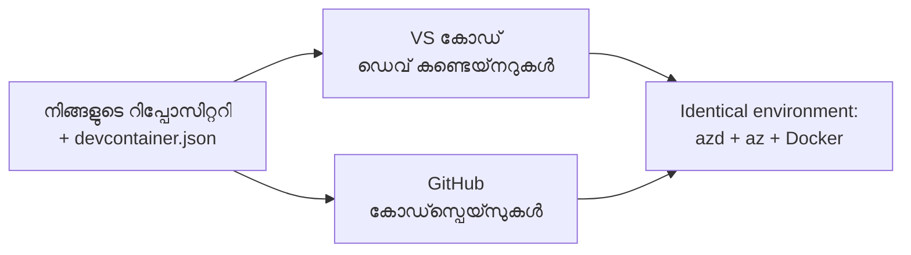

# azd-നുള്ള Dev Containers & GitHub Codespaces  

**അധ്യായ നാവിഗേഷൻ:**  
- **📚 കോഴ്‌സ് ഹോം**: [AZD For Beginners](../../README.md)  
- **📖 നിലവിലുള്ള അധ്യായം**: അധ്യായം 1 - ഫൗണ്ടേഷൻ & ക്വിക്ക് സ്റ്റാർട്ട്  
- **⬅️ മുമ്പത്തെ**: [Bring Your Own App](bring-your-own-app.md)  
- **🚀 അടുത്ത അധ്യായം**: [Chapter 2: AI-First Development](../chapter-02-ai-development/README.md)  

> `azd 1.27.1`-ൽ 2026 ജൂലൈയിൽ സാധൂകരിച്ചിരിക്കുന്നു.  

## പരിചയം  

azd, ആവശ്യമായ ഭാഷാ റൺടൈം, Docker, Azure CLI എല്ലാം ഓരോ മെഷീനിലും ഇൻസ്റ്റാൾ ചെയ്യുന്നത് ഒരു ബുദ്ധിമുട്ടാണ്—"എന്റെ മെഷീനിൽ ചുറ്റും പ്രവർത്തിക്കുന്ന ഒരു ട്യൂട്ടോറിയൽ" മറ്റൊരാൾക്കു വാഴ്‌ക്കത്തകത്ത് പരാജയപ്പെടുന്ന പ്രധാന കാരണം ഇത് തന്നെയാണ്. ഒരു **dev container** ഇതിന് പരിഹാരമാണ്, അത് നിങ്ങളുടെ മുഴുവൻ ടൂൾചെയ്ൻ ഒരു ഫയലിൽ വിവരണം നൽകുന്നു. പ്രോജക്ട് VS Code-ഇലോ GitHub Codespaces-ഇലോ തുറന്നാൽ അതേ പരിസ്ഥിതി, azd മുൻകൂട്ടി ഇൻസ്റ്റാൾ ചെയ്തതോടൊപ്പം ലഭിക്കും. ഈ പാഠത്തിൽ നിങ്ങൾക്ക് ഒരു dev container എങ്ങനെ ചേർക്കാമെന്ന് കാണിക്കും.  

## പഠന ലക്ഷ്യങ്ങൾ  

ഈ പാഠം കഴിഞ്ഞാൽ, നിങ്ങൾക്ക് കഴിയും:  
- dev container എന്താണെന്നും azd-നൊപ്പം അത് എങ്ങനെ സഹായിക്കുന്നുവെന്നു മനസ്സിലാക്കുക  
- ഒരു ഏറ്റവും ലഘുവായ` .devcontainer/devcontainer.json` പ്രോജക്ടിൽ ചേർക്കുക  
- Dev Container *features* വഴി azd, Azure CLI, Docker എന്നിവ ഉൾപ്പെടുത്തുക  
- GitHub Codespaces-ലോ VS Code-ലോ പ്രോജക്ട് തുറക്കുക  

## പഠന ഫലങ്ങൾ  

ഈ പാഠം പൂര്‍ത്തിയാക്കിയതിനു ശേഷം നിങ്ങൾക്ക് കഴിയും:  
- azd പ്രോജക്ടിനുള്ള `devcontainer.json` എഴുതി തീര്‍ക്കുക  
- دستی ഇന്‍സ്റ്റാളുകള്‍ വേണ്ടാതെ azd, Azure ടൂളുകൾ ചേർക്കുക  
- ഒരു കൺറ്റെയ്‌നറിലോ Codespace-ലോ നിന്ന് `azd up` ഓടിക്കുക  

---  

## Dev Container എന്താണ്?  

Dev container ഒരു Docker-ആധാരിത വികസന പരിസ്ഥിതിയാണ്, ഇത് നിങ്ങളുടെ റെപ്പോസിറ്ററിയിലുള്ള `.devcontainer/devcontainer.json` ഫയൽ വഴി നിർവ്വചിക്കപ്പെടുന്നു. നിങ്ങൾ പ്രോജക്ട് തുറക്കുമ്പോൾ:  

- **VS Code** (Dev Containers എക്സ്റ്റൻഷൻ ഉപയോഗിച്ച്) കൺറ്റെയ്‌നർ നിർമ്മിക്കുകയും അതിൽ അടക്കം പ്രവേശിക്കുകയും ചെയ്യുന്നു.  
- **GitHub Codespaces** ആകാശത്തിലുള്ള ഒരേ കൺറ്റെയ്‌നർ നിർമ്മിച്ച്, ബ്രൗസർ അടിസ്ഥാനപരമായ എഡിറ്റർ നൽകുന്നു.  

ഏതൊരു വിധമായാലും, ഓരോ സംഭാവനക്കാരനും ഒരേ ടൂളുകൾ ലഭിക്കുന്നു—"azd ഇൻസ്റ്റാൾ ചെയ്‌തോ?" എന്ന പ്രശ്നം ഇല്ലാതാക്കുന്നു.  


  
---  

## സ്റ്റെപ്പ് 1: devcontainer ഫയൽ സം‌രചിക്കുക  

പ്രോജക്ടിന്റെ റൂട്ടിലായി `.devcontainer/devcontainer.json` സൃഷ്ടിക്കുക:  

```json
{
  "name": "azd-project",
  "image": "mcr.microsoft.com/devcontainers/base:bookworm",
  "features": {
    "ghcr.io/devcontainers/features/azure-cli:1": {},
    "ghcr.io/azure/azure-dev/azd:latest": {},
    "ghcr.io/devcontainers/features/docker-in-docker:2": {},
    "ghcr.io/devcontainers/features/node:1": {}
  },
  "customizations": {
    "vscode": {
      "extensions": [
        "ms-azuretools.azure-dev",
        "ms-azuretools.vscode-bicep"
      ]
    }
  },
  "forwardPorts": [3000],
  "postCreateCommand": "azd version"
}
```
  
ഓരോ ഭാഗവും ചെയ്യുന്നത്:  

| കീ | പരി‌മാണ് |  
|-----|---------|  
| `image` | കൺറ്റെയ്‌നറിനുള്ള അടിസ്ഥാന OS |  
| `features` | മുൻകൂട്ടിയുള്ള ഇൻസ്റ്റാളറുകൾ — ഇവിടെ: Azure CLI, **azd**, Docker, Node.js |  
| `customizations.vscode.extensions` | azd, Bicep VS Code എക്സ്റ്റൻഷനുകൾ സ്വയം ഇൻസ്റ്റാൾ ചെയ്യുന്നു |  
| `forwardPorts` | നിങ്ങളുടെ അപ്ലിക്കേഷന്റെ പോർട്ട് ബ്രൗസറിൽ പ്രദർശിപ്പിക്കുന്നു |  
| `postCreateCommand` | കൺറ്റെയ്‌നർ ഘടിപ്പിച്ചശേഷം ഒരിക്കൽ പ്രവർത്തിക്കുന്നു (ഇവിടെ, ഒരു സാനിറ്റി പരിശോധന) |  

> `ghcr.io/azure/azure-dev/azd:latest` ഫീച്ചർ കൺറ്റെയ്‌നറിലുള്ള azd ലഭിക്കുന്ന ഔദ്യോഗിക മാർഗമാണ്. തർമികത ആവശ്യമായാൽ ഒരു പ്രത്യേക വേർഷൻ (ഉദാ: `azd:1.27.1`) പിന്‍ അനുസരിച്ച് ഉപയോഗിക്കുക.  

---  

## സ്റ്റെപ്പ് 2: നിങ്ങളുടെ അപ്ലിക്കേഷന്റെ ഭാഷയ്‌ക്ക് അനുസരിച്ചുള്ള ഫീച്ചർ പൊരുത്തപ്പെടുത്തുക  

നിങ്ങളുടെ അപ്ലിക്കേഷനിൽ ഉപയോഗിക്കുന്ന ഭാഷയുടെ പകരം `node` ഫീച്ചർ മാറ്റുക:  

```jsonc
// Python project
"ghcr.io/devcontainers/features/python:1": {},

// .NET project
"ghcr.io/devcontainers/features/dotnet:2": {},

// Java project
"ghcr.io/devcontainers/features/java:1": {},

// Go project
"ghcr.io/devcontainers/features/go:1": {}
```
  
`host` എന്നത് `containerapp`, `aks`, അല്ലെങ്കിൽ ഏതെങ്കിലും കൺറ്റെയ്‌നർ ഇമേജ് നിർമ്മിക്കുന്നതായിരുന്നുെങ്കിൽ `docker-in-docker` നിലനിര്‍ത്തുക—azd Docker ഉപയോഗിച്ച് ഇമേജ് നിർമ്മിച്ച് തള്ളാൻ ആവശ്യമാണ്.  

---  

## സ്റ്റെപ്പ് 3: തുറക്കുക  

**VS Code-ൽ:**  
1. **Dev Containers** എക്സ്റ്റൻഷൻ ഇൻസ്റ്റാൾ ചെയ്യുക.  
2. പ്രോജക്ട് ഫോൾഡർ തുറക്കുക.  
3. പ്രൊംപ്റ്റ് വന്നാൽ **Reopen in Container** ക്ലിക്ക് ചെയ്യുക (അല്ലെങ്കിൽ *Dev Containers: Reopen in Container* ഓടിക്കുക).  

**GitHub Codespaces-ൽ:**  
1. റെപ്പോ GitHub-ൽ പുഷ് ചെയ്യുക.  
2. **Code → Codespaces → Create codespace on main**- ക്ലിക്ക് ചെയ്യുക.  
3. കൺറ്റെയ്‌നർ നിർമ്മിക്കുന്നത് കാത്തിരിക്കുക—azd ടെർമിനലിൽ ഉപയോഗത്തിന് സജ്ജമാകും.  

---  

## സ്റ്റെപ്പ് 4: കൺറ്റെയ്‌നറിനുള്ളിൽ നിന്ന് വിന്യസിക്കുക  

കൺറ്റെയ്‌നറിൽ azd മുൻകൂട്ടി ഇൻസ്റ്റോൾ ചെയ്തിരിക്കുന്നു, അതുകൊണ്ട് സാധാരണ പ്രവൃത്തി സരളമായി പ്രവർത്തിക്കുന്നു:  

```bash
azd auth login --use-device-code   # ഡിവൈസ് കോഡ് Codespaces ൽ സഹായകരമാണ്
azd up
```
  
> **എന്തുകൊണ്ട് `--use-device-code`?** റിമോട്ട് കൺറ്റെയ്‌നറിലോ Codespace-ലോ ലോക്കൽ ബ്രൗസർ ഇല്ല, അതുകൊണ്ടു device-code ലോഗിൻ വിശ്വസനീയമായ മാർഗമാണ്. സൈൻ ഇൻ പൂർത്തിയാക്കാൻ നിങ്ങൾ ഒരു കോഡ് ബ്രൗസർ ടാബിലേക്ക് പകർത്തും.  

---  

## സാധാരണ വീഴ്ചകൾ  

| വീഴ്ച | പരിഹാരം |  
|---------|-----|  
| `azd up` ഒരു ഇമേജ് നിർമ്മിക്കാൻ കഴിയുന്നില്ല | `docker-in-docker` ഫീച്ചർ ചേർക്കുക |  
| Codespaces-ലുള്ള ബ്രൗസർ ലോഗിൻ തടസപ്പെടുന്നു | `azd auth login --use-device-code` ഉപയോഗിക്കുക |  
| ടീമംഗങ്ങളിലെ ടൂളുകൾ വ്യത്യസ്തമാണ് | ഫീച്ചർ വേർഷനുകൾ പിന്‍ അനുസരിച്ച് നിശ്ചയിക്കുക (ഉദ: `azd:1.27.1`) |  
| ബ്രൗസറിൽ അപ്ലിക്കേഷൻ എത്തിച്ചേരാനാകുന്നില്ല | പോർട്ട് `forwardPorts`-ൽ ചേർക്കുക |  

---  

## സാരാംശം  

- dev container നിങ്ങളുടെ azd ടൂൾചെയ്ൻ എല്ലാവർക്കും പുനരാവർത്തനയോഗ്യമാക്കുന്നു.  
- Dev Container *features* വഴി azd, Azure CLI, Docker ചേർക്കുക.  
- ഭാഷാ ഫീച്ചർ നിങ്ങളുടെ അപ്ലിക്കേഷനോടെ പൊരുത്തപ്പെടുത്തുക, container host-കൾക്കായി `docker-in-docker` നിലനിർത്തുക.  
- Codespaces-ൽ പ്രവർത്തിക്കുമ്പോൾ device-code ലോഗിൻ ഉപയോഗിക്കുക.  

---  

## 🔗 നാവിഗേഷൻ  

| ദിശ | സ്രോതസ്സ് |  
|-----------|----------|  
| **മുമ്പത്തെ** | [Bring Your Own App](bring-your-own-app.md) |  
| **അധ്യായം ഹോം** | [Chapter 1: Foundation & Quick Start](README.md) |  
| **അടുത്ത അധ്യായം** | [Chapter 2: AI-First Development](../chapter-02-ai-development/README.md) |  

## 📖 ബന്ധപ്പെട്ട സ്രോതസുകൾ  

- [ഇൻസ്റ്റാളേഷൻ & സെറ്റ്‌അപ്പ്](installation.md)  
- [കമാൻഡ് ചീറ്റ് ഷീറ്റ്](../../resources/cheat-sheet.md)  
- [ഔദ്യോഗിക Dev Containers നിയന്ത്രണങ്ങളിൽ](https://containers.dev/)  
- [azd Dev Container ഫീച്ചർ](https://github.com/Azure/azure-dev/tree/main/ext/devcontainer)  

---

<!-- CO-OP TRANSLATOR DISCLAIMER START -->
**അറിയിപ്പ്**:
ഈ രേഖ AI പരിഭാഷാ സേവനം [Co-op Translator](https://github.com/Azure/co-op-translator) ഉപയോഗിച്ച് പരിഭാഷപ്പെടുത്തിയതാണ്. ഞങ്ങൾ കൃത്യതയ്ക്കായി ശ്രമിക്കുന്നുവെങ്കിലും, ഓട്ടോമേറ്റഡ് പരിഭാഷകളിൽ പിഴവുകൾ അല്ലെങ്കിൽ തെറ്റായ വിവരങ്ങൾ ഉണ്ടാകാൻ സാധ്യതയുണ്ട്. അതിന്റെ സ്വാഭാവിക ഭാഷയിലുള്ള അസൽ രേഖയാണ് പ്രാമാണികമായ ഉറവിടമായി പരിഗണിക്കേണ്ടത്. നിർണായകമായ വിവരങ്ങൾക്ക്, പ്രൊഫഷണൽ മനുഷ്യ പരിഭാഷ ശുപാർശ ചെയ്യുന്നു. ഈ പരിഭാഷ ഉപയോഗിച്ച് ഉണ്ടാകുന്ന തെറ്റിദ്ധാരണകൾ അല്ലെങ്കിൽ തെറ്റായ വ്യാഖ്യാനങ്ങൾക്കായി ഞങ്ങൾ ഉത്തരവാദികളല്ല.
<!-- CO-OP TRANSLATOR DISCLAIMER END -->