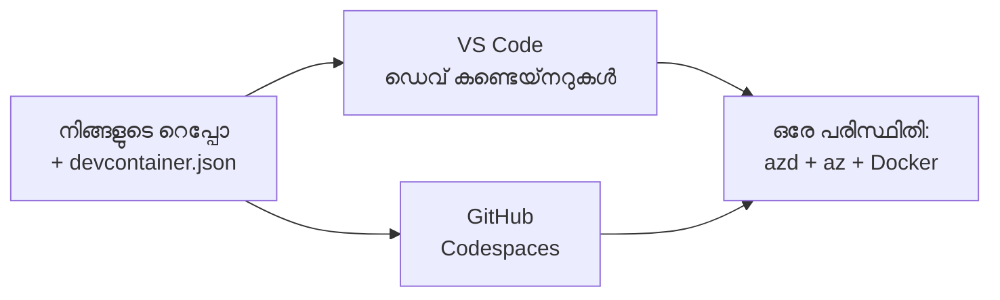

# azd-നുള്ള Dev Containers & GitHub Codespaces

**Chapter Navigation:**
- **📚 കോഴ്സ് ഹോം**: [AZD തുടക്കക്കാർക്കായി](../../README.md)
- **📖 നിലവിലെ അധ്യായം**: അധ്യായം 1 - അടിസ്ഥാനവും വേഗത്തിലുള്ള ആരംഭവും
- **⬅️ Previous**: [സ്വന്തം ആപ്പ് കൊണ്ട് വരിക](bring-your-own-app.md)
- **🚀 അടുത്ത അധ്യായം**: [അധ്യായം 2: AI-ഫസ്റ്റ് ഡെവലപ്പ്മെന്റ്](../chapter-02-ai-development/README.md)

> 2026 ജൂണിൽ `azd 1.25.6` ഉപയോഗിച്ച് സാധൂകരിച്ചു.

## Introduction

പ്രതിയൊരു യന്ത്രത്തിലും azd, അനുയോജ്യമായ ഭാഷാ റൺടൈം, Docker, കൂടാതെ Azure CLI എല്ലാം ഇൻസ്റ്റാൾ ചെയ്യുക എന്നത് ഒരു ദൗത്യം ആണ് — ഇത് "എന്റെ മെഷീനിൽ അത് പ്രവർത്തിക്കുന്നു" എന്ന് പറയുന്ന ഒരു ട്യൂട്ടോറിയൽ മറ്റൊരിടത്ത് പരാജയപ്പെടുന്ന മുഖ്യ കാരണം ആണ്. ഒരു **ഡെവ് കണ്ടെയ്‌നർ** നിങ്ങളുടെ മുഴുവൻ ടൂൾചെയ്നും ഒരു ഫയലിൽ വിവരിച്ചുകൊണ്ട് ഇത് പരിഹരിക്കുന്നു. കലോത്സവം VS Code-ൽ അല്ലെങ്കിൽ GitHub Codespaces-ൽ പ്രോജക്ട് തുറക്കുന്ന ഏവരും അതേ ശരിയായ പരിസ്ഥിതിയെക്കുറിച്ച് ലഭിക്കും, azd ഇതിനകം ഇൻസ്റ്റാൾ ചെയ്തുകിട്ടിയാവും. ഈ പാഠം അതിനെ എങ്ങനെ ചേർത്തു എന്നത് കാണിക്കുന്നു.

## Learning Goals

By the end of this lesson, you will:
- ഒരു ഡെവ് കണ്ടെയ്‌നർ എന്താണ് എന്നതും അത് azd-ന് എങ്ങനെ സഹായിയ്ക്കുന്നുവെന്നതും മനസ്സിലാക്കുക
- ഒരു പ്രോജക്ടിലേക്ക് കുറഞ്ഞതോരോന്നൊക്കെ `.devcontainer/devcontainer.json` ചേർക്കുക
- Dev Container *features* വഴി azd, Azure CLI, Docker എന്നിവ ഉൾപ്പെടുത്തുക
- പ്രോജക്ട് GitHub Codespaces-ൽ അല്ലെങ്കിൽ VS Code-ൽ തുറക്കുക

## Learning Outcomes

After completing this lesson, you will be able to:
- azd പ്രോജക്ടിനായുള്ള `devcontainer.json` രചിക്കുക
- മാനുവൽ ഇൻസ്റ്റാൾ ഇല്ലാതെ azdയും Azure ടൂളിംഗ്-ഉം ചേർക്കുക
- കണ്ടെയ്നറിനുള്ളിലോ Codespace-ൽനിന്നോ `azd up` 실행 ചെയ്യുക

---

## What Is a Dev Container?

ഒരു ഡെവ് കണ്ടെയ്നർ നിങ്ങളുടെ റീപ്പോയിലുണ്ടാകുന്ന `.devcontainer/devcontainer.json` ഫയലിലൂടെ നിർവചിക്കപ്പെട്ട Docker-ആധാരിത ഡെവലപ്മെന്റ് പരിസ്ഥിതി ആണ്. നിങ്ങൾ പ്രോജക്ട് തുറക്കുമ്പോൾ:

- **VS Code** (Dev Containers എക്സ്റ്റൻഷൻ നൽകി) കണ്ടെയ്നർ ബിൽഡ് ചെയ്ത് അതിലേക്ക് അറ്റാച്ച് ചെയ്യുന്നു.
- **GitHub Codespaces** ക്ലൗഡിൽ അതേ കണ്ടെയ്നർ ബിൽഡ് ചെയ്ത് നിങ്ങളെ ബ്രൗസർ-ആധാരിത എഡിറ്ററിലേക്ക് നൽകുന്നു.

ഏതായാലും, ഓരോ സംഭാവനക്കാരനും സമാന ഉപകരണങ്ങൾ ലഭിക്കുന്നു—'നിയമിതമായി azd ഇൻസ്റ്റാൾ ചെയ്തോ?' എന്നതിനെക്കുറിച്ചുള്ള പ്രശ്നപരിശോധന ഒഴിവാക്കാം.



---

## Step 1: Create the devcontainer File

Create `.devcontainer/devcontainer.json` in the root of your project:

```json
{
  "name": "azd-project",
  "image": "mcr.microsoft.com/devcontainers/base:bookworm",
  "features": {
    "ghcr.io/devcontainers/features/azure-cli:1": {},
    "ghcr.io/azure/azure-dev/azd:latest": {},
    "ghcr.io/devcontainers/features/docker-in-docker:2": {},
    "ghcr.io/devcontainers/features/node:1": {}
  },
  "customizations": {
    "vscode": {
      "extensions": [
        "ms-azuretools.azure-dev",
        "ms-azuretools.vscode-bicep"
      ]
    }
  },
  "forwardPorts": [3000],
  "postCreateCommand": "azd version"
}
```

What each part does:

| Key | Purpose |
|-----|---------|
| `image` | കണ്ടെയ്നറിന് ഉള്ള അടിസ്ഥാന ഓപ്പറേറ്റിംഗ് സിസ്റ്റം |
| `features` | മുൻകൂട്ടി തയ്യാറാക്കിയ ഇൻസ്റ്റാളറുകൾ — ഇവിടെ: Azure CLI, **azd**, Docker, and Node.js |
| `customizations.vscode.extensions` | azdയും Bicep ഉം VS Code എക്സ്റ്റൻഷനുകൾ സ്വയം ഇൻസ്റ്റാൾ ചെയ്യുന്നു |
| `forwardPorts` | നിങ്ങളുടെ ആപ്പിന്റെ പോർട്ട് ബ്രൗസറിലേക്ക് വെളിപ്പെടുത്തുന്നു |
| `postCreateCommand` | കണ്ടെയ്നർ ബിൽഡ് ചെയ്തശേഷം ഒരിക്കൽ പ്രവർത്തിക്കുന്ന കമാൻഡ് (ഇവിടെ, ഒരു sanity പരിശോധന) |

> The `ghcr.io/azure/azure-dev/azd:latest` feature is the official way to get azd in a container. Pin a specific version (for example `azd:1.25.6`) if you need reproducibility.

---

## Step 2: Match the Feature to Your App's Language

Swap the `node` feature for whatever your app uses:

```jsonc
// Python project
"ghcr.io/devcontainers/features/python:1": {},

// .NET project
"ghcr.io/devcontainers/features/dotnet:2": {},

// Java project
"ghcr.io/devcontainers/features/java:1": {},

// Go project
"ghcr.io/devcontainers/features/go:1": {}
```

Keep `docker-in-docker` if your `host` is `containerapp`, `aks`, or anything that builds a container image—azd needs Docker to build and push images.

---

## Step 3: Open It

**In VS Code:**
1. **Dev Containers** എക്സ്റ്റൻഷൻ ഇൻസ്റ്റാൾ ചെയ്യുക.
2. പ്രോജക്ട് ഫോൾഡർ തുറക്കുക.
3. പ്രോംപ്റ്റ് വന്നാൽ **Reopen in Container** ക്ലിക്ക് ചെയ്യുക (അല്ലെങ്കിൽ *Dev Containers: Reopen in Container* 실행 ചെയ്യുക).

**In GitHub Codespaces:**
1. റപ്പോ GitHub-ലേക്ക് പുഷ് ചെയ്യുക.
2. **Code → Codespaces → Create codespace on main** ക്ലിക്ക് ചെയ്യുക.
3. കണ്ടെയ്നർ ബിൽഡ് വരുന്നതുവരെ കാത്തിരിക്കുക — ടർമിനലിൽ azd ഉപയോഗിക്കാൻ തയ്യാറാണ്.

---

## Step 4: Deploy From Inside the Container

The container has azd preinstalled, so the normal workflow just works:

```bash
azd auth login --use-device-code   # Codespaces-ൽ ഡിവൈസ് കോഡ് ഉപയോഗിക്കാൻ സൗകര്യപ്രദമാണ്
azd up
```

> **Why `--use-device-code`?** ഒരു റിമോട്ട് കണ്ടെയ്നറിലോ Codespace-ലോ ഒരു ലോക്കൽ ബ്രൗസർ റീഡൈരക്ട് ചെയ്യുന്നതിനുള്ള സൗകര്യം ഉണ്ടാകാത്തതിനാൽ device-code ലോഗിൻ വിശ്വസനീയമായ മാർഗ്ഗമാണ്. സൈൻ ഇൻ പൂർത്തിയാക്കാൻ ഒരു കോഡ് ബ്രൗസർ ടാബിൽ പേസ്റ്റുചെയ്യണം.

---

## Common Pitfalls

| Pitfall | Fix |
|---------|-----|
| `azd up` can't build an image | Add the `docker-in-docker` feature |
| Browser login hangs in Codespaces | Use `azd auth login --use-device-code` |
| Tools differ between teammates | Pin feature versions (e.g. `azd:1.25.6`) |
| App not reachable in browser | Add the port to `forwardPorts` |

---

## Summary

- ഒരു ഡെവ് കണ്ടെയ്നർ നിങ്ങളുടെ azd ടൂൾചെയിൻ എല്ലാവർക്കും ആവർത്തനക്ഷമമാക്കുന്നു.
- Dev Container *features* വഴി azd, Azure CLI, Docker എന്നിവ ചേർക്കുക.
- നിങ്ങളുടെ ആപ്പിനുള്ള ഭാഷാ ഫീച്ചറിനെ പൊരുത്തപ്പെടുത്തി, container host-കൂടിയുള്ള വിഷയം ചെയ്യുമ്പോൾ `docker-in-docker` നിലനിർത്തുക.
- Codespaces-ൽ പ്രവർത്തിക്കുമ്പോൾ device-code ലോഗിൻ ഉപയോഗിക്കുക.

---

## 🔗 Navigation

| Direction | Resource |
|-----------|----------|
| **Previous** | [Bring Your Own App](bring-your-own-app.md) |
| **Chapter Home** | [Chapter 1: Foundation & Quick Start](README.md) |
| **Next Chapter** | [Chapter 2: AI-First Development](../chapter-02-ai-development/README.md) |

## 📖 Related Resources

- [Installation & Setup](installation.md)
- [Command Cheat Sheet](../../resources/cheat-sheet.md)
- [അധികാരം Dev Containers സ്പെസിഫിക്കേഷൻ](https://containers.dev/)
- [azd Dev Container feature](https://github.com/Azure/azure-dev/tree/main/ext/devcontainer)

---

<!-- CO-OP TRANSLATOR DISCLAIMER START -->
**അറിയിപ്പ്**:
ഈ രേഖ AI പരിഭാഷാ സേവനം [Co-op Translator](https://github.com/Azure/co-op-translator) ഉപയോഗിച്ച് പരിഭാഷപ്പെടുത്തിയതാണ്. ഞങ്ങൾ കൃത്യതയ്ക്കായി ശ്രമിക്കുന്നുവെങ്കിലും, ഓട്ടോമേറ്റഡ് പരിഭാഷകളിൽ പിഴവുകൾ അല്ലെങ്കിൽ തെറ്റായ വിവരങ്ങൾ ഉണ്ടാകാൻ സാധ്യതയുണ്ട്. അതിന്റെ സ്വാഭാവിക ഭാഷയിലുള്ള അസൽ രേഖയാണ് പ്രാമാണികമായ ഉറവിടമായി പരിഗണിക്കേണ്ടത്. നിർണായകമായ വിവരങ്ങൾക്ക്, പ്രൊഫഷണൽ മനുഷ്യ പരിഭാഷ ശുപാർശ ചെയ്യുന്നു. ഈ പരിഭാഷ ഉപയോഗിച്ച് ഉണ്ടാകുന്ന തെറ്റിദ്ധാരണകൾ അല്ലെങ്കിൽ തെറ്റായ വ്യാഖ്യാനങ്ങൾക്കായി ഞങ്ങൾ ഉത്തരവാദികളല്ല.
<!-- CO-OP TRANSLATOR DISCLAIMER END -->