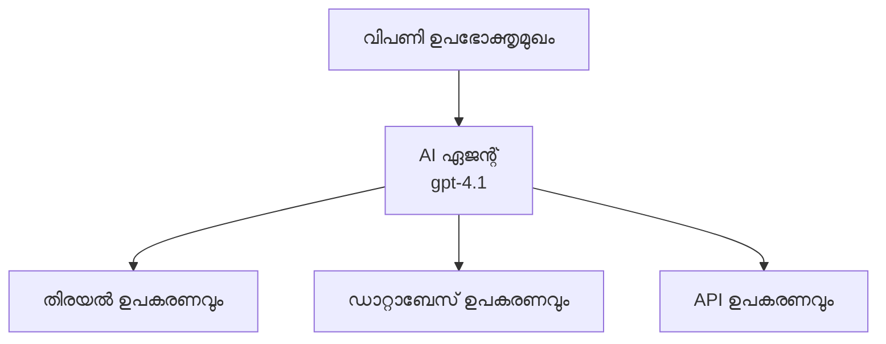
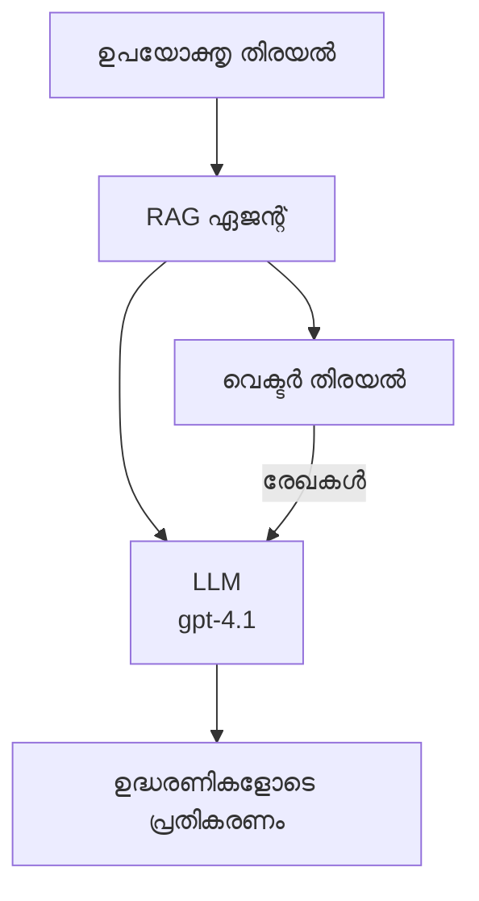
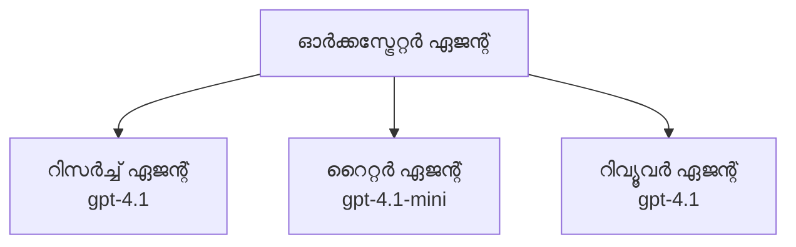

# Azure Developer CLI ഉപയോഗിച്ച് AI ഏജന്റുകൾ

**അധ്യായംenaissance:**
- **📚 കോഴ്‌സ് ഹോം**: [AZD For Beginners](../../README.md)
- **📖 നിലവിലുള്ള അധ്യായം**: അധ്യായം 2 - AI-ഫസ്റ്റ് ഡിവലപ്പ്മെന്റ്
- **⬅️ മുൻപത്തെത്**: [Microsoft Foundry Integration](microsoft-foundry-integration.md)
- **➡️ അടുത്തത്**: [AI Model Deployment](ai-model-deployment.md)
- **🚀 അഡ്വാൻസ്**: [മൾട്ടി ഏജന്റ് സൊല്യൂഷన్స్](../../examples/retail-scenario.md)

---

## പരിചയം

AI ഏജന്റുകൾ സ്വയം പ്രവർത്തിക്കാൻ കഴിയുന്ന പ്രോഗ്രാമുകളാണ്, അവ പരിസരം തിരിച്ചറിയുകയും, തീരുമാനം എടുക്കുകയും, പ്രത്യേക ലക്ഷ്യങ്ങൾ നേടിയെടുക്കാൻ പ്രവർത്തിക്കുകയും ചെയ്യുന്നു. പ്രോംപ്റ്റുകൾക്ക് മറുപടി നൽകുന്ന ലളിതമായ ചാറ്റ്ബോട്ടുകളിൽ നിന്ന് വ്യത്യസ്തമായി, ഏജന്റുകൾക്കു സാധിക്കുന്നു:

- **ഉപകരണങ്ങൾ ഉപയോഗിക്കുക** - APIകൾ വിളിക്കുക, ഡാറ്റാബേസുകൾ അന്വേഷിക്കുക, കോഡ് നടത്തിക്കുക
- **പ്ലാൻ ചെയ്ത് ആലോചിക്കുക** - സങ്കീർണ്ണമായ ജോലികൾ നിദാനങ്ങളിലും ഘട്ടങ്ങളായി വിഭജിക്കുക
- **സന്ദർഭത്തിൽ നിന്ന് പഠിക്കുക** - മെമ്മറി നിലനിർത്തുക, പെരുമാറ്റം അനുസരിച്ച് മാറ്റങ്ങൾ വരുത്തുക
- **സഹകരിക്കുക** - മറ്റു ഏജന്റുകളുമായി (മൾട്ടി-ഏജന്റ് സിസ്റ്റങ്ങൾ) പ്രവർത്തിക്കുക

Azure Developer CLI (azd) ഉപയോഗിച്ച് AI ഏജന്റുകൾ Azure-ലേക്ക് എങ്ങനെ ഡിപ്ലോയ് ചെയ്യാമെന്ന് ഈ ഗൈഡ് കാണിക്കുന്നു.

## പഠന ലക്ഷ്യങ്ങൾ

ഈ ഗൈഡ് പൂർത്തിയാക്കുമ്പോൾ, നിങ്ങൾക്ക് താഴെകൊടുത്തതിലധികം അറിയാനാകും:
- AI ഏജന്റുകൾ എന്താണ്, ചാറ്റ്ബോട്ടുകളിൽ നിന്ന് എങ്ങനെ വ്യത്യസ്തമാണ് എന്ന് മനസ്സിലാക്കുക
- AZD ഉപയോഗിച്ച് മുൻകൂട്ടി നിർമ്മിച്ച AI ഏജന്റ് ടെംപ്ലേറ്റുകൾ ഡിപ്ലോയ് ചെയ്യുക
- Foundry ഏജന്റുകൾ അനുസരിച്ച് സ്വമേധയാ ഏജന്റുകൾ കോൺഫിഗർ ചെയ്യുക
- അടിസ്ഥാന ഏജന്റ് പാറ്റേണുകൾ (ഉപകരണ ഉപയോഗം, RAG, മൾട്ടി-ഏജന്റ്) നടപ്പിലാക്കുക
- ഡിപ്ലോയ്മെന്റ് കഴിഞ്ഞുള്ള ഏജന്റുകൾ നിരീക്ഷിക്കുകയും ഡീബഗ് ചെയ്യുകയും ചെയ്യുക

## പഠനഫലം

പഠനം കഴിഞ്ഞു നിൽക്കും, നിങ്ങൾക്ക് ഇത് ചെയ്യാൻ കഴിയും:
- ഒരുമുട്ടി കമാൻഡ് ഉപയോഗിച്ച് Azure-ലേക്ക് AI ഏജന്റ് അപ്ലിക്കേഷനുകൾ ഡിപ്ലോയ് ചെയ്യുക
- ഏജന്റ് ഉപകരണങ്ങളും ശേഷികളും കോൺഫിഗർ ചെയ്യുക
- agents ഉപയോഗിച്ച് retrieval-augmented generation (RAG) നടപ്പിലാക്കുക
- സങ്കീർണ്ണ വർക്ക്‌ഫ്ലോകൾക്കായി മൾത്തി-ഏജന്റ് ആർക്കിടെക്ചറുകൾ രൂപകൽപ്പന ചെയ്യുക
- സാധാരണ ഏജന്റ് ഡിപ്ലോയ്മെന്റ് പ്രശ്നങ്ങൾ പരിഹരിക്കുക

---

## 🤖 ഏജന്റ് ഒരു ചാറ്റ്ബോട്ടിൽ നിന്ന് വ്യത്യസ്തമായി എന്താണ്?

| സവിശേഷത | ചാറ്റ്ബോട്ട് | AI ഏജന്റ് |
|---------|---------|----------|
| **വ്യവഹാരം** | പ്രോംപ്റ്റുകൾക്ക് മറുപടി നൽകുന്നു | സ്വയം പ്രവർത്തിക്കുന്ന നടപടി സ്വീകരിക്കുന്നു |
| **ഉപകരണങ്ങൾ** | ഇല്ല | APIകൾ വിളിക്കാൻ, തിരയാൻ, കോഡ് നടത്താൻ കഴിയും |
| **മെമ്മറി** | സെഷൻ അടിസ്ഥാനമാക്കി മാത്രമേ ഉളളൂ | സെഷനുകൾക്കു മീതെയുള്ള സ്ഥിരതയുള്ള മെമ്മറി |
| **പ്ലാനിംഗ്** | ഒറ്റ മറുപടി | ബഹു-ഘട്ട ആലോചന |
| **സഹകരിപ്പ്** | ഒറ്റ സബ്‌ജക്ട് | മറ്റു ഏജന്റുകളുമായി പ്രവർത്തിക്കാൻ കഴിയും |

### ലളിതമായ ഉപമ

- **ചാറ്റ്ബോട്ട്** = ഒരു സഹായക വ്യക്തി, ഇൻഫർമേഷൻ ഡെസ്കിൽ ചോദ്യം ചോദിക്കുന്നവർക്ക് ഉത്തരം നൽകുന്നു
- **AI ഏജന്റ്** = ഒരു വ്യക്തിഗത അസിസ്റ്റന്റ്, ഫോൺ വിളിക്കാനും, അപ്പോയിന്ന്മെന്റ് ബുക്ക് ചെയ്യാനും, ജോലികൾ പൂർത്തിയാക്കാനും കഴിയും

---

## 🚀 വേഗത്തിൽ ആരംഭിക്കുക: നിങ്ങളുടെ ആദ്യ ഏജന്റ് ഡിപ്ലോയ് ചെയ്യുക

### ഓപ്ഷൻ 1: Foundry ഏജന്റുകൾ ടെംപ്ലേറ്റ് (ശുപാർശ ചെയ്യുന്നു)

```bash
# AI ഏജന്റുകൾ ടെംപ്ലേറ്റ് ആരംഭിക്കുക
azd init --template get-started-with-ai-agents

# അജ്യൂറിലേക്ക് വിന്യസിക്കുക
azd up
```

**ഡിപ്ലോയ്മെന്റ് ചെയ്യുന്നവ:**
- ✅ Foundry ഏജന്റുകൾ
- ✅ Microsoft Foundry മോഡലുകൾ (gpt-4.1)
- ✅ Azure AI Search (RAG-ക്കായി)
- ✅ Azure Container Apps (വെബ് ഇന്റർഫേസ്)
- ✅ ആപ്ലിക്കേഷൻ ഇൻസൈറ്റ്സ് (മോണിറ്ററിംഗ്)

**സമയം:** ~15-20 മിനിറ്റ്  
**ചെലവ്:** ~$100-150/മാസം (ഡിവലപ്പ്മെന്റ്)

### ഓപ്ഷൻ 2: Prompty ഉപയോഗിച്ച് OpenAI ഏജന്റ്

```bash
# പ്രൊംപ്റ്റി അധിഷ്ഠിത ഏജന്റ് ടെംപ്ലേറ്റ് ആരംഭിക്കുക
azd init --template agent-openai-python-prompty

# അസ്യൂർൽേക്ക് വിന്യാസം നിർമാണം നടത്തുക
azd up
```

**ഡിപ്ലോയ്മെന്റ് ചെയ്യുന്നവ:**
- ✅ Azure Functions (സർവർലെസ് ഏജന്റ് എക്സിക്യൂഷൻ)
- ✅ Microsoft Foundry മോഡലുകൾ
- ✅ Prompty കോൺഫിഗറേഷൻ ഫയലുകൾ
- ✅ സാമ്പിൾ ഏജന്റ് നടപ്പിലാക്കൽ

**സമയം:** ~10-15 മിനിറ്റ്  
**ചെലവ്:** ~$50-100/മാസം (ഡിവലപ്പ്മെന്റ്)

### ഓപ്ഷൻ 3: RAG ചാറ്റ് ഏജന്റ്

```bash
# RAG ചാറ്റ് ടെമ്പ്ലേറ്റ് ആരംഭിക്കുക
azd init --template azure-search-openai-demo

# ആസ്യൂറിലേക്ക് വിന്യസിക്കുക
azd up
```

**ഡിപ്ലോയ്മെന്റ് ചെയ്യുന്നവ:**
- ✅ Microsoft Foundry മോഡലുകൾ
- ✅ സാമ്പിൾ ഡാറ്റയോടെയുള്ള Azure AI Search
- ✅ ഡോക്യൂമെന്റ് പ്രോസസ്സിങ് പൈപ്പ്‌ലൈൻ
- ✅ ഉദ്ധരിപ്പിക്കുന്നു ചേർന്ന ചാറ്റ് ഇന്റർഫേസ്

**സമയം:** ~15-25 മിനിറ്റ്  
**ചെലവ്:** ~$80-150/മാസം (ഡിവലപ്പ്മെന്റ്)

### ഓപ്ഷൻ 4: AZD AI Agent Init (മാനിഫസ്റ്റ് അടിസ്ഥാനമാക്കി)

നിങ്ങളുടെ ഏജന്റ് മാനിഫസ്റ്റ് ഫയൽ ഉണ്ടെങ്കിൽ, `azd ai` കമാൻഡ് ഉപയോഗിച്ച് Foundry Agent Service പ്രോജെക്ട് നേരിട്ട് സ്കാഫോൾഡ് ചെയ്യാം:

```bash
# AI ഏജന്റുകൾ എക്സ്റ്റൻഷൻ ഇൻസ്റ്റാൾ ചെയ്യുക
azd extension install azure.ai.agents

# ഏജന്റ് മാനിഫെസ്റ്റ് നിന്ന് ആരംഭിക്കുക
azd ai agent init -m agent-manifest.yaml

# Azure-ലേക്ക് വിന്യസിക്കുക
azd up
```

**`azd ai agent init` ഉപയോഗിക്കേണ്ടത് എப்போது, `azd init --template` നെ അപേക്ഷിച്ച്:**

| സമീപനം | ഏറ്റവും അനുയോജ്യം | എങ്ങനെ പ്രവർത്തിക്കുന്നു |
|----------|----------|------|
| `azd init --template` | പ്രവർത്തനക്ഷമ സാമ്പിൾ ആപ്പ് മുതലെടുത്ത് ആരംഭിക്കുമ്പോൾ | പൂർണ്ണ ടെംപ്ലേറ്റ് റീപ്പോ കോഡ് + ഇൻഫ്ര ആവശ്യങ്ങൾ ഉൾപ്പെടുത്തി ക്ലോൺ ചെയ്യുന്നു |
| `azd ai agent init -m` | നിങ്ങളുടെ സ്വന്തം ഏജന്റ് മാനിഫസ്റ്റ് നിന്നുള്ള നിർമ്മാണം | ഏജന്റ് വിവരണത്തിൽനിന്നു പ്രോജെക്ട് ഘടന സ്കാഫോൾഡ് ചെയ്യുന്നു |

> **ടിപ്പ്:** പഠനത്തിനായി (മുകളിൽ ഓപ്ഷൻസ് 1-3) `azd init --template` ഉപയോഗിക്കുക. നിങ്ങളുടെ സ്വന്തം മാനിഫസ്റ്റ് ഉപയോഗിച്ച് ഉത്പാദന എഴുത്തിനു `azd ai agent init` ഉപയോഗിക്കുക. പൂർണ്ണ റഫറൻസ് കാണാൻ [AZD AI CLI Commands](../chapter-08-production/production-ai-practices.md#azd-ai-cli-commands-and-extensions) സന്ദർശിക്കുക.

---

## 🏗️ ഏജന്റ് ആർക്കിടെക്ചർ പാറ്റേണുകൾ

### പാറ്റേൺ 1: ടൂളുകളുള്ള സിംഗിൾ ഏജന്റ്

ഏറ്റവും ലളിതമായ ഏജന്റ് പാറ്റേൺ - ഒന്നുകിൽ ഒരാൾ പല ടൂളുകളും ഉപയോഗിക്കുന്നു.


**ഉത്തമം:**
- കസ്റ്റമർ സപ്പോർട്ട് ബോട്ടുകൾ
- റിസർച് അസിസ്റ്റന്റുകൾ
- ഡാറ്റ അനാലസിസ് ഏജന്റുകൾ

**AZD ടെംപ്ലേറ്റ്:** `azure-search-openai-demo`

### പാറ്റേൺ 2: RAG ഏജന്റ് (റിട്രീവൽ-ഓഗ്മെന്റഡ് ജനറേഷൻ)

ഉത്തരം സൃഷ്ടിക്കുന്നതിന് മുമ്പ് അനുയോജ്യമായ ഡോക്യുമെന്റുകൾ തിരയുന്ന ഏജന്റ്.


**ഉത്തമം:**
- എന്റർപ്രൈസ് നോളജ് ബേസുകൾ
- ഡോക്യുമെന്റ് Q&A സിസ്റ്റങ്ങൾ
- നിയമം, കമ്പ്ലയൻസ് റിസർച്ച്

**AZD ടെംപ്ലേറ്റ്:** `azure-search-openai-demo`

### പാറ്റേൺ 3: മൾട്ടി-ഏജന്റ് സിസ്റ്റം

സംഘടിച്ചും വിദഗ്ധരും ഒരുമിച്ച് സങ്കീർണ്ണ ജോലികൾ നടത്തുന്ന ഏജന്റുകൾ.


**ഉത്തമം:**
- സങ്കീർണ്ണ ഉള്ളടക്കം സൃഷ്ടിക്കൽ
- ബഹു-ഘട്ട വർക്ക്‌ഫ്ലോകൾ
- വ്യത്യസ്ത വിദഗ്ധത ആവശ്യമായ ജോലികൾ

**കൂടുതൽ ഞാനും അറിയുക:** [മൾട്ടി-ഏജന്റ് കോഓർഡിനേഷൻ പാറ്റേണുകൾ](../chapter-06-pre-deployment/coordination-patterns.md)

---

## ⚙️ ഏജന്റ് ടൂൾ കോൺഫിഗറേഷൻ

ടൂളുകൾ ഉപയോഗിക്കുമ്പോൾ ഏജന്റുകൾ ശക്തരാകും. പൊതുവായി ഉപയോഗിക്കുന്ന ടൂളുകൾ എങ്ങനെ കോൺഫിഗർ ചെയ്യാമെന്ന് കണ്ടുപരിചയപ്പെടുക:

### Foundry ഏജന്റുകളിൽ ടൂൾ കോൺഫിഗറേഷൻ

```python
# agent_config.py
from azure.ai.projects import AIProjectClient
from azure.ai.projects.models import FunctionTool, CodeInterpreterTool

# സ്വയം നിർവചിച്ച ടൂളുകൾ
search_tool = FunctionTool(
    name="search_knowledge_base",
    description="Search the company knowledge base for relevant documents",
    parameters={
        "type": "object",
        "properties": {
            "query": {
                "type": "string",
                "description": "The search query"
            }
        },
        "required": ["query"]
    }
)

# ടൂളുകൾ ഉപയോഗിച്ച് ഏജന്റ് സൃഷ്ടിക്കുക
agent = project_client.agents.create_agent(
    model="gpt-4.1",
    name="Support Agent",
    instructions="You are a helpful support agent. Use the search tool to find relevant information.",
    tools=[search_tool, CodeInterpreterTool()]
)
```

### പരിസ്ഥിതി കോൺഫിഗറേഷൻ

```bash
# ഏജന്റ്-സ്പെസിഫിക് പരിസ്ഥിതി ചിട്ടകൾ ക്രമീകരിക്കുക
azd env set AZURE_OPENAI_MODEL "gpt-4.1"
azd env set AGENT_INSTRUCTIONS "You are a helpful assistant..."
azd env set ENABLE_CODE_INTERPRETER "true"
azd env set ENABLE_FILE_SEARCH "true"

# അപ്ഡേറ്റ് ചെയ്ത കോൺഫിഗറേഷൻ ഉപയോഗിച്ച് വിന്യസിക്കുക
azd deploy
```

---

## 📊 ഏജന്റുകൾ നിരീക്ഷിക്കുക

### ആപ്ലിക്കേഷൻ ഇൻസൈറ്റ്സ് ഇന്റഗ്രേഷൻ

എല്ലാ AZD ഏജന്റ് ടെംപ്ലേറ്റുകളും നിരീക്ഷണത്തിനായി ആപ്ലിക്കേഷൻ ഇൻസൈറ്റ്സ് ഉൾക്കൊണ്ടിട്ടുണ്ട്:

```bash
# തുറന്ന നിരീക്ഷണ ഡാഷ്‌ബോർഡ്
azd monitor --overview

# സജീവ ലോഗുകൾ കാണുക
azd monitor --logs

# സജീവ metറിക്‌സ് കാണുക
azd monitor --live
```

### നിരീക്ഷിക്കാൻ പ്രധാന മെട്രിക്സ്

| മെട്രിക് | വിവരണം | ലക്ഷ്യം |
|--------|-------------|--------|
| മറുപടി ലേറ്റ്‌സി | മറുപടി സൃഷ്ടിക്കാനുള്ള സമയം | < 5 സെക്കന്റ് |
| ടോക്കൺ ഉപയോഗം | അഭ്യർത്ഥനയിൽ ടോക്കൺ എണ്ണം | ചെലവിനായി നിരീക്ഷിക്കണം |
| ടൂൾ കോൾ വിജയം | വിജയകരമായ ടൂൾ പ്രവർത്തന ശതമാനം | > 95% |
| പിശകുകളുടെ ആകലം | പ്രയാസപ്പെട്ട ഏജന്റ് അഭ്യർത്ഥനകൾ | < 1% |
| ഉപയോക്തൃ സംതൃപ്തി | പ്രതികരണ സ്‌കോറുകൾ | > 4.0/5.0 |

### ഏജന്റുകള്ക്കായി കസ്റ്റം ലോഗിംഗ്

```python
import os
from azure.monitor.opentelemetry import configure_azure_monitor
from opentelemetry import trace

# ഓപ്പൺടെലിമെട്രിയോടുകൂടിയ ആസ്യൂർ മോണിറ്റർ കോൺഫിഗർ ചെയ്യുക
configure_azure_monitor(
    connection_string=os.environ["APPLICATIONINSIGHTS_CONNECTION_STRING"]
)

tracer = trace.get_tracer(__name__)

def log_agent_interaction(user_query, agent_response, tools_used, latency_ms):
    with tracer.start_as_current_span("agent_interaction") as span:
        span.set_attributes({
            "user_query": user_query,
            "response_length": len(agent_response),
            "tools_used": tools_used,
            "latency_ms": latency_ms
        })
```

> **കുറിപ്പ്:** ആവശ്യമായ പാക്കേജുകൾ ഇൻസ്റ്റാൾ ചെയ്യുക: `pip install azure-monitor-opentelemetry opentelemetry`

---

## 💰 ചിലവ് പരിഗണനകൾ

### പാറ്റേണുകൾ പ്രകാരം പ്രതിമാസ ചെലവ് അ估

| പാറ്റേൺ | ഡെവലപ്പ്മെന്റ് പരിസ്ഥിതി | ഉത്പാദനം |
|---------|-----------------|------------|
| സിംഗിൾ ഏജന്റ് | $50-100 | $200-500 |
| RAG ഏജന്റ് | $80-150 | $300-800 |
| മൾട്ടി-ഏജന്റ് (2-3 ഏജന്റുകൾ) | $150-300 | $500-1,500 |
| എന്റർപ്രൈസ് മൾട്ടി-ഏജന്റ് | $300-500 | $1,500-5,000+ |

### ചെലവ് പ്രഭവത്തിനുള്ള ഉപദേശം

1. **സ്തലത്തിലുള്ള വ്യവസായങ്ങൾക്ക് gpt-4.1-mini ഉപയോഗിക്കുക**  
   ```bash
   azd env set AZURE_OPENAI_MODEL "gpt-4.1-mini"
   ```

2. **പുനരാവൃത പഠനങ്ങൾക്കായി ക്യാഷിംഗ് നടപ്പിലാക്കുക**  
   ```python
   from functools import lru_cache
   
   @lru_cache(maxsize=1000)
   def get_cached_response(query_hash):
       return agent.run(query_hash)
   ```

3. **ഓരോ റൺക്കും ടോക്കൺ പരിധി നിശ്ചയിക്കുക**  
   ```python
   # ഏജന്റ്运行ചെയ്യുമ്പോൾ max_completion_tokens സജ്ജമാക്കുക, സൃഷ്ടിക്കുമ്പോൾ അല്ല
   run = project_client.agents.create_run(
       thread_id=thread.id,
       agent_id=agent.id,
       max_completion_tokens=1000  # പ്രതികരണത്തിന്റെ ദൈര്‍ഘ്യം പരിമിതപ്പെടുത്തുക
   )
   ```

4. **ഉപയോഗിക്കാത്ത സമയങ്ങളിൽ സ്‌കെയിൽഡ് ടു സീറോ ആക്കുക**  
   ```bash
   # കണ്ടെയ്‌നർ ആപ്പുകൾ സ്വയം ജീറോയിലേക്ക് സ്കെയിൽ ചെയ്യുന്നു
   azd env set MIN_REPLICAS "0"
   ```

---

## 🔧 ഏജന്റ് പ്രശ്നപരിഹാരം

### സാധാരണ പ്രശ്നങ്ങളും പരിഹാരങ്ങളും

<details>
<summary><strong>❌ ഏജന്റ് ടൂൾ കോൾക്ക് മറുപടി നൽകുന്നില്ല</strong></summary>

```bash
# ടൂൾസ് ശരിയായി രജിസ്റ്റർ ചെയ്തിട്ടുണ്ടോ എന്ന് പരിശോധിക്കുക
azd show

# OpenAI വിന്യാസം പരിശോധിക്കുക
az cognitiveservices account deployment list \
  --name $AZURE_OPENAI_NAME \
  --resource-group $RG_NAME

# ഏജेंटിന്റെ ലോഗുകൾ പരിശോധിക്കുക
azd monitor --logs
```

**സാധാരണ കാരണം:**
- ടൂൾ ഫംഗ്ഷൻ സിഗ്നേച്ചർ പൊരുത്തക്കേട്
- ആവശ്യമായ അനുമതികൾ ഇല്ല
- API എന്റ്പോയിന്റ് ലഭ്യമല്ല
</details>

<details>
<summary><strong>❌ ഏജന്റിന്റെ മറുപടി ലേറ്റൻസി കൂടുതലാണ്</strong></summary>

```bash
# ബോട്ടൽനേക്കുകൾക്ക് ആപ്ലിക്കേഷൻ ഇൻസൈറ്റുകൾ പരിശോധിക്കുക
azd monitor --live

# വേഗതയുള്ള മോഡൽ ഉപയോഗിക്കുന്നത് പരിഗണിക്കുക
azd env set AZURE_OPENAI_MODEL "gpt-4.1-mini"
azd deploy
```

**ഉപയുക്ത നിർദ്ദേശങ്ങൾ:**
- സ്ട്രീമിംഗ് റസ്പോൺസുകൾ ഉപയോഗിക്കുക
- മറുപടി ക്യാഷ് ചെയ്യുക
- സന്ദർഭ വിൻഡോ വലുപ്പം കുറക്കുക
</details>

<details>
<summary><strong>❌ ഏജന്റ് തെറ്റായ അല്ലെങ്കിൽ ഹല്യൂസിനേഷൻ ഉൾപ്പെടുത്തിയ വിവരങ്ങൾ നൽകുന്നു</strong></summary>

```python
# മെച്ചപ്പെട്ട സിസ്റ്റം പ്രോംപ്റ്റുകൾ ഉപയോഗിച്ച് മെച്ചപ്പെടുത്തുക
instructions = """
You are a helpful assistant. IMPORTANT:
- Only answer based on provided context
- If you don't know, say "I don't know"
- Always cite your sources
- Never make up information
"""

# ഗ്രൗണ്ടിംഗിനായി റിട്ട്രീവൽ ചേർക്കുക
agent = project_client.agents.create_agent(
    model="gpt-4.1",
    instructions=instructions,
    tools=[FileSearchTool()]  # രേഖകളിൽ പ്രതികരണങ്ങൾ ഗ്രൗണ്ട് ചെയ്യുക
)
```
</details>

<details>
<summary><strong>❌ ടോക്കൺ പരിധി തള്ളി പിഴവുകൾ</strong></summary>

```python
# കോൺടെക്സ്റ്റ് വിൻഡോ മാനേജ്മെന്റ് നടപ്പിലാക്കുക
def truncate_context(messages, max_tokens=8000, model="gpt-4.1"):
    """Keep only recent messages within token limit."""
    import tiktoken
    encoding = tiktoken.encoding_for_model(model)
    total_tokens = 0
    truncated = []
    
    for msg in reversed(messages):
        msg_tokens = len(encoding.encode(msg.content))
        if total_tokens + msg_tokens > max_tokens:
            break
        truncated.insert(0, msg)
        total_tokens += msg_tokens
    
    return truncated
```
</details>

---

## 🎓 കൈക്കൊണ്ടുള്ള അഭ്യാസങ്ങൾ

### അഭ്യാസം 1: അടിസ്ഥാന ഏജენტი ഡിപ്ലോയ് ചെയ്യുക (20 മിനിറ്റ്)

**ലക്ഷ്യം:** AZD ഉപയോഗിച്ച് നിങ്ങളുടെ ആദ്യ AI ഏജന്റ് ഡിപ്ലോയ് ചെയ്യുക

```bash
# ഘട്ടം 1: ടെംപ്ലേറ്റ് ആരംഭിക്കുക
azd init --template get-started-with-ai-agents

# ഘട്ടം 2: ആസ്യൂറിൽ ലോഗിൻ ചെയ്യുക
azd auth login

# ഘട്ടം 3: വിന്യസിക്കുക
azd up

# ഘട്ടം 4: ഏജന്റിനെ പരീക്ഷിക്കുക
# വിന്യാസത്തിന് ശേഷം പ്രതീക്ഷിക്കുന്ന ഔട്ട്‌പുട്ട്:
#   വിന്യാസം പൂർത്തിയായി!
#   എന്റ്പോയിന്റ്: https://<app-name>.<region>.azurecontainerapps.io
# ഔട്ട്‌പുട്ടിൽ കാണിച്ച URL തുറന്ന് ഒരു ചോദ്യമുയർത്തി നോക്കൂ

# ഘട്ടം 5: നിരീക്ഷണം കാണുക
azd monitor --overview

# ഘട്ടം 6: ശുചീകരിക്കുക
azd down --force --purge
```

**വിജയ критерിയങ്ങൾ:**
- [ ] ഏജന്റ് ചോദ്യങ്ങൾക്ക് മറുപടി നൽകുന്നു
- [ ] `azd monitor` വഴിയോ മോണിറ്ററിംഗ് ഡാഷ്‌ബോർഡിലേക്കോ ആക്‌സസ് ചെയ്യാൻ കഴിയും
- [ ] വിഭവങ്ങൾ വിജയകരമായി ശേഖരിച്ചുവോ പോയുവോ

### അഭ്യാസം 2: ഒരു കസ്റ്റം ടൂൾ ചേർക്കുക (30 മിനിറ്റ്)

**ലക്ഷ്യം:** ഏജന്റിനോട് ചേർന്ന് ഒരു കസ്റ്റം ടൂൾ വികസിപ്പിക്കുക

1. ഏജന്റ് ടെംപ്ലേറ്റ് ഡിപ്ലോയ് ചെയ്യുക:  
   ```bash
   azd init --template get-started-with-ai-agents
   azd up
   ```

2. ഏജന്റ് കോഡിലൊരു പുതിയ ടൂൾ ഫംഗ്ഷൻ സൃഷ്ടിക്കുക:  
   ```python
   def get_weather(location: str) -> str:
       """Get current weather for a location."""
       # കാലാവസ്ഥ സേവനത്തിനുള്ള API കോളി
       return f"Weather in {location}: Sunny, 72°F"
   ```

3. ടൂൾ ഏജന്റിൽ രജിസ്റ്റർ ചെയ്യുക:  
   ```python
   from azure.ai.projects.models import FunctionTool

   weather_tool = FunctionTool(
       name="get_weather",
       description="Get current weather for a location",
       parameters={
           "type": "object",
           "properties": {
               "location": {"type": "string", "description": "City name"}
           },
           "required": ["location"]
       }
   )

   agent = project_client.agents.create_agent(
       model="gpt-4.1",
       name="Weather Agent",
       tools=[weather_tool]
   )
   ```

4. വീണ്ടും ഡിപ്ലോയ് ചെയ്ത് പരീക്ഷിക്കുക:  
   ```bash
   azd deploy
   # ചോദിക്കു: "സിയాటിലിലെ കാലാവസ്ഥ എങ്ങനെയാണ്?"
   # പ്രതീക്ഷിക്കുന്നത്: ഏജന്റ് get_weather("Seattle") എന്ന ഫംഗ്ഷന്‍ വിളിച്ച് കാലാവസ്ഥ സംബന്ധമായ വിവരങ്ങള്‍ തിരികെ നല്‍കുന്നു
   ```

**വിജയ критерിയങ്ങൾ:**
- [ ] ഏജന്റ് കാലാവസ്ഥ സംബന്ധമായ ചോദ്യങ്ങൾ തിരിച്ചറിയുന്നു
- [ ] ടൂൾ ശരിയായ രീതിയിൽ വിളിക്കുന്നു
- [ ] മറുപടി കാലാവസ്ഥ വിവരങ്ങൾ ഉൾക്കൊള്ളുന്നു

### അഭ്യാസം 3: RAG ഏജന്റ് നിർമ്മിക്കുക (45 മിനിറ്റ്)

**ലക്ഷ്യം:** നിങ്ങളുടെ ഡോക്യുമെന്റുകളിൽ നിന്നുള്ള ചോദ്യങ്ങൾക്ക് ഉത്തരം നൽകുന്ന ഏജന്റ് സൃഷ്ടിക്കുക

```bash
# ഘട്ടം 1: RAG ടെംപ്ലേറ്റ് വിന്യാസപ്പെടുത്തുക
azd init --template azure-search-openai-demo
azd up

# ഘട്ടം 2: നിങ്ങളുടെ ഡോക്യുമെന്റുകൾ അപ്‌ലോഡ് ചെയ്യുക
# PDF/TXT ഫയലുകൾ data/ ഡയറക്ടറിയിൽ വെക്കുക, ശേഷം ഓടിക്കുക:
python scripts/prepdocs.py

# ഘട്ടം 3: ഡൊമൈൻ-സ്പെസിഫിക് ചോദ്യങ്ങളുമായി പരീക്ഷിക്കുക
# azd up ഔട്ട്പുട്ടിൽ നിന്ന് വെബ് ആപ്പ് URL തുറക്കുക
# നിങ്ങളുടെ അപ്‌ലോഡ് ചെയ്ത ഡോക്യുമെന്റുകളെക്കുറിച്ച് ചോദ്യങ്ങൾ ചോദിക്കുക
# മറുപടികൾ [doc.pdf] പോലുള്ള സൈറ്റേഷൻ റഫറൻസുകൾ ഉൾക്കൊള്ളണം
```

**വിജയ критерിയങ്ങൾ:**
- [ ] ഏജന്റ് അപ്‌ലോഡ് ചെയ്ത ഡോക്യുമെന്റുകൾ ഉപയോഗിച്ച് മറുപടി നൽകുന്നു
- [ ] മറുപടികളിൽ ഉദ്ധരണികൾ ഉൾക്കൊള്ളുന്നു
- [ ] പരിധി പുറത്തുള്ള ചോദ്യങ്ങളിൽ ഹല്യൂസിനേഷൻ ഇല്ല

---

## 📚 അടുത്ത ചുവടുകൾ

ഇപ്പോൾ നിങ്ങൾക്ക് AI ഏജന്റുകൾ മനസ്സിലായി, ഈ ഉയർന്ന തലത്തിലുള്ള വിഷയങ്ങൾ അന്വേഷിക്കു:

| വിഷയം | വിവരണം | ലിങ്ക് |
|-------|-------------|------|
| **മൾട്ടി-ഏജന്റ് സിസ്റ്റങ്ങൾ** | മൾട്ടി-ഏജന്റ് സഹകരണ സിസ്റ്റങ്ങൾ നിർമ്മിക്കുക | [Retail Multi-Agent Example](../../examples/retail-scenario.md) |
| **കോർഡിനേഷൻ പാറ്റേണുകൾ** | ഓർക്കസ്ട്രേഷൻ, കമ്മ്യൂണിക്കേഷൻ പാറ്റേണുകൾ പഠിക്കുക | [Coordination Patterns](../chapter-06-pre-deployment/coordination-patterns.md) |
| **ഉത്പാദന ഡിപ്ലോയ്മെന്റ്** | എന്റർപ്രൈസ് റെഡി ഏജന്റ് ഡിപ്ലോയ്മെന്റ് | [Production AI Practices](../chapter-08-production/production-ai-practices.md) |
| **ഏജന്റ് വിലയിരുത്തൽ** | ഏജന്റ് പ്രകടനം പരിശോധിക്കുകയും വിലയിരുത്തുകയും ചെയ്യുക | [AI Troubleshooting](../chapter-07-troubleshooting/ai-troubleshooting.md) |
| **AI വർക്‌ഷോപ്പ് ലാബ്** | പ്രായോഗികം: നിങ്ങളുടെ AI പരിഹാരത്തെ AZD-സജ്ജമാക്കുക | [AI Workshop Lab](ai-workshop-lab.md) |

---

## 📖 അധിക വിഭവങ്ങൾ

### ഔദ്യോഗിക ഡോക്യുമെന്റേഷൻ
- [Azure AI Agent Service](https://learn.microsoft.com/azure/ai-services/agents/)
- [Azure AI Foundry Agent Service Quickstart](https://learn.microsoft.com/azure/ai-services/agents/quickstart)
- [Semantic Kernel Agent Framework](https://learn.microsoft.com/semantic-kernel/)

### AZD ഏജന്റ് ടെംപ്ലേറ്റുകൾ
- [AI ഏജന്റുകൾ ഉപയോഗിച്ച് ആരംഭിക്കുക](https://github.com/Azure-Samples/get-started-with-ai-agents)
- [Agent OpenAI Python Prompty](https://github.com/Azure-Samples/agent-openai-python-prompty)
- [Azure Search OpenAI ഡെമോ](https://github.com/Azure-Samples/azure-search-openai-demo)

### കമ്മ്യൂണിറ്റി വിഭവങ്ങൾ
- [Awesome AZD - Agent Templates](https://azure.github.io/awesome-azd/?tags=ai-agents)
- [Azure AI ഡിസ്കോർഡ്](https://discord.gg/microsoft-azure)
- [Microsoft Foundry ഡിസ്കോർഡ്](https://discord.gg/nTYy5BXMWG)

### നിങ്ങളുടെ എഡിറ്ററിനായി ഏജന്റ് സ്കിൽസ്
- [**Microsoft Azure Agent Skills**](https://skills.sh/microsoft/github-copilot-for-azure) - GitHub Copilot, Cursor, അല്ലെങ്കിൽ മറ്റു പിന്തുണയുള്ള ഏജന്റുകളിൽ Azure വികസനത്തിന് പുനരുപയോഗിക്കാവുന്ന AI ഏജന്റ് സ്കിൽസ് ഇൻസ്റ്റാൾ ചെയ്യുക. [Azure AI](https://skills.sh/microsoft/github-copilot-for-azure/azure-ai), [Microsoft Foundry](https://skills.sh/microsoft/github-copilot-for-azure/microsoft-foundry), [deployment](https://skills.sh/microsoft/github-copilot-for-azure/azure-deploy), [diagnostics](https://skills.sh/microsoft/github-copilot-for-azure/azure-diagnostics) എന്നിവയ്ക്കുള്ള സ്കിൽസുകൾ ഉൾപ്പെടുന്നു:  
  ```bash
  npx skills add microsoft/github-copilot-for-azure
  ```

---

**നാവിഗേഷൻ**
- **മുൻപത്തെ പാഠം**: [Microsoft Foundry Integration](microsoft-foundry-integration.md)
- **അടുത്ത പാഠം**: [AI Model Deployment](ai-model-deployment.md)

---

<!-- CO-OP TRANSLATOR DISCLAIMER START -->
**തെറ്റുനిరീക്ഷണം**:  
ഈ രേഖ AI പരിഭാഷാ സേവനം [Co-op Translator](https://github.com/Azure/co-op-translator) ഉപയോഗിച്ച് പരിഭാഷപ്പെടുത്തിയതാണ്. നമുക്ക് കൃത്യതയ്ക്കായി ശ്രമിച്ചിട്ടും, സ്വയം പ്രവർത്തിക്കുന്ന പരിഭാഷയിൽ പിശകുകൾ അല്ലെങ്കിൽ അസംബന്ധതകൾ ഉണ്ടാകാം എന്ന് ദയവായി മനസ്സിലാക്കുക. ഈ രേഖയുടെ മൂല ഭാഷയിലെ പ്രമാണം അധികാര പ്രകാരം കണക്കിലെടുക്കപ്പെടണമെന്നും പരിഗണിക്കണമെന്നും നിർദ്ദേശിക്കുന്നു. നിർണ്ണായകമായ വിവരങ്ങൾക്ക്, പ്രൊഫഷണൽ മനുഷ്യ പരിഭാഷ നിർദ്ദേശിക്കുന്നു. ഈ പരിഭാഷ ഉപയോഗിക്കുന്നതിൽ നിന്നുണ്ടാകുന്ന ഏതു തെറ്റിദ്ധാരണകൾക്കും അല്ലെങ്കിൽ വ്യാഖ്യാനതീര്‍ച്ചകൾക്കും ഞങ്ങൾ ഉത്തരവാദിത്വം ഏറ്റെടുത്തിട്ടില്ല.
<!-- CO-OP TRANSLATOR DISCLAIMER END -->