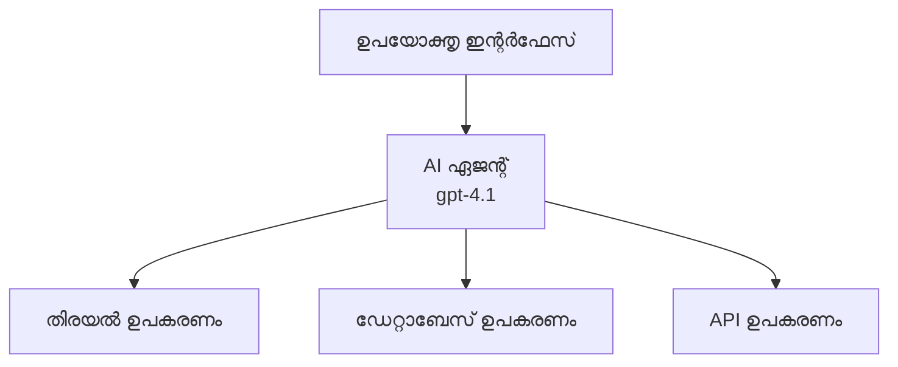
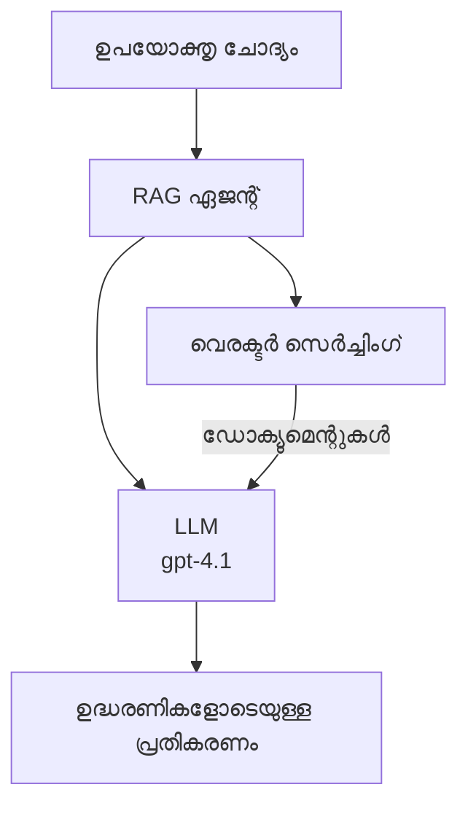
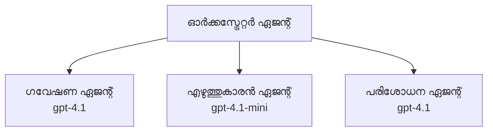

# Azure Developer CLI ഉപയോഗിച്ച് AI ഏജന്റുകൾ

**അധ്യായം നാവിഗേഷൻ:**
- **📚 കോഴ്‌സ് ഹോം**: [AZD ഫോർ ബിഗിനേഴ്സ്](../../README.md)
- **📖 കരന്റ് ചാപ്റ്റർ**: അധ്യായം 2 - AI-First ഡെവലപ്മെന്റ്
- **⬅️ മുൻപത്തെ**: [Microsoft Foundry ഇന്റഗ്രേഷൻ](microsoft-foundry-integration.md)
- **➡️ അടുത്തത്**: [AI മോഡൽ ഡിപ്പ്ലോയ്മെന്റ്](ai-model-deployment.md)
- **🚀 അഡ്വാൻസ്ഡ്**: [മൾട്ടി-ഏജന്റുകൾ സൊല്യൂഷൻസ്](../../examples/retail-scenario.md)

---

## പരിചയം

AI ഏജന്റുകള്‍ സ്വയംപര്യാപ്ത പ്രോഗ്രാമുകൾ ആണ്, അവ പരിസരത്തെ കാണാനും, മെച്ചപ്പെട്ട തീരുമാനങ്ങൾ എടുക്കാനും, പ്രത്യേക ലക്ഷ്യങ്ങൾ കൈവരിക്കാൻ പ്രവർത്തിക്കാനും കഴിയുന്നു. സാധാരണ ചാറ്റ്ബോട്ടുകളിൽ നിന്ന് വ്യത്യസ്തമായി, ഏജന്റുകൾക്ക് കഴിയും:

- **ടൂളുകൾ ഉപയോഗിക്കുക** - APIകൾ വിളിക്കുക, ഡാറ്റാബേസുകൾ തിരയുക, കോഡ് നിർവഹിക്കുക
- **പ്രീണിയും കാരണവും ബാധിക്കുക** - സങ്കീർണ്ണമായ പ്രവർത്തനങ്ങളെ ചുവടു പടി ആയി വിഭജിക്കുക
- **സന്ദർഭത്തിൽ നിന്നു പഠിക്കുക** - ഓർമذاവീണ്ടും പെരുമാറ്റം അനുകൂലിപ്പിക്കുക
- **സഹകരിക്കുക** - മറ്റ് ഏജന്റുകളുമായി (മൾട്ടി-ഏജന്റ് സിസ്റ്റങ്ങൾ) ചേർന്ന് പ്രവർത്തിക്കുക

ഈ ഗൈഡിൽ നിങ്ങൾക്ക് Azure Developer CLI (azd) ഉപയോഗിച്ച് Azure-ൽ AI ഏജന്റുകൾ എങ്ങനെ ഡിപ്പ്ലോയുചെയ്യാമെന്ന് കാണിക്കുന്നു.

> **വാലിഡേഷൻ നോട്ട്സ് (2026-03-25):** ഈ ഗൈഡ് azd 1.23.12, azure.ai.agents 0.1.18-preview ഹാർമോനിക്കായി പരിശോധിച്ചു. azd ai അനുഭവം ഇപ്പോഴും പ്രിവ്യൂ അടിസ്ഥാനമുള്ളതിനാൽ, നിങ്ങളുടെ ഇൻസ്റ്റാൾ ചെയ്‌ത ഫ്ലാഗുകൾ വ്യത്യസ്തമായാൽ എക്സ്റ്റെൻഷൻ സഹായം പരിശോധിക്കുക.

## പഠന ലക്ഷ്യങ്ങൾ

ഈ ഗൈഡ് പൂർത്തിയാക്കുന്പോൾ നിങ്ങള്‍ക്ക് സാധിക്കും:
- AI ഏജന്റുകൾ എന്ത് ആണെന്നും ചാറ്റ്ബോട്ടുകളിൽ നിന്ന് എങ്ങനെ വ്യത്യസ്ഥമാണെന്നും മനസ്സിലാക്കുക
- AZD ഉപയോഗിച്ച് മുൻകൂട്ടി നിർമ്മിച്ച AI ഏജന്റ് ടെംപ്ലേറ്റുകൾ ഡിപ്പ്ലോയുചെയ്യുക
- ഫൗണ്ടറി ഏജന്റ്സിന്റെ കസ്റ്റം ഏജന്റുകൾ കോൺഫിഗർ ചെയ്യുക
- അടിസ്ഥാന ഏജന്റ് മോടലുകൾ (ടൂൾ ഉപയോഗം, RAG, മൾട്ടി-ഏജന്റ്) നടപ്പിലാക്കുക
- ഡിപ്പ്ലോയുചെയ്ത ഏജന്റുകൾ നിരീക്ഷിക്കുകയും ഡീബഗ് ചെയ്യുകയും ചെയ്യുക

## പഠന ഫലങ്ങൾ

പൂർത്തിയാക്കിയ ശേഷം, നിങ്ങള്‍ക്ക് സാധിക്കും:
- ഒരു കമാൻഡ് ഉപയോഗിച്ച് Azure-ൽ AI ഏജന്റ് ആപ്പlications ഡിപ്പ്ലോയുചെയ്യുക
- ഏജന്റ് ടൂളുകളും ശേഷികളും കോൺഫിഗർ ചെയ്യുക
- ഏജന്റുകൾ ഉപയോഗിച്ച് റിട്രിവൽ-ആഗ്മെന്റഡ് ജനറേഷൻ (RAG) നടപ്പിലാക്കുക
- സങ്കീർണ്ണ വർക്ക്‌ഫ്ലോകൾക്കായി മൾട്ടി-ഏജന്റ് ആർക്കിടെക്ചറുകൾ രൂപകൽപ്പന ചെയ്യുക
- സമയോചിത പ്രശ്നങ്ങൾ തിരിച്ചറിയുകയും പരിഹരിക്കുകയും ചെയ്യുക

---

## 🤖 ഏജന്റിന് ചാറ്റ്ബോട്ടിൽ നിന്നും വ്യത്യാസം ഏതാണ്?

| പ്രത്യേകത | ചാറ്റ്ബോട്ട് | AI ഏജന്റ് |
|---------|-------------|-----------|
| **പെരുമാറ്റം** | പ്രോംപ്റ്റുകളിൽ പ്രതികരിക്കുന്നു | സ്വയംനിർണയമെടുത്ത പ്രവർത്തികൾ നടത്തുന്നു |
| **ടൂളുകൾ** | ഇല്ല | APIകൾ വിളിക്കാനും, തിരയാനും, കോഡ് നിർവഹിക്കാനും കഴിയും |
| **ഓർമ്മ** | സെഷൻ അടിസ്ഥാനത്തിൽ മാത്രമേ | സെഷനുകൾക്കിടയിൽ സ്ഥിരമായ ഓർമ്മ |
| **ക്രമീകരണ പദ്ധതി** | ഒറ്റ പ്രോംപ്റ്റ് പ്രതികരണം | പലഘട്ട കാരണങ്ങൾ |
| **സഹകരണവും** | ഒറ്റ ഘടകം | മറ്റ് ഏജന്റുകളുമായി ചേർന്ന് പ്രവർത്തനം |

### ലളിതമായ ഉപമ

- **ചാറ്റ്ബോട്ട്** = വിവരമേഖലയിലെ സഹായക ആളെ പോലെയാണ്, ചോദ്യങ്ങൾ ഉത്തരം നൽകുന്നു
- **AI ഏജന്റ്** = നിങ്ങളുടെ വേണ്ടി ഫോൺ ചെയ്യുന്ന, അപ്പോയിന്റ്മെന്റ് ബുക്ക് ചെയ്യുന്ന, കാര്യങ്ങൾ പൂർത്തിയാക്കുന്ന വ്യക്തിഗത സഹായി

---

## 🚀 വേഗം ആരംഭിക്കുക: നിങ്ങളുടെ ആദ്യ ഏജന്റ് ഡിപ്പ്ലോയ് ചെയ്യുക

### ഓപ്ഷൻ 1: ഫൗണ്ടറി ഏജന്റുകൾ ടെംപ്ലേറ്റ് (ശുപാർശ ചെയ്യപ്പെടുന്നു)

```bash
# AI ഏജന്റുകൾ ടെംപ്ലേറ്റ് ആരംഭിക്കുക
azd init --template get-started-with-ai-agents

# ആസ്യൂറിലേക്ക് വിന്യസിക്കുക
azd up
```

**ഇത് ഡിപ്പ്ലോയുചെയ്യുന്നതാണ്:**
- ✅ ഫൗണ്ടറി ഏജന്റുകൾ
- ✅ Microsoft Foundry മോഡലുകൾ (gpt-4.1)
- ✅ Azure AI Search (RAG-ക്കായി)
- ✅ Azure Container Apps (വെബ് ഇന്റർഫേസ്)
- ✅ ആപ്ലിക്കേഷൻ ഇൻസൈറ്റ്സ് (മോണിറ്ററിംഗ്)

**സമയം:** ~15-20 മിനിറ്റ്  
**ചെലവ്:** ~$100-150/മാസം (ഡെവലപ്മെന്റ്)

### ഓപ്ഷൻ 2: Prompty ഉപയോഗിച്ച് OpenAI ഏജന്റ്

```bash
# പ്രോംപി-അടിസ്ഥാനമാക്കിയ ഏജന്റ് ടെംപ്ലേറ്റ് ആരംഭിക്കുക
azd init --template agent-openai-python-prompty

# അസ്യൂരിലേക്ക് വിന്യസിക്കുക
azd up
```

**ഇത് ഡിപ്പ്ലോയുചെയ്യുന്നതാണ്:**
- ✅ Azure Functions (സർവർലെസ്സ് ഏജന്റ് എക്സിക്യൂഷൻ)
- ✅ Microsoft Foundry മോഡലുകൾ
- ✅ Prompty കോൺഫിഗറേഷൻ ഫയലുകൾ
- ✅ സാമ്പിൾ ഏജന്റ് നടപ്പിലാക്കൽ

**സമയം:** ~10-15 മിനിറ്റ്  
**ചെലവ്:** ~$50-100/മാസം (ഡെവലപ്മെന്റ്)

### ഓപ്ഷൻ 3: RAG ചാറ്റ് ഏജന്റ്

```bash
# RAG ചാറ്റ് ടെംപ്ലേറ്റ് ആരംഭിക്കുക
azd init --template azure-search-openai-demo

# Azure-ൽ ഡിപ്പ്ലോയ് ചെയ്യുക
azd up
```

**ഇത് ഡിപ്പ്ലോയുചെയ്യുന്നതാണ്:**
- ✅ Microsoft Foundry മോഡലുകൾ
- ✅ സാമ്പിൾ ഡാറ്റയോടുകൂടിയ Azure AI Search
- ✅ ഡോക്യുമെന്റ് പ്രോസസിങ് പൈപ്പ്‌ലൈൻ
- ✅ റഫറൻസസഹിതമായ ചാറ്റ് ഇന്റർഫേസ്

**സമയം:** ~15-25 മിനിറ്റ്  
**ചെലവ്:** ~$80-150/മാസം (ഡെവലപ്മെന്റ്)

### ഓപ്ഷൻ 4: AZD AI Agent Init (മാനിഫസ്റ്റ് അല്ലെങ്കിൽ ടെംപ്ലേറ്റ് അടിസ്ഥാനമായ പ്രിവ്യൂ)

നിങ്ങളുടെ ഏജന്റ് മാനിഫസ്റ്റ് ഫയൽ ഉണ്ടെങ്കിൽ, `azd ai` കമാൻഡ് ഉപയോഗിച്ച് ഫൗണ്ടറി ഏജന്റ് സർവീസ് പ്രോജക്റ്റ് നേരിട്ട് സ്കാഫോൾഡ് ചെയ്യാം. അടുത്തകാലത്തെ പ്രിവ്യൂ റിലീസുകളിൽ ടെംപ്ലേറ്റ് അടിസ്ഥാനമായ ഇൻഷിയലൈസേഷൻ പിന്തുണ ചേർത്തു, അതിനാൽ നിങ്ങളുടെ എക്സ്റ്റെൻഷൻ പതിപ്പിന് ആശ്രയിച്ച് പ്രോംപ്റ്റ് പ്രവാഹം അല്പം വ്യത്യസ്തമാകാം.

```bash
# എഐ ഏജന്റുകൾ എക്സ്റ്റൻഷൻ ഇൻസ്റ്റാൾ ചെയ്യുക
azd extension install azure.ai.agents

# ഐച്ഛികം: ഇൻസ്റ്റാൾ ചെയ്ത പരിചയപ്പെടൽ പതിപ്പ് പരിശോധിക്കുക
azd extension show azure.ai.agents

# ഒരു ഏജന്റ് മാനിഫസ്റ്റ് നിന്ന് ആരംഭിക്കുക
azd ai agent init -m agent-manifest.yaml

# അസ്യൂറിലേക്ക് വിന്യസിക്കുക
azd up
```

**`azd ai agent init` അഥവാ `azd init --template` ഉപയോഗിക്കേണ്ടതു 언제:**

| സമീപനം | മികച്ചത് | എങ്ങനെ പ്രവർത്തിക്കുന്നു |
|----------|------------|------------------------|
| `azd init --template` | പ്രവർത്തിക്കുന്ന സാമ്പിൾ ആപ്പ് കൊണ്ട് ആരംഭിക്കൽ | കോഡും ഇൻഫ്രയുമായി പൂർണ്ണ ടെംപ്ലേറ്റ് റെപ്പോ ക്ലോൺ ചെയ്യുന്നു |
| `azd ai agent init -m` | നിങ്ങളുടെ ഓൺ ഏജന്റ് മാനിഫസ്റ്റ് വർഷനിൽ നിന്നു പ്രവർത്തനം | നിങ്ങളുടെ ഏജന്റ് നിർവചനത്തിൽ നിന്നു പ്രോജക്റ്റ് ഘടന സ്കാഫോൾഡ് ചെയ്യുന്നു |

> **ടിപ്പ്:** പഠനത്തിനായി (ഓപ്ഷൻ 1-3 മുഴുവൻ) `azd init --template` ഉപയോഗിക്കുക. നിങ്ങളുടെ സ്വന്തം മാനിഫസ്റ്റുകൾ ഉപയോഗിച്ച് പ്രൊഡക്ഷൻ ഏജന്റുകൾ നിർമിക്കുമ്പോൾ `azd ai agent init` ഉപയോഗിക്കുക. മുഴുവൻ വിശദാംശങ്ങൾക്ക് [AZD AI CLI കമാൻഡുകൾ](../chapter-08-production/production-ai-practices.md#azd-ai-cli-commands-and-extensions) നോക്കുക.

---

## 🏗️ ഏജന്റ് ആർക്കിടെക്ചർ പ്ലാനുകൾ

### പ്ലാൻ 1: ടൂളുകളുള്ള ഒറ്റ ഏജന്റ്

മൂല സങ്കീർണ്ണമല്ലാത്ത ഏജന്റ് മാതൃക - ഒരാളാണ് பல ടൂളുകൾ ഉപയോഗിക്കാൻ കഴിയുന്നത്.


**മികച്ചത്:**
- ഉപഭോക്തൃ പിന്തുണ ബോട്ടുകൾ
- ഗവേഷണ സഹായി
- ഡാറ്റാ വിശകലന ഏജന്റുകൾ

**AZD ടെംപ്ലേറ്റ്:** `azure-search-openai-demo`

### പ്ലാൻ 2: RAG ഏജന്റ് (Retrieval-Augmented Generation)

പ്രതിക്കരണങ്ങൾ സൃഷ്ടിക്കമുമ്പ് ബന്ധപ്പെട്ട ഡോക്യുമെന്റുകൾ തിരയുന്ന ഏജന്റ്.


**മികച്ചത്:**
- എന്റർപ്രൈസ് നോളേജ് ബേസുകൾ
- ഡോക്യുമെന്റ് ചോദ്യോത്തര സംവിധാനങ്ങൾ
- പാലനവും നിയമ ഗവേഷണവും

**AZD ടെംപ്ലേറ്റ്:** `azure-search-openai-demo`

### പ്ലാൻ 3: മൾട്ടി-ഏജന്റ് സിസ്റ്റം

സങ്കീർണ്ണ ജോലികൾക്കായി ഒന്നിച്ച് പ്രവർത്തിക്കുന്ന പല വിദഗ്ധ ഏജന്റുകളും.


**മികച്ചത്:**
- സങ്കീർണ്ണ ഉള്ളടക്ക സൃഷ്ടി
- പല ഘട്ടങ്ങളുള്ള വർക്ക്‌ഫ്ലോകൾ
- വ്യത്യസ്ത വിദഗ്ധത ആവശ്യമുള്ള ടാസ്കുകൾ

**കൂടുതൽ പഠിക്കുക:** [മൾട്ടി-ഏജന്റ് കോഓർഡിനേഷൻ മാതൃകകൾ](../chapter-06-pre-deployment/coordination-patterns.md)

---

## ⚙️ ഏജന്റ് ടൂൾ കോൺഫിഗറേഷൻ

ടൂളുകൾ ഉപയോഗിക്കാൻ കഴിയുമ്പോൾ ഏജന്റുകൾ ശക്തമാകുന്നു. സാധാരണ ടൂളുകൾ ഇങ്ങനെ കോൺഫിഗർ ചെയ്യാം:

### ഫൗണ്ടറി ഏജന്റ്സിൽ ടൂൾ കോൺഫിഗറേഷൻ

```python
# agent_config.py
from azure.ai.projects import AIProjectClient
from azure.ai.projects.models import FunctionTool, CodeInterpreterTool

# കസ്റ്റം ടൂളുകൾ പ്രമാണിക്കുക
search_tool = FunctionTool(
    name="search_knowledge_base",
    description="Search the company knowledge base for relevant documents",
    parameters={
        "type": "object",
        "properties": {
            "query": {
                "type": "string",
                "description": "The search query"
            }
        },
        "required": ["query"]
    }
)

# ടൂളുകളോടെ ഏജന്റ് സൃഷ്‌ടിക്കുക
agent = project_client.agents.create_agent(
    model="gpt-4.1",
    name="Support Agent",
    instructions="You are a helpful support agent. Use the search tool to find relevant information.",
    tools=[search_tool, CodeInterpreterTool()]
)
```

### പരിസ്ഥിതി കോൺഫിഗറേഷൻ

```bash
# ഏജന്റ്-കൂടിയുള്ള പരിസ്ഥിതി വ്യത്യാസങ്ങൾ സജ്ജീകരിക്കുക
azd env set AZURE_OPENAI_MODEL "gpt-4.1"
azd env set AGENT_INSTRUCTIONS "You are a helpful assistant..."
azd env set ENABLE_CODE_INTERPRETER "true"
azd env set ENABLE_FILE_SEARCH "true"

# അപ്‌ഡേറ്റുചെയ്‌ത ക്രമീകരണത്തോടെ വിന്യാസം നടത്തുക
azd deploy
```

---

## 📊 ഏജന്റുകൾ നിരീക്ഷണം

### ആപ്ലിക്കേഷൻ ഇൻസൈറ്റ്സ് ഇന്റഗ്രേഷൻ

എല്ലാ AZD ഏജന്റ് ടെംപ്ലേറ്റുകളും ആപ്ലിക്കേഷൻ ഇൻസൈറ്റ്സ് ഉള്‍ക്കൊള്ളുന്നു:

```bash
# തുറന്ന നിരീക്ഷണ ഡാഷ്ബോർഡ്
azd monitor --overview

# ലൈവ് ലോഗുകൾ കാണുക
azd monitor --logs

# ലൈവ് മെട്രിക്‌സ് കാണുക
azd monitor --live
```

### പ്രധാന മീട്രിക്കുകൾ

| മീറ്റർ | വിവരണം | ലക്ഷ്യം |
|--------|-----------|--------|
| പ്രതികരണ വൈകിയ്ക്കൽ | പ്രതികരണം സൃഷ്ടിക്കാൻ പറ്റിയ സമയം | < 5 സെക്കൻഡ് |
| ടോക്കൺ ഉപയോഗം | ഓരോ അഭ്യർത്ഥനയ്ക്കുള്ള ടോക്കണുകൾ | ചെലവ് പരിപാലിക്കുക |
| ടൂൾ കോളുകൾ വിജയ നിരക്ക് | വിജയകരമായ ടൂൾ എക്സിക്യൂഷൻ ശതമാനം | > 95% |
| പിഴവ് നിരക്ക് | പരാജയപ്പെട്ട ഏജന്റ് അഭ്യർത്ഥന | < 1% |
| ഉപഭോക്തൃ തൃപ്തി | ഫീഡ്ബാക്ക് സ്കോറുകൾ | > 4.0/5.0 |

### ഏജന്റുകൾക്കായി കസ്റ്റം ലോക്ക് ചെയ്യൽ

```python
import os
from azure.monitor.opentelemetry import configure_azure_monitor
from opentelemetry import trace

# ഓപ്പൺടെലിമെട്രി ഉപയോഗിച്ച് അസ്യൂർ മോണിറ്റർ ക്രമീകരിക്കുക
configure_azure_monitor(
    connection_string=os.environ["APPLICATIONINSIGHTS_CONNECTION_STRING"]
)

tracer = trace.get_tracer(__name__)

def log_agent_interaction(user_query, agent_response, tools_used, latency_ms):
    with tracer.start_as_current_span("agent_interaction") as span:
        span.set_attributes({
            "user_query": user_query,
            "response_length": len(agent_response),
            "tools_used": tools_used,
            "latency_ms": latency_ms
        })
```

> **കുറിപ്പ്:** ആവശ്യമുള്ള പാക്കേജുകൾ ഇൻസ്റ്റാൾ ചെയ്യുക: `pip install azure-monitor-opentelemetry opentelemetry`

---

## 💰 ചെലവു പരിഗണനകൾ

### പ്രതിമാസം patterned സ്റ്റിമേറ്റഡ് ചിലവുകൾ

| മാതൃക | ഡെവ് പരിസ്ഥിതി | പ്രൊഡക്ഷൻ |
|--------|------------------|-------------|
| ഏകഏജന്റ് | $50-100 | $200-500 |
| RAG ഏജന്റ് | $80-150 | $300-800 |
| മൾട്ടി-ഏജന്റ് (2-3 ഏജന്റുകൾ) | $150-300 | $500-1,500 |
| എന്റർപ്രൈസ് മൾട്ടി-ഏജന്റ് | $300-500 | $1,500-5,000+ |

### ചെലവ് മെച്ചപ്പെടുത്തൽ നിർദ്ദേശങ്ങൾ

1. **സാദൃശ്യമുള്ള ടാസ്കുകൾക്ക് gpt-4.1-mini ഉപയോഗിക്കുക**
   ```bash
   azd env set AZURE_OPENAI_MODEL "gpt-4.1-mini"
   ```

2. **പുനഃപരിശോധിക്കപ്പെടുന്ന ചോദ്യംകൾക്കായി കാഷിംഗ് നടപ്പിലാക്കുക**
   ```python
   from functools import lru_cache
   
   @lru_cache(maxsize=1000)
   def get_cached_response(query_hash):
       return agent.run(query_hash)
   ```

3. **ഒരിക്കൽ ഓടുമ്പോൾ ടോക്കൺ പരിധി സെറ്റുചെയ്യുക**
   ```python
   # ഏജന്റ് പ്രവർത്തിപ്പിക്കുമ്പോൾ max_completion_tokens സജ്ജീകരിക്കുക, സൃഷ്ടിക്കുമ്പോൾ അല്ല
   run = project_client.agents.create_run(
       thread_id=thread.id,
       agent_id=agent.id,
       max_completion_tokens=1000  # പ്രതികരണ ദൈർഘ്യം പരിമിതപ്പെടുത്തുക
   )
   ```

4. **ഉപയോഗം ഇല്ലാത്തപ്പോൾ സ്കെയിൽ‌ടു സീറോ ചെയ്യുക**
   ```bash
   # കോൺറ്റെയ്‌നർ ആപുകൾ സ്വയം ശൂന്യത്തിലേക്ക് സ്കെയിൽ ചെയ്യുന്നു
   azd env set MIN_REPLICAS "0"
   ```

---

## 🔧 ഏജന്റുകൾക്ക്Troubleshooting

### സാധാരണ പ്രശ്നങ്ങളും പരിഹാരങ്ങളും

<details>
<summary><strong>❌ ടൂൾ കോളുകളെ മറുപടി നല്‍കിയില്ല</strong></summary>

```bash
# ടൂൾസുകൾ ശരിയായി രജിസ്റ്റർ ചെയ്തിട്ടുണ്ടോ എന്ന് പരിശോധിക്കുക
azd show

# OpenAI ഡిప്ലോയ്മെന്റ് പരിശോധിക്കുക
az cognitiveservices account deployment list \
  --name $AZURE_OPENAI_NAME \
  --resource-group $RG_NAME

# ഏജന്റ് ലോഗുകൾ പരിശോധിക്കുക
azd monitor --logs
```

**സാധാരണ കാരണം:**
- ടൂൾ ഫംഗ്ഷൻ സിഗ്നേച്ചർ പൊരുത്തക്കേട്
- ആവശ്യമായ അനുമതികൾ ഇല്ലാതായിരിക്കുക
- API എന്റ്പോയിന്റ് ലഭ്യമല്ല
</details>

<details>
<summary><strong>❌ ഏജന്റ് പ്രതികരണത്തിൽ ഉയർന്ന വൈകിയ്ക്കൽ</strong></summary>

```bash
# ബോട്ടിൽനെക്കുകൾക്കായി ആപ്ലിക്കേഷൻ ഇൻസൈറ്റ്സ് പരിശോധിക്കുക
azd monitor --live

# വേഗതയേറിയ ഒരു മോഡൽ ഉപയോഗിക്കാൻ പരിഗണിക്കുക
azd env set AZURE_OPENAI_MODEL "gpt-4.1-mini"
azd deploy
```

**മെച്ചപ്പെടുത്തൽ ടിപ്പുകൾ:**
- സ്ട്രീമിംഗ് പ്രതികരണങ്ങൾ ഉപയോഗിക്കുക
- പ്രതികരണ കാഷിംഗ് നടപ്പിലാക്കുക
- കോൺടെക്സ്റ്റ് വിൻഡോ размера കുറയ്ക്കുക
</details>

<details>
<summary><strong>❌ തെറ്റായ അല്ലെങ്കിൽ ഉള്ളിൽ നിന്നു കാണുന്ന വിവരങ്ങൾ പെറുക്കുന്നു</strong></summary>

```python
# മെച്ചപ്പെട്ട സിസ്റ്റം പ്രംപ്റ്റുകളുമായി മെച്ചപ്പെടുത്തുക
instructions = """
You are a helpful assistant. IMPORTANT:
- Only answer based on provided context
- If you don't know, say "I don't know"
- Always cite your sources
- Never make up information
"""

# ഗ്രൗണ്ടിംഗിനായി റിട്രീവൽ ചേർക്കുക
agent = project_client.agents.create_agent(
    model="gpt-4.1",
    instructions=instructions,
    tools=[FileSearchTool()]  # മറുപടികൾ ഡോക്യുമെന്റുകളിൽ ഗ്രൗണ്ട് ചെയ്യുക
)
```
</details>

<details>
<summary><strong>❌ ടോക്കൺ പരിധി മറികടന്ന പിഴവുകൾ</strong></summary>

```python
# കോൺടെക്സ്റ്റ് വിൻഡോ മാനേജ്മെന്റ് നടപ്പിലാക്കുക
def truncate_context(messages, max_tokens=8000, model="gpt-4.1"):
    """Keep only recent messages within token limit."""
    import tiktoken
    encoding = tiktoken.encoding_for_model(model)
    total_tokens = 0
    truncated = []
    
    for msg in reversed(messages):
        msg_tokens = len(encoding.encode(msg.content))
        if total_tokens + msg_tokens > max_tokens:
            break
        truncated.insert(0, msg)
        total_tokens += msg_tokens
    
    return truncated
```
</details>

---

## 🎓 ഹാൻഡ്‌സ്-ഓൺ എക്സർസൈസുകൾ

### എക്സർസൈസ് 1: ഒരു അടിസ്ഥാന ഏജന്റ് ഡിപ്പ്ലോയുചെയ്യുക (20 മിനിറ്റ്)

**ലക്ഷ്യം:** AZD ഉപയോഗിച്ച് നിങ്ങളുടെ പ്രഥമ AI ഏജന്റ് ഡിപ്പ്ലോയുചെയ്യുക

```bash
# ഘട്ടം 1: ടेम്പ്ലേറ്റ് ആരംഭിക്കുക
azd init --template get-started-with-ai-agents

# ഘട്ടം 2: ആസ്യൂറിൽ ലോഗിൻ ചെയ്യുക
azd auth login
# നിങ്ങൾ വ്യത്യസ്ത ടെനന്റുകളിലായി ജോലി ചെയ്യുന്നുവെങ്കിൽ, --tenant-id <tenant-id> ചേർക്കുക

# ഘട്ടം 3: വിന്യസിക്കുക
azd up

# ഘട്ടം 4: ഏജൻറ് പരിശോധിക്കുക
# വിന്യസിക്കപ്പെട്ട ശേഷം പ്രതീക്ഷിച്ച ഔട്ട്പുട്ട്:
#   വിന്യാസം പൂർത്തിയായി!
#   എൻഡ്‌പോയിന്റ്: https://<app-name>.<region>.azurecontainerapps.io
# ഔട്ട്പുട്ടിൽ കാണുന്ന URL തുറന്ന് ഒരു ചോദ്യമോ ചോദിക്കാം

# ഘട്ടം 5: നിരീക്ഷണം കാണുക
azd monitor --overview

# ഘട്ടം 6: ശുദ്ധീകരിക്കുക
azd down --force --purge
```

**വിജയ മാനദണ്ഡങ്ങൾ:**
- [ ] ഏജന്റ് ചോദ്യങ്ങൾക്ക് മറുപടി നൽകുന്നു
- [ ] `azd monitor` മുഖേന മോണിറ്ററിംഗ് ഡാഷ്ബോർഡ് ആക്‌സസ് ചെയ്യാം
- [ ] റിസോഴ്സുകൾ വിജയകരമായി ക്ലീൻ ചെയ്തു

### എക്സർസൈസ് 2: ഇഷ്ടാനുസൃത ടൂൾ ചേർക്കുക (30 മിനിറ്റ്)

**ലക്ഷ്യം:** ഒരു ഏജന്റിൽ ഇഷ്ടാനുസൃത ടൂൾ കൂട്ടിച്ചേർക്കുക

1. ഏജന്റ് ടെംപ്ലേറ്റ് ഡിപ്പ്ലോയുചെയ്യുക:  
   ```bash
   azd init --template get-started-with-ai-agents
   azd up
   ```

2. ഏജന്റ് കോഡിൽ പുതിയ ടൂൾ ഫംഗ്ഷൻ സൃഷ്‌ടിക്കുക:  
   ```python
   def get_weather(location: str) -> str:
       """Get current weather for a location."""
       # കാലാവസ്ഥാ സേവനത്തിന് API വിളി
       return f"Weather in {location}: Sunny, 72°F"
   ```

3. ടൂൾ രജിസ്റ്റർ ചെയ്യുക:  
   ```python
   from azure.ai.projects.models import FunctionTool

   weather_tool = FunctionTool(
       name="get_weather",
       description="Get current weather for a location",
       parameters={
           "type": "object",
           "properties": {
               "location": {"type": "string", "description": "City name"}
           },
           "required": ["location"]
       }
   )

   agent = project_client.agents.create_agent(
       model="gpt-4.1",
       name="Weather Agent",
       tools=[weather_tool]
   )
   ```

4. വീണ്ടും ഡിപ്പ്ലോയുചെയ്യുകയും ഫലം പരിശോധിക്കുകയും ചെയ്യുക:  
   ```bash
   azd deploy
   # ചോദിക്കുക: "സിയാറ്റിലിലെ കാലാവസ്ഥ എന്താണ്?"
   # പ്രതീക്ഷിക്കുന്നത്: ഏജന്റ് get_weather("Seattle") എന്നത് വിളിച്ച് കാലാവസ്ഥ വിവരങ്ങൾ തിരികെ നൽകും
   ```

**വിജയ മാനദണ്ഡങ്ങൾ:**
- [ ] ഏജന്റ് കാലാവസ്ഥ സംബന്ധിച്ച ചോദ്യങ്ങൾ തിരിച്ചറിയുന്നു
- [ ] ടൂൾ ശരിയായി വിളിക്കപ്പെടുന്നു
- [ ] മറുപടിയിൽ കാലാവസ്ഥ വിവരങ്ങൾ ഉൾപ്പെടുന്നു

### എക്സർസൈസ് 3: RAG ഏജന്റ് നിർമ്മിക്കുക (45 മിനിറ്റ്)

**ലക്ഷ്യം:** നിങ്ങളുടെ ഡോക്യുമെന്റുകളിൽ നിന്നുള്ള ചോദ്യങ്ങൾക്ക് ഉത്തരമാകുന്ന ഏजന്റ് സൃഷ്ടിക്കുക

```bash
# ഘട്ടം 1: RAG ടെംപ്ലേറ്റ് വ്യവസ്ഥാപിക്കുക
azd init --template azure-search-openai-demo
azd up

# ഘട്ടം 2: നിങ്ങളുടെ ഡോക്യുമെന്റുകൾ അപ്‌ലോഡ് ചെയ്യുക
# PDF/TXT ഫയലുകൾ data/ ഡയറക്ടറിയിൽ വെയ്ക്കുക, പിന്നീട് പ്രവർത്തിപ്പിക്കുക:
python scripts/prepdocs.py

# ഘട്ടം 3: ഡൊമെയ്ൻ-സ്വതകാര്യ ചോദ്യങ്ങൾ പരീക്ഷിക്കുക
# azd up ഔട്ട്പുട്ടിൽ നിന്നുള്ള വെബ് ആപ്പ് URL തുറക്കുക
# അപ്‌ലോഡ് ചെയ്ത ഡോക്യുമെന്റുകൾക്കുറിച്ച് ചോദ്യങ്ങൾ ചോദിക്കുക
# മറുപടികൾ [doc.pdf] പോലെയുള്ള ഉദ്ധരണി രേഖകൾ ഉൾപ്പെടുത്തണം
```

**വിജയ മാനദണ്ഡങ്ങൾ:**
- [ ] അപ്‌ലോഡ് ചെയ്ത ഡോക്യുമെന്റുകളിൽ നിന്നുള്ള മറുപടി
- [ ] മറുപടികളിൽ റഫറൻസുകളും ഉൾപ്പെടുന്നു
- [ ] പരിധി പുറത്തുള്ള ചോദ്യങ്ങളിൽ ഭ്രാന്തുവാദം ഇല്ല

---

## 📚 അടുത്ത ഘട്ടങ്ങൾ

ഇപ്പോൾ AI ഏജന്റുകൾ മനസിലാക്കിയതിനാൽ, ഈ അഡ്വാൻസ്ഡ് വിഷയങ്ങൾ പരിശോധിക്കുക:

| വിഷയം | വിവരണം | ലിങ്ക് |
|-------|-----------|--------|
| **മൾട്ടി-ഏജന്റ് സിസ്റ്റങ്ങൾ** | ഒന്നിച്ച് പ്രവർത്തിക്കുന്ന മൾട്ടി-ഏജന്റ് സിസ്റ്റങ്ങൾ നിർമ്മിക്കുക | [റീറ്റെയിൽ മൾട്ടി-ഏജന്റ് ഉദാഹരണം](../../examples/retail-scenario.md) |
| **കോഓർഡിനേഷൻ മാതൃകകൾ** | ഓർക്കസ്ട്രേഷൻയും ആശയവിനിമയ മാതൃകകളും പഠിക്കുക | [കോഓർഡിനേഷൻ മാതൃകകൾ](../chapter-06-pre-deployment/coordination-patterns.md) |
| **പ്രൊഡക്ഷൻ ഡിപ്പ്ലോയ്മെന്റ്** | എന്റർപ്രൈസ്-തയ്യാർ ഏജന്റ് ഡിപ്പ്ലോയ്മെന്റ് | [പ്രൊഡക്ഷൻ AI പ്രവൃത്തി രീതികൾ](../chapter-08-production/production-ai-practices.md) |
| **ഏജന്റ് മൂല്യനിർണ്ണയം** | ഏജന്റ് പ്രകടനം പരീക്ഷിക്കുകയും മൂല്യനിർണ്ണയവും നടത്തുക | [AI ട്രബ്ഷൂട്ടിങ്ങ്](../chapter-07-troubleshooting/ai-troubleshooting.md) |
| **AI വർക്‌ഷോപ്പ് ലാബ്** | ഹാൻസ്ഓൺ: നിങ്ങളുടെ AI സൊല്യുഷൻ AZD- റെഡിയാക്കുക | [AI Workshop Lab](ai-workshop-lab.md) |

---

## 📖 അധിക സ്രോതസ്സുകൾ

### ഔദ്യോഗിക ഡോക്യുമെന്റേഷൻ
- [Azure AI Agent Service](https://learn.microsoft.com/azure/ai-services/agents/)
- [Azure AI Foundry Agent Service ക്വിക്ക് സ്റ്റാർട്ട്](https://learn.microsoft.com/azure/ai-services/agents/quickstart)
- [Semantic Kernel Agent Framework](https://learn.microsoft.com/semantic-kernel/)

### AZD ഏജന്റ് ടെംപ്ലേറ്റുകൾ
- [AI ഏജന്റുകളുമായി തുടങ്ങി](https://github.com/Azure-Samples/get-started-with-ai-agents)
- [Agent OpenAI Python Prompty](https://github.com/Azure-Samples/agent-openai-python-prompty)
- [Azure Search OpenAI ഡെമോ](https://github.com/Azure-Samples/azure-search-openai-demo)

### കമ്മ്യൂണിറ്റി സ്രോതസ്സുകൾ
- [Awesome AZD - Agent Templates](https://azure.github.io/awesome-azd/?tags=ai-agents)
- [Azure AI Discord](https://discord.gg/microsoft-azure)
- [Microsoft Foundry Discord](https://discord.gg/nTYy5BXMWG)

### നിങ്ങളുടെ എഡിറ്ററിന് ഏജന്റ് സ്കിൽസ്
- [**Microsoft Azure Agent Skills**](https://skills.sh/microsoft/github-copilot-for-azure) - GitHub Copilot, Cursor, അല്ലെങ്കിൽ പിന്തുണയുള്ള ഏജന്റുകളിൽ Azure ഡെവലപ്മെന്റിനായി പുനരുപയോഗയോഗ്യമാക്കാവുന്ന AI ഏജന്റ് സ്കിൽസ് ഇൻസ്റ്റാൾ ചെയ്യുക. ഇതിൽ ഉൾപ്പെടുന്നു [Azure AI](https://skills.sh/microsoft/github-copilot-for-azure/azure-ai), [Microsoft Foundry](https://skills.sh/microsoft/github-copilot-for-azure/microsoft-foundry), [ഡിപ്പ്ലോയ്മെന്റ്](https://skills.sh/microsoft/github-copilot-for-azure/azure-deploy), [ഡയഗ്നോസ്റ്റിക്സ്](https://skills.sh/microsoft/github-copilot-for-azure/azure-diagnostics):  
  ```bash
  npx skills add microsoft/github-copilot-for-azure
  ```

---

**നാവിഗേഷൻ**  
- **മുമ്പത്തെ പാഠം**: [Microsoft Foundry Integration](microsoft-foundry-integration.md)  
- **അടുത്ത പാഠം**: [AI മോഡൽ ഡിപ്പ്ലോയ്മെന്റ്](ai-model-deployment.md)

---

<!-- CO-OP TRANSLATOR DISCLAIMER START -->
**സമ്മതവാക്യം**:
ഈ രേഖ [Co-op Translator](https://github.com/Azure/co-op-translator) എന്ന AI പരിഭാഷാ സേവനം ഉപയോഗിച്ച് പരിഭാഷപ്പെടുത്തിയതാണ്. നാം ശരിയായതിനു ശ്രമിക്കുന്നുവെങ്കിലും, ഓട്ടോമാറ്റഡ് പരിഭാഷകളിൽ പിശകുകളോ അചതുരതകളോ ഉണ്ടാകാമെന്ന് ദയവായി ശ്രദ്ധിക്കുക. ഉള്ളരൂപ ഭാഷയിൽ ഉള്ള ഏകദേശ രേഖയാണ് അധികാരമുള്ള ഉറവിടം എന്നുള്ളത് കണക്കിലെടുക്കേണ്ടതാണ്. നിർണായക വിവരങ്ങൾക്ക്, പ്രൊഫഷണൽ മനുഷ്യ പരിഭാഷ ശിപാർശ ചെയ്യുന്നു. ഈ പരിഭാഷ ഉപയോഗിക്കുന്നതിലൂടെ ഉണ്ടാകുന്ന തെറ്റിദ്ധാരണകൾക്കോ തെറ്റിദ്ധാരണകൾക്കോ നാം ഉത്തരവാദിത്തം നൽകുന്നില്ല.
<!-- CO-OP TRANSLATOR DISCLAIMER END -->