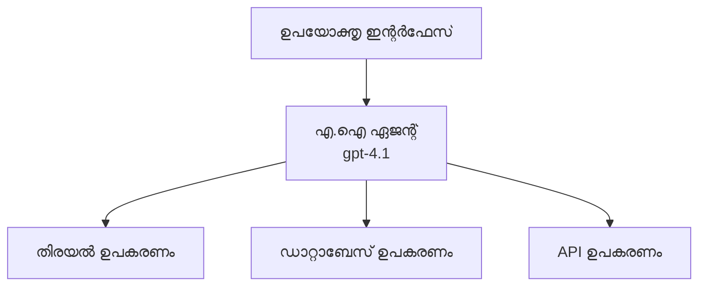
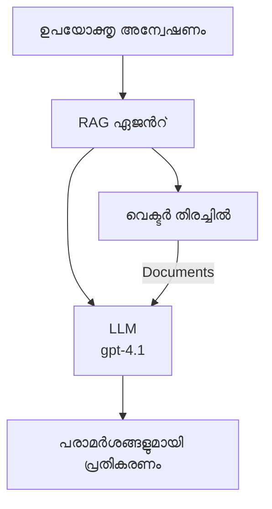
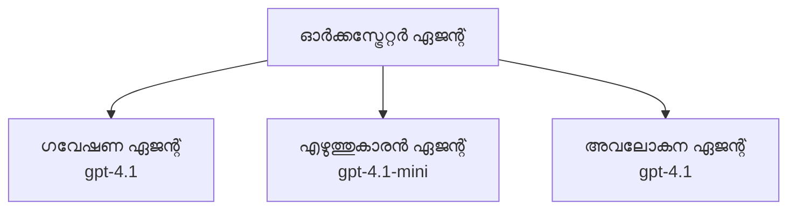

# Azure Developer CLI Xennaaya AI ഏജന്റുകൾ

**അധ്യായം നാവിഗേഷൻ:**
- **📚 കോഴ്സ് ഹോം**: [AZD For Beginners](../../README.md)
- **📖 ഇപ്പോഴത്തെ അധ്യായം**: അധ്യായം 2 - AI-ഫസ്റ്റ് ഡെവലപ്പ്മെന്റ്
- **⬅️ മുൻപത്തെ**: [Microsoft Foundry Integration](microsoft-foundry-integration.md)
- **➡️ അടുത്തത്**: [AI Model Deployment](ai-model-deployment.md)
- **🚀 അഡ്വാൻസ്ഡ്**: [Multi-Agent Solutions](../../examples/retail-scenario.md)

---

## പരിചയം

AI ഏജന്റുകൾ സ്വയം നിയന്ത്രിക്കാവുന്ന പ്രോഗ്രാമുകൾ ആണ്, അവ പരിസരത്തെ തിരിച്ചറിയുകയും, തീരുമാനങ്ങൾ എടുക്കുകയും, നിശ്ചിത ലക്ഷ്യങ്ങൾ കൈവരിക്കാൻ പ്രവർത്തിക്കുകയും ചെയ്യുന്നു. പ്രൊമ്പ്റ്റുകൾക്ക് മറുപടി പറയുന്ന ലളിതമായ ചാറ്റ്ബോട്ടുകളുമായി താരതമ്യം ചെയ്യുമ്പോൾ, ഏജന്റുകൾക്ക്:

- **ടൂളുകൾ ഉപയോഗിക്കുക** - APIകൾ വിളിക്കുക, ഡാറ്റാബേസ് തിരയുക, കോഡ് നടപ്പിലാക്കുക
- **പ്ലാൻ ചെയ്യുകയും നിരീക്ഷിക്കുകയും ചെയ്യുക** - കഠിനമായ ടാസ്കുകൾ തിരിച്ചറിഞ്ഞ് പടികളായി വിഭജിക്കുക
- **സന്ദർഭത്തിൽ നിന്ന് പഠിക്കുക** - സ്മരണ നിലനിർത്തുകയും പെരുമാറ്റം അനുസരിച്ച് മാറ്റം വരുത്തുകയും ചെയ്യുക
- **സഹകരിക്കുക** - മറ്റ് ഏജന്റുകളുമായി (മൾട്ടി-ഏജന്റ് സിസ്റ്റങ്ങൾ) ചേർന്ന് പ്രവർത്തിക്കുക

ഈ ഗൈഡ് Azure Developer CLI (azd) ഉപയോഗിച്ച് Azure-ൽ AI ഏജന്റുകൾ എങ്ങനെ ഡിപ്ലോയ് ചെയ്യാമെന്ന് കാണിക്കുന്നു.

> **സ്ഥിരീകരണ കുറിപ്പ് (2026-07-13):** ഈ ഗൈഡ് `azd` `1.27.1` കൂടാതെ `azure.ai.agents` `1.0.0-beta.5` ന്റെ അടിസ്ഥാനത്തിലുള്ളതാണ്. `azd ai` അനുഭവം ഇപ്പോഴും പ്രിവ്യൂ-നിർമ്മിതമാണ്, അതിനാൽ നിങ്ങളുടെ ഇൻസ്റ്റാൾ ചെയ്ത പതിപ്പിൽ വ്യത്യാസമുണ്ടെങ്കിൽ എക്സ്റ്റൻഷനിന്റെ സഹായം പരിശോധിക്കുക.

## പഠനലക്ഷ്യങ്ങൾ

ഈ ഗൈഡ് പൂർത്തിയാക്കിയാൽ:
- AI ഏജന്റുകൾ എന്താണ്, ചാറ്റ്ബോട്ടുകളിൽ നിന്നും എങ്ങനെ വ്യത്യസ്തമാണെന്ന് മനസ്സിലാക്കാം
- AZD ഉപയോഗിച്ച് മുൻകൂർ നിർമ്മിച്ച AI ഏജന്റ് ടെംപ്ലേറ്റുകൾ ഡിപ്ലോയ് ചെയ്യാം
- കസ്റ്റം ഏജന്റുകൾക്കായി Foundry Agents കോൺഫിഗർ ചെയ്യാനാകും
- അടിസ്ഥാന ഏജന്റ് മാതൃകകൾ (ടൂൾ ഉപയോഗം, RAG, മൾട്ടി-ഏജന്റ്) നടപ്പിലാക്കുക
- ഡിപ്ലോയാക്കിയ ഏജന്റുകൾ നിഗമനം ചെയ്‌തും ഡീബഗ് ചെയ്‌തും നടത്തുക

## പഠനഫലം

പൂർത്തിയാക്കിയപ്പോൾ, നിങ്ങൾക്ക് കഴിയും:
- ഒരൊറ്റ കമാൻഡിൽ Azure-ൽ AI ഏജന്റ് ആപ്ലിക്കേഷനുകൾ ഡിപ്ലോയ് ചെയ്യാൻ
- ഏജന്റ് ടൂളുകൾക്കും കഴിവുകൾക്കും കോൺഫിഗർ ചെയ്യാൻ
- Retrieval-Augmented Generation (RAG) മേൽ ഏജന്റുകൾ ഉപയോഗിച്ച് നടപ്പിലാക്കാൻ
- കഠിനമായ വർക്ക്‌ഫ്ളോകൾക്കായി മൾട്ടി-ഏജന്റ് ആർക്കിടെക്ചറുകൾ രൂപകല്പന ചെയ്യാനാകും
- സാധാരണ ഏജന്റ് ഡിപ്ലോയ്മെന്റ് പ്രശ്നങ്ങൾ പരിഹരിക്കാൻ

---

## 🤖 ഏജന്റ് ഒരു ചാറ്റ്ബോട്ടിൽ നിന്നും എന്തുകൊണ്ട് വ്യത്യസ്തമാണ്?

| സവിശേഷത | ചാറ്റ്ബോട്ടു | AI ഏജന്റ് |
|---------|---------|----------|
| ** പെരുമാറ്റം** | പ്രൊമ്പ്റ്റുകൾക്ക് പ്രതികരിക്കുന്നു | സ്വയം നിയന്ത്രിത പ്രവർത്തികൾ നടത്തുന്നു |
| **ടൂളുകൾ** | ഇല്ല | APIകൾ വിളിക്കാം, തിരയാം, കോഡ് നടപ്പിലാക്കാം |
| ** ഓർമ്മ** | സെഷൻ അടിസ്ഥാനമാക്കി | സെഷനുകൾകു മുകളിൽ സ്ഥിരമായ ഓർമ്മ |
| ** പദ്ധതി നിർമാണം** | ഒറ്റ മറുപടി | ബഹുപടിയായ ചിന്തന പ്രക്രിയ |
| ** സഹകരണം** | ഒറ്റ ഘടകം | മറ്റ് ഏജന്റുകളുമായി സഹകരിക്കാം |

### ലളിതമായ ഉപമ

- **ചാറ്റ്ബോട്ടു** = ഒരു വിവരശ്രേഷ്ഠന്യക്ഷരോ സമീപവും സംശയങ്ങൾക്കു മറുപടി പറയുന്ന സഹായിപ്രശ്നോധരി
- **AI ഏജന്റ്** = ഫോണുകൾ വിളിക്കുകയും, നിയമനങ്ങൾ ബുക്ക് ചെയ്യുകയും, നിങ്ങളുടെ സഹായത്തിനായി ടാസ്കുകൾ പൂർത്തിയാക്കുകയും ചെയ്യുന്ന വ്യക്തിഗത അസിസ്റ്റന്റ്

---

## 🚀 വേഗത്തിലുള്ള തുടക്കം: നിങ്ങളുടെ ആദ്യ ഏജന്റ് ഡിപ്ലോയ് ചെയ്യുക

### ഓപ്ഷൻ 1: Foundry Agents ടെംപ്ലേറ്റ് (സുപാരിഷ്ടം)

```bash
# AI ഏജന്റുകളുടെ ടെംപ്ലേറ്റ് ആരംഭിക്കുക
azd init --template get-started-with-ai-agents

# ആzure-ൽ വിന്യസിക്കുക
azd up
```

**എന്താണ് ഡിപ്ലോയ് ചെയ്യുന്ന:** 
- ✅ Foundry Agents
- ✅ Microsoft Foundry Models (gpt-4.1)
- ✅ Azure AI Search (RAG വേണ്ടി)
- ✅ Azure Container Apps (വെബ് ഇന്റർഫേസ്)
- ✅ Application Insights (നിഗമനം)

**സമയം:** ~15-20 മിനിറ്റ്
**ചെലവ്:** ~$100-150/മാസം (വികസനം)

### ഓപ്ഷൻ 2: Prompty ഉപയോഗിച്ച് OpenAI ഏജന്റ്

```bash
# Prompty-ആധാരിത ഏജന്റ് ടേമ്പ്ലേറ്റ് ആരംഭിക്കുക
azd init --template agent-openai-python-prompty

# Azure-ലേക്ക് വിന്യസിക്കുക
azd up
```

**എന്താണ് ഡിപ്ലോയ് ചെയ്യുന്ന:**
- ✅ Azure Functions (സെർവർലെസ് ഏജന്റ് നടപ്പാക്കൽ)
- ✅ Microsoft Foundry മോഡലുകൾ
- ✅ Prompty കോൺഫിഗറേഷൻ ഫയലുകൾ
- ✅ സാമ്പിൾ ഏജന്റ് നടപ്പാക്കൽ

**സമയം:** ~10-15 മിനിറ്റ്
**ചെലവ്:** ~$50-100/മാസം (വികസനം)

### ഓപ്ഷൻ 3: RAG ചാറ്റ് ഏജന്റ്

```bash
# RAG ചാറ്റ് ടെംപ്ലേറ്റ് ആരംഭിക്കുക
azd init --template azure-search-openai-demo

# Azure-ലേക്ക് വിന്യസിക്കുക
azd up
```

**എന്താണ് ഡിപ്ലോയ് ചെയ്യുന്ന:**
- ✅ Microsoft Foundry മോഡലുകൾ
- ✅ Azure AI Search സാമ്പിൾ ഡാറ്റയോടെ
- ✅ ഡോക്യുമെന്റ് പ്രോസസ്സിംഗ് പൈപ്പ്‌ലൈൻ
- ✅ സൈറ്റേഷനുകളുള്ള ചാറ്റ് ഇന്റർഫേസ്

**സമയം:** ~15-25 മിനിറ്റ്
**ചെലവ്:** ~$80-150/മാസം (വികസനം)

### ഓപ്ഷൻ 4: AZD AI ഏജന്റ് ഇൻറിങ് (മാനിഫസ്റ്റ് അല്ലെങ്കിൽ ടെംപ്ലേറ്റ് അടിസ്ഥാനമുള്ള പ്രിവ്യൂ)

നിങ്ങള്‍ ഏജന്റ് മാനിഫസ്റ്റ് ഫയൽ ഉണ്ടെങ്കിൽ, `azd ai` കമാൻഡ് ഉപയോഗിച്ച് നേരിട്ട് Foundry Agent Service പ്രോജക്റ്റ് സ്കാഫോൾഡ് ചെയ്യാം. പുതിയ പ്രിവ്യൂ റിലീസുകൾ ടെംപ്ലേറ്റ് അടിസ്ഥാനത്തിലുള്ള ഇൻഷിയലൈസേഷൻ പിന്തുണയും ചേർത്തിരിക്കുന്നു, അതിനാൽ ഇൻസ്റ്റാൾ ചെയ്ത എക്സ്റ്റൻഷൻ പതിപ്പിന്റെ അടിസ്ഥാനത്തിൽ പ്രോമ്പ്റ്റ് പ്രവാഹം സ്വൽപ്പം വ്യത്യാസപ്പെട്ടേക്കാം.

```bash
# AI ഏജൻസ് എക്സ്റ്റൻഷൻ ഇൻസ്റ്റാൾ ചെയ്യുക
azd extension install azure.ai.agents

# ഐച്ഛികം: ഇൻസ്റ്റാൾ ചെയ്ത പ്രിവ്യൂ പതിപ്പ് സ്ഥിരീകരിക്കുക
azd extension show azure.ai.agents

# ഏജന്റ് മാനിഫെസ്റ്റ് മുള_anchorർടിത്തുക
azd ai agent init -m agent-manifest.yaml

# ആസ്യൂർ-ലേക്ക് വിന്യസിക്കുക
azd up

# വിന്യസിച്ച ഏജന്റ് പരിശോധന (ലേറ്റൻസി + ആദ്യ ബൈറ്റ് സമയവും കാണിക്കുന്നു)
azd ai agent invoke
```

**`azd ai agent init` ഉപയോഗിച്ചുള്ളതും `azd init --template` ഉപയോഗിച്ചുള്ളതും തമ്മിലുള്ളതെന്താണെന്ന്:**

| സമീപനം | ഏറ്റവും ഉചിതം | പ്രവർത്തിയുടെ രീതി |
|----------|----------|------|
| `azd init --template` | പ്രവർത്തനരഹിതമായ സാമ്പിൾ ആപ്പ് മുതലാക്കുമ്പോൾ | കോഡ്+ഇൻഫ്ര ഉള്ള പൂർണ്ണ ടെംപ്ലേറ്റ് റിപോ ക്ലോൺ ചെയ്യുന്നു |
| `azd ai agent init -m` | നിങ്ങളുടെ സ്വന്തം ഏജന്റ് മാനിഫസ്റ്റ് ഉപയോഗിച്ച് നിർമ്മിക്കുമ്പോൾ | നിങ്ങളുടെ ഏജന്റ് നിർവചനത്തിൽ നിന്നുള്ള പ്രോജക്റ്റ് ഘടന സ്കാഫോൾഡ് ചെയ്യുന്നു |

> **ടിപ്പ്:** പഠനത്തിനായി `azd init --template` ഉപയോഗിക്കുക (മുകളിലുള്ള ഓപ്ഷനുകൾ 1-3). നിർമ്മാണ പുരോഗതിയുള്ള ഏജന്റുകൾക്കായി നിങ്ങളുടെ സ്വന്തം മാനിഫസ്റ്റുകൾ ഉപയോഗിക്കുമ്പോൾ `azd ai agent init` ഉപയോഗിക്കുക.

`azd up` കഴിഞ്ഞ്, అదే എക്സ്റ്റൻഷൻ ഏജന്റ് ലൈഫ്‌സൈക്കിൾ തുടർന്നും കൈകാര്യം ചെയ്യുന്നു: പരിശോധിക്കാൻ `azd ai agent invoke`, ഗുണമേന്മ മെച്ചപ്പെടുത്താൻ `azd ai agent eval generate` & `azd ai agent optimize`, ക്ലീൻ അപ് ചെയ്യാൻ `azd ai agent delete`. മുഴുവൻ റഫറൻസ് [AZD AI CLI Commands](../chapter-08-production/production-ai-practices.md#azd-ai-cli-commands-and-extensions) ൽ കാണുക.

---

## 🏗️ ഏജന്റ് ശില്പശാസ്ത്ര മാതൃകകൾ

### മാതൃക 1: ടൂളുകളുള്ള ഒറ്റ ഏജന്റ്

ഏറ്റവും ലളിതമായ ഏജന്റ് മാതൃക - ഒറ്റ ഏജന്റ്, പല ടൂളുകളും ഉപയോഗിക്കുന്നു.



**ഉത്തമം:**
- കസ്റ്റമർ സപ്പോർട്ട് ബോട്ടുകൾ
- ഗവേഷണ അസിസ്റ്റന്റുകൾ
- ഡാറ്റ വിശകലന ഏജന്റുകൾ

**AZD ടെംപ്ലേറ്റ്:** `azure-search-openai-demo`

### മാതൃക 2: RAG ഏജന്റ് (Retrieval-Augmented Generation)

മറുപടികൾ സൃഷ്ടിക്കാൻ മുമ്പ് ബന്ധപ്പെട്ട രേഖകൾ തിരയുന്ന ഏജന്റ്.



**ഉത്തമം:**
- എന്റർപ്രൈസ് നോളേജ് ബേസുകൾ
- ഡോക്യുമെന്റ് Q&A സംവിധാനങ്ങൾ
- പാലനവും നിയമ ഗവേഷണവും

**AZD ടെംപ്ലേറ്റ്:** `azure-search-openai-demo`

### മാതൃക 3: മൾട്ടി-ഏജന്റ് സിസ്റ്റം

ബഹു വിദഗ്ധ ഏജന്റുകൾ ചേർന്ന് കഠിനമായ ടാസ്കുകളിൽ പ്രവർത്തിക്കുന്നു.



**ഉത്തമം:**
- കഠിനമായ ഉള്ളടക്ക നിർമ്മാണം
- ബഹുപടി വർക്ക്‌ഫ്ളോകൾ
- വ്യത്യസ്ത വിദഗ്ധർ ആവശ്യമുള്ള ടാസ്കുകൾ

**കൂടുതൽ പഠിക്കുക:** [മൾട്ടി-ഏജന്റ് കോർഡിനേഷൻ മാതൃകകൾ](../chapter-06-pre-deployment/coordination-patterns.md)

---

## ⚙️ ഏജന്റ് ടൂൾസ് കോൺഫിഗറേഷൻ

ഏജന്റുകൾ ശക്തിപ്രാപ്തരാകുന്നു যখন അവ ടൂളുകൾ ഉപയോഗിക്കാം. സാധാരണ ടൂളുകൾ എങ്ങനെ കോൺഫിഗർ ചെയ്യാമെന്ന് ഇവിടെ കാണുക:

### Foundry Agents-ൽ ടൂൾ കോൺഫിഗറേഷൻ

```python
# agent_config.py
from azure.ai.projects import AIProjectClient
from azure.ai.projects.models import FunctionTool, CodeInterpreterTool

# കസ്റ്റം ടൂളുകൾ നിർവചിക്കുക
search_tool = FunctionTool(
    name="search_knowledge_base",
    description="Search the company knowledge base for relevant documents",
    parameters={
        "type": "object",
        "properties": {
            "query": {
                "type": "string",
                "description": "The search query"
            }
        },
        "required": ["query"]
    }
)

# ടൂളുകളോടൊപ്പം ഏജന്റ് സൃഷ്‌ടിക്കുക
agent = project_client.agents.create_agent(
    model="gpt-4.1",
    name="Support Agent",
    instructions="You are a helpful support agent. Use the search tool to find relevant information.",
    tools=[search_tool, CodeInterpreterTool()]
)
```

### പരിസ്ഥിതി കോൺഫിഗറേഷൻ

```bash
# ഏജന്റ്-നിർദ്ദിഷ്ട പരിസര വ്യവസ്ഥകൾ ആസൂത്രണം ചെയ്യുക
azd env set AZURE_OPENAI_MODEL "gpt-4.1"
azd env set AGENT_INSTRUCTIONS "You are a helpful assistant..."
azd env set ENABLE_CODE_INTERPRETER "true"
azd env set ENABLE_FILE_SEARCH "true"

# പുതുക്കിയ കോൺഫിഗറേഷൻ ഉപയോഗിച്ച് വിന്യസിക്കുക
azd deploy
```

---

## 📊 ഏജന്റ്സ് നിരീക്ഷണം

### അപ്പ്‌ളിക്കേഷൻ ഇൻസൈറ്റ്സ് ഇന്റഗ്രേഷൻ

എല്ലാ AZD ഏജന്റ് ടെംപ്ലേറ്റുകളും നിരീക്ഷണത്തിനായി Application Insights ഉൾക്കൊള്ളിച്ചിരിക്കുന്നു:

```bash
# മേൽനോട്ട ഡാഷ്ബോർഡ് തുറക്കുക
azd monitor --overview

# ലൈവ് ലോഗുകൾ കാണുക
azd monitor --logs

# ലൈവ് മെട്രിക്‌സ് കാണുക
azd monitor --live
```

### ട്രാക്ക് ചെയ്യേണ്ട പ്രധാന മെട്രികുകൾ

| മെട്രിക് | വിവരണം | ലക്ഷ്യം |
|--------|-------------|--------|
| പ്രതിക്‌രിയാ വൈകിപാട് | മറുപടി സൃഷ്ടിക്കാൻ വേണ്ടി വേണ്ട സമയം | < 5 സെക്കൻഡ് |
| ടോക്കൺ ഉപയോഗം | ഓരോ അഭ്യർത്ഥനയ്ക്കുമുള്ള ടോക്കണുകൾ | ചെലവിന് നിരീക്ഷണം |
| ടൂൾ കോൾ സക്സസ് നിരക്ക് | ടൂൾ പ്രവർത്തനത്തിലെ വിജയശതമാനം | > 95% |
| പിശക് നിരക്ക് | ഏജന്റ് അഭ്യർത്ഥന പരാജയപെട്ടത് | < 1% |
| ഉപയോക്തൃ സംതൃപ്തി | പ്രതികരണ സ്കോറുകൾ | > 4.0/5.0 |

### ഏജന്റുകൾക്കായുള്ള കസ്റ്റം ലോഗിംഗ്

```python
import os
from azure.monitor.opentelemetry import configure_azure_monitor
from opentelemetry import trace

# ഓപ്പൺടെലിമെട്രിയുമായി Azure മോണിറ്റർ ക്രമീകരിക്കുക
configure_azure_monitor(
    connection_string=os.environ["APPLICATIONINSIGHTS_CONNECTION_STRING"]
)

tracer = trace.get_tracer(__name__)

def log_agent_interaction(user_query, agent_response, tools_used, latency_ms):
    with tracer.start_as_current_span("agent_interaction") as span:
        span.set_attributes({
            "user_query": user_query,
            "response_length": len(agent_response),
            "tools_used": tools_used,
            "latency_ms": latency_ms
        })
```

> **കുറിപ്പ്:** ആവശ്യമായ പാക്കേജുകൾ ഇൻസ്റ്റാൾ ചെയ്യുക: `pip install azure-monitor-opentelemetry opentelemetry`

---

## 💰 ചെലവ് പരിഗണനകൾ

### മാതൃക അനുസരിച്ചുള്ള പ്രതിമാസ ചെലവ്

| മാതൃക | ഡെവ് പരിസ്ഥിതി | പ്രൊഡക്ഷൻ |
|---------|-----------------|------------|
| ഒറ്റ ഏജന്റ് | $50-100 | $200-500 |
| RAG ഏജന്റ് | $80-150 | $300-800 |
| മൾട്ടി-ഏജന്റ് (2-3 ഏജന്റുകൾ) | $150-300 | $500-1,500 |
| എന്റർപ്രൈസ് മൾട്ടി-ഏജന്റ് | $300-500 | $1,500-5,000+ |

### ചെലവ് മെച്ചപ്പെടുത്താനുള്ള ടിപ്പുകൾ

1. ** ലളിതമായ ടാസ്കുകൾക്കായി gpt-4.1-mini ഉപയോഗിക്കുക**
   ```bash
   azd env set AZURE_OPENAI_MODEL "gpt-4.1-mini"
   ```

2. ** ആവർത്തിക്കുന്ന അന്വേഷണംകൾക്കായി കാഷിംഗ് നടപ്പിലാക്കുക**
   ```python
   from functools import lru_cache
   
   @lru_cache(maxsize=1000)
   def get_cached_response(query_hash):
       return agent.run(query_hash)
   ```

3. **ഓരോ ഓപ്പണിനും ടോക്കൺ പരിധി നിശ്ചയിക്കുക**
   ```python
   # ഏജന്റ് ഓടിക്കുമ്പോൾ max_completion_tokens സജ്ജമാക്കുക, സൃഷ്ടിക്കുമ്പോൾ അല്ല
   run = project_client.agents.create_run(
       thread_id=thread.id,
       agent_id=agent.id,
       max_completion_tokens=1000  # പ്രതികരണത്തിന്റെ ദൈർഘ്യം പരിമിതപ്പെടുത്തുക
   )
   ```

4. ** ഉപയോഗത്തിൽ ഇല്ലാത്തപ്പോൾ സേഫ് സ്‌കെയ്ല് ചൂണ്ടുക**
   ```bash
   # കണ്ടെയ്‌നർ ആപുകൾ സ്വയം തുകയില്ലാതെ സ്കെയിൽ ചെയ്‌തെടുക്കുന്നു
   azd env set MIN_REPLICAS "0"
   ```

---

## 🔧 ഏജന്റുകൾക്ക് Troubleshooting

### സാധാരണ പ്രശ്നങ്ങളും പരിഹാരങ്ങളും

<details>
<summary><strong>❌ ടൂൾ കോളുകൾക്ക് ഏജന്റ് പ്രതികരിക്കുന്നില്ല</strong></summary>

```bash
# സാങ്കേതികോപകരണങ്ങൾ ശരിയായി രജിസ്റ്റർ ചെയ്തിട്ടുണ്ടോ എന്ന് പരിശോധിക്കുക
azd show

# OpenAI ഡെപ്ലോയ്മെന്റ് പരിശോധിക്കുക
az cognitiveservices account deployment list \
  --name $AZURE_OPENAI_NAME \
  --resource-group $RG_NAME

# ഏജന്റ് ലോഗുകൾ പരിശോധിക്കുക
azd monitor --logs
```

**സാധാരണ കാരണംകൾ:**
- ടൂൾ ഫംഗ്ഷൻ സിഗ്നേച്ചർ പൊരുത്തക്കേട്
- ആവശ്യമായ അനുമതികൾ ഇല്ലാത 있음
- API എന്റ്പോയിന്റ് ലഭ്യമല്ല
</details>

<details>
<summary><strong>❌ ഏജന്റ് മറുപടികളിൽ ഉയർന്ന വൈകിപാട്</strong></summary>

```bash
# തടസ്സങ്ങൾക്കായി അപ്ലിക്കേഷൻ ഇൻസൈറ്റ്സ് പരിശോധിക്കുക
azd monitor --live

# വേഗമുള്ള മോഡൽ ഉപയോഗിക്കാമെന്ന് പരിഗണിക്കുക
azd env set AZURE_OPENAI_MODEL "gpt-4.1-mini"
azd deploy
```

**മെച്ചപ്പെടുത്താനുള്ള ടിപ്പുകൾ:**
- സ്റ്റ്രീമിംഗ് മറുപടികൾ ഉപയോഗിക്കുക
- മറുപടി കാഷിംഗ് നടപ്പിലാക്കുക
- കോൺടെക്സ്റ്റ് വിൻഡോ വലിപ്പം കുറക്കുക
</details>

<details>
<summary><strong>❌ തെറ്റായ അല്ലെങ്കിൽ ഹല്ലുസിനേറ്റ് ചെയ്ത വിവരങ്ങൾ ഏജന്റ് നൽകുന്നു</strong></summary>

```python
# മികച്ച സിസ്റ്റം പ്രോംപ്റ്റുകൾ ഉപയോഗിച്ച് മെച്ചപ്പെടുത്തുക
instructions = """
You are a helpful assistant. IMPORTANT:
- Only answer based on provided context
- If you don't know, say "I don't know"
- Always cite your sources
- Never make up information
"""

# ഗ്രൗണ്ടിംഗിനായി റിട്രീവൽ ചേർക്കുക
agent = project_client.agents.create_agent(
    model="gpt-4.1",
    instructions=instructions,
    tools=[FileSearchTool()]  # ഡോക്യുമെന്റുകളിൽ പ്രതികരണങ്ങൾ ഗ്രൗണ്ട് ചെയ്യുക
)
```
</details>

<details>
<summary><strong>❌ ടോക്കൺ പരിധി കടന്നുപോയ പിശക്</strong></summary>

```python
# കോൺടെക്സ്റ്റ് വിൻഡോ മാനേജ്മെന്റ് നടപ്പിലാക്കുക
def truncate_context(messages, max_tokens=8000, model="gpt-4.1"):
    """Keep only recent messages within token limit."""
    import tiktoken
    encoding = tiktoken.encoding_for_model(model)
    total_tokens = 0
    truncated = []
    
    for msg in reversed(messages):
        msg_tokens = len(encoding.encode(msg.content))
        if total_tokens + msg_tokens > max_tokens:
            break
        truncated.insert(0, msg)
        total_tokens += msg_tokens
    
    return truncated
```
</details>

---

## 🎓 പ്രായോഗിക അഭ്യാസങ്ങൾ

### അഭ്യാസം 1: ഒരു അടിസ്ഥാന ഏജന്റ് ഡിപ്ലോയ് ചെയ്യുക (20 മിനിറ്റ്)

**ലക്ഷ്യം:** നിങ്ങളുടെ ആദ്യ AI ഏജന്റ് AZD ഉപയോഗിച്ച് ഡിപ്ലോയ് ചെയ്യുക

```bash
# ഘട്ടം 1: ടെംപ്ലേറ്റ് ആരംഭിക്കുക
azd init --template get-started-with-ai-agents

# ഘട്ടം 2: ആസ്യൂറിൽ ലോഗിൻ ചെയ്യുക
azd auth login
# നിങ്ങൾudde ഒരു-ടിeകൾക്ക്‌ ജോലി ചെയ്യുകയാണെങ്കിൽ, --tenant-id <tenant-id> ചേർക്കുക

# ഘട്ടം 3: വിന്യസിക്കുക
azd up

# ഘട്ടം 4: ഏജന്റ് പരീക്ഷിക്കുക
# വിന്യസിക്കലിനു ശേഷം പ്രതീക്ഷിച്ച ഔട്ട്പുട്ട്:
#   വിന്യാസം പൂർത്തിയായി!
#   എന്റ്പോയിന്റ്: https://<app-name>.<region>.azurecontainerapps.io
# ഔട്ട്പുട്ടിൽ കാണുന്ന URL തുറന്ന് ഒരു ചോദ്യം ചോദിക്കാൻ ശ്രമിക്കുക

# ഘട്ടം 5: മോണിറ്ററിംഗ് കാണുക
azd monitor --overview

# ഘട്ടം 6: ശുചീകരിക്കുക
azd down --force --purge
```

**വിജയമായ മാനദണ്ഡങ്ങൾ:**
- [ ] ഏജന്റ് ചോദ്യംಗಳಿಗೆ പ്രതികരിക്കുന്നു
- [ ] `azd monitor` വഴി നിരീക്ഷണ ഡാഷ്ബോർഡ് ആക്‌സസ് ചെയ്യുന്നു
- [ ] ഉറവിടങ്ങൾ വിജയകരമായി ക്ലീൻ ചെയ്തിട്ടുണ്ട്

### അഭ്യാസം 2: ഒരു കസ്റ്റം ടൂൾ ചേർക്കുക (30 മിനിറ്റ്)

**ലക്ഷ്യം:** ഒരു ഏജന്റ് കസ്റ്റം ടൂളുമായി വിപുലീകരിക്കുക

1. ഏജന്റ് ടെംപ്ലേറ്റ് ഡിപ്ലോയ് ചെയ്യുക:
   ```bash
   azd init --template get-started-with-ai-agents
   azd up
   ```
2. നിങ്ങളുടെ ഏജന്റ് കോഡിൽ പുതിയ ടൂൾ ഫംഗ്ഷൻ സൃഷ്ടിക്കുക:
   ```python
   def get_weather(location: str) -> str:
       """Get current weather for a location."""
       # കാലാവസ്ഥ സേവനത്തിനുള്ള API കോൾ
       return f"Weather in {location}: Sunny, 72°F"
   ```
3. ടൂൾ ഏജന്റോടൊപ്പം രജിസ്റ്റർ ചെയ്യുക:
   ```python
   from azure.ai.projects.models import FunctionTool

   weather_tool = FunctionTool(
       name="get_weather",
       description="Get current weather for a location",
       parameters={
           "type": "object",
           "properties": {
               "location": {"type": "string", "description": "City name"}
           },
           "required": ["location"]
       }
   )

   agent = project_client.agents.create_agent(
       model="gpt-4.1",
       name="Weather Agent",
       tools=[weather_tool]
   )
   ```
4. പുനഃപ്രക്ഷേപണം ചെയ്ത് പരിശോധിക്കുക:
   ```bash
   azd deploy
   # ചോദിക്കുക: "സിയാറ്റിലിന്റെ കാലാവസ്ഥ എങ്ങനെയാണ്?"
   # പ്രതീക്ഷിക്കപ്പെടുന്നത്: എജൻറ് get_weather("Seattle") വിളിച്ച് കാലാവസ്ഥ വിവരങ്ങൾ നൽകും
   ```

**വിജയമായ മാനദണ്ഡങ്ങൾ:**
- [ ] ഏജന്റ് കാലാവസ്ഥ സംബന്ധിച്ച ചോദ്യം തിരിച്ചറിയുന്നു
- [ ] ടൂൾ ശരിയായി വിളിക്കുന്നു
- [ ] മറുപടി കാലാവസ്ഥ വിവരങ്ങൾ ഉൾക്കൊള്ളുന്നു

### അഭ്യാസം 3: ഒരു RAG ഏജന്റ് നിർമ്മിക്കുക (45 മിനിറ്റ്)

**ലക്ഷ്യം:** നിങ്ങളുടെ രേഖകളിൽ നിന്നുള്ള ചോദ്യങ്ങൾക്ക് എഞ്ചെറുള്ളുള്ള ഒരു ഏജന്റ് സൃഷ്ടിക്കുക

```bash
# പടി 1: RAG ടെംപ്ലേറ്റ് വിന്യസിക്കുക
azd init --template azure-search-openai-demo
azd up

# പടി 2: നിങ്ങളുടെ രേഖകൾ അപ്‌ലോഡ് ചെയ്യുക
# PDF/TXT ഫയലുകൾ data/ ഡയറക്ടറിയിൽ വെയ്ക്കുക, ശേഷം പ്രവർത്തിപ്പിക്കുക:
python scripts/prepdocs.py

# പടി 3: ഡൊമെയ്ൻ-പ്രത്യേക ചോദ്യങ്ങളോടെ പരീക്ഷിക്കുക
# azd up ഔട്ട്ബുട്ടിൽ നിന്ന് വെബ് ആപ്പ് URL തുറക്കുക
# നിങ്ങളുടെ അപ്‌ലോഡ് ചെയ്ത രേഖകൾക്കുറിച്ച് ചോദ്യങ്ങൾ ചോദിക്കുക
# ഉത്തരങ്ങൾ [doc.pdf] പോലുള്ള ചൊല്ലു റഫറൻസുകൾ ഉൾപ്പെടുത്തണം
```

**വിജയമായ മാനദണ്ഡങ്ങൾ:**
- [ ] അപ്ലോഡ് ചെയ്ത രേഖകളിൽനിന്ന് ഏജന്റ് ഉത്തരങ്ങൾ നൽകുന്നു
- [ ] മറുപടികൾ സൈറ്റേഷനുകൾ ഉൾക്കൊള്ളിക്കുന്നു
- [ ] പരിധി കടന്ന ചോദ്യങ്ങളിൽ തെറ്റായ മറുപടി ഇല്ല

---

## 📚 അടുത്ത പടികൾ

ഇപ്പോൾ നിങ്ങൾ AI ഏജന്റുകൾ എങ്ങനെ പ്രവർത്തിക്കുന്നുവെന്ന് മനസ്സിലാക്കിയിരിക്കുന്നു, ഈ ഉന്നത വിഷയങ്ങൾ പരിശോധിക്കുക:

| വിഷയവ് | വിവരണം | ലിങ്ക് |
|-------|-------------|------|
| **മൾട്ടി-ഏജന്റ് സിസ്റ്റങ്ങൾ** | പല ഏജന്റുകളും ചേർന്ന് പ്രവർത്തിക്കുന്ന സിസ്റ്റങ്ങൾ നിർമ്മിക്കുക | [Retail Multi-Agent Example](../../examples/retail-scenario.md) |
| **കോർഡിനേഷൻ മാതൃകകൾ** | ഓർക്കസ്ട്രേഷൻ, കമ്മ്യൂണിക്കേഷൻ മാതൃകകൾ പഠിക്കുക | [Coordination Patterns](../chapter-06-pre-deployment/coordination-patterns.md) |
| **പ്രൊഡക്ഷൻ ഡിപ്ലോയ്മെന്റ്** | എന്റർപ്രൈസ് റെഡി ഏജന്റ് ഡിപ്ലോയ്മെന്റ് | [Production AI Practices](../chapter-08-production/production-ai-practices.md) |
| **ഏജന്റ് വിലയിരുത്തൽ** | ഏജന്റ് പ്രകടനം പരിശോധിച്ച് വിലയിരുത്തൽ | [AI Troubleshooting](../chapter-07-troubleshooting/ai-troubleshooting.md) |
| **AI വർക്‌ഷോപ്പ് ലാബ്** | പ്രായോഗികം: നിങ്ങളുടെ AI സൊല്യൂഷൻ AZD-റെഡി ആക്കുക | [AI Workshop Lab](ai-workshop-lab.md) |

---

## 📖 അധിക സംഭരണങ്ങൾ

### ഔദ്യോഗിക ഡോക്യുമെന്റേഷന്‍
- [Microsoft Foundry Agent Service](https://learn.microsoft.com/azure/ai-services/agents/)
- [Microsoft Foundry Agent Service Quickstart](https://learn.microsoft.com/azure/ai-services/agents/quickstart)
- [Semantic Kernel Agent Framework](https://learn.microsoft.com/semantic-kernel/)

### AI ഏജന്റുകൾക്കായുള്ള AZD ടെംപ്ലേറ്റുകൾ
- [Get Started with AI Agents](https://github.com/Azure-Samples/get-started-with-ai-agents)
- [Agent OpenAI Python Prompty](https://github.com/Azure-Samples/agent-openai-python-prompty)
- [Azure Search OpenAI Demo](https://github.com/Azure-Samples/azure-search-openai-demo)

### കമ്മ്യൂണിറ്റി വിഭവങ്ങൾ
- [Awesome AZD - ഏജന്റ് ടെംപ്ലേറ്റുകൾ](https://azure.github.io/awesome-azd/?tags=ai-agents)
- [Azure AI Discord](https://discord.gg/microsoft-azure)
- [Microsoft Foundry Discord](https://discord.gg/nTYy5BXMWG)

### നിങ്ങളുടെ എഡിറ്ററിന് ഏജന്റ് കഴിവുകൾ
- [**Microsoft Azure Agent Skills**](https://skills.sh/microsoft/github-copilot-for-azure) - GitHub Copilot, Cursor അല്ലെങ്കിൽ പിന്തുണയുള്ള ഏജന്റിൽ Azure ഡെവലപ്പ്മെന്റിനായി പുനരുപയോഗിക്കാൻ കഴിയും AI ഏജന്റ് കഴിവുകൾ ഇൻസ്റ്റാൾ ചെയ്യുക. [Azure AI](https://skills.sh/microsoft/github-copilot-for-azure/azure-ai), [Microsoft Foundry](https://skills.sh/microsoft/github-copilot-for-azure/microsoft-foundry), [ഡിപ്ലോയ്മെന്റ്](https://skills.sh/microsoft/github-copilot-for-azure/azure-deploy), [ഡയഗ്നോസ്റ്റിക്സ്](https://skills.sh/microsoft/github-copilot-for-azure/azure-diagnostics) ഉൾപ്പെടുന്നു:
  ```bash
  npx skills add microsoft/github-copilot-for-azure
  ```

---

**നാവിഗേഷൻ**
- **മുൻപത്തെ പാഠം**: [Microsoft Foundry Integration](microsoft-foundry-integration.md)
- **അടുത്ത പാഠം**: [AI Model Deployment](ai-model-deployment.md)

---

<!-- CO-OP TRANSLATOR DISCLAIMER START -->
**അറിയിപ്പ്**:
ഈ രേഖ AI പരിഭാഷാ സേവനം [Co-op Translator](https://github.com/Azure/co-op-translator) ഉപയോഗിച്ച് പരിഭാഷപ്പെടുത്തിയതാണ്. ഞങ്ങൾ കൃത്യതയ്ക്കായി ശ്രമിക്കുന്നുവെങ്കിലും, ഓട്ടോമേറ്റഡ് പരിഭാഷകളിൽ പിഴവുകൾ അല്ലെങ്കിൽ തെറ്റായ വിവരങ്ങൾ ഉണ്ടാകാൻ സാധ്യതയുണ്ട്. അതിന്റെ സ്വാഭാവിക ഭാഷയിലുള്ള അസൽ രേഖയാണ് പ്രാമാണികമായ ഉറവിടമായി പരിഗണിക്കേണ്ടത്. നിർണായകമായ വിവരങ്ങൾക്ക്, പ്രൊഫഷണൽ മനുഷ്യ പരിഭാഷ ശുപാർശ ചെയ്യുന്നു. ഈ പരിഭാഷ ഉപയോഗിച്ച് ഉണ്ടാകുന്ന തെറ്റിദ്ധാരണകൾ അല്ലെങ്കിൽ തെറ്റായ വ്യാഖ്യാനങ്ങൾക്കായി ഞങ്ങൾ ഉത്തരവാദികളല്ല.
<!-- CO-OP TRANSLATOR DISCLAIMER END -->