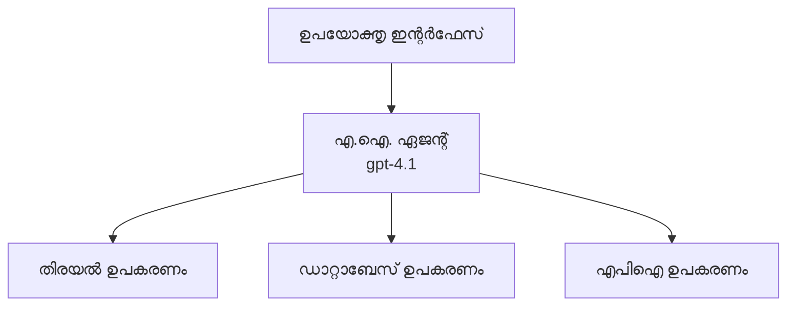
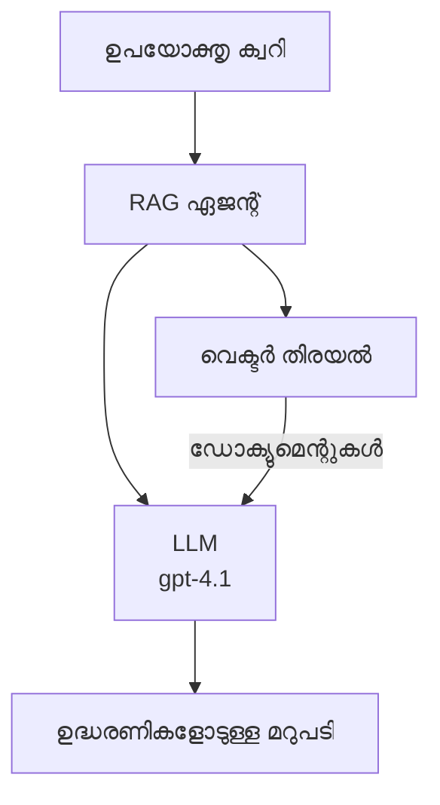
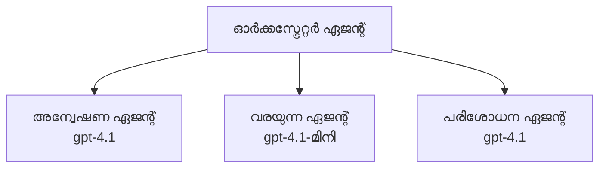

# Azure Developer CLI ഉപയോഗിച്ച് AI ഏജന്റുകൾ

**അദ്ധ്യായം നാവിഗേഷൻ:**
- **📚 കോഴ്‌സ് ഹോം**: [AZD For Beginners](../../README.md)
- **📖 ഇപ്പോഴുള്ള അദ്ധ്യായം**: അദ്ധ്യായം 2 - AI-പ്രഥമ വികസനം
- **⬅️ മുമ്പോട്ട്**: [Microsoft Foundry Integration](microsoft-foundry-integration.md)
- **➡️ അടുത്തത്**: [AI Model Deployment](ai-model-deployment.md)
- **🚀 പുരോഗതിക്ക്**: [Multi-Agent Solutions](../../examples/retail-scenario.md)

---

## പരിചയം

AI ഏജന്റുകൾ സ്വയംപര്യാപ്തമായ പ്രോഗ്രാമുകൾ ആണ്, അവ പരിസ്ഥിതിയെ ഗ്രഹിച്ച്, തീരുമാനം എടുത്ത്, പ്രത്യേക ലക്ഷ്യങ്ങൾ നടത്താനുള്ള പ്രവർത്തനങ്ങൾ ചെയ്യും. പ്രോമ്പ്റ്റുകൾക്ക് പ്രതികരിക്കുന്ന ലളിതമായ ചാറ്റ്ബോട്ടുകളിൽനിന്ന് വ്യത്യസ്തമായി, ഏജന്റുകൾക്ക് കഴിയും:

- **ഉപകരണം ഉപയോഗിക്കുക** - APIകൾ വിളിക്കുക, ഡേറ്റാബേസുകൾ തിരയുക, കോഡ് നിർവ്വഹിക്കുക
- **പദ്ധതി രൂപപ്പെടുത്തുക** - സങ്കീർണ്ണമായ പ്രവൃത്തികൾ പടികളായി വിഭജിക്കുക
- **സന്ദർഭത്തിൽനിന്ന് പഠിക്കുക** - ഓർമ്മ നിലനിർത്തുകയും പെരുമാറ്റം അനുസൃതമാക്കുകയും ചെയ്യുക
- **കൂട്ടായ്മ** - മറ്റു ഏജന്റുകളുമായി (മൾട്ടി-ഏജന്റ് സിസ്റ്റം) പ്രവർത്തിക്കുക

ഈ ഗൈഡ് Azure Developer CLI (azd) ഉപയോഗിച്ച് Azure-ൽ AI ഏജന്റുകൾ എങ്ങനെ വിന്യസിക്കാമെന്നും കാണിക്കുന്നു.

> **സാധൂകരിക്കൽ കുറിപ്പ് (2026-03-25):** ഈ ഗൈഡ് `azd` `1.23.12` & `azure.ai.agents` `0.1.18-preview` അടിസ്ഥാനത്തിൽ പരിശോധിച്ചു. `azd ai` അനുഭവം ഇപ്പോഴും പൂർണ്ണപരീക്ഷാമൂലം ആണ്, അതിനാൽ ഇൻസ്റ്റാൾ ചെയ്ത ഫ്ളാഗുകൾ വ്യത്യസ്തമായാൽ എക്‌സ്‌ടെൻഷൻ സഹായം പരിശോധിക്കുക.

## പഠന ലക്ഷ്യങ്ങൾ

ഈ ഗൈഡ് പൂർത്തിയാക്കുമ്പോൾ, നിങ്ങൾക്ക് കഴിയും:
- AI ഏജന്റുകളെപ്പറ്റിയും അവ ചാറ്റ്ബോട്ടുകളെപ്പറ്റിയും വ്യത്യാസം മനസ്സിലാക്കുക
- AZD ഉപയോഗിച്ച് മുൻകൂട്ടി തീരപ്പെടുത്തിയ AI ഏജന്റ് ടെംപ്ലേറ്റുകൾ വിന്യസിക്കുക
- ക്രമീകരിച്ച ഏജന്റുകൾക്ക് ഫൗണ്ട്രി ഏജന്റുകൾ കോൺഫിഗർ ചെയ്യുക
- അടിസ്ഥാന ഏജന്റ് പാറ്റേണുകൾ (ഉപകരണം ഉപയോഗം, RAG, മൾട്ടി-ഏജന്റ്) നടപ്പിലാക്കുക
- വിന്യസിച്ച ഏജന്റുകളുടെ മോണിറ്ററിംഗ്, ഡീബഗ്ഗിംഗ് നടത്തുക

## പഠന ഫലങ്ങൾ

പൂർണ്ണമായപ്പോൾ, നിങ്ങൾക്ക് കഴിയും:
- ഒരൊറ്റ കമാൻഡിലൂടെ AI ഏജന്റ് അപ്ലിക്കേഷനുകൾ Azure-ലേക്ക് വിന്യസിക്കുക
- ഏജന്റ് ടൂളുകളും കഴിവുകളും കോൺഫിഗർ ചെയ്യുക
- ഏജന്റുകളോടുകൂടിയ רetrieve-അഗ്‌മെന്റഡ് ജനറേഷൻ (RAG) നടപ്പിലാക്കുക
- സങ്കീർണ്ണ വർക്ക്ഫ്ലോകൾക്കുള്ള മൾട്ടി-ഏജന്റ് ശില്പശാസ്ത്രങ്ങൾ രൂപകൽപ്പന ചെയ്യുക
- ആയുധമാകുന്ന ഏജന്റ് വിന്യാസ പ്രശ്നങ്ങൾ പരിഹരിക്കുക

---

## 🤖 ഏജന്റ് ഒരു ചാറ്റ്ബോട്ടിൽനിന്ന് വ്യത്യസ്തമാകുന്നത് എന്താണ്?

| സവിശേഷത | ചാറ്റ്ബോട്ട് | AI ഏജന്റ് |
|---------|-------------|-----------|
| **പെരുമാറ്റം** | പ്രോമ്പ്റ്റുകൾക്ക് പ്രതികരിക്കുന്നു | സ്വയംനിയന്ത്രിത പ്രവർത്തനം നടത്തുന്നു |
| **ഉപകരണങ്ങൾ** | ഇല്ല | APIകൾ വിളിക്കാം, തിരയാം, കോഡ് നിർവ്വഹിക്കാം |
| **ഓർമ്മ** | സെഷൻ അടിസ്ഥാനമാക്കിയുള്ളത് മാത്രം | സെഷനുകൾക്കിടെ സ്ഥിര ഓർമ്മ |
| **പദ്ധതിവിശേഷം** | ഒറ്റ പ്രതികരണം | ബഹു-പടി വിവേകം |
| **കൂട്ടായ്മ** | ഒരൊറ്റ ഘടകം | മറ്റു ഏജന്റുകളുമായി ജോലി ചെയ്യാം |

### ലളിതമായ ഉപമ

- **ചാറ്റ്ബോട്ട്** = വിവരം ഡെസ്കിൽ ചോദ്യംക്കാർക്ക് സഹായിക്കുന്ന ഒരാൾ
- **AI ഏജന്റ്** = വിളികൾ നടത്താനും നിയമനങ്ങൾ ബുക്ക് ചെയ്യാനും പ്രവർത്തികൾ പൂർത്തിയാക്കാനും കഴിയുന്ന വ്യക്തিগত സഹായി

---

## 🚀 എളുപ്പത്തിൽ തുടങ്ങാം: നിങ്ങളുടെ ആദ്യ ഏജന്റ് വിന്യസിക്കുക

### ഓപ്ഷൻ 1: ഫൗണ്ട്രി ഏജന്റുകൾ ടെംപ്ലേറ്റ് (അനുമോദനീയമായത്)

```bash
# എഐ ഏജന്റുകൾ ടെംപ്ലേറ്റ് ആരംഭിക്കുക
azd init --template get-started-with-ai-agents

# അസ്യൂറിലേയ്ക്ക് വിന്യസിക്കുക
azd up
```

**വിന്യസിക്കുന്നത്:**
- ✅ ഫൗണ്ട്രി ഏജന്റുകൾ
- ✅ Microsoft Foundry മോഡലുകൾ (gpt-4.1)
- ✅ Azure AI Search (RAG-നായി)
- ✅ Azure Container Apps (വെബ് ഇന്റർഫേസ്)
- ✅ അപ്ലിക്കേഷൻ ഇൻസൈറ്റ്സ് (മോണിറ്ററിംഗ്)

**സമയം:** ~15-20 മിനിറ്റ്
**ചെലവ്:** ~$100-150/മാസം (വികസനം)

### ഓപ്ഷൻ 2: Prompty ഉപയോഗിച്ച് OpenAI ഏജന്റ്

```bash
# പ്രോമ്പ്റ്റി-ആധാരിത ഏജന്റിന്റെ ടേംപ്ലേറ്റ് ആരംഭിക്കുക
azd init --template agent-openai-python-prompty

# ആസ്യൂറിൽ വിന്യസിക്കുക
azd up
```

**വിന്യസിക്കുന്നത്:**
- ✅ Azure Functions (സെർവർലെസ് ഏജന്റ് നിർവഹണം)
- ✅ Microsoft Foundry മോഡലുകൾ
- ✅ Prompty കോൺഫിഗറേഷൻ ഫയലുകൾ
- ✅ സാമ്പിൾ ഏജന്റ് നടപ്പിലാക്കൽ

**സമയം:** ~10-15 മിനിറ്റ്
**ചെലവ്:** ~$50-100/മാസം (വികസനം)

### ഓപ്ഷൻ 3: RAG ചാറ്റ് ഏജന്റ്

```bash
# RAG ചാറ്റ് ടെമ്പ്ലേറ്റ് ആരംഭിക്കുക
azd init --template azure-search-openai-demo

# ഏസൂറിലേക്ക് വിന്യസിക്കുക
azd up
```

**വിന്യസിക്കുന്നത്:**
- ✅ Microsoft Foundry മോഡലുകൾ
- ✅ സാമ്പിൾ ഡാറ്റയോടുള്ള Azure AI Search
- ✅ ഡോക്യുമെന്റ് പ്രോസസ്സിംഗ് പൈപ്പ്നെൽ
- ✅ സൈറ്റേഷനുകളോടെ ചാറ്റ് ഇന്റർഫേസ്

**സമയം:** ~15-25 മിനിറ്റ്
**ചെലവ്:** ~$80-150/മാസം (വികസനം)

### ഓപ്ഷൻ 4: AZD AI Agent Init (മാനിഫെസ്റ്റ്-അഥവാ ടെംപ്ലേറ്റ് അടിസ്ഥാനത്തിലുള്ള പ്രിവ്യൂ)

നിങ്ങൾക്ക് ഏജന്റിന്റെ മാനിഫെസ്റ്റ് ഫയൽ ഉണ്ടെങ്കിൽ, `azd ai` കമാൻഡ് ഉപയോഗിച്ച് നേരിട്ട് ഫൗണ്ട്രി ഏജന്റ് സർവീസ് പ്രോജക്ട് സ്കാഫോൾഡ് ചെയ്യാം. പുതിയ പ്രിവ്യൂ റിലീസുകളിൽ ടെംപ്ലേറ്റ് അടിസ്ഥാനത്തിലുള്ള ഇൻഷിയലൈസേഷൻ പിന്തുണ കൂടെ ചേർന്നു, അതിനാൽ ഇൻസ്റ്റാൾ ചെയ്ത എക്‌സ്‌ടെൻഷൻ വേർഷനിനനുസരിച്ച് പ്രോംപ്റ്റ് പ്രവാഹം അല്പം വ്യത്യാസപ്പെടാം.

```bash
# AI ഏജന്റ്സ് എക്സ്റ്റൻഷൻ ഇൻസ്റ്റാൾ ചെയ്യുക
azd extension install azure.ai.agents

# ഐച്ഛികം: ഇൻസ്റ്റാൾ ചെയ്‌തിരിക്കുന്ന റിപ്പോർട്ട് പതിപ്പ് പരിശോധന നടത്തുക
azd extension show azure.ai.agents

# ഏജന്റ് മാനിഫസ്റ്റ് నుండి ഇൻഷിയലൈസ് ചെയ്യുക
azd ai agent init -m agent-manifest.yaml

# അസ്യൂറിൽ ഡിപ്ലോയ് ചെയ്യുക
azd up

# ഡിപ്ലോയ് ചെയ്ത ഏജന്റ് പരീക്ഷിക്കുക (വിലംബം + ആദ്യ ബൈറ്റ് വരെയുള്ള സമയം കാണിക്കുന്നു)
azd ai agent invoke
```

**`azd ai agent init` നും `azd init --template` നും തമ്മിലുള്ള വ്യത്യാസം:**

| രീതിവഴി | ഉചിതം | എങ്ങനെ പ്രവർത്തിക്കുന്നു |
|-----------|---------|-------------------|
| `azd init --template` | പ്രവർത്തനക്ഷമ സാമ്പിൾ ആപ്പ് ആരംഭിക്കുമ്പോൾ | കോഡ് + ഇൻഫ്രാ ഉള്ള ഫുൾ ടെംപ്ലേറ്റു റിപൊ ക്ലോൺ ചെയ്യുന്നു |
| `azd ai agent init -m` | സ്വന്തം ഏജന്റ് മാനിഫെസ്റ്റിൽനിന്നും നിർമ്മാണം | നിങ്ങളുടെ ഏജന്റ് നിർവചനത്തിൽനിന്ന് പ്രോജക്ട് ഘടന സ്കാഫോൾഡ് ചെയ്യുന്നു |

> ** ടിപ്പ്:** പഠിക്കുമ്പോൾ `azd init --template` (1-3 ഓപ്ഷനുകൾ) ഉപയോഗിക്കുക. നിങ്ങളുടെ സ്വന്തം മാനിഫെസ്റ്റുകളുമായി പ്രൊഡക്ഷൻ ഏജന്റുകൾ നിർമ്മിക്കുമ്പോൾ `azd ai agent init` ഉപയോഗിക്കുക.

`azd up` കഴിഞ്ഞ്, അതേ എക്‌സ്‌ടെൻഷൻ ഏജന്റ് ലൈഫ്‌സൈക്കിൾ തുടരും: `azd ai agent invoke` ടെസ്റ്റ് ചെയ്യാനും, `azd ai agent eval generate` & `azd ai agent optimize` ഗുണനിലവ് മെച്ചപ്പെടുത്താനും, `azd ai agent delete` ശുചീകരിക്കാനും. സമ്പൂർണ റഫറൻസിന് [AZD AI CLI Commands](../chapter-08-production/production-ai-practices.md#azd-ai-cli-commands-and-extensions) കാണുക.

---

## 🏗️ ഏജന്റ് ശില്പശാസ്ത്ര പാറ്റേണുകൾ

### പാറ്റേൺ 1: ഉപകരണങ്ങളോടുകൂടെ ഒരേ ഏജന്റ്

ഏറ്റവും ലളിതമായ ഏജന്റ് മാതൃക - ഒന്നുകിൽ പല ഉപകരണങ്ങളും ഉപയോഗിക്കാൻ കഴിയും.



**ഉചിതം:**
- കസ്റ്റമർ സപ്പോർട്ട് ബോട്ടുകൾ
- ഗവേഷണ സഹായികൾ
- ഡാറ്റാ വിശകലന ഏജന്റുകൾ

**AZD ടെംപ്ലേറ്റ്:** `azure-search-openai-demo`

### പാറ്റേൺ 2: RAG ഏജന്റ് (റീട്രീവൽ-അഗ്‌മെന്റഡ് ജനറേഷൻ)

പ്രതികരണങ്ങൾ സൃഷ്ടിക്കുന്നതിന് മുമ്പ് ബന്ധപ്പെട്ട രേഖകൾ തിരയുന്ന ഏജന്റ്.



**ഉചിതം:**
- എന്റർപ്രൈസ് നോളേജ് ബേസുകൾ
- ഡോക്യുമെന്റ് Q&A സംവിധാനങ്ങൾ
- പാലനവും നിയമ ഗവേഷണവും

**AZD ടെംപ്ലേറ്റ്:** `azure-search-openai-demo`

### പാറ്റേൺ 3: മൾട്ടി-ഏജന്റ് സിസ്റ്റം

സങ്കീർണ്ണ പ്രവർത്തികൾക്കായി നിരവധി പ്രത്യേകതകളുള്ള ഏജന്റുകൾ ചേർന്ന് പ്രവർത്തിക്കുന്നു.



**ഉചിതം:**
- സങ്കീർണ്ണ ഉള്ളടക്ക സൃഷ്ടി
- ബഹു-പടി പ്രവർത്തനങ്ങൾ
- വ്യത്യസ്ത വിദഗ്ധത ആവശ്യത്തുള്ള പ്രവൃത്തികൾ

**ഇനി പഠിക്കാൻ:** [മൾട്ടി-ഏജന്റ് കോർഡിനേഷൻ പാറ്റേണുകൾ](../chapter-06-pre-deployment/coordination-patterns.md)

---

## ⚙️ ഏജന്റ് ഉപകരണങ്ങൾ കോൺഫിഗർ ചെയ്യൽ

ഏജന്റുകൾ ഉപകരണങ്ങൾ ഉപയോഗിക്കുമ്പോൾ ശക്തമാകും. ഇവിടെ സാധാരണ ഉപകരണങ്ങൾ എങ്ങനെ കോൺഫിഗർ ചെയ്യാമെന്നുള്ളത്:

### ഫൗണ്ട്രി ഏജന്റുകളിൽ ഉപകരണം കോൺഫിഗറേഷൻ

```python
# agent_config.py
from azure.ai.projects import AIProjectClient
from azure.ai.projects.models import FunctionTool, CodeInterpreterTool

# ഇഷ്‌ടാനുസൃത ഉപകരണം നിർവചിക്കുക
search_tool = FunctionTool(
    name="search_knowledge_base",
    description="Search the company knowledge base for relevant documents",
    parameters={
        "type": "object",
        "properties": {
            "query": {
                "type": "string",
                "description": "The search query"
            }
        },
        "required": ["query"]
    }
)

# ഉപകരണങ്ങളോടുകൂടി ഏജന്റ് സൃഷ്ടിക്കുക
agent = project_client.agents.create_agent(
    model="gpt-4.1",
    name="Support Agent",
    instructions="You are a helpful support agent. Use the search tool to find relevant information.",
    tools=[search_tool, CodeInterpreterTool()]
)
```

### പരിസ്ഥിതി കോൺഫിഗറേഷൻ

```bash
# ഏജന്റിനായി പ്രത്യേക പരിസരം ചേരുവകൾ സജ്ജീകരിക്കുക
azd env set AZURE_OPENAI_MODEL "gpt-4.1"
azd env set AGENT_INSTRUCTIONS "You are a helpful assistant..."
azd env set ENABLE_CODE_INTERPRETER "true"
azd env set ENABLE_FILE_SEARCH "true"

# അപ്‌ഡേറ്റുചെയ്‌ത കോൺഫിഗറേഷൻ ഉപയോഗിച്ച് വിന്യസിക്കുക
azd deploy
```

---

## 📊 ഏജന്റുകൾ നിരീക്ഷിക്കൽ

### അപ്ലിക്കേഷൻ ഇൻസൈറ്റ്സ് ഇന്റഗ്രേഷൻ

എല്ലാ AZD ഏജന്റ് ടെംപ്ലേറ്റുകളും മോണിറ്ററിംഗിനായി അപ്ലിക്കേഷൻ ഇൻസൈറ്റ്സ് ഉൾക്കൊള്ളുന്നു:

```bash
# തുറയ്ക്കുക നിരീക്ഷണ ഡാഷ്ബോർഡ്
azd monitor --overview

# നേരിട്ട് രജിസ്ത്രങ്ങൾ കാണുക
azd monitor --logs

# നേരിട്ട് മെട്രിക്കുകൾ കാണുക
azd monitor --live
```

### പിന്തുടരേണ്ട പ്രധാന മെട്രിക്കുകൾ

| മെട്രിക് | വിവരണം | ലക്ഷ്യം |
|---------|----------|--------|
| പ്രതികരണ താമസം | പ്രതികരണം സൃഷ്ടിക്കാൻ വേണ്ടി ചെലവഴിക്കുന്ന സമയം | < 5 സെക്കൻഡ് |
| ടോക്കൺ ഉപയോഗം | ഓരോ അഭ്യർത്ഥനയിലേയും ടോക്കണുകളുടെ എണ്ണം | ചെലവ് നിയന്ത്രിക്കാൻ നിരീക്ഷിക്കുക |
| ടൂൾ കോൾ വിജയനിരക്ക് | വിജയകരമായ ഉപകരണം പ്രവർത്തനത്തിന്റെ ശതമാനം | > 95% |
| പിഴവു നിരക്ക് | പരാജയപ്പെട്ട ഏജന്റ് അഭ്യർത്ഥനകൾ | < 1% |
| ഉപയോക്തൃ സന്തോഷം | പ്രതികരണ സ്കോറുകൾ | > 4.0/5.0 |

### ഏജന്റുകൾക്കുള്ള കസ്റ്റം ലോഗിംഗ്

```python
import os
from azure.monitor.opentelemetry import configure_azure_monitor
from opentelemetry import trace

# ഓപ്പൺടെലിമെട്രിയുമായി അഴ്യൂർ മോണിറ്റർ കോൺഫിഗർ ചെയ്യുക
configure_azure_monitor(
    connection_string=os.environ["APPLICATIONINSIGHTS_CONNECTION_STRING"]
)

tracer = trace.get_tracer(__name__)

def log_agent_interaction(user_query, agent_response, tools_used, latency_ms):
    with tracer.start_as_current_span("agent_interaction") as span:
        span.set_attributes({
            "user_query": user_query,
            "response_length": len(agent_response),
            "tools_used": tools_used,
            "latency_ms": latency_ms
        })
```

> **കുറിപ്പ്:** ആവശ്യമായ പാക്കേജുകൾ ഇൻസ്റ്റാൾ ചെയ്യുക: `pip install azure-monitor-opentelemetry opentelemetry`

---

## 💰 ചെലവ് പരിഗണനകൾ

### പാറ്റേണുകൾനുസരിച്ച് മാസാന്ത ചെലവുകൾ (അനുമാനിതം)

| പാറ്റേൺ | ഡെവ് പരിസ്ഥിതി | പ്രൊഡക്ഷൻ |
|---------|-----------------|------------|
| ഏക ഏജന്റ് | $50-100 | $200-500 |
| RAG ഏജന്റ് | $80-150 | $300-800 |
| മൾട്ടി-ഏജന്റ് (2-3 ഏജന്റുകൾ) | $150-300 | $500-1,500 |
| എന്റർപ്രൈസ് മൾട്ടി-ഏജന്റ് | $300-500 | $1,500-5,000+ |

### ചെലവ് മികച്ചതാക്കാനുള്ള ടിപ്‌കൾ

1. **സാധാരണ ജോലികൾക്കായി gpt-4.1-mini ഉപയോഗിക്കുക**
   ```bash
   azd env set AZURE_OPENAI_MODEL "gpt-4.1-mini"
   ```

2. **വികസിപ്പിച്ച പുണ്യം ചോദിക്കുന്നതിനു കാഷിംഗ് നടപ്പിലാക്കുക**
   ```python
   from functools import lru_cache
   
   @lru_cache(maxsize=1000)
   def get_cached_response(query_hash):
       return agent.run(query_hash)
   ```

3. **ഓരോ റണ്ണിനും ടോക്കൺ പരിധി സജ്ജമാക്കുക**
   ```python
   # ഏജൻറ് ഓടുമ്പോൾ max_completion_tokens സജ്ജമാക്കുക, നിർമ്മാണ സമയത്ത് അല്ല
   run = project_client.agents.create_run(
       thread_id=thread.id,
       agent_id=agent.id,
       max_completion_tokens=1000  # പ്രതികരണത്തിന്റെ ദൈർഘ്യം പരിമിതപ്പെടുത്തുക
   )
   ```

4. **ഉപയോഗം ഇല്ലാത്തപ്പോള് സിസ്സി തലത്തിലാണ് (zero scale)**
   ```bash
   # കണ്ടെയ്‌നർ ആപ്പുകൾ സ്വയം ശൂന്യമാക്കുന്നതിനായി സ്കെയിൽ ചെയ്യും
   azd env set MIN_REPLICAS "0"
   ```

---

## 🔧 ഏജന്റുകൾക്ക് troubleshooting

### സാധാരണ പ്രശ്നങ്ങളും പരിഹാരങ്ങളും

<details>
<summary><strong>❌ ടൂൾ കോൾസിന് ഏജന്റ് പ്രതികരിക്കുന്നില്ല</strong></summary>

```bash
# ടൂളുകൾ ശരിയായി രജിസ്റ്റർ ചെയ്തിരിക്കുന്നുണ്ടോ എന്ന് പരിശോധിക്കുക
azd show

# OpenAI ഡിപ്ലോയ്മെന്റ് സ്ഥിരീകരിക്കുക
az cognitiveservices account deployment list \
  --name $AZURE_OPENAI_NAME \
  --resource-group $RG_NAME

# ഏജന്റ് ലോഗുകൾ പരിശോധിക്കുക
azd monitor --logs
```

**സാധാരണ കാരണം:**
- ടൂൾ ഫംഗ്ഷൻ സിഗ്നേച്ചർ പൊരുത്തക്കേട്
- ആവശ്യമായ അനുവാദങ്ങൾ ഇല്ലാതിരിക്കുക
- API എൻഡ്‌പോയിന്റ് 접근ം ഇല്ലാതായിരിക്കുക
</details>

<details>
<summary><strong>❌ ഏജന്റ് പ്രതികരണത്തിൽ ഉയർന്ന താമസം</strong></summary>

```bash
# ബോട്ടിൽനെക്കുകൾക്കായി ആപ്ലിക്കേഷൻ ഇൻസൈറ്റ്സ് പരിശോധിക്കുക
azd monitor --live

# വേഗതയുറ്റ മോഡൽ ഉപയോഗിക്കാൻ പരിഗണിക്കുക
azd env set AZURE_OPENAI_MODEL "gpt-4.1-mini"
azd deploy
```

**മെച്ചപ്പെടുത്തൽ ടിപുകൾ:**
- സ്ട്രീമിംഗ് പ്രതികരണങ്ങൾ ഉപയോഗിക്കുക
- പ്രതികരണം കാഷിംഗ് നടപ്പിലാക്കുക
- കൺടെക്സ്റ്റ് വിൻഡോ വലിപ്പം കുറയ്ക്കുക
</details>

<details>
<summary><strong>❌ തെറ്റായ അല്ലെങ്കിൽ ഹല്യൂസിനേറ്റഡ് വിവരങ്ങൾ നൽകുന്നു</strong></summary>

```python
# മികച്ച സിസ്റ്റം പ്രോംപ്റ്റുകളാൽ മെച്ചപ്പെടുത്തുക
instructions = """
You are a helpful assistant. IMPORTANT:
- Only answer based on provided context
- If you don't know, say "I don't know"
- Always cite your sources
- Never make up information
"""

# ഗ്രൗണ്ടിംഗിനായി വീണ്ടെടുപ്പ് ചേർക്കുക
agent = project_client.agents.create_agent(
    model="gpt-4.1",
    instructions=instructions,
    tools=[FileSearchTool()]  # മറുപടികൾ പ്രമാണങ്ങളിൽ ആധാരപ്പെടുത്തുക
)
```
</details>

<details>
<summary><strong>❌ ടോക്കൺ പരിധി മുൻപേ തേടിയപ്പോഴുള്ള പിശകുകൾ</strong></summary>

```python
# സന്ധർഭ വിൻഡോ മാനേജ്മെന്റ് നടപ്പാക്കുക
def truncate_context(messages, max_tokens=8000, model="gpt-4.1"):
    """Keep only recent messages within token limit."""
    import tiktoken
    encoding = tiktoken.encoding_for_model(model)
    total_tokens = 0
    truncated = []
    
    for msg in reversed(messages):
        msg_tokens = len(encoding.encode(msg.content))
        if total_tokens + msg_tokens > max_tokens:
            break
        truncated.insert(0, msg)
        total_tokens += msg_tokens
    
    return truncated
```
</details>

---

## 🎓 ഹാൻഡ്സ്-ഓൺ അഭ്യാസങ്ങൾ

### അഭ്യാസം 1: അടിസ്ഥാന ഏജന്റ് വിന്യസിക്കൽ (20 മിനിറ്റ്)

**ലക്ഷ്യം:** AZD ഉപയോഗിച്ച് നിങ്ങളുടെ ആദ്യ AI ഏജന്റ് വിന്യസിക്കുക

```bash
# ഘട്ടം 1: ടെംപ്ലേറ്റ് ആരംഭിക്കുക
azd init --template get-started-with-ai-agents

# ഘട്ടം 2: അസ്യൂറിലേക്ക് ലോഗിന് ചെയ്യുക
azd auth login
# നിങ്ങൾ ടെനന്റുകൾ മിടിയില്‍ വേറെ വേണം എങ്കിൽ, --tenant-id <tenant-id> ചേർക്കുക

# ഘട്ടം 3:പ്രവർത്തനം ചെയ്യുക
azd up

# ഘട്ടം 4: ഏജന്റ് പരിശോധന നടത്തുക
# പ്രവർത്തനം കഴിഞ്ഞ് കണക്കാക്കപ്പെട്ട പുറപ്പെടുന്ന ഫലം:
#   പ്രവർത്തനം പൂർത്തിയായി!
#   എന്റ്പോയിന്റ്: https://<app-name>.<region>.azurecontainerapps.io
# പുറപ്പെടുന്ന ഫലത്തിൽ കാണുന്ന URL തുറന്ന് ഒരു ചോദ്യം ചോദിച്ച് പരീക്ഷിക്കൂ

# ഘട്ടം 5: നിരീക്ഷണം വിശദീകരിക്കുക
azd monitor --overview

# ഘട്ടം 6: ശുചീകരണം
azd down --force --purge
```

**വിജയ മാനദണ്ഡങ്ങൾ:**
- [ ] ഏജന്റ് ചോദിക്കപ്പെട്ടതു് മറുപടി നൽകുന്നു
- [ ] `azd monitor` വഴി മോണിറ്ററിംഗ് ഡാഷ്ബോർഡ് പ്രാപ്തമാക്കാം
- [ ] സ്രോതസ്സുകൾ വിജയകരമായി ശുചീകരിച്ചു

### അഭ്യാസം 2: കസ്റ്റം ഉപകരണം ചേർക്കൽ (30 മിനിറ്റ്)

**ലക്ഷ്യം:** ഏജന്റിനെ ഒരു കസ്റ്റം ഉപകരണത്തോടെ വിപുലീകരിക്കുക

1. ഏജന്റ് ടെംപ്ലേറ്റു വിന്യസിക്കുക:
   ```bash
   azd init --template get-started-with-ai-agents
   azd up
   ```
2. നിങ്ങളുടെ ഏജന്റ് കോഡിൽ പുതിയ ടൂൾ ഫംഗ്ഷൻ സൃഷ്ടിക്കുക:
   ```python
   def get_weather(location: str) -> str:
       """Get current weather for a location."""
       # കാലാവസ്ഥ സേവനത്തിന് API വിളി
       return f"Weather in {location}: Sunny, 72°F"
   ```
3. ടൂൾ ഏജന്റുമായി രജിസ്റ്റർ ചെയ്യുക:
   ```python
   from azure.ai.projects.models import FunctionTool

   weather_tool = FunctionTool(
       name="get_weather",
       description="Get current weather for a location",
       parameters={
           "type": "object",
           "properties": {
               "location": {"type": "string", "description": "City name"}
           },
           "required": ["location"]
       }
   )

   agent = project_client.agents.create_agent(
       model="gpt-4.1",
       name="Weather Agent",
       tools=[weather_tool]
   )
   ```
4. വീണ്ടും വിന്യസിച്ച് പരീക്ഷിക്കുക:
   ```bash
   azd deploy
   # ചോദിക്കൂ: "സിയാറ്റിലിന്റെ കാലാവസ്ഥ എങ്ങനെ ആണ്?"
   # പ്രതീക്ഷിക്കുന്നത്: ഏജന്റ് get_weather("Seattle") വിളിച്ച് കാലാവസ്ഥ വിവരങ്ങൾ തിരിച്ചുകൊടുക്കുക
   ```

**വിജയ മാനദണ്ഡങ്ങൾ:**
- [ ] കാലാവസ്ഥ സംബന്ധിച്ച ചോദിക്കലുകൾ ഏജന്റ് തിരിച്ചറിയുന്നു
- [ ] ടൂൾ ശരിയായി വിളിച്ചിരിക്കുന്നു
- [ ] പ്രതികരണത്തിൽ കാലാവസ്ഥ വിവരങ്ങൾ ഉൾക്കൊള്ളുന്നു

### അഭ്യാസം 3: RAG ഏജന്റ് നിർമ്മിക്കൽ (45 മിനിറ്റ്)

**ലക്ഷ്യം:** നിങ്ങളുടെ ഡോക്യുമെന്റുകളിൽ നിന്നുള്ള ചോദ്യങ്ങൾക്ക് ഉത്തരമ്രകുന്ന ഏജന്റ് സൃഷ്ടിക്കുക

```bash
# ഘട്ടം 1: RAG ടെംപ്ലേറ്റ് വിന്യസിക്കുക
azd init --template azure-search-openai-demo
azd up

# ഘട്ടം 2: നിങ്ങളുടെ രേഖകൾ അപ്‌ലോഡ് ചെയ്യുക
# PDF/TXT ഫയലുകൾ data/ ഫോൾഡറിൽ വയ്ക്കുക, പിന്നെ നടത്തിക്കുക:
python scripts/prepdocs.py

# ഘട്ടം 3: ഡൊമൈൻ-സ്പെസിഫിക് ചോദ്യങ്ങളോടൊപ്പം പരിശോധന നടത്തുക
# azd up ഔട്ട്‌പുട്ടിൽ നിന്നുള്ള വെബ് ആപ്പ് URL തുറക്കുക
# നിങ്ങളുടെ അപ്‌ലോഡ് ചെയ്ത രേഖകളെക്കുറിച്ചു ചോദ്യങ്ങൾ ചോദിക്കുക
# പ്രതികരണങ്ങളിൽ [doc.pdf] പോലുള്ള ഉദ്ധരണി റഫറൻസുകൾ ഉൾപ്പെടുത്തണം
```

**വിജയ മാനദണ്ഡങ്ങൾ:**
- [ ] അപ്‌ലോഡ് ചെയ്ത ഡോക്യുമെന്റുകളിൽനിന്ന് ഏജന്റ് മറുപടി നൽകുന്നു
- [ ] പ്രതികരണങ്ങളിൽ സൈറ്റേഷനുകൾ ഉൾക്കൊള്ളുന്നു
- [ ] പരിധിയിലായില്ലാത്ത ചോദ്യങ്ങളിൽ ഹല്യൂസിനേഷൻ ഇല്ല

---

## 📚 അടുത്ത് ചെയ്യേണ്ടത്

AI ഏജന്റുകൾ മനസിലാക്കിയതിന് ശേഷമുള്ള പുരോഗമിച്ച വിഷങ്ങൾ പരിശോധിക്കുക:

| വിഷയം | വിവരണം | ലിങ്ക് |
|-------|----------|-------|
| **മൾട്ടി-ഏജന്റ് സിസ്റ്റങ്ങൾ** | ഒന്നിച്ച് പ്രവർത്തിക്കുന്ന മൾട്ടി-ഏജന്റ് സംവിധാനങ്ങൾ നിർമ്മിക്കുക | [Retail Multi-Agent Example](../../examples/retail-scenario.md) |
| **കോഡിനേഷൻ പാറ്റേണുകൾ** | ഓർക്കസ്ട്രേഷൻ, കമ്മ്യൂണിക്കേഷൻ പാറ്റേണുകൾ പഠിക്കൂ | [Coordination Patterns](../chapter-06-pre-deployment/coordination-patterns.md) |
| **പ്രൊഡക്ഷൻ വിന്യാസം** | എന്റർപ്രൈസ്-സന്നദ്ധമായ ഏജന്റ് വിന്യാസം | [Production AI Practices](../chapter-08-production/production-ai-practices.md) |
| **ഏജന്റ് വിലയിരുത്തൽ** | ഏജന്റ് പ്രകടനം പരിശോധിക്കുകയും വിലയിരുത്തുകയുംചെയ്യുക | [AI Troubleshooting](../chapter-07-troubleshooting/ai-troubleshooting.md) |
| **AI വർക്ഷോപ്പ് ലാബ്** | പ്രായോഗികം: നിങ്ങളുടെ AI പരിഹാരത്തെ AZD-ഓ ആയി മാറ്റുക | [AI Workshop Lab](ai-workshop-lab.md) |

---

## 📖 അധിക സഹായസാധനങ്ങൾ

### ഔദ്യോഗിക ഡോക്യുമെന്റേഷൻ
- [Microsoft Foundry Agent Service](https://learn.microsoft.com/azure/ai-services/agents/)
- [Microsoft Foundry Agent Service Quickstart](https://learn.microsoft.com/azure/ai-services/agents/quickstart)
- [Semantic Kernel Agent Framework](https://learn.microsoft.com/semantic-kernel/)

### ഏജന്റുകളെക്കായി AZD ടെംപ്ലേറ്റുകൾ
- [Get Started with AI Agents](https://github.com/Azure-Samples/get-started-with-ai-agents)
- [Agent OpenAI Python Prompty](https://github.com/Azure-Samples/agent-openai-python-prompty)
- [Azure Search OpenAI Demo](https://github.com/Azure-Samples/azure-search-openai-demo)

### കമ്യൂണിറ്റി സഹായസാധനങ്ങൾ
- [Awesome AZD - Agent Templates](https://azure.github.io/awesome-azd/?tags=ai-agents)
- [Azure AI Discord](https://discord.gg/microsoft-azure)
- [Microsoft Foundry Discord](https://discord.gg/nTYy5BXMWG)

### നിങ്ങളുടെ എഡിറ്ററിനായി ഏജന്റ് കഴിവുകൾ
- [**Microsoft Azure Agent Skills**](https://skills.sh/microsoft/github-copilot-for-azure) - GitHub Copilot, Cursor ഇലവെയിൽ ആർക്കും ഉപയോഗിക്കാവുന്ന Azure ഡവലപ്പ്മെന്റിനുള്ള പുനരുപയോഗയോഗ്യമായ AI ഏജന്റ് കഴിവുകൾ ഇൻസ്റ്റാൾ ചെയ്യുക. ഇതിൽ ഉൾക്കൊള്ളുന്നു [Azure AI](https://skills.sh/microsoft/github-copilot-for-azure/azure-ai), [Microsoft Foundry](https://skills.sh/microsoft/github-copilot-for-azure/microsoft-foundry), [വിന്യാസം](https://skills.sh/microsoft/github-copilot-for-azure/azure-deploy), [ഡയഗ്നോസ്റ്റിക്‌സ്](https://skills.sh/microsoft/github-copilot-for-azure/azure-diagnostics):
  ```bash
  npx skills add microsoft/github-copilot-for-azure
  ```

---

**നാവിഗേഷൻ**
- **മുന്നിലത്തെ പാഠം**: [Microsoft Foundry Integration](microsoft-foundry-integration.md)
- **അടുത്ത പാഠം**: [AI Model Deployment](ai-model-deployment.md)

---

<!-- CO-OP TRANSLATOR DISCLAIMER START -->
**അറിയിപ്പ്**:
ഈ രേഖ AI പരിഭാഷാ സേവനം [Co-op Translator](https://github.com/Azure/co-op-translator) ഉപയോഗിച്ച് പരിഭാഷപ്പെടുത്തിയതാണ്. ഞങ്ങൾ കൃത്യതയ്ക്കായി ശ്രമിക്കുന്നുവെങ്കിലും, ഓട്ടോമേറ്റഡ് പരിഭാഷകളിൽ പിഴവുകൾ അല്ലെങ്കിൽ തെറ്റായ വിവരങ്ങൾ ഉണ്ടാകാൻ സാധ്യതയുണ്ട്. അതിന്റെ സ്വാഭാവിക ഭാഷയിലുള്ള അസൽ രേഖയാണ് പ്രാമാണികമായ ഉറവിടമായി പരിഗണിക്കേണ്ടത്. നിർണായകമായ വിവരങ്ങൾക്ക്, പ്രൊഫഷണൽ മനുഷ്യ പരിഭാഷ ശുപാർശ ചെയ്യുന്നു. ഈ പരിഭാഷ ഉപയോഗിച്ച് ഉണ്ടാകുന്ന തെറ്റിദ്ധാരണകൾ അല്ലെങ്കിൽ തെറ്റായ വ്യാഖ്യാനങ്ങൾക്കായി ഞങ്ങൾ ഉത്തരവാദികളല്ല.
<!-- CO-OP TRANSLATOR DISCLAIMER END -->