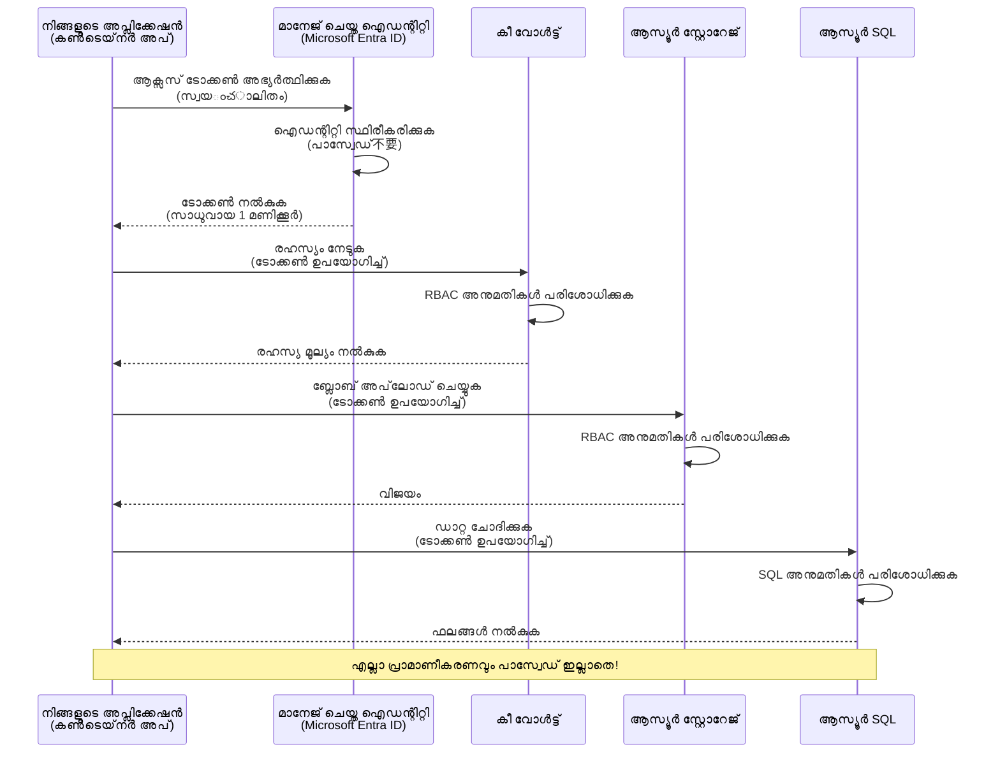
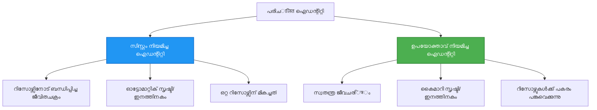

# അഥന്റിക്കേഷന്‍ പാറ്റേണുകളും മാനേജ്ഡ് ഐഡന്റിറ്റിയും

⏱️ **ലക്ഷ്യ സമയം**: 45-60 മിനിറ്റ് | 💰 **ചെലവ് പ്രഭാവം**: സൗജന്യം (കൂടുതല്‍ ചാര്‍ജുകള്‍ ഇല്ല) | ⭐ **ജടിലത്വം**: ഇടനില

**📚 പഠന പാത:**
- ← മുന്‍വര്‍ഷം: [കോണ്‍ഫിഗറേഷന്‍ മാനേജ്മെന്‍റ്](configuration.md) - പരിസ്ഥിതി വ്യത്യാസങ്ങളും രഹസ്യങ്ങളും കൈകാര്യം ചെയ്യല്‍
- 🎯 **നിങ്ങള്‍ ഇവിടെ തന്നെ**: അഥന്റിക്കേഷന്‍ & സെക്യൂരിറ്റി (മാനേജ്ഡ് ഐഡന്റിറ്റി, കീ വോള്‍ട്ട്, സുരക്ഷിത പാറ്റേണുകള്‍)
- → അടുത്തത്: [ഫസ്റ്റ് പ്രോജക്ട്](first-project.md) - നിങ്ങളുടെ ആദ്യ AZD അപ്ലിക്കേഷന്‍ നിര്‍മ്മിക്കുക
- 🏠 [കോഴ്‌സ് ഹോം](../../README.md)

---

## നിങ്ങൾ പഠിക്കുന്നതു്

ഈ പാഠം പൂര്‍ത്തിയാക്കിയാല്‍ നിങ്ങൾക്ക്:
- Azure അഥന്റിക്കേഷന്‍ പാറ്റേണുകള്‍ (കീകൾ, കണക്ഷന്‍ സ്ട്രിങ്സ്, മാനേജ്ഡ് ഐഡന്റിറ്റി) മനസിലാക്കാം
- പാസ്വേര്‍ഡ്-ലെസ് അഥന്റിക്കേഷനിന് **Managed Identity** നടപ്പിലാക്കാം
- **Azure Key Vault** സംയോജനം ഉപയോഗിച്ച് രഹസ്യങ്ങള്‍ സുരക്ഷിതമാക്കാം
- AZD വിന്യാസങ്ങള്‍ക്ക് **റോള്‍ അടിസ്ഥാനമായ ആക്‌സസ് കണ്‍ട്രോള്‍ (RBAC)** ക്രമീകരിക്കാം
- കണ്ടെയ്നര്‍ ആപ്പുകളിലും Azure സേവനങ്ങളിലും സുരക്ഷിത പ്രയോഗങ്ങള്‍ നടപ്പിലാക്കാം
- കീ അധിഷ്ഠിത നിന്നു് ഐഡന്റിറ്റി അധിഷ്ഠിത അഥന്റിക്കേഷനിലേക്ക് മൈഗ്രേറ്റ് ചെയ്യാം

## മാനേജ്ഡ് ഐഡന്റിറ്റി എന്തുകൊണ്ട് പ്രധാനമാണെന്ന്

### പ്രശ്നം: പരമ്പരാഗത അഥന്റിക്കേഷന്‍

**മാനേജ്ഡ് ഐഡന്റിറ്റിക്ക് മുമ്പ്:**
```javascript
// ❌ സുരക്ഷാ അപകടം: കോഡിൽ നിശ്ചിതമായ രഹസ്യങ്ങൾ
const connectionString = "Server=mydb.database.windows.net;User=admin;Password=P@ssw0rd123";
const storageKey = "xK7mN9pQ2wR5tY8uI0oP3aS6dF1gH4jK...";
const cosmosKey = "C2x7B9n4M1p8Q5w3E6r0T2y5U8i1O4p7...";
```
  
**പ്രശ്നങ്ങള്‍:**
- 🔴 കോഡ്, കോൺഫിഗർ ഫയലുകൾ, പരിസ്ഥിതി വ്യത്യാസങ്ങളില്‍ **പ്രകടമായ രഹസ്യങ്ങള്‍**
- 🔴 **ക്രെഡൻഷ്യല്‍ റൊട്ടേഷൻ** വേണ്ടത് കോഡ് മാറ്റവും പുനഃപ്രവർത്തനവും ആവശ്യമാണ്
- 🔴 **ഓഡിറ്റ് ഭയാനകത** - ആര്‍ എന്ത് സമയത്ത് ആക്സസ് ചെയ്തുവെന്ന് അറിയാത്ത അവസ്ഥ
- 🔴 **സ്പ്രാളിംഗ്** - രഹസ്യങ്ങള്‍ പല സിസ്റ്റങ്ങളില്‍ വ്യത്യസ്ഥമായി പകർന്നിരിക്കുന്നു
- 🔴 **കോംപ്ലയന്‍സ് അപകടങ്ങള്‍** - സുരക്ഷാ ഓഡിറ്റുകളിൽ പരാജയപ്പെടുന്നു

### പരിഹാരം: മാനേജ്ഡ് ഐഡന്റിറ്റി

**മാനേജ്ഡ് ഐഡന്റിറ്റി കഴിഞ്ഞ്:**
```javascript
// ✅ സുരക്ഷിതം: കോഡിൽ രഹസ്യങ്ങൾ ഇല്ല
const credential = new DefaultAzureCredential();
const client = new BlobServiceClient(
  "https://mystorageaccount.blob.core.windows.net",
  credential  // ആഴൂർ ഓട്ടോമാറ്റിക്കായി ഓതന്റിക്കേഷൻ കൈകാര്യം ചെയ്യുന്നു
);
```
  
**ഗുണങ്ങള്‍:**
- ✅ **കോഡിലോ ക്രമീകരണത്തിലോ രഹസ്യങ്ങളൊന്നുമില്ല**
- ✅ **ഓട്ടോമാറ്റിക് റൊട്ടേഷൻ** - Azure ഇതു കൈകാര്യം ചെയ്യും
- ✅ **പൂര്‍ണ്ണ ഓഡിറ്റ് ട്രെയില്‍** Microsoft Entra ID ലോഗുകളില്‍
- ✅ **കേന്ദ്രികൃത സുരക്ഷ** - Azure പോര്‍ട്ടലിൽ മാനേജുചെയ്യാം
- ✅ **കോംപ്ലയന്‍സ് തയ്യാറായത്** - സുരക്ഷാ മാനദണ്ഡങ്ങള്‍ പാലിക്കുന്നു

**ഉദാഹരണം**: പരമ്പരാഗത അഥന്റിക്കേഷന്‍ വ്യത്യസ്ത പാതകളിലേക്ക് വന്ന അനേകം രണ്ട് താക്കോല്‍പ്പെരുമാളുകള്‍ ചുമത്തിക്കൊണ്ടിരിക്കുകയാണ്. മാനേജ്ഡ് ഐഡന്റിറ്റി, നിങ്ങളുടെ വ്യക്തതയെ അടിസ്ഥാനമാക്കി യന്ത്ര ക്രമീകരണങ്ങള്‍ക്ക് പ്രവേശനം നല്‍കുന്ന സുരക്ഷാ ബാഡ്ജ് പോലെയാണ്—താക്കോല്‍ നഷ്ടമാക്കുകയോ പകര്‍ത്തുകയോ റൊട്ടേറ്റ് ചെയ്യുകയോ ആവശ്യമില്ല.

---

## ആർക്കിടെക്ടർ അവലോകനം

### മാനേജ്ഡ് ഐഡന്റിറ്റിയോടുള്ള അഥന്റിക്കേഷന്‍ ഫ്‌ളോ


  
### മാനേജ്ഡ് ഐഡന്റിറ്റി തരം


  
| സവിശേഷത | സിസ്റ്റം-അസൈൻഡ് | ഉപയോക്തൃ-അസൈൻഡ് |
|---------|----------------|---------------|
| **ജീവിത ചക്രം** | സ്രോതസുമായി ബന്ധപ്പെട്ടു | സ്വതന്ത്രം |
| **സൃഷ്ടി** | സ്രോതസോടൊപ്പം സ്വയംനടപ്പാക്കപ്പെടും | മാനുവൽ സൃഷ്ടി |
| **വിലിപ്പ്** | സ്രോതസ്സ് നീക്കംചെയ്യുമ്പോള്‍ ഇല്ലാതാകുന്നു | സ്രോതസ്സ് നീക്കം ചെയ്താലും നിലനിര്‍ത്തുന്നു |
| **പങ്കിടല്‍** | ഒരു സ്രോതസ് മാത്രം | പല സ്രോതസുകള്‍ |
| **ഉപയോഗ കാര്യങ്ങൾ** | ലളിതമായ സാഹചര്യങ്ങള്‍ | ബഹു-സ്രോതസ് സങ്കീര്‍ണ്ണ സാഹചര്യങ്ങള്‍ |
| **AZD ഡീഫോൾട്ട്** | ✅ ശിപാര്‍ശ ചെയ്യപ്പെടുന്നു | ഓപ്ഷണൽ |

---

## മുൻപരിചയങ്ങൾ

### ആവശ്യമുള്ള ഉപകരണങ്ങൾ

മുമ്പ് പഠനങ്ങളിൽ നിന്ന് നിങ്ങൾക്കിവ ഉണ്ട് നിർത്തണം:

```bash
# ആസ്യൂർ ഡെവലപ്പർ CLI പരിശോധന നടത്തുക
azd version
# ✅ പ്രതീക്ഷിക്കപ്പെടുന്നു: azd പതിപ്പ് 1.0.0 അല്ലെങ്കിൽ അതിൽ കൂടുതലുള്ളത്

# ആസ്യൂർ CLI പരിശോധന നടത്തുക
az --version
# ✅ പ്രതീക്ഷിക്കപ്പെടുന്നു: azure-cli 2.50.0 അല്ലെങ്കിൽ അതിൽ കൂടുതലുള്ളത്
```
  
### Azure ആവശ്യകതകൾ

- സജീവമായ Azure സബ്സ്ക്രിപ്ഷൻ
- അനുമതികൾ:  
  - മാനേജ്ഡ് ഐഡന്റിറ്റികള്‍ സൃഷ്ടിക്കുക  
  - RBAC റോളുകൾ അനുവദിക്കുക  
  - കീ വോള്‍ട്ട് റിസോഴ്‌സുകൾ സൃഷ്ടിക്കുക  
  - കണ്ടെയ്‌നർ ആപ്പുകൾ വിന്യസിക്കുക

### അറിവ് മുൻപന്തിയങ്ങള്‍

നീங்கள் പൂർത്തിയാക്കിയിരിക്കണം:  
- [ഇൻസ്റ്റലേഷൻ ഗൈഡ്](installation.md) - AZD സെറ്റ്-അപ്പ്  
- [AZD അടിസ്ഥാനങ്ങള്‍](azd-basics.md) - പ്രാഥമിക ധാരണകൾ  
- [കോൺഫിഗറേഷൻ മാനേജ്മെന്റ്](configuration.md) - പരിസ്ഥിതി വ്യത്യാസങ്ങൾ

---

## പാഠം 1: അഥന്റിക്കേഷൻ പാറ്റേണുകൾ മനസിലാക്കുക

### പാറ്റേൺ 1: കണക്ഷൻ സ്ട്രിങ്‌സ് (പുറത്തന്നെ ഒഴിവാക്കുക)

**എന്തുകൊണ്ട്:**
```bash
# കണക്ഷൻ സ്ട്രിംഗ് ക്രെഡൻഷ്യലുകൾ ഉൾക്കൊള്ളുന്നു
STORAGE_CONNECTION_STRING="DefaultEndpointsProtocol=https;AccountName=myaccount;AccountKey=xK7mN9pQ2wR5..."
COSMOS_CONNECTION_STRING="AccountEndpoint=https://myaccount.documents.azure.com:443/;AccountKey=C2x7..."
SQL_CONNECTION_STRING="Server=myserver.database.windows.net;User=admin;Password=P@ssw0rd..."
```
  
**പ്രശ്നങ്ങള്‍:**
- ❌ പരിസ്ഥിതി വ്യത്യാസങ്ങളിൽ രഹസ്യങ്ങള്‍ കാണുന്ന സ്ഥിതി
- ❌ വിന്യാസ സംവിധാനങ്ങളില്‍ രേഖപ്പെടുത്തി വെക്കുന്നു
- ❌ തിരുത്താന്‍ പ്രയാസം
- ❌ ആക്സസ് ഓഡിറ്റ് ട്രെയിൽ ഇല്ല

**വിനിയോഗം:** ലോക്കൽ ഡെവലപ്പ്മെന്റിനായി മാത്രമേ ഉപയോഗിക്കാവൂ, പ്രൊഡക്ഷനില്‍ ഒരിടത്തും ഇല്ല.

---

### പാറ്റേൺ 2: കീ വോൾട്ട് റഫറൻസുകള്‍ (മികച്ചത്)

**എങ്ങനെ പ്രയോഗിക്കാം:**
```bicep
// Store secret in Key Vault
resource keyVault 'Microsoft.KeyVault/vaults@2023-02-01' = {
  name: 'mykv'
  properties: {
    enableRbacAuthorization: true
  }
}

// Reference in Container App
env: [
  {
    name: 'STORAGE_KEY'
    secretRef: 'storage-key'  // References Key Vault
  }
]
```
  
**ഗുണങ്ങള്‍:**
- ✅ രഹസ്യങ്ങള്‍ സുരക്ഷിതമായി കീ വോൾട്ടില്‍ സൂക്ഷിക്കുന്നു  
- ✅ കേന്ദ്രീകൃത രഹസ്യ മാനേജ്മെന്റ്  
- ✅ കോഡ് മാറ്റം കൂടാതെ റൊട്ടേഷൻ  

**പരിമിതികള്‍:**
- ⚠️ ഇപ്പോഴും കീകൾ/പാസ്‌വേഡുകൾ ഉപയോഗിക്കുന്നു  
- ⚠️ കീ വോൾട്ട് ആക്‌സസ് കൈകാര്യം ചെയ്യേണ്ടത്  

**എപ്പോൾ ഉപയോഗിക്കണം:** കണക്ഷൻ സ്ട്രിംഗുകളിൽ നിന്നുള്ള മാനേജ്ഡ് ഐഡന്റിറ്റിയിലേക്ക് മാറാനുള്ള ഇടക്കാല ഘട്ടം.

---

### പാറ്റേൺ 3: മാനേജ്ഡ് ഐഡന്റിറ്റി (ഏറ്റവും ഉത്തമം)

**എങ്ങനെ പ്രയോഗിക്കാം:**
```bicep
// Enable managed identity
resource containerApp 'Microsoft.App/containerApps@2023-05-01' = {
  name: 'myapp'
  identity: {
    type: 'SystemAssigned'  // Automatically creates identity
  }
}

// Grant permissions
resource roleAssignment 'Microsoft.Authorization/roleAssignments@2022-04-01' = {
  scope: storageAccount
  properties: {
    roleDefinitionId: storageBlobDataContributorRole
    principalId: containerApp.identity.principalId
  }
}
```
  
**അപ്ലിക്കേഷൻ കോഡ്:**
```javascript
// രഹസ്യങ്ങളൊന്നും വേണ്ട!
const { DefaultAzureCredential } = require('@azure/identity');
const { BlobServiceClient } = require('@azure/storage-blob');

const credential = new DefaultAzureCredential();
const blobServiceClient = new BlobServiceClient(
  'https://mystorageaccount.blob.core.windows.net',
  credential
);
```
  
**ഗുണങ്ങള്‍:**
- ✅ കോഡിലും ക്രമീകരണങ്ങളിലും രഹസ്യങ്ങളൊന്നുമില്ല  
- ✅ ക്രെഡൻഷ്യല്‍ ഓട്ടോമാറ്റിക് റൊട്ടേഷൻ  
- ✅ പൂര്‍ണ ഓഡിറ്റ് ട്രെയിൽ  
- ✅ RBAC അടിസ്ഥാനപരമായ അനുമതികൾ  
- ✅ കോംപ്ലയന്‍സ് റെഡിയായിരിക്കുക

**എപ്പോഴെന്ന് ഉപയോഗിക്കണം:** എപ്പോഴും, പ്രൊഡക്ഷൻ അപ്ലിക്കേഷനിൽ.

---

### പാറ്റേൺ 4: സർവീസ് പ്രിൻസിപ്പൽസ് (CI/CD & ഓട്ടോമേഷൻ)

മാനേജ്ഡ് ഐഡന്റിറ്റി Azure-യിൽ പ്രവർത്തിക്കുന്ന സ്രോതസുകൾക്കുള്ള സ്വർണമാനമാണ്. പക്ഷേ Azureയ്ക്ക് പുറമെ (ഉദാ: CI/CD പൈപ്പ്‌ലൈനിൽ ബിൽഡ് ഏജന്റിൽ, അല്ലെങ്കിൽ ഇന്ററാക്ടീവ് ലോക്കിന്‍ സാധിക്കാത്ത ലാപ്ടോപ്പിൽ സ്ക്രിപ്റ്റ്) എന്താണ്? അവിടെയാണ് **സർവീസ് പ്രിൻസിപ്പൽ** ഉപയോഗിക്കുന്നത്: അത് സ്വന്തം ക്രെഡൻഷ്യലുകൾ ഉള്ള ഒരു നോൺ-ഹ്യൂമൻ ഐഡന്റിറ്റി, ഓട്ടോമേറ്റഡ് പ്രോസസ് ഇതിനായി രജിസ്റ്റർ ചെയ്ത് ഉപയോഗിക്കാം.

**എങ്ങനെ പ്രവർത്തിക്കും:**

റിസോഴ്‌സ്‌ ഗ്രൂപ്പിൽ കമ്പരിശേഷിയുള്ള സർവീസ് പ്രിൻസിപ്പൽ സൃഷ്ടിക്കുക:

```bash
az ad sp create-for-rbac \
  --name "myapp-cicd" \
  --role contributor \
  --scopes /subscriptions/<sub-id>/resourceGroups/<rg-name>
```
  
ഇത് ക്ലയന്റ് ഐഡി, ക്ലയന്റ് രഹസ്യം, ടെനന്റ് ഐഡി പ്രിന്റ് ചെയ്യും. azd ഇവ ഉപയോഗിച്ച് നോൺ-ഇന്ററാക്റ്റീവായി സൈൻ ഇൻ ചെയ്യാം:

```bash
azd auth login \
  --client-id "<appId>" \
  --client-secret "<password>" \
  --tenant-id "<tenant>"
```
  
**രഹസ്യങ്ങളേക്കാൾ ഫെഡറേറ്റഡ് ക്രെഡൻഷ്യലുകൾ (OIDC) മჯობാണ്.** ദൈർഘ്യമുള്ള ക്ലയന്റ് രഹസ്യം ഒഴിച്ച്, ഫെഡറേറ്റഡ് ക്രെഡൻഷ്യൽ ഉപയോഗിച്ച് പൈപ്പ്‌ലൈനിൽ ചെറിയ കാലയളവുള്ള ടോക്കൺ കൈമാറാം — രഹസ്യം ചോർക്കുന്നതും റൊട്ടേറ്റ് ചെയ്യലും ഇല്ല:

```bash
azd auth login \
  --client-id "<appId>" \
  --federated-credential-provider "github" \
  --tenant-id "<tenant>"
```
  
> `azd pipeline config` ഇത് താങ്കൾക്കായി സ്വയം ക്രമീകരിക്കും. [അദ്ധ്യായം 8](../chapter-08-production/production-ai-practices.md)ലെ CI/CD വാക്ക്‌ത്രൂ കാണുക.

**ഗുണങ്ങള്‍:**
- ✅ Azureയ്ക്ക് പുറത്തും (ബിൽഡ് ഏജന്റുകൾ, ഓൺ-പ്രമി, മറ്റു ക്ലൗഡുകള്‍) പ്രവര്‍ത്തിക്കുന്നു  
- ✅ ഒരൊറ്റ റോളിൽ ഒരു റിസോഴ്‌സ് ഗ്രൂപ്പിന് സ്‌കോപ്പ് ചെയ്യാവുന്നതാണ്  
- ✅ ഫെഡറേറ്റഡ് (OIDC) വകഭേദം കോഡ് ഇല്ലാതെ പ്രവര്‍ത്തിക്കും  

**വിപരീത ഫലങ്ങള്‍:**
- ⚠️ രഹസ്യ ആധാരിത വകഭേദത്തിന് സൂക്ഷിച്ച നിറഞ്ഞ സംവിധാനവും റൊട്ടേഷൻ ആവശ്യമുണ്ട്  
- ⚠️ രഹസ്യം ചോര്‍ന്നാൽ സർവീസ് പ്രിൻസിപ്പലിന് എന്തു ചെയ്യാനാകുമോ അതെല്ലാം അനുവദിക്കും — സ്‌കോപ് കർശനമായി നിര്‍ത്തുക

**എപ്പോൾ ഉപയോഗിക്കണം:** മാനേജ്ഡ് آیഡന്റിറ്റി ഉപയോഗിക്കാൻ കഴിയാത്ത CI/CD പൈപ്പ്‌ലൈനുകൾക്കും ഓട്ടോമേഷൻസിനും. ക്ലയന്റ് രഹസ്യത്തിന് പകരം ഫെഡറേറ്റഡ്/OIDC വകഭേദത്തെ മുൻതൂക്കം നൽകുക, Azure ഉള്ളില്‍ ജോലിചെയ്യുമ്പോൾ മാനേജ്ഡ് ഐഡന്റിറ്റി തിരഞ്ഞെടുക്കുക.

**ക്രെഡൻഷ്യലുകൾ സുരക്ഷിതമായി സൂക്ഷിക്കേണ്ടതാണ്:**
- രഹസ്യങ്ങള്‍ ഒരിക്കലും കോഡിലേക്ക് പ്രതിബന്ധിക്കുക - നിങ്ങളുടെ പൈപ്പ്‌ലൈനിന്റെ രഹസ്യ സംഭരണി (GitHub Actions രഹസ്യങ്ങള്‍, Azure DevOps വ്യത്യാസ ഗ്രൂപ്പുകൾ / കീ വോൾട്ട്) ഉപയോഗിക്കൂ  
- SPയുടെ സ്ഥിതിക്ക് വേണ്ട ഏറ്റവും ചെറിയ റോള്‍ / റിസോഴ്‌സ് ഗ്രൂപ്പ് സ്‌കോപ്പ് നൽകുക  
- കാലാവധി നിശ്ചയിക്കുകയും രഹസ്യം റൊട്ടേറ്റ് ചെയ്യുകയും ചെയ്യുക, അല്ലെങ്കിൽ OIDC വഴി രഹസ്യം പൂര്‍ണ്ണമായും ഒഴിവാക്കുക

---

## പാഠം 2: AZD ഉപയോഗിച്ചുള്ള മാനേജ്ഡ് ഐഡന്റിറ്റി നടപ്പാക്കല്‍

### ഘട്ടം-ഘട്ടമായ നടപ്പാക്കല്‍

Azure Storage, Key Vault എന്നിവയ്ക്കായി മാനേജ്ഡ് ഐഡന്റിറ്റി ഉപയോഗിച്ച് ഒരു സുരക്ഷിത കണ്ടെയ്‌നർ ആപ്പ് നിർമ്മിക്കാം.

### പ്രോജക്ട് ഘടന

```
secure-app/
├── azure.yaml                 # AZD configuration
├── infra/
│   ├── main.bicep            # Main infrastructure
│   ├── core/
│   │   ├── identity.bicep    # Managed identity setup
│   │   ├── keyvault.bicep    # Key Vault configuration
│   │   └── storage.bicep     # Storage with RBAC
│   └── app/
│       └── container-app.bicep
└── src/
    ├── app.js                # Application code
    ├── package.json
    └── Dockerfile
```
  
### 1. AZD ക്രമീകരിക്കുക (azure.yaml)

```yaml
name: secure-app
metadata:
  template: secure-app@1.0.0

services:
  api:
    project: ./src
    language: js
    host: containerapp

# Enable managed identity (AZD handles this automatically)
```
  
### 2. ഇൻഫ്രാസ്ട്രക്ചർ: മാനേജ്ഡ് ഐഡന്റിറ്റി സജീവമാക്കുക

**ഫയൽ: `infra/main.bicep`**

```bicep
targetScope = 'subscription'

param environmentName string
param location string = 'eastus'

var tags = { 'azd-env-name': environmentName }

// Resource group
resource rg 'Microsoft.Resources/resourceGroups@2021-04-01' = {
  name: 'rg-${environmentName}'
  location: location
  tags: tags
}

// Storage Account
module storage './core/storage.bicep' = {
  name: 'storage'
  scope: rg
  params: {
    name: 'st${uniqueString(rg.id)}'
    location: location
    tags: tags
  }
}

// Key Vault
module keyVault './core/keyvault.bicep' = {
  name: 'keyvault'
  scope: rg
  params: {
    name: 'kv-${uniqueString(rg.id)}'
    location: location
    tags: tags
  }
}

// Container App with Managed Identity
module containerApp './app/container-app.bicep' = {
  name: 'container-app'
  scope: rg
  params: {
    name: 'ca-${environmentName}'
    location: location
    tags: tags
    storageAccountName: storage.outputs.name
    keyVaultName: keyVault.outputs.name
  }
}

// Grant Container App access to Storage
module storageRoleAssignment './core/role-assignment.bicep' = {
  name: 'storage-role'
  scope: rg
  params: {
    principalId: containerApp.outputs.identityPrincipalId
    roleDefinitionId: 'ba92f5b4-2d11-453d-a403-e96b0029c9fe'  // Storage Blob Data Contributor
    targetResourceId: storage.outputs.id
  }
}

// Grant Container App access to Key Vault
module kvRoleAssignment './core/role-assignment.bicep' = {
  name: 'kv-role'
  scope: rg
  params: {
    principalId: containerApp.outputs.identityPrincipalId
    roleDefinitionId: '4633458b-17de-408a-b874-0445c86b69e6'  // Key Vault Secrets User
    targetResourceId: keyVault.outputs.id
  }
}

// Outputs
output AZURE_STORAGE_ACCOUNT_NAME string = storage.outputs.name
output AZURE_KEY_VAULT_NAME string = keyVault.outputs.name
output APP_URL string = containerApp.outputs.url
```
  
### 3. സിസ്റ്റം-അസൈൻഡ് ഐഡന്റിറ്റിയോടെ കണ്ടെയ്നര്‍ ആപ്പ്

**ഫയൽ: `infra/app/container-app.bicep`**

```bicep
param name string
param location string
param tags object = {}
param storageAccountName string
param keyVaultName string

resource containerApp 'Microsoft.App/containerApps@2023-05-01' = {
  name: name
  location: location
  tags: tags
  identity: {
    type: 'SystemAssigned'  // 🔑 Enable managed identity
  }
  properties: {
    configuration: {
      ingress: {
        external: true
        targetPort: 3000
      }
    }
    template: {
      containers: [
        {
          name: 'api'
          image: 'myregistry.azurecr.io/api:latest'
          resources: {
            cpu: json('0.5')
            memory: '1Gi'
          }
          env: [
            {
              name: 'AZURE_STORAGE_ACCOUNT_NAME'
              value: storageAccountName
            }
            {
              name: 'AZURE_KEY_VAULT_NAME'
              value: keyVaultName
            }
            // 🔑 No secrets - managed identity handles authentication!
          ]
        }
      ]
    }
  }
}

// Output the identity for RBAC assignments
output identityPrincipalId string = containerApp.identity.principalId
output id string = containerApp.id
output url string = 'https://${containerApp.properties.configuration.ingress.fqdn}'
```
  
### 4. RBAC റോൾ അസൈന്‍മെന്റ് മോഡ്യൂൾ

**ഫയൽ: `infra/core/role-assignment.bicep`**

```bicep
param principalId string
param roleDefinitionId string  // Azure built-in role ID
param targetResourceId string

resource roleAssignment 'Microsoft.Authorization/roleAssignments@2022-04-01' = {
  name: guid(principalId, roleDefinitionId, targetResourceId)
  scope: resourceId('Microsoft.Resources/resourceGroups', resourceGroup().name)
  properties: {
    roleDefinitionId: subscriptionResourceId('Microsoft.Authorization/roleDefinitions', roleDefinitionId)
    principalId: principalId
    principalType: 'ServicePrincipal'
  }
}

output id string = roleAssignment.id
```
  
### 5. മാനേജ്ഡ് ഐഡന്റിറ്റിയോടെയുള്ള അപ്ലിക്കേഷൻ കോഡ്

**ഫയൽ: `src/app.js`**

```javascript
const express = require('express');
const { DefaultAzureCredential } = require('@azure/identity');
const { BlobServiceClient } = require('@azure/storage-blob');
const { SecretClient } = require('@azure/keyvault-secrets');

const app = express();
const PORT = process.env.PORT || 3000;

// 🔑 ക്രെഡൻഷ്യൽ ഇൻഷിയലൈസ് ചെയ്യുക (മാനേജ്ഡ് ഐഡന്റിറ്റിയോട് സ്വയം പ്രവർത്തിക്കും)
const credential = new DefaultAzureCredential();

// ആസ്യൂർ സ്റ്റോറേജ് ക്രമീകരണം
const storageAccountName = process.env.AZURE_STORAGE_ACCOUNT_NAME;
const blobServiceClient = new BlobServiceClient(
  `https://${storageAccountName}.blob.core.windows.net`,
  credential  // യാതൊരു കീകളും ആവശ്യമില്ല!
);

// കീ വോൾട്ട് ക്രമീകരണം
const keyVaultName = process.env.AZURE_KEY_VAULT_NAME;
const secretClient = new SecretClient(
  `https://${keyVaultName}.vault.azure.net`,
  credential  // യാതൊരു കീകളും ആവശ്യമില്ല!
);

// ഹെൽത്ത് ചെക്ക്
app.get('/health', (req, res) => {
  res.json({ status: 'healthy', authentication: 'managed-identity' });
});

// ഫയൽ ബ്ലോബ് സ്റ്റോറേജിലേക്ക് അപ്‌ലോഡ് ചെയ്യുക
app.post('/upload', async (req, res) => {
  try {
    const containerClient = blobServiceClient.getContainerClient('uploads');
    await containerClient.createIfNotExists();
    
    const blobName = `file-${Date.now()}.txt`;
    const blockBlobClient = containerClient.getBlockBlobClient(blobName);
    
    await blockBlobClient.upload('Hello from managed identity!', 30);
    
    res.json({
      success: true,
      blobName: blobName,
      message: 'File uploaded using managed identity!'
    });
  } catch (error) {
    console.error('Upload error:', error);
    res.status(500).json({ error: error.message });
  }
});

// കീ വോൾട്ടിൽ നിന്ന് രഹസ്യം കിട്ടുക
app.get('/secret/:name', async (req, res) => {
  try {
    const secretName = req.params.name;
    const secret = await secretClient.getSecret(secretName);
    
    res.json({
      name: secretName,
      value: secret.value,
      message: 'Secret retrieved using managed identity!'
    });
  } catch (error) {
    console.error('Secret error:', error);
    res.status(500).json({ error: error.message });
  }
});

// ബ്ലോബ് കണ്ടെയ്‌നറുകൾ പട്ടികപ്പെടുത്തുക (വായനാ ആക്സസ് പ്രദർശിപ്പിക്കുന്നു)
app.get('/containers', async (req, res) => {
  try {
    const containers = [];
    for await (const container of blobServiceClient.listContainers()) {
      containers.push(container.name);
    }
    
    res.json({
      containers: containers,
      count: containers.length,
      message: 'Containers listed using managed identity!'
    });
  } catch (error) {
    console.error('List error:', error);
    res.status(500).json({ error: error.message });
  }
});

app.listen(PORT, () => {
  console.log(`Secure API listening on port ${PORT}`);
  console.log('Authentication: Managed Identity (passwordless)');
});
```
  
**ഫയൽ: `src/package.json`**

```json
{
  "name": "secure-app",
  "version": "1.0.0",
  "dependencies": {
    "express": "^4.18.2",
    "@azure/identity": "^4.0.0",
    "@azure/storage-blob": "^12.17.0",
    "@azure/keyvault-secrets": "^4.7.0"
  },
  "scripts": {
    "start": "node app.js"
  }
}
```
  
### 6. വിന്യസിക്കുകയും പരീക്ഷിക്കുകയും ചെയ്യുക

```bash
# AZD പരിസ്ഥിതിയൊരുക്കുക
azd init

# അടിസ്ഥാനസൗകര്യവും അപ്ലിക്കേഷനും വിന്യസിക്കുക
azd up

# ആപ്പ് URL നേടുക
APP_URL=$(azd env get-values | grep APP_URL | cut -d '=' -f2 | tr -d '"')

# ആരോഗ്യ പരിശോധന നടത്തുക
curl $APP_URL/health
```
  
**✅ പ്രതീക്ഷിച്ച ഔട്ട്‌പുട്ട്:**
```json
{
  "status": "healthy",
  "authentication": "managed-identity"
}
```
  
**ടെസ്റ്റ് ബ്ലോബ് അപ്ലോഡ്:**
```bash
curl -X POST $APP_URL/upload
```
  
**✅ പ്രതീക്ഷിച്ച ഔട്ട്‌പുട്ട്:**
```json
{
  "success": true,
  "blobName": "file-1700404800000.txt",
  "message": "File uploaded using managed identity!"
}
```
  
**ടെസ്റ്റ് കണ്ടെയ്‌നർ ലിസ്റ്റിംഗ്:**
```bash
curl $APP_URL/containers
```
  
**✅ പ്രതീക്ഷിച്ച ഔട്ട്‌പുട്ട്:**
```json
{
  "containers": ["uploads"],
  "count": 1,
  "message": "Containers listed using managed identity!"
}
```
  
---

## സാധാരണ Azure RBAC റോള്‍

### മാനേജ്ഡ് ഐഡന്റിറ്റിയുടെ ഇൻ-ബിൽറ്റ് റോൾ ഐഡികൾ

| സേവനം | റോൾ പേര് | റോൾ ഐഡി | അനുമതികൾ |
|---------|-----------|---------|-------------|
| **Storage** | Storage Blob Data Reader | `2a2b9908-6b94-4a3d-8e5a-a7d8f8cc8a12` | ബ്ലോബ് & കണ്ടെയ്‌നർ വായിക്കൽ |
| **Storage** | Storage Blob Data Contributor | `ba92f5b4-2d11-453d-a403-e96b0029c9fe` | ബ്ലോബ് എഴുതൽ, വായിക്കൽ, ഇല്ലാതാക്കൽ |
| **Storage** | Storage Queue Data Contributor | `974c5e8b-45b9-4653-ba55-5f855dd0fb88` | ക്യു സന്ദേശങ്ങൾ എഴുതല്‍, വായിക്കല്‍, ഇല്ലാതാക്കല്‍ |
| **Key Vault** | Key Vault Secrets User | `4633458b-17de-408a-b874-0445c86b69e6` | രഹസ്യങ്ങള്‍ വായിക്കല്‍ |
| **Key Vault** | Key Vault Secrets Officer | `b86a8fe4-44ce-4948-aee5-eccb2c155cd7` | രഹസ്യങ്ങൾ എഴുതല്‍, വായിക്കല്‍, ഇല്ലാതാക്കല്‍ |
| **Cosmos DB** | Cosmos DB Built-in Data Reader | `00000000-0000-0000-0000-000000000001` | Cosmos DB ഡാറ്റ വായിക്കല്‍ |
| **Cosmos DB** | Cosmos DB Built-in Data Contributor | `00000000-0000-0000-0000-000000000002` | Cosmos DB ഡാറ്റ എഴുതല്‍阅读 |
| **SQL Database** | SQL DB Contributor | `9b7fa17d-e63e-47b0-bb0a-15c516ac86ec` | SQL ഡാറ്റാബേസുകൾ നിയന്ത്രിക്കുക |
| **Service Bus** | Azure Service Bus Data Owner | `090c5cfd-751d-490a-894a-3ce6f1109419` | സന്ദേശങ്ങൾ അയയ്ക്കൽ, സ്വീകരിക്കൽ, നിയന്ത്രണം |

### റോൾ ഐഡി കണ്ടെത്തുന്നതിനുള്ള മാർഗ്ഗം

```bash
# എല്ലാ ബിൽറ്റ്-ഇൻ റോളുകളും ലിസ്റ്റ് ചെയ്യുക
az role definition list --query "[].{Name:roleName, ID:name}" --output table

# പ്രത്യേക റോളിനായി തിരയുക
az role definition list --query "[?contains(roleName, 'Storage Blob')].{Name:roleName, ID:name}" --output table

# റോളിന്റെ വിശദാംശങ്ങൾ ലഭിക്കുക
az role definition list --name "Storage Blob Data Contributor"
```
  
---

## പ്രായോഗിക അഭ്യാസങ്ങൾ

### അഭ്യാസം 1: നിലവിലുള്ള ആപ്പിന് മാനേജ്ഡ് ഐഡന്റിറ്റി സജ്ജമാക്കുക ⭐⭐ (മധ്യം)

**ലക്ഷ്യം**: നിലവിലുള്ള കണ്ടെയ്നർ ആപ്പ് വിന്യാസത്തിൽ മാനേജ്ഡ് ഐഡന്റിറ്റി ചേർക്കുക

**സാഹചര്യം**: കണക്ഷൻ സ്‌ട്രിങ് ഉപയോഗിക്കുന്ന കണ്ടെയ്നർ ആപ്പ് മാനേജ്ഡ് ഐഡന്റിറ്റിയിലേക്കു് മാറുക

**ആരംഭ ബിന്ദു**: ഇതാണ് ആപ്പിന്റെ നിലവിലെ കോൺഫിഗറേഷൻ:

```bicep
// ❌ Current: Using connection string
env: [
  {
    name: 'STORAGE_CONNECTION_STRING'
    secretRef: 'storage-connection'
  }
]
```
  
**പടി:**

1. **Bicep-ൽ മാനേജ്ഡ് ഐഡന്റിറ്റി നേതൃത്വം നൽകുക:**

```bicep
resource containerApp 'Microsoft.App/containerApps@2023-05-01' = {
  name: 'myapp'
  identity: {
    type: 'SystemAssigned'  // Add this
  }
  // ... rest of configuration
}
```
  
2. **Storage ആക്‌സസ് അനുവദിക്കുക:**

```bicep
// Get storage account reference
resource storageAccount 'Microsoft.Storage/storageAccounts@2023-01-01' existing = {
  name: storageAccountName
}

// Assign role
resource roleAssignment 'Microsoft.Authorization/roleAssignments@2022-04-01' = {
  name: guid(containerApp.id, 'ba92f5b4-2d11-453d-a403-e96b0029c9fe', storageAccount.id)
  scope: storageAccount
  properties: {
    roleDefinitionId: subscriptionResourceId('Microsoft.Authorization/roleDefinitions', 'ba92f5b4-2d11-453d-a403-e96b0029c9fe')
    principalId: containerApp.identity.principalId
    principalType: 'ServicePrincipal'
  }
}
```
  
3. **അപ്ലിക്കേഷൻ കോഡ് അപ്ഡേറ്റ് ചെയ്യുക:**

**മുന്‍പ് (കണക്ഷൻ സ്‌ട്രിങ്):**
```javascript
const { BlobServiceClient } = require('@azure/storage-blob');

const blobServiceClient = BlobServiceClient.fromConnectionString(
  process.env.STORAGE_CONNECTION_STRING
);
```
  
**പിന്നീട് (മാനേജ്ഡ് ഐഡന്റിറ്റി):**
```javascript
const { DefaultAzureCredential } = require('@azure/identity');
const { BlobServiceClient } = require('@azure/storage-blob');

const credential = new DefaultAzureCredential();
const blobServiceClient = new BlobServiceClient(
  `https://${process.env.STORAGE_ACCOUNT_NAME}.blob.core.windows.net`,
  credential
);
```
  
4. **പരിസ്ഥിതി വ്യത്യാസങ്ങൾ അപ്ഡേറ്റ് ചെയ്യുക:**

```bicep
env: [
  {
    name: 'STORAGE_ACCOUNT_NAME'
    value: storageAccountName  // Just the name, no secrets!
  }
  // Remove STORAGE_CONNECTION_STRING
]
```
  
5. **വിന്യസിക്കുകയും ടെസ്റ്റ് ചെയ്യുകയും ചെയ്യുക:**

```bash
# വീണ്ടും വിന്യസിക്കുക
azd up

# ഇത് ഇപ്പോഴും പ്രവർത്തിക്കുന്നുണ്ടെന്ന് പരിശോധിക്കുക
curl https://myapp.azurecontainerapps.io/upload
```
  
**✅ വിജയ മാനദണ്ഡങ്ങള്‍:**
- ✅ അപ്ലിക്കേഷൻ പിഴവുകള്‍ ഇല്ലാതെ വിന്യസിക്കും  
- ✅ സ്റ്റോറേജ് ഓപ്പറേഷനുകൾ പ്രാവര്‍ത്തികമാകും (അപ്ലോഡ്, ലിസ്റ്റ്, ഡൗൺലോഡ്)  
- ✅ പരിസ്ഥിതി വ്യത്യാസങ്ങളിൽ കണക്ഷൻ സ്ട്രിങ്ങുകൾ ഒന്നും കാണാനുണ്ടാകില്ല  
- ✅ Azure പോര്‍ട്ടലില്‍ "ഐഡന്റിറ്റി" ബ്ലേഡിൽ ഐഡന്റിറ്റി കാണാം  

**പരിശോധനം:**

```bash
# മാനേജഡ് ഐഡന്റിറ്റി സജ്ജമാണോ എന്ന് പരിശോധിക്കുക
az containerapp show \
  --name myapp \
  --resource-group rg-myapp \
  --query "identity.type"
# ✅ പ്രതീക്ഷിച്ചുള്ളത്: "SystemAssigned"

# റോളുകൾ നിയോഗിച്ചതാണോ എന്ന് പരിശോധിക്കുക
az role assignment list \
  --assignee $(az containerapp show --name myapp --resource-group rg-myapp --query "identity.principalId" -o tsv) \
  --scope /subscriptions/{sub-id}/resourceGroups/rg-myapp/providers/Microsoft.Storage/storageAccounts/mystorageaccount
# ✅ പ്രതീക്ഷിച്ചുള്ളത്: "Storage Blob Data Contributor" റോളിനെ കാണിക്കുന്നു
```
  
**സമയം**: 20-30 മിനിറ്റ്

---

### അഭ്യാസം 2: ഉപയോക്തൃ-അസൈൻഡ് ഐഡന്റിറ്റിയുമായി ബഹു-സേവന ആക്സ്‌സസ് ⭐⭐⭐ (ഉയര്‍ന്ന)

**ലക്ഷ്യം**: ഒറ്റ ഉപയോക്തൃ-അസൈൻഡ് ഐഡന്റിറ്റി മൂന്ന് കണ്ടെയ്‌നർ ആപ്പുകൾക്കായി പങ്കിടുക

**സാഹചര്യം**: മൂന്ന് മൈക്രോസേവണ്ഗൾക്കും ഒരേ സ്റ്റോറേജ് അക്കൗണ്ടും കീ വോൾട്ടും ആക്‌സസ് വേണമെന്ന്

**പടി:**

1. **ഉപയോക്തൃ-അസൈൻഡ് ഐഡന്റിറ്റി സൃഷ്ടിക്കുക:**

**ഫയൽ: `infra/core/identity.bicep`**

```bicep
param name string
param location string
param tags object = {}

resource userAssignedIdentity 'Microsoft.ManagedIdentity/userAssignedIdentities@2023-01-31' = {
  name: name
  location: location
  tags: tags
}

output id string = userAssignedIdentity.id
output principalId string = userAssignedIdentity.properties.principalId
output clientId string = userAssignedIdentity.properties.clientId
```
  
2. **ഉപയോക്തൃ-അസൈൻഡ് ഐഡന്റിറ്റി റോൾസ് അനുവദിക്കുക:**

```bicep
// In main.bicep
module userIdentity './core/identity.bicep' = {
  name: 'user-identity'
  scope: rg
  params: {
    name: 'id-${environmentName}'
    location: location
    tags: tags
  }
}

// Grant Storage access
resource storageRoleAssignment 'Microsoft.Authorization/roleAssignments@2022-04-01' = {
  name: guid(userIdentity.outputs.principalId, 'storage-contributor')
  scope: storageAccount
  properties: {
    roleDefinitionId: subscriptionResourceId('Microsoft.Authorization/roleDefinitions', 'ba92f5b4-2d11-453d-a403-e96b0029c9fe')
    principalId: userIdentity.outputs.principalId
    principalType: 'ServicePrincipal'
  }
}

// Grant Key Vault access
resource kvRoleAssignment 'Microsoft.Authorization/roleAssignments@2022-04-01' = {
  name: guid(userIdentity.outputs.principalId, 'kv-secrets-user')
  scope: keyVault
  properties: {
    roleDefinitionId: subscriptionResourceId('Microsoft.Authorization/roleDefinitions', '4633458b-17de-408a-b874-0445c86b69e6')
    principalId: userIdentity.outputs.principalId
    principalType: 'ServicePrincipal'
  }
}
```
  
3. **ബഹുമുഖ കണ്ടെയ്‌നർ ആപ്പുകളിലേക്ക് ഐഡന്റിറ്റി നിയോഗിക്കുക:**

```bicep
resource apiGateway 'Microsoft.App/containerApps@2023-05-01' = {
  name: 'api-gateway'
  identity: {
    type: 'UserAssigned'
    userAssignedIdentities: {
      '${userIdentity.outputs.id}': {}
    }
  }
  // ... rest of config
}

resource productService 'Microsoft.App/containerApps@2023-05-01' = {
  name: 'product-service'
  identity: {
    type: 'UserAssigned'
    userAssignedIdentities: {
      '${userIdentity.outputs.id}': {}
    }
  }
  // ... rest of config
}

resource orderService 'Microsoft.App/containerApps@2023-05-01' = {
  name: 'order-service'
  identity: {
    type: 'UserAssigned'
    userAssignedIdentities: {
      '${userIdentity.outputs.id}': {}
    }
  }
  // ... rest of config
}
```
  
4. **അപ്ലിക്കേഷൻ കോഡ് (എല്ലാ സേവനങ്ങൾക്കും ഒരേ പാറ്റേണു):**

```javascript
const { DefaultAzureCredential, ManagedIdentityCredential } = require('@azure/identity');

// ഉപയോക്താവിന് നിശ്ചിത ഐഡന്റിറ്റിക്ക്, ക്ലയന്റ് ഐഡി വ്യക്തമാക്കുക
const credential = new ManagedIdentityCredential(
  process.env.AZURE_CLIENT_ID  // ഉപയോക്താവ് നിശ്ചയിച്ച ഐഡന്റിറ്റി ക്ലയന്റ് ഐഡി
);

// അല്ലെങ്കിൽ DefaultAzureCredential ഉപയോഗിക്കുക (സ്വയം കണ്ടെത്തുന്നു)
const credential = new DefaultAzureCredential();

const blobServiceClient = new BlobServiceClient(
  `https://${process.env.STORAGE_ACCOUNT_NAME}.blob.core.windows.net`,
  credential
);
```
  
5. **വിന്യാസവും പരിശോധനയും:**

```bash
azd up

# എല്ലാ സേവനങ്ങളും സ്റ്റോറേജിലേക്ക് ആക്‌സസ് ചെയ്യാൻ കഴിയുന്നുണ്ടോ എന്ന് പരിശോധിക്കുക
curl https://api-gateway.azurecontainerapps.io/upload
curl https://product-service.azurecontainerapps.io/upload
curl https://order-service.azurecontainerapps.io/upload
```
  
**✅ വിജയ മാനദണ്ഡങ്ങള്‍:**
- ✅ ഒരൊറ്റ ഐഡന്റിറ്റി മൂന്നു സേവനങ്ങള്‍ക്കായി പങ്കുവെക്കുന്നു  
- ✅ എല്ലാത്തും സ്റ്റോറേജിനും കീ വോൾട്ടിനും ആക്സസ് സാധിക്കണം  
- ✅ ഒരു സേവനം ഇല്ലാതാക്കിയാലും ഐഡന്റിറ്റി നിലനിൽക്കും  
- ✅ കേന്ദ്രികൃത അനുമതി മാനേജ്മെന്റ് ലഭിക്കുന്നു  

**ഉപയോക്തൃ-അസൈൻഡ് ഐഡന്റിറ്റിയുടെ ഗുണങ്ങള്‍:**
- ഏക ഐഡന്റിറ്റി നിയന്ത്രിക്കാൻ  
- സേവനങ്ങൾക്കിടയിലെ അനുമതികൾ ഏകകാര്യമായി  
- സേവനം ഇല്ലാതാക്കിയാലും നിലനില്‍ക്കുന്നു  
- സങ്കീർണ്ണ ആർക്കിടെക്ചറിനു മികച്ചത്  

**സമയം**: 30-40 മിനിറ്റ്

---

### അഭ്യാസം 3: കീ വോൽട്ട് രഹസ്യ റൊട്ടേഷൻ നടപ്പാക്കുക ⭐⭐⭐ (ഉയര്‍ന്ന)

**ലക്ഷ്യം**: മൂന്ന് പാർട്ടി API കീകൾ കീ വോൾട്ടിൽ സൂക്ഷിച്ച് മാനേജ്ഡ് ഐഡന്റിറ്റി ഉപയോഗിച്ച് ആക്‌സസ് ചെയ്യുക

**സാഹചര്യം**: നിങ്ങളുടെ ആപ്പിന് OpenAI, Stripe, SendGrid പോലുള്ള APIs വിളിക്കാനുണ്ട്, അതിന് API കീകൾ ആവശ്യമുണ്ട്

**പടി:**

1. **RBAC ഉപയോഗിച്ച് കീ വോൾട്ട് സൃഷ്ടിക്കുക:**

**ഫയൽ: `infra/core/keyvault.bicep`**

```bicep
param name string
param location string
param tags object = {}

resource keyVault 'Microsoft.KeyVault/vaults@2023-02-01' = {
  name: name
  location: location
  tags: tags
  properties: {
    enableRbacAuthorization: true  // Use RBAC instead of access policies
    sku: {
      family: 'A'
      name: 'standard'
    }
    tenantId: subscription().tenantId
    enableSoftDelete: true
    softDeleteRetentionInDays: 90
  }
}

// Allow Container App to read secrets
output id string = keyVault.id
output name string = keyVault.name
output uri string = keyVault.properties.vaultUri
```
  
2. **കീ വോൾട്ടിൽ രഹസ്യങ്ങൾ സൂക്ഷിക്കുക:**

```bash
# കീ വോൾട്ട് നാമം എടുക്കുക
KV_NAME=$(azd env get-values | grep AZURE_KEY_VAULT_NAME | cut -d '=' -f2 | tr -d '"')

# മൂന്നാം കക്ഷി API കീകൾ സംഭరിക്കുക
az keyvault secret set \
  --vault-name $KV_NAME \
  --name "OpenAI-ApiKey" \
  --value "sk-proj-xxxxxxxxxxxxx"

az keyvault secret set \
  --vault-name $KV_NAME \
  --name "Stripe-ApiKey" \
  --value "sk_live_xxxxxxxxxxxxx"

az keyvault secret set \
  --vault-name $KV_NAME \
  --name "SendGrid-ApiKey" \
  --value "SG.xxxxxxxxxxxxx"
```
  
3. **രഹസ്യങ്ങൾ ലഭ്യമാക്കാന്‍ അപ്ലിക്കേഷൻ കോഡ്:**

**ഫയൽ: `src/config.js`**

```javascript
const { DefaultAzureCredential } = require('@azure/identity');
const { SecretClient } = require('@azure/keyvault-secrets');

class Config {
  constructor() {
    this.credential = new DefaultAzureCredential();
    this.secretClient = new SecretClient(
      `https://${process.env.AZURE_KEY_VAULT_NAME}.vault.azure.net`,
      this.credential
    );
    this.cache = {};
  }

  async getSecret(secretName) {
    // ആദ്യം ക്യാഷെ പരിശോധിക്കുക
    if (this.cache[secretName]) {
      return this.cache[secretName];
    }

    try {
      const secret = await this.secretClient.getSecret(secretName);
      this.cache[secretName] = secret.value;
      console.log(`✅ Retrieved secret: ${secretName}`);
      return secret.value;
    } catch (error) {
      console.error(`❌ Failed to get secret ${secretName}:`, error.message);
      throw error;
    }
  }

  async getOpenAIKey() {
    return this.getSecret('OpenAI-ApiKey');
  }

  async getStripeKey() {
    return this.getSecret('Stripe-ApiKey');
  }

  async getSendGridKey() {
    return this.getSecret('SendGrid-ApiKey');
  }
}

module.exports = new Config();
```
  
4. **അപ്ലിക്കേഷനില്‍ രഹസ്യങ്ങൾ ഉപയോഗിക്കുക:**

**ഫയൽ: `src/app.js`**

```javascript
const express = require('express');
const config = require('./config');
const { OpenAI } = require('openai');

const app = express();

// കീ വോൾട്ടിൽ നിന്നുള്ള കീ ഉപയോഗിച്ച് OpenAI ആരംഭിക്കുക
let openaiClient;

async function initializeServices() {
  const openaiKey = await config.getOpenAIKey();
  openaiClient = new OpenAI({ apiKey: openaiKey });
  console.log('✅ Services initialized with secrets from Key Vault');
}

// സ്റ്റാർട്ടപ്പിൽ വിളിക്കുക
initializeServices().catch(console.error);

app.post('/chat', async (req, res) => {
  try {
    const completion = await openaiClient.chat.completions.create({
      model: 'gpt-4.1',
      messages: [{ role: 'user', content: 'Hello!' }]
    });
    
    res.json({
      response: completion.choices[0].message.content,
      authentication: 'Key from Key Vault via Managed Identity'
    });
  } catch (error) {
    res.status(500).json({ error: error.message });
  }
});

app.listen(3000, () => {
  console.log('Secure API with Key Vault integration running');
});
```
  
5. **വിന്യാസവും പരീക്ഷണവും:**

```bash
azd up

# API കീകൾ പ്രവർത്തിക്കുന്നുവെന്ന് പരിശോധിക്കുക
curl -X POST https://myapp.azurecontainerapps.io/chat \
  -H "Content-Type: application/json" \
  -d '{"message":"Hello AI"}'
```
  
**✅ വിജയ മാനദണ്ഡങ്ങള്‍.**
- ✅ കോഡ് അല്ലെങ്കിൽ পৰিৱേശ ചരമങ്ങളില്‍ API കീകള്‍ ഇല്ല
- ✅ ആപ്ലിക്കേഷൻ കീകൾ Key Vault ലിൽനിന്നു് പിടിച്ചെടുക്കുന്നു
- ✅ മൂന്നാംകക്ഷി APIകൾ ശരിയായി പ്രവർത്തിക്കുന്നു
- ✅ കോഡിൽ മാറ്റം ഇല്ലാതെ കീകൾ ഘട്ടം തിരിക്കാം

**ഒരു രഹസ്യം ഘട്ടം തിരിക്കുക:**

```bash
# കീ വോൾട്ടിൽ രഹസ്യം അപ്ഡേറ്റ് ചെയ്യുക
az keyvault secret set \
  --vault-name $KV_NAME \
  --name "OpenAI-ApiKey" \
  --value "sk-proj-NEW_KEY_HERE"

# പുതിയ കീ സ്വീകരിക്കാൻ ആപ്പ് റീസ്റ്റാർട്ട് ചെയ്യുക
az containerapp revision restart \
  --name myapp \
  --resource-group rg-myapp
```

**സമയം**: 25-35 മിനിറ്റുകൾ

---

## ജ്ഞാന പരിശോധനാ സ്ഥലം

### 1. പ്രാമാണീകരണ പാറ്റേണുകൾ ✓

നിങ്ങളുടെ ബോധ്യം പരീക്ഷിക്കുക:

- [ ] **Q1**: മൂന്നു പ്രധാന പ്രാമാണീകരണ പാറ്റേണുകൾ എന്തെല്ലാം?
  - **ഉത്തരം**: കണക്ഷൻ സ്ട്രിംഗുകൾ (പഴയത്), കീ വോൾട്ട് റഫറൻസുകൾ (സ്ഥിരീകരണം), മാനേജ് ചെയ്ത ഐഡന്റിറ്റി (മികച്ചത്)

- [ ] **Q2**: മാനേജ് ചെയ്ത ഐഡന്റിറ്റി കണക്ഷൻ സ്ട്രിംഗുകളേക്കാൾ എങ്ങനെ മെച്ചമാണ്?
  - **ഉത്തരം**: കോഡിൽ രഹസ്യങ്ങൾ ഇല്ല, സ്വയം ഘട്ടം തിരിക്കൽ, മുഴുവനായ ഓഡിറ്റ് പാത, RBAC അനുമതികൾ

- [ ] **Q3**: സിസ്റ്റം-നിർദ്ദേശിച്ച ഐഡന്റിറ്റിയ്ക്ക് പകരം ഉപയോക്തൃ-അസൈനഡ് ഐഡന്റിറ്റി എപ്പോൾ ഉപയോഗിക്കും?
  - **ഉത്തരം**: പല വിഭവങ്ങളിലും ഐഡന്റിറ്റി പങ്കിടുമ്പോൾ അല്ലെങ്കിൽ ಐഡന്റിറ്റിയുടെ ജീവചരിത്രം വിഭവങ്ങൾക്കൊത്ത് അല്ലാതെയായിരിക്കുമ്പോൾ

**പ്രായോഗിക പരിശോധന:**
```bash
# നിങ്ങളുടെ ആപ്പ് ഉപയോഗിക്കുന്നത് ഏത് തരം ഐഡന്റിറ്റി ആണ് എന്ന് പരിശോധിക്കുക
az containerapp show \
  --name myapp \
  --resource-group rg-myapp \
  --query "identity.type"

# ഐഡന്റിറ്റിക്ക് വേണ്ടിയുള്ള എല്ലാ റോൾ അസൈൻമെന്റുകളും പട്ടികപ്പെടുത്തുക
az role assignment list \
  --assignee $(az containerapp show --name myapp --resource-group rg-myapp --query "identity.principalId" -o tsv)
```

---

### 2. RBAC & അനുമതികൾ ✓

നിങ്ങളുടെ ബോധ്യം പരിശോധിക്കുക:

- [ ] **Q1**: "Storage Blob Data Contributor" ന്‍റെ റോൾ ID എന്താണ്?
  - **ഉത്തരം**: `ba92f5b4-2d11-453d-a403-e96b0029c9fe`

- [ ] **Q2**: "Key Vault Secrets User" ഏതു അനുമതികൾ നൽകുന്നു?
  - **ഉത്തരം**: രഹസ്യങ്ങളുടെ വായന മാത്രം; സൃഷ്ടിക്കാനോ അപ്ഡേറ്റ് ചെയ്യാനോ അഥവാ മായ്ച്ചേക്കാനോ സാധിക്കില്ല

- [ ] **Q3**: Azure SQL-നു ഒരു Container App ആക്സസ് അനുവദിക്കാനെങ്ങനെ?
  - **ഉത്തരം**: "SQL DB Contributor" റോൾ നൽകുക അല്ലെങ്കിൽ Microsoft Entra ID പ്രാമാണീകരണം കൂടെ कॉन्फിഗർ ചെയ്യുക

**പ്രായോഗിക പരിശോധന:**
```bash
# പ്രത്യേക വേഷം കണ്ടെത്തുക
az role definition list --name "Storage Blob Data Contributor"

# നിങ്ങളുടെ വ്യക്തിത്വത്തിന് ഏത് വേഷങ്ങൾ ഏർപ്പെടുത്തിയിട്ടുണ്ട് പരിശോധിക്കുക
PRINCIPAL_ID=$(az containerapp show --name myapp --resource-group rg-myapp --query "identity.principalId" -o tsv)
az role assignment list --assignee $PRINCIPAL_ID --output table
```

---

### 3. കീ വോൾട്ട് സംയോജനം ✓

നിങ്ങളുടെ ബോധ്യം പരിശോധിക്കുക:

- [ ] **Q1**: ആക്‌സസ് നയം കുറവാക്കാതെ കീ വോൾട്ടിന് RBAC എങ്ങനെ സജീവമാക്കാം?
  - **ഉത്തരം**: Bicep-ൽ `enableRbacAuthorization: true` ക്രമീകരിക്കുക

- [ ] **Q2**: മാനേജ് ചെയ്ത ഐഡന്റിറ്റി പ്രാമാണീകരണം കൈകാര്യം ചെയ്യുന്ന ഓപ്പൺസോഴ്സ് Azure SDK ലൈബ്രറി ഏതാണ്?
  - **ഉത്തരം**: `@azure/identity` ക്ലാസായ `DefaultAzureCredential`

- [ ] **Q3**: കീ വോൾട്ടിൽ രഹസ്യങ്ങൾ എത്രക്കാലം കാഷെയിൽ തുടരും?
  - **ഉത്തരം**: ആപ്ലിക്കേഷൻ അടിസ്ഥാനത്തിൽ വ്യത്യസ്തം; സ്വന്തം കാഷെ തന്ത്രം രൂപീകരിക്കുക

**പ്രായോഗിക പരിശോധന:**
```bash
# കീ വോൾട്ട് ആക്‌സസ് പരിശോധന
az keyvault secret show \
  --vault-name $KV_NAME \
  --name "OpenAI-ApiKey" \
  --query "value"

# RBAC പ്രവർത്തനക്ഷമമാണെന്ന് പരിശോധിക്കുക
az keyvault show \
  --name $KV_NAME \
  --query "properties.enableRbacAuthorization"
# ✅ പ്രതീക്ഷിച്ചതായി: സത്യം
```

---

## സുരക്ഷ മികച്ച മാർഗ്ഗങ്ങൾ

### ✅ ചെയ്യേണ്ടത്:

1. **സദാ പ്രൊഡക്ഷനിൽ മാനേജ് ചെയ്ത ഐഡന്റിറ്റി ഉപയോഗിക്കുക**
   ```bicep
   identity: {
     type: 'SystemAssigned'
   }
   ```

2. **ഏറ്റവും കുറഞ്ഞവിവര RBAC റോൾസ് ഉപയോഗിക്കുക**
   - "Reader" റോൾസ് സാധ്യമായിടത്തോളം ഉപയോഗിക്കുക
   - "Owner" അല്ലെങ്കിൽ "Contributor" അനവശ്യമായാൽ ഒഴിവാക്കുക

3. **മൂന്നാംകക്ഷി കീകൾ കീ വോൾട്ടിൽ സൂക്ഷിക്കുക**
   ```javascript
   const apiKey = await secretClient.getSecret('ThirdPartyApiKey');
   ```

4. **ഓഡിറ്റ് ലോഗിംഗ് സജീവമാക്കുക**
   ```bicep
   diagnosticSettings: {
     logs: [{ category: 'AuditEvent', enabled: true }]
   }
   ```

5. **ഡെവ്/സ്റ്റേജിങ്ങ്/പ്രൊഡക്ഷൻ വ്യത്യസ്ത ഐഡന്റിറ്റികൾ ഉപയോഗിക്കുക**
   ```bash
   azd env new dev
   azd env new staging
   azd env new prod
   ```

6. **റഹസ്യങ്ങൾ സ്ഥിരം ഘട്ടം തിരിക്കുക**
   - കീ വോൾട്ട് രഹസ്യങ്ങൾക്ക് അവസാന തീയതി നിശ്ചയിക്കുക
   - Azure Functions ഉപയോഗിച്ച് ഓട്ടോമേറ്റഡ് റോട്ടേഷൻ പ്രയോഗിക്കുക

### ❌ ഒഴിവാക്കേണ്ടത്:

1. **രഹസ്യങ്ങൾ ഹാർഡ്കോഡ് ചെയ്യരുത്**
   ```javascript
   // ❌ മോശം
   const apiKey = "sk-proj-xxxxxxxxxxxxx";
   ```

2. **പ്രൊഡക്ഷനിൽ കണക്ഷൻ സ്ട്രിംഗുകൾ ഉപയോഗിക്കരുത്**
   ```javascript
   // ❌ കാര്യമല്ല
   BlobServiceClient.fromConnectionString(process.env.STORAGE_CONNECTION_STRING)
   ```

3. **അധിക അനുമതികൾ നൽകരുത്**
   ```bicep
   // ❌ BAD - too much access
   roleDefinitionId: 'Owner'
   
   // ✅ GOOD - least privilege
   roleDefinitionId: 'Storage Blob Data Reader'
   ```

4. **രഹസ്യങ്ങൾ ലോഗ് ചെയ്യരുത്**
   ```javascript
   // ❌ മോശം
   console.log('API Key:', apiKey);
   
   // ✅ നല്ലത്
   console.log('API Key retrieved successfully');
   ```

5. **പ്രൊഡക്ഷൻ ഐഡന്റിറ്റികൾ പരിസ്ഥിതികൾക്കിടയിൽ പങ്കിടരുത്**
   ```bicep
   // ❌ BAD - same identity for dev and prod
   // ✅ GOOD - separate identities per environment
   ```

---

## പ്രശ്നപരിഹാര ഗൈഡ്

### പ്രശ്നം: Azure Storage ആക്സസ് ചെയ്യുമ്പോൾ "Unauthorized"

**ലക്ഷണങ്ങൾ:**
```
Error: Unauthorized (403)
AuthorizationPermissionMismatch: This request is not authorized to perform this operation
```

**വ്യാഖ്യാനം:**

```bash
# മാനേജ് ചെയ്ത ഐഡന്റിറ്റി പ്രവർത്തനക്ഷമമാണോ എന്നു പരിശോധിക്കുക
az containerapp show \
  --name myapp \
  --resource-group rg-myapp \
  --query "identity.type"
# ✅ പ്രതീക്ഷിക്കപ്പെടുന്നത്: "SystemAssigned" അല്ലെങ്കിൽ "UserAssigned"

# റോള്‍ നിയമനങ്ങൾ പരിശോധിക്കുക
PRINCIPAL_ID=$(az containerapp show --name myapp --resource-group rg-myapp --query "identity.principalId" -o tsv)
az role assignment list --assignee $PRINCIPAL_ID

# പ്രതീക്ഷിക്കപ്പെടുന്നത്: "Storage Blob Data Contributor" അല്ലെങ്കിൽ സമാനമായ റോള്‍ കാണണം
```

**പരിഹാരങ്ങൾ:**

1. ** ശരിയായ RBAC റോൾ നൽകി:**
```bash
STORAGE_ID=$(az storage account show --name mystorageaccount --resource-group rg-myapp --query "id" -o tsv)
az role assignment create \
  --assignee $PRINCIPAL_ID \
  --role "Storage Blob Data Contributor" \
  --scope $STORAGE_ID
```

2. ** പ്രചരിപ്പിക്കാൻ കാത്തിരിക്കൂ (5-10 മിനിറ്റ് വരെ തോന്നാം):**
```bash
# വേഷം നിയമന നില പരിശോധിക്കുക
az role assignment list --assignee $PRINCIPAL_ID --scope $STORAGE_ID
```

3. ** ആപ്ലിക്കേഷൻ കോഡ് ശരിയായ ക്രെഡൻഷ്യൽ ഉപയോഗിക്കുന്നു എന്ന് സ്ഥിരീകരിക്കുക:**
```javascript
// നിങ്ങൾ DefaultAzureCredential ഉപയോഗിക്കുന്നുണ്ടെന്ന് ഉറപ്പാക്കുക
const credential = new DefaultAzureCredential();
```

---

### പ്രശ്നം: കീ വോൾട്ട് ആക്സസ് നിരസിച്ചു

**ലക്ഷണങ്ങൾ:**
```
Error: Forbidden (403)
The user, group or application does not have secrets get permission
```

**വ്യാഖ്യാനം:**

```bash
# കീ വാൾട്ട് RBAC സജീവമാണോ എന്ന് പരിശോധിക്കുക
az keyvault show \
  --name $KV_NAME \
  --query "properties.enableRbacAuthorization"
# ✅ പ്രതീക്ഷിച്ചിരിക്കുന്നത്: ശരി

# റോളുകൾ അനുവദിച്ചിരിക്കുന്നതായി പരിശോധിക്കുക
az role assignment list \
  --assignee $PRINCIPAL_ID \
  --scope /subscriptions/{sub-id}/resourceGroups/rg-myapp/providers/Microsoft.KeyVault/vaults/$KV_NAME
```

**പരിഹാരങ്ങൾ:**

1. ** കീ വോൾട്ടിൽ RBAC സജീവമാക്കുക:**
```bash
az keyvault update \
  --name $KV_NAME \
  --enable-rbac-authorization true
```

2. ** Key Vault Secrets User റോൾ നൽകുക:**
```bash
KV_ID=$(az keyvault show --name $KV_NAME --query "id" -o tsv)
az role assignment create \
  --assignee $PRINCIPAL_ID \
  --role "Key Vault Secrets User" \
  --scope $KV_ID
```

---

### പ്രശ്നം: DefaultAzureCredential ലോക്കലിൽ പരാജയപ്പെടുന്നു

**ലക്ഷണങ്ങൾ:**
```
Error: DefaultAzureCredential failed to retrieve a token
CredentialUnavailableError: No credential available
```

**വ്യാഖ്യാനം:**

```bash
# നിങ്ങൾ ലോഗിനുചെയ്തിട്ടുണ്ടോ എന്ന് പരിശോധിക്കുക
az account show

# Azure CLI ശാഠീകരണം പരിശോധിക്കുക
az ad signed-in-user show
```

**പരിഹാരങ്ങൾ:**

1. **Azure CLI ലോഗിൻ ചെയ്യുക:**
```bash
az login
```

2. **Azure സബ്സ്ക്രിപ്ഷൻ സെറ്റ് ചെയ്യുക:**
```bash
az account set --subscription "Your Subscription Name"
```

3. ** ലോക്കൽ ഡെവലപ്‌മെന്റിനായി പരിസ്ഥിതി വ്യത്യാസങ്ങൾ ഉപയോഗിക്കുക:**
```bash
export AZURE_TENANT_ID="your-tenant-id"
export AZURE_CLIENT_ID="your-client-id"
export AZURE_CLIENT_SECRET="your-client-secret"
```

4. ** അല്ലെങ്കിൽ ലോക്കലിൽ വ്യത്യസ്ത ക്രെഡൻഷ്യൽ ഉപയോഗിക്കുക:**
```javascript
const { DefaultAzureCredential, AzureCliCredential } = require('@azure/identity');

// ലോകല്‍ ഡെവല്‍പ്മെന്റിന് AzureCliCredential ഉപയോഗിക്കുക
const credential = process.env.NODE_ENV === 'production' 
  ? new DefaultAzureCredential()
  : new AzureCliCredential();
```

---

### പ്രശ്നം: റോൾ നിയോഗം പ്രചരിക്കാൻ കൂടുതലമായി സമയം എടുക്കുന്നു

**ലക്ഷണങ്ങൾ:**
- റോൾ വിജയം കൊണ്ട് നല്കി
- ഇപ്പോഴും 403 오류കൾ വരുന്നു
- ഇടക്കിടെ ആക്സസ് ലഭിക്കുന്നില്ല (അവസരം വരും, ചിലപ്പോൾ ലഭിക്കുമില്ല)

**വിവരണം:**
Azure RBAC മാറ്റങ്ങൾ ആഗോളമായി 5-10 മിനിറ്റ് പ്രചരിക്കുന്നതിന് എടുക്കാം.

**പരിഹാരം:**

```bash
# കാത്തിരിക്കൂ, വീണ്ടും ശ്രമിക്കൂ
echo "Waiting for RBAC propagation..."
sleep 300  # 5 മിനിറ്റ് കാത്തിരിക്കുക

# ആക്സസ് പരിശോധന ചെയ്യുക
curl https://myapp.azurecontainerapps.io/upload

# ഇപ്പോഴും പരാജയപ്പെട്ടാൽ, ആപ്പ് പുനരാരംഭിക്കുക
az containerapp revision restart \
  --name myapp \
  --resource-group rg-myapp
```

---

## ചെലവ് പരിഗണനകൾ

### മാനേജ് ചെയ്ത ഐഡന്റിറ്റി ചിലവ്

| വിഭവം | ചിലവ് |
|----------|------|
| **മാനേജ് ചെയ്ത ഐഡന്റിറ്റി** | 🆓 **സൗജന്യം** - ചാർജ് ഇല്ല |
| **RBAC റോൾ നിയോഗങ്ങൾ** | 🆓 **സൗജന്യം** - ചാർജ് ഇല്ല |
| **Microsoft Entra ID ടോക്കൺ അഭ്യർത്ഥനകൾ** | 🆓 **സൗജന്യം** - ഉൾപ്പെടുത്തിയിരിക്കുന്നു |
| **കീ വോൾട്ട് പ്രവർത്തനങ്ങൾ** | 10,000 പ്രവർത്തനങ്ങൾക്ക് $0.03 |
| **കീ വോൾട്ട് സംഭരണം** | രഹസ്യം പ്രതിമാസം $0.024 |

**മാനേജഡ് ഐഡന്റിറ്റി ചിലവ് കുറയ്ക്കുന്നത്:**
- ✅ സർവീസുകൾക്കിടയിലെ പ്രാമാണീകരണം Azure കീ വോൾട്ട് പ്രവർത്തനങ്ങൾ ഇല്ലാതാക്കുന്നു
- ✅ സുരക്ഷാ സംഭവങ്ങൾ കുറയ്ക്കുന്നു (കൃത്രിമമായി ചോരുകയില്ലാത്ത ക്രെഡൻഷ്യലുകൾ)
- ✅ മാനുവൽ ഘട്ടം തിരിക്കൽ ഇല്ലാത്തതിനാൽ പ്രവർത്തനച്ചുമതല കുറയുന്നു

**ഉദാഹരണ ചെലവ് താരതമ്യം (പ്രതിമാസത്തിൽ):**

| സ്ഥിതി | കണക്ഷൻ സ്ട്രിംഗുകൾ | മാനേജ് ചെയ്ത ഐഡന്റിറ്റി | ലാഭം |
|----------|-------------------|-----------------|---------|
| ചെറിയ ആപ്പ് (1 മില്ല്യൺ അഭ്യർത്ഥനകൾ) | ~$50 (കീ വോൾട്ട് + പ്രവർത്തനങ്ങൾ) | ~$0 | $50/മാസം |
| മധ്യമം ആപ്പ് (10 മില്ല്യൺ അഭ്യർത്ഥനകൾ) | ~$200 | ~$0 | $200/മാസം |
| വലിയ ആപ്പ് (100 മില്ല്യൺ അഭ്യർത്ഥനകൾ) | ~$1,500 | ~$0 | $1,500/മാസം |

---

## കൂടുതൽ പഠിയ്ക്കുക

### ഔദ്യോഗിക ഡോക്യുമെന്റ്
- [Azure Managed Identity](https://learn.microsoft.com/entra/identity/managed-identities-azure-resources/overview)
- [Azure RBAC](https://learn.microsoft.com/azure/role-based-access-control/overview)
- [Azure Key Vault](https://learn.microsoft.com/azure/key-vault/general/overview)
- [DefaultAzureCredential](https://learn.microsoft.com/dotnet/api/azure.identity.defaultazurecredential)

### SDK ഡോക്യുമെന്റ്
- [@azure/identity (Node.js)](https://www.npmjs.com/package/@azure/identity)
- [Azure.Identity (C#)](https://www.nuget.org/packages/Azure.Identity/)
- [azure-identity (Python)](https://pypi.org/project/azure-identity/)

### ഈ കോഴ്‌സിലെ അടുത്ത കാർയ്യങ്ങൾ
- ← മുൻപ്: [കോൺഫിഗറേഷൻ മാനേജ്മെന്റ്](configuration.md)
- → അടുത്തത്: [ആദ്യ പ്രൊജക്ട്](first-project.md)
- 🏠 [കോഴ്‌സ് ഹോം](../../README.md)

### ബന്ധപ്പെട്ട ഉദാഹരണങ്ങൾ
- [Microsoft Foundry Models Chat Example](../../../../examples/azure-openai-chat) - Microsoft Foundry Models ക്കായി മാനേജ് ചെയ്ത ഐഡന്റിറ്റി ഉപയോഗിക്കുന്നു
- [Microservices Example](../../../../examples/microservices) -മൾട്ടി-സർവീസ് പ്രാമാണീകരണ പാറ്റേണുകൾ

---

## സംഗ്രഹം

**നീങ്ങൾ പഠിച്ചത്:**
- ✅ മൂന്ന് പ്രാമാണീകരണ പാറ്റേണുകൾ (കണക്ഷൻ സ്ട്രിംഗുകൾ, കീ വോൾട്ട്, മാനേജ് ചെയ്ത ഐഡന്റിറ്റി)
- ✅ AZD-ൽ മാനേജ് ചെയ്ത ഐഡന്റിറ്റി എങ്ങനെ സജീവമാക്കുകയും ക്രമീകരിക്കുകയും ചെയ്യാം
- ✅ Azure സേവനങ്ങളിലേക്കുള്ള RBAC റോൾ നിയോഗങ്ങൾ
- ✅ മൂന്നാംകക്ഷി രഹസ്യങ്ങൾക്കായുള്ള കീ വോൾട്ട് സംയോജനം
- ✅ ഉപയോക്തൃ-നിർദ്ദേശിച്ച ഐഡന്റിറ്റി vs സിസ്റ്റം-നിർദ്ദേശിച്ച ഐഡന്റിറ്റി
- ✅ സുരക്ഷ വല്ലവിധ ആശ്രിതങ്ങളും പ്രശ്നപരിഹാരങ്ങളും

**പ്രധാനപ്പെട്ട കാര്യങ്ങൾ:**
1. **എപ്പോഴും പ്രൊഡക്ഷനിൽ മാനേജ് ചെയ്ത ഐഡന്റിറ്റി ഉപയോഗിക്കൂ** - രഹസ്യമില്ലാതെ, സ്വയം ഘട്ടം തിരിക്കൽ
2. **ഏറ്റവും കുറഞ്ഞവിവരത്തിലുള്ള RBAC റോൾസ് ഉപയോഗിക്കൂ** - ആവശ്യമായ അനുമതികൾ മാത്രമേ നൽകരുത്
3. **മൂന്നാംപാർട്ടി കീകൾ കീ വോൾട്ടിൽ സൂക്ഷിക്കൂ** - കേന്ദ്രൃത രഹസ്യ മാനേജ്മെന്റ്
4. **വ്യത്യസ്ത പരിസ്ഥിതികൾക്കായി വ്യത്യസ്ത ഐഡന്റിറ്റികൾ ഉണ്ടായിരിക്കണം** - ഡെവ്, സ്റ്റേജിങ്, പ്രൊഡക്ഷൻ വേർതിരിക്കൽ
5. **ഓഡിറ്റ് ലോഗിംഗ് സജീവമാക്കൂ** - ആരെന്ത് ആക്സസ് ചെയ്തുവെന്ന് പിന്തുടരുക

**അടുത്ത ചുവടുകൾ:**
1. മുകളിൽ കൊടുത്ത പ്രായോഗിക പരീക്ഷണങ്ങൾ പൂർത്തിയാക്കുക
2. ഉണ്ടാക്കിയതായ ആപ്പ് കണക്ഷൻ സ്ട്രിംഗിൽ നിന്ന് മാനേജ് ചെയ്ത ഐഡന്റിറ്റിയിലേക്ക് മൈഗ്രേറ്റ് ചെയ്യുക
3. ആദ്യ AZD പ്രോജക്ട് സുരക്ഷയോടൊപ്പം നാൾരൂപം തുടങ്ങുക: [ആദ്യ പ്രൊജക്ട്](first-project.md)

---

<!-- CO-OP TRANSLATOR DISCLAIMER START -->
**അറിയിപ്പ്**:
ഈ രേഖ AI പരിഭാഷാ സേവനം [Co-op Translator](https://github.com/Azure/co-op-translator) ഉപയോഗിച്ച് പരിഭാഷപ്പെടുത്തിയതാണ്. ഞങ്ങൾ കൃത്യതയ്ക്കായി ശ്രമിക്കുന്നുവെങ്കിലും, ഓട്ടോമേറ്റഡ് പരിഭാഷകളിൽ പിഴവുകൾ അല്ലെങ്കിൽ തെറ്റായ വിവരങ്ങൾ ഉണ്ടാകാൻ സാധ്യതയുണ്ട്. അതിന്റെ സ്വാഭാവിക ഭാഷയിലുള്ള അസൽ രേഖയാണ് പ്രാമാണികമായ ഉറവിടമായി പരിഗണിക്കേണ്ടത്. നിർണായകമായ വിവരങ്ങൾക്ക്, പ്രൊഫഷണൽ മനുഷ്യ പരിഭാഷ ശുപാർശ ചെയ്യുന്നു. ഈ പരിഭാഷ ഉപയോഗിച്ച് ഉണ്ടാകുന്ന തെറ്റിദ്ധാരണകൾ അല്ലെങ്കിൽ തെറ്റായ വ്യാഖ്യാനങ്ങൾക്കായി ഞങ്ങൾ ഉത്തരവാദികളല്ല.
<!-- CO-OP TRANSLATOR DISCLAIMER END -->