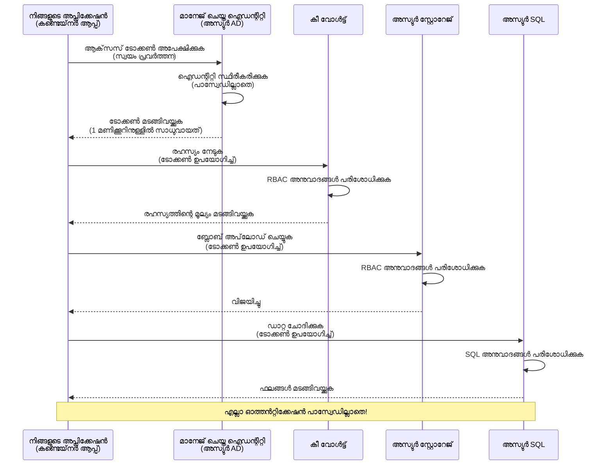
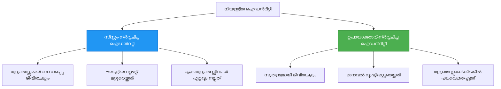

# ഓതന്റിക്കേഷൻ മാതൃകകളും മാനേജഡ് ഐഡന്റിറ്റിയും

⏱️ **അനുമാനിക്കുന്ന സമയം**: 45-60 മിനിറ്റ് | 💰 **ചെലവ് പ്രഭാവം**: സൗജന്യം (കൂടുതൽ ചാർജുകൾ ഇല്ല) | ⭐ **സങ്കീർണ്ണത**: ഇടത്തരം

**📚 പഠന പഥം:**
- ← മുമ്പ്: [കോൻഫിഗറേഷൻ മാനേജ്മെന്റ്](configuration.md) - പരിസ്ഥിതി ക്ഷണങ്ങളും രഹസ്യങ്ങളും മാനേജ്മെന്റ്
- 🎯 **നിങ്ങൾ ഇവിടെ**: ഓതന്റിക്കേഷൻ & സെക്യൂരിറ്റി (മാനേജഡ് ഐഡന്റിറ്റി, കീ വാൾട്ട്, സുരക്ഷിത മാതൃകകൾ)
- → അടുത്തത്: [ആദ്യ പദ്ധതികൾ](first-project.md) - നിങ്ങളുടെ ആദ്യ AZD അപ്ലിക്കേഷൻ നിർമ്മിക്കുക
- 🏠 [കോഴ്‌സ് ഹോം](../../README.md)

---

## നിങ്ങൾ പഠിക്കുന്നതെന്ത്?

ഈ പാഠം പൂർത്തിയാക്കുന്നതിലൂടെ, നിങ്ങൾക്ക് കഴിയും:
- Azure ഓതന്റിക്കേഷൻ മാതൃകകൾ മനസിലാക്കുക (കീസ്, കണക്ഷൻ സ്ട്രിംഗുകൾ, മാനേജഡ് ഐഡന്റിറ്റി)
- **മാനേജഡ് ഐഡന്റിറ്റി** ഉപയോഗിച്ച് പാസ്വർഡ് രഹിത ഓതന്റിക്കേഷൻ നടപ്പിലാക്കുക
- **Azure കീ വാൾട്ട്** ഇന്റഗ്രേഷൻ വഴി രഹസ്യങ്ങൾ സുരക്ഷിതമാക്കുക
- AZD വിനിയോഗങ്ങൾക്ക് **റോൾ അടിസ്ഥാന അഭിമുഖ നിയന്ത്രണം (RBAC)** ക്രമീകരിക്കുക
- കണ്ടെയ്‌നർ ആപ്പുകളും Azure സേവനങ്ങളിലുമായി സുരക്ഷിത നല്ല ആചാരങ്ങൾ പ്രയോഗിക്കുക
- കീ അടിസ്ഥാന ഓതന്റിക്കേഷനിൽ നിന്ന് ഐഡന്റിറ്റി അടിസ്ഥാന ഓതന്റിക്കേഷനിലേക്ക് മാറ്റം നടപ്പിലാക്കുക

## മനേജഡ് ഐഡന്റിറ്റി എന്തിനാണ് പ്രധാന്യം?

### പ്രശ്‌നം: പാരമ്പര്യ ഓതന്റിക്കേഷൻ

**മാനേജഡ് ഐഡന്റിറ്റിക്ക് മുമ്പ്:**
```javascript
// ❌ സുരക്ഷാ അപകടം: കോഡിൽ ഹാർഡ്കോഡഡ് രഹസ്യങ്ങൾ
const connectionString = "Server=mydb.database.windows.net;User=admin;Password=P@ssw0rd123";
const storageKey = "xK7mN9pQ2wR5tY8uI0oP3aS6dF1gH4jK...";
const cosmosKey = "C2x7B9n4M1p8Q5w3E6r0T2y5U8i1O4p7...";
```

**പ്രശ്നങ്ങൾ:**
- 🔴 കോഡിലും കോൺഫിഗ് ഫയലുകളും പരിസ്ഥിതി വീരീകരണങ്ങളിലും റോഹസ്യങ്ങൾ വെളിപ്പെടുത്തപ്പെട്ടത്
- 🔴 ക്രെഡൻഷ്യൽ റോട്ടേഷൻക്ക് കോഡിൽ മാറ്റങ്ങളും വീണ്ടും വിനിയോഗവും ആവശ്യം
- 🔴 ഓഡിറ്റ് വിഷമങ്ങൾ - ആരാണ് എപ്പോഴാണ് എന്ത് ആക്‌സസ് ചെയ്തത്?
- 🔴 വിവരങ്ങൾ പല സിസ്റ്റങ്ങളിലും പടർന്നുപിടിച്ചിരിക്കുന്നു
- 🔴 പാലന അഭിമുഖങ്ങളിൽ പരാജയം

### പരിഹാരം: മാനേജഡ് ഐഡന്റിറ്റി

**മാനേജഡ് ഐഡന്റിറ്റിക്ക് ശേഷം:**
```javascript
// ✅ സുരക്ഷിതം: കോഡിൽ രഹസ്യങ്ങളൊന്നുമില്ല
const credential = new DefaultAzureCredential();
const client = new BlobServiceClient(
  "https://mystorageaccount.blob.core.windows.net",
  credential  // അസ്യൂർ സ്വയം സ്വയമേവ പ്രാമਾਣീകീകരണം കൈകാര്യം ചെയ്യുന്നു
);
```

**നന്മകൾ:**
- ✅ കോഡിലും കോൺഫിഗിലും രഹസ്യങ്ങളൊന്നും ഇല്ല
- ✅ സ്വയം ക്രമീകരിക്കുന്ന റോട്ടേഷൻ - Azure കൈകാര്യം ചെയ്യുന്നു
- ✅ Azure AD ലോഗുകളിൽ പൂർണ്ണ ഓഡിറ്റ് ട്രെയിൽ
- ✅ കേന്ദ്രികൃത സുരക്ഷ - Azure പോർട്ടലിൽ മാനേജുചെയ്യാം
- ✅ പാലന സജ്ജമായുണ്ടാകുന്നു - സുരക്ഷാ മാനദണ്ഡങ്ങൾ പാലിക്കുന്നു

**ഉദാഹരണം**: പാരമ്പര്യ ഓതന്റിക്കേഷൻ എത്രത്തോളം വ്യത്യസ്ത താടിൾക്കുള്ള കീവഴി വാങ്ങുന്നത് പോലെ ആണ്. മാനേജഡ് ഐഡന്റിറ്റി നിങ്ങളുടെ ഐഡിയറ്റിക്ക് അനുസരിച്ച് സ്വയം പ്രവേശനം നൽകുന്ന സുരക്ഷാ ബാഡ്ജ് വെയ്ക്കുന്നതുപോലെ ആണ് — keys നഷ്ടപ്പെടുകയോ പകർത്തുകയോ റോട്ടേറ്റ് ചെയ്യുകയോ ആവശ്യമില്ല.

---

## സാങ്കേതിക അവലോകനം

### മാനേജഡ് ഐഡന്റിറ്റിയോടുള്ള ഓതന്റിക്കേഷൻ ഫ്ലോ


### മാനേജഡ് ഐഡന്റിറ്റികളുടെ തരം


| സവിശേഷത | സിസ്റ്റം നിയുക്ത | ഉപയോക്താവ് നിയുക്ത |
|---------|----------------|---------------|
| **ജീവിതചക്രം** | റിസോഴ്‌സിനോട് ബന്ധപ്പെട്ടു | സ്വതന്ത്രം |
| **സൃഷ്ടി** | റിസോഴ്‌സുമായി സ്വയം | കൈമാറി സൃഷ്ടിക്കണം |
| **अവസാനം** | റിസോഴ്‌സ് ഇല്ലാതാകുമ്പോൾ നീക്കം | റിസോഴ്‌സ് നീക്കം കഴിഞ്ഞും നിലനിർത്താം |
| **പങ്കിടല്‍** | ഒറ്റ റിസോഴ്‌സ് മാത്രം | പല റിസോഴ്‌സുകളിലേക്കും |
| **പയോഗം** | ലളിതമായ സാഹചര്യങ്ങൾ |സങ്കീര്‍ണ്ണമായ മൾട്ടി-റിസോഴ്‌സ് സാഹചര്യങ്ങൾ |
| **AZD ഡിഫോൾട്ട്** | ✅ ശുപാർശ ചെയ്തത് | ഐച്ഛികം |

---

## മുൻവർഷങ്ങൾ

### ആവശ്യമായ ഉപകരണങ്ങൾ

നിങ്ങൾക്ക് മുമ്പത്തെ പാഠങ്ങളിൽ നിന്ന് ഇവ ഇൻസ്റ്റാൾ ചെയ്തിട്ടുണ്ടാകണം:

```bash
# അസ്യൂർ ഡെവലപ്പർ CLI സ്ഥിരീകരിക്കുക
azd version
# ✅ പ്രതീക്ഷിച്ചത്: azd പതിപ്പ് 1.0.0 അല്ലെങ്കിൽ അതിലധികം

# അസ്യൂർ CLI സ്ഥിരീകരിക്കുക
az --version
# ✅ പ്രതീക്ഷിച്ചത്: azure-cli 2.50.0 അല്ലെങ്കിൽ അതിലധികം
```

### Azure ആവശ്യകതകൾ

- സജീവ Azure സബ്സ്ക്രിപ്ഷൻ
- താഴെ പറയുന്ന അവകാശങ്ങൾ:
  - മാനേജഡ് ഐഡന്റിറ്റികൾ സൃഷ്ടിക്കുക
  - RBAC റോളുകൾ നിയോഗിക്കുക
  - കീ വാൾട്ട് വിഭവങ്ങൾ സൃഷ്ടിക്കുക
  - കണ്ടെയ്‌നർ ആപ്പുകൾ വിനിയോഗിക്കുക

### അറിവ് മുൻവർഷങ്ങൾ

നിങ്ങൾ പൂർത്തിയാക്കിയിരിക്കണം:
- [ഇൻസ്റ്റലേഷൻ ഗൈഡ്](installation.md) - AZD സെറ്റപ്പ്
- [AZD അടിസ്ഥാനങ്ങൾ](azd-basics.md) - പ്രാഥമിക ആശയങ്ങൾ
- [കോൺഫിഗറേഷൻ മാനേജ്മെന്റ്](configuration.md) - പരിസ്ഥിതി വേരിയബിളുകൾ

---

## പാഠം 1: ഓതന്റിക്കേഷൻ മാതൃകകൾ മനസിലാക്കുക

### മാതൃകം 1: കണക്ഷൻ സ്ട്രിംഗുകൾ (പാരമ്പര്യം - ഒഴിവാക്കുക)

**എങ്ങനെയാണ് പ്രവർത്തിക്കുന്നത്:**
```bash
# കണക്ഷൻ സ്റ്റ്രീംഗിൽ ക്രെഡൻഷ്യലുകൾ ഉൾപ്പെടുന്നു
STORAGE_CONNECTION_STRING="DefaultEndpointsProtocol=https;AccountName=myaccount;AccountKey=xK7mN9pQ2wR5..."
COSMOS_CONNECTION_STRING="AccountEndpoint=https://myaccount.documents.azure.com:443/;AccountKey=C2x7..."
SQL_CONNECTION_STRING="Server=myserver.database.windows.net;User=admin;Password=P@ssw0rd..."
```

**പ്രശ്നങ്ങൾ:**
- ❌ പരിസ്ഥിതി വേരിയബിളുകളിൽ രഹസ്യങ്ങൾ കാണപ്പെടുന്നു
- ❌ വിനിയോഗ സിസ്റ്റങ്ങളിൽ ലോഗ് ചെയ്യപ്പെടുന്നു
- ❌ റോട്ടേറ്റ് ചെയ്യാൻ ബുദ്ധിമുട്ട്
- ❌ ആക്‌സസിന്റെ ഓഡിറ്റ് ട്രെയ്ൽ ഇല്ല

**എപ്പോഴാണു ഉപയോഗിക്കുന്നത്:** പ്രാദേശിക വികസനത്തിനാണ് മാത്രം; പ്രൊഡക്ഷനിൽ ഒരിക്കലും ഉപയോഗിക്കരുത്.

---

### മാതൃകം 2: കീ വാൾട്ട് റഫറൻസുകൾ (മേന്മയുള്ളത്)

**എങ്ങനെയാണ് പ്രവർത്തിക്കുന്നത്:**
```bicep
// Store secret in Key Vault
resource keyVault 'Microsoft.KeyVault/vaults@2023-02-01' = {
  name: 'mykv'
  properties: {
    enableRbacAuthorization: true
  }
}

// Reference in Container App
env: [
  {
    name: 'STORAGE_KEY'
    secretRef: 'storage-key'  // References Key Vault
  }
]
```

**നന്മകൾ:**
- ✅ കീ വാൾട്ടിൽ രഹസ്യങ്ങൾ സുരക്ഷിതമായി സംഭരിച്ചു വയ്ക്കുന്നു
- ✅ കേന്ദ്രികൃത രഹസ്യ മാനേജ്മെന്റ്
- ✅ കോഡിൽ മാറ്റമില്ലാതെ റോട്ടേഷൻ സാധ്യമാണ്

**പരിധികൾ:**
- ⚠️ ഇപ്പോഴും കീകൾ/പാസ്‌വേഡുകൾ ഉപയോഗിക്കുന്നു
- ⚠️ കീ വാൾട്ട് ആക്‌സസ് വേണ്ട മാനേജ് ചെയ്യണം

**എപ്പോഴാണു ഉപയോഗിക്കുക:** കണക്ഷൻ സ്ട്രിംഗുകളിൽ നിന്ന് മാനേജഡ് ഐഡന്റിറ്റിയിലേക്കുള്ള ഇടത്തരം ნაბიჯമായി.

---

### മാതൃകം 3: മാനേജഡ് ഐഡന്റിറ്റി (നല്ല ആചാരം)

**എങ്ങനെയാണ് പ്രവർത്തിക്കുന്നത്:**
```bicep
// Enable managed identity
resource containerApp 'Microsoft.App/containerApps@2023-05-01' = {
  name: 'myapp'
  identity: {
    type: 'SystemAssigned'  // Automatically creates identity
  }
}

// Grant permissions
resource roleAssignment 'Microsoft.Authorization/roleAssignments@2022-04-01' = {
  scope: storageAccount
  properties: {
    roleDefinitionId: storageBlobDataContributorRole
    principalId: containerApp.identity.principalId
  }
}
```

**അപ്ലിക്കേഷൻ കോഡ്:**
```javascript
// മറഞ്ഞിരിക്കുന്നത് ആവശ്യമില്ല!
const { DefaultAzureCredential } = require('@azure/identity');
const { BlobServiceClient } = require('@azure/storage-blob');

const credential = new DefaultAzureCredential();
const blobServiceClient = new BlobServiceClient(
  'https://mystorageaccount.blob.core.windows.net',
  credential
);
```

**നന്മകൾ:**
- ✅ കോഡ്/കോൺഫിഗിൽ രഹസ്യങ്ങൾ ഒന്നും ഇല്ല
- ✅ ഓട്ടോമാറ്റിക് ക്രെഡൻഷ്യൽ റോട്ടേഷൻ
- ✅ പൂർണ്ണ ഓഡിറ്റ് ട്രെയ്ൽ
- ✅ RBAC അടിസ്ഥാന പരിചയം
- ✅ പാലന സജ്ജമാണ്

**എപ്പോഴാണു ഉപയോഗിക്കുക:** എല്ലാ പ്രൊഡക്ഷൻ അപ്ലിക്കേഷനുകൾക്കും വേണ്ട.

---

## പാഠം 2: AZD ഉപയോഗിച്ച് മാനേജഡ് ഐഡന്റിറ്റി നടപ്പാക്കിയ്ക്കുക

### ഘട്ടം ഘട്ടം നടപ്പാക്കൽ

മാനേജഡ് ഐഡന്റിറ്റി ഉപയോഗിച്ച് Azure സ്റ്റോറേജിലും കീ വാൾട്ടിലും പ്രവേശനം ലഭിക്കാൻ ഒരു സുരക്ഷിത കണ്ടെയ്‌നർ ആപ്പ് നിർമ്മിക്കാം.

### പ്രോജക്റ്റ് ഘടന

```
secure-app/
├── azure.yaml                 # AZD configuration
├── infra/
│   ├── main.bicep            # Main infrastructure
│   ├── core/
│   │   ├── identity.bicep    # Managed identity setup
│   │   ├── keyvault.bicep    # Key Vault configuration
│   │   └── storage.bicep     # Storage with RBAC
│   └── app/
│       └── container-app.bicep
└── src/
    ├── app.js                # Application code
    ├── package.json
    └── Dockerfile
```

### 1. AZD കോൺഫിഗർ ചെയ്യുക (azure.yaml)

```yaml
name: secure-app
metadata:
  template: secure-app@1.0.0

services:
  api:
    project: ./src
    language: js
    host: containerapp

# Enable managed identity (AZD handles this automatically)
```

### 2. ഇന്‍ഫ്രാസ്ട്രക്ചർ: മാനേജഡ് ഐഡന്റിറ്റി സജ്ജമാക്കുക

**ഫയല്‍: `infra/main.bicep`**

```bicep
targetScope = 'subscription'

param environmentName string
param location string = 'eastus'

var tags = { 'azd-env-name': environmentName }

// Resource group
resource rg 'Microsoft.Resources/resourceGroups@2021-04-01' = {
  name: 'rg-${environmentName}'
  location: location
  tags: tags
}

// Storage Account
module storage './core/storage.bicep' = {
  name: 'storage'
  scope: rg
  params: {
    name: 'st${uniqueString(rg.id)}'
    location: location
    tags: tags
  }
}

// Key Vault
module keyVault './core/keyvault.bicep' = {
  name: 'keyvault'
  scope: rg
  params: {
    name: 'kv-${uniqueString(rg.id)}'
    location: location
    tags: tags
  }
}

// Container App with Managed Identity
module containerApp './app/container-app.bicep' = {
  name: 'container-app'
  scope: rg
  params: {
    name: 'ca-${environmentName}'
    location: location
    tags: tags
    storageAccountName: storage.outputs.name
    keyVaultName: keyVault.outputs.name
  }
}

// Grant Container App access to Storage
module storageRoleAssignment './core/role-assignment.bicep' = {
  name: 'storage-role'
  scope: rg
  params: {
    principalId: containerApp.outputs.identityPrincipalId
    roleDefinitionId: 'ba92f5b4-2d11-453d-a403-e96b0029c9fe'  // Storage Blob Data Contributor
    targetResourceId: storage.outputs.id
  }
}

// Grant Container App access to Key Vault
module kvRoleAssignment './core/role-assignment.bicep' = {
  name: 'kv-role'
  scope: rg
  params: {
    principalId: containerApp.outputs.identityPrincipalId
    roleDefinitionId: '4633458b-17de-408a-b874-0445c86b69e6'  // Key Vault Secrets User
    targetResourceId: keyVault.outputs.id
  }
}

// Outputs
output AZURE_STORAGE_ACCOUNT_NAME string = storage.outputs.name
output AZURE_KEY_VAULT_NAME string = keyVault.outputs.name
output APP_URL string = containerApp.outputs.url
```

### 3. സിസ്റ്റം നിയുക്ത ഐഡന്റിറ്റിയോടുകൂടിയ കണ്ടെയ്‌നർ ആപ്പ്

**ഫയല്‍: `infra/app/container-app.bicep`**

```bicep
param name string
param location string
param tags object = {}
param storageAccountName string
param keyVaultName string

resource containerApp 'Microsoft.App/containerApps@2023-05-01' = {
  name: name
  location: location
  tags: tags
  identity: {
    type: 'SystemAssigned'  // 🔑 Enable managed identity
  }
  properties: {
    configuration: {
      ingress: {
        external: true
        targetPort: 3000
      }
    }
    template: {
      containers: [
        {
          name: 'api'
          image: 'myregistry.azurecr.io/api:latest'
          resources: {
            cpu: json('0.5')
            memory: '1Gi'
          }
          env: [
            {
              name: 'AZURE_STORAGE_ACCOUNT_NAME'
              value: storageAccountName
            }
            {
              name: 'AZURE_KEY_VAULT_NAME'
              value: keyVaultName
            }
            // 🔑 No secrets - managed identity handles authentication!
          ]
        }
      ]
    }
  }
}

// Output the identity for RBAC assignments
output identityPrincipalId string = containerApp.identity.principalId
output id string = containerApp.id
output url string = 'https://${containerApp.properties.configuration.ingress.fqdn}'
```

### 4. RBAC റോളിന്റെ നിയോഗം മോഡ്യൂൾ

**ഫയല്‍: `infra/core/role-assignment.bicep`**

```bicep
param principalId string
param roleDefinitionId string  // Azure built-in role ID
param targetResourceId string

resource roleAssignment 'Microsoft.Authorization/roleAssignments@2022-04-01' = {
  name: guid(principalId, roleDefinitionId, targetResourceId)
  scope: resourceId('Microsoft.Resources/resourceGroups', resourceGroup().name)
  properties: {
    roleDefinitionId: subscriptionResourceId('Microsoft.Authorization/roleDefinitions', roleDefinitionId)
    principalId: principalId
    principalType: 'ServicePrincipal'
  }
}

output id string = roleAssignment.id
```

### 5. മാനേജഡ് ഐഡന്റിറ്റി ഉപയോഗിച്ച് അപ്ലിക്കേഷൻ കോഡ്

**ഫയല്‍: `src/app.js`**

```javascript
const express = require('express');
const { DefaultAzureCredential } = require('@azure/identity');
const { BlobServiceClient } = require('@azure/storage-blob');
const { SecretClient } = require('@azure/keyvault-secrets');

const app = express();
const PORT = process.env.PORT || 3000;

// 🔑 ക്രെഡൻഷ്യൽ ആരംഭിക്കുക (മാനേജ്ഡ് ഐഡന്റിറ്റി ഉപയോഗിച്ച് സ്വയമേവ പ്രവർത്തിക്കുന്നു)
const credential = new DefaultAzureCredential();

// ആസ്യൂർ സ്റ്റോറേജ് ക്രമീകരണം
const storageAccountName = process.env.AZURE_STORAGE_ACCOUNT_NAME;
const blobServiceClient = new BlobServiceClient(
  `https://${storageAccountName}.blob.core.windows.net`,
  credential  // കീകൾ ആവശ്യമില്ല!
);

// കീ വോൾട്ട് ക്രമീകരണം
const keyVaultName = process.env.AZURE_KEY_VAULT_NAME;
const secretClient = new SecretClient(
  `https://${keyVaultName}.vault.azure.net`,
  credential  // കീകൾ ആവശ്യമില്ല!
);

// ആരോഗ്യ പരിശോധന
app.get('/health', (req, res) => {
  res.json({ status: 'healthy', authentication: 'managed-identity' });
});

// ഫയൽ ബ്ലോബ് സ്റ്റോറേജിലേക്ക് അപ്‌ലോഡ് ചെയ്യുക
app.post('/upload', async (req, res) => {
  try {
    const containerClient = blobServiceClient.getContainerClient('uploads');
    await containerClient.createIfNotExists();
    
    const blobName = `file-${Date.now()}.txt`;
    const blockBlobClient = containerClient.getBlockBlobClient(blobName);
    
    await blockBlobClient.upload('Hello from managed identity!', 30);
    
    res.json({
      success: true,
      blobName: blobName,
      message: 'File uploaded using managed identity!'
    });
  } catch (error) {
    console.error('Upload error:', error);
    res.status(500).json({ error: error.message });
  }
});

// കീ വോൾട്ടിൽ നിന്ന് രഹസ്യം നേടുക
app.get('/secret/:name', async (req, res) => {
  try {
    const secretName = req.params.name;
    const secret = await secretClient.getSecret(secretName);
    
    res.json({
      name: secretName,
      value: secret.value,
      message: 'Secret retrieved using managed identity!'
    });
  } catch (error) {
    console.error('Secret error:', error);
    res.status(500).json({ error: error.message });
  }
});

// ബ്ലോബ് കൺറ്റെയ്നർമാർ ലിസ്റ്റ് ചെയ്യുക (വായനാനുമതി കാണിക്കുന്നു)
app.get('/containers', async (req, res) => {
  try {
    const containers = [];
    for await (const container of blobServiceClient.listContainers()) {
      containers.push(container.name);
    }
    
    res.json({
      containers: containers,
      count: containers.length,
      message: 'Containers listed using managed identity!'
    });
  } catch (error) {
    console.error('List error:', error);
    res.status(500).json({ error: error.message });
  }
});

app.listen(PORT, () => {
  console.log(`Secure API listening on port ${PORT}`);
  console.log('Authentication: Managed Identity (passwordless)');
});
```

**ഫയല്‍: `src/package.json`**

```json
{
  "name": "secure-app",
  "version": "1.0.0",
  "dependencies": {
    "express": "^4.18.2",
    "@azure/identity": "^4.0.0",
    "@azure/storage-blob": "^12.17.0",
    "@azure/keyvault-secrets": "^4.7.0"
  },
  "scripts": {
    "start": "node app.js"
  }
}
```

### 6. വിനിയോഗിക്കുകയും പരിശോധന നടത്തുകയും ചെയ്യുക

```bash
# AZD പരിസ്ഥിതി ആരംഭിക്കുക
azd init

# അടിസ്ഥാന സൗകര്യവും ആപ്ലിക്കേഷനും വിന്യസിക്കുക
azd up

# ആപ്പ് URL നേടുക
APP_URL=$(azd env get-values | grep APP_URL | cut -d '=' -f2 | tr -d '"')

# ആരോഗ്യ പരിശോധനയ്ക്ക് പരീക്ഷിക്കുക
curl $APP_URL/health
```

**✅ പ്രതീക്ഷിക്കുന്ന ഫലം:**
```json
{
  "status": "healthy",
  "authentication": "managed-identity"
}
```

**Blob അപ്‌ലോഡ് പരിശോധന:**
```bash
curl -X POST $APP_URL/upload
```

**✅ പ്രതീക്ഷിക്കുന്ന ഫലം:**
```json
{
  "success": true,
  "blobName": "file-1700404800000.txt",
  "message": "File uploaded using managed identity!"
}
```

**കണ്ടെയ്‌നർ ലിസ്റ്റിംഗ് പരിശോധന:**
```bash
curl $APP_URL/containers
```

**✅ പ്രതീക്ഷിക്കുന്ന ഫലം:**
```json
{
  "containers": ["uploads"],
  "count": 1,
  "message": "Containers listed using managed identity!"
}
```

---

## സാധാരണം Azure RBAC റോളുകൾ

### മാനേജഡ് ഐഡന്റിറ്റിയ്ക്കുള്ള ഇൻ-ബിൽറ്റ് റോളുകൾ

| സർവീസ് | റോളിന്റെ പേര് | റോളിന്റെ ഐഡി | അനുമതികൾ |
|---------|--------------|---------------|------------|
| **Storage** | Storage Blob Data Reader | `2a2b9908-6b94-4a3d-8e5a-a7d8f8cc8a12` | ബ്ലോബുകളും കണ്ടെയ്‌നറുകളും വായിക്കല്‍ |
| **Storage** | Storage Blob Data Contributor | `ba92f5b4-2d11-453d-a403-e96b0029c9fe` | ബ്ലോബുകൾ വായിക്കുക, എഴുതുക, ഇല്ലാതാക്കുക |
| **Storage** | Storage Queue Data Contributor | `974c5e8b-45b9-4653-ba55-5f855dd0fb88` | ക്യൂ സന്ദേശങ്ങൾ വായിക്കുക, എഴുതുക, ഇല്ലാതാക്കുക |
| **Key Vault** | Key Vault Secrets User | `4633458b-17de-408a-b874-0445c86b69e6` | രഹസ്യങ്ങൾ വായന |
| **Key Vault** | Key Vault Secrets Officer | `b86a8fe4-44ce-4948-aee5-eccb2c155cd7` | രഹസ്യങ്ങൾ വായിക്കുക, എഴുതുക, ഇല്ലാതാക്കുക |
| **Cosmos DB** | Cosmos DB Built-in Data Reader | `00000000-0000-0000-0000-000000000001` | Cosmos DB ഡാറ്റ വായിക്കുക |
| **Cosmos DB** | Cosmos DB Built-in Data Contributor | `00000000-0000-0000-0000-000000000002` | Cosmos DB ഡാറ്റ വായിക്കുക, എഴുന്പിക്കുക |
| **SQL Database** | SQL DB Contributor | `9b7fa17d-e63e-47b0-bb0a-15c516ac86ec` | SQL ഡാറ്റാബേസുകൾ മാനേജ് ചെയ്യുക |
| **Service Bus** | Azure Service Bus Data Owner | `090c5cfd-751d-490a-894a-3ce6f1109419` | സന്ദേശങ്ങൾ അയയ്ക്കുക, സ്വീകരിക്കുക, മാനേജ് ചെയ്യുക |

### റോളിന്റെ ഐഡി എങ്ങനെ കണ്ടെത്താം

```bash
# എല്ലാവുമായിട്ടുള്ള ഉള്‍പ്പെടുത്തിയിട്ടുള്ള എല്ലാ വേഷങ്ങളും പട്ടിയാക്കുക
az role definition list --query "[].{Name:roleName, ID:name}" --output table

# പ്രത്യേക വേഷം തിരയുക
az role definition list --query "[?contains(roleName, 'Storage Blob')].{Name:roleName, ID:name}" --output table

# വേഷത്തിന്റെ വിശദാംശങ്ങള്‍ ലഭിക്കുക
az role definition list --name "Storage Blob Data Contributor"
```

---

## പ്രായോഗിക അഭ്യാസങ്ങൾ

### അഭ്യാസം 1: നിലവിലെ ആപ്പിനായി മാനേജഡ് ഐഡന്റിറ്റി സജ്ജമാക്കുക ⭐⭐ (ഇടത്തരം)

**ലക്ഷ്യം**: നിലവിലുള്ള കണ്ടെയ്‌നർ ആപ്പിന്മാനേജഡ് ഐഡന്റിറ്റി ചേർക്കുക

**പരിസരം**: നിങ്ങൾക്കുണ്ടായിട്ടുള്ള കണ്ടെയ്‌നർ ആപ്പ് കണക്ഷൻ സ്ട്രിംഗുകൾ ഉപയോഗിക്കുന്നു. ദയവായി അത് മാനേജഡ് ഐഡന്റിറ്റിയിലേക്ക് മാറ്റുക.

**ആരംഭ ബിന്ദു**: ഈ കോൺഫിഗറേഷൻ ഉള്ള കണ്ടെയ്‌നർ ആപ്പ്:

```bicep
// ❌ Current: Using connection string
env: [
  {
    name: 'STORAGE_CONNECTION_STRING'
    secretRef: 'storage-connection'
  }
]
```

**പടികൾ**:

1. **Bicep-ൽ മാനേജഡ് ഐഡന്റിറ്റി സജ്ജമാക്കുക:**

```bicep
resource containerApp 'Microsoft.App/containerApps@2023-05-01' = {
  name: 'myapp'
  identity: {
    type: 'SystemAssigned'  // Add this
  }
  // ... rest of configuration
}
```

2. **സ്റ്റോറേജ് ആക്‌സസ് നൽകുക:**

```bicep
// Get storage account reference
resource storageAccount 'Microsoft.Storage/storageAccounts@2023-01-01' existing = {
  name: storageAccountName
}

// Assign role
resource roleAssignment 'Microsoft.Authorization/roleAssignments@2022-04-01' = {
  name: guid(containerApp.id, 'ba92f5b4-2d11-453d-a403-e96b0029c9fe', storageAccount.id)
  scope: storageAccount
  properties: {
    roleDefinitionId: subscriptionResourceId('Microsoft.Authorization/roleDefinitions', 'ba92f5b4-2d11-453d-a403-e96b0029c9fe')
    principalId: containerApp.identity.principalId
    principalType: 'ServicePrincipal'
  }
}
```

3. **അപ്ലിക്കേഷൻ കോഡ് അപ്ഡേറ്റ് ചെയ്യുക:**

**മുന്‍പ് (കണക്ഷൻ സ്ട്രിംഗ്):**
```javascript
const { BlobServiceClient } = require('@azure/storage-blob');

const blobServiceClient = BlobServiceClient.fromConnectionString(
  process.env.STORAGE_CONNECTION_STRING
);
```

**ശേഷം (മാനേജഡ് ഐഡന്റിറ്റി):**
```javascript
const { DefaultAzureCredential } = require('@azure/identity');
const { BlobServiceClient } = require('@azure/storage-blob');

const credential = new DefaultAzureCredential();
const blobServiceClient = new BlobServiceClient(
  `https://${process.env.STORAGE_ACCOUNT_NAME}.blob.core.windows.net`,
  credential
);
```

4. **പരിസ്ഥിതി വേരിയബിളുകൾ അപ്ഡേറ്റ് ചെയ്യുക:**

```bicep
env: [
  {
    name: 'STORAGE_ACCOUNT_NAME'
    value: storageAccountName  // Just the name, no secrets!
  }
  // Remove STORAGE_CONNECTION_STRING
]
```

5. **വിനിയോഗം చేసి പരിശോധന നടത്തുക:**

```bash
# വീണ്ടും വിന്യസിക്കുക
azd up

# അത് ഇനിയും പ്രവർത്തിക്കുന്നുണ്ടോ എന്ന് പരിശോധിക്കുക
curl https://myapp.azurecontainerapps.io/upload
```

**✅ വിജയമാകാനുള്ള മാനദണ്ഡങ്ങൾ:**
- ✅ അപ്ലിക്കേഷൻ പിശകുകൾ കൂടാതെ വിനിയോഗിക്കണം
- ✅ സ്റ്റോറേജ് പ്രവർത്തനങ്ങൾ (അപ്‌ലോഡ്, ലിസ്റ്റ്, ഡൗൺലോഡ്) പ്രവർത്തിക്കുക
- ✅ പരിസ്ഥിതി വേരിയബിളുകളിൽ കണക്ഷൻ സ്ട്രിംഗുകൾ ഇല്ലാതായി
- ✅ Azure പോർട്ടലിലെ "Identity" ബ്‌ളേഡിൽ ഐഡന്റിറ്റി കാണണം

**പരിശോധന:**

```bash
# മാനേജ് ചെയ്‌ത ഐഡന്റിറ്റി പ്രവർത്തനക്ഷമമാണോ എന്ന് പരിശോധിക്കുക
az containerapp show \
  --name myapp \
  --resource-group rg-myapp \
  --query "identity.type"
# ✅ പ്രതീക്ഷിക്കപ്പെടുന്നു: "SystemAssigned"

# റോൾ നിയോജനം പരിശോധിക്കുക
az role assignment list \
  --assignee $(az containerapp show --name myapp --resource-group rg-myapp --query "identity.principalId" -o tsv) \
  --scope /subscriptions/{sub-id}/resourceGroups/rg-myapp/providers/Microsoft.Storage/storageAccounts/mystorageaccount
# ✅ പ്രതീക്ഷിക്കപ്പെടുന്നു: "Storage Blob Data Contributor" റോൾ കാണിക്കുന്നു
```

**സമയം**: 20-30 മിനിറ്റ്

---

### അഭ്യാസം 2: ഉപയോക്താവ് നിയുക്ത ഐഡന്റിറ്റി ഉപയോഗിച്ച് മൾട്ടി-സർവീസ് ആക്‌സസ് ⭐⭐⭐ (ഉന്നതമൊഡൽ)

**ലക്ഷ്യം**: മൾട്ടി കണ്ടെയ്‌നർ ആപ്പുകൾക്ക് പങ്കിട്ട ഉപയോഗം ഉള്ള ഉപയോക്താവ് നിയുക്ത ഐഡന്റിറ്റി സൃഷ്ടിക്കുക

**പരിസരം**: 3 മൈക്രോസർവീസുകൾക്ക് സേമ സ്റ്റോറേജ് അക്കൗണ്ടും കീ വാൾട്ടും ആക്‌സസ് വേണം.

**പടികൾ**:

1. **ഉപയോക്താവ് നിയുക്ത ഐഡന്റിറ്റി സൃഷ്ടിക്കുക:**

**ഫയൽ: `infra/core/identity.bicep`**

```bicep
param name string
param location string
param tags object = {}

resource userAssignedIdentity 'Microsoft.ManagedIdentity/userAssignedIdentities@2023-01-31' = {
  name: name
  location: location
  tags: tags
}

output id string = userAssignedIdentity.id
output principalId string = userAssignedIdentity.properties.principalId
output clientId string = userAssignedIdentity.properties.clientId
```

2. **ഉപയോക്താവ് നിയുക്ത ഐഡന്റിറ്റിക്ക് റോളുകൾ അനുമതിപെടുത്തുക:**

```bicep
// In main.bicep
module userIdentity './core/identity.bicep' = {
  name: 'user-identity'
  scope: rg
  params: {
    name: 'id-${environmentName}'
    location: location
    tags: tags
  }
}

// Grant Storage access
resource storageRoleAssignment 'Microsoft.Authorization/roleAssignments@2022-04-01' = {
  name: guid(userIdentity.outputs.principalId, 'storage-contributor')
  scope: storageAccount
  properties: {
    roleDefinitionId: subscriptionResourceId('Microsoft.Authorization/roleDefinitions', 'ba92f5b4-2d11-453d-a403-e96b0029c9fe')
    principalId: userIdentity.outputs.principalId
    principalType: 'ServicePrincipal'
  }
}

// Grant Key Vault access
resource kvRoleAssignment 'Microsoft.Authorization/roleAssignments@2022-04-01' = {
  name: guid(userIdentity.outputs.principalId, 'kv-secrets-user')
  scope: keyVault
  properties: {
    roleDefinitionId: subscriptionResourceId('Microsoft.Authorization/roleDefinitions', '4633458b-17de-408a-b874-0445c86b69e6')
    principalId: userIdentity.outputs.principalId
    principalType: 'ServicePrincipal'
  }
}
```

3. **പല കണ്ടെയ്‌നർ ആപ്പുകൾക്കായി ഐഡന്റിറ്റി നിയോഗിക്കുക:**

```bicep
resource apiGateway 'Microsoft.App/containerApps@2023-05-01' = {
  name: 'api-gateway'
  identity: {
    type: 'UserAssigned'
    userAssignedIdentities: {
      '${userIdentity.outputs.id}': {}
    }
  }
  // ... rest of config
}

resource productService 'Microsoft.App/containerApps@2023-05-01' = {
  name: 'product-service'
  identity: {
    type: 'UserAssigned'
    userAssignedIdentities: {
      '${userIdentity.outputs.id}': {}
    }
  }
  // ... rest of config
}

resource orderService 'Microsoft.App/containerApps@2023-05-01' = {
  name: 'order-service'
  identity: {
    type: 'UserAssigned'
    userAssignedIdentities: {
      '${userIdentity.outputs.id}': {}
    }
  }
  // ... rest of config
}
```

4. **അപ്ലിക്കേഷൻ കോഡ് (എല്ലാ സേവനങ്ങളിലും സമാന മാതൃക):**

```javascript
const { DefaultAzureCredential, ManagedIdentityCredential } = require('@azure/identity');

// ഉപയോക്താവ് નિયുക്തി ഐഡന്റിറ്റി വേണ്ടി, ക്ലയന്റ് ഐഡി വ്യക്തമാക്കുക
const credential = new ManagedIdentityCredential(
  process.env.AZURE_CLIENT_ID  // ഉപയോക്താവ് നിയോഗിച്ച ഐഡന്റിറ്റി ക്ലയന്റ് ഐഡി
);

// അല്ലെങ്കിൽ DefaultAzureCredential ഉപയോഗിക്കുക (സ്വയം തിരിച്ചറിയുന്നു)
const credential = new DefaultAzureCredential();

const blobServiceClient = new BlobServiceClient(
  `https://${process.env.STORAGE_ACCOUNT_NAME}.blob.core.windows.net`,
  credential
);
```

5. **വിനിയോഗവും പരിശോധനയും:**

```bash
azd up

# എല്ലാ സേവനങ്ങളും സ്‌റ്റോറേജ് ആക്‌സസ് ചെയ്യാൻ കഴിയും എന്ന് പരിശോധന നടത്തുക
curl https://api-gateway.azurecontainerapps.io/upload
curl https://product-service.azurecontainerapps.io/upload
curl https://order-service.azurecontainerapps.io/upload
```

**✅ വിജയമാകാനുള്ള മാനദണ്ഡങ്ങൾ:**
- ✅ ഒരു ഐഡന്റിറ്റി 3 സേവനങ്ങൾ പങ്കിടുന്നു
- ✅ എല്ലാ സേവനങ്ങളും സ്റ്റോറേജും കീ വാൾട്ടും ആക്‌സസ് ചെയ്യുന്നു
- ✅ ഒരു സേവനം മായ്ക്കുമ്പോഴും ഐഡന്റിറ്റി നിലനിൽക്കുന്നു
- ✅ കേന്ദ്രസന്ദർശനാനുമതികളുടെ മാനേജ്മെന്റ്

**ഉപയോക്താവ് നിയുക്ത ഐഡന്റിറ്റിയുടെ നന്മകൾ:**
- ഒന്നിച്ചുള്ള ഐഡന്റിറ്റി മാനേജ്മെന്റ്
- സേവനങ്ങൾക്കിടയിൽ സ്ഥിരതയുള്ള അനുമതികൾ
- സേവനം നീക്കം ചെയ്താലും ജീവിക്കുന്നു
- സങ്കീർണ രൂപകല്പനകൾക്കു മികച്ചത്

**സമയം**: 30-40 മിനിറ്റ്

---

### അഭ്യാസം 3: കീ വാൾട്ട് രഹസ്യ റോട്ടേഷൻ നടപ്പാക്കുക ⭐⭐⭐ (ഉന്നതമൊഡൽ)

**ലക്ഷ്യം**: മൂന്നാംപക്ഷ API കീകൾ കീ വാൾട്ടിൽ സൂക്ഷിച്ച് മാനേജഡ് ഐഡന്റിട്ടി ഉപയോഗിച്ച് ആക്‌സസ് ചെയ്യുക

**പരിസരം**: നിങ്ങളുടെ ആപ്പ് ഒരു APIs (OpenAI, Stripe, SendGrid) API കീകൾ ആവശ്യപ്പെടുന്നു.

**പടികൾ**:

1. **RBAC-ഉം കൂടിയ കീ വാൾട്ട് സൃഷ്ടിക്കുക:**

**ഫയൽ: `infra/core/keyvault.bicep`**

```bicep
param name string
param location string
param tags object = {}

resource keyVault 'Microsoft.KeyVault/vaults@2023-02-01' = {
  name: name
  location: location
  tags: tags
  properties: {
    enableRbacAuthorization: true  // Use RBAC instead of access policies
    sku: {
      family: 'A'
      name: 'standard'
    }
    tenantId: subscription().tenantId
    enableSoftDelete: true
    softDeleteRetentionInDays: 90
  }
}

// Allow Container App to read secrets
output id string = keyVault.id
output name string = keyVault.name
output uri string = keyVault.properties.vaultUri
```

2. **കീ വാൾട്ടിൽ രഹസ്യങ്ങൾ സംഭരിക്കുക:**

```bash
# കീ വോൾട്ട് പേര് ലഭിക്കുക
KV_NAME=$(azd env get-values | grep AZURE_KEY_VAULT_NAME | cut -d '=' -f2 | tr -d '"')

# മൂന്നാം_PARTY API കീകൾ സ്റ്രോവ് ചെയ്യുക
az keyvault secret set \
  --vault-name $KV_NAME \
  --name "OpenAI-ApiKey" \
  --value "sk-proj-xxxxxxxxxxxxx"

az keyvault secret set \
  --vault-name $KV_NAME \
  --name "Stripe-ApiKey" \
  --value "sk_live_xxxxxxxxxxxxx"

az keyvault secret set \
  --vault-name $KV_NAME \
  --name "SendGrid-ApiKey" \
  --value "SG.xxxxxxxxxxxxx"
```

3. **രഹസ്യങ്ങൾ തിരികെ നേടാനുള്ള അപ്ലിക്കേഷൻ കോഡ്:**

**ഫയൽ: `src/config.js`**

```javascript
const { DefaultAzureCredential } = require('@azure/identity');
const { SecretClient } = require('@azure/keyvault-secrets');

class Config {
  constructor() {
    this.credential = new DefaultAzureCredential();
    this.secretClient = new SecretClient(
      `https://${process.env.AZURE_KEY_VAULT_NAME}.vault.azure.net`,
      this.credential
    );
    this.cache = {};
  }

  async getSecret(secretName) {
    // ആദ്യം കാഷെ പരിശോധിക്കുക
    if (this.cache[secretName]) {
      return this.cache[secretName];
    }

    try {
      const secret = await this.secretClient.getSecret(secretName);
      this.cache[secretName] = secret.value;
      console.log(`✅ Retrieved secret: ${secretName}`);
      return secret.value;
    } catch (error) {
      console.error(`❌ Failed to get secret ${secretName}:`, error.message);
      throw error;
    }
  }

  async getOpenAIKey() {
    return this.getSecret('OpenAI-ApiKey');
  }

  async getStripeKey() {
    return this.getSecret('Stripe-ApiKey');
  }

  async getSendGridKey() {
    return this.getSecret('SendGrid-ApiKey');
  }
}

module.exports = new Config();
```

4. **അപ്ലിക്കേഷൻ കോഡിൽ രഹസ്യങ്ങൾ ഉപയോഗിക്കുക:**

**ഫയൽ: `src/app.js`**

```javascript
const express = require('express');
const config = require('./config');
const { OpenAI } = require('openai');

const app = express();

// കീ വോൾട്ടിൽ നിന്നുള്ള കീ ഉപയോഗിച്ച് OpenAI ആരംഭിക്കുക
let openaiClient;

async function initializeServices() {
  const openaiKey = await config.getOpenAIKey();
  openaiClient = new OpenAI({ apiKey: openaiKey });
  console.log('✅ Services initialized with secrets from Key Vault');
}

// സ്റ്റാർട്ടപ്പിൽ വിളിക്കുക
initializeServices().catch(console.error);

app.post('/chat', async (req, res) => {
  try {
    const completion = await openaiClient.chat.completions.create({
      model: 'gpt-4.1',
      messages: [{ role: 'user', content: 'Hello!' }]
    });
    
    res.json({
      response: completion.choices[0].message.content,
      authentication: 'Key from Key Vault via Managed Identity'
    });
  } catch (error) {
    res.status(500).json({ error: error.message });
  }
});

app.listen(3000, () => {
  console.log('Secure API with Key Vault integration running');
});
```

5. **വിനിയോഗവും പരിശോധനയും:**

```bash
azd up

# API കീകൾ പ്രവർത്തിക്കുന്നുണ്ടെന്ന് പരിശോധിക്കുക
curl -X POST https://myapp.azurecontainerapps.io/chat \
  -H "Content-Type: application/json" \
  -d '{"message":"Hello AI"}'
```

**✅ വിജയമാകാനുള്ള മാനദണ്ഡങ്ങൾ:**
- ✅ കോഡിലോ പരിസ്ഥിതി വേരിയബിളുകളിലും API കീകൾ ഇല്ല
- ✅ ആപ്പ് കീ വാൾട്ടിൽ നിന്ന് കീകൾ എടുക്കുന്നു
- ✅ മൂന്നാംപക്ഷ APIs സുതാര്യമായി പ്രവർത്തിക്കുന്നു
- ✅ കോഡിൽ മാറ്റമില്ലാതെ കീകൾ റോട്ടേറ്റ് ചെയ്യാം

**ഒരു രഹസ്യത്തിൽ റോട്ടേറ്റ് ചെയ്യുക:**

```bash
# കീ വാൾട്ടിൽ രഹസ്യം അപ്ഡേറ്റ് ചെയ്യുക
az keyvault secret set \
  --vault-name $KV_NAME \
  --name "OpenAI-ApiKey" \
  --value "sk-proj-NEW_KEY_HERE"

# പുതിയ കീ സ്വീകരിക്കാൻ ആപ്പ് റീസ്റ്റാർട്ട് ചെയ്യുക
az containerapp revision restart \
  --name myapp \
  --resource-group rg-myapp
```

**സമയം**: 25-35 മിനിറ്റ്

---

## അറിവ് പരിശോധന

### 1. ഓതന്റിക്കേഷൻ മാതൃകകൾ ✓

നിങ്ങളുടെ ബോധ്യം പരിശോധിക്കുക:

- [ ] **Q1**: പ്രധാന മൂന്നു ഓതന്റിക്കേഷൻ മാതൃകകൾ എന്തൊക്കെയാണ്?
  - **A**: കണക്ഷൻ സ്ട്രിംഗുകൾ (പാരമ്പര്യം), കീ വാൾട്ട് റഫറൻസുകൾ (സ്ഥാനംമാറ്റം), മാനേജഡ് ഐഡന്റിറ്റി (നല്ല ആചാരം)

- [ ] **Q2**: കണക്ഷൻ സ്ട്രിംഗുകളേക്കാൾ മാനേജഡ് ഐഡന്റിറ്റി കാരണം എന്തിനു മികച്ചതാണ്?
  - **A**: കോഡിലോ കോൺഫിഗിലോ രഹസ്യങ്ങൾ ഇല്ല, സ്വയം റോട്ടേഷൻ, പൂർണ്ണ ഓഡിറ്റ് ട്രെയ്ൽ, RBAC അനുമതികൾ

- [ ] **Q3**: സിസ്റ്റം നിയുക്ത ഐഡന്റിറ്റിയേക്കാൾ ഉപയോക്താവ് നിയുക്ത ഐഡന്റിറ്റി എപ്പോൾ ഉപയോഗിക്കും?
  - **A**: പല റിസോഴ്‌സുകളിലേക്കും ഐഡന്റിറ്റി പങ്കിടേണ്ടപ്പോൾ അല്ലെങ്കിൽ ഐഡന്റിറ്റി ജീവിതചക്രം റിസോഴ്‌സ് ജീവിതചക്രത്തിൽ സ്വതന്ത്രമായിരിക്കുമ്പോൾ

**പ്രായോഗിക പരിശോധന:**
```bash
# നിങ്ങളുടെ ആപ്പ് ഉപയോഗിക്കുന്ന ഐഡന്റിറ്റി എടിൻറെ തരം പരിശോധിക്കുക
az containerapp show \
  --name myapp \
  --resource-group rg-myapp \
  --query "identity.type"

# ഐഡന്റിറ്റിക്കുള്ള എല്ലാ റോളും നിയോഗങ്ങളും പട്ടികപ്പെടുത്തുക
az role assignment list \
  --assignee $(az containerapp show --name myapp --resource-group rg-myapp --query "identity.principalId" -o tsv)
```

---

### 2. RBAC ആൻഡ് അനുമതികൾ ✓

നിങ്ങളുടെ ബോധ്യം പരിശോധിക്കുക:

- [ ] **Q1**: "Storage Blob Data Contributor"ന്റെ റോളിന്റെ ഐഡി എന്താണ്?
  - **A**: `ba92f5b4-2d11-453d-a403-e96b0029c9fe`

- [ ] **Q2**: "Key Vault Secrets User" ഏത് അനുമതികൾ നൽകുന്നു?
  - **A**: രഹസ്യങ്ങൾ വായിക്കൽ മാത്രം (സൃഷ്ടിക്കയും പുതുക്കുകയും ഇല്ല)

- [ ] **Q3**: ഒരു കണ്ടെയ്‌നർ ആപ്പിന് Azure SQL ആക്‌സസ് എങ്ങനെ നൽകും?
  - **A**: "SQL DB Contributor" റോളും അല്ലെങ്കിൽ SQL-ക്കായി Azure AD ഓതന്റിക്കേഷൻ ക്രമീകരണവും

**പ്രായോഗിക പരിശോധന:**
```bash
# നിർദ്ദിഷ്ട പങ്ക് കണ്ടെത്തുക
az role definition list --name "Storage Blob Data Contributor"

# നിങ്ങളുടെ அடையாளത്തിനു ഏത് പങ്കുകൾ ഏർപ്പെടുത്തിയിട്ടുണ്ട് എന്ന് പരിശോധിക്കുക
PRINCIPAL_ID=$(az containerapp show --name myapp --resource-group rg-myapp --query "identity.principalId" -o tsv)
az role assignment list --assignee $PRINCIPAL_ID --output table
```

---

### 3. കീ വാൾട്ട് ഇന്റഗ്രേഷൻ ✓

നിങ്ങളുടെ ബോധ്യം പരിശോധിക്കുക:
- [ ] **Q1**: access നയങ്ങളുടെ പകരം Key Vault-ന് വേണ്ടി RBAC എങ്ങനെ സജീവമാക്കാം?
  - **A**: Bicep-ൽ `enableRbacAuthorization: true` സെറ്റ് ചെയ്യുക

- [ ] **Q2**: എത് Azure SDK ലൈബ്രറി മാനേജ് ചെയ്ത شناخت(authentication) കൈകാര്യം ചെയ്യുന്നു?
  - **A**: `@azure/identity` ഉപയോഗിച്ച് `DefaultAzureCredential` ക്ലാസ്

- [ ] **Q3**: Key Vault രഹസ്യങ്ങൾ cache-ൽ എത്രകാലം തുടരും?
  - **A**: ആപ്പ്ലിക്കേഷൻ അടിസ്ഥാനപരമായിരിക്കും; നിങ്ങളുടെ സ്വന്തം കാഷിംഗ് രീതി നടപ്പിലാക്കുക

**Hands-On Verification:**
```bash
# കീ വാൾട്ട് ആക്സസ് പരിശോധിക്കുക
az keyvault secret show \
  --vault-name $KV_NAME \
  --name "OpenAI-ApiKey" \
  --query "value"

# RBAC സജ്ജമാക്കിയിട്ടുണ്ടെന്ന് ഉറപ്പാക്കുക
az keyvault show \
  --name $KV_NAME \
  --query "properties.enableRbacAuthorization"
# ✅ പ്രതീക്ഷിച്ചത്: സത്യം
```

---

## സുരക്ഷാ നല്ല പതിപ്പുകൾ

### ✅ ചെയ്യാനുള്ളത്:

1. **ഉത്പാദനത്തിൽ എപ്പോഴും മാനേജ് ചെയ്ത شناختവുm ഉപയോഗിക്കുക**
   ```bicep
   identity: {
     type: 'SystemAssigned'
   }
   ```

2. **അവശ്യമായ കുറഞ്ഞാരോഹിതമുള്ള RBAC റോൾസ് ഉപയോഗിക്കുക**
   - സാധിക്കുമ്പോൾ "Reader" റോൾസ് ഉപയോഗിക്കുക
   - ആവശ്യത്തിനല്ലാതെ "Owner" അല്ലെങ്കിൽ "Contributor" ഒഴിവാക്കുക

3. **മൂത დაപക്ഷകീകൾ Key Vault-ൽ സൂക്ഷിക്കുക**
   ```javascript
   const apiKey = await secretClient.getSecret('ThirdPartyApiKey');
   ```

4. **ഓഡിറ്റ് ലോഗിങ്ങ് സജീവമാക്കുക**
   ```bicep
   diagnosticSettings: {
     logs: [{ category: 'AuditEvent', enabled: true }]
   }
   ```

5. **ഡെവ്/സ്റ്റേജിംഗ്/ഉത്പാദനത്തിനായി വ്യത്യസ്ത شناختകൾ ഉപയോഗിക്കുക**
   ```bash
   azd env new dev
   azd env new staging
   azd env new prod
   ```

6. **റഹസ്യങ്ങൾ നിരന്തരം റൊട്ടേറ്റ് ചെയ്യുക**
   - Key Vault രഹസ്യങ്ങൾക്ക് കാലാവധി ഒതുക്കുക
   - Azure Functions ഉപയോഗിച്ച് റൊട്ടേഷന്‍ ഓട്ടോമേറ്റ് ചെയ്യുക

### ❌ ചെയ്യാനാകാത്തത്:

1. **ഒരിക്കലും ഹാർഡ്കോഡ് ചെയ്ത രഹസ്യങ്ങൾ ഉപയോഗിക്കരുത്**
   ```javascript
   // ❌ മോശം
   const apiKey = "sk-proj-xxxxxxxxxxxxx";
   ```

2. **ഉത്പാദനത്തിൽ കണക്ഷന്‍ സ്ട്രിംഗുകൾ ഉപയോഗിക്കരുത്**
   ```javascript
   // ❌ നന്നല്ല
   BlobServiceClient.fromConnectionString(process.env.STORAGE_CONNECTION_STRING)
   ```

3. **അധികമായി അനുമതികൾ അനുവദിക്കരുത്**
   ```bicep
   // ❌ BAD - too much access
   roleDefinitionId: 'Owner'
   
   // ✅ GOOD - least privilege
   roleDefinitionId: 'Storage Blob Data Reader'
   ```

4. **രഹസ്യങ്ങൾ ലോഗ് ചെയ്യരുത്**
   ```javascript
   // ❌ മോശം
   console.log('API Key:', apiKey);
   
   // ✅ നല്ലത്
   console.log('API Key retrieved successfully');
   ```

5. **ഉത്പാദന شناختകൾ പരിസ്ഥിതികളിൽ പങ്കിടരുത്**
   ```bicep
   // ❌ BAD - same identity for dev and prod
   // ✅ GOOD - separate identities per environment
   ```

---

## പ്രശ്ന പരിഹാര മാർഗ്ഗനിർദേശം

### പ്രശ്നം: Azure Storage-ന് പ്രവേശിക്കുമ്പോൾ "Unauthorized" പിശക്

**ലക്ഷണങ്ങൾ:**
```
Error: Unauthorized (403)
AuthorizationPermissionMismatch: This request is not authorized to perform this operation
```

**പരിശോധന:**

```bash
# മാനേജ് ചെയ്ത ഐഡൻറിറ്റി സജീവമാണോ എന്ന് പരിശോധിക്കുക
az containerapp show \
  --name myapp \
  --resource-group rg-myapp \
  --query "identity.type"
# ✅ പ്രതീക്ഷിക്കുന്നത്: "SystemAssigned" അല്ലെങ്കിൽ "UserAssigned"

# റോളുകൾ നിശ്ചിതമാക്കിയിട്ടുണ്ടോയെന്ന് പരിശോധിക്കുക
PRINCIPAL_ID=$(az containerapp show --name myapp --resource-group rg-myapp --query "identity.principalId" -o tsv)
az role assignment list --assignee $PRINCIPAL_ID

# പ്രതീക്ഷിക്കുന്നത്: "Storage Blob Data Contributor" അല്ലെങ്കിൽ സമാനമായ ഒരു റോൾ കാണണം
```

**പരിഹാരങ്ങൾ:**

1. **സരിയായ RBAC റോൾ നൽകുക:**
```bash
STORAGE_ID=$(az storage account show --name mystorageaccount --resource-group rg-myapp --query "id" -o tsv)
az role assignment create \
  --assignee $PRINCIPAL_ID \
  --role "Storage Blob Data Contributor" \
  --scope $STORAGE_ID
```

2. **പ്രസരണത്തിനായി കാത്തിരിക്കുക (5-10 മിനിറ്റ് സമയമെടുക്കാം):**
```bash
# റോൾ നിയുക്തി നില പരിശോധിക്കുക
az role assignment list --assignee $PRINCIPAL_ID --scope $STORAGE_ID
```

3. **ആപ്പ് കോഡ് ശരിയായ ക്രെഡൻഷ്യൽ ഉപയോഗിക്കുന്നുണ്ടെന്ന് പരിശോധിക്കുക:**
```javascript
// നിങ്ങൾ DefaultAzureCredential ഉപയോഗിക്കുകയാണെന്ന് ഉറപ്പാക്കുക
const credential = new DefaultAzureCredential();
```

---

### പ്രശ്നം: Key Vault പ്രവേശനം നിരസിച്ചു

**ലക്ഷണങ്ങൾ:**
```
Error: Forbidden (403)
The user, group or application does not have secrets get permission
```

**പരിശോധന:**

```bash
# കീ വോൾട്ട് ആര്‍ബിഎസി സജീവമാണോ എന്ന് പരിശോധിക്കുക
az keyvault show \
  --name $KV_NAME \
  --query "properties.enableRbacAuthorization"
# ✅ പ്രതീക്ഷിച്ചത്: ശരി

# റോൾ നിയുക്തികൾ പരിശോധിക്കുക
az role assignment list \
  --assignee $PRINCIPAL_ID \
  --scope /subscriptions/{sub-id}/resourceGroups/rg-myapp/providers/Microsoft.KeyVault/vaults/$KV_NAME
```

**പരിഹാരങ്ങൾ:**

1. **Key Vault-ൽ RBAC സജീവമാക്കുക:**
```bash
az keyvault update \
  --name $KV_NAME \
  --enable-rbac-authorization true
```

2. **Key Vault Secrets User റോൾ നൽകുക:**
```bash
KV_ID=$(az keyvault show --name $KV_NAME --query "id" -o tsv)
az role assignment create \
  --assignee $PRINCIPAL_ID \
  --role "Key Vault Secrets User" \
  --scope $KV_ID
```

---

### പ്രശ്നം: DefaultAzureCredential ആകസ्मिकമായി 실패

**ലക്ഷണങ്ങൾ:**
```
Error: DefaultAzureCredential failed to retrieve a token
CredentialUnavailableError: No credential available
```

**പരിശോധന:**

```bash
# നിങ്ങൾ ലോഗിൻ ചെയ്തിട്ടുണ്ടോ എന്ന് പരിശോധിക്കുക
az account show

# Azure CLI സാധുത പരിശോധിക്കുക
az ad signed-in-user show
```

**പരിഹാരങ്ങൾ:**

1. **Azure CLI-യിൽ ലോഗിൻ ചെയ്യുക:**
```bash
az login
```

2. **Azure സബ്സ്ക്രിപ്ഷൻ സെറ്റ് ചെയ്യുക:**
```bash
az account set --subscription "Your Subscription Name"
```

3. **സ്ഥാനിക ഡവലപ്പ്മെന്റിന് പരിസ്ഥിതി വേരിയബിൾസ് ഉപയോഗിക്കുക:**
```bash
export AZURE_TENANT_ID="your-tenant-id"
export AZURE_CLIENT_ID="your-client-id"
export AZURE_CLIENT_SECRET="your-client-secret"
```

4. **അല്ലെങ്കിൽ വ്യത്യസ്ത ക്രെഡൻഷ്യൽ സ്ഥാനികമായി ഉപയോഗിക്കുക:**
```javascript
const { DefaultAzureCredential, AzureCliCredential } = require('@azure/identity');

// ലൊക്കൽ ഡെവലപ്പ്‌മെന്റിനായി AzureCliCredential ഉപയോഗിക്കുക
const credential = process.env.NODE_ENV === 'production' 
  ? new DefaultAzureCredential()
  : new AzureCliCredential();
```

---

### പ്രശ്നം: റോൾ നിഷ്പ്രഭീകരണം ഏറെ സമയം എടുക്കുന്നു

**ലക്ഷണങ്ങൾ:**
- റോൾ വിജയകരമായി നൽകിയിട്ടുണ്ട്
- ഇപ്പോഴും 403 പിശക് ഉണ്ടാകുന്നു
- ഇടക്ക് പ്രവേശനം (കൂടിയും തകരാറും)

**വിവരണം:**
Azure RBAC മാറ്റങ്ങൾ 5-10 മിനിറ്റ് ലോകമാകെയുള്ള പ്രചരിക്കാൻ എടുക്കുന്നു.

**പരിഹാരം:**

```bash
# കാത്തിരിക്കുക, വീണ്ടും ശ്രമിക്കുക
echo "Waiting for RBAC propagation..."
sleep 300  # 5 മിനിട്ട് കാത്തിരിക്കുക

# ആക്‌സസ് പരീക്ഷിക്കുക
curl https://myapp.azurecontainerapps.io/upload

# ഇനിയും പരാജയപ്പെടുകയാണെങ്കിൽ, ആപ്പ് റീസ്റ്റാർട്ട് ചെയ്യുക
az containerapp revision restart \
  --name myapp \
  --resource-group rg-myapp
```

---

## ചെലവ് പരിഗണനകൾ

### മാനേജ് ചെയ്ത شناخت ചെലവ്

| വിഭവം | ചെലവ് |
|----------|------|
| **Managed Identity** | 🆓 **ഇലവേലിൻ** - ചാർജില്ല |
| **RBAC Role Assignments** | 🆓 **ഇലവേലിൻ** - ചാർജില്ല |
| **Azure AD Token Requests** | 🆓 **ഇലവേലിൻ** - ഉൾപ്പെട്ടിരിക്കുന്നു |
| **Key Vault പ്രവർത്തനങ്ങൾ** | $0.03പ്രതി 10,000 പ്രവർത്തനങ്ങൾ |
| **Key Vault സംഭരണം** | $0.024 പ്രതി രഹസ്യം പ്രതി മാസം |

**Managed Identity സാമ്പത്തികം ചորսുക വർദ്ധിപ്പിക്കുന്നത്:**
- ✅ സർവീസുകൾ തമ്മിലുള്ള ഓതന്റിക്കേഷനിന് Key Vault പ്രവർത്തനങ്ങൾ ഒഴിവാക്കുന്നു
- ✅ സുരക്ഷാ സംഭവങ്ങൾ കുറയ്ക്കുന്നു (രഹസ്യങ്ങൾ പുറംവലിക്കാൻ ഇല്ല)
- ✅ പ്രവർത്തന ഭാരം കുറയ്ക്കുന്നു (മാന്യുൽ റൊട്ടേഷൻ ഇല്ല)

**ഉദാഹരണ ചെലവ് താരതമ്യം (മാസത്തിൽ):**

| രീതി | കണക്ഷൻ സ്ട്രിംഗുകൾ | Managed Identity | ലാഭം |
|----------|-------------------|-----------------|---------|
| ചെറുതായ ആപ്പ് (1M അഭ്യർത്ഥന) | ~$50 (Key Vault + പ്രവർത്തനങ്ങൾ) | ~$0 | $50/മാസം |
| മധ്യവല കേന്ദ്ര ആപ്പ് (10M അഭ്യർത്ഥന) | ~$200 | ~$0 | $200/മാസം |
| വലിയ ആപ്പ് (100M അഭ്യർത്ഥന) | ~$1,500 | ~$0 | $1,500/മാസം |

---

## കൂടുതൽ അറിയുക

### ഔദ്യോഗിക പ്രമാണങ്ങൾ
- [Azure Managed Identity](https://learn.microsoft.com/entra/identity/managed-identities-azure-resources/overview)
- [Azure RBAC](https://learn.microsoft.com/azure/role-based-access-control/overview)
- [Azure Key Vault](https://learn.microsoft.com/azure/key-vault/general/overview)
- [DefaultAzureCredential](https://learn.microsoft.com/dotnet/api/azure.identity.defaultazurecredential)

### SDK പ്രമാണങ്ങൾ
- [@azure/identity (Node.js)](https://www.npmjs.com/package/@azure/identity)
- [Azure.Identity (C#)](https://www.nuget.org/packages/Azure.Identity/)
- [azure-identity (Python)](https://pypi.org/project/azure-identity/)

### ഈ കോഴ്സിലെ മറ്റ് അധ്യായങ്ങൾ
- ← മുൻപുള്ളത്: [Configuration Management](configuration.md)
- → അടുത്തത്: [First Project](first-project.md)
- 🏠 [കോഴ്സ് ഹോം](../../README.md)

### ബന്ധപ്പെട്ട ഉദാഹരണങ്ങൾ
- [Microsoft Foundry Models Chat Example](../../../../examples/azure-openai-chat) - Microsoft Foundry Models-ന് മാനേജ് ചെയ്ത شناخت ഉപയോഗിക്കുന്നു
- [Microservices Example](../../../../examples/microservices) - ബഹുസേവാ 인증 മാതൃകകൾ

---

## സംക്ഷേപം

**നിങ്ങൾ പഠിച്ചു:**
- ✅ മൂന്ന് ഓതന്റിക്കേഷൻ മാതൃകകൾ (കടന്നുപോകൽ സ്ട്രിംഗുകൾ, Key Vault, മാനേജ് ചെയ്ത شناخت)
- ✅ AZD-ൽ മാനജ് ചെയ്ത شناخت എങ്ങനെ സജീവമാക്കാനും കോൺഫിഗർ ചെയ്യാനും
- ✅ Azure സേവനങ്ങൾക്ക് RBAC റോളുകൾ ලබා നൽകുന്നത്
- ✅ മൂന്നാം കക്ഷി രഹസ്യങ്ങൾ Key Vault-ലിൽ സംയോജിപ്പിക്കൽ
- ✅ ഉപയോക്താവിനായി നിയമിച്ച شناختകൾ vs സിസ്റ്റം നിയമിച്ച شناختകൾ
- ✅ സുരക്ഷാ നല്ല പതിപ്പുകളും പ്രശ്‌ന പരിഹാരവും

**പ്രധാനമായ കാര്യങ്ങൾ:**
1. **ഉത്പാദനത്തിൽ എപ്പോഴും മാനേജ് ചെയ്ത شناخت ഉപയോഗിക്കുക** - ശൂന്യമായ രഹസ്യങ്ങൾ, ഓട്ടോമാറ്റിക് റൊട്ടേഷൻ
2. **അവശ്യമായ കുറഞ്ഞാരോഹിതമുള്ള RBAC റോളുകൾ ഉപയോഗിക്കുക** - ആവശ്യമായ അനുവാദങ്ങൾ മാത്രം നൽകുക
3. **മൂതൃക കിഴകൾ Key Vault-ലിൽ സൂക്ഷിക്കുക** - കേന്ദ്രീകൃത രഹസ്യ മാനേജ്മെന്റ്
4. **പരിസ്ഥിതികൾക്ക് വ്യത്യസ്ത شناختകൾ വേർതിരിക്കുക** - ഡെവ്, സ്റ്റേജിംഗ്, ഉത്പാദനം വൈകല്യം
5. **ഓഡിറ്റ് ലോഗിംഗ് സജീവമാക്കുക** - ആരാണ് എന്ത് പ്രവേശനം ചെയ്തെന്ന് ട്രാക്ക് ചെയ്യുക

**അടുത്ത നടപടികൾ:**
1. മുകളിൽ ഉള്ള പ്രായോഗിക പരിശീലനങ്ങൾ പൂർത്തിയാക്കുക
2. നിലവിലുള്ള ആപ്പ് കണക്ഷൻ സ്ട്രിംഗുകളിൽ നിന്ന് മാനേജ് ചെയ്ത شناختയിലേക്ക് മാറ്റുക
3. ആദ്യ AZD പ്രോജക്ട് നിർമ്മിക്കുക, ആദ്യ ദിനം മുതൽ സുരക്ഷയെ ഉൾപ്പെടുത്തി: [First Project](first-project.md)

---

<!-- CO-OP TRANSLATOR DISCLAIMER START -->
**പരിഹാരമുറിപ്പ്**:  
ഈ ഡോക്യുമെന്റ് AI പരിഭാഷാ സേവനം [Co-op Translator](https://github.com/Azure/co-op-translator) ഉപയോഗിച്ച് പരിഭാഷചെയ്തതാണ്. നാം കൃത്യതയ്ക്ക് ശ്രമിക്കുമ്പോഴും, ഓട്ടോമാറ്റഡ് പരിഭാഷകളിൽ പിശകുകൾ അല്ലെങ്കിൽ തെറ്റിദ്ധാരണകൾ ഉണ്ടാകാനുണ്ടെന്ന് ദയവായി ശ്രദ്ധിക്കുക. സ്വതന്ത്ര ഭാഷയിൽ ഉള്ള മූലിക ഡോക്യുമെന്റാണ് പ്രാമാണികമായ ഉറവിടം എന്നു കരുതേണ്ടതാണ്. നിർണായക വിവരങ്ങൾക്ക്, പ്രൊഫഷണൽ മാനവ പരിഭാഷ നിർദ്ദേശിക്കപ്പെടുന്നു. ഈ പരിഭാഷ ഉപയോഗിച്ചതിൽ നിന്നുണ്ടാകുന്ന തെറ്റിദ്ധാരണകൾക്കും തെറ്റായ വ്യാഖ്യാനങ്ങൾക്കും ഞങ്ങൾ ഉത്തരവാദിയാകില്ല.
<!-- CO-OP TRANSLATOR DISCLAIMER END -->