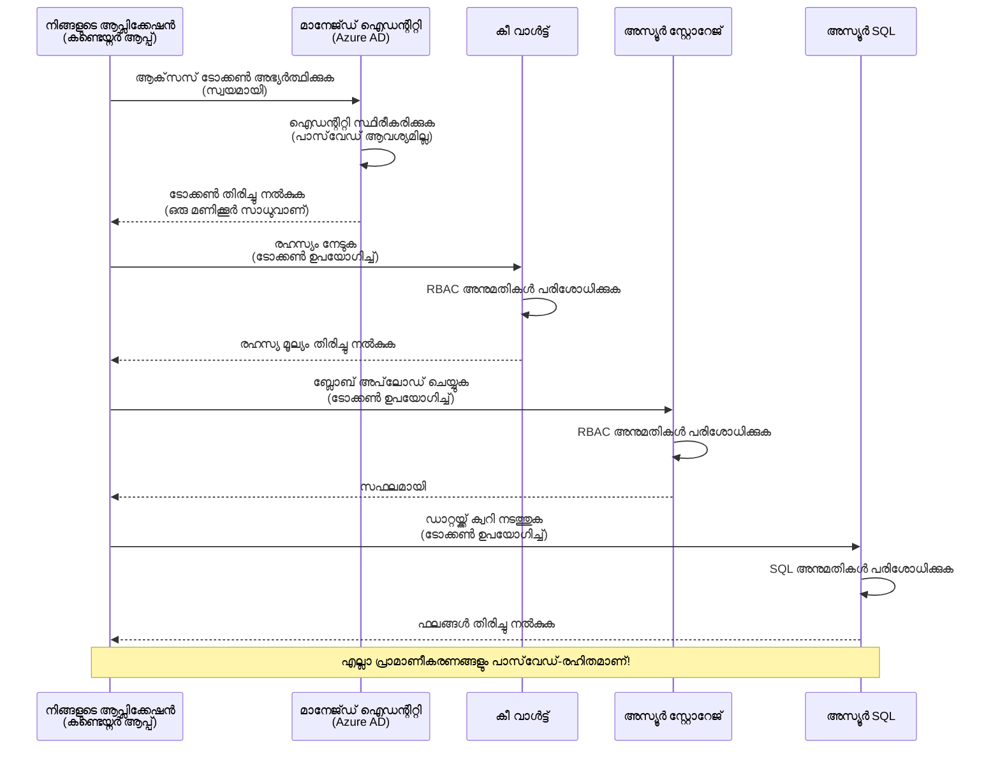
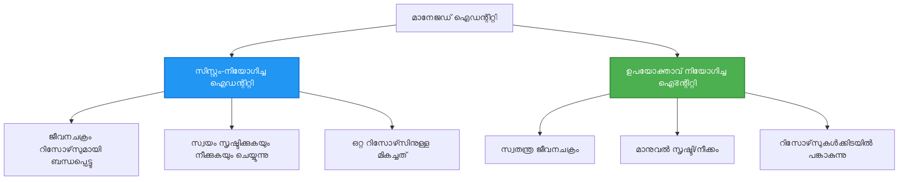

# ഓത്തെന്റിക്കേഷൻ മാതൃകകളും മാനേജ്ഡ് ഐഡന്റിറ്റിയും

⏱️ **Estimated Time**: 45-60 minutes | 💰 **Cost Impact**: Free (no additional charges) | ⭐ **Complexity**: Intermediate

**📚 Learning Path:**
- ← Previous: [Configuration Management](configuration.md) - പരിസ്ഥിതി വ്യത്യാസങ്ങളും രഹസ്യങ്ങളും കൈകാര്യം ചെയ്യൽ
- 🎯 **You Are Here**: ഓത്തെന്റിക്കേഷൻ & സുരക്ഷ (Managed Identity, Key Vault, secure patterns)
- → Next: [First Project](first-project.md) - നിങ്ങളുടെ ആദ്യ AZD അപ്ലിക്കേഷൻ നിർമ്മിക്കുക
- 🏠 [Course Home](../../README.md)

---

## നിങ്ങൾ എന്താണ് പഠിക്കുക

ഈ പാഠം പൂർത്തിയാക്കിയാൽ, നിങ്ങൾ:
- കത്തിലെന്നാൽ Azure ഓത്തെന്റിക്കേഷൻ മാതൃകകൾ (കീസുകൾ, കണക്ഷൻ സ്ട്രിങ്‌സ്, മാനേജ്ഡ് ഐഡന്റിറ്റി) മനസ്സിലാക്കും
- പാസ്വേഡില്ലാതെ ഓത്തെന്റിക്കേഷൻ സാധ്യമാക്കാൻ **Managed Identity** നടപ്പിലാക്കുക
- **Azure Key Vault** ഇന്റഗ്രേഷൻ ഉപയോഗിച്ച് റഹസ്യങ്ങൾ സുരക്ഷിതമാക്കുക
- AZD ഡിപ്ലോയ്മെന്റുകൾക്ക് **റോൾ-ബേസ്‌ഡ് ആക്‌സസ് കൺട്രോൾ (RBAC)** കോൺഫിഗർ ചെയ്യുക
- Container Apps এবং Azure സർവീസുകളിൽ സുരക്ഷാ മികച്ച രീതികൾ പ്രയോഗിക്കുക
- കീ-അധിഷ്ഠിത ഓത്തെന്റിക്കേഷനിൽ നിന്ന് ഐഡന്റിറ്റി-അധിഷ്ഠിതത്തിലേക്കുള്ള മാറ്റം ചെയ്യുക

## മാനേജ്ഡ് ഐഡന്റിറ്റിയുടെ പ്രാധാന്യം

### പ്രശ്നം: പരമ്പരാഗത ഓത്തെന്റിക്കേഷൻ

**മാനേജ്ഡ് ഐഡന്റിറ്റിക്ക് മുമ്പ്:**
```javascript
// ❌ സുരക്ഷാ ഭീഷണി: കോഡിൽ ഹാർഡ്‌കോഡ് ചെയ്ത രഹസ്യങ്ങൾ
const connectionString = "Server=mydb.database.windows.net;User=admin;Password=P@ssw0rd123";
const storageKey = "xK7mN9pQ2wR5tY8uI0oP3aS6dF1gH4jK...";
const cosmosKey = "C2x7B9n4M1p8Q5w3E6r0T2y5U8i1O4p7...";
```

**പ്രശ്നങ്ങൾ:**
- 🔴 **റഹസ്യങ്ങൾ** കോഡിൽ, കോൺഫിഗ് ഫയലുകൾക്ക്‌ളിലും പരിസ്ഥിതി വ്യതക്യങ്ങളിലും വെളിപ്പെടുത്തപ്പെട്ടിരിക്കുന്നു
- 🔴 ** ക്രെഡൻഷ്യൽ റോട്ടേഷൻ** കോഡ് മാറ്റങ്ങളും റീഡിപ്ലോയ്മെന്റും ആവശ്യപ്പെടുന്നു
- 🔴 **ഓഡിറ്റ് ദുർസ്വപ്നം** - ആരാണ് എന്ത്, എപ്പോൾ ആക്‌സസ് ചെയ്തത്?
- 🔴 **വിപുലീകരണം** - രഹസ്യങ്ങൾ പല സിസ്റ്റങ്ങളിലെക്കിടയിൽ പടർന്നുപിടിച്ചതാണ്
- 🔴 **കോമ്പ്ലയൻസ് പരിധികൾ** - സുരക്ഷാ ഓഡിറ്റുകൾ പരാജയപ്പെടാം

### പരിഹാരം: മാനേജ്ഡ് ഐഡന്റിറ്റി

**മാനേജ്ഡ് ഐഡന്റിറ്റിക്ക് ശേഷം:**
```javascript
// ✅ സുരക്ഷിതം: കോഡിൽ രഹസ്യങ്ങൾ ഇല്ല
const credential = new DefaultAzureCredential();
const client = new BlobServiceClient(
  "https://mystorageaccount.blob.core.windows.net",
  credential  // Azure ഓട്ടോമാറ്റിക്കായി പ്രാമാണീകരണം കൈകാര്യം ചെയ്യുന്നു
);
```

**ലാഭങ്ങൾ:**
- ✅ **കോഡിലോ കോൺഫിഗിലോ റഹസ്യങ്ങൾ ഇല്ല**
- ✅ **Automatic rotation** - Azure അതിനു മറുപടി നൽകും
- ✅ **Azure AD ലോഗുകളിൽ പൂർണ്ണ ഓഡിറ്റ് ട്രെയിൽ**
- ✅ **കേന്ദ്രികൃത സുരക്ഷ** - Azure Portal-ൽ മാനേജ് ചെയ്യുക
- ✅ **കോമ്പ്ലയൻസ്-റിയഡി** - സുരക്ഷാ നിബന്ധനകൾ പാലിക്കുന്നു

**ഉപമ:** പരമ്പരാഗത ഓത്തെന്റിക്കേഷൻ വിവിധ തോട്ടുകളിലെ ഫിസിക്കൽ താക്കോൽ বহിച്ചുകൊണ്ട് നടത്തുന്നത് പോലെയാണ്. മാനേജ്ഡ് ഐഡന്റിറ്റി ആധാരം ശാക്തീകരിച്ച വ്യക്തിയെ അടിസ്ഥാനമാക്കി സ്വയമേവ ആക്‌സസ് നൽകുന്ന ഒരു സെക്യൂരിറ്റി ബാഡ്ജ് പോലെയാണ് — നഷ്ടമാവാൻ, പകർപ്പാൻ, റോട്ടേറ്റ് ചെയ്യാൻ താക്കോലുകൾ ഇല്ല.

---

## ആർക്കിടെക്ചർ അവലോകനം

### മാനേജ്ഡ് ഐഡന്റിറ്റിയോടുള്ള ഓത്തെന്റിക്കേഷൻ പ്രവാഹം


### മാനേജ്ഡ് ഐഡന്റിറ്റികളുടെ തരങ്ങൾ


| Feature | System-Assigned | User-Assigned |
|---------|----------------|---------------|
| **Lifecycle** | റിസോഴ്‌സുമായി ബന്ധപ്പെട്ടു നിലനിൽക്കുന്നു | സ്വതന്ത്രം |
| **Creation** | റിസോഴ്‌സിനൊപ്പം ഓട്ടോമാറ്റിക്ക് | മാനുവൽ സൃഷ്ടി |
| **Deletion** | റിസോഴ്‌സുമായി ഒപ്പം ഡിലീറ്റ് ചെയ്യപ്പെടും | റിസോഴ്‌സ് ഡിലീറ്റിന് ശേഷം തുടരുന്നു |
| **Sharing** | ഒരു റിസോഴ്‌സിനുതന്നെയാണ് | നിരവധി റിസോഴ്‌സുകൾക്ക് പങ്കുചെയ്യാവുന്നതാണ് |
| **Use Case** | ലളിതമായ സാഹചര്യങ്ങൾ | ജടിലമായ മൾട്ടി-റിസോഴ്‌സ് senരികളിന് |
| **AZD Default** | ✅ ശിപാർശ ചെയ്യപ്പെടുന്നു | ഐച്ഛികം |

---

## ആവശ്യമായ മുൻക്രമങ്ങൾ

### ആവശ്യമായ ടൂളുകൾ

മുൻപുള്ള പാഠങ്ങളിൽ നിന്നായി നിങ്ങൾക്ക് ഇവ ഇതിനകം ഇൻസ്റ്റാൾ ചെയ്തിരിക്കും:

```bash
# Azure Developer CLI പരിശോധിക്കുക
azd version
# ✅ പ്രതീക്ഷിക്കപ്പെടുന്നത്: azd പതിപ്പ് 1.0.0 അല്ലെങ്കിൽ അതിനേക്കാൾ മുകളിൽ

# Azure CLI പരിശോധിക്കുക
az --version
# ✅ പ്രതീക്ഷിക്കപ്പെടുന്നത്: azure-cli പതിപ്പ് 2.50.0 അല്ലെങ്കിൽ അതിനേക്കാൾ മുകളിൽ
```

### Azure ആവശ്യകതകൾ

- സജീവമായ Azure subscription
- താഴെ ചെയ്യാനുള്ള അവകാശങ്ങൾ:
  - managed identities സൃഷ്ടിക്കുക
  - RBAC റോളുകൾ നിയോഗിക്കുക
  - Key Vault റിസോഴ്‌സുകൾ സൃഷ്ടിക്കുക
  - Container Apps ഡിപ്ലോയ് ചെയ്യുക

### അറിവ് മുൻകൂർ ആവശ്യകതകൾ

നിങ്ങൾക്ക് ഇതിനകം പൂർത്തിയാക്കിയവയായിരിക്കണം:
- [Installation Guide](installation.md) - AZD സജ്ജീകരണം
- [AZD Basics](azd-basics.md) - അടിസ്ഥാന ആശയങ്ങൾ
- [Configuration Management](configuration.md) - പരിസ്ഥിതി വ്യതക്യങ്ങൾ

---

## പാഠം 1: ഓത്തെന്റിക്കേഷൻ മാതൃകകൾ മനസ്സിലാക്കുക

### മാതൃകം 1: Connection Strings (പഴയ രീതിയ - ഒഴിവാക്കുക)

**എങ്ങനെ പ്രവർത്തിക്കുന്നു:**
```bash
# കണക്ഷൻ സ്ട്രിംഗിൽ ക്രെഡൻഷ്യലുകൾ അടങ്ങിയിരിക്കുന്നു
STORAGE_CONNECTION_STRING="DefaultEndpointsProtocol=https;AccountName=myaccount;AccountKey=xK7mN9pQ2wR5..."
COSMOS_CONNECTION_STRING="AccountEndpoint=https://myaccount.documents.azure.com:443/;AccountKey=C2x7..."
SQL_CONNECTION_STRING="Server=myserver.database.windows.net;User=admin;Password=P@ssw0rd..."
```

**പ്രശ്നങ്ങൾ:**
- ❌ പരിസ്ഥിതി വ്യതക്യങ്ങളിൽ രഹസ്യങ്ങൾ ദൃശ്യമാകുന്നു
- ❌ ഡിപ്ലോയ്മെന്റ് സിസ്റ്റങ്ങളിൽ ലോഗ് ചെയ്യപ്പെടാം
- ❌ റോട്ടേറ്റ് ചെയ്യാൻ ബുദ്ധിമുട്ട്
- ❌ ആക്‌സസ് ഓഡിറ്റ് ട്രെയിൽ ഇല്ല

**എപ്പോൾ ഉപയോഗിക്കണം:** പ്രാദേശിക ഡെവലप്മെന്റിന് മാത്രമേ; പ്രൊഡക്ഷനിൽ എപ്പോഴും ഒഴിവാക്കുക.

---

### മാതൃകം 2: Key Vault റഫറൻസ് (ഉത്തമം)

**എങ്ങനെ പ്രവർത്തിക്കുന്നു:**
```bicep
// Store secret in Key Vault
resource keyVault 'Microsoft.KeyVault/vaults@2023-02-01' = {
  name: 'mykv'
  properties: {
    enableRbacAuthorization: true
  }
}

// Reference in Container App
env: [
  {
    name: 'STORAGE_KEY'
    secretRef: 'storage-key'  // References Key Vault
  }
]
```

**ലാഭങ്ങൾ:**
- ✅ രഹസ്യങ്ങൾ Key Vault-ൽ സുരക്ഷിതമായി സംഭരിക്കുന്നു
- ✅ കേന്ദ്രികൃത രഹസ്യ മാനേജ്‌മെന്റ്
- ✅ കോഡ് മാറ്റാതെ റോട്ടേഷൻ

**പരിധികൾ:**
- ⚠️ ഇനിയും കീകൾ/പാസ്വേഡുകൾ ഉപയോഗിച്ചു കൊണ്ടിരിക്കുന്നു
- ⚠️ Key Vault ആക്‌സസ് കൈകാര്യം ചെയ്യേണ്ടത് ആവശ്യമാണ്

**എപ്പോൾ ഉപയോഗിക്കണം:** കണക്ഷൻ സ്ട്രിങ്ങുകളിൽ നിന്നുള്ള മാറ്റത്തിന് ഇടപടിക്കല്‍ ഘട്ടമായി.

---

### മാതൃകം 3: Managed Identity (ശ്രേഷ്ഠ പ്രാക്ടീസ്)

**എങ്ങനെ പ്രവർത്തിക്കുന്നു:**
```bicep
// Enable managed identity
resource containerApp 'Microsoft.App/containerApps@2023-05-01' = {
  name: 'myapp'
  identity: {
    type: 'SystemAssigned'  // Automatically creates identity
  }
}

// Grant permissions
resource roleAssignment 'Microsoft.Authorization/roleAssignments@2022-04-01' = {
  scope: storageAccount
  properties: {
    roleDefinitionId: storageBlobDataContributorRole
    principalId: containerApp.identity.principalId
  }
}
```

**അപ്ലിക്കേഷൻ കോഡ്:**
```javascript
// രഹസ്യങ്ങൾ ആവശ്യമില്ല!
const { DefaultAzureCredential } = require('@azure/identity');
const { BlobServiceClient } = require('@azure/storage-blob');

const credential = new DefaultAzureCredential();
const blobServiceClient = new BlobServiceClient(
  'https://mystorageaccount.blob.core.windows.net',
  credential
);
```

**ലാഭങ്ങൾ:**
- ✅ കോഡ്/കോൺഫിഗിലോ റഹസ്യങ്ങൾ ഇല്ല
- ✅ ക്രെഡൻഷ്യലിന്റെ സ്വയം റോട്ടേഷൻ
- ✅ പൂർണ്ണ ഓഡിറ്റ് ട്രെയിൽ
- ✅ RBAC ആധാരമാക്കി അനുവദനീയതകൾ
- ✅ കോമ്പ്ലയൻസ്-സജ്ജം

**എപ്പോൾ ഉപയോഗിക്കുക:** പ്രൊഡക്ഷൻ ഭൂരിഭാഗം കേസുകളിലായി എപ്പോഴും ഉപയോഗിക്കുക.

---

## പാഠം 2: AZD ഉപയോഗിച്ച് മാനേജ്ഡ് ഐഡന്റിറ്റി നടപ്പിലാക്കൽ

### ഘട്ടം-വൈസ് നടപ്പാക്കൽ

മാനേജ്ഡ് ഐഡന്റിറ്റി ഉപയോഗിച്ച് Azure Storage-നും Key Vault-നും ആക്സസ് ചെയ്യാൻ ഉള്ള സുരക്ഷിത Container App നിർമ്മിക്കാം.

### പ്രോജക്റ്റ് ഘടന

```
secure-app/
├── azure.yaml                 # AZD configuration
├── infra/
│   ├── main.bicep            # Main infrastructure
│   ├── core/
│   │   ├── identity.bicep    # Managed identity setup
│   │   ├── keyvault.bicep    # Key Vault configuration
│   │   └── storage.bicep     # Storage with RBAC
│   └── app/
│       └── container-app.bicep
└── src/
    ├── app.js                # Application code
    ├── package.json
    └── Dockerfile
```

### 1. AZD കോൺഫിഗർ ചെയ്യുക (azure.yaml)

```yaml
name: secure-app
metadata:
  template: secure-app@1.0.0

services:
  api:
    project: ./src
    language: js
    host: containerapp

# Enable managed identity (AZD handles this automatically)
```

### 2. ഇൻഫ്രാസ്ട്രക്ചർ: മാനേജ്ഡ് ഐഡന്റിറ്റി സജീവമാക്കുക

**File: `infra/main.bicep`**

```bicep
targetScope = 'subscription'

param environmentName string
param location string = 'eastus'

var tags = { 'azd-env-name': environmentName }

// Resource group
resource rg 'Microsoft.Resources/resourceGroups@2021-04-01' = {
  name: 'rg-${environmentName}'
  location: location
  tags: tags
}

// Storage Account
module storage './core/storage.bicep' = {
  name: 'storage'
  scope: rg
  params: {
    name: 'st${uniqueString(rg.id)}'
    location: location
    tags: tags
  }
}

// Key Vault
module keyVault './core/keyvault.bicep' = {
  name: 'keyvault'
  scope: rg
  params: {
    name: 'kv-${uniqueString(rg.id)}'
    location: location
    tags: tags
  }
}

// Container App with Managed Identity
module containerApp './app/container-app.bicep' = {
  name: 'container-app'
  scope: rg
  params: {
    name: 'ca-${environmentName}'
    location: location
    tags: tags
    storageAccountName: storage.outputs.name
    keyVaultName: keyVault.outputs.name
  }
}

// Grant Container App access to Storage
module storageRoleAssignment './core/role-assignment.bicep' = {
  name: 'storage-role'
  scope: rg
  params: {
    principalId: containerApp.outputs.identityPrincipalId
    roleDefinitionId: 'ba92f5b4-2d11-453d-a403-e96b0029c9fe'  // Storage Blob Data Contributor
    targetResourceId: storage.outputs.id
  }
}

// Grant Container App access to Key Vault
module kvRoleAssignment './core/role-assignment.bicep' = {
  name: 'kv-role'
  scope: rg
  params: {
    principalId: containerApp.outputs.identityPrincipalId
    roleDefinitionId: '4633458b-17de-408a-b874-0445c86b69e6'  // Key Vault Secrets User
    targetResourceId: keyVault.outputs.id
  }
}

// Outputs
output AZURE_STORAGE_ACCOUNT_NAME string = storage.outputs.name
output AZURE_KEY_VAULT_NAME string = keyVault.outputs.name
output APP_URL string = containerApp.outputs.url
```

### 3. System-Assigned Identity ഉള്ള Container App

**File: `infra/app/container-app.bicep`**

```bicep
param name string
param location string
param tags object = {}
param storageAccountName string
param keyVaultName string

resource containerApp 'Microsoft.App/containerApps@2023-05-01' = {
  name: name
  location: location
  tags: tags
  identity: {
    type: 'SystemAssigned'  // 🔑 Enable managed identity
  }
  properties: {
    configuration: {
      ingress: {
        external: true
        targetPort: 3000
      }
    }
    template: {
      containers: [
        {
          name: 'api'
          image: 'myregistry.azurecr.io/api:latest'
          resources: {
            cpu: json('0.5')
            memory: '1Gi'
          }
          env: [
            {
              name: 'AZURE_STORAGE_ACCOUNT_NAME'
              value: storageAccountName
            }
            {
              name: 'AZURE_KEY_VAULT_NAME'
              value: keyVaultName
            }
            // 🔑 No secrets - managed identity handles authentication!
          ]
        }
      ]
    }
  }
}

// Output the identity for RBAC assignments
output identityPrincipalId string = containerApp.identity.principalId
output id string = containerApp.id
output url string = 'https://${containerApp.properties.configuration.ingress.fqdn}'
```

### 4. RBAC റോൾ നിയോഗം മൊഡ്യൂൾ

**File: `infra/core/role-assignment.bicep`**

```bicep
param principalId string
param roleDefinitionId string  // Azure built-in role ID
param targetResourceId string

resource roleAssignment 'Microsoft.Authorization/roleAssignments@2022-04-01' = {
  name: guid(principalId, roleDefinitionId, targetResourceId)
  scope: resourceId('Microsoft.Resources/resourceGroups', resourceGroup().name)
  properties: {
    roleDefinitionId: subscriptionResourceId('Microsoft.Authorization/roleDefinitions', roleDefinitionId)
    principalId: principalId
    principalType: 'ServicePrincipal'
  }
}

output id string = roleAssignment.id
```

### 5. മാനേജ്ഡ് ഐഡന്റിറ്റിയോടുള്ള അപ്ലിക്കേഷൻ കോഡ്

**File: `src/app.js`**

```javascript
const express = require('express');
const { DefaultAzureCredential } = require('@azure/identity');
const { BlobServiceClient } = require('@azure/storage-blob');
const { SecretClient } = require('@azure/keyvault-secrets');

const app = express();
const PORT = process.env.PORT || 3000;

// 🔑 ക്രെഡൻഷ്യൽ ആരംഭിക്കുക (Managed Identity ഉപയോഗിച്ചുകൊണ്ട് സ്വയം പ്രവർത്തിക്കുന്നു)
const credential = new DefaultAzureCredential();

// Azure സ്റ്റോറേജ് ക്രമീകരണം
const storageAccountName = process.env.AZURE_STORAGE_ACCOUNT_NAME;
const blobServiceClient = new BlobServiceClient(
  `https://${storageAccountName}.blob.core.windows.net`,
  credential  // കീകൾ ആവശ്യമില്ല!
);

// Key Vault ക്രമീകരണം
const keyVaultName = process.env.AZURE_KEY_VAULT_NAME;
const secretClient = new SecretClient(
  `https://${keyVaultName}.vault.azure.net`,
  credential  // കീകൾ ആവശ്യമില്ല!
);

// ആരോഗ്യ പരിശോധന
app.get('/health', (req, res) => {
  res.json({ status: 'healthy', authentication: 'managed-identity' });
});

// ഫയൽ ബ്ലോബ് സ്റ്റോറേജിലേക്ക് അപ്‌ലോഡ് ചെയ്യുക
app.post('/upload', async (req, res) => {
  try {
    const containerClient = blobServiceClient.getContainerClient('uploads');
    await containerClient.createIfNotExists();
    
    const blobName = `file-${Date.now()}.txt`;
    const blockBlobClient = containerClient.getBlockBlobClient(blobName);
    
    await blockBlobClient.upload('Hello from managed identity!', 30);
    
    res.json({
      success: true,
      blobName: blobName,
      message: 'File uploaded using managed identity!'
    });
  } catch (error) {
    console.error('Upload error:', error);
    res.status(500).json({ error: error.message });
  }
});

// Key Vault-ൽ നിന്ന് രഹസ്യം നേടുക
app.get('/secret/:name', async (req, res) => {
  try {
    const secretName = req.params.name;
    const secret = await secretClient.getSecret(secretName);
    
    res.json({
      name: secretName,
      value: secret.value,
      message: 'Secret retrieved using managed identity!'
    });
  } catch (error) {
    console.error('Secret error:', error);
    res.status(500).json({ error: error.message });
  }
});

// ബ്ലോബ് കണ്ടെയ്നറുകൾ ലിസ്റ്റ് ചെയ്യുക (വായനാ ആക്‌സസ് പ്രകടിപ്പിക്കുന്നു)
app.get('/containers', async (req, res) => {
  try {
    const containers = [];
    for await (const container of blobServiceClient.listContainers()) {
      containers.push(container.name);
    }
    
    res.json({
      containers: containers,
      count: containers.length,
      message: 'Containers listed using managed identity!'
    });
  } catch (error) {
    console.error('List error:', error);
    res.status(500).json({ error: error.message });
  }
});

app.listen(PORT, () => {
  console.log(`Secure API listening on port ${PORT}`);
  console.log('Authentication: Managed Identity (passwordless)');
});
```

**File: `src/package.json`**

```json
{
  "name": "secure-app",
  "version": "1.0.0",
  "dependencies": {
    "express": "^4.18.2",
    "@azure/identity": "^4.0.0",
    "@azure/storage-blob": "^12.17.0",
    "@azure/keyvault-secrets": "^4.7.0"
  },
  "scripts": {
    "start": "node app.js"
  }
}
```

### 6. ഡിപ്ലോയ് ചെയ്ത് പരീക്ഷിക്കുക

```bash
# AZD പരിസ്ഥಿತಿ സജ്ജമാക്കുക
azd init

# അടിസ്ഥാനസൗകര്യങ്ങളും ആപ്ലിക്കേഷനും വിന്യസിക്കുക
azd up

# ആപ്ലിക്കേഷന്റെ URL നേടുക
APP_URL=$(azd env get-values | grep APP_URL | cut -d '=' -f2 | tr -d '"')

# ഹെൽത്ത് ചെക്ക് പരീക്ഷിക്കുക
curl $APP_URL/health
```

**✅ പ്രതീക്ഷിക്കാവുന്ന ഔട്ട്പുട്ട്:**
```json
{
  "status": "healthy",
  "authentication": "managed-identity"
}
```

**ബ്ലോബ് അപ്ലോഡ് ടെസ്റ്റ്:**
```bash
curl -X POST $APP_URL/upload
```

**✅ പ്രതീക്ഷിക്കാവുന്ന ഔട്ട്പുട്ട്:**
```json
{
  "success": true,
  "blobName": "file-1700404800000.txt",
  "message": "File uploaded using managed identity!"
}
```

**കണ്ടെയ്നർ ലിസ്റ്റിംഗ് ടെസ്റ്റ്:**
```bash
curl $APP_URL/containers
```

**✅ പ്രതീക്ഷിക്കാവുന്ന ഔട്ട്പുട്ട്:**
```json
{
  "containers": ["uploads"],
  "count": 1,
  "message": "Containers listed using managed identity!"
}
```

---

## സാധാരണ Azure RBAC റോളുകൾ

### മാനേജ്ഡ് ഐഡന്റിറ്റിക്കുള്ള ബിൽറ്റ്-ഇൻ റോൾ IDകൾ

| Service | Role Name | Role ID | Permissions |
|---------|-----------|---------|-------------|
| **Storage** | Storage Blob Data Reader | `2a2b9908-6b94-4a3d-8e5a-a7d8f8cc8a12` | ബ്ലോബുകളും കണ്ടെയ്നറും വായിക്കുക |
| **Storage** | Storage Blob Data Contributor | `ba92f5b4-2d11-453d-a403-e96b0029c9fe` | ബ്ലോബുകൾ വായിക്കുക, എഴുതുക, ഡിലീറ്റ് ചെയ്യുക |
| **Storage** | Storage Queue Data Contributor | `974c5e8b-45b9-4653-ba55-5f855dd0fb88` | ക്യൂ സന്ദേശങ്ങൾ വായിക്കുക, എഴുതുക, ഡിലീറ്റ് ചെയ്യുക |
| **Key Vault** | Key Vault Secrets User | `4633458b-17de-408a-b874-0445c86b69e6` | രഹസ്യങ്ങൾ വായിക്കുക |
| **Key Vault** | Key Vault Secrets Officer | `b86a8fe4-44ce-4948-aee5-eccb2c155cd7` | രഹസ്യങ്ങൾ വായിക്കുക, എഴുതുക, ഡിലീറ്റ് ചെയ്യുക |
| **Cosmos DB** | Cosmos DB Built-in Data Reader | `00000000-0000-0000-0000-000000000001` | Cosmos DB ഡാറ്റ വായിക്കുക |
| **Cosmos DB** | Cosmos DB Built-in Data Contributor | `00000000-0000-0000-0000-000000000002` | Cosmos DB ഡാറ്റ വായിക്കുക, എഴുതുക |
| **SQL Database** | SQL DB Contributor | `9b7fa17d-e63e-47b0-bb0a-15c516ac86ec` | SQL ഡാറ്റാബേസുകൾ മാനേജ് ചെയ്യുക |
| **Service Bus** | Azure Service Bus Data Owner | `090c5cfd-751d-490a-894a-3ce6f1109419` | മസെജുകൾ അയയ്ക്കുക, സ്വീകരിക്കുക, മാനേജ് ചെയ്യുക |

### Role IDകൾ കണ്ടെത്താൻ怎样

```bash
# എല്ലാ നിർമിത റോളുകളും പട്ടികപ്പെടുത്തുക
az role definition list --query "[].{Name:roleName, ID:name}" --output table

# ഒരു പ്രത്യേക റോളിനെ തിരയുക
az role definition list --query "[?contains(roleName, 'Storage Blob')].{Name:roleName, ID:name}" --output table

# റോളിന്റെ വിശദാംശങ്ങൾ നേടുക
az role definition list --name "Storage Blob Data Contributor"
```

---

## പ്രായോഗിക അഭ്യാസങ്ങൾ

### അഭ്യാസം 1: നിലവിലുള്ള ആപ്പിന് മാനേജ്ഡ് ഐഡന്റിറ്റി സജീവമാക്കുക ⭐⭐ (മധ്യം)

**ലക്ഷ്യം**: നിലവിലുള്ള Container App ഡിപ്ലോയ്‌മെന്റിൽ മാനേജ്ഡ് ഐഡന്റിറ്റി ചേർക്കുക

**സഹരീതി**: നിങ്ങൾക്ക് കണക്ഷൻ സ്ട്രിങ്ങുകൾ ഉപയോഗിക്കുന്ന ഒരു Container App ഉണ്ട്. അതിനെ മാനേജ്ഡ് ഐഡന്റിറ്റിയിലേക്ക് മാറിക്കുക.

**ആരംഭബിന്ദു**: ഈ കോൺഫിഗറേഷനുള്ള Container App:

```bicep
// ❌ Current: Using connection string
env: [
  {
    name: 'STORAGE_CONNECTION_STRING'
    secretRef: 'storage-connection'
  }
]
```

**പടികൾ**:

1. **Bicep-ൽ മാനേജ്ഡ് ഐഡന്റിറ്റി സജീവമാക്കുക:**

```bicep
resource containerApp 'Microsoft.App/containerApps@2023-05-01' = {
  name: 'myapp'
  identity: {
    type: 'SystemAssigned'  // Add this
  }
  // ... rest of configuration
}
```

2. **Storage ആക്‌സസ് അനുവദിക്കുക:**

```bicep
// Get storage account reference
resource storageAccount 'Microsoft.Storage/storageAccounts@2023-01-01' existing = {
  name: storageAccountName
}

// Assign role
resource roleAssignment 'Microsoft.Authorization/roleAssignments@2022-04-01' = {
  name: guid(containerApp.id, 'ba92f5b4-2d11-453d-a403-e96b0029c9fe', storageAccount.id)
  scope: storageAccount
  properties: {
    roleDefinitionId: subscriptionResourceId('Microsoft.Authorization/roleDefinitions', 'ba92f5b4-2d11-453d-a403-e96b0029c9fe')
    principalId: containerApp.identity.principalId
    principalType: 'ServicePrincipal'
  }
}
```

3. **അപ്ലിക്കേഷൻ കോഡ് അപ്ഡേറ്റ് ചെയ്യുക:**

**മുൻപ് (connection string):**
```javascript
const { BlobServiceClient } = require('@azure/storage-blob');

const blobServiceClient = BlobServiceClient.fromConnectionString(
  process.env.STORAGE_CONNECTION_STRING
);
```

**ശേഷം (managed identity):**
```javascript
const { DefaultAzureCredential } = require('@azure/identity');
const { BlobServiceClient } = require('@azure/storage-blob');

const credential = new DefaultAzureCredential();
const blobServiceClient = new BlobServiceClient(
  `https://${process.env.STORAGE_ACCOUNT_NAME}.blob.core.windows.net`,
  credential
);
```

4. **പരിസ്ഥിതി വ്യതക്യങ്ങൾ അപ്ഡേറ്റ് ചെയ്യുക:**

```bicep
env: [
  {
    name: 'STORAGE_ACCOUNT_NAME'
    value: storageAccountName  // Just the name, no secrets!
  }
  // Remove STORAGE_CONNECTION_STRING
]
```

5. **ഡിപ്ലോയ് ചെയ്ത് ടെസ്റ്റ് ചെയ്യുക:**

```bash
# വീണ്ടും വിന്യസിക്കുക
azd up

# അത് ഇപ്പോഴും പ്രവർത്തിക്കുന്നുണ്ടോ എന്ന് പരിശോധിക്കുക
curl https://myapp.azurecontainerapps.io/upload
```

**✅ വിജയം നിർണയിക്കുന്ന മാനദണ്ഡങ്ങൾ:**
- ✅ ആപ്പ്ലിക്കേഷൻ തെറ്റുകളില്ലാതെ ഡിപ്ലോയാകണം
- ✅ Storage പ്രവർത്തനങ്ങൾ പ്രവർത്തിക്കണം (അപ്‌ലോഡ്, ലിസ്റ്റ്, ഡൗൺലോഡ്)
- ✅ പരിസ്ഥിതി വ്യതക്യങ്ങളിൽ കണക്ഷൻ സ്ട്രിങുകൾ ഇല്ലാത്തത് ഉറപ്പാക്കുക
- ✅ Azure Portal-ൽ "Identity" ബ്ലേഡിൽ ഐഡന്റിറ്റി കാണപ്പെടണം

**പരിശോധന:**

```bash
# മാനേജഡ് ഐഡന്റിറ്റി സജീവമാണെന്ന് പരിശോധിക്കുക
az containerapp show \
  --name myapp \
  --resource-group rg-myapp \
  --query "identity.type"
# ✅ പ്രതീക്ഷിക്കുന്നത്: "SystemAssigned"

# റോൾ നിയോഗം പരിശോധിക്കുക
az role assignment list \
  --assignee $(az containerapp show --name myapp --resource-group rg-myapp --query "identity.principalId" -o tsv) \
  --scope /subscriptions/{sub-id}/resourceGroups/rg-myapp/providers/Microsoft.Storage/storageAccounts/mystorageaccount
# ✅ പ്രതീക്ഷിക്കുന്നത്: "Storage Blob Data Contributor" റോളിനെ കാണിക്കണം
```

**സമയം**: 20-30 മിനിറ്റ്

---

### അഭ്യാസം 2: മൾട്ടി-സർവീസ് ആക്സസ് ഉപയോക്താവ്-നിയമിത ഐഡന്റിറ്റിയുമായി ⭐⭐⭐ (അഡ്വാൻസ്ഡ്)

**ലക്ഷ്യം**: ഒരേ ഉപയോക്താവ്-നിയമിത ഐഡന്റിറ്റി മൂന്ന് Container Apps-മ huko പങ്ക് വെയ്ക്കുക

**സഹരീതി**: 3 മൈക്രോസർവീസുകൾക്കും ഒരേ Storage അക്കൗണ്ടും Key Vault-ഉം ആക്സസ് ചെയ്യേണ്ടതുണ്ട്.

**പടികൾ**:

1. **ഉപയോക്താവ്-നിയമിത ഐഡന്റിറ്റി സൃഷ്ടിക്കുക:**

**File: `infra/core/identity.bicep`**

```bicep
param name string
param location string
param tags object = {}

resource userAssignedIdentity 'Microsoft.ManagedIdentity/userAssignedIdentities@2023-01-31' = {
  name: name
  location: location
  tags: tags
}

output id string = userAssignedIdentity.id
output principalId string = userAssignedIdentity.properties.principalId
output clientId string = userAssignedIdentity.properties.clientId
```

2. **ഉപയോക്താവ്-നിയമിത ഐഡന്റിറ്റിക്ക് റോളുകൾ നിയോഗിക്കുക:**

```bicep
// In main.bicep
module userIdentity './core/identity.bicep' = {
  name: 'user-identity'
  scope: rg
  params: {
    name: 'id-${environmentName}'
    location: location
    tags: tags
  }
}

// Grant Storage access
resource storageRoleAssignment 'Microsoft.Authorization/roleAssignments@2022-04-01' = {
  name: guid(userIdentity.outputs.principalId, 'storage-contributor')
  scope: storageAccount
  properties: {
    roleDefinitionId: subscriptionResourceId('Microsoft.Authorization/roleDefinitions', 'ba92f5b4-2d11-453d-a403-e96b0029c9fe')
    principalId: userIdentity.outputs.principalId
    principalType: 'ServicePrincipal'
  }
}

// Grant Key Vault access
resource kvRoleAssignment 'Microsoft.Authorization/roleAssignments@2022-04-01' = {
  name: guid(userIdentity.outputs.principalId, 'kv-secrets-user')
  scope: keyVault
  properties: {
    roleDefinitionId: subscriptionResourceId('Microsoft.Authorization/roleDefinitions', '4633458b-17de-408a-b874-0445c86b69e6')
    principalId: userIdentity.outputs.principalId
    principalType: 'ServicePrincipal'
  }
}
```

3. **ഒരുाधिक Container Apps-ക് ഐഡന്റിറ്റി നിയോഗിക്കുക:**

```bicep
resource apiGateway 'Microsoft.App/containerApps@2023-05-01' = {
  name: 'api-gateway'
  identity: {
    type: 'UserAssigned'
    userAssignedIdentities: {
      '${userIdentity.outputs.id}': {}
    }
  }
  // ... rest of config
}

resource productService 'Microsoft.App/containerApps@2023-05-01' = {
  name: 'product-service'
  identity: {
    type: 'UserAssigned'
    userAssignedIdentities: {
      '${userIdentity.outputs.id}': {}
    }
  }
  // ... rest of config
}

resource orderService 'Microsoft.App/containerApps@2023-05-01' = {
  name: 'order-service'
  identity: {
    type: 'UserAssigned'
    userAssignedIdentities: {
      '${userIdentity.outputs.id}': {}
    }
  }
  // ... rest of config
}
```

4. **അപ്ലിക്കേഷൻ കോഡ് (എല്ലാ സർവീസുകളും ഒരേ മാതൃക ഉപയോഗിക്കുന്നു):**

```javascript
const { DefaultAzureCredential, ManagedIdentityCredential } = require('@azure/identity');

// ഉപയോക്താവിന് നിയോഗിച്ച ഐഡന്റിറ്റിക്കായി ക്ലയന്റ് ഐഡി നിർദ്ദേശിക്കുക
const credential = new ManagedIdentityCredential(
  process.env.AZURE_CLIENT_ID  // ഉപയോക്താവിന് നിയോഗിച്ച ഐഡന്റിറ്റിയുടെ ക്ലയന്റ് ഐഡി
);

// അതവാ DefaultAzureCredential ഉപയോഗിക്കുക (സ്വയം കണ്ടെത്തുന്നു)
const credential = new DefaultAzureCredential();

const blobServiceClient = new BlobServiceClient(
  `https://${process.env.STORAGE_ACCOUNT_NAME}.blob.core.windows.net`,
  credential
);
```

5. **ഡിപ്ലോയ് ചെയ്തു പരിശോധിക്കുക:**

```bash
azd up

# എല്ലാ സേവനങ്ങളും സ്റ്റോറേജ് ആക്സസ് ചെയ്യാൻ കഴിയുന്നുണ്ടോ എന്ന് പരിശോധിക്കുക
curl https://api-gateway.azurecontainerapps.io/upload
curl https://product-service.azurecontainerapps.io/upload
curl https://order-service.azurecontainerapps.io/upload
```

**✅ വിജയ മാനദണ്ഡങ്ങൾ:**
- ✅ മൂന്ന് സർവീസുകൾക്കായി ഒറ്റ ഐഡന്റിറ്റി പങ്കുവെക്കപ്പെടുന്നു
- ✅ എല്ലാ സർവീസുകളും Storage-നും Key Vault-നും ആക്സസ് ചെയ്യാൻ കഴിയും
- ✅ ഒരുവിഭാഗം ഡിലീറ്റ് ചെയ്താലും ഐഡന്റിറ്റി തുടരുന്നു
- ✅ പാർശ്വമായി അനുവദനീയതകൾ കേന്ദ്രികൃതമായി മാനേജ് ചെയ്യാവുന്നതാണ്

**ഉപയോക്താവ്-നിയമിത ഐഡന്റിറ്റിയുടെ ലാഭങ്ങൾ:**
- ഐഡന്റിറ്റി ഏകദേശം മാനേജ് ചെയ്യാം
- സർവീസുകൾക്ക് സാധൂകരിച്ചേതാകുന്ന സ്ഥിരതയുള്ള അനുമതികൾ
- സർവീസ് ഡിലീഷൻ തോൽക്കാതെ ഐഡന്റിറ്റി നിലനിൽക്കുന്നു
- ഞാൻജടിൽ ആർക്കിടെക്ചറുകൾക്കുള്ള മികച്ച രീതിയാണ്

**സമയം**: 30-40 മിനിറ്റ്

---

### അഭ്യാസം 3: Key Vault രഹസ്യ റോട്ടേഷൻ നടപ്പിലാക്കുക ⭐⭐⭐ (അഡ്വാൻസ്ഡ്)

**ലക്ഷ്യം**: മൂന്നാം-പക്ഷ API കീകൾ Key Vault-ൽ സംഭരിച്ച് മാനേജ്ഡ് ഐഡന്റിറ്റി ഉപയോഗിച്ച് ആക്‌സസ് ചെയ്യുക

**സഹരീതി**: നിങ്ങളുടെ ആപ് പുറംവശം ഒരു എക്സ്റ്റേണൽ API (OpenAI, Stripe, SendGrid) വിളിക്കാൻ API കീകൾ ആവശ്യമാണ്.

**പടികൾ**:

1. **RBAC ഉപയോഗിച്ചുള്ള Key Vault സൃഷ്ടിക്കുക:**

**File: `infra/core/keyvault.bicep`**

```bicep
param name string
param location string
param tags object = {}

resource keyVault 'Microsoft.KeyVault/vaults@2023-02-01' = {
  name: name
  location: location
  tags: tags
  properties: {
    enableRbacAuthorization: true  // Use RBAC instead of access policies
    sku: {
      family: 'A'
      name: 'standard'
    }
    tenantId: subscription().tenantId
    enableSoftDelete: true
    softDeleteRetentionInDays: 90
  }
}

// Allow Container App to read secrets
output id string = keyVault.id
output name string = keyVault.name
output uri string = keyVault.properties.vaultUri
```

2. **Key Vault-ിൽ രഹസ്യങ്ങൾ സംഭരിക്കുക:**

```bash
# Key Vault നാമം നേടുക
KV_NAME=$(azd env get-values | grep AZURE_KEY_VAULT_NAME | cut -d '=' -f2 | tr -d '"')

# തൃतीय കക്ഷിയുടെ API കീകൾ സൂക്ഷിക്കുക
az keyvault secret set \
  --vault-name $KV_NAME \
  --name "OpenAI-ApiKey" \
  --value "sk-proj-xxxxxxxxxxxxx"

az keyvault secret set \
  --vault-name $KV_NAME \
  --name "Stripe-ApiKey" \
  --value "sk_live_xxxxxxxxxxxxx"

az keyvault secret set \
  --vault-name $KV_NAME \
  --name "SendGrid-ApiKey" \
  --value "SG.xxxxxxxxxxxxx"
```

3. **രഹസ്യങ്ങൾ ලබාക്കാനുള്ള അപ്ലിക്കേഷൻ കോഡ്:**

**File: `src/config.js`**

```javascript
const { DefaultAzureCredential } = require('@azure/identity');
const { SecretClient } = require('@azure/keyvault-secrets');

class Config {
  constructor() {
    this.credential = new DefaultAzureCredential();
    this.secretClient = new SecretClient(
      `https://${process.env.AZURE_KEY_VAULT_NAME}.vault.azure.net`,
      this.credential
    );
    this.cache = {};
  }

  async getSecret(secretName) {
    // ആദ്യം കാഷെ പരിശോധിക്കുക
    if (this.cache[secretName]) {
      return this.cache[secretName];
    }

    try {
      const secret = await this.secretClient.getSecret(secretName);
      this.cache[secretName] = secret.value;
      console.log(`✅ Retrieved secret: ${secretName}`);
      return secret.value;
    } catch (error) {
      console.error(`❌ Failed to get secret ${secretName}:`, error.message);
      throw error;
    }
  }

  async getOpenAIKey() {
    return this.getSecret('OpenAI-ApiKey');
  }

  async getStripeKey() {
    return this.getSecret('Stripe-ApiKey');
  }

  async getSendGridKey() {
    return this.getSecret('SendGrid-ApiKey');
  }
}

module.exports = new Config();
```

4. **അപ്ലിക്കേഷനിൽ രഹസ്യങ്ങൾ ഉപയോഗിക്കുക:**

**File: `src/app.js`**

```javascript
const express = require('express');
const config = require('./config');
const { OpenAI } = require('openai');

const app = express();

// Key Vault-ൽ നിന്നുള്ള കീ ഉപയോഗിച്ച് OpenAI പ്രാരംഭീകരിക്കുക
let openaiClient;

async function initializeServices() {
  const openaiKey = await config.getOpenAIKey();
  openaiClient = new OpenAI({ apiKey: openaiKey });
  console.log('✅ Services initialized with secrets from Key Vault');
}

// ആരംഭത്തിൽ വിളിക്കുക
initializeServices().catch(console.error);

app.post('/chat', async (req, res) => {
  try {
    const completion = await openaiClient.chat.completions.create({
      model: 'gpt-4',
      messages: [{ role: 'user', content: 'Hello!' }]
    });
    
    res.json({
      response: completion.choices[0].message.content,
      authentication: 'Key from Key Vault via Managed Identity'
    });
  } catch (error) {
    res.status(500).json({ error: error.message });
  }
});

app.listen(3000, () => {
  console.log('Secure API with Key Vault integration running');
});
```

5. **ഡിപ്ലോയ് ചെയ്ത് ടെസ്റ്റ് ചെയ്യുക:**

```bash
azd up

# API കീകൾ ശരിയായി പ്രവർത്തിക്കുന്നുണ്ടോ എന്ന് പരിശോധിക്കുക
curl -X POST https://myapp.azurecontainerapps.io/chat \
  -H "Content-Type: application/json" \
  -d '{"message":"Hello AI"}'
```

**✅ വിജയം നിർണയിക്കുന്ന മാനദണ്ഡങ്ങൾ:**
- ✅ കോഡിലോ പരിസ്ഥിതി വ്യതക്യങ്ങളിലോ API കീകൾ ഇല്ല
- ✅ ആപ്പ് Key Vault-ൽ നിന്ന് കീകൾ തിരികെയെടുക്കുന്നു
- ✅ മൂന്നാം-പക്ഷ APIകൾ ശരിയായി പ്രവർത്തിക്കുന്നു
- ✅ കോഡ് മാറ്റാതെ കീകൾ റോട്ടേറ്റ് ചെയ്യാൻ കഴിയും

**ഒരു രഹസ്യം റോട്ടേറ്റ് ചെയ്യുക:**

```bash
# Key Vault-ൽ രഹസ്യം അപ്ഡേറ്റ് ചെയ്യുക
az keyvault secret set \
  --vault-name $KV_NAME \
  --name "OpenAI-ApiKey" \
  --value "sk-proj-NEW_KEY_HERE"

# പുതിയ കീ സ്വീകരിക്കാൻ ആപ്പ് റീസ്റ്റാർട്ട് ചെയ്യുക
az containerapp revision restart \
  --name myapp \
  --resource-group rg-myapp
```

**സമയം**: 25-35 മിനിറ്റ്

---

## അറിവ് പരിശോധന

### 1. ഓത്തെന്റിക്കേഷൻ മാതൃകകൾ ✓

നിങ്ങളുടെ മനസ്സിലാക്കൽ പരിശോധിക്കുക:

- [ ] **Q1**: മൂന്ന് പ്രധാന ഓത്തെന്റിക്കേഷൻ മാതൃകകളെന്തൊക്കെയാണ്? 
  - **A**: Connection strings (പഴയ), Key Vault റഫറൻസുകൾ (മാറ്റത്തിനായി), Managed Identity (ശ്രേഷ്ഠം)

- [ ] **Q2**: Managed identity എന്തുകൊണ്ട് connection strings-ടേക്കാൾ മികച്ചതാണ്?
  - **A**: കോഡിൽ രഹസ്യങ്ങളില്ല, സ്വയം റോട്ടേഷൻ, പൂർണ്ണ ഓഡിറ്റ് ട്രെയിൽ, RBAC അനുമതികൾ

- [ ] **Q3**: System-assigned ന്റെ പകരം user-assigned identity എപ്പോൾ ഉപയോഗിക്കണം?
  - **A**: ഒന്നിലധികം റിസോഴ്‌സുകൾക്കിടയിൽ ഐഡന്റിറ്റി പങ്കുവെയ്ക്കുമ്പോഴും അതിന്റെ ലൈഫ്സൈക്കിൾ റിസോഴ്‌സിന്റെ ലൈഫ്സൈക്കിളിൽ നിന്ന് സ്വതന്ത്രമായിരിക്കേണ്ടപ്പോഴും

**Hands-On Verification:**
```bash
# നിങ്ങളുടെ ആപ്പ് ഏത് തരം ഐഡന്റിറ്റി ഉപയോഗിക്കുന്നുവെന്ന് പരിശോധിക്കുക
az containerapp show \
  --name myapp \
  --resource-group rg-myapp \
  --query "identity.type"

# ആ ഐഡന്റിറ്റിക്കുള്ള എല്ലാ റോൾ നിയോഗങ്ങളും പട്ടികപ്പെടുത്തുക
az role assignment list \
  --assignee $(az containerapp show --name myapp --resource-group rg-myapp --query "identity.principalId" -o tsv)
```

---

### 2. RBAC आणि അനുമതികൾ ✓

നിങ്ങളുടെ മനസ്സിലാക്കൽ പരിശോധിക്കുക:

- [ ] **Q1**: "Storage Blob Data Contributor" ന്റെ റോൾ ID എത്?
  - **A**: `ba92f5b4-2d11-453d-a403-e96b0029c9fe`

- [ ] **Q2**: "Key Vault Secrets User" ഏത് അനുമതികൾ നൽകുന്നു?
  - **A**: രഹസ്യങ്ങൾ വായിക്കാൻ മാത്രമുള്ള അനുമതി (സൃഷ്ടിക്കാൻ, അപ്‌ഡേറ്റ് ചെയ്യാൻ, ഡിലീറ്റ് ചെയ്യാൻ കഴിയില്ല)

- [ ] **Q3**: Container App-ന് Azure SQL ആക്‌സസ് നൽകാൻ നിങ്ങൾ എന്താണ് ചെയ്യേണ്ടത്?
  - **A**: "SQL DB Contributor" റോൾ നിയോഗിക്കുക അല്ലെങ്കിൽ SQL-ന് Azure AD ഓത്തെന്റിക്കേഷൻ കോൺഫിഗർ ചെയ്യുക

**Hands-On Verification:**
```bash
# നിശ്ചിത റോൾ കണ്ടെത്തുക
az role definition list --name "Storage Blob Data Contributor"

# നിങ്ങളുടെ ഐഡന്റിറ്റിക്ക് ഏത് റോളുകൾ നിയോഗിച്ചിട്ടുണ്ടെന്ന് പരിശോധിക്കുക
PRINCIPAL_ID=$(az containerapp show --name myapp --resource-group rg-myapp --query "identity.principalId" -o tsv)
az role assignment list --assignee $PRINCIPAL_ID --output table
```

---

### 3. Key Vault ഇന്റഗ്രേഷൻ ✓
- [ ] **Q1**: കീ വോൾട്ടിൽ ആക്‌സസ് നയങ്ങളുടെയ്ക്ക് പകരം RBAC എങ്ങനെ സജ്ജീകരിക്കാം?
  - **A**: Bicep-ൽ `enableRbacAuthorization: true` സജ്ജീകരിക്കുക

- [ ] **Q2**: മാനേജ് ചെയ്ത ഐഡന്റിറ്റിയുടെ അതന്റിക്കേഷൻ ഏതു Azure SDK ലൈബ്രറി കൈകാര്യം ചെയ്യുന്നു?
  - **A**: `@azure/identity` `DefaultAzureCredential` ക്ലാസ് ഉപയോഗിച്ച്

- [ ] **Q3**: Key Vault രഹസ്യങ്ങൾ ക്യാഷിൽ എത്ര നാൾ തുടരുന്നു?
  - **A**: അപ്ലിക്കേഷൻ ആശ്രിതം; നിങ്ങളുടെ സ്വന്തം ക്യാഷിംഗ് നയത്തിൽ നടപ്പിലാക്കി

**Hands-On Verification:**
```bash
# കീ വാൾട്ട് ആക്‌സസ് പരിശോധിക്കുക
az keyvault secret show \
  --vault-name $KV_NAME \
  --name "OpenAI-ApiKey" \
  --query "value"

# RBAC സജീവമാണോ എന്ന് പരിശോധിക്കുക
az keyvault show \
  --name $KV_NAME \
  --query "properties.enableRbacAuthorization"
# ✅ പ്രതീക്ഷിക്കുന്നത്: true
```

---

## Security Best Practices

### ✅ ചെയ്യുക:

1. **പ്രൊഡക്ഷനിൽ 항상 മാനേജ് ചെയ്ത ഐഡന്റിറ്റി ഉപയോഗിക്കുക**
   ```bicep
   identity: {
     type: 'SystemAssigned'
   }
   ```

2. **കുറഞ്ഞ അനുവാദമുള്ള RBAC റോളുകൾ ഉപയോഗിക്കുക**
   - കഴിയുമ്പോൾ "Reader" റോളുകൾ ഉപയോഗിക്കുക
   - ആവശ്യമായില്ലെങ്കിൽ "Owner" അല്ലെങ്കിൽ "Contributor" ഒഴിവാക്കുക

3. **മൂന്നാം പക്ഷം കീകൾ Key Vault-ൽ സൂക്ഷിക്കുക**
   ```javascript
   const apiKey = await secretClient.getSecret('ThirdPartyApiKey');
   ```

4. **ഓഡിറ്റ് ലോഗിംഗ് സജീവമാക്കുക**
   ```bicep
   diagnosticSettings: {
     logs: [{ category: 'AuditEvent', enabled: true }]
   }
   ```

5. **ഡെവ്/സ്റ്റേജിംഗ്/പ്രോഡ് വേണ്ടി വ്യത്യസ്ത ഐഡന്റിറ്റികൾ ഉപയോഗിക്കുക**
   ```bash
   azd env new dev
   azd env new staging
   azd env new prod
   ```

6. **റഹസ്യങ്ങൾ নিয়മമായും റൊറേറ്റ് ചെയ്യുക**
   - Key Vault രഹസ്യങ്ങൾക്ക് കാലഹരണ തീയതികൾ അനുവദിക്കുക
   - Azure Functions ഉപയോഗിച്ച് റൊറേഷൻ 自动化 ചെയ്യുക

### ❌ ചെയ്യരുത്:

1. **രഹസ്യങ്ങൾ അങ്ങേടെ ഹാർഡ്‌കോഡ് ചെയ്യരുത്**
   ```javascript
   // ❌ മോശം
   const apiKey = "sk-proj-xxxxxxxxxxxxx";
   ```

2. **പ്രൊഡക്ഷനിൽ കണക്ഷൻ സ്ട്രിംഗ്‌സ് ഉപയോഗിക്കരുത്**
   ```javascript
   // ❌ മോശം
   BlobServiceClient.fromConnectionString(process.env.STORAGE_CONNECTION_STRING)
   ```

3. **അതിരുള്ള അധികാരങ്ങൾ നൽകരുത്**
   ```bicep
   // ❌ BAD - too much access
   roleDefinitionId: 'Owner'
   
   // ✅ GOOD - least privilege
   roleDefinitionId: 'Storage Blob Data Reader'
   ```

4. **രഹസ്യങ്ങൾ ലോഗ് ചെയ്യരുത്**
   ```javascript
   // ❌ മോശം
   console.log('API Key:', apiKey);
   
   // ✅ നന്നാണ്
   console.log('API Key retrieved successfully');
   ```

5. **പ്രൊഡക്ഷൻ ഐഡന്റിറ്റികൾ പരിസ്ഥിതികളിൽ പങ്കിടരുത്**
   ```bicep
   // ❌ BAD - same identity for dev and prod
   // ✅ GOOD - separate identities per environment
   ```

---

## പ്രശ്‌നപരിഹാര മാർഗ്ഗദർശി

### പ്രശ്നം: "Unauthorized" when accessing Azure Storage

**ലക്ഷണങ്ങൾ:**
```
Error: Unauthorized (403)
AuthorizationPermissionMismatch: This request is not authorized to perform this operation
```

**രോഗനിർണയം:**

```bash
# മെനേജ്ഡ് ഐഡന്റിറ്റി സജീവമാണോ എന്ന് പരിശോധിക്കുക
az containerapp show \
  --name myapp \
  --resource-group rg-myapp \
  --query "identity.type"
# ✅ പ്രതീക്ഷിക്കുന്നത്: "SystemAssigned" അല്ലെങ്കിൽ "UserAssigned"

# റോൾ അസൈൻമെന്റുകൾ പരിശോധിക്കുക
PRINCIPAL_ID=$(az containerapp show --name myapp --resource-group rg-myapp --query "identity.principalId" -o tsv)
az role assignment list --assignee $PRINCIPAL_ID

# പ്രതീക്ഷിക്കുന്നത്: "Storage Blob Data Contributor" അല്ലെങ്കിൽ സമാനമായ ഒരു റോൾ കാണണം
```

**പരിഹാരങ്ങൾ:**

1. **ശരിയైన RBAC റോൾ നൽകുക:**
```bash
STORAGE_ID=$(az storage account show --name mystorageaccount --resource-group rg-myapp --query "id" -o tsv)
az role assignment create \
  --assignee $PRINCIPAL_ID \
  --role "Storage Blob Data Contributor" \
  --scope $STORAGE_ID
```

2. **പ്രസരണത്തിനായി കാത്തിരിക്കുക (5-10 മിനിട്ട് എടുക്കാം):**
```bash
# റോൾ നിയോഗത്തിന്റെ നില പരിശോധിക്കുക
az role assignment list --assignee $PRINCIPAL_ID --scope $STORAGE_ID
```

3. **അപ്ലിക്കേഷൻ കോഡ് ശരിയായ ക്രെഡൻഷ്യൽ ഉപയോഗിക്കുന്നതായി സ്ഥിരീകരിക്കുക:**
```javascript
// നിങ്ങൾ DefaultAzureCredential ഉപയോഗിക്കുകയാണെന്ന് ഉറപ്പാക്കുക
const credential = new DefaultAzureCredential();
```

---

### പ്രശ്നം: Key Vault access denied

**ലക്ഷണങ്ങൾ:**
```
Error: Forbidden (403)
The user, group or application does not have secrets get permission
```

**രോഗനിർണയം:**

```bash
# Key Vault RBAC സജ്ജമാണോ എന്ന് പരിശോധിക്കുക
az keyvault show \
  --name $KV_NAME \
  --query "properties.enableRbacAuthorization"
# ✅ പ്രതീക്ഷിക്കുന്നത്: true

# റോൾ നിയമനങ്ങൾ പരിശോധിക്കുക
az role assignment list \
  --assignee $PRINCIPAL_ID \
  --scope /subscriptions/{sub-id}/resourceGroups/rg-myapp/providers/Microsoft.KeyVault/vaults/$KV_NAME
```

**പരിഹാരങ്ങൾ:**

1. **Key Vault-ൽ RBAC സജ്ജീകരിക്കുക:**
```bash
az keyvault update \
  --name $KV_NAME \
  --enable-rbac-authorization true
```

2. **Key Vault Secrets User റോൾ നൽകുക:**
```bash
KV_ID=$(az keyvault show --name $KV_NAME --query "id" -o tsv)
az role assignment create \
  --assignee $PRINCIPAL_ID \
  --role "Key Vault Secrets User" \
  --scope $KV_ID
```

---

### പ്രശ്നം: DefaultAzureCredential ലൊക്കലിൽ പരാജയപ്പെടുന്നു

**ലക്ഷണങ്ങൾ:**
```
Error: DefaultAzureCredential failed to retrieve a token
CredentialUnavailableError: No credential available
```

**രോഗനിർണയം:**

```bash
# നിങ്ങൾ ലോഗിൻ ചെയ്തിട്ടുണ്ടോ എന്ന് പരിശോധിക്കുക
az account show

# Azure CLI-യുടെ പ്രാമാണീകരണം പരിശോധിക്കുക
az ad signed-in-user show
```

**പരിഹാരങ്ങൾ:**

1. **Azure CLI-യിൽ ലോഗിൻ ചെയ്യുക:**
```bash
az login
```

2. **Azure സബ്സ്ക്രിപ്ഷൻ സജ്ജീകരിക്കുക:**
```bash
az account set --subscription "Your Subscription Name"
```

3. **ലോക്കൽ ഡെവലപ്പ്മെന്റിന് environment variables ഉപയോഗിക്കുക:**
```bash
export AZURE_TENANT_ID="your-tenant-id"
export AZURE_CLIENT_ID="your-client-id"
export AZURE_CLIENT_SECRET="your-client-secret"
```

4. **അഥവാ ലോക്കലിൽ വ്യത്യസ്ത ക്രെഡൻഷ്യൽ ഉപയോഗിക്കുക:**
```javascript
const { DefaultAzureCredential, AzureCliCredential } = require('@azure/identity');

// ലോക്കൽ ഡെവലപ്പ്മെന്റിനായി AzureCliCredential ഉപയോഗിക്കുക
const credential = process.env.NODE_ENV === 'production' 
  ? new DefaultAzureCredential()
  : new AzureCliCredential();
```

---

### പ്രശ്നം: റോൾ അസൈൻമെന്റ് പ്രചരണത്തിന് demasiado സമയം എടുക്കുന്നു

**ലക്ഷണങ്ങൾ:**
- റോൾ വിജയകരമായി അലോക്കേറ്റ് ചെയ്തു
- എങ്കിലും 403 പിശകുകൾ വരുന്നു
- ഇടയ്ക്ക് പ്രവേശനം (ഒപ്പോൾ പ്രവർത്തിക്കുന്നു, ഒപ്പോൾ അല്ല)

**വിവരണം:**
Azure RBAC മാറ്റങ്ങൾ ആഗോളമായി പ്രചരിക്കാൻ 5-10 മിനിറ്റ് വരെ എടുക്കാവുന്നതാണ്.

**പരിഹാരം:**

```bash
# കാത്തിരിക്കുക, വീണ്ടും ശ്രമിക്കുക
echo "Waiting for RBAC propagation..."
sleep 300  # 5 മിനിറ്റ് കാത്തിരിക്കുക

# ആക്‌സസ് പരിശോധിക്കുക
curl https://myapp.azurecontainerapps.io/upload

# ഇതുവരെയും പരാജയപ്പെട്ടാൽ ആപ്പ് പുനരാരംഭിക്കുക
az containerapp revision restart \
  --name myapp \
  --resource-group rg-myapp
```

---

## ചെലവ് പരിഗണനകൾ

### മാനേജ് ചെയ്ത ഐഡന്റിറ്റി ചെലവുകൾ

| Resource | Cost |
|----------|------|
| **Managed Identity** | 🆓 **FREE** - No charge |
| **RBAC Role Assignments** | 🆓 **FREE** - No charge |
| **Azure AD Token Requests** | 🆓 **FREE** - Included |
| **Key Vault Operations** | $0.03 per 10,000 operations |
| **Key Vault Storage** | $0.024 per secret per month |

**മാനേജ് ചെയ്ത ഐഡന്റിറ്റി പണവും ഡോളറും ലാഭപ്പെടുന്നത്:**
- ✅ സർവ്‌സ് ടു സർവ്‌സ് അതെന്റിക്കേഷനായി Key Vault പ്രവർത്തനങ്ങൾ ഒഴിവാക്കി
- ✅ സുരക്ഷാ പ്രശ്നങ്ങൾ കുറയ്ക്കുന്നു (ലീക്ക് ചെയ്ത ക്രെഡൻഷ്യൽ ഉണ്ടായിരിക്കുന്നതില്ല)
- ✅ ഓപ്പറേഷണൽ ഓവർഹെഡ് കുറയുന്നു (മാനുവൽ റൊറേഷൻ ഇല്ല)

**ഉദാഹരണ ചെലവ് താരതമ്യം (മാസിക):**

| Scenario | Connection Strings | Managed Identity | Savings |
|----------|-------------------|-----------------|---------|
| Small app (1M requests) | ~$50 (Key Vault + ops) | ~$0 | $50/month |
| Medium app (10M requests) | ~$200 | ~$0 | $200/month |
| Large app (100M requests) | ~$1,500 | ~$0 | $1,500/month |

---

## കൂടുതൽ വായിക്കൂ

### ഔദ്യോഗിക ഡോക്യുമെന്റേഷൻ
- [Azure Managed Identity](https://learn.microsoft.com/entra/identity/managed-identities-azure-resources/overview)
- [Azure RBAC](https://learn.microsoft.com/azure/role-based-access-control/overview)
- [Azure Key Vault](https://learn.microsoft.com/azure/key-vault/general/overview)
- [DefaultAzureCredential](https://learn.microsoft.com/dotnet/api/azure.identity.defaultazurecredential)

### SDK ഡോക്യൂമെന്റേഷൻ
- [@azure/identity (Node.js)](https://www.npmjs.com/package/@azure/identity)
- [Azure.Identity (C#)](https://www.nuget.org/packages/Azure.Identity/)
- [azure-identity (Python)](https://pypi.org/project/azure-identity/)

### ഈ കോഴ്സിലെ അടുത്ത ഘട്ടങ്ങൾ
- ← മുൻപ്: [Configuration Management](configuration.md)
- → അടുത്തത്: [First Project](first-project.md)
- 🏠 [Course Home](../../README.md)

### ബന്ധപ്പെട്ട ഉദാഹരണങ്ങൾ
- [Azure OpenAI Chat Example](../../../../examples/azure-openai-chat) - Azure OpenAI-യ്ക്ക് മാനേജ് ചെയ്ത ഐഡന്റിറ്റി ഉപയോഗിക്കുന്നു
- [Microservices Example](../../../../examples/microservices) - മൾട്ടി-സെർവീസ് അതൻറ്റിക്കേഷൻ മാതൃകകൾ

---

## സംഗ്രഹം

**നിങ്ങൾ പഠിച്ചു:**
- ✅ മൂന്ന് അതന്റിക്കേഷൻ മാതൃകകൾ (connection strings, Key Vault, managed identity)
- ✅ AZD-ൽ managed identity എങ്ങനെ സജ്ജമാക്കുകയും കോൺഫിഗർ ചെയ്യുകയും ചെയ്യാം
- ✅ Azure സേവനങ്ങളിലേക്കുള്ള RBAC റോൾ അസൈൻമെന്റുകൾ
- ✅ മൂന്നാം പാർട്ടി രഹസ്യങ്ങൾക്ക് Key Vault ഒരു സംയോജനം
- ✅ User-assigned vs system-assigned identities
- ✅ സുരക്ഷാ മികച്ച പ്രവർത്തനങ്ങൾയും പ്രശ്‌നപരിഹാരവും

**പ്രധാനമായുള്ള takeaway-കൾ:**
1. **പ്രൊഡക്ഷനിൽ 항상 മാനേജ് ചെയ്ത ഐഡന്റിറ്റി ഉപയോഗിക്കുക** - സീക്രറ്റുകൾ ഇല്ല, സ്വയമേവ റൊറേഷൻ
2. **കുറഞ്ഞ-പ്രിവിലേജ് RBAC റോളുകൾ ഉപയോഗിക്കുക** - ആവശ്യമായ അനുമതികൾ മാത്രം നൽകുക
3. **മൂന്നാം പാർട്ടി കീകൾ Key Vault-ൽ സൂക്ഷിക്കുക** - കേന്ദ്രകൃതമായ രഹസ്യ നിയന്ത്രണം
4. **പരിസ്ഥിതികളൊவ்வിനും വ്യത്യസ്ത ഐഡന്റിറ്റികൾ വേർതിരിക്കുക** - dev, staging, prod വേർതിരിച്ചിരിക്കുക
5. **ഓഡിറ്റ് ലോഗിംഗ് സജീവമാക്കുക** - ആര് എന്ത് ആക്‌സസ് ചെയ്തുവെന്ന് ട്രാക്ക് ചെയ്യുക

**അടുത്ത ചുവടുകൾ:**
1. മുകളിലുള്ള പ്രായോഗിക അഭ്യാസങ്ങൾ പൂർത്തിയാക്കുക
2. ഒരു നിലവിലുള്ള ആപ്പ് connection strings മുതൽ managed identity-ലേക്ക് മൈഗ്രേറ്റ് ചെയ്യുക
3. Security-നോട് തുടക്കത്തിൽ നിന്ന് നിങ്ങളുടെ ആദ്യ AZD പ്രോജക്ട് നിർമ്മിക്കുക: [First Project](first-project.md)

---

<!-- CO-OP TRANSLATOR DISCLAIMER START -->
ഡിസ്ക്ലെയിമർ:
ഈ രേഖ AI വിവര്‍ത്തന സേവനമായ Co-op Translator (https://github.com/Azure/co-op-translator) ഉപയോഗിച്ച് വിവര്‍ത്തനം ചെയ്തതാണ്. ഞങ്ങള്‍ കൃത്യത ലക്ഷ്യമാക്കുന്നു എങ്കിലും, യന്ത്രമായ/സ്വയംക്രമിത വിവര്‍ത്തനങ്ങളില്‍ പിശകുകളും അശുദ്ധികളുമുണ്ടാകാവുന്നതാണെന്ന് ദയവായി ശ്രദ്ധിക്കുക. മൂലരേഖ അതിന്റെ മാതൃഭാഷയിലെ രൂപം ആണ് അധികാരപരമായ ഉറവിടമായാണ് പരിഗണിക്കേണ്ടത്. നിര്‍ണായകമായ വിവരങ്ങള്‍ക്കായി വിദഗ്ധ മാനവ വിവര്‍ത്തനം ശുപാര്‍ശ ചെയ്യപ്പെടുന്നു. ഈ വിവര്‍ത്തനം ഉപയോഗിച്ചതില്‍നിന്നുദ്ഭവിക്കുന്ന ഏതെങ്കിലും തെറ്റിദ്ധാരണകള്‍ക്കും തെറ്റായ വ്യാഖ്യാനങ്ങള്‍ക്കും ഞങ്ങള്‍ ഉത്തരവാദിത്വം വഹിക്കുകയില്ല.
<!-- CO-OP TRANSLATOR DISCLAIMER END -->