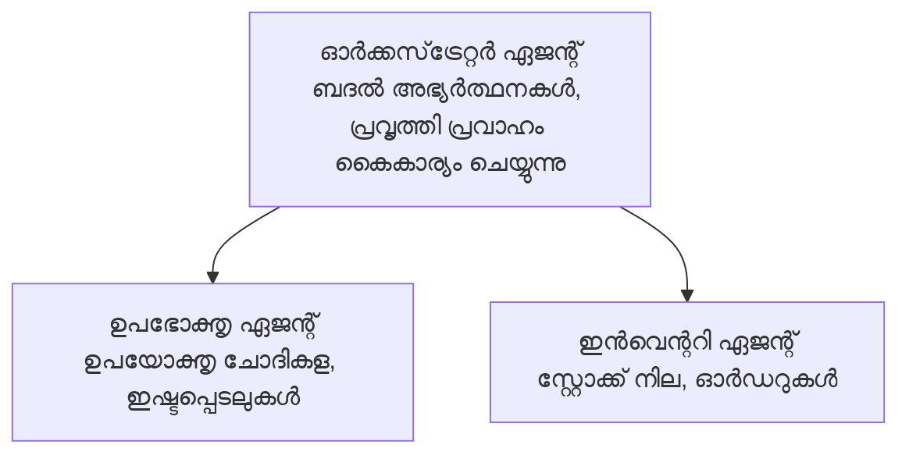

# അദ്ധ്യായം 5: മൾട്ടി-ഏജന്റ് AI പരിഹാരങ്ങൾ

**📚 കോഴ്സ്**: [AZD For Beginners](../../README.md) | **⏱️ സമയം**: 2-3 മണിക്കൂര്‍ | **⭐ സങ്കീർണ്ണത**: വിസ്തൃതം

---

## അവലോകനം

സങ്കീർണ്ണ സാഹചര്യങ്ങൾക്ക് മൾട്ടി-ഏജന്റ് ആർക്കിടെക്ചർ മാതൃകകൾ, ഏജന്റ് ഓർക്കസ്ട്രേഷൻ, ഉത്പാദനത്തിന് സജ്ജമായ AI ഡിസ്പ്ലോയ്മെന്റ് എന്നിവ ഈ അദ്ധ്യായം ഉൾക്കൊള്ളുന്നു.

> 2026 ജൂൺ മാസത്തിൽ `azd 1.25.6` ഉപയോഗിച്ച് സ്ഥിരീകരിച്ചതാണ്.

## പഠന ലക്ഷ്യങ്ങൾ

ഈ അദ്ധ്യായം പൂർത്തിയാക്കുമ്പോൾ, നിങ്ങൾക്ക് സാധിക്കും:
- മൾട്ടി-ഏജന്റ് ആർക്കിടെക്ചർ മാതൃകകൾ മനസിലാക്കുക
- കോഓർഡിനേറ്റഡ് AI ഏജന്റ് സിസ്റ്റങ്ങൾ ഡിസ്പ്ലോയ് ചെയ്യുക
- ഏജന്റ്-തേത് ഏജന്റ് ആശയവിനിമയം നടപ്പാക്കുക
- ഉത്പാദനത്തിന് തയ്യാറായ മൾട്ടി-ഏജന്റ് പരിഹാരങ്ങൾ നിർമ്മിക്കുക

---

## 📚 പാഠങ്ങൾ

| # | പാഠം | വിവരണം | സമയം |
|---|--------|-------------|------|
| 1 | [മൾട്ടി-ഏജന്റ് അടിസ്ഥാനങ്ങൾ](multi-agent-basics.md) | പ്രായോഗികം: `azd up` ഉപയോഗിച്ച് പ്രവർത്തിക്കുന്ന മൾട്ടി-ഏജന്റ് ആപ്പ് ഡിസ്പ്ലോയ് ചെയ്യുക | 45 മിനിറ്റ് |
| 2 | [കോഓർഡിനേഷൻ മാതൃകകൾ](../chapter-06-pre-deployment/coordination-patterns.md) | ഏജന്റ് ഓർക്കസ്ട്രേഷൻ തന്ത്രങ്ങൾ (അദ്ധ്യായം 6-ൽ തുടരുന്നു) | 30 മിനിറ്റ് |
| 3 | [ARM ടെംപ്ലേറ്റ് ഡിപ്പ്ലോയ്മെന്റ്](../../examples/retail-multiagent-arm-template/README.md) | ഒരെണ്ണം ക്ലിക്ക് ചെയ്ത് ഡിപ്പ്ലോയ്മെന്റ് ഉദാഹരണം | 30 മിനിറ്റ് |

> **പാഠം 1-ൽ നിന്ന് തുടങ്ങുക.** ഈ അദ്ധ്യായത്തിലെ ഏക സമ്പൂർണ പ്രായോഗികവും ഡിപ്പ്ലോയബിൾ പാഠമാണ് ഇത്. പാഠം 2 അദ്ധ്യായവും 6-ൽ ഉൾപ്പെടുന്നു (പ്രീ-ഡിപ്പ്ലോയ്മെന്റ് പദ്ധതിയുമായി പങ്കിടുന്നു), [റീറ്റെയിൽ മൾട്ടി-ഏജന്റ് സൊല്യൂഷൻ](../../examples/retail-scenario.md) ഒരു ആർക്കിടെക്ചർ ബ്ലൂപ്രിന്താണ്—ഒരു ഡിസൈൻ സൂചന, ഒറ്റ കമാൻഡ് ടെംപ്ലേറ്റ് അല്ല.

---

## 🚀 ക്വിക്ക് സ്റ്റാർട്ട്

```bash
# ഓപ്ഷൻ 1: ടെംപ്ലേറ്റിൽ നിന്ന് വിന്യസിക്കുക
azd init --template agent-openai-python-prompty
azd up

# ഓപ്ഷൻ 2: ഏജന്റ് മാനിഫസ്റ്റ് മുതൽ വിന്യസിക്കുക (azure.ai.agents സ്‌ട്രാറ്റ് ആവശ്യമാണ്)
azd extension install azure.ai.agents
azd ai agent init -m agent-manifest.yaml
azd up
```

> **എന്ത് സമീപനം?** പ്രവർത്തിക്കുന്ന സാമ്പിൾ ഉപയോഗിച്ച് തുടങ്ങാൻ `azd init --template` ഉപയോഗിക്കുക. നിങ്ങളുടെ സ്വന്തം ഏജന്റ് മാനിഫെസ്റ്റ് ഉണ്ടെങ്കിൽ `azd ai agent init` ഉപയോഗിക്കുക. മുഴുവൻ വിശദാംശങ്ങൾക്കായി [AZD AI CLI റഫറൻസ്](../chapter-08-production/production-ai-practices.md#azd-ai-cli-commands-and-extensions) കാണുക.

---

## 🤖 മൾട്ടി-ഏജന്റ് ആർക്കിടെക്ചർ



---

## 🎯 ശ്രദ്ധേയമായ പരിഹാരം: റീറ്റെയിൽ മൾട്ടി-ഏജന്റ്

[റീറ്റെയിൽ മൾട്ടി-ഏജന്റ് സൊല്യൂഷൻ](../../examples/retail-scenario.md) ഇതുപോയി കാണിക്കുന്നു:

- **കസ്റ്റമർ ഏജന്റ്**: ഉപഭോക്തൃ ഇടപെടലുകളും മുൻഗണനകളും കൈകാര്യം ചെയ്യുന്നു
- **ഇൻവെന്ററി ഏജന്റ്**: സ്റ്റോക്ക്, ഓർഡർ പ്രോസസ്സിങ് നിയന്ത്രിക്കുന്നു
- **ഓർക്കസ്ട്രേറ്റർ**: ഏജന്റുകൾക്കിടയിൽ കോഓർഡിനേഷൻ ചെയ്യുന്നു
- **ഷെയേർഡ് മെമ്മറി**: ഏജന്റ് ഇടയിൽ പശ്ചാത്തല മാനേജ്മെന്റ്

### ഉപയോഗിച്ചിട്ടുള്ള സർവീസുകൾ

| സർവീസ് | ഉപയോഗം |
|---------|---------|
| Microsoft Foundry Models | ഭാഷാ മനസ്സിലാക്കൽ |
| Azure AI Search | ഉൽപ്പന്ന കാറ്റലോഗ് |
| Cosmos DB | ഏജന്റ് நிலയും സ്മരണയും |
| Container Apps | ഏജന്റ് ഹോസ്റ്റിംഗ് |
| Application Insights | മേൽനോട്ടം |

---

## 🔗 നാവിഗേഷൻ

| ദിശ | അദ്ധ്യായം |
|-----------|---------|
| **മുമ്പ്** | [അദ്ധ്യായം 4: ഇൻഫ്രാസ്ട്രക്ചർ](../chapter-04-infrastructure/README.md) |
| **അടുത്തത്** | [അദ്ധ്യായം 6: പ്രീ-ഡിപ്പ്ലോയ്മെന്റ്](../chapter-06-pre-deployment/README.md) |

---

## 📖 ബന്ധപ്പെട്ട സേവനങ്ങൾ

- [AI ഏജന്റുകൾ ഗൈഡ്](../chapter-02-ai-development/agents.md)
- [ഉത്പാദന AI പ്രവൃത്തികൾ](../chapter-08-production/production-ai-practices.md)
- [AI പ്രശ്നപരിഹാരം](../chapter-07-troubleshooting/ai-troubleshooting.md)

---

<!-- CO-OP TRANSLATOR DISCLAIMER START -->
**അറിയിപ്പ്**:
ഈ രേഖ AI പരിഭാഷാ സേവനം [Co-op Translator](https://github.com/Azure/co-op-translator) ഉപയോഗിച്ച് പരിഭാഷപ്പെടുത്തിയതാണ്. ഞങ്ങൾ കൃത്യതയ്ക്കായി ശ്രമിക്കുന്നുവെങ്കിലും, ഓട്ടോമേറ്റഡ് പരിഭാഷകളിൽ പിഴവുകൾ അല്ലെങ്കിൽ തെറ്റായ വിവരങ്ങൾ ഉണ്ടാകാൻ സാധ്യതയുണ്ട്. അതിന്റെ സ്വാഭാവിക ഭാഷയിലുള്ള അസൽ രേഖയാണ് പ്രാമാണികമായ ഉറവിടമായി പരിഗണിക്കേണ്ടത്. നിർണായകമായ വിവരങ്ങൾക്ക്, പ്രൊഫഷണൽ മനുഷ്യ പരിഭാഷ ശുപാർശ ചെയ്യുന്നു. ഈ പരിഭാഷ ഉപയോഗിച്ച് ഉണ്ടാകുന്ന തെറ്റിദ്ധാരണകൾ അല്ലെങ്കിൽ തെറ്റായ വ്യാഖ്യാനങ്ങൾക്കായി ഞങ്ങൾ ഉത്തരവാദികളല്ല.
<!-- CO-OP TRANSLATOR DISCLAIMER END -->