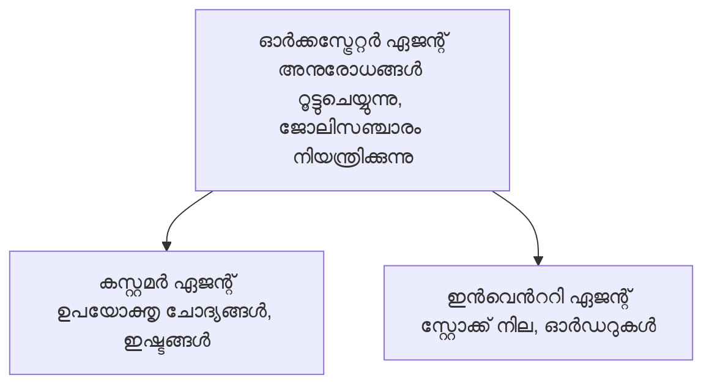

# अध्याय 5: मल्टी-एजेंट एआई समाधान

**📚 कोर्स**: [AZD फॉर बिगिनर्स](../../README.md) | **⏱️ अवधि**: 2-3 घंटे | **⭐ जटिलता**: उन्नत

---

## अवलोकन

यह अध्याय उन्नत मल्टी-एजेंट आर्किटेक्चर पैटर्न, एजेंट ऑर्केस्ट्रेशन, और जटिल परिदृश्य के लिए उत्पादन-तैयार एआई डिप्लॉयमेंट को कवर करता है।

> मार्च 2026 में `azd 1.23.12` के खिलाफ सत्यापित।

## सीखने के उद्देश्य

इस अध्याय को पूरा करके, आप:
- मल्टी-एजेंट आर्किटेक्चर पैटर्न को समझेंगे
- समन्वित एआई एजेंट सिस्टम तैनात करेंगे
- एजेंट से एजेंट संचार को लागू करेंगे
- उत्पादन-तैयार मल्टी-एजेंट समाधान बनाएंगे

---

## 📚 पाठ

| # | पाठ | विवरण | समय |
|---|--------|-------------|------|
| 1 | [रिटेल मल्टी-एजेंट समाधान](../../examples/retail-scenario.md) | पूर्ण कार्यान्वयन वॉकथ्रू | 90 मिनट |
| 2 | [समन्वय पैटर्न](../chapter-06-pre-deployment/coordination-patterns.md) | एजेंट ऑर्केस्ट्रेशन रणनीतियाँ | 30 मिनट |
| 3 | [ARM टेम्प्लेट डिप्लॉयमेंट](../../examples/retail-multiagent-arm-template/README.md) | एक-क्लिक डिप्लॉयमेंट | 30 मिनट |

---

## 🚀 त्वरित प्रारंभ

```bash
# ഓപ്ഷൻ 1: ഒരു ടെമ്പ്ലേറ്റ് നിന്ന് വിന്യസിക്കുക
azd init --template agent-openai-python-prompty
azd up

# ഓപ്ഷൻ 2: ഒരു ഏജന്റ് മാനിഫെസ്റ്റ് (azure.ai.agents എക്സ്റ്റൻഷൻ ആവശ്യമാണ്) യിൽ നിന്ന് വിന്യസിക്കുക
azd extension install azure.ai.agents
azd ai agent init -m agent-manifest.yaml
azd up
```

> **कौन सा तरीका?** कार्यरत नमूने से शुरू करने के लिए `azd init --template` का उपयोग करें। जब आपके पास अपना एजेंट मैनिफेस्ट हो, तब `azd ai agent init` का उपयोग करें। पूर्ण विवरण के लिए [AZD AI CLI संदर्भ](../chapter-08-production/production-ai-practices.md#azd-ai-cli-commands-and-extensions) देखें।

---

## 🤖 मल्टी-एजेंट आर्किटेक्चर


---

## 🎯 विशेष समाधान: रिटेल मल्टी-एजेंट

[रिटेल मल्टी-एजेंट समाधान](../../examples/retail-scenario.md) प्रदर्शित करता है:

- **ग्राहक एजेंट**: उपयोगकर्ता इंटरैक्शन और प्राथमिकताओं को संभालता है
- **इन्वेंटरी एजेंट**: स्टॉक और ऑर्डर प्रसंस्करण प्रबंधित करता है
- **ऑर्केस्ट्रेटर**: एजेंटों के बीच समन्वय करता है
- **साझा मेमोरी**: एजेंटों के बीच संदर्भ प्रबंधन

### उपयोग की गई सेवाएँ

| सेवा | उद्देश्य |
|---------|---------|
| Microsoft Foundry Models | भाषा समझ |
| Azure AI Search | उत्पाद कैटलॉग |
| Cosmos DB | एजेंट स्थिति और मेमोरी |
| Container Apps | एजेंट होस्टिंग |
| Application Insights | निगरानी |

---

## 🔗 नेविगेशन

| दिशा | अध्याय |
|-----------|---------|
| **पिछला** | [अध्याय 4: इंफ्रास्ट्रक्चर](../chapter-04-infrastructure/README.md) |
| **अगला** | [अध्याय 6: पूर्व-तैनाती](../chapter-06-pre-deployment/README.md) |

---

## 📖 संबंधित संसाधन

- [एआई एजेंट्स गाइड](../chapter-02-ai-development/agents.md)
- [उत्पादन एआई प्रथाएँ](../chapter-08-production/production-ai-practices.md)
- [एआई ट्रबलशूटिंग](../chapter-07-troubleshooting/ai-troubleshooting.md)

---

<!-- CO-OP TRANSLATOR DISCLAIMER START -->
**ഡിസ്ക്ലെയിമർ**:  
ഈ ഡോക്യുമെന്റ് എഐ തർജ്ജമശ്രവും [Co-op Translator](https://github.com/Azure/co-op-translator) ഉപയോഗിച്ച് തർജ്ജമചെയ്തതാണ്. നാം കൃത്യതയ്ക്കായി പരിശ്രമിച്ചെങ്കിലും, സ്വയംമേയ് തർജ്ജമയിൽ പിഴവുകൾ അല്ലെങ്കിൽ അസാധുതകൾ ഉണ്ടാകാമെന്ന് ദയവായി മനസ്സിലാക്കി. യഥാർത്ഥ പ്രമാണം അതിന്റെ മാതൃഭാഷയിൽ മേൽക്കൊള്ളുന്ന ഉറവിടമെന്നു പരിഗണിക്കേണ്ടതാണ്. നിർണായക വിവരങ്ങൾക്ക് പ്രൊഫഷണൽ മനുഷ്യൻ നിർവഹിക്കുന്ന തർജ്ജമ്മ ശുപാർശ ചെയ്യുന്നു. ഈ തർജ്ജമ ഉപയോഗിക്കുന്നതിനാൽ ഉണ്ടായ herhangi അവബോധക്കുറവും തെറ്റിദ്ധാരണകൾക്കും ഞങ്ങൾ ബാധ്യസ്ഥർ അല്ല.
<!-- CO-OP TRANSLATOR DISCLAIMER END -->