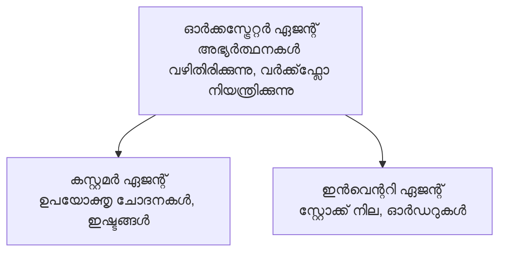

# അധ്യായം 5: മള്‍ട്ടി-ഏജന്റ് AI പരിഹാരങ്ങൾ

**📚 കോഴ്‌സ്**: [AZD തുടക്കക്കാർക്ക്](../../README.md) | **⏱️ സമയം**: 2-3 മണിക്കൂർ | **⭐ സങ്കീർണത**: പരിഷ്കൃതം

---

## അവലോകനം

ഈ അധ്യായം പരിഷ്കൃത മള്‍ട്ടി-ഏജന്റ് ആർക്കിടെക്ചർ പാറ്റേണുകൾ, ഏജന്റ് ഓർക്കസ്ട്രേഷൻ, ചുരുക്കം സന്നാഹങ്ങളായ AI വിനിയോഗങ്ങൾ എന്നിവയെ ഉള്‍ക്കൊള്ളുന്നു.

## പഠന ലക്ഷ്യങ്ങൾ

ഈ അധ്യായം പൂർത്തിയാക്കുമ്പോൾ, നിങ്ങൾക്ക് സാധിക്കാനും:
- മള്‍ട്ടി-ഏജന്റ് ആർക്കിടെക്ചർ പാറ്റേണുകൾ മനസ്സിലാക്കുക
- ഏകോപിത AI ഏജന്റ് സംവിധാനങ്ങൾ വിനിയോഗിക്കുക
- ഏജന്റ്-തുടർന്ന് ഏജന്റ് സമ്ബ്രേക്ഷണം നടപ്പാക്കുക
- ഉത്പാദന-സജ്ജ മള്‍ട്ടി-ഏജന്റ് പരിഹാരങ്ങൾ നിർമ്മിക്കുക

---

## 📚 പാഠങ്ങൾ

| # | പാഠം | വിവരണം | സമയം |
|---|--------|-------------|------|
| 1 | [റീട്ടെയിൽ മള്‍ട്ടി-ഏജന്റ് പരിഹാരം](../../examples/retail-scenario.md) | പിന്നാക്ക നടപ്പാക്കൽ വിശകലനം | 90 മിനിറ്റ് |
| 2 | [ഒņēmസ്ഹേപ പാറ്റേണുകൾ](../chapter-06-pre-deployment/coordination-patterns.md) | ഏജന്റ് ഓർക്കസ്ട്രേഷൻ തന്ത്രങ്ങൾ | 30 മിനിറ്റ് |
| 3 | [ARM ടെംപ്ലേറ്റ് വിനിയോഗം](../../examples/retail-multiagent-arm-template/README.md) | ഒന്ന്-ക്ലിക്ക് വിനിയോഗം | 30 മിനിറ്റ് |

---

## 🚀 വേഗത്തിലുള്ള ആരംഭം

```bash
# ഓപ്ഷന്‍ 1: ഒരു ടെംപ്ലേറ്റില്‍ നിന്ന് വിന്യസിക്കുക
azd init --template agent-openai-python-prompty
azd up

# ഓപ്ഷന്‍ 2: ഒരു ഏജന്റ് മാനിഫെസ്റ്റ് നിന്നു വിന്യസിക്കുക (azure.ai.agents എക്സ്റ്റെന്‍ഷന്‍ ആവശ്യമാണ്)
azd extension install azure.ai.agents
azd ai agent init -m agent-manifest.yaml
azd up
```

> **എന്ത് സമീപനം?** `azd init --template` ഉപയോഗിച്ച് പ്രവർത്തിക്കുന്ന സാമ്പിളിൽ നിന്നിത് ആരംഭിക്കുക. സ്വന്തമായ ഏജന്റ് മാനിഫെസ്റ്റ് ഉണ്ടെങ്കിൽ `azd ai agent init` ഉപയോഗിക്കുക. മുഴുവൻ വിശദാംശങ്ങൾക്കായി [AZD AI CLI റഫറൻസ്](../chapter-08-production/production-ai-practices.md#azd-ai-cli-commands-and-extensions) കാണുക.

---

## 🤖 മള്‍ട്ടി-ഏജന്റ് ആർക്കിടെക്ചർ


---

## 🎯 മുൻനിര പരിഹാരം: റീറ്റെയിൽ മള്‍ട്ടി-ഏജന്റ്

[റീറ്റെയിൽ മള്‍ട്ടി-ഏജന്റ് പരിഹാരം](../../examples/retail-scenario.md) താഴെ പറയുന്നവ തുടർച്ചയായി:

- **കസ്റ്റമർ ഏജന്റ്**: ഉപയോക്തൃ ഇടപെടലുകളും പ്രാദേശിക ആഗ്രഹങ്ങളും കൈകാര്യം ചെയ്യുന്നു
- **ഇൻവെന്ററി ഏജന്റ്**: സ്റ്റോക്ക്, ഓർഡർ പ്രോസസ്സിംഗ് നിയന്ത്രിക്കുന്നു
- **ഓർക്കസ്ട്രേറ്റർ**: ഏജന്റുകൾക്ക് ഇടയിൽ ഏകോപനം ഒരുക്കുന്നു
- **പങ്കിടുന്ന സ്മൃതി**: ഏജന്റ് നിർദ്ദേശ പശ്ചാത്തല പരിപാലനം

### ഉപയോഗിക്കുന്ന സർവീസുകൾ

| സർവീസ് | ഉപയോഗം |
|---------|---------|
| Microsoft Foundry മോഡലുകൾ | ഭാഷാ മനസ്സിലാക്കൽ |
| Azure AI Search | ഉൽപ്പന്ന നിർദ്ദേശിക |
| Cosmos DB | ഏജന്റ് നിലയും സ്മൃതിയും |
| കണ്ടെയ്നർ ആപ്‌സുകൾ | ഏജന്റ് ഹോസ്റ്റിംഗ് |
| അപ്ലിക്കേഷൻ ഇൻസൈറ്റ്സ് | നിരീക്ഷണം |

---

## 🔗 നാവിഗേഷൻ

| ദിശ | അധ്യായം |
|-----------|---------|
| **മുൻപ്** | [അധ്യായം 4: ഇൻഫ്രാസ്ട്രക്ചർ](../chapter-04-infrastructure/README.md) |
| **അടുത്തത്** | [അധ്യായം 6: മുൻവിനിയോഗം](../chapter-06-pre-deployment/README.md) |

---

## 📖 ബന്ധപ്പെട്ട വസ്തുതകൾ

- [AI ഏജന്റുകൾ ഗൈഡ്](../chapter-02-ai-development/agents.md)
- [ഉത്പാദന AI പ്രവൃത്തികൾ](../chapter-08-production/production-ai-practices.md)
- [AI തകരാറുകൾ പരിഹരിക്കൽ](../chapter-07-troubleshooting/ai-troubleshooting.md)

---

<!-- CO-OP TRANSLATOR DISCLAIMER START -->
**ഡിസ്‌ക്ലെയിമർ**:  
ഈ ഡോക്യുമെന്റ് AI തർജ്ജുമ സേവനം [Co-op Translator](https://github.com/Azure/co-op-translator) ഉപയോഗിച്ച് തർജ്ജ_DONE_ചെയ്തതാണ്. നമുക്ക് കൃത്യതയ്ക്കായി ശ്രമിച്ചിരുന്നുള്ളെങ്കിലും, ഓട്ടോമാറ്റിക് തർജ്ജുമകളിൽ പിശകുകളോ അസാധുതകളോ ഉണ്ടാവാമെന്ന് ദയവായി ശ്രദ്ധിക്കുക. മാതൃഭാഷയിലെ മൂല ഡോക്യുമെന്റ് അധികാരമുള്ള സ്രോതസ്സായിരിക്കും. നിർണായകമായ വിവരങ്ങൾക്കായി പ്രൊഫഷണൽ ഹ്യൂമൻ തർജ്ജുമാ ശിപാർശ ചെയ്യുന്നു. ഈ തർജ്ജുമ ഉപയോഗിക്കുന്നത് കൊണ്ട് വന്ന任何误解പരിശോധനകൾക്കോ തെറ്റായി വ്യാഖ്യാനം ചെയ്യുന്നതിനോ ഞങ്ങൾ ഉത്തരവാദികളല്ല.
<!-- CO-OP TRANSLATOR DISCLAIMER END -->