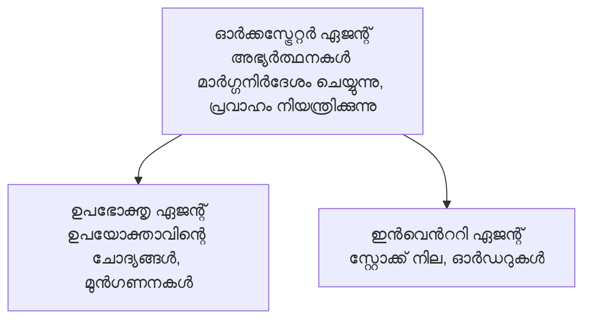

# അധ്യായം 5: മൾട്ടി-ഏജന്റ് എഐ പരിഹാരങ്ങൾ

**📚 കോഴ്‌സ്**: [AZD For Beginners](../../README.md) | **⏱️ ദൈർഘ്യം**: 2-3 മണിക്കൂർ | **⭐ സങ്കീർണ്ണത**: ഉയർന്നതും വിപുലവുമായ

---

## അവലോകനം

ഈ അധ്യായം ആധുനിക മൾട്ടി-ഏജന്റ് ആർക്കിടെക്ചർ മാതൃകകൾ, ഏജന്റ് ഒർക്കസ്ട്രേഷൻ, സങ്കീർണ്ണ സാഹചര്യങ്ങൾക്ക് ഉത്പാദന-സജ്ജ എഐ വിന്യാസങ്ങൾ എന്നിവയെക്കുറിച്ച് വിശദമായി പരിചയപ്പെടുന്നു.

> `azd 1.27.1` ഉപയോഗിച്ച് 2026 ജൂലൈയിൽ സ്ഥിരീകരിച്ചതാണ്.

## പഠന ലക്ഷ്യങ്ങൾ

ഈ അധ്യായം പൂർത്തിയാക്കുമ്പോൾ, നിങ്ങൾക്ക്:
- മൾട്ടി-ഏജന്റ് ആർക്കിടെക്ചർ മാതൃകകൾ മനസ്സിലാക്കാം
- ഏകോപിത എഐ ഏജന്റ് സംവിധാനങ്ങൾ വിന്യസിപ്പിക്കാൻ കഴിയും
- ഏജന്റ്-തോറെ ഏജന്റ് സംവാദം നടപ്പിലാക്കാം
- ഉത്പാദന-സജ്ജ മൾട്ടി-ഏജന്റ് പരിഹാരങ്ങൾ നിർമ്മിക്കാം

---

## 📚 പാഠങ്ങൾ

| # | പാഠം | വിവരണം | സമയം |
|---|--------|-------------|------|
| 1 | [മൾട്ടി-ഏജന്റ് അടിസ്ഥാനങ്ങൾ](multi-agent-basics.md) | പ്രവർത്തനത്തിൽ: `azd up` ഉപയോഗിച്ച് പ്രവർത്തനക്ഷമമായ മൾട്ടി-ഏജന്റ് ആപ്പ് വിന്യസിക്കുക | 45 മിനിറ്റ് |
| 2 | [സമന്വയ മാതൃകകൾ](../chapter-06-pre-deployment/coordination-patterns.md) | ഏജന്റ് ഒർക്കസ്ട്രേഷൻ തന്ത്രങ്ങൾ (അദ്ധ്യായം 6-ൽ തുടരും) | 30 മിനിറ്റ് |
| 3 | [ARM ടെംപ്ലേറ്റ് വിന്യാസം](../../examples/retail-multiagent-arm-template/README.md) | ഒന്ന്-ക്ലിക്ക് വിന്യാസ ഉദാഹരണം | 30 മിനിറ്റ് |

> **പാഠം 1 ല് നിന്ന് തുടങ്ങുക.** ഈ അധ്യായത്തിലെ ഏകമായി പൂര്‍ണമായും കൈത്തിൽ കൈകളച്ച് വിന്യസിക്കാവുന്ന പാഠമാണ് ഇത്. പാഠം 2 അദ്ധ്യായം 6 ല് ആണ് (പ്രീ-ഡിപ്ലോയ്‌മെന്റ് പ്ലാനിങ്ങുമായി പങ്കുവെച്ചിരിക്കുന്നത്), കൂടാതെ [റിറ്റെയിൽ മൾട്ടി-ഏജന്റ് സൊല്യൂഷൻ](../../examples/retail-scenario.md) ആർക്കിടെക്ചർ ബ്ലൂപ്രിന്റ് ആണ്—ഒരു രൂപകൽപ്പന റഫറൻസ്, ഒന്ന്-കമാൻഡ് ടേംപ്ലേറ്റ് അല്ല.

---

## 🚀 ക്വിക്ക് സ്റ്റാർട്ട്

```bash
# ഓപ്ഷൻ 1: ഒരു ടെംപ്ലേറ്റിൽ നിന്ന് വിന്യസിക്കുക
azd init --template agent-openai-python-prompty
azd up

# ഓപ്ഷൻ 2: ഒരു ഏജന്റ് മാനിഫെസ്റ്റിൽ നിന്ന് വിന്യസിക്കുക (azure.ai.agents എക്സ്റ്റൻഷൻ ആവശ്യമുണ്ട്)
azd extension install azure.ai.agents
azd ai agent init -m agent-manifest.yaml
azd up
```

> **ഏതു സമീപനം?** പ്രവർത്തനക്ഷമമായ സാമ്പിൾമുന്നിൽ നിന്ന് തുടങ്ങാൻ `azd init --template` ഉപയോഗിക്കുക. നിങ്ങളുടെ സ്വന്തം ഏജന്റ് മാനിഫെസ്റ്റ് ഉണ്ടായാൽ `azd ai agent init` ഉപയോഗിക്കുക. മുഴുവൻ വിവരങ്ങൾക്കായി [AZD AI CLI റഫറൻസ്](../chapter-08-production/production-ai-practices.md#azd-ai-cli-commands-and-extensions) കാണുക.

---

## 🤖 മൾട്ടി-ഏജന്റ് ആർക്കിടെക്ചർ



---

## 🎯 പ്രത്യേക പരിഹാരം: റിറ്റെയിൽ മൾട്ടി-ഏജന്റ്

[റിറ്റെയിൽ മൾട്ടി-ഏജന്റ് സൊല്യൂഷൻ](../../examples/retail-scenario.md) സംപ്രേക്ഷണങ്ങൾ:

- **കസ്റ്റമർ ഏജന്റ്**: ഉപഭോക്തൃ ഇടപെടലുകളും ഇഷ്ടങ്ങളും കൈകാര്യം ചെയ്യുന്നു
- **ഇൻവെന്ററി ഏജന്റ്**: സ്റ്റോക്ക്, ഓർഡർ പ്രോസസ്സിംഗ് നിയന്ത്രണം
- **ഓർക്കസ്ട്രേറ്റർ**: ഏജന്റുകൾ തമ്മിലുള്ള ഏകോപനം നടത്തുന്നു
- **ശെയർഡ് മെമ്മറി**: ഏജന്റ്-അന്തരീക്ഷ സംവരണം

### ഉപയോഗിച്ച സേവനങ്ങൾ

| സേവനം | ഉദ്ദേശ്യം |
|---------|---------|
| Microsoft Foundry Models | ഭാഷാ ബോധ്യം |
| Azure AI Search | ഉൽപ്പന്ന കലശം |
| Cosmos DB | ഏജന്റ് അവസ്ഥയും സ്മരണയും |
| Container Apps | ഏജന്റ് ഹോസ്റ്റിംഗ് |
| Application Insights | നിരീക്ഷണം |

---

## 🔗 നാവിഗേഷൻ

| ദിശ | അധ്യായം |
|-----------|---------|
| **മുമ്പത്തെ** | [അധ്യായം 4: അടിസ്ഥാന സൗകര്യം](../chapter-04-infrastructure/README.md) |
| **അടുത്തത്** | [അധ്യായം 6: പ്രീ-ഡിപ്ലോയ്‌മെന്റ്](../chapter-06-pre-deployment/README.md) |

---

## 📖 ബന്ധപ്പെട്ട വിഭവങ്ങൾ

- [എഐ ഏജന്റുകൾ ഗൈഡ്](../chapter-02-ai-development/agents.md)
- [ഉത്പാദന എഐ പെരുമാറ്റങ്ങൾ](../chapter-08-production/production-ai-practices.md)
- [എഐ പ്രശ്ന പരിഹാരം](../chapter-07-troubleshooting/ai-troubleshooting.md)

---

<!-- CO-OP TRANSLATOR DISCLAIMER START -->
**അറിയിപ്പ്**:
ഈ രേഖ AI പരിഭാഷാ സേവനം [Co-op Translator](https://github.com/Azure/co-op-translator) ഉപയോഗിച്ച് പരിഭാഷപ്പെടുത്തിയതാണ്. ഞങ്ങൾ കൃത്യതയ്ക്കായി ശ്രമിക്കുന്നുവെങ്കിലും, ഓട്ടോമേറ്റഡ് പരിഭാഷകളിൽ പിഴവുകൾ അല്ലെങ്കിൽ തെറ്റായ വിവരങ്ങൾ ഉണ്ടാകാൻ സാധ്യതയുണ്ട്. അതിന്റെ സ്വാഭാവിക ഭാഷയിലുള്ള അസൽ രേഖയാണ് പ്രാമാണികമായ ഉറവിടമായി പരിഗണിക്കേണ്ടത്. നിർണായകമായ വിവരങ്ങൾക്ക്, പ്രൊഫഷണൽ മനുഷ്യ പരിഭാഷ ശുപാർശ ചെയ്യുന്നു. ഈ പരിഭാഷ ഉപയോഗിച്ച് ഉണ്ടാകുന്ന തെറ്റിദ്ധാരണകൾ അല്ലെങ്കിൽ തെറ്റായ വ്യാഖ്യാനങ്ങൾക്കായി ഞങ്ങൾ ഉത്തരവാദികളല്ല.
<!-- CO-OP TRANSLATOR DISCLAIMER END -->