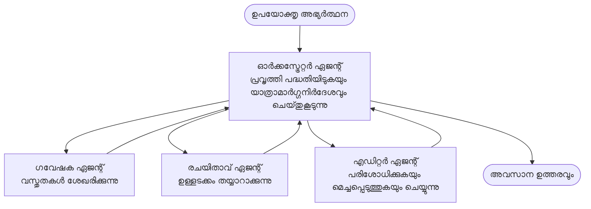

# മൾട്ടി-അജന്റ് അടിസ്ഥാനങ്ങൾ - നിങ്ങളുടെ ആദ്യ സമന്വയിച്ച AI സിസ്റ്റം വിന്യസിക്കുക

**അധ്യായ നാവിഗേഷൻ:**
- **📚 കോഴ്സ് ഹോം**: [AZD For Beginners](../../README.md)
- **📖 നിലവിലെ അഭ്യായം**: അധ്യായം 5 - മൾട്ടി-അജന്റ് AI സൊല്യൂഷനുകൾ
- **⬅️ മുമ്പ്**: [അദ്ധ്യായം 4: ഇൻഫ്രാസ്ട്രക്ചർ](../chapter-04-infrastructure/README.md)
- **➡️ അടുത്തത്**: [സമന്വയ മാതൃകകൾ](../chapter-06-pre-deployment/coordination-patterns.md)

> `azd 1.27.1` ജൂലൈ 2026-ൽ സാധൂകരിച്ചിരുന്നു.

## പരിചയം

മുമ്പത്തെ അധ്യായങ്ങളിൽ നിങ്ങൾ ഒരു അപ്ലിക്കേഷൻ വിന്യസിച്ചിരുന്നു—അധ്യായം 2-ൽ നിങ്ങൾ ഒരു ഒറ്റ AI ഏജന്റ് വിന്യസിച്ചിരുന്നു. ഈ പാഠം അടുത്ത പടിയാണ്: ഒരു **മൾട്ടി-അജന്റ് സിസ്റ്റം** വിന്യസിക്കുക, അഥവാ പല താത്പര്യമുള്ള ഏജന്റുമാർ ചേർന്ന് ഒരൊറ്റ ഏജന്റ് സ്വയം കൈകാര്യം ചെയ്യാൻ കഴിഞ്ഞില്ലാത്ത പ്രശ്നങ്ങളെ പരിഹരിക്കുക.

തുടക്കക്കാർക്ക് നല്ല വാർത്ത: **നിങ്ങള്ക്ക് പുതിയ കമാൻഡുകൾ ആവശ്യമില്ല.** മൾട്ടി-അജന്റ് സൊല്യൂഷൻ ഇപ്പോഴും ഒരു azd പ്രോജക്ടാണ്. നിങ്ങൾ `azd init`, `azd up`, ടെസ്റ്റ്, `azd down` ചെയ്യുക—നിങ്ങൾക്ക് അറിയാമായുള്ള പ്രവൃത്തി പ്രക്രിയ പോലെ. മാറുന്നത് ആപ്പിന്റെ *ആകൃതി* മാത്രമാണ്.

## പഠന ലക്ഷ്യങ്ങൾ

ഈ പാഠം കഴിഞ്ഞതിന് ശേഷം നിങ്ങൾക്ക് കഴിയും:
- "മൾട്ടി-അജന്റ്" എന്നർത്ഥവും അതിന്റെ അധിക സങ്കീർണ്ണത നേരിടേണ്ട സമയവും മനസിലാക്കുക
- മൾട്ടി-അജന്റ് സിസ്റ്റത്തിലെ പൊതുവായ വേഷങ്ങൾ തിരിച്ചറിയുക (ഓർക്കസ്ട്രേറ്റർ + സ്പെഷ്യലിസ്റ്റുകൾ)
- `azd up` ഉപയോഗിച്ച് ഒരു യਥാർത്ഥമാക്കിയ, പ്രവർത്തനക്ഷമമായ മൾട്ടി-അജന്റ് ടെംപ്ലേറ്റ് വിന്യസിക്കുക
- മൾട്ടി-അജന്റ് ആപിന് പിന്തുണ നൽക്കുന്ന Azure സ്രോതസ്സുകൾ മനസിലാക്കുക
- സൊല്യൂഷൻ സുരക്ഷിതമായി പരിശോധിക്കുകയും ഇച്ഛാനുസൃതമാക്കുകയും അളവിടുകയും ചെയ്യാൻ അറിയുക

## പഠന ഫലങ്ങൾ

ഈ പാഠം കഴിഞ്ഞാൽ നിങ്ങൾ ചെയ്യാൻ കഴിയും:
- ഒറ്റ ഏജന്റും മൾട്ടി-അജന്റ് സിസ്റ്റവും തമ്മിലുള്ള വ്യത്യാസം വിശദീകരിക്കുക
- ഉപകരണങ്ങളോടുള്ള ഒറ്റ ഏജന്റും യഥാർത്ഥ മൾട്ടി-അജന്റ് ഡിസൈനും വിടവർച്ച ചെയ്യുക
- azd ഉപയോഗിച്ച് മൾട്ടി-അജന്റ് ടെംപ്ലേറ്റ് പൂർത്തിയാക്കി പരീക്ഷിക്കുക
- ഓരോ ഏജന്റും എവിടെയാണ് പ്രവർത്തിക്കുന്നത്, അവ എങ്ങനെ ആശയവിനിമയം നടത്തുന്നു എന്ന് തിരിച്ചറിയുക
- തുടർച്ചയായ ചാർജുകൾ ഒഴിവാക്കാൻ എല്ലാ സ്രോതസ്സുകളും വൃത്തിയാക്കുക

---

## ഒരു മൾട്ടി-അജന്റ് സിസ്റ്റം എന്താണ്?

ഒരു ഒറ്റ AI ഏജന്റ് ഒരു മോഡലും കുറച്ചുകാലം നിർദ്ദേശങ്ങളും (ഓപ്ഷനൽ ആയും ചില ഉപകരണങ്ങളും) ഉളളതാണ്. അത് കേന്ദ്രീകൃതമായ ജോലികൾക്ക് ഉത്തമമാണ്. എങ്കിൽ ജോബ് വളരുമ്പോൾ—ഗവേഷണം, എഴുത്ത്, എഡിറ്റിംഗ്, ഫാക്റ്റ്-ചെക്ക്—എല്ലാം ഒരു പ്രോംപ്റ്റിലേക്ക് ഒറ്റ കയറ്റം ഏജന്റിനെ മന്ദഗതിയുള്ളതും വിശ്വസനീയമല്ലാത്തതും ദുഷ്‌കരമായി ഡീബഗ് ചെയ്യുന്നതുമാക്കും.

**മൾട്ടി-അജന്റ് സിസ്റ്റം** വിവിധ ജോലി നന്നായി ചെയ്യുന്ന വിദഗ്ധരായി ജോലി വിഭജിക്കുന്നു, ആർക്കസ്‌ട്രേറ്റർ വഴി സമന്വയിപ്പിക്കും:



### നിങ്ങൾക്ക് എന്നും കാണുന്ന രണ്ട് വേഷങ്ങൾ

| വേഷം | ജോലി | ഉദാഹരണം |
|------|-----|---------|
| **ഓർക്കസ്ട്രേറ്റർ** | *അടുത്തത് എന്താകുമെന്ന്* തീരുമാനിച്ച് ഏജന്റുമാർക്ക് ജോലി നൽകുന്നു | "ആദ്യം ഗവേഷണം, പിന്നെ എഴുത്ത്, അവസാനം എഡിറ്റിംഗ്" |
| **സ്പെഷ്യലിസ്റ്റ്** | ഒരു കേന്ദ്രീകൃത ജോലി ചെയ്യുകയും ഫലം നൽകുകയും ചെയ്യുന്നു | യഥാർത്ഥത്തിൽ വിവരങ്ങൾ ശേഖരിക്കുന്ന "ഗവേഷകൻ" |

### നിങ്ങൾക്കിഷ്ടം മൾട്ടി-അജന്റുകൾ ആവശ്യമാണോ?

ലളിതമായി തുടങ്ങി. താഴെ പറയുന്നവയിൽ ഒന്നും ശരിയാകുമ്പോഴേ മൾട്ടി-അജന്റ് ആവശ്യമുള്ളത്:

- ✅ ജോലിയ്ക്ക് **വിവിധ ഘട്ടങ്ങൾ** ഉള്ളപ്പോൾ ഒவ்வൊരു ഘട്ടത്തിനും വ്യത്യസ്ത നിർദ്ദേശങ്ങൾ (ഗവേഷണം, എഴുത്ത്, അവലോകനം) എത്തുന്നത് ഉണ്ട്
- ✅ നിങ്ങൾക്ക് സ്പെഷ്യലിസ്റ്റുകൾ **സമാന്തരമായി** പ്രവർത്തിക്കാൻ ആഗ്രഹം ഉണ്ടെങ്കിൽ സമയം ലാഭിക്കും
- ✅ വ്യത്യസ്ത ഘട്ടങ്ങൾക്ക് **വിവിധ ഉപകരണങ്ങൾ അല്ലെങ്കിൽ ഡാറ്റാ സ്രോതസ്സുകൾ** ആവശ്യമുണ്ട്
- ✅ ഓരോ ഘട്ടവും **സ്വതന്ത്രമായി പരീക്ഷിക്കാനും ഡീബഗ് ചെയ്യാനും പറ്റണം**

നിങ്ങളുടെ ജോലി ഒരു ചോദ്യം-ഉത്തരം അല്ലെങ്കിൽ ലളിതമായ ഉപകരണം വിളി എന്നാണെങ്കിൽ, **ഉപകരണങ്ങളോടുള്ള ഒറ്റ ഏജന്റ്**(അധ്യായം 2) ലളിതവും ചെലവുകുറവുമായും പ്രവർത്തിപ്പിക്കാൻ എളുപ്പമുള്ളതുമാണ്.

> **തുടക്കക്കാർക്ക് ഉപദേശം:** "കൂടുതൽ ഏജന്റുകൾ" അല്ലെങ്കിൽ "മികച്ചത്" അല്ല. ഓരോ ഏജന്റും പിന്നാക്ക കാല വ്യതിയാനം, ചെലവ്, നിരീക്ഷിക്കേണ്ട പുതിയ കാര്യങ്ങൾ കൂട്ടും. പ്രശ്നം വ്യക്തമായി ഭാഗങ്ങളായി വിഭജിക്കുന്നപ്പഴമേ ഏജന്റുകൾ ചേര്‍ക്കുക.

---

## അഴുറിൽ മൾട്ടി-അജന്റ് നിർമ്മിക്കുന്നതിനുള്ള രണ്ട് മാർഗങ്ങൾ

| സമീപനം | എന്ത് ആണ് | മികച്ചത് |
|----------|-----------|----------|
| **ഒറ്റ ഏജന്റ് + ഉപകരണങ്ങൾ** | ഫൗണ്ട്രി ഏജന്റ് ഒരാൾ മാത്രമാണ്, ഫംഗ്ഷനുകളും ഉപകരണങ്ങളും വിളിക്കുന്നു | ലളിതമായ പ്രവൃത്തി പ്രക്രിയകൾ, തുടക്കം കുറിക്കൽ |
| **ഒഴിവുകൂട്ടിയ ഏജന്റുമാർ** | പല ഏജന്റുമാരും ഒരു ഓർക്കസ്ട്രേറ്ററിന്റെ കീഴിൽ | വ്യത്യസ്ത ഘട്ടങ്ങൾ, സമാന്തര ജോലികൾ, വിദഗ്ധത |

ഈ പാഠം രണ്ടാം സമീപനം അടിസ്ഥാനമാക്കിയുള്ള ഒരു **രെഡി-മെയ്ഡ് ടെംപ്ലേറ്റ്** എടുക്കുന്നു, അതിനാൽ നിങ്ങൾക്ക് രൂപകല്‌പന മുൻപ് യഥാർത്ഥ മൾട്ടി-അജന്റ് സിസ്റ്റം പ്രവർത്തിക്കുന്നതു കാണാം.

---

## പ്രായോഗികം: പ്രവർത്തനക്ഷമമായ മൾട്ടി-അജന്റ് ആപ്പ് വിന്യസിക്കുക

നാം വിന്യസിക്കാൻ പോകുന്നത് **Contoso Creative Writer**, ഔദ്യോഗിക Azure സാമ്പിൾ ആണ്, വിവിധ ഏജന്റുമാർ (ഗവേഷകൻ, എഴുത്തുകാരൻ, എഡിറ്റർ) ഉള്‍ക്കൊള്ളുന്നും ലേഖനം തയ്യാറാക്കുന്നതിൽ സമന്വയിപ്പിക്കുന്നതാണ്. ഇത് ആദ്യ മൾട്ടി-അജന്റ് ആപ്പിന് അനുയോജ്യമാണ് കാരണം വേഷങ്ങൾ മനസ്സിലാക്കാൻ എളുപ്പമാണ്.

### ഘട്ടം 1: ടെംപ്ലേറ്റ് ആരംഭിക്കൽ

```bash
# ഒരു പ്രവൃത്തിനിർവഹണ ഫോൾഡർ സൃഷ്‌ടിക്കുക
mkdir creative-writer && cd creative-writer

# ഔദ്യോഗിക മൾട്ടി-ഏജന്റ് ടെംപ്ലേറ്റിൽ നിന്നു് ആരംഭിക്കുക
azd init --template contoso-creative-writer
```

> [Awesome AZD AI ഗാലറി](https://azure.github.io/awesome-azd/?tags=ai)യിൽ ഏതെങ്കിലും സമയത്ത് കൂടുതൽ മൾട്ടി-അജന്റ് ടെംപ്ലേറ്റുകൾ വീക്ഷിക്കാം. മറ്റ് ഭേദഗതിയില്ലാത്ത അനുയോജ്യ ഓപ്ഷനുകൾ ഉൾക്കൊള്ളുന്നു `get-started-with-ai-agents` , `azure-ai-travel-agents`.

### ഘട്ടം 2: ഓർമ്മപ്പെടുത്തൽ

```bash
# azd പ്രവൃത്തി പ്രവാഹങ്ങൾക്ക് ആവശ്യമാണ്
azd auth login
```

### ഘട്ടം 3: പരിസ്ഥിതിയുടെ സൃഷ്ടി

```bash
azd env new dev
```

### ഘട്ടം 4: പരിശോധന, പിന്നെ വിന്യസനം

```bash
# എന്തെങ്കിലും ചെലവഴിക്കുന്നതിന് മുമ്പ് എന്തെന്താകും സൃഷ്ടിക്കപ്പെടുന്നത് കാണുക (ശുപാർശചെയ്യപ്പെട്ട വിധി)
azd provision --preview

# ഒരു ഘട്ടത്തിൽ അവയവങ്ങൾ സജ്ജമാക്കുകയും എല്ലാ ഏജന്റുകളും വിന്യസിപ്പിക്കുകയുമാണ് ചെയ്യുക
azd up
```

`azd up` സബ്സ്ക്രിപ്ഷനും പ്രദേശവും ചോദിക്കും, തുടർന്ന് Azure സ്രോതസ്സുകൾ സൃഷ്ടിച്ച് അപ്ലിക്കേഷൻ വിന്യസിക്കും. AI വിന്യാസങ്ങൾക്ക് ലളിതമായ വെബ് ആപ്പിനേക്കാൾ കൂടുതൽ സമയം എടുക്കാം—നീളം കൂടിയ മോഡലുകൾ വിന്യസിക്കുന്നത് ആയാൽ, വിന്യാസ സമയം നീട്ടി തീർക്കാം:

```bash
azd deploy --timeout 1800
```

> **ചെലവും ശേഷിയും ശ്രദ്ധിക്കുക:** മൾട്ടി-അജന്റ് ആപ്പുകൾ AI മോഡലുകൾ വിന്യസിക്കുന്നു, സാദ്ധ്യതയും ചെലവും ഉണ്ടാക്കുന്നു. `azd up` മോഡൽ സാദ്ധ്യതയിൽ പരാജയപ്പെടുകയാണെങ്കിൽ, [AI Troubleshooting](../chapter-07-troubleshooting/ai-troubleshooting.md) പരിശോധിക്കുക, പ്രദേശം, സാദ്ധ്യത പരിഹാരങ്ങൾക്കായി കൂടിയത് കാണുക, അഥവാ അധ്യായം 6 ലെ [ശേഷി പദ്ധതീകരണം](../chapter-06-pre-deployment/capacity-planning.md).

---

## നിങ്ങൾ വിന്യസിച്ചതു മനസിലാക്കുക

ഇത്തരമൊരു സാധാരണ മൾട്ടി-അജന്റ് ആപ്പ് മുകളിൽ ചിത്രത്തിലുള്ള ഉത്തരവാദിത്തങ്ങളിൽ നേരിട്ട് മാപ്പുചെയ്യുന്ന Azure സ്രോതസ്സുകളുടെ ഒരു സെറ്റ് വിന്യസിക്കുന്നു:

| സ്രോതസം | എന്തുകൊണ്ടാണ് അതുള്ളത് |
|----------|----------------|
| **Microsoft Foundry / മോഡലുകൾ** | ഓരോ ഏജന്റും ഉപയോഗിക്കുന്ന ഭാഷാ മോഡലുകൾ ഹോസ്റ്റ് ചെയ്യുന്നു |
| **Azure AI Search** | ഗവേഷകൻ ഏജന്റിനു അടിസ്ഥാന വിവരങ്ങൾ ഓർമ്മിപ്പിക്കുന്നു |
| **Container Apps** (അഥവാ App Service) | ഓർക്കസ്ട്രേറ്ററും ഏജന്റ് കോഡും ഹോസ്റ്റ് ചെയ്യുന്നു |
| **Cosmos DB** (ചില സാമ്പിളുകളിൽ) | ഏജന്റുമാർ തമ്മിൽ പങ്കുവെക്കുന്ന സംസ്ഥിതി/മെമ്മറി സംഭരിക്കുന്നു |
| **Application Insights** | ഏജന്റുമാരിലൂടെ വന്ന ആവശ്യങ്ങളും നിയന്ത്രണങ്ങളും ട്രേസ് ചെയ്യുന്നു, കൂടാതെ പ്രവാഹം ഡീബഗ് ചെയ്യാൻ സഹായിക്കുന്നു |

### ഏജന്റുമാർ എങ്ങനെ ആശയവിനിമയം നടത്തുന്നു

കൂടുതലുള്ള azd മൾട്ടി-അജന്റ് സാമ്പിളുകളിൽ, **ഓർക്കസ്ട്രേറ്റർ നിങ്ങളുടെ അപ്ലിക്കേഷൻ കോഡിൽ** പ്രവർത്തിക്കുന്നു (ഉദാഹരണത്തിന്, Semantic Kernel അല്ലെങ്കിൽ Microsoft Agent Framework പോലുള്ള ഫ്രെയിമ്വർക്കുകൾ ഉപയോഗിച്ചു). ഓർക്കസ്ട്രേറ്റർ ഓരോ സ്പെഷ്യലിസ്റ്റ് ഏജന്റിനെയും തർജ്ജമ ചെയ്തു ഫലം കൈമാറി ഉൾക്കുട്ടിച്ചുകൂട്ടുന്നു. ഏജന്റുമാർ സന്ദർഭം താഴെകൊണ്ടു പങ്കിടുന്നു:

- **ഫംഗ്ഷൻ/ഉപകരണം വിളികൾ** — ഓർക്കസ്ട്രേറ്റർ ഒരു സ്പെഷ്യലിസ്റ്റിനെ വിളിച്ച് ഫലം വാങ്ങുന്നു
- **പങ്കുവച്ച മെമ്മറി** — ഒരു ഡാറ്റാബേസ് (പലപ്പോഴും Cosmos DB) രണ്ട് ഏജന്റും വായിക്കാൻ കഴിയുന്ന സ്റ്റേറ്റ് സൂക്ഷിക്കുന്നു
- **സന്ദേശങ്ങളും സംഭവങ്ങളും** — ക്ഷീണമില്ലാത്ത ബന്ധത്തിനായി, ഏജന്റുകളും ഒരു ക്യൂയിലൂടെയോ സർവീസ് ബസിലൂടെയോ ആശയവിനിമയം നടത്തുന്നു

> **ഡീബഗിംഗിന് ഇതിന്റെ പ്രാധാന്യം:** ഓരോ ഘട്ടവും വേറിട്ടത് ആയതിനാൽ, Application Insights നിങ്ങള്ക്ക് *ഏത്* ഏജന്റ് മന്ദഗതിയിലാണ് അല്ലെങ്കിൽ പരാജയപ്പെട്ടു എന്ന് കാണിക്കുന്നു. ഇത് വേണ്ടത് മൾട്ടി-അജന്റ് ഡിസൈൻ ചെയ്യാനുള്ള പ്രധാന കാരണങ്ങളിൽ ഒന്നാണ്.

---

## വിന്യാസം ശരിയാണെന്ന് സ്ഥിരീകരിക്കുക

സിസ്റ്റം ശരിക്കും പ്രവർത്തിക്കുന്നുവെന്ന് ഉറപ്പാക്കുക, പിന്നെ മുന്നോട്ട് പോവുക:

```bash
# വിന്യസിച്ച എൻഡ്‌പോയിന്റുകൾ കാണിക്കുക
azd show

# ആപ്പ് നിരീക്ഷണ ഡാഷ്‌ബോർഡ് തുറക്കുക
azd monitor

# എന്തെങ്കിലും തെറ്റെന്നു തോന്നിയാൽ ലോഗുകൾ പിന്തുടരുക
azd monitor --logs
```

തുടർന്ന് `azd show`-ൽ നിന്നുള്ള ആപ്പ് URL തുറന്ന് എല്ലാ ഏജന്റുമാരെയും സംഗമിപ്പിക്കുന്ന ഒരു അഭ്യർത്ഥന പരീക്ഷിക്കുക (Creative Writer-ക്കായി ഒരു വിഷയത്തിൽ ഒരു ചുരുക്ക ലേഖനം എഴുതാൻ പറയുക). Application Insights **ട്രാൻസാക്ഷൻ സെർച്ചിൽ**, അഭ്യർത്ഥന ഗവേഷകൻ, എഴുത്തുകാരൻ, എഡിറ്റർ ഘട്ടങ്ങളിൽ പടർന്നിരിക്കുന്നതായി കാണണം.

**വിജയം നേടാനുള്ള മാനദണ്ഡങ്ങൾ:**
- ✅ `azd show` പൊതു ആയി എത്താൻ കഴിയുന്ന ഒരു എന്റ്പോയിന്റ് കാണിക്കും
- ✅ ഒരു അഭ്യർത്ഥന ഒന്നിലധികം ഘട്ടങ്ങളിലൂടെ പോയതായി വ്യക്തമായ ഫലം നൽകുന്നു
- ✅ Application Insights ഒരോളം ഏജന്റ് ഘട്ടങ്ങൾക്ക് ട്രേസ് കാണിക്കുന്നു

---

## ഇച്ഛാനുസൃതമാക്കൽ: ഒരു ഏജന്റ് കൂട്ടിച്ചേർക്കുക അല്ലെങ്കിൽ ക്രമീകരിക്കുക

ഓരോ ഏജന്റും നിർദ്ദേശങ്ങളും ഉപകരണങ്ങളും മാത്രമാണെന്ന് കൊണ്ട് ഇച്ഛാനുസൃതമാക്കൽ എളുപ്പമാണ്:

1. **ടെംപ്ലേറ്റിലെ ഏജന്റ് നിർവചനങ്ങൾ കണ്ടെത്തുക** (സാധാരണയായി `prompts/`, `agents/`, അല്ലെങ്കിൽ `*.prompty` ഫയൽസെറ്റ്).
2. **ഒരു ഏജന്റിന്റെ നിർദ്ദേശങ്ങൾ ക്രമീകരിക്കുക** — ഉദാഹരണത്തിന്, എഡിറ്റർ ഏജന്റിനെ ഒരു പ്രത്യേക ടോൺ അല്ലെങ്കിൽ വാക്ക് എണ്ണം പാലിക്കാൻ പറയുക.
3. **മാത്രമല്ല കോഡ് വീണ്ടും വിന്യസിക്കുക** (ഇൻ‌ഫ്രാസ്ട്രക്ചർ മാറ്റമില്ല):

   ```bash
   azd deploy
   ```

കൂടുതൽ ദൂരെയായി ഞാൻമനസിലാക്കുകയും സ്വന്തം മാനിഫസ്റ്റ് ഉപയോഗിച്ച് ഏജന്റുമാർ സൃഷ്ടിക്കുകയും ചെയ്യാൻ, ഏജന്റ് എക്സ്റ്റൻഷനും അതിന്റെ മുഴുവൻ ലൈഫ്‌സൈകിളും ഉപയോഗിക്കുക:

```bash
azd extension install azure.ai.agents
azd ai agent init -m agent-manifest.yaml
azd up
azd ai agent invoke      # പ്രതികരണ സമയമോടുകൂടി പരിശോധന
```

[അധ്യായം 2: ഏജന്റുമാർ](../chapter-02-ai-development/agents.md) കൂടി കാണുക, കൂടാതെ [AZD AI CLI റഫറൻസ്](../chapter-08-production/production-ai-practices.md#azd-ai-cli-commands-and-extensions) യിൽ പൂർണ്ണ ഏജന്റ് ലൈഫ്‌സൈകിള്‍ (`invoke`, `eval generate`, `optimize`, `delete`) സഹിതം.

---

## വൃത്തിയാക്കുക

മൾട്ടി-അജന്റ് ആപ്പുകൾ ബിൽ ചെയ്യാവുന്ന നിരവധി സർവീസുകൾ പ്രവർത്തിപ്പിക്കുന്നു. ഉപയോഗമുഹൂർത്തം കഴിഞ്ഞാൽ എല്ലാം തഴുകുക:

```bash
azd down --force --purge
```

`--purge` ഫ്ലാഗ് ഉപയോഗിച്ച് സോഫ്റ്റ്-ഡിലീറ്റഡ് AI സ്രോതസ്സുകളും (ഫൗണ്ട്രി/അഴൂർ AI സർവീസസ് അക്കൗണ്ടുകൾ പോലുള്ള) നീക്കം ചെയ്യാം, അതിനാൽ അവ ഭാവിയിലെ വിന്യാസം തടയുകയോ ചെലവ് ഉണ്ടാക്കുകയോ ചെയ്യില്ല.

---

## നിർമ്മാണ ഘട്ടത്തിലെ മൾട്ടി-അജന്റ് സിസ്റ്റങ്ങളുടെ കുറിപ്പ്

ഈ റിപ്പോയിലെ [റീട്ടെയിൽ മൾട്ടി-അജന്റ് സൊല്യൂഷൻ](../../examples/retail-scenario.md) **കലാപര സെർവകലാപം** ആണ്, ഒരു ഒറ്റ കമാൻഡോടെ ടെംപ്ലേറ്റ് അല്ല—it ഒരു നിർമ്മാണ റീട്ടെയിൽ സിസ്റ്റം എങ്ങനെ നിർമ്മിക്കും എന്ന് രേഖപ്പെടുത്തുന്നു (പൂർണ്ണ നിർമ്മാണം സജീവമായ ശ്രമമാണ് എന്ന് വ്യക്തിയാക്കുന്നു). ഇത് ഡിസൈൻ റഫറൻസ് ആയി ഉപയോഗിക്കാം, ഇവിടെ ഓൺ വരും സാമ്പിൾ വിന്യാസത്തിന് ശേഷം. നിർമ്മാണ ആശങ്കകൾക്കായി (ദൃഢത, ചെലവ്, നിരീക്ഷണം, സർക്കാരിക ചട്ടങ്ങൾ), തുടർച്ചയായി [അധ്യായം 8: നിർമ്മാണ AI പ്രാക്ടീസുകൾ](../chapter-08-production/production-ai-practices.md) കാണുക.

---

## സംഗ്രഹം

- മൾട്ടി-അജന്റ് സിസ്റ്റം ജോലി വിദഗ്ധരായി വിഭജിക്കുന്നു, ഓർക്കസ്ട്രേറ്റർ വഴി അവർ സമന്വയിക്കുന്നു.
- ഇത് ഉപയോഗിക്കുക ആവശ്യമായ ഘട്ടങ്ങൾ, സമാന്തര പ്രവർത്തനം അല്ലെങ്കിൽ ഓരോ ഘട്ടത്തിനും വ്യത്യസ്ത ഉപകരണങ്ങൾ ഉണ്ടായിരിക്കുമ്പോഴേ—അല്ലെങ്കിൽ ഒറ്റ ഏജന്റ് മാത്രം ഉപയോഗിക്കുക.
- azd പ്രവൃത്തി ക്രമം മാറുന്നില്ല: `azd init` → `azd up` → ടെസ്റ്റ് → `azd down`.
- ഒരു യഥാർത്ഥ ടെംപ്ലേറ്റ് പോലുള്ള `contoso-creative-writer` നിങ്ങളെ ഇന്നെത്തന്നെ പ്രവർത്തനക്ഷമമായ മൾട്ടി-അജന്റ് ആപ്പ് കാണാനും ഇച്ഛാനുസൃതമാക്കാനും അനുവദിക്കുന്നു.
- ഏജന്റ്മദ്ധ്യേ Application Insights ട്രേസിങ് മൾട്ടി-അജന്റ് ഡിസൈനിന്റെ ഏറ്റവും വലിയ പ്രായോഗിക ഗുണങ്ങളിൽ ഒന്നാണ്.

---

## 🔗 നാവിഗേഷൻ

| ദിശ | പാഠം |
|-----------|--------|
| **മുൻപേ** | [അധ്യായം 4: ഇൻഫ്രാസ്ട്രക്ചർ](../chapter-04-infrastructure/README.md) |
| **അടുത്തത്** | [സമന്വയ മാതൃകകൾ](../chapter-06-pre-deployment/coordination-patterns.md) |

## 📖 ബന്ധപ്പെട്ട വിഭവങ്ങൾ

- [AI ഏജന്റുമാർ ഗൈഡ്](../chapter-02-ai-development/agents.md)
- [സമന്വയ മാതൃകകൾ](../chapter-06-pre-deployment/coordination-patterns.md)
- [നിർമാണ AI പ്രാക്ടീസുകൾ](../chapter-08-production/production-ai-practices.md)
- [AI പ്രശ്നപരിഹാരം](../chapter-07-troubleshooting/ai-troubleshooting.md)

---

<!-- CO-OP TRANSLATOR DISCLAIMER START -->
**അറിയിപ്പ്**:
ഈ രേഖ AI പരിഭാഷാ സേവനം [Co-op Translator](https://github.com/Azure/co-op-translator) ഉപയോഗിച്ച് പരിഭാഷപ്പെടുത്തിയതാണ്. ഞങ്ങൾ കൃത്യതയ്ക്കായി ശ്രമിക്കുന്നുവെങ്കിലും, ഓട്ടോമേറ്റഡ് പരിഭാഷകളിൽ പിഴവുകൾ അല്ലെങ്കിൽ തെറ്റായ വിവരങ്ങൾ ഉണ്ടാകാൻ സാധ്യതയുണ്ട്. അതിന്റെ സ്വാഭാവിക ഭാഷയിലുള്ള അസൽ രേഖയാണ് പ്രാമാണികമായ ഉറവിടമായി പരിഗണിക്കേണ്ടത്. നിർണായകമായ വിവരങ്ങൾക്ക്, പ്രൊഫഷണൽ മനുഷ്യ പരിഭാഷ ശുപാർശ ചെയ്യുന്നു. ഈ പരിഭാഷ ഉപയോഗിച്ച് ഉണ്ടാകുന്ന തെറ്റിദ്ധാരണകൾ അല്ലെങ്കിൽ തെറ്റായ വ്യാഖ്യാനങ്ങൾക്കായി ഞങ്ങൾ ഉത്തരവാദികളല്ല.
<!-- CO-OP TRANSLATOR DISCLAIMER END -->