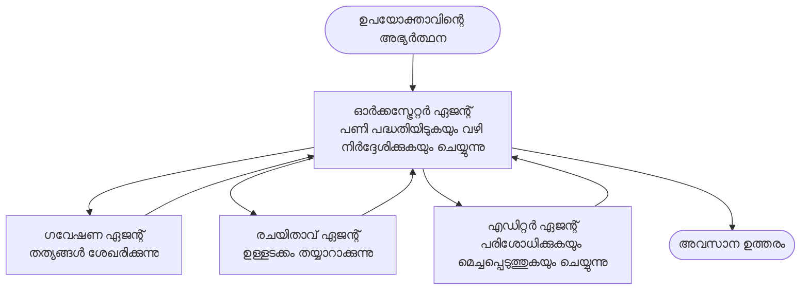

# മൾട്ടി-ഏജന്റ് അടിസ്ഥാനങ്ങൾ - നിങ്ങളുടെ ആദ്യ സഹകരിച്ച AI സിസ്റ്റം വിന്യസിക്കുക

**Chapter Navigation:**
- **📚 Course Home**: [AZD For Beginners](../../README.md)
- **📖 Current Chapter**: അദ്ധ്യായം 5 - മൾട്ടി-ഏജന്റ് AI പരിഹാരങ്ങൾ
- **⬅️ Previous**: [Chapter 4: Infrastructure](../chapter-04-infrastructure/README.md)
- **➡️ Next**: [Coordination Patterns](../chapter-06-pre-deployment/coordination-patterns.md)

> ഈ രേഖ `azd 1.25.6` ഉപയോഗിച്ച് 2026 ജൂണിൽ പരിശോദിച്ച് സ്ഥിരീകരിച്ചിരിക്കുന്നു.

## ആമുഖം

മുമ്പത്തെ അദ്ധ്യായങ്ങളിൽ നിങ്ങൾ ഒറ്റ ആപ്ലിക്കേഷൻ വിന്യസിച്ചു—അധ്യായം 2-ൽ നിങ്ങൾ ഒരു ഒറ്റ AI ഏജന്റ് വിന്യസിച്ചു. ഈ പാഠം അടുത്ത ഘട്ടത്തിലേക്ക് നയിക്കുന്നു: ഒരു **മൾട്ടി-ഏജന്റ് സിസ്റ്റം** വിന്യസിക്കുക, ഇവിടെ നിരവധി ప్రత్యేక ഏജന്റുകൾ ഒന്നിലധികം ജോലികൾ സംയോജിപ്പിച്ച് ഒരേ ഏജന്റ് ചെയ്യാനാവാത്ത പ്രശ്നങ്ങൾ പരിഹരിക്കാൻ ചേർക്കുന്നു.

ആരംഭകർക്കുള്ള സന്തോഷവാർത്ത: **നിങ്ങൾക്ക് പുതിയ കമാൻഡുകൾ ആവശ്യമില്ല.** മൾട്ടി-ഏജന്റ് സൊല്യൂഷൻ ഇപ്പോഴുമൊരു azd പ്രോജക്ടെയാണ. നിങ്ങൾ `azd init`, `azd up`, ടെസ്റ്റ് ചെയ്ത് `azd down` ചെയ്യും—നിങ്ങൾ ഇതിനകം അറിയുന്ന സാരഥ്യപ്രവാഹം തന്നെ. മാറ്റം സംഭവിക്കുന്നത് ആപ്പിന്റെ ഉള്ളടക്കത്തിന്റെ രൂപത്തിലാണ്.

## പഠന ലക്ഷ്യങ്ങൾ

ഈ പാഠം പൂർത്തിയാക്കിയപ്പോൾ, നിങ്ങൾ:
- "മൾട്ടി-ഏജന്റ്" എന്ന് എന്താണ് എന്നും അതിന്റെ അധിക സങ്കീർണതയ്ക്ക് ഏപ്പോൾ മൂല్యం ഉള്ളതെന്നും മനസ്സിലാക്കുക
- മൾട്ടി-ഏജന്റ് സിസ്റ്റത്തിൽ സാധാരണ കാണപ്പെടുന്ന റോളുകൾ (ഓർക്കസ്ട്രേറ്റർ + വിദഗ്ധർ) തിരിച്ചറിയുക
- `azd up` ഉപയോഗിച്ച് ഒരു യാഥാർത്ഥ multi-agent ടെംപ്ലേറ്റ് വിന്യസിക്കുക
- മൾട്ടി-ഏജന്റ് ആപ്പിനെ പിന്തുണയ്ക്കുന്ന Azure რესോഴ്സുകൾ മനസ്സിലാക്കുക
- സൊല്യൂഷൻ സുരക്ഷിതമായി സ്ഥിരീകരിക്കുകയും, ആചാര്യപ്പെടുത്തുകയും, നീക്കുകയും ചെയ്യാൻ അറിയുക

## പഠന ഫലങ്ങൾ

ഈ പാഠം പൂർത്തിയാക്കിയാൽ, നിങ്ങൾക്ക് കഴിയും:
- ഒറ്റ ഏജന്റും മൾട്ടി-ഏജന്റ് സിസ്റ്റത്തിനും ഉള്ള വ്യത്യാസം വിവരിക്കുക
- ടൂളുകൾ ഉള്ള ഒരു ഒറ്റ ഏജന്റിനും സത്യമായ മൾട്ടി-ഏജന്റ് ഡിസൈനിനും മധ്യേ തിരഞ്ഞെടുക്കാൻ അറിയുക
- azd ഉപയോഗിച്ച് ഒരു മൾട്ടി-ഏജന്റ് ടെംപ്ലേറ്റ് ഇന്പ്ലിമെന്റ് ചെയ്ത് ടെസ്റ്റ് ചെയ്യുക
- ഓരോ ഏജენტი എവിടെ ഓടുന്നത്, അവ പരസ്പരം എങ്ങനെ ആശയ വിനിമയം നടത്തുന്നു എന്ന് തിരിച്ചറിഞ്ഞുക
- തുടർന്നുള്ള ചിലവ് ഒഴിവാക്കാൻ എല്ലാ റിസോഴ്സും നീക്കം ചെയ്യുക

---

## മൾട്ടി-ഏജന്റ് സിസ്റ്റം എന്നു എന്താണ്?

ഒറ്റ AI ഏജന്റ് എന്നത് ഒരു മോഡൽ ഒറ്റ ക്രമീകരണങ്ങളോടെ (ഒപ്ഷനലായി ചില ടൂളുകൾ) ഓടിക്കുന്നു. കേന്ദ്രീകൃതപ്പെട്ട ജോലികൾക്ക് അത് നല്ലതാണു. പക്ഷേ ഒരു ജോൽ വ്യാപകമാകുമ്പോൾ—ഗവേഷണം, തുടർന്ന് എഴുതൽ, തുടർന്ന് പരിഷ്‌ക്കരണം, പിന്നീട് ഫാക്റ്റ്-ചെക്കിംഗ്—എല്ലാവുമൊത്തിച്ച് ഒരേയൊരു പ്രോംപ്ടിൽ കുടുക്കിയാൽ ഏജന്റ് മന്ദവും വിശ്വസനീയത നഷ്ടവും ഡീബഗ് ചെയ്യാൻ ബുദ്ധിമുട്ടും വരും.

ഒരു **മൾട്ടി-ഏജന്റ് സിസ്റ്റം** ജോലി പ്രത്യേക സ്ഥാനങ്ങളിൽ നന്നായി ചെയ്യുന്നതായി വിഭജിക്കുന്നു, ഒരു ഓർക്കസ്ട്രേറ്റർ കോഓർഡിനേറ്റ് ചെയ്യുന്നു:



### നിങ്ങൾ എപ്പോഴും കാണുന്ന രണ്ട് റോളുകൾ

| റോള്ഇ | ജോലി | ഉദാഹരണം |
|------|-----|---------|
| **Orchestrator** | *ഇനിയെന്താണ് സംഭവിക്കേണ്ടത്* തീരുമാനിക്കുക, ഏജന്റുകൾക്കിടയിലെ ജോലി റൂട്ട് ചെയ്യുക | "ആദ്യം ഗവേഷണം, പിന്നെ എഴുതുക, തുടർന്ന് എഡിറ്റ് ചെയ്യുക" |
| **Specialist** | ഒരു കേന്ദ്രീകൃത ജോലി ചെയ്തുകൊണ്ട് ഫലം മടങ്ങിക്കൊടുക്കുക | വിവരങ്ങൾ ശേഖരിക്കാൻ മാത്രം ഉള്ള ഒരു "ഗവേഷകൻ" |

### നിങ്ങളുടെ പ്രവൃത്തിക്ക് സത്യത്തിൽ ബഹുമുഖ ഏജന്റുകൾ വേണ്ടതേയാണോ?

സിംപിൾ ആയി ആരംഭിക്കുക. ഇതിൽ ഏതെങ്കിലും ഒരു കാര്യം ശരിയാണെങ്കിൽ മാത്രമേ മൾട്ടി-ഏജന്റ് സമീപനം ഉപയോഗിക്കാൻ സംശയിക്കാവൂ:

- ✅ ജോലിക്ക് **വ്യത്യസ്ത ഘട്ടങ്ങൾ** ഉണ്ടെങ്കിൽ അത് വ്യത്യസ്ത നിർദ്ദേശങ്ങൾക്കു ഉപയോഗപ്രദമാണെന്ന് (ഗവേഷണം vs എഴുതൽ vs അവലോകനം)
- ✅ സമയമുണ്ടാക്കാൻ വിദഗ്ധർ **പാരലൽ ആയി** ഓടിക്കാനായി ആഗ്രഹിക്കുന്നത്
- ✅ വ്യത്യസ്ത ഘട്ടങ്ങൾക്ക് **വ്യത്യസ്ത ടൂളുകൾ അല്ലെങ്കിൽ ഡാറ്റാ സോഴ്‌സുകൾ** ആവശ്യമുള്ളപ്പോൾ
- ✅ ഓരോ ഘട്ടവും **സ്വതന്ത്രമായി ടെസ്റ്റ് ചെയ്യാനും ഡീബഗ് ചെയ്യാനും കഴിയും** എന്ന് നിങ്ങൾക്കാവശ്യപ്പെട്ടാൽ

താങ്കളുടെ ജോലിയൊന്ന് ഒരു ചോദ്യ-ഉത്തരം അല്ലെങ്കിൽ ലളിതമായ ടൂൾ കോളാണ് എങ്കിൽ, **ഒറ്റ ഏജന്റ് ടൂളുകളുമായി** (അദ്ധ്യായം 2) അധികം ലളിതവും, ചെലവുകുറവുമായും, എളുപ്പത്തിലുമാണ്.

> **ആരംഭകർക്കുള്ള നിർദ്ദേശം:** "കൂടുതൽ ഏജന്റുകൾ" എന്നത് "കൂടുതൽ മികച്ചതാണു" എന്ന് പൊതുതെറ്റാണ്. ഓരോ ഏജന്റും വൈകിപ്പിക്കും, ചെലവ് കൂട്ടും, നിരീക്ഷിക്കാനുള്ള പുതിയ ഒന്നും ചേർക്കും. പ്രശ്നം വ്യക്തമായി വിഭജിക്കുമ്പോൾ മാത്രം ഏജന്റുകൾ ചേർക്കുക.

---

## Azure-ൽ മൾട്ടി-ഏജന്റ് നിർമ്മിക്കാൻ രണ്ട് വഴി

| സമീപനം | അത് എന്താണ് | ഏതിനാണ് മികച്ചത് |
|----------|-----------|----------|
| **Single agent + tools** | ഫംക്ഷനുകൾ/ടൂളുകൾ കോളുചെയ്യുന്ന ഒരു Foundry ഏജന്റ് | ലളിതമായ വർക്‌ഫ്ലോകൾ, തുടക്കം എടുക്കുന്നതിനും |
| **Multiple coordinated agents** | ഓർക്കസ്ട്രേറ്ററോടെ ഒന്നിലധികം ഏജന്റുകൾ | വ്യത്യസ്ത ഘട്ടങ്ങൾ, സമാന്തര ജോലികൾ, പ്രത്യേകത ആവശ്യമായപ്പോൾ |

ഈ പാഠം രണ്ടാം സമീപനത്തെ കേന്ദ്രീകരിക്കുന്നു, ഒരു ** tayari ചെയ്തു നൽകിയ ടെംപ്ലേറ്റ് ** ഉപയോഗിച്ച്, അതിനാൽ നിങ്ങൾക്ക് യഥാർത്ഥ മൾട്ടി-ഏജന്റ് സിസ്റ്റം ഓടുന്നത് കാണാനും താങ്കൾ സ്വന്തം സൃഷ്ടിക്ക് മുമ്പായി ഇത് പഠിക്കാനും കഴിയും.

---

## ഹാൻഡ്‌സ്-ഓൺ: ഒരു പ്രവർത്തനक्षम മൾട്ടി-ഏജന്റ് ആപ്പ് വിന്യസിക്കുക

നാം വിന്യസിക്കാൻ പോകുന്നത് **Contoso Creative Writer** ആണ്, ഔദ്യോഗിക Azure സാമ്പിൾ; ഇത് നിരവധി ഏജന്റുകൾ (ഗവേഷകൻ, എഴുത്തുകാരൻ, എഡിറ്റർ) ഉപയോഗിച്ച് ഒരു ലേഖനം തയ്യാറാക്കാൻ കോഓർഡിനേറ്റ് ചെയ്യുന്നു. റോൾകൾ എളുപ്പത്തിൽ മനസ്സിലാക്കാവുന്നതാണ്, അതുകൊണ്ട് ഇത് ആദ്യ മൾട്ടി-ഏജന്റ് ആപ്പായി ഗുണകരമാണ്.

### ഘട്ടം 1: ടെംപ്ലേറ്റ് ആരംഭിക്കുക

```bash
# ഒരു പ്രവർത്തന ഫോൾഡർ സൃഷ്ടിക്കുക
mkdir creative-writer && cd creative-writer

# ഔദ്യോഗിക മൾട്ടി-ഏജന്റ് ടെംപ്ലേറ്റിൽ നിന്ന് ആരംഭിക്കുക
azd init --template contoso-creative-writer
```

> ഏതെങ്കിലും സമയത്ത് കൂടുതൽ മൾട്ടി-ഏജന്റ് ടെംപ്ലേറ്റുകൾ ബ്രൗസുചെയ്യാൻ [ശ്രേഷ്ഠ AZD AI ഗ്യാലറി](https://azure.github.io/awesome-azd/?tags=ai) സന്ദർശിക്കുക. മറ്റ് തുടക്കക്കാർക്ക് مناسب ഓപ്ഷനുകളിൽ `get-started-with-ai-agents` and `azure-ai-travel-agents` ഉൾപ്പെടുന്നു.

### ഘട്ടം 2: സുരക്ഷിതമാക്കുക (Authenticate)

```bash
# azd വർക്‌ഫ്ലോകൾക്കായി ആവശ്യമാണ്
azd auth login
```

### ഘട്ടം 3: ഒരു എൻവയോൺമെന്റ് സൃഷ്ടിക്കുക

```bash
azd env new dev
```

### ഘട്ടം 4: മുൻവീക്ഷണം, പിന്നെ വിന്യസിക്കുക

```bash
# ചിലവ് ഒന്നും ചെയ്യുന്നതിന് മുമ്പ് 무엇ൊക്കെ സൃഷ്ടിക്കപ്പെടുമെന്ന് കാണുക (ശുപാർശ ചെയ്യുന്നു)
azd provision --preview

# ഒരു ഘട്ടത്തിൽ അടിസ്ഥാന സൗകര്യം ഒരുക്കി എല്ലാ ഏജന്റുകളും വിന്യസിക്കുക
azd up
```

`azd up` സബ്സ്ക്രിപ്ഷനും റീജിയണും ചോദിച്ചശേഷം Azure റിസോഴ്സുകൾ പ്രൊവിഷൻ ചെയ്ത് ആപ്ലിക്കേഷൻ വിന്യസിക്കും. AI വിന്യാസങ്ങൾ ഒരു ലളിതമായ വെബ് ആപ്പിന്‍റെ അപേക്ഷിച്ച് കൂടുതലായി സമയം എടുക്കാം—വലുതായ മോഡലുകൾ വിന്യസിക്കുന്നുവെങ്കിൽ, നിങ്ങൾ വിന്യാസ ടൈംഔട്ട് നീട്ടാവുന്നതാണ്:

```bash
azd deploy --timeout 1800
```

> **ചെലവും ശേഷിയും സംബന്ധിച്ച് മുന്നറിയിപ്പ്:** മൾട്ടി-ഏജന്റ് ആപ്പുകൾ മോഡലുകൾ ഉപയോഗിച്ച് ക്വാട്ടയും ചെലവുമുണ്ടാക്കും. `azd up` മോഡൽ ക്വോട്ടയിൽ പരാജയപ്പെട്ടാൽ, റീജിയൻ / ക്വോട്ട ഫിക്സുകൾക്ക് [AI Troubleshooting](../chapter-07-troubleshooting/ai-troubleshooting.md) നോക്കുക, കൂടാതെ അദ്ധ്യായം 6 [Capacity Planning](../chapter-06-pre-deployment/capacity-planning.md) കാണുക.

---

## നിങ്ങൾ വിന്യസിച്ചത് എന്തെന്ന് മനസ്സിലാക്കൽ

ഇതുപോലെയുള്ള ഒരു സാധാരണ മൾട്ടി-ഏജന്റ് ആപ്പ് Azure-ൽ ഒരു സെറ്റ് റിസോഴ്സുകൾ പ്രൊവിഷൻ ചെയ്യും, അവ ഡയഗ്രാമിൽ കാണിക്കപ്പെടുന്ന ഉത്തരവാദിത്വങ്ങളുമായി നേരിട്ട് മാപ്പ് ചെയ്യുന്നു:

| Resource | എതുകൊണ്ടാണ് ഇത് അവിടെ |
|----------|----------------|
| **Microsoft Foundry / Models** | ഓരോ ഏജന്റും ഉപയോഗിക്കുന്ന ഭാഷാ മോഡലുകൾ ഹോസ്റ്റ് ചെയ്യുന്നു |
| **Azure AI Search** | ഗവേഷകൻ ഏജന്റിന് ഗ്രൗണ്ടഡ് ഡാറ്റ തിരയാനുള്ള സൗകര്യം നൽകുന്നു |
| **Container Apps** (or App Service) | ഓർക്കസ്ട്രേറ്ററും ഏജന്റ് കോഡും ഹോസ്റ്റ് ചെയ്യുന്നു |
| **Cosmos DB** (in some samples) | ഏജന്റുകൾ തമ്മിൽ കൈമാറുന്ന ഷെയർഡ് സ്റ്റേറ്റ്/മെമ്മറി സംഭരിക്കുന്നു |
| **Application Insights** | ഏജന്റുകൾക്കിടയിലെ അഭ്യർത്ഥനകൾ ട്രെയ്‌സ് ചെയ്യുന്നു, അതിലൂടെ ഫ്ലോ ഡീബഗ് ചെയ്യാൻ കഴിയും |

### ഏജന്റുകൾ പരസ്പരം എങ്ങനെ സംസാരിക്കുന്നു

ബഹുഭാഗം azd മൾട്ടി-ഏജന്റ് സാമ്പിളുകളിൽ, **ഓർക്കസ്ട്രേറ്റർ നിങ്ങളുടെ ആപ്ലിക്കേഷൻ കോഡിൽ ഓടുന്നു** (ഉദാഹരണത്തിന്, Semantic Kernel അല്ലെങ്കിൽ Microsoft Agent Framework പോലുള്ള ഫ്രെയിംവർക്കുകൾ ഉപയോഗിച്ച്). ഓർക്കസ്ട്രേറ്റർ ഓരോ പ്രത്യേക ഏജന്റിനെയും അഭ്യർത്ഥിച്ച് ഫലം പാസ്സുചെയ്യുകയും അന്തിമ ഉത്തരം ചേർക്കുകയും ചെയ്യും. ഏജന്റുകൾ കോൺടെക്സ് ഷെയർ ചെയ്യുന്നത് താഴെപ്പറയുന്ന വഴി ആണ്:

- **ഫംഗ്ഷൻ/ടൂൾ കോളുകൾ** — ഓർക്കസ്ട്രേറ്റർ ഒരു സ്പെഷലിസ്റിനെയാണ് വിളിച്ചു ഫലം നേടുന്നത്
- **ഷെയർഡ് മെമ്മറി** — ഒരു ഡാറ്റാബേസ് (ചുരുതയിൽ Cosmos DB) സ്റ്റേറ്റ് സൂക്ഷിക്കുന്നു, രണ്ട് ഏജന്റുകളും വായിക്കാൻ കഴിയും
- **മെസേജുകൾ/ഇവന്റുകൾ** — കുറഞ്ഞ കപ്പിളിങ്ങിന്, ഏജന്റുകൾ ക്യൂയോ<Service Bus> വഴി ആശയവിനിമയം നടത്തുന്നു

> **ഡീബഗ്ഗിംഗിന് ഇത് എന്തുകൊണ്ടാണ് പ്രധാനപ്പെട്ടതെന്ന്:** ഓരോ ഘട്ടവും പ്രത്യേകം ആയിരിക്കുന്നതിനാൽ, Application Insights നിങ്ങളെ ഏത് ഏജന്റ് സ്ലോ ആയതോ പരാജയപ്പെട്ടതോ എന്നു കാണിക്കും. അതു തന്നെ തൊഴിൽ വിഭജിച്ച工作的 പ്രധാന കാരണമാണ്.

---

## വിന്യാസം സ്ഥിരീകരിക്കുക

തുടർന്നു പോകുന്നതിന് മുൻപ് സിസ്റ്റം ശരിയായി പ്രവർത്തിക്കുന്നുണ്ടോ എന്ന് സ്ഥിരീകരിക്കുക:

```bash
# ഡിപ്ലോയിച്ച എൻഡ്‌പോയിന്റുകൾ കാണിക്കുക
azd show

# ആപ്പിന്റെ നിരീക്ഷണ ഡാഷ്‌ബോർഡ് തുറക്കുക
azd monitor

# എന്തെങ്കിലും തെറ്റായി തോന്നുന്നെങ്കിൽ ലോഗുകൾ തുടർച്ചയായി പിന്തുടരുക
azd monitor --logs
```

അപ്പോൾ `azd show` માં നിന്നുള്ള ആപ് URL തുറന്ന് എല്ലാ ഏജന്റുകളും ഉപയോഗിക്കുന്ന ഒരു അഭ്യർത്ഥന പരീക്ഷിക്കുക (Creative Writer-ന്റെ കാര്യത്തിൽ, ഒരു വിഷയം സംബന്ധിച്ച ഒരു ചെറിയ ലേഖനം എഴുതാൻ ആവശ്യപ്പെടുക). Application Insights-ൽ **transaction search**-ൽ നിങ്ങൾ ആവശ്യനങ്ങൾക്ക് ഗവേഷകൻ, എഴുത്തുകാരൻ, എഡിറ്റർ ഘട്ടങ്ങളിലേയ്ക്ക് ഫാൻ ഔട്ട് ചെയ്യുന്നത് കാണുന്നുണ്ടാവണം.

**വിജയ മാനദണ്ഡങ്ങൾ:**
- ✅ `azd show` ഒരു ലഭ്യമായ എൻഡ്പോയ്നറ് ലിസ്റ്റ് ചെയ്യുന്നു
- ✅ ഒരു അഭ്യർത്ഥന പല ഘട്ടങ്ങളിലൂടെ പോയതെന്ന് വ്യക്തമായി കാണുന്ന ഫലം ഉണ്ട്
- ✅ Application Insights ഒരു ചെയ്യൽപടി ഒരിക്കല്‍തന്നെ അതിലധികം ഏജന്റ് ഘട്ടങ്ങൾക്ക് ട്രേസുകൾ കാണിക്കുന്നു

---

## കസ്റ്റമൈസ് ചെയ്യുക: ഒരു ഏജന്റ്കൂടെയോ ക്രമീകരണമോ ചേർക്കുക

ഓരോ ഏജന്റും വെറും നിർദ്ദേശങ്ങളും ടൂളുകളും മാത്രമാണാകുന്നതിനാൽ, കസ്റ്റമൈസേഷൻ എളുപ്പമാണ്:

1. ടെംപ്ലേറ്റിലെ ഏജന്റ് നിർവചനം കണ്ടെത്തുക (സാധാരണയായി `prompts/`, `agents/`, അല്ലെങ്കിൽ `*.prompty` ഫയൽ સറ്റ്).
2. ഒരു ഏജന്റിന്റെ നിർദ്ദേശങ്ങൾ ട്യൂൺ ചെയ്യുക — ഉദാഹരണത്തിന്, എഡിറ്റർ ഏജന്റിനെ ഒരു പ്രത്യേക ടോൺ അല്ലെങ്കിൽ വാക്കുകളുടെ എണ്ണം വാർത്താക്കടൽ നിർദ്ദേശിക്കുക.
3. **കോഡ് മാത്രം** വീണ്ടും വിന്യസിക്കുക (ഇൻഫ്രാസ്ട്രക്ചർ മാറ്റമില്ല):

   ```bash
   azd deploy
   ```

താങ്കളുടെ *സ്വന്തം* മാസ്ട്‌റിഫൈലിൽ നിന്നുള്ള ഏജന്റുകൾ ആരംഭിക്കാനും പൂർണ്ണ ലൈഫ്സൈക്കിൾ ഉപയോഗിക്കാനും, ഏജന്റ് എക്സ്റ്റൻഷൻ ഉപയോഗിക്കുക:

```bash
azd extension install azure.ai.agents
azd ai agent init -m agent-manifest.yaml
azd up
azd ai agent invoke      # പരീക്ഷണം, പ്രതികരണ സമയത്തോടുകൂടി
```

പൂർണ്ണ ഏജന്റ് ലൈഫ്സൈക്കിൾ (`invoke`, `eval generate`, `optimize`, `delete`) എന്നിവയ്ക്കായി [Chapter 2: Agents](../chapter-02-ai-development/agents.md)യും [AZD AI CLI reference](../chapter-08-production/production-ai-practices.md#azd-ai-cli-commands-and-extensions)യും കാണുക.

---

## നീക്കം ചെയ്യുക

മൾട്ടി-ഏജന്റ് ആപ്പുകൾ متعددബില്ലബിൾ സേവനങ്ങൾ ഓടിക്കുന്നു. നിർബന്ധമായും നിങ്ങൾ പൂർത്തിയായതിനുശേഷം എല്ലാം നീക്കം ചെയ്യുക:

```bash
azd down --force --purge
```

`--purge` ഫ്ലാഗും സോഫ്റ്റ്-ഡിലീറ്റ് ചെയ്‌ത AI റിസോഴ്സുകൾ (ഉദാഹരണത്തിന് Foundry/Azure AI Services അക്കൗണ്ടുകൾ) നീക്കം ചെയ്യുന്നു, അതുകൊണ്ട് അവ ഭാവിയിലെ പുതുക്കലിന് തടസ്സമാകരുത് അല്ലെങ്കിൽ തുടർച്ചയായ ചെലവ് ഉണ്ടാവരുത്.

---

## പ്രൊഡക്ഷൻ മൾട്ടി-ഏജന്റ് സിസ്റ്റങ്ങളിലേക്കുള്ള കുറിപ്പ്

ഈ റിപോസിറ്ററിയിലുള്ള [Retail Multi-Agent Solution](../../examples/retail-scenario.md) ഒരു **ആർക്കിടെക്ചർ ബ്ലൂപ്രിന്റ്** ആണ്, ഒറ്റ-കമാൻഡുള്ള ടെംപ്ലേറ്റ് അല്ല—ഇത് പ്രൊഡക്ഷൻ റീട്ടെയിൽ സിസ്റ്റം എങ്ങനെ നിർമ്മിക്കപ്പെട്ടേനെ എന്ന് രേഖീകരിക്കുന്നു (പൂർണ്ണ നിർമ്മാണം വലിയ ശ്രമമാണെന്ന് വ്യക്തമാക്കുന്നു). ഇവിടെ വിന്യാസം പൂർത്തിയാക്കിയതിന് ശേഷം ഡിസൈൻ റഫറൻസ് ആയി ഇത് ഉപയോഗിക്കുക. പ്രൊഡക്ഷനുമായി ബന്ധപ്പെട്ട വിഷമതകൾ (റിലയബിലിറ്റി, ചെലവ്, മേൽനോട്ടം, ഗവർണൻസ്)ക്കായി [Chapter 8: Production AI Practices](../chapter-08-production/production-ai-practices.md) തുടരുക.

---

## സംഗ്രഹം

- മൾട്ടി-ഏജന്റ് സിസ്റ്റം ജോലിയെ വിദഗ്ധങ്ങൾക്ക് വിഭജിച്ച് ഒരു ഓർക്കസ്ട്രേറ്റർ ഐ-ഐ-ഡിനേറ്റ് ചെയ്തു സംയോജിപ്പിക്കുന്നു.
- ജോലി വ്യത്യസ്ത ഘട്ടങ്ങൾ, സമാന്തരത, അല്ലെങ്കിൽ ഓരോ ഘട്ടത്തിനും വ്യത്യസ്ത ടൂളുകൾ ആവശ്യമുള്ളപ്പോൾ മാത്രമേ ഇത് ഉപയോഗിക്കാൻ ഉചിതമായിരിക്കൂ—ഇല്ലെങ്കിൽ ഒറ്റ ഏജന്റ് ഉപയോഗിക്കുക.
- azd വർക്ക്‌ഫ്ലോ സ്ഥിരമാണ്: `azd init` → `azd up` → ടെസ്റ്റ് → `azd down`.
- `contoso-creative-writer` പോലുള്ള യാഥാർത്ഥ ടെംപ്ലേറ്റ് നിങ്ങൾക്ക് ഒരിക്കൽ ഓടുന്ന മൾട്ടി-ഏജന്റ് ആപ്പ് കാണാനും കസ്റ്റമൈസ് ചെയ്യാനും അനുവദിക്കുന്നു.
- ഏജന്റുകൾക്ക് മദ്ധ്യേ Application Insights ട്രേസിംഗ് മൾട്ടി-ഏജന്റ് ഡിസൈനിന്റെ ഒരു പ്രധാന പ്രായോഗിക ഗുണമാണ്.

---

## 🔗 നാവിഗേഷൻ

| ദിശ | പാഠം |
|-----------|--------|
| **Previous** | [Chapter 4: Infrastructure](../chapter-04-infrastructure/README.md) |
| **Next** | [Coordination Patterns](../chapter-06-pre-deployment/coordination-patterns.md) |

## 📖 ബന്ധപ്പെട്ട വിഭവങ്ങൾ

- [AI Agents Guide](../chapter-02-ai-development/agents.md)
- [Coordination Patterns](../chapter-06-pre-deployment/coordination-patterns.md)
- [Production AI Practices](../chapter-08-production/production-ai-practices.md)
- [AI Troubleshooting](../chapter-07-troubleshooting/ai-troubleshooting.md)

---

<!-- CO-OP TRANSLATOR DISCLAIMER START -->
**അറിയിപ്പ്**:
ഈ രേഖ AI പരിഭാഷാ സേവനം [Co-op Translator](https://github.com/Azure/co-op-translator) ഉപയോഗിച്ച് പരിഭാഷപ്പെടുത്തിയതാണ്. ഞങ്ങൾ കൃത്യതയ്ക്കായി ശ്രമിക്കുന്നുവെങ്കിലും, ഓട്ടോമേറ്റഡ് പരിഭാഷകളിൽ പിഴവുകൾ അല്ലെങ്കിൽ തെറ്റായ വിവരങ്ങൾ ഉണ്ടാകാൻ സാധ്യതയുണ്ട്. അതിന്റെ സ്വാഭാവിക ഭാഷയിലുള്ള അസൽ രേഖയാണ് പ്രാമാണികമായ ഉറവിടമായി പരിഗണിക്കേണ്ടത്. നിർണായകമായ വിവരങ്ങൾക്ക്, പ്രൊഫഷണൽ മനുഷ്യ പരിഭാഷ ശുപാർശ ചെയ്യുന്നു. ഈ പരിഭാഷ ഉപയോഗിച്ച് ഉണ്ടാകുന്ന തെറ്റിദ്ധാരണകൾ അല്ലെങ്കിൽ തെറ്റായ വ്യാഖ്യാനങ്ങൾക്കായി ഞങ്ങൾ ഉത്തരവാദികളല്ല.
<!-- CO-OP TRANSLATOR DISCLAIMER END -->