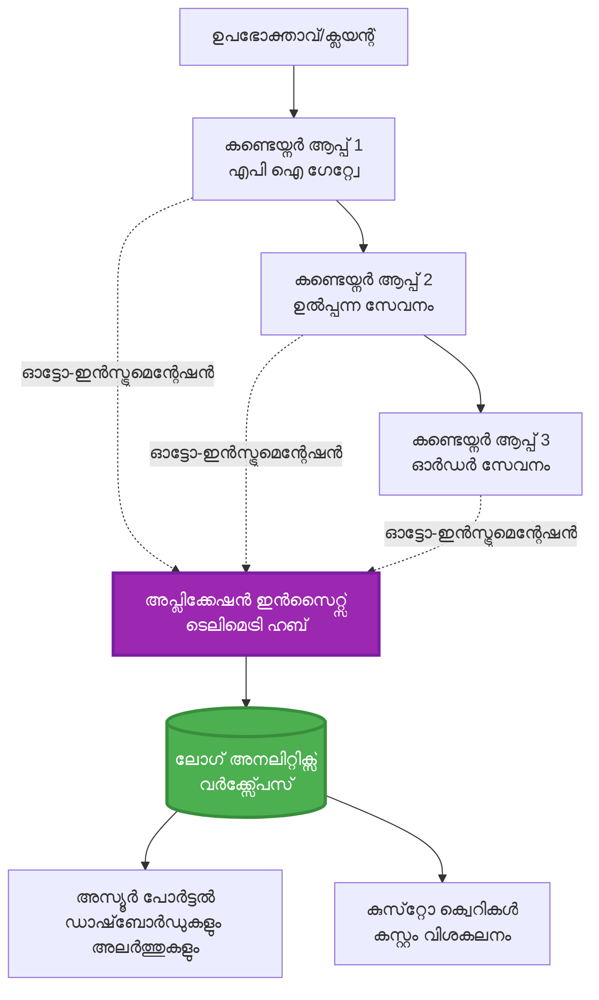
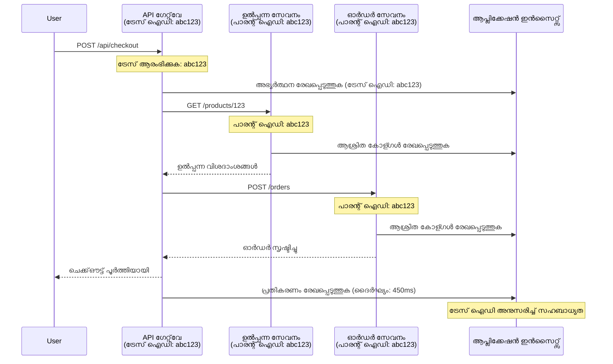

# AZD ഉപയോഗിച്ച് അപ്ലിക്കേഷൻ ഇൻസൈറ്റ്‌സ് സംയോജനം

⏱️ **അനുമാനിത സമയഭരണം**: 40-50 മിനിറ്റ് | 💰 **ച്ചെലവ്**: ഏകദേശം $5-15/മാസം | ⭐ **സങ്കീർണത**: മധ്യമനില

**📚 പഠന പാത:**
- ← മുമ്പത്തെത്: [Preflight Checks](preflight-checks.md) - പ്രീ-ഡിപ്ലോയ്മെന്റ് പരിശോധന
- 🎯 **നീங்கள் ഇപ്പോള്‍ ഇവിടെ ആകുന്നു**: അപ്ലിക്കേഷൻ ഇൻസൈറ്റ്‌സ് സംയോജനം (മോണിറ്ററിംഗ്, ടെലിമെട്രി, ഡീബഗ്)
- → അടുത്തത്: [Deployment Guide](../chapter-04-infrastructure/deployment-guide.md) - ആസ്യൂറിൽ ഡിപ്ലോയ് ചെയ്യുക
- 🏠 [കോഴ്സ് ഹോം](../../README.md)

---

## നിങ്ങൾ പഠിക്കാനിരിക്കുന്നത്

ഈ പാഠം പൂർത്തിയാക്കുന്നത് വഴി, നിങ്ങൾക്ക് കഴിയും:
- AZD പ്രോജക്ടുകളിൽ **അപ്ലിക്കേഷൻ ഇൻസൈറ്റ്‌സ്** സ്വയംസംയോജിപ്പിക്കുക
- മൈക്രോസർവിസുകൾക്കായി **ഡിസ്‌ട്രിബ്യൂട്ടഡ് ട്രെയ്സിംഗ്** ക്രമീകരിക്കുക
- **പ്രത്യേക ടെലിമെട്രി** (മെറ്റ്രിക്‌സ്, ഇവന്റുകൾ, ഡിപ്പെൻഡൻസികൾ) നടപ്പിലാക്കുക
- റിയൽ-ടൈം നിരീക്ഷണത്തിനായി **ലൈവ് മെറ്റ്രിക്‌സ്** സജ്ജമാക്കുക
- AZD ഡിപ്ലോയ്മെന്റുകളിൽനിന്ന് **അലേർട്ടുകളും ഡാഷ്‌ബോർഡുകളും** സൃഷ്ടിക്കുക
- **ടെലിമെട്രി ക്വെറികളിലൂടെ** പ്രൊഡക്ഷൻ പ്രശ്നങ്ങൾ ഡീബഗ് ചെയ്യുക
- **ചെലവുകളും സാമ്പ്ലിംഗ്** തന്ത്രങ്ങളും ഉന്മേഷപ്പെടുത്തുക
- **AI/LLM അപ്ലിക്കേഷനുകൾ** (ടോക്കണുകൾ, ലാത്തൻസി, ചെലവുകൾ) നിരീക്ഷിക്കുക

## AZD കൂടെയുള്ള അപ്ലിക്കേഷൻ ഇൻസൈറ്റ്‌സ്的重要ത എന്തുകൊണ്ട്

### വെല്ലുവിളി: പ്രൊഡക്ഷൻ നിരീക്ഷണം

**അപ്ലിക്കേഷൻ ഇൻസൈറ്റ്‌സ് ഇല്ലാത്തപ്പോൾ:**
```
❌ No visibility into production behavior
❌ Manual log aggregation across services
❌ Reactive debugging (wait for customer complaints)
❌ No performance metrics
❌ Cannot trace requests across services
❌ Unknown failure rates and bottlenecks
```

**അപ്ലിക്കേഷൻ ഇൻസൈറ്റ്‌സും AZDയും ഉള്ളപ്പോൾ:**
```
✅ Automatic telemetry collection
✅ Centralized logs from all services
✅ Proactive issue detection
✅ End-to-end request tracing
✅ Performance metrics and insights
✅ Real-time dashboards
✅ AZD provisions everything automatically
```

**ഉദാഹരണം**: അപ്ലിക്കേഷൻ ഇൻസൈറ്റ്‌സ് നിങ്ങളുടെ അപ്ലിക്കേഷനിൽ ഒരു "ബ്ലാക് ബോക്സ്" ഫ്ലൈറ്റ് റെക്കോർഡറും കൊക്ക്പിറ്റും പോലെയാണ്. നിങ്ങൾ സമയംമാറ്റമില്ലാതെ നടക്കുന്നതെല്ലാം കണ്ട് അറിയാനും യഥാർത്ഥ സംഭവങ്ങൾ വീണ്ടെടുക്കാനും കഴിയും.

---

## ആർക്കിടെക്ചർ അവലോകനം

### AZD ആർക്കിടെക്ചറിൽ അപ്ലിക്കേഷൻ ഇൻസൈറ്റ്‌സ്


### സ്വയം നിരീക്ഷിക്കപ്പെടുന്നത്

| ടെലിമെട്രി തരം | എന്താണ് പിടിക്കുക | ഉപയോഗപ്രദമായ ഘടകം |
|----------------|------------------|-------------------|
| **റിക്വസ്റ്റുകൾ** | HTTP അഭ്യർത്ഥനകൾ, സ്റ്റാറ്റസ് കോഡുകൾ, ദീർഘത | API പ്രകടന നിരീക്ഷണം |
| **ഡിപ്പെൻഡൻസികൾ** | ബാഹ്യ കോളുകൾ (ഡേറ്റാബേസ്, APIs, സ്റ്റോറേജ്) | തടസം തിരിച്ചറിയുക |
| **എക്സപ്ഷനുകൾ** | കൈകാര്യം ചെയ്യാത്ത പിഴവുകൾ സ്റ്റാക് ട്രേസിനൊപ്പം | തെറ്റുകൾ ഡീബഗ് ചെയ്യുക |
| **കസ്റ്റം ഇവന്റുകൾ** | ബിസിനസ്സ് ഇവന്റുകൾ (സൈൻഅപ്പ്, വാങ്ങൽ) | വിശകലനവും ഫണ്ണലുകളും |
| **മെറ്റ്രിക്‌സ്** | പ്രകടന കോൺററുകൾ, പ്രത്യേക മെറ്റ്രിക്‌സ് | ശേഷി ആസൂത്രണം |
| **ട്രേസുകൾ** | ഗുരുത്വത്തോടെ ലോഗ് സന്ദേശങ്ങൾ | ഡീബഗും ഓഡിറ്റിംഗും |
| **അവൈലബിലിറ്റി** | അപ്പ്‌ടൈം, പ്രതികരണ സമയം പരിശോധനകൾ | SLA നിരീക്ഷണം |

---

## മുൻകൂർ ആവശ്യങ്ങൾ

### ആവശ്യമായ ടൂളുകൾ

```bash
# ആസൂര് ഡെവലപ്പര് CLI പരിശോദിക്കുക
azd version
# ✅ പ്രതീക്ഷിക്കുന്നത്: azd പതിപ്പ് 1.0.0 അല്ലെങ്കില് അതിന് മുകളിലെ പതിപ്പ്

# ആസൂര് CLI പരിശോദിക്കുക
az --version
# ✅ പ്രതീക്ഷിക്കുന്നത്: azure-cli 2.50.0 അല്ലെങ്കില് അതിന് മുകളിലെ പതിപ്പ്
```

### ആസ്യൂർ ആവശ്യകതകൾ

- സജീവ ആസ്യൂർ സബ്സ്ക്രിപ്ഷൻ
- സൃഷ്ടിക്കാനുള്ള അവകാശങ്ങൾ:
  - അപ്ലിക്കേഷൻ ഇൻസൈറ്റ്‌സ് റിസോഴ്‌സുകൾ
  - ലോഗ് അനലിറ്റിക്സ് വർക്ക്സ്പേസുകൾ
  - കൺറ്റെയ്‌നർ ആപ്ലിക്കേഷനുകൾ
  - റിസോഴ്‌സ് ഗ്രൂപ്പുകൾ

### അറിവ് മുൻകൂട്ട്

നിങ്ങൾ നടത്തിയിരിക്കേണ്ടത്:
- [AZD അടിസ്ഥാനങ്ങൾ](../chapter-01-foundation/azd-basics.md) - AZD അടിസ്ഥാന ആശയങ്ങൾ
- [കൺഫിഗറേഷൻ](../chapter-03-configuration/configuration.md) - പരിസ്ഥിതി ക്രമീകരണം
- [ആദ്യ പ്രോജക്റ്റ്](../chapter-01-foundation/first-project.md) - അടിസ്ഥാന ഡിപ്ലോയ്മെന്റ്

---

## പാഠം 1: AZD ഉപയോഗിച്ച് സ്വയം അപ്ലിക്കേഷൻ ഇൻസൈറ്റ്‌സ്സ്

### AZD എങ്ങനെ അപ്ലിക്കേഷൻ ഇൻസൈറ്റ്‌സ് പ്രൊവിഷൻ ചെയ്യുന്നു

ഡിപ്ലോയ് ചെയ്യുമ്പോൾ AZD സ്വയം അപ്ലിക്കേഷൻ ഇൻസൈറ്റ്‌സ് സൃഷ്ടിക്കുകയും ക്രമീകരിക്കുകയും ചെയ്യുന്നു. ഇത് എങ്ങനെ പ്രവർത്തിക്കുന്നു എന്നു നോക്കാം.

### പ്രോജക്റ്റ് ഘടന

```
monitored-app/
├── azure.yaml                     # AZD configuration
├── infra/
│   ├── main.bicep                # Main infrastructure
│   ├── core/
│   │   └── monitoring.bicep      # Application Insights + Log Analytics
│   └── app/
│       └── api.bicep             # Container App with monitoring
└── src/
    ├── app.py                    # Application with telemetry
    ├── requirements.txt
    └── Dockerfile
```

---

### ഘട്ടം 1: AZD ക്രമീകരിക്കുക (azure.yaml)

**ഫയൽ: `azure.yaml`**

```yaml
name: monitored-app
metadata:
  template: monitored-app@1.0.0

services:
  api:
    project: ./src
    language: python
    host: containerapp

# AZD automatically provisions monitoring!
```

**ഇത് മാത്രമാണ്!** അടിസ്ഥാന നിരീക്ഷണത്തിന് അധിക ക്രമീകരണം വേണ്ടാതെ AZD സ്വയം അപ്ലിക്കേഷൻ ഇൻസൈറ്റ്‌സ് സൃഷ്ടിക്കും.

---

### ഘട്ടം 2: നിരീക്ഷണ ഇന്റ്രാസ്ട്രക്ചർ (Bicep)

**ഫയൽ: `infra/core/monitoring.bicep`**

```bicep
param logAnalyticsName string
param applicationInsightsName string
param location string = resourceGroup().location
param tags object = {}

// Log Analytics Workspace (required for Application Insights)
resource logAnalytics 'Microsoft.OperationalInsights/workspaces@2022-10-01' = {
  name: logAnalyticsName
  location: location
  tags: tags
  properties: {
    sku: {
      name: 'PerGB2018'  // Pay-as-you-go pricing
    }
    retentionInDays: 30  // Keep logs for 30 days
    features: {
      enableLogAccessUsingOnlyResourcePermissions: true
    }
  }
}

// Application Insights
resource applicationInsights 'Microsoft.Insights/components@2020-02-02' = {
  name: applicationInsightsName
  location: location
  tags: tags
  kind: 'web'
  properties: {
    Application_Type: 'web'
    WorkspaceResourceId: logAnalytics.id
    IngestionMode: 'LogAnalytics'
    publicNetworkAccessForIngestion: 'Enabled'
    publicNetworkAccessForQuery: 'Enabled'
  }
}

// Outputs for Container Apps
output logAnalyticsWorkspaceId string = logAnalytics.id
output logAnalyticsWorkspaceName string = logAnalytics.name
output applicationInsightsConnectionString string = applicationInsights.properties.ConnectionString
output applicationInsightsInstrumentationKey string = applicationInsights.properties.InstrumentationKey
output applicationInsightsName string = applicationInsights.name
```

---

### ഘട്ടം 3: കൺറ്റെയ്‌നർ ആപ്പ് അപ്ലിക്കേഷൻ ഇൻസൈറ്റ്‌സുമായി ബന്ധിപ്പിക്കുക

**ഫയൽ: `infra/app/api.bicep`**

```bicep
param name string
param location string
param tags object = {}
param containerAppsEnvironmentName string
param applicationInsightsConnectionString string

resource containerApp 'Microsoft.App/containerApps@2023-05-01' = {
  name: name
  location: location
  tags: tags
  properties: {
    configuration: {
      ingress: {
        external: true
        targetPort: 8000
      }
      secrets: [
        {
          name: 'appinsights-connection-string'
          value: applicationInsightsConnectionString
        }
      ]
    }
    template: {
      containers: [
        {
          name: 'api'
          image: 'myregistry.azurecr.io/api:latest'
          resources: {
            cpu: json('0.5')
            memory: '1Gi'
          }
          env: [
            {
              name: 'APPLICATIONINSIGHTS_CONNECTION_STRING'
              secretRef: 'appinsights-connection-string'
            }
            {
              name: 'APPLICATIONINSIGHTS_ENABLED'
              value: 'true'
            }
          ]
        }
      ]
    }
  }
}

output uri string = 'https://${containerApp.properties.configuration.ingress.fqdn}'
```

---

### ഘട്ടം 4: ടെലിമെട്രി ഉള്ള അപ്ലിക്കേഷൻ കോഡ്

**ഫയൽ: `src/app.py`**

```python
from flask import Flask, request, jsonify
from opencensus.ext.azure.log_exporter import AzureLogHandler
from opencensus.ext.azure.trace_exporter import AzureExporter
from opencensus.ext.flask.flask_middleware import FlaskMiddleware
from opencensus.trace.samplers import ProbabilitySampler
import logging
import os

app = Flask(__name__)

# അപ്ലിക്കേഷൻ ഇൻസൈറ്റ്സ് കണക്ഷൻ സ്ട്രിംഗിൽ നേടുക
connection_string = os.environ.get('APPLICATIONINSIGHTS_CONNECTION_STRING')

if connection_string:
    # വിതരണ ട്രേസിംഗ് ക്രമീകരിക്കുക
    middleware = FlaskMiddleware(
        app,
        exporter=AzureExporter(connection_string=connection_string),
        sampler=ProbabilitySampler(rate=1.0)  # ഡെവലപ്മെന്റിന് 100% സാമ്പിളിംഗ്
    )
    
    # ലോപ്പിംഗ് ക്രമീകരിക്കുക
    logger = logging.getLogger(__name__)
    logger.addHandler(AzureLogHandler(connection_string=connection_string))
    logger.setLevel(logging.INFO)
    
    print("✅ Application Insights enabled")
else:
    logger = logging.getLogger(__name__)
    logger.setLevel(logging.INFO)
    print("⚠️ Application Insights not configured")

@app.route('/health')
def health():
    logger.info('Health check endpoint called')
    return jsonify({'status': 'healthy', 'monitoring': 'enabled'})

@app.route('/api/products')
def get_products():
    logger.info('Fetching products')
    
    # ഡാറ്റാബേസ് കോൾ സിമ്യൂലേറ്റ് ചെയ്യുക (സ്വയം അനുബന്ധമായി ട്രാക്ക് ചെയ്‌തുക)
    products = [
        {'id': 1, 'name': 'Laptop', 'price': 999.99},
        {'id': 2, 'name': 'Mouse', 'price': 29.99},
        {'id': 3, 'name': 'Keyboard', 'price': 79.99}
    ]
    
    logger.info(f'Returned {len(products)} products')
    return jsonify(products)

@app.route('/api/error-test')
def error_test():
    """Test error tracking"""
    logger.error('Testing error tracking')
    try:
        raise ValueError('This is a test exception')
    except Exception as e:
        logger.exception('Exception occurred in error-test endpoint')
        return jsonify({'error': str(e)}), 500

@app.route('/api/slow')
def slow_endpoint():
    """Test performance tracking"""
    import time
    logger.info('Slow endpoint called')
    time.sleep(3)  # മന്ദഗതിയിലുള്ള പ്രവൃത്തി സിമ്യൂലേറ്റ് ചെയ്യുക
    logger.warning('Endpoint took 3 seconds to respond')
    return jsonify({'message': 'Slow operation completed'})

if __name__ == '__main__':
    app.run(host='0.0.0.0', port=8000)
```

**ഫയൽ: `src/requirements.txt`**

```txt
Flask==3.0.0
opencensus-ext-azure==1.1.13
opencensus-ext-flask==0.8.1
gunicorn==21.2.0
```

---

### ഘട്ടം 5: ഡിപ്ലോയ് ചെയ്ത് സ്ഥിരീകരിക്കുക

```bash
# AZD പ്രാരംഭമാക്കുക
azd init

# ഡിപ്പ്ലോയ് ചെയ്യുക (അപ്ലിക്കേഷൻ ഇൻസൈറ്റ്സ് സ്വയanganaമായും സജ്ജീകരിക്കുന്നു)
azd up

# ആപ്പ് URL നേടുക
APP_URL=$(azd env get-values | grep API_URL | cut -d '=' -f2 | tr -d '"')

# ടെലിമെട്രി സൃഷ്ടിക്കുക
curl $APP_URL/health
curl $APP_URL/api/products
curl $APP_URL/api/error-test
curl $APP_URL/api/slow
```

**✅ പ്രതീക്ഷിച്ച ഔട്ട്‌പുട്ട്:**
```json
{
  "status": "healthy",
  "monitoring": "enabled"
}
```

---

### ഘട്ടം 6: ആസ്യൂർ പോർട്ടലിൽ ടെലിമെട്രി കാണുക

```bash
# ആപ്പ് ഇൻസൈറ്റ്സ് വിശദാംശങ്ങൾ നേടുക
azd env get-values | grep APPLICATIONINSIGHTS

# ആസ്യൂർ പോർട്ടലിൽ തുറക്കുക
az monitor app-insights component show \
  --app $(azd env get-values | grep APPLICATIONINSIGHTS_NAME | cut -d '=' -f2 | tr -d '"') \
  --resource-group $(azd env get-values | grep AZURE_RESOURCE_GROUP | cut -d '=' -f2 | tr -d '"') \
  --query "appId" -o tsv
```

**ആസ്യൂർ പോർട്ടലിൽ പോവുക → അപ്ലിക്കേഷൻ ഇൻസൈറ്റ്‌സ് → ട്രാൻസാക്ഷൻ സെർച്ചിൽ**

നിങ്ങൾക്കു കാണാം:
- ✅ സ്റ്റാറ്റസ് കോഡുകളുള്ള HTTP അഭ്യർത്ഥനകൾ
- ✅ `/api/slow`-ന്റെ 3+ സെക്കൻഡ് റിക്വസ്റ്റ് ദൈർഘ്യം
- ✅ `/api/error-test`-ന്റെ എക്സപ്ഷൻ വിവരങ്ങൾ
- ✅ കസ്റ്റം ലോഗ് സന്ദേശങ്ങൾ

---

## പാഠം 2: കസ്റ്റം ടെലിമെട്രി & ഇവന്റുകൾ

### ബിസിനസ് ഇവന്റുകൾ ട്രാക്ക് ചെയ്യുക

ബിസിനസ് ക്രിട്ടിക്കൽ ഇവന്റുകൾക്കായി കസ്റ്റം ടെലിമെട്രി ചേർക്കാം.

**ഫയൽ: `src/telemetry.py`**

```python
from opencensus.ext.azure import metrics_exporter
from opencensus.stats import aggregation as aggregation_module
from opencensus.stats import measure as measure_module
from opencensus.stats import stats as stats_module
from opencensus.stats import view as view_module
from opencensus.tags import tag_map as tag_map_module
from opencensus.ext.azure.log_exporter import AzureLogHandler
from opencensus.ext.azure.trace_exporter import AzureExporter
from opencensus.trace import tracer as tracer_module
import logging
import os

class TelemetryClient:
    """Custom telemetry client for Application Insights"""
    
    def __init__(self, connection_string=None):
        self.connection_string = connection_string or os.environ.get('APPLICATIONINSIGHTS_CONNECTION_STRING')
        
        if not self.connection_string:
            print("⚠️ Application Insights connection string not found")
            return
        
        # ലോഗർ സെറ്റപ്പ് ചെയ്യുക
        self.logger = logging.getLogger(__name__)
        self.logger.addHandler(AzureLogHandler(connection_string=self.connection_string))
        self.logger.setLevel(logging.INFO)
        
        # മെട്രിക്‌സ് എക്സ്പോർട്ടർ സെറ്റപ്പ് ചെയ്യുക
        self.stats = stats_module.stats
        self.view_manager = self.stats.view_manager
        self.stats_recorder = self.stats.stats_recorder
        
        exporter = metrics_exporter.new_metrics_exporter(
            connection_string=self.connection_string
        )
        self.view_manager.register_exporter(exporter)
        
        # ട്രേസർ സെറ്റപ്പ് ചെയ്യുക
        self.tracer = tracer_module.Tracer(
            exporter=AzureExporter(connection_string=self.connection_string)
        )
        
        print("✅ Custom telemetry client initialized")
    
    def track_event(self, event_name: str, properties: dict = None):
        """Track custom business event"""
        properties = properties or {}
        self.logger.info(
            f"CustomEvent: {event_name}",
            extra={
                'custom_dimensions': {
                    'event_name': event_name,
                    **properties
                }
            }
        )
    
    def track_metric(self, metric_name: str, value: float, properties: dict = None):
        """Track custom metric"""
        properties = properties or {}
        self.logger.info(
            f"CustomMetric: {metric_name} = {value}",
            extra={
                'custom_dimensions': {
                    'metric_name': metric_name,
                    'value': value,
                    **properties
                }
            }
        )
    
    def track_dependency(self, name: str, dependency_type: str, duration: float, success: bool):
        """Track external dependency call"""
        with self.tracer.span(name=name) as span:
            span.add_attribute('dependency.type', dependency_type)
            span.add_attribute('duration', duration)
            span.add_attribute('success', success)

# ആഗോള ടെലിമെട്രി ക്ലയന്റ്
telemetry = TelemetryClient()
```

### കസ്റ്റം ഇവന്റുകളോടെ അപ്ലിക്കേഷൻ അപ്ഡേറ്റ് ചെയ്യുക

**ഫയൽ: `src/app.py` (മായ്ക്തം)**

```python
from flask import Flask, request, jsonify
from telemetry import telemetry
import time
import random

app = Flask(__name__)

@app.route('/api/purchase', methods=['POST'])
def purchase():
    """Track purchase event with custom telemetry"""
    data = request.json
    product_id = data.get('product_id')
    quantity = data.get('quantity', 1)
    price = data.get('price', 0)
    
    # ബിസിനസ് ഇവന്റ് ട്രാക്ക് ചെയ്യുക
    telemetry.track_event('Purchase', {
        'product_id': product_id,
        'quantity': quantity,
        'total_amount': price * quantity,
        'user_id': request.headers.get('X-User-Id', 'anonymous')
    })
    
    # വരുമാന മെെട്രിക്സ് ട്രാക്ക് ചെയ്യുക
    telemetry.track_metric('Revenue', price * quantity, {
        'product_id': product_id,
        'currency': 'USD'
    })
    
    return jsonify({
        'order_id': f'ORD-{random.randint(1000, 9999)}',
        'status': 'confirmed',
        'total': price * quantity
    })

@app.route('/api/search')
def search():
    """Track search queries"""
    query = request.args.get('q', '')
    
    start_time = time.time()
    
    # തിരച്ചിൽ അനുകരണം (യഥാർത്ഥ ഡാറ്റാബേസ് ക്വറി ആകും)
    results = [{'id': 1, 'name': f'Result for {query}'}]
    
    duration = (time.time() - start_time) * 1000  # മില്ലിസെക്കൻഡുകളായി മാറ്റുക
    
    # തിരച്ചിൽ ഇവന്റ് ട്രാക്ക് ചെയ്യുക
    telemetry.track_event('Search', {
        'query': query,
        'results_count': len(results),
        'duration_ms': duration
    })
    
    # തിരച്ചിൽ പ്രകടന മെെട്രിക്സ് ട്രാക്ക് ചെയ്യുക
    telemetry.track_metric('SearchDuration', duration, {
        'query_length': len(query)
    })
    
    return jsonify({'results': results, 'count': len(results)})

@app.route('/api/external-call')
def external_call():
    """Track external API dependency"""
    import requests
    
    start_time = time.time()
    success = True
    
    try:
        # ബാഹ്യ API കോളിന്റെ അനുകരണം
        response = requests.get('https://api.example.com/data', timeout=5)
        result = response.json()
    except Exception as e:
        success = False
        result = {'error': str(e)}
    
    duration = (time.time() - start_time) * 1000
    
    # ആശ്രിതത്വം ട്രാക്ക് ചെയ്യുക
    telemetry.track_dependency(
        name='ExternalAPI',
        dependency_type='HTTP',
        duration=duration,
        success=success
    )
    
    return jsonify(result)

if __name__ == '__main__':
    app.run(host='0.0.0.0', port=8000)
```

### കസ്റ്റം ടെലിമെട്രി പരിശോധന

```bash
# വാങ്ങല്‍ ഇവന്റ് ട്രാക്ക് ചെയ്യുക
curl -X POST $APP_URL/api/purchase \
  -H "Content-Type: application/json" \
  -H "X-User-Id: user123" \
  -d '{"product_id": 1, "quantity": 2, "price": 29.99}'

# തിരയൽ ഇവന്റ് ട്രാക്ക് ചെയ്യുക
curl "$APP_URL/api/search?q=laptop"

# പുറം ആശ്രിതത്വം ട്രാക്ക് ചെയ്യുക
curl $APP_URL/api/external-call
```

**ആസ്യൂർ പോർട്ടലിൽ കാണുക:**

അപ്ലിക്കേഷൻ ഇൻസൈറ്റ്‌സ് → ലോഗുകൾ, ശേഷം റൺ ചെയ്യുക:

```kusto
// View purchase events
traces
| where customDimensions.event_name == "Purchase"
| project 
    timestamp,
    product_id = tostring(customDimensions.product_id),
    total_amount = todouble(customDimensions.total_amount),
    user_id = tostring(customDimensions.user_id)
| order by timestamp desc

// View revenue metrics
traces
| where customDimensions.metric_name == "Revenue"
| summarize TotalRevenue = sum(todouble(customDimensions.value)) by bin(timestamp, 1h)
| render timechart

// View search performance
traces
| where customDimensions.event_name == "Search"
| summarize 
    AvgDuration = avg(todouble(customDimensions.duration_ms)),
    SearchCount = count()
  by bin(timestamp, 5m)
| render timechart
```

---

## പാഠം 3: മൈക്രോസർവിസുകളുടെ ഡിസ്‌ട്രിബ്യൂട്ടഡ് ട്രെയ്സിംഗ്

### ക്രോസ്-സർവീസ് ട്രെയ്സിംഗ് സജീവമാക്കുക

മൈക്രോസർവിസുകൾക്കായി, ആപ്ലിക്കേഷൻ ഇൻസൈറ്റ്‌സ് സർവീസുകൾ മദ്ധ്യേ അഭ്യർത്ഥനകൾ സ്വയം ബന്ധപ്പെട്ടിരിക്കുന്നു.

**ഫയൽ: `infra/main.bicep`**

```bicep
targetScope = 'subscription'

param environmentName string
param location string = 'eastus'

var tags = { 'azd-env-name': environmentName }

resource rg 'Microsoft.Resources/resourceGroups@2021-04-01' = {
  name: 'rg-${environmentName}'
  location: location
  tags: tags
}

// Monitoring (shared by all services)
module monitoring './core/monitoring.bicep' = {
  name: 'monitoring'
  scope: rg
  params: {
    logAnalyticsName: 'log-${environmentName}'
    applicationInsightsName: 'appi-${environmentName}'
    location: location
    tags: tags
  }
}

// API Gateway
module apiGateway './app/api-gateway.bicep' = {
  name: 'api-gateway'
  scope: rg
  params: {
    name: 'ca-gateway-${environmentName}'
    location: location
    tags: union(tags, { 'azd-service-name': 'gateway' })
    applicationInsightsConnectionString: monitoring.outputs.applicationInsightsConnectionString
  }
}

// Product Service
module productService './app/product-service.bicep' = {
  name: 'product-service'
  scope: rg
  params: {
    name: 'ca-products-${environmentName}'
    location: location
    tags: union(tags, { 'azd-service-name': 'products' })
    applicationInsightsConnectionString: monitoring.outputs.applicationInsightsConnectionString
  }
}

// Order Service
module orderService './app/order-service.bicep' = {
  name: 'order-service'
  scope: rg
  params: {
    name: 'ca-orders-${environmentName}'
    location: location
    tags: union(tags, { 'azd-service-name': 'orders' })
    applicationInsightsConnectionString: monitoring.outputs.applicationInsightsConnectionString
  }
}

output APPLICATIONINSIGHTS_CONNECTION_STRING string = monitoring.outputs.applicationInsightsConnectionString
output GATEWAY_URL string = apiGateway.outputs.uri
```

### എണ്ഡു-ടു-എണ്ഡു ട്രാൻസാക്ഷൻ കാണുക


**എണ്ഡു-ടു-എണ്ഡു ട്രെയ്സ് ക്വറി:**

```kusto
// Find complete request flow
let traceId = "abc123...";  // Get from response header
dependencies
| union requests
| where operation_Id == traceId
| project 
    timestamp,
    type = itemType,
    name,
    duration,
    success,
    cloud_RoleName
| order by timestamp asc
```

---

## പാഠം 4: ലൈവ് മെറ്റ്രിക്‌സ് & റിയൽ-ടൈം നിരീക്ഷണം

### ലൈവ് മെറ്റ്രിക്‌സ് സ്ട്രീം സജീവമാക്കുക

ലൈവ് മെറ്റ്രിക്‌സ് 1 സെക്കൻഡിൽ താഴെയുള്ള ലാത്തൻസിയോടെ റിയൽ-ടൈം ടെലിമെട്രി നൽകുന്നു.

**ലൈവ് മെറ്റ്രിക്‌സിലേക്ക് പ്രവേശിക്കുക:**

```bash
# ആപ്ലിക്കേഷൻ ഇൻസൈറ്റ്സ് റിസോഴ്‌സ് നേടുക
APPI_NAME=$(azd env get-values | grep APPLICATIONINSIGHTS_NAME | cut -d '=' -f2 | tr -d '"')

# റിസോഴ്‌സ് ഗ്രൂപ്പ് നേടുക
RG_NAME=$(azd env get-values | grep AZURE_RESOURCE_GROUP | cut -d '=' -f2 | tr -d '"')

echo "Navigate to: Azure Portal → Resource Groups → $RG_NAME → $APPI_NAME → Live Metrics"
```

**റിയൽ-ടൈമിൽ നിങ്ങൾ കാണുന്നത്:**
- ✅ വരുന്ന അഭ്യർത്ഥന വേഗം (requests/sec)
- ✅ പുറപ്പെടുന്ന ഡിപ്പെൻഡൻസി കോളുകൾ
- ✅ എക്സപ്ഷൻ എണ്ണം
- ✅ CPU & മെമ്മറി ഉപയോഗം
- ✅ സജീവ സർവർ എണ്ണം
- ✅ സാമ്പിൾ ടെലിമെട്രി

### പരീക്ഷണത്തിനായി ലോഡ് സൃഷ്ടിക്കുക

```bash
# ലൈവ് മെട്രിക്‌സ് കാണാൻ ലോഡ് ജനറേറ്റ് ചെയ്യുക
for i in {1..100}; do
  curl $APP_URL/api/products &
  curl $APP_URL/api/search?q=test$i &
done

# ആസ്അർ പോർട്ടലിൽ ലൈവ് മെട്രിക്‌സ് കാണുക
# അഭ്യർത്ഥന നിരക്ക് വർദ്ധിക്കുന്നതായി കാണണം
```

---

## പ്രായോഗിക അഭ്യാസങ്ങൾ

### അഭ്യാസം 1: അലേർട്ടുകൾ സജ്ജമാക്കുക ⭐⭐ (മധ്യമനില)

**ലക്ഷ്യം**: ഉയർന്ന പിഴവ് നിരക്കും മന്ദഗതിയിലുള്ള പ്രതികരണങ്ങൾക്കും അലേർട്ടുകൾ സൃഷ്ടിക്കുക.

**പടികൾ:**

1. **പിഴവ് നിരക്കിനുള്ള അലേർട്ട് സൃഷ്ടിക്കുക:**

```bash
# അപ്ലിക്കേഷൻ ഇൻസൈറ്റ്സ് റിസോഴ്‌സ് ഐഡി നേടുക
APPI_ID=$(az monitor app-insights component show \
  --app $APPI_NAME \
  --resource-group $RG_NAME \
  --query "id" -o tsv)

# പരാജയപ്പെട്ട അഭ്യർത്ഥനകളെക്കുള്ള മെട്രിക് അലർട്ട് സൃഷ്ടിക്കുക
az monitor metrics alert create \
  --name "High-Error-Rate" \
  --resource-group $RG_NAME \
  --scopes $APPI_ID \
  --condition "count requests/failed > 10" \
  --window-size 5m \
  --evaluation-frequency 1m \
  --description "Alert when error rate exceeds 10 per 5 minutes"
```

2. **മന്ദഗതിയുള്ള പ്രതികരണങ്ങൾക്ക് അലേർട്ട് സൃഷ്ടിക്കുക:**

```bash
az monitor metrics alert create \
  --name "Slow-Responses" \
  --resource-group $RG_NAME \
  --scopes $APPI_ID \
  --condition "avg requests/duration > 3000" \
  --window-size 5m \
  --evaluation-frequency 1m \
  --description "Alert when average response time exceeds 3 seconds"
```

3. **Bicep വഴി അലേർട്ട് സൃഷ്ടിക്കുക (AZD-ക്ക് പ്രഘാതം):**

**ഫയൽ: `infra/core/alerts.bicep`**

```bicep
param applicationInsightsId string
param actionGroupId string = ''
param location string = resourceGroup().location

// High error rate alert
resource errorRateAlert 'Microsoft.Insights/metricAlerts@2018-03-01' = {
  name: 'high-error-rate'
  location: 'global'
  properties: {
    description: 'Alert when error rate exceeds threshold'
    severity: 2
    enabled: true
    scopes: [
      applicationInsightsId
    ]
    evaluationFrequency: 'PT1M'
    windowSize: 'PT5M'
    criteria: {
      'odata.type': 'Microsoft.Azure.Monitor.SingleResourceMultipleMetricCriteria'
      allOf: [
        {
          name: 'Error rate'
          metricName: 'requests/failed'
          operator: 'GreaterThan'
          threshold: 10
          timeAggregation: 'Count'
        }
      ]
    }
    actions: actionGroupId != '' ? [
      {
        actionGroupId: actionGroupId
      }
    ] : []
  }
}

// Slow response alert
resource slowResponseAlert 'Microsoft.Insights/metricAlerts@2018-03-01' = {
  name: 'slow-responses'
  location: 'global'
  properties: {
    description: 'Alert when response time is too high'
    severity: 3
    enabled: true
    scopes: [
      applicationInsightsId
    ]
    evaluationFrequency: 'PT1M'
    windowSize: 'PT5M'
    criteria: {
      'odata.type': 'Microsoft.Azure.Monitor.SingleResourceMultipleMetricCriteria'
      allOf: [
        {
          name: 'Response duration'
          metricName: 'requests/duration'
          operator: 'GreaterThan'
          threshold: 3000
          timeAggregation: 'Average'
        }
      ]
    }
  }
}

output errorAlertId string = errorRateAlert.id
output slowResponseAlertId string = slowResponseAlert.id
```

4. **അലേർട്ടുകൾ പരിശോധിക്കുക:**

```bash
# പിശകുകൾ സൃഷ്ടിക്കുക
for i in {1..20}; do
  curl $APP_URL/api/error-test
done

# മന്ദഗതിയിലുള്ള പ്രതികരണങ്ങൾ സൃഷ്ടിക്കുക
for i in {1..10}; do
  curl $APP_URL/api/slow
done

# അലറ്ട് നില പരിശോധിക്കുക (5-10 മിനിറ്റ് കാത്തിരിക്കുക)
az monitor metrics alert list \
  --resource-group $RG_NAME \
  --query "[].{Name:name, Enabled:enabled, State:properties.enabled}" \
  --output table
```

**✅ വിജയങ്ങളുടെ ക്രമീകരണം:**
- ✅ അലേർട്ടുകൾ വിജയകരമായി സൃഷ്ടിച്ചു
- ✅ പരിധി കഴിഞ്ഞാൽ അലേർട്ടുകൾ പ്രവർത്തിക്കുന്നു
- ✅ അലേർട്ട് പൂർവ്വ ചരിത്രം ആസ്യൂർ പോർട്ടലിൽ കാണാം
- ✅ AZD ഡിപ്ലോയ്മെന്റുമായി സംയോജനം

**സമയം**: 20-25 മിനിറ്റ്

---

### അഭ്യാസം 2: കസ്റ്റം ഡാഷ്‌ബോർഡ് സൃഷ്ടിക്കുക ⭐⭐ (മധ്യമനില)

**ലക്ഷ്യം**: പ്രധാന അപ്ലിക്കേഷൻ മെറ്റ്രിക്‌സ് പ്രദർശിപ്പിക്കുന്ന ഡാഷ്ബോർഡ് നിർമ്മിക്കുക.

**പടികൾ:**

1. **ആസ്യൂർ പോർട്ടൽ വഴി ഡാഷ്ബോർഡ് സൃഷ്ടിക്കുക:**

പോവുക: ആസ്യൂർ പോർട്ടൽ → ഡാഷ്ബോർഡുകൾ → പുതിയ ഡാഷ്ബോർഡ്

2. **പ്രധാന മെറ്റ്രിക്‌സ് ടൈലുകൾ ചേർക്കുക:**

- കഴിഞ്ഞ 24 മണിക്കൂറുകളിലെ അഭ്യർത്ഥന എണ്ണം
- ശരാശരി പ്രതികരണ സമയം
- പിഴവ് നിരക്ക്
- മടുത്ത 5 മന്ദഗതിയുള്ള പ്രവർത്തനങ്ങൾ
- ഉപയോക്താക്കളുടെ ഭൂമിശാസ്ത്ര വിതരണം

3. **Bicep വഴി ഡാഷ്ബോർഡ് സൃഷ്ടിക്കുക:**

**ഫയൽ: `infra/core/dashboard.bicep`**

```bicep
param dashboardName string
param applicationInsightsId string
param location string = resourceGroup().location

resource dashboard 'Microsoft.Portal/dashboards@2020-09-01-preview' = {
  name: dashboardName
  location: location
  properties: {
    lenses: [
      {
        order: 0
        parts: [
          // Request count
          {
            position: { x: 0, y: 0, rowSpan: 4, colSpan: 6 }
            metadata: {
              type: 'Extension/Microsoft_OperationsManagementSuite_Workspace/PartType/LogsDashboardPart'
              inputs: [
                {
                  name: 'resourceId'
                  value: applicationInsightsId
                }
                {
                  name: 'query'
                  value: '''
                    requests
                    | summarize RequestCount = count() by bin(timestamp, 1h)
                    | render timechart
                  '''
                }
              ]
            }
          }
          // Error rate
          {
            position: { x: 6, y: 0, rowSpan: 4, colSpan: 6 }
            metadata: {
              type: 'Extension/Microsoft_OperationsManagementSuite_Workspace/PartType/LogsDashboardPart'
              inputs: [
                {
                  name: 'resourceId'
                  value: applicationInsightsId
                }
                {
                  name: 'query'
                  value: '''
                    requests
                    | summarize 
                        Total = count(),
                        Failed = countif(success == false)
                    | extend ErrorRate = (Failed * 100.0) / Total
                    | project ErrorRate
                  '''
                }
              ]
            }
          }
        ]
      }
    ]
  }
}

output dashboardId string = dashboard.id
```

4. **ഡാഷ്ബോർഡ് ഡിപ്ലോയ് ചെയ്യുക:**

```bash
# main.bicep ലേക്ക് ചേർക്കുക
module dashboard './core/dashboard.bicep' = {
  name: 'dashboard'
  scope: rg
  params: {
    dashboardName: 'dashboard-${environmentName}'
    applicationInsightsId: monitoring.outputs.applicationInsightsId
    location: location
  }
}

# വിന്യാസം
azd up
```

**✅ വിജയങ്ങളുടെ ക്രമീകരണം:**
- ✅ ഡാഷ്ബോർഡ് പ്രധാന മെറ്റ്രിക്‌സ് പ്രദർശിപ്പിക്കുന്നു
- ✅ ആസ്യൂർ പോർട്ടൽ ഹോത്തിനായി പിന് ചെയ്യാം
- ✅ റിയൽ-ടൈമിൽ അപ്ഡേറ്റ് ചെയ്യുന്നു
- ✅ AZD വഴി ഡിപ്ലോയ്മെന്റ് സാധ്യമാണ്

**സമയം**: 25-30 മിനിറ്റ്

---

### അഭ്യാസം 3: AI/LLM അപ്ലിക്കേഷൻ നിരീക്ഷണം ⭐⭐⭐ (അഡ്വാൻസ്ഡ്)

**ലക്ഷ്യം**: Microsoft Foundry മോഡലുകളുടെ ഉപയോഗം (ടോക്കണുകൾ, ചെലവുകൾ, ലാത്തൻസി) ട്രാക്ക് ചെയ്യുക.

**പടികൾ:**

1. **AI നിരീക്ഷണ റാപ്പർ സൃഷ്ടിക്കുക:**

**ഫയൽ: `src/ai_telemetry.py`**

```python
from telemetry import telemetry
from openai import AzureOpenAI
import time

class MonitoredAzureOpenAI:
    """Microsoft Foundry Models client with automatic telemetry"""
    
    def __init__(self, api_key, endpoint, api_version="2024-02-01"):
        self.client = AzureOpenAI(
            api_key=api_key,
            api_version=api_version,
            azure_endpoint=endpoint
        )
    
    def chat_completion(self, model: str, messages: list, **kwargs):
        """Track chat completion with telemetry"""
        start_time = time.time()
        
        try:
            # മൈക്രോസോഫ്റ്റ് ഫൗണ്ട്രി മോഡലുകൾ വിളിക്കുക
            response = self.client.chat.completions.create(
                model=model,
                messages=messages,
                **kwargs
            )
            
            duration = (time.time() - start_time) * 1000  # ms
            
            # ഉപയോഗം പുറമെടുക്കുക
            usage = response.usage
            prompt_tokens = usage.prompt_tokens
            completion_tokens = usage.completion_tokens
            total_tokens = usage.total_tokens
            
            # ചെലവ് കണക്കുകൂട്ടുക (gpt-4.1 വിലനിർണ്ണയം)
            prompt_cost = (prompt_tokens / 1000) * 0.03  # 1K ടോക്കനുകൾക്ക് $0.03
            completion_cost = (completion_tokens / 1000) * 0.06  # 1K ടോക്കനുകൾക്ക് $0.06
            total_cost = prompt_cost + completion_cost
            
            # ഇഷ്‌ടാനുസൃത ഇവന്റ് ട്രാക്ക് ചെയ്യുക
            telemetry.track_event('OpenAI_Request', {
                'model': model,
                'prompt_tokens': prompt_tokens,
                'completion_tokens': completion_tokens,
                'total_tokens': total_tokens,
                'duration_ms': duration,
                'cost_usd': total_cost,
                'success': True
            })
            
            # മീറ്റ്രിക്കുകൾ ട്രാക്ക് ചെയ്യുക
            telemetry.track_metric('OpenAI_Tokens', total_tokens, {
                'model': model,
                'type': 'total'
            })
            
            telemetry.track_metric('OpenAI_Cost', total_cost, {
                'model': model,
                'currency': 'USD'
            })
            
            telemetry.track_metric('OpenAI_Duration', duration, {
                'model': model
            })
            
            return response
            
        except Exception as e:
            duration = (time.time() - start_time) * 1000
            
            telemetry.track_event('OpenAI_Request', {
                'model': model,
                'duration_ms': duration,
                'success': False,
                'error': str(e)
            })
            
            raise
```

2. **നിരീക്ഷിക്കുന്ന ക്ലയന്റ് ഉപയോഗിക്കുക:**

```python
from flask import Flask, request, jsonify
from ai_telemetry import MonitoredAzureOpenAI
import os

app = Flask(__name__)

# നിരീക്ഷിക്കപ്പെട്ട OpenAI ക്ലയന്റ് ആരംഭിക്കുക
openai_client = MonitoredAzureOpenAI(
    api_key=os.environ['AZURE_OPENAI_API_KEY'],
    endpoint=os.environ['AZURE_OPENAI_ENDPOINT']
)

@app.route('/api/chat', methods=['POST'])
def chat():
    data = request.json
    user_message = data.get('message')
    
    # സ്വയം നിരീക്ഷണത്തോടെ വിളിക്കുക
    response = openai_client.chat_completion(
        model='gpt-4.1',
        messages=[
            {'role': 'user', 'content': user_message}
        ]
    )
    
    return jsonify({
        'response': response.choices[0].message.content,
        'tokens': response.usage.total_tokens
    })
```

3. **AI മെറ്റ്രിക്‌സ് ക്വറി ചെയ്യുക:**

```kusto
// Total AI spend over time
traces
| where customDimensions.event_name == "OpenAI_Request"
| where customDimensions.success == "True"
| summarize TotalCost = sum(todouble(customDimensions.cost_usd)) by bin(timestamp, 1h)
| render timechart

// Token usage by model
traces
| where customDimensions.event_name == "OpenAI_Request"
| summarize 
    TotalTokens = sum(toint(customDimensions.total_tokens)),
    RequestCount = count()
  by Model = tostring(customDimensions.model)

// Average latency
traces
| where customDimensions.event_name == "OpenAI_Request"
| summarize AvgDuration = avg(todouble(customDimensions.duration_ms))
| project AvgDurationSeconds = AvgDuration / 1000

// Cost per request
traces
| where customDimensions.event_name == "OpenAI_Request"
| extend Cost = todouble(customDimensions.cost_usd)
| summarize 
    TotalCost = sum(Cost),
    RequestCount = count(),
    AvgCostPerRequest = avg(Cost)
```

**✅ വിജയങ്ങളുടെ ക്രമീകരണം:**
- ✅ എല്ലാ OpenAI കോളുകളും സ്വയം ട്രാക്ക് ചെയ്യുന്നു
- ✅ ടോക്കൺ ഉപയോഗവും ചെലവും കാണാം
- ✅ ലാത്തൻസി നിരീക്ഷിക്കുന്നു
- ✅ ബഡ്ജറ്റ് അലേർട്ടുകൾ സജ്ജമാക്കാം

**സമയം**: 35-45 മിനിറ്റ്

---

## ചെലവ് ഉത്തമീകരണം

### സാമ്പ്ലിംഗ് തന്ത്രങ്ങൾ

ടെലിമെട്രി സാമ്പ്ലിംഗ് വഴി ചെലവ് നിയന്ത്രിക്കുക:

```python
from opencensus.trace.samplers import ProbabilitySampler

# വികസനം: 100% സാമ്പളിങ്ങ്
sampler = ProbabilitySampler(rate=1.0)

# ഉൽപ്പാദനം: 10% സാമ്പളിങ്ങ് (90% ചെലവ് കുറയ്ക്കുക)
sampler = ProbabilitySampler(rate=0.1)

# അനുയോജ്യമായ സാമ്പളിങ്ങ് (സ്വയമേവ ക്രമീകരിക്കുന്നു)
from opencensus.trace.samplers import AdaptiveSampler
sampler = AdaptiveSampler()
```

**Bicepൽ:**

```bicep
resource applicationInsights 'Microsoft.Insights/components@2020-02-02' = {
  name: applicationInsightsName
  properties: {
    SamplingPercentage: 10  // 10% sampling
  }
}
```

### ഡേറ്റാ നിലനിർത്തൽ

```bicep
resource logAnalytics 'Microsoft.OperationalInsights/workspaces@2022-10-01' = {
  name: logAnalyticsName
  properties: {
    retentionInDays: 30  // Minimum (cheapest)
    // Options: 30, 31, 60, 90, 120, 180, 270, 365, 550, 730
  }
}
```

### മാസംവാരി ചെലവിന്റെ അനുമാനങ്ങൾ

| ഡാറ്റാ വാള്യം | നിലനിർത്തൽ | മാസംവാരി ചെലവ് |
|-------------|------------|----------------|
| 1 GB/മാസം | 30 ദിവസം | ഏകദേശം $2-5 |
| 5 GB/മാസം | 30 ദിവസം | ഏകദേശം $10-15 |
| 10 GB/മാസം | 90 ദിവസം | ഏകദേശം $25-40 |
| 50 GB/മാസം | 90 ദിവസം | ഏകദേശം $100-150 |

**ഫ്രീ ടിയർ**: 5 GB/മാസം ഉൾപ്പടെ

---

## അറിവ് നിലപാട്

### 1. അടിസ്ഥാന സംയോജനം ✓

നിങ്ങളുടെ അറിവ് പരിശോധിക്കുക:

- [ ] **Q1**: AZD എങ്ങനെ അപ്ലിക്കേഷൻ ഇൻസൈറ്റ്‌സ് പ്രൊവിഷൻ ചെയ്യുന്നു?
  - **ഉത്തരം**: `infra/core/monitoring.bicep`-ൽ Bicep ടെംപ്ലേറ്റുകൾ മുഖേന സ്വയം

- [ ] **Q2**: ഏത് പരിസ്ഥിതി വേരിയബിളാണ് അപ്ലിക്കേഷൻ ഇൻസൈറ്റ്‌സ് സജീവമാക്കുന്നത്?
  - **ഉത്തരം**: `APPLICATIONINSIGHTS_CONNECTION_STRING`

- [ ] **Q3**: പ്രധാന മൂന്ന് ടെലിമെട്രി തരം എന്തൊക്കെയാണ്?
  - **ഉത്തരം**: റിക്വസ്റ്റുകൾ (HTTP കോളുകൾ), ഡിപ്പെൻഡൻസികൾ (ബാഹ്യ കോളുകൾ), എക്സപ്ഷനുകൾ (പിഴവുകൾ)

**ഹാൻഡ്‌സ്-ഓൺ പരിശോധന:**
```bash
# ആപ്ലിക്കേഷൻ ഇൻസൈറ്റ്സ് കോൺഫിഗർ ചെയ്തിട്ടുള്ളതാണോ എന്നു പരിശോധിക്കുക
azd env get-values | grep APPLICATIONINSIGHTS

# ടെലിമെട്രി സജീവമാണോ എന്ന് സ്ഥിരീകരിക്കുക
az monitor app-insights metrics show \
  --app $APPI_NAME \
  --resource-group $RG_NAME \
  --metric "requests/count"
```

---

### 2. കസ്റ്റം ടെലിമെട്രി ✓

നിങ്ങളുടെ അറിവ് പരിശോധിക്കുക:

- [ ] **Q1**: കസ്റ്റം ബിസിനസ്സ് ഇവന്റുകൾ എങ്ങനെ ട്രാക്ക് ചെയ്യുക?
  - **ഉത്തരം**: ലോഗർ ഉപയോഗിച്ച് `custom_dimensions` അല്ലെങ്കിൽ `TelemetryClient.track_event()`

- [ ] **Q2**: ഇവന്റുകളും മെറ്റ്രിക്‌സുകളും തമ്മിലുള്ള വ്യത്യാസം എന്ത്?
  - **ഉത്തരം**: ഇവന്റ്‌സ് ഒറ്റപ്പെട്ട സംഭവങ്ങളാണ്, മെറ്റ്രിക്‌സ് സംഖ്യാത്മക അളവുകൾ

- [ ] **Q3**: ടെലിമെട്രി സർവീസുകൾക്കിടയിൽ എങ്ങനെ ബന്ധിപ്പിക്കുന്നു?
  - **ഉത്തരം**: അപ്ലിക്കേഷൻ ഇൻസൈറ്റ്‌സ് സ്വയം `operation_Id` ഉപയോഗിക്കുന്നു

**ഹാൻഡ്‌സ്-ഓൺ പരിശോധന:**
```kusto
// Verify custom events
traces
| where customDimensions.event_name != ""
| summarize count() by tostring(customDimensions.event_name)
```

---

### 3. പ്രൊഡക്ഷൻ നിരീക്ഷണം ✓

നിങ്ങളുടെ അറിവ് പരിശോധിക്കുക:

- [ ] **Q1**: സാമ്പ്ലിംഗ് എന്നത് എന്ത്? അത് എന്തിന് ഉപയോഗിക്കുന്നു?
  - **ഉത്തരം**: ടെലിമെട്രി ഡാറ്റ വോള്യം (മറ്റും ചെലവ്) കുറയ്ക്കുന്നതിന് അതിന്റെ ഒരു ശതമാനം മാത്രം പിടികൂടുന്നു

- [ ] **Q2**: അലേർട്ടുകൾ എങ്ങനെ സജ്ജമാക്കാം?
  - **ഉത്തരം**: Bicep അല്ലെങ്കിൽ ആസ്യൂർ പോർട്ടലിൽ ആപ്ലിക്കേഷൻ ഇൻസൈറ്റ്‌സ് മെറ്റ്രിക്‌സ് അടിസ്ഥാനമാക്കി മെറ്റ്രിക് അലേർട്ടുകൾ

- [ ] **Q3**: ലോഗ് അനലിറ്റിക്സ്, അപ്ലിക്കേഷൻ ഇൻസൈറ്റ്‌സ് തമ്മിലുള്ള വ്യത്യാസം എന്താണ്?
  - **ഉത്തരം**: അപ്ലിക്കേഷൻ ഇൻസൈറ്റ്‌സ് ഡാറ്റ ലോഗ് അനലിറ്റിക്സ് വർക്ക്സ്പേസിൽ സൂക്ഷിക്കുന്നു; അപ്ലിക്കേഷൻ ഇൻസൈറ്റ്‌സ് ആപ്ലിക്കേഷൻ-സവിശേഷ കാഴ്ചകൾ നൽകുന്നു

**ഹാൻഡ്‌സ്-ഓൺ പരിശോധന:**
```bash
# സാമ്പിളിങ്ങ് സെറ്റിംഗ് പരിശോധിക്കുക
az monitor app-insights component show \
  --app $APPI_NAME \
  --resource-group $RG_NAME \
  --query "properties.SamplingPercentage"
```

---

## മികച്ച ആചാരങ്ങൾ

### ✅ ചെയ്യേണ്ടത്:

1. **കറലേഷൻ IDs ഉപയോഗിക്കുക**
   ```python
   logger.info('Processing order', extra={
       'custom_dimensions': {
           'order_id': order_id,
           'user_id': user_id
       }
   })
   ```

2. **പ്രധാന മെറ്റ്രിക്‌സിനായി അലേർട്ടുകൾ സജ്ജമാക്കുക**
   ```bicep
   // Error rate, slow responses, availability
   ```

3. **സംഘടിത ആയ ലോഗിംഗ് ഉപയോഗിക്കുക**
   ```python
   # ✅ നന്നായി: ഘടിതം
   logger.info('User signup', extra={'custom_dimensions': {'user_id': 123}})
   
   # ❌ മോശം: ഘടനയില്ലാതെ
   logger.info(f'User 123 signed up')
   ```

4. **ഡിപ്പെൻഡൻസികൾ നിരീക്ഷിക്കുക**
   ```python
   # ഡാറ്റാബേസ് കോൾസ്, HTTP അഭ്യര്‍ത്ഥനകൾ തുടങ്ങിയവ സ്വയം ട്രാക്ക് ചെയ്യുക.
   ```

5. **ഡിപ്ലോയ്മെൻറ്റ് സമയത്ത് ലൈവ് മെറ്റ്രിക്‌സ് ഉപയോഗിക്കുക**

### ❌ ചെയ്യരുത്:

1. **സെൻസിറ്റീവ് ഡാറ്റ ലോഗ് ചെയ്യരുത്**
   ```python
   # ❌ ചീത്
   logger.info(f'Login: {username}:{password}')
   
   # ✅ നല്ലത്
   logger.info('Login attempt', extra={'custom_dimensions': {'username': username}})
   ```

2. **പ്രൊഡക്ഷനിൽ 100% സാമ്പ്ലിംഗ് ഉപയോഗിക്കരുത്**
   ```python
   # ❌ ചെലവേറിയതാണ്
   sampler = ProbabilitySampler(rate=1.0)
   
   # ✅ ചെലവ്-പരിശോധിതം
   sampler = ProbabilitySampler(rate=0.1)
   ```

3. **ഡെഡ് ലെറ്റർ ക്യൂസ് അവഗണിക്കരുത്**

4. **ഡേറ്റാ നിലനിര്‍ത്തല്‍ പരിധികള്‍ മറക്കരുത്**

---

## പ്രശ്ന പരിഹാരവും

### പ്രശ്നം: ടെലിമെട്രി കാണാനില്ല

**റീതി:**
```bash
# കണക്ഷൻ സ്ട്രിംഗ് സജ്ജമാക്കിയിട്ടുണ്ടോ എന്നു പരിശോധിക്കുക
azd env get-values | grep APPLICATIONINSIGHTS

# ആസ്യൂർ മോണിറ്ററിലൂടെ അപ്ലിക്കേഷൻ ലോഗുകൾ പരിശോധിക്കുക
azd monitor --logs

# അല്ലെങ്കിൽ കണ്ടെയ്‌നർ അപ്ലിക്കുകൾക്കായുള്ള ആസ്യൂർ CLI ഉപയോഗിക്കുക:
az containerapp logs show --name $APP_NAME --resource-group $RG_NAME --tail 50
```

**പരിഹാരം:**
```bash
# Container App-ൽ കണക്ഷൻ സ്ട്രിംഗ് പരിശോദിക്കുക
az containerapp show \
  --name $APP_NAME \
  --resource-group $RG_NAME \
  --query "properties.template.containers[0].env" \
  | grep -i applicationinsights
```

---

### പ്രശ്നം: ഉയർന്ന ചെലവുകൾ

**റീതി:**
```bash
# ഡാറ്റ ഇൻജസ്റ്റഷൻ പരിശോധിക്കുക
az monitor app-insights metrics show \
  --app $APPI_NAME \
  --resource-group $RG_NAME \
  --metric "availabilityResults/count"
```

**പരിഹാരം:**
- സാമ്പ്ലിംഗ് നിരക്ക് കുറയ്ക്കുക
- നിലനിർത്തൽ കാലയളം ചെറുതാക്കുക
- ഭാരംകുറഞ്ഞ ലോഗിംഗ് നീക്കം ചെയ്യുക

---

## കൂടുതൽ പഠിക്കുക

### ഔദ്യോഗിക ഡോക്യുമെന്റേഷൻ
- [Application Insights Overview](https://learn.microsoft.com/azure/azure-monitor/app/app-insights-overview)
- [Application Insights for Python](https://learn.microsoft.com/azure/azure-monitor/app/opencensus-python)
- [Kusto Query Language](https://learn.microsoft.com/azure/data-explorer/kusto/query/)
- [AZD Monitoring](https://learn.microsoft.com/azure/developer/azure-developer-cli/monitor-your-app)

### ഈ കോഴ്സിലെ അടുത്ത പടികൾ
- ← മുമ്പത്തെത്: [Preflight Checks](preflight-checks.md)
- → അടുത്തത്: [Deployment Guide](../chapter-04-infrastructure/deployment-guide.md)
- 🏠 [കോഴ്സ് ഹോം](../../README.md)

### ബന്ധപ്പെട്ട ഉദാഹരണങ്ങൾ
- [Microsoft Foundry Models Example](../../../../examples/azure-openai-chat) - AI ടെലിമെട്രി
- [Microservices Example](../../../../examples/microservices) - ഡിസ്‌ട്രിബ്യൂട്ടഡ് ട്രെയ്സിംഗ്

---

## സംഗ്രഹം

**നിങ്ങൾ പഠിച്ചു:**
- ✅ AZD ഉപയോഗിച്ച് സ്വയം അപ്ലിക്കേഷൻ ഇൻസൈറ്റ്‌സ് പ്രൊവിഷനിംഗ്
- ✅ കസ്റ്റം ടെലിമെട്രി (ഇവന്റുകൾ, മെറ്റ്രിക്‌സ്, ഡിപ്പെൻഡൻസികൾ)
- ✅ മൈക്രോസർവിസുകളിൽ ഡിസ്‌ട്രിബ്യൂട്ടഡ് ട്രെയ്സിംഗ്
- ✅ ലൈവ് മെറ്റ്രിക്‌സ്, റിയൽ-ടൈം നിരീക്ഷണം
- ✅ അലേർട്ടുകളും ഡാഷ്ബോർഡുകളും
- ✅ AI/LLM അപ്ലിക്കേഷൻ നിരീക്ഷണം
- ✅ ചെലവ് ഉത്തമീകരണ തന്ത്രങ്ങൾ

**പ്രധാന പഠനങ്ങൾ:**
1. **AZD ക്രമീകരണങ്ങൾ സ്വയം നിരീക്ഷിക്കുന്നു** - മാനുവൽ സെറ്റ് അപ്പ് ആവശ്യമില്ല
2. **സംരചിത ലോഗിംഗ് ഉപയോഗിക്കുക** - ചോദ്യം ചെയ്യൽ എളുപ്പമാക്കും
3. **ബിസിനസ്സ് ഇവന്റുകൾ ട്രാക്ക് ചെയ്യുക** - സാങ്കേതിക അളവുകൾ മാത്രം അല്ല
4. **AI ചെലവുകൾ നിരീക്ഷിക്കുക** - ടോക്കൺസും ചെലവുകളും ട്രാക്ക് ചെയ്യുക
5. **അലർട്ടുകൾ ക്രമികരിക്കുക** - പ്രതികരിക്കാതെ മുൻകൂർ പ്രവർത്തിക്കുക
6. **ചെലവുകൾ ഒപ്റ്റിമൈസ് ചെയ്യുക** - സാമ്പിൾ എടുത്ത്, റിട്ടെൻഷൻ പരിധികൾ ഉപയോഗിക്കുക

**അടുത്ത ഘട്ടങ്ങൾ:**
1. പ്രായോഗിക വ്യായാമങ്ങൾ പൂർത്തിയാക്കുക
2. നിങ്ങളുടെ AZD പ്രോജക്ടുകളിൽ അപ്ലിക്കേഷൻ ഇൻസൈറ്റ്സ് ചേർക്കുക
3. നിങ്ങളുടെ ടീമിന് വേണ്ടി കസ്റ്റം ഡാഷ്ബോർഡ് സൃഷ്‌ടിക്കുക
4. പഠിക്കുക [Deployment Guide](../chapter-04-infrastructure/deployment-guide.md)

---

<!-- CO-OP TRANSLATOR DISCLAIMER START -->
**അസ്വീകരണം**:  
ഈ ഡോകുമെന്റ് AI പരിഭാഷാ സേവനം [Co-op Translator](https://github.com/Azure/co-op-translator) ഉപയോഗിച്ച് പരിഭാഷപ്പെടുത്തിയതാണ്. നിസ്ശങ്കതയിന്റെ പേരിൽ ഞങ്ങൾ ശ്രമിച്ചെങ്കിലും, ഓട്ടോമേറ്റഡ് പരിഭാഷകൾ പിഴവുകളും അസാധുതകളും ഉണ്ടായിരിക്കാവുന്ന കാര്യം ശ്രദ്ധിക്കണം. പ്രമാണമൂല രേഖ അതിന്റെ നാട്ടുരൂപത്തിലുള്ള ഭാഷയിൽ തന്നെയാണ് പ്രാമാണികമായ ഉറവിടം എന്നു പരിഗണിക്കണം. അത്യാവശ്യമായ വിവരങ്ങൾക്ക് വിദഗ്ധ മാനവ പരിഭാഷ നിർദ്ദേശിക്കുന്നു. ഈ പരിഭാഷ ഉപയോഗിക്കുന്നതിൽ നിന്നുള്ള യാതൊരു തെറ്റായ ഗ്രഹീകരണങ്ങൾക്കും അഭ്യാസങ്ങൾക്കും ഞങ്ങൾ ഉത്തരവാദികളല്ല.
<!-- CO-OP TRANSLATOR DISCLAIMER END -->