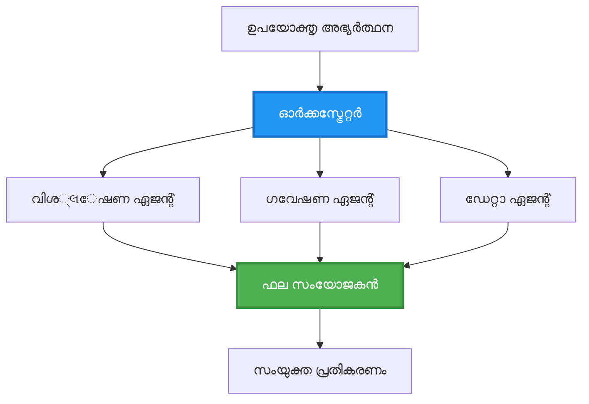
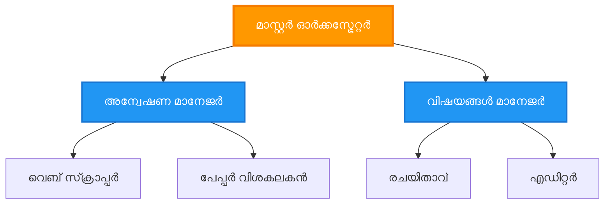
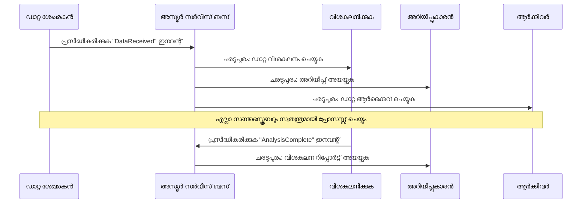
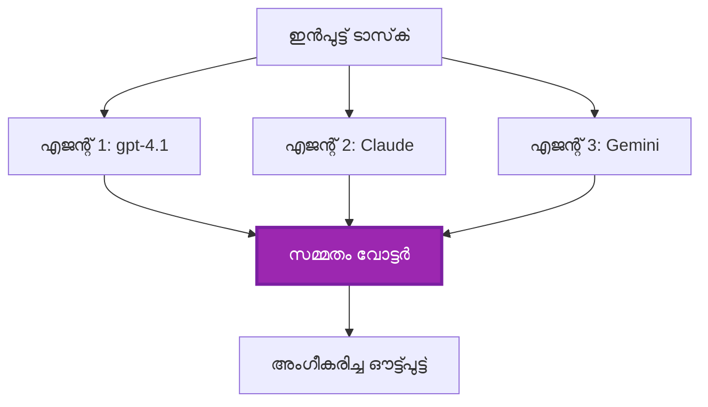
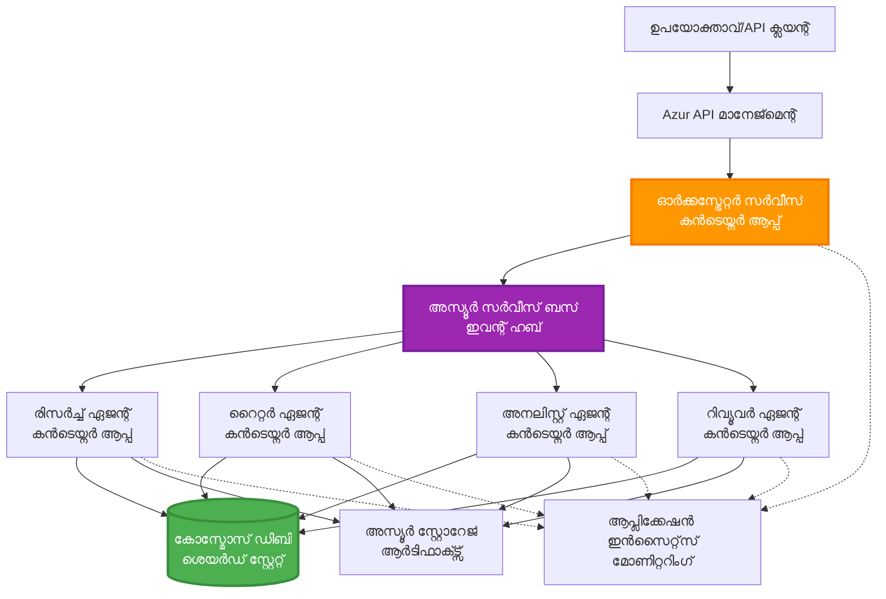

# മൾട്ടി-ഏജന്റ് കോർഡിനേഷൻ പാറ്റേണുകൾ

⏱️ **അനുമാനിച്ച സമയം**: 60-75 മിനിറ്റ് | 💰 **അനുമാനിച്ച ചെലവ്**: ~$100-300/മാസം | ⭐ **സങ്കീർണ്ണത**: അഡ്വാൻസ്ഡ്

**📚 ലേർണിംഗ് പാത:**
- ← മുമ്പ്: [Capacity Planning](capacity-planning.md) - റിസോഴ്‌സ് സൈസിംഗ് ആൻഡ് സ്‌കേലിങ് സ്ട്രാറ്റജീസ്
- 🎯 **നിങ്ങൾ ഇവിടെ**: മൾട്ടി-ഏജന്റ് കോർഡിനേഷൻ പാറ്റേണുകൾ (ഓർക്കസ്ട്രേഷൻ, കമ്മ്യൂണിക്കേഷൻ, സ്റ്റേറ്റ് മാനേജ്മെന്റ്)
- → അടുത്തത്: [SKU Selection](sku-selection.md) - ശരിയായ Azure സേവനങ്ങൾ തിരഞ്ഞെടുക്കൽ
- 🏠 [കോഴ്‌സ് ഹോം](../../README.md)

---

## നിങ്ങൾ പഠിക്കേണ്ടത്

ഈ പാഠം പൂർത്തിയാക്കിയാൽ, നിങ്ങൾ:
- **മൾട്ടി-ഏജന്റ് ആർക്കിടെക്ചർ** പാറ്റേണുകൾ മനസിലാക്കുകയും അവ ഉപയോഗിക്കേണ്ട സമയം തിരിച്ചറിയുകയും ചെയ്യും
- **ഓർക്കസ്ട്രേഷൻ പാറ്റേണുകൾ** നടപ്പിലാക്കും (സെൻട്രലൈസ്ഡ്, ഡിസെൻട്രലൈസ്ഡ്, ഹയർarchical)
- **ഏജന്റ് കമ്മ്യൂണിക്കേഷൻ** സ്ട്രാറ്റജികൾ രൂപകൽപ്പന നടത്തും (സിങ്ക്രോണസ്, അസിങ്ക്രോണസ്, ഇവന്റ്-ഡ്രിവൻ)
- വിതരിച്ച ഏജന്റുകൾക്കിടയിൽ **പങ്കിടപ്പെട്ട സ്റ്റേറ്റ്** മാനേജ് ചെയ്യും
- AZD ഉപയോഗിച്ച് **മൾട്ടി-ഏജന്റ് സിസ്റ്റങ്ങൾ** Azure-ൽ ഡിപ്ലോയ് ചെയ്യുക
- യാഥാർഥ്യ AI സാഹചര്യങ്ങൾക്ക് അനുയോജ്യമായ **കോര്ഡിനേഷൻ പാറ്റേണുകൾ** പ്രയോഗിക്കും
- വിതരിച്ച ഏജന്റ് സിസ്റ്റങ്ങൾ നിരീക്ഷിക്കുകയും ഡീബഗ് ചെയ്യുകയും ചെയ്യും

## മൾട്ടി-ഏജന്റ് കോർഡിനേഷൻ എതിനുവേണ്ടി പ്രധാനമാണ്

### വികാസം: ഒറ്റ ഏജന്റിൽ നിന്ന് മൾട്ടി-ഏജന്റിലേക്ക്

**ഒറ്റ ഏജന്റ് (സിമ്പിൾ):**
```
User → Agent → Response
```
- ✅ മനസിലാക്കാനും നടപ്പിലാക്കാനും എളുപ്പം
- ✅ ലളിതമായ ജോലികൾക്ക് വേഗത്തിൽ
- ❌ ഒറ്റ മോഡലിന്റെ ശേഷികളാൽ പരിമിതമാണ്
- ❌ സങ്കീർണ്ണ ജോലികൾ പാരലലായി ചെയ്യാൻ കഴിയില്ല
- ❌ പ്രത്യേകതയില്ല

**മൾട്ടി-ഏജന്റ് സിസ്റ്റം (അഡ്വാൻസ്ഡ്):**
```mermaid
graph TD
    Orchestrator[ഓർക്കസ്‌ട്രേറ്റർ] --> Agent1[ഏജന്റ്1<br/>പ്ലാൻ]
    Orchestrator --> Agent2[ഏജന്റ്2<br/>കോഡ്]
    Orchestrator --> Agent3[ഏജന്റ്3<br/>പരിശോധന]
```- ✅ പ്രത്യേക ജോലികൾക്കായി പ്രത്യേക ഏജന്റുകൾ
- ✅ വേഗത്തിനായി പാരലൽ എക്സിക്യൂഷൻ
- ✅ മോട്യൂളർ ആണും പരിപാലിക്കാവുന്നതും
- ✅ സങ്കീർണ്ണ പ്രവൃത്തിപദ്ധതികളിൽ മികച്ചത്
- ⚠️ കോർഡിനേഷൻ പ്രയോഗം ആവശ്യമാണ്

**ഉദാഹരണം**: ഒറ്റ ഏജന്റ് എല്ലാത്തൊഴിലുകളും ചെയ്യുന്ന ഒരാൾ പോലെ ആണ്. മൾട്ടി-ഏജന്റ് ഒരു ടീമിനെപ്പോലെ, ഓരോ അംഗത്തിനും പ്രത്യേക സമ്മർദ്ദങ്ങൾ (റിസർചർ, കോഡർ, റിവ്യൂവർ, റൈറ്റർ) ഉണ്ട്.

---

## പ്രധാന കോർഡിനേഷൻ പാറ്റേണുകൾ

### പാറ്റേൺ 1: ഓർഡറായ കോർഡിനേഷൻ (ചെയിൻ ഓഫ് റസ്പോൺസിബിലിറ്റി)

**എപ്പോൾ ഉപയോഗിക്കണം**: ജോലികൾ കൃത്യമായ ക്രമത്തിൽ പൂർത്തിയാക്കണം, ഓരോ ഏജന്റും മുൻപത്തെ ഔട്ട്പുട്ടിൽ അടിസ്ഥിതമാണ്.

```mermaid
sequenceDiagram
    participant User
    participant Orchestrator
    participant Agent1 as ഗവേഷണ ഏജന്റ്
    participant Agent2 as എഴുത്തുകാരൻ ഏജന്റ്
    participant Agent3 as എഡിറ്റർ ഏജന്റ്
    
    User->>Orchestrator: "എഐയെക്കുറിച്ചുള്ള ലേഖനം എഴുതുക"
    Orchestrator->>Agent1: വിഷയം ഗവേഷിക്കുക
    Agent1-->>Orchestrator: ഗവേഷണ ഫലങ്ങൾ
    Orchestrator->>Agent2: ഡ്രാഫ്റ്റ് എഴുതുക (ഗവേഷണം ഉപയോഗിച്ച്)
    Agent2-->>Orchestrator: ഡ്രാഫ്റ്റ് ലേഖനം
    Orchestrator->>Agent3: അറ്റകുറ്റപണികൾ ചെയ്ത് മെച്ചപ്പെടുത്തുക
    Agent3-->>Orchestrator: അന്തിമ ലേഖനം
    Orchestrator-->>User: പാളിഷ് ചെയ്ത ലേഖനം
    
    Note over User,Agent3: നിരന്തരമായി: ഓരോ ചുവടും മുന്‍തരം കഴിഞ്ഞു 
```
**നന്മകൾ:**
- ✅ വ്യക്തമായ ഡാറ്റ ഫ്ലോ
- ✅ ഡീബഗിംഗ് എളുപ്പം
- ✅ പ്രവൃത്തിയുടെ നിശ്ചിത ക്രമം

**പരിമിതികൾ:**
- ❌ മന്ദഗതിയുള്ളത് (പാരലലിഷം ഇല്ല)
- ❌ ഒരു പിഴവ് മുഴുവൻ ചൈനും തടഞ്ഞു
- ❌ പരസ്പരം ആശ്രിത ജോലികൾ കൈകാര്യം ചെയ്യാൻ കഴിയില്ല

**ഉദാഹരണ ഉപയോഗങ്ങൾ:**
- ഉള്ളടക്കം സൃഷ്ടിക്കൽ പൈപ്പ്ലൈൻ (റিসർച് → എഴുതൽ → എഡിറ്റ് → പ്രസരണം)
- കോഡ് സൃഷ്ടി (പ്ലാൻ → നടപ്പാക്കൽ → ടെസ്റ്റ് → ഡിപ്ലോയ്)
- റിപ്പോർട്ട് സൃഷ്ടി (ഡാറ്റ ശേഖരം → വിശകലനം → കാഴ്ചവത്കരണം → സാരാംശം)

---

### പാറ്റേൺ 2: പാരലൽ കോർഡിനേഷൻ (ഫാൻ-ഔട്ട്/ഫൻ-ഇൻ)

**എപ്പോൾ ഉപയോഗിക്കണം**: സ്വതന്ത്ര ജോലികൾ ഒപ്പം നടന്നേക്കും, ഫലങ്ങൾ അവസാനം സംയോജിപ്പിക്കും.


**നന്മകൾ:**
- ✅ വേഗത (പാരലൽ എക്സിക്യൂഷൻ)
- ✅ ദോഷനിവാരണശേഷി (പാർഷ്യൽ ഫലങ്ങൾ അംഗീകരിക്കാവുന്നതാണ്)
- ✅ ഹോറിസോണ്ടൽ സ്‌കേലം

**പരിമിതികൾ:**
- ⚠️ ഫലങ്ങൾ ക്രമത്തിലല്ലാതെ എത്താം
- ⚠️ സംയോജിപ്പിക്കൽ തന്ത്രങ്ങൾ ആവശ്യം
- ⚠️ സങ്കീർണ്ണമായ സ്റ്റേറ്റ് മാനേജ്മെന്റ്

**ഉദാഹരണ ഉപയോഗങ്ങൾ:**
- മൾട്ടി-സോഴ്‌സു ഡാറ്റ ശേഖരം (APIs + ഡാറ്റാബേസുകൾ + വെബ് സ്ക്രാപ്പിംഗ്)
- മത്സരം വിശകലനം (പല മോഡലുകളും പരിഹാരങ്ങൾ സൃഷ്ടിക്കുന്നു, മികച്ചത് തിരഞ്ഞെടുക്കപ്പെടുന്നു)
- വിവർത്തന സേവനങ്ങൾ (ഒന്ന് വര്ഷവും ഒരേസമയം നിരവധി ഭാഷകളിലേക്ക്)

---

### പാറ്റേൺ 3: ഹയർarchical കോർഡിനേഷൻ (മാനേജർ-വർകർ)

**എപ്പോൾ ഉപയോഗിക്കണം**: സങ്കീർണ്ണ പ്രവൃത്തിപദ്ധതികളിൽ ഉപജോലികൾ, നിയോജനം ആവശ്യമായപ്പോൾ.


**നന്മകൾ:**
- ✅ സങ്കീർണ്ണ പ്രവൃത്തിപദ്ധതികൾ കൈകാര്യം ചെയ്യുന്നു
- ✅ മോട്യൂളർ ആണും പരിപാലിക്കാവുന്നതും
- ✅ വ്യക്തമായ ഉത്തരവാദിത്ത പരിധികൾ

**പരിമിതികൾ:**
- ⚠️ കൂടുതൽ സങ്കീർണ്ണ ആർക്കിടെക്ചർ
- ⚠️ ഉയർന്ന ലാറ്റൻസി (പല കോർഡിനേഷൻ നിലകൾ)
- ⚠️ ആസൂത്രിത ഓർകസ്‌ട്രേഷൻ ആവശ്യമാണ്

**ഉദാഹരണ ഉപയോഗങ്ങൾ:**
- എന്റർപ്രൈസ് ഡോക്യുമെന്റ് പ്രോസസ്സിംഗ് (ജാതികരണം → റൂട്ടിംഗ് → പ്രോസസ്സിംഗ് → ആർക്കൈവുകൾ)
- മൾട്ടി-സ്റ്റേജ് ഡാറ്റ പൈപ്പ്ലൈനുകൾ (ഇൻജസ്റ്റ് → ക്ലീൻ → ട്രാൻസ്ഫോം → വിഭാഗീകരണം → റിപ്പോർട്ട്)
- സങ്കീർണ്ണ ഓട്ടോമേഷൻ പ്രവൃത്തിപദ്ധതികൾ (അസൂത്രണം → റിസോഴ്‌സ് അലോക്കേഷൻ → നടപ്പാക്കൽ → മോണിറ്ററിംഗ്)

---

### പാറ്റേൺ 4: ഇവന്റ്-ഡ്രിവൻ കോർഡിനേഷൻ (പബ്ലിഷ്-സബ്‌സ്‌ക്രൈബ്)

**എപ്പോൾ ഉപയോഗിക്കണം**: ഏജന്റുകൾ ഇവന്റുകൾക്ക് പ്രതികരിക്കണം, ലൂസ് കപ്പ്ലിംഗ് വേണം.


**നന്മകൾ:**
- ✅ ഏജന്റുകൾക്കിടയിലെ ലൂസ് കപ്പ്ലിംഗ്
- ✅ പുതിയ ഏജന്റുകൾ ചേർക്കാൻ എളുപ്പം (സബ്സ്ക്രൈബ് മാത്രം ചെയ്യുക)
- ✅ അസിങ്ക്രോണസ് പ്രോസസ്സിംഗ്
- ✅ ദൃഢത (മെസേജ് പെർമിസ്റ്റൻസ്)

**പരിമിതികൾ:**
- ⚠️ അവസാനം ഒരു സമവായം
- ⚠️ സങ്കീർണ്ണമായ ഡീബഗിംഗ്
- ⚠️ മെസേജ് ഓർഡർ പ്രശ്നങ്ങൾ

**ഉദാഹരണ ഉപയോഗങ്ങൾ:**
- റിയൽ-ടൈം മോണിറ്ററിംഗ് സിസ്റ്റങ്ങൾ (അലർട്ടുകൾ, ഡാഷ്ബോർഡുകൾ, ലോഗുകൾ)
- മൾട്ടി-ചാനൽ അറിയിപ്പുകൾ (ഇമെയിൽ, SMS, പുഷ്,Slack)
- ഡാറ്റ പ്രോസസ്സിംഗ് പൈപ്പ്ലൈനുകൾ (ഒരു ഡാറ്റയുടെ മൾട്ടി കൺസ്യൂമർസ്)

---

### പാറ്റേൺ 5: കോണ്‍സെൻസസ്-ബേസഡ് കോർഡിനേഷൻ (വോട്ടിങ്/ക്വോറം)

**എപ്പോൾ ഉപയോഗിക്കണം**: മുന്നോട്ട് പോകാൻ മുമ്പ് നിരവധി ഏജന്റുകളിൽ നിന്ന് സമ്മതമാകണം.


**നന്മകൾ:**
- ✅ ഉയർന്ന കൃത്യത (പല അഭിപ്രായങ്ങൾ)
- ✅ ദോഷനിവാരണശേഷി (മൈനോറിറ്റി ഫെയ്ല്യറുകൾ അംഗീകരിക്കാവുന്നതാണ്)
- ✅ ക്വാളിറ്റി അഷുറൻസ് ഉൾക്കൊള്ളുന്നു

**പരിമിതികൾ:**
- ❌ ചെലവേറിയത് (പല മോഡൽ കോളുകൾ)
- ❌ മന്ദഗതിയുള്ളത് (എല്ലാ ഏജന്റുകളും കാത്തിരിക്കണം)
- ⚠️ സംഘർഷ പരിഹാരവും വേണം

**ഉദാഹരണ ഉപയോഗങ്ങൾ:**
- ഉള്ളടക്കം മാനേജ്‌മെന്റ് (പല മോഡലുകളും ഉള്ളടക്കം റിവ്യൂ ചെയ്‌യുന്നു)
- കോഡ് റിവ്യൂ (പല ലിന്റേഴ്‌സ്/അനലൈസേഴ്‌സ്)
- മെഡിക്കൽ ഡയഗ്നോസിസ് (പല AI മോഡലുകൾ, വിദഗ്ദ്ധ പരിശോധന)

---

## ആർക്കിടെക്ചർ അവലോകനം

### Azure-ൽ പൂര്‍ത്തിയായ മൾട്ടി-ഏജന്റ് സിസ്റ്റം


**പ്രധാനഘടകങ്ങൾ:**

| ഘടകം | ലക്ഷ്യം | Azure സേവനം |
|-----------|---------|---------------|
| **API ഗേറ്റ്‌വേ** | പ്രവേശന പോയിന്റ്, റേറ്റ് ലിമിറ്റിംഗ്,auth | API Management |
| **ഓർക്കസ്‌ട്രേറ്റർ** | ഏജന്റ് പ്രവൃത്തിപദ്ധതികൾ കോർഡിനേറ്റ് ചെയ്യുക | Container Apps |
| **മെസേജ് ക്യുവി** | അസിങ്ക്രോണസ് കമ്മ്യൂണിക്കേഷൻ | Service Bus / Event Hubs |
| **ഏജന്റുകൾ** | പ്രത്യേക AI വർകർ | Container Apps / Functions |
| **സ്റ്റേറ്റ് സ്റ്റോർ** | പങ്കിടപ്പെട്ട സ്റ്റേറ്റ്, ജോലി ട്രാക്കിംഗ് | Cosmos DB |
| **ആർട്ടിഫാക്ട് സ്റ്റോറേജ്** | ഡോക്യുമെന്റുകൾ, ഫലങ്ങൾ, ലോഗുകൾ | Blob Storage |
| **മോണിറ്ററിംഗ്** | വിതരിച്ച ട്രേസിംഗ്, ലോഗുകൾ | Application Insights |

---

## മുൻകൂറായി വേണം

### ആവശ്യമായ ഉപകരണങ്ങൾ

```bash
# ആസ്യൂർ ഡെവലപ്പർ CLI സ്ഥിരീകരിക്കുക
azd version
# ✅ പ്രതീക്ഷിച്ചത്: azd പതിപ്പ് 1.0.0 അല്ലെങ്കിൽ ഉയരം

# ആസ്യൂർ CLI സ്ഥിരീകരിക്കുക
az --version
# ✅ പ്രതീക്ഷിച്ചത്: azure-cli 2.50.0 അല്ലെങ്കിൽ ഉയരം

# Docker സ്ഥിരീകരിക്കുക (പ്രാദേശിക പരിശോധനയ്ക്കായി)
docker --version
# ✅ പ്രതീക്ഷിച്ചത്: Docker പതിപ്പ് 20.10 അല്ലെങ്കിൽ ഉയരം
```

### Azure ആവശ്യകതകൾ

- സജീവ Azure സബ്സ്ക്രിപ്ഷൻ
- സൃഷ്ടിക്കാനുള്ള അനുമതികൾ:
  - Container Apps
  - Service Bus namespaceകൾ
  - Cosmos DB അക്കൗണ്ടുകൾ
  - Storage അക്കൗണ്ടുകൾ
  - Application Insights

### അറിവ് മുൻ‌തയ്യാറുകൾ

നിങ്ങൾ പൂർത്തിയാക്കിയിരിക്കേണ്ടത്:
- [Configuration Management](../chapter-03-configuration/configuration.md)
- [Authentication & Security](../chapter-03-configuration/authsecurity.md)
- [Microservices Example](../../../../examples/microservices)

---

## നടപ്പിലാക്കൽ ഒരു ഗൈഡ്

### പ്രോജക്ട് ഘടന

```
multi-agent-system/
├── azure.yaml                    # AZD configuration
├── infra/
│   ├── main.bicep               # Main infrastructure
│   ├── core/
│   │   ├── servicebus.bicep     # Message queue
│   │   ├── cosmos.bicep         # State store
│   │   ├── storage.bicep        # Artifact storage
│   │   └── monitoring.bicep     # Application Insights
│   └── app/
│       ├── orchestrator.bicep   # Orchestrator service
│       └── agent.bicep          # Agent template
└── src/
    ├── orchestrator/            # Orchestration logic
    │   ├── app.py
    │   ├── workflows.py
    │   └── Dockerfile
    ├── agents/
    │   ├── research/            # Research agent
    │   ├── writer/              # Writer agent
    │   ├── analyst/             # Analyst agent
    │   └── reviewer/            # Reviewer agent
    └── shared/
        ├── state_manager.py     # Shared state logic
        └── message_handler.py   # Message handling
```

---

## പാഠം 1: ഓർഡറായ കോർഡിനേഷൻ പാറ്റേൺ

### നടപ്പിലാക്കൽ: ഉള്ളടക്കം സൃഷ്ടിക്കൽ പൈപ്പ്ലൈൻ

നമുക്ക് ഒരു ഓർഡറായ പൈപ്പ്ലൈൻ നിർമ്മിക്കുക: റിസർച് → എഴുതൽ → എഡിറ്റ് → പ്രസരണം

### 1. AZD കോൺഫിഗറേഷൻ

**ഫയൽ: `azure.yaml`**

```yaml
name: content-pipeline
metadata:
  template: multi-agent-sequential@1.0.0

services:
  orchestrator:
    project: ./src/orchestrator
    language: python
    host: containerapp
  
  research-agent:
    project: ./src/agents/research
    language: python
    host: containerapp
  
  writer-agent:
    project: ./src/agents/writer
    language: python
    host: containerapp
  
  editor-agent:
    project: ./src/agents/editor
    language: python
    host: containerapp
```

### 2. ഇൻഫ്രാസ്ട്രക്ചർ: കോർഡിനേഷനായി സർവീസ് ബസ്

**ഫയൽ: `infra/core/servicebus.bicep`**

```bicep
param name string
param location string
param tags object = {}

resource serviceBusNamespace 'Microsoft.ServiceBus/namespaces@2022-10-01-preview' = {
  name: name
  location: location
  tags: tags
  sku: {
    name: 'Standard'
    tier: 'Standard'
  }
  properties: {
    minimumTlsVersion: '1.2'
  }
}

// Queue for orchestrator → research agent
resource researchQueue 'Microsoft.ServiceBus/namespaces/queues@2022-10-01-preview' = {
  parent: serviceBusNamespace
  name: 'research-tasks'
  properties: {
    maxDeliveryCount: 3
    lockDuration: 'PT5M'
    deadLetteringOnMessageExpiration: true
  }
}

// Queue for research agent → writer agent
resource writerQueue 'Microsoft.ServiceBus/namespaces/queues@2022-10-01-preview' = {
  parent: serviceBusNamespace
  name: 'writer-tasks'
  properties: {
    maxDeliveryCount: 3
    lockDuration: 'PT5M'
  }
}

// Queue for writer agent → editor agent
resource editorQueue 'Microsoft.ServiceBus/namespaces/queues@2022-10-01-preview' = {
  parent: serviceBusNamespace
  name: 'editor-tasks'
  properties: {
    maxDeliveryCount: 3
    lockDuration: 'PT5M'
  }
}

output namespace string = serviceBusNamespace.name
output connectionString string = listKeys('${serviceBusNamespace.id}/AuthorizationRules/RootManageSharedAccessKey', serviceBusNamespace.apiVersion).primaryConnectionString
```

### 3. പങ്കിട്ട സ്റ്റേറ്റ് മാനേജർ

**ഫയൽ: `src/shared/state_manager.py`**

```python
from azure.cosmos import CosmosClient, PartitionKey
from datetime import datetime
import os

class StateManager:
    """Manages shared state across agents using Cosmos DB"""
    
    def __init__(self):
        endpoint = os.environ['COSMOS_ENDPOINT']
        key = os.environ['COSMOS_KEY']
        
        self.client = CosmosClient(endpoint, key)
        self.database = self.client.get_database_client('agent-state')
        self.container = self.database.get_container_client('tasks')
    
    def create_task(self, task_id: str, task_type: str, input_data: dict):
        """Create a new task"""
        task = {
            'id': task_id,
            'type': task_type,
            'status': 'pending',
            'input': input_data,
            'created_at': datetime.utcnow().isoformat(),
            'steps': []
        }
        self.container.create_item(task)
        return task
    
    def update_task_step(self, task_id: str, step_name: str, result: dict):
        """Update task with completed step"""
        task = self.container.read_item(task_id, partition_key=task_id)
        
        task['steps'].append({
            'name': step_name,
            'completed_at': datetime.utcnow().isoformat(),
            'result': result
        })
        
        self.container.replace_item(task_id, task)
        return task
    
    def complete_task(self, task_id: str, final_result: dict):
        """Mark task as complete"""
        task = self.container.read_item(task_id, partition_key=task_id)
        task['status'] = 'completed'
        task['result'] = final_result
        task['completed_at'] = datetime.utcnow().isoformat()
        self.container.replace_item(task_id, task)
        return task
    
    def get_task(self, task_id: str):
        """Retrieve task state"""
        return self.container.read_item(task_id, partition_key=task_id)
```

### 4. ഓർക്കസ്‌ട്രേറ്റർ സർവീസ്

**ഫയൽ: `src/orchestrator/app.py`**

```python
from flask import Flask, request, jsonify
from azure.servicebus import ServiceBusClient, ServiceBusMessage
import json
import uuid
import os
from shared.state_manager import StateManager

app = Flask(__name__)
state_manager = StateManager()

# സർവീസ് ബസ് കണക്ഷൻ
servicebus_connection_str = os.environ['SERVICEBUS_CONNECTION_STRING']
servicebus_client = ServiceBusClient.from_connection_string(servicebus_connection_str)

@app.route('/health', methods=['GET'])
def health():
    return jsonify({'status': 'healthy', 'service': 'orchestrator'})

@app.route('/create-content', methods=['POST'])
def create_content():
    """
    Sequential workflow: Research → Write → Edit → Publish
    """
    data = request.json
    topic = data.get('topic')
    
    if not topic:
        return jsonify({'error': 'Topic required'}), 400
    
    # സ്റ്റേറ്റ് സ്റ്റോറിൽ ടാസ്‌ക്ക് സൃഷ്‌ടിക്കുക
    task_id = str(uuid.uuid4())
    task = state_manager.create_task(
        task_id=task_id,
        task_type='content_creation',
        input_data={'topic': topic}
    )
    
    # റിസർച് ഏജന്റിന് സന്ദേശം അയയ്ക്കുക (ആദ്യ ബടക്കം)
    sender = servicebus_client.get_queue_sender('research-tasks')
    message = ServiceBusMessage(
        body=json.dumps({
            'task_id': task_id,
            'topic': topic,
            'next_queue': 'writer-tasks'  # ഫലങ്ങൾ എവിടെ അയയ്ക്കണം
        }),
        content_type='application/json'
    )
    
    with sender:
        sender.send_messages(message)
    
    return jsonify({
        'task_id': task_id,
        'status': 'started',
        'workflow': 'sequential',
        'steps': ['research', 'write', 'edit', 'publish'],
        'message': 'Content creation pipeline initiated'
    }), 202

@app.route('/task/<task_id>', methods=['GET'])
def get_task_status(task_id):
    """Check task status"""
    try:
        task = state_manager.get_task(task_id)
        return jsonify(task)
    except Exception as e:
        return jsonify({'error': str(e)}), 404

if __name__ == '__main__':
    app.run(host='0.0.0.0', port=8080)
```

### 5. റിസർച് ഏജന്റ്

**ഫയൽ: `src/agents/research/app.py`**

```python
from azure.servicebus import ServiceBusClient, ServiceBusMessage
from openai import AzureOpenAI
import json
import os
import time
from shared.state_manager import StateManager

# ക്ലയന്റ്മാരെ ആരംഭിക്കുക
state_manager = StateManager()
servicebus_client = ServiceBusClient.from_connection_string(
    os.environ['SERVICEBUS_CONNECTION_STRING']
)

openai_client = AzureOpenAI(
    api_key=os.environ['AZURE_OPENAI_API_KEY'],
    api_version="2024-02-01",
    azure_endpoint=os.environ['AZURE_OPENAI_ENDPOINT']
)

def process_research_task(message_data):
    """Process research request and pass to writer"""
    task_id = message_data['task_id']
    topic = message_data['topic']
    next_queue = message_data['next_queue']
    
    print(f"🔬 Researching: {topic}")
    
    # ഗവേഷണത്തിനായി Microsoft Foundry മോഡലുകൾ വിളിക്കുക
    response = openai_client.chat.completions.create(
        model="gpt-4.1",
        messages=[
            {"role": "system", "content": "You are a research assistant. Provide comprehensive research on the given topic."},
            {"role": "user", "content": f"Research this topic thoroughly: {topic}"}
        ],
        max_tokens=1500
    )
    
    research_results = response.choices[0].message.content
    
    # നില അപ്ഡേറ്റ് ചെയ്യുക
    state_manager.update_task_step(
        task_id=task_id,
        step_name='research',
        result={'research': research_results}
    )
    
    # അടുത്ത ഏജന്റിനോട് (രചയിതാവിന്) അയയ്‌ക്കുക
    sender = servicebus_client.get_queue_sender(next_queue)
    message = ServiceBusMessage(
        body=json.dumps({
            'task_id': task_id,
            'topic': topic,
            'research': research_results,
            'next_queue': 'editor-tasks'
        }),
        content_type='application/json'
    )
    
    with sender:
        sender.send_messages(message)
    
    print(f"✅ Research complete for task {task_id}")

def main():
    """Listen to research queue"""
    receiver = servicebus_client.get_queue_receiver('research-tasks')
    
    print("🔬 Research Agent started, listening for tasks...")
    
    with receiver:
        while True:
            messages = receiver.receive_messages(max_wait_time=5)
            for message in messages:
                try:
                    message_data = json.loads(str(message))
                    process_research_task(message_data)
                    receiver.complete_message(message)
                except Exception as e:
                    print(f"❌ Error processing message: {e}")
                    receiver.abandon_message(message)

if __name__ == '__main__':
    main()
```

### 6. റൈറ്റർ ഏജന്റ്

**ഫയൽ: `src/agents/writer/app.py`**

```python
from azure.servicebus import ServiceBusClient, ServiceBusMessage
from openai import AzureOpenAI
import json
import os
from shared.state_manager import StateManager

state_manager = StateManager()
servicebus_client = ServiceBusClient.from_connection_string(
    os.environ['SERVICEBUS_CONNECTION_STRING']
)

openai_client = AzureOpenAI(
    api_key=os.environ['AZURE_OPENAI_API_KEY'],
    api_version="2024-02-01",
    azure_endpoint=os.environ['AZURE_OPENAI_ENDPOINT']
)

def process_writing_task(message_data):
    """Write article based on research"""
    task_id = message_data['task_id']
    topic = message_data['topic']
    research = message_data['research']
    next_queue = message_data['next_queue']
    
    print(f"✍️ Writing article: {topic}")
    
    # ലേഖനം എഴുതാൻ മൈക്രോസോഫ്റ്റ് ഫൗണ്ട്രി മോഡലുകൾ കോളുചെയ്യുക
    response = openai_client.chat.completions.create(
        model="gpt-4.1",
        messages=[
            {"role": "system", "content": "You are a professional writer. Write engaging, well-structured articles."},
            {"role": "user", "content": f"Based on this research:\n\n{research}\n\nWrite a comprehensive article about: {topic}"}
        ],
        max_tokens=2000
    )
    
    article_draft = response.choices[0].message.content
    
    # സ്റ്റേറ്റ് അപ്ഡേറ്റ് ചെയ്യുക
    state_manager.update_task_step(
        task_id=task_id,
        step_name='writing',
        result={'draft': article_draft}
    )
    
    # എഡിറ്ററിലേക്ക് അയയ്‌ക്കുക
    sender = servicebus_client.get_queue_sender(next_queue)
    message = ServiceBusMessage(
        body=json.dumps({
            'task_id': task_id,
            'topic': topic,
            'draft': article_draft
        }),
        content_type='application/json'
    )
    
    with sender:
        sender.send_messages(message)
    
    print(f"✅ Article draft complete for task {task_id}")

def main():
    """Listen to writer queue"""
    receiver = servicebus_client.get_queue_receiver('writer-tasks')
    
    print("✍️ Writer Agent started, listening for tasks...")
    
    with receiver:
        while True:
            messages = receiver.receive_messages(max_wait_time=5)
            for message in messages:
                try:
                    message_data = json.loads(str(message))
                    process_writing_task(message_data)
                    receiver.complete_message(message)
                except Exception as e:
                    print(f"❌ Error: {e}")
                    receiver.abandon_message(message)

if __name__ == '__main__':
    main()
```

### 7. എഡിറ്റർ ഏജന്റ്

**ഫയൽ: `src/agents/editor/app.py`**

```python
from azure.servicebus import ServiceBusClient
from openai import AzureOpenAI
import json
import os
from shared.state_manager import StateManager

state_manager = StateManager()
servicebus_client = ServiceBusClient.from_connection_string(
    os.environ['SERVICEBUS_CONNECTION_STRING']
)

openai_client = AzureOpenAI(
    api_key=os.environ['AZURE_OPENAI_API_KEY'],
    api_version="2024-02-01",
    azure_endpoint=os.environ['AZURE_OPENAI_ENDPOINT']
)

def process_editing_task(message_data):
    """Edit and finalize article"""
    task_id = message_data['task_id']
    topic = message_data['topic']
    draft = message_data['draft']
    
    print(f"📝 Editing article: {topic}")
    
    # എഡിറ്റ് ചെയ്യാൻ മൈക്രോസോഫ്റ്റ് ഫൗണ്ടറി മോഡലുകളെ വിളിക്കുക
    response = openai_client.chat.completions.create(
        model="gpt-4.1",
        messages=[
            {"role": "system", "content": "You are an expert editor. Improve grammar, clarity, and structure."},
            {"role": "user", "content": f"Edit and improve this article:\n\n{draft}"}
        ],
        max_tokens=2000
    )
    
    final_article = response.choices[0].message.content
    
    # ടാസ്‌ക് പൂർത്തിയായി എന്ന് സാദ്ധ്യമാക്കുക
    state_manager.complete_task(
        task_id=task_id,
        final_result={
            'topic': topic,
            'final_article': final_article,
            'word_count': len(final_article.split())
        }
    )
    
    print(f"✅ Article finalized for task {task_id}")

def main():
    """Listen to editor queue"""
    receiver = servicebus_client.get_queue_receiver('editor-tasks')
    
    print("📝 Editor Agent started, listening for tasks...")
    
    with receiver:
        while True:
            messages = receiver.receive_messages(max_wait_time=5)
            for message in messages:
                try:
                    message_data = json.loads(str(message))
                    process_editing_task(message_data)
                    receiver.complete_message(message)
                except Exception as e:
                    print(f"❌ Error: {e}")
                    receiver.abandon_message(message)

if __name__ == '__main__':
    main()
```

### 8. ഡിപ്ലോയ് ചെയ്ത് ടെസ്റ്റ് ചെയ്യുക

```bash
# ഓപ്ഷൻ എ: ടെംപ്ലേറ്റ് അടിസ്ഥാനമാക്കിയുള്ള വിന്യാസം
azd init
azd up

# ഓപ്ഷൻ ബി: ഏജന്റ് മാനിഫസ്റ്റ് വിന്യാസം (വिस्तാരണം ആവശ്യമുണ്ട്)
azd extension install azure.ai.agents
azd ai agent init -m agent-manifest.yaml
azd up
```

> മുഴുവൻ `azd ai` ഫ്ലാഗുകളും ഓപ്ഷനുകളും കാണാൻ [AZD AI CLI Commands](../chapter-08-production/production-ai-practices.md#azd-ai-cli-commands-and-extensions) കാണുക.

```bash
# ഓർക്കസ്ട്രേറ്റർ URL നേടുക
ORCHESTRATOR_URL=$(azd env get-values | grep ORCHESTRATOR_URL | cut -d '=' -f2 | tr -d '"')

# ഉള്ളടക്കം സൃഷ്‌ടിക്കുക
curl -X POST $ORCHESTRATOR_URL/create-content \
  -H "Content-Type: application/json" \
  -d '{"topic": "The Future of AI in Healthcare"}'
```

**✅ പ്രതീക്ഷിക്കാവുന്ന ഔട്ട്പുട്ട്:**
```json
{
  "task_id": "a1b2c3d4-e5f6-7890-abcd-ef1234567890",
  "status": "started",
  "workflow": "sequential",
  "steps": ["research", "write", "edit", "publish"],
  "message": "Content creation pipeline initiated"
}
```

**ജോലി പുരോഗതി പരിശോധിച്ചു:**
```bash
TASK_ID="a1b2c3d4-e5f6-7890-abcd-ef1234567890"
curl $ORCHESTRATOR_URL/task/$TASK_ID
```

**✅ പ്രതീക്ഷിക്കാവുന്ന ഔട്ട്പുട്ട് (പൂർത്തിയായി):**
```json
{
  "id": "a1b2c3d4-e5f6-7890-abcd-ef1234567890",
  "type": "content_creation",
  "status": "completed",
  "steps": [
    {
      "name": "research",
      "completed_at": "2025-11-19T10:30:00Z",
      "result": {"research": "..."}
    },
    {
      "name": "writing",
      "completed_at": "2025-11-19T10:32:00Z",
      "result": {"draft": "..."}
    }
  ],
  "result": {
    "topic": "The Future of AI in Healthcare",
    "final_article": "...",
    "word_count": 1500
  }
}
```

---

## പാഠം 2: പാരലൽ കോർഡിനേഷൻ പാറ്റേൺ

### നടപ്പിലാക്കൽ: മൾട്ടി-സോഴ്‌സ് റിസർച് ആഗ്രിഗേറ്റർ

ഒത്തുചേരുന്നതായി ഒരേസമയം നിരവധി സ്രോതസുകളിൽ നിന്ന് വിവരങ്ങൾ ശേഖരിക്കുന്ന ഒരു പാരലൽ സിസ്റ്റം നിർമ്മിക്കാം.

### പാരലൽ ഓർക്കസ്‌ട്രേറ്റർ

**ഫയൽ: `src/orchestrator/parallel_workflow.py`**

```python
from flask import Flask, request, jsonify
from azure.servicebus import ServiceBusClient, ServiceBusMessage
import json
import uuid
import os
from shared.state_manager import StateManager

app = Flask(__name__)
state_manager = StateManager()

servicebus_client = ServiceBusClient.from_connection_string(
    os.environ['SERVICEBUS_CONNECTION_STRING']
)

@app.route('/research-parallel', methods=['POST'])
def research_parallel():
    """
    Parallel workflow: Multiple agents work simultaneously
    """
    data = request.json
    query = data.get('query')
    
    task_id = str(uuid.uuid4())
    task = state_manager.create_task(
        task_id=task_id,
        task_type='parallel_research',
        input_data={
            'query': query,
            'agents': ['web', 'academic', 'news', 'social']
        }
    )
    
    # ഫാൻ-ഔട്ട്: എല്ലാ ഏജന്റുകൾക്കും ഒരേസമയം അയയ്ക്കുക
    agents = [
        ('web-research-queue', 'web'),
        ('academic-research-queue', 'academic'),
        ('news-research-queue', 'news'),
        ('social-research-queue', 'social')
    ]
    
    for queue_name, agent_type in agents:
        sender = servicebus_client.get_queue_sender(queue_name)
        message = ServiceBusMessage(
            body=json.dumps({
                'task_id': task_id,
                'query': query,
                'agent_type': agent_type,
                'result_queue': 'aggregation-queue'
            }),
            content_type='application/json'
        )
        
        with sender:
            sender.send_messages(message)
    
    return jsonify({
        'task_id': task_id,
        'status': 'started',
        'workflow': 'parallel',
        'agents_dispatched': 4,
        'message': 'Parallel research initiated'
    }), 202

if __name__ == '__main__':
    app.run(host='0.0.0.0', port=8080)
```

### ആഗ്രിഗേഷൻ ലജിക്

**ഫയൽ: `src/agents/aggregator/app.py`**

```python
from azure.servicebus import ServiceBusClient
import json
import os
from collections import defaultdict
from shared.state_manager import StateManager

state_manager = StateManager()
servicebus_client = ServiceBusClient.from_connection_string(
    os.environ['SERVICEBUS_CONNECTION_STRING']
)

# ഓരോ ടാസ്കിനും ഫലം ട്രാക്ക് ചെയ്യുക
task_results = defaultdict(list)
expected_agents = 4  # വെബ്, അക്കാദമിക്, ന്യൂസ്, സോഷ്യൽ

def process_result(message_data):
    """Aggregate results from parallel agents"""
    task_id = message_data['task_id']
    agent_type = message_data['agent_type']
    result = message_data['result']
    
    # ഫലം സേവ് ചെയ്യുക
    task_results[task_id].append({
        'agent': agent_type,
        'data': result
    })
    
    print(f"📊 Received result from {agent_type} agent ({len(task_results[task_id])}/{expected_agents})")
    
    # എല്ലാം ഏജന്റുമാർ പൂർത്തിയാക്കിയിട്ടുണ്ടോയെന്ന് പരിശോധിക്കുക (ഫാൻ-ഇൻ)
    if len(task_results[task_id]) == expected_agents:
        print(f"✅ All agents completed for task {task_id}. Aggregating...")
        
        # ഫലങ്ങൾ സംയോജിപ്പിക്കുക
        aggregated = {
            'query': message_data['query'],
            'sources': task_results[task_id],
            'summary': generate_summary(task_results[task_id])
        }
        
        # പൂർത്തിയായി എന്ന് അടയാളപ്പെടുത്തുക
        state_manager.complete_task(task_id, aggregated)
        
        # ശുചിത്വം നടത്തുക
        del task_results[task_id]
        
        print(f"✅ Aggregation complete for task {task_id}")

def generate_summary(results):
    """Generate summary from all sources"""
    summaries = [r['data'].get('summary', '') for r in results]
    return '\n\n'.join(summaries)

def main():
    """Listen to aggregation queue"""
    receiver = servicebus_client.get_queue_receiver('aggregation-queue')
    
    print("📊 Aggregator started, listening for results...")
    
    with receiver:
        while True:
            messages = receiver.receive_messages(max_wait_time=5)
            for message in messages:
                try:
                    message_data = json.loads(str(message))
                    process_result(message_data)
                    receiver.complete_message(message)
                except Exception as e:
                    print(f"❌ Error: {e}")
                    receiver.abandon_message(message)

if __name__ == '__main__':
    main()
```

**പാരലൽ പാറ്റേണിന്റെ നന്മകൾ:**
- ⚡ **4 എണ്ണം വേഗം** (ഏജന്റുകൾ ഒറ്റത്തവണ പ്രവർത്തിക്കുന്നു)
- 🔄 **ദോഷനിവാരണശേഷി** (പാർഷ്യൽ ഫലങ്ങൾ അംഗീകരിക്കാം)
- 📈 **സ്കേലബിള്** (ഇളക്കം കൂടാതെ ഏജന്റുകൾ ചേർക്കാം)

---

## പ്രായോഗിക അഭ്യാസങ്ങൾ

### അഭ്യാസം 1: ടൈംഔട്ട് കൈകാര്യം ചെയ്യൽ ചേർക്കുക ⭐⭐ (മധ്യമം)

**ലക്ഷ്യം**: മന്ദഗതിയുള്ള ഏജന്റുകൾക്ക് വേണ്ടി ആഗ്രിഗേറ്റർ അങ്ങേയറ്റം കാത്തിരിക്കാൻ പാടുള്ളതല്ലാത്ത ടൈംഔട്ട് ലജിക് നടപ്പിലാക്കുക.

**പടികൾ**:

1. **ആഗ്രിഗേറ്ററിൽ ടൈംഔട്ട് ട്രാക്കിംഗ് ചേർക്കുക:**

```python
from datetime import datetime, timedelta

task_timeouts = {}  # task_id -> കാലഹരണ തീയതി

def process_result(message_data):
    task_id = message_data['task_id']
    
    # ആദ്യ ഫലം ലഭിച്ചപ്പോൾ ടൈംഔട്ട് സജ്ജമാക്കുക
    if task_id not in task_timeouts:
        task_timeouts[task_id] = datetime.utcnow() + timedelta(seconds=30)
    
    task_results[task_id].append({
        'agent': message_data['agent_type'],
        'data': message_data['result']
    })
    
    # പൂർത്തിയായതോ ടൈംഔട്ട് സംഭവിച്ചോ എന്ന് പരിശോധിക്കുക
    if len(task_results[task_id]) == expected_agents or \
       datetime.utcnow() > task_timeouts[task_id]:
        
        print(f"📊 Aggregating with {len(task_results[task_id])}/{expected_agents} results")
        
        aggregated = {
            'query': message_data['query'],
            'sources': task_results[task_id],
            'completed_agents': len(task_results[task_id]),
            'timed_out': len(task_results[task_id]) < expected_agents
        }
        
        state_manager.complete_task(task_id, aggregated)
        
        # ശുചീകരണം
        del task_results[task_id]
        del task_timeouts[task_id]
```

2. **കൃത്രിമ ജഡതകളിൽ പരീക്ഷിക്കുക:**

```python
# ഒരു ഏജന്റില്‍ അലസമായ പ്രോസസിംഗ് സിമുലേറ്റ് ചെയ്യാന്‍ വൈകിപ്പ് കൂട്ടുക
import time
time.sleep(35)  # 30-സെക്കന്റ് കാലാവധി ലംഘിച്ചു
```

3. **ഡിപ്ലോയ് ചെയ്ത് പരിശോധിക്കുക:**

```bash
azd deploy aggregator

# ടാസ്‌ക് സമർപ്പിക്കുക
curl -X POST $ORCHESTRATOR_URL/research-parallel \
  -H "Content-Type: application/json" \
  -d '{"query": "AI safety research"}'

# 30 സെക്കൻഡ് കഴിഞ്ഞു ഫലങ്ങൾ പരിശോധിക്കുക
curl $ORCHESTRATOR_URL/task/$TASK_ID
```

**✅ വിജയ മാനദണ്ഡങ്ങൾ:**
- ✅ ഏജന്റുകൾ അപൂർണ്ണമായിരുന്നാലും സമയം കഴിഞ്ഞ് 30 സെക്കൻഡ് കഴിഞ്ഞ് ജോലി പൂർത്തിയാകും
- ✅ മറുപടി പാർഷ്യൽ ഫലങ്ങൾ കാണിക്കും (`"timed_out": true`)
- ✅ ലഭ്യമായ ഫലങ്ങൾ മടങ്ങിവരും (4-ൽ 3 ഏജന്റുകൾ)

**സമയമെടുക്കുക**: 20-25 മിനിറ്റ്

---

### അഭ്യാസം 2: റിട്രൈ ലജിക് നടപ്പിലാക്കുക ⭐⭐⭐ (അഡ്വാൻസ്ഡ്)

**ലക്ഷ്യം**: പരാജയപ്പെട്ട ഏജന്റ് ജോലികൾ വരെയും മടങ്ങി ശ്രമിക്കുക.

**പടികൾ**:

1. **ഓർക്കസ്‌ട്രേറ്ററിൽ റിട്രൈ ട്രാക്കിംഗ് ചേർക്കുക:**

```python
from dataclasses import dataclass
from typing import Dict

@dataclass
class RetryConfig:
    max_retries: int = 3
    backoff_seconds: int = 5

retry_counts: Dict[str, int] = {}  # message_id -> പുനரുടക്കം_എണ്ണം

def send_with_retry(queue_name: str, message_data: dict, retry_config: RetryConfig):
    """Send message with retry metadata"""
    message_id = message_data.get('message_id', str(uuid.uuid4()))
    message_data['message_id'] = message_id
    message_data['retry_count'] = retry_counts.get(message_id, 0)
    message_data['max_retries'] = retry_config.max_retries
    
    sender = servicebus_client.get_queue_sender(queue_name)
    message = ServiceBusMessage(
        body=json.dumps(message_data),
        content_type='application/json',
        message_id=message_id
    )
    
    with sender:
        sender.send_messages(message)
```

2. **ഏജന്റുകളിൽ റിട്രൈ ഹാന്റ്ലർ കൂട്ടിച്ചേർക്കുക:**

```python
def process_with_retry(message, receiver, process_func):
    """Process message with automatic retry on failure"""
    try:
        message_data = json.loads(str(message))
        
        # സന്ദേശം പ്രോസസ്സ് ചെയ്യുക
        process_func(message_data)
        
        # വിജയിച്ചു - പൂർത്തിയായി
        receiver.complete_message(message)
        
    except Exception as e:
        message_id = message.message_id
        retry_count = message_data.get('retry_count', 0)
        max_retries = message_data.get('max_retries', 3)
        
        if retry_count < max_retries:
            # വീണ്ടും ശ്രമിക്കുക: ഉപേക്ഷിച്ച് വർദ്ധിച്ച എണ്ണത്തോടെ വീണ്ടും ക്യൂയിൽ ചേർക്കുക
            print(f"⚠️ Retry {retry_count + 1}/{max_retries} for message {message_id}")
            
            message_data['retry_count'] = retry_count + 1
            
            # അതേ ക്യൂയിലേക്ക് വൈകിപ്പിച്ച് തിരികെ അയയ്ക്കുക
            time.sleep(5 * (retry_count + 1))  # ഘാതക പിന്തുണയ്ക്കൽ
            send_with_retry(queue_name, message_data, RetryConfig())
            
            receiver.complete_message(message)  # പ്രഥമ പതിപ്പ് നീക്കം ചെയ്യുക
        else:
            # പരമാവധി വീണ്ടും ശ്രമങ്ങൾ കഴിഞ്ഞു - ഡെഡ് ലെറ്റർ ക്യൂയിലേക്ക് മാറ്റുക
            print(f"❌ Max retries exceeded for message {message_id}")
            receiver.dead_letter_message(
                message,
                reason="MaxRetriesExceeded",
                error_description=str(e)
            )
```

3. **ഡெட் ലെറ്റർ ക്യു നിരീക്ഷിക്കുക:**

```python
def monitor_dead_letters():
    """Check dead letter queue for failed messages"""
    receiver = servicebus_client.get_queue_receiver(
        'research-queue',
        sub_queue='deadletter'
    )
    
    with receiver:
        messages = receiver.receive_messages(max_wait_time=5)
        for message in messages:
            print(f"☠️ Dead letter: {message.message_id}")
            print(f"Reason: {message.dead_letter_reason}")
            print(f"Description: {message.dead_letter_error_description}")
```

**✅ വിജയ മാനദണ്ഡങ്ങൾ:**
- ✅ പരാജയപ്പെട്ട ജോലികൾ സ്വയം മടങ്ങി ശ്രമിക്കും (മ.maximum 3 തവണ)
- ✅ റിട്രൈസിനിടയിൽ എക്‌സ്‌പോനൻഷ്യൽ ബാക്കോഫ് (5s, 10s, 15s)
- ✅ പരമാവധി മടങ്ങി ശ്രമിച്ചതിനുശേഷം മെസേജുകൾ ഡഡ് ലെറ്റർ ക്യുവിലേക്ക് പോകും
- ✅ ഡഡ് ലെറ്റർ ക്യു നിരീക്ഷിക്കാനും പുനരാവൃത്തി ചെയ്യാനും കഴിയും

**സമയമെടുക്കുക**: 30-40 മിനിറ്റ്

---

### അഭ്യാസം 3: സർകട്ട് ബ്രേക്കർ നടപ്പിലാക്കുക ⭐⭐⭐ (അഡ്വാൻസ്ഡ്)

**ലക്ഷ്യം**: പരാജയപ്പെടുന്ന ഏജന്റുകൾക്ക് അഭ്യർത്ഥനകൾ തടയൂടെ പരസ്പര പരാജയങ്ങൾ തടയുക.

**പടികൾ**:

1. **സർകട്ട് ബ്രേക്കർ ക്ലാസ് তৈരിക്കുക:**

```python
from enum import Enum
from datetime import datetime, timedelta

class CircuitState(Enum):
    CLOSED = "closed"      # സാധാരണ പ്രവർത്തനം
    OPEN = "open"          # പരാജയപ്പെടുന്നു, അഭ്യർത്ഥനകൾ നിരസിക്കുക
    HALF_OPEN = "half_open"  # വീണ്ടെടുക്കിയതായി പരിശോധന നടത്തുന്നു

class CircuitBreaker:
    def __init__(self, failure_threshold=5, timeout_seconds=60):
        self.failure_threshold = failure_threshold
        self.timeout_seconds = timeout_seconds
        self.failure_count = 0
        self.last_failure_time = None
        self.state = CircuitState.CLOSED
    
    def call(self, func):
        """Execute function with circuit breaker protection"""
        if self.state == CircuitState.OPEN:
            # സമയാവധി കഴിഞ്ഞുവോ എന്ന് പരിശോധിക്കുക
            if datetime.utcnow() - self.last_failure_time > timedelta(seconds=self.timeout_seconds):
                self.state = CircuitState.HALF_OPEN
                print("🔄 Circuit breaker: HALF_OPEN (testing)")
            else:
                raise Exception(f"Circuit breaker OPEN for agent. Try again in {self.timeout_seconds}s")
        
        try:
            result = func()
            
            # വിജയം
            if self.state == CircuitState.HALF_OPEN:
                self.state = CircuitState.CLOSED
                self.failure_count = 0
                print("✅ Circuit breaker: CLOSED (recovered)")
            
            return result
            
        except Exception as e:
            self.failure_count += 1
            self.last_failure_time = datetime.utcnow()
            
            if self.failure_count >= self.failure_threshold:
                self.state = CircuitState.OPEN
                print(f"🔴 Circuit breaker: OPEN (too many failures)")
            
            raise e
```

2. **ഏജന്റ് കോൾസ്‌ക്ക് പ്രയോഗിക്കുക:**

```python
# ഓർക്കസ്ട്രേറ്ററിൽ
agent_circuits = {
    'web': CircuitBreaker(failure_threshold=5, timeout_seconds=60),
    'academic': CircuitBreaker(failure_threshold=5, timeout_seconds=60),
    'news': CircuitBreaker(failure_threshold=5, timeout_seconds=60),
    'social': CircuitBreaker(failure_threshold=5, timeout_seconds=60)
}

def send_to_agent(agent_type, message_data):
    """Send with circuit breaker protection"""
    circuit = agent_circuits[agent_type]
    
    try:
        circuit.call(lambda: send_message(agent_type, message_data))
    except Exception as e:
        print(f"⚠️ Skipping {agent_type} agent: {e}")
        # മറ്റ് ഏജന്റുകളോടൊപ്പം തുടരുക
```

3. **സർകട്ട് ബ്രേക്കർ പരീക്ഷിക്കുക:**

```bash
# ആവർത്തിച്ച പരാജയങ്ങൾ അനുകരിക്കുക (ഒരു ഏജന്റിനെ നിർത്തുക)
az containerapp stop --name web-research-agent --resource-group rg-agents

# അനേകം അഭ്യർത്തനകൾ അയക്കുക
for i in {1..10}; do
  curl -X POST $ORCHESTRATOR_URL/research-parallel \
    -H "Content-Type: application/json" \
    -d '{"query": "test query '$i'"}'
  sleep 2
done

# ലോഗുകൾ പരിശോധിക്കുക - 5 പരാജയങ്ങൾക്ക് ശേഷം സർക്യൂട്ട് തുറന്നതായി കാണണം
# കോൺടെയ്‌നർ ആപ്പ് ലോഗുകൾക്കായി Azure CLI ഉപയോഗിക്കുക:
az containerapp logs show --name orchestrator --resource-group $RG_NAME --tail 50
```

**✅ വിജയ മാനദണ്ഡങ്ങൾ:**
- ✅ 5 പരാജയങ്ങളിൽ ശേഷം സർകട്ട് തുറക്കുന്നു (അഭ്യർത്ഥനകൾ നിരസിക്കുന്നു)
- ✅ 60 സെക്കൻഡ് കഴിഞ്ഞ് സർകട്ട് ഹാഫ്-ഓപ്പൺ ആയി മാറുന്നു (പുനഃസംസ്‌ക്കാരം പരിശോധിക്കുന്നു)
- ✅ മറ്റ് ഏജന്റുകൾ സാധാരണ പ്രവർത്തിക്കുന്നു
- ✅ ഏജന്റ് മടങ്ങി സുഖമാണെന്ന് കാണുമ്പോൾ സർകട്ട് സ്വയം അടയ്ക്കുന്നു

**സമയമെടുക്കുക**: 40-50 മിനിറ്റ്

---

## മോണിറ്ററിംഗ് & ഡീബഗിംഗ്

### Application Insights ഉപയോഗിച്ച് വിതരിച്ച ട്രേസിംഗ്

**ഫയൽ: `src/shared/tracing.py`**

```python
from opencensus.ext.azure.log_exporter import AzureLogHandler
from opencensus.ext.azure.trace_exporter import AzureExporter
from opencensus.trace import config_integration
from opencensus.trace.tracer import Tracer
from opencensus.trace.samplers import AlwaysOnSampler
import logging
import os

# ട്രേസിംഗ് ക്രമീകരിക്കുക
config_integration.trace_integrations(['requests', 'logging'])

connection_string = os.environ.get('APPLICATIONINSIGHTS_CONNECTION_STRING')

# ട്രേസർ സൃഷ്‌ടിക്കുക
tracer = Tracer(
    exporter=AzureExporter(connection_string=connection_string),
    sampler=AlwaysOnSampler()
)

# ലോഗിംഗ് ക്രമീകരിക്കുക
logger = logging.getLogger(__name__)
logger.addHandler(AzureLogHandler(connection_string=connection_string))
logger.setLevel(logging.INFO)

def trace_agent_call(agent_name, task_id, operation):
    """Trace agent operations"""
    with tracer.span(name=f'{agent_name}.{operation}') as span:
        span.add_attribute('agent', agent_name)
        span.add_attribute('task_id', task_id)
        span.add_attribute('operation', operation)
        
        try:
            result = operation()
            span.add_attribute('status', 'success')
            return result
        except Exception as e:
            span.add_attribute('status', 'error')
            span.add_attribute('error', str(e))
            raise
```

### Application Insights ക്വറികൾ

**മൾട്ടി-ഏജന്റ് പ്രവൃത്തിപദ്ധതികൾ ട്രാക്കുചെയ്യുക:**

```kusto
// Trace complete workflow for a task
traces
| where customDimensions.task_id == "a1b2c3d4-..."
| project timestamp, message, customDimensions.agent, customDimensions.operation
| order by timestamp asc
```

**ഏജന്റ് പ്രകടന താരതമ്യം:**

```kusto
// Compare agent execution times
dependencies
| where name contains "agent"
| summarize 
    avg_duration = avg(duration),
    p95_duration = percentile(duration, 95),
    count = count()
  by agent = tostring(customDimensions.agent)
| order by avg_duration desc
```

**പരാജയ വിശകലനം:**

```kusto
// Find which agents fail most
exceptions
| where customDimensions.agent != ""
| summarize 
    failure_count = count(),
    unique_errors = dcount(outerMessage)
  by agent = tostring(customDimensions.agent)
| order by failure_count desc
```

---

## ചെലവ് വിശകലനം

### മൾട്ടി-ഏജന്റ് സിസ്റ്റം ചെലവുകൾ (മാസം അനുമാനങ്ങൾ)

| ഘടകം | കോൺഫിഗറേഷൻ | ചെലവ് |
|-----------|--------------|------|
| **ഓർക്കസ്‌ട്രേറ്റർ** | 1 കോൺടെയ്‌നർ ആപ്പ് (1 vCPU, 2GB) | $30-50 |
| **4 ഏജന്റുകൾ** | 4 കോൺടെയ്‌നർ ആപ്പുകൾ (0.5 vCPU, 1GB ഓരോന്നും) | $60-120 |
| **സർവീസ് ബസ്** | സ്റ്റാൻഡേർഡ് ടിയർ, 10M മെസേജുകൾ | $10-20 |
| **Cosmos DB** | സർവർലെസ്, 5GB സ്റ്റോറേജ്, 1M RUs | $25-50 |
| **Blob Storage** | 10GB സ്റ്റോറേജ്, 100K ഓപ്പറേഷനുകൾ | $5-10 |
| **Application Insights** | 5GB ഇഞ്ചെക്ഷൻ | $10-15 |
| **Microsoft Foundry മോഡലുകൾ** | gpt-4.1, 10M ടോക്കൺസ് | $100-300 |
| **മൊത്തം** | | **$240-565/മാസം** |

### ചെലവ് കുറയ്ക്കാനുള്ള തന്ത്രങ്ങൾ

1. **സേവനരഹിതം (Serverless) എവിടെയെങ്കിലും ഉപയോഗിക്കുക:**
   ```bicep
   // Cosmos DB serverless (no minimum cost)
   properties: {
     databaseAccountOfferType: 'Standard'
     capabilities: [{ name: 'EnableServerless' }]
   }
   ```

2. **ഏജന്റുകൾ idling ആയപ്പോൾ താഴ്ചേറെ കുറയ്ക്കുക:**
   ```bicep
   scale: {
     minReplicas: 0  // Scale to zero when no messages
     maxReplicas: 10
   }
   ```

3. **സർവീസ് ബസ്സിനു ബാച്ചിംഗ് ഉപയോഗിക്കുക:**
   ```python
   # സന്ദേശങ്ങൾ ബാച്ചുകളായി അയയ്ക്കുക (വിലക്കുറവ്)
   sender.send_messages([message1, message2, message3])
   ```

4. **അറിവു കൂടുതലുള്ള ഫലങ്ങൾ ക്യാഷെ ചെയ്യുക:**
   ```python
   # Redis-നായി Azure Cache ഉപയോഗിക്കുക
   if cache.exists(query_hash):
       return cache.get(query_hash)
   ```

---

## മികച്ച പ്രവൃത്തിപദ്ധതികൾ

### ✅ ചെയ്യേണ്ടത്:

1. **ഇഡംപോടെന്റ് ഓപ്പറേഷനുകൾ ഉപയോഗിക്കുക**
   ```python
   # ഏജന്റ് ഒരേ മെസ്സേജ് പല തവണ സുഖമായി പ്രോസസ് ചെയ്യാൻ കഴിയും
   def process_task(task_id):
       if state_manager.task_exists(task_id):
           print(f"Task {task_id} already processed, skipping")
           return
       # ടാസ്ക് പ്രോസസ് ചെയ്യുന്നു...
   ```

2. **വ്യാപകമായ ലോഗ്ഗിങ് നടപ്പിലാക്കുക**
   ```python
   logger.info(f"Agent: {agent_name}, Task: {task_id}, Action: {action}")
   ```

3. **കോറിലേഷന്‍ IDകൾ ഉപയോഗിക്കുക**
   ```python
   # മുഴുവൻ പ്രവർത്തനപ്രകടനത്തിലൂടെയുള്ള task_id കടത്തുക
   message_data = {
       'task_id': task_id,  # ബന്ധന ID
       'timestamp': datetime.utcnow().isoformat()
   }
   ```

4. **മെസേജ് TTL (സംരക്ഷണകാലം) സജ്ജമാക്കുക**
   ```bicep
   properties: {
     defaultMessageTimeToLive: 'PT1H'  // 1 hour max
   }
   ```

5. **ഡഡ് ലെറ്റർ ക്യൂകൾ നിരീക്ഷിക്കുക**
   ```python
   # പരാജയപ്പെട്ട സന്ദേശങ്ങളുടെ नियमित നിരീക്ഷണം
   monitor_dead_letters()
   ```

### ❌ ചെയ്യാതെ ഇരിക്കുക:

1. **സർക്കുലർ ആശ്രിതത്വങ്ങൾ സൃഷ്ടിക്കരുത്**
   ```python
   # ❌ തെറ്റാണ്: ഏജന്റ് A → ഏജന്റ് B → ഏജന്റ് A (അസীমിത ലൂപ്പ്)
   # ✅ ശരിയാണ്: വ്യക്തമായ ദിശാനിര്ദ്ദിഷ്ട അസൈക്ലിക് ഗ്രാഫ് (DAG) നിർവചിക്കുക
   ```

2. **ഏജന്റ് ത്രെഡുകൾ തടയരുത്**
   ```python
   # ❌ കൊള്ളാത്തത്: സമാന്തരമായ കാത്തിരിക്കല്‍
   while not task_complete:
       time.sleep(1)
   
   # ✅ നല്ലത്: മെസ്സേജ് ക്യൂ കോള്ബാക്കുകള്‍ ഉപയോഗിക്കുക
   ```

3. **പാർഷ്യൽ പരാജയങ്ങളെ ഉപേക്ഷിക്കരുത്**
   ```python
   # ❌ മോശം: ഒരു ഏജന്റ് പരാജയപ്പെടുകയാണെങ്കിൽ മുഴുവൻ വർക്ക്ഫ്ലോ പരാജയപ്പെടുന്നു
   # ✅ നല്ലത്: പിശകുകൾ സൂചിപ്പിക്കുന്ന ഭാഗിക ഫലങ്ങൾ മടങ്ങിച്ചു നൽകുക
   ```

4. **അന്തിമപര്യന്തം പുനര_tryകൾ ഉപയോഗിക്കരുത്**
   ```python
   # ❌ മോശം: എപ്പോഴും വീണ്ടും ശ്രമിക്കുക
   # ✅ നല്ലത്: max_retries = 3, തുടർന്ന് ഡെഡ് ലെറ്റർ
   ```

---

## പ്രശ്നപരിഹാരത്തിന് ഗൈഡ്

### പ്രശ്നം: സന്ദേശങ്ങൾ ക്യൂവിൽ കുടുങ്ങി

**ലക്ഷണങ്ങൾ:**
- സന്ദേശങ്ങൾ ക്യൂവിൽ മുടങ്ങി കൂടുന്നു
- ഏജന്റുമാർ പ്രോസസ്സ് ചെയ്യാത്തത്
- ടാസ്‌ക് നില "pending" എന്ന നിലയിൽ ഉണ്ടാകുന്നു

**രോഗനിർണയം:**
```bash
# ക്യൂയുടെ ആഴം പരിശോധിക്കുക
az servicebus queue show \
  --namespace-name mybus \
  --name research-tasks \
  --query "countDetails"

# ആസ്യൂർ CLI ഉപയോഗിച്ച് ഏജന്റ് ലോഗുകൾ പരിശോധിക്കുക
az containerapp logs show --name research-agent --resource-group $RG_NAME --tail 50
```

**പരിഹാരങ്ങൾ:**

1. **ഏജന്റ് റെപ്ലിക്കാസുകൾ വർദ്ധിപ്പിക്കുക:**
   ```bash
   az containerapp update \
     --name research-agent \
     --min-replicas 3 \
     --max-replicas 10
   ```

2. **ഡെഡ് ലെറ്റർ ക്യൂ പരിശോധിക്കുക:**
   ```bash
   az servicebus queue show \
     --namespace-name mybus \
     --name research-tasks \
     --query "countDetails.deadLetterMessageCount"
   ```

---

### പ്രശ്നം: ടാസ്‌ക് ടൈംഔട്ട്/ഒരിക്കലും പൂർത്തിയാകുന്നില്ല

**ലക്ഷണങ്ങൾ:**
- ടാസ്‌ക് നില "in_progress" ആയിരിക്കുന്നു
- ചില ഏജന്റുമാർ പൂർത്തിയാക്കുന്നു, ചിലർ പൂർത്തിയാക്കുന്നില്ല
- പിശക് സന്ദേശങ്ങൾ ഇല്ല

**രോഗനിർണയം:**
```bash
# ടാസ്‌കിന്റെ സ്ഥിതി പരിശോധിക്കുക
curl $ORCHESTRATOR_URL/task/$TASK_ID

# അപേക്ഷ ഇൻസൈറ്റ്‌സ് പരിശോധിക്കുക
# ക്വറി ഓടിക്കുക: traces | എവിടെ customDimensions.task_id == "..."
```

**പരിഹാരങ്ങൾ:**

1. **അഗ്രഗേറ്ററിൽ ടൈംഔട്ട് നടപ്പാക്കുക (പ്രാക്ടീസ് 1)**

2. **ഏജന്റ് പിഴവുകൾ Azure Monitor ഉപയോഗിച്ച് പരിശോധിക്കുക:**
   ```bash
   # അസിഡി മോണിറ്റർ വഴി ലോഗുകൾ കാണുക
   azd monitor --logs
   
   # അല്ലെങ്കിൽ നിശ്ചിത കൺറ്റെയ്നർ ആപ്പ് ലോഗുകൾ പരിശോധിക്കാൻ ആസ്യൂർ CLI ഉപയോഗിക്കുക
   az containerapp logs show --name <agent-name> --resource-group $RG_NAME --follow | grep "ERROR\|FAIL"
   ```

3. **എല്ലാ ഏജന്റുമാർ പ്രവർത്തിക്കുന്നുണ്ടോ എന്ന് ഉറപ്പാക്കുക:**
   ```bash
   az containerapp list \
     --resource-group rg-agents \
     --query "[].{name:name, status:properties.runningStatus}"
   ```

---

## കൂടുതൽ പഠിക്കുക

### ഔദ്യോഗിക പ്രമാണങ്ങൾ
- [Azure Service Bus](https://learn.microsoft.com/azure/service-bus-messaging/service-bus-messaging-overview)
- [Cosmos DB](https://learn.microsoft.com/azure/cosmos-db/introduction)
- [Container Apps DAPR](https://learn.microsoft.com/azure/container-apps/dapr-overview)
- [Multi-Agent Design Patterns](https://learn.microsoft.com/azure/architecture/guide/ai/multi-agent-systems)

### ഈ കോഴ്സിലെ അടുത്ത പടികൾ
- ← മുമ്പ്: [Capacity Planning](capacity-planning.md)
- → ഇനി: [SKU Selection](sku-selection.md)
- 🏠 [കോഴ്‌സ് ഹോം](../../README.md)

### ബന്ധപ്പെട്ട ตัวอย่าง
- [Microservices Example](../../../../examples/microservices) - സർവീസ് കമ്യൂണിക്കേഷൻ മാതൃകകൾ
- [Microsoft Foundry Models Example](../../../../examples/azure-openai-chat) - AI ഇന്റഗ്രേഷൻ

---

## സൂം

**നീങ്ങൾ പഠിച്ചത്:**
- ✅ അഞ്ചു കോ-ഓർഡിനേഷൻ മാതൃകകൾ (ക്രമശ:ം, പരസ്പരം, ഘടനാപരമായ, ഇവന്റ്-മേധാവിത്വം, ധാരണ)
- ✅ Azure-ൽ മൾട്ടി-ഏജന്റ് ആർക്കിടെക്ചർ (Service Bus, Cosmos DB, Container Apps)
- ✅ വിതരണമാകുന്ന ഏജന്റുമാർക്കിടയിലെ നില മാനേജ്മെന്റ്
- ✅ ടൈംഅൗട്ട് കൈകാര്യം ചെയ്യൽ, പുനര_tryകൾ, സർകിറ്റ് ബ്രേക്കർസ്
- ✅ വിതരണമാകുന്ന സിസ്റ്റങ്ങളെ നിരീക്ഷണവും ഡിബഗ് ചെയ്യലും
- ✅ ചെലവ് മെച്ചപ്പെടുത്തൽ തന്ത്രങ്ങൾ

**പ്രധാനപ്പെട്ട വഴികാട്ടികൾ:**
1. **സമ്പൂർണ്ണ മാതൃക തിരഞ്ഞെടുക്കുക** - ഓർഡേർ ചെയ്ത പ്രവൃത്തി ക്രമത്തിന് സെക്വൻഷ്യൽ, വേഗതയ്ക്കായി പരലൽ, ലവചരണത്തിനായി ഇവന്റ്-ഡ്രീവ്
2. **നില മാനേജ്മെന്റ് ശ്രദ്ധാപൂർവ്വം നടപ്പിലാക്കുക** - Cosmos DB അല്ലെങ്കിൽ സമാനമായത് പങ്കുവെച്ച നിലയ്ക്ക് ഉപയോഗിക്കുക
3. **പിഴവുകൾ സൗമ്യമായി കൈകാര്യം ചെയ്യുക** - ടൈംഔട്ട്, പുനര_tryകൾ, സർകിറ്റ് ബ്രേക്കർസ്, ഡെഡ് ലെറ്റർ ക്യൂ
4. **എല്ലാം നിരീക്ഷിക്കുക** - വിതരണമാകുന്ന ട്രേസിംഗ് ഡിബഗ്ഗിംഗിനായി അത്യന്താപേക്ഷിതമാണ്
5. **ചെലവ് മെച്ചപ്പെടുത്തുക** - സ്ക്കെയിൽ ടു സീറോ, സർവർലെസ് ഉപയോഗിക്കുക, കാഷിംഗ് നടപ്പിലാക്കുക

**അടുത്ത പടികൾ:**
1. പ്രായോഗിക അഭ്യാസങ്ങൾ പൂർത്തിയാക്കുക
2. നിങ്ങളുടെ ഉപയോഗത്തിനായി മൾട്ടി-ഏജന്റ് സിസ്റ്റം നിർമ്മിക്കുക
3. പ്രവർത്തനം, ചെലവ് മെച്ചപ്പെടുത്തുവാൻ പഠിക്കുക [SKU Selection](sku-selection.md)

---

<!-- CO-OP TRANSLATOR DISCLAIMER START -->
**മായാദ്ധ്യക്ഷം**:  
ഈ രേഖ AI പരിഭാഷാ സേവനം [Co-op Translator](https://github.com/Azure/co-op-translator) ഉപയോഗിച്ച് പരിഭാഷപ്പെടുത്തിയിരിക്കുന്നു. നാം ശരിയായ പരിഭാഷയ്‌ക്കായി ശ്രമിച്ചാലും, താനായി നടന്ന പരിഭാഷയിൽ പിഴവുകൾ അല്ലെങ്കിൽ അശുദ്ധികളുണ്ടായിരിക്കാമെന്ന് ദയവായി കണക്കിലെടുക്കുക. സ്വതന്ത്രമായി ഉള്ള വരിയിൽ രേഖയുടെ യഥാർത്ഥ ഭാഷയിലുള്ള പ്രമാണം അധികാരപരമായ ഉറവിടമായി പരിഗണിക്കേണ്ടതാണ്. നിർണായക വിവരങ്ങൾക്ക്, പ്രൊഫഷണൽ മാനവ പരിഭാഷ നിർദ്ദേശിക്കുന്നു. ഈ പരിഭാഷ ഉപയോഗിച്ചതുകൊണ്ടുണ്ടാകുന്ന പിശകുകൾക്കോ തെറ്റിദ്ധാരണയ്ക്കോ ഞങ്ങൾ ഉത്തരവാദികളല്ല.
<!-- CO-OP TRANSLATOR DISCLAIMER END -->