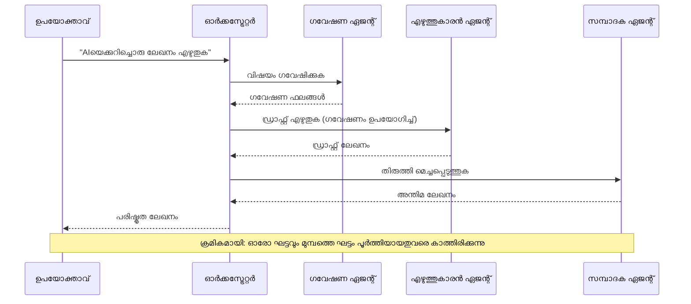
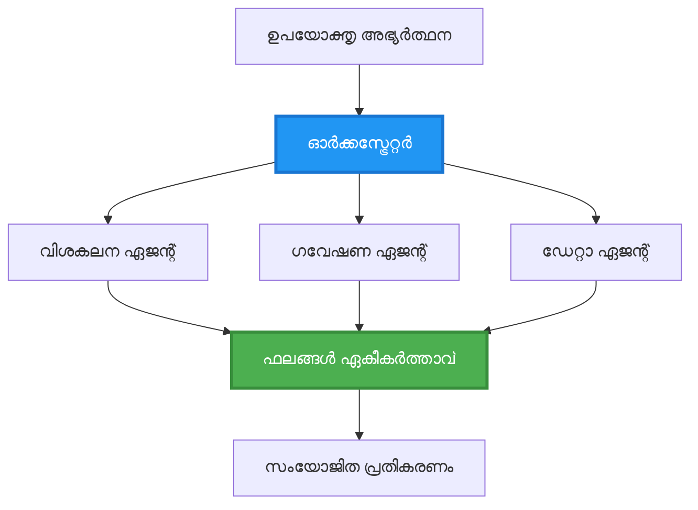
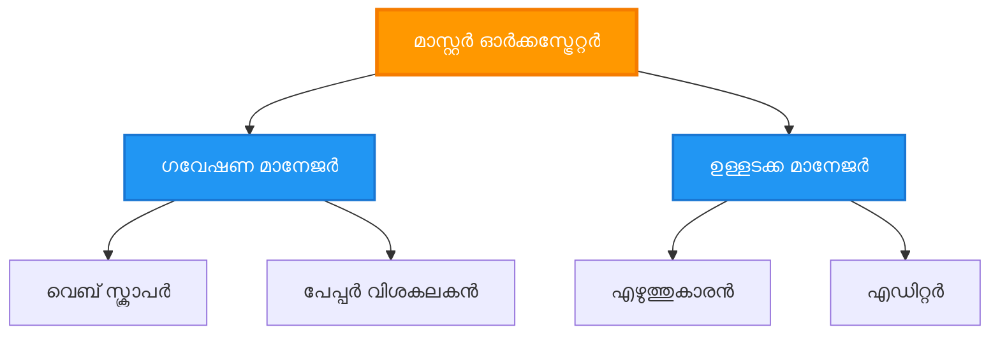
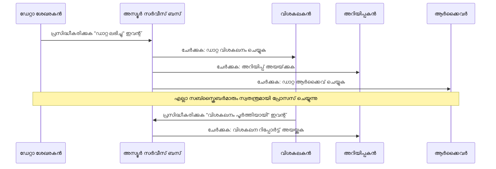
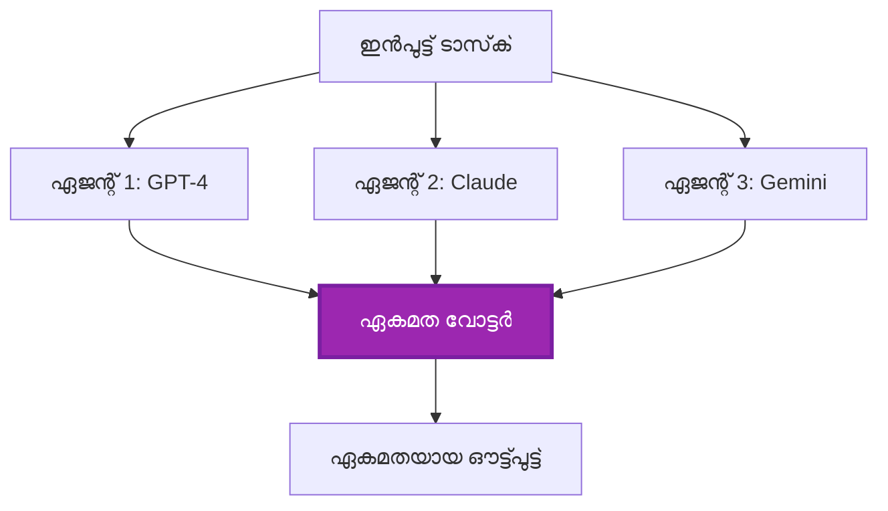
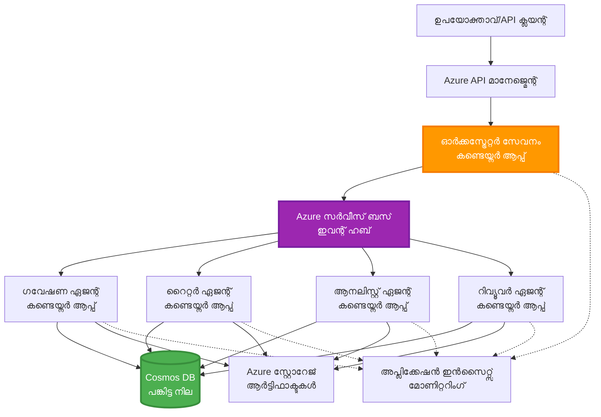

# മൾട്ടി-ഏജന്റ് കോഓർഡിനേഷൻ പാറ്റേൺസ്

⏱️ **എസ്റ്റിമേറ്റഡ് സമയം**: 60-75 minutes | 💰 **എസ്റ്റിമേറ്റഡ് ചിലവ്**: ~$100-300/month | ⭐ **സങ്കീർണത**: Advanced

**📚 ലേണിംഗ് പാത്ത്:**
- ← Previous: [Capacity Planning](capacity-planning.md) - റിസോഴ്‌സ് സൈസിംഗ് மற்றும் സ്കെയ്ലിംഗ് തന്ത്രങ്ങൾ
- 🎯 **നിങ്ങൾ ഇവിടെ ആണ്**: മൾട്ടി-ഏജന്റ് കോഓർഡിനേഷൻ പാറ്റേൺസ് (Orchestration, communication, state management)
- → Next: [SKU Selection](sku-selection.md) - ശരിയായ Azure സർവീസുകൾ തിരഞ്ഞെടുക്കൽ
- 🏠 [Course Home](../../README.md)

---

## നിങ്ങൾ എന്ത് പഠിക്കും

ഈ ലെസ്സൺ പൂർത്തിയാക്കിയാൽ, നിങ്ങൾ:
- **മൾട്ടി-ഏജന്റ് ആർക്കിടെക്ചർ** പാറ്റേൺസും എപ്പോഴാണ് അവ ഉപയോഗിക്കേണ്ടതെന്ന് മനസിലാക്കും
- **ഓർക്കസ്ട്രേഷൻ പാറ്റേൺസ്** (കേന്ദ്രഭദ്രം, ഡീസെൻട്രലൈസ്ഡ്, הירാർക്കിക്കൽ) നടപ്പിലാക്കും
- **ഏജന്റ് കമ്മ്യൂണിക്കേഷൻ** തന്ത്രങ്ങൾ രൂപകൽപ്പന ചെയ്യുക (സിംക്രോണസ്, അസിംക്രോണസ്, ഇവന്റ്-ഡ്രിവൺ)
- വിതരണ ഏജന്റുകൾക്കിടയിൽ **ഷെയർഡ് സ്റ്റേറ്റ്** മാനേജ് ചെയ്യുക
- AZD ഉപയോഗിച്ച് Azure-ൽ **മൾട്ടി-ഏജന്റ് സിസ്റ്റങ്ങൾ** ഡിപ്ലോയ് ചെയ്യുക
- യാഥാർത്ഥ്യ AI ദൃശ്യങ്ങളിലേക്ക് **കോഓർഡിനേഷൻ പാറ്റേൺസ്** പ്രയോഗിക്കുക
- വിതരിത ഏജന്റ് സിസ്റ്റങ്ങൾ നിരീക്ഷിക്കുകയും ഡീബഗ് ചെയ്യുകയും ചെയ്യുക

## മൾട്ടി-ഏജന്റ് കോഓർഡിനേഷൻ എന്തിനു പ്രധാനമാണ്

### പരിണാമം: സിംഗിൾ ഏജന്റിൽ നിന്ന് മൾട്ടി-ഏജന്റിലേക്ക്

**സിംഗിൾ ഏജന്റ് (സിംപിൾ):**
```
User → Agent → Response
```
- ✅ മനസിലാക്കാനും നടപ്പിലാക്കാനും എളുപ്പം
- ✅ ലളിതമായ ജോബുകൾക്ക് വേഗത്തിൽ
- ❌ ഒറ്റ മോഡലിന്റെ ശേഷികളാൽ പരിധിതം
- ❌ സങ്കീർണ്ണ ജോലികൾ പാരലലൈസ് ചെയ്യാൻ കഴിയുന്നില്ല
- ❌ സ്പെഷലൈസേഷൻ ഇല്ല

**മൾട്ടി-ഏജന്റ് സിസ്റ്റം (അഡ്വാൻസ്ഡ്):**
```
           ┌─────────────┐
           │ Orchestrator│
           └──────┬──────┘
        ┌─────────┼─────────┐
        │         │         │
    ┌───▼──┐  ┌──▼───┐  ┌──▼────┐
    │Agent1│  │Agent2│  │Agent3 │
    │(Plan)│  │(Code)│  │(Review)│
    └──────┘  └──────┘  └───────┘
```
- ✅ ഒരു പക്ഷേ പ്രത്യേക ജോലികൾക്കുള്ള സ്പെഷലൈസഡ് ഏജന്റുകൾ
- ✅ വേഗത്തിനായി പാരലൽ എക്സിക്യൂഷൻ
- ✅ മോഡുലാർയും മെയ്ന്റെയിനബിൾവുമാണ്
- ✅ സങ്കീർണ്ണ വർക്ക്‌ഫ്ലോകളിൽ മികച്ചത്
- ⚠️ കോഓർഡിനേഷൻ ലജിക്ക് ആവശ്യമുണ്ട്

**ഉദാഹരണം**: ഒറ്റ ഏജന്റ് ഒരാൾ എല്ലാ ജോലികളും ചെയ്യുന്ന പോലെ ആണ്. മൾട്ടി-ഏജന്റ് ഒരു ടീം പോലെയാണ്, കൂടെ പ്രവർത്തിക്കുന്ന ഓരോ അംഗത്തിനും പ്രത്യേകSkillസ് ഉണ്ട് (റിസർച്ചർ, കോഡർ, റിവ്യൂവർ, റൈറ്റർ).

---

## മുഖ്യ കോഓർഡിനേഷൻ പാറ്റേൺസ്

### പാറ്റേൺ 1: സീക്വൻഷ്യൽ കോഓർഡിനേഷൻ (Chain of Responsibility)

**എപ്പോഴാണ് ഉപയോഗിക്കേണ്ടത്**: ജോലികൾ പ്രത്യേകക്രമത്തിൽ പൂർത്തിയാക്കണം, ഓരോ ഏജന്റും മുൻപ് നൽകിയ ഔട്ട്പുട്ടിൽ അധിഷ്ഠിതമാണ്.


**ലാഭങ്ങൾ:**
- ✅ വ്യക്തമായ ഡേറ്റാ ഫ്ലോ
- ✅ ഡീബഗ് ചെയ്യാൻ എളുപ്പം
- ✅ പ്രവചനീയ എക്സിക്യൂഷൻ ഓർഡർ

**പരിമിതികൾ:**
- ❌ മന്ദഗതിയിൽ (പാരലലിസം ഇല്ല)
- ❌ ഒരു ഫെയിൽ ചെയിൻ മുഴുവനായി തടയണം
- ❌ പരസ്പര ആശ്രിത ജോലികൾ കൈകാര്യം不能

**ഉദാഹരണ ഉപയോഗമുകൾ:**
- ഉള്ളടക്ക സൃഷ്ടി പൈപ്പ്‍ലൈനു (റിസർച്ച → എഴുതൽ → എഡിറ്റ് → പബ്ലിഷ്)
- കോഡ് ജനറേഷൻ (പ്ലാൻ → നടപ്പാക്കൽ → ടെസ്റ്റ് → ഡിപ്ലോയ്)
- റിപ്പോർട്ട് ജനറേഷൻ (ഡേറ്റാ ശേഖരണം → വിശകലനം → വിസ്വലൈസേഷൻ → സംക്ഷേപം)

---

### പാറ്റേൺ 2: പാരലൽ കോഓർഡിനേഷൻ (Fan-Out/Fan-In)

**എപ്പോഴാണ് ഉപയോഗിക്കേണ്ടത്**: സ്വതന്ത്ര ജോലികൾ ഒരേസമയം നടക്കാം, ഫലങ്ങൾ അവസാനം കൂട്ടിച്ചേർക്കപ്പെടും.


**ലാഭങ്ങൾ:**
- ✅ വേഗം (പാരലൽ എക്സിക്യൂഷൻ)
- ✅ ഫാൾട്ട്-ടോളറന്റ് (പാർഷ്യൽ ഫലങ്ങൾ അംഗീകരിക്കാവുന്നത്)
- ✅ ഹോറിസോണ്ടലി സ്കെയിലുചെയ്യാവുന്നത്

**പരിമിതികൾ:**
- ⚠️ ഫലങ്ങൾ തികച്ചും ക്രമത്തിൽ എത്താൻ സാഹചര്യം ഇല്ല
- ⚠️ അഗ്രിഗേഷൻ ലജിക്ക് ആവശ്യമുണ്ട്
- ⚠️ സങ്കീർണ്ണ സ്റ്റേറ്റ് മാനേജ്മെന്റ്

**ഉദാഹരണ ഉപയോഗമുകൾ:**
- മൾട്ടി-സോഴ്സ് ഡേറ്റാ ഗദറിംഗ് (APIs + ഡേറ്റാബേസുകൾ + വെബ് സ്ക്രാപ്പിംഗ്)
- കംപറ്റിറ്റീവ് അനാലിസിസ് (പല മോഡലുകളും പരിഹാരങ്ങൾ ജെനറേറ്റ് ചെയ്യുന്നു, മികച്ചത് തിരഞ്ഞെടുക്കുന്നു)
- ട്രാൻസ്ലേഷൻ സർവീസുകൾ (ഒരു സമയം നിരവധി ഭാഷകളിലേക്ക് തർജ്ജമ ചെയ്യുന്നത്)

---

### പാറ്റേൺ 3: ഹെയർാർക്കിക്കൽ കോഓർഡിനേഷൻ (Manager-Worker)

**എപ്പോഴാണ് ഉപയോഗിക്കേണ്ടത്**: ഉപജോലികളോടെ സങ്കീർണ്ണ വർക്‌ഫ്ലോകൾ, ഡെലിഗേഷൻ ആവശ്യമുള്ളപ്പോൾ.


**ലാഭങ്ങൾ:**
- ✅ സങ്കീർണ്ണ വർക്‌ഫ്ലോകൾ കൈകാര്യം ചെയ്യുന്നു
- ✅ മോഡുലാർയും മെയ്ന്റെയിനബിൾവുമാണ്
- ✅ ഉത്തരവാദിത്ത അതിർത്തികൾ വ്യക്തമാണ്

**പരിമിതികൾ:**
- ⚠️ കൂടുതൽ സങ്കീർണ്ണമായ ആർക്കിടെക്ചർ
- ⚠️ ഉയർന്ന ലാറ്റൻസി (പല കോഓർഡിനേഷൻ ലെയറുകൾ)
- ⚠️ സൂക്ഷ്മ ഓർക്കസ്ട്രേഷൻ ആവശ്യമുണ്ട്

**ഉദാഹരണ ഉപയോഗമുകൾ:**
- എന്റർപ്രൈസ് ഡോക്യുമെന്റ് പ്രോസസ്സിംഗ് (ക്ലാസിഫൈ → റൂട്ടു → പ്രോസസ്സു → ആർക്കൈവു)
- മൾട്ടി-സ്റ്റേജ് ഡാറ്റാ പൈപ്പ്ലൈനുകൾ (ഇൻജസ്റ്റ് → ക്ലീൻ → ട്രാൻസ്ഫോർം → അനാലൈസ് → റിപ്പോർട്ട്)
- സങ്കീർണ്ണ ഓട്ടോമേഷൻ വർക്‌ഫ്ലോകൾ (പ്ലാനിംഗ് → റിസോഴ്‌സ് അലൊക്കേഷൻ → എക്സിക്യൂഷൻ → മോനിറ്ററിംഗ്)

---

### പാറ്റേൺ 4: ഇവന്റ്-ഡ്രിവൻ കോഓർഡിനേഷൻ (Publish-Subscribe)

**എപ്പോഴാണ് ഉപയോഗിക്കേണ്ടത്**: ഏജന്റുകൾ ഇവന്റുകൾക്ക് ശതമാനം പ്രതികരിക്കണം, ലൂസ് കപ്പ്ലിംഗ് വേണം.


**ലാഭങ്ങൾ:**
- ✅ ഏജന്റുകൾക്കിടയിലെ ലൂസ് കപ്പ്ലിംഗ്
- ✅ പുതിയ ഏജന്റുകൾ കൂട്ടിച്ചേർക്കാൻ എളുപ്പം (സബ്സ്ക്രൈബ് ചെയ്‌താൽ മതി)
- ✅ അസിങ്ക്രോണസ് പ്രോസസ്സിംഗ്
- ✅ പ്രതിരോധശക്തി (മെസേജ് പെർസിസ്റ്റൻസ്)

**പരിമിതികൾ:**
- ⚠️ ഇവൻച്ച്വൽ കൺസിസ്റ്റൻസി
- ⚠️ ഡീബഗ്ഗിംഗ് സങ്കീർണ്ണം
- ⚠️ മെസേജ് ഓർഡറിംഗ് വെല്ലുവിളികൾ

**ഉദാഹരണ ഉപയോഗമുകൾ:**
- റിയൽ-ടൈം മോനിറ്ററിംഗ് സിസ്റ്റംസ് (അലേർട്ടുകൾ, ഡാഷ്ബോർഡുകൾ, ലോഗുകൾ)
- മൾട്ടി-ചാനൽ നോട്ടിഫിക്കേഷനുകൾ (ഇമെയിൽ, SMS, പുഷ്, Slack)
- ഡാറ്റാ പ്രോസസിംഗ് പൈപ്പ്‌ലൈനുകൾ (അതിനേകം ഉപഭോക്താക്കൾക്ക് aynı ഡാറ്റ)

---

### പാറ്റേൺ 5: കോൺസെൻസുസ്-അധിഷ്ഠിത കോഓർഡിനേഷൻ (Voting/Quorum)

**എപ്പോഴാണ് ഉപയോഗിക്കേണ്ടത്**: തുടരാൻ മുൻപ് متعدد ഏജന്റുകളോട് സമ്മതം ആവശ്യമുള്ളപ്പോൾ.


**ലാഭങ്ങൾ:**
- ✅ ഉയർന്ന കൃത്യത (பல അഭിപ്രായങ്ങൾ)
- ✅ ഫാൾട്ട്-ടോളറന്റ് (മൈനോരിറ്റി പരാജയങ്ങൾ അനുവദനീയമാണ്)
- ✅ ഗുണനിലവാരം ഉറപ്പാക്കൽ ഉൾക്കൊള്ളുന്നു

**പരിമിതികൾ:**
- ❌ ചെലവേറിയത് (பல മോഡൽ കോളുകൾ)
- ❌ മന്ദഗതിയിൽ (എല്ലാ ഏജന്റുകൾക്കും കാത്തിരിക്കാൻ)
- ⚠️ കോൺഫ્લിക്റ്റ് റെസല്യൂഷൻ ആവശ്യമുണ്ട്

**ഉദാഹരണ ഉപയോഗമുകൾ:**
- ഉള്ളടക്ക മോഡറേഷൻ (പല മോഡലുകൾ ഉള്ളടക്കം റിവ്യൂ ചെയ്യുന്നു)
- കോഡ് റിവ്യൂ (പല ലിന്ററുകൾ/അനലൈസറുകൾ)
- മെഡിക്കൽ ഡയാഗ്നോസിസ് (പല AI മോഡലുകൾ, эксперт വയലിഡേഷൻ)

---

## ആർക്കിടെക്ചർ അവലോകനം

### Azure-ലുള്ള സമഗ്ര മൾട്ടി-ഏജന്റ് സിസ്റ്റം


**പ്രധാന ഘടകങ്ങൾ:**

| Component | Purpose | Azure Service |
|-----------|---------|---------------|
| **API Gateway** | എൻട്രി പോയിന്റ്, റേറ്റ് ലിമിറ്റിംഗ്, ഓത്ത് | API Management |
| **Orchestrator** | ഏജന്റ് വർക്‌ഫ്ലോകുകൾ കോഓർഡിനേറ്റ് ചെയ്യുന്നു | Container Apps |
| **Message Queue** | അസിങ്ക്രോണസ് കമ്മ്യൂണിക്കേഷൻ | Service Bus / Event Hubs |
| **Agents** | സ്പെഷലൈസഡ് AI വർക്കറുകൾ | Container Apps / Functions |
| **State Store** | ഷെയർഡ് സ്റ്റേറ്റ്, ടാസ്‌ക് ട്രാക്കിംഗ് | Cosmos DB |
| **Artifact Storage** | ഡോക്യുമെന്റുകൾ, ഫലങ്ങൾ, ലോഡുകൾ | Blob Storage |
| **Monitoring** | വിതരിത ട്രേസിംഗ്, ലോഗുകൾ | Application Insights |

---

## മുൻപREQUISITES

### ആവശ്യമായ ടൂളുകൾ

```bash
# Azure Developer CLI പരിശോധിക്കുക
azd version
# ✅ പ്രതീക്ഷിച്ചിരിക്കുന്നത്: azd പതിപ്പ് 1.0.0 അല്ലെങ്കിൽ അതിൽ ഉയർന്നത്

# Azure CLI പരിശോധിക്കുക
az --version
# ✅ പ്രതീക്ഷിച്ചിരിക്കുന്നത്: azure-cli പതിപ്പ് 2.50.0 അല്ലെങ്കിൽ അതിൽ ഉയർന്നത്

# Docker പരിശോധിക്കുക (ലൊക്കല്‍ ടെസ്റ്റിങ്ങിനായി)
docker --version
# ✅ പ്രതീക്ഷിച്ചിരിക്കുന്നത്: Docker പതിപ്പ് 20.10 അല്ലെങ്കിൽ അതിൽ ഉയർന്നത്
```

### Azure ആവശ്യകതകൾ

- ആക്ടീവ് Azure സബ്സ്ക്രിപ്ഷൻ
- സൃഷ്ടിക്കാനുള്ള അനുവാദങ്ങൾ:
  - Container Apps
  - Service Bus namespaces
  - Cosmos DB അക്കൗണ്ടുകൾ
  - Storage accounts
  - Application Insights

### അറിവ് ആവശ്യകതകൾ

നിങ്ങൾ പൂർത്തിയാക്കിയിരിക്കുന്നതായിരിക്കണം:
- [Configuration Management](../chapter-03-configuration/configuration.md)
- [Authentication & Security](../chapter-03-configuration/authsecurity.md)
- [Microservices Example](../../../../examples/microservices)

---

## നടപ്പാക്കൽ ഗൈഡ്

### പ്രൊജക്ട് ഘടന

```
multi-agent-system/
├── azure.yaml                    # AZD configuration
├── infra/
│   ├── main.bicep               # Main infrastructure
│   ├── core/
│   │   ├── servicebus.bicep     # Message queue
│   │   ├── cosmos.bicep         # State store
│   │   ├── storage.bicep        # Artifact storage
│   │   └── monitoring.bicep     # Application Insights
│   └── app/
│       ├── orchestrator.bicep   # Orchestrator service
│       └── agent.bicep          # Agent template
└── src/
    ├── orchestrator/            # Orchestration logic
    │   ├── app.py
    │   ├── workflows.py
    │   └── Dockerfile
    ├── agents/
    │   ├── research/            # Research agent
    │   ├── writer/              # Writer agent
    │   ├── analyst/             # Analyst agent
    │   └── reviewer/            # Reviewer agent
    └── shared/
        ├── state_manager.py     # Shared state logic
        └── message_handler.py   # Message handling
```

---

## ലെസ്സൺ 1: സീക്വൻഷ്യൽ കോഓർഡിനേഷൻ പാറ്റേൺ

### നടപ്പാക്കൽ: ഉള്ളടക്ക സൃഷ്ടി പൈപ്പ്‍ലൈനു

നമുക്ക് ഒരു സീക്വൻഷ്യൽ പൈപ്പ്ლაინുണ്ടാക്കാം: Research → Write → Edit → Publish

### 1. AZD കോൺഫിഗറേഷൻ

**ഫൈൽ: `azure.yaml`**

```yaml
name: content-pipeline
metadata:
  template: multi-agent-sequential@1.0.0

services:
  orchestrator:
    project: ./src/orchestrator
    language: python
    host: containerapp
  
  research-agent:
    project: ./src/agents/research
    language: python
    host: containerapp
  
  writer-agent:
    project: ./src/agents/writer
    language: python
    host: containerapp
  
  editor-agent:
    project: ./src/agents/editor
    language: python
    host: containerapp
```

### 2. ഇൻഫ്രാസ്ട്രക്ചർ: കോഓർഡിനേഷനിനുള്ള Service Bus

**ഫൈൽ: `infra/core/servicebus.bicep`**

```bicep
param name string
param location string
param tags object = {}

resource serviceBusNamespace 'Microsoft.ServiceBus/namespaces@2022-10-01-preview' = {
  name: name
  location: location
  tags: tags
  sku: {
    name: 'Standard'
    tier: 'Standard'
  }
  properties: {
    minimumTlsVersion: '1.2'
  }
}

// Queue for orchestrator → research agent
resource researchQueue 'Microsoft.ServiceBus/namespaces/queues@2022-10-01-preview' = {
  parent: serviceBusNamespace
  name: 'research-tasks'
  properties: {
    maxDeliveryCount: 3
    lockDuration: 'PT5M'
    deadLetteringOnMessageExpiration: true
  }
}

// Queue for research agent → writer agent
resource writerQueue 'Microsoft.ServiceBus/namespaces/queues@2022-10-01-preview' = {
  parent: serviceBusNamespace
  name: 'writer-tasks'
  properties: {
    maxDeliveryCount: 3
    lockDuration: 'PT5M'
  }
}

// Queue for writer agent → editor agent
resource editorQueue 'Microsoft.ServiceBus/namespaces/queues@2022-10-01-preview' = {
  parent: serviceBusNamespace
  name: 'editor-tasks'
  properties: {
    maxDeliveryCount: 3
    lockDuration: 'PT5M'
  }
}

output namespace string = serviceBusNamespace.name
output connectionString string = listKeys('${serviceBusNamespace.id}/AuthorizationRules/RootManageSharedAccessKey', serviceBusNamespace.apiVersion).primaryConnectionString
```

### 3. ഷെയർഡ് സ്റ്റേറ്റ് മാനേജർ

**ഫൈൽ: `src/shared/state_manager.py`**

```python
from azure.cosmos import CosmosClient, PartitionKey
from datetime import datetime
import os

class StateManager:
    """Manages shared state across agents using Cosmos DB"""
    
    def __init__(self):
        endpoint = os.environ['COSMOS_ENDPOINT']
        key = os.environ['COSMOS_KEY']
        
        self.client = CosmosClient(endpoint, key)
        self.database = self.client.get_database_client('agent-state')
        self.container = self.database.get_container_client('tasks')
    
    def create_task(self, task_id: str, task_type: str, input_data: dict):
        """Create a new task"""
        task = {
            'id': task_id,
            'type': task_type,
            'status': 'pending',
            'input': input_data,
            'created_at': datetime.utcnow().isoformat(),
            'steps': []
        }
        self.container.create_item(task)
        return task
    
    def update_task_step(self, task_id: str, step_name: str, result: dict):
        """Update task with completed step"""
        task = self.container.read_item(task_id, partition_key=task_id)
        
        task['steps'].append({
            'name': step_name,
            'completed_at': datetime.utcnow().isoformat(),
            'result': result
        })
        
        self.container.replace_item(task_id, task)
        return task
    
    def complete_task(self, task_id: str, final_result: dict):
        """Mark task as complete"""
        task = self.container.read_item(task_id, partition_key=task_id)
        task['status'] = 'completed'
        task['result'] = final_result
        task['completed_at'] = datetime.utcnow().isoformat()
        self.container.replace_item(task_id, task)
        return task
    
    def get_task(self, task_id: str):
        """Retrieve task state"""
        return self.container.read_item(task_id, partition_key=task_id)
```

### 4. ഓർക്കസ്ട്രേറ്റർ സർവീസ്

**ഫൈൽ: `src/orchestrator/app.py`**

```python
from flask import Flask, request, jsonify
from azure.servicebus import ServiceBusClient, ServiceBusMessage
import json
import uuid
import os
from shared.state_manager import StateManager

app = Flask(__name__)
state_manager = StateManager()

# Service Bus കണക്ഷൻ
servicebus_connection_str = os.environ['SERVICEBUS_CONNECTION_STRING']
servicebus_client = ServiceBusClient.from_connection_string(servicebus_connection_str)

@app.route('/health', methods=['GET'])
def health():
    return jsonify({'status': 'healthy', 'service': 'orchestrator'})

@app.route('/create-content', methods=['POST'])
def create_content():
    """
    Sequential workflow: Research → Write → Edit → Publish
    """
    data = request.json
    topic = data.get('topic')
    
    if not topic:
        return jsonify({'error': 'Topic required'}), 400
    
    # സ്റ്റേറ്റ് സ്റ്റോറിൽ ടാസ്‌ക് സൃഷ്ടിക്കുക
    task_id = str(uuid.uuid4())
    task = state_manager.create_task(
        task_id=task_id,
        task_type='content_creation',
        input_data={'topic': topic}
    )
    
    # ഗവേഷണ ഏജന്റിന് സന്ദേശം അയക്കുക (ആദ്യ ഘട്ടം)
    sender = servicebus_client.get_queue_sender('research-tasks')
    message = ServiceBusMessage(
        body=json.dumps({
            'task_id': task_id,
            'topic': topic,
            'next_queue': 'writer-tasks'  # ഫലങ്ങൾ എവിടെ അയയ്ക്കണം
        }),
        content_type='application/json'
    )
    
    with sender:
        sender.send_messages(message)
    
    return jsonify({
        'task_id': task_id,
        'status': 'started',
        'workflow': 'sequential',
        'steps': ['research', 'write', 'edit', 'publish'],
        'message': 'Content creation pipeline initiated'
    }), 202

@app.route('/task/<task_id>', methods=['GET'])
def get_task_status(task_id):
    """Check task status"""
    try:
        task = state_manager.get_task(task_id)
        return jsonify(task)
    except Exception as e:
        return jsonify({'error': str(e)}), 404

if __name__ == '__main__':
    app.run(host='0.0.0.0', port=8080)
```

### 5. റിസർച്ച്എജന്റ്

**ഫൈൽ: `src/agents/research/app.py`**

```python
from azure.servicebus import ServiceBusClient, ServiceBusMessage
from openai import AzureOpenAI
import json
import os
import time
from shared.state_manager import StateManager

# ക്ലയന്റുകൾ ആരംഭിക്കുക
state_manager = StateManager()
servicebus_client = ServiceBusClient.from_connection_string(
    os.environ['SERVICEBUS_CONNECTION_STRING']
)

openai_client = AzureOpenAI(
    api_key=os.environ['AZURE_OPENAI_API_KEY'],
    api_version="2024-02-01",
    azure_endpoint=os.environ['AZURE_OPENAI_ENDPOINT']
)

def process_research_task(message_data):
    """Process research request and pass to writer"""
    task_id = message_data['task_id']
    topic = message_data['topic']
    next_queue = message_data['next_queue']
    
    print(f"🔬 Researching: {topic}")
    
    # ഗവേഷണത്തിനായി Azure OpenAI വിളിക്കുക
    response = openai_client.chat.completions.create(
        model="gpt-4",
        messages=[
            {"role": "system", "content": "You are a research assistant. Provide comprehensive research on the given topic."},
            {"role": "user", "content": f"Research this topic thoroughly: {topic}"}
        ],
        max_tokens=1500
    )
    
    research_results = response.choices[0].message.content
    
    # സ്ഥിതി പുതുക്കുക
    state_manager.update_task_step(
        task_id=task_id,
        step_name='research',
        result={'research': research_results}
    )
    
    # അടുത്ത ഏജന്റിന് (എഴുത്തുകാരന്) അയയ്ക്കുക
    sender = servicebus_client.get_queue_sender(next_queue)
    message = ServiceBusMessage(
        body=json.dumps({
            'task_id': task_id,
            'topic': topic,
            'research': research_results,
            'next_queue': 'editor-tasks'
        }),
        content_type='application/json'
    )
    
    with sender:
        sender.send_messages(message)
    
    print(f"✅ Research complete for task {task_id}")

def main():
    """Listen to research queue"""
    receiver = servicebus_client.get_queue_receiver('research-tasks')
    
    print("🔬 Research Agent started, listening for tasks...")
    
    with receiver:
        while True:
            messages = receiver.receive_messages(max_wait_time=5)
            for message in messages:
                try:
                    message_data = json.loads(str(message))
                    process_research_task(message_data)
                    receiver.complete_message(message)
                except Exception as e:
                    print(f"❌ Error processing message: {e}")
                    receiver.abandon_message(message)

if __name__ == '__main__':
    main()
```

### 6. റൈറ്റർ ഏജന്റ്

**ഫൈൽ: `src/agents/writer/app.py`**

```python
from azure.servicebus import ServiceBusClient, ServiceBusMessage
from openai import AzureOpenAI
import json
import os
from shared.state_manager import StateManager

state_manager = StateManager()
servicebus_client = ServiceBusClient.from_connection_string(
    os.environ['SERVICEBUS_CONNECTION_STRING']
)

openai_client = AzureOpenAI(
    api_key=os.environ['AZURE_OPENAI_API_KEY'],
    api_version="2024-02-01",
    azure_endpoint=os.environ['AZURE_OPENAI_ENDPOINT']
)

def process_writing_task(message_data):
    """Write article based on research"""
    task_id = message_data['task_id']
    topic = message_data['topic']
    research = message_data['research']
    next_queue = message_data['next_queue']
    
    print(f"✍️ Writing article: {topic}")
    
    # ലേഖനം എഴുതാൻ Azure OpenAI-നെ വിളിക്കുക
    response = openai_client.chat.completions.create(
        model="gpt-4",
        messages=[
            {"role": "system", "content": "You are a professional writer. Write engaging, well-structured articles."},
            {"role": "user", "content": f"Based on this research:\n\n{research}\n\nWrite a comprehensive article about: {topic}"}
        ],
        max_tokens=2000
    )
    
    article_draft = response.choices[0].message.content
    
    # സ്ഥിതി പുതുക്കുക
    state_manager.update_task_step(
        task_id=task_id,
        step_name='writing',
        result={'draft': article_draft}
    )
    
    # എഡിറ്ററിന് അയയ്ക്കുക
    sender = servicebus_client.get_queue_sender(next_queue)
    message = ServiceBusMessage(
        body=json.dumps({
            'task_id': task_id,
            'topic': topic,
            'draft': article_draft
        }),
        content_type='application/json'
    )
    
    with sender:
        sender.send_messages(message)
    
    print(f"✅ Article draft complete for task {task_id}")

def main():
    """Listen to writer queue"""
    receiver = servicebus_client.get_queue_receiver('writer-tasks')
    
    print("✍️ Writer Agent started, listening for tasks...")
    
    with receiver:
        while True:
            messages = receiver.receive_messages(max_wait_time=5)
            for message in messages:
                try:
                    message_data = json.loads(str(message))
                    process_writing_task(message_data)
                    receiver.complete_message(message)
                except Exception as e:
                    print(f"❌ Error: {e}")
                    receiver.abandon_message(message)

if __name__ == '__main__':
    main()
```

### 7. എഡിറ്റർ ഏജന്റ്

**ഫൈൽ: `src/agents/editor/app.py`**

```python
from azure.servicebus import ServiceBusClient
from openai import AzureOpenAI
import json
import os
from shared.state_manager import StateManager

state_manager = StateManager()
servicebus_client = ServiceBusClient.from_connection_string(
    os.environ['SERVICEBUS_CONNECTION_STRING']
)

openai_client = AzureOpenAI(
    api_key=os.environ['AZURE_OPENAI_API_KEY'],
    api_version="2024-02-01",
    azure_endpoint=os.environ['AZURE_OPENAI_ENDPOINT']
)

def process_editing_task(message_data):
    """Edit and finalize article"""
    task_id = message_data['task_id']
    topic = message_data['topic']
    draft = message_data['draft']
    
    print(f"📝 Editing article: {topic}")
    
    # എഡിറ്റ് ചെയ്യാൻ Azure OpenAI-നെ വിളിക്കുക
    response = openai_client.chat.completions.create(
        model="gpt-4",
        messages=[
            {"role": "system", "content": "You are an expert editor. Improve grammar, clarity, and structure."},
            {"role": "user", "content": f"Edit and improve this article:\n\n{draft}"}
        ],
        max_tokens=2000
    )
    
    final_article = response.choices[0].message.content
    
    # ടാസ്‌ക് പൂർത്തിയായി എന്ന് അടയാളപ്പെടുത്തുക
    state_manager.complete_task(
        task_id=task_id,
        final_result={
            'topic': topic,
            'final_article': final_article,
            'word_count': len(final_article.split())
        }
    )
    
    print(f"✅ Article finalized for task {task_id}")

def main():
    """Listen to editor queue"""
    receiver = servicebus_client.get_queue_receiver('editor-tasks')
    
    print("📝 Editor Agent started, listening for tasks...")
    
    with receiver:
        while True:
            messages = receiver.receive_messages(max_wait_time=5)
            for message in messages:
                try:
                    message_data = json.loads(str(message))
                    process_editing_task(message_data)
                    receiver.complete_message(message)
                except Exception as e:
                    print(f"❌ Error: {e}")
                    receiver.abandon_message(message)

if __name__ == '__main__':
    main()
```

### 8. ഡിപ്ലോയ് ചെയ്യുക এবং ടെസ്റ്റ് ചെയ്യുക

```bash
# ആരംഭിച്ച് വിന്യസിക്കുക
azd init
azd up

# ഓർക്കസ്ട്രേറ്ററിന്റെ URL നേടുക
ORCHESTRATOR_URL=$(azd env get-values | grep ORCHESTRATOR_URL | cut -d '=' -f2 | tr -d '"')

# ഉള്ളടക്കം സൃഷ്ടിക്കുക
curl -X POST $ORCHESTRATOR_URL/create-content \
  -H "Content-Type: application/json" \
  -d '{"topic": "The Future of AI in Healthcare"}'
```

**✅ പ്രതീക്ഷിച്ച ഔട്ട്പുട്ട്:**
```json
{
  "task_id": "a1b2c3d4-e5f6-7890-abcd-ef1234567890",
  "status": "started",
  "workflow": "sequential",
  "steps": ["research", "write", "edit", "publish"],
  "message": "Content creation pipeline initiated"
}
```

**ടാസ്‌ക് പുരോഗതി പരിശോധിക്കുക:**
```bash
TASK_ID="a1b2c3d4-e5f6-7890-abcd-ef1234567890"
curl $ORCHESTRATOR_URL/task/$TASK_ID
```

**✅ പ്രതീക്ഷിച്ച ഔട്ട്പുട്ട് (പൂര്‍ത്തിയായി):**
```json
{
  "id": "a1b2c3d4-e5f6-7890-abcd-ef1234567890",
  "type": "content_creation",
  "status": "completed",
  "steps": [
    {
      "name": "research",
      "completed_at": "2025-11-19T10:30:00Z",
      "result": {"research": "..."}
    },
    {
      "name": "writing",
      "completed_at": "2025-11-19T10:32:00Z",
      "result": {"draft": "..."}
    }
  ],
  "result": {
    "topic": "The Future of AI in Healthcare",
    "final_article": "...",
    "word_count": 1500
  }
}
```

---

## ലെസ്സൺ 2: പാരലൽ കോഓർഡിനേഷൻ പാറ്റേൺ

### നടപ്പാക്കൽ: മൾട്ടി-സോഴ്സ് റിസർച്ച്അഗ്രിഗേറ്റർ

നമുക്ക് ഒന്ന് പാരലൽ സിസ്റ്റം നിർമ്മിക്കാം, ഒരേസമയം متعدد സോഴ്സുകളിൽ നിന്ന് വിവരങ്ങൾ ശേഖരിക്കുന്നതു.

### പാരലൽ ഓർക്കസ്ട്രേറ്റർ

**ഫൈൽ: `src/orchestrator/parallel_workflow.py`**

```python
from flask import Flask, request, jsonify
from azure.servicebus import ServiceBusClient, ServiceBusMessage
import json
import uuid
import os
from shared.state_manager import StateManager

app = Flask(__name__)
state_manager = StateManager()

servicebus_client = ServiceBusClient.from_connection_string(
    os.environ['SERVICEBUS_CONNECTION_STRING']
)

@app.route('/research-parallel', methods=['POST'])
def research_parallel():
    """
    Parallel workflow: Multiple agents work simultaneously
    """
    data = request.json
    query = data.get('query')
    
    task_id = str(uuid.uuid4())
    task = state_manager.create_task(
        task_id=task_id,
        task_type='parallel_research',
        input_data={
            'query': query,
            'agents': ['web', 'academic', 'news', 'social']
        }
    )
    
    # ഫാൻ-ഔട്ട്: എല്ലാ ഏജന്റുകൾക്കും ഒരേ സമയം അയയ്ക്കുക
    agents = [
        ('web-research-queue', 'web'),
        ('academic-research-queue', 'academic'),
        ('news-research-queue', 'news'),
        ('social-research-queue', 'social')
    ]
    
    for queue_name, agent_type in agents:
        sender = servicebus_client.get_queue_sender(queue_name)
        message = ServiceBusMessage(
            body=json.dumps({
                'task_id': task_id,
                'query': query,
                'agent_type': agent_type,
                'result_queue': 'aggregation-queue'
            }),
            content_type='application/json'
        )
        
        with sender:
            sender.send_messages(message)
    
    return jsonify({
        'task_id': task_id,
        'status': 'started',
        'workflow': 'parallel',
        'agents_dispatched': 4,
        'message': 'Parallel research initiated'
    }), 202

if __name__ == '__main__':
    app.run(host='0.0.0.0', port=8080)
```

### അഗ്രിഗേഷൻ ലജിക്ക്

**ഫൈൽ: `src/agents/aggregator/app.py`**

```python
from azure.servicebus import ServiceBusClient
import json
import os
from collections import defaultdict
from shared.state_manager import StateManager

state_manager = StateManager()
servicebus_client = ServiceBusClient.from_connection_string(
    os.environ['SERVICEBUS_CONNECTION_STRING']
)

# പ്രത്യേക ടാസ്‌ക് അടിസ്ഥാനത്തിൽ ഫലങ്ങൾ ട്രാക്ക് ചെയ്യുക
task_results = defaultdict(list)
expected_agents = 4  # വെബ്, അക്കാദമിക്, വാർത്ത, സാമൂഹിക

def process_result(message_data):
    """Aggregate results from parallel agents"""
    task_id = message_data['task_id']
    agent_type = message_data['agent_type']
    result = message_data['result']
    
    # ഫലം സംഭരിക്കുക
    task_results[task_id].append({
        'agent': agent_type,
        'data': result
    })
    
    print(f"📊 Received result from {agent_type} agent ({len(task_results[task_id])}/{expected_agents})")
    
    # എല്ലാ ഏജന്റുകളും പൂർത്തിയiyakോയെന്ന് പരിശോധിക്കുക (ഫാൻ-ഇൻ)
    if len(task_results[task_id]) == expected_agents:
        print(f"✅ All agents completed for task {task_id}. Aggregating...")
        
        # ഫലങ്ങൾ സംയോജിപ്പിക്കുക
        aggregated = {
            'query': message_data['query'],
            'sources': task_results[task_id],
            'summary': generate_summary(task_results[task_id])
        }
        
        # പൂർത്തായി അടയാളപ്പെടുത്തുക
        state_manager.complete_task(task_id, aggregated)
        
        # ശുദ്ധമാക്കുക
        del task_results[task_id]
        
        print(f"✅ Aggregation complete for task {task_id}")

def generate_summary(results):
    """Generate summary from all sources"""
    summaries = [r['data'].get('summary', '') for r in results]
    return '\n\n'.join(summaries)

def main():
    """Listen to aggregation queue"""
    receiver = servicebus_client.get_queue_receiver('aggregation-queue')
    
    print("📊 Aggregator started, listening for results...")
    
    with receiver:
        while True:
            messages = receiver.receive_messages(max_wait_time=5)
            for message in messages:
                try:
                    message_data = json.loads(str(message))
                    process_result(message_data)
                    receiver.complete_message(message)
                except Exception as e:
                    print(f"❌ Error: {e}")
                    receiver.abandon_message(message)

if __name__ == '__main__':
    main()
```

**പാരലൽ പാറ്റേണിന്റെ ലാഭങ്ങൾ:**
- ⚡ **4x വേഗം** (ഏജന്റുകൾ ഒരേ സമയം ഓടുന്നു)
- 🔄 **ഫാൾട്ട്-ടോളറന്റ്** (പാർഷ്യൽ ഫലങ്ങൾ സ്വീകരിക്കാവുന്നു)
- 📈 **സ്കെയിലബിൾ** (സൗകര്യവത്തായി കൂടുതൽ ഏജന്റുകൾ ചേർക്കാം)

---

## പ്രായോഗിക എക്സേഴ്‌സൈസുകൾ

### എക്സേഴ്‌സൈസ് 1: ടൈംഔട്ട് ഹാൻഡ്ലിംഗ് ചേർക്കുക ⭐⭐ (മധ്യമം)

**ലക്ഷ്യം**: aggregation സ്ലോ ആയ ഏജന്റുകൾക്കായി അഖ്മിച്ചത് വരെ കാത്തിരിക്കാതിരിക്കാൻ ടൈംഔട്ട് ലജിക്ക് നടപ്പിലാക്കുക.

**പടികൾ**:

1. **അഗ്രിഗേറ്ററിൽ ടൈംഔട്ട് ട്രാക്കിംഗ് ചേർക്കുക:**

```python
from datetime import datetime, timedelta

task_timeouts = {}  # task_id -> കാലഹരണ സമയം

def process_result(message_data):
    task_id = message_data['task_id']
    
    # ആദ്യ ഫലത്തിന് ടൈമൗട്ട് സജ്ജീകരിക്കുക
    if task_id not in task_timeouts:
        task_timeouts[task_id] = datetime.utcnow() + timedelta(seconds=30)
    
    task_results[task_id].append({
        'agent': message_data['agent_type'],
        'data': message_data['result']
    })
    
    # സമാപ്തമാണോ അല്ലെങ്കിൽ ടൈമൗട്ട് ആയി പോയോ എന്ന് പരിശോധിക്കുക
    if len(task_results[task_id]) == expected_agents or \
       datetime.utcnow() > task_timeouts[task_id]:
        
        print(f"📊 Aggregating with {len(task_results[task_id])}/{expected_agents} results")
        
        aggregated = {
            'query': message_data['query'],
            'sources': task_results[task_id],
            'completed_agents': len(task_results[task_id]),
            'timed_out': len(task_results[task_id]) < expected_agents
        }
        
        state_manager.complete_task(task_id, aggregated)
        
        # ശുദ്ധീകരണം
        del task_results[task_id]
        del task_timeouts[task_id]
```

2. **ആകൃതിമ delays ഉപയോഗിച്ച് ടെസ്റ്റ് ചെയ്യുക:**

```python
# ഒരു ഏജന്റിൽ മന്ദഗതിയിലുള്ള പ്രോസസ്സിംഗ് അനുകരിക്കാൻ വൈകിപ്പിക്കൽ ചേർക്കുക
import time
time.sleep(35)  # 30 സെക്കന്റ് ടൈംഔട്ട് കടക്കുന്നു
```

3. **ഡിപ്ലോയ് ചെയ്ത് സ്ഥിരീകരിക്കുക:**

```bash
azd deploy aggregator

# ടാസ്‌ക് സമർപ്പിക്കുക
curl -X POST $ORCHESTRATOR_URL/research-parallel \
  -H "Content-Type: application/json" \
  -d '{"query": "AI safety research"}'

# 30 സെക്കൻഡ് കഴിഞ്ഞ് ഫലങ്ങൾ പരിശോധിക്കുക
curl $ORCHESTRATOR_URL/task/$TASK_ID
```

**✅ വിജയ മാനദണ്ഡങ്ങൾ:**
- ✅ ഏജന്റുകൾ അനൂർത്തമല്ലെങ്കിൽ പോലും 30 സെക്കന്റിനുള്ളിൽ ടാസ്‌ക് പൂർത്തിയാകണം
- ✅ പ്രതികരണം പാർഷ്യൽ ഫലങ്ങൾ സൂചിപ്പിക്കണം (`"timed_out": true`)
- ✅ ലഭ്യമായ ഫലങ്ങൾ തിരിച്ച് നൽകപ്പെടണം (4-ൽ 3 ഏജന്റുകൾ)

**സമയം**: 20-25 minutes

---

### എക്സേഴ്‌സൈസ് 2: റിട്രൈ ലജിക്ക് നടപ്പിലാക്കുക ⭐⭐⭐ (അഡ്വാൻസ്ഡ്)

**ലക്ഷ്യം**: പരാജയപ്പെട്ട ഏജന്റ് ടാസ്ക്കുകൾ സ്വയം റിട്രൈ ചെയ്‌ത ശേഷം മാത്രമേ ഉപേക്ഷിക്കുകയുള്ളൂ.

**പടികൾ**:

1. **ഓർക്കസ്ട്രേറ്ററിലേക്ക് റിട്രൈ ട്രാക്കിംഗ് ചേർക്കുക:**

```python
from dataclasses import dataclass
from typing import Dict

@dataclass
class RetryConfig:
    max_retries: int = 3
    backoff_seconds: int = 5

retry_counts: Dict[str, int] = {}  # message_id -> retry_count

def send_with_retry(queue_name: str, message_data: dict, retry_config: RetryConfig):
    """Send message with retry metadata"""
    message_id = message_data.get('message_id', str(uuid.uuid4()))
    message_data['message_id'] = message_id
    message_data['retry_count'] = retry_counts.get(message_id, 0)
    message_data['max_retries'] = retry_config.max_retries
    
    sender = servicebus_client.get_queue_sender(queue_name)
    message = ServiceBusMessage(
        body=json.dumps(message_data),
        content_type='application/json',
        message_id=message_id
    )
    
    with sender:
        sender.send_messages(message)
```

2. **ഏജന്റുകൾക്കായി റിട്രൈ ഹാൻഡ്ലർ ചേർക്കുക:**

```python
def process_with_retry(message, receiver, process_func):
    """Process message with automatic retry on failure"""
    try:
        message_data = json.loads(str(message))
        
        # സന്ദേശം പ്രോസസ് ചെയ്യുക
        process_func(message_data)
        
        # വിജയം - പൂർത്തിയായി
        receiver.complete_message(message)
        
    except Exception as e:
        message_id = message.message_id
        retry_count = message_data.get('retry_count', 0)
        max_retries = message_data.get('max_retries', 3)
        
        if retry_count < max_retries:
            # വീണ്ടും ശ്രമിക്കുക: ഉപേക്ഷിച്ച് എണ്ണം കൂട്ടി വീണ്ടും ക്യൂവിലേക്ക് ചേർക്കുക
            print(f"⚠️ Retry {retry_count + 1}/{max_retries} for message {message_id}")
            
            message_data['retry_count'] = retry_count + 1
            
            # ഒരു വൈകിപ്പിക്കലോടുകൂടി അതേ ക്യൂവിലേക്ക് തിരികെ അയയ്ക്കുക
            time.sleep(5 * (retry_count + 1))  # എക്സ്പോനൻഷ്യൽ ബാക്കോഫ്
            send_with_retry(queue_name, message_data, RetryConfig())
            
            receiver.complete_message(message)  # മൂലപ്രതി നീക്കം ചെയ്യുക
        else:
            # പരമാവധി വീണ്ടും ശ്രമങ്ങൾ ലംഘിച്ചു - ഡെഡ് ലെറ്റർ ക്യൂവിലേക്ക് മാറ്റുക
            print(f"❌ Max retries exceeded for message {message_id}")
            receiver.dead_letter_message(
                message,
                reason="MaxRetriesExceeded",
                error_description=str(e)
            )
```

3. **ഡെഡ് ലെറ്റർ ക്യുവി മോനിറ്റർ ചെയ്യുക:**

```python
def monitor_dead_letters():
    """Check dead letter queue for failed messages"""
    receiver = servicebus_client.get_queue_receiver(
        'research-queue',
        sub_queue='deadletter'
    )
    
    with receiver:
        messages = receiver.receive_messages(max_wait_time=5)
        for message in messages:
            print(f"☠️ Dead letter: {message.message_id}")
            print(f"Reason: {message.dead_letter_reason}")
            print(f"Description: {message.dead_letter_error_description}")
```

**✅ വിജയ മാനദണ്ഡങ്ങൾ:**
- ✅ പരാജയപ്പെട്ട ടാസ്കുകൾ സ്വയം റിട്രൈ ചെയ്യണം (മაქ്സ് 3 തവണ വരെ)
- ✅ റിട്രൈകൾക്കിടയിൽ എക്സ്‌പൊനെൻഷ്യൽ ബാക്ഓഫ് (5s, 10s, 15s)
- ✅ മാക്‌സ് റിട്രൈശേഷം മെസേജുകൾ ഡെഡ് ലെറ്റർ ക്യുവിലേക്ക് പോകണം
- ✅ ഡെഡ് ലെറ്റർ ക്യു കാണുകയും റിപ്ലേ ചെയ്യുകയും ചെയ്യാവുന്നതാണ്

**സമയം**: 30-40 minutes

---

### എക്സേഴ്‌സൈസ് 3: സർക്യൂട്ട് ബ്രേക്കർ നടപ്പിലാക്കുക ⭐⭐⭐ (അഡ്വാൻസ്ഡ്)

**ലക്ഷ്യം**: പരാജയപ്പെടുന്ന ഏജന്റുകളിലേക്കുള്ള അഭ്യർത്ഥനrokes തടയാൻ സർക്യൂട്ട് ബ്രേക്കർ ഉപയോഗിക്കുക.

**പടികൾ**:

1. **സർക്യൂട്ട് ബ്രേക്കർ ക്ലാസ് സൃഷ്ടിക്കുക:**

```python
from enum import Enum
from datetime import datetime, timedelta

class CircuitState(Enum):
    CLOSED = "closed"      # സാധാരണ പ്രവർത്തനം
    OPEN = "open"          # തകരുന്നു, അഭ്യര്‍ത്ഥനകൾ നിരസിക്കുക
    HALF_OPEN = "half_open"  # പുനഃസ്ഥാപിതമാണോ എന്ന് പരിശോധിക്കുന്നു

class CircuitBreaker:
    def __init__(self, failure_threshold=5, timeout_seconds=60):
        self.failure_threshold = failure_threshold
        self.timeout_seconds = timeout_seconds
        self.failure_count = 0
        self.last_failure_time = None
        self.state = CircuitState.CLOSED
    
    def call(self, func):
        """Execute function with circuit breaker protection"""
        if self.state == CircuitState.OPEN:
            # ടൈമ্ঔട്ട് കാലാവധി കഴിഞ്ഞോ എന്ന് പരിശോധിക്കുക
            if datetime.utcnow() - self.last_failure_time > timedelta(seconds=self.timeout_seconds):
                self.state = CircuitState.HALF_OPEN
                print("🔄 Circuit breaker: HALF_OPEN (testing)")
            else:
                raise Exception(f"Circuit breaker OPEN for agent. Try again in {self.timeout_seconds}s")
        
        try:
            result = func()
            
            # വിജയം
            if self.state == CircuitState.HALF_OPEN:
                self.state = CircuitState.CLOSED
                self.failure_count = 0
                print("✅ Circuit breaker: CLOSED (recovered)")
            
            return result
            
        except Exception as e:
            self.failure_count += 1
            self.last_failure_time = datetime.utcnow()
            
            if self.failure_count >= self.failure_threshold:
                self.state = CircuitState.OPEN
                print(f"🔴 Circuit breaker: OPEN (too many failures)")
            
            raise e
```

2. **ഏജന്റ് കോളുകളിൽ പ്രയോഗിക്കുക:**

```python
# ഓർക്കസ്ട്രേറ്ററിൽ
agent_circuits = {
    'web': CircuitBreaker(failure_threshold=5, timeout_seconds=60),
    'academic': CircuitBreaker(failure_threshold=5, timeout_seconds=60),
    'news': CircuitBreaker(failure_threshold=5, timeout_seconds=60),
    'social': CircuitBreaker(failure_threshold=5, timeout_seconds=60)
}

def send_to_agent(agent_type, message_data):
    """Send with circuit breaker protection"""
    circuit = agent_circuits[agent_type]
    
    try:
        circuit.call(lambda: send_message(agent_type, message_data))
    except Exception as e:
        print(f"⚠️ Skipping {agent_type} agent: {e}")
        # മറ്റു ഏജന്റുകളുമായി തുടരുക
```

3. **സർക്യൂട്ട് ബ്രേക്കർ ടെസ്റ്റ് ചെയ്യുക:**

```bash
# മറുപടി വരാതെ ഇരിക്കുന്ന പരാജയങ്ങളെ അനുകരിക്കുക (ഒരു ഏജന്റ് നിർത്തുക)
az containerapp stop --name web-research-agent --resource-group rg-agents

# പല അഭ്യർത്ഥനകളും അയയ്ക്കുക
for i in {1..10}; do
  curl -X POST $ORCHESTRATOR_URL/research-parallel \
    -H "Content-Type: application/json" \
    -d '{"query": "test query '$i'"}'
  sleep 2
done

# ലോഗുകൾ പരിശോധിക്കുക - 5 പരാജയങ്ങള്ക്ക് ശേഷം സർക്യൂട്ട് തുറന്നതായി കാണണം
# Container App ലോഗുകൾക്കായി Azure CLI ഉപയോഗിക്കുക:
az containerapp logs show --name orchestrator --resource-group $RG_NAME --tail 50
```

**✅ വിജയ മാനദണ്ഡങ്ങൾ:**
- ✅ 5 പരാജയശേഷം സർക്യൂട്ട് തുറക്കുന്നു (അഭ്യർത്ഥനകളെ നിഷേധിക്കുന്നു)
- ✅ 60 സെക്കന്റിന് ശേഷം സർക്യൂട്ട് ഹാഫ്-ഓപ്പൺ ആയി (റിക്കവറിയെ പരീക്ഷിക്കുന്നു)
- ✅ മറ്റു ഏജന്റുകൾ സാധാരണമായി തുടരും
- ✅ ഏജന്റ് മടങ്ങി വരുമ്പോൾ സർക്യൂട്ട് സ്വയം ക്ലോസ് ചെയ്യുന്നു

**സമയം**: 40-50 minutes

---

## മോണിറ്ററിംഗ് ಮತ್ತು ഡീബഗ്ഗിംഗ്

### Application Insights ഉപയോഗിച്ചുള്ള വിതരിത ട്രേസിംഗ്

**ഫൈൽ: `src/shared/tracing.py`**

```python
from opencensus.ext.azure.log_exporter import AzureLogHandler
from opencensus.ext.azure.trace_exporter import AzureExporter
from opencensus.trace import config_integration
from opencensus.trace.tracer import Tracer
from opencensus.trace.samplers import AlwaysOnSampler
import logging
import os

# ട്രേസിംഗ് ക്രമീകരിക്കുക
config_integration.trace_integrations(['requests', 'logging'])

connection_string = os.environ.get('APPLICATIONINSIGHTS_CONNECTION_STRING')

# ട്രേസർ സൃഷ്ടിക്കുക
tracer = Tracer(
    exporter=AzureExporter(connection_string=connection_string),
    sampler=AlwaysOnSampler()
)

# ലോഗിംഗ് ക്രമീകരിക്കുക
logger = logging.getLogger(__name__)
logger.addHandler(AzureLogHandler(connection_string=connection_string))
logger.setLevel(logging.INFO)

def trace_agent_call(agent_name, task_id, operation):
    """Trace agent operations"""
    with tracer.span(name=f'{agent_name}.{operation}') as span:
        span.add_attribute('agent', agent_name)
        span.add_attribute('task_id', task_id)
        span.add_attribute('operation', operation)
        
        try:
            result = operation()
            span.add_attribute('status', 'success')
            return result
        except Exception as e:
            span.add_attribute('status', 'error')
            span.add_attribute('error', str(e))
            raise
```

### Application Insights ക്വെറിയുകൾ

- മൾട്ടി-ഏജന്റ് വർക്‌ഫ്ലോകൾ ട്രാക്കുചെയ്യുക:

```kusto
// Trace complete workflow for a task
traces
| where customDimensions.task_id == "a1b2c3d4-..."
| project timestamp, message, customDimensions.agent, customDimensions.operation
| order by timestamp asc
```

- ഏജന്റ് പ്രകടന താരതമ്യം:

```kusto
// Compare agent execution times
dependencies
| where name contains "agent"
| summarize 
    avg_duration = avg(duration),
    p95_duration = percentile(duration, 95),
    count = count()
  by agent = tostring(customDimensions.agent)
| order by avg_duration desc
```

- പരാജയ വിശകലനം:

```kusto
// Find which agents fail most
exceptions
| where customDimensions.agent != ""
| summarize 
    failure_count = count(),
    unique_errors = dcount(outerMessage)
  by agent = tostring(customDimensions.agent)
| order by failure_count desc
```

---

## ചിലവ് വിശകലനം

### മൾട്ടി-ഏജന്റ് സിസ്റ്റത്തിന്റെ മാസവില കണക്കുകൾ (ഏകദേശം)

| Component | Configuration | Cost |
|-----------|--------------|------|
| **Orchestrator** | 1 Container App (1 vCPU, 2GB) | $30-50 |
| **4 Agents** | 4 Container Apps (0.5 vCPU, 1GB each) | $60-120 |
| **Service Bus** | Standard tier, 10M messages | $10-20 |
| **Cosmos DB** | Serverless, 5GB storage, 1M RUs | $25-50 |
| **Blob Storage** | 10GB storage, 100K operations | $5-10 |
| **Application Insights** | 5GB ingestion | $10-15 |
| **Azure OpenAI** | GPT-4, 10M tokens | $100-300 |
| **Total** | | **$240-565/month** |

### ചിലവ് സംബന്ധമായ ഓപ്റ്റിമൈസേഷന്‍ തന്ത്രങ്ങള്‍

1. **സെർവർലെസ് ഉപയോഗിക്കുക എത്രത്തോളം കഴിയുമെന്നെങ്കിലും:**
   ```bicep
   // Cosmos DB serverless (no minimum cost)
   properties: {
     databaseAccountOfferType: 'Standard'
     capabilities: [{ name: 'EnableServerless' }]
   }
   ```

2. **ഐഡിൽ സമയത്ത് ഏജന്റുകൾ സീറോ ആയി സ്കെയിൽ ചെയ്യുക:**
   ```bicep
   scale: {
     minReplicas: 0  // Scale to zero when no messages
     maxReplicas: 10
   }
   ```

3. **Service Bus-യ്ക്ക് ബാച്ചിംഗ് ഉപയോഗിക്കുക:**
   ```python
   # സന്ദേശങ്ങൾ ബാച്ചുകളായി അയയ്ക്കുക (കുറഞ്ഞ ചെലവിൽ)
   sender.send_messages([message1, message2, message3])
   ```

4. **മിക്കവാറും ഉപയോഗിക്കുന്ന ഫലങ്ങൾ കാഷ് ചെയ്യുക:**
   ```python
   # Azure Cache for Redis ഉപയോഗിക്കുക
   if cache.exists(query_hash):
       return cache.get(query_hash)
   ```

---

## മികച്ച രീതികൾ

### ✅ ചെയ്യുക:

1. **ഐഡംസെന്റോപ്പന്റ് ഓപ്പറേഷനുകൾ ഉപയോഗിക്കുക**
   ```python
   # ഏജന്റ് ഒരേ സന്ദേശം പല തവണകളിലും സുരക്ഷിതമായി പ്രോസസ് ചെയ്യാൻ കഴിയും
   def process_task(task_id):
       if state_manager.task_exists(task_id):
           print(f"Task {task_id} already processed, skipping")
           return
       # ടാസ്‌ക് പ്രോസസ് ചെയ്യുന്നു...
   ```

2. **വ്യാപകമായ ലോഗ്ഗിംഗ് നടപ്പിലാക്കുക**
   ```python
   logger.info(f"Agent: {agent_name}, Task: {task_id}, Action: {action}")
   ```

3. **കറലേഷൻ ID-കൾ ഉപയോഗിക്കുക**
   ```python
   # task_id നെ മുഴുവൻ വർക്‌ഫ്ലോ വഴി കൈമാറുക
   message_data = {
       'task_id': task_id,  # കോറിലേഷൻ ഐഡി
       'timestamp': datetime.utcnow().isoformat()
   }
   ```

4. **മെസേജ് TTL (time-to-live) സജ്ജമാക്കുക**
   ```bicep
   properties: {
     defaultMessageTimeToLive: 'PT1H'  // 1 hour max
   }
   ```

5. **ഡെഡ് ലെറ്റർ ക്യുസ് മാറ്റി നിരീക്ഷിക്കുക**
   ```python
   # പരാജയപ്പെട്ട സന്ദേശങ്ങളുടെ നിയമിത നിരീക്ഷണം
   monitor_dead_letters()
   ```

### ❌ ചെയ്യരുത്:

1. **സർക്കുലാർ ഡിപെൻഡൻസികൾ സൃഷ്ടിക്കരുത്**
   ```python
   # ❌ മോശം: ഏജന്റ് A → ഏജന്റ് B → ഏജന്റ് A (അവസാനമില്ലാത്ത ലൂപ്പ്)
   # ✅ നല്ലത്: സ്പഷ്ടമായ ദിശാസൂചക അസൈക്ലിക് ഗ്രാഫ് (DAG) നിർവചിക്കുക
   ```

2. **ഏജന്റ് ത്രെഡുകൾ തടയരുത്**
   ```python
   # ❌ തെറ്റ്: സമകാലിക കാത്തിരിപ്പ്
   while not task_complete:
       time.sleep(1)
   
   # ✅ നല്ലത്: സന്ദേശ ക്യൂ കോൾബാക്കുകൾ ഉപയോഗിക്കുക
   ```

3. **പാർഷ്യൽ ഫെയില്യൂറുകൾ അവഗണിക്കരുത്**
   ```python
   # ❌ മോശം: ഒരു ഏജന്റ് പരാജയപ്പെട്ടാൽ മുഴുവൻ വർക്ക്‌ഫ്ലോ പരാജയപ്പെടുത്തുക
   # ✅ നല്ലത്: പിശക് സൂചകങ്ങളോടൊപ്പം ഭാഗിക ഫലങ്ങൾ തിരികെ നൽകുക
   ```

4. **അസീമിത റിട്രൈകൾ ഉപയോഗിക്കരുത്**
   ```python
   # ❌ മോശം: എപ്പോഴും വീണ്ടും ശ്രമിക്കുക
   # ✅ നല്ലത്: max_retries = 3, ശേഷം ഡെഡ് ലെറ്ററിലേക്ക്
   ```

---
## Troubleshooting Guide

### Problem: Messages stuck in queue

**Symptoms:**
- സന്ദേശങ്ങൾ ക്യൂവിൽ സമാഹരിക്കുന്നു
- ഏജന്റുകൾ പ്രോസസ്സിംഗ് ചെയ്യുന്നില്ല
- ടാസ്‌ക് നില "pending" എന്നിൽ കുടുങ്ങിയിരിക്കുന്നു

**Diagnosis:**
```bash
# ക്യൂയുടെ ആഴം പരിശോധിക്കുക
az servicebus queue show \
  --namespace-name mybus \
  --name research-tasks \
  --query "countDetails"

# Azure CLI ഉപയോഗിച്ച് ഏജന്റ് ലോഗുകൾ പരിശോധിക്കുക
az containerapp logs show --name research-agent --resource-group $RG_NAME --tail 50
```

**Solutions:**

1. **ഏജന്റ് റെപ്ലിക്കകൾ വർധിപ്പിക്കുക:**
   ```bash
   az containerapp update \
     --name research-agent \
     --min-replicas 3 \
     --max-replicas 10
   ```

2. **ഡെഡ് ലെറ്റർ ക്യൂ പരിശോധിക്കുക:**
   ```bash
   az servicebus queue show \
     --namespace-name mybus \
     --name research-tasks \
     --query "countDetails.deadLetterMessageCount"
   ```

---

### Problem: Task timeout/never completes

**Symptoms:**
- ടാസ്‌ക് നില "in_progress" ആയി തുടരുന്നു
- ചില ഏജന്റുകൾ പൂർത്തിയാക്കുന്നു, മറ്റു ചിലർ ചെയ്യുന്നതಿಲ್ಲ
- എന്തെങ്കിലും error സന്ദേശങ്ങളില്ല

**Diagnosis:**
```bash
# ടാസ്‍കിന്റെ അവസ്ഥ പരിശോധിക്കുക
curl $ORCHESTRATOR_URL/task/$TASK_ID

# Application Insights പരിശോധിക്കുക
# ക്വറി ഓടിക്കുക: traces | where customDimensions.task_id == "..."
```

**Solutions:**

1. **അഗ്രിഗേറ്ററിൽ ടൈംഔട്ട് നടപ്പാക്കുക (Exercise 1)**

2. **Azure Monitor ഉപയോഗിച്ച് ഏജന്റ് ഫെയില്യറുകൾ പരിശോധിക്കുക:**
   ```bash
   # azd monitor വഴി ലോഗുകൾ കാണുക
   azd monitor --logs
   
   # അല്ലെങ്കിൽ നിശ്ചിത കണ്ടെയ്നർ ആപ്പ് ലോഗുകൾ പരിശോധിക്കാൻ Azure CLI ഉപയോഗിക്കുക
   az containerapp logs show --name <agent-name> --resource-group $RG_NAME --follow | grep "ERROR\|FAIL"
   ```

3. **എല്ലാ ഏജന്റുകളും പ്രവർത്തിക്കുന്നുണ്ടോ എന്ന് സ്ഥിരീകരിക്കുക:**
   ```bash
   az containerapp list \
     --resource-group rg-agents \
     --query "[].{name:name, status:properties.runningStatus}"
   ```

---

## Learn More

### Official Documentation
- [Azure Service Bus](https://learn.microsoft.com/azure/service-bus-messaging/service-bus-messaging-overview)
- [Cosmos DB](https://learn.microsoft.com/azure/cosmos-db/introduction)
- [Container Apps DAPR](https://learn.microsoft.com/azure/container-apps/dapr-overview)
- [Multi-Agent Design Patterns](https://learn.microsoft.com/azure/architecture/guide/ai/multi-agent-systems)

### Next Steps in This Course
- ← മുൻപ്: [Capacity Planning](capacity-planning.md)
- → അടുത്തത്: [SKU Selection](sku-selection.md)
- 🏠 [Course Home](../../README.md)

### Related Examples
- [Microservices Example](../../../../examples/microservices) - സേവന ആശയവിനിമയ മാതൃകകൾ
- [Azure OpenAI Example](../../../../examples/azure-openai-chat) - എഐ സംയോജനം

---

## Summary

**You've learned:**
- ✅ അഞ്ചു കോ-ഓർഡിനേഷൻ മാതൃകകൾ (അനുക്രമ, സമാന്തര, ഹൈറാർക്കിക്കൽ, ഇവന്റ്-ഡ്രിവൻ, ഏകാഭിപ്രായം)
- ✅ Azure-ൽ മൾട്ടി-ഏജന്റ് ആർക്കിടെക്ചർ (Service Bus, Cosmos DB, Container Apps)
- ✅ വിതരിച്ച ഏജന്റുകൾക്കിടയിലെ സ്റ്റേറ്റ് മാനേജ്‌മെന്റ്
- ✅ ടൈംഔട്ട് കൈകാര്യം ചെയ്യൽ, റിട്റൈകൾ, സർക്യൂട്ട് ബ്രേക്കറുകൾ
- ✅ വിതരണത്തിനുള്ള സിസ്റ്റം നിരീക്ഷണവും ഡീബഗ്ഗിംഗും
- ✅ ചെലവ് ഓപ്റ്റിമൈസേഷൻ തന്ത്രങ്ങൾ

**Key Takeaways:**
1. **സരിയായ മാതൃക തിരഞ്ഞെടുക്കുക** - ക്രമീകരിച്ച വർക്ക്ഫ്ലോകൾക്കായി അനുക്രമം, വേഗത്തിന് സമാന്തര, নমനംക്കായി ഇവന്റ്-ഡ്രിവൻ
2. **സ്റ്റേറ്റ് സൂക്ഷ്മമായി կառിക്കുക** - പങ്കുവയ്ക്കുന്ന സ്റ്റേറ്റിന് Cosmos DB പോലെയുള്ളത് ഉപയോഗിക്കുക
3. **ഫെയില്യറുകൾ സൗമ്യമായി കൈകാര്യം ചെയ്യുക** - ടൈംഔട്ട്, റിട്രൈ, സർക്യൂട്ട് ബ്രേക്കറുകൾ, ഡെഡ് ലെറ്റർ ക്യൂകൾ
4. **എല്ലാം നിരീക്ഷിക്കുക** - ഡിസ്‌ട്രിബ്യൂട്ടഡ് ട്രേസിംഗ് ഡീബഗിംഗിനായി അനിവാര്യമാണ്
5. **ചെലവുകൾ оптимൈസ് ചെയ്യുക** - സേൽ ടു സീറോ സ്കെയിൽ ചെയ്യുക, സെർവർലെസ് ഉപയോഗിക്കുക, ക്യാഷിംഗ് നടപ്പാക്കുക

**Next Steps:**
1. പ്രായോഗിക അഭ്യാസങ്ങൾ പൂർത്തിയാക്കുക
2. നിങ്ങളുടെ ഉപയോഗക്കേസിനായുള്ള ഒരു മൾട്ടി-ഏജന്റ് സിസ്റ്റം നിർമ്മിക്കുക
3. പ്രകടനവും ചെലവും ഓപ്റ്റിമൈസ് ചെയ്യാൻ [SKU Selection](sku-selection.md) പഠിക്കുക

---

<!-- CO-OP TRANSLATOR DISCLAIMER START -->
അസ്വീകാര്യ പ്രഖ്യാപനം:
ഈ രേഖ AI പരിഭാഷ സേവനം Co‑op Translator (https://github.com/Azure/co-op-translator) ഉപയോഗിച്ച് വിവർത്തനം ചെയ്തതാണ്. നാം കൃത്യതയ്ക്ക് ശ്രമിച്ചെങ്കിലും, ഓട്ടോമേറ്റഡ് വിവർത്തനങ്ങളിൽ പിശകുകൾ അല്ലെങ്കിൽ കൃത്യതാ കുറവുകൾ ഉണ്ടാവാവുന്നതാണ് എന്ന് ദയവായി ശ്രദ്ധിക്കുക. മൂല രേഖ അതിന്റെ സ്വന്തം ഭാഷയിൽ ഔദ്യോഗിക സ്രോതസ്സായി പരിഗണിക്കപ്പെടണം. നിർണ്ണായക വിവരങ്ങൾക്ക് പ്രൊഫഷണൽ انسانی പരിഭാഷ ശുപാർശ ചെയ്യുന്നു. ഈ വിവർത്തനത്തിന്റെ ഉപയോഗത്തിൽ നിന്നുണ്ടാകുന്ന ഏതെങ്കിലും തെറ്റിദ്ധാരണകളിലോ തെറ്റായ വ്യാഖ്യാനങ്ങളിലോ ഞങ്ങൾ ഉത്തരവാദികളല്ല.
<!-- CO-OP TRANSLATOR DISCLAIMER END -->