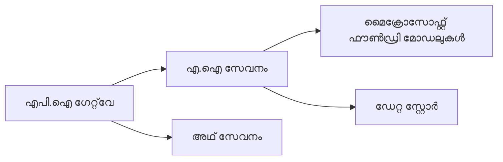
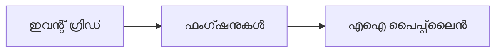

# അധ്യായം 8: ഉൽപാദന & എൻറപ്രൈസ് മാതൃകകൾ

**📚 കോഴ്‌സ്**: [AZD For Beginners](../../README.md) | **⏱️ ദൈർഘ്യം**: 2-3 മണിക്കൂർ | **⭐ സങ്കീർണ്ണത**: ഉന്നതം

---

## അവലോകനം

ഈ അധ്യായം എൻറപ്രൈസ്-സജ്ജമായ വിന്യാസ മാതൃകകൾ, സുരക്ഷ ശക്തീകരണം, നിരീക്ഷണം, ഉൽപാദന AI ജോലിഭാരങ്ങൾക്ക് ചെലവ് മെച്ചപ്പെടുത്തൽ എന്നിവ പരിഗണിക്കുന്നു.

## പഠന ലക്ഷ്യങ്ങൾ

ഈ അധ്യായം പൂർത്തിയാക്കിയാൽ, നിങ്ങൾക്ക് കഴിയും:
- മൾട്ടി-റീജിയൻ സുസ്ഥിരമായ ആപ്ലിക്കേഷനുകൾ വിന്യസിക്കുക
- എൻറപ്രൈസ് സുരക്ഷാ മാതൃകകൾ നടപ്പിലാക്കുക
- സമഗ്രമായ നിരീക്ഷണം ക്രമീകരിക്കുക
- ചെലവ് വലുതായി മെച്ചപ്പെടുത്തുക
- AZD ഉപയോഗിച്ച് CI/CD പൈപ്പ്‌ലൈൻ സജ്ജമാക്കുക

---

## 📚 പാഠങ്ങൾ

| # | പാഠം | വിവരണം | സമയം |
|---|--------|-------------|------|
| 1 | [ഉൽപാദന AI പ്രാക്ടിസുകൾ](production-ai-practices.md) | എൻറപ്രൈസ് വിന്യാസ മാതൃകകൾ | 90 മിനിറ്റ് |

---

## 🚀 ഉൽപാദന പരിശോധന പട്ടിക

- [ ] സുസ്ഥിരതക്കായി മൾട്ടി-റീജിയൻ വിന്യാസം
- [ ] അവകാശപത്ര രഹിത മാനേജുചെയ്‌ത ഐഡന്റിറ്റി
- [ ] നിരീക്ഷണത്തിന് ആപ്ലിക്കേഷൻ ഇൻസൈറ്റ്സ്
- [ ] ചെലവ് ബഡ്ജറ്റുകളും അലർട്ട്സും ക്രമീകരിച്ചിരിക്കുന്നു
- [ ] സുരക്ഷാ സ്കാനിങ്ങ് സജ്ജമാക്കി
- [ ] CI/CD പൈപ്പ്‌ലൈൻ എന്റഗ്രേഷൻ
- [ ] ദുരന്തം പുനരുദ്ധാരണ പദ്ധതി

---

## 🏗️ നിർമ്മാണ മാതൃകകൾ

### മാതൃക 1: മൈക്രോസർവീസസ് AI


### മാതൃക 2: ഇവന്റ്-ഡ്രിവൻ AI


---

## 🔐 സുരക്ഷാ മികച്ച പ്രാക്ടിസുകൾ

```bicep
// Use managed identity
identity: {
  type: 'SystemAssigned'
}

// Private endpoints for AI services
properties: {
  publicNetworkAccess: 'Disabled'
  networkAcls: {
    defaultAction: 'Deny'
  }
}
```

---

## 💰 ചെലവ് മെച്ചപ്പെടുത്തൽ

| തന്ത്രം | ലാഭം |
|----------|---------|
| സ്ഫോടനില്ലാതെ സ്‌കെയിൽ ചെയ്യൽ (Container Apps) | 60-80% |
| വികസനത്തിന് കൺസംപ്ഷൻ ടിയേഴ്സ് ഉപയോഗിക്കുക | 50-70% |
| ഷെഡ്യൂൾ ചെയ്ത സ്‌കെയിലിംഗ് | 30-50% |
| റിസർവ് ചെയ്ത ശേഷി | 20-40% |

```bash
# ബജറ്റ് അലർട്ടുകൾ ക്രമീകരിക്കുക
az consumption budget create \
  --budget-name "AI-Budget" \
  --amount 500 \
  --category Cost \
  --time-grain Monthly
```

---

## 📊 നിരീക്ഷണ ക്രമീകരണം

```bash
# ലോഗുകൾ സംപ്രേഷണം ചെയ്യുക
azd monitor --logs

# ആപ്ലിക്കേഷൻ ഇൻസൈറ്റുകൾ പരിശോധിക്കുക
azd monitor

# മെറ്റ്രിക്കുകൾ കാണുക
az monitor metrics list --resource <resource-id>
```

---

## 🔗 നാവിഗേഷൻ

| ദിശ | അധ്യായം |
|-----------|---------|
| **പഴയത്** | [അധ്യായം 7: പ്രശ്നപരിഹാരം](../chapter-07-troubleshooting/README.md) |
| **കോഴ്‌സ് പൂർത്തിയായി** | [കോഴ്‌സ് ഹോം](../../README.md) |

---

## 📖 ബന്ധപ്പെട്ട വിഭവങ്ങൾ

- [AI ഏജന്റ്സ് ഗൈഡ്](../chapter-02-ai-development/agents.md)
- [ആപ്ലിക്കേഷൻ ഇൻസൈറ്റ്സ്](../chapter-06-pre-deployment/application-insights.md)
- [മൾട്ടി-ഏജന്റ് പരിഹാരങ്ങൾ](../chapter-05-multi-agent/README.md)
- [മൈക്രോസർവീസസ് ഉദാഹരണം](../../examples/microservices/README.md)

---

<!-- CO-OP TRANSLATOR DISCLAIMER START -->
**പരാമർശം**:  
ഈ പ്രമാണം AI പരിഭാഷാ സേവനം [Co-op Translator](https://github.com/Azure/co-op-translator) ഉപയോഗിച്ച് വിവർത്തനം ചെയ്തതാണ്. ശരിയായി വിവർത്തനം ചെയ്യാൻ ഞങ്ങൾ ശ്രമിച്ചിരുന്നുവെങ്കിലും, ഓട്ടോമാറ്റിക് വിവർത്തനങ്ങളിൽ പിശകുകളും തെറ്റുകളും ഉണ്ടാകാമെന്ന് ദയവായി ശ്രദ്ധിക്കുക. കല്യാണിക്കപ്പെട്ട ഭാഷയിലുള്ള പ്രമാണം മാത്രമാണ് അധികാരപരമായ ഉറവിടം എന്ന് കണക്കാക്കേണ്ടതാണ്. നിർണായക വിവരങ്ങൾക്ക്, പ്രൊഫഷണൽ മാനവ പരിഭാഷ ശുപാർശ ചെയ്യുന്നു. ഈ പരിഭാഷയുടെ ഉപയോഗം മൂലം ഉണ്ടാകുന്ന നിഗമന വിട്ടുവീഴ്ചകൾക്കും തെറ്റിദ്ധാരണകൾക്കും ഞങ്ങൾ ഉത്തരവാദികളല്ല.
<!-- CO-OP TRANSLATOR DISCLAIMER END -->