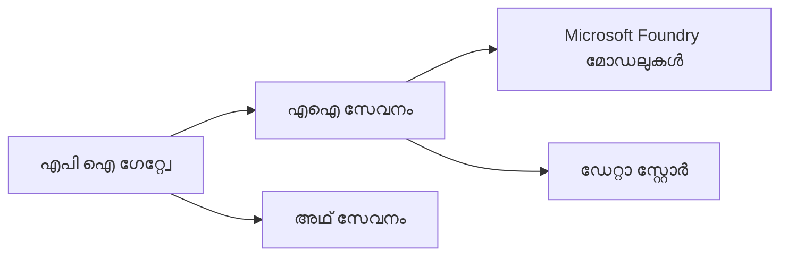
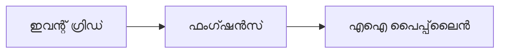

# Chapter 8: പ്രൊഡക്ഷൻ & എൻറപ്രൈസ് മാതരൂപങ്ങൾ

**📚 കോഴ്‌സ്**: [AZD For Beginners](../../README.md) | **⏱️ ദൈർഘ്യം**: 2-3 മണിക്കൂർ | **⭐ ഘടനാസമൂഹം**: ഉന്നതസ്ഥരം

---

## അവലോകനം

ഈ അധ്യായം എൻറപ്രൈസ്-സജ്ജമായ വിന്യസന മാതരൂപങ്ങൾ, സുരക്ഷാ ശക്തിപ്പെടുത്തൽ, നിരീക്ഷണം, പ്രൊഡക്ഷൻ AI പ്രവർത്തനഭാരങ്ങൾക്ക് ചിലവ് മെച്ചപ്പെടുത്തൽ എന്നിവ ഉൾക്കൊള്ളിക്കും.

> ജൂൺ 2026-ൽ `azd 1.25.6` ഉപയോഗിച്ച് പരിശോധന കഴിഞ്ഞു.

## പഠന ലക്ഷ്യങ്ങൾ

ഈ അധ്യായം പൂർത്തിയാക്കിയാൽ, നിങ്ങൾക്ക് കഴിയുന്നത്:
- ബഹുവിദേശങ്ങളിൽ തികഞ്ഞ ബുദ്ധിമുട്ട് കൈകാര്യം ചെയ്യുന്ന ആപ്ലിക്കേഷനുകൾ വിന്യസിക്കുക
- എൻറപ്രൈസ് സുരക്ഷാ മാതരൂപങ്ങൾ നടപ്പിലാക്കുക
- സമഗ്രമായ നിരീക്ഷണം രൂപീകരിക്കുക
- തോതുപ്രകാരമുള്ള ചിലവ് മികവുറ്റതാക്കുക
- AZD ഉപയോഗിച്ച് CI/CD പൈപ്ലൈനുകൾ ക്രമീകരിക്കുക

---

## 📚 പാഠങ്ങൾ

| # | പാഠം | വിശദീകരണം | സമയം |
|---|--------|-------------|------|
| 1 | [പ്രൊഡക്ഷൻ AI പ്രവൃത്തികൾ](production-ai-practices.md) | എൻറപ്രൈസ് വിന്യസന മാതരൂപങ്ങൾ | 90 മിനിറ്റ് |

---

## 🚀 പ്രൊഡക്ഷൻ ചെക്ക്ലിസ്റ്റ്

- [ ] പ്രതിരോധ ശേഷിയുള്ള ബഹു-മേഖല വിന്യസനം
- [ ] അംഗീകൃത ആവശ്യത്തിനായി മാനേജ്ഡ് ഐഡന്റിറ്റി (കീകൾ ഇല്ലാതെ)
- [ ] നിരീക്ഷണത്തിനായി ആപ്ലിക്കേഷൻ ഇൻസൈറ്റ്സ്
- [ ] ചിലവ് ബജറ്റുകളും അലേർട്ടുകളും ക്രമീകരിച്ചിരിക്കുന്നത്
- [ ] സുരക്ഷാ സ്കാനിംഗ് സജ്ജമാക്കി
- [ ] CI/CD പൈപ്ലൈൻ ഇന്റഗ്രേഷൻ
- [ ] ദുരന്ത മടക്കം പദ്ധതി

---

## 🏗️ ആർക്കിടെകചർ മാതരൂപങ്ങൾ

### മാതരൂപം 1: മൈക്രോസർവിസസ് AI



### മാതരൂപം 2: ഇവന്റ്-ഡ്രിവൻ AI



---

## 🔐 സുരക്ഷ കോർത്തിണക്കലിനുള്ള മികച്ച പ്രവൃത്തികൾ

```bicep
// Use managed identity
identity: {
  type: 'SystemAssigned'
}

// Private endpoints for AI services
properties: {
  publicNetworkAccess: 'Disabled'
  networkAcls: {
    defaultAction: 'Deny'
  }
}
```

---

## 💰 ചിലവ് മികവുറ്റതാക്കൽ

| റണനീതി | ലാഭം |
|----------|---------|
| സൃഷ്ട്ടി ത്തിരിച്ച് 0-ലേക്ക് (കണ്ടെയ്‌നർ ആപ്പുകൾ) | 60-80% |
| വികസനത്തിനായുള്ള ഉപഭോഗ നിരക്കുകൾ | 50-70% |
| ക്രമീകരിച്ച സ്കെയിലിംഗ് | 30-50% |
| സംരക്ഷിച്ച ശേഷി | 20-40% |

```bash
# ബജറ്റ് അലർട്ടുകൾ സജ്ജമാക്കുക
az consumption budget create \
  --budget-name "AI-Budget" \
  --amount 500 \
  --category Cost \
  --time-grain Monthly
```

---

## 📊 നിരീക്ഷണം ക്രമീകരിക്കൽ

```bash
# സ്റ്റ്രീം ലോഗുകൾ
azd monitor --logs

# ആപ്ലിക്കേഷൻ ഇൻസൈറ്റ്സ് പരിശോധിക്കുക
azd monitor --overview

# മെട്രിക്കുകൾ കാണുക
az monitor metrics list --resource <resource-id>
```

---

## 🔗 നാവിഗേഷൻ

| ദിശ | അധ്യായം |
|-----------|---------|
| **മുൻപ്** | [Chapter 7: Troubleshooting](../chapter-07-troubleshooting/README.md) |
| **കോഴ്‌സ് പൂർത്തിയായി** | [കോഴ്‌സ് ഹോം](../../README.md) |

---

## 📖 ബന്ധപ്പെട്ട വിഭവങ്ങൾ

- [AI ഏജന്റുകൾ ഗൈഡ്](../chapter-02-ai-development/agents.md)
- [ആപ്ലിക്കേഷൻ ഇൻസൈറ്റ്സ്](../chapter-06-pre-deployment/application-insights.md)
- [ബഹു ഏജന്റ് സൊല്യൂഷൻസ്](../chapter-05-multi-agent/README.md)
- [മൈക്രോസർവിസ്സ് ഉദാഹരണം](../../examples/microservices/README.md)

---

<!-- CO-OP TRANSLATOR DISCLAIMER START -->
**അറിയിപ്പ്**:
ഈ രേഖ AI പരിഭാഷാ സേവനം [Co-op Translator](https://github.com/Azure/co-op-translator) ഉപയോഗിച്ച് പരിഭാഷപ്പെടുത്തിയതാണ്. ഞങ്ങൾ കൃത്യതയ്ക്കായി ശ്രമിക്കുന്നുവെങ്കിലും, ഓട്ടോമേറ്റഡ് പരിഭാഷകളിൽ പിഴവുകൾ അല്ലെങ്കിൽ തെറ്റായ വിവരങ്ങൾ ഉണ്ടാകാൻ സാധ്യതയുണ്ട്. അതിന്റെ സ്വാഭാവിക ഭാഷയിലുള്ള അസൽ രേഖയാണ് പ്രാമാണികമായ ഉറവിടമായി പരിഗണിക്കേണ്ടത്. നിർണായകമായ വിവരങ്ങൾക്ക്, പ്രൊഫഷണൽ മനുഷ്യ പരിഭാഷ ശുപാർശ ചെയ്യുന്നു. ഈ പരിഭാഷ ഉപയോഗിച്ച് ഉണ്ടാകുന്ന തെറ്റിദ്ധാരണകൾ അല്ലെങ്കിൽ തെറ്റായ വ്യാഖ്യാനങ്ങൾക്കായി ഞങ്ങൾ ഉത്തരവാദികളല്ല.
<!-- CO-OP TRANSLATOR DISCLAIMER END -->