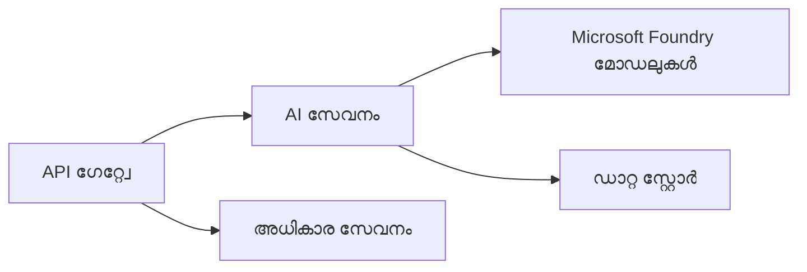
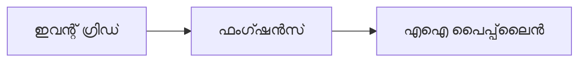

# അധ്യായം 8: പ്രൊഡക്ഷൻ & എൻറപ്രൈസ് മാതൃകകൾ

**📚 കോഴ്‌സ്**: [AZD For Beginners](../../README.md) | **⏱️ ദൈർഘ്യം**: 2-3 മണിക്കൂറുകൾ | **⭐ സങ്കീർണത**: ഉന്നതം

---

## അവലോകനം

ഈ അധ്യായം എൻറപ്രൈസ്-സജ്ജമായ ഡിപ്പ്ലോയ്മെന്റ് മാതൃകകൾ, സുരക്ഷാ ശക്തിയിലാക്കൽ, നിരീക്ഷണം, ഉത്സവ_AI_Workloads_നുള്ള ചെലവ് ഒപ്റ്റിമൈസേഷൻ എന്നിവ ഉൾക്കൊള്ളുന്നു.

> മാർച്ച് 2026-ൽ `azd 1.23.12` ilə പരിശോധന ചെയ്തിട്ടുണ്ട്.

## പഠന ലക്ഷ്യങ്ങൾ

ഈ അധ്യായം പൂർത്തിയാക്കിയാൽ, നിങ്ങൾക്ക് കഴിയുന്നത്:
- മൾട്ടി-റീജിയൻ അവലോകനക്ഷമ ആപ്ലിക്കേഷനുകൾ വിന്യസിക്കുക
- എൻറപ്രൈസ് സുരക്ഷാ മാതൃകകൾ നടപ്പിലാക്കുക
- സമഗ്ര നിരീക്ഷണം രൂപപ്പെടുത്തുക
- ചെലവുകൾ സ്കെയിൽ ചെയ്ത് ഒപ്റ്റിമൈസ് ചെയ്യുക
- AZD ഉപയോഗിച്ചുള്ള CI/CD പൈപ്പ്‌ലൈൻ ഘടിപ്പിക്കുക

---

## 📚 പാഠങ്ങൾ

| # | പാഠം | വിവരണം | സമയം |
|---|--------|-------------|------|
| 1 | [പ്രൊഡക്ഷൻ AI ആചാരങ്ങൾ](production-ai-practices.md) | എൻറപ്രൈസ് വിന്യാസ മാതൃകകൾ | 90 മിനിറ്റ് |

---

## 🚀 പ്രൊഡക്ഷൻ ചെക്ക്ലിസ്റ്റ്

- [ ] മൾട്ടി-റീജിയൻ ഡിപ്പ്ലോയ്മെന്റ് അവലോകനക്ഷമതയ്ക്കായി
- [ ] മാനേജുചെയ്‌തിരിക്കുന്ന ഐഡന്റിറ്റി ഉറപ്പാക്കൽ (കീകൾ ഇല്ലാതെ)
- [ ] ആപ്ലിക്കേഷൻ ഇൻസൈറ്റ്സ് നിരീക്ഷണത്തിനായി
- [ ] ചെലവ് ബഡ്ജറ്റുകളും അലേർട്ടുകളും ക്രമീകരിച്ചിരിക്കുന്നു
- [ ] സുരക്ഷാ സ്കാനിംഗ് സജീവമാക്കിയത്
- [ ] CI/CD പൈപ്പ്‌ലൈൻ ഇൻറഗ്രേഷൻ
- [ ] ദുരന്ത പുനരധിവസന പദ്ധതി

---

## 🏗️ ആർക്കിടെക്ചർ മാതൃകകൾ

### മാതൃക 1: മൈക്രോസർവീസസ് AI


### മാതൃക 2: ഇവന്റ്-ഡ്രീവൻ AI


---

## 🔐 സുരക്ഷാ മികച്ച ആചാരങ്ങൾ

```bicep
// Use managed identity
identity: {
  type: 'SystemAssigned'
}

// Private endpoints for AI services
properties: {
  publicNetworkAccess: 'Disabled'
  networkAcls: {
    defaultAction: 'Deny'
  }
}
```

---

## 💰 ചെലവ് ഒപ്റ്റിമൈസേഷൻ

| തന്ത്രം | ലാഭം |
|----------|---------|
| സീറോ വരെ സ്കെയ്ല് ചെയ്യുക (കൺറ്റെയ്‌നർ ആപ്പുകൾ) | 60-80% |
| ഡെവലപ്മെന്റിന് കൺസമ്പ്ഷൻ ടിയറുകൾ ഉപയോഗിക്കുക | 50-70% |
| നിർണായക സ്‌കെയിലിങ് | 30-50% |
| റിസർവു ചെയ്ത ശേഷി | 20-40% |

```bash
# ബജറ്റ് അലർട്ടുകൾ സജ്ജീകരിക്കുക
az consumption budget create \
  --budget-name "AI-Budget" \
  --amount 500 \
  --category Cost \
  --time-grain Monthly
```

---

## 📊 നിരീക്ഷണ സജ്ജീകരണം

```bash
# സ്റ്റ്രീം ലോഗുകൾ
azd monitor --logs

# ആപ്ലിക്കേഷൻ ഇൻസൈറ്റ്സ് പരിശോധിക്കുക
azd monitor --overview

# മെട്രിക്‌സ് കാണുക
az monitor metrics list --resource <resource-id>
```

---

## 🔗 നാവിഗേഷൻ

| ദിശ | അധ്യായം |
|-----------|---------|
| **മുൻപ്** | [അധ്യായം 7: തകരാറുകൾ പരിഹരിക്കൽ](../chapter-07-troubleshooting/README.md) |
| **കോഴ്‌സ് പൂർത്തിയായി** | [കോഴ്‌സ് ഹോം](../../README.md) |

---

## 📖 ബന്ധപ്പെട്ട സ്രോതസുകൾ

- [AI ഏജന്റുകൾ ഗൈഡ്](../chapter-02-ai-development/agents.md)
- [ആപ്ലിക്കേഷൻ ഇൻസൈറ്റ്സ്](../chapter-06-pre-deployment/application-insights.md)
- [മൾട്ടി ഏജന്റ് സൊല്യൂഷൻസ്](../chapter-05-multi-agent/README.md)
- [മൈക്രോസർവീസസ് ഉദാഹരണം](../../examples/microservices/README.md)

---

<!-- CO-OP TRANSLATOR DISCLAIMER START -->
**വിവരണം**:  
ഈ പ്രമാണം AI ഭാഷാന്തര സേവനം [Co-op Translator](https://github.com/Azure/co-op-translator) ഉപയോഗിച്ച് ഭാഷാന്തരം ചെയ്തിരിക്കുന്നു. കൃത്യതയ്ക്കായി ശ്രമിച്ചിരുന്നാലും, യന്ത്രം ചെയ്ത ഭാഷാന്തരങ്ങളിൽ പിശകുകൾ അല്ലെങ്കിൽ അശുദ്ധികൾ ഉണ്ടാകാമെന്ന് ദയവായി ശ്രദ്ധിക്കുക. സഞ്ചാരിക്കുന്ന ഭാഷയിലെ ആദ്യ ദസ്താവേകം അതിന്റെ പ്രാമാണിക ഉറവിടമായി കണക്കാക്കണം. ഗുരുതരമായ വിവരങ്ങൾക്ക്, പ്രൊഫഷണൽ മാനവ ഭാഷാന്തരം നിർദ്ദേശിക്കപ്പെടുന്നു. ഈ ഭാഷാന്തരം ഉപയോഗിക്കുന്നതിനാൽ ഉണ്ടാകുന്ന ഏതെങ്കിലും തെറ്റിദ്ധാരണകൾക്കും അർത്ഥബോധത്തിലെ പിഴവുകൾക്കും ഞങ്ങൾ ഉത്തരവാദികളാകുകയില്ല.
<!-- CO-OP TRANSLATOR DISCLAIMER END -->