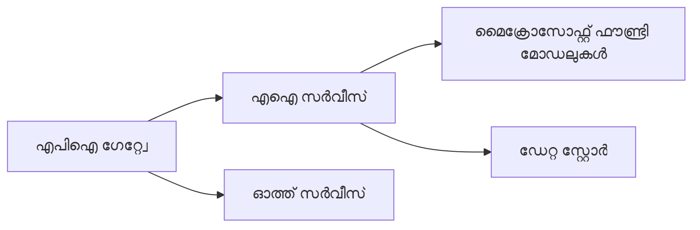
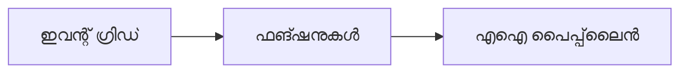

# അധ്യായം 8: ഉത്പാദനവും എന്റർപ്രൈസ് പാറ്റേണുകളും

**📚 കോഴ്സ്**: [AZD For Beginners](../../README.md) | **⏱️ ദൈർഘ്യം**: 2-3 മണിക്കൂർ | **⭐ സങ്കീർണം**: വികസിതം

---

## അവലോകനം

ഈ അധ്യായം എന്റർപ്രൈസ്-സജ്ജമായ വിന്യാസ പാറ്റേണുകൾ, സുരക്ഷാ മുറുക്കൽ, നിരീക്ഷണം, ഉത്പാദന AI പ്രവൃത്തികൾക്കുള്ള ചെലവ് മെച്ചപ്പെടുത്തൽ എന്നിവ ഉൾക്കൊള്ളുന്നു.

> `azd 1.27.1` ൽ 2026 ജൂലൈയിൽ സാധുത പരിശോധിച്ചതാണ്.

## പഠന ലക്ഷ്യങ്ങൾ

ഈ അധ്യായം പൂരിപ്പിച്ചാൽ, നിങ്ങൾക്ക്:
- ബഹുരദേശീയ പ്രതിരോധ ശേഷിയുള്ള ആപ്പ്ലിക്കേഷനുകൾ വിന്യസിക്കാം
- എന്റർപ്രൈസ് സുരക്ഷാ പാറ്റേണുകൾ നടപ്പാക്കാം
- സമഗ്രമായ നിരീക്ഷണം ക്രമീകരിക്കാം
- വലുതായി ചെലവ് മെച്ചപ്പെടുത്താം
- AZD ഉപയോഗിച്ച് CI/CD പൈപ്ലൈനുകൾ ഘടിപ്പിക്കാം

---

## 📚 പാഠങ്ങൾ

| # | പാഠം | വിവരണം | സമയം |
|---|--------|-------------|------|
| 1 | [ഉത്പാദന AI അഭ്യാസങ്ങൾ](production-ai-practices.md) | എന്റർപ്രൈസ് വിന്യാസ പാറ്റേണുകൾ | 90 മിനിറ്റ് |

---

## 🚀 ഉത്പാദന ചെക്ലിസ്റ്റ്

- [ ] പ്രതിരോധത്തിനായി ബഹുരദേശീയ വിന്യാസം
- [ ] മാനേജ്ഡ് ഐഡന്റിറ്റി ഉപയോഗിച്ച് അംഗീകാര സംവിധാനം (കീകൾ ഇല്ലാതെ)
- [ ] നിരീക്ഷണത്തിന് ആപ്പ് ഇൻസൈറ്റ്‌സ്
- [ ] ചെലവ് ബഡ്ജറ്റുകളും അലേർട്ടുകളും ക്രമീകരിച്ചിട്ടുള്ളത്
- [ ] സുരക്ഷാ സ്കാനിംഗ് സജ്ജമാക്കിയിട്ടുണ്ട്
- [ ] CI/CD പൈപ്ലൈൻ സംയോജനം
- [ ] ദുരന്തം പുനരുദ്ധാരണം പദ്ധതി

---

## 🏗️ ആര്‍ക്കിടെക്ചർ പാറ്റേണുകൾ

### പാറ്റേൺ 1: മൈക്രോസർവീസസ് AI



### പാറ്റേൺ 2: ഇവന്റ്-ഡ്രിവൻ AI



---

## 🔐 സുരക്ഷാ മികച്ച അഭ്യാസങ്ങൾ

```bicep
// Use managed identity
identity: {
  type: 'SystemAssigned'
}

// Private endpoints for AI services
properties: {
  publicNetworkAccess: 'Disabled'
  networkAcls: {
    defaultAction: 'Deny'
  }
}
```

---

## 💰 ചെലവ് മെച്ചപ്പെടുത്തൽ

| സ്ട്രാറ്റജി | ലാഭം |
|----------|---------|
| സ്രോല് ടു സീറോ (കണ്ടെയ്‌നർ ആപ്പുകൾ) | 60-80% |
| ഡെവലപ്പ്മെന്റിനായി ഉപയോഗം വരി ഉപയോഗിക്കുക | 50-70% |
| ഷെഡ്യൂൾ ചെയ്ത സ്കേലിംഗ് | 30-50% |
| റിസർവ് ചെയ്ത ശേഷി | 20-40% |

```bash
# ബഡ്ജറ്റ് അലേർട്ടുകൾ സെറ്റ് ചെയ്യുക
az consumption budget create \
  --budget-name "AI-Budget" \
  --amount 500 \
  --category Cost \
  --time-grain Monthly
```

---

## 📊 നിരീക്ഷണ ക്രമീകരണം

```bash
# പ്രവാഹം ലോഗുകൾ
azd monitor --logs

# അപ്ലിക്കേഷൻ ഇൻസൈട്സ് പരിശോധിക്കുക
azd monitor --overview

# മീറ്റ്രിക്‌സ് കാണുക
az monitor metrics list --resource <resource-id>
```

---

## 🔗 നാവിഗേഷൻ

| ദിശ | അധ്യായം |
|-----------|---------|
| **കഴിഞ്ഞത്** | [അധ്യായം 7: പ്രശ്നപരിഹാരം](../chapter-07-troubleshooting/README.md) |
| **കോഴ്സ് പൂർത്തിയായി** | [കോഴ്സ് ഹോം](../../README.md) |

---

## 📖 അനുബന്ധ ഉപകരണങ്ങൾ

- [AI ഏജന്റ്സ് ഗൈഡ്](../chapter-02-ai-development/agents.md)
- [ആപ്പ് ഇൻസൈറ്റ്‌സ്](../chapter-06-pre-deployment/application-insights.md)
- [മൾട്ടി-ഏജന്റ് സൊല്യൂഷനുകൾ](../chapter-05-multi-agent/README.md)
- [മൈക്രോസർവീസസ് ഉദാഹരണം](../../examples/microservices/README.md)

---

<!-- CO-OP TRANSLATOR DISCLAIMER START -->
**അറിയിപ്പ്**:
ഈ രേഖ AI പരിഭാഷാ സേവനം [Co-op Translator](https://github.com/Azure/co-op-translator) ഉപയോഗിച്ച് പരിഭാഷപ്പെടുത്തിയതാണ്. ഞങ്ങൾ കൃത്യതയ്ക്കായി ശ്രമിക്കുന്നുവെങ്കിലും, ഓട്ടോമേറ്റഡ് പരിഭാഷകളിൽ പിഴവുകൾ അല്ലെങ്കിൽ തെറ്റായ വിവരങ്ങൾ ഉണ്ടാകാൻ സാധ്യതയുണ്ട്. അതിന്റെ സ്വാഭാവിക ഭാഷയിലുള്ള അസൽ രേഖയാണ് പ്രാമാണികമായ ഉറവിടമായി പരിഗണിക്കേണ്ടത്. നിർണായകമായ വിവരങ്ങൾക്ക്, പ്രൊഫഷണൽ മനുഷ്യ പരിഭാഷ ശുപാർശ ചെയ്യുന്നു. ഈ പരിഭാഷ ഉപയോഗിച്ച് ഉണ്ടാകുന്ന തെറ്റിദ്ധാരണകൾ അല്ലെങ്കിൽ തെറ്റായ വ്യാഖ്യാനങ്ങൾക്കായി ഞങ്ങൾ ഉത്തരവാദികളല്ല.
<!-- CO-OP TRANSLATOR DISCLAIMER END -->