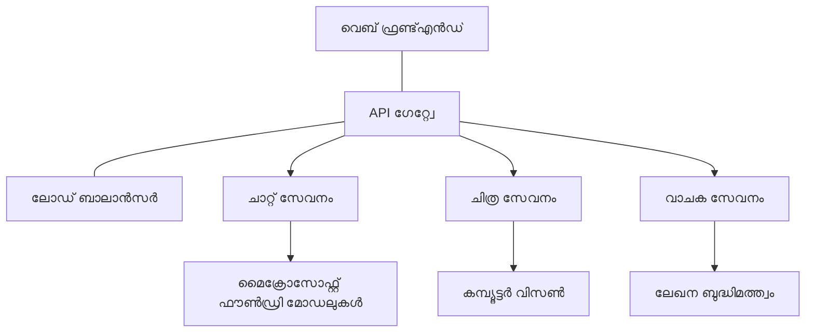

# പ്രൊഡക്ഷൻ AI പ്രവൃത്തി ഭാരം മികച്ച പാടവങ്ങൾ AZD ഉപയോഗിച്ച്

**അധ്യായത്തിന്റെ നാവിഗേഷൻ:**
- **📚 കോഴ്സ് ഹോം**: [AZD For Beginners](../../README.md)
- **📖 നിലവിലെ അധ്യായം**: Chapter 8 - Production & Enterprise Patterns
- **⬅️ മുൻപ് അധ്യായം**: [Chapter 7: Troubleshooting](../chapter-07-troubleshooting/debugging.md)
- **⬅️ ബന്ധപ്പെട്ടത്**: [AI Workshop Lab](ai-workshop-lab.md)
- **🎯 കോഴ്സ് പൂർത്തിയായി**: [AZD For Beginners](../../README.md)

## അവലോകനം

ഈ ഗൈഡ് Azure Developer CLI (AZD) ഉപയോഗിച്ച് പ്രൊഡക്ഷൻ-സജ്ജമായ AI പ്രവൃത്തി ഭാരങ്ങൾ വിന്യസിക്കുന്നതിനു നൽകിയ ഒരു സമഗ്രമായ മികച്ച പാടവങ്ങൾ നൽകുന്നു. Microsoft Foundry Discord കമ്മ്യൂണിറ്റിയുടെ ഫീഡ്‌ബാക്കും യഥാർത്ഥ കസ്റ്റമർ വിന്യസനങ്ങളും അടിസ്ഥാനമാക്കിയുള്ള ഈ പാടവങ്ങൾ പ്രൊഡക്ഷൻ AI സിസ്റ്റങ്ങളിൽ ഏറ്റവും വ്യാപകമായ വെല്ലുവിളികളെ അഭിമുഖീകരിക്കുന്നു.

## മുഖ്യ വെല്ലുവിളികൾ പരിഹരിച്ചത്

നമ്മുടെ കമ്മ്യൂണിറ്റി പോൾ ഫലം അടിസ്ഥാനമാക്കി, വികസിപ്പകർ നേരിടുന്ന പ്രധാന വെല്ലുവിളികൾ:

- **45%** മൾട്ടി-സർവീസ് AI വിന്യാസങ്ങളിലെ പ്രശ്നങ്ങൾ
- **38%** ക്രെഡൻഷ്യൽ, രഹസ്യ മാനേജ്മെന്റിൽ ബുദ്ധിമുട്ടുണ്ടാകുന്നു  
- **35%** പ്രൊഡക്ഷൻ റെഡിനസ്, സ്കെയ്ലിംഗ് ബുദ്ധിമുട്ടുകൾ
- **32%** മെച്ചപ്പെട്ട ചെലവ് ഇഷ്ടാനുസൃത ചികിത്സ ആവശ്യമാണ്
- **29%** മേല്പാരവൽക്കരണം, പ്രശ്നപരിഹാരത്തിൽ മെച്ചപ്പെടുത്താൻ ആവശ്യകത

## പ്രൊഡക്ഷൻ AIയ്ക്ക് ആർക്കിടെക്ചർ പാടേണുകൾ

### പാടേൺ 1: മൈക്രോസർവീസസ് AI ആർക്കിടെക്ചർ

**എപ്പോഴാണ് ഉപയോഗിക്കുക**: ബഹുജന കഴിവുകൾ ഉള്ള സങ്കീർണ്ണ AI പ്രയോഗങ്ങൾ


**AZD നടപ്പാക്കൽ**:

```yaml
# azure.yaml
name: enterprise-ai-platform
services:
  web:
    project: ./web
    host: staticwebapp
  api-gateway:
    project: ./api-gateway
    host: containerapp
  chat-service:
    project: ./services/chat
    host: containerapp
  vision-service:
    project: ./services/vision
    host: containerapp
  text-service:
    project: ./services/text
    host: containerapp
```

### പാടേൺ 2: ഇവന്റ്-ഡ്രിവൻ AI പ്രോസസ്സ്

**എപ്പോഴാണ് ഉപയോഗിക്കുക**: ബാച്ച് പ്രോസസ്സ്, ഡോക്യുമെന്റ് വിശകലനം, അസിങ്ക് വർക്ക്‌ഫ്ലോകൾ

```bicep
// Event Hub for AI processing pipeline
resource eventHub 'Microsoft.EventHub/namespaces@2023-01-01-preview' = {
  name: eventHubNamespaceName
  location: location
  sku: {
    name: 'Standard'
    tier: 'Standard'
    capacity: 1
  }
}

// Service Bus for reliable message processing
resource serviceBus 'Microsoft.ServiceBus/namespaces@2022-10-01-preview' = {
  name: serviceBusNamespaceName
  location: location
  sku: {
    name: 'Premium'
    tier: 'Premium'
    capacity: 1
  }
}

// Function App for processing
resource functionApp 'Microsoft.Web/sites@2023-01-01' = {
  name: functionAppName
  location: location
  kind: 'functionapp,linux'
  properties: {
    siteConfig: {
      appSettings: [
        {
          name: 'FUNCTIONS_EXTENSION_VERSION'
          value: '~4'
        }
        {
          name: 'AZURE_OPENAI_ENDPOINT'
          value: '@Microsoft.KeyVault(VaultName=${keyVault.name};SecretName=openai-endpoint)'
        }
      ]
    }
  }
}
```

## AI ഏജന്റ് ഹെൽത്ത് കുറിച്ച് ആലോചിക്കുന്നത്

ഒരു പരമ്പരാഗത വെബ് ആപ്പ് തകരുമ്പോൾ, ലക്ഷണങ്ങൾ സാധാരണമാണ്: ഒരു പേജ് ലോഡ് ആവുന്നില്ല, API ഒരു പിശക് ഫലിപ്പിക്കുന്നു, അല്ലെങ്കിൽ വിന്യാസം പരാജയപ്പെടുന്നു. AI-ഓടുള്ള പ്രയോഗങ്ങളും അതേ രീതി തകരാൻ സാധ്യതയുണ്ട്—എന്നാൽ അവർ സൂക്ഷ്മമായ രീതിയിൽ തെറ്റായി പെരുമാറാൻ കഴിയും, അത് ദൃശ്യമായ പിശക് സന്ദേശങ്ങൾ നൽകണമെന്നില്ല.

ഈ വിഭാഗം AI പ്രവൃത്തി ഭാരങ്ങൾ മേല്പറഞ്ഞ മനസിക മാതൃക നിർമ്മിക്കുന്നതിന് സഹായിക്കുന്നു, തെറ്റുകൾ തടയാൻ എവിടെ നോക്കണം എന്ന് അറിയാൻ.

### ഏജന്റ് ഹെൽത്ത് പാരമ്പരാഗത ആപ്പ് ഹെൽത്തിൽ നിന്ന് വ്യത്യസ്തം

ഒരു പാരമ്പര്യ ആപ്പ് ആണെങ്കിൽ പ്രവർത്തിക്കും അല്ലെങ്കിൽ പ്രവർത്തിക്കില്ല. ഒരു AI ഏജന്റ് പ്രവർത്തിച്ച് തെറ്റായ ഫലങ്ങൾ നൽകാം. ഏജന്റ് ഹെൽത്ത് രണ്ട് പാളികളിലായി ചിന്തിക്കുക:

| പാളി | എന്തു നോക്കണം | എവിടെ നോക്കണം |
|-------|--------------|---------------|
| **ഇൻഫ്രാസ്ട്രകചർ ഹെൽത്ത്** | സേവനം പ്രവർത്തിക്കുന്നുണ്ടോ? വിഭവങ്ങൾ അനുവദിച്ചിട്ടുണ്ടോ? എൻഡ്‌പോയിന്റ് എത്താനുള്ളവയാണോ? | `azd monitor`, Azure Portal റിസോഴ്‌സ് ഹെൽത്ത്, കണ്ടെയ്‌നർ/ആപ്പ് ലോഗുകൾ |
| **പെരുമാറ്റ ഹെൽത്ത്** | ഏജന്റ് ശരിയായി മറുപടി നൽകുന്നുണ്ടോ? മറുപടികൾ സമയബന്ധിതമാണോ? മോഡൽ ശരിയായി വിളിക്കപ്പെടുന്നുണ്ടോ? | Application Insights ട്രേസ്സ്, മോഡൽ കോൾ ലാറ്റൻസി മെട്രിക്‌സ്, മറുപടി ഗുണമേന്മാ ലോഗുകൾ |

ഇൻഫ്രാസ്ട്രകചർ ഹെൽത്ത് പരിചിതമാണ്—പതിയെ സമ്പൂർണ azd ആപ്പിനും ഇത് സമാനമാണ്. പെരുമാറ്റ ഹെൽത്ത് AI പ്രവൃത്തി ഭാരങ്ങൾക്ക് പുതിയ പാളിയാണ്.

### AI ആപ്പുകൾ പ്രതീക്ഷിച്ചതുപോലെ പ്രവർത്തിക്കാത്തപ്പോൾ എവിടെ നോക്കണം

നിങ്ങളുടെ AI പ്രയോഗം പ്രതീക്ഷിച്ചതുപോലെ ഫലങ്ങൾ നൽകുന്നില്ലെങ്കിൽ, ഇവിടെ ഒരു ആശയപ്പട്ടിക നൽകുന്നു:

1. **അടിസ്ഥാനങ്ങളിൽനിന്ന് ആരംഭിക്കുക.** ആപ്പ് പ്രവർത്തിക്കുകയാണോ? അവശ്യമായ ആശ്രിതങ്ങൾ എത്താൻ കഴിയും എന്നോ? മറ്റേതെങ്കിലും ആപ്പിനായി ചെയ്യുന്നതുപോലെ `azd monitor`യും റിസോഴ്‌സ് ഹെൽത്തും പരിശോധിക്കുക.
2. **മോഡൽ കണക്ഷൻ പരിശോധിക്കുക.** നിങ്ങളുടെ പ്രയോഗം AI മോഡൽ വിജയകരമായി വിളിക്കുന്നുണ്ടോ? മോഡൽ കോൾ പരാജയപ്പെടലും ടൈംഔട്ട് സംഭവിച്ചതും AI ആപ്പ് പ്രശ്നങ്ങളുടെ ഏറ്റവും സാധാരണ കാരണങ്ങളാണ്, ഇത് പ്രയോഗ ലോഗുകളിൽ പ്രത്യക്ഷപ്പെടും.
3. **മോഡൽ സ്വീകരിച്ചത് എന്താണെന്ന് നോക്കുക.** AI മറുപടികൾ ഇൻപുട്ട് (പ്രോമ്പ്റ്റും സെൻട്രിക്സ്റ്റും) അനുസരിച്ചാണ്. ഫലം തെറ്റാണെങ്കിൽ ഇൻപുട്ട് സാധാരണയായി തെറ്റാണ്. നിങ്ങളുടെ പ്രയോഗം മോഡലിന് ശരിയായ ഡാറ്റ അയക്കുന്നുണ്ടോ എന്നത് പരിശോധിക്കുക.
4. **മറുപടി ലാറ്റൻസി പരിശോധിക്കുക.** AI മോഡൽ കോൾ സാധാരണ API കോൾടേക്കാൾ മെതഡാണ്. ആപ്പ് മന്ദഗതിയുള്ളത്രയെങ്കിൽ, മോഡൽ മറുപടി സമയങ്ങൾ കൂടിയിട്ടുണ്ടോ എന്ന് പരിശോധിക്കുക—ഇത് ത്രോട്ട്ലിംഗ്, ശേഷി പരിധികൾ, മേഖല ലെ congestion സൂചിപ്പിക്കാം.
5. **ചെലവ് സൂചനകൾ ശ്രദ്ധിക്കുക.** ടോക്കൻ ഉപയോഗം അല്ലെങ്കിൽ API കോളുകളിൽ അനുപേക്ഷിത വർദ്ധനവ് ഒരു ലൂപ്പ്, തെറ്റായ പ്രോമ്പ്റ്റ് അല്ലെങ്കിൽ അനാവശ്യ retry അളവുകൾ സൂചിപ്പിക്കുന്നതായി കാണാം.

നിങ്ങൾക്ക് ടൂൾസ് ഉടൻ കൈകാര്യം ചെയ്യേണ്ടതില്ല. പ്രധാനമായുള്ളത് AI ആപ്പുകൾക്ക് പെരുമാറ്റത്തിന്റെ ഒരു അധിക പാളി ഉണ്ടെന്ന് മനസ്സിലാക്കുക, azdയുടെ നിർത്തിയിരിക്കുന്ന മോണിറ്ററിങ് (`azd monitor`) ഇരു പാളികളിലും പരിശോധിക്കാനുള്ള മുൽക്കൂട്ടാണ് നൽകുന്നത്.

---

## സുരക്ഷ മികച്ച പാടവങ്ങൾ

### 1. സീറോ-ട്രസ്റ്റ് സുരക്ഷ മോഡൽ

**നടപ്പാക്കൽ തന്ത്രം**:
- അംഗീകാരം ഇല്ലാതെ സർവിസുകൾ തമ്മിലുള്ള സംവാദം ഇല്ല
- എല്ലാ API കോൾസും മാനേജുചെയ്ത ഐഡന്റിറ്റികൾ ഉപയോഗിക്കുന്നു
- പ്രൈവറ്റ് എൻഡ്‌പോയിന്റുകൾ ഉപയോഗിച്ച് നെറ്റ്വർക്ക് ഐസൊലേഷൻ
- ഏറ്റവും കുറഞ്ഞ അവകാശമേറ്റുള്ള ആക്സസ് നിയന്ത്രണങ്ങൾ

```bicep
// Managed Identity for each service
resource chatServiceIdentity 'Microsoft.ManagedIdentity/userAssignedIdentities@2023-01-31' = {
  name: 'chat-service-identity'
  location: location
}

// Role assignments with minimal permissions
resource openAIUserRole 'Microsoft.Authorization/roleAssignments@2022-04-01' = {
  scope: openAIAccount
  name: guid(openAIAccount.id, chatServiceIdentity.id, openAIUserRoleDefinitionId)
  properties: {
    roleDefinitionId: subscriptionResourceId('Microsoft.Authorization/roleDefinitions', '5e0bd9bd-7b93-4f28-af87-19fc36ad61bd')
    principalId: chatServiceIdentity.properties.principalId
    principalType: 'ServicePrincipal'
  }
}
```

### 2. സുരക്ഷിത രഹസ്യം മാനേജുമെന്റ്

**കീ വോൾട്ട് എന്റഗ്രേഷൻ പാടേൺ**:

```bicep
// Key Vault with proper access policies
resource keyVault 'Microsoft.KeyVault/vaults@2023-02-01' = {
  name: keyVaultName
  location: location
  properties: {
    tenantId: tenant().tenantId
    sku: {
      family: 'A'
      name: 'premium'  // Use premium for production
    }
    enableRbacAuthorization: true  // Use RBAC instead of access policies
    enablePurgeProtection: true    // Prevent accidental deletion
    enableSoftDelete: true
    softDeleteRetentionInDays: 90
  }
}

// Store all AI service credentials
resource openAIKeySecret 'Microsoft.KeyVault/vaults/secrets@2023-02-01' = {
  parent: keyVault
  name: 'openai-api-key'
  properties: {
    value: openAIAccount.listKeys().key1
    attributes: {
      enabled: true
    }
  }
}
```

### 3. നെറ്റ്വർക്ക് സുരക്ഷ

**പ്രൈവറ്റ് എൻഡ്‌പോയിന്റ് കോൺഫിഗറേഷൻ**:

```bicep
// Virtual Network for AI services
resource virtualNetwork 'Microsoft.Network/virtualNetworks@2023-04-01' = {
  name: vnetName
  location: location
  properties: {
    addressSpace: {
      addressPrefixes: ['10.0.0.0/16']
    }
    subnets: [
      {
        name: 'ai-services-subnet'
        properties: {
          addressPrefix: '10.0.1.0/24'
          privateEndpointNetworkPolicies: 'Disabled'
        }
      }
      {
        name: 'app-services-subnet'
        properties: {
          addressPrefix: '10.0.2.0/24'
          delegations: [
            {
              name: 'Microsoft.Web/serverFarms'
              properties: {
                serviceName: 'Microsoft.Web/serverFarms'
              }
            }
          ]
        }
      }
    ]
  }
}

// Private endpoints for all AI services
resource openAIPrivateEndpoint 'Microsoft.Network/privateEndpoints@2023-04-01' = {
  name: '${openAIAccountName}-pe'
  location: location
  properties: {
    subnet: {
      id: virtualNetwork.properties.subnets[0].id
    }
    privateLinkServiceConnections: [
      {
        name: 'openai-connection'
        properties: {
          privateLinkServiceId: openAIAccount.id
          groupIds: ['account']
        }
      }
    ]
  }
}
```

## പ്രകടനവും സ്കെയ്ലിംഗും

### 1. ഓട്ടോ-സ്കെയ്ലിംഗ് തന്ത്രങ്ങൾ

**കണ്ടെയ്‌നർ ആപ്പുകളുടെ ഓട്ടോ-സ്കെയ്ലിംഗ്**:

```bicep
resource containerApp 'Microsoft.App/containerApps@2023-05-01' = {
  name: containerAppName
  location: location
  properties: {
    configuration: {
      ingress: {
        external: true
        targetPort: 8000
        transport: 'http'
      }
    }
    template: {
      scale: {
        minReplicas: 2  // Always have 2 instances minimum
        maxReplicas: 50 // Scale up to 50 for high load
        rules: [
          {
            name: 'http-scaling'
            http: {
              metadata: {
                concurrentRequests: '20'  // Scale when >20 concurrent requests
              }
            }
          }
          {
            name: 'cpu-scaling'
            custom: {
              type: 'cpu'
              metadata: {
                type: 'Utilization'
                value: '70'  // Scale when CPU >70%
              }
            }
          }
        ]
      }
    }
  }
}
```

### 2. ക്യാഷിംഗ് തന്ത്രങ്ങൾ

**AI മറുപടികൾക്കായി Redis ക്യാഷ്**:

```bicep
// Redis Premium for production workloads
resource redisCache 'Microsoft.Cache/redis@2023-04-01' = {
  name: redisCacheName
  location: location
  properties: {
    sku: {
      name: 'Premium'
      family: 'P'
      capacity: 1
    }
    enableNonSslPort: false
    minimumTlsVersion: '1.2'
    redisConfiguration: {
      'maxmemory-policy': 'allkeys-lru'
    }
    // Enable clustering for high availability
    redisVersion: '6.0'
    shardCount: 2
  }
}

// Cache configuration in application
var cacheConnectionString = '${redisCache.properties.hostName}:6380,password=${redisCache.listKeys().primaryKey},ssl=True,abortConnect=False'
```

### 3. ലോഡ് ബാലൻസിംഗ്, ട്രാഫിക് മാനേജ്മെന്റ്

**WAF ഉള്ള ആപ്ലിക്കേഷൻ ഗേറ്റ്വേ**:

```bicep
// Application Gateway with Web Application Firewall
resource applicationGateway 'Microsoft.Network/applicationGateways@2023-04-01' = {
  name: appGatewayName
  location: location
  properties: {
    sku: {
      name: 'WAF_v2'
      tier: 'WAF_v2'
      capacity: 2
    }
    webApplicationFirewallConfiguration: {
      enabled: true
      firewallMode: 'Prevention'
      ruleSetType: 'OWASP'
      ruleSetVersion: '3.2'
    }
    // Backend pools for AI services
    backendAddressPools: [
      {
        name: 'ai-services-pool'
        properties: {
          backendAddresses: [
            {
              fqdn: '${containerApp.properties.configuration.ingress.fqdn}'
            }
          ]
        }
      }
    ]
  }
}
```

## 💰 ചെലവ് ഇഷ്ടാനുസരണം

### 1. വിഭവങ്ങളുടെ ശരിയായ വലിപ്പം

**പരിസര-നിർദ്ദിഷ്ട കോൺഫിഗറേഷനുകൾ**:

```bash
# വികസന പരിസ്ഥിതി
azd env new development
azd env set AZURE_OPENAI_SKU "S0"
azd env set AZURE_OPENAI_CAPACITY 10
azd env set AZURE_SEARCH_SKU "basic"
azd env set CONTAINER_CPU 0.5
azd env set CONTAINER_MEMORY 1.0

# ഉത്പാദനം പരിസ്ഥിതി
azd env new production
azd env set AZURE_OPENAI_SKU "S0"
azd env set AZURE_OPENAI_CAPACITY 100
azd env set AZURE_SEARCH_SKU "standard"
azd env set CONTAINER_CPU 2.0
azd env set CONTAINER_MEMORY 4.0
```

### 2. ചെലവ് മേൽനോട്ടം, ബജറ്റുകൾ

```bicep
// Cost management and budgets
resource budget 'Microsoft.Consumption/budgets@2023-05-01' = {
  name: 'ai-workload-budget'
  properties: {
    timePeriod: {
      startDate: '2024-01-01'
      endDate: '2024-12-31'
    }
    timeGrain: 'Monthly'
    amount: 2000  // $2000 monthly budget
    category: 'Cost'
    notifications: {
      warning: {
        enabled: true
        operator: 'GreaterThan'
        threshold: 80
        contactEmails: [
          'finance@company.com'
          'engineering@company.com'
        ]
        contactRoles: [
          'Owner'
          'Contributor'
        ]
      }
      critical: {
        enabled: true
        operator: 'GreaterThan'
        threshold: 95
        contactEmails: [
          'cto@company.com'
        ]
      }
    }
  }
}
```

### 3. ടോക്കൻ ഉപയോഗം ഇഷ്ടാനുസരണം

**OpenAI ചെലവ് മാനേജ്മെന്റ്**:

```typescript
// അപേക്ഷ നിലയിലെ ടോക്കൺ മെച്ചപ്പെടുത്തൽ
class TokenOptimizer {
  private readonly maxTokens = 4000;
  private readonly reserveTokens = 500;
  
  optimizePrompt(userInput: string, context: string): string {
    const availableTokens = this.maxTokens - this.reserveTokens;
    const estimatedTokens = this.estimateTokens(userInput + context);
    
    if (estimatedTokens > availableTokens) {
      // ഉപയോക്തൃ ഇൻപുട്ട് അല്ല, പരിസരചടങ്ങ് തുരത്തുക
      context = this.truncateContext(context, availableTokens - this.estimateTokens(userInput));
    }
    
    return `${context}\n\nUser: ${userInput}`;
  }
  
  private estimateTokens(text: string): number {
    // ഏകകണക്കു: 1 ടോക്കൺ ≈ 4 അക്ഷരങ്ങൾ
    return Math.ceil(text.length / 4);
  }
}
```

## മേല്പറഞ്ഞവ നിരീക്ഷണവും ദൃശ്യമാക്കലും

### 1. സമഗ്ര ആപ്ലിക്കേഷൻ ഇൻസൈറ്റ്സ്

```bicep
// Application Insights with advanced features
resource applicationInsights 'Microsoft.Insights/components@2020-02-02' = {
  name: applicationInsightsName
  location: location
  kind: 'web'
  properties: {
    Application_Type: 'web'
    WorkspaceResourceId: logAnalyticsWorkspace.id
    SamplingPercentage: 100  // Full sampling for AI apps
    DisableIpMasking: false  // Enable for security
  }
}

// Custom metrics for AI operations
resource aiMetricAlerts 'Microsoft.Insights/metricAlerts@2018-03-01' = {
  name: 'ai-high-error-rate'
  location: 'global'
  properties: {
    description: 'Alert when AI service error rate is high'
    severity: 2
    enabled: true
    scopes: [
      applicationInsights.id
    ]
    evaluationFrequency: 'PT1M'
    windowSize: 'PT5M'
    criteria: {
      'odata.type': 'Microsoft.Azure.Monitor.SingleResourceMultipleMetricCriteria'
      allOf: [
        {
          name: 'high-error-rate'
          metricName: 'requests/failed'
          operator: 'GreaterThan'
          threshold: 10
          timeAggregation: 'Count'
        }
      ]
    }
  }
}
```

### 2. AI-നിർദ്ദിഷ്ട മേൽനോട്ടം

**AI മെട്രിക്ക്സിനുള്ള കസ്റ്റം ഡാഷ്ബോർഡുകൾ**:

```json
// Dashboard configuration for AI workloads
{
  "dashboard": {
    "name": "AI Application Monitoring",
    "tiles": [
      {
        "name": "OpenAI Request Volume",
        "query": "requests | where name contains 'openai' | summarize count() by bin(timestamp, 5m)"
      },
      {
        "name": "AI Response Latency",
        "query": "requests | where name contains 'openai' | summarize avg(duration) by bin(timestamp, 5m)"
      },
      {
        "name": "Token Usage",
        "query": "customMetrics | where name == 'openai_tokens_used' | summarize sum(value) by bin(timestamp, 1h)"
      },
      {
        "name": "Cost per Hour",
        "query": "customMetrics | where name == 'openai_cost' | summarize sum(value) by bin(timestamp, 1h)"
      }
    ]
  }
}
```

### 3. ഹെൽത്ത് ചെക്കുകളും അപ്പ്ടൈം മേൽനോട്ടവും

```bicep
// Application Insights availability tests
resource availabilityTest 'Microsoft.Insights/webtests@2022-06-15' = {
  name: 'ai-app-availability-test'
  location: location
  tags: {
    'hidden-link:${applicationInsights.id}': 'Resource'
  }
  properties: {
    SyntheticMonitorId: 'ai-app-availability-test'
    Name: 'AI Application Availability Test'
    Description: 'Tests AI application endpoints'
    Enabled: true
    Frequency: 300  // 5 minutes
    Timeout: 120    // 2 minutes
    Kind: 'ping'
    Locations: [
      {
        Id: 'us-east-2-azr'
      }
      {
        Id: 'us-west-2-azr'
      }
    ]
    Configuration: {
      WebTest: '''
        <WebTest Name="AI Health Check" 
                 Id="8d2de8d2-a2b0-4c2e-9a0d-8f9c9a0b8c8d" 
                 Enabled="True" 
                 CssProjectStructure="" 
                 CssIteration="" 
                 Timeout="120" 
                 WorkItemIds="" 
                 xmlns="http://microsoft.com/schemas/VisualStudio/TeamTest/2010" 
                 Description="" 
                 CredentialUserName="" 
                 CredentialPassword="" 
                 PreAuthenticate="True" 
                 Proxy="default" 
                 StopOnError="False" 
                 RecordedResultFile="" 
                 ResultsLocale="">
          <Items>
            <Request Method="GET" 
                     Guid="a5f10126-e4cd-570d-961c-cea43999a200" 
                     Version="1.1" 
                     Url="${webApp.properties.defaultHostName}/health" 
                     ThinkTime="0" 
                     Timeout="120" 
                     ParseDependentRequests="True" 
                     FollowRedirects="True" 
                     RecordResult="True" 
                     Cache="False" 
                     ResponseTimeGoal="0" 
                     Encoding="utf-8" 
                     ExpectedHttpStatusCode="200" 
                     ExpectedResponseUrl="" 
                     ReportingName="" 
                     IgnoreHttpStatusCode="False" />
          </Items>
        </WebTest>
      '''
    }
  }
}
```

## ദുരന്ത നിവാരണവും ഉയര്‍ന്ന ലഭ്യതയും

### 1. മൾട്ടി-റിയജിയൻ വിന്യാസം

```yaml
# azure.yaml - Multi-region configuration
name: ai-app-multiregion
services:
  api-primary:
    project: ./api
    host: containerapp
    env:
      - AZURE_REGION=eastus
  api-secondary:
    project: ./api
    host: containerapp
    env:
      - AZURE_REGION=westus2
```

```bicep
// Traffic Manager for global load balancing
resource trafficManager 'Microsoft.Network/trafficManagerProfiles@2022-04-01' = {
  name: trafficManagerProfileName
  location: 'global'
  properties: {
    profileStatus: 'Enabled'
    trafficRoutingMethod: 'Priority'
    dnsConfig: {
      relativeName: trafficManagerProfileName
      ttl: 30
    }
    monitorConfig: {
      protocol: 'HTTPS'
      port: 443
      path: '/health'
      intervalInSeconds: 30
      toleratedNumberOfFailures: 3
      timeoutInSeconds: 10
    }
    endpoints: [
      {
        name: 'primary-endpoint'
        type: 'Microsoft.Network/trafficManagerProfiles/azureEndpoints'
        properties: {
          targetResourceId: primaryAppService.id
          endpointStatus: 'Enabled'
          priority: 1
        }
      }
      {
        name: 'secondary-endpoint'
        type: 'Microsoft.Network/trafficManagerProfiles/azureEndpoints'
        properties: {
          targetResourceId: secondaryAppService.id
          endpointStatus: 'Enabled'
          priority: 2
        }
      }
    ]
  }
}
```

### 2. ഡാറ്റ ബാക്കപ്പ്, വീണ്ടെടുക്കൽ

```bicep
// Backup configuration for critical data
resource backupVault 'Microsoft.DataProtection/backupVaults@2023-05-01' = {
  name: backupVaultName
  location: location
  identity: {
    type: 'SystemAssigned'
  }
  properties: {
    storageSettings: [
      {
        datastoreType: 'VaultStore'
        type: 'LocallyRedundant'
      }
    ]
  }
}

// Backup policy for AI models and data
resource backupPolicy 'Microsoft.DataProtection/backupVaults/backupPolicies@2023-05-01' = {
  parent: backupVault
  name: 'ai-data-backup-policy'
  properties: {
    policyRules: [
      {
        backupParameters: {
          backupType: 'Full'
          objectType: 'AzureBackupParams'
        }
        trigger: {
          schedule: {
            repeatingTimeIntervals: [
              'R/2024-01-01T02:00:00+00:00/P1D'  // Daily at 2 AM
            ]
          }
          objectType: 'ScheduleBasedTriggerContext'
        }
        dataStore: {
          datastoreType: 'VaultStore'
          objectType: 'DataStoreInfoBase'
        }
        name: 'BackupDaily'
        objectType: 'AzureBackupRule'
      }
    ]
  }
}
```

## ഡെവ്‌ഓപ്സ്, CI/CD സംയോജനം

### 1. GitHub ആക്ഷൻസ് വർക്ക്‌ഫ്ലോ

```yaml
# .github/workflows/deploy-ai-app.yml
name: Deploy AI Application

on:
  push:
    branches: [main]
  pull_request:
    branches: [main]

jobs:
  test:
    runs-on: ubuntu-latest
    steps:
      - uses: actions/checkout@v4
      
      - name: Setup Python
        uses: actions/setup-python@v4
        with:
          python-version: '3.11'
          
      - name: Install dependencies
        run: |
          pip install -r requirements.txt
          pip install pytest
          
      - name: Run tests
        run: pytest tests/
        
      - name: AI Safety Tests
        run: |
          python scripts/test_ai_safety.py
          python scripts/validate_prompts.py

  deploy-staging:
    needs: test
    if: github.event_name == 'pull_request'
    runs-on: ubuntu-latest
    steps:
      - uses: actions/checkout@v4
      
      - name: Setup AZD
        uses: Azure/setup-azd@v1.0.0
        
      - name: Login to Azure
        uses: azure/login@v1
        with:
          creds: ${{ secrets.AZURE_CREDENTIALS }}
          
      - name: Deploy to Staging
        run: |
          azd env select staging
          azd deploy

  deploy-production:
    needs: test
    if: github.ref == 'refs/heads/main'
    runs-on: ubuntu-latest
    steps:
      - uses: actions/checkout@v4
      
      - name: Setup AZD
        uses: Azure/setup-azd@v1.0.0
        
      - name: Login to Azure
        uses: azure/login@v1
        with:
          creds: ${{ secrets.AZURE_CREDENTIALS }}
          
      - name: Deploy to Production
        run: |
          azd env select production
          azd deploy
          
      - name: Run Production Health Checks
        run: |
          python scripts/health_check.py --env production
```

### 2. ഇൻഫ്രാസ്ട്രക്ചർ സാധുത പരിശോധന

```bash
# scripts/validate_infrastructure.sh
#!/bin/bash

echo "Validating AI infrastructure deployment..."

# ആവശ്യമായ എല്ലാ സേവനങ്ങളും പ്രവർത്തിക്കുന്നുവോ എന്ന് പരിശോധിക്കുക
services=("openai" "search" "storage" "keyvault")
for service in "${services[@]}"; do
    echo "Checking $service..."
    if ! az resource list --resource-type "Microsoft.CognitiveServices/accounts" --query "[?contains(name, '$service')]" -o tsv; then
        echo "ERROR: $service not found"
        exit 1
    fi
done

# OpenAI മോഡൽ വിന്യസനങ്ങൾ സാധൂകരിക്കുക
echo "Validating OpenAI model deployments..."
models=$(az cognitiveservices account deployment list --name $AZURE_OPENAI_NAME --resource-group $AZURE_RESOURCE_GROUP --query "[].name" -o tsv)
if [[ ! $models == *"gpt-35-turbo"* ]]; then
    echo "ERROR: Required model gpt-35-turbo not deployed"
    exit 1
fi

# AI സേവന ബന്ധം പരിശോധന നടത്തുക
echo "Testing AI service connectivity..."
python scripts/test_connectivity.py

echo "Infrastructure validation completed successfully!"
```

## പ്രൊഡക്ഷൻ റെഡിനസ് ചെക്ക്ലിസ്റ്റ്

### സുരക്ഷ ✅
- [ ] എല്ലാ സർവീസുകളും മാനേജുചെയ്ത ഐഡന്റിറ്റികൾ ഉപയോഗിക്കുന്നു
- [ ] രഹസ്യങ്ങൾ കീ വോൾട്ടിൽ സൂക്ഷിച്ചിട്ടുണ്ട്
- [ ] പ്രൈവറ്റ് എൻഡ്‌പോയിന്റുകൾ കോൺഫിഗർ ചെയ്തിട്ടുണ്ട്
- [ ] നെറ്റ്വർക്ക് സെക്യൂരിറ്റി ഗ്രൂപ്പുകൾ നടപ്പിലാക്കിയിട്ടുണ്ട്
- [ ] കുറഞ്ഞ അവകാശങ്ങളുള്ള RBAC
- [ ] പബ്ലിക് എൻഡ്‌പോയിന്റുകളിൽ WAF സജീവമാക്കിയിട്ടുണ്ട്

### പ്രകടനം ✅
- [ ] ഓട്ടോ-സ്കെയ്ലിംഗ് കോൺഫിഗർ ചെയ്തിട്ടുണ്ട്
- [ ] ക്യാഷിംഗ് നടപ്പാക്കിയിട്ടുണ്ട്
- [ ] ലോഡ് ബാലൻസിംഗ് സജ്ജമായിട്ടുണ്ട്
- [ ] സ്റ്റാറ്റിക് കൺടെന്റിന് CDN
- [ ] ഡാറ്റാബേസ് കണക്ഷൻ पूളിങ്ങ്
- [ ] ടോക്കൻ ഉപയോഗം ഇഷ്ടാനുസരണം

### നിരീക്ഷണം ✅
- [ ] ആപ്ലിക്കേഷൻ ഇൻസൈറ്റ്‌സ് കോൺഫിഗർ ചെയ്തിട്ടുണ്ട്
- [ ] കസ്റ്റം മെട്രിക്‌സ് നിർവചിച്ചിട്ടുണ്ട്
- [ ] അലർട്ടിങ്ങ് റൂൾസുകൾ സജ്ജമാക്കിയിട്ടുണ്ട്
- [ ] ഡാഷ്ബോർഡ് നിർമ്മിച്ചത്
- [ ] ഹെൽത്ത് ചെക്കുകൾ നടപ്പിലാക്കിയിട്ടുണ്ട്
- [ ] ലോഗ് റിട്ടൻഷൻ നയം

### വിശ്വാസ്യത ✅
- [ ] മൾട്ടി-റിയജിയൻ വിന്യാസം
- [ ] ബാക്കപ്പ്, വീണ്ടെടുക്കൽ പദ്ധതികൾ
- [ ] സർക്യൂട്ട് ബ്രേക്കറുകൾ നടപ്പിലാക്കിയിട്ടുണ്ട്
- [ ] റിട്ട്രൈ നയങ്ങൾ
- [ ] ഗ്രെയ്സ്‌ഫുൾ ഡിഗ്രേഡേഷൻ
- [ ] ഹെൽത്ത് ചെക്ക് എൻഡ്‌പോയിന്റുകൾ

### ചെലവ് മാനേജ്മെന്റ് ✅
- [ ] ബജറ്റ് അലർട്ടുകൾ സജ്ജമാക്കി
- [ ] വിഭവങ്ങളുടെ ശരിയായ വലിപ്പം
- [ ] ഡെവ്/ടെസ്റ്റ് ഡിസ്കൗണ്ടുകൾ പ്രയോഗിച്ചു
- [ ] റിസർവ്വഡ് ഇൻസ്റ്റൻസുകൾ വാങ്ങി
- [ ] ചെലവു മേൽനോട്ട ഡാഷ്ബോർഡ്
- [ ] സ്ഥിരം ചെലവ് അവലോകനങ്ങൾ

### പാലന ✅
- [ ] ഡാറ്റ റെസിഡൻസി ആവശ്യകതകൾ പാലിച്ചു
- [ ] ഓഡിറ്റ് ലോഗ്ഗിംഗ് സജീവമാക്കി
- [ ] പാലന നയങ്ങൾ പ്രയോഗിച്ചു
- [ ] സുരക്ഷ അടിസ്ഥാനങ്ങൾ നടപ്പിലാക്കി
- [ ] സ്ഥിരം സുരക്ഷാ വിലയിരുത്തൽ
- [ ] ഇൻസിഡന്റ് പ്രതികരണ പദ്ധതി

## പ്രകടന ബेंച്മാർക്ക്‌

### സാധാരണ പ്രൊഡക്ഷൻ മാനദണ്ഡങ്ങൾ

| മാനദണ്ഡം | ലക്ഷ്യം | നിരീക്ഷണം |
|--------|--------|------------|
| **മറുപടി സമയം** | < 2 സെക്കൻഡ് | ആപ്ലിക്കേഷൻ ഇൻസൈറ്റ്‌സ് |
| **ലഭ്യത** | 99.9% | അപ്പ്ടൈം മേൽനോട്ടം |
| **പിശക് നിരക്ക്** | < 0.1% | ആപ്ലിക്കേഷൻ ലോഗുകൾ |
| **ടോക്കൻ ഉപയോഗം** | < $500/മാസം | ചെലവ് മാനേജ്മെന്റ് |
| **സംയുക്ത ഉപയോക്താക്കൾ** | 1000+ | ലോഡ് ടെസ്റ്റിംഗ് |
| **വീണ്ടും സജീവമാകുന്ന സമയം** | < 1 മണിക്കൂർ | ദുരന്ത നിവാരണ പരീക്ഷണങ്ങൾ |

### ലോഡ് ടെസ്റ്റിംഗ്

```bash
# AI അപേക്ഷകൾക്ക് ടെസ്റ്റിങ് സ്‌ക്രിപ്റ്റ് ലോഡ് ചെയ്യുക
python scripts/load_test.py \
  --endpoint https://your-ai-app.azurewebsites.net \
  --concurrent-users 100 \
  --duration 300 \
  --ramp-up 60
```

## 🤝 കമ്മ്യൂണിറ്റി മികച്ച പാടവങ്ങൾ

Microsoft Foundry Discord കമ്മ്യൂണിറ്റിയുടെ ഫീഡ്ബാക്ക് അടിസ്ഥിതമായി:

### കമ്മ്യൂണിറ്റിയുടെ മുൻനിര ശുപാർശകൾ:

1. **ചെറുതായി ആരംഭിച്ച് ക്രമീകരണം**: അടിസ്ഥാന SKUs ഉപയോഗിച്ച് തുടങ്ങി ഉപയോഗത്തിനനുസരിച്ച് സ്കേൽ ചെയ്യുക
2. **എല്ലാം നിരീക്ഷിക്കുക**: ആദ്യ ദിവസം നിന്ന് സമഗ്ര മോണിറ്ററിങ് സജ്ജമാക്കുക
3. **സുരക്ഷ ഓട്ടോമേറ്റ് ചെയ്യുക**: സ്ഥിരതയുള്ളതിന് ഇൻഫ്രാസ്ട്രക്ചർ ആയ്കോഡ് ഉപയോഗിക്കുക
4. **പൂർണമായും പരീക്ഷിക്കൽ**: AI-നിർദ്ദിഷ്ട ടെസ്റ്റിങ്ങ് പൈപ്പ്‌ലൈൻ ഉൾപ്പെടുത്തുക
5. **ചെലവിനായി തീരുമാനം**: ടോക്കൻ ഉപയോഗം നിരീക്ഷിച്ച് പ്രാരംഭത്തിൽ ബജറ്റ് അലർട്ടുകൾ സജ്ജമാക്കുക

### പതിവിലുള്ള പിഴവുകൾ ഒഴിവാക്കുക:

- ❌ കോഡിൽ API കീകൾ ഹാർഡ്‌കോഡ് ചെയ്യുക
- ❌ ശരിയായ നിരീക്ഷണം സജ്ജമാക്കാതെ വെയ്ക്കുക
- ❌ ചെലവ് ഇഷ്ടാനുസരണം അവഗണിക്കുക
- ❌ പരാജയ സാഹചര്യങ്ങൾ പരിശോധിക്കാതെ പണിയുക
- ❌ ഹെൽത്ത് ചെക്ക് ഇല്ലാതെ വിന്യാസം നടത്തുക

## AZD AI CLI കമാൻഡ്‌സും എക്സ്റ്റൻഷനുകളും

AZD AI-നിർദ്ദിഷ്ട കമാൻഡുകളും എക്സ്റ്റൻഷനുകളും ഉൾക്കൊള്ളുന്നു, പ്രൊഡക്ഷൻ AI വർക്ക്‌ഫ്ലോകളെ ലളിതമാക്കുന്നു. ഈ ടൂളുകൾ ലോക്കൽ ഡെവലപ്പ്മെന്റ് മുതൽ പ്രൊഡക്ഷൻ വിന്യാസം വരെ പാലം തനിക്കാം.

### AI-യ്ക്കുള്ള AZD എക്സ്റ്റൻഷനുകൾ

AZD AI-നിർദ്ദിഷ്ട കഴിവുകൾ ചേർക്കാൻ എക്സ്റ്റൻഷൻ സിസ്റ്റം ഉപയോഗിക്കുന്നു. എക്സ്റ്റൻഷനുകൾ ഇൻസ്റ്റാൾ ചെയ്യാനും നിയന്ത്രിക്കാനും:

```bash
# എല്ലാ ലഭ്യമായ വിപുലീകരണങ്ങളും (AI ഉൾപ്പെടെ) ലിസ്റ്റ് ചെയ്യുക
azd extension list

# ഫൗണ്ട്രി ഏജന്‍റ്സ് വിപുലീകരണം ഇൻസ്റ്റാൾ ചെയ്യുക
azd extension install azure.ai.agents

# ഫൈന്‍-ട്യൂണിംഗ് വിപുലീകരണം ഇൻസ്റ്റാൾ ചെയ്യുക
azd extension install azure.ai.finetune

# കസ്റ്റം മോഡലുകൾ വിപുലീകരണം ഇൻസ്റ്റാൾ ചെയ്യുക
azd extension install azure.ai.models

# ഇൻസ്റ്റാൾ ചെയ്ത എല്ലാ വിപുലീകരണങ്ങളും അപ്‌ഗ്രേഡ് ചെയ്യുക
azd extension upgrade --all
```

**ലഭ്യമായ AI എക്സ്റ്റൻഷനുകൾ:**

| എക്സ്റ്റൻഷൻ | ഉദ്ദേശ്യം | നില |
|-----------|---------|--------|
| `azure.ai.agents` | Foundry ഏജന്റ് സർവീസ് മാനേജ്മെന്റ് | പ്രിവ്യൂ |
| `azure.ai.finetune` | Foundry മോഡൽ ഫൈൻ-ട്യൂണിംഗ് | പ്രിവ്യൂ |
| `azure.ai.models` | Foundry കസ്റ്റം മോഡലുകൾ | പ്രിവ്യൂ |
| `azure.coding-agent` | കോഡിംഗ് ഏജന്റ് കോൺഫിഗറേഷൻ | ലഭ്യമാണ് |

### `azd ai agent init` ഉപയോഗിച്ച് ഏജന്റ് പ്രോജക്റ്റുകൾ ആരംഭിക്കൽ

`azd ai agent init` കമാൻഡ് Microsoft Foundry ഏജന്റ് സർവീസുമായി സംയോജിതമായ പ്രൊഡക്ഷൻ-സജ്ജമായ AI ഏജന്റ് പ്രോജക്റ്റ് നിർമ്മിക്കുന്നു:

```bash
# ഒരു ഏജന്റ് മാനിഫസ്റ്റ് നിന്ന് ഒരു പുതിയ ഏജന്റ് പ്രോജക്ട് ആരംഭിക്കുക
azd ai agent init -m <manifest-path-or-uri>

# ഒരു নির্দിഷ്ട ഫൗണ്ട്രി പ്രോജക്ട് ആരംഭിക്കുകയും ലക്ഷ്യമിടുകയും ചെയ്യുക
azd ai agent init -m agent-manifest.yaml --project-id <foundry-project-id>

# ഒരു കസ്റ്റം സോഴ്സ് ഡയറക്ടറിയോടെ ആരംഭിക്കുക
azd ai agent init -m agent-manifest.yaml --src ./agents/my-agent

# ഹോസ്റ്റായി കണ്ടെയ്നർ ആപ്സിനെ ലക്ഷ്യമിടുക
azd ai agent init -m agent-manifest.yaml --host containerapp
```

**പ്രധാന ഫ്ലാഗുകൾ:**

| ഫ്ലാഗ് | വിവരണം |
|------|-------------|
| `-m, --manifest` | പ്രോജക്റ്റിൽ ചേർക്കാനായി ഏജന്റ് മാനിഫെസ്റ്റ് (പാത/URI) |
| `-p, --project-id` | നിലവിലുള്ള Microsoft Foundry പ്രോജക്റ്റ് ഐഡി, നിങ്ങളുടെ azd പരിസ്ഥിതിക്ക് |
| `-s, --src` | ഏജന്റ് നിർവചന ഡൗൺലോഡ് ചെയ്യുന്ന ഡയറക്ടറി ( പൂർവ്വനിർദ്ദേശം: `src/<agent-id>`) |
| `--host` | ഡീഫോൾട്ട് ഹോസ്റ്റ് മറികടക്കുക (ഉദാ: `containerapp`) |
| `-e, --environment` | ഉപയോഗിക്കാനുള്ള azd പരിസ്ഥിതി |

**പ്രൊഡക്ഷൻ ടിപ്പ്**: `--project-id` ഉപയോഗിച്ച് നിലവിലുള്ള Foundry പ്രോജക്റ്റുമായി നേരിട്ട് കണക്റ്റ് ചെയ്യുക, ഏജന്റ് കോഡും ക്ലൗഡ് വിതരണങ്ങളും തുടക്കം മുതൽ ബന്ധിപ്പിച്ച്‌ വയ്ക്കുന്നു.

### മോഡൽ കണ്ടക്സ് പ്രോട്ടോക്കോൾ (MCP) `azd mcp` കമാൻഡോടെ

AZD MCP സെർവർ പിന്തുണ (ആൽഫാ) ഉൾക്കൊള്ളുന്നു, ഇത് AI ഏജന്റുകളും ടൂളുകളും നിങ്ങളുടെ Azure വിഭവങ്ങളുമായി സാധാരണ ലയഭാഷ ഉപയോഗിച്ച് ബന്ധപ്പെടാൻ അനുവദിക്കുന്നു:

```bash
# നിങ്ങളുടെ പ്രോജക്ടിന് MCP സെർവർ ആരംഭിക്കുക
azd mcp start

# MCP പ്രവർത്തനങ്ങൾക്ക് ടൂൾ അനുവാദം മാനേജ് ചെയ്യുക
azd mcp consent
```

MCP സെർവർ നിങ്ങളുടെ azd പ്രോജക്റ്റിന്റെ കണ്ടക്സ്‌ട് (പരിസ്ഥിതികൾ, സർവീസുകൾ, Azure വിഭവങ്ങൾ) AI സജ്ജമാക്കിയ ανάπτυടി ടൂളുകൾക്ക് തുറന്നുകാട്ടുന്നു. ഇതിലൂടെ സാധ്യമാകുന്നത്:

- **AI-സഹായത്തോടെ വിന്യാസം**: കോഡിംഗ് ഏജന്റുകൾക്ക് പ്രോജക്റ്റ് നില പരിശോധിച്ച് വിന്യാസങ്ങൾ തുടങ്ങാം
- **വിവരം കണ്ടെത്തൽ**: Azure വിഭവങ്ങൾ കണ്ടെത്താൻ AI ഉപകരണങ്ങൾക്ക് കഴിയും
- **പരിസ്ഥിതി നിയന്ത്രണം**: ഏജന്റുകൾ ഡെവ്/സ്റ്റേജിംഗ്/പ്രൊഡക്ഷൻ പരിസ്ഥിതികൾക്ക് ഇടയിൽ മാറാം

### `azd infra generate` ഉപയോഗിച്ച് ഇൻഫ്രാസ്ട്രക്ചർ സൃഷ്ടിക്കൽ

പ്രൊഡക്ഷൻ AI പ്രവൃത്തി ഭാരങ്ങൾക്ക് സ്വയം ഇൻഫ്രാസ്ട്രക്ചർ-എസ്-കോഡ് (IaC) ജനറേറ്റ് ചെയ്ത് ഇഷ്ടാനുസരണം മാറ്റാം:

```bash
# നിങ്ങളുടെ പ്രോജക്ട് നിർവചനത്തിൽ നിന്നും Bicep/Terraform ഫയലുകൾ സൃഷ്ടിക്കുക
azd infra generate
```

ഇത് IaC ഡിസ്‌ക്ക് എഴുതുന്നു, അതുകൊണ്ട് നിങ്ങള്‍ക്ക്:
- വിന്യാസം നടത്തുന്നതിന് മുൻപ് ഇൻഫ്രാസ്ട്രക്ചർ പരിശോധിക്കുകയും ഓഡിറ്റ് ചെയ്യുകയും ചെയ്യാം
- ഇഷ്ടാനുസരണമാക്കിയ സുരക്ഷാ നയങ്ങൾ (നെറ്റ്വർക്ക് നിയമങ്ങൾ, പ്രൈവറ്റ് എൻഡ്‌പോയിന്റുകൾ) ചേർക്കാം
- നിലവിലുള്ള IaC റിവ്യൂ പ്രക്രിയകളുമായി സംയോജിപ്പിക്കാം
- അപ്ലിക്കേഷൻ കോഡിൽ നിന്നും വ്യത്യസ്തമായി ഇൻഫ്രാസ്ട്രക്ചർ മാറ്റങ്ങൾ വേർഷൻ നിയന്ത്രണം ചെയ്യാം

### പ്രൊഡക്ഷൻ ലൈഫ്‌സൈക്കിൾ ഹുക്ക്‌സ്

AZD ഹുക്ക്‌സ് വിന്യാസത്തിന്റെയും പ്രൊഡക്ഷൻ AI വർക്ക്‌ഫ്ലോകളുടെ ഓരോ ഘട്ടത്തിലും സവിശേഷ ലജിക് ഉൾപ്പെടുത്താൻ അനുവദിക്കുന്നു:

```yaml
# azure.yaml - Production hooks example
name: ai-production-app
hooks:
  preprovision:
    shell: sh
    run: scripts/validate-quotas.sh    # Check AI model quota before provisioning
  postprovision:
    shell: sh
    run: scripts/configure-networking.sh  # Set up private endpoints
  predeploy:
    shell: sh
    run: scripts/run-ai-safety-tests.sh  # Run prompt safety checks
  postdeploy:
    shell: sh
    run: scripts/smoke-test.sh           # Verify agent responses post-deploy
services:
  agent-api:
    project: ./src/agent
    host: containerapp
    hooks:
      predeploy:
        shell: sh
        run: scripts/validate-model-access.sh  # Per-service hook
```

```bash
# വികസനത്തിന്റെ دوران中特്സണ്ട് നി:സാദ്ധ്യമായ ഹുക്ക് ഒരു പ്രത്യേകമായി പ്രവർത്തിപ്പിക്കുക
azd hooks run predeploy
```

**AI പ്രവൃത്തി ഭാരം ഉള്ള പ്രൊഡക്ഷൻ ഹുക്ക്‌സിന്റെ ശുപാർശകൾ:**

| ഹുക്ക് | ഉപയോഗം |
|------|----------|
| `preprovision` | AI മോഡൽ ശേഷിയ്ക്കുള്ള സബ്‌സ്ക്രിപ്ഷൻ ക്വോട്ടകൾ പരിശോധിക്കുക |
| `postprovision` | പ്രൈവറ്റ് എൻഡ്‌പോയിന്റുകൾ ക്രമീകരിക്കുക, മോഡൽ വെയ്റ്റ്‌സ് വിന്യസിക്കുക |
| `predeploy` | AI സെക്യൂരിറ്റി ടെസ്റ്റുകൾ നടത്തുക, പ്രോമ്പ്റ്റ് ടെംപ്ലേറ്റുകൾ പരിശോധന നടത്തുക |
| `postdeploy` | ഏജന്റ് മറുപടികൾ स्मോക്ക് ടെസ്റ്റ് ചെയ്യുക, മോഡൽ കണക്റ്റിവിറ്റി സ്ഥിരീകരിക്കുക |

### CI/CD പൈപ്പ്‌ലൈൻ കോൺഫിഗറേഷന്‍

GitHub ആക്ഷനുകളോ Azure പൈപ്പ്‌ലൈൻസോ ഉപയോഗിച്ച് പ്രോജക്റ്റ് സുരക്ഷിതമായ Azure അംഗീകാരം ഉപയോഗിച്ച് കണക്റ്റ് ചെയ്യാൻ `azd pipeline config` ഉപയോഗിക്കുക:

```bash
# സി.ഐ./സി.ഡി പൈപ്പ്‌ലൈൻ ക്രമീകരിക്കുക (ഇന്ററാക്ടീവ്)
azd pipeline config

# ഒരു പ്രത്യേക പ്രൊവൈഡറുമായി ക്രമീകരിക്കുക
azd pipeline config --provider github
```

ഈ കമാൻഡ്:
- കുറഞ്ഞ അവകാശമുള്ള സർവീസ് പ്രിൻസിപ്പൽ സൃഷ്ടിക്കുന്നു
- ഫെഡറേറ്റഡ് ക്രെഡൻഷ്യലുകൾ ക്രമീകരിക്കുന്നു (രഹസ്യങ്ങൾ സംഭരിക്കുന്നില്ല)
- നിങ്ങളുടെ പൈപ്പ്‌ലൈൻ നിർവചനം സൃഷ്ടിക്കുന്നു അല്ലെങ്കിൽ പുതുക്കുന്നു
- CI/CD സിസ്റ്റത്തിൽ ആവശ്യമായ പരിസ്ഥിതി변ഘങ്ങൾ സജ്ജമാക്കുന്നു

**പ്രൊഡക്ഷൻ വർക്ക്‌ഫ്ലോയ്ക്ക് pipeline config ഉപയോഗിക്കുക:**

```bash
# 1. പ്രൊഡക്ഷൻ പരിതസ്ഥിതി സജ്ജീകരിക്കുക
azd env new production
azd env set AZURE_OPENAI_CAPACITY 100

# 2. പൈപ്പ്‌ലൈൻ ക്രമീകരിക്കുക
azd pipeline config --provider github

# 3. പ്രധാനം(push) ഉടനെ പൈപ്പ്‌ലൈൻ azd deploy നടത്തും
```

### `azd add` ഉപയോഗിച്ച് ഘടകങ്ങൾ ചേർക്കുക

ഇപ്പോൾ നിലനില്ക്കുന്ന പ്രോജക്റ്റിൽ Azure സർവീസുകൾ ക്രമാനുസൃതമായി ചേർക്കുക:

```bash
# പുതിയ ഒരു സേവന ഘടകം ഇന്ററാക്റ്റീവ് ആയി ചേർക്കുക
azd add
```

ഈ പ്രക്രിയ പ്രൊഡക്ഷൻ AI അപ്ലിക്കേഷനുകൾ വികസിപ്പിക്കാൻ പ്രത്യേകിച്ച് പ്രയോജനകരമാണ്—ഉദാഹരണത്തിന്, ഒരു വെക്ടർ സെർച്ച് സർവീസ്, പുതിയ ഏജന്റ് എൻഡ്‌പോയിന്റ്, അല്ലെങ്കിൽ നിർവചന നിർവഹണ ഘടകങ്ങൾ നിലവിലുള്ള വിന്യാസത്തിലേക്ക് ചേർക്കുക.

## അധികമായ വിഭവങ്ങൾ
- **ആസ്യൂർ വോൾ-അർക്കിടെക്റ്റഡ് ഫ്രെയിൽവർക്ക്**: [AI വർക്ക്ലോഡ് ഗൈഡ്‌ൻസ്](https://learn.microsoft.com/azure/well-architected/ai/)
- **മൈക്രോസോഫ്റ്റ് ഫൗൻഡ്രി ഡോക്യുമെന്റേഷൻ**: [അധികാരിക ഡോക്സ്](https://learn.microsoft.com/azure/ai-studio/)
- **കമ്യൂണിറ്റി ടെംപ്ലേറ്റുകൾ**: [Azure സാമ്പിളുകൾ](https://github.com/Azure-Samples)
- **ഡിസ്‌കോർഡ് കമ്മ്യൂണിറ്റി**: [#Azure ചാനൽ](https://discord.gg/microsoft-azure)
- **ആസ്യൂറിനുള്ള ഏജന്റ് സ്കിൽസ്**: [microsoft/github-copilot-for-azure on skills.sh](https://skills.sh/microsoft/github-copilot-for-azure) - ആസ്യൂർ AI, ഫൗൻഡ്രി, ഡിപ്പ്ലോയ്മെന്റ്, ചെലവ് ഓപ്റ്റിമൈസേഷൻ, ഡയഗ്നോസ്റ്റിക്സ് എന്നിവയ്ക്കുള്ള 37 തുറന്ന ഏജന്റ് സ്കിൽസ്. നിങ്ങളുടെ എഡിറ്ററിൽ ഇൻസ്റ്റാൾ ചെയ്യുക:
  ```bash
  npx skills add microsoft/github-copilot-for-azure
  ```

---

**അദ്ധ്യായ നവിഗേഷൻ:**
- **📚 കോഴ്‌സ് ഹോം**: [AZD For Beginners](../../README.md)
- **📖 നിലവിലെ അദ്ധ്യായം**: അദ്ധ്യായം 8 - പ്രൊഡക്ഷൻ & എന്റർപ്രൈസ് പാറ്റേൺസ്
- **⬅️ മുമ്പത്തെ അദ്ധ്യായം**: [അദ്ധ്യായം 7: പ്രശ്‌നപരിഹാരങ്ങൾ](../chapter-07-troubleshooting/debugging.md)
- **⬅️ അതുപോലെ ബന്ധപ്പെട്ടത്**: [AI വർക്‌ഷോപ്പ് ലാബ്](ai-workshop-lab.md)
- **� കോഴ്‌സ് പൂർത്തിയായി**: [AZD For Beginners](../../README.md)

**ഓർമ്മിക്കുക**: പ്രൊഡക്ഷൻ AI വർക്ക്ലോഡുകൾക്ക് നിസ്സംശയം ശ്രദ്ധാപൂർവ്വം പ്ലാനിങ്ങും നിരീക്ഷണവും തുടർച്ചയായ ഓപ്റ്റിമൈസേഷനും ആവശ്യമാണ്. ഈ പാറ്റേൺസുകളോടെ ആദ്യം ആരംഭിച്ച് നിങ്ങളുടെ പ്രത്യേക ആവശ്യങ്ങൾക്കായി അവ ക്രമീകരിക്കുക.

---

<!-- CO-OP TRANSLATOR DISCLAIMER START -->
**അതിജീവനം**:  
ഈ രേഖ [Co-op Translator](https://github.com/Azure/co-op-translator) എന്ന AI অনুবാദ സേവ—itോടെ അനുസ്വരിച്ച് অনুবাদിച്ചിട്ടുണ്ട്. നാം കൃത്യതയ്ക്കായി പരിശ്രമിച്ചാലും, ഓട്ടോമേറ്റഡ് অনুবാദങ്ങളിൽ തെറ്റുകൾ അല്ലെങ്കിൽ മോശമായതായുള്ള സാധ്യതകൾ ഉണ്ടെന്നു ദയവായി ശ്രദ്ധിക്കുക. യഥാർത്ഥ രേഖയുടെ മാതൃഭാഷയിലെ പതിപ്പ് ഔദ്യോഗിക ഉറവിടമായി കണക്കാക്കണം. നിർണായകമായ വിവരങ്ങൾക്ക്, പ്രൊഫഷണൽ മനുഷ്യൻ നടത്തിയ অনুবാദം ശുപാർശ ചെയ്യുന്നു. ഈ অনুবാദത്തിന്റെ ഉപയോഗത്തിൽ ഉണ്ടായ ഏതെങ്കിലും പിഴവുകൾക്കും അർഥവ്യത്യാസങ്ങൾക്കും ഞങ്ങൾ ഉത്തരവാദിത്വം വാങ്ങുന്നില്ല.
<!-- CO-OP TRANSLATOR DISCLAIMER END -->