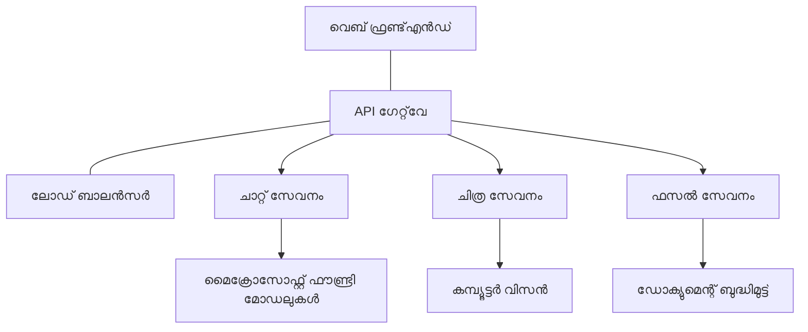

# പ്രൊഡക്ഷൻ AI വർക്ക്‌ലോഡ് വേണ്ടി മികച്ച രീതികൾ AZD ഉപയോഗിച്ച്

**അധ്യായ നാവിഗേഷൻ:**
- **📚 കോഴ്സ് ഹോം**: [AZD ഫോർ ബിഗിനേഴ്സ്](../../README.md)
- **📖 പ്രസ്‌തുത അധ്യായം**: അധ്യായം 8 - പ്രൊഡക്ഷൻ & എന്റർപ്രൈസ് പാറ്റേണുകൾ
- **⬅️ മുൻ അധ്യായം**: [അധ്യായം 7: ത്രൂബ്ലഷൂട്ടിംഗ്](../chapter-07-troubleshooting/debugging.md)
- **⬅️ കൂടുതൽ ബന്ധപ്പെട്ട**: [AI വർക്ക്ഷോപ്പ് ലാബ്](ai-workshop-lab.md)
- **🎯 കോഴ്സ് പൂർത്തിയാക്കി**: [AZD ഫോർ ബിഗിനേഴ്സ്](../../README.md)

## അവലോകനം

ഈ ഗൈഡ് Azure Developer CLI (AZD) ഉപയോഗിച്ച് പ്രൊഡക്ഷൻ-റെഡി AI വർക്ക്‌ലോഡുകൾ വിന്യസിക്കുന്നതിനുള്ള സമഗ്രമായ മികച്ച രീതികൾ നൽകുന്നു. Microsoft Foundry Discord കൂട്ടായ്മയിലെ അഭിപ്രായങ്ങളും യാഥാർഥ്യത്തിൽ ഉള്ള ഉപഭോക്തൃ വിന്യാസങ്ങളും അടിസ്ഥാനമാക്കിയുള്ള ഈ രീതികൾ പ്രൊപ്പം പ്രശ്നങ്ങളെ അഭിമുഖീകരിക്കുന്നു.

## മുഖ്യ പ്രതിസന്ധികൾ പരിഹരിച്ചത്

ഞങ്ങളുടെ കമ്മ്യൂണിറ്റി പോൾ ഫലങ്ങളുടെ അടിസ്ഥാനത്തിൽ, വികസിപ്പിച്ചാർന്നവർ നേരിടുന്ന പ്രധാന പ്രശ്നങ്ങൾ ഇവയാണ്:

- **45%** മൾട്ടി-സർവീസ് AI വിന്യാസങ്ങളിൽ ബുദ്ധിമുട്ട് അനുഭവിക്കുന്നു
- **38%** ക്രെഡൻഷ്യൽ, രഹസ്യ කළ മാനേജ്മെന്റിൽ പ്രശ്നം
- **35%** പ്രൊഡക്ഷൻ തയ്യാറാക്കലും സ്കെയ്ലിംഗും ബുദ്ധിമുട്ടാണ്
- **32%** മികച്ച ചെലവ് ഓപ്റ്റിമൈസേഷൻ തന്ത്രങ്ങൾ ആവശ്യമാണ്
- **29%** മേന്മയാർന്ന മോനിറ്ററിംഗ്, ത്രൂബ്ലഷൂട്ടിംഗ് വേണ്ടിവരുന്നു

## പ്രൊഡക്ഷൻ AI വാസ്തുവിദ്യ പാറ്റേണുകൾ

### പാറ്റേൺ 1: മൈക്രോസർവീസസ് AI വാസ്തുവിദ്യ

**എപ്പോൾ ഉപയോഗിക്കണം**: ബഹുവിധ കഴിവുകൾ ഉള്ള സങ്കീർണ്ണ AI അപ്ലിക്കേഷനുകൾ


**AZD നടപ്പിലാക്കൽ**:

```yaml
# azure.yaml
name: enterprise-ai-platform
services:
  web:
    project: ./web
    host: staticwebapp
  api-gateway:
    project: ./api-gateway
    host: containerapp
  chat-service:
    project: ./services/chat
    host: containerapp
  vision-service:
    project: ./services/vision
    host: containerapp
  text-service:
    project: ./services/text
    host: containerapp
```

### പാറ്റേൺ 2: ഇവന്റ്-ഡ്രിവൻ AI പ്രോസസിംഗ്

**എപ്പോൾ ഉപയോഗിക്കണം**: ബാച്ച് പ്രോസസ്സിംഗ്, ഡോക്യുമെന്റ് അനാലിസിസ്, അസിങ്ക്രോണസ് വർക്ക്‌ഫ്ലോകൾ

```bicep
// Event Hub for AI processing pipeline
resource eventHub 'Microsoft.EventHub/namespaces@2023-01-01-preview' = {
  name: eventHubNamespaceName
  location: location
  sku: {
    name: 'Standard'
    tier: 'Standard'
    capacity: 1
  }
}

// Service Bus for reliable message processing
resource serviceBus 'Microsoft.ServiceBus/namespaces@2022-10-01-preview' = {
  name: serviceBusNamespaceName
  location: location
  sku: {
    name: 'Premium'
    tier: 'Premium'
    capacity: 1
  }
}

// Function App for processing
resource functionApp 'Microsoft.Web/sites@2023-01-01' = {
  name: functionAppName
  location: location
  kind: 'functionapp,linux'
  properties: {
    siteConfig: {
      appSettings: [
        {
          name: 'FUNCTIONS_EXTENSION_VERSION'
          value: '~4'
        }
        {
          name: 'AZURE_OPENAI_ENDPOINT'
          value: '@Microsoft.KeyVault(VaultName=${keyVault.name};SecretName=openai-endpoint)'
        }
      ]
    }
  }
}
```

## AI ഏജന്റ് ആരോഗ്യത്തെ കുറിച്ച് ചിന്തിക്കുക

പരമ്പരാഗത വെബ് ആപ്പ് തകരുമ്പോൾ പ്രത്യക്ഷമായുള്ള ലക്ഷണങ്ങൾ ഒന്ന്: ഒരു പേജ് ലോഡ് ചെയ്യാതെ പോകുന്നു, ഒരു API പിഴവോടെ പ്രതികരിക്കുന്നു, അല്ലെങ്കിൽ ഒരു വിന്യാസം പരാജയപ്പെടുന്നു. AI-ഉൽപ്പന്ന ആപ്ലിക്കേഷനുകൾ എല്ലാത്തരം തകരാറുകളും ആവർത്തിച്ചേക്കാം — എന്നാൽ അവർ സൂക്ഷ്മമായും തെറ്റുപറ്റാവുന്ന രീതികളിൽ പ്രവർത്തിക്കാം, പറ്റാത്ത പിഴവുപറയുന്ന സന്ദേശങ്ങൾ നൽകാതെ.

ഈ വിഭാഗം AI വർക്ക്‌ലോഡുകൾ നിരീക്ഷിക്കുന്നതിന് മാനസിക മാതൃക നിർമ്മിക്കാൻ സഹായിക്കുന്നു, നിങ്ങൾക്ക് പരിശോധിക്കേണ്ടത് എവിടെയെന്ന് അറിയാൻ.

### ഏജന്റ് ആരോഗ്യം പരമ്പരാഗത ആപ്പ് ആരോഗ്യം നിന്നും വ്യത്യസ്തം

ഒരു പരമ്പരാഗത ആപ്പ് പ്രവർത്തിക്കും അല്ലെങ്കിൽ പ്രവർത്തിക്കില്ല. ഒരു AI ഏജന്റ് പ്രവർത്തിക്കുന്നതായി കാണാം പക്ഷേ ഫലം ദുർബലമായിരിക്കാം. ഏജന്റ് ആരോഗ്യത്തെ രണ്ടു തലങ്ങളിൽ കാണുക:

| തല | പരിശോധിക്കേണ്ടത് | എവിടെ നോക്കാം |
|-------|--------------|---------------|
| **ഇൻഫ്രാസ്ട്രക്ചർ ആരോഗ്യവും** | സർവീസ് പ്രവർത്തിക്കുന്നതാണോ? വിഭവങ്ങൾ ഒരുക്കിയിട്ടുണ്ടോ? എൻഡ്പോയിന്റുകൾ എത്താനുല്ലതോ? | `azd monitor`, Azure പോർട്ടൽ റിസോഴ്സ് ഹെൽത്ത്, കണ്ടെയ്‌നർ/ആപ്പ് ലോഗുകൾ |
| **പ്രവർത്തന ആരോഗ്യവും** | ഏജന്റ് ശരിയായി പ്രതികരിക്കുന്നുണ്ടോ? പ്രതികരണങ്ങൾ സമയബന്ധിതമായി ലഭിക്കുന്നുണ്ടോ? മോഡൽ ശരിയായ രീതിയിൽ വിളിക്കപ്പെട്ടിട്ടുണ്ടോ? | ആപ്ലിക്കേഷൻ ഇൻസൈറ്റ്സ് ട്രേസുകൾ, മോഡൽ വിളി ലെറ്റൻസി മീറ്ററുകൾ, പ്രതികരണ ഗുണനിലവാര ലോഗുകൾ |

ഇൻഫ്രാസ്ട്രക്ചർ ആരോഗ്യം പരിചിതമാണ്—അത് ഏത് azd ആപ്പിനും സമാനമാണ്. പ്രവർത്തന ആരോഗ്യമാണ് AI വർക്ക്‌ലോഡുകൾ കൊണ്ടുവരുന്ന പുതിയ തലക്കെട്ട്.

### AI ആപ്ലിക്കേഷനുകൾ പ്രതീക്ഷിച്ചതുപോലെ പെരുമാറാത്തപ്പോൾ എവിടെ നോക്കണം

നിങ്ങളുടെ AI അപ്ലിക്കേഷൻ പ്രതീക്ഷിക്കുന്ന ഫലം നൽകുന്നില്ലെങ്കിൽ ഇവിടെ ഒരു ആശയപരമായ ചോദ്യാവലി:

1. **അടിസ്ഥാനങ്ങളോടുകൂടി ആരംഭിക്കുക.** ആപ്പ് പ്രവർത്തിക്കുന്നുണ്ടോ? അതിന്റെ ആശ്രിതങ്ങൾ എത്താനുളളതാണോ? ഏതൊരു ആപ്പിനും പോലെ `azd monitor` ഒപ്പം റിസോഴ്സ് ഹെൽത്ത് പരിശോധിക്കുക.
2. **മോഡൽ ബന്ധം പരിശോധിക്കുക.** നിങ്ങളുടെ അപ്ലിക്കേഷൻ വിജയകരമായി AI മോഡലിനെ വിളിക്കുന്നുണ്ടോ? പരാജയപ്പെട്ടവയോ ടൈംആടായ മോഡൽ വിളികൾ തന്നെ സാധാരണ AI ആപ്പ് പ്രശ്നങ്ങൾ ഉണ്ട്; ഇത് അപ്ലിക്കേഷൻ ലോഗുകളിൽ കാണാം.
3. **മോഡൽ ലഭിച്ച വസ്തുതകൾ നോക്കുക.** AI പ്രതികരണങ്ങൾ ഇൻപുട്ടിൽ (പ്രോംപ്റ്റും കണ്ടെത്തിയിട്ടുള്ള സാഹചര്യവും) ആശ്രയിച്ചിരിക്കുന്നു. ഔട്ട്പുട്ട് തെറ്റാണെങ്കിൽ, സാധാരണ ഇൻപുട്ട് തെറ്റായിരിക്കും. മോഡലിലേക്ക് നിങ്ങളുടെ അപ്ലിക്കേഷൻ ശരിയായ ഡാറ്റ അയക്കുന്നുണ്ടോ എന്ന് പരിശോധിക്കുക.
4. **പ്രതികരണ ലെറ്റൻസി റിവ്യൂ ചെയ്യുക.** AI മോഡൽ വിളികൾ സാധാരണ API വിളികളേക്കാൾ മന്ദഗതിയിലാണ്. നിങ്ങളുടെ ആപ്പ് മന്ദമായി തോന്നുകയാണെങ്കിൽ മോഡൽ പ്രതികരണ സമയങ്ങൾ വർദ്ധിച്ചിട്ടുണ്ടോ എന്ന് പരിശോധിക്കുക—ഇത് ത്രോട്ട്ലിംഗ്, ശേഷിയോലിമ്പങ്ങൾ, അല്ലെങ്കിൽ മേഖലാ തലത്തിലുള്ള സങ്കീർണ്ണത കാണിച്ചേക്കാം.
5. **ചെലവ് സിഗ്നലുകൾ ശ്രദ്ധിക്കുക.** ടോക്കൺ ഉപയോഗത്തിൽ അല്ലെങ്കിൽ API വിളികളിൽ പ്രതീക്ഷിക്കാത്ത ഉരുത്തിരിയലുകൾ ഒരു ലൂപ്പ്, തെറ്റായ പ്രോംപ്റ്റ് കോൺഫിഗറേഷൻ, അല്ലെങ്കിൽ അധികമായ റീട്രൈകൾ സൂചിപ്പിക്കാം.

നിങ്ങൾ അപ്രത്യക്ഷമായി ഓബ്ജർവബിലിറ്റി ടൂളുകൾ ഉടനെ പഠിക്കേണ്ടതില്ല. മുഖ്യ കാര്യമാണ് AI ആപ്ലിക്കേഷനുകൾക്ക് നിരീക്ഷിക്കേണ്ട ഒരു അധിക പ്രവർത്തന പാളി ഉണ്ടെന്നത്, കൂടാതെ azd-ന്റെ ഇൻബിൽറ്റ് മോനിറ്ററിംഗ് (`azd monitor`) ഇരുഭാഗവും അന്വേഷിക്കുന്നതിനുള്ള തുടക്കമാണ്.

---

## സുരക്ഷിതത്വത്തിനുള്ള മികച്ച രീതികൾ

### 1. സീറോ-ട്രസ്റ്റ് സുരക്ഷാമോഡൽ

**നടപ്പിലാക്കൽ തന്ത്രം**:
- ഓൺ സേർവീസ്-ടു-സേർവീസ് ആശയവിനിമയം ഓടാതൊതുകൂടാതെ ഓതന്റിക്കേഷൻ
- എല്ലാ API വിളികളും മാനേജ്ഡ് ഐഡന്റിറ്റികൾ ഉപയോഗിക്കുന്നത്
- സ്വകാര്യ എൻഡ്പോയിന്റുകൾ ഉപയോഗിച്ച് നെറ്റ്‌വർക്ക് ഐസൊലേഷൻ
- ഏറ്റവും കുറവുള്ള അനുമതികളുള്ള ആക്സസ് നിയന്ത്രണം

```bicep
// Managed Identity for each service
resource chatServiceIdentity 'Microsoft.ManagedIdentity/userAssignedIdentities@2023-01-31' = {
  name: 'chat-service-identity'
  location: location
}

// Role assignments with minimal permissions
resource openAIUserRole 'Microsoft.Authorization/roleAssignments@2022-04-01' = {
  scope: openAIAccount
  name: guid(openAIAccount.id, chatServiceIdentity.id, openAIUserRoleDefinitionId)
  properties: {
    roleDefinitionId: subscriptionResourceId('Microsoft.Authorization/roleDefinitions', '5e0bd9bd-7b93-4f28-af87-19fc36ad61bd')
    principalId: chatServiceIdentity.properties.principalId
    principalType: 'ServicePrincipal'
  }
}
```

### 2. രഹസ്യ മാനേജ്മെന്റ് സുരക്ഷിതമാക്കൽ

**കീ വാൾട്ട് സംയോജിത പാറ്റേൺ**:

```bicep
// Key Vault with proper access policies
resource keyVault 'Microsoft.KeyVault/vaults@2023-02-01' = {
  name: keyVaultName
  location: location
  properties: {
    tenantId: tenant().tenantId
    sku: {
      family: 'A'
      name: 'premium'  // Use premium for production
    }
    enableRbacAuthorization: true  // Use RBAC instead of access policies
    enablePurgeProtection: true    // Prevent accidental deletion
    enableSoftDelete: true
    softDeleteRetentionInDays: 90
  }
}

// Store all AI service credentials
resource openAIKeySecret 'Microsoft.KeyVault/vaults/secrets@2023-02-01' = {
  parent: keyVault
  name: 'openai-api-key'
  properties: {
    value: openAIAccount.listKeys().key1
    attributes: {
      enabled: true
    }
  }
}
```

### 3. നെറ്റ്‌വർക്ക് സുരക്ഷ

**സ്വകാര്യ എൻഡ്പോയിന്റ് കോൺഫിഗറേഷൻ**:

```bicep
// Virtual Network for AI services
resource virtualNetwork 'Microsoft.Network/virtualNetworks@2023-04-01' = {
  name: vnetName
  location: location
  properties: {
    addressSpace: {
      addressPrefixes: ['10.0.0.0/16']
    }
    subnets: [
      {
        name: 'ai-services-subnet'
        properties: {
          addressPrefix: '10.0.1.0/24'
          privateEndpointNetworkPolicies: 'Disabled'
        }
      }
      {
        name: 'app-services-subnet'
        properties: {
          addressPrefix: '10.0.2.0/24'
          delegations: [
            {
              name: 'Microsoft.Web/serverFarms'
              properties: {
                serviceName: 'Microsoft.Web/serverFarms'
              }
            }
          ]
        }
      }
    ]
  }
}

// Private endpoints for all AI services
resource openAIPrivateEndpoint 'Microsoft.Network/privateEndpoints@2023-04-01' = {
  name: '${openAIAccountName}-pe'
  location: location
  properties: {
    subnet: {
      id: virtualNetwork.properties.subnets[0].id
    }
    privateLinkServiceConnections: [
      {
        name: 'openai-connection'
        properties: {
          privateLinkServiceId: openAIAccount.id
          groupIds: ['account']
        }
      }
    ]
  }
}
```

## പ്രകടനവും സ്കെയ്ലിംഗും

### 1. ഓട്ടോ-സ്കെയ്ലിംഗ് തന്ത്രങ്ങൾ

**കണ്ടെയ്‌നർ ആപ്പുകൾ ഓട്ടോ-സ്കെയ്ലിംഗ്**:

```bicep
resource containerApp 'Microsoft.App/containerApps@2023-05-01' = {
  name: containerAppName
  location: location
  properties: {
    configuration: {
      ingress: {
        external: true
        targetPort: 8000
        transport: 'http'
      }
    }
    template: {
      scale: {
        minReplicas: 2  // Always have 2 instances minimum
        maxReplicas: 50 // Scale up to 50 for high load
        rules: [
          {
            name: 'http-scaling'
            http: {
              metadata: {
                concurrentRequests: '20'  // Scale when >20 concurrent requests
              }
            }
          }
          {
            name: 'cpu-scaling'
            custom: {
              type: 'cpu'
              metadata: {
                type: 'Utilization'
                value: '70'  // Scale when CPU >70%
              }
            }
          }
        ]
      }
    }
  }
}
```

### 2. കാഷിംഗ് തന്ത്രങ്ങൾ

**AI പ്രതികരണങ്ങൾക്ക് Redis കാഷ്**:

```bicep
// Redis Premium for production workloads
resource redisCache 'Microsoft.Cache/redis@2023-04-01' = {
  name: redisCacheName
  location: location
  properties: {
    sku: {
      name: 'Premium'
      family: 'P'
      capacity: 1
    }
    enableNonSslPort: false
    minimumTlsVersion: '1.2'
    redisConfiguration: {
      'maxmemory-policy': 'allkeys-lru'
    }
    // Enable clustering for high availability
    redisVersion: '6.0'
    shardCount: 2
  }
}

// Cache configuration in application
var cacheConnectionString = '${redisCache.properties.hostName}:6380,password=${redisCache.listKeys().primaryKey},ssl=True,abortConnect=False'
```

### 3. ലോഡ് ബാലൻസിംഗ് & ട്രാഫിക് മാനേജ്‌മെന്റ്

**WAF കൂടിയ ആപ്ലിക്കേഷൻ ഗേറ്റ്‌വേ**:

```bicep
// Application Gateway with Web Application Firewall
resource applicationGateway 'Microsoft.Network/applicationGateways@2023-04-01' = {
  name: appGatewayName
  location: location
  properties: {
    sku: {
      name: 'WAF_v2'
      tier: 'WAF_v2'
      capacity: 2
    }
    webApplicationFirewallConfiguration: {
      enabled: true
      firewallMode: 'Prevention'
      ruleSetType: 'OWASP'
      ruleSetVersion: '3.2'
    }
    // Backend pools for AI services
    backendAddressPools: [
      {
        name: 'ai-services-pool'
        properties: {
          backendAddresses: [
            {
              fqdn: '${containerApp.properties.configuration.ingress.fqdn}'
            }
          ]
        }
      }
    ]
  }
}
```

## 💰 ചെലവ് ഓപ്റ്റിമൈസേഷൻ

### 1. റിസോഴ്‌സ് റൈറ്റ്-സൈസിംഗ്

**പരിസ്ഥിതി-നിർദിഷ്‌ട കോൺഫിഗറേഷനുകൾ**:

```bash
# വികസനം സംരംഭം
azd env new development
azd env set AZURE_OPENAI_SKU "S0"
azd env set AZURE_OPENAI_CAPACITY 10
azd env set AZURE_SEARCH_SKU "basic"
azd env set CONTAINER_CPU 0.5
azd env set CONTAINER_MEMORY 1.0

# ഉത്പാദന സംരംഭം
azd env new production
azd env set AZURE_OPENAI_SKU "S0"
azd env set AZURE_OPENAI_CAPACITY 100
azd env set AZURE_SEARCH_SKU "standard"
azd env set CONTAINER_CPU 2.0
azd env set CONTAINER_MEMORY 4.0
```

### 2. ചെലവ് നിരീക്ഷണവും ബജറ്റുകളും

```bicep
// Cost management and budgets
resource budget 'Microsoft.Consumption/budgets@2023-05-01' = {
  name: 'ai-workload-budget'
  properties: {
    timePeriod: {
      startDate: '2024-01-01'
      endDate: '2024-12-31'
    }
    timeGrain: 'Monthly'
    amount: 2000  // $2000 monthly budget
    category: 'Cost'
    notifications: {
      warning: {
        enabled: true
        operator: 'GreaterThan'
        threshold: 80
        contactEmails: [
          'finance@company.com'
          'engineering@company.com'
        ]
        contactRoles: [
          'Owner'
          'Contributor'
        ]
      }
      critical: {
        enabled: true
        operator: 'GreaterThan'
        threshold: 95
        contactEmails: [
          'cto@company.com'
        ]
      }
    }
  }
}
```

### 3. ടോക്കൺ ഉപയോഗ ഓപ്റ്റിമൈസേഷൻ

**OpenAI ചെലവ് മാനേജ്മെന്റ്**:

```typescript
// അപേക്ഷ നില തൂക്കത്തിനുള്ള ടോക്കൺ മെച്ചപ്പെടുത്തൽ
class TokenOptimizer {
  private readonly maxTokens = 4000;
  private readonly reserveTokens = 500;
  
  optimizePrompt(userInput: string, context: string): string {
    const availableTokens = this.maxTokens - this.reserveTokens;
    const estimatedTokens = this.estimateTokens(userInput + context);
    
    if (estimatedTokens > availableTokens) {
      // ഉപയോക്തൃ ഇൻപുട്ട് അല്ല, കോൺടക്‌സ് tron ചെയ്യുക
      context = this.truncateContext(context, availableTokens - this.estimateTokens(userInput));
    }
    
    return `${context}\n\nUser: ${userInput}`;
  }
  
  private estimateTokens(text: string): number {
    // ഏകദേശം കണക്കുകൂട്ടൽ: 1 ടോക്കൺ ≈ 4 അക്ഷരങ്ങൾ
    return Math.ceil(text.length / 4);
  }
}
```

## നിരീക്ഷണവും കാണാൻ શકുന്നതും

### 1. സമഗ്രമായ ആപ്ലിക്കേഷൻ ഇൻസൈറ്റ്സ്

```bicep
// Application Insights with advanced features
resource applicationInsights 'Microsoft.Insights/components@2020-02-02' = {
  name: applicationInsightsName
  location: location
  kind: 'web'
  properties: {
    Application_Type: 'web'
    WorkspaceResourceId: logAnalyticsWorkspace.id
    SamplingPercentage: 100  // Full sampling for AI apps
    DisableIpMasking: false  // Enable for security
  }
}

// Custom metrics for AI operations
resource aiMetricAlerts 'Microsoft.Insights/metricAlerts@2018-03-01' = {
  name: 'ai-high-error-rate'
  location: 'global'
  properties: {
    description: 'Alert when AI service error rate is high'
    severity: 2
    enabled: true
    scopes: [
      applicationInsights.id
    ]
    evaluationFrequency: 'PT1M'
    windowSize: 'PT5M'
    criteria: {
      'odata.type': 'Microsoft.Azure.Monitor.SingleResourceMultipleMetricCriteria'
      allOf: [
        {
          name: 'high-error-rate'
          metricName: 'requests/failed'
          operator: 'GreaterThan'
          threshold: 10
          timeAggregation: 'Count'
        }
      ]
    }
  }
}
```

### 2. AI-സ്പെസിഫിക് നിരീക്ഷണം

**AI മീറ്ററുകൾക്കായി കസ്റ്റം ഡാഷ്ബോർഡുകൾ**:

```json
// Dashboard configuration for AI workloads
{
  "dashboard": {
    "name": "AI Application Monitoring",
    "tiles": [
      {
        "name": "OpenAI Request Volume",
        "query": "requests | where name contains 'openai' | summarize count() by bin(timestamp, 5m)"
      },
      {
        "name": "AI Response Latency",
        "query": "requests | where name contains 'openai' | summarize avg(duration) by bin(timestamp, 5m)"
      },
      {
        "name": "Token Usage",
        "query": "customMetrics | where name == 'openai_tokens_used' | summarize sum(value) by bin(timestamp, 1h)"
      },
      {
        "name": "Cost per Hour",
        "query": "customMetrics | where name == 'openai_cost' | summarize sum(value) by bin(timestamp, 1h)"
      }
    ]
  }
}
```

### 3. ആരോഗ്യ പരിശോധനകളും അപ്പ്റ്റൈം നിരീക്ഷണവും

```bicep
// Application Insights availability tests
resource availabilityTest 'Microsoft.Insights/webtests@2022-06-15' = {
  name: 'ai-app-availability-test'
  location: location
  tags: {
    'hidden-link:${applicationInsights.id}': 'Resource'
  }
  properties: {
    SyntheticMonitorId: 'ai-app-availability-test'
    Name: 'AI Application Availability Test'
    Description: 'Tests AI application endpoints'
    Enabled: true
    Frequency: 300  // 5 minutes
    Timeout: 120    // 2 minutes
    Kind: 'ping'
    Locations: [
      {
        Id: 'us-east-2-azr'
      }
      {
        Id: 'us-west-2-azr'
      }
    ]
    Configuration: {
      WebTest: '''
        <WebTest Name="AI Health Check" 
                 Id="8d2de8d2-a2b0-4c2e-9a0d-8f9c9a0b8c8d" 
                 Enabled="True" 
                 CssProjectStructure="" 
                 CssIteration="" 
                 Timeout="120" 
                 WorkItemIds="" 
                 xmlns="http://microsoft.com/schemas/VisualStudio/TeamTest/2010" 
                 Description="" 
                 CredentialUserName="" 
                 CredentialPassword="" 
                 PreAuthenticate="True" 
                 Proxy="default" 
                 StopOnError="False" 
                 RecordedResultFile="" 
                 ResultsLocale="">
          <Items>
            <Request Method="GET" 
                     Guid="a5f10126-e4cd-570d-961c-cea43999a200" 
                     Version="1.1" 
                     Url="${webApp.properties.defaultHostName}/health" 
                     ThinkTime="0" 
                     Timeout="120" 
                     ParseDependentRequests="True" 
                     FollowRedirects="True" 
                     RecordResult="True" 
                     Cache="False" 
                     ResponseTimeGoal="0" 
                     Encoding="utf-8" 
                     ExpectedHttpStatusCode="200" 
                     ExpectedResponseUrl="" 
                     ReportingName="" 
                     IgnoreHttpStatusCode="False" />
          </Items>
        </WebTest>
      '''
    }
  }
}
```

## ദുർഘട അപകട പുനരുദ്ധാരണവും ഉയർന്ന ലഭ്യതയും

### 1. ബഹു-മേഖല വിന്യാസം

```yaml
# azure.yaml - Multi-region configuration
name: ai-app-multiregion
services:
  api-primary:
    project: ./api
    host: containerapp
    env:
      - AZURE_REGION=eastus
  api-secondary:
    project: ./api
    host: containerapp
    env:
      - AZURE_REGION=westus2
```

```bicep
// Traffic Manager for global load balancing
resource trafficManager 'Microsoft.Network/trafficManagerProfiles@2022-04-01' = {
  name: trafficManagerProfileName
  location: 'global'
  properties: {
    profileStatus: 'Enabled'
    trafficRoutingMethod: 'Priority'
    dnsConfig: {
      relativeName: trafficManagerProfileName
      ttl: 30
    }
    monitorConfig: {
      protocol: 'HTTPS'
      port: 443
      path: '/health'
      intervalInSeconds: 30
      toleratedNumberOfFailures: 3
      timeoutInSeconds: 10
    }
    endpoints: [
      {
        name: 'primary-endpoint'
        type: 'Microsoft.Network/trafficManagerProfiles/azureEndpoints'
        properties: {
          targetResourceId: primaryAppService.id
          endpointStatus: 'Enabled'
          priority: 1
        }
      }
      {
        name: 'secondary-endpoint'
        type: 'Microsoft.Network/trafficManagerProfiles/azureEndpoints'
        properties: {
          targetResourceId: secondaryAppService.id
          endpointStatus: 'Enabled'
          priority: 2
        }
      }
    ]
  }
}
```

### 2. ഡാറ്റ ബാക്കപ്പ് & പുനരുദ്ധാരണ

```bicep
// Backup configuration for critical data
resource backupVault 'Microsoft.DataProtection/backupVaults@2023-05-01' = {
  name: backupVaultName
  location: location
  identity: {
    type: 'SystemAssigned'
  }
  properties: {
    storageSettings: [
      {
        datastoreType: 'VaultStore'
        type: 'LocallyRedundant'
      }
    ]
  }
}

// Backup policy for AI models and data
resource backupPolicy 'Microsoft.DataProtection/backupVaults/backupPolicies@2023-05-01' = {
  parent: backupVault
  name: 'ai-data-backup-policy'
  properties: {
    policyRules: [
      {
        backupParameters: {
          backupType: 'Full'
          objectType: 'AzureBackupParams'
        }
        trigger: {
          schedule: {
            repeatingTimeIntervals: [
              'R/2024-01-01T02:00:00+00:00/P1D'  // Daily at 2 AM
            ]
          }
          objectType: 'ScheduleBasedTriggerContext'
        }
        dataStore: {
          datastoreType: 'VaultStore'
          objectType: 'DataStoreInfoBase'
        }
        name: 'BackupDaily'
        objectType: 'AzureBackupRule'
      }
    ]
  }
}
```

## ഡെവ്‌ഓപ്സ് & CI/CD സംയോജനം

### 1. GitHub ആക്ഷൻസ് വർക്ക്‌ഫ്ലോ

```yaml
# .github/workflows/deploy-ai-app.yml
name: Deploy AI Application

on:
  push:
    branches: [main]
  pull_request:
    branches: [main]

jobs:
  test:
    runs-on: ubuntu-latest
    steps:
      - uses: actions/checkout@v4
      
      - name: Setup Python
        uses: actions/setup-python@v4
        with:
          python-version: '3.11'
          
      - name: Install dependencies
        run: |
          pip install -r requirements.txt
          pip install pytest
          
      - name: Run tests
        run: pytest tests/
        
      - name: AI Safety Tests
        run: |
          python scripts/test_ai_safety.py
          python scripts/validate_prompts.py

  deploy-staging:
    needs: test
    if: github.event_name == 'pull_request'
    runs-on: ubuntu-latest
    steps:
      - uses: actions/checkout@v4
      
      - name: Setup AZD
        uses: Azure/setup-azd@v2
        
      - name: Login to Azure
        uses: azure/login@v1
        with:
          creds: ${{ secrets.AZURE_CREDENTIALS }}
          
      - name: Deploy to Staging
        run: |
          azd env select staging
          azd deploy

  deploy-production:
    needs: test
    if: github.ref == 'refs/heads/main'
    runs-on: ubuntu-latest
    steps:
      - uses: actions/checkout@v4
      
      - name: Setup AZD
        uses: Azure/setup-azd@v2
        
      - name: Login to Azure
        uses: azure/login@v1
        with:
          creds: ${{ secrets.AZURE_CREDENTIALS }}
          
      - name: Deploy to Production
        run: |
          azd env select production
          azd deploy
          
      - name: Run Production Health Checks
        run: |
          python scripts/health_check.py --env production
```

### 2. ഇൻഫ്രാസ്ട്രക്ചർ പരിശോധന

```bash
# scripts/validate_infrastructure.sh
#!/bin/bash

echo "Validating AI infrastructure deployment..."

# എല്ലാ ആവശ്യമായ സേർവീസുകളും പ്രവർത്തിച്ചിരിക്കുന്നുവോ എന്ന് പരിശോധിക്കുക
services=("openai" "search" "storage" "keyvault")
for service in "${services[@]}"; do
    echo "Checking $service..."
    if ! az resource list --resource-type "Microsoft.CognitiveServices/accounts" --query "[?contains(name, '$service')]" -o tsv; then
        echo "ERROR: $service not found"
        exit 1
    fi
done

# OpenAI മോഡൽ വിന്യാസങ്ങൾ സാധുവാക്കി പരിശോധിക്കുക
echo "Validating OpenAI model deployments..."
models=$(az cognitiveservices account deployment list --name $AZURE_OPENAI_NAME --resource-group $AZURE_RESOURCE_GROUP --query "[].name" -o tsv)
if [[ ! $models == *"gpt-4.1-mini"* ]]; then
  echo "ERROR: Required model gpt-4.1-mini not deployed"
    exit 1
fi

# AI സർവീസ് ബന്ധം പരിശോധന നടത്തുക
echo "Testing AI service connectivity..."
python scripts/test_connectivity.py

echo "Infrastructure validation completed successfully!"
```

## പ്രൊഡക്ഷൻ തയ്യാറെടുപ്പ് ചെക്ക്‌ലിസ്റ്റ്

### സുരക്ഷിതത്വം ✅
- [ ] എല്ലാ സർവീസുകളും മാനേജ്ഡ് ഐഡന്റിറ്റികൾ ഉപയോഗിക്കുന്നു
- [ ] രഹസ്യങ്ങൾ കീ വാൾട്ടിൽ സൂക്ഷിക്കുന്നു
- [ ] സ്വകാര്യ എൻഡ്പോയിന്റുകൾ കോൺഫിഗർ ചെയ്തിട്ടുണ്ട്
- [ ] നെറ്റ്‌വർക്ക് സെക്യൂരിറ്റി ഗ്രൂപ്പുകൾ നടപ്പിലാക്കി
- [ ] കുറഞ്ഞ അവകാശങ്ങളുള്ള RBAC
- [ ] പബ്ലിക് എൻഡ്പോയിന്റുകളിൽ WAF സജ്ജമാക്കി

### പ്രകടനം ✅
- [ ] ഓട്ടോ-സ്കെയ്ലിംഗ് കോൺഫിഗർ ചെയ്തിട്ടുണ്ട്
- [ ] കാഷിംഗ് നടപ്പിലാക്കി
- [ ] ലോഡ് ബലൻസിംഗ് ക്രമീകരിച്ചു
- [ ] സ്റ്റാറ്റിക് കണ്ടന്റിന് CDN
- [ ] ഡാറ്റബേസ് കണക്ഷൻ പൂളിംഗ്
- [ ] ടോക്കൺ ഉപയോഗം ഓപ്റ്റിമൈസേഷൻ

### നിരീക്ഷണം ✅
- [ ] ആപ്ലിക്കേഷൻ ഇൻസൈറ്റ്സ് കോൺഫിഗർ ചെയ്തു
- [ ] കസ്റ്റം മീറ്ററുകൾ നിർവചിച്ചു
- [ ] അലേർട്ട് നിയമങ്ങൾ ക്രമീകരിച്ചു
- [ ] ഡാഷ്ബോർഡ് തയാറാക്കി
- [ ] ആരോഗ്യ പരിശോധനകൾ നടപ്പിലാക്കി
- [ ] ലോഗ് പരിപാലന നയങ്ങൾ

### വിശ്വാസ്യത ✅
- [ ] ബഹു-മേഖല വിന്യാസം
- [ ] ബാക്കപ്പ് & പുനരുദ്ധാരണ പദ്ധതി
- [ ] സർക്കിറ്റ്ബ്രേക്കറുകൾ നടപ്പിലാക്കി
- [ ] റീട്രൈ നയങ്ങൾ ക്രമീകരിച്ചു
- [ ] സൗകര്യപ്രദമായ വീഴ്ച കുറവ്
- [ ] ഹെൽത്ത് ചെക്ക് എൻഡ്പോയിന്റുകൾ

### ചെലവ് മാനേജ്മെന്റ് ✅
- [ ] ബജറ്റ് അലേർട്ടുകൾ ക്രമീകരിച്ചു
- [ ] റിസോഴ്‌സ് റൈറ്റ്-സൈസിംഗ്
- [ ] ഡെവ്/ടെസ്റ്റ് ഡിസ്കൗണ്ടുകൾ പ്രയോഗിച്ചു
- [ ] റിസർവഡ് ഇൻസ്റ്റാൻസുകൾ വാങ്ങി
- [ ] ചെലവ് നിരീക്ഷണ ഡാഷ്ബോർഡ്
- [ ] നിയന്ത്രിത ചെലവ് അവലോകനങ്ങൾ

### അനുസരണ ✅
- [ ] ഡാറ്റ താമസ നിബന്ധനകൾ പാലിച്ചു
- [ ] ഓഡിറ്റ് ലോഗിംഗ് സജ്ജമാക്കി
- [ ] അനുസരണ നയങ്ങൾ പ്രയോഗിച്ചു
- [ ] സുരക്ഷാ അടിസ്ഥാനരേഖകൾ നടപ്പിലാക്കി
- [ ] മാനദണ്ഡാനുസരണം സുരക്ഷാ പരിശോധനകൾ
- [ ] ഇൻസിഡന്റ് പ്രതികരണ പദ്ധതി

## പ്രകടന ബഞ്ച്മാർക്കുകൾ

### സാധാരണ പ്രൊഡക്ഷൻ മീറ്ററുകൾ

| മീറ്റർ | ലക്ഷ്യം | നിരീക്ഷണം |
|--------|--------|------------|
| **പ്രതികരണ സമയം** | < 2 സെക്കന്റ് | ആപ്ലിക്കേഷൻ ഇൻസൈറ്റ്സ് |
| **ലഭ്യത** | 99.9% | അപ്പ്റ്റൈം നിരീക്ഷണം |
| **കുഴപ്പം നിരക്ക്** | < 0.1% | ആപ്ലിക്കേഷൻ ലോഗുകൾ |
| **ടോക്കൺ ഉപയോഗം** | < $500/മാസം | ചെലവ് മാനേജ്മെന്റ് |
| **സമകാലിക ഉപയോക്താക്കൾ** | 1000+ | ലോഡ് ടെസ്റ്റിംഗ് |
| **പുനരുദ്ധാരണ സമയം** | < 1 മണിക്കൂർ | ദുരന്ത പുനരുദ്ധാരണ പരീക്ഷണങ്ങൾ |

### ലോഡ് ടെസ്റ്റിംഗ്

```bash
# AI അപേക്ഷനങ്ങളുള്ള ലോഡ് ടെസ്റ്റിങ് സ്ക്രിപ്റ്റ്
python scripts/load_test.py \
  --endpoint https://your-ai-app.azurewebsites.net \
  --concurrent-users 100 \
  --duration 300 \
  --ramp-up 60
```

## 🤝 കമ്മ്യൂണിറ്റി മികച്ച രീതികൾ

Microsoft Foundry Discord കമ്മ്യൂണിറ്റി ഫീഡ്ബാക്കിനെ അടിസ്ഥാനമാക്കി:

### Top Recommendations from the Community:

1. **ചുരുക്കം മുതൽ തുടക്കം, ക്രമാനുസൃതമായി സ്കെയിലുചെയ്യുക**: അടിസ്ഥാന SKU-കളോടെ തുടങ്ങുക, യഥാർത്ഥ ഉപയോഗത്തെ ആശ്രയിച്ച് വിപുലീകരിക്കുക
2. **എല്ലാം നിരീക്ഷിക്കുക**: ആദ്യ ദിവസത്തേ മുതൽ സമഗ്രമായ നിരീക്ഷണം ക്രമീകരിക്കുക
3. **സുരക്ഷ ഓട്ടോമേറ്റ് ചെയ്യുക**: സ്ഥിരമായ സുരക്ഷയ്ക്ക് ഇൻഫ്രാസ്ട്രക്ചർ അസ്കോഡ് ഉപയോഗിക്കാം
4. **പൂർണ്ണമായും ടെസ്റ്റ് ചെയ്യുക**: നിങ്ങളുടെ പൈപ്പ്ലൈനിൽ AI-സ്പെസിഫിക് ടെസ്റ്റുകൾ ഉൾപ്പെടുത്തുക
5. **ചെലവിനുള്ള പദ്ധതി ഉണ്ടാക്കുക**: ഉടൻ ടോക്കൺ ഉപയോഗം നിരീക്ഷിക്കുകയും ബജറ്റ് അലേർട്ടുകൾ ഏർപ്പെടുത്തുകയും ചെയ്യുക

### സാധാരണ വീഴ്ചകൾ ഒഴിവാക്കുക:

- ❌ കോഡിൽ API കീകൾ ഹാർഡ്കോഡ് ചെയ്യുന്നത്
- ❌ ഏകീകരിച്ച മോനിറ്ററിംഗ് ക്രമീകരിക്കാത്തത്
- ❌ ചെലവ് ഓപ്റ്റിമൈസേഷൻ അവഗണിക്കൽ
- ❌ പരാജയ സാഹചര്യങ്ങൾ ടെസ്റ്റ് ചെയ്യാതെ വയ്ക്കുക
- ❌ ആരോഗ്യ പരിശോധനകൾ ഇല്ലാതെ വിന്യാസം

## AZD AI CLI കമാൻഡുകളും എക്സ്റ്റെൻഷനുകളും

AZD AI-സ്പെസിഫിക് കമാൻഡുകൾക്കും എക്സ്റ്റെൻഷൻസിനും വളർന്നുകൊണ്ടിരിക്കുന്ന ഒരു സെറ്റ് ഉൾക്കൊള്ളുന്നു, പ്രൊഡക്ഷൻ AI വർക്ക്‌ലോഡുകൾക്കുള്ള ലൊക്കൽ വികസനത്തിനെയും പ്രൊഡക്ഷൻസ് വിന്യാസത്തിനും ഇടയിലെ ഗ്വാമം കുറയ്ക്കുന്നു.

### AI-വേണ്ടി AZD എക്സ്റ്റെൻഷനുകൾ

AZD AI-സ്പെസിഫിക് കഴിവുകൾ ചേർക്കാൻ ഒരു എക്സ്റ്റെൻഷൻ സിസ്റ്റം ഉപയോഗിക്കുന്നു. ഇൻസ്റ്റാൾ ചെയ്യാനും മാനേജ് ചെയ്യാനും:

```bash
# ലഭ്യമായ എല്ലാ എക്സ്റ്റൻഷനുകളും പട്ടികപ്പെടുത്തുക (AI ഉൾപ്പെടെ)
azd extension list

# ഇൻസ്റ്റാൾ ചെയ്ത എക്സ്റ്റൻഷൻ വിവരങ്ങൾ പരിശോധിക്കുക
azd extension show azure.ai.agents

# ഫൗണ്ട്രി ഏജന്റ്സ് എക്സ്റ്റൻഷൻ ഇൻസ്റ്റാൾ ചെയ്യുക
azd extension install azure.ai.agents

# ഫൈൻ-ട്യൂണിംഗ് എക്സ്റ്റൻഷൻ ഇൻസ്റ്റാൾ ചെയ്യുക
azd extension install azure.ai.finetune

# കസ്റ്റം മോഡലുകൾ എക്സ്റ്റൻഷൻ ഇൻസ്റ്റാൾ ചെയ്യുക
azd extension install azure.ai.models

# ഇൻസ്റ്റാൾ ചെയ്ത എല്ലാ എക്സ്റ്റൻഷനുകളും അപ്ഗ്രേഡ് ചെയ്യുക
azd extension upgrade --all
```

**ലഭ്യമായ AI എക്സ്റ്റെൻഷനുകൾ:**

| എക്സ്റ്റെൻഷൻ | ഉദ്ദേശ്യം | നില |
|-----------|---------|--------|
| `azure.ai.agents` | Foundry ഏജന്റ് സർവീസ് മാനേജ്മെന്റ് | മുൻകൂർ അവലോകനം |
| `azure.ai.finetune` | Foundry മോഡൽ ഫൈൻ ട്യൂണിംഗ് | മുൻകൂർ അവലോകനം |
| `azure.ai.models` | Foundry കസ്റ്റം മോഡലുകൾ | മുൻകൂർ അവലോകനം |
| `azure.coding-agent` | കോഡിംഗ് ഏജന്റ് കോൺഫിഗറേഷൻ | ലഭ്യമാണ് |

### `azd ai agent init` ഉപയോഗിച്ച് ഏജന്റ് പ്രോജക്റ്റുകൾ ആരംഭിക്കുക

`azd ai agent init` കമാൻഡ് Microsoft Foundry ഏജന്റ് സർവീസിൽ സംയോജിതമായ പ്രൊഡക്ഷൻ-റെഡി AI ഏജന്റ് പ്രോജക്റ്റ് സ്കാഫോൾഡ് ചെയ്യുന്നു:

```bash
# ഏജന്റ് മാനിഫെസ്റ്റ് മുതൽ പുതിയ ഏജന്റ് പ്രോജക്റ്റ് ആരംഭിക്കുക
azd ai agent init -m <manifest-path-or-uri>

# നിശ്ചിത Foundry പ്രോജക്റ്റ് ആരംഭിച്ച് ലക്ഷ്യമിടുക
azd ai agent init -m agent-manifest.yaml --project-id <foundry-project-id>

# ക്രമീകരിച്ച സോഴ്‌സ് ഡയറക്ടറിയോടുകൂടി ആരംഭിക്കുക
azd ai agent init -m agent-manifest.yaml --src ./agents/my-agent

# Container Apps നെ ഹോസ്റ്റായി ലക്ഷ്യമിടുക
azd ai agent init -m agent-manifest.yaml --host containerapp
```

**പ്രധാന ഫ്ലാഗുകൾ:**

| ഫ്ലാഗ് | വിവരണം |
|------|-------------|
| `-m, --manifest` | നിങ്ങളുടെ പ്രോജക്റ്റിൽ ചേർക്കാനുള്ള ഏജന്റ് മැනിഫസ്റ്റ് പാത അല്ലെങ്കിൽ URI |
| `-p, --project-id` | നിങ്ങളുടെ azd പരിസ്ഥിതിക്ക് നിലവിലുള്ള Microsoft Foundry പ്രോജക്റ്റ് ഐഡി |
| `-s, --src` | ഏജന്റ് നിർവചനത്തിനുള്ള ഡയറക്ടറി ഡൗൺലോഡ് ചെയ്യുക (ഡിഫോൾട്ട് `src/<agent-id>`) |
| `--host` | ഡിഫോൾട്ട് ഹോസ്റ്റ് ഓവർറൈഡ് ചെയ്യുക (ഉദാ: `containerapp`) |
| `-e, --environment` | ഉപയോഗിക്കേണ്ട azd പരിസ്ഥിതി |

**പ്രൊഡക്ഷൻ ടിപ്പ്**: നിലവിലുള്ള Foundry പ്രോജക്റ്റ് നേരിട്ട് കണക്റ്റുചെയ്യാൻ `--project-id` ഉപയോഗിച്ചാൽ, നിങ്ങളുടെ ഏജന്റ് കോഡും ക്ലൗഡ് വിഭവങ്ങളും തുടക്കം മുതൽ ബന്ധിപ്പിച്ച് സൂക്ഷിക്കാം.

### മോഡൽ കോൺടെക്സ്റ്റ് പ്രോട്ടോക്കോൾ (MCP) `azd mcp` ഉപയോഗിച്ച്

AZD MCP സർവർ പിന്തുണ (ആൽഫ) ഉൾക്കൊള്ളുന്നു, ഈ സാങ്കേതികവിദ്യ AI ഏജന്റുകളും ടൂളുകളും നിങ്ങളുടെ Azure വിഭവങ്ങളുമായി സ്റ്റാൻഡേർഡൈസ്ഡ് പ്രോട്ടോക്കോൾ വഴി ഇടപഴകാൻ അനുവദിക്കുന്നു:

```bash
# നിങ്ങളുടെ പ്രോജക്ട് için MCP സർവർ ആരംഭിക്കുക
azd mcp start

# ടൂൾ പ്രവർത്തനത്തിനുള്ള നിലവിലെ കോപിലറ്റ് സമ്മത നിബന്ധനകൾ സമർശിക്കുക
azd copilot consent list
```

MCP സർവർ azd പ്രോജക്റ്റിന്റെ കോൺടെക്സ്റ്റ്—പരിസ്ഥിതികൾ, സർവീസുകൾ, Azure വിഭവങ്ങൾ—AI ശക്തിപെടുത്തിയ വികസന ടൂളുകൾക്ക് തുറന്നുകൊടുക്കുന്നു. ഇത് അനുവദിക്കുന്നു:

- **AI സഹായത്തോടെ വിന്യാസം**: കോഡിംഗ് ഏജന്റുകൾ പ്രോജക്റ്റ് നില ചോദിച്ച് വിന്യാസങ്ങൾ ആരംഭിക്കാം
- **വിഭവങ്ങൾ കണ്ടെത്തൽ**: AI ടൂളുകൾ നിങ്ങളുടെ പ്രോജക്റ്റ് ഉപയോഗിക്കുന്ന Azure വിഭവങ്ങൾ കണ്ടെത്താം
- **പരിസ്ഥിതി മാനേജ്മെന്റ്**: ഏജന്റുകൾ ഡെവ്/സ്റ്റേജിംഗ്/പ്രൊഡക്ഷൻ പരിസ്ഥിതികളിൽ മാറാം

### `azd infra generate` ഉപയോഗിച്ച് ഇൻഫ്രാസ്ട്രക്ചർ ജനറേഷൻ

പ്രൊഡക്ഷൻ AI വർക്ക്‌ലോഡുകൾക്കായി, സ്വയം ഓട്ടോമാറ്റിക് വിന്യാസത്തിന് പകരം നിങ്ങൾക്ക് ഇൻഫ്രാസ്ട്രക്ചർ അസ്സ് കോഡ് രൂപത്തിൽ സൃഷ്ടിച്ച് ഇഷ്ടാനുസരിച്ച് ഇനിപ്പറയുന്ന കാര്യം ചെയ്യാനാകും:

```bash
# നിങ്ങളുടെ പ്രോജക്റ്റ് നിർവചനത്തിൽ നിന്ന് ബൈസേപ്പ്/ടെറാഫോം ഫയലുകൾ സൃഷ്ടിക്കുക
azd infra generate
```

ഇത് IaC ഡിസ്കിൽ എഴുന്നേൽപ്പിക്കുന്നു, അതിലൂടെ നിങ്ങൾക്ക്:
- വിന്യാസം നടപ്പിലാക്കുന്നതിന് മുൻപ് അവലോകനം ചെയ്യാനും ഓഡിറ്റ് ചെയ്യാനും
- കസ്റ്റം സുരക്ഷാ നയങ്ങൾ ചേർക്കാനും (നെറ്റ്‌വർക്ക് നിയമങ്ങൾ, സ്വകാര്യ എൻഡ്പോയിന്റുകൾ)
- നിലവിലുള്ള IaC റിവ്യൂ പ്രക്രിയയിൽ സംയോജിപ്പിക്കാനും
- അപ്ലിക്കേഷൻ കോഡിൽ നിന്നു വ്യത്യസ്തമായി ഇൻഫ്രാസ്ട്രക്ചർ മാറ്റങ്ങൾ വേർഷൻ നിയന്ത്രണം ചെയ്യാനും

### പ്രൊഡക്ഷൻ ലൈഫ്‌സൈക്കിൽ ഹൂക്കുകൾ

AZD ഹൂക്കുകൾ വിന്യാസം നടത്തിയ ഓരോ ഘട്ടത്തിലും നിങ്ങളുടെ കസ്റ്റം ലജിക് ചേർക്കാൻ അനുവദിക്കുന്നു—പ്രൊഡക്ഷൻ AI വർക്ക്‌ലോഡുകൾക്ക് അത്യാവശ്യമുള്ളത്:

```yaml
# azure.yaml - Production hooks example
name: ai-production-app
hooks:
  preprovision:
    shell: sh
    run: scripts/validate-quotas.sh    # Check AI model quota before provisioning
  postprovision:
    shell: sh
    run: scripts/configure-networking.sh  # Set up private endpoints
  predeploy:
    shell: sh
    run: scripts/run-ai-safety-tests.sh  # Run prompt safety checks
  postdeploy:
    shell: sh
    run: scripts/smoke-test.sh           # Verify agent responses post-deploy
services:
  agent-api:
    project: ./src/agent
    host: containerapp
    hooks:
      predeploy:
        shell: sh
        run: scripts/validate-model-access.sh  # Per-service hook
```

```bash
# ഡെവലപ്മെന്റ് സമയത്ത് ഒരു പ്രത്യേക ഹുക്ക് കൈയെന്ന് പ്രവര്‍ത്തിപ്പിക്കുക
azd hooks run predeploy
```

**AI വർക്ക്‌ലോഡുകൾക്കുള്ള ശിപാർശ ചെയ്ത പ്രൊഡക്ഷൻ ഹൂക്കുകൾ:**

| ഹുക്ക് | ഉപയോഗമേക്കമാകുന്നു |
|------|----------|
| `preprovision` | AI മോഡൽ ശേഷിക്ക് ഉപയോ​ഗിക്കുന്ന സബ്സ്ക്രിപ്ഷൻ ക്വോട്ടകൾ തിരിച്ച് പരിശോധിക്കുക |
| `postprovision` | സ്വകാര്യ എൻഡ്പോയിന്റുകൾ കോൺഫിഗർ ചെയ്യുക, മോഡൽ വെയ്റ്റുകൾ വിന്യസിക്കുക |
| `predeploy` | AI സുരക്ഷാ പരിശോധനകൾ നടത്തുക, പ്രോംപ്റ്റ് ടെംപ്ലേറ്റുകൾ ശരിയാണെന്ന് പരിശോധിക്കുക |
| `postdeploy` | ഏജന്റ് പ്രതികരണങ്ങൾ സ്വാഭാവികമെന്നായി ടെസ്റ്റ് ചെയ്യുക, മോഡൽ കണക്ടിവിറ്റി സ്ഥിരീകരിക്കുക |

### CI/CD പൈപ്പ്‌ലൈൻ കോൺഫിഗറേഷൻ

GitHub ആക്ഷൻസോ Azure പൈപ്പ്‌ലൈൻസോയില് നിരീക്ഷണം പുലർത്തുന്ന മുൻ‌തയ്യാറാക്കിയ Azure ഓതന്റിക്കേഷനോടുകൂടി നിങ്ങളുടെ പ്രോജക്റ്റ് ബന്ധിപ്പിക്കാൻ `azd pipeline config` ഉപയോഗിക്കുക:

```bash
# CI/CD പൈപ്പ്‌ലൈൻ ക്രമീകരിക്കുക (ഇന്ററാക്ടീവ്)
azd pipeline config

# ഒരു പ്രത്യേക പ്രൊവൈഡറുമായി ക്രമീകരിക്കുക
azd pipeline config --provider github
```

ഈ കമാൻഡ്:
- കുറഞ്ഞ അവകാശമുള്ള ആക്സസിനായി സർവീസ് പ്രിൻസിപ്പൽ സൃഷ്ടിക്കുന്നു
- ഫെഡറേറ്റഡ് ക്രെഡൻഷ്യലുകൾ ക്രമീകരിക്കുന്നു (രഹസ്യങ്ങൾ സൂക്ഷിക്കേണ്ടത് ഇല്ല)
- നിങ്ങളുടെ പൈപ്പ്‌ലൈൻ നിർവ്വചന ഫയൽ സൃഷ്ടിക്കുകയും അപ്ഡേറ്റ് ചെയ്യുകയും ചെയ്യുന്നു
- നിങ്ങളുടെ CI/CD സിസ്റ്റത്തിൽ ആവശ്യമായ പരിസ്ഥിതി ചുറ്റുപാടുകൾ സെറ്റ് ചെയ്യുന്നു

**Pipeline config ഉപയോഗിച്ചുള്ള പ്രൊഡക്ഷൻ വർക്ക്‌ഫ്ലോ:**

```bash
# 1. ഉത്പാദന പരിസ്ഥിതി സജ്ജമാക്കുക
azd env new production
azd env set AZURE_OPENAI_CAPACITY 100

# 2. പൈപ്പ്ലൈൻ ക്രമീകരിക്കുക
azd pipeline config --provider github

# 3. പ്രധാന ശാഖയിൽ ഓരോ പുഷിനും പൈപ്പ്ലൈൻ azd deploy ഓടിക്കുന്നു
```

### `azd add` ഉപയോഗിച്ച് ഘടകങ്ങൾ ചേർക്കുക

ഒരു നിലവിലുള്ള പ്രോജക്റ്റിലേക്ക് Azure സർവീസുകൾ ക്രമേണ ചേർക്കാൻ:

```bash
# പുതിയ സേർവീസ് കോംപോണന്റ് ഇന്ററാക്ടീവ് ആയി ചേർക്കുക
azd add
```

പ്രൊഡക്ഷൻ AI അപ്ലിക്കേഷനുകൾ വിപുലീകരിക്കുമ്പോൾ ഇത് പ്രത്യേകിച്ച് ഉപകാരപ്രദമാണ് — ഉദാഹరణയ്ക്ക്, ഒരു വെക്റ്റർ സെർച്ച് സർവീസ്, പുതിയ ഏജന്റ് എൻഡ്പോയിന്റ്, അല്ലെങ്കിൽ നിരീക്ഷണ ഘടകം ഒരു നിലവിലുള്ള വിന്യാസത്തിൽ ചേർക്കുക.

## അധിക റിസോഴ്‌സുകൾ
- **ആസ്യൂർ വേൽ-ആർക്കിടെക്ചേഡ് ഫ്രെയിംവർക്ക്**: [AI വിഭാഗം മാർഗ്ഗനിർദ്ദേശം](https://learn.microsoft.com/azure/well-architected/ai/)
- **മൈക്രോസോഫ്റ്റ് ഫൗണ്ടറി ഡോക്യുമെന്റേഷൻ**: [അധികൃത ഡോക്സ്](https://learn.microsoft.com/azure/ai-studio/)
- **കമ്മ്യൂണിറ്റി ടെംപ്ലേറ്റുകൾ**: [ആസ്യൂർ സാമ്പിൾസ്](https://github.com/Azure-Samples)
- **ഡിസ്കോർഡ് കമ്മ്യൂണിറ്റി**: [#Azure ചാനൽ](https://discord.gg/microsoft-azure)
- **ആസ്യൂറിനുള്ള ഏജന്റ് സ്കിൽസ്**: [microsoft/github-copilot-for-azure on skills.sh](https://skills.sh/microsoft/github-copilot-for-azure) - ആസ്യൂർ AI, ഫൗണ്ടറി, ഡിപ്പ്ലോയ്മെന്റ്, ചെലവ് ലാഭിക്കൽ, ഡയഗ്നോസ്റ്റിക്‌സ് എന്നിവയ്ക്കായുള്ള 37 ഓപ്പൺ ഏജന്റ് സ്കിൽസ്. നിങ്ങളുടെ എഡിറ്ററിൽ ഇൻസ്റ്റാൾ ചെയ്യുക:
  ```bash
  npx skills add microsoft/github-copilot-for-azure
  ```

---

**അദ്ധ്യായം നാവിഗേഷൻ:**
- **📚 കോഴ്‌സ് ഹോം**: [AZD For Beginners](../../README.md)
- **📖 ഇപ്പോഴത്തെ അദ്ധ്യായം**: അദ്ധ്യായം 8 - ഉൽപ്പാദനവും എന്റർപ്രൈസും പാറ്റേണുകളും
- **⬅️ മുൻ അദ്ധ്യായം**: [അദ്ധ്യായം 7: പ്രശ്നപരിഹാരങ്ങൾ](../chapter-07-troubleshooting/debugging.md)
- **⬅️ ബന്ധപ്പെട്ടതാണ്**: [AI വർക്‌ഷോപ് ലാബ്](ai-workshop-lab.md)
- **� കോഴ്‌സ് പൂർത്തിയ്‌ക്കുക**: [AZD For Beginners](../../README.md)

**ഓർമ്മിക്കുക**: ഉൽപ്പാദന AI വർക്ക്ലോഡുകൾ സൂക്ഷ്മമായ പദ്ധതിയിടലും നിരീക്ഷണവും തുടർ വിവേകമുളള മെച്ചപ്പെടുത്തലും ആവശ്യമാണ്. ഈ പാറ്റേണുകൾ ഉപയോഗിച്ച് ആരംഭിച്ച്, നിങ്ങളുടെ പ്രത്യേക ആവശ്യങ്ങൾക്ക് അതകമാക്കി മാറ്റുക.

---

<!-- CO-OP TRANSLATOR DISCLAIMER START -->
**ഉപരിതലം**:  
ഈ രേഖ AI വിവർത്തന സേവനം [Co-op Translator](https://github.com/Azure/co-op-translator) ഉപയോഗിച്ച് വിവർത്തനം ചെയ്തതാണ്. ഞങ്ങൾ കൃത്യതയ്ക്കൊരു ശ്രമം നടത്തുന്നുവെങ്കിലും, സ്വയംചരഞ്ഞ വിവർത്തനത്തിൽ പിഴവുകളും തെറ്റുകളും ഉണ്ടാകാമെന്ന് ദയവായി മനസ്സിലാക്കുക. പ്രാഥമിക ഭാഷയിലുള്ള അദേഹ രേഖ അവബോധവ്യവസ്ഥ ഉറപ്പുവരുത്തുന്ന ഉറവിടമായി പരിഗണിക്കപ്പെടണം. പ്രധാന വിവരങ്ങൾക്ക് പ്രൊഫഷണൽ മനുഷ്യ വിവർത്തനം ശുപാർശ ചെയ്യുന്നു. ഈ വിവർത്തനത്തിന്റെ ഉപയോഗത്തിൽ ഉണ്ടായർഷങ്ങൾക്കോ തെറ്റായി വ്യാഖ്യാനങ്ങൾക്കോ ഞങ്ങൾ ഉത്തരവാദിയല്ല.
<!-- CO-OP TRANSLATOR DISCLAIMER END -->