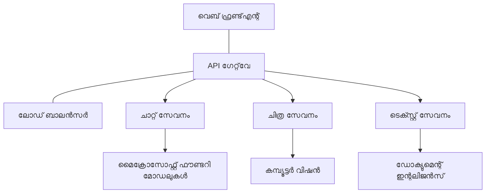

# പ്രൊഡക്ഷന്‍ AI വെയർലോഡ് ബെസ്റ്റ് പ്രാക്ടീസസ് വித் AZD

**അധ്യായ നാവിഗേഷൻ:**
- **📚 കോഴ്സ് ഹോം**: [AZD ഫോര്‍ ബിഗിനേഴ്സ്](../../README.md)
- **📖 നിലവിലുള്ള അധ്യായം**: അധ്യായം 8 - പ്രൊഡക്ഷന്‍ & എന്റർപ്രൈസ് പാറ്റേണ്സ്
- **⬅️ മുൻ അധ്യായം**: [അധ്യായം 7: ട്രബ്ല്ഷൂട്ടിംഗ്](../chapter-07-troubleshooting/debugging.md)
- **⬅️ ബന്ധപ്പെട്ടത്**: [AI വേർക്ക്‌ഷോപ്പ് ലാബ്](ai-workshop-lab.md)
- **🎯 കോഴ്സ് പൂർത്തിയായി**: [AZD ഫോര്‍ ബിഗിനേഴ്സ്](../../README.md)

## അവലോകനം

Azure Developer CLI (AZD) ഉപയോഗിച്ച് പ്രൊഡക്ഷന്‍ റെഡി AI വെയർലോഡ് പ്രയോഗിക്കാനുള്ള സമഗ്രമായ ബെസ്റ്റ് പ്രാക്ടീസുകൾ ഈ ഗൈഡ് നൽകുന്നു. Microsoft Foundry Discord കമ്മ്യൂണിറ്റി ഫീഡ്‌ബാക്കും യാഥാർത്ഥ്യത്തിലുള്ള കസ്റ്റമര്‍ ഡിപ്ലോയ്മെന്റ് സമ്പ്രദായങ്ങളും ആശ്രയിച്ചാണ് ഈ പ്രായോഗിക മാർഗ്ഗനിർദേശം, പ്രൊഡക്ഷൻ AI സിസ്റ്റങ്ങളിലെ ഏറ്റവും സാധാരണമായ വെല്ലുവിളികൾ പരിഹരിക്കാന്‍.

## പ്രധാന വെല്ലുവിളികൾ

നമ്മുടെ കമ്മ്യൂണിറ്റി പോൾ ഫലം അടിസ്ഥാനമാക്കിയുള്ള ഏറ്റവും പ്രധാന വെല്ലുവിളികൾ:

- **45%** മൾട്ടി-സർവീസ് AI ഡിപ്ലോയ്മെന്റുകള്‍ സംബന്ധിച്ച് ബുദ്ധിമുട്ട് അനുഭവിക്കുന്നു  
- **38%** ക്രെഡൻഷ്യൽസ്‌യും രഹസ്യ മാനേജ്മെന്റും എന്ന പ്രശ്നം  
- **35%** പ്രൊഡക്ഷന്‍ റെഡിനസ്‌യും സ്‌കെയ്ലിങ്ങും ബുദ്ധിമുട്ടായി കാണുന്നു  
- **32%** മെച്ചപ്പെട്ട ചെലവ് ഒപ്റ്റിമൈസേഷൻ തന്ത്രങ്ങൾ ആവശ്യം  
- **29%** മെച്ചപ്പെട്ട മോനിറ്ററിങ്ങും ട്രബ്ല്ഷൂട്ടിംഗും ആവശ്യമാണ്

## പ്രൊഡക്ഷന്‍ AI ആർകിടെക്ചർ പാറ്റേണുകൾ

### പാറ്റേൺ 1: മൈക്രോസർവീസസ് AI ആർകിടെക്ചർ

**എപ്പോൾ പ്രയോഗിക്കണം**: പല കഴിവുകളുള്ള സങ്കീർണ്ണ AI അപ്ലിക്കേഷനുകൾക്കായി



**AZD ഇംപ്ലിമെന്റേഷൻ**:

```yaml
# azure.yaml
name: enterprise-ai-platform
services:
  web:
    project: ./web
    host: staticwebapp
  api-gateway:
    project: ./api-gateway
    host: containerapp
  chat-service:
    project: ./services/chat
    host: containerapp
  vision-service:
    project: ./services/vision
    host: containerapp
  text-service:
    project: ./services/text
    host: containerapp
```

### പാറ്റേൺ 2: ഇവന്റ്-ഡ്രിവൻ AI പ്രോസസ്സിംഗ്

**എപ്പോൾ പ്രയോഗിക്കണം**: ബാച്ച് പ്രോസസ്സിംഗ്, ഡോക്യുമെന്റ് വിശകലനം, അസിങ്ക് വർക്ക്‌ഫ്ലോകൾ

```bicep
// Event Hub for AI processing pipeline
resource eventHub 'Microsoft.EventHub/namespaces@2023-01-01-preview' = {
  name: eventHubNamespaceName
  location: location
  sku: {
    name: 'Standard'
    tier: 'Standard'
    capacity: 1
  }
}

// Service Bus for reliable message processing
resource serviceBus 'Microsoft.ServiceBus/namespaces@2022-10-01-preview' = {
  name: serviceBusNamespaceName
  location: location
  sku: {
    name: 'Premium'
    tier: 'Premium'
    capacity: 1
  }
}

// Function App for processing
resource functionApp 'Microsoft.Web/sites@2023-01-01' = {
  name: functionAppName
  location: location
  kind: 'functionapp,linux'
  properties: {
    siteConfig: {
      appSettings: [
        {
          name: 'FUNCTIONS_EXTENSION_VERSION'
          value: '~4'
        }
        {
          name: 'AZURE_OPENAI_ENDPOINT'
          value: '@Microsoft.KeyVault(VaultName=${keyVault.name};SecretName=openai-endpoint)'
        }
      ]
    }
  }
}
```

## AI ഏജന്റ് ഹെൽത്ത് സംബന്ധിച്ച് ചിന്തിക്കുക

പാരമ്പര്യ വെബ് ആപ്പ് പിഴച്ചാൽ, ലക്ഷണങ്ങൾ പരിചിതമാണ്: ഒരു പേജ് ലോഡ് ചെയ്യപ്പെടുന്നില്ല, API പിഴവ് നൽകി, അല്ലെങ്കിൽ ഡിപ്ലോയ്മെന്റ് പരാജയപ്പെട്ടു. AI-ഓധിഷ്ഠിത അപ്ലിക്കേഷനുകൾ ഈ ഒട്ടുമിക്ക രീതിയിൽ തന്നെ പിഴന്നു പോകാം — എന്നാൽ കാണാനാകാത്ത പിഴവുകൾ ഉത്ഭവിക്കുമ്പോഴുള്ള സൂക്ഷ്മമായ പ്രവർത്തനക്കേടുകൾക്കും ഇടയുണ്ട്, അവ ദൃശ്യമായ പിഴവു സന്ദേശങ്ങൾ നൽകാറില്ല.

AI വെയർലോഡ് നിരീക്ഷിക്കുന്നതിനുള്ള മാനസിക മ моделейള്‍ ഇവിടെ സഹായിക്കും, പ്രശ്നങ്ങൾ കണ്ടെത്തുമ്പോൾ എവിടെ പരിശോധിക്കണമെന്ന് അറിയാൻ.

### ഏജന്റ് ഹെൽത്ത് പാരമ്പര്യ ആപ്പ് ഹെൽത്തിൽനിന്ന് വ്യത്യാസപ്പെടുന്നത്

ഒരു പരമ്പര്യ ആപ്പ് പ്രവർത്തിക്കുന്നോ അല്ലയോ എന്നതാണ്. AI ഏജന്റ് പ്രവർത്തിക്കുന്ന രൂപത്തിൽ ദൃശ്യമാകുന്നു, പക്ഷേ ഉത്പന്ന ഗുണനിലവാരം മോശമായിരിക്കാമെന്നും കാണാം. ഏജന്റ് ഹെൽത്ത് രണ്ട് പാളികളായി കരുതാം:

| പാളി | എന്ത് കാണണം | എവിടെ കാണണം |
|-------|--------------|---------------|
| **ഇൻഫ്രാസ്ട്രക്ചർ ഹെൽത്ത്** | സർവീസ് ഓടുന്നുണ്ടോ? വിഭവങ്ങൾ നിർമ്മിച്ചിട്ടുണ്ടോ? എൻഡ്‌പോയിന്റുകൾ അതേലെറ്റ് ചെയ്യാമോ? | `azd monitor`, Azure പോർട്ടൽ റിസോഴ്‌സ് ഹെൽത്ത്, കണ്ടെയ്നർ/ആപ്പ് ലോഗുകൾ |
| **പ്രവർത്തന ഹെൽത്ത്** | ഏജന്റ് ശരിയായി പ്രതികരിക്കുന്നുണ്ടോ? പ്രതികരണങ്ങൾ സമയം പാലിക്കുമോ? മോഡൽ ശരിയായ രീതിയിൽ വിളിക്കപ്പെട്ടിട്ടുണ്ടോ? | അപ്ലിക്കേഷൻ ഇൻസൈറ്റ്സ് ട്രേസുകൾ, മോഡൽ കോൾ ലേറ്റൻസി മെട്രിക്‌സ്, പ്രതികരണ ഗുണനിലവാരം രേഖകൾ |

ഇൻഫ്രാസ്ട്രക്ചർ ഹെൽത്ത് പരിചിതമാണ് - അത് ഏതൊരു azd ആപ്പിനെയും ബാധിക്കുന്നു. പ്രവർത്തന ഹെൽത്ത് AI വെയർലോഡുകൾ കൊണ്ടുവരുന്ന പുതിയ പാളിയാണ്.

### AI ആപ്പുകൾ പ്രതീക്ഷിച്ചതുപോലെ പ്രവർത്തിക്കുമ്പോൾ എവിടെ നോക്കണം

നിങ്ങളുടെ AI അപ്ലിക്കേഷൻ പ്രതീക്ഷിക്കുന്ന ഫലം നൽകുന്നില്ലെങ്കിൽ, സങ്കൽപ്പാത്മകമായ ഒരു പരിശോധാ പട്ടിക:

1. **അടിസ്ഥാനങ്ങളിൽ നിന്നും തുടങ്ങുക.** ആപ്പ് ഓടുന്നുണ്ടോ? അതിന്റെ ആശ്രിതങ്ങൾ ലഭ്യമാണോ? `azd monitor`യും റിസോഴ്‌സ് ഹെൽത്തും പരിശോധിക്കുക, ഒരു സാധാരണ ആപ്പിനിങ്ങനെ തന്നെ.  
2. **മോഡൽ കണക്ഷൻ പരിശോധിക്കുക.** നിങ്ങളുടെ അപ്ലിക്കേഷൻ വിജയകരമായി AI മോഡലുമായി ബന്ധപ്പെടുന്നുണ്ടോ? മോഡൽ കോൾ പരാജയപ്പെടുകയോ സമയംമതി കഴിഞ്ഞോ ഉണ്ടെങ്കിൽ, അത് AI ആപ്പ് പ്രശ്നങ്ങളുടെ ഏറ്റവും സാധാരണ കാരണം ആണ്. ഇത് നിങ്ങളുടെ അപ്ലിക്കേഷൻ ലോഗുകളിൽ കാണാം.  
3. **മോഡലിനു ലഭിച്ച വിവരങ്ങൾ കാണുക.** AI പ്രതികരണങ്ങൾ ഇൻപുട്ട് (പ്രോപ്റ്റും വീണ്ടെടുത്ത കോൺടക്സ്റ്റും) ആശ്രയിച്ചിരിക്കുന്നു. ഔട്ട്പുട്ട് തെറ്റായിരുന്നാൽ, ഇൻപുട്ട് സാധാരണയായി തെറ്റായിരിക്കാം. നിങ്ങളുടെ അപ്ലിക്കേഷൻ മോഡലിലേക്ക് ശരിയായ ഡാറ്റ അയക്കുന്നുണ്ടോ എന്ന് പരിശോധിക്കുക.  
4. **പ്രതികരണ ലേറ്റൻസി അവലോകനം ചെയ്യുക.** AI മോഡൽ കോൾ സാധാരണ API കോൾകളേക്കാൾ മന്ദഗതിയിലാണ്. നിങ്ങളുടെ ആപ്പ് മന്ദം എന്ന് തോന്നിയാൽ, മോഡൽ പ്രതികരണ സമയം ഉയർന്നിട്ടുണ്ടോ എന്നു പരിശോധിക്കുക — ഇതു ത്രോട്ട്ലിംഗ്, ശേഷിയിലുണ്ടായ പരിമിതികൾ, അല്ലെങ്കിൽ റീജിയന്‍ തലCongestion സൂചിപ്പിക്കാൻ കഴിയും.  
5. **ചെലവ് സൂചനകൾ ശ്രദ്ധിക്കുക.** ടോക്കൻ ഉപയോഗം അല്ലെങ്കിൽ API കോൾക്കൾ അനിയന്ത്രിതമായി ഉയരുന്നത് ഒരു ലൂപ്പ്, തെറ്റായി ക്രമീകരിച്ച പ്രോപ്റ്റ്, അല്ലെങ്കിൽ അനാവശ്യ ശ്രമങ്ങൾ സൂചിപ്പിക്കാം.

നിങ്ങൾക്ക് ഇപ്പോൾ ഒബ്സർവബിലിറ്റി ടൂളുകൾ പൂർണമായി പരിശീലിക്കാൻ ആവശ്യമില്ല. പ്രധാന കാര്യമാണ് AI അപ്ലിക്കേഷനുകൾക്ക് പ്രവർത്തനത്തിന്റെ അധിക പാളി നിരീക്ഷിക്കേണ്ടതുണ്ട് എന്നത് അറിയുക, azdയുടെ ഇൻബിൽട്ട് മോനിറ്ററിങ്ങ് (`azd monitor`) ഈ രണ്ടും പരാമർശിക്കാൻ തുടക്കം തരുന്നു.

---

## സുരക്ഷാ ബെസ്റ്റ് പ്രാക്ടീസസ്

### 1. സീറോ-ട്രസ്റ്റ് സുരക്ഷാ മോഡൽ

**ഇംപ്ലിമെന്റേഷൻ തന്ത്രം**:
- അംഗീകാരം ഇല്ലാതെ സർവീസ്-ടു-സർവീസ് ആശയവിനിമയം ഇല്ല  
- എല്ലാ API കോൾസും മാനേജ്ഡ് ഐഡന്റിറ്റികൾ ഉപയോഗിക്കുന്നു  
- പ്രൈവറ്റ് എൻഡ്‌പോയിന്റുകളുള്ള നെറ്റ്‌വർക്ക് ഐസൊലേഷൻ  
- ഏറ്റവും കുറഞ്ഞ പ്രിവിലേജ് ആക്സസ് നിയന്ത്രണങ്ങൾ

```bicep
// Managed Identity for each service
resource chatServiceIdentity 'Microsoft.ManagedIdentity/userAssignedIdentities@2023-01-31' = {
  name: 'chat-service-identity'
  location: location
}

// Role assignments with minimal permissions
resource openAIUserRole 'Microsoft.Authorization/roleAssignments@2022-04-01' = {
  scope: openAIAccount
  name: guid(openAIAccount.id, chatServiceIdentity.id, openAIUserRoleDefinitionId)
  properties: {
    roleDefinitionId: subscriptionResourceId('Microsoft.Authorization/roleDefinitions', '5e0bd9bd-7b93-4f28-af87-19fc36ad61bd')
    principalId: chatServiceIdentity.properties.principalId
    principalType: 'ServicePrincipal'
  }
}
```

### 2. സുരക്ഷിത രഹസ്യ മാനേജ്മെന്റ്

**കീ വോൾട്ട് ഇന്റഗ്രേഷൻ പാറ്റേൺ**:

```bicep
// Key Vault with proper access policies
resource keyVault 'Microsoft.KeyVault/vaults@2023-02-01' = {
  name: keyVaultName
  location: location
  properties: {
    tenantId: tenant().tenantId
    sku: {
      family: 'A'
      name: 'premium'  // Use premium for production
    }
    enableRbacAuthorization: true  // Use RBAC instead of access policies
    enablePurgeProtection: true    // Prevent accidental deletion
    enableSoftDelete: true
    softDeleteRetentionInDays: 90
  }
}

// Store all AI service credentials
resource openAIKeySecret 'Microsoft.KeyVault/vaults/secrets@2023-02-01' = {
  parent: keyVault
  name: 'openai-api-key'
  properties: {
    value: openAIAccount.listKeys().key1
    attributes: {
      enabled: true
    }
  }
}
```

### 3. നെറ്റ്‌വർക്ക് സുരക്ഷ

**പ്രൈവറ്റ് എൻഡ്പോയിന്റ് കോൺഫിഗറേഷൻ**:

```bicep
// Virtual Network for AI services
resource virtualNetwork 'Microsoft.Network/virtualNetworks@2023-04-01' = {
  name: vnetName
  location: location
  properties: {
    addressSpace: {
      addressPrefixes: ['10.0.0.0/16']
    }
    subnets: [
      {
        name: 'ai-services-subnet'
        properties: {
          addressPrefix: '10.0.1.0/24'
          privateEndpointNetworkPolicies: 'Disabled'
        }
      }
      {
        name: 'app-services-subnet'
        properties: {
          addressPrefix: '10.0.2.0/24'
          delegations: [
            {
              name: 'Microsoft.Web/serverFarms'
              properties: {
                serviceName: 'Microsoft.Web/serverFarms'
              }
            }
          ]
        }
      }
    ]
  }
}

// Private endpoints for all AI services
resource openAIPrivateEndpoint 'Microsoft.Network/privateEndpoints@2023-04-01' = {
  name: '${openAIAccountName}-pe'
  location: location
  properties: {
    subnet: {
      id: virtualNetwork.properties.subnets[0].id
    }
    privateLinkServiceConnections: [
      {
        name: 'openai-connection'
        properties: {
          privateLinkServiceId: openAIAccount.id
          groupIds: ['account']
        }
      }
    ]
  }
}
```

## പ്രകടനവും സ്‌കെയ്ലിംഗും

### 1. ഓട്ടോ-സ്‌കെയ്ലിംഗ് തന്ത്രങ്ങൾ

**കണ്ടെയ്നർ ആപ്പുകൾ ഓട്ടോ-സ്‌കെയ്ലിംഗ്**:

```bicep
resource containerApp 'Microsoft.App/containerApps@2023-05-01' = {
  name: containerAppName
  location: location
  properties: {
    configuration: {
      ingress: {
        external: true
        targetPort: 8000
        transport: 'http'
      }
    }
    template: {
      scale: {
        minReplicas: 2  // Always have 2 instances minimum
        maxReplicas: 50 // Scale up to 50 for high load
        rules: [
          {
            name: 'http-scaling'
            http: {
              metadata: {
                concurrentRequests: '20'  // Scale when >20 concurrent requests
              }
            }
          }
          {
            name: 'cpu-scaling'
            custom: {
              type: 'cpu'
              metadata: {
                type: 'Utilization'
                value: '70'  // Scale when CPU >70%
              }
            }
          }
        ]
      }
    }
  }
}
```

### 2. ക്യാഷിംഗ് തന്ത്രങ്ങൾ

**AI പ്രതികരണങ്ങൾക്ക് Redis ക്യാഷ്**:

```bicep
// Redis Premium for production workloads
resource redisCache 'Microsoft.Cache/redis@2023-04-01' = {
  name: redisCacheName
  location: location
  properties: {
    sku: {
      name: 'Premium'
      family: 'P'
      capacity: 1
    }
    enableNonSslPort: false
    minimumTlsVersion: '1.2'
    redisConfiguration: {
      'maxmemory-policy': 'allkeys-lru'
    }
    // Enable clustering for high availability
    redisVersion: '6.0'
    shardCount: 2
  }
}

// Cache configuration in application
var cacheConnectionString = '${redisCache.properties.hostName}:6380,password=${redisCache.listKeys().primaryKey},ssl=True,abortConnect=False'
```

### 3. ലോഡ് ബാലൻസിങ് & ട്രാഫിക് മാനേജ്മെന്റ്

**WAF ഉള്ള ആപ്ലിക്കേഷൻ ഗേറ്റ്വേ**:

```bicep
// Application Gateway with Web Application Firewall
resource applicationGateway 'Microsoft.Network/applicationGateways@2023-04-01' = {
  name: appGatewayName
  location: location
  properties: {
    sku: {
      name: 'WAF_v2'
      tier: 'WAF_v2'
      capacity: 2
    }
    webApplicationFirewallConfiguration: {
      enabled: true
      firewallMode: 'Prevention'
      ruleSetType: 'OWASP'
      ruleSetVersion: '3.2'
    }
    // Backend pools for AI services
    backendAddressPools: [
      {
        name: 'ai-services-pool'
        properties: {
          backendAddresses: [
            {
              fqdn: '${containerApp.properties.configuration.ingress.fqdn}'
            }
          ]
        }
      }
    ]
  }
}
```

## 💰 ചെലവ് ഒപ്റ്റിമൈസേഷൻ

### 1. വിഭവങ്ങളുടെ ശരിയായ വലിപ്പം

**പരിസ്ഥിതി-നിർദ്ദിഷ്ട കോൺഫിഗറേഷനുകൾ**:

```bash
# വികസന പരിസരം
azd env new development
azd env set AZURE_OPENAI_SKU "S0"
azd env set AZURE_OPENAI_CAPACITY 10
azd env set AZURE_SEARCH_SKU "basic"
azd env set CONTAINER_CPU 0.5
azd env set CONTAINER_MEMORY 1.0

# പ്രൊഡക്ഷൻ പരിസരം
azd env new production
azd env set AZURE_OPENAI_SKU "S0"
azd env set AZURE_OPENAI_CAPACITY 100
azd env set AZURE_SEARCH_SKU "standard"
azd env set CONTAINER_CPU 2.0
azd env set CONTAINER_MEMORY 4.0
```

### 2. ചെലവ് നിരീക്ഷണവും ബഡ്ജറ്റും

```bicep
// Cost management and budgets
resource budget 'Microsoft.Consumption/budgets@2023-05-01' = {
  name: 'ai-workload-budget'
  properties: {
    timePeriod: {
      startDate: '2024-01-01'
      endDate: '2024-12-31'
    }
    timeGrain: 'Monthly'
    amount: 2000  // $2000 monthly budget
    category: 'Cost'
    notifications: {
      warning: {
        enabled: true
        operator: 'GreaterThan'
        threshold: 80
        contactEmails: [
          'finance@company.com'
          'engineering@company.com'
        ]
        contactRoles: [
          'Owner'
          'Contributor'
        ]
      }
      critical: {
        enabled: true
        operator: 'GreaterThan'
        threshold: 95
        contactEmails: [
          'cto@company.com'
        ]
      }
    }
  }
}
```

### 3. ടോക്കൻ ഉപയോഗം മെച്ചപ്പെടുത്തൽ

**OpenAI ചെലവ് മാനേജ്മെന്റ്**:

```typescript
// ആപ്ലിക്കേഷൻ നിലയിലെ ടോക്കൺ മെച്ചപ്പെടുത്തൽ
class TokenOptimizer {
  private readonly maxTokens = 4000;
  private readonly reserveTokens = 500;
  
  optimizePrompt(userInput: string, context: string): string {
    const availableTokens = this.maxTokens - this.reserveTokens;
    const estimatedTokens = this.estimateTokens(userInput + context);
    
    if (estimatedTokens > availableTokens) {
      // ഉപയോഗകർത്താവിന്റെ ഇൻപുട്ട് കുറയ്ക്കാതെ, സാന്ദർഭം ചുരുക്കുക
      context = this.truncateContext(context, availableTokens - this.estimateTokens(userInput));
    }
    
    return `${context}\n\nUser: ${userInput}`;
  }
  
  private estimateTokens(text: string): number {
    // ഏകദേശം കണക്കാക്കൽ: 1 ടോക്കൺ ≈ 4 അക്ഷരങ്ങൾ
    return Math.ceil(text.length / 4);
  }
}
```

## മോനിറ്ററിങ്ങും ഒബ്സർവബിലിറ്റിയും

### 1. സമഗ്രമായ അപ്ലിക്കേഷൻ ഇൻസൈറ്റ്സ്

```bicep
// Application Insights with advanced features
resource applicationInsights 'Microsoft.Insights/components@2020-02-02' = {
  name: applicationInsightsName
  location: location
  kind: 'web'
  properties: {
    Application_Type: 'web'
    WorkspaceResourceId: logAnalyticsWorkspace.id
    SamplingPercentage: 100  // Full sampling for AI apps
    DisableIpMasking: false  // Enable for security
  }
}

// Custom metrics for AI operations
resource aiMetricAlerts 'Microsoft.Insights/metricAlerts@2018-03-01' = {
  name: 'ai-high-error-rate'
  location: 'global'
  properties: {
    description: 'Alert when AI service error rate is high'
    severity: 2
    enabled: true
    scopes: [
      applicationInsights.id
    ]
    evaluationFrequency: 'PT1M'
    windowSize: 'PT5M'
    criteria: {
      'odata.type': 'Microsoft.Azure.Monitor.SingleResourceMultipleMetricCriteria'
      allOf: [
        {
          name: 'high-error-rate'
          metricName: 'requests/failed'
          operator: 'GreaterThan'
          threshold: 10
          timeAggregation: 'Count'
        }
      ]
    }
  }
}
```

### 2. AI-സ്പെസിഫിക് മോനിറ്ററിങ്ങ്

**AI മെട്രിക്‌സ്കൾക്കുള്ള കസ്റ്റം ഡാഷ്ബോർഡുകൾ**:

```json
// Dashboard configuration for AI workloads
{
  "dashboard": {
    "name": "AI Application Monitoring",
    "tiles": [
      {
        "name": "OpenAI Request Volume",
        "query": "requests | where name contains 'openai' | summarize count() by bin(timestamp, 5m)"
      },
      {
        "name": "AI Response Latency",
        "query": "requests | where name contains 'openai' | summarize avg(duration) by bin(timestamp, 5m)"
      },
      {
        "name": "Token Usage",
        "query": "customMetrics | where name == 'openai_tokens_used' | summarize sum(value) by bin(timestamp, 1h)"
      },
      {
        "name": "Cost per Hour",
        "query": "customMetrics | where name == 'openai_cost' | summarize sum(value) by bin(timestamp, 1h)"
      }
    ]
  }
}
```

### 3. ഹെൽത്ത് ചെക്കുകളും അപ്‌ടൈം മോനിറ്ററിങ്ങും

```bicep
// Application Insights availability tests
resource availabilityTest 'Microsoft.Insights/webtests@2022-06-15' = {
  name: 'ai-app-availability-test'
  location: location
  tags: {
    'hidden-link:${applicationInsights.id}': 'Resource'
  }
  properties: {
    SyntheticMonitorId: 'ai-app-availability-test'
    Name: 'AI Application Availability Test'
    Description: 'Tests AI application endpoints'
    Enabled: true
    Frequency: 300  // 5 minutes
    Timeout: 120    // 2 minutes
    Kind: 'ping'
    Locations: [
      {
        Id: 'us-east-2-azr'
      }
      {
        Id: 'us-west-2-azr'
      }
    ]
    Configuration: {
      WebTest: '''
        <WebTest Name="AI Health Check" 
                 Id="8d2de8d2-a2b0-4c2e-9a0d-8f9c9a0b8c8d" 
                 Enabled="True" 
                 CssProjectStructure="" 
                 CssIteration="" 
                 Timeout="120" 
                 WorkItemIds="" 
                 xmlns="http://microsoft.com/schemas/VisualStudio/TeamTest/2010" 
                 Description="" 
                 CredentialUserName="" 
                 CredentialPassword="" 
                 PreAuthenticate="True" 
                 Proxy="default" 
                 StopOnError="False" 
                 RecordedResultFile="" 
                 ResultsLocale="">
          <Items>
            <Request Method="GET" 
                     Guid="a5f10126-e4cd-570d-961c-cea43999a200" 
                     Version="1.1" 
                     Url="${webApp.properties.defaultHostName}/health" 
                     ThinkTime="0" 
                     Timeout="120" 
                     ParseDependentRequests="True" 
                     FollowRedirects="True" 
                     RecordResult="True" 
                     Cache="False" 
                     ResponseTimeGoal="0" 
                     Encoding="utf-8" 
                     ExpectedHttpStatusCode="200" 
                     ExpectedResponseUrl="" 
                     ReportingName="" 
                     IgnoreHttpStatusCode="False" />
          </Items>
        </WebTest>
      '''
    }
  }
}
```

## ദുരന്ത പുനരുദ്ധാരണം & ഉയർന്ന ലഭ്യത

### 1. മൾട്ടി-റീജിയൻ ഡിപ്ലോയ്മെന്റ്

```yaml
# azure.yaml - Multi-region configuration
name: ai-app-multiregion
services:
  api-primary:
    project: ./api
    host: containerapp
    env:
      - AZURE_REGION=eastus
  api-secondary:
    project: ./api
    host: containerapp
    env:
      - AZURE_REGION=westus2
```

```bicep
// Traffic Manager for global load balancing
resource trafficManager 'Microsoft.Network/trafficManagerProfiles@2022-04-01' = {
  name: trafficManagerProfileName
  location: 'global'
  properties: {
    profileStatus: 'Enabled'
    trafficRoutingMethod: 'Priority'
    dnsConfig: {
      relativeName: trafficManagerProfileName
      ttl: 30
    }
    monitorConfig: {
      protocol: 'HTTPS'
      port: 443
      path: '/health'
      intervalInSeconds: 30
      toleratedNumberOfFailures: 3
      timeoutInSeconds: 10
    }
    endpoints: [
      {
        name: 'primary-endpoint'
        type: 'Microsoft.Network/trafficManagerProfiles/azureEndpoints'
        properties: {
          targetResourceId: primaryAppService.id
          endpointStatus: 'Enabled'
          priority: 1
        }
      }
      {
        name: 'secondary-endpoint'
        type: 'Microsoft.Network/trafficManagerProfiles/azureEndpoints'
        properties: {
          targetResourceId: secondaryAppService.id
          endpointStatus: 'Enabled'
          priority: 2
        }
      }
    ]
  }
}
```

### 2. ഡാറ്റ ബാക്കപ്പ് & പുനരുദ്ധാരണ പദ്ധതി

```bicep
// Backup configuration for critical data
resource backupVault 'Microsoft.DataProtection/backupVaults@2023-05-01' = {
  name: backupVaultName
  location: location
  identity: {
    type: 'SystemAssigned'
  }
  properties: {
    storageSettings: [
      {
        datastoreType: 'VaultStore'
        type: 'LocallyRedundant'
      }
    ]
  }
}

// Backup policy for AI models and data
resource backupPolicy 'Microsoft.DataProtection/backupVaults/backupPolicies@2023-05-01' = {
  parent: backupVault
  name: 'ai-data-backup-policy'
  properties: {
    policyRules: [
      {
        backupParameters: {
          backupType: 'Full'
          objectType: 'AzureBackupParams'
        }
        trigger: {
          schedule: {
            repeatingTimeIntervals: [
              'R/2024-01-01T02:00:00+00:00/P1D'  // Daily at 2 AM
            ]
          }
          objectType: 'ScheduleBasedTriggerContext'
        }
        dataStore: {
          datastoreType: 'VaultStore'
          objectType: 'DataStoreInfoBase'
        }
        name: 'BackupDaily'
        objectType: 'AzureBackupRule'
      }
    ]
  }
}
```

## ഡെവ്‌ഓപ്സ് & CI/CD ഇന്റഗ്രേഷൻ

### 1. ഗിറ്റ്‌ഹബ് ആക്ഷൻസ് വർക്ക്‌ഫ്ലോ

```yaml
# .github/workflows/deploy-ai-app.yml
name: Deploy AI Application

on:
  push:
    branches: [main]
  pull_request:
    branches: [main]

jobs:
  test:
    runs-on: ubuntu-latest
    steps:
      - uses: actions/checkout@v4
      
      - name: Setup Python
        uses: actions/setup-python@v4
        with:
          python-version: '3.11'
          
      - name: Install dependencies
        run: |
          pip install -r requirements.txt
          pip install pytest
          
      - name: Run tests
        run: pytest tests/
        
      - name: AI Safety Tests
        run: |
          python scripts/test_ai_safety.py
          python scripts/validate_prompts.py

  deploy-staging:
    needs: test
    if: github.event_name == 'pull_request'
    runs-on: ubuntu-latest
    steps:
      - uses: actions/checkout@v4
      
      - name: Setup AZD
        uses: Azure/setup-azd@v2
        
      - name: Login to Azure
        uses: azure/login@v1
        with:
          creds: ${{ secrets.AZURE_CREDENTIALS }}
          
      - name: Deploy to Staging
        run: |
          azd env select staging
          azd deploy

  deploy-production:
    needs: test
    if: github.ref == 'refs/heads/main'
    runs-on: ubuntu-latest
    steps:
      - uses: actions/checkout@v4
      
      - name: Setup AZD
        uses: Azure/setup-azd@v2
        
      - name: Login to Azure
        uses: azure/login@v1
        with:
          creds: ${{ secrets.AZURE_CREDENTIALS }}
          
      - name: Deploy to Production
        run: |
          azd env select production
          azd deploy
          
      - name: Run Production Health Checks
        run: |
          python scripts/health_check.py --env production
```

### 2. ഇൻഫ്രാസ്ട്രക്ചർ വാലിഡേഷൻ

```bash
# scripts/validate_infrastructure.sh
#!/bin/bash

echo "Validating AI infrastructure deployment..."

# എല്ലാ ആവശ്യമായ സേവനങ്ങളും പ്രവർത്തിക്കുകയാണ് എന്ന് പരിശോധിക്കുക
services=("openai" "search" "storage" "keyvault")
for service in "${services[@]}"; do
    echo "Checking $service..."
    if ! az resource list --resource-type "Microsoft.CognitiveServices/accounts" --query "[?contains(name, '$service')]" -o tsv; then
        echo "ERROR: $service not found"
        exit 1
    fi
done

# OpenAI മോഡൽ വിന്യസനങ്ങൾ പരിശോധന ചെയ്യുക
echo "Validating OpenAI model deployments..."
models=$(az cognitiveservices account deployment list --name $AZURE_OPENAI_NAME --resource-group $AZURE_RESOURCE_GROUP --query "[].name" -o tsv)
if [[ ! $models == *"gpt-4.1-mini"* ]]; then
  echo "ERROR: Required model gpt-4.1-mini not deployed"
    exit 1
fi

# AI സേവനത്തിനുള്ള ബന്ധം പരിശോദിക്കുക
echo "Testing AI service connectivity..."
python scripts/test_connectivity.py

echo "Infrastructure validation completed successfully!"
```

## പ്രൊഡക്ഷൻ റെഡിനസ് ചെക്ക്‌ലിസ്റ്റ്

### സുരക്ഷാ ✅
- [ ] എല്ലാ സർവീസുകളും മാനേജ്ഡ് ഐഡന്റിറ്റികൾ ഉപയോഗിക്കുന്നു  
- [ ] രഹസ്യങ്ങൾ കീ വോൾട്ടിൽ സൂക്ഷിച്ചിരിക്കുന്നു  
- [ ] പ്രൈവറ്റ് എൻഡ്‌പോയിന്റുകൾ കോൺഫിഗർ ചെയ്തിരിക്കുന്നു  
- [ ] നെറ്റ്‌വർക്ക് സെക്യൂരിറ്റി ഗ്രൂപ്പുകൾ നടപ്പിലാക്കിയിരിക്കുന്നു  
- [ ] ഏറ്റവും കുറഞ്ഞ പ്രിവിലേജ് ഉള്ള RBAC  
- [ ] പബ്ലിക് എൻഡ്‌പോയിന്റുകളിൽ WAF സജ്ജമാക്കിയിരിക്കുന്നു

### പ്രകടനം ✅
- [ ] ഓട്ടോ-സ്‌കെയ്ലിംഗ് കോൺഫിഗർ ചെയ്തിരിക്കുന്നു  
- [ ] ക്യാഷിംഗ് നടപ്പിലാക്കിയിരിക്കുന്നു  
- [ ] ലോഡ് ബാലൻസിങ് ക്രമീകരിച്ചിരിക്കുന്നു  
- [ ] സ്റ്റാറ്റിക് കോൺറന്റ് CDN ഉപയോഗിക്കുന്നു  
- [ ] ഡാറ്റാബേസ് കണക്ഷൻ പൂളിംഗ്  
- [ ] ടോക്കൻ ഉപയോഗം ഒപ്റ്റിമൈസ് ചെയ്തത്

### മോനിറ്ററിങ്ങ് ✅
- [ ] അപ്ലിക്കേഷൻ ഇൻസൈറ്റ്സ് കോൺഫിഗർ ചെയ്തിരിക്കുന്നു  
- [ ] കസ്റ്റം മെട്രിക്‌സ് നിർവചിച്ചിരിക്കുന്നു  
- [ ] അലർട്ട് നിയമങ്ങൾ സജ്ജമാക്കിയത്  
- [ ] ഡാഷ്ബോർഡ് സൃഷ്ടിച്ചിട്ടുണ്ട്  
- [ ] ഹെൽത്ത് ചെക്കുകൾ നടപ്പിലാക്കിയിരിക്കുന്നു  
- [ ] ലോഗ് സംരക്ഷണ നയങ്ങൾ

### വിശ്വാസ്യത ✅
- [ ] മൾട്ടി-റീജിയൻ ഡിപ്ലോയ്മെന്റ്  
- [ ] ബാക്കപ്പ് & പുനരുദ്ധാരണ പദ്ധതി  
- [ ] സർക്യൂട്ട് ബ്രേക്കേഴ്സ് നടപ്പിലാക്കിയത്  
- [ ] റിട്രൈ നയങ്ങൾ  
- [ ] கிரേസഫുൾ ഡീഗ്രേഡേഷൻ  
- [ ] ഹെൽത്ത് ചെക്ക് എൻഡ്‌പോയിന്റുകൾ

### ചെലവു മാനേജ്മെന്റ് ✅
- [ ] ബഡ്ജറ്റ് അലർട്ടുകൾ കോൺഫിഗർ ചെയ്തിരിക്കുന്നു  
- [ ] വിഭവങ്ങളുടെ ശരിയായ വലുപ്പം  
- [ ] ഡെവ്/ടെസ്റ്റ് ഡിസ്കൗണ്ടുകൾ പ്രയോഗിച്ചിട്ടുണ്ട്  
- [ ] റിസർവുഡ് ഇൻസ്റ്റൻസുകൾ വാങ്ങിയിട്ടുണ്ട്  
- [ ] ചെലവ് നിരീക്ഷണ ഡാഷ്ബോർഡ്  
- [ ] നിരന്തര ചെലവ് അവലോകനം

### അനുകൂല്യം ✅
- [ ] ഡാറ്റ റെസിഡൻസിയുടെ ആവശ്യകതകൾ പാലിച്ചു  
- [ ] ഓഡിറ്റ് ലോക്കിംഗ് സജീവം  
- [ ] അനുകൂല നയങ്ങൾ പ്രയോഗിച്ചു  
- [ ] സുരക്ഷാ ബെസ്‌ലൈൻ നടപ്പിൽ  
- [ ] പതിവ് സുരക്ഷാ വിലയിരുത്തലുകൾ  
- [ ] നടന്ന സംഭവങ്ങൾക്കുള്ള പ്രതികരണ പദ്ധതികൾ

## പ്രകടന ബഞ്ച്മാർക്കുകൾ

### സാധാരണ പ്രൊഡക്ഷൻ മെട്രിക്‌സ്

| മെട്രിക് | ലക്ഷ്യം | നിരീക്ഷണം |
|--------|--------|------------|
| **പ്രതികരണ സമയം** | < 2 സെക്കൻഡ് | അപ്ലിക്കേഷൻ ഇൻസൈറ്റ്സ് |
| **ലഭ്യത** | 99.9% | അപ്പ്‌ടൈം മോനിറ്ററിംഗ് |
| **പിഴവ് നിരക്ക്** | < 0.1% | അപ്ലിക്കേഷൻ ലോഗുകൾ |
| **ടോക്കൻ ഉപയോഗം** | < $500/മാസം | ചെലവ് മാനേജ്മെന്റ് |
| **സമകാലിക ഉപയോക്താക്കൾ** | 1000+ | ലോഡ് ടെസ്റ്റിങ് |
| **വ്യാപ്തി സമയം** | < 1 മണിക്കൂർ | ദുരന്ത പുനരുദ്ധാരണ ടെസ്റ്റുകൾ |

### ലോഡ് ടെസ്റ്റിംഗ്

```bash
# AI ആപ്ലിക്കേഷനുകള്‍ക്കുള്ള ലോഡ് ടെസ്റ്റിംഗ് സ്ക്രിപ്റ്റ്
python scripts/load_test.py \
  --endpoint https://your-ai-app.azurewebsites.net \
  --concurrent-users 100 \
  --duration 300 \
  --ramp-up 60
```

## 🤝 കമ്മ്യൂണിറ്റി ബെസ്റ്റ് പ്രാക്ടീസസ്

Microsoft Foundry Discord കമ്മ്യൂണിറ്റിയുടെ ഫീഡ്‌ബാക്ക് അടിസ്ഥാനമാക്കി:

### കമ്മ്യൂണിറ്റി മുഖ്യ ശിപാർശകൾ:

1. **ചെറിയതിൽ തുടങ്ങുക, പതുക്കെ വലുതാക്കുക**: അടിസ്ഥാന SKUs ഉപയോഗിച്ച് ആരംഭിച്ച്, യഥാർത്ഥ ഉപയോഗാനുസൃതം സ്‌കെയിൽ ചെയ്യുക  
2. **എല്ലാം നിരീക്ഷിക്കുക**: ആദ്യ ദിവസം മുതലാണ് സമഗ്രമായ മോനിറ്ററിങ് സജ്ജമാക്കുക  
3. **സുരക്ഷാ ഓട്ടോമേറ്റ് ചെയ്യുക**: ഒരു സമാനമായ സുരക്ഷയ്ക്ക് ഇൻഫ്രാസ്ട്രക്ചർ ആസ് കോഡ് ഉപയോഗിക്കുക  
4. **പൂർണ്ണമായ ടെസ്റ്റിംഗ് നടത്തുക**: നിങ്ങളുടെ പൈപ്പ്‌ലൈൻ AI-സ്പെസിഫിക് ടെസ്റ്റിംഗ് അടങ്ങിയിരിക്കണം  
5. **ചെലവുകൾക്കായി പദ്ധതിയിടുക**: ടോക്കൻ ഉപയോഗം നിരീക്ഷിച്ച്, ബഡ്ജറ്റ് അലർട്ടുകൾ നേരത്തേ സജ്ജമാക്കുക

### പൊതുവായ തെറ്റുകൾ ഒഴിവാക്കണം:

- ❌ API കീകൾ കൺക്രീറ്റ് കോഡിൽ ഹാർഡ്‌കോഡ് ചെയ്യൽ  
- ❌ ശരിയായ മോനിറ്ററിങ് സജ്ജമാക്കാതെ ഉപേക്ഷിക്കൽ  
- ❌ ചെലവ് ഒപ്റ്റിമൈസേഷൻ അവഗണിക്കൽ  
- ❌ പരാജയ സംഭവപരിസരങ്ങൾ ടെസ്റ്റ് ചെയ്യാതിരിക്കുക  
- ❌ ഹെൽത്ത് ചെക്കുകൾ ഇല്ലാതെ ഡിപ്ലോയ് ചെയ്യുക

## AZD AI CLI കമാൻഡുകളും എക്സ്റ്റൻഷനുകളും

AZD ഉൽപ്പാദന AI വെയർലോഡുകളെ സുഗമമാക്കുന്ന AI-സ്പെസിഫിക് കമാൻഡുകളും എക്സ്റ്റൻഷനുകളും ಒಳക്കൊള്ളുന്നു. ഈ ടൂൾസ് പ്രാദേശിക ഡെവലപ്പ്മെന്റും പ്രൊഡക്ഷന്‍ ഡിപ്ലോയ്മെന്റ് ഇടയിലെ ഗ്യാപ്പ് അകറ്റുന്നു.

### AI-യ്ക്കുള്ള AZD എക്സ്റ്റൻഷനുകൾ

AZD AI-സ്പെസിഫിക് കഴിവുകൾ ചേർക്കാൻ എക്സ്റ്റൻഷൻ സിസ്റ്റം ഉപയോഗിക്കുന്നു. ഇൻസ്റ്റാൾ ചെയ്ത് മാനേജ് ചെയ്യാൻ:

```bash
# ലഭ്യമായ എല്ലാ എക്സ്റ്റെൻഷനുകളും (AI ഉൾപ്പെടെ) പട്ടികവത്കരിക്കുക
azd extension list

# സ്ഥാപിച്ച എക്സ്റ്റെൻഷൻ വിശദാംശങ്ങൾ പരിശോധിക്കുക
azd extension show azure.ai.agents

# ഫൗണ്ട്രി ഏജന്റ്സ് എക്സ്റ്റെൻഷൻ ഇൻസ്റ്റാൾ ചെയ്യുക
azd extension install azure.ai.agents

# ഫൈൻ-ട്യൂണിംഗ് എക്സ്റ്റെൻഷൻ ഇൻസ്റ്റാൾ ചെയ്യുക
azd extension install azure.ai.finetune

# കസ്റ്റം മോഡലുകൾ എക്സ്റ്റെൻഷൻ ഇൻസ്റ്റാൾ ചെയ്യുക
azd extension install azure.ai.models

# ഇൻസ്റ്റാൾ ചെയ്ത എല്ലാ എക്സ്റ്റെൻഷനുകളും അപ്ഗ്രേഡ് ചെയ്യുക
azd extension upgrade --all
```
  
**ലഭ്യമായ AI എക്സ്റ്റൻഷനുകൾ:**

| എക്സ്റ്റൻഷൻ | ഉദ്ദേശ്യം | നില |
|-----------|---------|--------|
| `azure.ai.agents` | ഫൗണ്ടറി ഏജന്റ് സർവീസ് മാനേജ്മെന്റ് | പ്രിവ്യു |
| `azure.ai.skills` | പുനരുപയോഗ قابل(skill) | പ്രിവ്യു |
| `azure.ai.connections` | ഫൗണ്ടറി കണക്ഷനുകൾ (ഡാറ്റാ സോഴ്സുകൾ, ടൂളുകൾ) | പ്രിവ്യു |
| `azure.ai.finetune` | ഫൗണ്ടറി മോഡൽ ഫൈൻ-ട്യൂണിംഗ് | പ്രിവ്യു |
| `azure.ai.models` | ഫൗണ്ടറി കസ്റ്റം മോഡലുകൾ | പ്രിവ്യു |
| `azure.coding-agent` | കോഡിംഗ് ഏജന്റ് കോൺഫിഗറേഷൻ | ലഭ്യമായത് |

> `azure.ai.agents` എക്സ്റ്റൻഷൻ വേഗത്തിൽ വികസിക്കുന്നു. ഈ കോഴ്സ് `0.1.40-preview` എതിരാളിയിലേക്ക് സ്ഥിരീകരിച്ചിരിക്കുന്നു. പുതിയത് കമാൻഡ് സെറ്റ് വാങ്ങാൻ `azd extension upgrade --all` ഓടിക്കുക, ഇൻസ്റ്റാൾ ചെയ്ത വേഴ്സൻ പരിശോധിക്കാൻ `azd extension show azure.ai.agents` ഓടിക്കുക.

**പുതിയ `skills` & `connections` എക്സ്റ്റൻഷനുകൾ എന്താണ്?**

എജന്റ് ടൂളിംഗിനൊപ്പം രണ്ട് പ്രിവ്യു എക്സ്റ്റൻഷനുകൾ വന്നിട്ടുണ്ട്, തുടക്കക്കാർക്കും അവ മനസ്സിലാക്കാൻ ഉപകാരപ്രദം:

- **`azure.ai.skills`** — ഒരു **സ്കിൽ** പുനരുപയോഗ യോഗ്യമായ കഴിവാണ് (പാക്കേജഡ് ടൂൾ അല്ലെങ്കിൽ പ്രവർത്തനം), ഇത് ഒരോ ഏജന്റ് ആയി നിങ്ങളുടെ ആവർത്തനത്തിൽ വീണ്ടും വീണ്ടും രൂപപ്പെടുത്താതെ ചേർക്കാനാകും. ഉദാഹരണമായി, "ഡോകസ് സെർച്ച് ചെയ്യുക" അല്ലെങ്കിൽ "ഓർഡർ പരിശോധിക്കുക" സ്കിൽ ഒരുമിച്ച് നിർവചിച്ച് പല ഏജന്റിനും ഉപയോഗിക്കുക. ഇത് മൾട്ടി-ഏജന്റ് സിസ്റ്റങ്ങൾ ശരിയായി നിലനിർത്താനും കോഡിന്റെ പകർപ്പ് ഒഴിവാക്കാനും സഹായിക്കും.  
- **`azure.ai.connections`** — ഒരു **കണക്ഷൻ** നിങ്ങളുടെ ഫൗണ്ടറി പ്രോജക്ടും അതിന്റെ ഏജന്റുകളും ആവശ്യപ്പെടുന്ന പുറത്തുള്ള വിഭവങ്ങളിലേക്കുള്ള മാനേജ്ഡ് ലിങ്ക് ആണ് — ഒരു ഡാറ്റ സോഴ്സ് (Azure AI Search പോലുള്ള), ഒരു ടൂൾ എൻഡ്‌പോയിന്റ് അല്ലെങ്കിൽ മറ്റൊരു സർവീസ്. കണക്ഷനുകൾ ഏജന്റുകൾ ഡാറ്റ ആക്സസ് ചെയ്യുന്ന സ്ഥലം ഒറ്റത്തവണ നിയന്ത്രിക്കുന്നു, അതിനാൽ ക്രെഡൻഷ്യലുകളും എൻഡ്‌പോയിന്റുകളും കൂട്ടിയിരിക്കുകയാണ്, കോഡിൽ പടിഞ്ഞാറെല്ലാത്ത വിധം.

ആദ്യ ഏജന്റുകൾ ഡിപ്ലോയ് ചെയ്യാൻ ഈ രണ്ട് എക്സ്റ്റൻഷനുകളും വേണ്ടില്ല — പഠിക്കുന്നപ്പോൾ `azure.ai.agents`ക്ക് മാത്രം പിന്തുണ നൽകുക. ഒരേ ടൂൾ പല ഏജന്റുകളിലും ആവർത്തിക്കുന്നുവെന്നു കാണുമ്പോള്‍ `skills` നുകാമാറും, ഒന്നിലധികം ഏജന്റുകൾ ഒരേ ഡാറ്റ സോഴ്സ് പങ്കുവെക്കുന്നുണ്ടെങ്കിൽ `connections` ഉപയോഗിക്കുക.

### `azd ai agent init` ഉപയോഗിച്ച് ഏജന്റ് പ്രോജക്ടുകൾ ആരംഭിക്കൽ

`azd ai agent init` കമാൻഡ് Microsoft Foundry Agent Service-നൊപ്പം സംയോജിപ്പിച്ച പ്രൊഡക്ഷന്‍ റെഡിപ്രതേക AI ഏജന്റ് പ്രോജക്ട് സ്കാഫോൾഡ് ചെയ്യുന്നു:

```bash
# ഏജന്റ് മാനിഫെസ്റ്റിൽ നിന്ന് പുതിയ ഏജന്റ് പ്രോജക്ട് ആരംഭിക്കുക
azd ai agent init -m <manifest-path-or-uri>

# ഒരു പ്രത്യേക Foundry പ്രോജക്ട് ആരംഭിക്കുകയും ലക്ഷ്യമിടുകയും ചെയ്യുക
azd ai agent init -m agent-manifest.yaml --project-id <foundry-project-id>

# ഒരു കസ്റ്റം സോഴ്‌സ് ഡയറക്ടറിയോടൊപ്പം ആരംഭിക്കുക
azd ai agent init -m agent-manifest.yaml --src ./agents/my-agent

# ഹോസ്റ്റായി കോൺടെയിനർ ആപ്പുകൾ ലക്ഷ്യമിടുക
azd ai agent init -m agent-manifest.yaml --host containerapp
```
  
**പ്രധാന ഫ്ലാഗുകൾ:**

| ഫ്ലാഗ് | വിവരണം |
|------|-------------|
| `-m, --manifest` | ഏജന്റ് മാനിഫസ്റ്റ്- ഒരു പ്രോജക്ടിൽ ചേർക്കാനുള്ള പാത അല്ലെങ്കിൽ URI |
| `-p, --project-id` | നിങ്ങളുടെ azd പരിസരത്തിനുള്ള നിലവിലുള്ള Microsoft Foundry പ്രോജക്ട് ഐഡി |
| `-s, --src` | ഏജന്റ് നിർവചനം ഡൗൺലോഡ് ചെയ്യാനുള്ള ഡയറക്ടറി (`src/<agent-id>` ആയിട്ടാണ് ഡീഫോൾട്ട്) |
| `--host` | ഡീഫോൾട്ട് ഹോസ്റ്റ് ഓവർറൈഡ് ചെയ്യുക (ഉദാ. `containerapp`) |
| `-e, --environment` | ഉപയോഗിക്കേണ്ട azd പരിസരം |

**പ്രൊഡക്ഷന്‍ ടിപ്പ്**: നിലവിലുള്ള ഫൗണ്ടറി പ്രോജക്ടുമായി നേരിട്ട് ബന്ധിപ്പിക്കാൻ `--project-id` ഉപയോഗിക്കുക, ഇതുവഴി നിങ്ങളുടെ ഏജന്റ് കോഡ്, ക്ലൗഡ് വിഭവങ്ങൾ തുടക്കത്തിൽ തന്നെ ബന്ധിപ്പിക്കാനാകും.

### ഏജന്റ് ലൈഫ്‌സൈക്കിൾ മാനേജ്മെന്റ്

`init` മുകളിൽ, `azure.ai.agents` എക്സ്റ്റൻഷൻ ഹോസ്റ്റുചെയ്‌ത ഏജന്റിന്റെ പൂർണ്ണ ജീവിതചക്രത്തിനുള്ള കമാൻഡുകൾ നൽകുന്നു — ടെസ്റ്റ് ചെയ്യൽ, വിലയിരുത്തൽ, മെച്ചപ്പെടുത്തൽ, മരുന്ന് നൽകി ഒഴിവാക്കൽ:

```bash
# വിന്യസിച്ച ഏജന്റ് വിളിച്ച് സർവർ പ്രതികരണ സമയം കാണിക്കുക
# (മൊത്തം ലാറ്റൻസി, പ്രഥമ ബൈറ്റ് സമയം)
azd ai agent invoke

# മാറ്റം വരുത്തുന്നതിന് മുമ്പ് ലൈവ് എൻഡ്‌പോയിൻറ് ക്രമീകരണം പ്രദർശിപ്പിക്കുക
azd ai agent endpoint show

# ഏജന്റിന് ഒരു മൂല്യനിർണ്ണയ ഡാറ്റാസെറ്റ് സൃഷ്ടിക്കുക
azd ai agent eval generate --dataset ./eval/dataset.jsonl

# നിങ്ങളുടെ മൂല്യനിർണ്ണയ ഡാറ്റ അടിസ്ഥാനമാക്കി ഏജന്റ് നിർദ്ദേശങ്ങൾ മെച്ചപ്പെടുത്തുക
# (ഏജന്റ് പ്രോജക്ടിൽ ഒപ്റ്റിമൈസേഷൻ മോൾഡൽ ആവശ്യമാണ്)
azd ai agent optimize

# കോഡ് ആധാരിത ഹോസ്റ്റുചെയ്ത ഏജന്റിന്റെ വിന്യസിച്ച സോഴ്സ് ഡൗൺലോഡ് ചെയ്യുക
# (SHA-256 പരിശോധനസഹിതം)
azd ai agent code download

# ഒരു ഹോസ്റ്റുചെയ്ത ഏജന്റും അതിന്റെ എല്ലാ പതിപ്പുകളും നീക്കംചെയ്യുക
# (--force സജീവ സെഷനുകൾ അവസാനിപ്പിക്കുന്നു)
azd ai agent delete --force
```
  
**ലൈഫ്‌സൈക്കിൾ ഒരു നോട്ടത്തിൽ:**

| ഘട്ടം | കമാൻഡ് | പ്രൊഡക്ഷൻ ഉപയോഗം |
|-------|---------|----------------|
| ടെസ്റ്റ് | `azd ai agent invoke` | റിലീസ് മുമ്പ് പ്രതികരണങ്ങൾ മൂല്യനിർണയിക്കാനും ലേറ്റൻസി അളക്കാനും |
| പരിശോധിക്കൽ | `azd ai agent endpoint show` | എൻഡ്‌പോയിന്റ് ഓ Dawson auth/config; early breaking changes കണ്ടെത്തുന്നതിന് |
| അളക്കൽ | `azd ai agent eval generate` | യഥാർത്ഥ ട്രേസുകളിൽ നിന്ന് ആവർത്തനക്ഷമമായ മൂല്യനിർണയ ലിസ്റ്റ് നിർമ്മിക്കുക |
| മെച്ചപ്പെടുത്തൽ | `azd ai agent optimize` | അളന്ന ഗുണനിലവാരത്തിന്മേലെ നിർദേശങ്ങൾ ട്യൂൺ ചെയ്യുക |
| പുനരുദധി | `azd ai agent code download` | ഓഡിറ്റ് / റോള്ബാക്കിന് കൃത്യമായ ഡിപ്ലോയ്ഡ് സോഴ്‌സ് തിരിച്ചെടുക്കുക |
| വിരമിക്കൽ | `azd ai agent delete --force` | ഏജന്റ് Versionsופר മുതലായവ കൃത്യമായി നീക്കംചെയ്യുക |

> ഇവ പ്രിവ്യു കമാൻഡുകളാണ്, എക്സ്റ്റൻഷൻ റിലീസുകൾക്ക് ഇടയിലും മാറാം. ഇൻസ്റ്റാൾ ചെയ്ത വേഴ്സനിലുള്ള കൃത്യമായ സബ്‌കമാൻഡുകൾ കാണാൻ `azd ai agent --help` ഓടിക്കുക.

### മോഡൽ കോൺടക്സ് പ്രോട്ടോക്കോൾ (MCP) `azd mcp` വഴി
AZD ഉൾക്കൊള്ളിക്കുന്ന MCP സെർവർ പിന്തുണ (ആൽഫ), AI ഏജന്റ్స్ ആൻഡ് ടൂളുകൾ നിങ്ങളുടെ Azure സ്രോതസ്സുകളുമായി ഒരു സ്റ്റാൻഡർഡൈസ്ഡ് പ്രോട്ടോകോൾ വഴി ഇടപഴകാൻ സാധിക്കുന്നു:

```bash
# നിങ്ങളുടെ പ്രాజക്ടിനായുള്ള MCP സര്‍വര്‍ ആരംഭിക്കുക
azd mcp start

# ടൂൾ നിർവഹണത്തിനായുള്ള നിലവിലുള്ള കോപൈലറ്റ് സമ്മതി നിയമങ്ങൾ അവലോകനം ചെയ്യുക
azd copilot consent list
```

MCP സെർവർ നിങ്ങളുടെ azd പ്രോജക്ട് കോൺടെക്സ്റ്റ്—പരിസ്ഥിതികൾ, സർവീസുകൾ, Azure സ്രോതസ്സ്—AI-പവർഡ് ഡെവലപ്‌മെന്റ് ടൂളുകളിലേക്ക് പ്രകടിപ്പിക്കുന്നു. ഇതു സാധ്യമാക്കുന്നത്:

- **AI സഹായമുള്ള ഡിപ്ലോയ്മെന്റ്**: കോഡിംഗ് ഏജന്റുകൾക്ക് നിങ്ങളുടെ പ്രോജക്ട് സ്റ്റേറ്റ് ചോദിച്ച് ഡിപ്ലോയ്മെന്റുകൾ പ്രവർത്തിപ്പിക്കാനാകുന്നു
- **സ്രോതസ്സ് കണ്ടെത്തൽ**: AI ടൂളുകൾ നിങ്ങളുടെ പ്രോജക്ട് ഉപയോഗിക്കുന്ന Azure സ്രോതസ്സുകൾ കണ്ടെത്താനാകും
- **പരിസ്ഥിതി മാനേജുമെന്റ്**: ഏജന്റുകൾ dev/staging/production പരിസ്ഥിതികൾ തമ്മിൽ മാറുക

### `azd infra generate` ഉപയോഗിച്ച് ഇൻഫ്രാസ്ട്രക്ചർ നിർമ്മാണം

പ്രൊഡക്ഷൻ AI വർക്ക്ലോഡുകൾക്കായി, ഓട്ടോമാറ്റിക് പ്രൊവിഷനിങ്ങിൽ ആശ്രയിക്കാതെ Infrastruktur as Code ജനറേറ്റ് ചെയ്ത് കസ്റ്റമൈസ് ചെയ്യാം:

```bash
# നിങ്ങളുടെ പ്രോജക്ട് നിർവ്വചനത്തിൽ നിന്ന് ബൈസിപ്/ടെറാഫോർം ഫയലുകൾ സൃഷ്ടിക്കുക
azd infra generate
```

ഇത് IaC ഡിസ്‌കിൽ എഴുതുന്നു, അതിനാൽ നിങ്ങൾക്ക്:
- ഡിപ്ലോയ്മെന്റിനു മുമ്പ് ഇൻഫ്രാസ്ട്രക്ചർ റിവ്യു ചെയ്ത് ഓഡിറ്റ് ചെയ്യാം
- കസ്റ്റം സെക്യൂരിറ്റി പോളിസികൾ ചേർക്കാം (നെറ്റ്വർക്കു റൂൾസ്, പ്രൈവറ്റ് എൻഡ്പോയിന്റുകൾ)
- നിലവിലുള്ള IaC റിവ്യൂ പ്രോസസുകളിൽ ഇൻടഗ്രേറ്റ് ചെയ്യാം
- ഇൻഫ്രാസ്ട്രക്ചർ മാറ്റങ്ങൾ ആപ്ലിക്കേഷൻ കോഡിൽ നിന്ന് വേറെ വേർഷൻ കൺട്രോൾ ചെയ്യാം

### പ്രൊഡക്ഷൻ ലൈഫ്സൈക്കിൽ ഹുക്കുകൾ

AZD ഹുക്കുകൾ ഡിപ്ലോയ്മെന്റ് ലൈഫ്സൈക്കിളിന്റെ ഓരോ ഘട്ടത്തിലും കസ്റ്റം ലാജിക് വേണ്ടി ചേർക്കാനാകും—പ്രൊഡക്ഷൻ AI വർക്ക്ലോക്സ് അത്യന്താപേക്ഷിതമാണ്:

```yaml
# azure.yaml - Production hooks example
name: ai-production-app
hooks:
  preprovision:
    shell: sh
    run: scripts/validate-quotas.sh    # Check AI model quota before provisioning
  postprovision:
    shell: sh
    run: scripts/configure-networking.sh  # Set up private endpoints
  predeploy:
    shell: sh
    run: scripts/run-ai-safety-tests.sh  # Run prompt safety checks
  postdeploy:
    shell: sh
    run: scripts/smoke-test.sh           # Verify agent responses post-deploy
services:
  agent-api:
    project: ./src/agent
    host: containerapp
    hooks:
      predeploy:
        shell: sh
        run: scripts/validate-model-access.sh  # Per-service hook
```

```bash
# വികസനത്തില്‍ പ്രത്യേക ഹുക്ക് മാനുവല്‍ ആയി നടത്തുക
azd hooks run predeploy
```

**AI വർക്ക്ലോഡുകൾക്കുള്ള നിർദ്ദേശിച്ച പ്രൊഡക്ഷൻ ഹുക്ക്‌സ്:**

| ഹുക്ക് | ഉപയോഗം |
|------|----------|
| `preprovision` | AI മോഡൽ കഴിവിന് സബ്സ്ക്രിപ്ഷൻ ക്വോട്ടകൾ പരിശോധിക്കുക |
| `postprovision` | പ്രൈവറ്റ് എൻഡ്പോയിന്റുകൾ ക്രമീകരിക്കുക, മോഡൽ ഭാരങ്ങൾ ഡിപ്ലോയ് ചെയ്യുക |
| `predeploy` | AI സെക്യൂരിറ്റി പരിശോധന നടത്തുക, പ്രോമ്പ്റ്റ് ടെംപ്ലേറ്റുകൾ പരിശോധന നടത്തുക |
| `postdeploy` | ഏജന്റ് പ്രതികരണങ്ങൾ സ്മോക്ക് ടെസ്റ്റ് ചെയ്യുക, മോഡൽ കണക്റ്റിവിറ്റി സ്ഥിരീകരിക്കുക |

### CI/CD പൈപ്പ്‌ലൈൻ കോൺഫിഗറേഷൻ

`azd pipeline config` ഉപയോഗിച്ച് GitHub Actions അല്ലെങ്കിൽ Azure Pipelines-ന് നിങ്ങളുടെ പ്രോജക്റ്റ് ആസൂത്രണം ചെയ്യാം സുരക്ഷിതമായ Azure പ്രാമാണീകരണം ഉപയോഗിച്ച്:

```bash
# CI/CD പൈപ്പ്‌ലൈൻ കോൺഫിഗർ ചെയ്യുക (ഇന്ററാക്ടീവ്)
azd pipeline config

# ഒരു പ്രത്യേക പ്രൊവൈഡറുമായി കോൺഫിഗർ ചെയ്യുക
azd pipeline config --provider github
```

ഈ കമാൻഡ്:
- കുറഞ്ഞ അവകാശം ഉള്ള സർവീസ് പ്രിൻസിപ്പൽ സൃഷ്ടിക്കുന്നു
- ഫെഡറേറ്റഡ് ക്രെഡൻഷ്യലുകൾ (സ秘密ം സൂക്ഷിക്കാതെ)
- പൈപ്പ്‌ലൈൻ ഡിഫിനിഷൻ ഫയൽ ജനറേറ്റ് അല്ലെങ്കിൽ അപ്ഡേറ്റ് ചെയ്യുന്നു
- നിങ്ങളുടെ CI/CD സിസ്റ്റത്തിൽ ആവശ്യമായ എൻവയോൺമെന്റ് വേരിയബിളുകൾ സജ്ജീകരിക്കുന്നു

#### ഘട്ടം‌വారీ: നിങ്ങളുടെ ആദ്യ GitHub Actions പൈപ്പ്‌ലൈൻ

ഇവിടെ ഒരു പ്രവർത്തനക്ഷമമായ azd പ്രോജക്റ്റിൽ നിന്ന് ഓരോ പുഷിലും ഓട്ടോമേറ്റഡ് ഡിപ്ലോയ്മെന്റുകൾ വരെയുള്ള മുഴുവൻ പ്രവൃത്തി വിശദീകരിച്ചിരിക്കുന്നു.

**1. നിങ്ങളുടെ പ്രോജക്റ്റ് GitHub-ൽ ഉണ്ടെന്ന് ഉറപ്പാക്കുക**

```bash
git init
git add .
git commit -m "Initial azd project"
gh repo create my-ai-app --private --source=. --push
```

**2. pipeline config ഓടിക്കുക**

```bash
azd pipeline config --provider github
```

azd, ഇന്ററാക്ടീവ് ആയി:
- ഏതു Azure സബ്സ്ക്രിപ്ഷനും പരിസ്ഥിതിയും ലക്ഷ്യമിടണമെന്ന് ചോദിക്കും
- pipeline-ക്കായി Entra **ആപ്പ് രജിസ്‌ട്രേഷൻ + സർവീസ് പ്രിൻസിപ്പൽ** സൃഷ്ടിക്കും
- **ഫെഡറേറ്റഡ് ക്രെഡൻഷ്യലുകൾ (OIDC)** ക്രമീകരിക്കും—അവിടെ GitHub Azure-ൽ ക്രമം പാലിക്കുന്ന ചെറു കാലാവധി ടോക്കൺ ഉപയോഗിച്ച് പ്രാമാണീകരിക്കും, **രഹസ്യങ്ങൾ സൂക്ഷിക്കപ്പെടുന്നില്ല**
- GitHub റിപോസിറ്ററിയിലേക്ക് ആവശ്യമായ **വേരിയബിളുകൾ** പുഷ് ചെയ്യും (`AZURE_CLIENT_ID`, `AZURE_TENANT_ID`, `AZURE_SUBSCRIPTION_ID`, `AZURE_ENV_NAME`, `AZURE_LOCATION`)

**3. ജനറേറ്റ് ചെയ്ത workflow മനസ്സിലാക്കുക**

azd `.github/workflows/azure-dev.yml` നടത്തി. പ്രധാന ഭാഗങ്ങൾ ഇതുപോലെ കാണും:

```yaml
# .github/workflows/azure-dev.yml
on:
  push:
    branches: [ main ]
  workflow_dispatch:        # lets you run it manually too

permissions:
  id-token: write           # required for OIDC federated login
  contents: read

jobs:
  build:
    runs-on: ubuntu-latest
    env:
      AZURE_CLIENT_ID: ${{ vars.AZURE_CLIENT_ID }}
      AZURE_TENANT_ID: ${{ vars.AZURE_TENANT_ID }}
      AZURE_SUBSCRIPTION_ID: ${{ vars.AZURE_SUBSCRIPTION_ID }}
      AZURE_ENV_NAME: ${{ vars.AZURE_ENV_NAME }}
      AZURE_LOCATION: ${{ vars.AZURE_LOCATION }}
    steps:
      - uses: actions/checkout@v4
      - name: Install azd
        uses: Azure/setup-azd@v2
      - name: Log in with OIDC
        run: azd auth login --client-id "$AZURE_CLIENT_ID" --federated-credential-provider "github" --tenant-id "$AZURE_TENANT_ID"
      - name: Provision infrastructure
        run: azd provision --no-prompt
      - name: Deploy application
        run: azd deploy --no-prompt
```

**4. ഇത് പ്രവർത്തിക്കുന്നതായി സ്ഥിരീകരിക്കുക**

GitHub റിപോസിറ്ററിയിലെ **Actions** ടാബ് തുറന്ന് workflow ഓടുന്നത് കാണുക, `azd provision` നും `azd deploy` ആ മുഹൂർത്തങ്ങളിലായി ഓട്ടോമേറ്റായി നടക്കും.

> **ഫെഡറേറ്റഡ് ക്രെഡൻഷ്യലുകളുടെ പ്രാധാന്യം:** പണ്ടത്തെ പൈപ്പ്‌ലൈൻകൾ GitHub-ൽ ക്ലയന്റ് രഹസ്യം സൂക്ഷിച്ചിരുന്നത്. OIDC ഫെഡറേറ്റഡ് ക്രെഡൻഷ്യലുകൾ ആ രഹസ്യം പൂർണ്ണമായി ഒഴിവാക്കുന്നു—GitHub റൺടൈമിൽ ചെറുനാൾക്കവണ ടോക്കൺ അഭ്യർത്ഥിക്കുന്നു, ഇത് കൂടുതൽ സുരക്ഷിതമാണ്, കൂടാതെ മാറ്റം അഥവാ ചുറ്റുമാറ്റം വേണ്ട. ഇത് ആണ് ഡീഫോൾട്ട് ആയി `azd pipeline config` ക്രമീകരിക്കുന്നത്.

> **രഹസ്യങ്ങളും വേരിയബിളുകളും:** സെൻസിറ്റീവല്ലാത്ത ഐഡന്റിഫയറുകൾ (`AZURE_CLIENT_ID` മുതലായവ) റിപോസിറ്ററി **വേരിയബിളുകളിൽ** സ്ഥിതിചെയ്യും. നിങ്ങളുടെ ആപ്പിന് നിർബന്ധമായുള്ള രഹസ്യം ബിൽഡ് സമയത്ത് വേണ്ടെങ്കിൽ, GitHub **സീക്രട്ട്** ആയി ചേർക്കുക, അതെ `${{ secrets.NAME }}` ഉപയോഗിച്ച് റഫർ ചെയ്യുക—അതുപോലെ റൺടൈമിൽ Key Vault + മാനേജുചെയ്‌ത ഐഡന്റിറ്റി മുൻഗണന നൽകുക (കാണു [അദ്ധ്യായം 3](../chapter-03-configuration/authsecurity.md)).

**പൈപ്പ്‌ലൈൻ config-ഉം പ്രൊഡക്ഷൻ വർക്ക്ലോയും:**

```bash
# 1. ഉത്പാദന പരിസ്ഥിതി സജ്ജമാക്കുക
azd env new production
azd env set AZURE_OPENAI_CAPACITY 100

# 2. പൈപ്പ്‌ലൈൻ കോൺഫിഗർ ചെയ്യുക
azd pipeline config --provider github

# 3. പ്രധാനം ശാഖയിലേക്ക് ഓരോ പുഷിനും azd deploy പൈപ്പ്‌ലൈൻ പ്രവർത്തിക്കും
```

#### ഘട്ടം‌വാരി: Azure DevOps പൈപ്പ്‌ലൈൻകൾ

GitHub Actions-ന്റെ പകരം Azure DevOps ഇഷ്ടമാണോ? azd നാറ്റിവായി `azdo` പ്രൊവൈഡർ പിന്തുണയ്ക്കുന്നു. പ്രവൃത്തി സാദൃശ്യമാത്രമാണ്—azd പൈപ്പ്‌ലൈൻ ഫയൽ ജനറേറ്റ് ചെയ്യുന്നു, സർവീസ് കണക്ഷൻ സൃഷ്ടിക്കുന്നു, പ്രാമാണീകരണം കണക്ഷൻ വഴീകരിക്കുന്നു.

**1. Azure DevOps പ്രോജക്റ്റ് ഉണ്ടെന്ന് ഉറപ്പാക്കുക**

നിങ്ങൾക്ക് ഒരു ഓർഗനൈസേഷൻ കൂടാതെ ഒരു പ്രോജക്റ്റ് `https://dev.azure.com/<your-org>` ൽ വേണം. Personal Access Token (PAT) ജനറേറ്റു ചെയ്യുക **Build (Read & execute)**, **Code (Read & write)**, **Service Connections (Read, query & manage)** സ്കോപ്പുകളോടെ—azd ഇതിന് ചോദിക്കും.

**2. പൈപ്പ്‌ലൈൻ കോൺഫിഗർ ചെയ്യുക**

```bash
azd pipeline config --provider azdo
```

azd:
- നിങ്ങളുടെ Azure DevOps ഓർഗനൈസേഷൻ, പ്രോജക്റ്റ് ചോദിക്കും
- സർവീസ് പ്രിൻസിപ്പൽ ഉപയോഗിച്ച് Azure-യിലേക്കുള്ള **സർവീസ് കണക്ഷൻ** സൃഷ്ടിക്കും അല്ലെങ്കിൽ പുനരുപയോഗിക്കും
- **വർക്ക്ലോഡ് ഐഡന്റിറ്റി ഫെഡറേഷൻ (OIDC)** ക്രമീകരിക്കും, അതിനാൽ ക്ലയന്റ് രഹസ്യം സൂക്ഷിക്കപ്പെടില്ല
- നിങ്ങളുടെ റിപോയിൽ ഒരു `azure-dev.yml` പൈപ്പ്‌ലൈൻ ഡിഫിനിഷൻ കമ്മിറ്റ് ചെയ്യും

**3. ജനറേറ്റ് ചെയ്ത `azure-dev.yml` റിവ്യൂ ചെയ്യുക**

azd ഓരോ push-ഉം `main` ബ്രാഞ്ചിൽ പ്ലാൻ ചെയ്തു പ്രൊവിഷൻ ചെയ്ത് ഡിപ്ലോയ്മെന്റ് ഓടിക്കാൻ പൈപ്പ്‌ലൈനുണ്ടാക്കും:

```yaml
# azure-dev.yml
trigger:
  - main

pool:
  vmImage: ubuntu-latest

steps:
  - task: setup-azd@1
    displayName: Install azd

  - script: azd provision --no-prompt
    displayName: Provision Infrastructure
    env:
      AZURE_SUBSCRIPTION_ID: $(AZURE_SUBSCRIPTION_ID)
      AZURE_ENV_NAME: $(AZURE_ENV_NAME)
      AZURE_LOCATION: $(AZURE_LOCATION)

  - script: azd deploy --no-prompt
    displayName: Deploy Application
    env:
      AZURE_SUBSCRIPTION_ID: $(AZURE_SUBSCRIPTION_ID)
      AZURE_ENV_NAME: $(AZURE_ENV_NAME)
      AZURE_LOCATION: $(AZURE_LOCATION)
```

**4. വേരിയബിളുകൾ എവിടെ നിന്നാണ് വന്ന്**

azd പരിസ്ഥിതി മൂല്യങ്ങൾ (`AZURE_ENV_NAME`, `AZURE_LOCATION`, `AZURE_SUBSCRIPTION_ID`) Azure DevOpsയിൽ **variable group** ആയി സംഭരിക്കുന്നു, പൈപ്പ്‌ലൈൻ അവയെ വായിക്കാനാകുന്നു. നിങ്ങൾക്കു **Pipelines → Library**-യിൽ അവ കാണാനും തിരുത്താനും കഴിയും.

> **GitHub പോലെയുള്ള OIDC ലാഭം:** `azdo` പ്രൊവൈഡറും ഡീഫോൾട്ട് ആയി workload identity federation ക്രമീകരിക്കുന്നു, അതുകൊണ്ട് സർവീസ് കണക്ഷനിൽ ക്ലയന്റ് രഹസ്യം സൂക്ഷിക്കപ്പെടുന്നില്ല—Azure DevOps ടൊയ്കൺ റൺടൈമിൽ സ്റ്റോർ ചെയ്ത് കൈമാറുന്നു. നിങ്ങളുടെ ഓർഗനൈസേഷൻ OIDC ഉപയോഗിക്കാൻ കഴിയാത്ത പക്ഷം മാത്രമേ `--auth-type client-credentials` ഉപയോഗിക്കുക.

**5. ഇത് ഓടിക്കുക**

```bash
git commit -am "Add Azure DevOps pipeline" --allow-empty
git push
```

Azure DevOps ഇൽ **Pipelines** തുറന്ന് `azd provision` , `azd deploy` ഓടുന്നത് നോക്കുക.

### `azd add` ഉപയോഗിച്ച് ഘടകങ്ങൾ ചേർക്കൽ

പ്രദാനം ചെയ്യുന്ന പ്രോജക്റ്റിൽ Azure സർവീസുകൾ കോണ്ടിന്യു ആയി ചേർക്കുക:

```bash
# ഒരു പുതിയ സേവന ഘടകം ഇന്ററാക്ടീവായി ചേർക്കുക
azd add
```

പ്രൊഡക്ഷൻ AI ആപ്ലിക്കേഷനുകൾ വ്യാപിപ്പിക്കാൻ ഇത് പ്രത്യേകമായി പ്രയോജനപ്രദമാണ്—ഉദാഹരണത്തിന്, വെക്ടർ സെർച്ച് സർവീസ്, പുതിയ ഏജന്റ് എൻസ്‌റ്റ്പോയിന്റ്, അല്ലെങ്കിൽ നിലവിലുള്ള ഡിപ്ലോയ്മെന്റിലേക്ക് ഒരു മോണിറ്ററിംഗ് ഘടകം ചേർക്കൽ.

## അധിക സ്രോതസ്സ്

- **Azure വൽ-ആർക്കിടെക്ചർഡ് ഫ്രെയിംവർക്ക്**: [AI വർക്ക്ലോഡ് ദിശാനിർദ്ദേശങ്ങൾ](https://learn.microsoft.com/azure/well-architected/ai/)
- **Microsoft Foundry ഡോക്യുമെൻറേഷൻ**: [അധികൃത ഡോക്സ്](https://learn.microsoft.com/azure/ai-studio/)
- **കമ്യൂണിറ്റി ടെംപ്ലേറ്റുകൾ**: [Azure സാംപിളുകൾ](https://github.com/Azure-Samples)
- **ഡിസ്കോർഡ് കമ്യൂണിറ്റി**: [#Azure ചാനൽ](https://discord.gg/microsoft-azure)
- **Azure-ക്കായി ഏജന്റ് സ്‌കിൽസ്**: [microsoft/github-copilot-for-azure on skills.sh](https://skills.sh/microsoft/github-copilot-for-azure) - Azure AI, Foundry, deployment, cost optimization, and diagnostics-നുള്ള 37 തുറന്ന ഏജന്റ് സ്‌കിൽസ്. എഡിറ്ററിൽ ഇൻസ്റ്റാൾ ചെയ്യുക:
  ```bash
  npx skills add microsoft/github-copilot-for-azure
  ```

---

**അദ്ധ്യായ നാവിഗേഷൻ:**
- **📚 കോഴ്‌സ് ഹോം**: [AZD For Beginners](../../README.md)
- **📖 പ്രస్తుత അദ്ധ്യായം**: അദ്ധ്യായം 8 - പ്രൊഡക്ഷനും എന്റർപ്രൈസും പാറ്റേൺസ്
- **⬅️ മുൻ അദ്ധ്യായം**: [അദ്ധ്യായം 7: പ്രശ്നപരിഷ്കരണം](../chapter-07-troubleshooting/debugging.md)
- **⬅️ ബന്ധപ്പെട്ട മറ്റുള്ളത്**: [AI വർക്ക്‌ഷോപ്പ് ലാബ്](ai-workshop-lab.md)
- **� കോഴ്‌സ് പൂർത്തിയായി**: [AZD For Beginners](../../README.md)

**ഓർക്കുക**: പ്രൊഡക്ഷൻ AI വർക്ക്ലോകുകൾ കൃത്യമായ ഒരുക്കം, നിരീക്ഷണം, തുടർച്ചയായ ഓപ്റ്റിമൈസേഷൻ ആവശ്യമാണ്. ഈ പാറ്റേണുകൾ ഉപയോഗിച്ച് തുടങ്ങുക, നിങ്ങളുടെ പ്രത്യേക ആവശ്യങ്ങൾക്ക് അനുസരിച്ച് അതു അനുയോജ്യമാക്കുക.

---

<!-- CO-OP TRANSLATOR DISCLAIMER START -->
**അറിയിപ്പ്**:
ഈ രേഖ AI പരിഭാഷാ സേവനം [Co-op Translator](https://github.com/Azure/co-op-translator) ഉപയോഗിച്ച് പരിഭാഷപ്പെടുത്തിയതാണ്. ഞങ്ങൾ കൃത്യതയ്ക്കായി ശ്രമിക്കുന്നുവെങ്കിലും, ഓട്ടോമേറ്റഡ് പരിഭാഷകളിൽ പിഴവുകൾ അല്ലെങ്കിൽ തെറ്റായ വിവരങ്ങൾ ഉണ്ടാകാൻ സാധ്യതയുണ്ട്. അതിന്റെ സ്വാഭാവിക ഭാഷയിലുള്ള അസൽ രേഖയാണ് പ്രാമാണികമായ ഉറവിടമായി പരിഗണിക്കേണ്ടത്. നിർണായകമായ വിവരങ്ങൾക്ക്, പ്രൊഫഷണൽ മനുഷ്യ പരിഭാഷ ശുപാർശ ചെയ്യുന്നു. ഈ പരിഭാഷ ഉപയോഗിച്ച് ഉണ്ടാകുന്ന തെറ്റിദ്ധാരണകൾ അല്ലെങ്കിൽ തെറ്റായ വ്യാഖ്യാനങ്ങൾക്കായി ഞങ്ങൾ ഉത്തരവാദികളല്ല.
<!-- CO-OP TRANSLATOR DISCLAIMER END -->