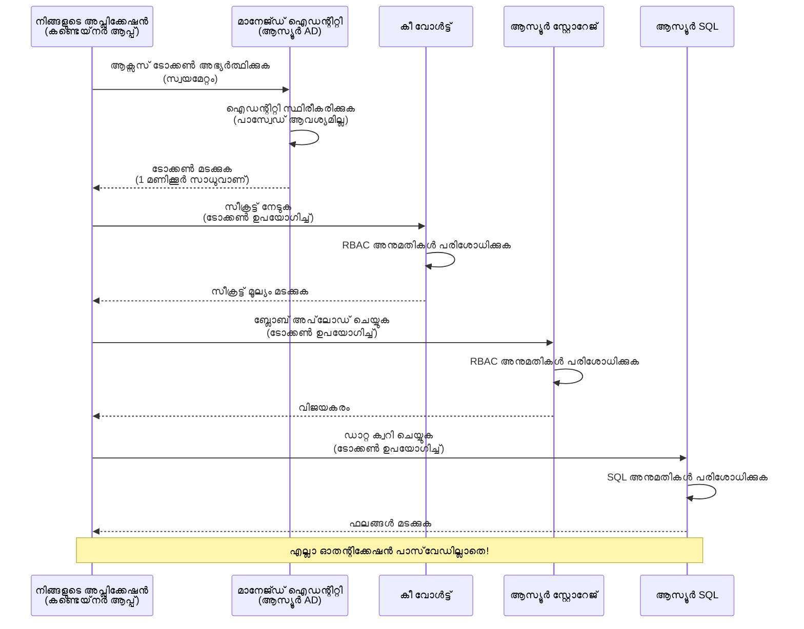
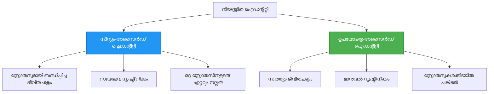

<!--
CO_OP_TRANSLATOR_METADATA:
{
  "original_hash": "e13ff6e1197e0a7462ed0aede7df9f23",
  "translation_date": "2025-11-25T00:21:49+00:00",
  "source_file": "docs/getting-started/authsecurity.md",
  "language_code": "ml"
}
-->
# Authentication Patterns and Managed Identity

⏱️ **അനുമാനിച്ച സമയം**: 45-60 മിനിറ്റ് | 💰 **ചെലവ്**: സൗജന്യം (അധിക ചെലവുകൾ ഇല്ല) | ⭐ **സങ്കീർണ്ണത**: മധ്യനില

**📚 പഠന പാത:**
- ← മുൻപ്: [Configuration Management](configuration.md) - പരിസ്ഥിതി ചോദ്യങ്ങൾ, രഹസ്യങ്ങൾ എന്നിവ കൈകാര്യം ചെയ്യുക
- 🎯 **നിങ്ങൾ ഇവിടെ**: Authentication & Security (Managed Identity, Key Vault, സുരക്ഷാ മാതൃകകൾ)
- → അടുത്തത്: [First Project](first-project.md) - നിങ്ങളുടെ ആദ്യ AZD ആപ്ലിക്കേഷൻ നിർമ്മിക്കുക
- 🏠 [കോഴ്‌സ് ഹോം](../../README.md)

---

## നിങ്ങൾ പഠിക്കുന്നതെന്താണ്

ഈ പാഠം പൂർത്തിയാക്കുന്നതിലൂടെ, നിങ്ങൾ:
- Azure authentication മാതൃകകൾ (കീകൾ, കണക്ഷൻ സ്ട്രിംഗുകൾ, managed identity) മനസ്സിലാക്കുക
- **Managed Identity** ഉപയോഗിച്ച് പാസ്വേഡില്ലാത്ത authentication നടപ്പിലാക്കുക
- **Azure Key Vault** ഇന്റഗ്രേഷൻ ഉപയോഗിച്ച് രഹസ്യങ്ങൾ സുരക്ഷിതമാക്കുക
- AZD ഡിപ്ലോയ്‌മെന്റുകൾക്കായി **role-based access control (RBAC)** കോൺഫിഗർ ചെയ്യുക
- Container Apps, Azure സേവനങ്ങളിൽ സുരക്ഷാ മികച്ച രീതികൾ പ്രയോഗിക്കുക
- കീ അടിസ്ഥാനമാക്കിയ authentication-ൽ നിന്ന് identity അടിസ്ഥാനമാക്കിയ authentication-ലേക്ക് മാറുക

## Managed Identity എന്തുകൊണ്ട് പ്രധാനമാണ്

### പ്രശ്നം: പരമ്പരാഗത authentication

**Managed Identity-ക്ക് മുമ്പ്:**
```javascript
// ❌ സുരക്ഷാ അപകടം: കോഡിൽ ഹാർഡ്‌കോഡ് ചെയ്ത രഹസ്യങ്ങൾ
const connectionString = "Server=mydb.database.windows.net;User=admin;Password=P@ssw0rd123";
const storageKey = "xK7mN9pQ2wR5tY8uI0oP3aS6dF1gH4jK...";
const cosmosKey = "C2x7B9n4M1p8Q5w3E6r0T2y5U8i1O4p7...";
```

**പ്രശ്നങ്ങൾ:**
- 🔴 **കോഡിൽ, കോൺഫിഗറേഷൻ ഫയലുകളിൽ, പരിസ്ഥിതി ചോദ്യങ്ങളിൽ രഹസ്യങ്ങൾ** വെളിപ്പെടുത്തുന്നു
- 🔴 **ക്രെഡൻഷ്യൽ റൊട്ടേഷൻ** കോഡ് മാറ്റങ്ങളും പുനർഡിപ്ലോയ്‌മെന്റും ആവശ്യമാണ്
- 🔴 **ഓഡിറ്റ് പ്രശ്നങ്ങൾ** - ആരാണ് എന്ത്, എപ്പോൾ ആക്സസ് ചെയ്തത്?
- 🔴 **വ്യാപ്തം** - രഹസ്യങ്ങൾ പല സിസ്റ്റങ്ങളിലായി ചിതറുന്നു
- 🔴 **അനുസരണ പ്രശ്നങ്ങൾ** - സുരക്ഷാ ഓഡിറ്റുകൾ പരാജയപ്പെടുന്നു

### പരിഹാരം: Managed Identity

**Managed Identity-ന്റെ ശേഷം:**
```javascript
// ✅ സുരക്ഷിതം: കോഡിൽ രഹസ്യങ്ങൾ ഇല്ല
const credential = new DefaultAzureCredential();
const client = new BlobServiceClient(
  "https://mystorageaccount.blob.core.windows.net",
  credential  // അസ്യൂർ സ്വയം പ്രാമാണീകരണം കൈകാര്യം ചെയ്യുന്നു
);
```

**ലാഭങ്ങൾ:**
- ✅ **കോഡിൽ അല്ലെങ്കിൽ കോൺഫിഗറേഷനിൽ രഹസ്യങ്ങൾ ഇല്ല**
- ✅ **സ്വയമേവ റൊട്ടേഷൻ** - Azure കൈകാര്യം ചെയ്യുന്നു
- ✅ **പൂർണ്ണ ഓഡിറ്റ് ട്രെയിൽ** Azure AD ലോഗുകളിൽ
- ✅ **കേന്ദ്രസാധിതമായ സുരക്ഷ** - Azure Portal-ൽ കൈകാര്യം ചെയ്യുക
- ✅ **അനുസരണ സജ്ജം** - സുരക്ഷാ മാനദണ്ഡങ്ങൾ പാലിക്കുന്നു

**ഉദാഹരണം**: പരമ്പരാഗത authentication പല വാതിലുകൾക്കായി പല താക്കോലുകൾ വഹിക്കുന്നതുപോലെയാണ്. Managed Identity നിങ്ങൾ ആരാണെന്ന് അടിസ്ഥാനമാക്കി സ്വയം ആക്സസ് നൽകുന്ന സുരക്ഷാ ബാഡ്ജ് പോലെയാണ്—താക്കോലുകൾ നഷ്ടപ്പെടാൻ, പകർപ്പെടുക്കാൻ, അല്ലെങ്കിൽ റൊട്ടേറ്റ് ചെയ്യാൻ ആവശ്യമില്ല.

---

## ആർക്കിടെക്ചർ അവലോകനം

### Managed Identity ഉപയോഗിച്ച് Authentication Flow


### Managed Identities-ന്റെ തരം


| സവിശേഷത | System-Assigned | User-Assigned |
|---------|----------------|---------------|
| **ജീവിതചക്രം** | റിസോഴ്‌സുമായി ബന്ധിപ്പിച്ചിരിക്കുന്നു | സ്വതന്ത്രം |
| **സൃഷ്ടി** | റിസോഴ്‌സുമായി സ്വയമേവ | കൈമാറി സൃഷ്ടിക്കുക |
| **നശീകരണം** | റിസോഴ്‌സ് നശിപ്പിക്കുമ്പോൾ | റിസോഴ്‌സ് നശീകരണത്തിന് ശേഷം നിലനിൽക്കുന്നു |
| **പങ്കിടൽ** | ഒരു റിസോഴ്‌സ് മാത്രം | പല റിസോഴ്‌സുകൾ |
| **ഉപയോഗ കേസ്** | ലളിതമായ സാഹചര്യങ്ങൾ | സങ്കീർണ്ണമായ മൾട്ടി-റിസോഴ്‌സ് സാഹചര്യങ്ങൾ |
| **AZD ഡിഫോൾട്ട്** | ✅ ശുപാർശ ചെയ്യുന്നു | ഓപ്ഷണൽ |

---

## മുൻ‌വ്യവസ്ഥകൾ

### ആവശ്യമായ ഉപകരണങ്ങൾ

മുൻ പാഠങ്ങളിൽ നിന്ന് നിങ്ങൾക്ക് ഇതിനകം ഇവ ഇൻസ്റ്റാൾ ചെയ്തിരിക്കണം:

```bash
# Azure Developer CLI പരിശോധിക്കുക
azd version
# ✅ പ്രതീക്ഷിച്ചത്: azd പതിപ്പ് 1.0.0 അല്ലെങ്കിൽ അതിനുമുകളിൽ

# Azure CLI പരിശോധിക്കുക
az --version
# ✅ പ്രതീക്ഷിച്ചത്: azure-cli 2.50.0 അല്ലെങ്കിൽ അതിനുമുകളിൽ
```

### Azure ആവശ്യങ്ങൾ

- സജീവ Azure സബ്‌സ്‌ക്രിപ്ഷൻ
- അനുമതികൾ:
  - Managed Identities സൃഷ്ടിക്കുക
  - RBAC റോളുകൾ നിയോഗിക്കുക
  - Key Vault റിസോഴ്‌സുകൾ സൃഷ്ടിക്കുക
  - Container Apps ഡിപ്ലോയ് ചെയ്യുക

### അറിവിന്റെ മുൻ‌വ്യവസ്ഥകൾ

നിങ്ങൾ പൂർത്തിയാക്കിയിരിക്കണം:
- [Installation Guide](installation.md) - AZD സജ്ജീകരണം
- [AZD Basics](azd-basics.md) - മൗലിക ആശയങ്ങൾ
- [Configuration Management](configuration.md) - പരിസ്ഥിതി ചോദ്യങ്ങൾ

---

## പാഠം 1: Authentication മാതൃകകൾ മനസ്സിലാക്കുക

### മാതൃക 1: Connection Strings (പഴയത് - ഒഴിവാക്കുക)

**ഇത് എങ്ങനെ പ്രവർത്തിക്കുന്നു:**
```bash
# കണക്ഷൻ സ്ട്രിംഗ് ക്രെഡൻഷ്യലുകൾ ഉൾക്കൊള്ളുന്നു
STORAGE_CONNECTION_STRING="DefaultEndpointsProtocol=https;AccountName=myaccount;AccountKey=xK7mN9pQ2wR5..."
COSMOS_CONNECTION_STRING="AccountEndpoint=https://myaccount.documents.azure.com:443/;AccountKey=C2x7..."
SQL_CONNECTION_STRING="Server=myserver.database.windows.net;User=admin;Password=P@ssw0rd..."
```

**പ്രശ്നങ്ങൾ:**
- ❌ പരിസ്ഥിതി ചോദ്യങ്ങളിൽ രഹസ്യങ്ങൾ ദൃശ്യമാണ്
- ❌ ഡിപ്ലോയ്‌മെന്റ് സിസ്റ്റങ്ങളിൽ ലോഗ് ചെയ്യുന്നു
- ❌ റൊട്ടേറ്റ് ചെയ്യാൻ പ്രയാസമാണ്
- ❌ ആക്സസിന്റെ ഓഡിറ്റ് ട്രെയിൽ ഇല്ല

**എപ്പോൾ ഉപയോഗിക്കണം:** പ്രൊഡക്ഷനിൽ ഒരിക്കലും, പ്രാദേശിക വികസനത്തിനായി മാത്രം.

---

### മാതൃക 2: Key Vault References (മികച്ചത്)

**ഇത് എങ്ങനെ പ്രവർത്തിക്കുന്നു:**
```bicep
// Store secret in Key Vault
resource keyVault 'Microsoft.KeyVault/vaults@2023-02-01' = {
  name: 'mykv'
  properties: {
    enableRbacAuthorization: true
  }
}

// Reference in Container App
env: [
  {
    name: 'STORAGE_KEY'
    secretRef: 'storage-key'  // References Key Vault
  }
]
```

**ലാഭങ്ങൾ:**
- ✅ Key Vault-ൽ രഹസ്യങ്ങൾ സുരക്ഷിതമായി സൂക്ഷിക്കുന്നു
- ✅ കേന്ദ്രസാധിതമായ രഹസ്യ മാനേജ്മെന്റ്
- ✅ കോഡ് മാറ്റങ്ങൾ ഇല്ലാതെ റൊട്ടേഷൻ

**പരിമിതികൾ:**
- ⚠️ ഇപ്പോഴും കീകൾ/പാസ്വേഡുകൾ ഉപയോഗിക്കുന്നു
- ⚠️ Key Vault ആക്സസ് കൈകാര്യം ചെയ്യേണ്ടതുണ്ട്

**എപ്പോൾ ഉപയോഗിക്കണം:** Connection Strings-ൽ നിന്ന് Managed Identity-ലേക്ക് മാറാനുള്ള ഇടക്കാല ഘട്ടം.

---

### മാതൃക 3: Managed Identity (മികച്ച രീതികൾ)

**ഇത് എങ്ങനെ പ്രവർത്തിക്കുന്നു:**
```bicep
// Enable managed identity
resource containerApp 'Microsoft.App/containerApps@2023-05-01' = {
  name: 'myapp'
  identity: {
    type: 'SystemAssigned'  // Automatically creates identity
  }
}

// Grant permissions
resource roleAssignment 'Microsoft.Authorization/roleAssignments@2022-04-01' = {
  scope: storageAccount
  properties: {
    roleDefinitionId: storageBlobDataContributorRole
    principalId: containerApp.identity.principalId
  }
}
```

**ആപ്ലിക്കേഷൻ കോഡ്:**
```javascript
// രഹസ്യങ്ങൾ ആവശ്യമില്ല!
const { DefaultAzureCredential } = require('@azure/identity');
const { BlobServiceClient } = require('@azure/storage-blob');

const credential = new DefaultAzureCredential();
const blobServiceClient = new BlobServiceClient(
  'https://mystorageaccount.blob.core.windows.net',
  credential
);
```

**ലാഭങ്ങൾ:**
- ✅ കോഡിൽ/കോൺഫിഗറേഷനിൽ രഹസ്യങ്ങൾ ഇല്ല
- ✅ സ്വയമേവ ക്രെഡൻഷ്യൽ റൊട്ടേഷൻ
- ✅ പൂർണ്ണ ഓഡിറ്റ് ട്രെയിൽ
- ✅ RBAC അടിസ്ഥാനമാക്കിയ അനുമതികൾ
- ✅ അനുസരണ സജ്ജം

**എപ്പോൾ ഉപയോഗിക്കണം:** എപ്പോഴും, പ്രൊഡക്ഷൻ ആപ്ലിക്കേഷനുകൾക്കായി.

---

## പാഠം 2: AZD ഉപയോഗിച്ച് Managed Identity നടപ്പിലാക്കുക

### ഘട്ടം-ഘട്ടം നടപ്പിലാക്കൽ

Azure Storage, Key Vault എന്നിവ ആക്സസ് ചെയ്യാൻ Managed Identity ഉപയോഗിക്കുന്ന ഒരു സുരക്ഷിതമായ Container App നിർമ്മിക്കാം.

### പ്രോജക്റ്റ് ഘടന

```
secure-app/
├── azure.yaml                 # AZD configuration
├── infra/
│   ├── main.bicep            # Main infrastructure
│   ├── core/
│   │   ├── identity.bicep    # Managed identity setup
│   │   ├── keyvault.bicep    # Key Vault configuration
│   │   └── storage.bicep     # Storage with RBAC
│   └── app/
│       └── container-app.bicep
└── src/
    ├── app.js                # Application code
    ├── package.json
    └── Dockerfile
```

### 1. AZD കോൺഫിഗർ ചെയ്യുക (azure.yaml)

```yaml
name: secure-app
metadata:
  template: secure-app@1.0.0

services:
  api:
    project: ./src
    language: js
    host: containerapp

# Enable managed identity (AZD handles this automatically)
```

### 2. Infrastructure: Managed Identity സജ്ജമാക്കുക

**ഫയൽ: `infra/main.bicep`**

```bicep
targetScope = 'subscription'

param environmentName string
param location string = 'eastus'

var tags = { 'azd-env-name': environmentName }

// Resource group
resource rg 'Microsoft.Resources/resourceGroups@2021-04-01' = {
  name: 'rg-${environmentName}'
  location: location
  tags: tags
}

// Storage Account
module storage './core/storage.bicep' = {
  name: 'storage'
  scope: rg
  params: {
    name: 'st${uniqueString(rg.id)}'
    location: location
    tags: tags
  }
}

// Key Vault
module keyVault './core/keyvault.bicep' = {
  name: 'keyvault'
  scope: rg
  params: {
    name: 'kv-${uniqueString(rg.id)}'
    location: location
    tags: tags
  }
}

// Container App with Managed Identity
module containerApp './app/container-app.bicep' = {
  name: 'container-app'
  scope: rg
  params: {
    name: 'ca-${environmentName}'
    location: location
    tags: tags
    storageAccountName: storage.outputs.name
    keyVaultName: keyVault.outputs.name
  }
}

// Grant Container App access to Storage
module storageRoleAssignment './core/role-assignment.bicep' = {
  name: 'storage-role'
  scope: rg
  params: {
    principalId: containerApp.outputs.identityPrincipalId
    roleDefinitionId: 'ba92f5b4-2d11-453d-a403-e96b0029c9fe'  // Storage Blob Data Contributor
    targetResourceId: storage.outputs.id
  }
}

// Grant Container App access to Key Vault
module kvRoleAssignment './core/role-assignment.bicep' = {
  name: 'kv-role'
  scope: rg
  params: {
    principalId: containerApp.outputs.identityPrincipalId
    roleDefinitionId: '4633458b-17de-408a-b874-0445c86b69e6'  // Key Vault Secrets User
    targetResourceId: keyVault.outputs.id
  }
}

// Outputs
output AZURE_STORAGE_ACCOUNT_NAME string = storage.outputs.name
output AZURE_KEY_VAULT_NAME string = keyVault.outputs.name
output APP_URL string = containerApp.outputs.url
```

### 3. System-Assigned Identity ഉള്ള Container App

**ഫയൽ: `infra/app/container-app.bicep`**

```bicep
param name string
param location string
param tags object = {}
param storageAccountName string
param keyVaultName string

resource containerApp 'Microsoft.App/containerApps@2023-05-01' = {
  name: name
  location: location
  tags: tags
  identity: {
    type: 'SystemAssigned'  // 🔑 Enable managed identity
  }
  properties: {
    configuration: {
      ingress: {
        external: true
        targetPort: 3000
      }
    }
    template: {
      containers: [
        {
          name: 'api'
          image: 'myregistry.azurecr.io/api:latest'
          resources: {
            cpu: json('0.5')
            memory: '1Gi'
          }
          env: [
            {
              name: 'AZURE_STORAGE_ACCOUNT_NAME'
              value: storageAccountName
            }
            {
              name: 'AZURE_KEY_VAULT_NAME'
              value: keyVaultName
            }
            // 🔑 No secrets - managed identity handles authentication!
          ]
        }
      ]
    }
  }
}

// Output the identity for RBAC assignments
output identityPrincipalId string = containerApp.identity.principalId
output id string = containerApp.id
output url string = 'https://${containerApp.properties.configuration.ingress.fqdn}'
```

### 4. RBAC Role Assignment Module

**ഫയൽ: `infra/core/role-assignment.bicep`**

```bicep
param principalId string
param roleDefinitionId string  // Azure built-in role ID
param targetResourceId string

resource roleAssignment 'Microsoft.Authorization/roleAssignments@2022-04-01' = {
  name: guid(principalId, roleDefinitionId, targetResourceId)
  scope: resourceId('Microsoft.Resources/resourceGroups', resourceGroup().name)
  properties: {
    roleDefinitionId: subscriptionResourceId('Microsoft.Authorization/roleDefinitions', roleDefinitionId)
    principalId: principalId
    principalType: 'ServicePrincipal'
  }
}

output id string = roleAssignment.id
```

### 5. Managed Identity ഉള്ള ആപ്ലിക്കേഷൻ കോഡ്

**ഫയൽ: `src/app.js`**

```javascript
const express = require('express');
const { DefaultAzureCredential } = require('@azure/identity');
const { BlobServiceClient } = require('@azure/storage-blob');
const { SecretClient } = require('@azure/keyvault-secrets');

const app = express();
const PORT = process.env.PORT || 3000;

// 🔑 ക്രെഡൻഷ്യൽ ആരംഭിക്കുക (മാനേജുചെയ്യുന്ന ഐഡന്റിറ്റിയുമായി സ്വയം പ്രവർത്തിക്കുന്നു)
const credential = new DefaultAzureCredential();

// Azure സ്റ്റോറേജ് സജ്ജീകരണം
const storageAccountName = process.env.AZURE_STORAGE_ACCOUNT_NAME;
const blobServiceClient = new BlobServiceClient(
  `https://${storageAccountName}.blob.core.windows.net`,
  credential  // കീകൾ ആവശ്യമില്ല!
);

// കീ വോൾട്ട് സജ്ജീകരണം
const keyVaultName = process.env.AZURE_KEY_VAULT_NAME;
const secretClient = new SecretClient(
  `https://${keyVaultName}.vault.azure.net`,
  credential  // കീകൾ ആവശ്യമില്ല!
);

// ആരോഗ്യ പരിശോധന
app.get('/health', (req, res) => {
  res.json({ status: 'healthy', authentication: 'managed-identity' });
});

// ഫയൽ ബ്ലോബ് സ്റ്റോറേജിലേക്ക് അപ്ലോഡ് ചെയ്യുക
app.post('/upload', async (req, res) => {
  try {
    const containerClient = blobServiceClient.getContainerClient('uploads');
    await containerClient.createIfNotExists();
    
    const blobName = `file-${Date.now()}.txt`;
    const blockBlobClient = containerClient.getBlockBlobClient(blobName);
    
    await blockBlobClient.upload('Hello from managed identity!', 30);
    
    res.json({
      success: true,
      blobName: blobName,
      message: 'File uploaded using managed identity!'
    });
  } catch (error) {
    console.error('Upload error:', error);
    res.status(500).json({ error: error.message });
  }
});

// കീ വോൾട്ടിൽ നിന്ന് രഹസ്യം നേടുക
app.get('/secret/:name', async (req, res) => {
  try {
    const secretName = req.params.name;
    const secret = await secretClient.getSecret(secretName);
    
    res.json({
      name: secretName,
      value: secret.value,
      message: 'Secret retrieved using managed identity!'
    });
  } catch (error) {
    console.error('Secret error:', error);
    res.status(500).json({ error: error.message });
  }
});

// ബ്ലോബ് കണ്ടെയ്നറുകൾ ലിസ്റ്റ് ചെയ്യുക (വായനാ ആക്സസ് കാണിക്കുന്നു)
app.get('/containers', async (req, res) => {
  try {
    const containers = [];
    for await (const container of blobServiceClient.listContainers()) {
      containers.push(container.name);
    }
    
    res.json({
      containers: containers,
      count: containers.length,
      message: 'Containers listed using managed identity!'
    });
  } catch (error) {
    console.error('List error:', error);
    res.status(500).json({ error: error.message });
  }
});

app.listen(PORT, () => {
  console.log(`Secure API listening on port ${PORT}`);
  console.log('Authentication: Managed Identity (passwordless)');
});
```

**ഫയൽ: `src/package.json`**

```json
{
  "name": "secure-app",
  "version": "1.0.0",
  "dependencies": {
    "express": "^4.18.2",
    "@azure/identity": "^4.0.0",
    "@azure/storage-blob": "^12.17.0",
    "@azure/keyvault-secrets": "^4.7.0"
  },
  "scripts": {
    "start": "node app.js"
  }
}
```

### 6. ഡിപ്ലോയ് ചെയ്യുക, ടെസ്റ്റ് ചെയ്യുക

```bash
# AZD പരിസ്ഥിതി ആരംഭിക്കുക
azd init

# ഇൻഫ്രാസ്ട്രക്ചറും ആപ്ലിക്കേഷനും വിന്യസിക്കുക
azd up

# ആപ്പ് URL നേടുക
APP_URL=$(azd env get-values | grep APP_URL | cut -d '=' -f2 | tr -d '"')

# ഹെൽത്ത് ചെക്ക് പരീക്ഷിക്കുക
curl $APP_URL/health
```

**✅ പ്രതീക്ഷിക്കുന്ന ഔട്ട്പുട്ട്:**
```json
{
  "status": "healthy",
  "authentication": "managed-identity"
}
```

**Blob അപ്ലോഡ് ടെസ്റ്റ് ചെയ്യുക:**
```bash
curl -X POST $APP_URL/upload
```

**✅ പ്രതീക്ഷിക്കുന്ന ഔട്ട്പുട്ട്:**
```json
{
  "success": true,
  "blobName": "file-1700404800000.txt",
  "message": "File uploaded using managed identity!"
}
```

**Container ലിസ്റ്റിംഗ് ടെസ്റ്റ് ചെയ്യുക:**
```bash
curl $APP_URL/containers
```

**✅ പ്രതീക്ഷിക്കുന്ന ഔട്ട്പുട്ട്:**
```json
{
  "containers": ["uploads"],
  "count": 1,
  "message": "Containers listed using managed identity!"
}
```

---

## സാധാരണ Azure RBAC Roles

### Managed Identity-ക്കുള്ള Built-in Role IDs

| സേവനം | Role Name | Role ID | Permissions |
|---------|-----------|---------|-------------|
| **Storage** | Storage Blob Data Reader | `2a2b9908-6b94-4a3d-8e5a-a7d8f8cc8a12` | Blobs, Containers വായിക്കുക |
| **Storage** | Storage Blob Data Contributor | `ba92f5b4-2d11-453d-a403-e96b0029c9fe` | Blobs വായിക്കുക, എഴുതുക, ഇല്ലാതാക്കുക |
| **Storage** | Storage Queue Data Contributor | `974c5e8b-45b9-4653-ba55-5f855dd0fb88` | ക്യൂ മെസേജുകൾ വായിക്കുക, എഴുതുക, ഇല്ലാതാക്കുക |
| **Key Vault** | Key Vault Secrets User | `4633458b-17de-408a-b874-0445c86b69e6` | രഹസ്യങ്ങൾ വായിക്കുക |
| **Key Vault** | Key Vault Secrets Officer | `b86a8fe4-44ce-4948-aee5-eccb2c155cd7` | രഹസ്യങ്ങൾ വായിക്കുക, എഴുതുക, ഇല്ലാതാക്കുക |
| **Cosmos DB** | Cosmos DB Built-in Data Reader | `00000000-0000-0000-0000-000000000001` | Cosmos DB ഡാറ്റ വായിക്കുക |
| **Cosmos DB** | Cosmos DB Built-in Data Contributor | `00000000-0000-0000-0000-000000000002` | Cosmos DB ഡാറ്റ വായിക്കുക, എഴുതുക |
| **SQL Database** | SQL DB Contributor | `9b7fa17d-e63e-47b0-bb0a-15c516ac86ec` | SQL ഡാറ്റാബേസുകൾ കൈകാര്യം ചെയ്യുക |
| **Service Bus** | Azure Service Bus Data Owner | `090c5cfd-751d-490a-894a-3ce6f1109419` | സന്ദേശങ്ങൾ അയയ്ക്കുക, സ്വീകരിക്കുക, കൈകാര്യം ചെയ്യുക |

### Role IDs എങ്ങനെ കണ്ടെത്താം

```bash
# എല്ലാ ബിൽറ്റ്-ഇൻ റോളുകളും പട്ടികയിടുക
az role definition list --query "[].{Name:roleName, ID:name}" --output table

# പ്രത്യേക റോളിനായി തിരയുക
az role definition list --query "[?contains(roleName, 'Storage Blob')].{Name:roleName, ID:name}" --output table

# റോളിന്റെ വിശദാംശങ്ങൾ നേടുക
az role definition list --name "Storage Blob Data Contributor"
```

---

## പ്രായോഗിക വ്യായാമങ്ങൾ

### വ്യായാമം 1: നിലവിലുള്ള ആപ്പിനായി Managed Identity സജ്ജമാക്കുക ⭐⭐ (മധ്യനില)

**ലക്ഷ്യം**: നിലവിലുള്ള Container App ഡിപ്ലോയ്‌മെന്റിൽ Managed Identity ചേർക്കുക

**സാന്ദർഭം**: Connection Strings ഉപയോഗിക്കുന്ന ഒരു Container App ഉണ്ട്. Managed Identity-ലേക്ക് മാറ്റുക.

**ആരംഭക പോയിന്റ്**: ഈ കോൺഫിഗറേഷനുള്ള Container App:

```bicep
// ❌ Current: Using connection string
env: [
  {
    name: 'STORAGE_CONNECTION_STRING'
    secretRef: 'storage-connection'
  }
]
```

**ഘട്ടങ്ങൾ**:

1. **Bicep-ൽ Managed Identity സജ്ജമാക്കുക:**

```bicep
resource containerApp 'Microsoft.App/containerApps@2023-05-01' = {
  name: 'myapp'
  identity: {
    type: 'SystemAssigned'  // Add this
  }
  // ... rest of configuration
}
```

2. **Storage ആക്സസ് നൽകുക:**

```bicep
// Get storage account reference
resource storageAccount 'Microsoft.Storage/storageAccounts@2023-01-01' existing = {
  name: storageAccountName
}

// Assign role
resource roleAssignment 'Microsoft.Authorization/roleAssignments@2022-04-01' = {
  name: guid(containerApp.id, 'ba92f5b4-2d11-453d-a403-e96b0029c9fe', storageAccount.id)
  scope: storageAccount
  properties: {
    roleDefinitionId: subscriptionResourceId('Microsoft.Authorization/roleDefinitions', 'ba92f5b4-2d11-453d-a403-e96b0029c9fe')
    principalId: containerApp.identity.principalId
    principalType: 'ServicePrincipal'
  }
}
```

3. **ആപ്ലിക്കേഷൻ കോഡ് അപ്ഡേറ്റ് ചെയ്യുക:**

**മുൻപ് (connection string):**
```javascript
const { BlobServiceClient } = require('@azure/storage-blob');

const blobServiceClient = BlobServiceClient.fromConnectionString(
  process.env.STORAGE_CONNECTION_STRING
);
```

**ശേഷം (managed identity):**
```javascript
const { DefaultAzureCredential } = require('@azure/identity');
const { BlobServiceClient } = require('@azure/storage-blob');

const credential = new DefaultAzureCredential();
const blobServiceClient = new BlobServiceClient(
  `https://${process.env.STORAGE_ACCOUNT_NAME}.blob.core.windows.net`,
  credential
);
```

4. **പരിസ്ഥിതി ചോദ്യങ്ങൾ അപ്ഡേറ്റ് ചെയ്യുക:**

```bicep
env: [
  {
    name: 'STORAGE_ACCOUNT_NAME'
    value: storageAccountName  // Just the name, no secrets!
  }
  // Remove STORAGE_CONNECTION_STRING
]
```

5. **ഡിപ്ലോയ് ചെയ്യുക, ടെസ്റ്റ് ചെയ്യുക:**

```bash
# വീണ്ടും വിന്യസിക്കുക
azd up

# ഇത് ഇപ്പോഴും പ്രവർത്തിക്കുന്നുണ്ടോ എന്ന് പരീക്ഷിക്കുക
curl https://myapp.azurecontainerapps.io/upload
```

**✅ വിജയത്തിന്റെ മാനദണ്ഡങ്ങൾ:**
- ✅ ആപ്ലിക്കേഷൻ പിഴവുകൾ ഇല്ലാതെ ഡിപ്ലോയ് ചെയ്യുന്നു
- ✅ Storage പ്രവർത്തനങ്ങൾ (അപ്ലോഡ്, ലിസ്റ്റ്, ഡൗൺലോഡ്) പ്രവർത്തിക്കുന്നു
- ✅ പരിസ്ഥിതി ചോദ്യങ്ങളിൽ Connection Strings ഇല്ല
- ✅ Azure Portal-ൽ "Identity" blade-ൽ identity ദൃശ്യമാണ്

**സ്ഥിരീകരണം:**

```bash
# മാനേജുചെയ്യുന്ന ഐഡന്റിറ്റി സജീവമാക്കിയിട്ടുണ്ടോ എന്ന് പരിശോധിക്കുക
az containerapp show \
  --name myapp \
  --resource-group rg-myapp \
  --query "identity.type"
# ✅ പ്രതീക്ഷിച്ചത്: "SystemAssigned"

# റോളിന്റെ അസൈൻമെന്റ് പരിശോധിക്കുക
az role assignment list \
  --assignee $(az containerapp show --name myapp --resource-group rg-myapp --query "identity.principalId" -o tsv) \
  --scope /subscriptions/{sub-id}/resourceGroups/rg-myapp/providers/Microsoft.Storage/storageAccounts/mystorageaccount
# ✅ പ്രതീക്ഷിച്ചത്: "Storage Blob Data Contributor" റോൾ കാണിക്കുന്നു
```

**സമയം**: 20-30 മിനിറ്റ്

---

### വ്യായാമം 2: User-Assigned Identity ഉപയോഗിച്ച് മൾട്ടി-സേവീസ് ആക്സസ് ⭐⭐⭐ (അഡ്വാൻസ്ഡ്)

**ലക്ഷ്യം**: പല Container Apps-ൽ പങ്കിടുന്ന User-Assigned Identity സൃഷ്ടിക്കുക

**സാന്ദർഭം**: 3 മൈക്രോസർവീസുകൾ ഉണ്ട്, ഇവയ്ക്ക് ഒരേ Storage അക്കൗണ്ട്, Key Vault എന്നിവ ആക്സസ് ചെയ്യേണ്ടതുണ്ട്.

**ഘട്ടങ്ങൾ**:

1. **User-Assigned Identity സൃഷ്ടിക്കുക:**

**ഫയൽ: `infra/core/identity.bicep`**

```bicep
param name string
param location string
param tags object = {}

resource userAssignedIdentity 'Microsoft.ManagedIdentity/userAssignedIdentities@2023-01-31' = {
  name: name
  location: location
  tags: tags
}

output id string = userAssignedIdentity.id
output principalId string = userAssignedIdentity.properties.principalId
output clientId string = userAssignedIdentity.properties.clientId
```

2. **User-Assigned Identity-ക്ക് റോളുകൾ നിയോഗിക്കുക:**

```bicep
// In main.bicep
module userIdentity './core/identity.bicep' = {
  name: 'user-identity'
  scope: rg
  params: {
    name: 'id-${environmentName}'
    location: location
    tags: tags
  }
}

// Grant Storage access
resource storageRoleAssignment 'Microsoft.Authorization/roleAssignments@2022-04-01' = {
  name: guid(userIdentity.outputs.principalId, 'storage-contributor')
  scope: storageAccount
  properties: {
    roleDefinitionId: subscriptionResourceId('Microsoft.Authorization/roleDefinitions', 'ba92f5b4-2d11-453d-a403-e96b0029c9fe')
    principalId: userIdentity.outputs.principalId
    principalType: 'ServicePrincipal'
  }
}

// Grant Key Vault access
resource kvRoleAssignment 'Microsoft.Authorization/roleAssignments@2022-04-01' = {
  name: guid(userIdentity.outputs.principalId, 'kv-secrets-user')
  scope: keyVault
  properties: {
    roleDefinitionId: subscriptionResourceId('Microsoft.Authorization/roleDefinitions', '4633458b-17de-408a-b874-0445c86b69e6')
    principalId: userIdentity.outputs.principalId
    principalType: 'ServicePrincipal'
  }
}
```

3. **പല Container Apps-ൽ Identity നിയോഗിക്കുക:**

```bicep
resource apiGateway 'Microsoft.App/containerApps@2023-05-01' = {
  name: 'api-gateway'
  identity: {
    type: 'UserAssigned'
    userAssignedIdentities: {
      '${userIdentity.outputs.id}': {}
    }
  }
  // ... rest of config
}

resource productService 'Microsoft.App/containerApps@2023-05-01' = {
  name: 'product-service'
  identity: {
    type: 'UserAssigned'
    userAssignedIdentities: {
      '${userIdentity.outputs.id}': {}
    }
  }
  // ... rest of config
}

resource orderService 'Microsoft.App/containerApps@2023-05-01' = {
  name: 'order-service'
  identity: {
    type: 'UserAssigned'
    userAssignedIdentities: {
      '${userIdentity.outputs.id}': {}
    }
  }
  // ... rest of config
}
```

4. **ആപ്ലിക്കേഷൻ കോഡ് (എല്ലാ സേവനങ്ങളും ഒരേ മാതൃക ഉപയോഗിക്കുന്നു):**

```javascript
const { DefaultAzureCredential, ManagedIdentityCredential } = require('@azure/identity');

// ഉപയോക്താവിന്റെ നിയുക്ത ഐഡന്റിറ്റിക്ക്, ക്ലയന്റ് ഐഡി വ്യക്തമാക്കുക
const credential = new ManagedIdentityCredential(
  process.env.AZURE_CLIENT_ID  // ഉപയോക്താവിന്റെ നിയുക്ത ഐഡന്റിറ്റി ക്ലയന്റ് ഐഡി
);

// അല്ലെങ്കിൽ DefaultAzureCredential ഉപയോഗിക്കുക (സ്വയം കണ്ടെത്തുന്നു)
const credential = new DefaultAzureCredential();

const blobServiceClient = new BlobServiceClient(
  `https://${process.env.STORAGE_ACCOUNT_NAME}.blob.core.windows.net`,
  credential
);
```

5. **ഡിപ്ലോയ് ചെയ്യുക, സ്ഥിരീകരിക്കുക:**

```bash
azd up

# എല്ലാ സേവനങ്ങളും സംഭരണത്തെ ആക്സസ് ചെയ്യാൻ കഴിയുന്നുണ്ടോ എന്ന് പരിശോധിക്കുക
curl https://api-gateway.azurecontainerapps.io/upload
curl https://product-service.azurecontainerapps.io/upload
curl https://order-service.azurecontainerapps.io/upload
```

**✅ വിജയത്തിന്റെ മാനദണ്ഡങ്ങൾ:**
- ✅ 3 സേവനങ്ങൾക്കിടയിൽ ഒരു identity പങ്കിടുന്നു
- ✅ എല്ലാ സേവനങ്ങളും Storage, Key Vault എന്നിവ ആക്സസ് ചെയ്യുന്നു
- ✅ ഒരു സേവനം നീക്കം ചെയ്താൽ identity നിലനിൽക്കുന്നു
- ✅ Permissions കേന്ദ്രസാധിതമായി കൈകാര്യം ചെയ്യുന്നു

**User-Assigned Identity-ന്റെ ലാഭങ്ങൾ:**
- കൈകാര്യം ചെയ്യാൻ ഒരു identity മാത്രം
- സേവനങ്ങൾക്കിടയിൽ സ്ഥിരമായ permissions
- സേവനം നീക്കം ചെയ്താലും നിലനിൽക്കുന്നു
- സങ്കീർണ്ണമായ ആർക്കിടെക്ചറുകൾക്കായി മികച്ചത്

**സമയം**: 30-40 മിനിറ്റ്

---

### വ്യായാമം 3: Key Vault Secret Rotation നടപ്പിലാക്കുക ⭐⭐⭐ (അഡ്വാൻസ്ഡ്)

**ലക്ഷ്യം**: Key Vault-ൽ മൂന്നാം കക്ഷി API കീകൾ സൂക്ഷിക്കുക, Managed Identity ഉപയോഗിച്ച് അവ ആക്സസ് ചെയ്യുക

**സാന്ദർഭം**: നിങ്ങളുടെ ആപ്ലിക്കേഷൻ OpenAI, Stripe, SendGrid പോലുള്ള API-കളെ വിളിക്കേണ്ടതുണ്ട്, API കീകൾ ആവശ്യമാണ്.

**ഘട്ടങ്ങൾ**:

1. **RBAC ഉപയോഗിച്ച് Key Vault സൃഷ്ടിക്കുക:**

**ഫയൽ: `infra/core/keyvault.bicep`**

```bicep
param name string
param location string
param tags object = {}

resource keyVault 'Microsoft.KeyVault/vaults@2023-02-01' = {
  name: name
  location: location
  tags: tags
  properties: {
    enableRbacAuthorization: true  // Use RBAC instead of access policies
    sku: {
      family: 'A'
      name: 'standard'
    }
    tenantId: subscription().tenantId
    enableSoftDelete: true
    softDeleteRetentionInDays: 90
  }
}

// Allow Container App to read secrets
output id string = keyVault.id
output name string = keyVault.name
output uri string = keyVault.properties.vaultUri
```

2. **Key Vault-ൽ രഹസ്യങ്ങൾ സൂക്ഷിക്കുക:**

```bash
# കീ വോൾട്ട് നാമം നേടുക
KV_NAME=$(azd env get-values | grep AZURE_KEY_VAULT_NAME | cut -d '=' -f2 | tr -d '"')

# മൂന്നാം കക്ഷി API കീകൾ സംഭരിക്കുക
az keyvault secret set \
  --vault-name $KV_NAME \
  --name "OpenAI-ApiKey" \
  --value "sk-proj-xxxxxxxxxxxxx"

az keyvault secret set \
  --vault-name $KV_NAME \
  --name "Stripe-ApiKey" \
  --value "sk_live_xxxxxxxxxxxxx"

az keyvault secret set \
  --vault-name $KV_NAME \
  --name "SendGrid-ApiKey" \
  --value "SG.xxxxxxxxxxxxx"
```

3. **രഹസ്യങ്ങൾ വീണ്ടെടുക്കാൻ ആപ്ലിക്കേഷൻ കോഡ്:**

**ഫയൽ: `src/config.js`**

```javascript
const { DefaultAzureCredential } = require('@azure/identity');
const { SecretClient } = require('@azure/keyvault-secrets');

class Config {
  constructor() {
    this.credential = new DefaultAzureCredential();
    this.secretClient = new SecretClient(
      `https://${process.env.AZURE_KEY_VAULT_NAME}.vault.azure.net`,
      this.credential
    );
    this.cache = {};
  }

  async getSecret(secretName) {
    // ആദ്യം കാഷെ പരിശോധിക്കുക
    if (this.cache[secretName]) {
      return this.cache[secretName];
    }

    try {
      const secret = await this.secretClient.getSecret(secretName);
      this.cache[secretName] = secret.value;
      console.log(`✅ Retrieved secret: ${secretName}`);
      return secret.value;
    } catch (error) {
      console.error(`❌ Failed to get secret ${secretName}:`, error.message);
      throw error;
    }
  }

  async getOpenAIKey() {
    return this.getSecret('OpenAI-ApiKey');
  }

  async getStripeKey() {
    return this.getSecret('Stripe-ApiKey');
  }

  async getSendGridKey() {
    return this.getSecret('SendGrid-ApiKey');
  }
}

module.exports = new Config();
```

4. **ആപ്ലിക്കേഷനിൽ രഹസ്യങ്ങൾ ഉപയോഗിക്കുക:**

**ഫയൽ: `src/app.js`**

```javascript
const express = require('express');
const config = require('./config');
const { OpenAI } = require('openai');

const app = express();

// കീ വോൾട്ടിൽ നിന്ന് കീ ഉപയോഗിച്ച് ഓപ്പൺഎഐ ആരംഭിക്കുക
let openaiClient;

async function initializeServices() {
  const openaiKey = await config.getOpenAIKey();
  openaiClient = new OpenAI({ apiKey: openaiKey });
  console.log('✅ Services initialized with secrets from Key Vault');
}

// സ്റ്റാർട്ടപ്പിൽ വിളിക്കുക
initializeServices().catch(console.error);

app.post('/chat', async (req, res) => {
  try {
    const completion = await openaiClient.chat.completions.create({
      model: 'gpt-4',
      messages: [{ role: 'user', content: 'Hello!' }]
    });
    
    res.json({
      response: completion.choices[0].message.content,
      authentication: 'Key from Key Vault via Managed Identity'
    });
  } catch (error) {
    res.status(500).json({ error: error.message });
  }
});

app.listen(3000, () => {
  console.log('Secure API with Key Vault integration running');
});
```

5. **ഡിപ്ലോയ് ചെയ്യുക, ടെസ്റ്റ് ചെയ്യുക:**

```bash
azd up

# API കീകൾ പ്രവർത്തിക്കുന്നുണ്ടോ എന്ന് പരിശോധിക്കുക
curl -X POST https://myapp.azurecontainerapps.io/chat \
  -H "Content-Type: application/json" \
  -d '{"message":"Hello AI"}'
```

**✅ വിജയത്തിന്റെ മാനദണ്ഡങ്ങൾ:**
- ✅ API കീകൾ കോഡിൽ അല്ലെങ്കിൽ പരിസ്ഥിതി ചോദ്യങ്ങളിൽ ഇല്ല
- ✅ ആപ്ലിക്കേഷൻ Key Vault-ൽ നിന്ന് കീകൾ വീണ്ടെടുക്കുന്നു
- ✅ മൂന്നാം കക്ഷി API-കൾ ശരിയായി പ്രവർത്തിക്കുന്നു
- ✅ കോഡ് മാറ്റങ്ങൾ ഇല്ലാതെ കീകൾ റൊട്ടേറ്റ് ചെയ്യാൻ കഴിയും

**രഹസ്യം റൊട്ടേറ്റ് ചെയ്യുക:**

```bash
# കീ വോൾട്ടിൽ രഹസ്യം അപ്ഡേറ്റ് ചെയ്യുക
az keyvault secret set \
  --vault-name $KV_NAME \
  --name "OpenAI-ApiKey" \
  --value "sk-proj-NEW_KEY_HERE"

# പുതിയ കീ സ്വീകരിക്കാൻ ആപ്പ് റീസ്റ്റാർട്ട് ചെയ്യുക
az containerapp revision restart \
  --name myapp \
  --resource-group rg-myapp
```

**സമയം**: 25-35 മിനിറ്റ്

---

## അറിവ് പരിശോധന

### 1. Authentication മാതൃകകൾ ✓

നിങ്ങളുടെ അറിവ് പരിശോധിക്കുക:

- [ ] **Q1**: പ്രധാന authentication മാതൃകകൾ എന്തൊക്കെയാണ്? 
  - **A**: Connection Strings (പഴയത്), Key Vault References (മാറ്റം), Managed Identity (മികച്ചത്)

- [ ] **Q2**: Connection Strings-നെ Managed Identity-ൽ നിന്ന് എന്തുകൊണ്ട് മികച്ചതാക്കുന്നു?
  - **A**: കോഡിൽ രഹസ്യങ്ങൾ ഇല്ല, സ്വയമേവ റൊട്ടേഷൻ, പൂർണ്ണ ഓഡിറ്റ് ട്രെയിൽ, RBAC permissions

- [ ] **Q3**: System-Assigned Identity-നെ User-Assigned Identity-ൽ നിന്ന് എപ്പോൾ ഉപയോഗിക്കണം?
  - **A**: പല റിസോഴ്‌സുകൾക്കിടയിൽ identity പങ്കിടുമ്പോൾ അല്ലെങ്കിൽ identity-ന്റെ ജീവിതചക്രം റിസോഴ്‌സിന്റെ ജീവിതചക്രത്തിൽ നിന്ന് സ്വതന്ത്രമാകുമ്പോൾ

**പ്രായോഗിക പരിശോധന:**
```bash
# നിങ്ങളുടെ ആപ്പ് ഉപയോഗിക്കുന്ന ഐഡന്റിറ്റി തരം പരിശോധിക്കുക
az containerapp show \
  --name myapp \
  --resource-group rg-myapp \
  --query "identity.type"

# ഐഡന്റിറ്റിക്കുള്ള എല്ലാ റോളുകൾ നിയോഗങ്ങൾ ലിസ്റ്റ് ചെയ്യുക
az role assignment list \
  --assignee $(az containerapp show --name myapp --resource-group rg-myapp --query "identity.principalId" -o tsv)
```

---

### 2. RBAC and Permissions ✓

നിങ്ങളുടെ അറിവ് പരിശോധിക്കുക:

- [ ] **Q1**: "Storage Blob Data Contributor" എന്ന Role ID എന്താണ്?
  - **A**: `ba92f5b4-2d11-453d-a403-e96b0029c9fe`

- [ ] **Q2**: "Key Vault Secrets User" എന്ത് permissions നൽകുന്നു?
  - **A**: രഹസ്യങ്ങൾ വായിക്കാൻ മാത്രം (സൃഷ്ടിക്കാൻ, അപ്ഡേറ്റ് ചെയ്യാൻ, ഇല്ലാതാക്കാൻ കഴിയില്ല)

- [ ] **Q3**: Azure SQL-നെ Container App-ൽ എങ്ങനെ ആക്സസ് നൽകാം?
  - **A**: "SQL DB Contributor" റോളോ Azure AD authentication-നോ നിയോഗിക്കുക

**പ്രായോഗിക പരിശോധന:**
@@CODE_BLOCK_43
- [ ] **Q1**: Key Vault-ൽ ആക്സസ് നയങ്ങൾക്കു പകരം RBAC എങ്ങനെ സജീവമാക്കാം?
  - **A**: Bicep-ൽ `enableRbacAuthorization: true` സജ്ജമാക്കുക

- [ ] **Q2**: Azure SDK ലൈബ്രറി ഏതാണ് മാനേജ്ഡ് ഐഡന്റിറ്റി ഓത്തന്റിക്കേഷൻ കൈകാര്യം ചെയ്യുന്നത്?
  - **A**: `@azure/identity` `DefaultAzureCredential` ക്ലാസുമായി

- [ ] **Q3**: Key Vault രഹസ്യങ്ങൾ എത്രകാലം കാഷിൽ നിലനിൽക്കും?
  - **A**: ആപ്ലിക്കേഷൻ ആശ്രിതം; നിങ്ങളുടെ സ്വന്തം കാഷിംഗ് തന്ത്രം നടപ്പിലാക്കുക

**പ്രായോഗിക പരിശോധന:**
```bash
# കീ വോൾട്ട് ആക്സസ് പരിശോധിക്കുക
az keyvault secret show \
  --vault-name $KV_NAME \
  --name "OpenAI-ApiKey" \
  --query "value"

# RBAC പ്രവർത്തനക്ഷമമാണെന്ന് പരിശോധിക്കുക
az keyvault show \
  --name $KV_NAME \
  --query "properties.enableRbacAuthorization"
# ✅ പ്രതീക്ഷിച്ചത്: ശരിയാണ്
```

---

## സുരക്ഷാ മികച്ച രീതികൾ

### ✅ ചെയ്യുക:

1. **ഉത്പാദനത്തിൽ എപ്പോഴും മാനേജ്ഡ് ഐഡന്റിറ്റി ഉപയോഗിക്കുക**
   ```bicep
   identity: {
     type: 'SystemAssigned'
   }
   ```

2. **കുറഞ്ഞ-അധികാര RBAC റോളുകൾ ഉപയോഗിക്കുക**
   - "Reader" റോളുകൾ സാധ്യമായപ്പോൾ ഉപയോഗിക്കുക
   - "Owner" അല്ലെങ്കിൽ "Contributor" ഒഴിവാക്കുക, അത്യാവശ്യമായില്ലെങ്കിൽ

3. **മൂന്നാം കക്ഷി കീകൾ Key Vault-ൽ സൂക്ഷിക്കുക**
   ```javascript
   const apiKey = await secretClient.getSecret('ThirdPartyApiKey');
   ```

4. **ഓഡിറ്റ് ലോഗിംഗ് സജീവമാക്കുക**
   ```bicep
   diagnosticSettings: {
     logs: [{ category: 'AuditEvent', enabled: true }]
   }
   ```

5. **ഡെവ്/സ്റ്റേജിംഗ്/പ്രോഡക്ഷൻക്ക് വ്യത്യസ്ത ഐഡന്റിറ്റികൾ ഉപയോഗിക്കുക**
   ```bash
   azd env new dev
   azd env new staging
   azd env new prod
   ```

6. **രഹസ്യങ്ങൾ സ്ഥിരമായി റൊട്ടേറ്റ് ചെയ്യുക**
   - Key Vault രഹസ്യങ്ങൾക്ക് കാലഹരണ തീയതികൾ സജ്ജമാക്കുക
   - Azure Functions ഉപയോഗിച്ച് റൊട്ടേഷൻ ഓട്ടോമേറ്റ് ചെയ്യുക

### ❌ ചെയ്യരുത്:

1. **രഹസ്യങ്ങൾ ഹാർഡ്‌കോഡ് ചെയ്യരുത്**
   ```javascript
   // ❌ മോശം
   const apiKey = "sk-proj-xxxxxxxxxxxxx";
   ```

2. **ഉത്പാദനത്തിൽ കണക്ഷൻ സ്ട്രിംഗുകൾ ഉപയോഗിക്കരുത്**
   ```javascript
   // ❌ മോശം
   BlobServiceClient.fromConnectionString(process.env.STORAGE_CONNECTION_STRING)
   ```

3. **അധികമായ അനുമതികൾ നൽകരുത്**
   ```bicep
   // ❌ BAD - too much access
   roleDefinitionId: 'Owner'
   
   // ✅ GOOD - least privilege
   roleDefinitionId: 'Storage Blob Data Reader'
   ```

4. **രഹസ്യങ്ങൾ ലോഗ് ചെയ്യരുത്**
   ```javascript
   // ❌ മോശം
   console.log('API Key:', apiKey);
   
   // ✅ നല്ലത്
   console.log('API Key retrieved successfully');
   ```

5. **ഉത്പാദന ഐഡന്റിറ്റികൾ പരിസ്ഥിതികളിൽ പങ്കിടരുത്**
   ```bicep
   // ❌ BAD - same identity for dev and prod
   // ✅ GOOD - separate identities per environment
   ```

---

## പ്രശ്ന പരിഹാര മാർഗ്ഗങ്ങൾ

### പ്രശ്നം: Azure Storage-ൽ ആക്സസ് ചെയ്യുമ്പോൾ "Unauthorized"

**ലക്ഷണങ്ങൾ:**
```
Error: Unauthorized (403)
AuthorizationPermissionMismatch: This request is not authorized to perform this operation
```

**നിരീക്ഷണം:**

```bash
# മാനേജുചെയ്യുന്ന ഐഡന്റിറ്റി സജീവമാണോ എന്ന് പരിശോധിക്കുക
az containerapp show \
  --name myapp \
  --resource-group rg-myapp \
  --query "identity.type"
# ✅ പ്രതീക്ഷിച്ചത്: "SystemAssigned" അല്ലെങ്കിൽ "UserAssigned"

# റോളിന്റെ അസൈൻമെന്റുകൾ പരിശോധിക്കുക
PRINCIPAL_ID=$(az containerapp show --name myapp --resource-group rg-myapp --query "identity.principalId" -o tsv)
az role assignment list --assignee $PRINCIPAL_ID

# പ്രതീക്ഷിച്ചത്: "Storage Blob Data Contributor" അല്ലെങ്കിൽ സമാനമായ ഒരു റോൾ കാണണം
```

**പരിഹാരങ്ങൾ:**

1. **ശരിയായ RBAC റോളുകൾ നൽകുക:**
```bash
STORAGE_ID=$(az storage account show --name mystorageaccount --resource-group rg-myapp --query "id" -o tsv)
az role assignment create \
  --assignee $PRINCIPAL_ID \
  --role "Storage Blob Data Contributor" \
  --scope $STORAGE_ID
```

2. **പ്രചരിപ്പിക്കാൻ കാത്തിരിക്കുക (5-10 മിനിറ്റ് എടുക്കാം):**
```bash
# റോളിന്റെ നിയോഗ നില പരിശോധിക്കുക
az role assignment list --assignee $PRINCIPAL_ID --scope $STORAGE_ID
```

3. **ആപ്ലിക്കേഷൻ കോഡ് ശരിയായ ക്രെഡൻഷ്യൽ ഉപയോഗിക്കുന്നുണ്ടെന്ന് സ്ഥിരീകരിക്കുക:**
```javascript
// ദയവായി നിങ്ങൾ DefaultAzureCredential ഉപയോഗിക്കുന്നുണ്ടെന്ന് ഉറപ്പാക്കുക
const credential = new DefaultAzureCredential();
```

---

### പ്രശ്നം: Key Vault ആക്സസ് നിരസിച്ചു

**ലക്ഷണങ്ങൾ:**
```
Error: Forbidden (403)
The user, group or application does not have secrets get permission
```

**നിരീക്ഷണം:**

```bash
# കീ വോൾട്ട് RBAC സജീവമാക്കിയിട്ടുണ്ടോ എന്ന് പരിശോധിക്കുക
az keyvault show \
  --name $KV_NAME \
  --query "properties.enableRbacAuthorization"
# ✅ പ്രതീക്ഷിച്ചത്: ശരിയാണ്

# റോളിന്റെ അസൈൻമെന്റുകൾ പരിശോധിക്കുക
az role assignment list \
  --assignee $PRINCIPAL_ID \
  --scope /subscriptions/{sub-id}/resourceGroups/rg-myapp/providers/Microsoft.KeyVault/vaults/$KV_NAME
```

**പരിഹാരങ്ങൾ:**

1. **Key Vault-ൽ RBAC സജീവമാക്കുക:**
```bash
az keyvault update \
  --name $KV_NAME \
  --enable-rbac-authorization true
```

2. **Key Vault Secrets User റോളുകൾ നൽകുക:**
```bash
KV_ID=$(az keyvault show --name $KV_NAME --query "id" -o tsv)
az role assignment create \
  --assignee $PRINCIPAL_ID \
  --role "Key Vault Secrets User" \
  --scope $KV_ID
```

---

### പ്രശ്നം: DefaultAzureCredential പ്രാദേശികമായി പരാജയപ്പെടുന്നു

**ലക്ഷണങ്ങൾ:**
```
Error: DefaultAzureCredential failed to retrieve a token
CredentialUnavailableError: No credential available
```

**നിരീക്ഷണം:**

```bash
# നിങ്ങൾ ലോഗിൻ ചെയ്തിട്ടുണ്ടോ എന്ന് പരിശോധിക്കുക
az account show

# Azure CLI പ്രാമാണീകരണം പരിശോധിക്കുക
az ad signed-in-user show
```

**പരിഹാരങ്ങൾ:**

1. **Azure CLI-ൽ ലോഗിൻ ചെയ്യുക:**
```bash
az login
```

2. **Azure സബ്സ്ക്രിപ്ഷൻ സജ്ജമാക്കുക:**
```bash
az account set --subscription "Your Subscription Name"
```

3. **പ്രാദേശിക വികസനത്തിനായി പരിസ്ഥിതി വേരിയബിളുകൾ ഉപയോഗിക്കുക:**
```bash
export AZURE_TENANT_ID="your-tenant-id"
export AZURE_CLIENT_ID="your-client-id"
export AZURE_CLIENT_SECRET="your-client-secret"
```

4. **അല്ലെങ്കിൽ പ്രാദേശികമായി വ്യത്യസ്ത ക്രെഡൻഷ്യൽ ഉപയോഗിക്കുക:**
```javascript
const { DefaultAzureCredential, AzureCliCredential } = require('@azure/identity');

// പ്രാദേശിക വികസനത്തിനായി AzureCliCredential ഉപയോഗിക്കുക
const credential = process.env.NODE_ENV === 'production' 
  ? new DefaultAzureCredential()
  : new AzureCliCredential();
```

---

### പ്രശ്നം: റോളുകൾ പ്രചരിപ്പിക്കാൻ വളരെ സമയം എടുക്കുന്നു

**ലക്ഷണങ്ങൾ:**
- റോളുകൾ വിജയകരമായി അനുവദിച്ചു
- ഇപ്പോഴും 403 പിഴവുകൾ ലഭിക്കുന്നു
- ഇടയ്ക്കിടെ ആക്സസ് (ചിലപ്പോൾ പ്രവർത്തിക്കുന്നു, ചിലപ്പോൾ പ്രവർത്തിക്കുന്നില്ല)

**വിവരണം:**
Azure RBAC മാറ്റങ്ങൾ ആഗോളമായി പ്രചരിപ്പിക്കാൻ 5-10 മിനിറ്റ് എടുക്കാം.

**പരിഹാരം:**

```bash
# കാത്തിരിക്കുക, വീണ്ടും ശ്രമിക്കുക
echo "Waiting for RBAC propagation..."
sleep 300  # 5 മിനിറ്റ് കാത്തിരിക്കുക

# ആക്സസ് പരിശോധിക്കുക
curl https://myapp.azurecontainerapps.io/upload

# ഇപ്പോഴും പരാജയപ്പെടുകയാണെങ്കിൽ, ആപ്പ് പുനരാരംഭിക്കുക
az containerapp revision restart \
  --name myapp \
  --resource-group rg-myapp
```

---

## ചെലവ് പരിഗണനകൾ

### Managed Identity ചെലവുകൾ

| റിസോഴ്‌സ് | ചെലവ് |
|----------|------|
| **Managed Identity** | 🆓 **ഉചിതം** - ചാർജ് ഇല്ല |
| **RBAC Role Assignments** | 🆓 **ഉചിതം** - ചാർജ് ഇല്ല |
| **Azure AD Token Requests** | 🆓 **ഉചിതം** - ഉൾപ്പെടുത്തിയിരിക്കുന്നു |
| **Key Vault Operations** | $0.03 10,000 ഓപ്പറേഷനുകൾക്ക് |
| **Key Vault Storage** | $0.024 ഓരോ രഹസ്യത്തിനും പ്രതിമാസം |

**Managed Identity ചെലവുകൾ കുറയ്ക്കുന്നു:**
- ✅ സേവനം-ടു-സേവീസ് ഓത്തന്റിക്കേഷനുള്ള Key Vault ഓപ്പറേഷനുകൾ ഒഴിവാക്കുന്നു
- ✅ സുരക്ഷാ സംഭവങ്ങൾ കുറയ്ക്കുന്നു (ചോർന്ന ക്രെഡൻഷ്യലുകൾ ഇല്ല)
- ✅ പ്രവർത്തന ചെലവുകൾ കുറയ്ക്കുന്നു (മാനുവൽ റൊട്ടേഷൻ ഇല്ല)

**ഉദാഹരണ ചെലവ് താരതമ്യം (പ്രതിമാസം):**

| സീനാരിയോ | കണക്ഷൻ സ്ട്രിംഗുകൾ | Managed Identity | ലാഭം |
|----------|-------------------|-----------------|---------|
| ചെറിയ ആപ്പ് (1M അഭ്യർത്ഥനകൾ) | ~$50 (Key Vault + ഓപ്പുകൾ) | ~$0 | $50/മാസം |
| മധ്യ ആപ്പ് (10M അഭ്യർത്ഥനകൾ) | ~$200 | ~$0 | $200/മാസം |
| വലിയ ആപ്പ് (100M അഭ്യർത്ഥനകൾ) | ~$1,500 | ~$0 | $1,500/മാസം |

---

## കൂടുതൽ പഠിക്കുക

### ഔദ്യോഗിക ഡോക്യുമെന്റേഷൻ
- [Azure Managed Identity](https://learn.microsoft.com/entra/identity/managed-identities-azure-resources/overview)
- [Azure RBAC](https://learn.microsoft.com/azure/role-based-access-control/overview)
- [Azure Key Vault](https://learn.microsoft.com/azure/key-vault/general/overview)
- [DefaultAzureCredential](https://learn.microsoft.com/dotnet/api/azure.identity.defaultazurecredential)

### SDK ഡോക്യുമെന്റേഷൻ
- [@azure/identity (Node.js)](https://www.npmjs.com/package/@azure/identity)
- [Azure.Identity (C#)](https://www.nuget.org/packages/Azure.Identity/)
- [azure-identity (Python)](https://pypi.org/project/azure-identity/)

### ഈ കോഴ്സിലെ അടുത്ത ഘട്ടങ്ങൾ
- ← മുൻപ്: [Configuration Management](configuration.md)
- → അടുത്തത്: [First Project](first-project.md)
- 🏠 [Course Home](../../README.md)

### ബന്ധപ്പെട്ട ഉദാഹരണങ്ങൾ
- [Azure OpenAI Chat Example](../../../../examples/azure-openai-chat) - Azure OpenAI-ക്കായി Managed Identity ഉപയോഗിക്കുന്നു
- [Microservices Example](../../../../examples/microservices) - മൾട്ടി-സേവീസ് ഓത്തന്റിക്കേഷൻ മാതൃകകൾ

---

## സംഗ്രഹം

**നിങ്ങൾ പഠിച്ചു:**
- ✅ മൂന്ന് ഓത്തന്റിക്കേഷൻ മാതൃകകൾ (കണക്ഷൻ സ്ട്രിംഗുകൾ, Key Vault, Managed Identity)
- ✅ AZD-ൽ Managed Identity എങ്ങനെ സജീവമാക്കാം, ക്രമീകരിക്കാം
- ✅ Azure സേവനങ്ങൾക്ക് RBAC റോളുകൾ അനുവദിക്കൽ
- ✅ മൂന്നാം കക്ഷി രഹസ്യങ്ങൾക്കായി Key Vault ഇന്റഗ്രേഷൻ
- ✅ User-assigned vs System-assigned ഐഡന്റിറ്റികൾ
- ✅ സുരക്ഷാ മികച്ച രീതികൾ, പ്രശ്ന പരിഹാര മാർഗങ്ങൾ

**പ്രധാനമായ കാര്യങ്ങൾ:**
1. **ഉത്പാദനത്തിൽ എപ്പോഴും Managed Identity ഉപയോഗിക്കുക** - രഹസ്യങ്ങൾ ഇല്ല, ഓട്ടോമാറ്റിക് റൊട്ടേഷൻ
2. **കുറഞ്ഞ-അധികാര RBAC റോളുകൾ ഉപയോഗിക്കുക** - ആവശ്യമായ അനുമതികൾ മാത്രം നൽകുക
3. **മൂന്നാം കക്ഷി കീകൾ Key Vault-ൽ സൂക്ഷിക്കുക** - കേന്ദ്രീകരിച്ച രഹസ്യ മാനേജ്മെന്റ്
4. **പരിസ്ഥിതികൾക്കായി വ്യത്യസ്ത ഐഡന്റിറ്റികൾ വേർതിരിക്കുക** - ഡെവ്, സ്റ്റേജിംഗ്, പ്രോഡ് ഐസലേഷൻ
5. **ഓഡിറ്റ് ലോഗിംഗ് സജീവമാക്കുക** - ആരാണ് എന്ത് ആക്സസ് ചെയ്തതെന്ന് ട്രാക്ക് ചെയ്യുക

**അടുത്ത ഘട്ടങ്ങൾ:**
1. മുകളിൽ നൽകിയ പ്രായോഗിക അഭ്യാസങ്ങൾ പൂർത്തിയാക്കുക
2. കണക്ഷൻ സ്ട്രിംഗുകളിൽ നിന്ന് Managed Identity-ലേക്ക് നിലവിലുള്ള ആപ്പ് മാറ്റുക
3. ആദ്യ AZD പ്രോജക്റ്റ് സുരക്ഷയോടെ നിർമ്മിക്കുക: [First Project](first-project.md)

---

<!-- CO-OP TRANSLATOR DISCLAIMER START -->
**അറിയിപ്പ്**:  
ഈ രേഖ AI വിവർത്തന സേവനം [Co-op Translator](https://github.com/Azure/co-op-translator) ഉപയോഗിച്ച് വിവർത്തനം ചെയ്തതാണ്. ഞങ്ങൾ കൃത്യതയ്ക്കായി ശ്രമിക്കുന്നുവെങ്കിലും, ഓട്ടോമേറ്റഡ് വിവർത്തനങ്ങളിൽ പിഴവുകൾ അല്ലെങ്കിൽ തെറ്റായ വിവരങ്ങൾ ഉണ്ടാകാൻ സാധ്യതയുണ്ട്. അതിന്റെ സ്വാഭാവിക ഭാഷയിലുള്ള അസൽ രേഖ പ്രാമാണികമായ ഉറവിടമായി പരിഗണിക്കണം. നിർണായകമായ വിവരങ്ങൾക്ക്, പ്രൊഫഷണൽ മനുഷ്യ വിവർത്തനം ശുപാർശ ചെയ്യുന്നു. ഈ വിവർത്തനം ഉപയോഗിച്ച് ഉണ്ടാകുന്ന തെറ്റിദ്ധാരണകൾ അല്ലെങ്കിൽ തെറ്റായ വ്യാഖ്യാനങ്ങൾക്കായി ഞങ്ങൾ ഉത്തരവാദികളല്ല.
<!-- CO-OP TRANSLATOR DISCLAIMER END -->