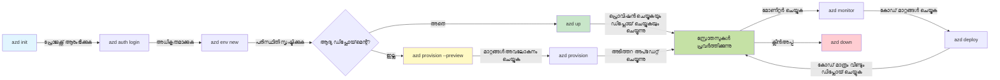
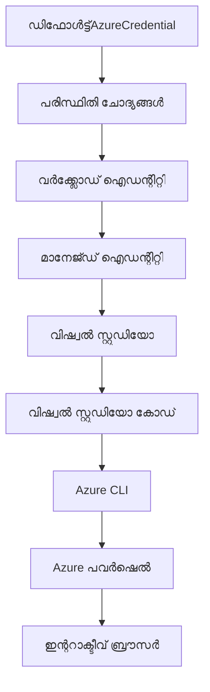

<!--
CO_OP_TRANSLATOR_METADATA:
{
  "original_hash": "e855e899d2705754fe85b04190edd0f0",
  "translation_date": "2025-11-25T00:10:03+00:00",
  "source_file": "docs/getting-started/azd-basics.md",
  "language_code": "ml"
}
-->
# AZD അടിസ്ഥാനങ്ങൾ - ആസ്യൂർ ഡെവലപ്പർ CLIയെ മനസ്സിലാക്കുക

# AZD അടിസ്ഥാനങ്ങൾ - പ്രധാന ആശയങ്ങളും അടിസ്ഥാനപരമായ കാര്യങ്ങളും

**അധ്യായ നാവിഗേഷൻ:**
- **📚 കോഴ്സ് ഹോം**: [AZD For Beginners](../../README.md)
- **📖 നിലവിലെ അധ്യായം**: അധ്യായം 1 - അടിസ്ഥാനവും ക്വിക്ക് സ്റ്റാർട്ടും
- **⬅️ മുൻപത്തെ**: [കോഴ്സ് അവലോകനം](../../README.md#-chapter-1-foundation--quick-start)
- **➡️ അടുത്തത്**: [ഇൻസ്റ്റലേഷൻ & സെറ്റപ്പ്](installation.md)
- **🚀 അടുത്ത അധ്യായം**: [അധ്യായം 2: AI-First ഡെവലപ്മെന്റ്](../microsoft-foundry/microsoft-foundry-integration.md)

## പരിചയം

ഈ പാഠം Azure Developer CLI (azd) എന്ന ശക്തമായ കമാൻഡ്-ലൈൻ ടൂളിനെ പരിചയപ്പെടുത്തുന്നു, ഇത് നിങ്ങളുടെ ലോക്കൽ ഡെവലപ്മെന്റിൽ നിന്ന് ആസ്യൂർ ഡെപ്ലോയ്മെന്റിലേക്ക് ഉള്ള യാത്ര വേഗത്തിലാക്കുന്നു. അടിസ്ഥാന ആശയങ്ങൾ, പ്രധാന സവിശേഷതകൾ എന്നിവ നിങ്ങൾക്ക് പഠിക്കാം, കൂടാതെ azd ക്ലൗഡ്-നേറ്റീവ് ആപ്ലിക്കേഷൻ ഡെപ്ലോയ്മെന്റ് എളുപ്പമാക്കുന്ന രീതി മനസ്സിലാക്കാം.

## പഠന ലക്ഷ്യങ്ങൾ

ഈ പാഠം പൂർത്തിയാക്കുമ്പോൾ, നിങ്ങൾക്ക്:
- Azure Developer CLI എന്താണെന്ന്, അതിന്റെ പ്രധാന ഉദ്ദേശ്യം എന്താണെന്ന് മനസ്സിലാക്കുക
- ടെംപ്ലേറ്റുകൾ, എൻവയോൺമെന്റുകൾ, സർവീസുകൾ എന്നിവയുടെ അടിസ്ഥാന ആശയങ്ങൾ പഠിക്കുക
- ടെംപ്ലേറ്റ്-ഡ്രിവൻ ഡെവലപ്മെന്റും Infrastructure as Code (IaC) ഉം ഉൾപ്പെടെ പ്രധാന സവിശേഷതകൾ അന്വേഷിക്കുക
- azd പ്രോജക്റ്റ് ഘടനയും പ്രവൃത്തി പ്രക്രിയയും മനസ്സിലാക്കുക
- നിങ്ങളുടെ ഡെവലപ്മെന്റ് എൻവയോൺമെന്റിനായി azd ഇൻസ്റ്റാൾ ചെയ്യാനും കോൺഫിഗർ ചെയ്യാനും തയ്യാറാകുക

## പഠന ഫലങ്ങൾ

ഈ പാഠം പൂർത്തിയാക്കിയ ശേഷം, നിങ്ങൾക്ക് കഴിയും:
- ആധുനിക ക്ലൗഡ് ഡെവലപ്മെന്റ് പ്രവൃത്തി പ്രക്രിയകളിൽ azdയുടെ പങ്ക് വിശദീകരിക്കുക
- azd പ്രോജക്റ്റ് ഘടനയുടെ ഘടകങ്ങൾ തിരിച്ചറിയുക
- ടെംപ്ലേറ്റുകൾ, എൻവയോൺമെന്റുകൾ, സർവീസുകൾ എന്നിവ എങ്ങനെ പ്രവർത്തിക്കുന്നു എന്ന് വിവരിക്കുക
- azd ഉപയോഗിച്ച് Infrastructure as Code ന്റെ ഗുണങ്ങൾ മനസ്സിലാക്കുക
- വ്യത്യസ്ത azd കമാൻഡുകളും അവയുടെ ഉദ്ദേശ്യങ്ങളും തിരിച്ചറിയുക

## Azure Developer CLI (azd) എന്താണ്?

Azure Developer CLI (azd) ഒരു കമാൻഡ്-ലൈൻ ടൂളാണ്, ഇത് നിങ്ങളുടെ ലോക്കൽ ഡെവലപ്മെന്റിൽ നിന്ന് ആസ്യൂർ ഡെപ്ലോയ്മെന്റിലേക്ക് ഉള്ള യാത്ര വേഗത്തിലാക്കാൻ രൂപകൽപ്പന ചെയ്തിരിക്കുന്നു. ആസ്യൂറിൽ ക്ലൗഡ്-നേറ്റീവ് ആപ്ലിക്കേഷനുകൾ നിർമ്മിക്കുന്നതും ഡെപ്ലോ ചെയ്യുന്നതും മാനേജുചെയ്യുന്നതും എളുപ്പമാക്കുന്നു.

### 🎯 AZD ഉപയോഗിക്കേണ്ടത് എന്തുകൊണ്ട്? യഥാർത്ഥ ലോകത്തിലെ താരതമ്യം

ഒരു ലളിതമായ വെബ് ആപ്പ് ഡാറ്റാബേസിനൊപ്പം ഡെപ്ലോ ചെയ്യുന്നത് താരതമ്യം ചെയ്യാം:

#### ❌ AZD ഇല്ലാതെ: മാനുവൽ ആസ്യൂർ ഡെപ്ലോയ്മെന്റ് (30+ മിനിറ്റ്)

```bash
# ഘട്ടം 1: റിസോഴ്‌സ് ഗ്രൂപ്പ് സൃഷ്ടിക്കുക
az group create --name myapp-rg --location eastus

# ഘട്ടം 2: ആപ്പ് സർവീസ് പ്ലാൻ സൃഷ്ടിക്കുക
az appservice plan create --name myapp-plan \
  --resource-group myapp-rg \
  --sku B1 --is-linux

# ഘട്ടം 3: വെബ് ആപ്പ് സൃഷ്ടിക്കുക
az webapp create --name myapp-web-unique123 \
  --resource-group myapp-rg \
  --plan myapp-plan \
  --runtime "NODE:18-lts"

# ഘട്ടം 4: കോസ്മോസ് ഡിബി അക്കൗണ്ട് സൃഷ്ടിക്കുക (10-15 മിനിറ്റ്)
az cosmosdb create --name myapp-cosmos-unique123 \
  --resource-group myapp-rg \
  --kind MongoDB

# ഘട്ടം 5: ഡാറ്റാബേസ് സൃഷ്ടിക്കുക
az cosmosdb mongodb database create \
  --account-name myapp-cosmos-unique123 \
  --resource-group myapp-rg \
  --name tododb

# ഘട്ടം 6: ശേഖരണം സൃഷ്ടിക്കുക
az cosmosdb mongodb collection create \
  --account-name myapp-cosmos-unique123 \
  --resource-group myapp-rg \
  --database-name tododb \
  --name todos

# ഘട്ടം 7: കണക്ഷൻ സ്ട്രിംഗ് നേടുക
CONN_STR=$(az cosmosdb keys list \
  --name myapp-cosmos-unique123 \
  --resource-group myapp-rg \
  --type connection-strings \
  --query "connectionStrings[0].connectionString" -o tsv)

# ഘട്ടം 8: ആപ്പ് ക്രമീകരണങ്ങൾ കോൺഫിഗർ ചെയ്യുക
az webapp config appsettings set \
  --name myapp-web-unique123 \
  --resource-group myapp-rg \
  --settings MONGODB_URI="$CONN_STR"

# ഘട്ടം 9: ലോഗിംഗ് സജീവമാക്കുക
az webapp log config --name myapp-web-unique123 \
  --resource-group myapp-rg \
  --application-logging filesystem \
  --detailed-error-messages true

# ഘട്ടം 10: ആപ്ലിക്കേഷൻ ഇൻസൈറ്റ്സ് സജ്ജമാക്കുക
az monitor app-insights component create \
  --app myapp-insights \
  --location eastus \
  --resource-group myapp-rg

# ഘട്ടം 11: ആപ്പ് ഇൻസൈറ്റ്സ് വെബ് ആപ്പുമായി ബന്ധിപ്പിക്കുക
INSTRUMENTATION_KEY=$(az monitor app-insights component show \
  --app myapp-insights \
  --resource-group myapp-rg \
  --query "instrumentationKey" -o tsv)

az webapp config appsettings set \
  --name myapp-web-unique123 \
  --resource-group myapp-rg \
  --settings APPINSIGHTS_INSTRUMENTATIONKEY="$INSTRUMENTATION_KEY"

# ഘട്ടം 12: ആപ്ലിക്കേഷൻ ലോക്കലായി നിർമ്മിക്കുക
npm install
npm run build

# ഘട്ടം 13: ഡിപ്ലോയ്‌മെന്റ് പാക്കേജ് സൃഷ്ടിക്കുക
zip -r app.zip . -x "*.git*" "node_modules/*"

# ഘട്ടം 14: ആപ്ലിക്കേഷൻ ഡിപ്ലോയ് ചെയ്യുക
az webapp deployment source config-zip \
  --resource-group myapp-rg \
  --name myapp-web-unique123 \
  --src app.zip

# ഘട്ടം 15: കാത്തിരിക്കുക, അത് പ്രവർത്തിക്കുമെന്ന് പ്രാർത്ഥിക്കുക 🙏
# (യാന്ത്രികമായ സ്ഥിരീകരണം ഇല്ല, കൈമാറ്റ പരിശോധന ആവശ്യമാണ്)
```

**പ്രശ്നങ്ങൾ:**
- ❌ ഓർമ്മിക്കുകയും ക്രമത്തിൽ എക്സിക്യൂട്ട് ചെയ്യുകയും ചെയ്യേണ്ട 15+ കമാൻഡുകൾ
- ❌ 30-45 മിനിറ്റ് മാനുവൽ പ്രവർത്തനം
- ❌ പിഴവുകൾ എളുപ്പത്തിൽ സംഭവിക്കുന്നു (ടൈപ്പോസ്, തെറ്റായ പാരാമീറ്ററുകൾ)
- ❌ കണക്ഷൻ സ്ട്രിംഗുകൾ ടെർമിനൽ ചരിത്രത്തിൽ എക്സ്പോസ് ചെയ്യുന്നു
- ❌ എന്തെങ്കിലും പരാജയപ്പെട്ടാൽ ഓട്ടോമേറ്റഡ് റോള്ബാക്ക് ഇല്ല
- ❌ ടീം അംഗങ്ങൾക്ക് പുനരാവർത്തിക്കാൻ ബുദ്ധിമുട്ടാണ്
- ❌ ഓരോ തവണയും വ്യത്യസ്തമാണ് (പുനരാവർത്തനക്ഷമമല്ല)

#### ✅ AZD ഉപയോഗിച്ച്: ഓട്ടോമേറ്റഡ് ഡെപ്ലോയ്മെന്റ് (5 കമാൻഡുകൾ, 10-15 മിനിറ്റ്)

```bash
# ഘട്ടം 1: ടെംപ്ലേറ്റിൽ നിന്ന് ആരംഭിക്കുക
azd init --template todo-nodejs-mongo

# ഘട്ടം 2: പ്രാമാണീകരിക്കുക
azd auth login

# ഘട്ടം 3: പരിസ്ഥിതി സൃഷ്ടിക്കുക
azd env new dev

# ഘട്ടം 4: മാറ്റങ്ങൾ പ്രിവ്യൂ ചെയ്യുക (ഐച്ഛികം, പക്ഷേ ശുപാർശ ചെയ്യുന്നു)
azd provision --preview

# ഘട്ടം 5: എല്ലാം വിന്യസിക്കുക
azd up

# ✨ പൂർത്തിയായി! എല്ലാം വിന്യസിക്കുകയും, ക്രമീകരിക്കുകയും, നിരീക്ഷിക്കുകയും ചെയ്തു
```

**ഗുണങ്ങൾ:**
- ✅ **5 കമാൻഡുകൾ** vs. 15+ മാനുവൽ ഘട്ടങ്ങൾ
- ✅ **10-15 മിനിറ്റ്** മൊത്തം സമയം (മിക്കവാറും ആസ്യൂർ കാത്തിരിക്കുന്നു)
- ✅ **പിഴവുകൾ ഇല്ല** - ഓട്ടോമേറ്റഡ്, ടെസ്റ്റുചെയ്തത്
- ✅ **സീക്രെറ്റുകൾ സുരക്ഷിതമായി മാനേജ് ചെയ്യുന്നു** Key Vault വഴി
- ✅ **ഓട്ടോമാറ്റിക് റോള്ബാക്ക്** പരാജയങ്ങളിൽ
- ✅ **പൂർണ്ണമായും പുനരാവർത്തനക്ഷമം** - ഓരോ തവണയും ഒരേ ഫലം
- ✅ **ടീം-റെഡി** - ഒരേ കമാൻഡുകൾ ഉപയോഗിച്ച് ആരും ഡെപ്ലോ ചെയ്യാം
- ✅ **Infrastructure as Code** - വേർഷൻ കൺട്രോൾ ചെയ്ത Bicep ടെംപ്ലേറ്റുകൾ
- ✅ **ബിൽറ്റ്-ഇൻ മോണിറ്ററിംഗ്** - Application Insights ഓട്ടോമാറ്റിക്കായി കോൺഫിഗർ ചെയ്യുന്നു

### 📊 സമയം & പിഴവുകളുടെ കുറവ്

| മെട്രിക് | മാനുവൽ ഡെപ്ലോയ്മെന്റ് | AZD ഡെപ്ലോയ്മെന്റ് | മെച്ചപ്പെടുത്തൽ |
|:-------|:------------------|:---------------|:------------|
| **കമാൻഡുകൾ** | 15+ | 5 | 67% കുറവ് |
| **സമയം** | 30-45 മിനിറ്റ് | 10-15 മിനിറ്റ് | 60% വേഗം |
| **പിഴവുകളുടെ നിരക്ക്** | ~40% | <5% | 88% കുറവ് |
| **സ്ഥിരത** | കുറവ് (മാനുവൽ) | 100% (ഓട്ടോമേറ്റഡ്) | പൂർണ്ണമായും |
| **ടീം ഓൺബോർഡിംഗ്** | 2-4 മണിക്കൂർ | 30 മിനിറ്റ് | 75% വേഗം |
| **റോള്ബാക്ക് സമയം** | 30+ മിനിറ്റ് (മാനുവൽ) | 2 മിനിറ്റ് (ഓട്ടോമേറ്റഡ്) | 93% വേഗം |

## പ്രധാന ആശയങ്ങൾ

### ടെംപ്ലേറ്റുകൾ
ടെംപ്ലേറ്റുകൾ azdയുടെ അടിസ്ഥാനം ആണ്. അവയിൽ ഉൾപ്പെടുന്നു:
- **ആപ്ലിക്കേഷൻ കോഡ്** - നിങ്ങളുടെ സോഴ്‌സ് കോഡും ഡിപൻഡൻസികളും
- **Infrastructure നിർവചനങ്ങൾ** - Bicep അല്ലെങ്കിൽ Terraform ഉപയോഗിച്ച് നിർവചിച്ച Azure റിസോഴ്സുകൾ
- **കോൺഫിഗറേഷൻ ഫയലുകൾ** - സെറ്റിംഗുകളും എൻവയോൺമെന്റ് വേരിയബിളുകളും
- **ഡെപ്ലോയ്മെന്റ് സ്ക്രിപ്റ്റുകൾ** - ഓട്ടോമേറ്റഡ് ഡെപ്ലോയ്മെന്റ് പ്രവൃത്തി പ്രക്രിയകൾ

### എൻവയോൺമെന്റുകൾ
എൻവയോൺമെന്റുകൾ വ്യത്യസ്ത ഡെപ്ലോയ്മെന്റ് ലക്ഷ്യങ്ങളെ പ്രതിനിധീകരിക്കുന്നു:
- **ഡെവലപ്മെന്റ്** - ടെസ്റ്റിംഗിനും ഡെവലപ്മെന്റിനും വേണ്ടി
- **സ്റ്റേജിംഗ്** - പ്രീ-പ്രൊഡക്ഷൻ എൻവയോൺമെന്റ്
- **പ്രൊഡക്ഷൻ** - ലൈവ് പ്രൊഡക്ഷൻ എൻവയോൺമെന്റ്

ഓരോ എൻവയോൺമെന്റും സ്വന്തമായുള്ളവയെ നിലനിർത്തുന്നു:
- Azure റിസോഴ്സ് ഗ്രൂപ്പ്
- കോൺഫിഗറേഷൻ സെറ്റിംഗുകൾ
- ഡെപ്ലോയ്മെന്റ് സ്റ്റേറ്റ്

### സർവീസുകൾ
സർവീസുകൾ നിങ്ങളുടെ ആപ്ലിക്കേഷന്റെ ഘടകങ്ങളാണ്:
- **ഫ്രണ്ട്‌എൻഡ്** - വെബ് ആപ്ലിക്കേഷനുകൾ, SPAs
- **ബാക്ക്‌എൻഡ്** - APIs, മൈക്രോസർവീസുകൾ
- **ഡാറ്റാബേസ്** - ഡാറ്റാ സ്റ്റോറേജ് സൊല്യൂഷനുകൾ
- **സ്റ്റോറേജ്** - ഫയൽ, ബ്ലോബ് സ്റ്റോറേജ്

## പ്രധാന സവിശേഷതകൾ

### 1. ടെംപ്ലേറ്റ്-ഡ്രിവൻ ഡെവലപ്മെന്റ്
```bash
# ലഭ്യമായ ടെംപ്ലേറ്റുകൾ ബ്രൗസ് ചെയ്യുക
azd template list

# ഒരു ടെംപ്ലേറ്റിൽ നിന്ന് ആരംഭിക്കുക
azd init --template <template-name>
```

### 2. Infrastructure as Code
- **Bicep** - Azureയുടെ ഡൊമെയ്ൻ-സ്പെസിഫിക് ഭാഷ
- **Terraform** - മൾട്ടി-ക്ലൗഡ് Infrastructure ടൂൾ
- **ARM ടെംപ്ലേറ്റുകൾ** - Azure Resource Manager ടെംപ്ലേറ്റുകൾ

### 3. ഇന്റഗ്രേറ്റഡ് പ്രവൃത്തി പ്രക്രിയകൾ
```bash
# പൂർണ്ണമായ ഡിപ്ലോയ്മെന്റ് വർക്ക്‌ഫ്ലോ
azd up            # പ്രൊവിഷൻ + ഡിപ്ലോയ് ഇത് ആദ്യത്തെ സെറ്റപ്പിനായി ഹാൻഡ്‌സ് ഓഫ് ആണ്

# 🧪 പുതിയത്: ഡിപ്ലോയ്മെന്റിന് മുമ്പ് ഇൻഫ്രാസ്ട്രക്ചർ മാറ്റങ്ങൾ പ്രിവ്യൂ ചെയ്യുക (സുരക്ഷിതം)
azd provision --preview    # മാറ്റങ്ങൾ ചെയ്യാതെ ഇൻഫ്രാസ്ട്രക്ചർ ഡിപ്ലോയ്മെന്റ് സിമുലേറ്റ് ചെയ്യുക

azd provision     # ഇൻഫ്രാസ്ട്രക്ചർ അപ്‌ഡേറ്റ് ചെയ്താൽ Azure റിസോഴ്സുകൾ സൃഷ്ടിക്കുക
azd deploy        # അപ്‌ഡേറ്റ് ചെയ്ത ശേഷം ആപ്ലിക്കേഷൻ കോഡ് ഡിപ്ലോയ് ചെയ്യുക അല്ലെങ്കിൽ വീണ്ടും ഡിപ്ലോയ് ചെയ്യുക
azd down          # റിസോഴ്സുകൾ ക്ലീൻ ചെയ്യുക
```

#### 🛡️ സുരക്ഷിത Infrastructure പ്ലാനിംഗ് പ്രിവ്യൂ ഉപയോഗിച്ച്
`azd provision --preview` കമാൻഡ് സുരക്ഷിത ഡെപ്ലോയ്മെന്റുകൾക്കായി ഗെയിം-ചേഞ്ചറാണ്:
- **ഡ്രൈ-റൺ വിശകലനം** - എന്താണ് സൃഷ്ടിക്കപ്പെടുക, മാറ്റം വരുത്തുക, അല്ലെങ്കിൽ ഇല്ലാതാക്കുക എന്ന് കാണിക്കുന്നു
- **സീറോ റിസ്ക്** - നിങ്ങളുടെ Azure എൻവയോൺമെന്റിൽ യഥാർത്ഥ മാറ്റങ്ങൾ ഉണ്ടാകുന്നില്ല
- **ടീം സഹകരണം** - ഡെപ്ലോയ്മെന്റിന് മുമ്പ് പ്രിവ്യൂ ഫലങ്ങൾ പങ്കിടുക
- **ചെലവിന്റെ കണക്കുകൂട്ടൽ** - പ്രതിബദ്ധതയ്ക്ക് മുമ്പ് റിസോഴ്സ് ചെലവുകൾ മനസ്സിലാക്കുക

```bash
# ഉദാഹരണ പ്രിവ്യൂ പ്രവൃത്തി പ്രവാഹം
azd provision --preview           # എന്താണ് മാറ്റം വരാൻ പോകുന്നത് എന്ന് കാണുക
# ഔട്ട്പുട്ട് അവലോകനം ചെയ്യുക, ടീമുമായി ചർച്ച ചെയ്യുക
azd provision                     # ആത്മവിശ്വാസത്തോടെ മാറ്റങ്ങൾ പ്രയോഗിക്കുക
```

### 📊 ദൃശ്യവൽക്കരണം: AZD ഡെവലപ്മെന്റ് പ്രവൃത്തി പ്രക്രിയ


**പ്രവൃത്തി പ്രക്രിയ വിശദീകരണം:**
1. **Init** - ടെംപ്ലേറ്റ് അല്ലെങ്കിൽ പുതിയ പ്രോജക്റ്റ് ഉപയോഗിച്ച് ആരംഭിക്കുക
2. **Auth** - Azure ഉപയോഗിച്ച് ഓതന്റിക്കേറ്റ് ചെയ്യുക
3. **Environment** - ഐസൊലേറ്റഡ് ഡെപ്ലോയ്മെന്റ് എൻവയോൺമെന്റ് സൃഷ്ടിക്കുക
4. **Preview** - 🆕 എപ്പോഴും Infrastructure മാറ്റങ്ങൾ പ്രിവ്യൂ ചെയ്യുക (സുരക്ഷിത പ്രാക്ടീസ്)
5. **Provision** - Azure റിസോഴ്സുകൾ സൃഷ്ടിക്കുക/അപ്ഡേറ്റ് ചെയ്യുക
6. **Deploy** - നിങ്ങളുടെ ആപ്ലിക്കേഷൻ കോഡ് പുഷ് ചെയ്യുക
7. **Monitor** - ആപ്ലിക്കേഷൻ പ്രകടനം നിരീക്ഷിക്കുക
8. **Iterate** - മാറ്റങ്ങൾ വരുത്തി കോഡ് വീണ്ടും ഡെപ്ലോ ചെയ്യുക
9. **Cleanup** - പ്രവർത്തനം പൂർത്തിയാക്കിയ ശേഷം റിസോഴ്സുകൾ നീക്കം ചെയ്യുക

### 4. എൻവയോൺമെന്റ് മാനേജ്മെന്റ്
```bash
# പരിസ്ഥിതികൾ സൃഷ്ടിക്കുകയും നിയന്ത്രിക്കുകയും ചെയ്യുക
azd env new <environment-name>
azd env select <environment-name>
azd env list
```

## 📁 പ്രോജക്റ്റ് ഘടന

ഒരു സാധാരണ azd പ്രോജക്റ്റ് ഘടന:
```
my-app/
├── .azd/                    # azd configuration
│   └── config.json
├── .azure/                  # Azure deployment artifacts
├── .devcontainer/          # Development container config
├── .github/workflows/      # GitHub Actions
├── .vscode/               # VS Code settings
├── infra/                 # Infrastructure code
│   ├── main.bicep        # Main infrastructure template
│   ├── main.parameters.json
│   └── modules/          # Reusable modules
├── src/                  # Application source code
│   ├── api/             # Backend services
│   └── web/             # Frontend application
├── azure.yaml           # azd project configuration
└── README.md
```

## 🔧 കോൺഫിഗറേഷൻ ഫയലുകൾ

### azure.yaml
പ്രധാന പ്രോജക്റ്റ് കോൺഫിഗറേഷൻ ഫയൽ:
```yaml
name: my-awesome-app
metadata:
  template: my-template@1.0.0

services:
  web:
    project: ./src/web
    language: js
    host: appservice
  api:
    project: ./src/api
    language: js
    host: appservice

hooks:
  preprovision:
    shell: pwsh
    run: echo "Preparing to provision..."
```

### .azure/config.json
എൻവയോൺമെന്റ്-സ്പെസിഫിക് കോൺഫിഗറേഷൻ:
```json
{
  "version": 1,
  "defaultEnvironment": "dev",
  "environments": {
    "dev": {
      "subscriptionId": "your-subscription-id",
      "location": "eastus"
    }
  }
}
```

## 🎪 സാധാരണ പ്രവൃത്തി പ്രക്രിയകൾ കൈകാര്യം ചെയ്യുക

> **💡 പഠന ടിപ്പ്:** നിങ്ങളുടെ AZD കഴിവുകൾ ക്രമാനുസൃതമായി വികസിപ്പിക്കാൻ ഈ അഭ്യാസങ്ങൾ അനുസരിച്ച് പിന്തുടരുക.

### 🎯 അഭ്യാസം 1: നിങ്ങളുടെ ആദ്യ പ്രോജക്റ്റ് ആരംഭിക്കുക

**ലക്ഷ്യം:** ഒരു AZD പ്രോജക്റ്റ് സൃഷ്ടിക്കുകയും അതിന്റെ ഘടന പരിശോധിക്കുകയും ചെയ്യുക

**ഘട്ടങ്ങൾ:**
```bash
# തെളിയിച്ച ടെംപ്ലേറ്റ് ഉപയോഗിക്കുക
azd init --template todo-nodejs-mongo

# സൃഷ്ടിച്ച ഫയലുകൾ പരിശോധിക്കുക
ls -la  # മറഞ്ഞിരിക്കുന്നവ ഉൾപ്പെടെ എല്ലാ ഫയലുകളും കാണുക

# പ്രധാന ഫയലുകൾ സൃഷ്ടിച്ചു:
# - azure.yaml (പ്രധാന കോൺഫിഗറേഷൻ)
# - infra/ (ഇൻഫ്രാസ്ട്രക്ചർ കോഡ്)
# - src/ (അപ്ലിക്കേഷൻ കോഡ്)
```

**✅ വിജയം:** നിങ്ങൾക്ക് azure.yaml, infra/, src/ ഡയറക്ടറികൾ ലഭിക്കും

---

### 🎯 അഭ്യാസം 2: ആസ്യൂറിലേക്ക് ഡെപ്ലോ ചെയ്യുക

**ലക്ഷ്യം:** എന്റു-ടു-എന്റ് ഡെപ്ലോയ്മെന്റ് പൂർത്തിയാക്കുക

**ഘട്ടങ്ങൾ:**
```bash
# 1. പ്രാമാണീകരിക്കുക
az login && azd auth login

# 2. പരിസ്ഥിതി സൃഷ്ടിക്കുക
azd env new dev
azd env set AZURE_LOCATION eastus

# 3. മാറ്റങ്ങൾ പ്രിവ്യൂ ചെയ്യുക (ശുപാർശ ചെയ്യുന്നു)
azd provision --preview

# 4. എല്ലാം വിന്യസിക്കുക
azd up

# 5. വിന്യാസം സ്ഥിരീകരിക്കുക
azd show    # നിങ്ങളുടെ ആപ്പ് URL കാണുക
```

**പ്രതീക്ഷിക്കുന്ന സമയം:** 10-15 മിനിറ്റ്  
**✅ വിജയം:** ആപ്ലിക്കേഷൻ URL ബ്രൗസറിൽ തുറക്കുന്നു

---

### 🎯 അഭ്യാസം 3: മൾട്ടിപ്പിൾ എൻവയോൺമെന്റുകൾ

**ലക്ഷ്യം:** ഡെവ്, സ്റ്റേജിംഗ് എന്നിവയിലേക്ക് ഡെപ്ലോ ചെയ്യുക

**ഘട്ടങ്ങൾ:**
```bash
# ഡെവ് ഇതിനകം ഉണ്ട്, സ്റ്റേജിംഗ് സൃഷ്ടിക്കുക
azd env new staging
azd env set AZURE_LOCATION westus2
azd up

# അവയുടെ ഇടയിൽ മാറുക
azd env list
azd env select dev
```

**✅ വിജയം:** Azure പോർട്ടലിൽ രണ്ട് വ്യത്യസ്ത റിസോഴ്സ് ഗ്രൂപ്പുകൾ

---

### 🛡️ ക്ലീൻ സ്ലേറ്റ്: `azd down --force --purge`

നിങ്ങൾക്ക് പൂർണ്ണമായും റീസെറ്റ് ചെയ്യേണ്ടതുണ്ടെങ്കിൽ:

```bash
azd down --force --purge
```

**ഇത് എന്താണ് ചെയ്യുന്നത്:**
- `--force`: സ്ഥിരീകരണ പ്രോംപ്റ്റുകൾ ഇല്ല
- `--purge`: എല്ലാ ലോക്കൽ സ്റ്റേറ്റും Azure റിസോഴ്സുകളും ഇല്ലാതാക്കുന്നു

**ഉപയോഗിക്കുക:**
- ഡെപ്ലോയ്മെന്റ് മധ്യേ പരാജയപ്പെട്ടാൽ
- പ്രോജക്റ്റുകൾ മാറ്റുമ്പോൾ
- പുതിയ തുടക്കം ആവശ്യമുള്ളപ്പോൾ

---

## 🎪 ഓറിജിനൽ പ്രവൃത്തി പ്രക്രിയ റഫറൻസ്

### പുതിയ പ്രോജക്റ്റ് ആരംഭിക്കൽ
```bash
# മാർഗ്ഗം 1: നിലവിലുള്ള ടെംപ്ലേറ്റ് ഉപയോഗിക്കുക
azd init --template todo-nodejs-mongo

# മാർഗ്ഗം 2: തുടക്കം മുതൽ ആരംഭിക്കുക
azd init

# മാർഗ്ഗം 3: നിലവിലെ ഡയറക്ടറി ഉപയോഗിക്കുക
azd init .
```

### ഡെവലപ്മെന്റ് സൈക്കിൾ
```bash
# വികസന പരിസ്ഥിതി സജ്ജമാക്കുക
azd auth login
azd env new dev
azd env select dev

# എല്ലാം വിന്യസിക്കുക
azd up

# മാറ്റങ്ങൾ വരുത്തി വീണ്ടും വിന്യസിക്കുക
azd deploy

# പൂർത്തിയാക്കിയ ശേഷം ശുചീകരിക്കുക
azd down --force --purge # Azure Developer CLI-യിലെ കമാൻഡ് നിങ്ങളുടെ പരിസ്ഥിതിക്ക് ഒരു **ഹാർഡ് റീസെറ്റ്** ആണ്—വിഫലമായ വിന്യാസങ്ങൾ പരിഹരിക്കുന്നതിനും, അനാഥമായ വിഭവങ്ങൾ ശുചീകരിക്കുന്നതിനും, പുതിയൊരു വിന്യാസത്തിനായി തയ്യാറെടുക്കുന്നതിനും പ്രത്യേകമായി ഉപയോഗപ്രദമാണ്.
```

## `azd down --force --purge` മനസ്സിലാക്കുക
`azd down --force --purge` കമാൻഡ് നിങ്ങളുടെ azd എൻവയോൺമെന്റും ബന്ധപ്പെട്ട എല്ലാ റിസോഴ്സുകളും പൂർണ്ണമായും നീക്കം ചെയ്യാനുള്ള ശക്തമായ മാർഗമാണ്. ഓരോ ഫ്ലാഗും എന്താണ് ചെയ്യുന്നതെന്ന് ഇവിടെ വിശദീകരിക്കുന്നു:
```
--force
```
- സ്ഥിരീകരണ പ്രോംപ്റ്റുകൾ ഒഴിവാക്കുന്നു.
- മാനുവൽ ഇൻപുട്ട് പ്രായോഗികമല്ലാത്ത ഓട്ടോമേഷൻ അല്ലെങ്കിൽ സ്ക്രിപ്റ്റിംഗിനായി ഉപയോഗപ്രദമാണ്.
- CLI അസംഗതികൾ കണ്ടെത്തിയാലും, ടിയർഡൗൺ തടസ്സമില്ലാതെ മുന്നോട്ട് പോകുന്നു.

```
--purge
```
**എല്ലാ ബന്ധപ്പെട്ട മെറ്റാഡാറ്റയും** ഇല്ലാതാക്കുന്നു, ഉൾപ്പെടെ:
എൻവയോൺമെന്റ് സ്റ്റേറ്റ്
ലോക്കൽ `.azure` ഫോൾഡർ
കാഷ് ചെയ്ത ഡെപ്ലോയ്മെന്റ് വിവരങ്ങൾ
മുൻ ഡെപ്ലോയ്മെന്റുകൾ "ഓർമ്മിക്കുന്നതിൽ" നിന്ന് azd തടയുന്നു, ഇത് മിസ്മാച്ച് ചെയ്ത റിസോഴ്സ് ഗ്രൂപ്പുകൾ അല്ലെങ്കിൽ പഴയ റെജിസ്ട്രി റഫറൻസുകൾ പോലുള്ള പ്രശ്നങ്ങൾ ഉണ്ടാക്കാം.

### രണ്ടും ഒരുമിച്ച് ഉപയോഗിക്കേണ്ടത് എന്തുകൊണ്ട്?
`azd up` ഉപയോഗിച്ച് ലിംഗറിംഗ് സ്റ്റേറ്റ് അല്ലെങ്കിൽ ഭാഗിക ഡെപ്ലോയ്മെന്റുകൾ കാരണം നിങ്ങൾ ഒരു മതിലിൽ തട്ടിയാൽ, ഈ കോമ്പോ **ക്ലീൻ സ്ലേറ്റ്** ഉറപ്പാക്കുന്നു.

ഇത് Azure പോർട്ടലിൽ മാനുവൽ റിസോഴ്സ് ഡിലീഷനുകൾക്കുശേഷം അല്ലെങ്കിൽ ടെംപ്ലേറ്റുകൾ, എൻവയോൺമെന്റുകൾ, അല്ലെങ്കിൽ റിസോഴ്സ് ഗ്രൂപ്പ് നാമകരണം കൺവെൻഷനുകൾ മാറ്റുമ്പോൾ പ്രത്യേകിച്ച് സഹായകരമാണ്.

### മൾട്ടിപ്പിൾ എൻവയോൺമെന്റുകൾ മാനേജുചെയ്യൽ
```bash
# സ്റ്റേജിംഗ് പരിസ്ഥിതി സൃഷ്ടിക്കുക
azd env new staging
azd env select staging
azd up

# ഡെവ്‌ക്ക് തിരിച്ചുപോകുക
azd env select dev

# പരിസ്ഥിതികൾ താരതമ്യം ചെയ്യുക
azd env list
```

## 🔐 ഓതന്റിക്കേഷൻ & ക്രെഡൻഷ്യലുകൾ

വിജയകരമായ azd ഡെപ്ലോയ്മെന്റുകൾക്കായി ഓതന്റിക്കേഷൻ മനസ്സിലാക്കുന്നത് നിർണായകമാണ്. Azure പല ഓതന്റിക്കേഷൻ രീതികളും ഉപയോഗിക്കുന്നു, azd മറ്റ് Azure ടൂളുകൾ ഉപയോഗിക്കുന്നതുപോലെ തന്നെ ക്രെഡൻഷ്യൽ ചെയിനുകൾ ഉപയോഗിക്കുന്നു.

### Azure CLI ഓതന്റിക്കേഷൻ (`az login`)

azd ഉപയോഗിക്കുന്നതിന് മുമ്പ്, നിങ്ങൾ Azure ഉപയോഗിച്ച് ഓതന്റിക്കേറ്റ് ചെയ്യണം. ഏറ്റവും സാധാരണമായ രീതി Azure CLI ഉപയോഗിക്കുകയാണ്:

```bash
# ഇന്ററാക്ടീവ് ലോഗിൻ (ബ്രൗസർ തുറക്കുന്നു)
az login

# പ്രത്യേക ടെനന്റുമായി ലോഗിൻ ചെയ്യുക
az login --tenant <tenant-id>

# സർവീസ് പ്രിൻസിപ്പലുമായി ലോഗിൻ ചെയ്യുക
az login --service-principal -u <app-id> -p <password> --tenant <tenant-id>

# നിലവിലെ ലോഗിൻ നില പരിശോധിക്കുക
az account show

# ലഭ്യമായ സബ്സ്ക്രിപ്ഷനുകൾ ലിസ്റ്റ് ചെയ്യുക
az account list --output table

# ഡീഫോൾട്ട് സബ്സ്ക്രിപ്ഷൻ സജ്ജമാക്കുക
az account set --subscription <subscription-id>
```

### ഓതന്റിക്കേഷൻ പ്രവാഹം
1. **ഇന്ററാക്ടീവ് ലോഗിൻ**: ഓതന്റിക്കേഷനായി നിങ്ങളുടെ ഡിഫോൾട്ട് ബ്രൗസർ തുറക്കുന്നു
2. **ഡിവൈസ് കോഡ് ഫ്ലോ**: ബ്രൗസർ ആക്സസ് ഇല്ലാത്ത എൻവയോൺമെന്റുകൾക്കായി
3. **സർവീസ് പ്രിൻസിപ്പൽ**: ഓട്ടോമേഷൻ, CI/CD സീനാരിയോകൾക്കായി
4. **മാനേജ്ഡ് ഐഡന്റിറ്റി**: Azure-ഹോസ്റ്റുചെയ്ത ആപ്ലിക്കേഷനുകൾക്കായി

### DefaultAzureCredential ചെയിൻ

`DefaultAzureCredential` ഒരു ക്രെഡൻഷ്യൽ തരം ആണ്, ഇത് ഒരു ലളിതമായ ഓതന്റിക്കേഷൻ അനുഭവം നൽകുന്നു, പ്രത്യേക ക്രമത്തിൽ നിരവധി ക്രെഡൻഷ്യൽ ഉറവിടങ്ങൾ സ്വയമേവ പരീക്ഷിക്കുന്നു:

#### ക്രെഡൻഷ്യൽ ചെയിൻ ക്രമം

#### 1. എൻവയോൺമെന്റ് വ
- [ഇൻസ്റ്റലേഷൻ & ക്രമീകരണം](installation.md) - azd ഇൻസ്റ്റാൾ ചെയ്ത് ക്രമീകരിക്കുക
- [നിങ്ങളുടെ ആദ്യ പ്രോജക്റ്റ്](first-project.md) - പൂർണ്ണമായ പ്രായോഗിക ട്യൂട്ടോറിയൽ
- [കോണ്ഫിഗറേഷൻ ഗൈഡ്](configuration.md) - ഉയർന്ന തലത്തിലുള്ള ക്രമീകരണ ഓപ്ഷനുകൾ

**🎯 അടുത്ത അധ്യായത്തിന് തയ്യാറാണോ?**
- [അധ്യായം 2: AI-ആധാരിത ഡെവലപ്മെന്റ്](../microsoft-foundry/microsoft-foundry-integration.md) - AI ആപ്ലിക്കേഷനുകൾ നിർമ്മിക്കാൻ തുടങ്ങുക

## അധിക റിസോഴ്സുകൾ

- [Azure Developer CLI അവലോകനം](https://learn.microsoft.com/en-us/azure/developer/azure-developer-cli/)
- [ടെംപ്ലേറ്റ് ഗാലറി](https://azure.github.io/awesome-azd/)
- [കമ്മ്യൂണിറ്റി സാമ്പിളുകൾ](https://github.com/Azure-Samples)

---

## 🙋 പലപ്പോഴും ചോദിക്കുന്ന ചോദ്യങ്ങൾ

### പൊതുവായ ചോദ്യങ്ങൾ

**Q: AZD-നും Azure CLI-ക്കും എന്താണ് വ്യത്യാസം?**

A: Azure CLI (`az`) വ്യക്തിഗത Azure റിസോഴ്സുകൾ മാനേജുചെയ്യാൻ ഉപയോഗിക്കുന്നു. AZD (`azd`) മുഴുവൻ ആപ്ലിക്കേഷനുകൾ മാനേജുചെയ്യാൻ ഉപയോഗിക്കുന്നു:

```bash
# Azure CLI - താഴ്ന്ന തലത്തിലുള്ള വിഭവങ്ങൾ കൈകാര്യം ചെയ്യൽ
az webapp create --name myapp --resource-group rg
az sql server create --name myserver --resource-group rg
# ...കൂടുതൽ കമാൻഡുകൾ ആവശ്യമാണ്

# AZD - ആപ്ലിക്കേഷൻ തലത്തിലുള്ള മാനേജ്മെന്റ്
azd up  # എല്ലാ വിഭവങ്ങളോടും കൂടിയ ആപ്ലിക്കേഷൻ മുഴുവൻ വിന്യസിക്കുന്നു
```

**ഇങ്ങനെ ചിന്തിക്കുക:**
- `az` = വ്യക്തിഗത ലെഗോ ബ്രിക്കുകൾ ഉപയോഗിച്ച് പ്രവർത്തിക്കുന്നു
- `azd` = പൂർണ്ണമായ ലെഗോ സെറ്റുകൾ ഉപയോഗിച്ച് പ്രവർത്തിക്കുന്നു

---

**Q: AZD ഉപയോഗിക്കാൻ Bicep അല്ലെങ്കിൽ Terraform അറിയേണ്ടതുണ്ടോ?**

A: ഇല്ല! ടെംപ്ലേറ്റുകൾ ഉപയോഗിച്ച് തുടങ്ങുക:
```bash
# നിലവിലുള്ള ടെംപ്ലേറ്റ് ഉപയോഗിക്കുക - IaC അറിവ് ആവശ്യമില്ല
azd init --template todo-nodejs-mongo
azd up
```

ഇൻഫ്രാസ്ട്രക്ചർ കസ്റ്റമൈസ് ചെയ്യാൻ പിന്നീട് Bicep പഠിക്കാം. ടെംപ്ലേറ്റുകൾ പഠിക്കാൻ പ്രവർത്തന ഉദാഹരണങ്ങൾ നൽകുന്നു.

---

**Q: AZD ടെംപ്ലേറ്റുകൾ പ്രവർത്തിപ്പിക്കാൻ എത്ര ചെലവാകും?**

A: ചെലവ് ടെംപ്ലേറ്റുകൾ അനുസരിച്ച് വ്യത്യാസപ്പെടുന്നു. മിക്ക ഡെവലപ്മെന്റ് ടെംപ്ലേറ്റുകൾക്കും $50-150/മാസം ചെലവാകും:

```bash
# വിന്യാസം നടത്തുന്നതിന് മുമ്പ് ചെലവുകൾ പ്രിവ്യൂ ചെയ്യുക
azd provision --preview

# ഉപയോഗിക്കാത്തപ്പോൾ എപ്പോഴും ക്ലീൻഅപ്പ് ചെയ്യുക
azd down --force --purge  # എല്ലാ വിഭവങ്ങളും നീക്കം ചെയ്യുന്നു
```

**പ്രൊ ടിപ്പ്:** ലഭ്യമായിടത്ത് സൗജന്യ ടിയറുകൾ ഉപയോഗിക്കുക:
- ആപ്പ് സർവീസ്: F1 (സൗജന്യ) ടിയർ
- Azure OpenAI: 50,000 ടോക്കൺ/മാസം സൗജന്യം
- Cosmos DB: 1000 RU/s സൗജന്യ ടിയർ

---

**Q: നിലവിലുള്ള Azure റിസോഴ്സുകൾ ഉപയോഗിച്ച് AZD ഉപയോഗിക്കാമോ?**

A: കഴിയും, പക്ഷേ പുതുതായി തുടങ്ങുന്നത് എളുപ്പമാണ്. AZD മുഴുവൻ ലൈഫ്സൈക്കിൾ മാനേജുചെയ്യുമ്പോഴാണ് മികച്ചത്. നിലവിലുള്ള റിസോഴ്സുകൾക്കായി:

```bash
# ഓപ്ഷൻ 1: നിലവിലുള്ള വിഭവങ്ങൾ ഇറക്കുമതി ചെയ്യുക (അഡ്വാൻസ്ഡ്)
azd init
# തുടർന്ന് നിലവിലുള്ള വിഭവങ്ങളെ സൂചിപ്പിക്കാൻ infra/ മാറ്റുക

# ഓപ്ഷൻ 2: പുതുതായി ആരംഭിക്കുക (ശുപാർശ ചെയ്യുന്നു)
azd init --template matching-your-stack
azd up  # പുതിയ പരിസ്ഥിതി സൃഷ്ടിക്കുന്നു
```

---

**Q: എന്റെ പ്രോജക്റ്റ് സഹപ്രവർത്തകരുമായി എങ്ങനെ പങ്കിടാം?**

A: AZD പ്രോജക്റ്റ് Git-ലേക്ക് കമ്മിറ്റ് ചെയ്യുക (പക്ഷേ .azure ഫോൾഡർ അല്ല):

```bash
# ഡിഫോൾട്ടായി .gitignore ൽ ഇതിനകം ഉണ്ട്
.azure/        # രഹസ്യങ്ങളും പരിസ്ഥിതി ഡാറ്റയും അടങ്ങിയിരിക്കുന്നു
*.env          # പരിസ്ഥിതി വേരിയബിളുകൾ

# ടീം അംഗങ്ങൾ പിന്നീട്:
git clone <your-repo>
azd auth login
azd env new <their-name>-dev
azd up
```

എല്ലാവർക്കും ഒരേ ടെംപ്ലേറ്റുകളിൽ നിന്ന് ഒരേ ഇൻഫ്രാസ്ട്രക്ചർ ലഭിക്കും.

---

### പ്രശ്നപരിഹാര ചോദ്യങ്ങൾ

**Q: "azd up" പാതിവഴിയിൽ പരാജയപ്പെട്ടു. ഞാൻ എന്ത് ചെയ്യണം?**

A: പിശക് പരിശോധിച്ച്, അത് പരിഹരിച്ച് വീണ്ടും ശ്രമിക്കുക:

```bash
# വിശദമായ ലോഗുകൾ കാണുക
azd show

# സാധാരണ പരിഹാരങ്ങൾ:

# 1. ക്വോട്ടാ മിച്ചമായാൽ:
azd env set AZURE_LOCATION "westus2"  # വ്യത്യസ്തമായ പ്രദേശം ശ്രമിക്കുക

# 2. റിസോഴ്‌സ് നാമം冲突:
azd down --force --purge  # ശുദ്ധ slate
azd up  # വീണ്ടും ശ്രമിക്കുക

# 3. auth കാലഹരണപ്പെട്ടാൽ:
az login
azd auth login
azd up
```

**സാധാരണ പ്രശ്നം:** തെറ്റായ Azure സബ്സ്ക്രിപ്ഷൻ തിരഞ്ഞെടുക്കൽ
```bash
az account list --output table
az account set --subscription "<correct-subscription>"
```

---

**Q: ഇൻഫ്രാസ്ട്രക്ചർ വീണ്ടും സജ്ജീകരിക്കാതെ കോഡ് മാറ്റങ്ങൾ മാത്രം എങ്ങനെ ഡെപ്ലോയ് ചെയ്യാം?**

A: `azd up` ന്റെ പകരം `azd deploy` ഉപയോഗിക്കുക:

```bash
azd up          # ആദ്യമായി: പ്രൊവിഷൻ + ഡിപ്ലോയ് (മന്ദം)

# കോഡ് മാറ്റങ്ങൾ ചെയ്യുക...

azd deploy      # തുടർന്നുള്ള തവണകൾ: ഡിപ്ലോയ് മാത്രം (വേഗം)
```

വേഗത താരതമ്യം:
- `azd up`: 10-15 മിനിറ്റ് (ഇൻഫ്രാസ്ട്രക്ചർ സജ്ജീകരിക്കുന്നു)
- `azd deploy`: 2-5 മിനിറ്റ് (കോഡ് മാത്രം)

---

**Q: ഇൻഫ്രാസ്ട്രക്ചർ ടെംപ്ലേറ്റുകൾ എങ്ങനെ കസ്റ്റമൈസ് ചെയ്യാം?**

A: `infra/` ലെ Bicep ഫയലുകൾ എഡിറ്റ് ചെയ്യുക:

```bash
# azd init കഴിഞ്ഞ്
cd infra/
code main.bicep  # VS കോഡിൽ എഡിറ്റ് ചെയ്യുക

# മാറ്റങ്ങൾ പ്രിവ്യൂ ചെയ്യുക
azd provision --preview

# മാറ്റങ്ങൾ പ്രയോഗിക്കുക
azd provision
```

**ടിപ്പ്:** ചെറിയ മാറ്റങ്ങളോടെ തുടങ്ങുക - ആദ്യം SKUs മാറ്റുക:
```bicep
// infra/main.bicep
sku: {
  name: 'B1'  // Change to 'P1V2' for production
}
```

---

**Q: AZD സൃഷ്ടിച്ച എല്ലാം എങ്ങനെ ഡിലീറ്റ് ചെയ്യാം?**

A: ഒരു കമാൻഡ് ഉപയോഗിച്ച് എല്ലാ റിസോഴ്സുകളും നീക്കം ചെയ്യാം:

```bash
azd down --force --purge

# ഇത് ഇല്ലാതാക്കുന്നു:
# - എല്ലാ Azure വിഭവങ്ങൾ
# - വിഭവ ഗ്രൂപ്പ്
# - പ്രാദേശിക പരിസ്ഥിതി നില
# - കാഷ് ചെയ്ത ഡിപ്ലോയ്‌മെന്റ് ഡാറ്റ
```

**എപ്പോഴും ഇത് നടത്തുക:**
- ഒരു ടെംപ്ലേറ്റ് ടെസ്റ്റിംഗ് പൂർത്തിയാക്കുമ്പോൾ
- വ്യത്യസ്ത പ്രോജക്റ്റിലേക്ക് മാറുമ്പോൾ
- പുതുതായി തുടങ്ങാൻ ആഗ്രഹിക്കുമ്പോൾ

**ചെലവ് ലാഭം:** ഉപയോഗിക്കാത്ത റിസോഴ്സുകൾ നീക്കം ചെയ്യുന്നത് = $0 ചാർജുകൾ

---

**Q: Azure പോർട്ടലിൽ റിസോഴ്സുകൾ തെറ്റായി ഡിലീറ്റ് ചെയ്താൽ എന്ത് ചെയ്യും?**

A: AZD സ്റ്റേറ്റ് സിങ്ക് ചെയ്യാതെ പോകാം. ക്ലീൻ സ്ലേറ്റ് സമീപനം:

```bash
# 1. പ്രാദേശിക അവസ്ഥ നീക്കം ചെയ്യുക
azd down --force --purge

# 2. പുതുതായി ആരംഭിക്കുക
azd up

# ബദൽ: AZD കണ്ടെത്തി പരിഹരിക്കാൻ അനുവദിക്കുക
azd provision  # അഭാവമുള്ള വിഭവങ്ങൾ സൃഷ്ടിക്കും
```

---

### ഉയർന്ന തലത്തിലുള്ള ചോദ്യങ്ങൾ

**Q: AZD-നെ CI/CD പൈപ്പ്‌ലൈനുകളിൽ ഉപയോഗിക്കാമോ?**

A: കഴിയും! GitHub Actions ഉദാഹരണം:

```yaml
# .github/workflows/deploy.yml
name: Deploy with AZD

on:
  push:
    branches: [main]

jobs:
  deploy:
    runs-on: ubuntu-latest
    steps:
      - uses: actions/checkout@v2
      
      - name: Install azd
        run: curl -fsSL https://aka.ms/install-azd.sh | bash
      
      - name: Azure Login
        run: |
          azd auth login \
            --client-id ${{ secrets.AZURE_CLIENT_ID }} \
            --client-secret ${{ secrets.AZURE_CLIENT_SECRET }} \
            --tenant-id ${{ secrets.AZURE_TENANT_ID }}
      
      - name: Deploy
        run: azd up --no-prompt
```

---

**Q: രഹസ്യങ്ങളും സെൻസിറ്റീവ് ഡാറ്റയും എങ്ങനെ കൈകാര്യം ചെയ്യാം?**

A: AZD സ്വയമേവ Azure Key Vault-നൊപ്പം ഇന്റഗ്രേറ്റ് ചെയ്യുന്നു:

```bash
# രഹസ്യങ്ങൾ കോഡിൽ അല്ല, കീ വോൾട്ടിൽ സൂക്ഷിക്കുന്നു
azd env set DATABASE_PASSWORD "$(openssl rand -base64 32)"

# AZD സ്വയമേവ:
# 1. കീ വോൾട്ട് സൃഷ്ടിക്കുന്നു
# 2. രഹസ്യം സൂക്ഷിക്കുന്നു
# 3. മാനേജ്ഡ് ഐഡന്റിറ്റി വഴി ആപ്ലിക്കേഷനിലേക്ക് ആക്സസ് അനുവദിക്കുന്നു
# 4. റൺടൈമിൽ ഇൻജക്റ്റ് ചെയ്യുന്നു
```

**ഒരിക്കലും കമ്മിറ്റ് ചെയ്യരുത്:**
- `.azure/` ഫോൾഡർ (പരിസ്ഥിതി ഡാറ്റ അടങ്ങിയിരിക്കുന്നു)
- `.env` ഫയലുകൾ (ലോക്കൽ രഹസ്യങ്ങൾ)
- കണക്ഷൻ സ്ട്രിംഗുകൾ

---

**Q: ഒന്നിലധികം റീജിയനുകളിൽ ഡെപ്ലോയ് ചെയ്യാമോ?**

A: ഓരോ റീജിയനും ഒരു പരിസ്ഥിതി സൃഷ്ടിക്കുക:

```bash
# കിഴക്കൻ യുഎസ് പരിസ്ഥിതി
azd env new prod-eastus
azd env set AZURE_LOCATION eastus
azd up

# പടിഞ്ഞാറൻ യൂറോപ്പ് പരിസ്ഥിതി
azd env new prod-westeurope
azd env set AZURE_LOCATION westeurope
azd up

# ഓരോ പരിസ്ഥിതിയും സ്വതന്ത്രമാണ്
azd env list
```

യഥാർത്ഥ മൾട്ടി-റീജിയൻ ആപ്ലിക്കേഷനുകൾക്കായി, ഒരേസമയം ഒന്നിലധികം റീജിയനുകളിൽ ഡെപ്ലോയ് ചെയ്യാൻ Bicep ടെംപ്ലേറ്റുകൾ കസ്റ്റമൈസ് ചെയ്യുക.

---

**Q: ഞാൻ കുടുങ്ങിയാൽ എവിടെ നിന്ന് സഹായം ലഭിക്കും?**

1. **AZD ഡോക്യുമെന്റേഷൻ:** https://learn.microsoft.com/azure/developer/azure-developer-cli/
2. **GitHub Issues:** https://github.com/Azure/azure-dev/issues
3. **ഡിസ്കോർഡ്:** [Azure Discord](https://discord.gg/microsoft-azure) - #azure-developer-cli ചാനൽ
4. **Stack Overflow:** ടാഗ് `azure-developer-cli`
5. **ഈ കോഴ്സ്:** [Troubleshooting Guide](../troubleshooting/common-issues.md)

**പ്രൊ ടിപ്പ്:** ചോദിക്കുന്നതിന് മുമ്പ്, ഇത് പ്രവർത്തിപ്പിക്കുക:
```bash
azd show       # നിലവിലെ നില കാണിക്കുന്നു
azd version    # നിങ്ങളുടെ പതിപ്പ് കാണിക്കുന്നു
```
നിങ്ങളുടെ ചോദ്യത്തിൽ ഈ വിവരങ്ങൾ ഉൾപ്പെടുത്തുക, അതിനാൽ സഹായം വേഗത്തിൽ ലഭിക്കും.

---

## 🎓 അടുത്തത് എന്താണ്?

നിങ്ങൾക്ക് ഇപ്പോൾ AZD അടിസ്ഥാനങ്ങൾ മനസ്സിലായിരിക്കുന്നു. നിങ്ങളുടെ പാത തിരഞ്ഞെടുക്കുക:

### 🎯 തുടക്കക്കാർക്കായി:
1. **അടുത്തത്:** [ഇൻസ്റ്റലേഷൻ & ക്രമീകരണം](installation.md) - നിങ്ങളുടെ മെഷീനിൽ AZD ഇൻസ്റ്റാൾ ചെയ്യുക
2. **ശേഷം:** [നിങ്ങളുടെ ആദ്യ പ്രോജക്റ്റ്](first-project.md) - നിങ്ങളുടെ ആദ്യ ആപ്പ് ഡെപ്ലോയ് ചെയ്യുക
3. **പ്രാക്ടീസ്:** ഈ പാഠത്തിലെ എല്ലാ 3 അഭ്യാസങ്ങളും പൂർത്തിയാക്കുക

### 🚀 AI ഡെവലപ്പർമാർക്കായി:
1. **നേരിട്ട് പോകുക:** [അധ്യായം 2: AI-ആധാരിത ഡെവലപ്മെന്റ്](../microsoft-foundry/microsoft-foundry-integration.md)
2. **ഡെപ്ലോയ് ചെയ്യുക:** `azd init --template get-started-with-ai-chat` ഉപയോഗിച്ച് തുടങ്ങുക
3. **പഠിക്കുക:** ഡെപ്ലോയ് ചെയ്യുമ്പോൾ നിർമ്മിക്കുക

### 🏗️ പരിചയസമ്പന്നരായ ഡെവലപ്പർമാർക്കായി:
1. **റിവ്യൂ ചെയ്യുക:** [കോണ്ഫിഗറേഷൻ ഗൈഡ്](configuration.md) - ഉയർന്ന തലത്തിലുള്ള ക്രമീകരണങ്ങൾ
2. **അന്വേഷിക്കുക:** [ഇൻഫ്രാസ്ട്രക്ചർ എസ് കോഡ്](../deployment/provisioning.md) - Bicep ഡീപ്പ് ഡൈവ്
3. **നിർമ്മിക്കുക:** നിങ്ങളുടെ സ്റ്റാക്കിനായി കസ്റ്റം ടെംപ്ലേറ്റുകൾ സൃഷ്ടിക്കുക

---

**അധ്യായ നാവിഗേഷൻ:**
- **📚 കോഴ്സ് ഹോം**: [AZD For Beginners](../../README.md)
- **📖 നിലവിലെ അധ്യായം**: Chapter 1 - Foundation & Quick Start  
- **⬅️ മുൻപ്**: [കോഴ്സ് അവലോകനം](../../README.md#-chapter-1-foundation--quick-start)
- **➡️ അടുത്തത്**: [ഇൻസ്റ്റലേഷൻ & ക്രമീകരണം](installation.md)
- **🚀 അടുത്ത അധ്യായം**: [അധ്യായം 2: AI-ആധാരിത ഡെവലപ്മെന്റ്](../microsoft-foundry/microsoft-foundry-integration.md)

---

<!-- CO-OP TRANSLATOR DISCLAIMER START -->
**അറിയിപ്പ്**:  
ഈ രേഖ AI വിവർത്തന സേവനമായ [Co-op Translator](https://github.com/Azure/co-op-translator) ഉപയോഗിച്ച് വിവർത്തനം ചെയ്തതാണ്. ഞങ്ങൾ കൃത്യതയ്ക്കായി ശ്രമിക്കുന്നുവെങ്കിലും, സ്വയം പ്രവർത്തിക്കുന്ന വിവർത്തനങ്ങളിൽ പിഴവുകൾ അല്ലെങ്കിൽ തെറ്റായ വിവരങ്ങൾ ഉണ്ടാകാൻ സാധ്യതയുണ്ട്. അതിന്റെ സ്വാഭാവിക ഭാഷയിലുള്ള മൂല രേഖയാണ് പ്രാമാണികമായ ഉറവിടമായി പരിഗണിക്കേണ്ടത്. നിർണായകമായ വിവരങ്ങൾക്ക്, പ്രൊഫഷണൽ മനുഷ്യ വിവർത്തനം ശുപാർശ ചെയ്യുന്നു. ഈ വിവർത്തനം ഉപയോഗിച്ച് ഉണ്ടാകുന്ന തെറ്റിദ്ധാരണകൾക്കോ തെറ്റായ വ്യാഖ്യാനങ്ങൾക്കോ ഞങ്ങൾ ഉത്തരവാദികളല്ല.
<!-- CO-OP TRANSLATOR DISCLAIMER END -->