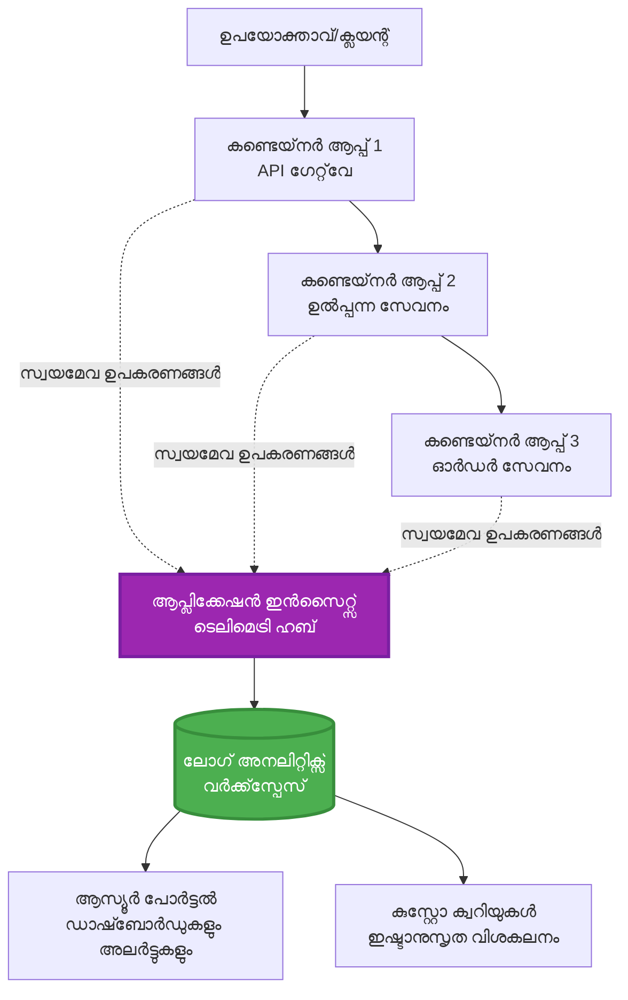
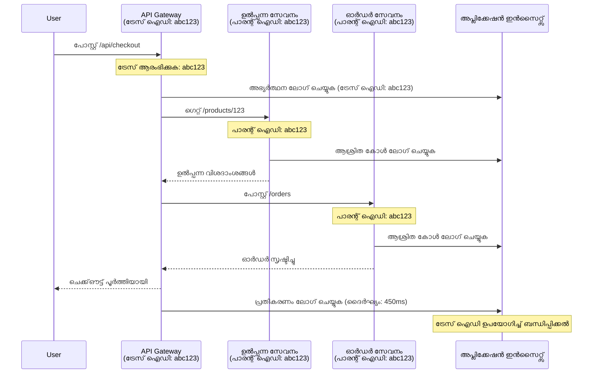

<!--
CO_OP_TRANSLATOR_METADATA:
{
  "original_hash": "e5aa37cdb6378c09099500ac31600b8c",
  "translation_date": "2025-11-24T23:16:26+00:00",
  "source_file": "docs/pre-deployment/application-insights.md",
  "language_code": "ml"
}
-->
# AZD ഉപയോഗിച്ച് ആപ്ലിക്കേഷൻ ഇൻസൈറ്റ്സ് ഇന്റഗ്രേഷൻ

⏱️ **അനുമാനിച്ച സമയം**: 40-50 മിനിറ്റ് | 💰 **ചെലവിന്റെ സ്വാധീനം**: ~$5-15/മാസം | ⭐ **സങ്കീർണ്ണത**: ഇടത്തരം

**📚 പഠന പാത:**
- ← മുൻപ്: [Preflight Checks](preflight-checks.md) - പ്രീ-ഡിപ്ലോയ്മെന്റ് പരിശോധന
- 🎯 **നിങ്ങൾ ഇവിടെ**: ആപ്ലിക്കേഷൻ ഇൻസൈറ്റ്സ് ഇന്റഗ്രേഷൻ (മോണിറ്ററിംഗ്, ടെലിമെട്രി, ഡീബഗിംഗ്)
- → അടുത്തത്: [Deployment Guide](../deployment/deployment-guide.md) - Azure-ലേക്ക് ഡിപ്ലോയ് ചെയ്യുക
- 🏠 [കോഴ്‌സ് ഹോം](../../README.md)

---

## നിങ്ങൾ എന്താണ് പഠിക്കുക

ഈ പാഠം പൂർത്തിയാക്കുന്നതിലൂടെ, നിങ്ങൾക്ക്:
- **ആപ്ലിക്കേഷൻ ഇൻസൈറ്റ്സ്** AZD പ്രോജക്റ്റുകളിൽ സ്വയമേവ ഇന്റഗ്രേറ്റ് ചെയ്യാൻ കഴിയും
- മൈക്രോസർവീസുകൾക്കായി **ഡിസ്ട്രിബ്യൂട്ടഡ് ട്രേസിംഗ്** കോൺഫിഗർ ചെയ്യുക
- **കസ്റ്റം ടെലിമെട്രി** (മെട്രിക്‌സ്, ഇവന്റുകൾ, ഡിപെൻഡൻസികൾ) നടപ്പിലാക്കുക
- റിയൽ-ടൈം മോണിറ്ററിംഗിനായി **ലൈവ് മെട്രിക്‌സ്** സജ്ജമാക്കുക
- AZD ഡിപ്ലോയ്മെന്റുകളിൽ നിന്ന് **അലേർട്ടുകളും ഡാഷ്ബോർഡുകളും** സൃഷ്ടിക്കുക
- **ടെലിമെട്രി ക്വെറികൾ** ഉപയോഗിച്ച് പ്രൊഡക്ഷൻ പ്രശ്നങ്ങൾ ഡീബഗ് ചെയ്യുക
- **ചെലവുകളും സാമ്പിളിംഗ്** തന്ത്രങ്ങളും ഓപ്റ്റിമൈസ് ചെയ്യുക
- **AI/LLM ആപ്ലിക്കേഷനുകൾ** (ടോക്കൺസ്, ലാറ്റൻസി, ചെലവുകൾ) മോണിറ്റർ ചെയ്യുക

## AZD ഉപയോഗിച്ച് ആപ്ലിക്കേഷൻ ഇൻസൈറ്റ്സ് എന്തുകൊണ്ട് പ്രധാനമാണ്

### വെല്ലുവിളി: പ്രൊഡക്ഷൻ ഒബ്സർവബിലിറ്റി

**ആപ്ലിക്കേഷൻ ഇൻസൈറ്റ്സ് ഇല്ലാതെ:**
```
❌ No visibility into production behavior
❌ Manual log aggregation across services
❌ Reactive debugging (wait for customer complaints)
❌ No performance metrics
❌ Cannot trace requests across services
❌ Unknown failure rates and bottlenecks
```

**ആപ്ലിക്കേഷൻ ഇൻസൈറ്റ്സ് + AZD ഉപയോഗിച്ച്:**
```
✅ Automatic telemetry collection
✅ Centralized logs from all services
✅ Proactive issue detection
✅ End-to-end request tracing
✅ Performance metrics and insights
✅ Real-time dashboards
✅ AZD provisions everything automatically
```

**ഉദാഹരണം**: ആപ്ലിക്കേഷൻ ഇൻസൈറ്റ്സ് നിങ്ങളുടെ ആപ്ലിക്കേഷനു വേണ്ടി ഒരു "ബ്ലാക്ക് ബോക്സ്" ഫ്ലൈറ്റ് റെക്കോർഡറും കോക്പിറ്റ് ഡാഷ്ബോർഡും പോലെയാണ്. നിങ്ങൾക്ക് റിയൽ-ടൈമിൽ എല്ലാം കാണാനും ഏതെങ്കിലും സംഭവത്തെ പുനഃസൃഷ്ടിക്കാനും കഴിയും.

---

## ആർക്കിടെക്ചർ അവലോകനം

### AZD ആർക്കിടെക്ചറിൽ ആപ്ലിക്കേഷൻ ഇൻസൈറ്റ്സ്


### സ്വയമേവ മോണിറ്റർ ചെയ്യപ്പെടുന്നത്

| ടെലിമെട്രി തരം | ഇത് പകർത്തുന്നത് | ഉപയോഗം |
|----------------|------------------|----------|
| **Requests** | HTTP അഭ്യർത്ഥനകൾ, സ്റ്റാറ്റസ് കോഡുകൾ, ദൈർഘ്യം | API പ്രകടന മോണിറ്ററിംഗ് |
| **Dependencies** | ബാഹ്യ കോൾസ് (DB, APIs, സ്റ്റോറേജ്) | ബോട്ടിൽനെക്കുകൾ കണ്ടെത്തുക |
| **Exceptions** | സ്റ്റാക്ക് ട്രേസുകളുള്ള കൈകാര്യം ചെയ്യാത്ത പിശകുകൾ | പരാജയങ്ങൾ ഡീബഗ് ചെയ്യുക |
| **Custom Events** | ബിസിനസ് ഇവന്റുകൾ (സൈൻഅപ്പ്, വാങ്ങൽ) | അനലിറ്റിക്സ്, ഫണലുകൾ |
| **Metrics** | പ്രകടന കൗണ്ടറുകൾ, കസ്റ്റം മെട്രിക്‌സ് | ശേഷി പ്ലാനിംഗ് |
| **Traces** | ഗുരുത്വത്വമുള്ള ലോഗ് സന്ദേശങ്ങൾ | ഡീബഗിംഗ്, ഓഡിറ്റിംഗ് |
| **Availability** | അപ്‌ടൈം, പ്രതികരണ സമയം പരിശോധനകൾ | SLA മോണിറ്ററിംഗ് |

---

## മുൻ‌വ്യവസ്ഥകൾ

### ആവശ്യമായ ഉപകരണങ്ങൾ

```bash
# Azure Developer CLI പരിശോധിക്കുക
azd version
# ✅ പ്രതീക്ഷിച്ചത്: azd പതിപ്പ് 1.0.0 അല്ലെങ്കിൽ അതിനുമുകളിൽ

# Azure CLI പരിശോധിക്കുക
az --version
# ✅ പ്രതീക്ഷിച്ചത്: azure-cli 2.50.0 അല്ലെങ്കിൽ അതിനുമുകളിൽ
```

### Azure ആവശ്യങ്ങൾ

- സജീവ Azure സബ്സ്ക്രിപ്ഷൻ
- സൃഷ്ടിക്കാൻ അനുമതികൾ:
  - ആപ്ലിക്കേഷൻ ഇൻസൈറ്റ്സ് റിസോഴ്സുകൾ
  - ലോഗ് അനലിറ്റിക്സ് വർക്‌സ്‌പേസുകൾ
  - കണ്ടെയ്‌നർ ആപ്പുകൾ
  - റിസോഴ്സ് ഗ്രൂപ്പുകൾ

### അറിവിന്റെ മുൻ‌വ്യവസ്ഥകൾ

നിങ്ങൾ പൂർത്തിയാക്കിയിരിക്കണം:
- [AZD അടിസ്ഥാനങ്ങൾ](../getting-started/azd-basics.md) - AZD അടിസ്ഥാന ആശയങ്ങൾ
- [കോൺഫിഗറേഷൻ](../getting-started/configuration.md) - പരിസ്ഥിതി സജ്ജീകരണം
- [ആദ്യ പ്രോജക്റ്റ്](../getting-started/first-project.md) - അടിസ്ഥാന ഡിപ്ലോയ്മെന്റ്

---

## പാഠം 1: AZD ഉപയോഗിച്ച് സ്വയമേവ ആപ്ലിക്കേഷൻ ഇൻസൈറ്റ്സ്

### AZD ആപ്ലിക്കേഷൻ ഇൻസൈറ്റ്സ് സജ്ജീകരിക്കുന്നത് എങ്ങനെ

AZD ഡിപ്ലോയ് ചെയ്യുമ്പോൾ സ്വയമേവ ആപ്ലിക്കേഷൻ ഇൻസൈറ്റ്സ് സൃഷ്ടിക്കുകയും കോൺഫിഗർ ചെയ്യുകയും ചെയ്യുന്നു. ഇത് എങ്ങനെ പ്രവർത്തിക്കുന്നു എന്ന് നോക്കാം.

### പ്രോജക്റ്റ് ഘടന

```
monitored-app/
├── azure.yaml                     # AZD configuration
├── infra/
│   ├── main.bicep                # Main infrastructure
│   ├── core/
│   │   └── monitoring.bicep      # Application Insights + Log Analytics
│   └── app/
│       └── api.bicep             # Container App with monitoring
└── src/
    ├── app.py                    # Application with telemetry
    ├── requirements.txt
    └── Dockerfile
```

---

### ഘട്ടം 1: AZD കോൺഫിഗർ ചെയ്യുക (azure.yaml)

**ഫയൽ: `azure.yaml`**

```yaml
name: monitored-app
metadata:
  template: monitored-app@1.0.0

services:
  api:
    project: ./src
    language: python
    host: containerapp

# AZD automatically provisions monitoring!
```

**ഇതോടെ തീർന്നു!** AZD അടിസ്ഥാന മോണിറ്ററിംഗിനായി സ്വയമേവ ആപ്ലിക്കേഷൻ ഇൻസൈറ്റ്സ് സൃഷ്ടിക്കും. അധിക കോൺഫിഗറേഷൻ ആവശ്യമില്ല.

---

### ഘട്ടം 2: മോണിറ്ററിംഗ് ഇൻഫ്രാസ്ട്രക്ചർ (Bicep)

**ഫയൽ: `infra/core/monitoring.bicep`**

```bicep
param logAnalyticsName string
param applicationInsightsName string
param location string = resourceGroup().location
param tags object = {}

// Log Analytics Workspace (required for Application Insights)
resource logAnalytics 'Microsoft.OperationalInsights/workspaces@2022-10-01' = {
  name: logAnalyticsName
  location: location
  tags: tags
  properties: {
    sku: {
      name: 'PerGB2018'  // Pay-as-you-go pricing
    }
    retentionInDays: 30  // Keep logs for 30 days
    features: {
      enableLogAccessUsingOnlyResourcePermissions: true
    }
  }
}

// Application Insights
resource applicationInsights 'Microsoft.Insights/components@2020-02-02' = {
  name: applicationInsightsName
  location: location
  tags: tags
  kind: 'web'
  properties: {
    Application_Type: 'web'
    WorkspaceResourceId: logAnalytics.id
    IngestionMode: 'LogAnalytics'
    publicNetworkAccessForIngestion: 'Enabled'
    publicNetworkAccessForQuery: 'Enabled'
  }
}

// Outputs for Container Apps
output logAnalyticsWorkspaceId string = logAnalytics.id
output logAnalyticsWorkspaceName string = logAnalytics.name
output applicationInsightsConnectionString string = applicationInsights.properties.ConnectionString
output applicationInsightsInstrumentationKey string = applicationInsights.properties.InstrumentationKey
output applicationInsightsName string = applicationInsights.name
```

---

### ഘട്ടം 3: കണ്ടെയ്‌നർ ആപ്പിനെ ആപ്ലിക്കേഷൻ ഇൻസൈറ്റ്സുമായി ബന്ധിപ്പിക്കുക

**ഫയൽ: `infra/app/api.bicep`**

```bicep
param name string
param location string
param tags object = {}
param containerAppsEnvironmentName string
param applicationInsightsConnectionString string

resource containerApp 'Microsoft.App/containerApps@2023-05-01' = {
  name: name
  location: location
  tags: tags
  properties: {
    configuration: {
      ingress: {
        external: true
        targetPort: 8000
      }
      secrets: [
        {
          name: 'appinsights-connection-string'
          value: applicationInsightsConnectionString
        }
      ]
    }
    template: {
      containers: [
        {
          name: 'api'
          image: 'myregistry.azurecr.io/api:latest'
          resources: {
            cpu: json('0.5')
            memory: '1Gi'
          }
          env: [
            {
              name: 'APPLICATIONINSIGHTS_CONNECTION_STRING'
              secretRef: 'appinsights-connection-string'
            }
            {
              name: 'APPLICATIONINSIGHTS_ENABLED'
              value: 'true'
            }
          ]
        }
      ]
    }
  }
}

output uri string = 'https://${containerApp.properties.configuration.ingress.fqdn}'
```

---

### ഘട്ടം 4: ടെലിമെട്രിയോടുകൂടിയ ആപ്ലിക്കേഷൻ കോഡ്

**ഫയൽ: `src/app.py`**

```python
from flask import Flask, request, jsonify
from opencensus.ext.azure.log_exporter import AzureLogHandler
from opencensus.ext.azure.trace_exporter import AzureExporter
from opencensus.ext.flask.flask_middleware import FlaskMiddleware
from opencensus.trace.samplers import ProbabilitySampler
import logging
import os

app = Flask(__name__)

# ആപ്ലിക്കേഷൻ ഇൻസൈറ്റ്സ് കണക്ഷൻ സ്ട്രിംഗ് നേടുക
connection_string = os.environ.get('APPLICATIONINSIGHTS_CONNECTION_STRING')

if connection_string:
    # വിതരണ ട്രേസിംഗ് കോൺഫിഗർ ചെയ്യുക
    middleware = FlaskMiddleware(
        app,
        exporter=AzureExporter(connection_string=connection_string),
        sampler=ProbabilitySampler(rate=1.0)  # ഡെവലപ്പ്മെന്റിനായി 100% സാമ്പ്ലിംഗ്
    )
    
    # ലോഗിംഗ് കോൺഫിഗർ ചെയ്യുക
    logger = logging.getLogger(__name__)
    logger.addHandler(AzureLogHandler(connection_string=connection_string))
    logger.setLevel(logging.INFO)
    
    print("✅ Application Insights enabled")
else:
    logger = logging.getLogger(__name__)
    logger.setLevel(logging.INFO)
    print("⚠️ Application Insights not configured")

@app.route('/health')
def health():
    logger.info('Health check endpoint called')
    return jsonify({'status': 'healthy', 'monitoring': 'enabled'})

@app.route('/api/products')
def get_products():
    logger.info('Fetching products')
    
    # ഡാറ്റാബേസ് കോൾ അനുകരിക്കുക (സ്വയമേവ ആശ്രയമായി ട്രാക്ക് ചെയ്യപ്പെടുന്നു)
    products = [
        {'id': 1, 'name': 'Laptop', 'price': 999.99},
        {'id': 2, 'name': 'Mouse', 'price': 29.99},
        {'id': 3, 'name': 'Keyboard', 'price': 79.99}
    ]
    
    logger.info(f'Returned {len(products)} products')
    return jsonify(products)

@app.route('/api/error-test')
def error_test():
    """Test error tracking"""
    logger.error('Testing error tracking')
    try:
        raise ValueError('This is a test exception')
    except Exception as e:
        logger.exception('Exception occurred in error-test endpoint')
        return jsonify({'error': str(e)}), 500

@app.route('/api/slow')
def slow_endpoint():
    """Test performance tracking"""
    import time
    logger.info('Slow endpoint called')
    time.sleep(3)  # മന്ദഗതിയുള്ള പ്രവർത്തനം അനുകരിക്കുക
    logger.warning('Endpoint took 3 seconds to respond')
    return jsonify({'message': 'Slow operation completed'})

if __name__ == '__main__':
    app.run(host='0.0.0.0', port=8000)
```

**ഫയൽ: `src/requirements.txt`**

```txt
Flask==3.0.0
opencensus-ext-azure==1.1.13
opencensus-ext-flask==0.8.1
gunicorn==21.2.0
```

---

### ഘട്ടം 5: ഡിപ്ലോയ് ചെയ്യുക, സ്ഥിരീകരിക്കുക

```bash
# AZD ആരംഭിക്കുക
azd init

# വിന്യാസം (ആപ്ലിക്കേഷൻ ഇൻസൈറ്റ്സ് സ്വയം പ്രൊവിഷൻ ചെയ്യുന്നു)
azd up

# ആപ്പ് URL നേടുക
APP_URL=$(azd env get-values | grep API_URL | cut -d '=' -f2 | tr -d '"')

# ടെലിമെട്രി സൃഷ്ടിക്കുക
curl $APP_URL/health
curl $APP_URL/api/products
curl $APP_URL/api/error-test
curl $APP_URL/api/slow
```

**✅ പ്രതീക്ഷിക്കുന്ന ഔട്ട്പുട്ട്:**
```json
{
  "status": "healthy",
  "monitoring": "enabled"
}
```

---

### ഘട്ടം 6: Azure പോർട്ടലിൽ ടെലിമെട്രി കാണുക

```bash
# ആപ്ലിക്കേഷൻ ഇൻസൈറ്റ്സ് വിശദാംശങ്ങൾ നേടുക
azd env get-values | grep APPLICATIONINSIGHTS

# Azure പോർട്ടലിൽ തുറക്കുക
az monitor app-insights component show \
  --app $(azd env get-values | grep APPLICATIONINSIGHTS_NAME | cut -d '=' -f2 | tr -d '"') \
  --resource-group $(azd env get-values | grep AZURE_RESOURCE_GROUP | cut -d '=' -f2 | tr -d '"') \
  --query "appId" -o tsv
```

**Azure പോർട്ടലിലേക്ക് നാവിഗേറ്റ് ചെയ്യുക → ആപ്ലിക്കേഷൻ ഇൻസൈറ്റ്സ് → ട്രാൻസാക്ഷൻ സെർച്ച്**

നിങ്ങൾക്ക് കാണാം:
- ✅ HTTP അഭ്യർത്ഥനകൾ സ്റ്റാറ്റസ് കോഡുകളോടെ
- ✅ അഭ്യർത്ഥന ദൈർഘ്യം (`/api/slow`-നായി 3+ സെക്കൻഡ്)
- ✅ `/api/error-test`-ൽ നിന്നുള്ള എക്സെപ്ഷൻ വിശദാംശങ്ങൾ
- ✅ കസ്റ്റം ലോഗ് സന്ദേശങ്ങൾ

---

## പാഠം 2: കസ്റ്റം ടെലിമെട്രിയും ഇവന്റുകളും

### ബിസിനസ് ഇവന്റുകൾ ട്രാക്ക് ചെയ്യുക

ബിസിനസ്-പ്രധാനമായ ഇവന്റുകൾക്കായി കസ്റ്റം ടെലിമെട്രി ചേർക്കാം.

**ഫയൽ: `src/telemetry.py`**

```python
from opencensus.ext.azure import metrics_exporter
from opencensus.stats import aggregation as aggregation_module
from opencensus.stats import measure as measure_module
from opencensus.stats import stats as stats_module
from opencensus.stats import view as view_module
from opencensus.tags import tag_map as tag_map_module
from opencensus.ext.azure.log_exporter import AzureLogHandler
from opencensus.ext.azure.trace_exporter import AzureExporter
from opencensus.trace import tracer as tracer_module
import logging
import os

class TelemetryClient:
    """Custom telemetry client for Application Insights"""
    
    def __init__(self, connection_string=None):
        self.connection_string = connection_string or os.environ.get('APPLICATIONINSIGHTS_CONNECTION_STRING')
        
        if not self.connection_string:
            print("⚠️ Application Insights connection string not found")
            return
        
        # ലോഗർ സജ്ജമാക്കുക
        self.logger = logging.getLogger(__name__)
        self.logger.addHandler(AzureLogHandler(connection_string=self.connection_string))
        self.logger.setLevel(logging.INFO)
        
        # മെട്രിക്‌സ് എക്സ്പോർട്ടർ സജ്ജമാക്കുക
        self.stats = stats_module.stats
        self.view_manager = self.stats.view_manager
        self.stats_recorder = self.stats.stats_recorder
        
        exporter = metrics_exporter.new_metrics_exporter(
            connection_string=self.connection_string
        )
        self.view_manager.register_exporter(exporter)
        
        # ട്രേസർ സജ്ജമാക്കുക
        self.tracer = tracer_module.Tracer(
            exporter=AzureExporter(connection_string=self.connection_string)
        )
        
        print("✅ Custom telemetry client initialized")
    
    def track_event(self, event_name: str, properties: dict = None):
        """Track custom business event"""
        properties = properties or {}
        self.logger.info(
            f"CustomEvent: {event_name}",
            extra={
                'custom_dimensions': {
                    'event_name': event_name,
                    **properties
                }
            }
        )
    
    def track_metric(self, metric_name: str, value: float, properties: dict = None):
        """Track custom metric"""
        properties = properties or {}
        self.logger.info(
            f"CustomMetric: {metric_name} = {value}",
            extra={
                'custom_dimensions': {
                    'metric_name': metric_name,
                    'value': value,
                    **properties
                }
            }
        )
    
    def track_dependency(self, name: str, dependency_type: str, duration: float, success: bool):
        """Track external dependency call"""
        with self.tracer.span(name=name) as span:
            span.add_attribute('dependency.type', dependency_type)
            span.add_attribute('duration', duration)
            span.add_attribute('success', success)

# ഗ്ലോബൽ ടെലിമെട്രി ക്ലയന്റ്
telemetry = TelemetryClient()
```

### കസ്റ്റം ഇവന്റുകളോടെ ആപ്ലിക്കേഷൻ അപ്ഡേറ്റ് ചെയ്യുക

**ഫയൽ: `src/app.py` (വികസിപ്പിച്ചത്)**

```python
from flask import Flask, request, jsonify
from telemetry import telemetry
import time
import random

app = Flask(__name__)

@app.route('/api/purchase', methods=['POST'])
def purchase():
    """Track purchase event with custom telemetry"""
    data = request.json
    product_id = data.get('product_id')
    quantity = data.get('quantity', 1)
    price = data.get('price', 0)
    
    # ബിസിനസ് ഇവന്റ് ട്രാക്ക് ചെയ്യുക
    telemetry.track_event('Purchase', {
        'product_id': product_id,
        'quantity': quantity,
        'total_amount': price * quantity,
        'user_id': request.headers.get('X-User-Id', 'anonymous')
    })
    
    # വരുമാന മീറ്റ്രിക് ട്രാക്ക് ചെയ്യുക
    telemetry.track_metric('Revenue', price * quantity, {
        'product_id': product_id,
        'currency': 'USD'
    })
    
    return jsonify({
        'order_id': f'ORD-{random.randint(1000, 9999)}',
        'status': 'confirmed',
        'total': price * quantity
    })

@app.route('/api/search')
def search():
    """Track search queries"""
    query = request.args.get('q', '')
    
    start_time = time.time()
    
    # തിരയൽ അനുകരിക്കുക (ഇത് യഥാർത്ഥ ഡാറ്റാബേസ് ക്വറിയായിരിക്കും)
    results = [{'id': 1, 'name': f'Result for {query}'}]
    
    duration = (time.time() - start_time) * 1000  # മില്ലിസെക്കൻഡിലേക്ക് മാറ്റുക
    
    # തിരയൽ ഇവന്റ് ട്രാക്ക് ചെയ്യുക
    telemetry.track_event('Search', {
        'query': query,
        'results_count': len(results),
        'duration_ms': duration
    })
    
    # തിരയൽ പ്രകടന മീറ്റ്രിക് ട്രാക്ക് ചെയ്യുക
    telemetry.track_metric('SearchDuration', duration, {
        'query_length': len(query)
    })
    
    return jsonify({'results': results, 'count': len(results)})

@app.route('/api/external-call')
def external_call():
    """Track external API dependency"""
    import requests
    
    start_time = time.time()
    success = True
    
    try:
        # ബാഹ്യ API കോൾ അനുകരിക്കുക
        response = requests.get('https://api.example.com/data', timeout=5)
        result = response.json()
    except Exception as e:
        success = False
        result = {'error': str(e)}
    
    duration = (time.time() - start_time) * 1000
    
    # ആശ്രയത്വം ട്രാക്ക് ചെയ്യുക
    telemetry.track_dependency(
        name='ExternalAPI',
        dependency_type='HTTP',
        duration=duration,
        success=success
    )
    
    return jsonify(result)

if __name__ == '__main__':
    app.run(host='0.0.0.0', port=8000)
```

### കസ്റ്റം ടെലിമെട്രി പരീക്ഷിക്കുക

```bash
# വാങ്ങൽ സംഭവത്തെ പിന്തുടരുക
curl -X POST $APP_URL/api/purchase \
  -H "Content-Type: application/json" \
  -H "X-User-Id: user123" \
  -d '{"product_id": 1, "quantity": 2, "price": 29.99}'

# തിരയൽ സംഭവത്തെ പിന്തുടരുക
curl "$APP_URL/api/search?q=laptop"

# ബാഹ്യ ആശ്രയത്തെ പിന്തുടരുക
curl $APP_URL/api/external-call
```

**Azure പോർട്ടലിൽ കാണുക:**

ആപ്ലിക്കേഷൻ ഇൻസൈറ്റ്സ് → ലോഗുകൾ → തുടർന്ന്:

```kusto
// View purchase events
traces
| where customDimensions.event_name == "Purchase"
| project 
    timestamp,
    product_id = tostring(customDimensions.product_id),
    total_amount = todouble(customDimensions.total_amount),
    user_id = tostring(customDimensions.user_id)
| order by timestamp desc

// View revenue metrics
traces
| where customDimensions.metric_name == "Revenue"
| summarize TotalRevenue = sum(todouble(customDimensions.value)) by bin(timestamp, 1h)
| render timechart

// View search performance
traces
| where customDimensions.event_name == "Search"
| summarize 
    AvgDuration = avg(todouble(customDimensions.duration_ms)),
    SearchCount = count()
  by bin(timestamp, 5m)
| render timechart
```

---

## പാഠം 3: മൈക്രോസർവീസുകൾക്കായി ഡിസ്ട്രിബ്യൂട്ടഡ് ട്രേസിംഗ്

### ക്രോസ്-സർവീസ് ട്രേസിംഗ് എനേബിൾ ചെയ്യുക

മൈക്രോസർവീസുകൾക്കായി, ആപ്ലിക്കേഷൻ ഇൻസൈറ്റ്സ് സ്വയമേവ അഭ്യർത്ഥനകൾ സർവീസുകൾക്കിടയിൽ ബന്ധിപ്പിക്കുന്നു.

**ഫയൽ: `infra/main.bicep`**

```bicep
targetScope = 'subscription'

param environmentName string
param location string = 'eastus'

var tags = { 'azd-env-name': environmentName }

resource rg 'Microsoft.Resources/resourceGroups@2021-04-01' = {
  name: 'rg-${environmentName}'
  location: location
  tags: tags
}

// Monitoring (shared by all services)
module monitoring './core/monitoring.bicep' = {
  name: 'monitoring'
  scope: rg
  params: {
    logAnalyticsName: 'log-${environmentName}'
    applicationInsightsName: 'appi-${environmentName}'
    location: location
    tags: tags
  }
}

// API Gateway
module apiGateway './app/api-gateway.bicep' = {
  name: 'api-gateway'
  scope: rg
  params: {
    name: 'ca-gateway-${environmentName}'
    location: location
    tags: union(tags, { 'azd-service-name': 'gateway' })
    applicationInsightsConnectionString: monitoring.outputs.applicationInsightsConnectionString
  }
}

// Product Service
module productService './app/product-service.bicep' = {
  name: 'product-service'
  scope: rg
  params: {
    name: 'ca-products-${environmentName}'
    location: location
    tags: union(tags, { 'azd-service-name': 'products' })
    applicationInsightsConnectionString: monitoring.outputs.applicationInsightsConnectionString
  }
}

// Order Service
module orderService './app/order-service.bicep' = {
  name: 'order-service'
  scope: rg
  params: {
    name: 'ca-orders-${environmentName}'
    location: location
    tags: union(tags, { 'azd-service-name': 'orders' })
    applicationInsightsConnectionString: monitoring.outputs.applicationInsightsConnectionString
  }
}

output APPLICATIONINSIGHTS_CONNECTION_STRING string = monitoring.outputs.applicationInsightsConnectionString
output GATEWAY_URL string = apiGateway.outputs.uri
```

### എന്റു-ടു-എൻഡ് ട്രാൻസാക്ഷൻ കാണുക


**എന്റു-ടു-എൻഡ് ട്രേസ് ക്വെറി:**

```kusto
// Find complete request flow
let traceId = "abc123...";  // Get from response header
dependencies
| union requests
| where operation_Id == traceId
| project 
    timestamp,
    type = itemType,
    name,
    duration,
    success,
    cloud_RoleName
| order by timestamp asc
```

---

## പാഠം 4: ലൈവ് മെട്രിക്സും റിയൽ-ടൈം മോണിറ്ററിംഗും

### ലൈവ് മെട്രിക്സ് സ്ട്രീം എനേബിൾ ചെയ്യുക

ലൈവ് മെട്രിക്സ് <1 സെക്കൻഡ് ലാറ്റൻസിയോടെ റിയൽ-ടൈം ടെലിമെട്രി നൽകുന്നു.

**ലൈവ് മെട്രിക്സ് ആക്സസ് ചെയ്യുക:**

```bash
# ആപ്ലിക്കേഷൻ ഇൻസൈറ്റ്സ് റിസോഴ്‌സ് നേടുക
APPI_NAME=$(azd env get-values | grep APPLICATIONINSIGHTS_NAME | cut -d '=' -f2 | tr -d '"')

# റിസോഴ്‌സ് ഗ്രൂപ്പ് നേടുക
RG_NAME=$(azd env get-values | grep AZURE_RESOURCE_GROUP | cut -d '=' -f2 | tr -d '"')

echo "Navigate to: Azure Portal → Resource Groups → $RG_NAME → $APPI_NAME → Live Metrics"
```

**റിയൽ-ടൈമിൽ നിങ്ങൾ കാണുന്നത്:**
- ✅ ഇൻകമിംഗ് അഭ്യർത്ഥന നിരക്ക് (requests/sec)
- ✅ ഔട്ട്‌ഗോയിംഗ് ഡിപെൻഡൻസി കോൾസ്
- ✅ എക്സെപ്ഷൻ കൌണ്ട്
- ✅ CPU, മെമ്മറി ഉപയോഗം
- ✅ ആക്റ്റീവ് സർവർ കൌണ്ട്
- ✅ സാമ്പിൾ ടെലിമെട്രി

### ടെസ്റ്റിംഗിനായി ലോഡ് സൃഷ്ടിക്കുക

```bash
# ലൈവ് മെട്രിക്‌സ് കാണാൻ ലോഡ് സൃഷ്ടിക്കുക
for i in {1..100}; do
  curl $APP_URL/api/products &
  curl $APP_URL/api/search?q=test$i &
done

# Azure പോർട്ടലിൽ ലൈവ് മെട്രിക്‌സ് കാണുക
# നിങ്ങൾ അഭ്യർത്ഥന നിരക്ക് ഉയരുന്നത് കാണും
```

---

## പ്രായോഗിക അഭ്യാസങ്ങൾ

### അഭ്യാസം 1: അലേർട്ടുകൾ സജ്ജമാക്കുക ⭐⭐ (ഇടത്തരം)

**ലക്ഷ്യം**: ഉയർന്ന പിശക് നിരക്കുകൾക്കും മന്ദഗതിയിലുള്ള പ്രതികരണങ്ങൾക്കും അലേർട്ടുകൾ സൃഷ്ടിക്കുക.

**ചുവടുകൾ:**

1. **പിശക് നിരക്കിനായി അലേർട്ട് സൃഷ്ടിക്കുക:**

```bash
# ആപ്ലിക്കേഷൻ ഇൻസൈറ്റ്സ് റിസോഴ്‌സ് ഐഡി നേടുക
APPI_ID=$(az monitor app-insights component show \
  --app $APPI_NAME \
  --resource-group $RG_NAME \
  --query "id" -o tsv)

# പരാജയപ്പെട്ട അഭ്യർത്ഥനകൾക്കായി മെട്രിക് അലർട്ട് സൃഷ്ടിക്കുക
az monitor metrics alert create \
  --name "High-Error-Rate" \
  --resource-group $RG_NAME \
  --scopes $APPI_ID \
  --condition "count requests/failed > 10" \
  --window-size 5m \
  --evaluation-frequency 1m \
  --description "Alert when error rate exceeds 10 per 5 minutes"
```

2. **മന്ദഗതിയുള്ള പ്രതികരണങ്ങൾക്കായി അലേർട്ട് സൃഷ്ടിക്കുക:**

```bash
az monitor metrics alert create \
  --name "Slow-Responses" \
  --resource-group $RG_NAME \
  --scopes $APPI_ID \
  --condition "avg requests/duration > 3000" \
  --window-size 5m \
  --evaluation-frequency 1m \
  --description "Alert when average response time exceeds 3 seconds"
```

3. **Bicep വഴി അലേർട്ട് സൃഷ്ടിക്കുക (AZD-ക്കായി മുൻഗണന):**

**ഫയൽ: `infra/core/alerts.bicep`**

```bicep
param applicationInsightsId string
param actionGroupId string = ''
param location string = resourceGroup().location

// High error rate alert
resource errorRateAlert 'Microsoft.Insights/metricAlerts@2018-03-01' = {
  name: 'high-error-rate'
  location: 'global'
  properties: {
    description: 'Alert when error rate exceeds threshold'
    severity: 2
    enabled: true
    scopes: [
      applicationInsightsId
    ]
    evaluationFrequency: 'PT1M'
    windowSize: 'PT5M'
    criteria: {
      'odata.type': 'Microsoft.Azure.Monitor.SingleResourceMultipleMetricCriteria'
      allOf: [
        {
          name: 'Error rate'
          metricName: 'requests/failed'
          operator: 'GreaterThan'
          threshold: 10
          timeAggregation: 'Count'
        }
      ]
    }
    actions: actionGroupId != '' ? [
      {
        actionGroupId: actionGroupId
      }
    ] : []
  }
}

// Slow response alert
resource slowResponseAlert 'Microsoft.Insights/metricAlerts@2018-03-01' = {
  name: 'slow-responses'
  location: 'global'
  properties: {
    description: 'Alert when response time is too high'
    severity: 3
    enabled: true
    scopes: [
      applicationInsightsId
    ]
    evaluationFrequency: 'PT1M'
    windowSize: 'PT5M'
    criteria: {
      'odata.type': 'Microsoft.Azure.Monitor.SingleResourceMultipleMetricCriteria'
      allOf: [
        {
          name: 'Response duration'
          metricName: 'requests/duration'
          operator: 'GreaterThan'
          threshold: 3000
          timeAggregation: 'Average'
        }
      ]
    }
  }
}

output errorAlertId string = errorRateAlert.id
output slowResponseAlertId string = slowResponseAlert.id
```

4. **അലേർട്ടുകൾ പരീക്ഷിക്കുക:**

```bash
# പിശകുകൾ സൃഷ്ടിക്കുക
for i in {1..20}; do
  curl $APP_URL/api/error-test
done

# മന്ദഗതിയിലുള്ള പ്രതികരണങ്ങൾ സൃഷ്ടിക്കുക
for i in {1..10}; do
  curl $APP_URL/api/slow
done

# അലർട്ട് നില പരിശോധിക്കുക (5-10 മിനിറ്റ് കാത്തിരിക്കുക)
az monitor metrics alert list \
  --resource-group $RG_NAME \
  --query "[].{Name:name, Enabled:enabled, State:properties.enabled}" \
  --output table
```

**✅ വിജയ മാനദണ്ഡങ്ങൾ:**
- ✅ അലേർട്ടുകൾ വിജയകരമായി സൃഷ്ടിച്ചു
- ✅ അലേർട്ടുകൾ പരിധി ലംഘിക്കുമ്പോൾ പ്രവർത്തിക്കുന്നു
- ✅ Azure പോർട്ടലിൽ അലേർട്ട് ചരിത്രം കാണാൻ കഴിയും
- ✅ AZD ഡിപ്ലോയ്മെന്റുമായി ഇന്റഗ്രേറ്റുചെയ്തിരിക്കുന്നു

**സമയം**: 20-25 മിനിറ്റ്

---

### അഭ്യാസം 2: കസ്റ്റം ഡാഷ്ബോർഡ് സൃഷ്ടിക്കുക ⭐⭐ (ഇടത്തരം)

**ലക്ഷ്യം**: പ്രധാന ആപ്ലിക്കേഷൻ മെട്രിക്സ് കാണിക്കുന്ന ഒരു ഡാഷ്ബോർഡ് നിർമ്മിക്കുക.

**ചുവടുകൾ:**

1. **Azure പോർട്ടലിൽ ഡാഷ്ബോർഡ് സൃഷ്ടിക്കുക:**

Azure പോർട്ടൽ → ഡാഷ്ബോർഡുകൾ → പുതിയ ഡാഷ്ബോർഡ്

2. **പ്രധാന മെട്രിക്സുകൾക്കായി ടൈലുകൾ ചേർക്കുക:**

- അഭ്യർത്ഥന കൌണ്ട് (കഴിഞ്ഞ 24 മണിക്കൂർ)
- ശരാശരി പ്രതികരണ സമയം
- പിശക് നിരക്ക്
- ഏറ്റവും മന്ദഗതിയുള്ള 5 ഓപ്പറേഷനുകൾ
- ഉപയോക്താക്കളുടെ ഭൗഗോളിക വിതരണം

3. **Bicep വഴി ഡാഷ്ബോർഡ് സൃഷ്ടിക്കുക:**

**ഫയൽ: `infra/core/dashboard.bicep`**

```bicep
param dashboardName string
param applicationInsightsId string
param location string = resourceGroup().location

resource dashboard 'Microsoft.Portal/dashboards@2020-09-01-preview' = {
  name: dashboardName
  location: location
  properties: {
    lenses: [
      {
        order: 0
        parts: [
          // Request count
          {
            position: { x: 0, y: 0, rowSpan: 4, colSpan: 6 }
            metadata: {
              type: 'Extension/Microsoft_OperationsManagementSuite_Workspace/PartType/LogsDashboardPart'
              inputs: [
                {
                  name: 'resourceId'
                  value: applicationInsightsId
                }
                {
                  name: 'query'
                  value: '''
                    requests
                    | summarize RequestCount = count() by bin(timestamp, 1h)
                    | render timechart
                  '''
                }
              ]
            }
          }
          // Error rate
          {
            position: { x: 6, y: 0, rowSpan: 4, colSpan: 6 }
            metadata: {
              type: 'Extension/Microsoft_OperationsManagementSuite_Workspace/PartType/LogsDashboardPart'
              inputs: [
                {
                  name: 'resourceId'
                  value: applicationInsightsId
                }
                {
                  name: 'query'
                  value: '''
                    requests
                    | summarize 
                        Total = count(),
                        Failed = countif(success == false)
                    | extend ErrorRate = (Failed * 100.0) / Total
                    | project ErrorRate
                  '''
                }
              ]
            }
          }
        ]
      }
    ]
  }
}

output dashboardId string = dashboard.id
```

4. **ഡാഷ്ബോർഡ് ഡിപ്ലോയ് ചെയ്യുക:**

```bash
# പ്രധാന.bicep-ലേക്ക് ചേർക്കുക
module dashboard './core/dashboard.bicep' = {
  name: 'dashboard'
  scope: rg
  params: {
    dashboardName: 'dashboard-${environmentName}'
    applicationInsightsId: monitoring.outputs.applicationInsightsId
    location: location
  }
}

# വിന്യസിക്കുക
azd up
```

**✅ വിജയ മാനദണ്ഡങ്ങൾ:**
- ✅ ഡാഷ്ബോർഡ് പ്രധാന മെട്രിക്സ് പ്രദർശിപ്പിക്കുന്നു
- ✅ Azure പോർട്ടൽ ഹോമിലേക്ക് പിൻ ചെയ്യാൻ കഴിയും
- ✅ റിയൽ-ടൈമിൽ അപ്ഡേറ്റ് ചെയ്യുന്നു
- ✅ AZD വഴി ഡിപ്ലോയബിളാണ്

**സമയം**: 25-30 മിനിറ്റ്

---

### അഭ്യാസം 3: AI/LLM ആപ്ലിക്കേഷൻ മോണിറ്റർ ചെയ്യുക ⭐⭐⭐ (ഉന്നതം)

**ലക്ഷ്യം**: Azure OpenAI ഉപയോഗം (ടോക്കൺസ്, ചെലവുകൾ, ലാറ്റൻസി) ട്രാക്ക് ചെയ്യുക.

**ചുവടുകൾ:**

1. **AI മോണിറ്ററിംഗ് റാപ്പർ സൃഷ്ടിക്കുക:**

**ഫയൽ: `src/ai_telemetry.py`**

```python
from telemetry import telemetry
from openai import AzureOpenAI
import time

class MonitoredAzureOpenAI:
    """Azure OpenAI client with automatic telemetry"""
    
    def __init__(self, api_key, endpoint, api_version="2024-02-01"):
        self.client = AzureOpenAI(
            api_key=api_key,
            api_version=api_version,
            azure_endpoint=endpoint
        )
    
    def chat_completion(self, model: str, messages: list, **kwargs):
        """Track chat completion with telemetry"""
        start_time = time.time()
        
        try:
            # ആസർ ഓപ്പൺഎഐ വിളിക്കുക
            response = self.client.chat.completions.create(
                model=model,
                messages=messages,
                **kwargs
            )
            
            duration = (time.time() - start_time) * 1000  # എംഎസ്
            
            # ഉപയോഗം എടുക്കുക
            usage = response.usage
            prompt_tokens = usage.prompt_tokens
            completion_tokens = usage.completion_tokens
            total_tokens = usage.total_tokens
            
            # ചെലവ് കണക്കാക്കുക (GPT-4 വിലനിർണ്ണയം)
            prompt_cost = (prompt_tokens / 1000) * 0.03  # 1K ടോക്കനുകൾക്ക് $0.03
            completion_cost = (completion_tokens / 1000) * 0.06  # 1K ടോക്കനുകൾക്ക് $0.06
            total_cost = prompt_cost + completion_cost
            
            # കസ്റ്റം ഇവന്റ് ട്രാക്ക് ചെയ്യുക
            telemetry.track_event('OpenAI_Request', {
                'model': model,
                'prompt_tokens': prompt_tokens,
                'completion_tokens': completion_tokens,
                'total_tokens': total_tokens,
                'duration_ms': duration,
                'cost_usd': total_cost,
                'success': True
            })
            
            # മെട്രിക്‌സ് ട്രാക്ക് ചെയ്യുക
            telemetry.track_metric('OpenAI_Tokens', total_tokens, {
                'model': model,
                'type': 'total'
            })
            
            telemetry.track_metric('OpenAI_Cost', total_cost, {
                'model': model,
                'currency': 'USD'
            })
            
            telemetry.track_metric('OpenAI_Duration', duration, {
                'model': model
            })
            
            return response
            
        except Exception as e:
            duration = (time.time() - start_time) * 1000
            
            telemetry.track_event('OpenAI_Request', {
                'model': model,
                'duration_ms': duration,
                'success': False,
                'error': str(e)
            })
            
            raise
```

2. **മോണിറ്റർ ചെയ്ത ക്ലയന്റ് ഉപയോഗിക്കുക:**

```python
from flask import Flask, request, jsonify
from ai_telemetry import MonitoredAzureOpenAI
import os

app = Flask(__name__)

# നിരീക്ഷിക്കുന്ന ഓപ്പൺഎഐ ക്ലയന്റ് ആരംഭിക്കുക
openai_client = MonitoredAzureOpenAI(
    api_key=os.environ['AZURE_OPENAI_API_KEY'],
    endpoint=os.environ['AZURE_OPENAI_ENDPOINT']
)

@app.route('/api/chat', methods=['POST'])
def chat():
    data = request.json
    user_message = data.get('message')
    
    # സ്വയമേവ നിരീക്ഷണത്തോടെ വിളിക്കുക
    response = openai_client.chat_completion(
        model='gpt-4',
        messages=[
            {'role': 'user', 'content': user_message}
        ]
    )
    
    return jsonify({
        'response': response.choices[0].message.content,
        'tokens': response.usage.total_tokens
    })
```

3. **AI മെട്രിക്സ് ക്വെറി ചെയ്യുക:**

```kusto
// Total AI spend over time
traces
| where customDimensions.event_name == "OpenAI_Request"
| where customDimensions.success == "True"
| summarize TotalCost = sum(todouble(customDimensions.cost_usd)) by bin(timestamp, 1h)
| render timechart

// Token usage by model
traces
| where customDimensions.event_name == "OpenAI_Request"
| summarize 
    TotalTokens = sum(toint(customDimensions.total_tokens)),
    RequestCount = count()
  by Model = tostring(customDimensions.model)

// Average latency
traces
| where customDimensions.event_name == "OpenAI_Request"
| summarize AvgDuration = avg(todouble(customDimensions.duration_ms))
| project AvgDurationSeconds = AvgDuration / 1000

// Cost per request
traces
| where customDimensions.event_name == "OpenAI_Request"
| extend Cost = todouble(customDimensions.cost_usd)
| summarize 
    TotalCost = sum(Cost),
    RequestCount = count(),
    AvgCostPerRequest = avg(Cost)
```

**✅ വിജയ മാനദണ്ഡങ്ങൾ:**
- ✅ ഓരോ OpenAI കോളും സ്വയമേവ ട്രാക്ക് ചെയ്യുന്നു
- ✅ ടോക്കൺ ഉപയോഗവും ചെലവുകളും ദൃശ്യമാണ്
- ✅ ലാറ്റൻസി മോണിറ്റർ ചെയ്യുന്നു
- ✅ ബജറ്റ് അലേർട്ടുകൾ സജ്ജമാക്കാൻ കഴിയും

**സമയം**: 35-45 മിനിറ്റ്

---

## ചെലവ് ഓപ്റ്റിമൈസേഷൻ

### സാമ്പിളിംഗ് തന്ത്രങ്ങൾ

ടെലിമെട്രി ചെലവ് നിയന്ത്രിക്കാൻ സാമ്പിളിംഗ് ഉപയോഗിക്കുക:

```python
from opencensus.trace.samplers import ProbabilitySampler

# വികസനം: 100% സാമ്പ്ലിംഗ്
sampler = ProbabilitySampler(rate=1.0)

# ഉത്പാദനം: 10% സാമ്പ്ലിംഗ് (ചെലവുകൾ 90% കുറയ്ക്കുക)
sampler = ProbabilitySampler(rate=0.1)

# അനുയോജ്യ സാമ്പ്ലിംഗ് (സ്വയം ക്രമീകരിക്കുന്നു)
from opencensus.trace.samplers import AdaptiveSampler
sampler = AdaptiveSampler()
```

**Bicep-ൽ:**

```bicep
resource applicationInsights 'Microsoft.Insights/components@2020-02-02' = {
  name: applicationInsightsName
  properties: {
    SamplingPercentage: 10  // 10% sampling
  }
}
```

### ഡാറ്റാ റിട്ടൻഷൻ

```bicep
resource logAnalytics 'Microsoft.OperationalInsights/workspaces@2022-10-01' = {
  name: logAnalyticsName
  properties: {
    retentionInDays: 30  // Minimum (cheapest)
    // Options: 30, 31, 60, 90, 120, 180, 270, 365, 550, 730
  }
}
```

### മാസിക ചെലവിന്റെ കണക്കുകൾ

| ഡാറ്റാ വോള്യം | റിട്ടൻഷൻ | മാസിക ചെലവ് |
|-------------|-----------|--------------|
| 1 GB/മാസം | 30 ദിവസം | ~$2-5 |
| 5 GB/മാസം | 30 ദിവസം | ~$10-15 |
| 10 GB/മാസം | 90 ദിവസം | ~$25-40 |
| 50 GB/മാസം | 90 ദിവസം | ~$100-150 |

**ഫ്രീ ടയർ**: 5 GB/മാസം ഉൾപ്പെടുന്നു

---

## അറിവ് പരിശോധിക്കുക

### 1. അടിസ്ഥാന ഇന്റഗ്രേഷൻ ✓

നിങ്ങളുടെ അറിവ് പരിശോധിക്കുക:

- [ ] **Q1**: AZD എങ്ങനെ ആപ്ലിക്കേഷൻ ഇൻസൈറ്റ്സ് സജ്ജീകരിക്കുന്നു?
  - **A**: `infra/core/monitoring.bicep`-ൽ Bicep ടെംപ്ലേറ്റുകൾ വഴി സ്വയമേവ

- [ ] **Q2**: ആപ്ലിക്കേഷൻ ഇൻസൈറ്റ്സ് എനേബിൾ ചെയ്യുന്നതിന് ഏത് എൻവയോൺമെന്റ് വേരിയബിൾ ഉപയോഗിക്കുന്നു?
  - **A**: `APPLICATIONINSIGHTS_CONNECTION_STRING`

- [ ] **Q3**: പ്രധാന മൂന്ന് ടെലിമെട്രി തരം ഏതാണ്?
  - **A**: Requests (HTTP കോൾസ്), Dependencies (ബാഹ്യ കോൾസ്), Exceptions (പിശകുകൾ)

**പ്രായോഗിക പരിശോധന:**
```bash
# ആപ്ലിക്കേഷൻ ഇൻസൈറ്റ്സ് കോൺഫിഗർ ചെയ്തിട്ടുണ്ടോ എന്ന് പരിശോധിക്കുക
azd env get-values | grep APPLICATIONINSIGHTS

# ടെലിമെട്രി പ്രവഹിക്കുന്നുണ്ടോ എന്ന് സ്ഥിരീകരിക്കുക
az monitor app-insights metrics show \
  --app $APPI_NAME \
  --resource-group $RG_NAME \
  --metric "requests/count"
```

---

### 2. കസ്റ്റം ടെലിമെട്രി ✓

നിങ്ങളുടെ അറിവ് പരിശോധിക്കുക:

- [ ] **Q1**: കസ്റ്റം ബിസിനസ് ഇവന്റുകൾ എങ്ങനെ ട്രാക്ക് ചെയ്യാം?
  - **A**: `custom_dimensions` ഉപയോഗിച്ച് ലോഗർ അല്ലെങ്കിൽ `TelemetryClient.track_event()` ഉപയോഗിക്കുക

- [ ] **Q2**: ഇവന്റുകളും മെട്രിക്സുകളും തമ്മിലുള്ള വ്യത്യാസം എന്താണ്?
  - **A**: ഇവന്റുകൾ പ്രത്യേക സംഭവങ്ങളാണ്, മെട്രിക്സ് സംഖ്യാത്മക അളവുകളാണ്

- [ ] **Q3**: ടെലിമെട്രി സർവീസുകൾക്കിടയിൽ എങ്ങനെ ബന്ധിപ്പിക്കുന്നു?
  - **A**: ആപ്ലിക്കേഷൻ ഇൻസൈറ്റ്സ് സ്വയമേവ `operation_Id` ഉപയോഗിക്കുന്നു

**പ്രായോഗിക പരിശോധന:**
```kusto
// Verify custom events
traces
| where customDimensions.event_name != ""
| summarize count() by tostring(customDimensions.event_name)
```

---

### 3. പ്രൊഡക്ഷൻ മോണിറ്ററിംഗ് ✓

നിങ്ങളുടെ അറിവ് പരിശോധിക്കുക:

- [ ] **Q1**: സാമ്പിളിംഗ് എന്താണ്, അത് എന്തിന് ഉപയോഗിക്കുന്നു?
  - **A**: സാമ്പിളിംഗ് ടെലിമെട്രിയുടെ ഒരു ശതമാനം മാത്രം പകർത്തി ഡാറ്റാ വോള്യം (ചെലവ്) കുറയ്ക്കുന്നു

- [ ] **Q2**: അലേർട്ടുകൾ എങ്ങനെ സജ്ജമാക്കാം?
  - **A**: ആപ്ലിക്കേഷൻ ഇൻസൈറ്റ്സ് മെട്രിക്സിനെ അടിസ്ഥാനമാക്കി Bicep അല്ലെങ്കിൽ Azure പോർട്ടൽ ഉപയോഗിക്കുക

- [ ] **Q3**: Log Analytics, Application Insights തമ്മിലുള്ള വ്യത്യാസം എന്താണ്?
  - **A**: ആപ്ലിക്കേഷൻ ഇൻസൈറ്റ്സ് ഡാറ്റ Log Analytics വർക്‌സ്‌പേസിൽ സൂക്ഷിക്കുന്നു; App Insights ആപ്ലിക്കേഷൻ-സ്പെസിഫിക് കാഴ്ചകൾ നൽകുന്നു

**പ്രായോഗിക പരിശോധന:**
```bash
# സാമ്പ്ലിംഗ് കോൺഫിഗറേഷൻ പരിശോധിക്കുക
az monitor app-insights component show \
  --app $APPI_NAME \
  --resource-group $RG_NAME \
  --query "properties.SamplingPercentage"
```

---

## മികച്ച പ്രാക്ടീസുകൾ

### ✅ ചെയ്യുക:

1. **കോറലേഷൻ ഐഡികൾ ഉപയോഗിക്കുക**
   ```python
   logger.info('Processing order', extra={
       'custom_dimensions': {
           'order_id': order_id,
           'user_id': user_id
       }
   })
   ```

2. **പ്രധാന മെട്രിക്സുകൾക്കായി അലേർട്ടുകൾ സജ്ജമാക്കുക**
   ```bicep
   // Error rate, slow responses, availability
   ```

3. **സ്ട്രക്ചർ ചെയ്ത ലോഗിംഗ്
- ✅ AI/LLM ആപ്ലിക്കേഷൻ നിരീക്ഷണം  
- ✅ ചെലവു കുറയ്ക്കാനുള്ള തന്ത്രങ്ങൾ  

**പ്രധാനപ്പെട്ട കാര്യങ്ങൾ:**  
1. **AZD നിരീക്ഷണം സ്വയം ക്രമീകരിക്കുന്നു** - കൈമാറ്റ ക്രമീകരണങ്ങൾ ആവശ്യമില്ല  
2. **സംഘടിത ലോഗിംഗ് ഉപയോഗിക്കുക** - ക്വറി ചെയ്യുന്നത് എളുപ്പമാക്കുന്നു  
3. **ബിസിനസ് ഇവന്റുകൾ നിരീക്ഷിക്കുക** - സാങ്കേതിക മാനദണ്ഡങ്ങൾ മാത്രം അല്ല  
4. **AI ചെലവുകൾ നിരീക്ഷിക്കുക** - ടോക്കണുകളും ചെലവുകളും ട്രാക്ക് ചെയ്യുക  
5. **അലർട്ടുകൾ ക്രമീകരിക്കുക** - പ്രതികരണാത്മകമല്ല, മുൻകരുതലായിരിക്കുക  
6. **ചെലവുകൾ ഓപ്റ്റിമൈസ് ചെയ്യുക** - സാമ്പിളിംഗ്, റിട്ടൻഷൻ പരിധികൾ ഉപയോഗിക്കുക  

**അടുത്ത ചുവടുകൾ:**  
1. പ്രായോഗിക അഭ്യാസങ്ങൾ പൂർത്തിയാക്കുക  
2. നിങ്ങളുടെ AZD പ്രോജക്റ്റുകളിൽ Application Insights ചേർക്കുക  
3. നിങ്ങളുടെ ടീമിനായി കസ്റ്റം ഡാഷ്ബോർഡുകൾ സൃഷ്ടിക്കുക  
4. [Deployment Guide](../deployment/deployment-guide.md) പഠിക്കുക  

---

<!-- CO-OP TRANSLATOR DISCLAIMER START -->
**അറിയിപ്പ്**:  
ഈ രേഖ AI വിവർത്തന സേവനം [Co-op Translator](https://github.com/Azure/co-op-translator) ഉപയോഗിച്ച് വിവർത്തനം ചെയ്തതാണ്. ഞങ്ങൾ കൃത്യതയ്ക്കായി ശ്രമിക്കുന്നുവെങ്കിലും, ഓട്ടോമേറ്റഡ് വിവർത്തനങ്ങളിൽ പിഴവുകൾ അല്ലെങ്കിൽ തെറ്റായ വിവരങ്ങൾ ഉണ്ടാകാൻ സാധ്യതയുണ്ട്. അതിന്റെ സ്വാഭാവിക ഭാഷയിലുള്ള അസൽ രേഖയാണ് പ്രാമാണികമായ ഉറവിടമായി പരിഗണിക്കേണ്ടത്. നിർണായകമായ വിവരങ്ങൾക്ക്, പ്രൊഫഷണൽ മനുഷ്യ വിവർത്തനം ശുപാർശ ചെയ്യുന്നു. ഈ വിവർത്തനം ഉപയോഗിച്ച് ഉണ്ടാകുന്ന തെറ്റിദ്ധാരണകൾക്കോ തെറ്റായ വ്യാഖ്യാനങ്ങൾക്കോ ഞങ്ങൾ ഉത്തരവാദികളല്ല.
<!-- CO-OP TRANSLATOR DISCLAIMER END -->