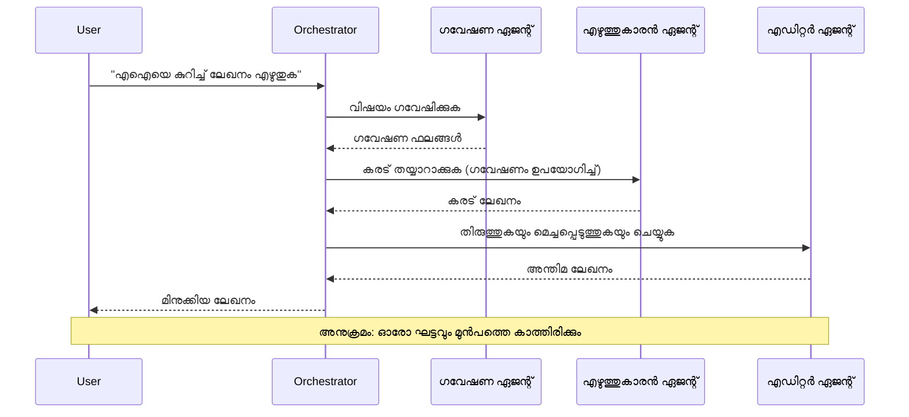
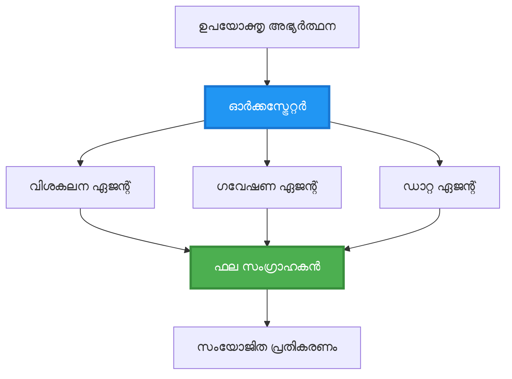
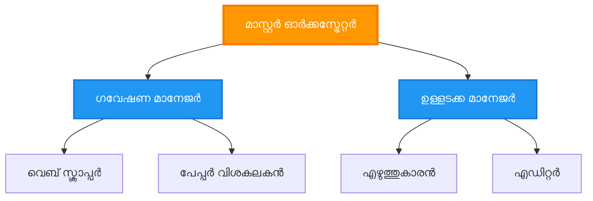
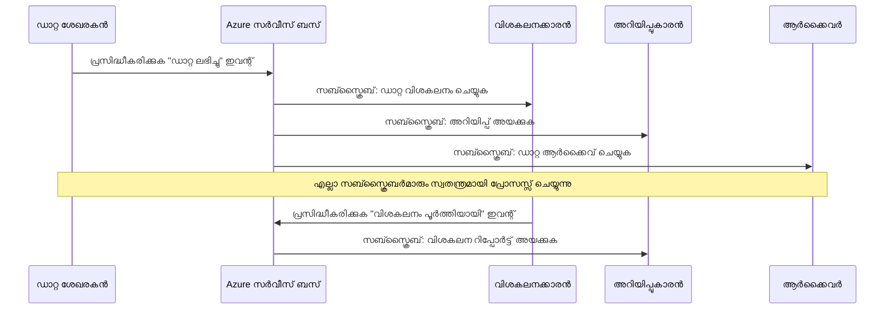
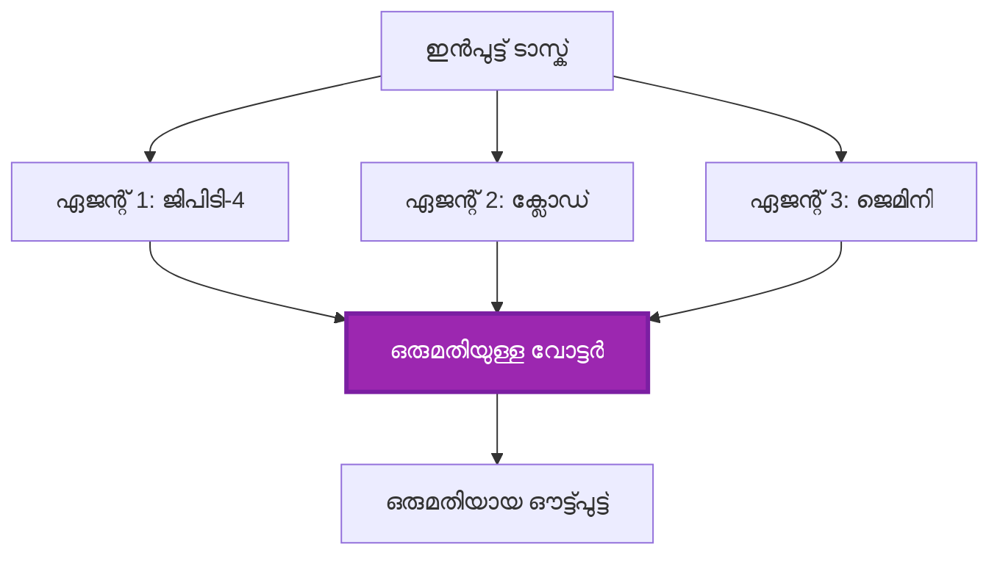
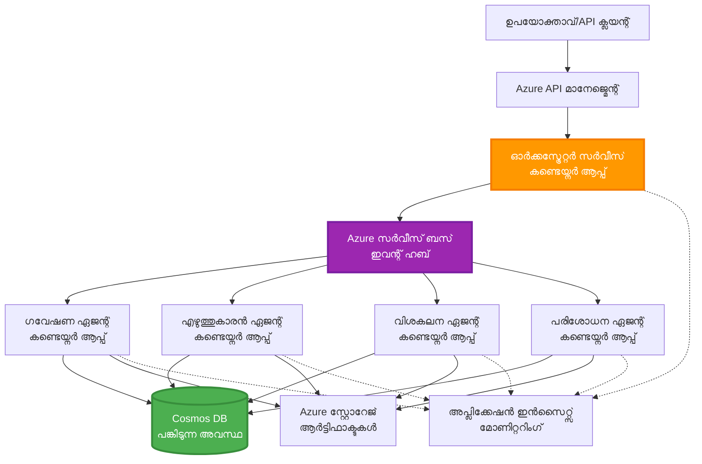

<!--
CO_OP_TRANSLATOR_METADATA:
{
  "original_hash": "bcefbd5d0107691ef3e6e33ba694d6f4",
  "translation_date": "2025-11-24T22:57:27+00:00",
  "source_file": "docs/pre-deployment/coordination-patterns.md",
  "language_code": "ml"
}
-->
# മൾട്ടി-ഏജന്റ് കോർഡിനേഷൻ പാറ്റേൺസ്

⏱️ **അനുമാനിച്ച സമയം**: 60-75 മിനിറ്റ് | 💰 **അനുമാനിച്ച ചെലവ്**: ~$100-300/മാസം | ⭐ **സങ്കീർണ്ണത**: അഡ്വാൻസ്ഡ്

**📚 പഠന പാത:**
- ← മുൻപുള്ളത്: [ക്ഷമതാ പ്ലാനിംഗ്](capacity-planning.md) - റിസോഴ്സ് സൈസിംഗ്, സ്കെയിലിംഗ് തന്ത്രങ്ങൾ
- 🎯 **നിങ്ങൾ ഇവിടെ**: മൾട്ടി-ഏജന്റ് കോർഡിനേഷൻ പാറ്റേൺസ് (ഓർക്കസ്ട്രേഷൻ, കമ്മ്യൂണിക്കേഷൻ, സ്റ്റേറ്റ് മാനേജ്മെന്റ്)
- → അടുത്തത്: [SKU തിരഞ്ഞെടുപ്പ്](sku-selection.md) - ശരിയായ Azure സേവനങ്ങൾ തിരഞ്ഞെടുക്കൽ
- 🏠 [കോഴ്‌സ് ഹോം](../../README.md)

---

## നിങ്ങൾ പഠിക്കുന്നതെന്താണ്

ഈ പാഠം പൂർത്തിയാക്കുന്നതിലൂടെ, നിങ്ങൾ:
- **മൾട്ടി-ഏജന്റ് ആർക്കിടെക്ചർ** പാറ്റേൺസും അവ ഉപയോഗിക്കേണ്ട സമയവും മനസ്സിലാക്കുക
- **ഓർക്കസ്ട്രേഷൻ പാറ്റേൺസുകൾ** (സെൻട്രലൈസ്ഡ്, ഡെസൻട്രലൈസ്ഡ്, ഹയർആർക്കിക്കൽ) നടപ്പിലാക്കുക
- **ഏജന്റ് കമ്മ്യൂണിക്കേഷൻ** തന്ത്രങ്ങൾ രൂപകൽപ്പന ചെയ്യുക (സിങ്ക്രോണസ്, അസിങ്ക്രോണസ്, ഇവന്റ്-ഡ്രിവൻ)
- **ഡിസ്ട്രിബ്യൂട്ടഡ് ഏജന്റുകൾക്കിടയിൽ ഷെയർ ചെയ്ത സ്റ്റേറ്റ്** മാനേജ് ചെയ്യുക
- AZD ഉപയോഗിച്ച് **മൾട്ടി-ഏജന്റ് സിസ്റ്റങ്ങൾ** Azure-ൽ ഡിപ്ലോയ് ചെയ്യുക
- യഥാർത്ഥ AI സീനാരിയോകൾക്കായി **കോർഡിനേഷൻ പാറ്റേൺസുകൾ** പ്രയോഗിക്കുക
- **ഡിസ്ട്രിബ്യൂട്ടഡ് ഏജന്റ് സിസ്റ്റങ്ങൾ** നിരീക്ഷിക്കുകയും ഡീബഗ് ചെയ്യുകയും ചെയ്യുക

## മൾട്ടി-ഏജന്റ് കോർഡിനേഷൻ എന്തുകൊണ്ട് പ്രധാനമാണ്

### പരിണാമം: സിംഗിൾ ഏജന്റിൽ നിന്ന് മൾട്ടി-ഏജന്റിലേക്ക്

**സിംഗിൾ ഏജന്റ് (ലളിതം):**
```
User → Agent → Response
```
- ✅ മനസ്സിലാക്കാനും നടപ്പിലാക്കാനും എളുപ്പം
- ✅ ലളിതമായ ടാസ്കുകൾക്ക് വേഗത
- ❌ ഒറ്റ മോഡലിന്റെ ശേഷി മാത്രമുള്ളത്
- ❌ സങ്കീർണ്ണമായ ടാസ്കുകൾ പാരലലായി ചെയ്യാൻ കഴിയില്ല
- ❌ സ്പെഷ്യലൈസേഷൻ ഇല്ല

**മൾട്ടി-ഏജന്റ് സിസ്റ്റം (അഡ്വാൻസ്ഡ്):**
```
           ┌─────────────┐
           │ Orchestrator│
           └──────┬──────┘
        ┌─────────┼─────────┐
        │         │         │
    ┌───▼──┐  ┌──▼───┐  ┌──▼────┐
    │Agent1│  │Agent2│  │Agent3 │
    │(Plan)│  │(Code)│  │(Review)│
    └──────┘  └──────┘  └───────┘
```
- ✅ പ്രത്യേക ടാസ്കുകൾക്കായി സ്പെഷ്യലൈസ്ഡ് ഏജന്റുകൾ
- ✅ വേഗതയ്ക്കായി പാരലൽ എക്സിക്യൂഷൻ
- ✅ മോഡുലാർ, മെയിന്റെയിനബിൾ
- ✅ സങ്കീർണ്ണമായ വർക്ക്‌ഫ്ലോകളിൽ മികച്ചത്
- ⚠️ കോർഡിനേഷൻ ലജിക് ആവശ്യമാണ്

**ഉദാഹരണം**: സിംഗിൾ ഏജന്റ് എല്ലാം ചെയ്യുന്ന ഒരാൾ പോലെയാണ്. മൾട്ടി-ഏജന്റ് ഒരു ടീം പോലെയാണ്, ഓരോ അംഗത്തിനും പ്രത്യേക കഴിവുകൾ (റിസർച്ചർ, കോഡർ, റിവ്യൂവർ, റൈറ്റർ) ഉണ്ടാകുകയും ഒരുമിച്ച് പ്രവർത്തിക്കുകയും ചെയ്യുന്നു.

---

## കോർ കോർഡിനേഷൻ പാറ്റേൺസ്

### പാറ്റേൺ 1: സീക്വൻഷ്യൽ കോർഡിനേഷൻ (ചെയിൻ ഓഫ് റെസ്പോൺസിബിലിറ്റി)

**ഉപയോഗിക്കേണ്ടത്**: ടാസ്കുകൾ ഒരു പ്രത്യേക ക്രമത്തിൽ പൂർത്തിയാക്കണം, ഓരോ ഏജന്റും മുൻപത്തെ ഔട്ട്പുട്ട് ഉപയോഗിച്ച് പ്രവർത്തിക്കുന്നു.


**ലാഭങ്ങൾ:**
- ✅ വ്യക്തമായ ഡാറ്റാ ഫ്ലോ
- ✅ ഡീബഗ് ചെയ്യാൻ എളുപ്പം
- ✅ പ്രവചിക്കാവുന്ന എക്സിക്യൂഷൻ ഓർഡർ

**പരിമിതികൾ:**
- ❌ മന്ദഗതിയുള്ളത് (പാരലലിസം ഇല്ല)
- ❌ ഒരു ഫെയിലർ മുഴുവൻ ചെയിൻ തടസപ്പെടുത്തും
- ❌ പരസ്പരം ആശ്രയിക്കുന്ന ടാസ്കുകൾ കൈകാര്യം ചെയ്യാൻ കഴിയില്ല

**ഉദാഹരണങ്ങൾ:**
- ഉള്ളടക്ക നിർമ്മാണ പൈപ്പ്‌ലൈൻ (റിസർച്ച് → എഴുതുക → എഡിറ്റ് → പ്രസിദ്ധീകരിക്കുക)
- കോഡ് ജനറേഷൻ (പ്ലാൻ → നടപ്പിലാക്കുക → ടെസ്റ്റ് → ഡിപ്ലോയ്)
- റിപ്പോർട്ട് ജനറേഷൻ (ഡാറ്റാ ശേഖരണം → വിശകലനം → വിസ്വലൈസേഷൻ → സംഗ്രഹം)

---

### പാറ്റേൺ 2: പാരലൽ കോർഡിനേഷൻ (ഫാൻ-ഔട്ട്/ഫാൻ-ഇൻ)

**ഉപയോഗിക്കേണ്ടത്**: സ്വതന്ത്ര ടാസ്കുകൾ ഒരേസമയം പ്രവർത്തിക്കാം, ഫലങ്ങൾ അവസാനം സംയോജിപ്പിക്കാം.


**ലാഭങ്ങൾ:**
- ✅ വേഗത (പാരലൽ എക്സിക്യൂഷൻ)
- ✅ ഫോൾട്ട്-ടോളറന്റ് (ഭാഗിക ഫലങ്ങൾ സ്വീകര്യമാണ്)
- ✅ ഹോറിസോണ്ടൽ സ്കെയിൽ ചെയ്യുന്നു

**പരിമിതികൾ:**
- ⚠️ ഫലങ്ങൾ ക്രമരഹിതമായി എത്താം
- ⚠️ അഗ്രിഗേഷൻ ലജിക് ആവശ്യമാണ്
- ⚠️ സങ്കീർണ്ണമായ സ്റ്റേറ്റ് മാനേജ്മെന്റ്

**ഉദാഹരണങ്ങൾ:**
- മൾട്ടി-സോഴ്സ് ഡാറ്റാ ശേഖരണം (APIs + ഡാറ്റാബേസുകൾ + വെബ് സ്ക്രാപ്പിംഗ്)
- മത്സരപരമായ വിശകലനം (വിവിധ മോഡലുകൾ പരിഹാരങ്ങൾ സൃഷ്ടിക്കുന്നു, മികച്ചത് തിരഞ്ഞെടുക്കുന്നു)
- വിവർത്തന സേവനങ്ങൾ (ഒരേസമയം പല ഭാഷകളിലേക്ക് വിവർത്തനം ചെയ്യുക)

---

### പാറ്റേൺ 3: ഹയർആർക്കിക്കൽ കോർഡിനേഷൻ (മാനേജർ-വർക്കർ)

**ഉപയോഗിക്കേണ്ടത്**: സങ്കീർണ്ണമായ വർക്ക്‌ഫ്ലോകളും സബ്-ടാസ്കുകളും, ഡെലിഗേഷൻ ആവശ്യമാണ്.


**ലാഭങ്ങൾ:**
- ✅ സങ്കീർണ്ണമായ വർക്ക്‌ഫ്ലോകൾ കൈകാര്യം ചെയ്യുന്നു
- ✅ മോഡുലാർ, മെയിന്റെയിനബിൾ
- ✅ വ്യക്തമായ ഉത്തരവാദിത്ത പരിധികൾ

**പരിമിതികൾ:**
- ⚠️ കൂടുതൽ സങ്കീർണ്ണമായ ആർക്കിടെക്ചർ
- ⚠️ ഉയർന്ന ലാറ്റൻസി (വിവിധ കോർഡിനേഷൻ ലെയറുകൾ)
- ⚠️ സോഫിസ്റ്റിക്കേറ്റഡ് ഓർക്കസ്ട്രേഷൻ ആവശ്യമാണ്

**ഉദാഹരണങ്ങൾ:**
- എന്റർപ്രൈസ് ഡോക്യുമെന്റ് പ്രോസസ്സിംഗ് (ക്ലാസിഫൈ → റൂട്ട് → പ്രോസസ് → ആർക്കൈവ്)
- മൾട്ടി-സ്റ്റേജ് ഡാറ്റാ പൈപ്പ്‌ലൈൻ (ഇൻജെസ്റ്റ് → ക്ലീൻ → ട്രാൻസ്ഫോം → അനലൈസ് → റിപ്പോർട്ട്)
- സങ്കീർണ്ണമായ ഓട്ടോമേഷൻ വർക്ക്‌ഫ്ലോകൾ (പ്ലാനിംഗ് → റിസോഴ്സ് അലോക്കേഷൻ → എക്സിക്യൂഷൻ → മോണിറ്ററിംഗ്)

---

### പാറ്റേൺ 4: ഇവന്റ്-ഡ്രിവൻ കോർഡിനേഷൻ (പബ്ലിഷ്-സബ്സ്ക്രൈബ്)

**ഉപയോഗിക്കേണ്ടത്**: ഏജന്റുകൾ ഇവന്റുകൾക്ക് പ്രതികരിക്കണം, ലൂസ് കപ്പ്ലിംഗ് ആവശ്യമാണ്.


**ലാഭങ്ങൾ:**
- ✅ ഏജന്റുകൾക്കിടയിൽ ലൂസ് കപ്പ്ലിംഗ്
- ✅ പുതിയ ഏജന്റുകൾ ചേർക്കാൻ എളുപ്പം (സബ്സ്ക്രൈബ് മാത്രം)
- ✅ അസിങ്ക്രോണസ് പ്രോസസ്സിംഗ്
- ✅ റെസിലിയന്റ് (മെസേജ് പേഴ്സിസ്റ്റൻസ്)

**പരിമിതികൾ:**
- ⚠️ ഇവെഞ്ച്വൽ കൺസിസ്റ്റൻസി
- ⚠️ സങ്കീർണ്ണമായ ഡീബഗിംഗ്
- ⚠️ മെസേജ് ഓർഡറിംഗ് ചലഞ്ചുകൾ

**ഉദാഹരണങ്ങൾ:**
- റിയൽ-ടൈം മോണിറ്ററിംഗ് സിസ്റ്റങ്ങൾ (അലർട്ടുകൾ, ഡാഷ്ബോർഡുകൾ, ലോഗുകൾ)
- മൾട്ടി-ചാനൽ നോട്ടിഫിക്കേഷനുകൾ (ഇമെയിൽ, SMS, പുഷ്, Slack)
- ഡാറ്റാ പ്രോസസ്സിംഗ് പൈപ്പ്‌ലൈൻ (ഒരേ ഡാറ്റയുടെ പല ഉപഭോക്താക്കൾ)

---

### പാറ്റേൺ 5: കൺസെൻസസ്-ബേസ്ഡ് കോർഡിനേഷൻ (വോട്ടിംഗ്/ക്വോറം)

**ഉപയോഗിക്കേണ്ടത്**: മുന്നോട്ട് പോകുന്നതിന് മുമ്പ് പല ഏജന്റുകളിൽ നിന്ന് സമ്മതം ആവശ്യമാണ്.


**ലാഭങ്ങൾ:**
- ✅ ഉയർന്ന കൃത്യത (പല അഭിപ്രായങ്ങൾ)
- ✅ ഫോൾട്ട്-ടോളറന്റ് (മൈനോരിറ്റി ഫെയിലറുകൾ സ്വീകര്യമാണ്)
- ✅ ക്വാളിറ്റി അഷുറൻസ് ബിൽറ്റ്-ഇൻ

**പരിമിതികൾ:**
- ❌ ചെലവേറിയത് (പല മോഡൽ കോൾസ്)
- ❌ മന്ദഗതിയുള്ളത് (എല്ലാ ഏജന്റുകൾക്കും കാത്തിരിക്കണം)
- ⚠️ കോൺഫ്ലിക്ട് റിസല്യൂഷൻ ആവശ്യമാണ്

**ഉദാഹരണങ്ങൾ:**
- ഉള്ളടക്ക മോഡറേഷൻ (പല മോഡലുകൾ ഉള്ളടക്കം റിവ്യൂ ചെയ്യുന്നു)
- കോഡ് റിവ്യൂ (പല ലിന്ററുകൾ/അനലൈസറുകൾ)
- മെഡിക്കൽ ഡയഗ്നോസിസ് (പല AI മോഡലുകൾ, വിദഗ്ധ പരിശോധന)

---

## ആർക്കിടെക്ചർ അവലോകനം

### Azure-ൽ പൂർണ്ണ മൾട്ടി-ഏജന്റ് സിസ്റ്റം


**പ്രധാന ഘടകങ്ങൾ:**

| ഘടകം | ഉദ്ദേശ്യം | Azure സേവനം |
|-----------|---------|---------------|
| **API ഗേറ്റ്‌വേ** | എൻട്രി പോയിന്റ്, റേറ്റ് ലിമിറ്റിംഗ്, ഓത്ത് | API മാനേജ്മെന്റ് |
| **ഓർക്കസ്ട്രേറ്റർ** | ഏജന്റ് വർക്ക്‌ഫ്ലോകൾ കോർഡിനേറ്റ് ചെയ്യുന്നു | കണ്ടെയ്‌നർ ആപ്പുകൾ |
| **മെസേജ് ക്യൂ** | അസിങ്ക്രോണസ് കമ്മ്യൂണിക്കേഷൻ | സർവീസ് ബസ് / ഇവന്റ് ഹബ്സ് |
| **ഏജന്റുകൾ** | സ്പെഷ്യലൈസ്ഡ് AI വർക്കർസ് | കണ്ടെയ്‌നർ ആപ്പുകൾ / ഫംഗ്ഷനുകൾ |
| **സ്റ്റേറ്റ് സ്റ്റോർ** | ഷെയർ ചെയ്ത സ്റ്റേറ്റ്, ടാസ്ക് ട്രാക്കിംഗ് | കോസ്മോസ് DB |
| **ആർട്ടിഫാക്ട് സ്റ്റോറേജ്** | ഡോക്യുമെന്റുകൾ, ഫലങ്ങൾ, ലോഗുകൾ | ബ്ലോബ് സ്റ്റോറേജ് |
| **മോണിറ്ററിംഗ്** | ഡിസ്ട്രിബ്യൂട്ടഡ് ട്രേസിംഗ്, ലോഗുകൾ | ആപ്ലിക്കേഷൻ ഇൻസൈറ്റ്സ് |

---

## മുൻ‌പരിചയങ്ങൾ

### ആവശ്യമായ ടൂളുകൾ

```bash
# Azure Developer CLI പരിശോധിക്കുക
azd version
# ✅ പ്രതീക്ഷിച്ചത്: azd പതിപ്പ് 1.0.0 അല്ലെങ്കിൽ അതിനുമുകളിൽ

# Azure CLI പരിശോധിക്കുക
az --version
# ✅ പ്രതീക്ഷിച്ചത്: azure-cli 2.50.0 അല്ലെങ്കിൽ അതിനുമുകളിൽ

# Docker (പ്രാദേശിക പരിശോധനയ്ക്ക്) പരിശോധിക്കുക
docker --version
# ✅ പ്രതീക്ഷിച്ചത്: Docker പതിപ്പ് 20.10 അല്ലെങ്കിൽ അതിനുമുകളിൽ
```

### Azure ആവശ്യകതകൾ

- ആക്ടീവ് Azure സബ്സ്ക്രിപ്ഷൻ
- സൃഷ്ടിക്കാൻ അനുമതികൾ:
  - കണ്ടെയ്‌നർ ആപ്പുകൾ
  - സർവീസ് ബസ് നെയിംസ്‌പേസുകൾ
  - കോസ്മോസ് DB അക്കൗണ്ടുകൾ
  - സ്റ്റോറേജ് അക്കൗണ്ടുകൾ
  - ആപ്ലിക്കേഷൻ ഇൻസൈറ്റ്സ്

### അറിവ് മുൻ‌പരിചയങ്ങൾ

നിങ്ങൾ പൂർത്തിയാക്കിയിരിക്കണം:
- [കോണ്ഫിഗറേഷൻ മാനേജ്മെന്റ്](../getting-started/configuration.md)
- [ഓതന്റിക്കേഷൻ & സെക്യൂരിറ്റി](../getting-started/authsecurity.md)
- [മൈക്രോസർവീസുകൾ ഉദാഹരണം](../../../../examples/microservices)

---

## നടപ്പിലാക്കൽ ഗൈഡ്

### പ്രോജക്റ്റ് ഘടന

```
multi-agent-system/
├── azure.yaml                    # AZD configuration
├── infra/
│   ├── main.bicep               # Main infrastructure
│   ├── core/
│   │   ├── servicebus.bicep     # Message queue
│   │   ├── cosmos.bicep         # State store
│   │   ├── storage.bicep        # Artifact storage
│   │   └── monitoring.bicep     # Application Insights
│   └── app/
│       ├── orchestrator.bicep   # Orchestrator service
│       └── agent.bicep          # Agent template
└── src/
    ├── orchestrator/            # Orchestration logic
    │   ├── app.py
    │   ├── workflows.py
    │   └── Dockerfile
    ├── agents/
    │   ├── research/            # Research agent
    │   ├── writer/              # Writer agent
    │   ├── analyst/             # Analyst agent
    │   └── reviewer/            # Reviewer agent
    └── shared/
        ├── state_manager.py     # Shared state logic
        └── message_handler.py   # Message handling
```

---

## പാഠം 1: സീക്വൻഷ്യൽ കോർഡിനേഷൻ പാറ്റേൺ

### നടപ്പിലാക്കൽ: ഉള്ളടക്ക നിർമ്മാണ പൈപ്പ്‌ലൈൻ

നമുക്ക് ഒരു സീക്വൻഷ്യൽ പൈപ്പ്‌ലൈൻ നിർമ്മിക്കാം: റിസർച്ച് → എഴുതുക → എഡിറ്റ് → പ്രസിദ്ധീകരിക്കുക

### 1. AZD കോൺഫിഗറേഷൻ

**ഫയൽ: `azure.yaml`**

```yaml
name: content-pipeline
metadata:
  template: multi-agent-sequential@1.0.0

services:
  orchestrator:
    project: ./src/orchestrator
    language: python
    host: containerapp
  
  research-agent:
    project: ./src/agents/research
    language: python
    host: containerapp
  
  writer-agent:
    project: ./src/agents/writer
    language: python
    host: containerapp
  
  editor-agent:
    project: ./src/agents/editor
    language: python
    host: containerapp
```

### 2. ഇൻഫ്രാസ്ട്രക്ചർ: കോർഡിനേഷൻക്കായി സർവീസ് ബസ്

**ഫയൽ: `infra/core/servicebus.bicep`**

```bicep
param name string
param location string
param tags object = {}

resource serviceBusNamespace 'Microsoft.ServiceBus/namespaces@2022-10-01-preview' = {
  name: name
  location: location
  tags: tags
  sku: {
    name: 'Standard'
    tier: 'Standard'
  }
  properties: {
    minimumTlsVersion: '1.2'
  }
}

// Queue for orchestrator → research agent
resource researchQueue 'Microsoft.ServiceBus/namespaces/queues@2022-10-01-preview' = {
  parent: serviceBusNamespace
  name: 'research-tasks'
  properties: {
    maxDeliveryCount: 3
    lockDuration: 'PT5M'
    deadLetteringOnMessageExpiration: true
  }
}

// Queue for research agent → writer agent
resource writerQueue 'Microsoft.ServiceBus/namespaces/queues@2022-10-01-preview' = {
  parent: serviceBusNamespace
  name: 'writer-tasks'
  properties: {
    maxDeliveryCount: 3
    lockDuration: 'PT5M'
  }
}

// Queue for writer agent → editor agent
resource editorQueue 'Microsoft.ServiceBus/namespaces/queues@2022-10-01-preview' = {
  parent: serviceBusNamespace
  name: 'editor-tasks'
  properties: {
    maxDeliveryCount: 3
    lockDuration: 'PT5M'
  }
}

output namespace string = serviceBusNamespace.name
output connectionString string = listKeys('${serviceBusNamespace.id}/AuthorizationRules/RootManageSharedAccessKey', serviceBusNamespace.apiVersion).primaryConnectionString
```

### 3. ഷെയർ ചെയ്ത സ്റ്റേറ്റ് മാനേജർ

**ഫയൽ: `src/shared/state_manager.py`**

```python
from azure.cosmos import CosmosClient, PartitionKey
from datetime import datetime
import os

class StateManager:
    """Manages shared state across agents using Cosmos DB"""
    
    def __init__(self):
        endpoint = os.environ['COSMOS_ENDPOINT']
        key = os.environ['COSMOS_KEY']
        
        self.client = CosmosClient(endpoint, key)
        self.database = self.client.get_database_client('agent-state')
        self.container = self.database.get_container_client('tasks')
    
    def create_task(self, task_id: str, task_type: str, input_data: dict):
        """Create a new task"""
        task = {
            'id': task_id,
            'type': task_type,
            'status': 'pending',
            'input': input_data,
            'created_at': datetime.utcnow().isoformat(),
            'steps': []
        }
        self.container.create_item(task)
        return task
    
    def update_task_step(self, task_id: str, step_name: str, result: dict):
        """Update task with completed step"""
        task = self.container.read_item(task_id, partition_key=task_id)
        
        task['steps'].append({
            'name': step_name,
            'completed_at': datetime.utcnow().isoformat(),
            'result': result
        })
        
        self.container.replace_item(task_id, task)
        return task
    
    def complete_task(self, task_id: str, final_result: dict):
        """Mark task as complete"""
        task = self.container.read_item(task_id, partition_key=task_id)
        task['status'] = 'completed'
        task['result'] = final_result
        task['completed_at'] = datetime.utcnow().isoformat()
        self.container.replace_item(task_id, task)
        return task
    
    def get_task(self, task_id: str):
        """Retrieve task state"""
        return self.container.read_item(task_id, partition_key=task_id)
```

### 4. ഓർക്കസ്ട്രേറ്റർ സർവീസ്

**ഫയൽ: `src/orchestrator/app.py`**

```python
from flask import Flask, request, jsonify
from azure.servicebus import ServiceBusClient, ServiceBusMessage
import json
import uuid
import os
from shared.state_manager import StateManager

app = Flask(__name__)
state_manager = StateManager()

# സർവീസ് ബസ് കണക്ഷൻ
servicebus_connection_str = os.environ['SERVICEBUS_CONNECTION_STRING']
servicebus_client = ServiceBusClient.from_connection_string(servicebus_connection_str)

@app.route('/health', methods=['GET'])
def health():
    return jsonify({'status': 'healthy', 'service': 'orchestrator'})

@app.route('/create-content', methods=['POST'])
def create_content():
    """
    Sequential workflow: Research → Write → Edit → Publish
    """
    data = request.json
    topic = data.get('topic')
    
    if not topic:
        return jsonify({'error': 'Topic required'}), 400
    
    # സ്റ്റേറ്റ് സ്റ്റോറിൽ ടാസ്ക് സൃഷ്ടിക്കുക
    task_id = str(uuid.uuid4())
    task = state_manager.create_task(
        task_id=task_id,
        task_type='content_creation',
        input_data={'topic': topic}
    )
    
    # റിസർച്ച് ഏജന്റിലേക്ക് സന്ദേശം അയയ്ക്കുക (ആദ്യ ഘട്ടം)
    sender = servicebus_client.get_queue_sender('research-tasks')
    message = ServiceBusMessage(
        body=json.dumps({
            'task_id': task_id,
            'topic': topic,
            'next_queue': 'writer-tasks'  # ഫലങ്ങൾ അയയ്ക്കേണ്ട സ്ഥലം
        }),
        content_type='application/json'
    )
    
    with sender:
        sender.send_messages(message)
    
    return jsonify({
        'task_id': task_id,
        'status': 'started',
        'workflow': 'sequential',
        'steps': ['research', 'write', 'edit', 'publish'],
        'message': 'Content creation pipeline initiated'
    }), 202

@app.route('/task/<task_id>', methods=['GET'])
def get_task_status(task_id):
    """Check task status"""
    try:
        task = state_manager.get_task(task_id)
        return jsonify(task)
    except Exception as e:
        return jsonify({'error': str(e)}), 404

if __name__ == '__main__':
    app.run(host='0.0.0.0', port=8080)
```

### 5. റിസർച്ച് ഏജന്റ്

**ഫയൽ: `src/agents/research/app.py`**

```python
from azure.servicebus import ServiceBusClient, ServiceBusMessage
from openai import AzureOpenAI
import json
import os
import time
from shared.state_manager import StateManager

# ക്ലയന്റുകൾ ആരംഭിക്കുക
state_manager = StateManager()
servicebus_client = ServiceBusClient.from_connection_string(
    os.environ['SERVICEBUS_CONNECTION_STRING']
)

openai_client = AzureOpenAI(
    api_key=os.environ['AZURE_OPENAI_API_KEY'],
    api_version="2024-02-01",
    azure_endpoint=os.environ['AZURE_OPENAI_ENDPOINT']
)

def process_research_task(message_data):
    """Process research request and pass to writer"""
    task_id = message_data['task_id']
    topic = message_data['topic']
    next_queue = message_data['next_queue']
    
    print(f"🔬 Researching: {topic}")
    
    # ഗവേഷണത്തിനായി Azure OpenAI വിളിക്കുക
    response = openai_client.chat.completions.create(
        model="gpt-4",
        messages=[
            {"role": "system", "content": "You are a research assistant. Provide comprehensive research on the given topic."},
            {"role": "user", "content": f"Research this topic thoroughly: {topic}"}
        ],
        max_tokens=1500
    )
    
    research_results = response.choices[0].message.content
    
    # സ്റ്റേറ്റ് അപ്ഡേറ്റ് ചെയ്യുക
    state_manager.update_task_step(
        task_id=task_id,
        step_name='research',
        result={'research': research_results}
    )
    
    # അടുത്ത ഏജന്റിലേക്ക് (എഴുത്തുകാരൻ) അയയ്ക്കുക
    sender = servicebus_client.get_queue_sender(next_queue)
    message = ServiceBusMessage(
        body=json.dumps({
            'task_id': task_id,
            'topic': topic,
            'research': research_results,
            'next_queue': 'editor-tasks'
        }),
        content_type='application/json'
    )
    
    with sender:
        sender.send_messages(message)
    
    print(f"✅ Research complete for task {task_id}")

def main():
    """Listen to research queue"""
    receiver = servicebus_client.get_queue_receiver('research-tasks')
    
    print("🔬 Research Agent started, listening for tasks...")
    
    with receiver:
        while True:
            messages = receiver.receive_messages(max_wait_time=5)
            for message in messages:
                try:
                    message_data = json.loads(str(message))
                    process_research_task(message_data)
                    receiver.complete_message(message)
                except Exception as e:
                    print(f"❌ Error processing message: {e}")
                    receiver.abandon_message(message)

if __name__ == '__main__':
    main()
```

### 6. റൈറ്റർ ഏജന്റ്

**ഫയൽ: `src/agents/writer/app.py`**

```python
from azure.servicebus import ServiceBusClient, ServiceBusMessage
from openai import AzureOpenAI
import json
import os
from shared.state_manager import StateManager

state_manager = StateManager()
servicebus_client = ServiceBusClient.from_connection_string(
    os.environ['SERVICEBUS_CONNECTION_STRING']
)

openai_client = AzureOpenAI(
    api_key=os.environ['AZURE_OPENAI_API_KEY'],
    api_version="2024-02-01",
    azure_endpoint=os.environ['AZURE_OPENAI_ENDPOINT']
)

def process_writing_task(message_data):
    """Write article based on research"""
    task_id = message_data['task_id']
    topic = message_data['topic']
    research = message_data['research']
    next_queue = message_data['next_queue']
    
    print(f"✍️ Writing article: {topic}")
    
    # ആഴർ ഓപ്പൺഎഐ വിളിച്ച് ലേഖനം എഴുതുക
    response = openai_client.chat.completions.create(
        model="gpt-4",
        messages=[
            {"role": "system", "content": "You are a professional writer. Write engaging, well-structured articles."},
            {"role": "user", "content": f"Based on this research:\n\n{research}\n\nWrite a comprehensive article about: {topic}"}
        ],
        max_tokens=2000
    )
    
    article_draft = response.choices[0].message.content
    
    # സ്ഥിതി അപ്ഡേറ്റ് ചെയ്യുക
    state_manager.update_task_step(
        task_id=task_id,
        step_name='writing',
        result={'draft': article_draft}
    )
    
    # എഡിറ്ററിലേക്ക് അയയ്ക്കുക
    sender = servicebus_client.get_queue_sender(next_queue)
    message = ServiceBusMessage(
        body=json.dumps({
            'task_id': task_id,
            'topic': topic,
            'draft': article_draft
        }),
        content_type='application/json'
    )
    
    with sender:
        sender.send_messages(message)
    
    print(f"✅ Article draft complete for task {task_id}")

def main():
    """Listen to writer queue"""
    receiver = servicebus_client.get_queue_receiver('writer-tasks')
    
    print("✍️ Writer Agent started, listening for tasks...")
    
    with receiver:
        while True:
            messages = receiver.receive_messages(max_wait_time=5)
            for message in messages:
                try:
                    message_data = json.loads(str(message))
                    process_writing_task(message_data)
                    receiver.complete_message(message)
                except Exception as e:
                    print(f"❌ Error: {e}")
                    receiver.abandon_message(message)

if __name__ == '__main__':
    main()
```

### 7. എഡിറ്റർ ഏജന്റ്

**ഫയൽ: `src/agents/editor/app.py`**

```python
from azure.servicebus import ServiceBusClient
from openai import AzureOpenAI
import json
import os
from shared.state_manager import StateManager

state_manager = StateManager()
servicebus_client = ServiceBusClient.from_connection_string(
    os.environ['SERVICEBUS_CONNECTION_STRING']
)

openai_client = AzureOpenAI(
    api_key=os.environ['AZURE_OPENAI_API_KEY'],
    api_version="2024-02-01",
    azure_endpoint=os.environ['AZURE_OPENAI_ENDPOINT']
)

def process_editing_task(message_data):
    """Edit and finalize article"""
    task_id = message_data['task_id']
    topic = message_data['topic']
    draft = message_data['draft']
    
    print(f"📝 Editing article: {topic}")
    
    # Azure OpenAI-നെ വിളിച്ച് തിരുത്തുക
    response = openai_client.chat.completions.create(
        model="gpt-4",
        messages=[
            {"role": "system", "content": "You are an expert editor. Improve grammar, clarity, and structure."},
            {"role": "user", "content": f"Edit and improve this article:\n\n{draft}"}
        ],
        max_tokens=2000
    )
    
    final_article = response.choices[0].message.content
    
    # ജോലി പൂർത്തിയായി എന്ന് അടയാളപ്പെടുത്തുക
    state_manager.complete_task(
        task_id=task_id,
        final_result={
            'topic': topic,
            'final_article': final_article,
            'word_count': len(final_article.split())
        }
    )
    
    print(f"✅ Article finalized for task {task_id}")

def main():
    """Listen to editor queue"""
    receiver = servicebus_client.get_queue_receiver('editor-tasks')
    
    print("📝 Editor Agent started, listening for tasks...")
    
    with receiver:
        while True:
            messages = receiver.receive_messages(max_wait_time=5)
            for message in messages:
                try:
                    message_data = json.loads(str(message))
                    process_editing_task(message_data)
                    receiver.complete_message(message)
                except Exception as e:
                    print(f"❌ Error: {e}")
                    receiver.abandon_message(message)

if __name__ == '__main__':
    main()
```

### 8. ഡിപ്ലോയ് ചെയ്യുക, ടെസ്റ്റ് ചെയ്യുക

```bash
# ആരംഭിച്ച് വിന്യസിക്കുക
azd init
azd up

# ഓർക്കസ്ട്രേറ്റർ URL നേടുക
ORCHESTRATOR_URL=$(azd env get-values | grep ORCHESTRATOR_URL | cut -d '=' -f2 | tr -d '"')

# ഉള്ളടക്കം സൃഷ്ടിക്കുക
curl -X POST $ORCHESTRATOR_URL/create-content \
  -H "Content-Type: application/json" \
  -d '{"topic": "The Future of AI in Healthcare"}'
```

**✅ പ്രതീക്ഷിക്കുന്ന ഔട്ട്പുട്ട്:**
```json
{
  "task_id": "a1b2c3d4-e5f6-7890-abcd-ef1234567890",
  "status": "started",
  "workflow": "sequential",
  "steps": ["research", "write", "edit", "publish"],
  "message": "Content creation pipeline initiated"
}
```

**ടാസ്ക് പുരോഗതി പരിശോധിക്കുക:**
```bash
TASK_ID="a1b2c3d4-e5f6-7890-abcd-ef1234567890"
curl $ORCHESTRATOR_URL/task/$TASK_ID
```

**✅ പ്രതീക്ഷിക്കുന്ന ഔട്ട്പുട്ട് (പൂർത്തിയാക്കി):**
```json
{
  "id": "a1b2c3d4-e5f6-7890-abcd-ef1234567890",
  "type": "content_creation",
  "status": "completed",
  "steps": [
    {
      "name": "research",
      "completed_at": "2025-11-19T10:30:00Z",
      "result": {"research": "..."}
    },
    {
      "name": "writing",
      "completed_at": "2025-11-19T10:32:00Z",
      "result": {"draft": "..."}
    }
  ],
  "result": {
    "topic": "The Future of AI in Healthcare",
    "final_article": "...",
    "word_count": 1500
  }
}
```

---

## പാഠം 2: പാരലൽ കോർഡിനേഷൻ പാറ്റേൺ

### നടപ്പിലാക്കൽ: മൾട്ടി-സോഴ്സ് റിസർച്ച് അഗ്രിഗേറ്റർ

നമുക്ക് ഒരേസമയം പല സോഴ്സുകളിൽ നിന്ന് വിവരങ്ങൾ ശേഖരിക്കുന്ന ഒരു പാരലൽ സിസ്റ്റം നിർമ്മിക്കാം.

### പാരലൽ ഓർക്കസ്ട്രേറ്റർ

**ഫയൽ: `src/orchestrator/parallel_workflow.py`**

```python
from flask import Flask, request, jsonify
from azure.servicebus import ServiceBusClient, ServiceBusMessage
import json
import uuid
import os
from shared.state_manager import StateManager

app = Flask(__name__)
state_manager = StateManager()

servicebus_client = ServiceBusClient.from_connection_string(
    os.environ['SERVICEBUS_CONNECTION_STRING']
)

@app.route('/research-parallel', methods=['POST'])
def research_parallel():
    """
    Parallel workflow: Multiple agents work simultaneously
    """
    data = request.json
    query = data.get('query')
    
    task_id = str(uuid.uuid4())
    task = state_manager.create_task(
        task_id=task_id,
        task_type='parallel_research',
        input_data={
            'query': query,
            'agents': ['web', 'academic', 'news', 'social']
        }
    )
    
    # ഫാൻ-ഔട്ട്: എല്ലാ ഏജന്റുമാർക്കും ഒരേസമയം അയയ്ക്കുക
    agents = [
        ('web-research-queue', 'web'),
        ('academic-research-queue', 'academic'),
        ('news-research-queue', 'news'),
        ('social-research-queue', 'social')
    ]
    
    for queue_name, agent_type in agents:
        sender = servicebus_client.get_queue_sender(queue_name)
        message = ServiceBusMessage(
            body=json.dumps({
                'task_id': task_id,
                'query': query,
                'agent_type': agent_type,
                'result_queue': 'aggregation-queue'
            }),
            content_type='application/json'
        )
        
        with sender:
            sender.send_messages(message)
    
    return jsonify({
        'task_id': task_id,
        'status': 'started',
        'workflow': 'parallel',
        'agents_dispatched': 4,
        'message': 'Parallel research initiated'
    }), 202

if __name__ == '__main__':
    app.run(host='0.0.0.0', port=8080)
```

### അഗ്രിഗേഷൻ ലജിക്

**ഫയൽ: `src/agents/aggregator/app.py`**

```python
from azure.servicebus import ServiceBusClient
import json
import os
from collections import defaultdict
from shared.state_manager import StateManager

state_manager = StateManager()
servicebus_client = ServiceBusClient.from_connection_string(
    os.environ['SERVICEBUS_CONNECTION_STRING']
)

# ഓരോ ടാസ്കിനും ഫലങ്ങൾ ട്രാക്ക് ചെയ്യുക
task_results = defaultdict(list)
expected_agents = 4  # വെബ്, അക്കാദമിക്, വാർത്ത, സോഷ്യൽ

def process_result(message_data):
    """Aggregate results from parallel agents"""
    task_id = message_data['task_id']
    agent_type = message_data['agent_type']
    result = message_data['result']
    
    # ഫലം സംഭരിക്കുക
    task_results[task_id].append({
        'agent': agent_type,
        'data': result
    })
    
    print(f"📊 Received result from {agent_type} agent ({len(task_results[task_id])}/{expected_agents})")
    
    # എല്ലാ ഏജന്റുകളും പൂർത്തിയാക്കിയിട്ടുണ്ടോ എന്ന് പരിശോധിക്കുക (ഫാൻ-ഇൻ)
    if len(task_results[task_id]) == expected_agents:
        print(f"✅ All agents completed for task {task_id}. Aggregating...")
        
        # ഫലങ്ങൾ സംയോജിപ്പിക്കുക
        aggregated = {
            'query': message_data['query'],
            'sources': task_results[task_id],
            'summary': generate_summary(task_results[task_id])
        }
        
        # പൂർത്തിയാക്കി എന്ന് അടയാളപ്പെടുത്തുക
        state_manager.complete_task(task_id, aggregated)
        
        # ക്ലീൻ അപ്പ്
        del task_results[task_id]
        
        print(f"✅ Aggregation complete for task {task_id}")

def generate_summary(results):
    """Generate summary from all sources"""
    summaries = [r['data'].get('summary', '') for r in results]
    return '\n\n'.join(summaries)

def main():
    """Listen to aggregation queue"""
    receiver = servicebus_client.get_queue_receiver('aggregation-queue')
    
    print("📊 Aggregator started, listening for results...")
    
    with receiver:
        while True:
            messages = receiver.receive_messages(max_wait_time=5)
            for message in messages:
                try:
                    message_data = json.loads(str(message))
                    process_result(message_data)
                    receiver.complete_message(message)
                except Exception as e:
                    print(f"❌ Error: {e}")
                    receiver.abandon_message(message)

if __name__ == '__main__':
    main()
```

**പാരലൽ പാറ്റേണിന്റെ ലാഭങ്ങൾ:**
- ⚡ **4x വേഗത** (ഏജന്റുകൾ ഒരേസമയം പ്രവർത്തിക്കുന്നു)
- 🔄 **ഫോൾട്ട്-ടോളറന്റ്** (ഭാഗിക ഫലങ്ങൾ സ്വീകര്യമാണ്)
- 📈 **സ്കെയിലബിൾ** (കൂടുതൽ ഏജന്റുകൾ എളുപ്പത്തിൽ ചേർക്കുക)

---

## പ്രായോഗിക വ്യായാമങ്ങൾ

### വ്യായാമം 1: ടൈംഔട്ട് ഹാൻഡ്ലിംഗ് ചേർക്കുക ⭐⭐ (മധ്യ)

**ലക്ഷ്യം**: അഗ്രിഗേറ്റർ മന്ദഗതിയുള്ള ഏജന്റുകൾക്കായി എക്കാലവും കാത്തിരിക്കാതിരിക്കാൻ ടൈംഔട്ട് ലജിക് നടപ്പിലാക്കുക.

**ചുവടുകൾ**:

1. **അഗ്രിഗേറ്ററിലേക്ക് ടൈംഔട്ട് ട്രാക്കിംഗ് ചേർക്കുക:**

```python
from datetime import datetime, timedelta

task_timeouts = {}  # task_id -> കാലഹരണ സമയം

def process_result(message_data):
    task_id = message_data['task_id']
    
    # ആദ്യ ഫലത്തിൽ ടൈംഔട്ട് സജ്ജമാക്കുക
    if task_id not in task_timeouts:
        task_timeouts[task_id] = datetime.utcnow() + timedelta(seconds=30)
    
    task_results[task_id].append({
        'agent': message_data['agent_type'],
        'data': message_data['result']
    })
    
    # പൂർത്തിയായോ അല്ലെങ്കിൽ സമയപരിധി കഴിഞ്ഞോ എന്ന് പരിശോധിക്കുക
    if len(task_results[task_id]) == expected_agents or \
       datetime.utcnow() > task_timeouts[task_id]:
        
        print(f"📊 Aggregating with {len(task_results[task_id])}/{expected_agents} results")
        
        aggregated = {
            'query': message_data['query'],
            'sources': task_results[task_id],
            'completed_agents': len(task_results[task_id]),
            'timed_out': len(task_results[task_id]) < expected_agents
        }
        
        state_manager.complete_task(task_id, aggregated)
        
        # ശുചീകരണം
        del task_results[task_id]
        del task_timeouts[task_id]
```

2. **കൃത്രിമമായ ഡിലേകളോടെ ടെസ്റ്റ് ചെയ്യുക:**

```python
# ഒരു ഏജന്റിൽ, മന്ദഗതിയിലുള്ള പ്രോസസ്സിംഗ് അനുകരിക്കാൻ വൈകി ചേർക്കുക
import time
time.sleep(35)  # 30 സെക്കൻഡ് ടൈംഔട്ട് കവിയുന്നു
```

3. **ഡിപ്ലോയ് ചെയ്യുക, സ്ഥിരീകരിക്കുക:**

```bash
azd deploy aggregator

# ടാസ്ക് സമർപ്പിക്കുക
curl -X POST $ORCHESTRATOR_URL/research-parallel \
  -H "Content-Type: application/json" \
  -d '{"query": "AI safety research"}'

# 30 സെക്കൻഡുകൾക്ക് ശേഷം ഫലങ്ങൾ പരിശോധിക്കുക
curl $ORCHESTRATOR_URL/task/$TASK_ID
```

**✅ വിജയത്തിന്റെ മാനദണ്ഡങ്ങൾ:**
- ✅ ടാസ്ക് 30 സെക്കൻഡിനുള്ളിൽ പൂർത്തിയാകും, ഏജന്റുകൾ പൂർത്തിയാക്കാത്ത പക്ഷം
- ✅ പ്രതികരണം ഭാഗിക ഫലങ്ങൾ സൂചിപ്പിക്കുന്നു (`"timed_out": true`)
- ✅ ലഭ്യമായ ഫലങ്ങൾ (4 ഏജന്റുകളിൽ 3) മടങ്ങി നൽകുന്നു

**സമയം**: 20-25 മിനിറ്റ്

---

### വ്യായാമം 2: റിട്രൈ ലജിക് നടപ്പിലാക്കുക ⭐⭐⭐ (അഡ്വാൻസ്ഡ്)

**ലക്ഷ്യം**: പരാജയപ്പെട്ട ഏജന്റ് ടാസ്കുകൾ സ്വയമേവ റിട്രൈ ചെയ്യുക, ഉപേക്ഷിക്കുന്നതിന് മുമ്പ്.

**ചുവടുകൾ**:

1. **ഓർക്കസ്ട്രേറ്ററിലേക്ക് റിട്രൈ ട്രാക്കിംഗ് ചേർക്കുക:**

```python
from dataclasses import dataclass
from typing import Dict

@dataclass
class RetryConfig:
    max_retries: int = 3
    backoff_seconds: int = 5

retry_counts: Dict[str, int] = {}  # സന്ദേശം_ഐഡി -> പുനർശ്രമം_എണ്ണം

def send_with_retry(queue_name: str, message_data: dict, retry_config: RetryConfig):
    """Send message with retry metadata"""
    message_id = message_data.get('message_id', str(uuid.uuid4()))
    message_data['message_id'] = message_id
    message_data['retry_count'] = retry_counts.get(message_id, 0)
    message_data['max_retries'] = retry_config.max_retries
    
    sender = servicebus_client.get_queue_sender(queue_name)
    message = ServiceBusMessage(
        body=json.dumps(message_data),
        content_type='application/json',
        message_id=message_id
    )
    
    with sender:
        sender.send_messages(message)
```

2. **ഏജന്റുകൾക്ക് റിട്രൈ ഹാൻഡ്ലർ ചേർക്കുക:**

```python
def process_with_retry(message, receiver, process_func):
    """Process message with automatic retry on failure"""
    try:
        message_data = json.loads(str(message))
        
        # സന്ദേശം പ്രോസസ്സ് ചെയ്യുക
        process_func(message_data)
        
        # വിജയകരമായി പൂർത്തിയാക്കി
        receiver.complete_message(message)
        
    except Exception as e:
        message_id = message.message_id
        retry_count = message_data.get('retry_count', 0)
        max_retries = message_data.get('max_retries', 3)
        
        if retry_count < max_retries:
            # വീണ്ടും ശ്രമിക്കുക: ഉപേക്ഷിച്ച് വർദ്ധിപ്പിച്ച എണ്ണവുമായി വീണ്ടും ക്യൂ ചെയ്യുക
            print(f"⚠️ Retry {retry_count + 1}/{max_retries} for message {message_id}")
            
            message_data['retry_count'] = retry_count + 1
            
            # വൈകിയുള്ളതോടെ അതേ ക്യൂയിലേക്ക് തിരികെ അയയ്ക്കുക
            time.sleep(5 * (retry_count + 1))  # ഗണിതശാസ്ത്രപരമായ ബാക്കോഫ്
            send_with_retry(queue_name, message_data, RetryConfig())
            
            receiver.complete_message(message)  # യഥാർത്ഥത് നീക്കം ചെയ്യുക
        else:
            # പരമാവധി ശ്രമങ്ങൾ കവിഞ്ഞു - ഡെഡ് ലെറ്റർ ക്യൂയിലേക്ക് മാറ്റുക
            print(f"❌ Max retries exceeded for message {message_id}")
            receiver.dead_letter_message(
                message,
                reason="MaxRetriesExceeded",
                error_description=str(e)
            )
```

3. **ഡെഡ് ലെറ്റർ ക്യൂ നിരീക്ഷിക്കുക:**

```python
def monitor_dead_letters():
    """Check dead letter queue for failed messages"""
    receiver = servicebus_client.get_queue_receiver(
        'research-queue',
        sub_queue='deadletter'
    )
    
    with receiver:
        messages = receiver.receive_messages(max_wait_time=5)
        for message in messages:
            print(f"☠️ Dead letter: {message.message_id}")
            print(f"Reason: {message.dead_letter_reason}")
            print(f"Description: {message.dead_letter_error_description}")
```

**✅ വിജയത്തിന്റെ മാനദണ്ഡങ്ങൾ:**
- ✅ പരാജയപ്പെട്ട ടാസ്കുകൾ സ്വയമേവ റിട്രൈ ചെയ്യുന്നു (3 തവണ വരെ)
- ✅ റിട്രൈകൾക്കിടയിൽ എക്സ്പോനൻഷ്യൽ ബാക്കോഫ് (5s, 10s, 15s)
- ✅ പരമാവധി റിട്രൈകൾക്കുശേഷം, മെസേജുകൾ ഡെഡ് ലെറ്റർ ക്യൂവിലേക്ക് പോകുന്നു
- ✅ ഡെഡ് ലെറ്റർ ക്യൂ നിരീക്ഷിക്കുകയും, റിപ്ലേ ചെയ്യുകയും ചെയ്യാം

**സമയം**: 30-40 മിനിറ്റ്

---

### വ്യായാമം 3
## പ്രശ്ന പരിഹാര മാർഗ്ഗങ്ങൾ

### പ്രശ്നം: സന്ദേശങ്ങൾ ക്യൂവിൽ കുടുങ്ങുന്നു

**ലക്ഷണങ്ങൾ:**
- സന്ദേശങ്ങൾ ക്യൂവിൽ കൂടുന്നു
- ഏജന്റുകൾ പ്രോസസ്സ് ചെയ്യുന്നില്ല
- ടാസ്ക് സ്റ്റാറ്റസ് "pending" ആയി നിൽക്കുന്നു

**നിരീക്ഷണം:**
```bash
# ക്യൂ ഡെപ്ത് പരിശോധിക്കുക
az servicebus queue show \
  --namespace-name mybus \
  --name research-tasks \
  --query "countDetails"

# ഏജന്റിന്റെ ആരോഗ്യം പരിശോധിക്കുക
azd logs research-agent --tail 50
```

**പരിഹാരങ്ങൾ:**

1. **ഏജന്റ് റെപ്ലിക്കകൾ വർദ്ധിപ്പിക്കുക:**
   ```bash
   az containerapp update \
     --name research-agent \
     --min-replicas 3 \
     --max-replicas 10
   ```

2. **ഡെഡ് ലെറ്റർ ക്യൂ പരിശോധിക്കുക:**
   ```bash
   az servicebus queue show \
     --namespace-name mybus \
     --name research-tasks \
     --query "countDetails.deadLetterMessageCount"
   ```

---

### പ്രശ്നം: ടാസ്ക് ടൈംഔട്ട്/പൂർത്തിയാകുന്നില്ല

**ലക്ഷണങ്ങൾ:**
- ടാസ്ക് സ്റ്റാറ്റസ് "in_progress" ആയി തുടരുന്നു
- ചില ഏജന്റുകൾ പൂർത്തിയാക്കുന്നു, ചിലർ പൂർത്തിയാക്കുന്നില്ല
- എറർ സന്ദേശങ്ങൾ ഇല്ല

**നിരീക്ഷണം:**
```bash
# ടാസ്ക് നില പരിശോധിക്കുക
curl $ORCHESTRATOR_URL/task/$TASK_ID

# ആപ്ലിക്കേഷൻ ഇൻസൈറ്റ്സ് പരിശോധിക്കുക
# ക്വറി പ്രവർത്തിപ്പിക്കുക: traces | where customDimensions.task_id == "..."
```

**പരിഹാരങ്ങൾ:**

1. **അഗ്രിഗേറ്ററിൽ ടൈംഔട്ട് നടപ്പിലാക്കുക (Exercise 1)**

2. **ഏജന്റ് തകരാറുകൾ പരിശോധിക്കുക:**
   ```bash
   azd logs --follow | grep "ERROR\|FAIL"
   ```

3. **എല്ലാ ഏജന്റുകളും പ്രവർത്തിക്കുന്നുണ്ടെന്ന് ഉറപ്പാക്കുക:**
   ```bash
   az containerapp list \
     --resource-group rg-agents \
     --query "[].{name:name, status:properties.runningStatus}"
   ```

---

## കൂടുതൽ പഠിക്കുക

### ഔദ്യോഗിക ഡോക്യുമെന്റേഷൻ
- [Azure Service Bus](https://learn.microsoft.com/azure/service-bus-messaging/service-bus-messaging-overview)
- [Cosmos DB](https://learn.microsoft.com/azure/cosmos-db/introduction)
- [Container Apps DAPR](https://learn.microsoft.com/azure/container-apps/dapr-overview)
- [Multi-Agent Design Patterns](https://learn.microsoft.com/azure/architecture/guide/ai/multi-agent-systems)

### ഈ കോഴ്സിലെ അടുത്ത ഘട്ടങ്ങൾ
- ← മുൻപ്: [Capacity Planning](capacity-planning.md)
- → അടുത്തത്: [SKU Selection](sku-selection.md)
- 🏠 [കോഴ്സ് ഹോം](../../README.md)

### ബന്ധപ്പെട്ട ഉദാഹരണങ്ങൾ
- [Microservices Example](../../../../examples/microservices) - സർവീസ് കമ്മ്യൂണിക്കേഷൻ പാറ്റേണുകൾ
- [Azure OpenAI Example](../../../../examples/azure-openai-chat) - AI ഇന്റഗ്രേഷൻ

---

## സംഗ്രഹം

**നിങ്ങൾ പഠിച്ചതാണ്:**
- ✅ അഞ്ച് കോർഡിനേഷൻ പാറ്റേണുകൾ (sequential, parallel, hierarchical, event-driven, consensus)
- ✅ Azure-ൽ മൾട്ടി-ഏജന്റ് ആർക്കിടെക്ചർ (Service Bus, Cosmos DB, Container Apps)
- ✅ വിതരണ ഏജന്റുകൾക്കിടയിൽ സ്റ്റേറ്റ് മാനേജ്മെന്റ്
- ✅ ടൈംഔട്ട് ഹാൻഡ്ലിംഗ്, റിട്രൈകൾ, സർക്യൂട്ട് ബ്രേക്കറുകൾ
- ✅ വിതരണ സിസ്റ്റങ്ങൾ നിരീക്ഷിക്കുകയും ഡീബഗ് ചെയ്യുകയും ചെയ്യുക
- ✅ ചെലവ് ഓപ്റ്റിമൈസേഷൻ തന്ത്രങ്ങൾ

**പ്രധാനമായ കാര്യങ്ങൾ:**
1. **ശരിയായ പാറ്റേൺ തിരഞ്ഞെടുക്കുക** - ഓർഡർ ചെയ്ത വർക്ക്‌ഫ്ലോകൾക്കായി Sequential, വേഗത്തിനായി Parallel, ഫ്ലെക്സിബിലിറ്റിക്കായി Event-driven
2. **സ്റ്റേറ്റ് ശ്രദ്ധാപൂർവം മാനേജുചെയ്യുക** - Cosmos DB അല്ലെങ്കിൽ സമാനമായത് ഉപയോഗിക്കുക
3. **തകരാറുകൾ നന്നായി കൈകാര്യം ചെയ്യുക** - ടൈംഔട്ട്, റിട്രൈകൾ, സർക്യൂട്ട് ബ്രേക്കറുകൾ, ഡെഡ് ലെറ്റർ ക്യൂകൾ
4. **എല്ലാം നിരീക്ഷിക്കുക** - വിതരണ ട്രേസിംഗ് ഡീബഗിംഗിനായി അനിവാര്യമാണ്
5. **ചെലവ് ഓപ്റ്റിമൈസ് ചെയ്യുക** - സ്കെയിൽ ടു സീറോ, സർവർലെസ് ഉപയോഗിക്കുക, കാഷിംഗ് നടപ്പിലാക്കുക

**അടുത്ത ഘട്ടങ്ങൾ:**
1. പ്രായോഗിക അഭ്യാസങ്ങൾ പൂർത്തിയാക്കുക
2. നിങ്ങളുടെ ഉപയോഗത്തിനായി ഒരു മൾട്ടി-ഏജന്റ് സിസ്റ്റം നിർമ്മിക്കുക
3. [SKU Selection](sku-selection.md) പഠിച്ച് പ്രകടനവും ചെലവും ഓപ്റ്റിമൈസ് ചെയ്യുക

---

<!-- CO-OP TRANSLATOR DISCLAIMER START -->
**അറിയിപ്പ്**:  
ഈ രേഖ AI വിവർത്തന സേവനമായ [Co-op Translator](https://github.com/Azure/co-op-translator) ഉപയോഗിച്ച് വിവർത്തനം ചെയ്തതാണ്. ഞങ്ങൾ കൃത്യതയ്ക്കായി ശ്രമിക്കുന്നുവെങ്കിലും, ഓട്ടോമേറ്റഡ് വിവർത്തനങ്ങളിൽ പിഴവുകൾ അല്ലെങ്കിൽ തെറ്റായ വിവരങ്ങൾ ഉണ്ടാകാൻ സാധ്യതയുണ്ട്. അതിന്റെ സ്വാഭാവിക ഭാഷയിലുള്ള മൂല രേഖയാണ് പ്രാമാണികമായ ഉറവിടമായി പരിഗണിക്കേണ്ടത്. നിർണായകമായ വിവരങ്ങൾക്ക്, പ്രൊഫഷണൽ മനുഷ്യ വിവർത്തനം ശുപാർശ ചെയ്യുന്നു. ഈ വിവർത്തനം ഉപയോഗിച്ച് ഉണ്ടാകുന്ന തെറ്റിദ്ധാരണകൾക്കോ തെറ്റായ വ്യാഖ്യാനങ്ങൾക്കോ ഞങ്ങൾ ഉത്തരവാദികളല്ല.
<!-- CO-OP TRANSLATOR DISCLAIMER END -->