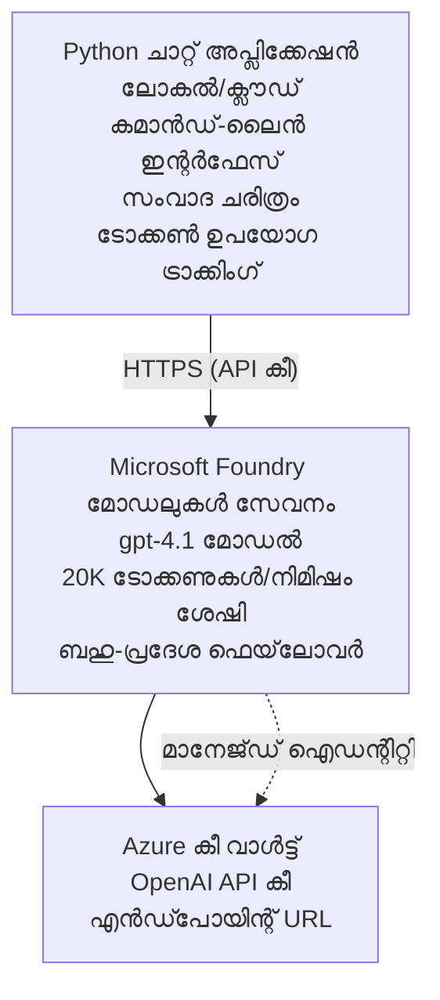

# Microsoft Foundry മോഡലുകൾ ചാറ്റ് അപ്ലിക്കേഷൻ

**Learning Path:** Intermediate ⭐⭐ | **സമയം:** 35-45 മിനിറ്റ് | **വില:** $50-200/മാസം

Azure Developer CLI (azd) ഉപയോഗിച്ച് വിന്യസിച്ച Microsoft Foundry മോഡലുകളുടെ പരിപൂർണ്ണമായ ചാറ്റ് അപ്ലിക്കേഷൻ. ഈ ഉദാഹരണം gpt-4.1 വിന്യസിക്കൽ, സുരക്ഷിത API ആക്‌സസ്, തുടങ്ങി ഒരു ലളിതമായ ചാറ്റ് ഇന്റർഫേസ് കാണിക്കുന്നു.

## 🎯 നിങ്ങൾ പഠിക്കാനിരിക്കുന്നതു

- gpt-4.1 മോഡലുമായി Microsoft Foundry Models സേവനം വിന്യസിക്കുക  
- Key Vault ഉപയോഗിച്ച് OpenAI API കീകൾ സുരക്ഷിതമാക്കുക  
- Python ഉപയോഗിച്ച് ലളിതമായ ചാറ്റ് ഇന്റർഫേസ് ഉണ്ടാക്കുക  
- ടോക്കൺ ഉപയോഗവും ചെലവും നിരീക്ഷിക്കുക  
- റേറ്റ് ലിമിറ്റിംഗ്, പിഴവ് കൈകാര്യം എന്നിവ നടപ്പിലാക്കുക  

## 📦 ഉൾപ്പെടുന്നത്

✅ **Microsoft Foundry Models സേവനം** - gpt-4.1 മോഡൽ വിന്യസിക്കൽ  
✅ **Python ചാറ്റ് ആപ്പ്** - ലളിതമായ കമാൻഡ് ലൈൻ ചാറ്റ് ഇന്റർഫേസ്  
✅ **Key Vault ലയനം** - API കീ സുരക്ഷിത സംഭരണം  
✅ **ARM ടെംപ്ലേറ്റുകൾ** - പൂർണ്ണം ഇൻഫ്രാസ്ട്രക്ചർ പോലുള്ള കോഡ്  
✅ **ചെലവ് നിരീക്ഷണം** - ടോക്കൺ ഉപയോഗം ട്രാക്കിംഗ്  
✅ **റേറ്റ് ലിമിറ്റിംഗ്** - സ്വഭാവപരിധി തുടർച്ച തടയൽ  

## ആർക്കിടെക്ചർ


## മുൻവിധികൾ

### ആവശ്യങ്ങൾ

- **Azure Developer CLI (azd)** - [സ്ഥാപന മാർഗ്ഗനിർദ്ദേശം](https://learn.microsoft.com/azure/developer/azure-developer-cli/install-azd)  
- OpenAI ആക്‌സസുള്ള **Azure സബ്സ്ക്രിപ്ഷൻ** - [ആക്‌സസ് അഭ്യർത്ഥിക്കുക](https://aka.ms/oai/access)  
- **Python 3.9+** - [Python ഇൻസ്റ്റാൾ ചെയ്യുക](https://www.python.org/downloads/)  

### മുൻവിധികൾ പരിശോധിക്കുക

```bash
# azd പതിപ്പ് പരിശോധിക്കുക (1.5.0 അല്ലെങ്കിൽ മുകളിലായി ആവശ്യം)
azd version

# Azure ലോഗിൻ സ്ഥിരീകരിക്കുക
azd auth login

# Python പതിപ്പ് പരിശോധിക്കുക
python --version  # അല്ലെങ്കിൽ python3 --version

# OpenAI ആക്‌സസ് സ്ഥിരീകരിക്കുക (Azure പോർട്ടലിൽ പരിശോധിക്കുക)
az cognitiveservices account list-skus \
  --kind OpenAI \
  --location eastus
```

> **⚠️ പ്രധാനപ്പെട്ടതു:** Microsoft Foundry മോഡലുകൾ ആപ്ലിക്കേഷൻ അംഗീകാരം ആവശ്യമാണ്. നിങ്ങൾ അപേക്ഷിച്ചിട്ടില്ലെങ്കില് [aka.ms/oai/access](https://aka.ms/oai/access) സന്ദർശിക്കുക. അംഗീകാരം സാധാരണയായി 1-2 ബിസിനസ് ദിവസങ്ങൾ സമയമാണ്.

## ⏱️ വിന്യസിക്കൽ സമയരേഖ

| ഘട്ടം | ദൈർഘ്യം | സംഭവിക്കുന്നത് |
|-------|----------|--------------|
| മുൻവിധികൾ പരിശോധന | 2-3 മിനിറ്റ് | OpenAI കൊറ തീര്ക്കപ്പെടുന്നു എന്ന് സ്ഥിരീകരിക്കുക |
| ഇൻഫ്രാസ്ട്രക്ചർ വിന്യസിക്കുക | 8-12 മിനിറ്റ് | OpenAI, Key Vault, മോഡൽ വിന്യസിക്കൽ സൃഷ്ടിക്കുക |
| അപ്ലിക്കേഷൻ ക്രമീകരിക്കുക | 2-3 മിനിറ്റ് | പരിസ്ഥിതി, ആശ്രിതങ്ങൾ ക്രമീകരിക്കുക |
| **മൊത്തം** | **12-18 മിനിറ്റ്** | gpt-4.1 ഉപയോഗിച്ച് ചാറ്റ് തയ്യാറായി |  

**കുറിപ്പു:** ആദ്യവട്ട OpenAI വിന്യസിക്കൽ മോഡൽ പ്രൊവിഷനിംഗ് കാരണം കൂടുതലായിരിക്കും.

## ദ്രുത തുടക്കം

```bash
# ഉദാഹരണത്തിലേക്ക് നാവിഗേറ്റ് ചെയ്യുക
cd examples/azure-openai-chat

# പരിതസ്ഥിതി ഇൻഷഷ്യലൈസ് ചെയ്യുക
azd env new myopenai

# എല്ലാം വിന്യസിക്കുക (ഇൻഫ്രാസ്ട്രക്ചർ + കോൺഫിഗറേഷൻ)
azd up
# നിങ്ങളെ ചോദിക്കും:
# 1. Azure സബ്സ്ക്രിപ്ഷൻ തിരഞ്ഞെടുക്കുക
# 2. OpenAI ലഭ്യതയുള്ള ലൊക്കേഷൻ തിരഞ്ഞെടുക്കുക (ഉദാ., eastus, eastus2, westus)
# 3. വിന്യാസത്തിനായി 12-18 മിനിറ്റ് കാത്തിരിക്കുക

# Python ആശ്രിതങ്ങൾ ഇൻസ്റ്റാൾ ചെയ്യുക
pip install -r requirements.txt

# ചാറ്റ് ആരംഭിക്കുക!
python chat.py
```

**പ്രതീക്ഷിച്ച ഔട്ട്പുട്ട്:**  
```
🤖 Microsoft Foundry Models Chat Application
Connected to: gpt-4.1 (eastus)
Type your message (or 'quit' to exit)

You: Hello! Tell me about Microsoft Foundry Models.
Assistant: Microsoft Foundry Models Service provides REST API access to OpenAI's powerful language models including gpt-4.1, GPT-3.5-Turbo, and Embeddings...

[Tokens used: 145 | Estimated cost: $0.0044]
```

## ✅ വിന്യസിക്കൽ സ്ഥിരീകരിക്കുക

### ഘട്ടം 1: Azure വിഭവങ്ങൾ പരിശോധിക്കുക

```bash
# വിന്യസിച്ചിട്ടുള്ള വിഭവങ്ങൾ കാണുക
azd show

# പ്രതീക്ഷിക്കാവുന്ന ഫലം കാണിക്കുന്നു:
# - OpenAI സർവീസ്: (വിഭവം പേര്)
# - കീ വാൾട്ട്: (വിഭവം പേര്)
# - വിന്യാസം: gpt-4.1
# - സ്ഥലം: eastus (അഥവാ നിങ്ങൾ തെരഞ്ഞെടുക്കുന്ന പ്രദേശം)
```

### ഘട്ടം 2: OpenAI API പരിശോധന

```bash
# OpenAI എൻഡ്‌പോയിന്റും കീയും നേടുക
OPENAI_ENDPOINT=$(azd env get-value AZURE_OPENAI_ENDPOINT)
OPENAI_KEY=$(azd env get-value AZURE_OPENAI_API_KEY)

# API കോൾ ടെസ്റ്റ് ചെയ്യുക
curl "$OPENAI_ENDPOINT/openai/deployments/gpt-4.1/chat/completions?api-version=2024-08-01-preview" \
  -H "Content-Type: application/json" \
  -H "api-key: $OPENAI_KEY" \
  -d '{
    "messages": [{"role": "user", "content": "Say hello!"}],
    "max_tokens": 50
  }'
```

**പ്രതീക്ഷിച്ച പ്രതികരണം:**  
```json
{
  "choices": [
    {
      "message": {
        "role": "assistant",
        "content": "Hello! How can I assist you today?"
      }
    }
  ],
  "usage": {
    "prompt_tokens": 8,
    "completion_tokens": 9,
    "total_tokens": 17
  }
}
```

### ഘട്ടം 3: Key Vault ആക്‌സസ് സ്ഥിരീകരിക്കുക

```bash
# കീ വാൾട്ടിൽ രഹസ്യങ്ങൾ പട്ടിക ചെയ്യുക
KV_NAME=$(azd env get-value AZURE_KEY_VAULT_NAME)

az keyvault secret list \
  --vault-name $KV_NAME \
  --query "[].name" \
  --output table
```

**പ്രതീക്ഷിച്ച രഹസ്യങ്ങൾ:**  
- `openai-api-key`  
- `openai-endpoint`  

**വിജയ критерികൾ:**  
- ✅ gpt-4.1 ഉപയോഗിച്ച് OpenAI സേവനം വിന്യസിച്ചത്  
- ✅ API കോളിന് സാധുവായ പൂർത്തീകരണം ലഭിക്കുന്നു  
- ✅ റഹസ്യങ്ങൾ Key Vault ൽ സംഭരിച്ചിരിക്കുന്നു  
- ✅ ടോക്കൺ ഉപയോഗ നിരീക്ഷണം പ്രവർത്തിക്കുന്നു  

## പ്രോജക്ട് ഘടന

```
azure-openai-chat/
├── README.md                   ✅ This guide
├── azure.yaml                  ✅ AZD configuration
├── infra/                      ✅ Infrastructure as Code
│   ├── main.bicep             ✅ Main Bicep template
│   ├── main.parameters.json   ✅ Parameters
│   └── openai.bicep           ✅ OpenAI resource definition
├── src/                        ✅ Application code
│   ├── chat.py                ✅ Chat interface
│   ├── config.py              ✅ Configuration loader
│   └── requirements.txt       ✅ Python dependencies
└── .gitignore                  ✅ Git ignore rules
```

## അപ്ലിക്കേഷൻ ഫീചറുകൾ

### ചാറ്റ് ഇന്റർഫേസ് (`chat.py`)

ചാറ്റ് അപ്ലിക്കേഷൻ ഉൾക്കൊള്ളുന്നു:

- **സംവാദ ചരിത്രം** - സന്ദേശങ്ങളുടെ പശ്ചാത്തല വിവരങ്ങൾ നിലനിർത്തുന്നു  
- **ടോക്കൺ എണ്ണൽ** - ഉപയോഗം നിരീക്ഷിക്കുകയും ചെലവ് കണക്കാക്കുകയും ചെയ്യുന്നു  
- **പിഴവ് കൈകാര്യം** - റേറ്റ് ലിമിറ്റും API പിഴവുകളും നിസ്സങ്കടമായി കൈകാര്യം ചെയ്യുന്നു  
- **ചെലവ് കണക്കുകൂട്ടൽ** - സന്ദേശംപ്രതി യഥാർത്ഥ സമയ ചെലവ്  
- **സ്റ്റ്രീമിംഗ് പിന്തുണ** - ഐച്ഛിക സ്റ്റ്രീമിംഗ് പ്രതികരണങ്ങൾ  

### കമാൻഡുകൾ

ചാറ്റ് ചെയ്യുമ്പോൾ നിങ്ങൾക്കാകും വേണ്ടത്:  
- `quit` അല്ലെങ്കിൽ `exit` - സെഷൻ അവസാനിപ്പിക്കുക  
- `clear` - സംവാദ ചരിത്രം ശൂന്യമാക്കുക  
- `tokens` - മൊത്തം ടോക്കൺ ഉപയോഗം കാണിക്കുക  
- `cost` - കണക്കാക്കിയ മൊത്ത ചെലവ് കാണിക്കുക  

### ക്രമീകരണം (`config.py`)

പരിസ്ഥിതി വേരിയബിളുകളിൽ നിന്നുള്ള ക്രമീകരണങ്ങൾ ലോഡ് ചെയ്യുന്നു:  
```python
AZURE_OPENAI_ENDPOINT  # കീ വോൾട്ട് നിന്നും
AZURE_OPENAI_API_KEY   # കീ വോൾട്ട് നിന്നും
AZURE_OPENAI_MODEL     # മുൻനിശ്ചിതം: gpt-4.1
AZURE_OPENAI_MAX_TOKENS # മുൻനിശ്ചിതം: 800
```

## ഉപയോഗ ഉദാഹരണങ്ങൾ

### അടിസ്ഥാന ചാറ്റ്

```bash
python chat.py
```

### വ്യത്യസ്ത മോഡലുമായി ചാറ്റ്

```bash
export AZURE_OPENAI_MODEL=gpt-35-turbo
python chat.py
```

### സ്റ്റ്രീമിംഗിനോടൊപ്പം ചാറ്റ്

```bash
python chat.py --stream
```

### ഉദാഹരണ സംഭാഷണം

```
You: Explain Microsoft Foundry Models Service in 3 sentences.
Assistant: Microsoft Foundry Models Service is Microsoft Azure's cloud platform offering 
that provides access to OpenAI's powerful language models. It enables developers 
to integrate capabilities like gpt-4.1 into their applications with enterprise-grade 
security and compliance. The service includes features for content filtering, 
abuse monitoring, and responsible AI practices.

[Tokens used: 89 | Estimated cost: $0.0027]

You: What models are available?
Assistant: Microsoft Foundry Models Service offers several model families including gpt-4.1 
(most capable), GPT-3.5-Turbo (faster and cost-effective), and Embeddings models 
for vector search. Each model has different capabilities, pricing, and token limits.

[Tokens used: 67 | Estimated cost: $0.0020]

Total session: 156 tokens | $0.0047
```

## ചെലവ് മാനേജ്‌മെന്റ്

### ടോക്കൺ വില (gpt-4.1)

| മോഡൽ | എൻപുട്ട് (പ്രതി 1K ടോക്കൺ) | ഔട്ട്പുട്ട് (പ്രതി 1K ടോക്കൺ) |
|-------|-----------------------------|------------------------------|
| gpt-4.1 | $0.03 | $0.06 |
| GPT-3.5-Turbo | $0.0015 | $0.002 |

### മാസവിതരണ ചെലവ്

ഉപയോഗ മാതൃകകളുടെ അടിസ്ഥാനത്തിൽ:

| ഉപയോഗ നില | സന്ദേശങ്ങൾ/ദിവസം | ടോക്കൺ/ദിവസം | മാസ ചെലവ് |
|-------------|------------------|----------------|-----------|
| **എളുപ്പം** | 20 സന്ദേശങ്ങൾ | 3,000 ടോക്കൺ | $3-5 |
| **മധ്യസ്ഥം** | 100 സന്ദേശങ്ങൾ | 15,000 ടോക്കൺ | $15-25 |
| **ഭാരമുള്ളത്** | 500 സന്ദേശങ്ങൾ | 75,000 ടോക്കൺ | $75-125 |

**അടിസ്ഥാന ഇൻഫ്രാസ്ട്രക്ചർ ചെലവ്:** $1-2/മാസം (Key Vault + കുറഞ്ഞ കംപ്യൂട്ട്)  

### ചെലവ് കുറച്ചെടുക്കാനുള്ള നിർദ്ദേശങ്ങൾ

```bash
# 1. ലഘുഭാരിതമായ പ്രവൃത്തികൾക്കായി GPT-3.5-ടർബോ ഉപയോഗിക്കുക (20x ചെലവുകുറഞ്ഞത്)
export AZURE_OPENAI_MODEL=gpt-35-turbo

# 2. ചെറുതും സംക്ഷിപ്തവുമായ മറുപടികൾക്കായി പരമാവധി ടോക്കൺുകൾ കുറയ്ക്കുക
export AZURE_OPENAI_MAX_TOKENS=400

# 3. ടോക്കൺ ഉപയോഗം നിരീക്ഷിക്കുക
python chat.py --show-tokens

# 4. ബഡ്ജറ്റ് മുന്നറിയിപ്പുകൾ ക്രമീകരിക്കുക
az consumption budget create \
  --budget-name "openai-budget" \
  --amount 50 \
  --time-grain Monthly
```

## നിരീക്ഷണം

### ടോക്കൺ ഉപയോഗ കാണുക

```bash
# ആസൂർ പോർട്ടലിൽ:
# OpenAI വിഭവം → മീറ്റ്രിക്ക്സ് → "ടോക്കൺ ട്രാൻസാക്ഷൻ" തിരഞ്ഞെടുക്കുക

# അല്ലെങ്കിൽ ആസൂർ CLI വഴി:
az monitor metrics list \
  --resource $(azd env get-value AZURE_OPENAI_RESOURCE_ID) \
  --metric "TokenTransaction" \
  --start-time $(date -u -d '1 hour ago' '+%Y-%m-%dT%H:%M:%S') \
  --interval PT1M
```

### API ലോഗുകൾ കാണുക

```bash
# ഡയഗ്നോസ്റ്റിക് ലോഗുകൾ സ്ട്രീം ചെയ്യുക
az monitor diagnostic-settings create \
  --resource $(azd env get-value AZURE_OPENAI_RESOURCE_ID) \
  --name openai-logs \
  --logs '[{"category": "Audit", "enabled": true}]' \
  --workspace $(azd env get-value LOG_ANALYTICS_WORKSPACE_ID)

# ക്വറി ലോഗുകൾ
az monitor log-analytics query \
  --workspace $(azd env get-value LOG_ANALYTICS_WORKSPACE_ID) \
  --analytics-query "AzureDiagnostics | where Category == 'Audit' | top 10 by TimeGenerated"
```

## പ്രശ്നപരിഹാരം

### പ്രശ്നം: "Access Denied" പിഴവ്

**ലക്ഷണങ്ങൾ:** API കോളിൽ 403 ഫോർബിഡൻ

**പരിഹാരങ്ങൾ:**  
```bash
# 1. OpenAI ആക്‌സസ് അംഗീകരിച്ചിട്ടുണ്ടെന്ന് സ്ഥിരീകരിക്കുക
az cognitiveservices account show \
  --name $(azd env get-value AZURE_OPENAI_NAME) \
  --resource-group $(azd env get-value AZURE_RESOURCE_GROUP)

# 2. API കീ ശരിയാണെന്ന് പരിശോധിക്കുക
azd env get-value AZURE_OPENAI_API_KEY

# 3. എൻഡ്പോയിന്റ് URL ഫോർമാറ്റ് ശരിയാണെന്ന് പരിശോധിക്കുക
azd env get-value AZURE_OPENAI_ENDPOINT
# ഇതിനായി വേണം: https://[name].openai.azure.com/
```

### പ്രശ്നം: "Rate Limit Exceeded"

**ലക്ഷണങ്ങൾ:** 429 വളരെ അധികം അഭ്യർത്ഥനകൾ

**പരിഹാരങ്ങൾ:**  
```bash
# 1. നിലവിലെ ക്വോട്ട പരിശോധിക്കുക
az cognitiveservices account deployment show \
  --name $(azd env get-value AZURE_OPENAI_NAME) \
  --resource-group $(azd env get-value AZURE_RESOURCE_GROUP) \
  --deployment-name gpt-4.1

# 2. ക്വോട്ട വർധിപ്പിക്കൽ ആവശ്യമായെങ്കിൽ അഭ്യർത്ഥിക്കുക
# ആഴർ പോർട്ടലിലേക്ക് പോകുക → OpenAI റിസോഴ്‌സ് → ക്വോട്ടകൾ → വർധിപ്പിക്കൽ അഭ്യർത്ഥിക്കുക

# 3. റിട്രൈ ലോജിക് നടപ്പാക്കുക (ഇതുവരെ chat.py-യിൽ ഉണ്ട്)
# ആപ്ലിക്കേഷൻ സ്വയം എക്‌സ്‌പൊണൻഷ്യൽ ബാക്കോഫ് ഉപയോഗിച്ച് പുനരയത try ചെയ്തു
```

### പ്രശ്നം: "Model Not Found"

**ലക്ഷണങ്ങൾ:** വിന്യസിക്കുമ്പോൾ 404 പിഴവ്

**പരിഹാരങ്ങൾ:**  
```bash
# 1. ലഭ്യമായ ഡിപ്ലോയ്മെന്റുകൾ പട്ടികപ്പരമായിരിക്കുക
az cognitiveservices account deployment list \
  --name $(azd env get-value AZURE_OPENAI_NAME) \
  --resource-group $(azd env get-value AZURE_RESOURCE_GROUP)

# 2. പരിസ്ഥിതിയിൽ മോഡൽ നാമം സ്ഥിരീകരിക്കുക
echo $AZURE_OPENAI_MODEL

# 3. ശരിയായ ഡിപ്ലോയ്മെന്റ് നാമത്തിൽ അപ്ഡേറ്റ് ചെയ്യുക
export AZURE_OPENAI_MODEL=gpt-4.1  # അല്ലെങ്കില്‍ gpt-35-turbo
```

### പ്രശ്നം: ഉയർന്ന ലേറ്റൻസി

**ലക്ഷണങ്ങൾ:** പ്രതികരണ സമയം മന്ദഗതിയിലുള്ളത് (>5 സെക്കൻഡ്)

**പരിഹാരങ്ങൾ:**  
```bash
# 1. പ്രാദേശിക ലാറ്റൻസി പരിശോധിക്കുക
# ഉപഭോക്താക്കളുടെ അടുത്തുള്ള പ്രദേശം ഡിപ്ലോയ് ചെയ്യുക

# 2. വേഗത്തിലുള്ള പ്രതികരണത്തിനായി max_tokens കുറക്കുക
export AZURE_OPENAI_MAX_TOKENS=400

# 3. നല്ല UX-ക്കായി സ്ട്രീമിംഗ് ഉപയോഗിക്കുക
python chat.py --stream
```

## സുരക്ഷാ മികച്ച പ്രാക്ടീസുകൾ

### 1. API കീകൾ സംരക്ഷിക്കുക

```bash
# കീകൾ സോഴ്‌സ് കൺട്രോളിലേക്ക് ഒരിക്കലും സമർപ്പിക്കരുത്
# കീ വാൾട്ട് ഉപയോഗിക്കൂ (മുമ്പ് ക്രമീകരിച്ചിരിക്കുന്നു)

# കീകൾ pravidhamayi മടക്കുക
az cognitiveservices account keys regenerate \
  --name $(azd env get-value AZURE_OPENAI_NAME) \
  --resource-group $(azd env get-value AZURE_RESOURCE_GROUP) \
  --key-name key1
```

### 2. ഉള്ളടക്കം ഫിൽറ്ററിംഗ് നടപ്പിലാക്കുക

```python
# Microsoft Foundry മോഡലുകൾ നിർമ്മിച്ച ഉൾക്കൊള്ളുന്ന ഉള്ളടക്ക ഫിൽറ്ററിംഗ് ഉൾപ്പെടുന്നു
# Azure പോർട്ടലിൽ ക്രമീകരിക്കുക:
# OpenAI വിഭവം → ഉള്ളടക്ക ഫിൽട്ടറുകൾ → കസ്റ്റം ഫിൽട്ടർ സൃഷ്‌ടിക്കുക

# വിഭാഗങ്ങൾ: വെറുപ്പ്, ലൈംഗികം, ഹിംസ, സ്വയംഹാനി
# നിലകൾ: കുറഞ്ഞത്, മദ്ധ്യമം, ഉയർന്ന ഫിൽറ്ററിംഗ്
```

### 3. മാനേജ്ഡ് ഐഡന്റിറ്റി ഉപയോഗിക്കുക (ഉത്പാദനം)

```bash
# ഉത്പാദന വിന്യാസങ്ങൾക്ക്, മാനേജ് ചെയ്ത ഐഡൻറിറ്റി ഉപയോഗിക്കുക
# API കീകൾക്കുപകരം (Azureൽ ആപ്പ് ഹോസ്റ്റ് ചെയ്യേണ്ടതുണ്ട്)

# infra/openai.bicep അപ്‌ഡേറ്റ് ചെയ്യുക ഉൾപ്പെടുത്താൻ:
# identity: { type: 'SystemAssigned' }
```

## വികസനം

### പ്രാദേശികമായി നടത്തുക

```bash
# ആശ്രിതങ്ങൾ ഇൻസ്റ്റാൾ ചെയ്യുക
pip install -r src/requirements.txt

# പരിസ്ഥിതി വ്യത്യാസങ്ങൾ സജ്ജീകരിക്കുക
export AZURE_OPENAI_ENDPOINT="https://[name].openai.azure.com/"
export AZURE_OPENAI_API_KEY="your-api-key"
export AZURE_OPENAI_MODEL="gpt-4.1"

# ആപ്ലിക്കേഷൻ പ്രവർത്തിപ്പിക്കുക
python src/chat.py
```

### ടെസ്റ്റുകൾ നടത്തുക

```bash
# പരിശോധന ആശ്രിതങ്ങൾ ഇൻസ്റ്റാൾ ചെയ്യുക
pip install pytest pytest-cov

# ടെസ്റ്റുകൾ চালിക്കുക
pytest tests/ -v

# കവറേജോടുകൂടി
pytest tests/ --cov=src --cov-report=html
```

### മോഡൽ വിന്യാസം പുതുക്കുക

```bash
# വ്യത്യസ്ത മോഡൽ പതിപ്പ് വിന്യസിക്കുക
az cognitiveservices account deployment create \
  --name $(azd env get-value AZURE_OPENAI_NAME) \
  --resource-group $(azd env get-value AZURE_RESOURCE_GROUP) \
  --deployment-name gpt-35-turbo \
  --model-name gpt-35-turbo \
  --model-version "0613" \
  --model-format OpenAI \
  --sku-capacity 20 \
  --sku-name "Standard"
```

## ക്ലീൻ അപ്

```bash
# എല്ലാ ആസ്യൂർ വിഭവങ്ങളും നീക്കം ചെയ്യുക
azd down --force --purge

# ഇതാണ് നീക്കം ചെയ്യുന്നത്:
# - ഓപ്പൺഎഐ സർവീസ്
# - കീ വാൾട്ട് (90-ദിവസം സോഫ്റ്റ് ഡിലീറ്റോടെ)
# - റിസോഴ്‌സ് ഗ്രൂപ്പ്
# - എല്ലാ ഡിപ്ലോയ്‌മെന്റുകളും കോൺഫിഗറേഷനുകളും
```

## അടുത്ത ഘട്ടങ്ങൾ

### ഈ ഉദാഹരണം വിപുലീകരിക്കുക

1. **വെബ് ഇന്റർഫേസ് ചേർക്കുക** - React/Vue ഫ്രണ്ട്എൻഡ് നിർമ്മിക്കുക  
   ```bash
   # azure.yaml-ലേക്ക് ഫ്രണ്ട്‌എൻഡ് സർവീസ് ചേർക്കുക
   # Azure Static Web Apps-ലേക്ക് പ്രചരിപ്പിക്കുക
   ```

2. **RAG നടപ്പിലാക്കുക** - Azure AI Search ഉപയോഗിച്ച് ഡോക്യുമെന്റ് തിരയൽ  
   ```python
   # Azure Cognitive Search സംയോജിപ്പിക്കുക
   # ഡോ큐മെന്റുകൾ അപ്‌ലോഡ് ചെയ്ത് വെക്ടർ ഇൻഡeksi സൃഷ്‌ടിക്കുക
   ```

3. **ഫംഗ്ഷൻ കോളിംഗ് ചേർക്കുക** - ഉപകരണങ്ങളുടെ ഉപയോഗം സജ്ജമാക്കി  
   ```python
   # chat.py ൽ ഫംഗ്ഷനുകൾ നിർവ്വചിക്കുക
   # gpt-4.1 നെ പുറത്തുള്ള API കളിൽ کال് ചെയ്യാൻ അനുവദിക്കുക
   ```

4. **മൾട്ടി-മോഡൽ പിന്തുണ** - ഒരേ സമയം പല മോഡലുകളും വിന്യസിക്കുക  
   ```bash
   # gpt-35-turbo, embeddings മോഡലുകൾ ചേർക്കുക
   # മോഡൽ റൗട്ടിങ്ങ് ലാജിക്ക് നടപ്പിലാക്കുക
   ```

### ബന്ധപ്പെട്ട ഉദാഹരണങ്ങൾ

- **[Retail Multi-Agent](../retail-scenario.md)** - അതിജീവിത മൾട്ടി-ഏജന്റ് ആർക്കിടെക്ചർ  
- **[ഡാറ്റാബേസ് ആപ്പ്](../../../../examples/database-app)** - സ്ഥിരമായ സംഭരണം ചേർക്കുക  
- **[കണ്ടെയ്‌നർ ആപ്പുകൾ](../../../../examples/container-app)** - കണ്ടെയ്‌നറൈസ്ഡ് സേവനമായി വിന്യസിക്കുക  

### പഠന സ്രോതസുകൾ

- 📚 [AZD ആരംഭക്കാർക്ക് കോഴ്‌സ്](../../README.md) - പ്രധാന കോഴ്‌സ് ഹോം  
- 📚 [Microsoft Foundry മോഡലുകൾ ഡോക്യുമെന്റ്](https://learn.microsoft.com/azure/ai-services/openai/) - ഔദ്യോഗിക ഡോക്സ്  
- 📚 [OpenAI API റഫറൻസ്](https://platform.openai.com/docs/api-reference) - API വിശദാംശങ്ങൾ  
- 📚 [ജവബ്ബ് AI](https://www.microsoft.com/ai/responsible-ai) - മികച്ച പ്രാക്ടീസുകൾ  

## അധിക വിഭവങ്ങൾ

### ഡോക്യുമെന്റേഷൻ  
- **[Microsoft Foundry മോഡലുകൾ സേവനം](https://learn.microsoft.com/azure/ai-services/openai/)** - പൂർണ്ണガഗ്ഗൈഡ്  
- **[gpt-4.1 മോഡലുകൾ](https://learn.microsoft.com/azure/ai-services/openai/concepts/models)** - മോഡൽ കഴിവുകൾ  
- **[ഉള്ളടക്കം ഫിൽറ്ററിംഗ്](https://learn.microsoft.com/azure/ai-services/openai/concepts/content-filter)** - സുരക്ഷാ ഫീച്ചറുകൾ  
- **[Azure Developer CLI](https://learn.microsoft.com/azure/developer/azure-developer-cli/)** - azd റഫറൻസ്  

### ട്യൂട്ടോറിയലുകൾ  
- **[OpenAI ക്വിക്‌സ്റ്റാർട്ട്](https://learn.microsoft.com/azure/ai-services/openai/quickstart)** - ആദ്യ വിന്യസിക്കൽ  
- **[ചാറ്റ് പൂർത്തീകരണങ്ങൾ](https://learn.microsoft.com/azure/ai-services/openai/how-to/chatgpt)** - ചാറ്റ് ആപ്പുകൾ സൃഷ്ടിക്കൽ  
- **[ഫങ്ഷൻ കോളിംഗ്](https://learn.microsoft.com/azure/ai-services/openai/how-to/function-calling)** - പുരോഗമന ഫീച്ചറുകൾ  

### ടൂളുകൾ  
- **[Microsoft Foundry Models സ്റ്റുഡിയോ](https://oai.azure.com/)** - വെബ് അടിസ്ഥാനപരമായ കളിസ്ഥലം  
- **[പ്രോംപ്റ്റ് ഇഞ്ചിനീയറിംഗ് ഗൈഡ്](https://platform.openai.com/docs/guides/prompt-engineering)** - മികച്ച പ്രോംപ്റ്റ് എഴുതൽ  
- **[ടോക്കൺ കാൽക്കുലേറ്റർ](https://platform.openai.com/tokenizer)** - ടോക്കൺ ഉപയോഗം കണക്കുകൂട്ടൽ  

### സമുദായം  
- **[Azure AI Discord](https://discord.gg/azure)** - കമ്മ്യൂണിറ്റിയിൽനിന്ന് സഹായം  
- **[GitHub ചർച്ചകൾ](https://github.com/Azure-Samples/openai/discussions)** - ചോദ്യോത്തര ഫോറം  
- **[Azure ബ്ലോഗ്](https://azure.microsoft.com/blog/tag/azure-openai-service/)** - ഏറ്റവും പുതിയ അപ്‌ഡേറ്റുകൾ  

---

**🎉 വിജയമാണ്!** Microsoft Foundry മോഡലുകൾ വിന്യസിച്ച് പ്രവർത്തനക്ഷമമായ ചാറ്റ് അപ്ലിക്കേഷൻ നിർമ്മിച്ചു. gpt-4.1 ന്റെ കഴിവുകൾ പരീക്ഷിച്ച് വിവിധ പ്രോംപ്റ്റുകളും ഉപയോഗകേസുകളും പരീക്ഷിക്കുക.

**പ്രശ്നങ്ങളുണ്ടോ?** [ഇഷ്യൂ തുറക്കുക](https://github.com/microsoft/AZD-for-beginners/issues) അല്ലെങ്കിൽ [FAQ](../../resources/faq.md) പരിശോധിക്കുക

**ചെലവ് മുന്നറിയിപ്പ്:** പരീക്ഷണം കഴിഞ്ഞ് `azd down` നടത്താൻ മറക്കരുത്, അതല്ലെങ്കിൽ തുടരുന്ന ചാർജുകൾ (സജീവമായ ഉപയോഗം ഏകദേശം $50-100/മാസം) ഉണ്ടാകും.

---

<!-- CO-OP TRANSLATOR DISCLAIMER START -->
**ഡിസ്‍ക്ലെയ്‍മര്‍**:  
ഈ ഡോക്യുമെന്റ് AI വിവര്‍ത്തന സേവനം [Co-op Translator](https://github.com/Azure/co-op-translator) ഉപയോഗിച്ച് വിവര്‍ത്തനം ചെയ്തതാണ്. നാം വ്യക്തതയ്ക്കായി ശ്രമിക്കുന്നുവെങ്കിലും, സ്വയംഭാഷാന്തരീകരണത്തില്‍ പിശകുകളും തെറ്റുകളും ഉണ്ടാകാനിടയുണ്ട്. മാതൃഭാഷയിലുള്ള ആദ്യം ഡോക്യുമെന്റ് തന്നെ പ്രാധാന്യമുള്ള ഉറവിടമായി കണക്കാക്കണം. അത്യാവശ്യമുള്ള വിവരങ്ങള്‍ക്കായി പ്രൊഫഷണല്‍ മാനവ വിവര്‍ത്തനമാണ് ശുപാര്‍ശ ചെയ്തിരിക്കുന്നത്. ഈ വിവര്‍ത്തനത്തിന്റെ ഉപയോഗത്തില്‍ സൃഷ്ടിക്കുന്ന യാതൊരു തെറ്റായ ധാരണകള്‍ക്കും ഞങ്ങള്‍ ഉത്തരവാദികളല്ല.
<!-- CO-OP TRANSLATOR DISCLAIMER END -->