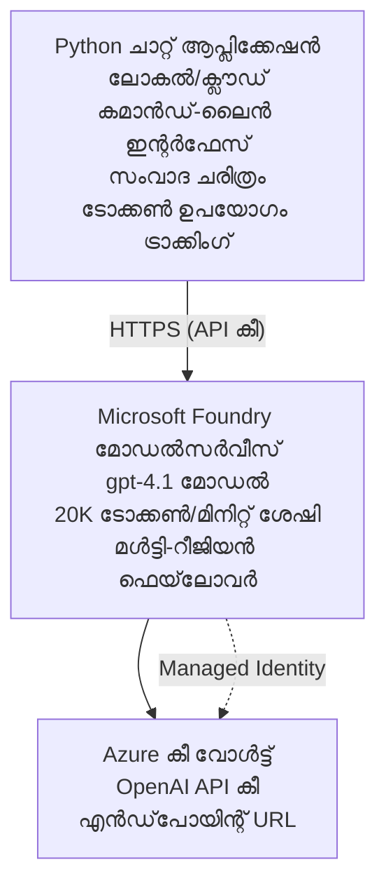

# Microsoft Foundry Models ചാറ്റ് അപ്ലിക്കേഷൻ

**പഠന പാത:** ഇട בינ ഡിയേറ്റ് ⭐⭐ | **സമയം:** 35-45 മിനിട്ട് | **ചെലവ്:** $50-200/മാസം

Azure Developer CLI (azd) ഉപയോഗിച്ച് വിന്യസിച്ച ഒരു പൂർണ്ണമായ Microsoft Foundry Models ചാറ്റ് അപ്ലിക്കേഷൻ. ഈ ഉദാഹരണം gpt-4.1 വിന്യാസം, സുരക്ഷിത API ആക്‌സസ്, ഒപ്പം എളുപ്പമുള്ള ചാറ്റ് ഇന്റർഫേസ് കാണിക്കുന്നു.

## 🎯 നിങ്ങൾ അറിയാനുള്ളത്

- gpt-4.1 മോഡലോടെ Microsoft Foundry Models സർവീസ് വിന്യസിക്കുക  
- Key Vault ഉപയോഗിച്ച് OpenAI API കീകൾ സുരക്ഷിതമാക്കുക  
- Python ഉപയോഗിച്ച് ലളിതമായ ചാറ്റ് ഇന്റർഫേസ് നിർമ്മിക്കുക  
- ടോക്കൺ ഉപയോഗവും ചെലവുകളും നിരീക്ഷിക്കുക  
- നിരക്ക് നിയന്ത്രണവും പിശക് കൈകാര്യംചെയ്യലും നടപ്പിലാക്കുക  

## 📦 ഉൾപ്പെടുത്തിയിരിക്കുന്നവ

✅ **Microsoft Foundry Models സർവീസ്** - gpt-4.1 മോഡൽ വിന്യാസം  
✅ **Python ചാറ്റ് ആപ്പ്** - ലളിതമായ കമാൻഡ്-ലൈൻ ചാറ്റ് ഇന്റർഫേസ്  
✅ **Key Vault ഇന്റഗ്രേഷൻ** - API കീ സംരക്ഷണം  
✅ **ARM ടെംപ്ലേറ്റുകൾ** - കോഡ് ആസൂത്രണമാണ് മേൽനോട്ടം  
✅ **ചെലവ് നിരീക്ഷണം** - ടോക്കൺ ഉപയോഗം ട്രാക്കിംഗ്  
✅ **നിരക്ക് നിയന്ത്രണം** - ക്വോട്ട എക്സോസ്റ്റഷൻ തടയുക  

## സാങ്കേതികഘടന



## മുൻ‌തയ്യారీ

### ആവശ്യമുള്ളവ

- **Azure Developer CLI (azd)** - [ഇൻസ്റ്റാൾ ഗൈഡ്](https://learn.microsoft.com/azure/developer/azure-developer-cli/install-azd)  
- **OpenAI ആക്‌സസ് ഉള്ള Azure സബ്സ്ക്രിപ്ഷൻ** - [ആക്‌സസ് അഭ്യർത്ഥിക്കുക](https://aka.ms/oai/access)  
- **Python 3.9+** - [Python ഇൻസ്റ്റാൾ ചെയ്യുക](https://www.python.org/downloads/)  

### മുൻ‌തയ്യാരി പരിശോധിക്കുക

```bash
# azd പതിപ്പ് പരിശോധിക്കുക (1.5.0 അല്ലെങ്കിൽ അതിനുശേഷമുള്ളത് ആവശ്യമാണ്)
azd version

# Azure ലോഗിൻ സ്ഥിരീകരിക്കുക
azd auth login

# Python പതിപ്പ് പരിശോധിക്കുക
python --version  # അല്ലെങ്കിൽ python3 --version

# OpenAI ആക്സസ് സ്ഥിരീകരിക്കുക (Azure പോർട്ടലിൽ പരിശോധിക്കുക)
az cognitiveservices account list-skus \
  --kind OpenAI \
  --location eastus
```

> **⚠️ പ്രധാനപ്പെട്ടത്:** Microsoft Foundry Models അപേക്ഷ അംഗീകാരം ആവശ്യമാണ്. അപേക്ഷിക്കാതിരുന്നാൽ [aka.ms/oai/access](https://aka.ms/oai/access) സന്ദർശിക്കുക. അംഗീകാരം സാധാരണ 1-2 ബിസിനസ് ദിവസമാണ്.

## ⏱️ വിന്യാസ സമയരേഖ

| ഘട്ടം | ദൈർഘ്യം | നടക്കുന്ന പക്ഷം |
|-------|----------|--------------|
| മുൻ‌തയ്യാരി പരിശോധന | 2-3 മിനിറ്റ് | OpenAI ക്വോട്ട ലഭ്യത പരിശോധിക്കുക |
| ഇൻഫ്രാസ്റ്റ്രക്ടർ വിന്യാസം | 8-12 മിനിറ്റ് | OpenAI, Key Vault, മോഡൽ വിന്യസിക്കുക |
| അപ്ലിക്കേഷൻ ക്രമീകരിക്കൽ | 2-3 മിനിറ്റ് | പരിസ്ഥിതി സജ്ജീകരണം, ആശ്രിതങ്ങൾ ഉണ്ടാക്കുക |
| **മൊത്തം** | **12-18 മിനിറ്റ്** | gpt-4.1 ഉപയോഗിച്ച് ചാറ്റ് ചെയ്യാൻ തയ്യാറാണ് |

**കുറിപ്പ്:** ആദ്യമായി OpenAI വിന്യാസം മോഡൽ പ്രൊവിഷനിങ്ങിനെത്തേറെ സമയം എടുക്കാം.

## ക്വിക്ക് സ്റ്റാർട്ട്

```bash
# ഉദാഹരണത്തിലേക്കു് നാവിഗേറ്റ് ചെയ്യുക
cd examples/azure-openai-chat

# പരിസ്ഥിതി ആരംഭിക്കുക
azd env new myopenai

# എല്ലാം വിന്യസിക്കുക (ഇൻഫ്രാസ്ട്രക്ചർ + കോൺഫിഗറേഷൻ)
azd up
# നിങ്ങൾക്കു് പ്രംപ്റ്റ് ചെയ്യപ്പെടും:
# 1. Azure സബ്‌സ്‌ക്രിപ്പ്ഷൻ തിരഞ്ഞെടുക്കുക
# 2. OpenAI ലഭ്യതയുള്ള സ്ഥലം തിരഞ്ഞെടുക്കുക (ഉദാ., eastus, eastus2, westus)
# 3. വിന്യസം പൂർത്തിയാക്കാൻ 12-18 മിനിറ്റ് കാത്തിരിക്കുക

# Python ആശ്രിതങ്ങൾ ഇൻസ്റ്റാൾ ചെയ്യുക
pip install -r requirements.txt

# സംഭാഷണം തുടങ്ങൂ!
python chat.py
```
  
**പ്രതീക്ഷിക്കപ്പെടുന്ന ഫലം:**  
```
🤖 Microsoft Foundry Models Chat Application
Connected to: gpt-4.1 (eastus)
Type your message (or 'quit' to exit)

You: Hello! Tell me about Microsoft Foundry Models.
Assistant: Microsoft Foundry Models Service provides REST API access to OpenAI's powerful language models including gpt-4.1, GPT-3.5-Turbo, and Embeddings...

[Tokens used: 145 | Estimated cost: $0.0044]
```
  
## ✅ വിന്യാസം പരിശോധിക്കുക

### പടി 1: Azure റിസോഴ്‌സുകൾ പരിശോധിക്കുക

```bash
# വിന്യസിച്ചിരിക്കുന്ന ഉറവിടങ്ങൾ കാണുക
azd show

# പ്രതീക്ഷിച്ച ഫലത്തിൽ കാണിക്കുന്നത്:
# - OpenAI സേവനം: (ഉറവിടം നാമം)
# - കീ വോൾട്ട്: (ഉറവിടം നാമം)
# - വിന്യാസം: gpt-4.1
# - സ്ഥലം: ഈസ്റ്റ്യുസ് (അഥവാ നിങ്ങളുടെ തിരഞ്ഞെടുക്കപ്പെട്ട പ്രദേശം)
```
  
### പടി 2: OpenAI API ടെസ്റ്റ് ചെയ്യുക

```bash
# OpenAI എണ്ട്പോയിന്റും കീയും പ്രസക്തമാക്കുക
OPENAI_ENDPOINT=$(azd env get-value AZURE_OPENAI_ENDPOINT)
OPENAI_KEY=$(azd env get-value AZURE_OPENAI_API_KEY)

# API കോൾ പരിശോധന നടത്തുക
curl "$OPENAI_ENDPOINT/openai/deployments/gpt-4.1/chat/completions?api-version=2024-08-01-preview" \
  -H "Content-Type: application/json" \
  -H "api-key: $OPENAI_KEY" \
  -d '{
    "messages": [{"role": "user", "content": "Say hello!"}],
    "max_tokens": 50
  }'
```
  
**പ്രതീക്ഷിച്ച പ്രതികരണം:**  
```json
{
  "choices": [
    {
      "message": {
        "role": "assistant",
        "content": "Hello! How can I assist you today?"
      }
    }
  ],
  "usage": {
    "prompt_tokens": 8,
    "completion_tokens": 9,
    "total_tokens": 17
  }
}
```
  
### പടി 3: Key Vault ആക്‌സസ് പരിശോധിക്കുക

```bash
# കീ വാൾട്ടിൽ രഹസ്യങ്ങൾ പട്ടികപ്പെടുത്തുക
KV_NAME=$(azd env get-value AZURE_KEY_VAULT_NAME)

az keyvault secret list \
  --vault-name $KV_NAME \
  --query "[].name" \
  --output table
```
  
**പ്രതീക്ഷിക്കുന്ന രഹസ്യങ്ങൾ:**  
- `openai-api-key`  
- `openai-endpoint`  

**വിജയ മാനദണ്ഡങ്ങൾ:**  
- ✅ gpt-4.1 ഉപയോഗിച്ച് OpenAI സർവീസ് വിന്യസിച്ചത്  
- ✅ API കോളിൽ സാധുവായ പൂർത്തീകരണം ലഭിക്കുന്നത്  
- ✅ രഹസ്യങ്ങൾ Key Vault ൽ സൂക്ഷിച്ചു  
- ✅ ടോക്കൺ ഉപയോഗ നിരീക്ഷണം പ്രവർത്തിക്കുന്നു  

## പ്രോജക്ട് ഘടന

```
azure-openai-chat/
├── README.md                   ✅ This guide
├── azure.yaml                  ✅ AZD configuration
├── infra/                      ✅ Infrastructure as Code
│   ├── main.bicep             ✅ Main Bicep template
│   ├── main.parameters.json   ✅ Parameters
│   └── openai.bicep           ✅ OpenAI resource definition
├── src/                        ✅ Application code
│   ├── chat.py                ✅ Chat interface
│   ├── config.py              ✅ Configuration loader
│   └── requirements.txt       ✅ Python dependencies
└── .gitignore                  ✅ Git ignore rules
```
  
## അപ്ലിക്കേഷൻ ഫീച്ചർസുകൾ

### ചാറ്റ് ഇന്റർഫേസ് (`chat.py`)

ചാറ്റ് അപ്ലിക്കേഷനിൽ ഉൾപ്പെട്ടിരിക്കുന്നത്:

- **സംവാദ ഹിസ്റ്ററി** - സന്ദേശങ്ങളിലെ കോണ്ടക്സ്റ്റ് നിലനിർത്തുന്നു  
- **ടോക്കൺ കണക്കുകൂട്ടൽ** - ഉപയോഗവും ചിലവ് പ്രവചനവും  
- **പിശക് കൈകാര്യംചെയ്യൽ** - നിരക്ക് നിയന്ത്രണം, API പിശകുകൾ സുഖപ്രദമായി കൈകാര്യം ചെയ്യുക  
- **ചെലവ് അളവ്** - സന്ദേശംപ്രതി യഥാർത്ഥ സമയ ചെലവ് കണക്കാക്കൽ  
- **സ്റ്റ്രീമിംഗ് പിന്തുണ** - ഓപ്ഷണൽ സ്റ്റ്രീമിംഗ് പ്രതികരണം  

### കമാൻഡുകൾ

ചാറ്റിങിനിടെ ഇവ ഉപയോഗിക്കാം:  
- `quit` അല്ലെങ്കിൽ `exit` - സെഷൻ അവസാനിപ്പിക്കുക  
- `clear` - സംവാദ ചരിത്രം ശൂന്യമാക്കുക  
- `tokens` - മൊത്തം ടോക്കൺ ഉപയോഗം കാണിക്കുക  
- `cost` - നിർദ്ദേശിച്ച മൊത്തം ചെലവ് കാണിക്കുക  

### കോൺഫിഗറേഷൻ (`config.py`)

പരിസ്ഥിതി മാറ്റികളിൽ നിന്നു കോൺഫിഗറേഷൻ ലോഡ് ചെയ്യുന്നു:  
```python
AZURE_OPENAI_ENDPOINT  # കീ വാൾട്ട് നിന്ന്
AZURE_OPENAI_API_KEY   # കീ വാൾട്ട് നിന്ന്
AZURE_OPENAI_MODEL     # സാധാരണ: gpt-4.1
AZURE_OPENAI_MAX_TOKENS # സാധാരണ: 800
```
  
## ഉപയോഗം ഉദാഹരണങ്ങൾ

### അടിസ്ഥാന ചാറ്റ്

```bash
python chat.py
```
  
### കസ്റ്റം മോഡലിൽ ചാറ്റ് ചെയ്യുക

```bash
export AZURE_OPENAI_MODEL=gpt-35-turbo
python chat.py
```
  
### സ്റ്റ്രീമിംഗ് ചാറ്റ്

```bash
python chat.py --stream
```
  
### ഉദാഹരണ സംഭാഷണം

```
You: Explain Microsoft Foundry Models Service in 3 sentences.
Assistant: Microsoft Foundry Models Service is Microsoft Azure's cloud platform offering 
that provides access to OpenAI's powerful language models. It enables developers 
to integrate capabilities like gpt-4.1 into their applications with enterprise-grade 
security and compliance. The service includes features for content filtering, 
abuse monitoring, and responsible AI practices.

[Tokens used: 89 | Estimated cost: $0.0027]

You: What models are available?
Assistant: Microsoft Foundry Models Service offers several model families including gpt-4.1 
(most capable), GPT-3.5-Turbo (faster and cost-effective), and Embeddings models 
for vector search. Each model has different capabilities, pricing, and token limits.

[Tokens used: 67 | Estimated cost: $0.0020]

Total session: 156 tokens | $0.0047
```
  
## ചെലവ് മാനേജ്മെന്റ്

### ടോക്കൺ വില (gpt-4.1)

| മോഡൽ | ഇൻപുട്ട് (1K ടോക്കൺക്ക്) | ഔട്ട്പുട്ട് (1K ടോക്കൺക്ക്) |
|-------|------------------------|--------------------------|
| gpt-4.1 | $0.03 | $0.06 |
| GPT-3.5-Turbo | $0.0015 | $0.002 |

### മാസംതോറും പ്രതീക്ഷിച്ച ചെലവ്

ഉപയോഗ മാതൃകകൾ അടിസ്ഥാനമാക്കി:  

| ഉപയോഗ നില | സന്ദേശങ്ങൾ/ദിവസം | ടോക്കണുകൾ/ദിവസം | മാസ ചെലവ് |
|-------------|-----------------|-------------------|------------|
| **ലഘു** | 20 സന്ദേശങ്ങൾ | 3,000 ടോക്കൺ | $3-5 |
| **മധ്യമ** | 100 സന്ദേശങ്ങൾ | 15,000 ടോക്കൺ | $15-25 |
| **ഭാരമുള്ളത്** | 500 സന്ദേശങ്ങൾ | 75,000 ടോക്കൺ | $75-125 |

**അടിസ്ഥാന ഇൻഫ്രാസ്റ്റ്രക്ചർ ചെലവ്:** $1-2/മാസം (Key Vault + കുറഞ്ഞ കംപ്യൂട്ട്)

### ചെലവ് ശമനത്തിനുള്ള സൂചനകൾ

```bash
# 1. ലളിതമായ പ്രവർത്തനങ്ങൾക്ക് GPT-3.5-Turbo ഉപയോഗിക്കുക (20 മടങ്ങ് കുറഞ്ഞ വില)
export AZURE_OPENAI_MODEL=gpt-35-turbo

# 2. ചുരുങ്ങിയ മറുപടികൾക്കായി പരമാവധി ടോക്കൺകൾ കുറയ്ക്കുക
export AZURE_OPENAI_MAX_TOKENS=400

# 3. ടോക്കൺ ഉപയോഗം നിരീക്ഷിക്കുക
python chat.py --show-tokens

# 4. ബജറ്റ് അലർട്ടുകൾ സജ്ജമാക്കുക
az consumption budget create \
  --budget-name "openai-budget" \
  --amount 50 \
  --time-grain Monthly
```
  
## നിരീക്ഷണം

### ടോക്കൺ ഉപയോഗം കാണുക

```bash
# അസ്യൂർ പോർട്ടലിൽ:
# OpenAI രജിസോഴ്‌സ് → മെട്രിക്ക്‌സ് → "ടോക്കൺ ട്രാൻസാക്ഷൻ" തിരഞ്ഞെടുക്കുക

# അല്ലെങ്കിൽ അസ്യൂർ CLI വഴി:
az monitor metrics list \
  --resource $(azd env get-value AZURE_OPENAI_RESOURCE_ID) \
  --metric "TokenTransaction" \
  --start-time $(date -u -d '1 hour ago' '+%Y-%m-%dT%H:%M:%S') \
  --interval PT1M
```
  
### API ലോഗുകൾ കാണുക

```bash
# ഡയഗ്നോസ്റിക് ലോഗ്‌സ് സ്ട്രീം ചെയ്യുക
az monitor diagnostic-settings create \
  --resource $(azd env get-value AZURE_OPENAI_RESOURCE_ID) \
  --name openai-logs \
  --logs '[{"category": "Audit", "enabled": true}]' \
  --workspace $(azd env get-value LOG_ANALYTICS_WORKSPACE_ID)

# ക്വറി ലോഗ്‌സ്
az monitor log-analytics query \
  --workspace $(azd env get-value LOG_ANALYTICS_WORKSPACE_ID) \
  --analytics-query "AzureDiagnostics | where Category == 'Audit' | top 10 by TimeGenerated"
```
  
## പ്രശ്‌നപരിഹാരം

### പ്രശ്‌നം: "ആക്‌സസ് നിരാകരണം" പിശക്

**ലക്ഷണങ്ങൾ:** API കോളിന് 403 Forbidden പിശക്

**പരിഹാരങ്ങൾ:**  
```bash
# 1. OpenAI ആക്‌സസ് അനുമതി ലഭിച്ചിട്ടുണ്ടോ എന്ന് സ്ഥിരീകരിക്കുക
az cognitiveservices account show \
  --name $(azd env get-value AZURE_OPENAI_NAME) \
  --resource-group $(azd env get-value AZURE_RESOURCE_GROUP)

# 2. API കീ ശരിയാണോ എന്ന് പരിശോധിക്കുക
azd env get-value AZURE_OPENAI_API_KEY

# 3. എൻഡ്‌പോയിന്റ് URL ഫോർമാറ്റ് ശരിയാണോ എന്ന് സ്ഥിരീകരിക്കുക
azd env get-value AZURE_OPENAI_ENDPOINT
# ഇങ്ങനെ തീരാറുണ്ട്: https://[name].openai.azure.com/
```
  
### പ്രശ്‌നം: "നിരക്ക് പരിധി ലംഘിച്ചു"

**ലക്ഷണങ്ങൾ:** 429 Too Many Requests

**പരിഹാരങ്ങൾ:**  
```bash
# 1. നിലവിലെ കോറ്റ പരിശോധിക്കുക
az cognitiveservices account deployment show \
  --name $(azd env get-value AZURE_OPENAI_NAME) \
  --resource-group $(azd env get-value AZURE_RESOURCE_GROUP) \
  --deployment-name gpt-4.1

# 2. കോറ്റ വർദ്ധനവ് അഭ്യർത്ഥിക്കുക (ആവശ്യമുണ്ടെങ്കിൽ)
# Azure Portal → OpenAI Resource → Quotas → Request Increase എന്നിടത്തേക്ക് പോവുക

# 3. റിട്രൈ ലജിക് നടപ്പിലാക്കുക (chat.pyൽ ഇതിനകം ഉണ്ട്)
# ആപ്ലിക്കേഷൻ exponential backoff ഉപയോഗിച്ച് സ്വയം റിട്രൈ ചെയ്യുന്നു
```
  
### പ്രശ്‌നം: "മോഡൽ കണ്ടെത്തിയില്ല"

**ലക്ഷണങ്ങൾ:** വിന്യാസത്തിന് 404 പിശക്

**പരിഹാരങ്ങൾ:**  
```bash
# 1. ലഭ്യമായ ഡിപ്പ്ലോയ്മെന്റുകൾ ലിസ്റ്റ് ചെയ്യുക
az cognitiveservices account deployment list \
  --name $(azd env get-value AZURE_OPENAI_NAME) \
  --resource-group $(azd env get-value AZURE_RESOURCE_GROUP)

# 2. പരിസ്ഥിതിയിലെ മോഡൽ നാമം പരിശോധന നടത്തുക
echo $AZURE_OPENAI_MODEL

# 3. ശരിയായ ഡിപ്പ്ലോയ്മെന്റ് നാമത്തിലേക്ക് അപ്ഡേറ്റ് ചെയ്യുക
export AZURE_OPENAI_MODEL=gpt-4.1  # അല്ലെങ്കിൽ gpt-35-turbo
```
  
### പ്രശ്‌നം: ഉയർന്ന ലേറ്റൻസി

**ലക്ഷണങ്ങൾ:** പ്രതികരണ സമയം മന്ദം (>5 സെക്കന്റ്)

**പരിഹാരങ്ങൾ:**  
```bash
# 1. പ്രാദേശിക ലാറ്റൻസി പരിശോധിക്കുക
# ഉപഭോക്താക്കളോട് ഏറ്റവും അടുത്ത പ്രദേശത്ത് വിന്യസിക്കുക

# 2. വേഗതയുള്ള പ്രതികരണങ്ങൾക്കായി max_tokens കുറയ്ക്കുക
export AZURE_OPENAI_MAX_TOKENS=400

# 3. മികച്ച ഉപയോക്തൃ അനുഭവത്തിനായി സ്റ്റ്രീമിംഗ് ഉപയോഗിക്കുക
python chat.py --stream
```
  
## സുരക്ഷ മികച്ച രീതികൾ

### 1. API കീകൾ സംരക്ഷിക്കല്‍

```bash
# കീകൾ സോഴ്‌സ് കൺട്രോളിൽ ഒരിക്കലും കമ്മിറ്റ് ചെയ്യരുത്
# കീ വാൾട്ട് ഉപയോഗിക്കുക (ഇതുവരെ ക്രമീകരിച്ചിരിക്കുന്നു)

# കീകൾ നിത്യമായി മാറിക്കുക
az cognitiveservices account keys regenerate \
  --name $(azd env get-value AZURE_OPENAI_NAME) \
  --resource-group $(azd env get-value AZURE_RESOURCE_GROUP) \
  --key-name key1
```
  
### 2. ഉള്ളടക്ക ഫിൽട്ടറിങ് നടപ്പാക്കുക

```python
# Microsoft Foundry മോഡലുകളിൽ നിർമ്മിച്ച ഉള്ളടക്ക താളെതിരിക്കൽ ഉൾപ്പെടുന്നു
# ആസ്യൂർ പോർട്ടലിൽ ക്രമീകരിക്കുക:
# OpenAI സ്രോതസ് → ഉള്ളടക്ക ഫിൽട്ടറുകൾ → കസ്റ്റം ഫിൽട്ടർ സൃഷ്ടിക്കുക

# വർഗ്ഗങ്ങൾ: വെറുപ്പ്, ലൈംഗിക, ഹിംസ, സ്വയംഹാനി
# തലങ്ങൾ: താഴ്ന്നത്, മധ്യ, ഉയർന്ന ഫിൽട്ടറിംഗ്
```
  
### 3. മാനേജ്ഡ് ഐഡന്റിറ്റി ഉപയോഗിക്കുക (പ്രൊഡക്ഷൻ)

```bash
# ഉത്പാദനം വിന്യസിക്കുന്നതിന്, മാനേജുചെയ്ത ഐഡൻറിറ്റി ഉപയോഗിക്കുക
# API കീകൾക്ക് പകരം (അപ്ലിക്കേഷൻ ആസ്യൂറിൽ ഹോസ്റ്റ് ചെയ്‌തിരിക്കണം)

# infra/openai.bicep അപ്ഡേറ്റ് ചെയ്യുക ഉൾപ്പെടുത്താനായി:
# identity: { type: 'SystemAssigned' }
```
  
## വികസനം

### പ്രാദേശികമായി ഓടിക്കുക

```bash
# ആശ്രിതങ്ങൾ ഇൻസ്റ്റാൾ ചെയ്യുക
pip install -r src/requirements.txt

# പരിസ്ഥിതി ചേരുവകൾ ക്രമീകരിക്കുക
export AZURE_OPENAI_ENDPOINT="https://[name].openai.azure.com/"
export AZURE_OPENAI_API_KEY="your-api-key"
export AZURE_OPENAI_MODEL="gpt-4.1"

# अनुप्रയോഗം ഓടിക്കുക
python src/chat.py
```
  
### ടെസ്റ്റുകൾ ഓടിക്കുക

```bash
# ടെസ്റ്റ് ആശ്രിതങ്ങൾ ഇൻസ്റ്റാൾ ചെയ്യുക
pip install pytest pytest-cov

# ടെസ്റ്റുകൾ നടത്തുക
pytest tests/ -v

# കവറേജ് സഹിതം
pytest tests/ --cov=src --cov-report=html
```
  
### മോഡൽ വിന്യാസം അപ്ഡേറ്റ് ചെയ്യുക

```bash
# വ്യത്യസ്ത മോഡൽ പതിപ്പ് വിന്യസിക്കുക
az cognitiveservices account deployment create \
  --name $(azd env get-value AZURE_OPENAI_NAME) \
  --resource-group $(azd env get-value AZURE_RESOURCE_GROUP) \
  --deployment-name gpt-35-turbo \
  --model-name gpt-35-turbo \
  --model-version "0613" \
  --model-format OpenAI \
  --sku-capacity 20 \
  --sku-name "Standard"
```
  
## ക്ലീൻ അപ്പ്

```bash
# എല്ലാ Azure ഉറവിടങ്ങളും മായ്ക്കുക
azd down --force --purge

# ഇതാണ് നീക്കം ചെയ്യുന്നത്:
# - OpenAI സേവനം
# - കീ വാൾട്ട് (90-ദിന സോഫ്റ്റ് ഡിലീറ്റ് ഉൾപ്പെടെ)
# - റിസോഴ്‌സ് ഗ്രൂപ്പ്
# - എല്ലാ ഡിപ്ലോയ്മെന്റുകളും കോൺഫിഗറേഷനുകളും
```
  
## അടുത്ത ഘട്ടങ്ങൾ

### ഈ ഉദാഹരണം വിപുലീകരിക്കുക

1. **വെബ് ഇന്റർഫേസ് ചേർക്കുക** - React/Vue ഫ്രണ്ട്‌എന്റ് നിർമ്മിക്കുക  
   ```bash
   # azure.yaml-യിൽ ഫ്രണ്ട്‌എൻഡ് സർവീസ് ചേർക്കുക
   # Azure സ്റ്റാറ്റിക് വെബ് ആപ്ലിക്കേഷനിലേക്ക് വിന്യസിക്കുക
   ```
  
2. **RAG നടപ്പിലാക്കുക** - Azure AI Search ഉപയോഗിച്ച് ഡോക്യുമെന്റ് തിരയൽ ചേർക്കുക  
   ```python
   # അസ്യൂർ എഐ സെർച്ചിനെ സംയോജിപ്പിക്കുക
   # രേഖകളെ അപ്‌ലോഡ് ചെയ്ത് വെക്ടർ സൂചിക സൃഷ്ടിക്കുക
   ```
  
3. **ഫങ്ഷൻ കോൾ ചേർക്കുക** - ടൂൾ ഉപയോഗം സജ്ജമാക്കുക  
   ```python
   # chat.pyയിൽ ഫങ്ഷനുകൾ നിർവചിക്കുക
   # gpt-4.1 ന് എക്സ്റ്റേണൽ APIകൾ വിളിക്കാനിടമാക്കുക
   ```
  
4. **മൾട്ടി-മോഡൽ പിന്തുണ** - പല മോഡലുകളും വിന്യസിക്കുക  
   ```bash
   # gpt-35-turbo, embeddings മോഡലുകൾ ചേർക്കുക
   # മോഡൽ റൂട്ടിംഗ് ലാജിക്ക് നടപ്പാക്കുക
   ```
  
### ബന്ധപ്പെട്ട ഉദാഹരണങ്ങൾ

- **[റീറ്റെയിൽ മൾട്ടി-ഏജന്റ്](../retail-scenario.md)** - പുരോഗതിയായ മൾട്ടി-ഏജന്റ് സാങ്കേതിക ഘടന  
- **[ഡാറ്റാബേസ് ആപ്പ്](../../../../examples/database-app)** - സ്ഥിരം സംഭരണം ചേർക്കുക  
- **[കണ്ടെയ്നർ ആപ്പുകൾ](../../../../examples/container-app)** - കണ്ടെയ്നറിലെ സേവനം വിന്യാസം  

### പഠന സമ്പത്തുകൾ

- 📚 [AZD ആരംഭങ്ങൾ കോഴ്സ്](../../README.md) - മുഖ്യ കോഴ്സ് ഹോം  
- 📚 [Microsoft Foundry Models ഡോക്യുമെന്റേഷൻ](https://learn.microsoft.com/azure/ai-services/openai/) - ഔദ്യോഗിക രേഖകൾ  
- 📚 [OpenAI API റഫറൻസ്](https://platform.openai.com/docs/api-reference) - API വിശദാംശങ്ങൾ  
- 📚 [പ്രത്യേക ഉത്തരവാദിത്തം AI](https://www.microsoft.com/ai/responsible-ai) - മികച്ച നടപടികൾ  

## അധിക സ്രോതസുകൾ

### ഡോക്യുമെന്റേഷൻ  
- **[Microsoft Foundry Models സർവീസ്](https://learn.microsoft.com/azure/ai-services/openai/)** - പൂർണ്ണ ഗൈഡ്  
- **[gpt-4.1 മോഡലുകൾ](https://learn.microsoft.com/azure/ai-services/openai/concepts/models)** - മോഡൽ കഴിവുകൾ  
- **[ഉള്ളടക്ക ഫിൽട്ടറിങ്](https://learn.microsoft.com/azure/ai-services/openai/concepts/content-filter)** - സുരക്ഷാ ഫീച്ചറുകൾ  
- **[Azure Developer CLI](https://learn.microsoft.com/azure/developer/azure-developer-cli/)** - azd റഫറൻസ്  

### ട്യൂട്ടോറിയലുകൾ  
- **[OpenAI ക്വിക്ക്‌സ്റ്റാർട്ട്](https://learn.microsoft.com/azure/ai-services/openai/quickstart)** - ആദ്യ വിന്യാസം  
- **[ചാറ്റ് പൂർത്തീകരണങ്ങൾ](https://learn.microsoft.com/azure/ai-services/openai/how-to/chatgpt)** - ചാറ്റ് ആപ്പുകൾ നിർമ്മിക്കൽ  
- **[ഫങ്ഷൻ കോളിംഗ്](https://learn.microsoft.com/azure/ai-services/openai/how-to/function-calling)** - പുരോഗമിച്ച സവിശേഷതകൾ  

### ഉപകരണങ്ങൾ  
- **[Microsoft Foundry Models സ്റ്റുഡിയോ](https://oai.azure.com/)** - വെബ് അധിഷ്ഠിത പ്ലേഗ്രൗണ്ട്  
- **[പ്രോംപ്റ്റ് എൻജിനീയറിങ് ഗൈഡ്](https://platform.openai.com/docs/guides/prompt-engineering)** - മികച്ച പ്രോംപ്റ്റുകൾ എഴുതൽ  
- **[ടോക്കൺ കാൽക്കുലേറ്റർ](https://platform.openai.com/tokenizer)** - ടോക്കൺ ഉപയോഗം കണക്കാക്കൽ  

### സമൂഹം  
- **[Azure AI Discord](https://discord.gg/azure)** - സമൂഹത്തിൽ നിന്ന് സഹായം  
- **[GitHub ചർച്ചകൾ](https://github.com/Azure-Samples/openai/discussions)** - ചോദ്യോത്തര വേദി  
- **[Azure ബ്ലോഗ്](https://azure.microsoft.com/blog/tag/azure-openai-service/)** - ഏറ്റവും പുതിയ അപ്‌ഡേറ്റുകൾ  

---

**🎉 വിജയിച്ചിരിക്കുന്നു!** നിങ്ങൾ Microsoft Foundry Models വിന്യസിക്കുകയും പ്രവർത്തനക്ഷമമായ ചാറ്റ് അപ്ലിക്കേഷൻ നിർമ്മിക്കുകയും ചെയ്തു. gpt-4.1 ന്റെ കഴിവുകൾ അന്വേഷിച്ച് വ്യത്യസ്ഥ പ്രോംപ്റ്റുകളും ഉപയോഗ വിധികളുമായി പരീക്ഷണങ്ങൾ ആരംഭിക്കൂ.

**ചോദ്യങ്ങളുണ്ടോ?** [ഒരു പ്രശ്‌നം തുറക്കുക](https://github.com/microsoft/AZD-for-beginners/issues) അല്ലെങ്കിൽ [FAQ](../../resources/faq.md) പരിശോധിക്കുക

**ചെലവ് മുന്നറിയിപ്പ്:** പരീക്ഷണങ്ങൾ കഴിഞ്ഞാൽ തുടർച്ചയായ ചാർജ്ജുകൾ ഒഴിവാക്കാൻ `azd down` ഓടിക്കുക (~സജീവ ഉപയോഗംക്ക് മാസം 50-100 ഡോളർ).

---

<!-- CO-OP TRANSLATOR DISCLAIMER START -->
**അറിയിപ്പ്**:
ഈ രേഖ AI പരിഭാഷാ സേവനം [Co-op Translator](https://github.com/Azure/co-op-translator) ഉപയോഗിച്ച് പരിഭാഷപ്പെടുത്തിയതാണ്. ഞങ്ങൾ കൃത്യതയ്ക്കായി ശ്രമിക്കുന്നുവെങ്കിലും, ഓട്ടോമേറ്റഡ് പരിഭാഷകളിൽ പിഴവുകൾ അല്ലെങ്കിൽ തെറ്റായ വിവരങ്ങൾ ഉണ്ടാകാൻ സാധ്യതയുണ്ട്. അതിന്റെ സ്വാഭാവിക ഭാഷയിലുള്ള അസൽ രേഖയാണ് പ്രാമാണികമായ ഉറവിടമായി പരിഗണിക്കേണ്ടത്. നിർണായകമായ വിവരങ്ങൾക്ക്, പ്രൊഫഷണൽ മനുഷ്യ പരിഭാഷ ശുപാർശ ചെയ്യുന്നു. ഈ പരിഭാഷ ഉപയോഗിച്ച് ഉണ്ടാകുന്ന തെറ്റിദ്ധാരണകൾ അല്ലെങ്കിൽ തെറ്റായ വ്യാഖ്യാനങ്ങൾക്കായി ഞങ്ങൾ ഉത്തരവാദികളല്ല.
<!-- CO-OP TRANSLATOR DISCLAIMER END -->