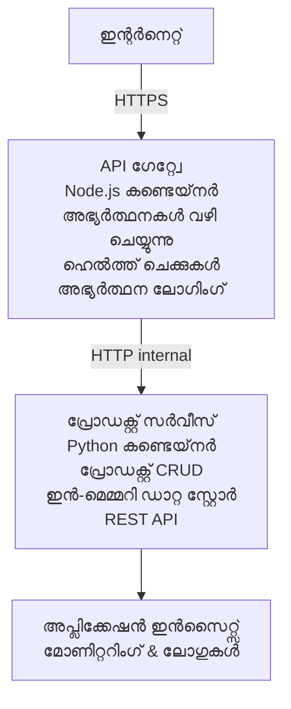

# മൈക്രോസർവിസുകൾ ആർക്കിടെക്ചർ - കണ്ടെയ്‌നർ ആപ്പ് ഉദാഹരണം

⏱️ **അനുമാനിച്ച സമയവും**: 25-35 മിനിറ്റ് | 💰 **അനുമാനിച്ച ചെലവ്**: ~$50-100/മാസം | ⭐ **കുഴപ്പത്തിന്റെ ഗാഢത**: പ്രഗത്ഭം

AZD CLI ഉപയോഗിച്ച് Azure Container Apps-ലേക്ക് വിന്യസിച്ച ഒരു **സാരങ്ങളെങ്കിലും ക്രിയാത്മകമായ** മൈക്രോസർവിസുകളിൽ ആർക്കിടെക്ചർ. ഈ ഉദാഹരണം സേവനം മുതൽ സേവനം വരെ ആശയവിനിമയം, കണ്ടെയ്നർ ഓർക്കസ്ട്രേഷൻ, കൂടാതെ 2-സേവനം സജ്ജീകരണത്തിൽ നിരീക്ഷണം പ്രദർശിപ്പിക്കുന്നു.

> **📚 പഠന പ്രക്രിയ**: ഈ ഉദാഹരണം കുറഞ്ഞ 2-സേവനം ആർക്കിടെക്ചർ (API ഗേറ്റ്വേയ്ക്ക് + ബാക്കണ്ട് സർവീസ്) കൊണ്ട് ആരംഭിക്കുന്നു, ഇത് നിങ്ങൾ യാഥാർത്ഥ്യത്തിൽ വിന്യസിച്ചും പഠിച്ചും കഴിയും. ഈ അടിസ്ഥാനത്തിൽ പ്രാവീണ്യം നേടിയ ശേഷം, സമ്പൂർണ്ണ മൈക്രോസർവിസുകൾ ഇക്കോസിസ്റ്റം വികസിപ്പിക്കാനുള്ള മാർഗ്ഗനിർദ്ദേശങ്ങൾ നൽകുന്നു.

## നിങ്ങൾ പഠിക്കാനിരിക്കുന്നതു

ഈ ഉദാഹരണം പൂർത്തിയാക്കിയാൽ, നിങ്ങൾക്ക് സാധിക്കും:
- Azure Container Apps-ൽ ഒട്ടനവധി കണ്ടെയ്‌നറുകൾ വിന്യസിക്കുക
- ആഭ്യന്തര നെറ്റ്വർക്കിംഗ് ഉപയോഗിച്ച് സേവനം മുതൽ സേവനം ആശയവിനിമയം നടപ്പാക്കുക
- പരിസ്ഥിതി അടിസ്ഥാനത്തിലുള്ള സ്കെയ്ലിംഗ്, ഹെൽത്ത് ചെക്കുകൾ കോൺഫിഗർ ചെയ്യുക
- Application Insights ഉപയോഗിച്ച് വിതരിച്ചുള്ള ആപ്പ് നിരീക്ഷിക്കുക
- മൈക്രോസർവിസുകൾ വിന്യാസ പാറ്റേണുകളും മികച്ച രീതികളും മനസിലാക്കുക
- ലളിതമോ സങ്കീർണ്ണമോ ആർക്കിടെക്ചറിൽ പ്രഗത്ഭമായി വികസനം പഠിക്കുക

## ആർക്കിടെക്ചർ

### ഘട്ടം 1: നാം നിർമ്മിക്കുന്നത് (ഈ ഉദാഹരണത്തിൽ ഉൾപ്പെടുത്തിയിരിക്കുന്നു)


**എന്തുകൊണ്ട് ലളിതമായതോടെ തുടങ്ങണം?**
- ✅ വേഗം വിന്യസിച്ച് മനസിലാക്കാം (25-35 മിനിറ്റ്)
- ✅ കേർ മൈക്രോസർവിസ് മാതൃകകൾ സങ്കീർണ്ണത കൂടാതെ പഠിക്കുക
- ✅ പ്രവർത്തനക്ഷമമായ കോഡ് മാറ്റവും പരീക്ഷണവും ചെയ്യാൻ കഴിയും
- ✅ പഠനച്ചെലവ് കുറവ് (~$50-100/മാസം vs $300-1400/മാസം)
- ✅ ഡാറ്റാബേസുകളും മെസേജ് ക്യൂകളും ചേർക്കുന്നതിന് മുൻപ് വിശ്വാസ്യത നിർമ്മിക്കുക

**ഉപമ**: ഈ തലത്തിൽ ഡ്രൈവിംഗ് പഠിക്കുന്നതുപോലെ. നിങ്ങൾ ഒരു ശൂന്യ പാർക്കിങ് ലോട്ടിൽ (2 സേവനങ്ങളുമായി) തുടങ്ങുന്നു, അടിസ്ഥാനങ്ങൾ കൃത്യമായി മനസിലാക്കുന്നു, പിന്നെ നഗരം ചാലിക്കുന്ന ട്രാഫിക്കിലേക്ക് (5+ സേവനങ്ങൾ ഡാറ്റാബേസുകളോടെ) യാലും.

### ഘട്ടം 2: ഭാവി വികസനം (റഫറൻസ് ആർക്കിടെക്ചർ)

2-സേവനം ആർക്കിടെക്ചർ പാടവം നേടിയശേഷം, നിങ്ങൾക്ക് വികസിപ്പിക്കാം:

```
Full Architecture (Not Included - For Reference)
├── API Gateway (✅ Included)
├── Product Service (✅ Included)
├── Order Service (🔜 Add next)
├── User Service (🔜 Add next)
├── Notification Service (🔜 Add last)
├── Azure Service Bus (🔜 For async communication)
├── Cosmos DB (🔜 For product persistence)
├── Azure SQL (🔜 For order management)
└── Azure Storage (🔜 For file storage)
```

വിദഗ്ധമായ ഘട്ടരേഖകൾക്കായി ഒടുവിൽ "വിവൃദ്ധി മാർഗ്ഗനിർദ്ദേശം" വിഭാഗം കാണുക.

## ഉൾപ്പെടുത്തിയ ഫീച്ചറുകൾ

✅ **സേവ്‌സ് കണ്ടെത്തൽ**: കണ്ടെയ്‌നറുകൾക്കിടയിലെ സ്വയംപ്രവർത്തന ഡിഎൻഎസ് അടിസ്ഥാനമാക്കിയ കണ്ടെത്തൽ  
✅ **ലോഡ് ബാലൻസിങ്**: റെപ്ലികകളിൽ ഉൾപ്പെടുത്തിയ ലോഡ് ബാലൻസിങ്  
✅ **സ്വയം സ്കെയ്ലിംഗ്**: HTTP അഭ്യർത്ഥനകളുടെ അടിസ്ഥാനത്തിൽ സ്വതന്ത്ര സ്കെയ്ലിംഗ്  
✅ **ഹെൽത്ത് നിരീക്ഷണം**: രണ്ട് സേവനങ്ങൾക്കും ലിവ്നസ്, റെഡിനസ് പ്രോബുകൾ  
✅ **വിതരിച്ചുള്ള ലോഗിംഗ്**: Application Insights-ഉം കൂടിയ കേന്ദ്രികൃത ലോഗിംഗ്  
✅ **ആഭ്യന്തര നെറ്റ്വർക്കിംഗ്**: സുരക്ഷിത സേവനം മുതൽ സേവനം ആശയവിനിമയം  
✅ **കണ്ടെയ്‌നർ ഓർക്കസ്ട്രേഷൻ**: സ്വയം വിന്യാസവും സ്കെയ്ലിംഗും  
✅ **സീറോ-ഡൗൺടൈം അപ്‌ഡേറ്റുകൾ**: റോളിംഗ് അപ്‌ഡേറ്റുകൾ റിവിഷൻ മാനേജ്മെന്റോടെ  

## മുൻകൂട്ടി തയ്യാറെടുപ്പുകൾ

### ആവശ്യമായ ഉപകരണങ്ങൾ

പ്രാരംഭിക്കാൻ മുമ്പ്, ഈ ഉപകരണങ്ങൾ ഇൻസ്റ്റാൾ ചെയ്തിട്ടുണ്ടോ എന്ന് പരിശോധിക്കുക:

1. **[Azure Developer CLI (azd)](https://learn.microsoft.com/azure/developer/azure-developer-cli/install-azd)** (പതിപ്പ് 1.0.0 അല്ലെങ്കിൽ ഉയർന്നത്)
   ```bash
   azd version
   # പ്രതീക്ഷിച്ച ഔട്ട്പുട്ട്: azd പതിപ്പ് 1.0.0 അല്ലെങ്കിൽ അതിലധികം
   ```

2. **[Azure CLI](https://learn.microsoft.com/cli/azure/install-azure-cli)** (പതിപ്പ് 2.50.0 അല്ലെങ്കിൽ ഉയർന്നത്)
   ```bash
   az --version
   # പ്രതീക്ഷിച്ച ഔട്ട്പുട്ട്: azure-cli 2.50.0 അല്ലെങ്കിൽ അതിന് മുകളിൽ
   ```

3. **[Docker](https://www.docker.com/get-started)** (പ്രാദേശിക വികസന/പരീക്ഷണത്തിന് - ആറിയ്ക്ക Optional)
   ```bash
   docker --version
   # പ്രതീക്ഷിച്ച ഔട്ട്‌പുട്ട്: Docker പതിപ്പ് 20.10 അല്ലെങ്കില്‍ അതിന് മുകളിലായി
   ```

### Azure ആവശ്യകതകൾ

- സജീവ **Azure സബ്‌സ്‌ക്രിപ്ഷൻ** ([ഒരു സൗജന്യ അക്കൗണ്ട് സൃഷ്ടിക്കുക](https://azure.microsoft.com/free/))
- നിങ്ങളുടെ സബ്‌സ്‌ക്രിപ്ഷനിൽ റിസോഴ്‌സുകൾ സൃഷ്ടിക്കാൻ അനുവാദം
- സബ്‌സ്‌ക്രിപ്ഷനും റിസോഴ്‌സ് ഗ്രൂയുമായുള്ള **Contributor** സ്ഥാനം

### അറിവ് മുൻകൂട്ടി

ഇത് ഒരു **പ്രഗത്ഭത നിലയിലെ** ഉദാഹരണം. നിങ്ങൾക്കുണ്ടായിരിക്കണം:
- [ലളിതമായ Flask API ഉദാഹരണം](../../../../../examples/container-app/simple-flask-api) പൂർത്തിയാക്കിയത്
- മൈക്രോസർവിസുകൾ ആർക്കിടെക്ചർ അടിസ്ഥാന അറിവ്
- REST API ഉം HTTP ഉം പരിചയം
- കണ്ടെയ്‌നർ ആശയങ്ങളിൽ ഗാഢമായ മനസിലാക്കൽ

**Container Apps-നു പുതുങ്ങിയവരാണോ?** ആദ്യം [ലളിതമായ Flask API ഉദാഹരണം](../../../../../examples/container-app/simple-flask-api) കാണുക.

## ക്വിക്ക് സ്റ്റാർട്ട് (പടി-പടി)

### പടി 1: ക്ലോൺ ചെയ്തു നാവിഗേറ്റ് ചെയ്യുക

```bash
git clone https://github.com/microsoft/AZD-for-beginners.git
cd AZD-for-beginners/examples/container-app/microservices
```

**✓ വിജയ പരിശോധന**: `azure.yaml` കാണുന്നുണ്ടോ എന്നു പരിശോധിക്കുക:
```bash
ls
# പ്രതീക്ഷിച്ചത്: README.md, azure.yaml, infra/, src/
```

### പടി 2: Azure യിൽ അഥന്റിക്കേറ്റ് ചെയ്യുക

```bash
azd auth login
```

Azure അഥന്റിക്കേഷൻക്ക് ബ്രൗസർ തുറക്കും. നിങ്ങളുടെ Azure ക്രെഡൻഷ്യലുകൾ ഉപയോഗിച്ച് സൈൻ ഇൻ ചെയ്യുക.

**✓ വിജയ പരിശോധന**: നിങ്ങൾക്ക് കാണാം:
```
Logged in to Azure.
```

### പടി 3: പരിസ്ഥിതി തുടക്കം

```bash
azd init
```

**നിങ്ങൾക്ക് കാണാൻ കഴിയുന്ന പ്രോംപ്റ്റുകൾ**:
- **പരിസ്ഥിതി പേര്**: ചുരുക്കം നൽകുക (ഉദാഹരണം, `microservices-dev`)
- **Azure സബ്‌സ്‌ക്രിപ്ഷൻ**: നിങ്ങളുടെ സബ്‌സ്‌ക്രിപ്ഷൻ തിരഞ്ഞെടുക്കുക
- **Azure സ്ഥലം**: ഒരു പ്രദേശം തിരഞ്ഞെടുക്കുക (ഉദാ., `eastus`, `westeurope`)

**✓ വിജയ പരിശോധന**: നിങ്ങൾക്ക് കാണാം:
```
SUCCESS: New project initialized!
```

### പടി 4: അടിസ്ഥാന സൗകര്യവും സേവനങ്ങളും വിന്യസിക്കുക

```bash
azd up
```

**എന്താണ് സംഭവിക്കുന്നത്** (8-12 മിനിറ്റ് എടുക്കും):
1. Container Apps പരിസ്ഥിതി സൃഷ്ടിക്കുന്നു
2. മൊനിറ്ററിംഗിനായി Application Insights സജ്ജീകരിക്കുന്നു
3. API ഗേറ്റ്വേ കണ്ടെയ്‌നർ (Node.js) നിർമ്മിക്കുന്നു
4. Product Service കണ്ടെയ്‌നർ (Python) നിർമ്മിക്കുന്നു
5. രണ്ടും Azure-ലേക്ക് വിന്യസിക്കുന്നു
6. നെറ്റ്വർക്കിംഗ്, ഹെൽത്ത് ചെക്കുകൾ കോൺഫിഗർ ചെയ്യുന്നു
7. മൊനിറ്ററിംഗും ലോഗിംഗും സജ്ജമാക്കുന്നു

**✓ വിജയ പരിശോധന**: നിങ്ങൾക്ക് കാണാം:
```
SUCCESS: Your application was deployed to Azure in X minutes Y seconds.
Endpoint: https://api-gateway-<unique-id>.azurecontainerapps.io
```

**⏱️ സമയം**: 8-12 മിനിറ്റ്

### പടി 5: വിന്യാസം പരിശോധിക്കുക

```bash
# ഗേറ്റ്വേ എന്റ്പോയിന്റ് ലഭിക്കുക
GATEWAY_URL=$(azd env get-values | grep API_GATEWAY_URL | cut -d '=' -f2 | tr -d '"')

# API ഗേറ്റ്വേ ആരോഗ്യപരിശോധന നടത്തുക
curl $GATEWAY_URL/health

# പ്രതീക്ഷിച്ച ഔട്ട്പുട്ട്:
# {"status":"healthy","service":"api-gateway","timestamp":"2025-11-19T10:30:00Z"}
```

**ഗേറ്റ്വേ വഴി ഉൽപ്പന്ന സേവനം പരിശോധിക്കുക**:
```bash
# ഉൽപ്പന്നങ്ങൾ പട്ടികപ്പെടുത്തുക
curl $GATEWAY_URL/api/products

# പ്രതീക്ഷിച്ച ഔട്ട്‌പുട്ട്:
# [
#   {"id":1,"name":"ലാപ്ടോപ്","price":999.99,"stock":50},
#   {"id":2,"name":"മൗസ്","price":29.99,"stock":200},
#   {"id":3,"name":"കീബോർഡ്","price":79.99,"stock":150}
# ]
```

**✓ വിജയ പരിശോധന**: ഇരുപക്ഷവും errors ഇല്ലാതെ JSON ഡാറ്റ റിട്ടേൺ ചെയ്യുന്നു.

---

**🎉 അഭിനന്ദനങ്ങൾ!** നിങ്ങൾ Azure-ലേക്ക് മൈക്രോസർവിസുകൾ ആർക്കിടെക്ചർ വിന്യസിച്ചു!

## പ്രോജക്ട് ഘടന

എല്ലാ നടപ്പാക്കൽ ഫയലുകളും ഉൾപ്പെടുത്തിയിട്ടുണ്ട് — ഇത് ഒരു സമ്പൂർണ പ്രവർത്തന ഉദാഹരണമാണ്:

```
microservices/
│
├── README.md                         # This file
├── azure.yaml                        # AZD configuration
├── .gitignore                        # Git ignore patterns
│
├── infra/                           # Infrastructure as Code (Bicep)
│   ├── main.bicep                   # Main orchestration
│   ├── abbreviations.json           # Naming conventions
│   ├── core/                        # Shared infrastructure
│   │   ├── container-apps-environment.bicep  # Container environment + registry
│   │   └── monitor.bicep            # Application Insights + Log Analytics
│   └── app/                         # Service definitions
│       ├── api-gateway.bicep        # API Gateway container app
│       └── product-service.bicep    # Product Service container app
│
└── src/                             # Application source code
    ├── api-gateway/                 # Node.js API Gateway
    │   ├── app.js                   # Express server with routing
    │   ├── package.json             # Node dependencies
    │   └── Dockerfile               # Container definition
    └── product-service/             # Python Product Service
        ├── main.py                  # Flask API with product data
        ├── requirements.txt         # Python dependencies
        └── Dockerfile               # Container definition
```

**എന്താണ് ഓരോ ഘടകവും ചെയ്യുന്നത്:**

**അഡ്മിനിസ്ട്രേഷൻ (infra/)**:
- `main.bicep`: എല്ലാ Azure റിസോഴ്‌സുകളും അവയുടെ ആശ്രിതങ്ങളും ഓർക്കസ്ട്രേറ്റ് ചെയ്യുന്നു
- `core/container-apps-environment.bicep`: Container Apps ഇന്വയോൺമെന്റ്, Azure Container Registry സൃഷ്ടിക്കുന്നു
- `core/monitor.bicep`: വിതരിച്ച ലോഗിംഗിനായി Application Insights സജ്ജമാക്കുന്നു
- `app/*.bicep`: വ്യക്തിഗത കണ്ടെയ്‌നർ ആപ്പ് നിർവചനങ്ങൾ സ്കെയ്ലിംഗിലും ഹെൽത്ത് ചെക്കുകളിലും

**API ഗേറ്റ്വേ (src/api-gateway/)**:
- പബ്ലിക്-ചെയ്യുന്ന സേവനം, ബാക്കന്റ് സേവനങ്ങളിലേക്ക് അപേക്ഷകൾ റൂട്ടുചെയ്യുന്നു
- ലോഗിംഗും, പിഴവ് കൈകാര്യം ചെയ്യലും, അഭ്യർത്ഥന ഫോർവേഡിംഗും നടപ്പാക്കുന്നു
- സേവനം മുതൽ സേവനം HTTP ആശയവിനിമയം കാണിക്കുന്നു

**ഉൽപ്പന്ന സേവനം (src/product-service/)**:
- ലളിതമായ ഇന-മെമ്മറി ഉൽപ്പന്ന കാറ്റലോഗ് ഉള്ള ആഭ്യന്തര സേവനം
- REST API ഹെൽത്ത് ചെക്കുകളോടുകൂടി
- ബാക്കന്റ് മൈക്രോസർവീസ് മാതൃകയുടെ ഉദാഹരണം

## സേവനങ്ങൾ അവലോകനം

### API ഗേറ്റ്വേ (Node.js/Express)

**പോർട്ട്**: 8080  
**പൊതു പ്രവേശനം**: പബ്ലിക് (ബാഹ്യ ഇൻ‌ഗ്രസ്)  
**ഉദേശ്യം**: വരമ്പുകാരിയുമായ അപേക്ഷകൾ ശരിയായ ബാക്കന്റ് സേവനങ്ങളിലേക്കു റൂട്ടുചെയ്യുക

**എൻഡ്‌പോയിന്റുകൾ**:
- `GET /` - സേവന വിവരം
- `GET /health` - ഹെൽത്ത് ചെക്ക് എൻഡ്‌പോയിന്റ്
- `GET /api/products` - ഉൽപ്പന്ന സേവനത്തിലേക്ക് ഫോർവേഡ് ചെയ്യുക (എല്ലാം ലിസ്റ്റ് ചെയ്യുക)
- `GET /api/products/:id` - ഉൽപ്പന്ന സേവനത്തിലേക്ക് ഫോർവേഡ് ചെയ്യുക (ഐഡി അനുസരിച്ച്)

**പ്രധാന ഫീച്ചറുകൾ**:
- axios ഉപയോഗിച്ച് അഭ്യർത്ഥന റോട്ടിങ്
- കേന്ദ്രികൃത ലോഗിംഗ്
- പിഴവ് കൈകാര്യം ചെയ്യൽ, സമയപരിധി മാനേജ്മെന്റ്
- പരിസ്ഥിതി വ്യത്യാസങ്ങൾ മുഖേന സേവനം കണ്ടെത്തൽ
- Application Insights സംയോജനം

**കോഡ് ഹൈലൈറ്റ്** (`src/api-gateway/app.js`):
```javascript
// ആഭ്യന്തര സേവന സംവാദം
app.get('/api/products', async (req, res) => {
  const response = await axios.get(`${PRODUCT_SERVICE_URL}/products`);
  res.json(response.data);
});
```

### ഉൽപ്പന്ന സേവനം (Python/Flask)

**പോർട്ട്**: 8000  
**പ്രവേശനം**: ആഭ്യന്തര മാത്രമേ (ബാഹ്യ ഇൻ‌ഗ്രസ് ഇല്ല)  
**ഉദ്ദേശ്യം**: ഇന-മെമ്മറി ഡാറ്റ ഉപയോഗിച്ച് ഉൽപ്പന്ന കാറ്റലോഗ് കൈകാര്യം ചെയ്യുക

**എൻഡ്‌പോയിന്റുകൾ**:
- `GET /` - സേവന വിവരം
- `GET /health` - ഹെൽത്ത് ചെക്ക് എൻഡ്‌പോയിന്റ്
- `GET /products` - എല്ലാ ഉൽപ്പന്നങ്ങളും ലിസ്റ്റ് ചെയ്യുക
- `GET /products/<id>` - ഐഡി അനുസരിച്ച് ഉൽപ്പന്നം നേടുക

**പ്രധാന ഫീച്ചറുകൾ**:
- Flask ഉപയോഗിച്ചുള്ള RESTful API
- ലളിതമായ ഇന മെമ്മറി ഉൽപ്പന്ന സ്റ്റോർ (ഡാറ്റാബേസ് ആവശ്യമില്ല)
- ഹെൽത്ത് നിരീക്ഷണം പ്രോബുകളുമായി
- ഘടനയുള്ള ലോഗിംഗ്
- Application Insights സംയോജനം

**ഡാറ്റ മോഡൽ**:
```python
{
  "id": 1,
  "name": "Laptop",
  "description": "High-performance laptop",
  "price": 999.99,
  "stock": 50
}
```

**എന്തുകൊണ്ട് ആഭ്യന്തരം മാത്രമാ?**  
ഉൽപ്പന്ന സേവനം പൊതു മുഖേന പ്രദർശിപ്പിക്കുന്നില്ല. എല്ലാ അഭ്യർത്ഥനകളും API ഗേറ്റ്വേ വഴി കടക്കണം, ഇതിന്റെ പ്രയോജനം:
- സുരക്ഷ: നിയന്ത്രിത പ്രവേശന പോയിന്റ്
- സൗകര്യം: ക്ലയന്റുകളെ ബാധിക്കാതെ ബാക്കന്റ് മാറ്റാം
- നിരീക്ഷണം: കേന്ദ്രികൃത അഭ്യർത്ഥന ലോഗിംഗ്

## സേവനം ആശയവിനിമയം മനസിലാക്കൽ

### സേവനങ്ങൾ എങ്ങനെ തമ്മിൽ സംസാരിക്കുന്നു

ഈ ഉദാഹരണത്തിൽ, API ഗേറ്റ്വേ ഉൽപ്പന്ന സേവനത്തോടും **അഭ്യന്തര HTTP കോൾസിലൂടെ** ആശയവിനിമയം നടത്തുന്നു:

```javascript
// API ഗേറ്റ്വേ (src/api-gateway/app.js)
const PRODUCT_SERVICE_URL = process.env.PRODUCT_SERVICE_URL;

// അകത്തെ HTTP അഭ്യർത്ഥന നടത്തുക
const response = await axios.get(`${PRODUCT_SERVICE_URL}/products`);
```

**പ്രധാന പോയിന്റുകൾ**:

1. **DNS അടിസ്ഥാനമാക്കിയ കണ്ടെത്തൽ**: Container Apps ആഭ്യന്തര സേവനങ്ങൾക്ക് DNS സാധ്യം നൽകുന്നു  
   - ഉൽപ്പന്ന സേവനത്തിന്റെ FQDN: `product-service.internal.<environment>.azurecontainerapps.io`  
   - ലളിതമായി: `http://product-service` (Container Apps ഇത് പരിഹരിക്കുന്നു)

2. **പൊതി പരദർശനം ഇല്ല**: ഉൽപ്പന്ന സേവനം Bicep-ൽ `external: false` ആണ്  
   - മാത്രം Container Apps പരിസ്ഥിതിക്ക് പുറത് പ്രാപ്യമല്ല  
   - ഇന്റർനെറ്റിൽ നിന്ന് നിരാകരിച്ചിരിക്കുന്നു

3. **പരിസ്ഥിതി വ്യത്യാസങ്ങൾ**: സേവന URL-കൾ വിന്യാസ സമയത്ത് ഇഞ്ചെക്ട് ചെയ്യുന്നു  
   - Bicep ഗേറ്റ്വേയ്ക്ക് ആഭ്യന്തര FQDN നൽകുന്നു  
   - അപ്ലിക്കേഷൻ കോഡിൽ ഹാർഡ്‌കോഡ് URL-കളില്ല

**ഉപമ**: ഇത്തരം ഓഫീസ് മുറികൾപോലെ ചിന്തിക്കുക. API ഗേറ്റ്വേ സ്വീകരണ ഡെസ്കാണ് (പൊതു മുഖം), ഉൽപ്പന്ന സേവനം ഓഫീസ് മുറി (ആഭ്യന്തര בלבד) ആണ്. സന്ദർശകർക്ക് സ്വീകരണത്തിലൂടെ മാത്രമേ ഓഫിസിലേക്ക് പോകാനാവൂ.

## വിന്യാസ ഓപ്ഷനുകൾ

### സമ്പൂർണ്ണ വിന്യാസം (추천)

```bash
# അടിസ്ഥാന ഘടനയും രണ്ട് സേവനങ്ങളും വിന്യസിക്കുക
azd up
```

ഇത് വിന്യസിക്കുന്നു:  
1. Container Apps പരിസ്ഥിതി  
2. Application Insights  
3. Container Registry  
4. API ഗേറ്റ്വേ കണ്ടെയ്‌നർ  
5. ഉൽപ്പന്ന സേവന കണ്ടെയ്‌നർ  

**സമയം**: 8-12 മിനിറ്റ്

### വ്യക്തിഗത സേവനം വിന്യസിക്കുക

```bash
# ആദ്യമായികെ azd up നടത്തിയ ശേഷം മാത്രം ഒരു സേവനം വിന്യസിക്കുക
azd deploy api-gateway

# അല്ലെങ്കിൽ ഉൽപ്പന്ന സേവനം വിന്യസിക്കുക
azd deploy product-service
```

**ഉപയോഗം**: ഒരു സേവനത്തിൽ കോഡ് മാറ്റം വരുത്തിയതിനു ശേഷം മങ്ങിയ നമ്പരിലൂടെ വീണ്ടും വിന്യസിക്കാനാണ്.

### കോൺഫിഗറേഷൻ അപ്‌ഡേറ്റ് ചെയ്യുക

```bash
# സ്കെയിലിംഗ് പരാമീറ്ററുകൾ മാറ്റുക
azd env set GATEWAY_MAX_REPLICAS 30

# പുതിയ കോൺഫിഗറേഷൻ ഉപയോഗിച്ച് പുനഃക്രമീകരിക്കുക
azd up
```

## കോൺഫിഗറേഷൻ

### സ്കെയ്ലിംഗ് കോൺഫിഗറേഷൻ

രണ്ട് സേവനങ്ങൾക്കും അവയുടെ Bicep ഫയലുകളിൽ HTTP അടിസ്ഥാനമാക്കിയ സ്വയം സ്കെയ്ലിംഗ് കോൺഫിഗർ ചെയ്തിരിക്കുന്നു:

**API ഗേറ്റ്വേ**:
- കുറഞ്ഞ റെപ്ലിക്കുകൾ: 2 (എപ്പോഴും കുറഞ്ഞതും 2 ലഭ്യമാക്കുക)
- പരമാവധി റെപ്ലിക്കുകൾ: 20
- സ്കെയിലിംഗ് ട്രിഗർ: ഓരോ റെപ്ലിക്കിനും പ്രതിരോധം 50 ഏകകാല അഭ്യർത്ഥനകൾ

**ഉൽപ്പന്ന സേവനം**:
- കുറഞ്ഞ റെപ്ലിക്കുകൾ: 1 (അവശ്യമായാൽ പൂജ്യം വരെ സ്കെയിൽ ചെയ്യാം)
- പരമാവധി റെപ്ലിക്കുകൾ: 10
- സ്കെയിലിംഗ് ട്രിഗർ: ഓരോ റെപ്ലിക്കിനും 100 ഏകകാല അഭ്യർത്ഥനകൾ

**സ്കെയ്ലിംഗ് ഇഷ്ടാനുസരണം മാറ്റം വരുത്താം** (`infra/app/*.bicep`):
```bicep
scale: {
  minReplicas: 1
  maxReplicas: 10
  rules: [
    {
      name: 'http-scale-rule'
      http: {
        metadata: {
          concurrentRequests: '100'  // Adjust this
        }
      }
    }
  ]
}
```

### റിസോഴ്‌സ് വകവരുത്തൽ

**API ഗേറ്റ്വേ**:
- CPU: 1.0 vCPU
- മെമ്മറി: 2 GiB
- കാരണം: എല്ലാ ബാഹ്യ ട്രാഫിക് കൈകാര്യം ചെയ്യുക

**ഉൽപ്പന്ന സേവനം**:
- CPU: 0.5 vCPU
- മെമ്മറി: 1 GiB
- കാരണം: അല്പം ഭാരമുള്ള ഇന മെമ്മറി ഓപ്പറേഷനുകൾ

### ഹെൽത്ത് ചെക്കുകൾ

രണ്ട് സേവനങ്ങളിലും ലിവ്നസ്, റെഡിനസ് പ്രോബുകൾ ഉൾപ്പെടുത്തിയിരിക്കുന്നു:

```bicep
probes: [
  {
    type: 'Liveness'
    httpGet: {
      path: '/health'
      port: 8080
    }
    initialDelaySeconds: 10
    periodSeconds: 30
  }
  {
    type: 'Readiness'
    httpGet: {
      path: '/health'
      port: 8080
    }
    initialDelaySeconds: 5
    periodSeconds: 10
  }
]
```

**ഇതിന് അർത്ഥം**:  
- **ലിവ്നസ്**: ഹെൽത്ത് ചെക്ക് പരാജയപ്പെടുന്ന പക്ഷം, Container Apps കണ്ടെയ്നർ പുനരാരംഭിക്കും  
- **റെഡിനസ്**: തയ്യാറല്ലെങ്കിൽ, Container Apps ആ റെപ്ലിക്കിലേക്കുള്ള ട്രാഫിക് routing നിർത്തും

## നിരീക്ഷണവും മണസ്സിലാക്കലും

### സേവന ലോഗുകൾ കാണുക

```bash
# azd monitor ഉപയോഗിച്ച് ലോഗുകൾ കാണുക
azd monitor --logs

# അല്ലെങ്കിൽ പ്രത്യേക കണ്ടെയ്‌നർ ആപ്പുകൾക്ക് Azure CLI ഉപയോഗിക്കുക:
# API ഗേറ്റ്‌വേയിൽ നിന്നുള്ള ലോഗുകൾ സ്ട്രീം ചെയ്യുക
az containerapp logs show --name api-gateway --resource-group $RG_NAME --follow

# അടുത്തിടെ ഉള്ള പ്രൊഡക്റ്റ് സർവീസ് ലോഗുകൾ കാണുക
az containerapp logs show --name product-service --resource-group $RG_NAME --tail 100
```

**പ്രതീക്ഷിക്കാവുന്ന ഔട്ട്പുട്ട്**:
```
[api-gateway] API Gateway listening on port 8080
[api-gateway] Product Service URL: http://product-service
[api-gateway] GET /api/products 200 - 45ms
[product-service] Retrieved 5 products
```

### Application Insights ക്വെറികൾ

Azure പോർട്ടലിലെ Application Insights-ൽ പ്രവേശിച്ച് ഈ ക്വെറികൾ ആകെ ചലിപ്പിക്കുക:

**മന്ദഗതിയുള്ള അഭ്യർത്ഥനകൾ കണ്ടെത്തുക**:
```kusto
requests
| where timestamp > ago(1h)
| where duration > 1000  // Requests taking >1 second
| summarize count() by name, cloud_RoleName
| order by count_ desc
```

**സേവനം മുതൽ സേവനം വിളികൾ ട്രാക്ക് ചെയ്യുക**:
```kusto
dependencies
| where timestamp > ago(1h)
| where type == "Http"
| project timestamp, name, target, duration, success
| order by timestamp desc
```

**സേവനപ്രകാരം പിഴവ് നിരക്ക്**:
```kusto
exceptions
| where timestamp > ago(24h)
| summarize errorCount = count() by cloud_RoleName, type
| order by errorCount desc
```

**അഭ്യർത്ഥന വാള്യം സമയം അനുസരിച്ച്**:
```kusto
requests
| where timestamp > ago(1h)
| summarize requestCount = count() by bin(timestamp, 5m), cloud_RoleName
| render timechart
```

### നിരീക്ഷണ ഡാഷ്ബോർഡ് പ്രവേശനം

```bash
# അപേക്ഷ ഇൻസൈറ്റ്സിന്റെ വിവരങ്ങൾ നേടുക
azd env get-values | grep APPLICATIONINSIGHTS

# അസ്യൂര്‍ പോര്‍ട്ടല്‍ മൊനിറ്ററിംഗ് തുറക്കുക
az monitor app-insights component show \
  --app $(azd env get-values | grep APPLICATIONINSIGHTS_CONNECTION_STRING | cut -d '=' -f2) \
  --resource-group $(azd env get-values | grep AZURE_RESOURCE_GROUP | cut -d '=' -f2) \
  --query "appId" -o tsv
```

### ലൈവ് മെട്രിക്‌സ്

1. Azure പോർട്ടലിൽ Application Insights-ലേക്ക് പോകുക  
2. "Live Metrics" ക്ലിക്ക് ചെയ്യുക  
3. യഥാർത്ഥ സമയ അഭ്യർത്ഥനകൾ, പരാജയങ്ങൾ, പ്രകടനം കാണുക  
4. പരീക്ഷണത്തിന്: `curl $(azd env get-values | grep API_GATEWAY_URL | cut -d '=' -f2 | tr -d '"')/api/products`

## പ്രായോഗിക അഭ്യാസങ്ങൾ

[കുറിപ്പ്: വിശദമായ പടി-പടി അഭ്യാസങ്ങൾ ഉൾപ്പെട്ട "പ്രായോഗിക അഭ്യാസങ്ങൾ" വിഭാഗത്തിൽ കാണുക. ഇതിൽ വിന്യാസ പരിശോധന, ഡാറ്റ മോഡിഫിക്കേഷൻ, സ്വയം സ്കെയ്ലിംഗ് പരീക്ഷണം, പിഴവ് കൈകാര്യം ചെയ്യൽ, മൂന്നാമത്തെ സേവനം ചേർക്കൽ തുടങ്ങിയവ ഉൾപ്പെടുന്നു.]

## ചെലവ് വിശകലനം

### പ്രതിമാസ ചെലവുകളുടെ ഏകദേശം (ഈ 2-സേവന ഉദാഹരണത്തിനു)

| റിസോഴ്‌സ് | കോൺഫിഗറേഷൻ | പ്രതീക്ഷിച്ച ചെലവ് |
|----------|--------------|----------------|
| API ഗേറ്റ്വേ | 2-20 റെപ്ലിക്കുകൾ, 1 vCPU, 2GB RAM | $30-150 |
| ഉൽപ്പന്ന സേവനം | 1-10 റെപ്ലിക്കുകൾ, 0.5 vCPU, 1GB RAM | $15-75 |
| കണ്ടെയ്‌നർ രജിസ്ട്രി | ബേസിക് ടിയർ | $5 |
| Application Insights | 1-2 GB/മാസം | $5-10 |
| Log Analytics | 1 GB/മാസം | $3 |
| **മൊത്തം** | | **$58-243/മാസം** |

**ഉപയോഗം അനുസരിച്ചുള്ള ചെലവ് വിഭജനം**:  
- **ലഘു ട്രാഫിക്** (പരീക്ഷണ/പഠനത്തിന്): ~$60/മാസം  
- **മിതമായ ട്രാഫിക്** (ചെറിയ പ്രൊഡക്ഷൻ): ~$120/മാസം  
- **ഉയർന്ന ട്രാഫിക്** (പൊതുവായ കാലങ്ങൾ): ~$240/മാസം

### ചെലവ് മെച്ചപ്പെടുത്താനുള്ള ടിപ്പുകൾ

1. **വികസനത്തിന് പൂജ്യം വരെ സ്കെയിൽ ചെയ്യുക**:
   ```bicep
   scale: {
     minReplicas: 0  // Save $30-40/month when not in use
     maxReplicas: 10
   }
   ```

2. **Cosmos DBയ്ക്ക് കോൺസമ്പ്ഷൻ പ്ലാൻ ഉപയോഗിക്കുക** (ചേർക്കുമ്പോൾ):  
   - ഉപയോഗിച്ചതിനുപേര് മാത്രം പണമടയ്ക്കുക  
   - കുറഞ്ഞതും ചാർജ് ഇല്ല

3. **Application Insights സാംപ്ളിങ്ങ് സജ്ജമാക്കുക**:
   ```javascript
   appInsights.defaultClient.config.samplingPercentage = 50; // അഭ്യർത്ഥനകളിൽ 50% സാമ്പിള്‍ ചെയ്യും
   ```

4. **ആവശ്യമേ ഇല്ലാത്തപ്പോൾ ക്ലീൻ അപ്പ് നടത്തുക**:
   ```bash
   azd down
   ```

### സൗജന്യ ടിയർ ഓപ്ഷനുകൾ

പഠനത്തിനും പരീക്ഷണത്തിനും പരിഗണിക്കുക:
- Azure സൗജന്യ ക്രെഡിറ്റുകൾ ഉപയോഗിക്കുക (ആദ്യ 30 ദിവസങ്ങൾ)
- കുറഞ്ഞതില്‍ മാത്രം റെപ്പ്ലിക്കാസുകൾ സൂക്ഷിക്കുക
- ടെസ്റ്റിംഗ് കഴിഞ്ഞ് ഡിലീറ്റ് ചെയ്യുക (ഒngoing ചാർജ്ജുകൾ ഇല്ല)

---

## ക്ലീന്അപ്പ്

ഒngoing ചാർജ്ജുകൾ ഒഴിവാക്കാൻ, എല്ലാ റിസോഴ്‌സുകളും ഡിലീറ്റ് ചെയ്യുക:

```bash
azd down --force --purge
```

**സ്ഥിരീകരണം പ്രോംപ്റ്റ്**:
```
? Total resources to delete: 6, are you sure you want to continue? (y/N)
```

സ്ഥിരീകരിക്കാൻ `y` ടൈപ് ചെയ്യുക.

**എന്തൊക്കെ ഡിലീറ്റ് ചെയ്യും**:
- കൺറെയ്നർ ആപ്സ് എൻവയൺമെന്റ്
- രണ്ട് വട്ടം കൺറെയ്നർ ആപ്സ് (ഗേറ്റ്വേ & ഉൽപ്പന്ന സർവീസ്)
- കൺറെയ്നർ രജിസ്ട്രി
- അപ്പ്ലിക്കേഷൻ ഇൻസൈറ്റ്സ്
- ലോഗ് അനാലിറ്റിക്സ് വർക്ക്സ്പേസ്
- റിസോഴ്‌സ് ഗ്രൂപ്പ്

**✓ ക്ലീന്അപ്പ് സ്ഥിരീകരിക്കുക**:
```bash
az group list --query "[?starts_with(name,'rg-microservices')]" --output table
```

ശൂന്യമാകാൻ വേണ്ടത്.

---

## എക്സ്പാൻഷൻ ഗൈഡ്: 2-ൽ നിന്ന് 5+ സർവീസിലേക്ക്

ഈ 2-സർവീസ് ആർക്കിടെക്ചർ അഭ്യസിച്ചശേഷം, എങ്ങനെ വിപുലീകരിക്കാം:

### ഘട്ടം 1: ഡാറ്റാബേസ് സ്ഥിരത ചേർക്കുക (അടുത്ത ഘട്ടം)

**ഉൽപ്പന്ന സേവനത്തിന് Cosmos DB ചേർക്കുക**:

1. സൃഷ്ടിക്കുക `infra/core/cosmos.bicep`:
   ```bicep
   resource cosmosAccount 'Microsoft.DocumentDB/databaseAccounts@2023-04-15' = {
     name: name
     location: location
     kind: 'GlobalDocumentDB'
     properties: {
       databaseAccountOfferType: 'Standard'
       locations: [{ locationName: location, failoverPriority: 0 }]
     }
   }
   ```

2. ഇൻ-മെമ്മറി ഡാറ്റയുടെ പകരം Cosmos DB ഉപയോഗിക്കാൻ ഉൽപ്പന്ന സേവനം അപ്ഡേറ്റ് ചെയ്യുക

3. അനുമാനിക്കപ്പെടുന്ന അധിക ചെലവ്: ~$25/മാസം (സർവറ്ലെസ്)

### ഘട്ടം 2: മൂന്നാമത്തെ സർവീസ് ചേർക്കുക (ഓർഡർ മാനേജ്‌മെന്റ്)

**ഓർഡർ സർവീസ് സൃഷ്ടിക്കുക**:

1. പുതിയ ഫോൾഡർ: `src/order-service/` (Python/Node.js/C#)
2. പുതിയ ബൈസപ്‌: `infra/app/order-service.bicep`
3. /api/orders റൂട്ട് ചെയ്യാൻ API ഗേറ്റ്വേ അപ്ഡേറ്റ് ചെയ്യുക
4. ഓർഡർ സ്ഥിരതയ്ക്കായി Azure SQL ഡാറ്റാബേസ് ചേർക്കുക

**ആർക്കിടെക്ചർ ഇപ്രകാരം ആകും**:
```
API Gateway → Product Service (Cosmos DB)
           → Order Service (Azure SQL)
```

### ഘട്ടം 3: അസിങ്ക്രൺ കമ്മ്യൂണിക്കേഷൻ ചേർക്കുക (സർവീസ് ബസ്)

**ഇവന്റ്-ഡ്രീവ് ആർക്കിടെക്ചർ നടപ്പിലാക്കുക**:

1. Azure സർവീസ് ബസ് ചേർക്കുക: `infra/core/servicebus.bicep`
2. ഉൽപ്പന്ന സർവീസ് "ProductCreated" ഇവന്റുകൾ പ്രസിദ്ധീകരിക്കുന്നു
3. ഓർഡർ സർവീസ് ഉൽപ്പന്ന ഇവന്റുകൾക്ക് സബ്സ്ക്രൈബ് ചെയ്യുന്നു
4. ഇവന്റുകൾ പ്രോസസ്സ് ചെയ്യാൻ നോട്ടിഫിക്കേഷൻ സർവീസ് ചേർക്കുക

**പാറ്റേൺ**: അഭ്യർത്ഥന/പ്രതികരിക്കൽ (HTTP) + ഇവന്റ്-ഡ്രീവ് (സർവീസ് ബസ്)

### ഘട്ടം 4: ഉപയോക്തൃ ഒത്ത് തിരിച്ചറിയൽ ചേർക്കുക

**ഉപയോക്തൃ സർവീസ് നടപ്പിലാക്കുക**:

1. സൃഷ്ടിക്കുക `src/user-service/` (Go/Node.js)
2. Azure AD B2C അല്ലെങ്കിൽ കസ്റ്റം JWT ഓതന്റിക്കേഷൻ ചേർക്കുക
3. API ഗേറ്റ്വേ ടോക്കൺസുകൾ പരിശോധിക്കും
4. സർവീസുകൾ ഉപയോക്തൃ അനുമതികൾ പരിശോധിക്കും

### ഘട്ടം 5: പ്രൊഡക്ഷൻ റെഡിനസ്

**ഇവ ചേർക്കുക**:
- Azure ഫ്രണ്ട് ഡോർ (ഗ്ലോബൽ ലോഡ് ബാലൻസിംഗ്)
- Azure കീ വോൾട്ട് (സീക്രട്ട് മാനേജ്മെന്റ്)
- Azure മോനിറ്റർ വർക്ക്ബുക്കുകൾ (കസ്റ്റം ഡാഷ്ബോർഡുകൾ)
- CI/CD പൈപ്പ്‌ലൈൻ (GitHub ആക്ഷൻസ്)
- ബ്ലൂ-ഗ്രീൻ ഡിപ്ലോയ്മെന്റുകൾ
- എല്ലാ സർവീസുകൾക്കും മാനേജ്ഡ് ഐഡന്റിറ്റി

**സമ്പൂർണ്ണ പ്രൊഡക്ഷൻ ആർക്കിടെക്ചർ ചെലവ്**: ~$300-1,400/മാസം

---

## കൂടുതൽ അറിയുക

### ബന്ധപ്പെട്ട ഡോക്യുമെന്റേഷൻ
- [Azure Container Apps Documentation](https://learn.microsoft.com/azure/container-apps/)
- [Microservices Architecture Guide](https://learn.microsoft.com/azure/architecture/guide/architecture-styles/microservices)
- [Application Insights for Distributed Tracing](https://learn.microsoft.com/azure/azure-monitor/app/distributed-tracing)
- [Azure Developer CLI Documentation](https://learn.microsoft.com/azure/developer/azure-developer-cli/)

### ഈ കോഴ്‌സിലെ അടുത്ത് ഘട്ടങ്ങൾ
- ← മുൻപ്: [Simple Flask API](../../../../../examples/container-app/simple-flask-api) - തുടക്കക്കാരുടെ സിംപിൾ സിങ്കിൾ-കോൻറെയ്നർ ഉദാഹരണം
- → അടുത്തത്: [AI Integration Guide](../../../../../examples/docs/ai-foundry) - AI ശേഷികൾ ചേർക്കുക
- 🏠 [Course Home](../../README.md)

### താരതമ്യം: എന്ത് സമയത്ത് എന്ത് ഉപയോഗിക്കണം

**സിംപിൾ കോൺടെയ്‌നർ ആപ്പ്** (Simple Flask API ഉദാഹരണം):
- ✅ ലളിതമായ ആപ്ലിക്കേഷനുകൾ
- ✅ മോണോളിതിക് ആർക്കിടെക്ചർ
- ✅ വേഗത്തിൽ ഡിപ്പ്ലോയ് ചെയ്യാം
- ❌ ബാധ്യത সীমിതം
- **ചെലവ്**: ~$15-50/മാസം

**മൈക്രോസർവീസുകൾ** (ഈ ഉദാഹരണം):
- ✅ സങ്കീർണ്ണ ആപ്പുകൾ
- ✅ സർവീസ് നോക്കിയിൽ സ്വതന്ത്ര സ്കെയിലിംഗ്
- ✅ ടീമുകളുടെ സ്വയം ക്രമീകരണം (വ്യത്യസ്ത സർവീസുകൾ, വ്യത്യസ്ത ടീമുകൾ)
- ❌ കൂടുതൽ സങ്കീർണ്ണമായ മാനേജുമെന്റ്
- **ചെലവ്**: ~$60-250/മാസം

**കുബെർനെറ്റിസ് (AKS)**:
- ✅ പരമാവധി നിയന്ത്രണവും ഫ്ലെക്സിബിലിറ്റിയും
- ✅ മൾട്ടി-ക്ലൗഡ് പോർട്ടബിലിറ്റി
- ✅ ആഘോഷിച്ച നെറ്റ്വർകിംഗ്
- ❌ കുബെർനെറ്റിസ് വിദഗ്ധത ആവശ്യമാണ്
- **ചെലവ്**: കുറഞ്ഞത് ~$150-500/മാസം

**പരിശോധന**: ആദ്യത്തിൽ Container Apps (ഈ ഉദാഹരണം) ഉപയോഗിച്ച് തുടങ്ങുക, പ്രൊജക്റ്റിന് കുബെർനെറ്റിസ് പറഞ്ഞാൽ AKS-യിലേക്ക് മാറുക.

---

## പലയിടത്തും ചോദ്യങ്ങൾ

**Q: എതിനാണ് 5+ സർവീസുകൾക്ക് പകരം 2 സർവീസുകൾ മാത്രം?**  
A: വിദ്യാഭ്യാസ പുരോഗതി. ലളിതമായ ഉദാഹരണത്തോടൊപ്പം അടിസ്ഥാനങ്ങൾ (സർവീസ് കമ്മ്യൂണിക്കേഷൻ, മോണിറ്ററിംഗ്, സ്കെയിലിംഗ്) അധ്യാപനം. നിങ്ങളുടെ പഠിച്ച പാറ്റേണുകൾ 100-സർവീസ് ആർക്കിടെക്ചറുകൾക്കും ബാധകമാണ്.

**Q: കൂടുതൽ സർവീസുകൾ ഞാൻ തന്നെ ചേർക്കാമോ?**  
A: തീർച്ചയായും! മുകളിൽ നൽകിയ എക്സ്പാൻഷൻ ഗൈഡ് പിന്തുടരുക. ഓരോ പുതിയ സർവീസും സമാന പാറ്റേൺ പിന്തുടരുന്നു: src ഫോൾഡർ സൃഷ്ടിക്കുക, ബൈസപ് ഫയൽ സൃഷ്ടിക്കുക, azure.yaml അപ്ഡേറ്റ് ചെയ്യുക, ഡിപ്പ്ലോയ് ചെയ്യുക.

**Q: ഇത് പ്രൊഡക്ഷൻ റെഡി ആണോ?**  
A: ഒരു ശക്തമായ അടിസ്ഥാനമാണ്. പ്രൊഡക്ഷനായി, മാനേജ്ഡ് ഐഡന്റിറ്റി, കീ വോൾട്ട്, സ്ഥിരതയുള്ള ഡാറ്റാബേസുകൾ, CI/CD പൈപ്പ്‌ലൈൻ, മോണിറ്ററിംഗ് അലർട്ടുകൾ, ബാക്കപ്പ് സ്ട്രാറ്റജി എന്നിവ ചേർക്കുക.

**Q: Dapr അല്ലെങ്കിൽ മറ്റൊരു സർവീസ് മെഷ് എന്തിനാണ് ഉപയോഗിക്കാത്തത്?**  
A: പഠനത്തിനായി ലളിതമായി സൂക്ഷിക്കുക. Container Apps ന്റെ നാട്ടിലുളള നെറ്റ്‌വർക്ക് സങ്കേതം മനസിലാക്കിയതിന് ശേഷം, വിപുലമായ സാഹചര്യങ്ങൾക്ക് Dapr ഉപയോഗിക്കാം.

**Q: ഒറ്റയ്ക്ക് ഡിബഗ് എങ്ങനെ നടത്താം?**  
A: Docker ഉപയോഗിച്ച് ലോക്കലായി സർവീസുകൾ റൺ ചെയ്യുക:
```bash
cd src/api-gateway
docker build -t local-gateway .
docker run -p 8080:8080 -e PRODUCT_SERVICE_URL=http://localhost:8000 local-gateway
```

**Q: വ്യത്യസ്ത പ്രോഗ്രാമിംഗ് ഭാഷകൾ ഉപയോഗിക്കാമോ?**  
A: തീർച്ചയായും! ഈ ഉദാഹരണം കാണിക്കുന്നത് Node.js (ഗേറ്റ്വേ) + Python (ഉൽപ്പന്ന സർവീസ്) ആണ്. കോൺടെയ്‌നറുകളിൽ ഓടുന്ന ഏതെങ്കിലും ഭാഷകൾ മിക്സാക്കാം.

**Q: Azure ക്രെഡിറ്റുകൾ ഇല്ലാതെ怎么办?**  
A: Azure സൗജന്യ ടയർ (പുതിയ അക്കൗണ്ടുകൾക്ക് ആദ്യ 30 ദിവസം) ഉപയോഗിക്കുക അല്ലെങ്കിൽ ചെറിയ ടെസ്റ്റിംഗ് സമയത്തിനു ഡിപ്പ്ലോയ് ചെയ്ത് ഉടൻ ഡിലീറ്റ് ചെയ്യുക.

---

> **🎓 പഠന പാത സംഗ്രഹം**: ഓട്ടോമാറ്റിക് സ്കെയിലിംഗ്, ഇന്റേണൽ നെറ്റ്‌വർക്ക്, സെൻട്രലൈസ്ഡ് മോണിറ്ററിംഗ്, പ്രൊഡക്ഷൻ റെഡി പാറ്റേണുകൾ ഉൾപ്പെടുന്ന മൾട്ടി-സർവീസ് ആർക്കിടെക്ചർ നിങ്ങൾ പഠിച്ചു. ഈ അടിസ്ഥാനങ്ങൾ ജടിലമായ വിതരണ സംവിധാനങ്ങൾക്കും എന്റർപ്രൈസ് മൈക്രോസർവീസുകൾക്കും തയ്യാറാക്കുന്നു.

**📚 കോഴ്‌സ് നാവിഗേഷൻ:**
- ← മുൻപ്: [Simple Flask API](../../../../../examples/container-app/simple-flask-api)
- → അടുത്തത്: [Database Integration Example](../../../../../examples/database-app)
- 🏠 [Course Home](../../../README.md)
- 📖 [Container Apps Best Practices](../../../docs/chapter-04-infrastructure/deployment-guide.md)

---

<!-- CO-OP TRANSLATOR DISCLAIMER START -->
**സ്പഷ്ടീകരണം**:  
ഈ രേഖ [Co-op Translator](https://github.com/Azure/co-op-translator) എന്ന AI പരിഭാഷാ സേവനം ഉപയോഗിച്ച് പരിഭാഷ ചെയ്തതാണ്. ശരിയായ വിശദീകരണത്തിനായി ഞങ്ങൾ ശ്രമിക്കുന്നുവെങ്കിലും, ഓട്ടോമേറ്റഡ് പരിഭാഷകളിൽ പിശകുകൾ അല്ലെങ്കിൽ അപൂർണ്ണതകൾ ഉണ്ടാകാൻ സാധ്യതയുള്ളതിൽ ദയവായി ശ്രദ്ധിക്കുക. മൗലിക ഭാഷയിൽ ഉള്ള രേഖ സവിശേഷപ്പെട്ട ഉറവിടമായിരിക്കണം. നിർണായക വിവരങ്ങൾക്ക്, പ്രൊഫഷണൽ മനുഷ്യ പരിഭാഷ ശിപാർശ ചെയ്യപ്പെടുന്നു. ഈ പരിഭാഷ ഉപയോഗിക്കുമ്പോളം ഉണ്ടാകുന്ന ഏതെങ്കിലും தவറുകൾക്കും കൃത്യവിവരണക്ഷാമങ്ങൾക്കുമുള്ള ഉത്തരവാദിത്വം നമ്മുടെതല്ല.
<!-- CO-OP TRANSLATOR DISCLAIMER END -->