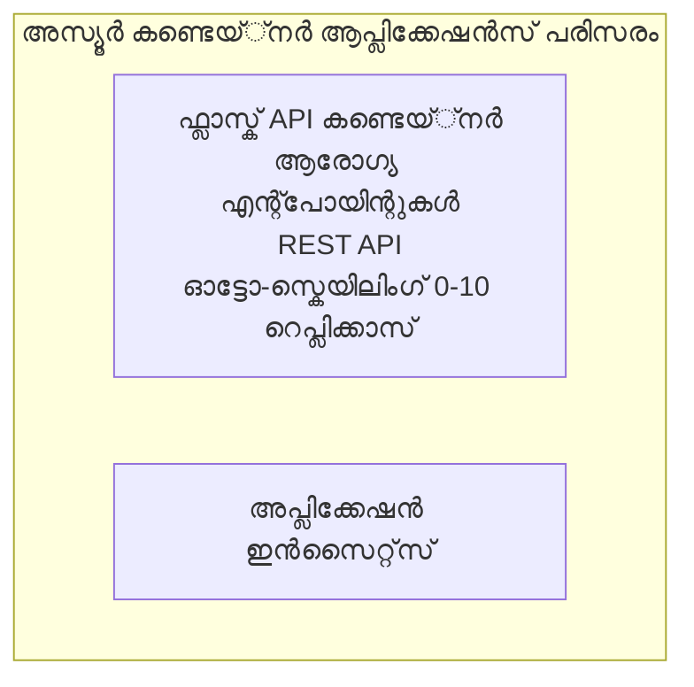

# Simple Flask API - കണ്ടെയ്‌നർ ആപ്പ് ഉദാഹരണം

**Learning Path:** തുടക്കക്കാർ ⭐ | **സമയം:** 25-35 മിനിറ്റ് | **ചെലവ്:** $0-15/മാസം

Azure Developer CLI (azd) ഉപയോഗിച്ച് Azure Container Apps-ൽ ഡിപ്ലോയ് ചെയ്ത ഒരു പൂര്‍ണ്ണമായ, പ്രവർത്തനക്ഷമമായ Python Flask REST API. ഈ ഉദാഹരണം കണ്ടെയ്‌നർ ഡിപ്ലോയ്മെന്റ്, ഓട്ടോ-സ്‌കെയ്‌ലിംഗ്, നിരീക്ഷണം അടിസ്ഥാനങ്ങൾ വിവരിക്കുന്നു.

## 🎯 നിങ്ങൾക്ക് ലഭിക്കാനിരിക്കുന്നത്

- Azure-ലേക്ക് കണ്ടെയ്‌നർ ചെയ്ത് Python അപ്ലിക്കേഷന് ഡിപ്ലോയ് ചെയ്യുക
- സ്കെയിൽ-ടു-സീറോ ഉപയോഗിച്ച് ഓട്ടോ-സ്കെയിലിംഗ് ഘടിപ്പിക്കുക
- ഹെൽത്ത് പ്രോബ്‌സും റെഡിനസ് ചെക്കുകളും നടപ്പിലാക്കുക
- അപ്ലിക്കേഷൻ ലോഗുകളും മെട്രിക്‌സും നിരീക്ഷിക്കുക
- Azure Developer CLI ഉപയോഗിച്ച് വേഗത്തിലുള്ള ഡിപ്ലോയ്മെന്റ്

## 📦 ഉൾപ്പെടുത്തിയിരിക്കുന്നത്

✅ **Flask അപ്ലിക്കേഷൻ** - CRUD പ്രവർത്തനങ്ങളുള്ള പൂര്‍ണ്ണ REST API (`src/app.py`)  
✅ **Dockerfile** - പ്രൊഡക്ഷൻ റെഡിയായ കണ്ടെയ്‌നർ കോൺഫിഗറേഷൻ  
✅ **Bicep ഇൻഫ്രാസ്ട്രക്ചർ** - കണ്ടെയ്‌നർ ആപ്സ് പരിസ്ഥിതി, API ഡിപ്ലോയ്മെന്റ്  
✅ **AZD കോൺഫിഗറേഷൻ** - ഒറ്റ കമാൻഡ് ഡിപ്ലോയ്മെന്റ് സെറ്റപ്പ്  
✅ **ഹെൽത്ത് പ്രോബ്‌സ്** - ലൈവ്‌നസ്, റെഡിനസ് ചെക്കുകൾ കോൺഫിഗർ ചെയ്തിരിക്കുന്നത്  
✅ **ഓട്ടോ-സ്കെയിലിംഗ്** - HTTP ലോഡിന്റെ അടിസ്ഥാനത്തിൽ 0-10 റിപ്ലിക്കാസ്  

## ആർക്കിടെക്ചർ



## മുൻഅവശ്യങ്ങൾ

### ആവശ്യമായവ
- **Azure Developer CLI (azd)** - [ഇൻസ്റ്റാൾ ഗൈഡ്](https://learn.microsoft.com/azure/developer/azure-developer-cli/install-azd)
- **Azure സബ്സ്ക്രിപ്ഷൻ** - [സൗജന്യ അക്കاؤن്റ്](https://azure.microsoft.com/free/)
- **Docker Desktop** - [Docker ഇൻസ്റ്റാൾ ചെയ്യുക](https://www.docker.com/products/docker-desktop/) (ലൊക്കൽ ടെസ്റ്റിംഗിന്)

### മുൻഅവശ്യങ്ങൾ പരിശോധിക്കുക

```bash
# azd പതിപ്പ് പരിശോധിക്കുക (1.5.0 അല്ലെങ്കിൽ അതിലധികം വേണം)
azd version

# Azure ലോഗിൻ സ്ഥിരീകരിക്കുക
azd auth login

# Docker പരിശോധിക്കുക (ഐച്ഛികം, പ്രാദേശിക പരിശോധനയ്ക്കായി)
docker --version
```

## ⏱️ ഡിപ്ലോയ്മെന്റ് ടൈംലൈൻ

| ഘട്ടം | ദൈർഘ്യം | സംഭവിക്കുന്നത് |
|-------|----------|---------------|
| പരിസ്ഥിതി ക്രമീകരണം | 30 സെക്കൻഡ് | azd പരിസ്ഥിതി സൃഷ്ടിക്കുക |
| കണ്ടെയ്‌നർ നിർമ്മാണം | 2-3 മിനിറ്റ് | Docker ഉപയോഗിച്ച് Flask അപ്ലിക്കേഷൻ നിർമ്മിക്കുക |
| ഇൻഫ്രാസ്ട്രക്ചർ സജ്ജമാക്കൽ | 3-5 മിനിറ്റ് | കണ്ടെയ്‌നർ ആപ്സ്, റെജിസ്ട്രി, മോണിറ്ററിങ് സൃഷ്ടിക്കുക |
| അപ്ലിക്കേഷൻ ഡിപ്ലോയ് ചെയ്യുക | 2-3 മിനിറ്റ് | ഇമേജ് പുഷ് ചെയ്ത് കണ്ടെയ്‌നർ ആപ്സിലേക്ക് ഡിപ്ലോയ് ചെയ്യുക |
| **മൊത്തം** | **8-12 മിനിറ്റ്** | പരിപൂർണ്ണ ഡിപ്ലോയ്മെന്റ് സുചിതമായ നിലയില്‍ |


## വേഗത്തിലുള്ള തുടക്കം

```bash
# ഉദാഹരണത്തിലേക്ക് നാവിഗേറ്റ് ചെയ്യുക
cd examples/container-app/simple-flask-api

# പരിസ്ഥിതി തുടങ്ങിയിക്കുക (അന്യമായ പേര് തിരഞ്ഞെടുക്കുക)
azd env new myflaskapi

# എല്ലാം വിനിയോഗിക്കുക (അടിസ്ഥാനഘടന + അപേക്ഷ)
azd up
# നിങ്ങൾക്ക് യാതൊരു പ്രേരണയും ഉണ്ടാകും:
# 1. ആസ്യൂർ സബ്സ്ക്രിപ്ഷൻ തിരഞ്ഞെടുക്കുക
# 2. സ്ഥലം തിരഞ്ഞെടുക്കുക (ഉദാഹരണം, eastus2)
# 3. വിനിയോഗത്തിനായി 8-12 മിനിറ്റുകൾ കാത്തിരിക്കുക

# നിങ്ങളുടെ API എന്റ്പോയിന്റ് നേടുക
azd env get-values

# API പരിശോധന നടത്തുക
curl $(azd env get-value API_ENDPOINT)/health
```

**പ്രതീക്ഷിക്കാവുന്ന output:**
```json
{
  "status": "healthy",
  "timestamp": "2025-11-19T10:30:00Z",
  "service": "simple-flask-api",
  "version": "1.0.0"
}
```

## ✅ ഡിപ്ലോയ്മെന്റ് സ്ഥിരീകരിക്കുക

### ഘട്ടം 1: ഡിപ്ലോയ്മെന്റ് സ്റ്റാറ്റസ് പരിശോധിക്കുക

```bash
# വിന്യസിച്ച സേവനങ്ങൾ കാണുക
azd show

# പ്രതീക്ഷിക്കപ്പെട്ട ഔട്ട്‌പുട്ട് കാണിക്കുന്നു:
# - സേവനം: api
# - എന്റ്പോയിന്റ്: https://ca-api-[env].xxx.azurecontainerapps.io
# - നില: പ്രവർത്തനത്തിലുണ്ട്
```

### ഘട്ടം 2: API എൻഡ്‌പോയിന്റുകൾ പരീക്ഷിക്കുക

```bash
# API എന്ഡ്പോയിന്റ് നേടുക
API_URL=$(azd env get-value API_ENDPOINT)

# ാരോഗ്യ പരിശോധന
curl $API_URL/health

# റൂട്ട് എന്ഡ്പോയിന്റ് പരിശോധിക്കുക
curl $API_URL/

# ഒരു ഐറ്റം സൃഷ്ടിക്കുക
curl -X POST $API_URL/api/items \
  -H "Content-Type: application/json" \
  -d '{"name": "Test Item", "description": "My first item"}'

# എല്ലാ ഐറ്റങ്ങളും നേടുക
curl $API_URL/api/items
```

**വിജയത്തിനുള്ള മാനദണ്ഡങ്ങൾ:**
- ✅ ഹെൽത്ത് എൻഡ്‌പോയിന്റ് HTTP 200 തിരിച്ചറുക്കുന്നു
- ✅ റൂട്ട് എൻഡ്‌പോയിന്റ് API വിവരങ്ങൾ കാണിക്കുന്നു
- ✅ POST പുതിയ ഐറ്റം സൃഷ്ടിക്കുകയും HTTP 201 തിരിച്ചറുക്കുകയും ചെയ്യുന്നു
- ✅ GET സൃഷ്ടിച്ച എല്ലാ ഐറ്റങ്ങളും തിരികെ നൽകുന്നു

### ഘട്ടം 3: ല日志ുകൾ കാണുക

```bash
# azd monitor ഉപയോഗിച്ച് ലൈവ്日志്യുകൾ പ്രക്ഷേപണം ചെയ്യുക
azd monitor --logs

# അല്ലെങ്കിൽ Azure CLI ഉപയോഗിക്കുക:
az containerapp logs show --name api --resource-group $RG_NAME --follow

# നിങ്ങൾ കാണാൻ സാധിക്കണം:
# - ഗുണികോൺ സ്റ്റാർട്ടപ്പ് സന്ദേശങ്ങൾ
# - HTTP അഭ്യർത്ഥന ലോഗുകൾ
# - അപ്ലിക്കേഷൻ വിവര ലോഗുകൾ
```

## പ്രോജക്‌റ് ഘടന

```
simple-flask-api/
├── azure.yaml              # AZD configuration
├── infra/
│   ├── main.bicep         # Main infrastructure
│   ├── main.parameters.json
│   └── app/
│       ├── container-env.bicep
│       └── api.bicep
└── src/
    ├── app.py             # Flask application
    ├── requirements.txt
    └── Dockerfile
```

## API എൻഡ്‌പോയിന്റുകൾ

| എൻഡ്‌പോയിന്റ് | മേധോഡ് | വിശദീകരണം |
|--------------|---------|------------|
| `/health` | GET | ഹെൽത്ത് ചെക്ക് |
| `/api/items` | GET | എല്ലാ ഐറ്റങ്ങളുടെയും ലിസ്റ്റ് |
| `/api/items` | POST | പുതിയ ഐറ്റം സൃഷ്ടിക്കുക |
| `/api/items/{id}` | GET | പ്രത്യേക ഐറ്റം ലഭിക്കുക |
| `/api/items/{id}` | PUT | ഐറ്റം അപ്ഡേറ്റ് ചെയ്യുക |
| `/api/items/{id}` | DELETE | ഐറ്റം ഡിലീറ്റ് ചെയ്യുക |

## കോൺഫിഗറേഷൻ

### പരിസ്ഥിതി വ്യവസായങ്ങൾ

```bash
# ഇഷ്ടാനുസൃതമായ കോൺഫിഗറേഷൻ സജ്ജീകരിക്കുക
azd env set PORT 8000
azd env set LOG_LEVEL info
azd env set MAX_REPLICAS 20
```

### സ്കെയിലിംഗ് കോൺഫിഗറേഷൻ

API HTTP ട്രാഫിക്ക് അടിസ്ഥാനമാക്കിയുള്ള ഓട്ടോമാറ്റിക് സ്കെയിൽ ചെയ്യുന്നു:
- **കുറഞ്ഞ റിപ്ലിക്കാസുകൾ**: 0 (ഇഡിൽ ആയാൽ സ്കെയിൽ-ടു-സീറോ)
- **കൂടുതൽ റിപ്ലിക്കാസുകൾ**: 10
- **ഓരോ റിപ്ലിക്കാ concurrents അഭ്യർത്ഥനകൾ**: 50

## ഡെവലപ്പ്മെന്റ്

### ലൊക്കലായി ഓടിക്കുക

```bash
# ആശ്രിത സംവിധാനങ്ങൾ ഇൻസ്റ്റാൾ ചെയ്യുക
cd src
pip install -r requirements.txt

# ആപ്പ് പ്രവർത്തിപ്പിക്കുക
python app.py

# ലൊക്കലായി പരീക്ഷിക്കുക
curl http://localhost:8000/health
```

### കണ്ടെയ്‌നർ നിർമ്മിച്ച് പരീക്ഷിക്കുക

```bash
# ഡോക്കർ ഇമേജ് നിർമ്മിക്കുക
docker build -t flask-api:local ./src

# കണ്ടെയ്‌നർ ലോക്കലായി ഓടിക്കുക
docker run -p 8000:8000 flask-api:local

# കണ്ടെയ്‌നർ പരീക്ഷിക്കുക
curl http://localhost:8000/health
```

## ഡിപ്ലോയ്മെന്റ്

### സമ്പൂർണ്ണ ഡിപ്ലോയ്മെന്റ്

```bash
# ഉൾഘടനയും ആപ്ലിക്കേഷനും വിന്യസിക്കുക
azd up
```

### കോഡ്-ഒന്ന് ഡിപ്ലോയ്മെന്റ്

```bash
# ആപ്ലിക്കേഷൻ കോഡ് മാത്രം വിന്യസിക്കുക (സൗകര്യസWonീയം മാറാതെ)
azd deploy api
```

### കോൺഫിഗറേഷൻ അപ്ഡേറ്റ് ചെയ്യുക

```bash
# പരിസ്ഥിതി ചേരുവകൾ പുതുക്കുക
azd env set API_KEY "new-api-key"

# പുതിയ കോൺഫിഗറേഷൻ ഉപയോഗിച്ച് വീണ്ടും വിന്യസിക്കുക
azd deploy api
```

## നിരീക്ഷണം

### ല日志ുകൾ കാണുക

```bash
# azd monitor ഉപയോഗിച്ച് ലൈവ് ലോഗുകൾ സ്ട്രീം ചെയ്യുക
azd monitor --logs

# അല്ലെങ്കിൽ Container Apps සඳහා Azure CLI ഉപയോഗിക്കുക:
az containerapp logs show --name api --resource-group $RG_NAME --follow

# അവസാനത്തെ 100 വരികൾ കാണുക
az containerapp logs show --name api --resource-group $RG_NAME --tail 100
```

### മെട്രിക്‌സ് നിരീക്ഷിക്കുക

```bash
# അസ്യൂർ മോണിറ്റർ ഡാഷ്ബോർഡ് തുറക്കുക
azd monitor --overview

# പ്രത്യേക മെട്രിക്കുകൾ കാണുക
az monitor metrics list \
  --resource $(azd show --output json | jq -r '.services.api.resourceId') \
  --metric "Requests,ResponseTime"
```

## പരിശോധന

### ഹെൽത്ത് ചെക്ക്

```bash
curl $(azd show --output json | jq -r '.services.api.endpoint')/health
```

പ്രതീക്ഷിച്ച പ്രതികരണം:
```json
{
  "status": "healthy",
  "timestamp": "2025-11-19T10:30:00Z"
}
```

### ഐറ്റം സൃഷ്ടിക്കുക

```bash
curl -X POST $(azd show --output json | jq -r '.services.api.endpoint')/api/items \
  -H "Content-Type: application/json" \
  -d '{"name": "Test Item", "description": "A test item"}'
```

### എല്ലാ ഐറ്റങ്ങളും ലഭിക്കുക

```bash
curl $(azd show --output json | jq -r '.services.api.endpoint')/api/items
```

## ചെലവ് ലഘൂകരണo

ഈ ഡിപ്ലോയ്മെന്റ് സ്കെയിൽ-ടു-സീറോ ഉപയോഗിക്കുന്നു, അതിനാൽ API അഭ്യർത്ഥനകൾ പ്രോസസ് ചെയ്യുന്ന സമയത്ത് മാത്രമേ നിങ്ങള്‍ പണമടയ്ക്കൂ:

- **ഇഡിൽ ചെലവ്**: ~$0/മാസം (സ്കെയില്ട് ടു സീറോ)
- **സജീവ ചെലവ്**: ~$0.000024/സെക്കൻഡ് പര്‍ റിപ്ലിക്ക
- **പ്രതീക്ഷിക്കുന്ന മാസത്തെ ചെലവ്** (ലഘു ഉപയോഗം): $5-15

### ചെലവു കുറയ്ക്കുന്നത്

```bash
# ഡെവ്‌ için പരമാവധി പ്രിതികൾ ചെറുക്കുക
azd env set MAX_REPLICAS 3

# കുറഞ്ഞ ഐഡിൽ ടൈമൗട്ട് ഉപയോഗിക്കുക
azd env set SCALE_TO_ZERO_TIMEOUT 300  # 5 മിനിറ്റ്
```

## പ്രശ്ന പരിഹാരം

### കണ്ടെയ്‌നർ ആരംഭിക്കുന്നില്ല

```bash
# Azure CLI ഉപയോഗിച്ച് കണ്ടെയ്‌നർ ലോഗുകൾ പരിശോധിക്കുക
az containerapp logs show --name api --resource-group $RG_NAME --tail 100

# Docker ഇമേജ് ലൊക്കൽ ആയി ബിൽഡുകൾ പരിശോധന നടത്തുക
docker build -t test ./src
```

### API inaccesible ആണ്

```bash
# ഇൻഗ്രസ് ബാഹ്യമാണ് എന്ന് പരിശോധിക്കുക
az containerapp show --name api --resource-group rg-simple-flask-api \
  --query properties.configuration.ingress.external
```

### ഉയർന്ന പ്രതികരണ സമയം

```bash
# CPU/മെമ്മറി ഉപയോഗം പരിശോധിക്കുക
az monitor metrics list \
  --resource $(azd show --output json | jq -r '.services.api.resourceId') \
  --metric "CPUPercentage,MemoryPercentage"

# ആവശ്യമെങ്കിൽ റിസോഴ്സുകൾ വർദ്ധിപ്പിക്കുക
az containerapp update --name api --resource-group rg-simple-flask-api \
  --cpu 1.0 --memory 2Gi
```

## ക്ലീൻ അപ്പ്

```bash
# എല്ലാ വിഭവങ്ങളും ഇല്ലാതാക്കുക
azd down --force --purge
```

## അടുത്ത ഘട്ടങ്ങൾ

### ഈ ഉദാഹരണം വികസിപ്പിക്കുക

1. **ഡാറ്റാബേസ് ചേര്‍ക്കുക** - Azure Cosmos DB അല്ലെങ്കിൽ SQL ഡാറ്റാബേസ് സംയോജിപ്പിക്കുക  
   ```bash
   # infra/main.bicep ൽ Cosmos DB മോഡ്യൂൾ ചേർക്കുക
   # ഡാറ്റാബേസ് കണക്ഷനോടെ app.py അപ്ഡേറ്റ് ചെയ്യുക
   ```
  
2. **ഒത്തുലക്കുക ചേർക്കുക** - Microsoft Entra ID അല്ലെങ്കിൽ API കീകൾ നടപ്പാക്കുക  
   ```python
   # app.py-ല്‍ ഓതന്റിക്കേഷന്‍ മിഡില്‍വെയര്‍ ചേർക്കുക
   from functools import wraps
   ```
  
3. **CI/CD സജ്ജമാക്കുക** - GitHub Actions പ്രവർത്തനപ്രവാഹം  
   ```yaml
   # Create .github/workflows/deploy.yml
   name: Deploy to Azure
   on: [push]
   ```
  
4. **Managed Identity ചേർക്കുക** - Azure സർവീസുകൾക്ക് സുരക്ഷിതമായ ആക്സസ്  
   ```bicep
   # Update infra/app/api.bicep
   identity: { type: 'SystemAssigned' }
   ```
  
### ബന്ധപ്പെട്ട ഉദാഹരണങ്ങൾ

- **[Database App](../../../../../examples/database-app)** - SQL ഡാറ്റാബേസോടുകൂടിയ പൂര്‍ണ്ണ ഉദാഹരണം  
- **[Microservices](../../../../../examples/container-app/microservices)** - ബഹുസഞ്ചാര സേവനങ്ങൾ  
- **[Container Apps Master Guide](../README.md)** - എല്ലാ കണ്ടെയ്‌നർ മാതൃകകളും

### പഠന വിഭവങ്ങൾ

- 📚 [AZD For Beginners Course](../../../README.md) - പ്രധാന കോഴ്സ് ഹോം  
- 📚 [Container Apps Patterns](../README.md) - കൂടുതൽ ഡിപ്ലോയ്മെന്റ് മാതൃകകൾ  
- 📚 [AZD Templates Gallery](https://azure.github.io/awesome-azd/) - കമ്മ്യൂണിറ്റി ടെംപ്ലേറ്റുകൾ

## അധിക വിഭവങ്ങൾ

### ഡോക്യുമെന്റേഷൻ
- **[Flask ഡോക്യുമെന്റേഷൻ](https://flask.palletsprojects.com/)** - Flask ഫ്രെയിംവർക്കിൻറെ ഗൈഡ്  
- **[Azure Container Apps](https://learn.microsoft.com/azure/container-apps/)** - ഔദ്യോഗിക Azure ഡോക്സ്  
- **[Azure Developer CLI](https://learn.microsoft.com/azure/developer/azure-developer-cli/)** - azd കമാൻഡ് റഫറൻസ്  

### ട്യൂട്ടോറിയലുകൾ
- **[Container Apps Quickstart](https://learn.microsoft.com/azure/container-apps/quickstart-portal)** - നിങ്ങളുടെ ആദ്യ ആപ്പ് ഡിപ്ലോയ്സ് ചെയ്യുക  
- **[Python on Azure](https://learn.microsoft.com/azure/developer/python/)** - പൈത്തൺ ഡെവലപ്പ്മെന്റ് ഗൈഡ്  
- **[Bicep Language](https://learn.microsoft.com/azure/azure-resource-manager/bicep/)** -Infrastructure as code  

### ടൂളുകൾ
- **[Azure പോർട്ടൽ](https://portal.azure.com)** - visually ഉപകരണങ്ങൾ നിയന്ത്രിക്കുക  
- **[VS Code Azure Extension](https://marketplace.visualstudio.com/items?itemName=ms-azuretools.vscode-azurecontainerapps)** - IDE ഇന്റഗ്രേഷൻ

---

**🎉 അഭിനന്ദനങ്ങൾ!** നിങ്ങൾ Azure Container Apps-ൽ ഓട്ടോ-സ്കെയ്ലിംഗ്, നിരീക്ഷണത്തോടുകൂടെ പ്രൊഡക്ഷൻ റെഡിയായ Flask API ഡിപ്ലോയ് ചെയ്തു.

**ചോദ്യങ്ങളുണ്ടോ?** [ഒരു ഇഷ്യൂ തുറക്കുക](https://github.com/microsoft/AZD-for-beginners/issues) അല്ലെങ്കിൽ [FAQ](../../../resources/faq.md) പരിശോധിക്കുക.

---

<!-- CO-OP TRANSLATOR DISCLAIMER START -->
**അറിയിപ്പ്**:
ഈ രേഖ AI പരിഭാഷാ സേവനം [Co-op Translator](https://github.com/Azure/co-op-translator) ഉപയോഗിച്ച് പരിഭാഷപ്പെടുത്തിയതാണ്. ഞങ്ങൾ കൃത്യതയ്ക്കായി ശ്രമിക്കുന്നുവെങ്കിലും, ഓട്ടോമേറ്റഡ് പരിഭാഷകളിൽ പിഴവുകൾ അല്ലെങ്കിൽ തെറ്റായ വിവരങ്ങൾ ഉണ്ടാകാൻ സാധ്യതയുണ്ട്. അതിന്റെ സ്വാഭാവിക ഭാഷയിലുള്ള അസൽ രേഖയാണ് പ്രാമാണികമായ ഉറവിടമായി പരിഗണിക്കേണ്ടത്. നിർണായകമായ വിവരങ്ങൾക്ക്, പ്രൊഫഷണൽ മനുഷ്യ പരിഭാഷ ശുപാർശ ചെയ്യുന്നു. ഈ പരിഭാഷ ഉപയോഗിച്ച് ഉണ്ടാകുന്ന തെറ്റിദ്ധാരണകൾ അല്ലെങ്കിൽ തെറ്റായ വ്യാഖ്യാനങ്ങൾക്കായി ഞങ്ങൾ ഉത്തരവാദികളല്ല.
<!-- CO-OP TRANSLATOR DISCLAIMER END -->