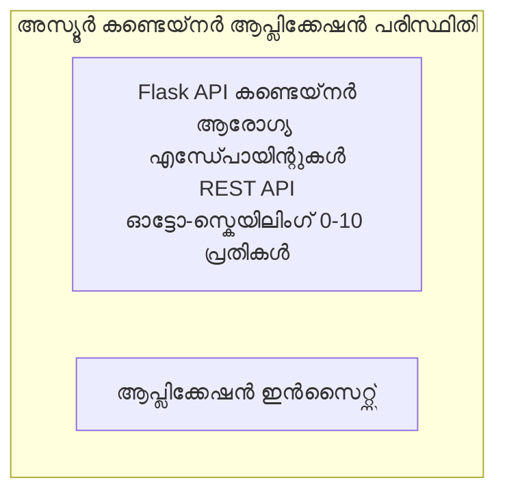

# ലളിതമായ ഫ്ലാസ്ക് API - കണ്ടെയ്‌നർ ആപ്പ് ഉദാഹരണം

**അധ്യയന പാത:** തുടക്കക്കാർ ⭐ | **സമയം:** 25-35 മിനിട്ട് | **ചെലവ്:** $0-15/മാസം

ആസ്യൂർ കണ്ടെയ്‌നർ ആപ്പുകളിൽ ആസ്യൂർ ഡെവലപ്പർ CLI (azd) ഉപയോഗിച്ച് ദൗത്യമിറക്കി പ്രവർത്തനക്ഷമ Python Flask REST API. ഈ ഉദാഹരണം കണ്ടെയ്‌നർ ദൗത്യമിറക്കൽ, സ്വയം-സ്കെയ്ലിംഗ്, മേൽനോട്ടം അടിസ്ഥാനങ്ങൾ കാണിക്കുന്നു.

## 🎯 നിങ്ങൾക്ക് പഠിക്കാൻ കഴിയുന്നത്

- കണ്ടെയ്‌നർ ചെയ്തത് Python ആപ്ലിക്കേഷൻ ആസ്യൂറിൽ ദൗത്യമിറക്കുക  
- സ്കെയ്ല്-ടു-സീറോ ഉപയോഗിച്ച് സ്വയം-സ്കെയ്ലിംഗ് ക്രമീകരിക്കുക  
- ഹെൽത്ത് പ്രോബുകളും റെഡിയ്നസ് ചെക്കുകളും നടപ്പിലാക്കുക  
- ആപ്ലിക്കേഷൻ ലോഗുകളും മെട്രിക്സുകളും മേൽനോട്ടം വഹിക്കുക  
- ദ്രുത ദൗത്യമിറക്കലിനായി ആസ്യൂർ ഡെവലപ്പർ CLI ഉപയോഗിക്കുക  

## 📦 എന്തു ഉൾപ്പെടുന്നു

✅ **ഫ്ലാസ്ക് ആപ്ലിക്കേഷൻ** - CRUD ഓപ്പറേഷനുകൾ സഹിതമുള്ള പൂർണ്ണ REST API (`src/app.py`)  
✅ **ഡോക്കർഫയൽ** - പ്രൊഡക്ഷൻ-തയ്യാറായ കണ്ടെയ്‌നർ ക്രമീകരണം  
✅ **ബൈസിപ്പ് ഇൻഫ്രാസ്ട്രക്‌ചർ** - കണ്ടെയ്‌നർ ആപ്പ്സ് പരിസരവും API ദൗത്യമിറക്കലും  
✅ **AZD ക്രമീകരണം** - ഒറ്റ കമാൻഡ് ദൗത്യമിറക്കൽ സെറ്റ്‌അപ്പ്  
✅ **ഹെൽത്ത് പ്രോബുകൾ** - ലൈവ്‌നെസും റെഡിയ്നസും ചെക്കുകൾ ക്രമീകരിച്ചിരിക്കുന്നു  
✅ **സ്വയം-സ്കെയ്ലിംഗ്** - HTTP ലോഡിന്റെ അടിസ്ഥാനത്തിൽ 0-10 റിപ്ലിക്കകൾ  

## ആഖ്യാനരചന


## മുൻകൂറുള്ള ആവശ്യങ്ങൾ

### ആവശ്യമായത്
- **ആസ്യൂർ ഡെവലപ്പർ CLI (azd)** - [ഇൻസ്റ്റാൾ ഗൈഡ്](https://learn.microsoft.com/azure/developer/azure-developer-cli/install-azd)  
- **ആസ്യൂർ സബ്സ്ക്രിപ്ഷൻ** - [ഫ്രീ അക്കൗന്റ്](https://azure.microsoft.com/free/)  
- **ഡോക്കർ ഡെസ്ക്ടോപ്പ്** - [ഡോക്കർ ഇൻസ്റ്റാൾ ചെയ്യുക](https://www.docker.com/products/docker-desktop/) (സ്ഥാനിയ പരിശോധനക്കായി)  

### മുൻകൂർ ആവശ്യങ്ങൾ പരിശോധിക്കുക

```bash
# ആസിഡി പതിപ്പ് പരിശോധിക്കുക (1.5.0 അല്ലെങ്കിൽ കൂടുതൽ വേണം)
azd version

# അസ്യൂർ ലോഗിൻ സ്ഥിരീകരിക്കുക
azd auth login

# ഡോക്കർ പരിശോധിക്കുക (ഐച്ഛികം, പ്രാദേശിക പരിശോധനക്ക്)
docker --version
```

## ⏱️ ദൗത്യമിറക്കൽ സമയരേഖ

| ഘട്ടം | കാലവളവ് | സംഭവിക്കുന്നത് |
|-------|----------|--------------||
| പരിസരം സജ്ജീകരണം | 30 സെക്കൻഡ് | azd പരിസരം സൃഷ്ടിക്കുക |
| കണ്ടെയ്‌നർ നിർമ്മാണം | 2-3 മിനിട്ട് | ഡോക്കർ ഉപയോഗിച്ച് ഫ്ലാസ്ക് ആപ്പ് നിർമ്മിക്കുക |
| ഇൻഫ്രാസ്ട്രക്‌ചർ ഒരുക്കൽ | 3-5 മിനിട്ട് | കണ്ടെയ്‌നർ ആപ്പുകൾ, രജിസ്ട്രി, മേൽനോട്ടം സൃഷ്ടിക്കുക |
| ആപ്ലിക്കേഷൻ ദൗത്യമിറക്കൽ | 2-3 മിനിറ്റ് | ഇമേജ് പുഷ് ചെയ്ത് കണ്ടെയ്‌നർ ആപ്പുകൾക്ക് ദൗത്യമിറക്കുക |
| **മൊത്തം** | **8-12 മിനിറ്റ്** | പൂർണ ദൗത്യമിറക്കൽ സജ്ജം |

## ദ്രുത ആരംഭം

```bash
# ഉദാഹരണത്തിലേക്ക് നാവിഗേറ്റ് ചെയ്യുക
cd examples/container-app/simple-flask-api

# പരിസ്ഥിതി പ്രാരംഭീകരിക്കുക (ഇതകം പേര് തിരഞ്ഞെടുക്കുക)
azd env new myflaskapi

# എല്ലാം വിന്യസിക്കുക (എൻഫ്രാസ്ട്രക്ചർ + ആപ്ലിക്കേഷൻ)
azd up
# നിങ്ങൾക്ക് ഇ_prompt ചെയ്യപ്പെടും:
# 1. ആസ്യൂർ സബ്സ്ക്രിപ്ഷൻ തിരഞ്ഞെടുക്കുക
# 2. സ്ഥലം തിരഞ്ഞെടുക്കുക (ഉദാവരണം, eastus2)
# 3. വിന്യാസത്തിനായി 8-12 മിനിറ്റുകൾ കാത്തിരിക്കുക

# നിങ്ങളുടെ API എൻഡ്പോയിന്റ് എടുക്കുക
azd env get-values

# API ടെസ്റ്റ് ചെയ്യുക
curl $(azd env get-value API_ENDPOINT)/health
```

**പ്രതീക്ഷിക്കുന്ന ഔട്ട്‌പുട്ട്:**  
```json
{
  "status": "healthy",
  "timestamp": "2025-11-19T10:30:00Z",
  "service": "simple-flask-api",
  "version": "1.0.0"
}
```

## ✅ ദൗത്യമിറക്കം സ്ഥിരീകരിക്കുക

### ഘട്ടം 1: ദൗത്യമിറക്കൽ നില പരിശോധിക്കുക

```bash
# വിന്യസിച്ച സേവനങ്ങൾ കാണുക
azd show

# പ്രതീക്ഷിക്കുന്ന_OUTPUT കാണിക്കുന്നു:
# - സേവനം: api
# - എൻഡ്‌പോയിന്റ്: https://ca-api-[env].xxx.azurecontainerapps.io
# - സ്ഥിതി: പ്രവർത്തിക്കുന്നു
```

### ഘട്ടം 2: API എന്റ്പോയിന്റുകൾ പരിശോധന

```bash
# എപി.ഐ എന്റ്പോയ്ിന്റ് ലഭിക്കുക
API_URL=$(azd env get-value API_ENDPOINT)

# ഹെൽത്ത് ടെസ്റ്റ് ചെയ്യുക
curl $API_URL/health

# റൂട്ട് എന്റ്പോയ്ിന്റ് ടെസ്റ്റ് ചെയ്യുക
curl $API_URL/

# ഒരു ഐറ്റം സൃഷ്ടിക്കുക
curl -X POST $API_URL/api/items \
  -H "Content-Type: application/json" \
  -d '{"name": "Test Item", "description": "My first item"}'

# എല്ലാ ഐറ്റങ്ങളും ലഭിക്കുക
curl $API_URL/api/items
```

**വിജയ മാനദണ്ഡങ്ങൾ:**  
- ✅ ഹെൽത്ത് എന്റ്പോയിന്റ് HTTP 200 തിരിച്ചുകിട്ടണം  
- ✅ റൂട്ട് എന്റ്പോയിന്റ് API വിവരങ്ങൾ കാണിക്കുന്നു  
- ✅ POST പുതിയ ഐറ്റം സൃഷ്ടിച്ച് HTTP 201 തിരിച്ചുവിടുന്നു  
- ✅ GET സൃഷ്ടിച്ച ഐറ്റങ്ങൾ തിരിച്ചുകിട്ടുന്നു  

### ഘട്ടം 3: ലോഗുകൾ കാണുക

```bash
# ലൈവ്ഡ് ലോഗുകൾ azd monitor ഉപയോഗിച്ച് സ്ട്രീം ചെയ്യുക
azd monitor --logs

# അല്ലെങ്കിൽ Azure CLI ഉപയോഗിക്കുക:
az containerapp logs show --name api --resource-group $RG_NAME --follow

# നിങ്ങൾ കാണാൻ കഴിയണം:
# - Gunicorn സ്റ്റാർട്ടപ്പ് സന്ദേശങ്ങൾ
# - HTTP അഭ്യർത്ഥന ലോഗുകൾ
# - ആപ്ലിക്കേഷൻ വിവര ലോഗുകൾ
```

## പ്രോജക്ട് ഘടന

```
simple-flask-api/
├── azure.yaml              # AZD configuration
├── infra/
│   ├── main.bicep         # Main infrastructure
│   ├── main.parameters.json
│   └── app/
│       ├── container-env.bicep
│       └── api.bicep
└── src/
    ├── app.py             # Flask application
    ├── requirements.txt
    └── Dockerfile
```

## API എന്റ്പോയിന്റുകൾ

| എന്റ്പോയിന്റ് | മെഥഡ് | വിശദീകരണം |
|--------------|--------|-------------|
| `/health` | GET | ഹെൽത്ത് ചെക്ക് |
| `/api/items` | GET | എല്ലാ ഐറ്റങ്ങളും പട്ടികപ്പതിപ്പ് |
| `/api/items` | POST | പുതിയ ഐറ്റം സൃഷ്ടിക്കുക |
| `/api/items/{id}` | GET | പ്രത്യേക ഐറ്റം ലഭിക്കുക |
| `/api/items/{id}` | PUT | ഐറ്റം അപ്പ്‌ഡേറ്റ് ചെയ്യുക |
| `/api/items/{id}` | DELETE | ഐറ്റം നീക്കം ചെയ്യുക |

## ക്രമീകരണം

### പരിസരം വേരിയബിളുകൾ

```bash
# കസ്റ്റം കോൺഫിഗറേഷൻ സെറ്റ് ചെയ്യുക
azd env set PORT 8000
azd env set LOG_LEVEL info
azd env set MAX_REPLICAS 20
```

### സ്കെയ്ലിംഗ് ക്രമീകരണം

API HTTP ട്രാഫിക്കിന്റെ അടിസ്ഥാനത്തിൽ സ്വയം സ്കെയ്ല് ചെയ്യും:  
- **കുറഞ്ഞ റിപ്ലിക്കകൾ**: 0 (ഐഡിലായിരിക്കുമ്പോൾ പൂർത്തിയായി സ്കെയ്ല്-ടു-സീറോ)  
- **മുൻനിര റിപ്ലിക്കകൾ**: 10  
- **രിപ്ലിക്കുകൾക്ക് പ്രതിയുള്ള സമകാലീന അഭ്യർത്ഥനകൾ**: 50  

## ഡെവലപ്മെന്റ്

### പ്രാദേശികമായി പ്രവർത്തിപ്പിക്കുക

```bash
# ആശ്രിതങ്ങൾ ഇൻസ്റ്റാൾ ചെയ്യുക
cd src
pip install -r requirements.txt

# ആപ്പ് പ്രവർത്തിപ്പിക്കുക
python app.py

# പ്രാദേശികമായി പരിശോധന ചെയ്യുക
curl http://localhost:8000/health
```

### കണ്ടെയ്‌നർ നിർമ്മിച്ച് പരീക്ഷിക്കുക

```bash
# ഡോക്കർ ഇമേജ് നിർമ്മിക്കുക
docker build -t flask-api:local ./src

# കോൺടെയ്‌നർ ലോക്കലിൽ ഓടിക്കുക
docker run -p 8000:8000 flask-api:local

# കോൺടെയ്‌നർ ടെസ്റ്റ് ചെയ്യുക
curl http://localhost:8000/health
```

## ദൗത്യമിറക്കൽ

### പൂർണ്ണ ദൗത്യമിറക്കൽ

```bash
# ഇൻഫ്രാസ്ട്രക്ചറും ആപ്ലിക്കേഷനും വിന്യാസപ്പെടുത്തുക
azd up
```

### കോഡ് മാത്രം ദൗത്യമിറക്കൽ

```bash
# വെറും അപ്ലിക്കേഷൻ കോഡ് ഡിപ്പ്ലോയു ചെയ്യുക (ഇൻഫ്രാസ്ട്രക്ഷർ മാറ്റം ഇല്ലാതെ)
azd deploy api
```

### ക്രമീകരണം പുതുക്കുക

```bash
# പരിസ്ഥിതി വേരിയബിൾസ് അപ്‌ഡേറ്റ് ചെയ്യുക
azd env set API_KEY "new-api-key"

# പുതിയ കോൺഫിഗറേഷനോടെ വീണ്ടും ഡിപ്ലോയ് ചെയ്യുക
azd deploy api
```

## മേൽനോട്ടം

### ലോഗുകൾ കാണുക

```bash
# azd monitor ഉപയോഗിച്ച് സജീവ ലോഗുകൾ സ്ട്രീം ചെയ്യുക
azd monitor --logs

# അല്ലെങ്കിൽ Container Apps ന് Azure CLI ഉപയോഗിക്കുക:
az containerapp logs show --name api --resource-group $RG_NAME --follow

# അവസാന 100 വരികൾ കാണുക
az containerapp logs show --name api --resource-group $RG_NAME --tail 100
```

### മെട്രിക്സുകൾ മേൽനോട്ടം

```bash
# Azure മോണിറ്റർ ഡാഷ്‌ബോർഡ് തുറക്കുക
azd monitor --overview

# പ്രത്യേക മെട്രിക്കുകൾ കാണുക
az monitor metrics list \
  --resource $(azd show --output json | jq -r '.services.api.resourceId') \
  --metric "Requests,ResponseTime"
```

## പരിശോധന

### ഹെൽത്ത് ചെക്ക്

```bash
curl $(azd show --output json | jq -r '.services.api.endpoint')/health
```

പ്രതീക്ഷിക്കുന്ന പ്രതികരണം:  
```json
{
  "status": "healthy",
  "timestamp": "2025-11-19T10:30:00Z"
}
```

### ഐറ്റം സൃഷ്ടിക്കുക

```bash
curl -X POST $(azd show --output json | jq -r '.services.api.endpoint')/api/items \
  -H "Content-Type: application/json" \
  -d '{"name": "Test Item", "description": "A test item"}'
```

### എല്ലാ ഐറ്റങ്ങളും ലഭിക്കുക

```bash
curl $(azd show --output json | jq -r '.services.api.endpoint')/api/items
```

## ചെലവ് ഓപ്റ്റിമൈസേഷൻ

ഈ ദൗത്യമിറക്കൽ സ്കെയ്ല്-ടു-സീറോ ഉപയോഗിക്കുന്നു, അതിനാൽ API അഭ്യർത്ഥനകൾ പ്രോസസ് ചെയ്യുമ്പോഴേ നിങ്ങൾക്ക് ചെലവ് ഉണ്ടാകൂ:

- **ഐഡിൽ ചെലവ്**: ~$0/മാസം (സ്കെയ്ല്-ടു-സീറോ)  
- **സജീവ ചെലവ്**: ~$0.000024/സെക്കൻഡ് പ്രതിരിപ്ലിക്ക  
- **പ്രതീക്ഷിക്കുന്ന മാസവരി ചെലവ്** (ലഘു ഉപയോഗം): $5-15  

### ചെലവ് കുറയ്ക്കുക

```bash
# ഡെവിനു വേണ്ടി പരമാവധി പ്രസ്ഹർമകങ്ങൾ കുറയ്ക്കുക
azd env set MAX_REPLICAS 3

# കുറവ് ഇഡിൽ ടൈംഔട്ട് ഉപയോഗിക്കുക
azd env set SCALE_TO_ZERO_TIMEOUT 300  # 5 മിനിറ്റ്
```

## തകരാറുകൾ പരിഹരിക്കൽ

### കണ്ടെയ്‌നർ ആരംഭിക്കുന്നില്ല

```bash
# Azure CLI ഉപയോഗിച്ച് കണ്ടെയ്‌നർ ലോഗുകൾ പരിശോധിക്കുക
az containerapp logs show --name api --resource-group $RG_NAME --tail 100

# Docker ഇമേജ് ലോക്കൽ ആയി ബിൽഡ് ചെയ്യുന്നത് സ്ഥിരീകരിക്കുക
docker build -t test ./src
```

### API ലഭ്യമല്ല

```bash
# ഇൻ‌ഗ്രസ്_EXTERNAL_ആണെന്ന് സ്ഥിരീകരിക്കുക
az containerapp show --name api --resource-group rg-simple-flask-api \
  --query properties.configuration.ingress.external
```

### മറുപടി സമയം കൂടുതലാണ്

```bash
# CPU/മെമ്മറി ഉപയോഗം പരിശോധിക്കുക
az monitor metrics list \
  --resource $(azd show --output json | jq -r '.services.api.resourceId') \
  --metric "CPUPercentage,MemoryPercentage"

# ആവശ്യമായാൽ വിഭവങ്ങൾ വർദ്ധിപ്പിക്കുക
az containerapp update --name api --resource-group rg-simple-flask-api \
  --cpu 1.0 --memory 2Gi
```

## ക്ലീൻ അപ്പ്

```bash
# എല്ലാ സ്രോതസ്സുകളും ഇല്ലാതാക്കുക
azd down --force --purge
```

## അടുത്ത ഘട്ടങ്ങൾ

### ഇതെഴുതൽ വിപുലീകരിക്കുക

1. **ഡാറ്റാബേസ് ചേർക്കുക** - Azure Cosmos DB അല്ലെങ്കിൽ SQL ഡാറ്റാബേസ് സംയോജിപ്പിക്കുക  
   ```bash
   # infra/main.bicepല്‍ Cosmos DB മോഡ്യൂള്‍ ചേർക്കുക
   # ഡാറ്റാബേസ് കണക്ഷനോടെ app.py അപ്‌ഡേറ്റ് ചെയ്യുക
   ```

2. **ഓതന്റിക്കേഷൻ ചേർക്കുക** - Azure AD അല്ലെങ്കിൽ API കീകൾ നടപ്പിലാക്കുക  
   ```python
   # app.py-ലേക്ക് ഓത്തന്റിക്കേഷൻ മിഡിൽവെയർ ചേർക്കുക
   from functools import wraps
   ```

3. **CI/CD ക്രമീകരിക്കുക** - GitHub Actions workflow  
   ```yaml
   # Create .github/workflows/deploy.yml
   name: Deploy to Azure
   on: [push]
   ```

4. **മാനേജ്ഡ് ഐഡന്റിറ്റി ചേർക്കുക** - Azure സേവനങ്ങളിലേക്കുള്ള സുരക്ഷിത ആക്‌സസ്  
   ```bicep
   # Update infra/app/api.bicep
   identity: { type: 'SystemAssigned' }
   ```

### ബന്ധപ്പെടുന്ന ഉദാഹരണങ്ങൾ

- **[ഡാറ്റാബേസ് ആപ്പ്](../../../../../examples/database-app)** - SQL ഡാറ്റാബേസ് ഉൾപ്പെടെ പൂർണ്ണ ഉദാഹരണം  
- **[മൈക്രോസർവിസുകൾ](../../../../../examples/container-app/microservices)** - മൾട്ടി-സർവീസ് ആഖ്യാനരചന  
- **[കണ്ടെയ്‌നർ ആപ്പ്സ് മാസ്റ്റർ ഗൈഡ്](../README.md)** - എല്ലാ കണ്ടെയ്‌നർ മാതൃകകളും  

### പഠന وسائل

- 📚 [AZD ഫോർ ബിഗിനേഴ്സ് കോഴ്‌സ്](../../../README.md) - പ്രധാന കോഴ്‌സ് ഹോം  
- 📚 [കണ്ടെയ്‌നർ ആപ്പ്സ് മാതൃകകൾ](../README.md) - കൂടുതൽ ദൗത്യമിറക്കി മാതൃകകൾ  
- 📚 [AZD ടെംപ്ലേറ്റ്സ് ഗാലറി](https://azure.github.io/awesome-azd/) - കമ്മ്യൂണിറ്റി ടെംപ്ലേറ്റുകൾ  

## അധിക വിഭവങ്ങൾ

### ഡോക്യുമെന്റേഷൻ  
- **[ഫ്ലാസ്ക് ഡോക്യുമെന്റേഷൻ](https://flask.palletsprojects.com/)** - ഫ്ലാസ്ക് ഫ്രെയിംവർക്കിൻ്റെ ഗൈഡ്  
- **[ആസ്യൂർ കണ്ടെയ്‌നർ ആപ്പുകൾ](https://learn.microsoft.com/azure/container-apps/)** - ഔദ്യോഗിക ആസ്യൂർ ഡോക്‌സ്  
- **[ആസ്യൂർ ഡെവലപ്പർ CLI](https://learn.microsoft.com/azure/developer/azure-developer-cli/)** - azd കമാൻഡ് റഫറൻസ്  

### ട്യൂട്ടോറിയലുകൾ  
- **[കണ്ടെയ്‌നർ ആപ്പ്സ് ക്വിക്‌സ്റ്റാർട്ട്](https://learn.microsoft.com/azure/container-apps/quickstart-portal)** - നിങ്ങളുടെ ആദ്യ ആപ്പ് ദൗത്യമിറക്കുക  
- **[ആസ്യൂറിൽ Python](https://learn.microsoft.com/azure/developer/python/)** - Python ഡെവലപ്മെന്റ് ഗൈഡ്  
- **[ബൈസിപ്പ് ഭാഷ](https://learn.microsoft.com/azure/azure-resource-manager/bicep/)** - ഇൻഫ്രാസ്ട്രക്‌ചർ എന്ന വേണ്ടിയുള്ള കോഡ്  

### ഉപകരണങ്ങൾ  
- **[ആസ്യൂർ പോർട്ടൽ](https://portal.azure.com)** - സ്രോതസുകൾ ദൃശ്യമായി നിയന്ത്രിക്കുക  
- **[VS കോഡ് ആസ്യൂർ എക്സ്റ്റൻഷൻ](https://marketplace.visualstudio.com/items?itemName=ms-azuretools.vscode-azurecontainerapps)** - IDE ഇന്റഗ്രേഷൻ  

---

**🎉 അഭിനന്ദനങ്ങൾ!** നിങ്ങൾ സ്വയം-സ്കെയ്ലിംഗും മേൽനോട്ടവുമുള്ള പ്രൊഡക്ഷൻ റെഡി ഫ്ലാസ്ക് API ആസ്യൂർ കണ്ടെയ്‌നർ ആപ്പുകളിൽ ദൗത്യമിറത്തി இருக்கുന്നു.

**ചോദ്യങ്ങളിൽ?** [ഒരു ഇഷ്യൂ തുറക്കുക](https://github.com/microsoft/AZD-for-beginners/issues) അല്ലെങ്കിൽ [FAQ](../../../resources/faq.md) പരിശോധിക്കുക

---

<!-- CO-OP TRANSLATOR DISCLAIMER START -->
**അസംബന്ധമായത്**:  
ഈ ദസ്താവേരം AI വിവർത്തന സേവനമായ [Co-op Translator](https://github.com/Azure/co-op-translator) ഉപയോഗിച്ച് വിവർത്തനം ചെയ്തതാണ്. നാം കൃത്യതയ്ക്കായി ശ്രമിച്ചിട്ടും, ഓട്ടോമാറ്റഡ് വിവർത്തനങ്ങളിൽ തെറ്റുകൾ അല്ലെങ്കിൽ അപര്യാപ്തതകൾ ഉണ്ടാകാമെന്ന് ദയവായി അറിയുക. പ്രഥമഭാഷയിലുള്ള മുള്ള ദസ്താവേരം അതിന്റെ അവിഭാജ്യ ഉറവിടമെന്ന നിലയിൽ പരിഗണിക്കേണ്ടതാണ്. അത്യാവശ്യ വിവരങ്ങൾക്ക്, പ്രൊഫഷണൽ മനുഷ്യ വിവർത്തനം ശുപാർശ ചെയ്യുന്നു. ഈ വിവർത്തനം ഉപയോഗിച്ചതിൽ നിന്ന് ഉണ്ടാകുന്ന തെറ്റിദ്ധാരണകൾക്കോ പിഴവുകൾക്കോ ഞങ്ങൾ ഉത്തരവാദികളല്ല.
<!-- CO-OP TRANSLATOR DISCLAIMER END -->