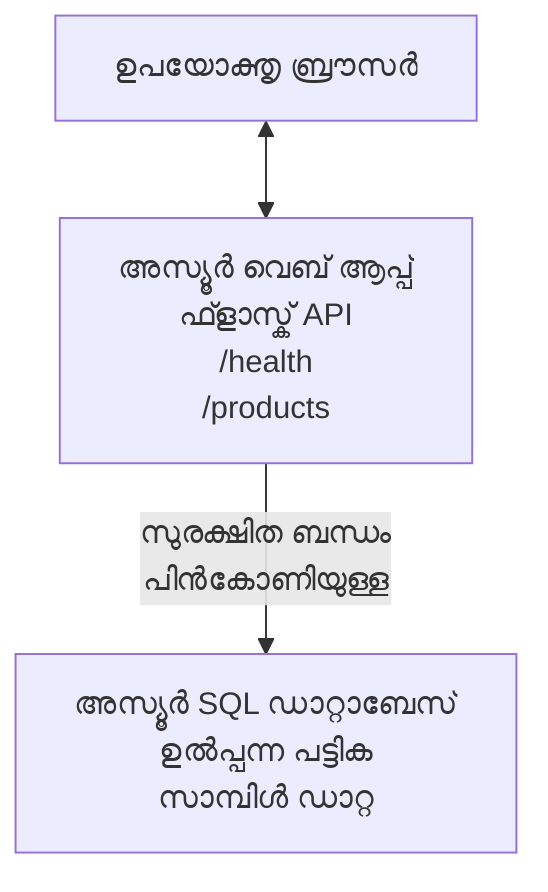

# AZD ഉപയോഗിച്ച് Microsoft SQL ഡാറ്റാബേസ്, വെബ് ആപ്പ് ഡിപ്ലോയ് ചെയ്യല്‍

⏱️ **അനുമാനിച്ച സമയം**: 20-30 മിനിറ്റ് | 💰 **അനുമാനിച്ച ചെലവ്**: ~$15-25/മാസം | ⭐ **സങ്കീര്‍ണ്ണത**: ഇടത്തരം

ഈ **സമഗ്ര, പ്രവര്‍ത്തനക്ഷമമായ ഉദാഹരണം** [Azure Developer CLI (azd)](https://learn.microsoft.com/azure/developer/azure-developer-cli/) ഉപയോഗിച്ച് Python Flask വെബ് ആപ്പും Microsoft SQL ഡാറ്റാബേസും Azure-യില്‍ എങ്ങനെ ഡിപ്ലോയ് ചെയ്യാമെന്ന് പ്രദര്‍ശിപ്പിക്കുന്നു. എല്ലാ കോഡുകളും ഉള്‍പ്പെടുത്തിയിട്ടുണ്ട്, പരീക്ഷിച്ചിരിക്കുന്നു—പുറത്തുവന്ന ആശ്രിതത്വങ്ങള്‍ വേണ്ട.

## നിങ്ങൾ എന്തെല്ലാം പഠിക്കും

ഈ ഉദാഹരണം പൂർത്തിയാക്കുന്നതിലൂടെ, നിങ്ങൾ:
- ഇൻഫ്രാസ്ട്രക്ചർ-ആസ്-കോഡ് ഉപയോഗിച്ച് മൾട്ടി-ടയറഡ് ആപ്ലിക്കേഷൻ (വെബ് ആപ്പ് + ഡാറ്റാബേസ്) ഡിപ്ലോയ് ചെയ്യുക
- ഹാർഡ്‌കോഡ് ചെയ്‌ത ഭേദഗതികളില്ലാതെ സുരക്ഷിത ഡാറ്റാബേസ് കണക്ഷനുകൾ ക്രമീകരിക്കുക
- ആപ്ലിക്കേഷൻ ഹെൽത്ത് Application Insights ഉപയോഗിച്ച് നിരീക്ഷിക്കുക
- AZD CLI ഉപയോഗിച്ച് Azure റിസോഴ്‌സുകൾ ഫലപ്രദമായി കൈകാര്യം ചെയ്യുക
- സുരക്ഷ, ചെലവ് മെച്ചപ്പെടുത്തൽ, നിരീക്ഷണത്തിനു വേണ്ടി Azure മികച്ച പ്രാക്ടിസുകൾ പിന്തുടരുക

## വിജയലക്ഷ്യം (സിനാരിയോ അവലോകനം)
- **വെബ് ആപ്പ്**: Python Flask REST API ഡാറ്റാബേസ് കണക്ഷനോടുകൂടി
- **ഡാറ്റാബേസ്**: സാമ്പിൾ ഡാറ്റയുള്ള Azure SQL ഡാറ്റാബേസ്
- **ഇൻഫ്രാസ്ട്രക്ചർ**: Bicep (മോഡുലാർ, പുനരുപയോഗയോഗ്യമായ ടെംപ്ലേറ്റുകൾ) ഉപയോഗിച്ച് പ്രൊവിഷൻ ചെയ്യപ്പെട്ടു
- **ഡിപ്ലോയ്‌മെന്റ്**: `azd` കമാൻഡുകൾ ഉപയോഗിച്ച് പൂർണ്ണമായും ഓട്ടോമേറ്റഡ്
- **നിരീക്ഷണം**: ലോഗുകൾക്കും ടെലിമെട്രീക്കും വേണ്ടി Application Insights

## മുൻപരിചയങ്ങൾ

### ആവശ്യമായ ടൂൾസ്

തുടക്കുന്നതിനുമുമ്പ്, താഴെപ്പറയുന്ന ടൂളുകൾ ഇൻസ്റ്റാൾ ചെയ്തിട്ടുണ്ടെന്ന് ഉറപ്പാക്കുക:

1. **[Azure CLI](https://learn.microsoft.com/cli/azure/install-azure-cli)** (2.50.0 പതിപ്പ് അല്ലെങ്കിൽ അതിൽ കൂടുതലായത്)
   ```sh
   az --version
   # പ്രതീക്ഷിച്ച ഔട്ട്പുട്ട്: azure-cli 2.50.0 അല്ലെങ്കിൽ അതിന് മുകളിൽ
   ```

2. **[Azure Developer CLI (azd)](https://learn.microsoft.com/azure/developer/azure-developer-cli/install-azd)** (1.0.0 പതിപ്പ് അല്ലെങ്കിൽ അതിൽ കൂടുതലായത്)
   ```sh
   azd version
   # പ്രതീക്ഷിച്ച ഔട്ട്പുട്ട്: azd പതിപ്പ് 1.0.0 അല്ലെങ്കിൽ അതിൽ മുകളിൽ
   ```

3. **[Python 3.8+](https://www.python.org/downloads/)** (ലോക്കൽ ഡെവലപ്‌മെന്റിന്)
   ```sh
   python --version
   # പ്രതീക്ഷിച്ച ഔട്ട്ഫുട്ട്: Python 3.8 അല്ലെങ്കിൽ അതിലധികം
   ```

4. **[Docker](https://www.docker.com/get-started)** (ഓപ്ഷണൽ, ലോക്കൽ കണ്ടെയ്‌നറൈസ്ഡ് ഡെവലപ്‌മെന്റിനായി)
   ```sh
   docker --version
   # പ്രതീക്ഷിച്ച ഫലത്: Docker പതിപ്പ് 20.10 അല്ലെങ്കിൽ അതിലും ഉയർന്നതോ
   ```

### Azure ആവശ്യകതകൾ

- സജീവമായ **Azure സബ്‌സ്‌ക്രിപ്ഷൻ** (ഒരു സൗജന്യ അക്കൗണ്ട് [സൃഷ്‌ടിക്കുക](https://azure.microsoft.com/free/))
- സബ്‌സ്‌ക്രിപ്ഷനിൽ റിസോഴ്‌സുകൾ സൃഷ്‌ടിക്കാൻ അവകാശങ്ങൾ
- സബ്‌സ്‌ക്രിപ്ഷനോ റിസോഴ്‌സ് ഗ്രൂപ്പോയിൽ **മാലិក** അല്ലെങ്കിൽ **കോൺട്രിബ്യൂട്ടർ** റോളുള്ളത്

### അറിവ് മുൻവിധികൾ

ഇത് **ഇടത്തരം തലത്തിലുള്ള** ഉദാഹരണമാണ്. ഇതിൽ പരിചയമുള്ളവർ എളുപ്പത്തിൽ മുന്നോട്ട് പോവാം:
- അടിസ്ഥാന കമാൻഡ് ലൈനുകൾ കൈകാര്യം ചെയ്യൽ
- ക്ലൗഡ് അടിസ്ഥാന ആശയങ്ങൾ (റിസോഴ്‌സുകൾ, റിസോഴ്‌സ് ഗ്രൂപ്പുകൾ)
- വെബ് ആപ്പുകൾ, ഡാറ്റാബേസുകൾ എന്നിവയുടെ അടിസ്ഥാന അറിവ്

**AZD പുതിയവർക്കായി?** ആദ്യം [Getting Started guide](../../docs/chapter-01-foundation/azd-basics.md) പിന്തുടരുക.

## വാസ്തുവിദ്യ (ആർക്കിടെക്ചർ)

ഈ ഉദാഹരണം ഒരു രണ്ട്‌ടയർ ആർക്കിടെക്ചർ ഡിപ്ലോയ് ചെയ്യുന്നു, ഒരു വെബ് ആപ്പ്, ഒരു SQL ഡാറ്റാബേസ് എന്നിവയാണുള്ളത്:


**റിസോഴ്‍സ് ഡിപ്ലോയ്‌മെന്റ്:**
- **റിസോഴ്‌സ് ഗ്രൂപ്പ്**: എല്ലാ റിസോഴ്‌സുകളുടെയും കണ്ടെയ്‌നർ
- **ആപ്പ് സർവീസ് പ്ലാൻ**: ലിനക്സിൽ അധിഷ്ഠിതമായ ഹോസ്റ്റിംഗ് (B1 ടയർ ചെലവ് കുറയ്ക്കാൻ)
- **വെബ് ആപ്പ്**: Python 3.11 റന്റൈം, Flask ആപ്പ്
- **SQL സെർവർ**: TLS 1.2 മിനിമം പിന്തുണയുള്ള മാനേജ്ഡ് ഡാറ്റാബേസ് സെർവർ
- **SQL ഡാറ്റാബേസ്**: ബേസിക് ടയർ (2GB, ഡെവലപ്‌മെന്റ്/ടെസ്റ്റിംഗിന് അനുയോജ്യം)
- **ആപ്ലിക്കേഷൻ ഇൻസൈറ്റ്‌സ്**: നിരീക്ഷണത്തിനും ലോഗിംഗിനും
- **ലോഗ് അനലിറ്റിക്സ് വർക്ക്‌സ്പേസ്**: ലോഗുകളുടെ കേന്ദ്രീകൃത സംഭരണം

**ഉദാഹരണം**: ഇത് ഒരു റെസ്റ്റോറന്റിന് (വെബ് ആപ്പ്) സമാനമാണ്, ഒരു വാക്ക്-ഇൻ ഫ്രീസർ (ഡാറ്റാബേസ്) ഉണ്ട്. ഉപഭോക്താക്കൾ മെനുവിൽ നിന്നു ഓർഡർ ചെയ്യുന്നു (API എന്റ്പോയിൻറ്), അടുക്കള (Flask ആപ്പ്) ഫ്രീസറിൽ നിന്ന് അവശ്യ വസ്തുക്കൾ (ഡാറ്റ) പിടിച്ച് നൽകുന്നു. റെസ്റ്റോറന്റ് മാനേജർ (Application Insights) എല്ലാം ശ്രദ്ധിക്കുന്നു.

## ഫോള്ഡർ ഘടന

ഈ ഉദാഹരണത്തിൽ എല്ലാ ഫയലുകളും ഉൾപ്പെടുത്തിയിട്ടുണ്ട്—പുറത്ത് ആശ്രിതത്വങ്ങൾ വേണ്ട:

```
examples/database-app/
│
├── README.md                    # This file
├── azure.yaml                   # AZD configuration file
├── .env.sample                  # Sample environment variables
├── .gitignore                   # Git ignore patterns
│
├── infra/                       # Infrastructure as Code (Bicep)
│   ├── main.bicep              # Main orchestration template
│   ├── abbreviations.json      # Azure naming conventions
│   └── resources/              # Modular resource templates
│       ├── sql-server.bicep    # SQL Server configuration
│       ├── sql-database.bicep  # Database configuration
│       ├── app-service-plan.bicep  # Hosting plan
│       ├── app-insights.bicep  # Monitoring setup
│       └── web-app.bicep       # Web application
│
└── src/
    └── web/                    # Application source code
        ├── app.py              # Flask REST API
        ├── requirements.txt    # Python dependencies
        └── Dockerfile          # Container definition
```

**പ്രതി ഫയല്‍ എന്താണ് ചെയ്യുന്നത്:**
- **azure.yaml**: AZDക്ക് എന്ത് ഡിപ്ലോയ് ചെയ്യണമെന്ന് കാണിക്കുന്നു
- **infra/main.bicep**: എല്ലാ Azure റിസോഴ്‌സുകളും കേന്ദ്രീകൃതമായി നിയന്ത്രിക്കുന്നു
- **infra/resources/*.bicep**: ഓരോ റിസോഴ്‌സ് നിർവചനങ്ങളും (പുനരുപയോഗത്തിന് മോഡുലാർ)
- **src/web/app.py**: ഡാറ്റാബേസ് ലജിക്ക് ഉള്‍പ്പെടെയുള്ള Flask ആപ്പ്
- **requirements.txt**: Python പാക്കേജ് ആശ്രിതത്വങ്ങൾ
- **Dockerfile**: ഡിപ്ലോയ്‌മെന്റിന് കണ്ടെയ്‌നറൈസേഷൻ നിർദ്ദേശങ്ങൾ

## ക്വിക്‌സ്റ്റാർട്ട് (പടി പടിയായി)

### പടി 1: ക്ലോൺ ചെയ്ത് നാവിഗേറ്റ് ചെയ്യുക

```sh
git clone https://github.com/microsoft/AZD-for-beginners.git
cd AZD-for-beginners/examples/database-app
```

**✓ വിജയ പരിശോധന**: `azure.yaml` ഫയൽ, `infra/` ഫോള്ഡർ കാണുന്നതായി പരിശോധിക്കുക:
```sh
ls
# Eസികരിച്ചിരിക്കുന്നു: README.md, azure.yaml, infra/, src/
```

### പടി 2: Azure-യിൽ ഓതന്റിക്കേറ്റ് ചെയുക

```sh
azd auth login
```

ഇത് ബ്രൗസർ തുറക്കും, Azure ഓതന്റിക്കേഷൻ വേണ്ടി. നിങ്ങളുടെ Azure ക്രെഡൻഷ്യലുകൾ കൊണ്ട് സൈൻ ഇൻ ചെയ്യുക.

**✓ വിജയ പരിശോധന**: നിങ്ങൾക്ക് താഴെ കാണണം:
```
Logged in to Azure.
```

### പടി 3: പരിസ്ഥിതി ആരംഭിക്കുക

```sh
azd init
```

**എന്ത് സംഭവിക്കുന്നു**: AZD ഡിപ്ലോയ്‌മെന്റിന് ലോക്കൽ കോൺഫിഗറേഷൻ സജ്ജമാക്കുന്നു.

**നോക്കേണ്ട പ്രോംപ്റ്റുകൾ**:
- **പാരിസ്ഥിതിക പേര്**: ചെറിയ പേര് നൽകുക (ഉദാ: `dev`, `myapp`)
- **Azure സബ്‌സ്‌ക്രിപ്ഷൻ**: ലിസ്റ്റിൽ നിന്നു സബ്‌സ്‌ക്രിപ്ഷൻ തിരഞ്ഞെടുക്കുക
- **Azure സ്ഥലം**: ഒരു റീജിയൻ തിരഞ്ഞെടുക്കുക (ഉദാ: `eastus`, `westeurope`)

**✓ വിജയ പരിശോധന**: നിങ്ങൾക്ക് താഴെ കാണാം:
```
SUCCESS: New project initialized!
```

### പടി 4: Azure റിസോഴ്‌സുകൾ പ്രൊവിഷൻ ചെയ്യുക

```sh
azd provision
```

**എന്ത് സംഭവിക്കുന്നു**: AZD എല്ലാ ഇൻഫ്രാസ്ട്രക്ചറും ഡിപ്ലോയ് ചെയ്യുന്നു (5-8 മിനിറ്റ് എടുത്തേക്കാം):
1. റിസോഴ്‌സ് ഗ്രൂപ്പ് സൃഷ്‌ടിക്കുന്നു
2. SQL സെർവർ, ഡാറ്റാബേസ് സൃഷ്‌ടിക്കുന്നു
3. ആപ്പ് സർവീസ് പ്ലാൻ സൃഷ്‌ടിക്കുന്നു
4. വെബ് ആപ്പ് സൃഷ്‌ടിക്കുന്നു
5. ആപ്ലിക്കേഷൻ ഇൻസൈറ്റ്‌സ് സജ്ജമാക്കുന്നു
6. നെറ്റ്വർക്കിംഗ്, സുരക്ഷ ക്രമീകരണം ചെയ്യുന്നു

**നിങ്ങളോട് ചോദിക്കപ്പെടും**:
- **SQL അഡ്മിൻ യൂസർനേം**: ഒരു യൂസർനേം നൽകുക (ഉദാ: `sqladmin`)
- **SQL അഡ്മിൻ പാസ്സ്‌വേഡ്**: കരുത്തുള്ള പാസ്സ്‌വേഡ് നൽകുക (സേവ് ചെയ്യുക!)

**✓ വിജയ പരിശോധന**: നിങ്ങൾക്ക് താഴെ കാണണം:
```
SUCCESS: Your application was provisioned in Azure in X minutes Y seconds.
You can view the resources created under the resource group rg-<env-name> in Azure Portal:
https://portal.azure.com/#@/resource/subscriptions/.../resourceGroups/rg-<env-name>
```

**⏱️ സമയം**: 5-8 മിനിറ്റ്

### പടി 5: ആപ്ലിക്കേഷൻ ഡിപ്ലോയ് ചെയ്യുക

```sh
azd deploy
```

**എന്ത് സംഭവിക്കുന്നു**: AZD Flask ആപ്പ് ബിൽഡ് ചെയ്ത് ഡിപ്ലോയ് ചെയ്യുന്നു:
1. Python ആപ്പ് പാക്കേജ് ചെയ്യുന്നു
2. Docker കണ്ടെയ്‌നർ ബിൽഡ് ചെയ്യുന്നു
3. Azure വെബ് ആപ്പിലേക്ക് പുഷ് ചെയ്യുന്നു
4. ഡാറ്റാബേസിന് സാമ്പിൾ ഡാറ്റ ആരംഭിക്കുന്നു
5. ആപ്പ് ആരംഭിക്കുന്നു

**✓ വിജയ പരിശോധന**: നിങ്ങൾക്ക് താഴെ കാണണം:
```
SUCCESS: Your application was deployed to Azure in X minutes Y seconds.
You can view the resources created under the resource group rg-<env-name> in Azure Portal:
https://portal.azure.com/#@/resource/subscriptions/.../resourceGroups/rg-<env-name>
```

**⏱️ സമയം**: 3-5 മിനിറ്റ്

### പടി 6: ആപ്ലിക്കേഷൻ ബ്രൗസ് ചെയ്യുക

```sh
azd browse
```

ഇത് നിങ്ങളുടെ ഡിപ്ലോയ്മെന്റ് ചെയ്ത വെബ് ആപ്പ് ബ്രൗസറിൽ തുറക്കും `https://app-<unique-id>.azurewebsites.net`

**✓ വിജയ പരിശോധന**: JSON ഔട്ട്പുട്ട് കാണണം:
```json
{
  "message": "Welcome to the Database App API",
  "endpoints": {
    "/": "This help message",
    "/health": "Health check endpoint",
    "/products": "List all products",
    "/products/<id>": "Get product by ID"
  }
}
```

### പടി 7: API എന്റ്പോയിന്റുകൾ ടെസ്റ്റ് ചെയ്യുക

**ഹെൽത്ത് ചെക്ക്** (ഡാറ്റാബേസ് കണക്ഷൻ പരിശോധിക്കുക):
```sh
curl https://app-<your-id>.azurewebsites.net/health
```

**പ്രതീക്ഷിക്കുന്ന പ്രതികരണം**:
```json
{
  "status": "healthy",
  "database": "connected"
}
```

**പ്രോഡക്റ്റ് ലിസ്റ്റ് ചെയ്യൽ** (സാമ്പിൾ ഡാറ്റ):
```sh
curl https://app-<your-id>.azurewebsites.net/products
```

**പ്രതീക്ഷിക്കുന്ന പ്രതികരണം**:
```json
[
  {
    "id": 1,
    "name": "Laptop",
    "description": "High-performance laptop",
    "price": 1299.99,
    "created_at": "2025-11-19T10:30:00"
  },
  ...
]
```

**ഒരു പ്രോഡക്റ്റ് നേടുക**:
```sh
curl https://app-<your-id>.azurewebsites.net/products/1
```

**✓ വിജയ പരിശോധന**: എല്ലാ എൻഡ്‌പോയിന്റുകളും പിശകുകളില്ലാതെ JSON ഡാറ്റ തിരികെ നൽകണം.

---

**🎉 അഭിനന്ദനങ്ങൾ!** AZD ഉപയോഗിച്ച് Azure-ൽ ഒരു വെബ് ആപ്പ് ഡാറ്റാബേസോടുകൂടി വിജയകരമായി ഡിപ്ലോയ് ചെയ്തു.

## കോൺഫിഗറേഷൻ വിശദീകരണം

### പരിസ്ഥിതി വേരിയബിളുകൾ

റഹസ്യങ്ങൾ Azure App Service കോൺഫിഗറേഷനിൽ സുരക്ഷിതമായി കൈകാര്യം ചെയ്യുന്നു—**സോഴ്സ് കോഡിൽ ഹാർഡ്‌കോഡ് ചെയ്യപ്പെടാതെ**.

**AZD സ്വയം ക്രമീകരിക്കുന്നു**:
- `SQL_CONNECTION_STRING`: എൻക്രിപ്പ്റ്റ് ചെയ്ത ക്രെഡൻഷ്യലുകളുള്ള ഡാറ്റാബേസ് കണക്ഷൻ
- `APPLICATIONINSIGHTS_CONNECTION_STRING`: ടെലിമെട്രി എന്റ്പോയിന്റ്
- `SCM_DO_BUILD_DURING_DEPLOYMENT`: സ്വയം ആശ്രിതത്വ ഇൻസ്റ്റലേഷൻ സജീവമാക്കുക

**റഹസ്യങ്ങൾ എവിടെ സൂക്ഷിക്കുന്നു**:
1. `azd provision` സമയത്ത് SQL ക്രെഡൻഷ്യലുകൾ സുരക്ഷിത പ്രോംപ്റ്റിലൂടെ നൽകുന്നു
2. AZD ഇവ നിങ്ങളുടെ ലോക്കൽ `.azure/<env-name>/.env` ഫയലിൽ (Git-ഇഗ്നോർ ചെയ്ത) സംഭരിക്കുന്നു
3. AZD അവ Azure App Service കോൺഫിഗറേഷനിൽ ഇന്‍ജെക്ട് ചെയ്യുന്നു (റസ്റ്റ്-ൽ എൻക്രിപ്പ്റ്റ് ചെയ്യുന്നു)
4. ആപ്പ് റൺടൈമിൽ `os.getenv()` വഴി റഹസ്യങ്ങൾ വായിക്കുന്നു

### ലോക്കൽ ഡെവലപ്‌മെന്റ്

ലോക്കൽ ടെസ്റ്റിംഗിന് സാമ്പിൾ കോപ്പി കൊണ്ട് `.env` ഫയൽ സൃഷ്‌ടിക്കുക:

```sh
cp .env.sample .env
# നിങ്ങളുടെ ലോക്കൽ ഡാറ്റാബേസ് കണക്ഷനുമായി .env എഡിറ്റ് ചെയ്യുക
```

**ലോക്കൽ ഡെവലഫ്‌മെന്റ് പ്രവൃത്തിപദ്ധതി**:
```sh
# ആശ്രിതങ്ങൾ ഇൻസ്റ്റാൾ ചെയ്യുക
cd src/web
pip install -r requirements.txt

# പരിസ്ഥിതി വ്യത്യാസങ്ങൾ സജ്ജമാക്കുക
export SQL_CONNECTION_STRING="your-local-connection-string"

# ആപ്ലിക്കേഷൻ പ്രവർത്തിപ്പിക്കുക
python app.py
```

**ലോക്കലായി ടെസ്റ്റ് ചെയ്യുക**:
```sh
curl http://localhost:8000/health
# പ്രതീക്ഷിച്ചത്: {"സ്ഥിതി": "ആരോഗ്യം", "ഡാറ്റാബേസ്": "ബന്ധിപ്പിച്ചു"}
```

### ഇൻഫ്രാസ്ട്രക്ചർ ആസ് കോഡ്

എല്ലാ Azure റിസോഴ്‌സുകളും **Bicep ടെംപ്ലേറ്റുകൾ** (`infra/` ഫോൾഡർ) ഉപയോഗിച്ച് നിർവചിച്ചിരിക്കുന്നു:

- **മോഡുലാർ ഡിസൈൻ**: ഓരൊരു റിസോഴ്‌സ് തരം താനായി ഫയൽ ഉണ്ട്, പുനരുപയോഗത്തിന്
- **പരാമീറ്ററൈസ്ഡ്**: SKUകൾ, റീജിയൻസ്, നെയിമിംഗ് കൺവെൻഷനുകൾ ഇഷ്ടാനുസൃതമാക്കാവുന്നതായി
- **മെച്ചപ്പെട്ട പ്രാക്ടിസുകൾ**: Azure നെയിമിംഗ് സ്റ്റാൻഡേർഡുകളും സുരക്ഷാ ഡീഫാള്റുകളും പിന്തുടരുന്നു
- **വർഷൻ കൊണ്ട്രോൾഡ്**: ഇൻഫ്രാസ്ട്രക്ചർ മാറ്റങ്ങൾ Git ൽ ട്രാക്ക് ചെയ്യുന്നു

**കസ്റ്റമൈസേഷൻ ഉദാഹരണം**:
ഡാറ്റാബേസ് ടയർ മാറ്റാൻ, `infra/resources/sql-database.bicep` എഡിറ്റ് ചെയ്യുക:
```bicep
sku: {
  name: 'Standard'  // Changed from 'Basic'
  tier: 'Standard'
  capacity: 10
}
```

## സുരക്ഷാ മികച്ച പ്രാക്ടിസുകൾ

ഈ ഉദാഹരണം Azure സുരക്ഷാ മികച്ച രീതികൾ അനുസരിക്കുന്നു:

### 1. **സോഴ്സ് കോഡിൽ രഹസ്യങ്ങൾ ഇല്ല**
- ✅ ക്രെഡൻഷ്യലുകൾ Azure App Service കോൺഫിഗറേഷനിൽ സൂക്ഷിക്കുന്നു (എൻക്രിപ്റ്റ് ചെയ്ത)
- ✅ `.env` ഫയലുകൾ Git-ൽ നിന്നും ഒഴിവാക്കുന്നു `.gitignore` വഴി
- ✅ പ്രൊവിഷണിങ്ങിൽ സുരക്ഷിത പരാമീറ്ററുകൾ വഴി രഹസ്യങ്ങൾ നൽകി കൈമാറ്റം ചെയ്യുന്നു

### 2. **എൻക്രിപ്റ്റ് ചെയ്ത കണക്ഷനുകൾ**
- ✅ SQL സെർവറിന് TLS 1.2 മിനിമം
- ✅ വെബ് ആപ്പിന് HTTPS മാത്രം പ്രാപ്തമാക്കി
- ✅ ഡാറ്റാബേസ് കണക്ഷനുകൾ എൻക്രിപ്റ്റ് ചെയ്ത ചാനലുകൾ ഉപയോഗിക്കുന്നു

### 3. **നെറ്റ്‍വർക്ക് സുരക്ഷ**
- ✅ SQL സെർവർ ഫയർവാൾ Azure സേവനങ്ങൾക്കു മാത്രം അനുവദിച്ച് ക്രമീകരിച്ചിരിക്കുന്നു
- ✅ പബ്ലിക് നെറ്റ്‌വർക്ക് ആക്‌സസ് നിയന്ത്രിച്ചു (പ്രൈവറ്റ് എൻഡ്‌പോയിന്റുകളും മറ്റും കൂടി സുരക്ഷ വർദ്ധിപ്പിക്കാം)
- ✅ വെബ് ആപ്പിൽ FTPS നിഷ്പ്രഭം

### 4. **ഓതന്റിക്കേഷൻ & അകത്താഴം**
- ⚠️ **നിലവിലെ**: SQL ഓതന്റിക്കേഷൻ (യൂസർനേം/പാസ്സ്‌വേഡ്)
- ✅ **പ്രൊഡക്ഷൻ ശിപാർശ**: പാസ്‌വേഡ്-രഹിതമായ ഓതന്റിക്കേഷന്റെ വേണ്ടി Azure Managed Identity ഉപയോഗിക്കുക

**Managed Identity-ലേക്ക് അപ്ഗ്രേഡ് ചെയ്യാനുള്ള നടപടികൾ** (പ്രൊഡക്ഷൻ):
1. വെബ് ആപ്പിൽ മാനേജ്ഡ് ഐഡന്റിറ്റി സജീവമാക്കുക
2. സിഖ്യുരിറ്റി ഐഡന്റിറ്റിക്ക് SQL അനുമതികൾ നൽകുക
3. കണക്ഷൻ സ്ട്രിംഗ് മാനേജ്ഡ് ഐഡന്റിറ്റി ഉപയോഗിച്ച് അപ്ഡേറ്റ് ചെയ്യുക
4. പാസ്‌വേഡ് അടിസ്ഥാന ഓതന്റിക്കേഷൻ നീക്കുക

### 5. **ഓഡിറ്റിംഗ് & പാലന നിയന്ത്രണങ്ങൾ**
- ✅ Application Insights എല്ലാ അഭ്യർത്ഥനകളും പിശകുകളും ലോഗ് ചെയ്യുന്നു
- ✅ SQL ഡാറ്റാബേസ് ഓഡിറ്റിംഗ് സജ്ജമാക്കിയിട്ടുണ്ട് (പാലനം ആവശ്യമായ പ്രകാരം ക്രമീകരിക്കാം)
- ✅ എല്ലാ റിസോഴ്‌സിനും ഗവണൻസ് ടാഗുകൾ ചേർക്കുന്നു

**പ്രൊഡക്ഷനു മുൻപുള്ള സുരക്ഷാ പരിശോധ പട്ടിക**:
- [ ] SQL-ക്ക് Azure Defender സജീവമാക്കുക
- [ ] SQL ഡാറ്റാബേസിനു പ്രൈവറ്റ് എൻഡ്‌പോയിന്റുകൾ ക്രമീകരിക്കുക
- [ ] Web Application Firewall (WAF) സജ്ജമാക്കുക
- [ ] രഹസ്യങ്ങൾ മാറ്റുന്നതിനായി Azure Key Vault ഉപയോഗിക്കുക
- [ ] Azure AD ഓതന്റിക്കേഷൻ ക്രമീകരിക്കുക
- [ ] എല്ലാ റിസോഴ്‌സിനും ഡയഗ്നോസ്റ്റിക് ലോഗിംഗ് സജീവമാക്കുക

## ചെലവ് മെച്ചപ്പെടുത്തല്‍

**അനുമാനിച്ച മാസാന്ത ചെലവ്** (നവംബർ 2025 വരെ):

| റിസോഴ്‌സ് | SKU/ടയർ | അനുമാനിച്ച ചെലവ് |
|----------|----------|----------------|
| ആപ്പ് സർവീസ് പ്ലാൻ | B1 (ബേസിക്) | ~$13/മാസം |
| SQL ഡാറ്റാബേസ് | ബേസിക് (2GB) | ~$5/മാസം |
| ആപ്ലിക്കേഷൻ ഇൻസൈറ്റ്‌സ് | പേ-ആസ്-യൂ-ഗോ | ~$2/മാസം (കുറഞ്ഞ ട്രാഫിക്) |
| **മൊത്തം** | | **~$20/മാസം** |

**💡 ചെലവ് കുറയ്ക്കാനുള്ള സൂചനകൾ**:

1. **കലയ്ക്കുവേണ്ടി സൗജന്യ ടയർ ഉപയോഗിക്കുക**:
   - ആപ്പ് സർവീസ്: F1 ടയർ (സ്വതന്ത്രം, പാർഷ്യൽ അവധി മണിക്കൂറുകൾ)
   - SQL ഡാറ്റാബേസ്: Azure SQL സെർവർലെസ് ഉപയോഗിക്കുക
   - ആപ്ലിക്കേഷൻ ഇൻസൈറ്റ്‌സ്: 5GB/മാസം സൗജന്യ ഇൻജെക്ഷൻ

2. **ആവശ്യതമല്ലാത്തപ്പോൾ റിസോഴ്‌സുകൾ നിർത്തിവെക്കുക**:
   ```sh
   # വെബ് ആപ്പ് നിർത്തുക (ഡേറ്റാബേസ് ഫീസുകൾ തുടരുന്നു)
   az webapp stop --name <app-name> --resource-group <rg-name>
   
   # ആവശ്യമുള്ളപ്പോൾ വീണ്ടും ആരംഭിക്കുക
   az webapp start --name <app-name> --resource-group <rg-name>
   ```

3. **ടെസ്റ്റിംഗിനു ശേഷം എല്ലാം മായ്ക്കുക**:
   ```sh
   azd down
   ```
   ഇത് എല്ലാ റിസോഴ്‌സുകളും അകത്താക്കുകയും ചാർജുകൾ നിർത്തുകയും ചെയ്യും.

4. **ഡെവലപ്‌മെന്റും പ്രൊഡക്ഷനും വ്യത്യസ്ത SKUകൾ**:
   - **ഡെവലപ്‌മെന്റ്**: ബേസിക് ടയർ (ഈ ഉദാഹരണത്തിലെ പോലെ)
   - **പ്രൊഡക്ഷൻ**: സ്റ്റാന്ഡേർഡ്/പ്രീംיום ടയർ, റിഡണ്ടൻസി ഉൾപ്പെടെ

**ചെലവ് നിരീക്ഷണം**:
- ചെലവുകൾ [Azure Cost Management](https://portal.azure.com/#view/Microsoft_Azure_CostManagement) ൽ കാണുക
- അപ്രതീക്ഷിത ചെലവുകൾ ഒഴിവാക്കാൻ അലർട്ട് ക്രമീകരിക്കുക
- `azd-env-name` എന്ന ടാഗ് എല്ലാ റിസോഴ്‌സുകൾക്കും ചേർക്കുക

**സൗജന്യ ടയർ വഴിയുള്ള learning**:
`infra/resources/app-service-plan.bicep` തിരുത്താം:
```bicep
sku: {
  name: 'F1'  // Free tier
  tier: 'Free'
}
```
**കുറിപ്പ്**: സൗജന്യ ടയറിന് ചില പരിമിതികൾ (ദിവസം 60 മിനിറ്റ് CPU, ആൾവെയ്‌സ് ഓൺ ഇല്ല).

## നിരീക്ഷണം & ദൃശ്യവൽക്കരണം (Observability)

### ആപ്ലിക്കേഷൻ ഇൻസൈറ്റ്‌സ് ഇന്റഗ്രേഷൻ

ഈ ഉദാഹരണം സമഗ്രമായ നിരീക്ഷണത്തിനായി **Application Insights** ഉൾക്കൊള്ളുന്നു:

**എന്തു നിരീക്ഷിക്കുന്നു**:
- ✅ HTTP അഭ്യര്‍ത്ഥനകള്‍ (ശൈലി, സ്റ്റാറ്റസ് കോഡുകൾ, എന്റ്പോയിന്റുകൾ)
- ✅ ആപ്ലിക്കേഷൻ പിഴവുകൾ,Exception-കൾ
- ✅ Flask ആപ്പിന്റെ കസ്റ്റം ലോഗിംഗ്
- ✅ ഡാറ്റാബേസ് കണക്ഷൻ ഹെൽത്ത്
- ✅ പ്രകടനമെറ്റ്രിക്‌സ് (CPU, മെമ്മറി)

**Application Insights ലഭിക്കുന്ന വിധം**:
1. [Azure Portal](https://portal.azure.com) തുറക്കുക
2. നിങ്ങളുടെ റിസോഴ്‌സ് ഗ്രൂപ്പ് (`rg-<env-name>`) തിരഞ്ഞെടുക്കുക
3. Application Insights റിസോഴ്‌സ് (`appi-<unique-id>`) ക്ലിക്ക് ചെയ്യുക

**പ്രയോഗശേഷിക്കായി Queries** (Application Insights → Logs):

**എല്ലാ അഭ്യര്‍ത്ഥനകളും കാണുക**:
```kusto
requests
| where timestamp > ago(1h)
| order by timestamp desc
| project timestamp, name, url, resultCode, duration
```

**പിഴവുകൾ കണ്ടെത്തുക**:
```kusto
exceptions
| where timestamp > ago(24h)
| order by timestamp desc
| project timestamp, type, outerMessage, operation_Name
```

**ഹെൽത്ത് എൻഡ്‌പോയിന്റ് പരിശോധിക്കുക**:
```kusto
requests
| where name contains "health"
| summarize count() by resultCode, bin(timestamp, 1h)
```

### SQL ഡാറ്റാബേസ് ഓഡിറ്റിംഗ്

**SQL ഡാറ്റാബേസ് ഓഡിറ്റിംഗ് സജ്ജമാക്കിയിട്ടുണ്ട്**, ഇത് ത് രേഖപ്പെടുത്തുന്നു:
- ഡാറ്റാബേസ് ആക്‌സസ് പാറ്റേണുകൾ
- പരാജയപ്പെട്ട ലോഗിൻ ശ്രമങ്ങൾ
- സ്കീമ മാറ്റങ്ങൾ
- ഡാറ്റ ആക്‌സസ് (പാലനം ആവശ്യാനുസരണം)

**ഓഡിറ്റ് ലോഗുകൾ കാണാൻ**:
1. Azure Portal → SQL ഡാറ്റാബേസ് → Auditing
2. ലോഗ് അനലിറ്റിക്സ് വർക്ക്‌സ്പേസ് ഉപയോഗിച്ച് ലോഗുകൾ കാണുക

### റിയൽ-ടൈം നിരീക്ഷണം

**ലൈവ് മെറ്റ്രിക്‌സ് കാണുക**:
1. Application Insights → Live Metrics
2. അഭ്യർത്ഥനകൾ, പരാജയങ്ങൾ, പ്രകടനം റിയൽ-ടൈമിൽ കാണാം

**അലർറ്റ് ക്രമീകരിക്കുക**:
ഗുരുതര സംഭവങ്ങൾക്കായി അലർട്ടുകൾ സജ്ജമാക്കുക:
- HTTP 500 പിഴവുകൾ > 5 എണ്ണം 5 മിനിറ്റിൽ
- ഡാറ്റാബേസ് കണക്ഷൻ പരാജയം
- ഉയർന്ന പ്രതികരണസമയം (>2 സെക്കൻഡ്)

**അലർട്ട് ഉണ്ടാക്കുന്നതിന്റെ ഉദാഹരണം**:
```sh
az monitor metrics alert create \
  --name "High-Response-Time" \
  --resource-group <rg-name> \
  --scopes <app-insights-resource-id> \
  --condition "avg requests/duration > 2000" \
  --description "Alert when response time exceeds 2 seconds"
```

## പ്രശ്‌നം കണ്ടെത്തൽ (Troubleshooting)
### സാധാരണ പ്രശ്നങ്ങളും പരിഹാരങ്ങളും

#### 1. `azd provision` "Location not available" সঙ্গে പരാജയപ്പെടുന്നു

**രോഗലക്ഷണം**:  
```
Error: The subscription is not registered for the resource type 'components' in the location 'centralus'.
```
  
**പരിഹാരം**:  
വ്യത്യസ്തമായ ഒരു Azure ജില്ല തിരഞ്ഞെടുക്കുക അല്ലെങ്കിൽ റിസോഴ്‌സ് പ്രൊവൈഡറെ രജിസ്റ്റർ ചെയ്യുക:  
```sh
az provider register --namespace Microsoft.Insights
```
  
#### 2. SQL കണക്ഷൻ ഡിപ്പ്ലോയ്മെന്റ് സമയത്ത് പരാജയപ്പെടുന്നു

**രോഗലക്ഷണം**:  
```
pyodbc.OperationalError: ('08001', '[08001] [Microsoft][ODBC Driver 18 for SQL Server]TCP Provider...')
```
  
**പരിഹാരം**:  
- SQL സർവർ ഫയർവാൾ Azure സർവീസുകൾക്കായി അനുവദിക്കുന്നുണ്ടോ എന്ന് പരിശോധന നടത്തുക (സ്വയം ക്രമീകരിക്കപ്പെട്ടിരിക്കും)  
- `azd provision` സമയത്ത് SQL അഡ്മിൻ പാസ്‌വേഡ് ശരിയായി നൽകിയിട്ടുണ്ടോയെന്ന് പരിശോധിക്കുക  
- SQL സർവർ പൂർണമായി പ്രൊവിഷൻ ചെയ്തിട്ടുണ്ടെന്ന് ഉറപ്പാക്കുക (2-3 മിനിറ്റ് വരെ സമയംെടുക്കാം)  

**കണക്ഷൻ പരിശോധിക്കുക**:  
```sh
# അസ്യൂർ പോർട്ടലിൽ നിന്നു്, SQL ഡാറ്റാബേസിലേക്ക് → ക്വറി എഡിറ്ററിലേക്ക് പോകുക
# നിങ്ങളുടെ ക്രെഡൻഷ്യലുകളുമായി ബന്ധിപ്പിക്കാൻ ശ്രമിക്കുക
```
  
#### 3. വെബ് ആപ്പ് "Application Error" കാണിക്കുന്നു

**രോഗലക്ഷണം**:  
ബ്രൗസറിൽ ജനറിക് എറർ പേജ് കാണിക്കുക.  

**പരിഹാരം**:  
അപ്ലിക്കേഷൻ ലോഗുകൾ പരിശോധിക്കുക:  
```sh
# പുതിയ ലോഗുകൾ കാണുക
az webapp log tail --name <app-name> --resource-group <rg-name>
```
  
**സാധാരണ കാരണങ്ങൾ**:  
- പര്യവോഷണ ഘടകങ്ങൾ കാണാനയതിലുളള അപാകത (App Service → Configuration പരിശോധിക്കുക)  
- Python പാക്കേജ് ഇൻസ്റ്റലേഷൻ പരാജയം (ഡിപ്പ്ലോയ്മെന്റ് ലോഗുകൾ പരിശോധിക്കുക)  
- ഡാറ്റാബേസ് ഇൻിഷ്യലൈസേഷൻ പിശക് (SQL കണക്ഷൻ പരിശോധിക്കുക)  

#### 4. `azd deploy` "Build Error" കാണിക്കുന്നു

**രോഗലക്ഷണം**:  
```
Error: Failed to build project
```
  
**പരിഹാരം**:  
- `requirements.txt` ൽ യാതൊരു സിന്റാക്‌സ് പിശകുകളും ഇല്ലെന്ന് ഉറപ്പാക്കുക  
- `infra/resources/web-app.bicep` ൽ Python 3.11 വ്യക്തമാക്കിയിട്ടുണ്ടോ എന്ന് പരിശോധിക്കുക  
- Dockerfile ൽ ശരിയായ ബേസ് ഇമേജ് ഉപയോഗിച്ചിട്ടുണ്ടെന്ന് സ്ഥിരീകരിക്കുക  

**ലോകലായി ഡീബഗ് ചെയ്യുക**:  
```sh
cd src/web
docker build -t test-app .
docker run -p 8000:8000 test-app
```
  
#### 5. AZD കമാൻഡുകൾ നടത്തുമ്പോൾ "Unauthorized" കാണിക്കുന്നു

**രോഗലക്ഷണം**:  
```
ERROR: (Unauthorized) The client '<id>' with object id '<id>' does not have authorization
```
  
**പരിഹാരം**:  
Azure-യിൽ വീണ്ടും പ്രാമാണീകരിക്കുക:  
```sh
# AZD വർക്‌ഫ്ലോകൾക്ക് ആവശ്യമാണ്
azd auth login

# നിങ്ങൾ Azure CLI കമാൻഡുകൾ നേരിട്ടും ഉപയോഗിച്ചെങ്കിൽ ഐച്ഛികമാണ്
az login
```
  
സബ്‌സ്ക്രിപ്ഷനിൽ (Contributor റോളിൽ) ശരിയായ അനുമതികൾ അവിടെയുണ്ടെന്ന് പരിശോധിക്കുക.  

#### 6. ഉയർന്ന ഡാറ്റാബേസ് ചെലവുകൾ

**രോഗലക്ഷണം**:  
ആശ്ചര്യകരമായ Azure ബിൽ.  

**പരിഹാരം**:  
- ടെസ്റ്റുചെയ്യുന്നതിനു ശേഷം `azd down` റൺ ചെയ്യാന് മറന്നുണ്ടോ എന്ന് പരിശോധിക്കുക  
- SQL ഡാറ്റാബേസ് ബേസിക് ടിയർ ഉപയോഗിക്കുന്നുണ്ടോ എന്ന് സ്ഥിരീകരിക്കുക (പ്രീമിയം അല്ല)  
- Azure Cost Management ൽ ചെലവുകൾ അവലോകനം ചെയ്യുക  
- ചെലവ് അലര്‍ട്ടുകൾ സജ്ജമാക്കുക  

### സഹായം നേടുക

**സകല AZD Environment Variables കാണുക**:  
```sh
azd env get-values
```
  
**ഡിപ്പ്ലോയ്മെന്റ് സ്റ്റാറ്റസ് പരിശോധിക്കുക**:  
```sh
az webapp show --name <app-name> --resource-group <rg-name> --query state
```
  
**അപ്ലിക്കേഷൻ ലോഗുകൾ ആക്സസ് ചെയ്യുക**:  
```sh
az webapp log download --name <app-name> --resource-group <rg-name> --log-file app-logs.zip
```
  
**കൂടുതൽ സഹായം വേണോ?**  
- [AZD Troubleshooting Guide](../../docs/chapter-07-troubleshooting/common-issues.md)  
- [Azure App Service Troubleshooting](https://learn.microsoft.com/azure/app-service/troubleshoot-diagnostic-logs)  
- [Azure SQL Troubleshooting](https://learn.microsoft.com/azure/azure-sql/database/troubleshoot-common-errors-issues)  

## പ്രായോഗിക അഭ്യാസങ്ങൾ

### അഭ്യാസം 1: നിങ്ങളുടെ ഡിപ്പ്ലോയ്മെന്റ് പരിശോധിക്കുക (ആരംഭക്കാർക്കായി)

**ലക്ഷ്യം**: എല്ലാ റിസോഴ്‌സുകളും ഡിപ്പ്ലോയ്മെന്റ് ചെയ്തിട്ടുണ്ടെന്ന്, അപ്ലിക്കേഷൻ പ്രവർത്തിക്കുന്നുണ്ടെന്ന് ഉറപ്പാക്കുക.  

**പടികൾ**:  
1. നിങ്ങളുടെ റിസോഴ്‌സ് ഗ്രൂപ്പിൽ ഉള്ള എല്ലാ റിസോഴ്‌സുകളും ലിസ്റ്റ് ചെയ്യുക:  
   ```sh
   az resource list --resource-group rg-<env-name> --output table
   ```
  
**പ്രതീക്ഷിക്കുന്നതു:** 6-7 റിസോഴ്‌സുകൾ (Web App, SQL Server, SQL Database, App Service Plan, Application Insights, Log Analytics)  

2. എല്ലാ API എന്റ്പോയിന്റുകളും ടെസ്റ്റ് ചെയ്യുക:  
   ```sh
   curl https://app-<your-id>.azurewebsites.net/
   curl https://app-<your-id>.azurewebsites.net/health
   curl https://app-<your-id>.azurewebsites.net/products
   curl https://app-<your-id>.azurewebsites.net/products/1
   ```
  
**പ്രതീക്ഷിക്കുന്നതു:** എല്ലാം ശരിയായ JSON സ്രോതസ്സുകൾ നൽകുന്നു, പിശകുകൾ ഇല്ലാതെ  

3. Application Insights പരിശോധിക്കുക:  
   - Azure പോർട്ടൽ中的 Application Insights ലേക്ക് നേവിഗേറ്റ് ചെയ്യുക  
   - "ലൈവ് മെട്രിക്‌സ്" ഓപ്ഷനിലേക്ക് പോകുക  
   - വെബ് ആപ്പിൽ ബ്രൗസർ റിഫ്രഷ് ചെയ്യുക  
   **പ്രതീക്ഷിക്കുന്നതു:** അപേക്ഷണ അഭ്യർത്ഥനകൾ റിയൽ-ടൈമിൽ കാണപ്പെടുന്നു  

**വിജയം അളക്കുമ്പോൾ**: 6-7 റിസോഴ്‌സുകൾ എല്ലാം ഉണ്ടെങ്കിലും, എല്ലാ എന്റ്പോയിന്റുകളും ഡാറ്റ തിരിച്ചുകൊടുക്കുന്നു, ലൈവ് മെട്രിക്‌സ് പ്രവർത്തിക്കുന്നു.  

---

### അഭ്യാസം 2: പുതിയ API എന്റ്പോയിന്റ് ചേർക്കുക (ഇന്റർമീഡിയറ്റ്)  

**ലക്ഷ്യം**: Flask അപ്ലിക്കേഷനിൽ പുതിയ എന്റ്പോയിന്റ് ചേർക്കുക.  

**ആരംഭക കോഡ്**: ഇപ്പോഴുള്ള എന്റ്പോയിന്റുകൾ `src/web/app.py`  

**പടികൾ**:  
1. `src/web/app.py` എഡിറ്റ് ചെയ്ത് `get_product()` ഫംഗ്ഷൻ ശേഷം പുതിയ എന്റ്പോയിന്റ് ചേർക്കുക:  
   ```python
   @app.route('/products/search/<keyword>')
   def search_products(keyword):
       """Search products by name or description."""
       try:
           conn = get_db_connection()
           cursor = conn.cursor()
           cursor.execute(
               "SELECT id, name, description, price, created_at FROM products WHERE name LIKE ? OR description LIKE ?",
               (f'%{keyword}%', f'%{keyword}%')
           )
           
           products = []
           for row in cursor.fetchall():
               products.append({
                   'id': row[0],
                   'name': row[1],
                   'description': row[2],
                   'price': float(row[3]) if row[3] else None,
                   'created_at': row[4].isoformat() if row[4] else None
               })
           
           cursor.close()
           conn.close()
           
           logger.info(f"Search for '{keyword}' returned {len(products)} results")
           return jsonify(products), 200
           
       except Exception as e:
           logger.error(f"Error searching products: {str(e)}")
           return jsonify({'error': str(e)}), 500
   ```
  
2. അപ്ഡേറ്റ് ചെയ്ത അപ്ലിക്കേഷൻ ഡിപ്പ്ലോയുചെയ്യുക:  
   ```sh
   azd deploy
   ```
  
3. പുതിയ എന്റ്പോയിന്റ് ടെസ്റ്റ് ചെയ്യുക:  
   ```sh
   curl https://app-<your-id>.azurewebsites.net/products/search/laptop
   ```
  
**പ്രതീക്ഷിക്കുന്നതു:** "laptop" എന്നതാണ് പൊരുത്തപ്പെടുന്ന ഉൽപ്പന്നങ്ങൾ തിരിച്ചുകൊടുക്കുന്നു  

**വിജയം അളക്കുമ്പോൾ**: പുതിയ എന്റ്പോയിന്റ് പ്രവർത്തിച്ചുകൊണ്ടിരിക്കുന്നു, ഫിൽട്ടർ ചെയ്തത് ശരിയായ ഫലങ്ങൾ കാണിക്കുന്നു, Application Insights ലോഗ്‌സിൽ ഇത് കാണപ്പെടുന്നു.  

---

### അഭ്യാസം 3: മോണിറ്ററിംഗ് & അലർട്ടുകൾ സെറ്റ് ചെയ്യുക (അഡ്വാൻസഡ്)  

**ലക്ഷ്യം**: അലർട്ടുകൾ ഉപയോഗിച്ച് പ്രോആക്ടീവ് മോണിറ്ററിംഗ് സജ്ജമാക്കുക.  

**പടികൾ**:  
1. HTTP 500 പിശകുകൾക്കായി അലർട്ട് ക്രിയേറ്റ് ചെയ്യുക:  
   ```sh
   # ആപ്ലിക്കേഷൻ ഇൻസൈറ്റ്സ് റിസോഴ്‌സ് ഐഡി നേടുക
   AI_ID=$(az monitor app-insights component show \
     --app appi-<your-id> \
     --resource-group rg-<env-name> \
     --query id -o tsv)
   
   # അലേർട്ട് സൃഷ്‌ടിക്കുക
   az monitor metrics alert create \
     --name "High-Error-Rate" \
     --resource-group rg-<env-name> \
     --scopes $AI_ID \
     --condition "count requests/failed > 5" \
     --window-size 5m \
     --evaluation-frequency 1m \
     --description "Alert when >5 failed requests in 5 minutes"
   ```
  
2. പിശകുകൾ ഉണ്ടാക്കുമ്പോൾ അലർട്ട് ട്രിഗർ ചെയ്യുക:  
   ```sh
   # നിലവിലുള്ളിട്ടില്ലാത്ത ഉൽപ്പന്നം അഭ്യർത്ഥിക്കുക
   for i in {1..10}; do curl https://app-<your-id>.azurewebsites.net/products/999; done
   ```
  
3. അലർട്ട് ഫയർ ചെയ്തുവോ എന്ന് പരിശോധിക്കുക:  
   - Azure Portal → Alerts → Alert Rules  
   - ഇമെയിൽ പരിശോധിക്കുക (ക്രമീകരിച്ചുവരുന്നുവെങ്കിൽ)  

**വിജയം അളക്കുമ്പോൾ**: അലർട്ട് രൂൾ സൃഷ്ടിച്ചിട്ടുണ്ട്, പിശകുകൾ വന്നപ്പോൾ ട്രിഗർ ആകുന്നു, അറിയിപ്പുകൾ ലഭിക്കുന്നു.  

---

### അഭ്യാസം 4: ഡാറ്റാബേസ് സ്കീമ മാറ്റങ്ങൾ (അഡ്വാൻസ്‌ഡ്)  

**ലക്ഷ്യം**: പുതിയ ടേബിൾ ചേർക്കുക, അപ്ലിക്കേഷൻ അതുപയോഗിച്ച് മാറുക.  

**പടികൾ**:  
1. Azure Portal ലെ Query Editor വഴി SQL ഡാറ്റാബേസിൽ കണക്ട് ചെയ്യുക  

2. പുതിയ `categories` ടേബിൾ സൃഷ്ടിക്കുക:  
   ```sql
   CREATE TABLE categories (
       id INT PRIMARY KEY IDENTITY(1,1),
       name NVARCHAR(50) NOT NULL,
       description NVARCHAR(200)
   );
   
   INSERT INTO categories (name, description) VALUES
   ('Electronics', 'Electronic devices and accessories'),
   ('Office Supplies', 'Office equipment and supplies');
   
   -- Add category to products table
   ALTER TABLE products ADD category_id INT;
   UPDATE products SET category_id = 1; -- Set all to Electronics
   ```
  
3. `src/web/app.py` പുതുക്കി വർഗ്ഗ വിവരങ്ങൾ മറുപടികളിൽ ഉൾപ്പെടുത്തുക  

4. ഡിപ്പ്ലോയുചെയ്യുകയും ടെസ്റ്റ് ചെയ്യുകയും ചെയ്യുക  

**വിജയം അളക്കുമ്പോൾ**: പുതിയ ടേബിൾ ഉണ്ടാകും, ഉൽപ്പന്നങ്ങൾ വർഗ്ഗം കാണിക്കും, അപ്ലിക്കേഷൻ സജ്ജമാണ്.  

---

### അഭ്യാസം 5: കാഷിങ്ങ് നടപ്പിലാക്കുക (എക്സ്പേർട്ട്)  

**ലക്ഷ്യം**: പ്രകടനം മെച്ചപ്പെടുത്താൻ Azure Redis Cache ചേർക്കുക.  

**പടികൾ**:  
1. `infra/main.bicep` ൽ Redis Cache ചേർക്കുക  
2. `src/web/app.py` ൽ ഉൽപ്പന്ന ക്വയറികളെ കാഷ് ചെയ്യാൻ അപ്ഡേറ്റ് ചെയ്യുക  
3. Application Insights ഉപയോഗിച്ച് പ്രകടനം അളക്കുക  
4. കാഷിങ്ങിനു മുൻപും ശേഷവും പ്രതികരണ സമയങ്ങൾ താരതമ്യം ചെയ്യുക  

**വിജയം അളക്കുമ്പോൾ**: Redis ഡിപ്പ്ലോയുചെയ്തിരിക്കുന്നു, കാഷിംഗ് പ്രവർത്തിക്കുന്നു, മറുപടി സമയം 50% ൽ അധികം കുറയുന്നു.  

**സൂചന**: [Azure Cache for Redis documentation](https://learn.microsoft.com/azure/azure-cache-for-redis/) പ്രകാരം തുടക്കം കുറിക്കുക.  

---

## ക്ലീൻഅപ്പ്

നിരന്തര ചാർജുകൾ ഒഴിവാക്കാൻ, ജോലി കഴിഞ്ഞാൽ എല്ലാ റിസോഴ്‌സുകളും മായി കളയുക:  

```sh
azd down
```
  
**സ്ഥിരീകരണ പ്രോംപ്റ്റ്**:  
```
? Total resources to delete: 7, are you sure you want to continue? (y/N)
```
  
`y` ടൈപ്പ് ചെയ്ത് സ്ഥിരീകരിക്കുക.  

**✓ വിജയ പരിശോധന**:  
- എല്ലാം Azure പോർട്ടലിൽ നിന്നും ഡിലീറ്റ് ചെയ്തിട്ടുണ്ട്  
- തുടർച്ചയായ ചാർജുകൾ ഇല്ല  
- ലൊക്കൽ `.azure/<env-name>` ഫോൾഡർ ഡിലീറ്റ് ചെയ്യാവുന്നതാണ്  

**പ്രത്യായം** (ഇൻഫ്രാസ്ട്രക്ചർ സൂക്ഷിക്കുക, ഡാറ്റ മായ്ക്കുക):  
```sh
# റിസോഴ്‌സ് ഗ്രൂപ്പ് മാത്രം ഇല്ലാതാക്കി (AZD കോൺഫിഗ് നിലനിർത്തുക)
az group delete --name rg-<env-name> --yes
```
  

## കൂടുതൽ അറിയുക

### ബന്ധപ്പെട്ട ഡോക്യുമെന്റേഷൻ  
- [Azure Developer CLI Documentation](https://learn.microsoft.com/azure/developer/azure-developer-cli/)  
- [Azure SQL Database Documentation](https://learn.microsoft.com/azure/azure-sql/database/)  
- [Azure App Service Documentation](https://learn.microsoft.com/azure/app-service/)  
- [Application Insights Documentation](https://learn.microsoft.com/azure/azure-monitor/app/app-insights-overview)  
- [Bicep Language Reference](https://learn.microsoft.com/azure/azure-resource-manager/bicep/)  

### ഈ കോഴ്സിലെ അടുത്ത പടി  
- **[Container Apps Example](../../../../examples/container-app)**: Azure Container Apps ഉപയോഗിച്ച് മൈക്രോസർവിസുകൾ ഡിപ്പ്ലോയുചെയ്യുക  
- **[AI Integration Guide](../../../../docs/ai-foundry)**: നിങ്ങളുടെ ആപ്പിലേക്ക് AI ഫീച്ചറുകൾ ചേർക്കുക  
- **[Deployment Best Practices](../../docs/chapter-04-infrastructure/deployment-guide.md)**: പ്രൊഡക്ഷൻ ഡിപ്പ്ലോയ്മെന്റ് രീതി  

### അഡ്വാൻസ്ഡ് വിഷങ്ങൾ  
- **Managed Identity**: പാസ്‌വേഡുകൾ ഇല്ലാതാക്കുക, Azure AD പ്രാമാണീകരണം ഉപയോഗിക്കുക  
- **Private Endpoints**: വേർചെയ്ത നെറ്റ്വർക്കിൽ ഡാറ്റാബേസ് കണക്ഷനുകൾ സുരക്ഷിതമാക്കുക  
- **CI/CD Integration**: GitHub Actions അല്ലെങ്കിൽ Azure DevOps ഉപയോഗിച്ച് ഡിപ്പ്ലോയ്മെന്റുകൾ സ്വയംചാലിക്കുക  
- **Multi-Environment**: ഡെവ്, സ്റ്റേജിംഗ്, പ്രൊഡക്ഷൻ എന്‍വയോൺമെന്റുകൾ ക്രമീകരിക്കുക  
- **Database Migrations**: സ്കീമ അപ്ഡേറ്റുകൾക്കായി Alembic അല്ലെങ്കിൽ Entity Framework ഉപയോഗിക്കുക  

### മറ്റുള്ള സമീപനങ്ങളുടെ താരതമ്യം

**AZD vs. ARM Templates**:  
- ✅ AZD: ഉയർന്ന തലത്തിലുള്ള അബ്സ്ട്രാക്ഷൻ, ലളിതമാക്കിയ കമാൻഡുകൾ  
- ⚠️ ARM: കൂടുതൽ വിശദമായ, ഗ്രാനുലാർ നിയന്ത്രണം  

**AZD vs. Terraform**:  
- ✅ AZD: Azure-നെറ്റീവ്, Azure സർവീസുകളുമായി സംയോജിതം  
- ⚠️ Terraform: മൾട്ടിക്ലൗഡ് പിന്തുണ, വലിയ ഇക്കോസിസ്റ്റം  

**AZD vs. Azure Portal**:  
- ✅ AZD: പുനരാവൃതിയാകുന്ന, പതിപ്പിന് കീഴിലെ, ഓട്ടോമേഷൻ സാധ്യമാണ്  
- ⚠️ Portal: മാനുവൽ ക്ലിക്കുകൾ, പുനരാവൃതിക്കുന്നത് ബുദ്ധിമുട്ടുള്ളത്  

**AZD-നെ ഇങ്ങനെ ചിന്തിക്കുക**: Docker Compose പോലെയുള്ളതാണ്; Azure ഡിപ്പ്ലോയ്മെന്റുകൾ എളുപ്പമാക്കുന്ന കോൺഫിഗറേഷൻ.  

---

## പതിവായി ചോദിക്കുന്ന ചോദ്യങ്ങൾ

**Q: ഞാൻ വേറൊരു പ്രോഗ്രാമിംഗ് ഭാഷ ഉപയോഗിക്കാമോ?**  
A: തീർച്ചയായി! `src/web/` നു പകരം Node.js, C#, Go അല്ലെങ്കിൽ മറ്റ് ഭാഷകൾ ഉപയോഗിക്കാം. `azure.yaml` വെള്ളപ്പെട്ട് Bicep അനുസരിച്ച് അപ്ഡേറ്റ് ചെയ്യുക.  

**Q: എങ്ങനെ കൂടുതൽ ഡാറ്റാബേസുകൾ ചേർക്കണം?**  
A: `infra/main.bicep` ൽ മറ്റൊരു SQL Database മോഡ്യൂൾ ചേർക്കുക അല്ലെങ്കിൽ Azure Database-വിൽനിന്നുള്ള PostgreSQL/MySQL ഉപയോഗിക്കുക.  

**Q: ഇതുപ്രൊഡക്ഷനായി ഉപയോഗിക്കാമോ?**  
A: ഇത് ആരംഭബിന്ദുവാണ്. പ്രൊഡക്ഷനായി: managed identity, private endpoints, redundancy, ബാക്കപ്പ് പ്ലാൻ, WAF, ശക്തമായ മോണിറ്ററിംഗ് എന്നിവ ചേർക്കുക.  

**Q: കോഡ് ഡിപ്പ്ലോയ്മെന്റിന് പകരം കണ്ടെയ്‌നറുകൾ ഉപയോഗിക്കണമെന്ന് എങ്കിൽ?**  
A: [Container Apps Example](../../../../examples/container-app) പരിശോധിക്കുക, Docker കണ്ടെയ്‌നറുകൾ പൂർണ്ണമായും ഉപയോഗിക്കുന്നു.  

**Q: എന്റെ ലൊക്കൽ മെഷീനിൽ നിന്നു ഡാറ്റാബേസിൽ എങ്ങനെ കണക്‌ട് ചെയ്യാം?**  
A: SQL Server ഫയർവാളിൽ നിങ്ങളുടെ IP ചേർക്കുക:  
```sh
az sql server firewall-rule create \
  --resource-group rg-<env-name> \
  --server sql-<unique-id> \
  --name AllowMyIP \
  --start-ip-address <your-ip> \
  --end-ip-address <your-ip>
```
  
**Q: പുതിയ ഡാറ്റാബേസ് സൃഷ്ടിക്കാതെ നിലവിലുള്ളത് ഉപയോഗിക്കാമോ?**  
A: അതും കഴിയും, `infra/main.bicep` മാറ്റി നിലവിലെ SQL Server സ്രോതസ്സിനെ റഫറൻസ് ചെയ്യാനും കണക്ഷൻ സ്ട്രിംഗ് മാറ്റാനും.  

---

> **കുറിപ്പ്:** ഈ ഉദാഹരണം AZD ഉപയോഗിച്ച് ഡാറ്റാബേസ് സഹിതം ഒരു വെബ് ആപ്പ് ഡിപ്പ്ലോയ് ചെയ്യാനുള്ള മികച്ച രീതികൾ പ്രദർശിപ്പിക്കുന്നു. അത് പ്രവർത്തനകോഡ്, സമഗ്ര ഡോക്യുമെന്റേഷൻ, പ്രായോഗിക അഭ്യാസങ്ങൾ ഉൾക്കൊള്ളുന്നു. പ്രൊഡക്ഷൻ ഡിപ്പ്ലോയ്മെന്റുകൾക്കായി നിങ്ങളുടെ സ്ഥാപനത്തിന്റെ സുരക്ഷ, സ്കെയിലിംഗ്, അനുസരണ, ചെലവ് ആവശ്യകതകൾ വിശദമായി വിലയിരുത്തുക.  

**📚 കോഴ്സ് നാവിഗേഷൻ:**  
- ← മുമ്പ്: [Container Apps Example](../../../../examples/container-app)  
- → അടുത്തത്: [AI Integration Guide](../../../../docs/ai-foundry)  
- 🏠 [കോർസ് ഹോം](../../README.md)

---

<!-- CO-OP TRANSLATOR DISCLAIMER START -->
**അനുഭവ ഓർമ്മപ്പെടുത്തൽ**:  
ഈ രേഖ [Co-op Translator](https://github.com/Azure/co-op-translator) എന്ന AI പരിഭാഷാ സേവനം ഉപയോഗിച്ച് പരിഭാഷപ്പെടുത്തിയിരിക്കുന്നു. നാം കൃത്യതയ്ക്ക് ശ്രമിച്ചെങ്കിലും, യന്ത്രപരിഭാഷകളിൽ പിഴവ് അല്ലെങ്കിൽ അപാകതകൾ ഉണ്ടാകാമെന്ന് ദയവായി ശ്രദ്ധിക്കണം. അതിന്റെ യഥാർത്ഥ ഭാഷയിലുള്ള രേഖയാണ് പ്രാമാണികമായ ഉറവിടം കരുതേണ്ടത്. നിർണ്ണായക വിവരങ്ങൾക്കായി പ്രൊഫഷണൽ മാനുഷിക പരിഭാഷ ശിപാർശ ചെയ്യുന്നു. ഈ പരിഭാഷ ഉപയോഗിക്കുന്നതിനാൽ ഉണ്ടാകുന്ന ഏതെല്ലാം തെറ്റിദ്ധാരണകൾക്കും ഞങ്ങൾ ഉത്തരവാദികളല്ല.
<!-- CO-OP TRANSLATOR DISCLAIMER END -->