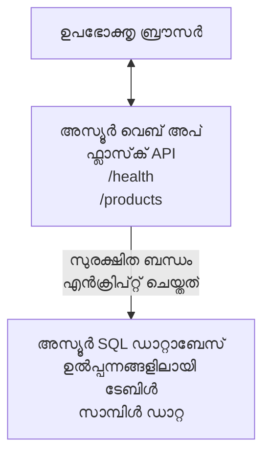

# AZD ഉപയോഗിച്ച് Microsoft SQL ഡാറ്റാബേസ് এবং വെബ് ആപ്പ് വിന്യസിക്കല്‍

⏱️ **അനുമാനിച്ച സമയം**: 20-30 മിനിറ്റ് | 💰 **അനുമാനിച്ച ചെലവ്**: ~$15-25/മാസം | ⭐ **സങ്കീര്‍ണ്ണത**: ഇടത്തരം

ഈ **പൂര്ണ്ണമായ, പ്രവർത്തനക്ഷമമായ ഉദാഹരണം** [Azure Developer CLI (azd)](https://learn.microsoft.com/azure/developer/azure-developer-cli/) ഉപയോഗിച്ച് Python Flask വെബ് ആപ്പ് Microsoft SQL ഡാറ്റാബേസ് Azure-ലേക്ക് വിന്യസിക്കാനായി എങ്ങിനെ ഉപയോഗിക്കാമെന്ന് കാണിക്കുന്നു. എല്ലാ കോഡും ഉൾപ്പെടുത്തിയിട്ടുള്ളതാണ്, പരീക്ഷിച്ചും, ബാഹ്യ ആശ്രിതത്വങ്ങൾ ആവശ്യമില്ല.

## നിങ്ങൾക്കു് പഠിക്കേണ്ടത്

ഈ ഉദാഹരണം പൂർത്തിയാക്കുന്നതിലൂടെ, നിങ്ങൾക്ക്:
- ഇൻഫ്രാസ്‌ട്രക്ചർ-ആസ്-കോഡ് ഉപയോഗിച്ച് മൾട്ടി-ടിയർ അപ്‌ളിക്കേഷൻ (വെബ് ആപ്പ് + ഡാറ്റാബേസ്) വിന്യസിക്കൽ
- രഹസ്യങ്ങൾ ഹാർഡ്‌കോഡ് ചെയ്യാതെ സുരക്ഷിത ഡാറ്റാബേസ് ബന്ധങ്ങൾ ക്രമീകരിക്കൽ
- അപ്ലിക്കേഷൻ ഹെൽത്ത് Application Insights ഉപയോഗിച്ച് നിരീക്ഷണം
- AZD CLI ഉപയോഗിച്ച് Azure റിസോഴ്‌സുകൾ കാര്യക്ഷമമായി നിയന്ത്രണം
- സുരക്ഷ, ചെലവ് മെച്ചപ്പെടുത്തലും നിരീക്ഷണവും സംബന്ധിച്ച് Azure മികച്ച രീതികൾ പാലിക്കൽ

## കാല്പനികാവസ്ഥയുടെ അവലോകനം
- **വെബ് ആപ്പ്**: ഡാറ്റാബേസ് ബന്ധമുള്ള Python Flask REST API
- **ഡാറ്റാബേസ്**: സാമ്പിൾ ഡാറ്റയോടുകൂടിയ Azure SQL ഡാറ്റാബേസ്
- **ഇൻഫ്രാസ്ട്രക്ചർ**: Bicep ഉപയോഗിച്ച് ഒരുക്കിയത് (മൊഡുലാർ, പുനരുപയോഗയോഗ്യമായ ടെംപ്ലേറ്റുകൾ)
- **വിന്യാസം**: `azd` കമാൻഡുകൾ ഉപയോഗിച്ചുള്ള എല്ലാ ഓട്ടോമായ വിന്യാസം
- **നിരീക്ഷണം**: ലോഗുകളും ടെലിമെട്രിയുമായുള്ള Application Insights

## ആവശ്യമായ ഉപകരണങ്ങൾ

### ആവശ്യമായ ഉപകരണങ്ങൾ

തുടങ്ങുന്നതിന് മുമ്പ്, ഈ ഉപകരണങ്ങൾ ഇൻസ്റ്റാൾ ചെയ്തിട്ടുണ്ടെന്ന് ഉറപ്പാക്കുക:

1. **[Azure CLI](https://learn.microsoft.com/cli/azure/install-azure-cli)** (പതിപ്പ് 2.50.0 അല്ലെങ്കിൽ അതിനേക്കാൾ ഉയർന്നത്)
   ```sh
   az --version
   # പ്രതീക്ഷിക്കുന്ന ഔട്പുട്ട്: azure-cli 2.50.0 അല്ലെങ്കിൽ അതിനുശേഷം
   ```

2. **[Azure Developer CLI (azd)](https://learn.microsoft.com/azure/developer/azure-developer-cli/install-azd)** (പതിപ്പ് 1.0.0 അല്ലെങ്കിൽ അതിനേക്കാൾ ഉയർന്നത്)
   ```sh
   azd version
   # പ്രതീക്ഷിച്ച ഔട്ട്പുട്ട്: azd പതിപ്പു 1.0.0 അല്ലെങ്കിൽ അതിൽ മുകളിൽ
   ```

3. **[Python 3.8+](https://www.python.org/downloads/)** (ലോകൽ ഡെവലപ്പ്മെന്റിനായി)
   ```sh
   python --version
   # പ്രതീക്ഷിക്കുന്ന ഔട്ട്‌പുട്ട്: Python 3.8 അല്ലെങ്കിൽ അതിനേക്കാൾ ഉയർന്നത്
   ```

4. **[Docker](https://www.docker.com/get-started)** (ഐച്ഛികം, ലോക്കൽ കണ്ടെയ്നറൈസ് ചെയ്ത ഡെവലപ്പ്മെന്റിനായി)
   ```sh
   docker --version
   # പ്രതീക്ഷിത ഔട്ട്പുട്ട്: Docker പതിപ്പ് 20.10 അല്ലെങ്കിൽ ഉയർന്നത്
   ```

### Azure ആവശ്യങ്ങൾ

- സജീവമായ **Azure subscription** ([സൗജന്യ അക്കൗണ്ട് സൃഷ്ടിക്കുക](https://azure.microsoft.com/free/))
- നിങ്ങളുടെ സബ്‌സ്‌ക്രിപ്ഷനിൽ റിസോഴ്‌സുകൾ സൃഷ്ടിക്കാനുള്ള അനുമതികൾ
- സബ്‌സ്‌ക്രിപ്ഷനിലോ റിസോഴ്‌സ് ഗ്രൂപ്പിലോ ഉള്ള **Owner** അല്ലെങ്കിൽ **Contributor** റോളുകൾ

### അറിവ് ആവശ്യകതകൾ

ഇത് **ഇടത്തരം അവസ്ഥ** ഉദാഹരണമാണ്. നിങ്ങൾക്ക് പരിചിതമായിരിക്കണം:
- അടിസ്ഥാന കമാൻഡ്-ലൈൻ പ്രവർത്തനങ്ങൾ
- ക്ലൗഡ് ആശയങ്ങളുടെ അടിസ്ഥാനങ്ങള്‍ (റിസോഴ്‌സുകൾ, റിസോഴ്‌സ് ഗ്രൂപ്പുകൾ)
- വെബ് ആപ്പുകൾക്കും ഡാറ്റാബേസുകൾക്കും അടിസ്ഥാന മനസ്സിലാക്കൽ

**AZD പുതിയവർക്ക്?** ആദ്യം [Getting Started ഗൈഡ്](../../docs/chapter-01-foundation/azd-basics.md) കാണുക.

## ആർക്കിടെക്ചർ

ഈ ഉദാഹരണം വെബ് അപ്ലിക്കേഷനും SQL ഡാറ്റാബേസും ഉള്ള രണ്ട്-ടിയർ ആർക്കിടെക്ചർ വിന്യസിക്കുന്നു:



**റിസോഴ്‌സ് വിന്യാസം:**
- **റിസോഴ്‌സ് ഗ്രൂപ്പ്**: എല്ലാ റിസോഴ്‌സുകൾക്കും കണ്ടെയ്നർ
- **ആപ്പ് സർവീസ് പ്ലാൻ**: ലിനക്‌സ് അടിസ്ഥാനത്തിലുള്ള ഹോസ്റ്റിംഗ് (ചെലവ് ലാഭിക്കാൻ B1 ടിയർ)
- **വെബ് ആപ്പ്**: Python 3.11 റൺടൈം വിജയത്തോടെ Flask ആപ്പ്
- **SQL സർവർ**: TLS 1.2 കനിഷ്ടമാണ് ഉള്ള മാനേജ്‌ഡ്ജ് ഡാറ്റാബേസ് സർവർ
- **SQL ഡാറ്റാബേസ്**: Baisc ടിയർ (2GB, വികസന/പരീക്ഷണത്തിന് ഉചിതം)
- **Application Insights**: നിരീക്ഷണവും ലോഗിംഗും
- **ലോഗ് അനലിറ്റിക്സ് വർക്ക്‌സ്‌പെയ്‌സ്**: കേന്ദ്രീകൃത ലോഗ് സംഭരണം

**ഉദാഹരണം**: ഒരു റസ്റ്റോറന്റും (വെബ് ആപ്പ്) ഒരു വാക്ക്-ഇൻ ഫ്രോസറും (ഡാറ്റാബേസ്) ഉള്ളതുപോലെ ചിന്തിക്കുക. ഉപഭോക്താക്കൾ മെനുവിൽ നിന്നാണ് (API എൻഡ്പോയിന്റുകൾ) ഓർഡർ നൽകുന്നത്, കിച്ചൻ (Flask ആപ്പ്) ഫ്രോസറിൽ നിന്നുള്ള പദാർത്ഥങ്ങൾ (ഡാറ്റ) എടുക്കുന്നു. റസ്റ്റോറന്റ് മാനേജർ (Application Insights) സംഭവിക്കുന്ന എല്ലാം നിരീക്ഷിക്കുന്നു.

## ഫോൾഡർ സ്ട്രക്ചർ

ഈ ഉദാഹരണത്തിൽ എല്ലാ ഫയലുകളും ഉൾപ്പെടുത്തിയിട്ടുണ്ട്—ബാഹ്യ ആശ്രിതത്വങ്ങൾ ആവശ്യമില്ല:

```
examples/database-app/
│
├── README.md                    # This file
├── azure.yaml                   # AZD configuration file
├── .env.sample                  # Sample environment variables
├── .gitignore                   # Git ignore patterns
│
├── infra/                       # Infrastructure as Code (Bicep)
│   ├── main.bicep              # Main orchestration template
│   ├── abbreviations.json      # Azure naming conventions
│   └── resources/              # Modular resource templates
│       ├── sql-server.bicep    # SQL Server configuration
│       ├── sql-database.bicep  # Database configuration
│       ├── app-service-plan.bicep  # Hosting plan
│       ├── app-insights.bicep  # Monitoring setup
│       └── web-app.bicep       # Web application
│
└── src/
    └── web/                    # Application source code
        ├── app.py              # Flask REST API
        ├── requirements.txt    # Python dependencies
        └── Dockerfile          # Container definition
```

**ഓരോ ഫയൽകളും ചെയ്യുന്നത്:**
- **azure.yaml**: AZD എന്ത് വിന്യസിക്കണം എന്നും എവിടെ എന്നും പറയുന്നത്
- **infra/main.bicep**: മുഴുവൻ Azure റിസോഴ്‌സുകളും ഓർക്കസ്ട്രേറ്റ് ചെയ്യുന്നു
- **infra/resources/*.bicep**: വ്യക്തിഗത റിസോഴ്‌സ് നിർവചനങ്ങൾ (പുനരുപയോഗത്തിനായി മൊഡുലാർ)
- **src/web/app.py**: ഡാറ്റാബേസിനൊപ്പം Flask അപ്ലിക്കേഷൻ
- **requirements.txt**: Python പാക്കേജ് ആശ്രിതത്വങ്ങൾ
- **Dockerfile**: വിന്യാസത്തിനുള്ള കണ്ടെയ്നറൈസേഷൻ നിർദ്ദേശങ്ങൾ

## ക്വിക്‌സ്റ്റാർട്ട് (പടി-പടി)

### പടി 1: ക്ലോൺ ചെയ്ത് നാവിഗേറ്റ് ചെയ്യുക

```sh
git clone https://github.com/microsoft/AZD-for-beginners.git
cd AZD-for-beginners/examples/database-app
```

**✓ വിജയ പരിശോധന**: നിങ്ങൾക്ക് `azure.yaml`യും `infra/` ഫോൾഡറും കാണണം:
```sh
ls
# പ്രതീക്ഷിക്കുന്നു: README.md, azure.yaml, infra/, src/
```

### പടി 2: Azure-ൽ അഥന്റിക്കേറ്റ് ചെയ്യുക

```sh
azd auth login
```

ഈ സ്ക്രിപ്റ്റ് നിങ്ങളുടെ ബ്രൗസർ തുറന്നു Azure അഥന്റിക്കേഷൻ നടത്തും. നിങ്ങളുടെ Azure ക്രഡൻഷ്യലുകൾ ഉപയോഗിച്ച് സైన్ ഇൻ ചെയ്യുക.

**✓ വിജയ പരിശോധന**: നിങ്ങൾക്ക് താഴെ കാണണം:
```
Logged in to Azure.
```

### പടി 3: പരിസരം ആരംഭിക്കുക

```sh
azd init
```

**എന്താണ് സംഭവിക്കുന്നത്**: AZD നിങ്ങളുടെ വിന്യാസത്തിനായി ലോക്കൽ കോൺഫിഗറേഷൻ സൃഷ്ടിക്കുന്നു.

**നിങ്ങൾ കാണാൻ പോകുന്ന പ്രാമ്പ്റ്റുകൾ**:
- **Environment name**: ചെറിയ പേര് നൽകുക (ഉദാ: `dev`, `myapp`)
- **Azure subscription**: നിങ്ങളുടെ സബ്‌സ്‌ക്രിപ്ഷൻ തിരഞ്ഞെടുക്കുക
- **Azure location**: ഒരു പ്രദേശം തിരഞ്ഞെടുത്തുക (ഉദാ: `eastus`, `westeurope`)

**✓ വിജയ പരിശോധന**: നിങ്ങൾക്കായ് കാണാമെന്നത്:
```
SUCCESS: New project initialized!
```

### പടി 4: Azure റിസോഴ്‌സുകൾ ഒരുക്കുക

```sh
azd provision
```

**എന്താണ് സംഭവിക്കുന്നത്**: AZD എല്ലാ ഇൻഫ്രാസ്ട്രക്ചറും വിന്യസിക്കുന്നു (5-8 മിനിറ്റ് സമയമെടുക്കും):
1. റിസോഴ്‌സ് ഗ്രൂപ്പ് സൃഷ്ടിക്കുന്നു
2. SQL സെർവർ, ഡാറ്റാബേസ് സൃഷ്ടിക്കുന്നു
3. ആപ്പ് സർവീസ് പ്ലാൻ സൃഷ്ടിക്കുന്നു
4. വെബ് ആപ്പ് സൃഷ്ടിക്കുന്നു
5. Application Insights സജ്ജീകരിക്കുന്നു
6. നെറ്റ്വർക്ക്, സുരക്ഷ ക്രമീകരിക്കുന്നു

**നിങ്ങൾക്ക് ചോദിക്കപ്പെടുന്നത്**:
- **SQL അഡ്മിൻ ഉപയോഗനാമം**: ഒരു ഉപയോഗനാമം നൽകുക (ഉദാ: `sqladmin`)
- **SQL അഡ്മിൻ പാസ്‌വേഡ്**: ശക്തമായ പാസ്‌വേഡ് നൽകുക (സംരക്ഷിക്കുക!)

**✓ വിജയ പരിശോധന**: നിങ്ങൾക്ക് താഴെ കാണണം:
```
SUCCESS: Your application was provisioned in Azure in X minutes Y seconds.
You can view the resources created under the resource group rg-<env-name> in Azure Portal:
https://portal.azure.com/#@/resource/subscriptions/.../resourceGroups/rg-<env-name>
```

**⏱️ സമയം**: 5-8 മിനിറ്റ്

### പടി 5: അപ്ലിക്കേഷൻ വിന്യസിക്കുക

```sh
azd deploy
```

**എന്താണ് സംഭവിക്കുന്നത്**: AZD നിങ്ങളുടെ Flask അപ്ലിക്കേഷൻ പാക്ക് ചെയ്തു വിന്യസിക്കുന്നു:
1. Python ആപ്പ്ലിക്കേഷൻ പാക്ക് ചെയ്യും
2. Docker കണ്ടെയ്നർ നിർമിക്കും
3. Azure Web App ലേക്ക് പുഷ് ചെയ്യും
4. സാമ്പിൾ ഡാറ്റയുമായി ഡാറ്റാബേസ് ഇനീഷലൈസ് ചെയ്യും
5. അപ്ലിക്കേഷൻ ആരംഭിക്കും

**✓ വിജയ പരിശോധന**: നിങ്ങൾക്കായ് കാണാം:
```
SUCCESS: Your application was deployed to Azure in X minutes Y seconds.
You can view the resources created under the resource group rg-<env-name> in Azure Portal:
https://portal.azure.com/#@/resource/subscriptions/.../resourceGroups/rg-<env-name>
```

**⏱️ സമയം**: 3-5 മിനിറ്റ്

### പടി 6: അപ്ലിക്കേഷൻ ബ്രൗസ് ചെയ്യുക

```sh
azd browse
```

ഈ ലിങ്ക് തുറന്നു നിങ്ങളുടെ വിന്യസിച്ച വെബ് ആപ്പ് ബ്രൗസറിൽ കാണിക്കും: `https://app-<unique-id>.azurewebsites.net`

**✓ വിജയ പരിശോധന**: ജേസൺ ഔട്ട്പുട്ട് കാണണം:
```json
{
  "message": "Welcome to the Database App API",
  "endpoints": {
    "/": "This help message",
    "/health": "Health check endpoint",
    "/products": "List all products",
    "/products/<id>": "Get product by ID"
  }
}
```

### പടി 7: API എൻഡ്പോയിന്റുകൾ പരീക്ഷിക്കുക

**ഹെൽത്ത് ചെക്ക്** (ഡാറ്റാബേസ് ബന്ധം പരിശോധിക്കുക):
```sh
curl https://app-<your-id>.azurewebsites.net/health
```

**പ്രതീക്ഷിക്കാവുന്ന പ്രതികരണം**:
```json
{
  "status": "healthy",
  "database": "connected"
}
```

**പാലിക്കേണ്ട ഉല്പന്നങ്ങൾ** (സാമ്പിൾ ഡാറ്റ):
```sh
curl https://app-<your-id>.azurewebsites.net/products
```

**പ്രതീക്ഷിക്കാവുന്ന പ്രതികരണം**:
```json
[
  {
    "id": 1,
    "name": "Laptop",
    "description": "High-performance laptop",
    "price": 1299.99,
    "created_at": "2025-11-19T10:30:00"
  },
  ...
]
```

**ഏക ഉല്പന്നം നേടുക**:
```sh
curl https://app-<your-id>.azurewebsites.net/products/1
```

**✓ വിജയ പരിശോധന**: എല്ലാ എൻഡ്പോയിന്റുകളും പിശക് കൂടാതെ JSON ഡാറ്റ തിരിച്ചുമെത്തിക്കും.

---

**🎉 അഭിനന്ദനങ്ങൾ!** AZD ഉപയോഗിച്ച് ഡാറ്റാബേസ് അടങ്ങിയ വെബ് ആപ്പ് Azure-ലേക്ക് വിജയകരമായി വിന്യസിച്ചിരിക്കുന്നു.

## കോൺഫിഗറേഷൻ ഡീപ്-ഡൈവ്

### പരിസ്ഥിതി വേരി എബിളുകൾ

രഹസ്യങ്ങൾ Azure ആപ്പ് സർവീസ് കോൺഫിഗറേഷനിലൂടെ സുരക്ഷിതമായി മാനേജ് ചെയ്യുന്നു—**ഒരു വേളയും സോഴ്സ് കോഡിൽ ഹാർഡ്‌കോഡ് ചെയ്യുന്നില്ല**.

**AZD സ്വയം ക്രമീകരിക്കുന്നത്**:
- `SQL_CONNECTION_STRING`: എൻക്രിപ്റ്റുചെയ്ത ക്രഡൻഷ്യലുകളുമായി ഡാറ്റാബേസ് കണക്ഷൻ
- `APPLICATIONINSIGHTS_CONNECTION_STRING`: ടെലിമെട്രി എൻഡ്പോയിന്റ്
- `SCM_DO_BUILD_DURING_DEPLOYMENT`: ഓട്ടോമാറ്റിക് ആശ്രിത ഇൻസ്റ്റലേഷൻ പ്രാപ്തമാക്കുന്നു

**രഹസ്യങ്ങൾ സൂക്ഷിക്കുന്ന സ്ഥലങ്ങൾ**:
1. `azd provision` സമയത്ത് SQL ക്രഡൻഷ്യലുകൾ സുരക്ഷിത പ്രാമ്പ്റ്റുകളിലൂടെ നൽകുന്നു
2. AZD ഇവ നിങ്ങളുടെ ലോക്കൽ `.azure/<env-name>/.env` ഫയലിൽ (git-ഇഗ്നോറുചെയ്‌തു) സംരക്ഷിക്കുന്നു
3. AZD ഇവ Azure ആപ്പ് സർവീസ് കോൺഫിഗറേഷനിലേക്ക് ഇൻജക്ട് ചെയ്യുന്നു (സ്റ്റോറേജ് എൻക്രിപ്റ്റഡ്)
4. അപ്ലിക്കേഷൻ `os.getenv()` വഴി സമയം പ്രവർത്തനത്തിന് തിരിച്ചെടുക്കുന്നു

### ലോക്കൽ ഡെവലപ്പ്മെന്റ്

ലോകൽ ടെസ്റ്റിംഗിനായി സാമ്പിൾ `.env` ഫയൽ സൃഷ്ടിക്കുക:

```sh
cp .env.sample .env
# നിങ്ങളുടെ స్థానിക ഡാറ്റാബേസ് കണക്ഷനോടുകൂടി .env എഡിറ്റ് ചെയ്യുക
```

**ലോക്കൽ ഡെവലപ്പ്മെന്റ് ഫ്ലോ**:
```sh
# ആശ്രിതങ്ങൾ ഇൻസ്റ്റാൾ ചെയ്യുക
cd src/web
pip install -r requirements.txt

# പരിസ്ഥിതി വ്യത്യാസങ്ങൾ ക്രമീകരിക്കുക
export SQL_CONNECTION_STRING="your-local-connection-string"

# അപ്ലിക്കേഷൻ പ്രവർത്തിപ്പിക്കുക
python app.py
```

**ലോകൽ ടെസ്റ്റ് ചെയ്യുക**:
```sh
curl http://localhost:8000/health
# പ്രതീക്ഷിച്ച തർജ്ജമ: {"സ്ഥിതി": "ആരോഗ്യവാന", "ഡാറ്റാബേസ്": "ചേർന്നിരിക്കുന്നു"}
```

### ഇൻഫ്രാസ്ട്രക്ചർ ആസ് കോഡ്

എല്ലാ Azure റിസോഴ്‌സുകളും Bicep ടെംപ്ലേറ്റുകളിലാണ് നിർവ്വചിച്ചിരിക്കുന്നത് (`infra/` ഫോൾഡർ):

- **മൊഡുലാർ ഡിസൈൻ**: പുനരുപയോഗത്തിന് ഓരോ റിസോഴ്‌സ് തരംക്ക് വിച്ഛേദിച്ച ഫയൽ
- **പരാമീറ്ററിർഡ്**: SKUകൾ, പ്രദേശങ്ങൾ, നാമകരണ മാർഗങ്ങൾ ഇഷ്ടാനുസൃതം
- **മികച്ച പ്രാക്ടീസുകൾ**: Azure നാമകരണം നിബന്ധനകളും സുരക്ഷാ ഡിഫോൾട്ടുകളും పాటിക്കുന്നു
- **വേർഷൻ നിയന്ത്രണം**: GIT ഉപയോഗിച്ച് ഇൻഫ്രാസ്ട്രക്ചർ മാറ്റങ്ങൾ പിന്തുടരുന്നു

**ഇഷ്ടാനുസൃതമാക്കൽ ഉദാഹരണം**:
ഡാറ്റാബേസ് ടിയർ മാറ്റാൻ `infra/resources/sql-database.bicep` എഡിറ്റ് ചെയ്യുക:
```bicep
sku: {
  name: 'Standard'  // Changed from 'Basic'
  tier: 'Standard'
  capacity: 10
}
```

## സുരക്ഷ മികച്ച രീതികൾ

ഈ ഉദാഹരണം Azure സുരക്ഷയുടെ മികച്ച രീതികൾ പാലിക്കുന്നു:

### 1. **സോഴ്സ് കോഡിൽ രഹസ്യങ്ങളില്ല**
- ✅ ക്രഡൻഷ്യലുകൾ Azure ആപ്പ് സർവീസ് കോൺഫിഗറേഷനിൽ എൻക്രിപ്റ്റുചെയ്ത് സൂക്ഷിക്കുന്നു
- ✅ `.env` ഫയലുകൾ Gitignore വഴി Git-ൽ നിന്നും ഒഴിവാക്കുന്നു
- ✅ രഹസ്യങ്ങൾ സുരക്ഷിത പരാമീറ്ററുകളായി അനുവദിക്കപ്പെടുന്നു

### 2. **എൻക്രിപ്റ്റുചെയ്ത കണക്ഷനുകൾ**
- ✅ SQL സെർവറിനായി TLS 1.2 കനിഷ്ടം
- ✅ വെബ് ആപ്പിന് HTTPS മാത്രമേ അനുവദിക്കൂ
- ✅ ഡാറ്റാബേസ് കണക്ഷനുകൾ എൻക്രിപ്ച്ഡ് ചാനലുകൾ ഉപയോഗിക്കുന്നു

### 3. **നെറ്റ്വർക്ക് സുരക്ഷ**
- ✅ SQL സെർവർ ഫയർവോൾ Azure സർവീസുകൾക്ക് മാത്രമേ അനുവദിക്കൂ
- ✅ പബ്ലിക് നെറ്റ്വർക്ക് ആക്‌സസ് ബന്ദ് (പ്രൈവറ്റ് എൻഡ്പോയിന്റുകളിലൂടെ കൂടുതൽ കുറയ്ക്കാവുന്നത്)
- ✅ വെബ് ആപ്പിൽ FTPS അടച്ചിട്ടിരിക്കുന്നു

### 4. **അഥന്റിക്കേഷൻ & അധികാരനിർണ്ണയം**
- ⚠️ **ഇപ്പോൾ**: SQL അതിന്റിക്കേഷൻ (ഉപയോഗനാമം/പാസ്‌വേഡ്)
- ✅ **ഉല്‍പ്പന്ന നിർദ്ദേശം**: പാസ്‌വേഡ് ഇല്ലാതെ അതന്റിക്കേഷനായി Azure Managed Identity ഉപയോഗിക്കുക

**മാനേജ്ഡ് ഐഡൻറിറ്റിയിലേക്ക് അപ്‌ഗ്രേഡ് ചെയ്യുന്നതിന്** (ഉൽപ്പന്നത്തിന്):
1. വെബ് ആപ്പിൽ മനേജ്ഡ് ഐഡൻറിറ്റി പ്രവർത്തനക്ഷമമാക്കുക
2. ഐഡൻറിറ്റിക്ക് SQL അനുമതികൾ അനുവദിക്കുക
3. കണക്ഷൻ സ്ട്രിംഗ് മാനേജ്ഡ് ഐഡൻറിറ്റി ഉപയോഗിച്ച് അപ്ഡേറ്റ് ചെയ്യുക
4. പാസ്‌വേഡ് അടിസ്ഥാനമായ അതന്റിക്കേഷൻ നീക്കം ചെയ്യുക

### 5. **ഓഡിറ്റിംഗ് & അനുയോജ്യത**
- ✅ Application Insights എല്ലാ അഭ്യർത്ഥനകളും പിശകുകളുമായി ലോഗ് ചെയ്യുന്നു
- ✅ SQL ഡാറ്റാബേസ് ഓഡിറ്റിംഗ് പ്രവർത്തനക്ഷമമാണ് (അനുയോജ്യമായ രീതിയിൽ ക്രമീകരിക്കാം)
- ✅ എല്ലാ റിസോഴ്‌സുകളും ഗവൺമെന്റ് ടാഗുകളോടെ

**ഉൽപ്പന്നത്തിലേക്ക് പോകുന്നതിനു മുൻപ് സുരക്ഷ പരിശോധിക്കുക**:
- [ ] SQL-നായി Azure Defender പ്രാപ്തമാക്കുക
- [ ] SQL ഡാറ്റാബേസിനായി പ്രൈവറ്റ് എൻഡ്പോയിന്റുകൾ ക്രമീകരിക്കുക
- [ ] വെബ് ആപ്പ് ഫയർവാൾ (WAF) സജ്ജമാക്കുക
- [ ] രഹസ്യങ്ങളുടെ പ്രാരോപണത്തിന് Azure Key Vault ഉപയോഗിക്കുക
- [ ] Microsoft Entra ID അതന്റിക്കേഷൻ ക്രമീകരിക്കുക
- [ ] എല്ലാ റിസോഴ്‌സുകൾക്കും ഡയഗ്നോസ്റ്റിക് ലോഗിംഗും സജ്ജമാക്കുക

## ചെലവ് മെച്ചപ്പെടുത്തൽ

**അനുമാനിച്ച മാസാന്ത്യ ചെലവ്** (നവംബർ 2025 നിലവാരം):

| റിസോഴ്‌സ് | SKU/ടിയർ | അനുമാന ചെലവ് |
|----------|----------|----------------|
| ആപ്പ് സർവീസ് പ്ലാൻ | B1 (ബേസിക്) | ~$13/മാസം |
| SQL ഡാറ്റാബേസ് | ബേസിക് (2GB) | ~$5/മാസം |
| Application Insights | ആവശ്യത്തിന് മാത്രം പണം | ~$2/മാസം (താഴ്ന്ന ട്രാഫിക്) |
| **മൊത്തം** | | **~$20/മാസം** |

**💡 ചെലവ് ലാഭിക്കുന്ന ടിപ്പുകൾ**:

1. **പഠനത്തിനായി സൗജന്യ ടിയർ ഉപയോഗിക്കുക**:
   - ആപ്പ് സർവീസ്: F1 ടിയർ (സൗജന്യം, പരിമിത മണിക്കൂര്‍)
   - SQL ഡാറ്റാബേസ്: Azure SQL Database സെർവർലെസ് ഉപയോഗിക്കുക
   - Application Insights: 5GB/മാസം സൗജന്യ ഇന്‍ജെക്ഷൻ

2. **ഉപയോഗിക്കാത്ത സമയത്ത് റിസോഴ്‌സുകൾ നിർത്തുക**:
   ```sh
   # വെബ് ആപ്പ് നിർത്തൂ (ഡേറ്റാബേസ് ഇനിയും ചാർജ്ജ് ചെയ്യും)
   az webapp stop --name <app-name> --resource-group <rg-name>
   
   # ആവശ്യമെങ്കിൽ പുനരാരംഭിക്കുക
   az webapp start --name <app-name> --resource-group <rg-name>
   ```

3. **ടെസ്റ്റിംഗിനു ശേഷം എല്ലാം ഡിലീറ്റ് ചെയ്യുക**:
   ```sh
   azd down
   ```
   ഇതു എല്ലാ റിസോഴ്‌സുകളും നീക്കം ചെയ്ത് പണമടച്ചത് നിർത്തും.

4. **വികസനവും ഉൽപ്പന്നവും SKU വ്യത്യാസങ്ങൾ**:
   - **വികസനം**: ബേസിക് ടിയർ (ഈ ഉദാഹരണത്തിൽ ഉപയോഗിച്ചത്)
   - **ഉൽപ്പന്നം**: സ്റ്റാൻഡേർഡ്/പ്രീമിയം ടിയർ വീണ്ടും അഡ്വാന്‍സഡ് റിഡണ്ടൻസി

**ചെലവ് നിരീക്ഷണം**:
- [Azure ചെലവ് മാനേജ്മെന്റ്](https://portal.azure.com/#view/Microsoft_Azure_CostManagement) ൽ ചെലവു കാണുക
- അന്ഡ്രിഗത്തിന്റെ സാധ്യത ഒഴിവാക്കാൻ ചെലവ് അലേർട്ടുകൾ ക്രമീകരിക്കുക
- എല്ലാ റിസോഴ്‌സുകളും `azd-env-name` എന്ന ടാഗുമായി ടാഗുചെയ്യുക

**സൗജന്യ ടിയർ മറ്റ് ഓപ്ഷൻ**:
പഠനത്തിനായി `infra/resources/app-service-plan.bicep` മാറ്റുകയും ചെയ്യാം:
```bicep
sku: {
  name: 'F1'  // Free tier
  tier: 'Free'
}
```
**നോട്ട്**: സൗജന്യ ടിയറിന് യാതൊരു ഓള്‍വൈസ്‌ഓൺ സേവനവും ഇല്ല, (ദിവസം 60 മിനിറ്റ് CPU בלבד).

## നിരീക്ഷണവും കാഴ്ചപ്പാടും

### Application Insights സംയോജനം

ഈ ഉദാഹരണത്തിൽ സമഗ്രമായ നിരീക്ഷണത്തിനായി **Application Insights** ഉൾപ്പെടുത്തിയിട്ടുണ്ട്:

**എന്ത് നിരീക്ഷിക്കുന്നു**:
- ✅ HTTP അഭ്യർത്ഥനകൾ (ലെറ്റൻസി, സ്റ്റാറ്റസ് കോഡുകൾ, എൻഡ്പോയിന്റുകൾ)
- ✅ അപ്ലിക്കേഷൻ പിശകുകളും എക്സപെപ്ഷനും
- ✅ Flask ആപ്പിൽ നിന്നുള്ള കസ്റ്റം ലോഗുകൾ
- ✅ ഡാറ്റാബേസ് കണക്ഷൻ ഹെൽത്ത്
- ✅ പ്രകടന മെറ്റ്രിക്‌സ് (CPU, മെമ്മറി)

**Application Insights ആക്സസ് ചെയ്യുക**:
1. [Azure പോർട്ടൽ](https://portal.azure.com) തുറക്കുക
2. നിങ്ങളുടെ റിസോഴ്‌സ് ഗ്രൂപ്പ് (`rg-<env-name>`) സന്ദർശിക്കുക
3. Application Insights റിസോഴ്‌സ് (`appi-<unique-id>`) ക്ലിക്ക് ചെയ്യുക

**പ്രയോജനപ്രദമായ ക്വെറികൾ** (Application Insights → Logs):

**എല്ലാ അഭ്യർത്ഥനകളും കാണുക**:
```kusto
requests
| where timestamp > ago(1h)
| order by timestamp desc
| project timestamp, name, url, resultCode, duration
```

**പിശകുകൾ കണ്ടെത്തുക**:
```kusto
exceptions
| where timestamp > ago(24h)
| order by timestamp desc
| project timestamp, type, outerMessage, operation_Name
```

**ഹെൽത്ത് എൻഡ്പോയിന്റ് പരിശോധിക്കുക**:
```kusto
requests
| where name contains "health"
| summarize count() by resultCode, bin(timestamp, 1h)
```

### SQL ഡാറ്റാബേസ് ഓഡിറ്റിംഗ്

**SQL ഡാറ്റാബേസ് ഓഡിറ്റിംഗ് പ്രാപ്തമാക്കിയിട്ടുണ്ട്**, താഴെ വിവരിച്ച ഏരിയകളിൻ നിരീക്ഷിക്കാനായി:
- ഡാറ്റാബേസ് ആക്‌സസ് മാതൃകകൾ
- പരാജയപ്പെട്ട ലോഗിൻ ശ്രമങ്ങൾ
- സ്കീമ മാറ്റങ്ങൾ
- ഡാറ്റ ആക്‌സസ് (അനുയോജ്യതയ്‌ക്കായി)

**ഓഡിറ്റ് ലോഗുകൾ ആക്സസ് ചെയ്യുക**:
1. Azure പോർട്ടൽ → SQL ഡാറ്റാബേസ് → Auditing
2. ലോഗ് അനലിറ്റിക്സ് വർക്ക്‌സ്‌പെയ്‌സിൽ ലോഗുകൾ കാണുക

### റിയൽ-ടൈം നിരീക്ഷണം

**ലൈവ് മെറ്റ്രിക്‌സ് കാണുക**:
1. Application Insights → Live Metrics
2. അഭ്യർത്ഥനകൾ, പരാജയങ്ങൾ, പ്രകടനം തത്സമയത്തിൽ കാണുക

**അലേർട്ടുകൾ ക്രമീകരിക്കുക**:
പ്രധാന സംഭവങ്ങൾക്കായി അലേർട്ടുകൾ സൃഷ്ടിക്കുക:
- HTTP 500 പിശകുകൾ > 5 അഡ 5 മിനിറ്റിൽ
- ഡാറ്റാബേസുമായി ബന്ധം പരാജയപ്പെടുന്നു
- ഉയർന്ന പ്രതികരണ സമയം (>2 സെക്കൻഡ്)

**അലേർട്ട് സൃഷ്ടിക്കാനുള്ള ഉദാഹരണം**:
```sh
az monitor metrics alert create \
  --name "High-Response-Time" \
  --resource-group <rg-name> \
  --scopes <app-insights-resource-id> \
  --condition "avg requests/duration > 2000" \
  --description "Alert when response time exceeds 2 seconds"
```

## പ്രശ്നപരിഹാരം
### പൊതുവായ പ്രശ്നങ്ങളും പരിഹാരങ്ങളും

#### 1. `azd provision` "Location not available" എന്നതോടെ പരാജയപ്പെടുന്നു

**ലക്ഷണം**:  
```
Error: The subscription is not registered for the resource type 'components' in the location 'centralus'.
```
  
**പരിഹാരം**:  
വ്യത്യസ്തമായ ഒരു Azure പ്രദേശം തിരഞ്ഞെടുക്കുക അല്ലെങ്കിൽ resource provider രജിസ്റ്റർ ചെയ്യുക:  
```sh
az provider register --namespace Microsoft.Insights
```
  

#### 2. ഡെപ്ലോയ്മെൻറ് സമയത്ത് SQL കണക്ഷൻ പരാജയപ്പെടുന്നു

**ലക്ഷണം**:  
```
pyodbc.OperationalError: ('08001', '[08001] [Microsoft][ODBC Driver 18 for SQL Server]TCP Provider...')
```
  
**പരിഹാരം**:  
- SQL Server ഫയർവാൾ Azure സേവനങ്ങൾ അനുവദിക്കുന്നതായി സ്ഥിരീകരിക്കുക (സ്വയം ക്രമീകരിക്കപ്പെടുന്നു)  
- `azd provision` സമയത്ത് SQL അഡ്മിൻ പാസ്‌വേഡ് ശരിയായി നൽകപ്പെട്ടിട്ടുണ്ടോ എന്ന് പരിശോധിക്കുക  
- SQL Server പൂർണ്ണമായി പ്രൊവിഷൻ ചെയ്തിട്ടുണ്ടെന്ന് ഉറപ്പാക്കുക (2-3 മിനിറ്റ് വേണ്ടി വരാം)  

**കണക്ഷൻ സ്ഥിരീകരിക്കുക**:  
```sh
# ആസ്യൂർ പോർട്ടലിൽ നിന്ന്, SQL ഡാറ്റാബേസ് → ക്വേരി എഡിറ്റർക്ക് പോകുക
# നിങ്ങളുടെ പ്രമാണങ്ങൾ ഉപയോഗിച്ച് കണക്ട് ചെയ്യാൻ ശ്രമിക്കുക
```
  

#### 3. വെബ് ആപ്പ് "Application Error" കാണിക്കുന്നു

**ലക്ഷണം**:  
ബ്രൗസർ ജനറിക് എറർ പേജ് കാണിക്കുന്നു.

**പരിഹാരം**:  
അപ്ലിക്കേഷൻ ലോഗുകൾ പരിശോധിക്കുക:  
```sh
# അടുത്ത ലോഗുകൾ കാണുക
az webapp log tail --name <app-name> --resource-group <rg-name>
```
  
**പൊതുവായ കാരണങ്ങൾ**:  
- പരിസ്ഥിതി വേരിയബിളുകൾ ഇല്ലാതിചേർന്നിരിക്കുന്നത് (App Service → Configuration പരിശോധിക്കുക)  
- Python പാക്കേജ് ഇൻസ്റ്റാളേഷൻ തകരാറിലായി (ഡെപ്ലോയ്മെന്റ് ലോഗുകൾ പരിശോധിക്കുക)  
- ഡാറ്റാബേസ് ഇൻഷിയലൈസേഷൻ പിശക് (SQL കണക്ടിവിറ്റി പരിശോധിക്കുക)  

#### 4. `azd deploy` "Build Error" എന്നതോടെ പരാജയപ്പെടുന്നു

**ലക്ഷണം**:  
```
Error: Failed to build project
```
  
**പരിഹാരം**:  
- `requirements.txt` യിൽ.syntax പിശകുകൾ ഇല്ലെന്നു ഉറപ്പാക്കുക  
- Python 3.11 `infra/resources/web-app.bicep`-ലാണ് സൂചിപ്പിച്ചിട്ടുള്ളത് എന്ന് പരിശോധിക്കുക  
- Dockerfile ഉൽക്കൃതമായ base image ഉള്ളതായി സ്ഥിരീകരിക്കുക  

**ലോക്കലായി ഡീബഗ് ചെയ്യുക**:  
```sh
cd src/web
docker build -t test-app .
docker run -p 8000:8000 test-app
```
  

#### 5. AZD കമാൻഡുകൾ "Unauthorized" എന്നെ തുടർന്ന് പ്രവർത്തിക്കാത്തത്

**ലക്ഷണം**:  
```
ERROR: (Unauthorized) The client '<id>' with object id '<id>' does not have authorization
```
  
**പരിഹാരം**:  
Azure-യിൽ পুনഃപ്രാമാണീകരിക്കുക:  
```sh
# AZD വർക്ക്ഫ്ലോകളുടെ ആവശ്യമാണ്
azd auth login

# നിങ്ങൾ നേരിട്ട് Azure CLI കമാണ്ടുകൾ ഉപയോഗിക്കുന്നുവെങ്കിൽ നിർബന്ധമില്ല
az login
```
  
സബ്സ്ക്രിപ്ഷനിൽ ശരിയായ അനുവാദങ്ങൾ (Contributor റോളുകൾ) ഉണ്ടെന്ന് ഉറപ്പാക്കുക.

#### 6. കൂടുതലായത് ഡാറ്റാബേസ് ചിലവുകൾ

**ലക്ഷണം**:  
അപ്രതീക്ഷിതമായ Azure ബിൽ.

**പരിഹാരം**:  
- ടെസ്റ്റ് കഴിഞ്ഞ് `azd down` ഓടിച്ചതല്ലെങ്കിൽ പരിശോധിക്കുക  
- SQL Database Basic tier ഉപയോഗിക്കുന്നുണ്ടോ എന്ന് സ്ഥിരീകരിക്കുക (Premium അല്ല)  
- Azure Cost Management-ൽ ചിലവ് അവലോകനം ചെയ്യുക  
- ചിലവ് അറിയപ്പെടുത്തലുകൾ സജ്ജമാക്കുക  

### സഹായം നേടുക

**എല്ലാ AZD പരിസ്ഥിതി വേരിയബിളുകളും കാണുക**:  
```sh
azd env get-values
```
  
**ഡെപ്ലോയ്മെന്റ് സ്റ്റാറ്റസ് പരിശോധിക്കുക**:  
```sh
az webapp show --name <app-name> --resource-group <rg-name> --query state
```
  
**അപ്ലിക്കേഷൻ ലോഗുകൾ ആക്‌സസ് ചെയ്യുക**:  
```sh
az webapp log download --name <app-name> --resource-group <rg-name> --log-file app-logs.zip
```
  
**കൂടുതൽ സഹായം വേണോ?**  
- [AZD Troubleshooting Guide](../../docs/chapter-07-troubleshooting/common-issues.md)  
- [Azure App Service Troubleshooting](https://learn.microsoft.com/azure/app-service/troubleshoot-diagnostic-logs)  
- [Azure SQL Troubleshooting](https://learn.microsoft.com/azure/azure-sql/database/troubleshoot-common-errors-issues)  

## പ്രായോഗിക അഭ്യാസങ്ങൾ

### അഭ്യാസം 1: നിങ്ങളുടെ ഡെപ്ലോയ്മെന്റ് സ്ഥിരീകരിക്കുക (ആരംഭകർക്കായി)

**ലക്ഷ്യം**: എല്ലാ റിസോഴ്സുകളും ഡെപ്ലോയാക്കിയതായി സ്ഥിരീകരിച്ച് അപ്ലിക്കേഷൻ പ്രവർത്തിക്കുന്നുണ്ടെന്ന് ഉറപ്പാക്കുക.

**പടികൾ**:  
1. നിങ്ങളുടെ റിസോഴ്സ് ഗ്രൂപിലുള്ള എല്ലാ റിസോഴ്സുകളും പട്ടികയാക്കുക:  
   ```sh
   az resource list --resource-group rg-<env-name> --output table
   ```
   **പ്രതീക്ഷിതം**: 6-7 റിസോഴ്സുകൾ (Web App, SQL Server, SQL Database, App Service Plan, Application Insights, Log Analytics)  

2. എല്ലാ API എൻഡ് പോയിന്റുകളും പരീക്ഷിക്കുക:  
   ```sh
   curl https://app-<your-id>.azurewebsites.net/
   curl https://app-<your-id>.azurewebsites.net/health
   curl https://app-<your-id>.azurewebsites.net/products
   curl https://app-<your-id>.azurewebsites.net/products/1
   ```
   **പ്രതീക്ഷিতം**: എല്ലാം തെറ്റില്ലാതെ സാധുവായ JSON തിരിച്ചുനൽക്കുന്നു  

3. Application Insights പരിശോധിക്കുക:  
   - Azure പോർട്ടലിൽ Application Insights-ലേക്ക് പോവുക  
   - "Live Metrics" എടുക്കുക  
   - വെബ് ആപ്പിൽ ബ്രൗസർ റിഫ്രഷ് ചെയ്യുക  
   **പ്രതീക്ഷിതം**: റിയൽ ടൈമിൽ അഭ്യർത്ഥനകൾ കാണുന്നത്  

**വിജയത്തിന്റെ മാനദണ്ഡങ്ങൾ**: 6-7 റിസോഴ്സുകളും നിലനിൽക്കുന്നു, എല്ലാ എൻഡ് പോയിന്റുകളും ഡാറ്റ നൽകുന്നു, Live Metrics സജീവമായി കാണിക്കുന്നു.

---

### അഭ്യാസം 2: പുതിയ API എൻഡ് പോയിന്റ് ചേർക്കുക (മധ്യനിര)

**ലക്ഷ്യം**: Flask അപ്ലിക്കേഷനിൽ ഒരു പുതിയ എൻഡ് പോയിന്റ് ചേർക്കുക.

**ആരംഭ കോട്**: നിലവിലെ എൻഡ് പോയിന്റുകൾ `src/web/app.py`-ൽ

**പടികൾ**:  
1. `src/web/app.py` തിരുത്തി `get_product()` ഫങ്ഷൻ കഴിഞ്ഞ് ഒരു പുതിയ എൻഡ് പോയിന്റ് ചേർക്കുക:  
   ```python
   @app.route('/products/search/<keyword>')
   def search_products(keyword):
       """Search products by name or description."""
       try:
           conn = get_db_connection()
           cursor = conn.cursor()
           cursor.execute(
               "SELECT id, name, description, price, created_at FROM products WHERE name LIKE ? OR description LIKE ?",
               (f'%{keyword}%', f'%{keyword}%')
           )
           
           products = []
           for row in cursor.fetchall():
               products.append({
                   'id': row[0],
                   'name': row[1],
                   'description': row[2],
                   'price': float(row[3]) if row[3] else None,
                   'created_at': row[4].isoformat() if row[4] else None
               })
           
           cursor.close()
           conn.close()
           
           logger.info(f"Search for '{keyword}' returned {len(products)} results")
           return jsonify(products), 200
           
       except Exception as e:
           logger.error(f"Error searching products: {str(e)}")
           return jsonify({'error': str(e)}), 500
   ```
  
2. അപ്‌ഡേറ്റുചെയ്‌ത അപ്ലിക്കേഷൻ ഡെപ്ലോയ്ല് ചെയ്യുക:  
   ```sh
   azd deploy
   ```
  
3. പുതിയ എൻഡ് പോയിന്റ് പരീക്ഷിക്കുക:  
   ```sh
   curl https://app-<your-id>.azurewebsites.net/products/search/laptop
   ```
   **പ്രതീക്ഷിതം**: "laptop" ഉളവുള്ള ഉൽപ്പന്നങ്ങൾ വാരിയികളായി തിരിച്ചുനൽകുന്നു  

**വിജയത്തിന്റെ മാനദണ്ഡങ്ങൾ**: പുതിയ എൻഡ് പോയിന്റ് ശരിയായി പ്രവർത്തിക്കുന്നു, ഫിൽട്ടർ ചെയ്ത ഫലങ്ങൾ നൽകുന്നു, Application Insights ലോഗുകളിൽ കാണിക്കുന്നു.

---

### അഭ്യാസം 3: მონിറ്ററിങ്, അറിയിപ്പുകൾ ചേർക്കുക (അവഞ്ചന്സ്)

**ലക്ഷ്യം**: സൂക്ഷ്മമോണിറ്ററിങ് അറിയിപ്പുകൾ ക്രമീകരിക്കുക.

**പടികൾ**:  
1. HTTP 500 എററുകൾക്കായി ഒരു അലർട്ട് സൃഷ്‌ടിക്കുക:  
   ```sh
   # അപ്ലിക്കേഷൻ ഇൻസൈറ്റ്സ് റിസോഴ്‌സ് ഐഡി നേടുക
   AI_ID=$(az monitor app-insights component show \
     --app appi-<your-id> \
     --resource-group rg-<env-name> \
     --query id -o tsv)
   
   # അലർട്ട് സൃഷ്ടിക്കുക
   az monitor metrics alert create \
     --name "High-Error-Rate" \
     --resource-group rg-<env-name> \
     --scopes $AI_ID \
     --condition "count requests/failed > 5" \
     --window-size 5m \
     --evaluation-frequency 1m \
     --description "Alert when >5 failed requests in 5 minutes"
   ```
  
2. പിശകുകൾ സൃഷ്‌ടിച്ച് അലർട്ട് ഉണർത്തുക:  
   ```sh
   # ഇല്ലാത്ത ഉൽപ്പന്നം അപേക്ഷിക്കുക
   for i in {1..10}; do curl https://app-<your-id>.azurewebsites.net/products/999; done
   ```
  
3. അലർട്ട് ഫയർ ആയി എന്നത് പരിശോധിക്കുക:  
   - Azure പോർട്ടലിൽ → Alerts → Alert Rules  
   - നിങ്ങളുടെ ഇമെയിൽ പരിശോധിക്കുക (ക്രമീകരിച്ചുണ്ടെങ്കിൽ)  

**വിജയത്തിന്റെ മാനദണ്ഡങ്ങൾ**: അലർട്ട് റൂൾ സൃഷ്‌ടിച്ചിട്ടുണ്ട്, പിശകുകൾ ഉണ്ടായപ്പോൾ ഉണരുന്നു, അറിയിപ്പുകൾ ലഭിക്കുന്നു.

---

### അഭ്യാസം 4: ഡാറ്റാബേസ് സ്കീമ മാറ്റങ്ങൾ (അവഞ്ചന്സ്)

**ലക്ഷ്യം**: പുതിയ ഒരു പട്ടിക ചേർത്ത് അനുയോജ്യമായി അപ്ലിക്കേഷൻ മാറ്റുക.

**പടികൾ**:  
1. Azure പോർട്ടൽ Query Editor വഴി SQL Database-സിലേക്ക് കണക്ട് ചെയ്യുക  

2. പുതിയ `categories` പട്ടിക സൃഷ്‌ടിക്കുക:  
   ```sql
   CREATE TABLE categories (
       id INT PRIMARY KEY IDENTITY(1,1),
       name NVARCHAR(50) NOT NULL,
       description NVARCHAR(200)
   );
   
   INSERT INTO categories (name, description) VALUES
   ('Electronics', 'Electronic devices and accessories'),
   ('Office Supplies', 'Office equipment and supplies');
   
   -- Add category to products table
   ALTER TABLE products ADD category_id INT;
   UPDATE products SET category_id = 1; -- Set all to Electronics
   ```
  
3. `src/web/app.py`-ൽ категория വിവരങ്ങൾ ചേർക്കുക  

4. ഡെപ്ലോയ്ചെയ്യുകയും പരീക്ഷിക്കുകയും ചെയ്യുക

**വിജയത്തിന്റെ മാനദണ്ഡങ്ങൾ**: പുതിയ പട്ടിക ഉണ്ടാകണം, ഉൽപ്പന്നങ്ങൾ категория വിവരങ്ങൾ കാണിക്കുന്നു, അപ്ലിക്കേഷൻ ശരിയായി പ്രവർത്തിക്കുന്നു.

---

### അഭ്യാസം 5: കാഷിംഗ് നടപ്പിലാക്കുക (വിദ്വാൻ)

**ലക്ഷ്യം**: പ്രകടനം മെച്ചപ്പെടുത്താൻ Azure Redis Cache ചേർക്കുക.

**പടികൾ**:  
1. Redis Cache `infra/main.bicep`-ൽ ചേർക്കുക  
2. `src/web/app.py`-ൽ ഉൽപ്പന്ന ക്വെറികൾ കാഷ് ചെയ്യുന്നതായി അപ്‌ഡേറ്റ് ചെയ്യുക  
3. Application Insights ഉപയോഗിച്ച് പ്രകടനം മെച്ചപ്പെട്ടത് അളക്കുക  
4. കാഷിംഗ് മുമ്പ്/ശേഷം പ്രതികരണ സമയം താരതമ്യം ചെയ്യുക  

**വിജയത്തിന്റെ മാനദണ്ഡങ്ങൾ**: Redis ഡെപ്ലോയ്ചെയ്തിട്ടുണ്ട്, കാഷിംഗ് എഫക്റ്റീവ്, പ്രതികരണ സമയം 50% ലധികം മെച്ചപ്പെട്ടു.

**ഉദ്ദേശ്യം**: [Azure Cache for Redis ഡോക്യുമെന്റേഷൻ](https://learn.microsoft.com/azure/azure-cache-for-redis/) തുടങ്ങുക.

---

## ക്ലീൻഅപ്പ്

അടുത്തും ചാർജുകൾ ഒഴിവാക്കാൻ, എല്ലാ റിസോഴ്സുകളും നീക്കം ചെയ്യുക:  

```sh
azd down
```
  
**സ്ഥിരീകരിക്കൽ പ്രോമ്പ്റ്റ്**:  
```
? Total resources to delete: 7, are you sure you want to continue? (y/N)
```
  
`y` ടൈപ്പ് ചെയ്ത് സ്റ്റാർട്ട് ചെയ്യുക.

**✓ വിജയ പരിശോധന**:  
- എല്ലാ റിസോഴ്സ് Azure പോർട്ടലിൽ നിന്ന് നീക്കി  
- തുടർച്ചയായ ചാർജുകൾ ഇല്ല  
- ലൊക്കൽ `.azure/<env-name>` ഫോൾഡർ നീക്കം ചെയ്യാവുന്നതായി മാറി

**വൈकल्पികം** (ഇൻഫ്രാസ്ട്രക്ചർ നിലനിർത്തി ഡാറ്റ മാത്രം നീക്കം ചെയ്യുക):  
```sh
# റിസോഴ്സ് ഗ്രൂപ്പ് മാത്രം മായ്ക്കുക (AZD കോൺഫിഗ് നിലനിർത്തുക)
az group delete --name rg-<env-name> --yes
```
  

## കൂടുതൽ അറിയുക

### ബന്ധപ്പെട്ട ഡോക്യുമെന്റേഷൻ  
- [Azure Developer CLI ഡോക്യുമെന്റേഷൻ](https://learn.microsoft.com/azure/developer/azure-developer-cli/)  
- [Azure SQL Database ഡോക്യുമെന്റേഷൻ](https://learn.microsoft.com/azure/azure-sql/database/)  
- [Azure App Service ഡോക്യുമെന്റേഷൻ](https://learn.microsoft.com/azure/app-service/)  
- [Application Insights ഡോക്യുമെന്റേഷൻ](https://learn.microsoft.com/azure/azure-monitor/app/app-insights-overview)  
- [Bicep ഭാഷാ റഫറൻസ്](https://learn.microsoft.com/azure/azure-resource-manager/bicep/)  

### ഈ കോഴ്‌സിന്റെ അടുത്ത ഘട്ടങ്ങൾ  
- **[Container Apps Example](../../../../examples/container-app)**: Azure Container Apps ഉപയോഗിച്ച് മൈക്രോസർവീസുകൾ ഡെപ്ലോയ്മെന്റ്  
- **[AI Integration Guide](../../../../docs/ai-foundry)**: നിങ്ങളുടെ അപ്ലിക്കേഷനിൽ AI കഴിവുകൾ ചേർക്കുക  
- **[Deployment Best Practices](../../docs/chapter-04-infrastructure/deployment-guide.md)**: പ്രൊഡക്ഷൻ ഡെപ്ലോയ്മെന്റ് മാതൃകകൾ  

### മുൻനിര വിഷയങ്ങൾ  
- **Managed Identity**: പാസ്‌വേഡുകൾ ഒഴിവാക്കി Microsoft Entra ID प्रमाणീകരണം ഉപയോഗിക്കുക  
- **Private Endpoints**: വിർച്ച്വൽ നെറ്റ്വർക്ക്‌ക്കുള്ളിൽ ഡാറ്റാബേസ് കണക്ഷനുകൾ സുരക്ഷിതമാക്കുക  
- **CI/CD സംയോജനം**: GitHub Actions അല്ലെങ്കിൽ Azure DevOps ഉപയോഗിച്ച് ഡെപ്ലോയ്മെന്റ് ഓട്ടോമേഷൻ  
- **ബഹുഭാഗ പരിസ്ഥിതി കഴിവുകൾ**: ഡെവ്, സ്റ്റേജിംഗ്, പ്രൊഡക്ഷൻ പരിസ്ഥിതികളും ക്രമീകരിക്കുക  
- **ഡാറ്റാബേസ് മൈഗ്രേഷൻസ്**: സ്കീമ വേർഷനിംഗിനായി Alembic അല്ലെങ്കിൽ Entity Framework ഉപയോഗിക്കുക  

### മറ്റുള്ള സമീപനങ്ങളുമായി താരതമ്യം

**AZD vs. ARM ടെംപ്ലേറ്റുകൾ**:  
- ✅ AZD: ഉയർന്ന തലത്തിലുള്ള ആബ്സ്ട്രാക്ഷൻ, ലളിതമായ കമാൻഡുകൾ  
- ⚠️ ARM: കൂടുതൽ വിശദമായ, സൂക്ഷ്മ നിയന്ത്രണം  

**AZD vs. Terraform**:  
- ✅ AZD: Azure സ്വദേശീയം, Azure സേവനങ്ങളുമായി സംയോജിതം  
- ⚠️ Terraform: മൾട്ടി-ക്ലൗഡ് പിന്തുണ, വലിയ ഇക്കോസിസ്റ്റം  

**AZD vs. Azure Portal**:  
- ✅ AZD: പുനരാവർത്തനശീലമായ, വേർഷൻ നിയന്ത്രിതമായ, ഓട്ടോമേറ്റഡ്  
- ⚠️ Portal: മാനുവൽ ക്ലിക്കുകൾ, പുനസ്ഥാപിക്കാൻ ബുദ്ധിമുട്ട്  

**AZD എന്നത്**: Docker Compose പോലുള്ളതാണ്—കമ്പ്ലക്സ് ഡെപ്ലോയ്മെന്റുകൾക്കായി ലളിതീകരിച്ച കോൺഫിഗറേഷൻ മദ്യസ്ഥാനം.

---

## സഹായിക്കേണ്ടשות ശ്രദ്ധിച്ച ചോദ്യങ്ങൾ

**Q: വ്യത്യസ്ത പ്രോഗ്രാമിങ് ഭാഷ ഉപയോഗിക്കാമോ?**  
A: തീർച്ചയായും! `src/web/` പാതയിൽ Node.js, C#, Go, അല്ലെങ്കിൽ മറ്റേതെങ്കിലും ഭാഷ ഉപയോഗിക്കുക. `azure.yaml` എം `Bicep` ഫയലുകൾ അനുയോജ്യമായി പുതുക്കുക.  

**Q: കൂടുതൽ ഡാറ്റാബേസ് ചേർക്കാനുള്ള വഴി എന്താണ്?**  
A: `infra/main.bicep`-ൽ മറ്റൊരു SQL Database മോഡ്യൂൾ ചേർക്കുക അല്ലെങ്കിൽ Azure Database സേവനങ്ങളിൽ നിന്ന് PostgreSQL/MySQL ഉപയോഗിക്കുക.  

**Q: പ്രൊഡക്ഷനിൽ ഈ സംവിധാനം ഉപയോഗിക്കാമോ?**  
A: ഇതൊരു ആരംഭഭിരുദമാണ്. പ്രൊഡക്ഷനിൽ, managed identity, private endpoints, redundancy, ബാക്കപ്പ് നയങ്ങൾ, WAF, മെച്ചപ്പെട്ട മോണിറ്ററിംഗ് എന്നിവ ചേർക്കണം.  

**Q: കോഡ് ഡെപ്ലോയ്മെന്റിന് പകരം കണ്ടെയ്‌നറുകൾ ഉപയോഗിക്കാൻ വേണമെങ്കിൽ?**  
A: [Container Apps Example](../../../../examples/container-app) പരിശോധിക്കുക, ഇത് Docker കണ്ടെയ്‌നറുകൾ ഉപയോഗിച്ച് പ്രവർത്തിക്കുന്നു.  

**Q: ഡാറ്റാബേസിലേക്ക് ലൊക്കൽ മെഷീൻ നിന്ന് എങ്ങനെ കണക്ട് ചെയ്യണം?**  
A: നിങ്ങളുടെ IP SQL Server ഫയർവാളിലേക്ക് ചേർക്കുക:  
```sh
az sql server firewall-rule create \
  --resource-group rg-<env-name> \
  --server sql-<unique-id> \
  --name AllowMyIP \
  --start-ip-address <your-ip> \
  --end-ip-address <your-ip>
```
  

**Q: പുതിയ ഡാറ്റാബേസിന്റെ പകരം നിലവിലുള്ള ഡാറ്റാബേസ് ഉപയോഗിക്കാമോ?**  
A: തീർച്ചയായും, `infra/main.bicep`-ൽ നിലവിലുള്ള SQL Server ന്‍റെ റഫറൻസ് മാറ്റുകയും കണക്ഷൻ സ്ട്രിംഗ് പാരാമീറ്ററുകൾ കൃത്യമായി പുതുക്കുകയും ചെയ്യുക.  

---

> **ശ്രദ്ധിക്കുക:** ഈ ഉദാഹരണം AZD ഉപയോഗിച്ച് ഡാറ്റാബേസ് ഉൾപ്പെടെയുള്ള വെബ് ആപ്പ് ഡെപ്ലോയ്മെന്റിനുള്ള മികച്ച രീതികൾ വിളിപ്പിക്കുന്നു. ഇത് പ്രവർത്തനക്ഷമമായ കോഡ്, സമഗ്ര ഡോക്യുമെന്റേഷൻ, പ്രായോഗിക അഭ്യാസങ്ങളുമായാണ്. പ്രൊഡക്ഷൻ ഡെപ്ലോയ്മെന്റിനായി നിങ്ങളുടെ സംഘടനയുടെ സുരക്ഷ, സ്കെയ്ലിംഗ്, അനുസരണം, ചെലവ് ആവശ്യകതകൾ അവലോകനം ചെയ്യുക.

**📚 കോഴ്സ് നാവിഗേഷൻ:**  
- ← മുൻപ്: [Container Apps Example](../../../../examples/container-app)  
- → അടുത്തത്: [AI Integration Guide](../../../../docs/ai-foundry)  
- 🏠 [കോഴ്സ് ഹോം](../../README.md)

---

<!-- CO-OP TRANSLATOR DISCLAIMER START -->
**അറിയിപ്പ്**:
ഈ രേഖ AI പരിഭാഷാ സേവനം [Co-op Translator](https://github.com/Azure/co-op-translator) ഉപയോഗിച്ച് പരിഭാഷപ്പെടുത്തിയതാണ്. ഞങ്ങൾ കൃത്യതയ്ക്കായി ശ്രമിക്കുന്നുവെങ്കിലും, ഓട്ടോമേറ്റഡ് പരിഭാഷകളിൽ പിഴവുകൾ അല്ലെങ്കിൽ തെറ്റായ വിവരങ്ങൾ ഉണ്ടാകാൻ സാധ്യതയുണ്ട്. അതിന്റെ സ്വാഭാവിക ഭാഷയിലുള്ള അസൽ രേഖയാണ് പ്രാമാണികമായ ഉറവിടമായി പരിഗണിക്കേണ്ടത്. നിർണായകമായ വിവരങ്ങൾക്ക്, പ്രൊഫഷണൽ മനുഷ്യ പരിഭാഷ ശുപാർശ ചെയ്യുന്നു. ഈ പരിഭാഷ ഉപയോഗിച്ച് ഉണ്ടാകുന്ന തെറ്റിദ്ധാരണകൾ അല്ലെങ്കിൽ തെറ്റായ വ്യാഖ്യാനങ്ങൾക്കായി ഞങ്ങൾ ഉത്തരവാദികളല്ല.
<!-- CO-OP TRANSLATOR DISCLAIMER END -->