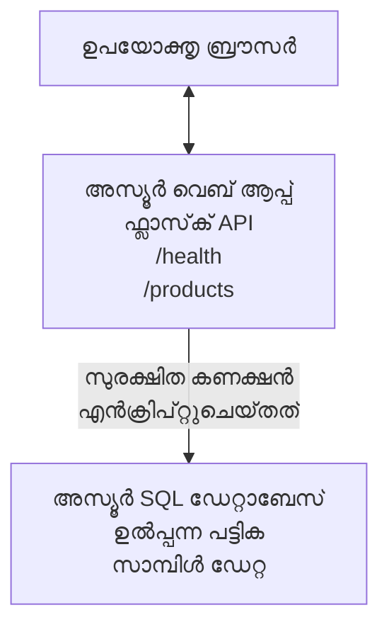

# AZD ഉപയോഗിച്ച് Microsoft SQL ഡാറ്റാബേസ് ಮತ್ತು വെബ് ആപ്പ് ഡിപ്ലോയ് ചെയ്യൽ

⏱️ **അനുമാനിക്കുന്നു** സമയം: 20-30 മിനിറ്റ് | 💰 **അനുമാനിക്കുന്നു** ചെലവ്: ~$15-25/മാസം | ⭐ **കമ്പളഷണം**: ഇടക്കാലം

ഈ **സമ്പൂർണ്ണ, പ്രവർത്തനക്ഷമമായ ഉദാഹരണം** [Azure Developer CLI (azd)](https://learn.microsoft.com/azure/developer/azure-developer-cli/) ഉപയോഗിച്ച് Python Flask വെബ് ആപ്പ് Microsoft SQL ഡാറ്റാബേസുമായി Azure-യിൽ എങ്ങനെ ഡിപ്ലോയ് ചെയ്യാമെന്ന് ցույցിക്കുന്നു. എല്ലാ കോഡും ഉൾപ്പെടുത്തിയിട്ടുണ്ട്, പരീക്ഷിച്ചിട്ടുണ്ട്—എന്തൊരു പുറം ആശ്രിതങ്ങളും ആവശ്യമില്ല.

## നിങ്ങൾ പഠിക്കാനിരിക്കുന്നത്

ഈ ഉദാഹരണം പൂര്‍ത്തിയാക്കുമ്പോൾ, നിങ്ങൾക്ക്:
- ഇൻഫ്രാസ്ട്രക്ചർ-ആസ്-കോഡ് ഉപയോഗിച്ച് ബഹുരംഗ ആപ്ലിക്കേഷൻ (വെബ് ആപ്പ് + ഡാറ്റാബേസ്) ഡിപ്ലോയ് ചെയ്യാം
- രഹസ്യങ്ങള്‍ കൾഹാർഡ്കോഡ് ചെയ്യാതെയാണ് സുരക്ഷിത ഡാറ്റാബേസ് കണക്ഷനുകൾ ക്രമീകരിക്കുക
- ആപ്ലിക്കേഷൻ ഹെൽത്ത് Application Insights ഉള്പ്പടെ നിരീക്ഷിക്കുക
- AZD CLI ഉപയോഗിച്ച് Azure വിഭവങ്ങൾ ഫലപ്രദമായി കൈകാര്യം ചെയ്യുക
- സുരക്ഷ, ചെലവ് വിഹിതനിർണയം, നിരീക്ഷണത്തിനുള്ള Azure മികച്ച പഠനങ്ങൾ പിന്തുടരുക

## സാഹചര്യ അവലോകനം
- **വെബ് ആപ്പ്**: Python Flask REST API ഡാറ്റാബേസ് കണക്ടിവിറ്റിയോടെ
- **ഡാറ്റാബേസ്**: സാംപിൾ ഡാറ്റയുള്ള Azure SQL ഡാറ്റാബേസ്
- **ഇൻഫ്രാസ്ട്രക്ചർ**: Bicep ഉപയോഗിച്ച് പ്രൊവിഷൻ (മറ്റു ഉപയോഗക്കായി പുനരുപയോഗയോഗ്യമായ ടെംപ്ലേറ്റുകൾ)
- **ഡിപ്ലോയ്‌മെന്റ്**: `azd` കമാൻഡുകൾ ഉപയോഗിച്ച് പൂർണ്ണ ഓട്ടോമേഷൻ
- **നിരീക്ഷണം**: ലോഗുകളും ടെലിമെട്രിയുമായി Application Insights

## അനിവാര്യങ്ങൾ

### ആവശ്യമായ ഉപകരണങ്ങൾ

ആരംഭിക്കുന്നതിന് മുമ്പ്, ഈ ഉപകരണങ്ങൾ ഇന്‍സ്റ്റോൾ ചെയ്തിട്ടുണ്ടെന്ന് ഉറപ്പാക്കുക:

1. **[Azure CLI](https://learn.microsoft.com/cli/azure/install-azure-cli)** (പതിപ്പ് 2.50.0 അല്ലെങ്കിൽ അതിനുമേൽ)
   ```sh
   az --version
   # പ്രതീക്ഷിച്ച ഔട്ട്പുട്ട്: azure-cli 2.50.0 അല്ലെങ്കിൽ അതിൽ മേലുള്ള പതിപ്പ്
   ```

2. **[Azure Developer CLI (azd)](https://learn.microsoft.com/azure/developer/azure-developer-cli/install-azd)** (പതിപ്പ് 1.0.0 അല്ലെങ്കിൽ അതിനുമേൽ)
   ```sh
   azd version
   # പ്രതീക്ഷിച്ച ഔട്ട്‌പുട്ട്: azd പതിപ്പ് 1.0.0 അല്ലെങ്കിൽ അതിന്റെ മുകളിലേത്
   ```

3. **[Python 3.8+](https://www.python.org/downloads/)** (പ്രാദേശിക വികസനത്തിനായി)
   ```sh
   python --version
   # പ്രതീക്ഷിക്കുന്ന ഔട്ട്‌പുട്ട്: പൈറ്റൺ 3.8 അല്ലെങ്കിൽ അതിനും ഉയർന്നത്
   ```

4. **[Docker](https://www.docker.com/get-started)** (ഓപ്ഷണൽ, പ്രാദേശിക കണ്ടെയ്‌നറൈസ്ഡ് വികസനത്തിനായി)
   ```sh
   docker --version
   # പ്രതീക്ഷിച്ച ഔട്ട്പുട്ട്: ഡോക്കർ പതിപ്പ് 20.10 അല്ലെങ്കിൽ അതിന് മുകളിൽ
   ```

### Azure ആവശ്യകതകൾ

- സജീവമായ **Azure സബ്സ്ക്രിപ്ഷൻ** ([സ്വതന്ത്ര അക്കൗണ്ട് സൃഷ്‌ടിക്കുക](https://azure.microsoft.com/free/))
- സബ്സ്ക്രിപ്ഷനിൽ വിഭവങ്ങൾ സൃഷ്‌ടിക്കാൻ അനുമതികൾ
- സബ്സ്ക്രിപ്ഷൻ അല്ലെങ്കിൽ ഒരു റിലേറ്റഡ് റിസോഴ്‌സ് ഗ്രൂപ്പിൽ **Owner** അല്ലെങ്കിൽ **Contributor** റോളുകൾ

### പരിജ്ഞാന അനിവാര്യങ്ങൾ

ഇത് **ഇടത്തരം തല ത്തിൻ്റെ** ഉദാഹരണമാണ്. നിങ്ങൾക്ക് അറിയാമാകണം:
- അടിസ്ഥാന കമാൻഡ് ലൈൻ പ്രവർത്തനങ്ങൾ
- മേധാവി ക്ലൗഡ് ആശയങ്ങൾ (വിവിധ വിഭവങ്ങൾ, വിഭവ ഗ്രൂപ്പുകൾ)
- വെബ് ആപ്ലിക്കേഷനുകളും ഡേറ്റാബേസുകളും അടിസ്ഥാനപരമായി മനസ്സിലാക്കൽ

**AZD-യിൽ പുതുമയുണ്ടോ?** ആദ്യം [Getting Started guide](../../docs/chapter-01-foundation/azd-basics.md) കാണുക.

## നിമിഷാവ്

ഈ ഉദാഹരണം വെബ് ആപ്‌ളിക്കേഷൻ ഒപ്പം SQL ഡാറ്റാബേസ് ഉള്ള രണ്ട്-തല വേധമി ആർക്കിടെക്ചർ ഡിപ്ലോയ് ചെയ്യുന്നു:


**റിസോഴ്‌സ് ഡിപ്ലോയ്‌മെന്റ്:**
- **റിസോഴ്‌സ് ഗ്രൂപ്പ്**: സകല വിഭവങ്ങൾക്ക് കണ്ടെയ്‌നർ
- **ആപ്പ് സർവീസ് പ്ലാൻ**: ലിനക്സിൽ പ്രവർത്തിക്കുന്ന ഹോസ്റ്റിംഗ് (ലയ്ക്ക് ചെലവ് കുറഞ്ഞ B1 ടയർ)
- **വെബ് ആപ്പ്**: Python 3.11 റൺടൈങ്ങൾ ഉൾപ്പെടുത്തി Flask ആപ്പ്ലിക്കേഷൻ
- **SQL സെർവർ**: TLS 1.2 മുതലായ മാനേജ് ചെയ്‌ത ഡാറ്റാബേസ് സെർവർ
- **SQL ഡാറ്റാബേസ്**: ബേസിക് ടയർ (2GB, വികസനത്തിനും പരിശോധനക്കും അനുയോജ്യം)
- **ആപ്ലിക്കേഷൻ ഇൻസൈറ്റ്സ്**: നിരീക്ഷണവും ലോഗിംഗും
- **ലോഗ് അനലിറ്റിക്സ് വർക്ക്സ്പേസ്**: സംയുക്തമായ ലോഗ് സംഭരണം

**ഉപമ**: ഈ സംവിധാനം ഒരു റെസ്റ്റോറന്റിനെയാണ് (വെബ് ആപ്പ്) ഒരു ഏറ്റവും വാതിൽ മുറി (ഡേറ്റാബേസ്) ഉള്ളത് പോലെ ചിന്തിക്കുക. ഉപഭോക്താക്കൾ മെനുവിൽ നിന്ന് (API എന്റ്പോയിന്റുകൾ) ഓർഡർ ചെയ്യുന്നു, അടുക്കള (Flask ആപ്പ്) ഫ്രീസറിനുവേണ്ടി കിടപ്പു സാധനങ്ങൾ (ഡേറ്റ) എടുക്കുന്നു. റെസ്റ്റോരന്റിൻറെ മാനേജർ (ആപ്ലിക്കേഷൻ ഇൻസൈറ്റ്സ്) എല്ലാം നിരീക്ഷിക്കുന്നു.

## ഫോൾഡർ ഘടന

എല്ലാ ഫയലുകളും ഈ ഉദാഹരണത്തിൽ ഉൾപ്പെടുന്നു—പുറം ആശ്രിതങ്ങൾ വേണ്ട:

```
examples/database-app/
│
├── README.md                    # This file
├── azure.yaml                   # AZD configuration file
├── .env.sample                  # Sample environment variables
├── .gitignore                   # Git ignore patterns
│
├── infra/                       # Infrastructure as Code (Bicep)
│   ├── main.bicep              # Main orchestration template
│   ├── abbreviations.json      # Azure naming conventions
│   └── resources/              # Modular resource templates
│       ├── sql-server.bicep    # SQL Server configuration
│       ├── sql-database.bicep  # Database configuration
│       ├── app-service-plan.bicep  # Hosting plan
│       ├── app-insights.bicep  # Monitoring setup
│       └── web-app.bicep       # Web application
│
└── src/
    └── web/                    # Application source code
        ├── app.py              # Flask REST API
        ├── requirements.txt    # Python dependencies
        └── Dockerfile          # Container definition
```

**എഴുത്തുകാരന്‍ ചെയ്യുന്നതെന്ത്:**
- **azure.yaml**: AZD എന്ത് ഡിപ്ലോയ് ചെയ്യണം, എവിടെ എന്ന് പറയുന്നു
- **infra/main.bicep**: എല്ലാ Azure വിഭവങ്ങളും ഏകീകൃതമായി നിയന്ത്രിക്കുന്നു
- **infra/resources/*.bicep**: സവിശേഷ വിഭവ നിർവചനങ്ങൾ (പുനരുപയോഗത്തിനായി ഘടിപ്പിച്ചിട്ടുള്ളവ)
- **src/web/app.py**: ഡാറ്റാബേസ് ലജിക് ഉള്ള Flask ആപ്പ്
- **requirements.txt**: Python പാക്കേജ് ആശ്രിതങ്ങൾ
- **Dockerfile**: ഡിപ്പ്ലോയ്മെന്റിനുള്ള കണ്ടെയ്‌നറൈസേഷൻ നിർദ്ദേശങ്ങൾ

## ക്വിക്‌സ്‌റ്റാർട്ട് (പടി-പടിയിലൂടെ)

### പടി 1: ക്ലോൺ ചെയ്ത് നേവിഗേറ്റ് ചെയ്യുക

```sh
git clone https://github.com/microsoft/AZD-for-beginners.git
cd AZD-for-beginners/examples/database-app
```

**✓ വിജയ പരിശോധന**: `azure.yaml` ഉം `infra/` ഫോൾഡറും കാണണമെന്ന് ഉറപ്പാക്കുക:
```sh
ls
# പ്രതീക്ഷിച്ചത്: README.md, azure.yaml, infra/, src/
```

### പടി 2: Azure-ൽ ഓതന്റിക്കേഷൻ ചെയ്യുക

```sh
azd auth login
```

ഈ പ്രവർത്തനം നിങ്ങളുടെ ബ്രൗസർ തുറന്നു Azure ഓതന്റിക്കേഷനിലേക്ക് കൊണ്ടുപോകും. നിങ്ങളുടെ Azure ക്രെഡൻഷ്യലുകൾ ഉപയോഗിച്ച് സൈൻ ഇൻ ചെയ്യുക.

**✓ വിജയ പരിശോധന**: നിങ്ങൾക്കു കാണിക്കണം:
```
Logged in to Azure.
```

### പടി 3: പരിതസ്ഥിതിയിൽ ഇൻഷ്യലൈസ് ചെയ്യുക

```sh
azd init
```

**എന്താണ് സംഭവിക്കുന്നത്**: AZD നിങ്ങളുടെ ഡിപ്ലോയ്‌മെന്റിനായി പ്രാദേശിക ക്രമീകരണം സൃഷ്‌ടിക്കുന്നു.

**നിങ്ങൾ യാതനിക്കേണ്ട പ്രോംപ്റ്റുകൾ**:
- **പരിതസ്ഥിതി പേര്**: ചെറിയൊരു പേര് നൽകുക (ഉദാ., `dev`, `myapp`)
- **Azure സബ്സ്ക്രിപ്ഷൻ**: ലിസ്റ്റിൽ നിന്നു നിങ്ങളുടെ സബ്സ്ക്രിപ്ഷൻ തിരയുക
- **Azure സ്ഥലം**: ഒരു പ്രദേശം തിരഞ്ഞെടുക്കുക (ഉദാ., `eastus`, `westeurope`)

**✓ വിജയ പരിശോധന**: താഴെ കാണിക്കണം:
```
SUCCESS: New project initialized!
```

### പടി 4: Azure വിഭവങ്ങൾ പ്രൊവിഷൻ ചെയ്യുക

```sh
azd provision
```

**എന്ത് സംഭവിക്കുന്നു**: AZD എല്ലാ ഇൻഫ്രാസ്ട്രക്ചർ ഡിപ്ലോയ്മെന്റ് നടത്തുന്നു (5-8 മിനിറ്റ് സമയം എടുക്കും):
1. റിസോഴ്‌സ് ഗ്രൂപ്പ് സൃഷ്‌ടിക്കുന്നു
2. SQL സെർവർയും ഡാറ്റാബേസും സൃഷ്‌ടിക്കുന്നു
3. ആപ്പ് സർവീസ് പ്ലാൻ സൃഷ്‌ടിക്കുന്നു
4. വെബ് ആപ്പ് സൃഷ്‌ടിക്കുന്നു
5. ആപ്ലിക്കേഷൻ ഇൻസൈറ്റ്സ് സജ്ജമാക്കുന്നു
6. നെറ്റ്വർക്‌മെന്റിംഗും സുരക്ഷയും ക്രമീകരിക്കുന്നു

**നിങ്ങൾക്ക് കമാൻഡ് ചോദിക്കപ്പെടും**:
- **SQL അഡ്മിൻ ഉപയോഗനാമം**: ഒരു ഉപയോക്തൃനാമം നൽകുക (ഉദാ., `sqladmin`)
- **SQL അഡ്മിൻ പാസ്‌വേഡ്**: ശക്തമായ പാസ്‌വേഡ് നൽകുക (ഈതു സേവ് ചെയ്യുക!)

**✓ വിജയ പരിശോധന**: നിങ്ങൾക്കു കാണിക്കണം:
```
SUCCESS: Your application was provisioned in Azure in X minutes Y seconds.
You can view the resources created under the resource group rg-<env-name> in Azure Portal:
https://portal.azure.com/#@/resource/subscriptions/.../resourceGroups/rg-<env-name>
```

**⏱️ സമയം**: 5-8 മിനിറ്റ്

### പടി 5: ആപ്ലിക്കേഷൻ ഡിപ്ലോയ് ചെയ്യുക

```sh
azd deploy
```

**എന്താണ് സംഭവിക്കുന്നത്**: AZD നിങ്ങളുടെ Flask ആപ്പ് ബിൽഡ് ചെയ്ത് ഡിപ്ലോയ് ചെയ്യുന്നു:
1. Python ആപ്പ് പാക്കേജ് ചെയ്യുന്നു
2. Docker കണ്ടെയ്‌നർ പണിയുന്നു
3. Azure വെബ് ആപ്പിലേക്ക് പുഷ് ചെയ്യുന്നു
4. ഡാറ്റാബേസ് സ്പാംപിൾ ഡാറ്റ ഉപയോഗിച്ച് ആരംഭിക്കുന്നു
5. ആപ്പ് തുടങ്ങുന്നു

**✓ വിജയ പരിശോധന**: നിങ്ങൾക്കു കാണണം:
```
SUCCESS: Your application was deployed to Azure in X minutes Y seconds.
You can view the resources created under the resource group rg-<env-name> in Azure Portal:
https://portal.azure.com/#@/resource/subscriptions/.../resourceGroups/rg-<env-name>
```

**⏱️ സമയം**: 3-5 മിനിറ്റ്

### പടി 6: ആപ്ലിക്കേഷൻ ബ്രൗസ് ചെയ്യുക

```sh
azd browse
```

ഇത് നിങ്ങളുടെ ഡിപ്ലോയ്മെന്റ് ചെയ്ത വെബ് ആപ്പ് ബ്രൗസറിൽ തുറക്കുന്നു `https://app-<unique-id>.azurewebsites.net`

**✓ വിജയ പരിശോധന**: JSON output കാണണം:
```json
{
  "message": "Welcome to the Database App API",
  "endpoints": {
    "/": "This help message",
    "/health": "Health check endpoint",
    "/products": "List all products",
    "/products/<id>": "Get product by ID"
  }
}
```

### പടി 7: API എന്റ്പോയിന്റുകൾ ടെസ്റ്റ് ചെയ്യുക

**ഹെൽത്ത് ചെക്ക്** (ഡേറ്റാബേസ് ബന്ധം പരിശോധിക്കുക):
```sh
curl https://app-<your-id>.azurewebsites.net/health
```

**പ്രതീക്ഷിക്കുന്ന പ്രതികരണം**:
```json
{
  "status": "healthy",
  "database": "connected"
}
```

**ഉൽപ്പന്നങ്ങൾ പട്ടിക** (സാംപിൾ ഡാറ്റ):
```sh
curl https://app-<your-id>.azurewebsites.net/products
```

**പ്രതീക്ഷിക്കുന്ന പ്രതികരണം**:
```json
[
  {
    "id": 1,
    "name": "Laptop",
    "description": "High-performance laptop",
    "price": 1299.99,
    "created_at": "2025-11-19T10:30:00"
  },
  ...
]
```

**ഒറ്റ ഉൽപ്പന്നം ലഭിക്കുക**:
```sh
curl https://app-<your-id>.azurewebsites.net/products/1
```

**✓ വിജയ പരിശോധന**: എല്ലാ എന്റ്പോയിന്റുകളും JSON ഡാറ്റ എവിടെയും പിഴവില്ലാതെ റിറ്റേൺ ചെയ്യണം.

---

**🎉 അഭിനന്ദനങ്ങൾ!** നിങ്ങൾ AZD ഉപയോഗിച്ച് Azure-യിൽ ഒരു വെബ് ആപ്പും ഡാറ്റാബേസും വിജയകരമായി ഡിപ്ലോയ്മെന്റ് ചെയ്തു.

## കോൺഫിഗറേഷൻ ഡീപ്-ഡൈവ്

### പരിതസ്ഥിതി വേരിയബിൾസ്

സെക്രെറ്റുകൾ സുരക്ഷിതമായി Azure App Service ക്രമീകരണത്തിലൂടെ കൈകാര്യം ചെയ്യുന്നു—**സംഹിതയിൽ നിന്ന് ഒരിക്കൽ പോലും ഹാർഡ്കോഡ് ചെയ്യരുത്**.

**AZD സ്വയം ക്രമീകരിക്കുന്നു**:
- `SQL_CONNECTION_STRING`: എൻക്രിപ്റ്റുചെയ്ത ക്രെഡൻഷ്യലുകളുള്ള ഡാറ്റാബേസ് കണക്ഷൻ
- `APPLICATIONINSIGHTS_CONNECTION_STRING`: ടെലിമെട്രി എൻഡ്‌പോയിന്റ്
- `SCM_DO_BUILD_DURING_DEPLOYMENT`: സ്വയം ആശ്രിതങ്ങൾ ഇൻസ്റ്റാൾ ചെയ്യാനായി സജ്ജീകരിക്കുന്നു

**സെക്രെറ്റുകൾ എവിടെ സൂക്ഷിക്കപ്പെടുന്നു**:
1. `azd provision` സമയത്ത് നിങ്ങൾ SQL ക്രെഡൻഷ്യലുകൾ സുരക്ഷിത പ്രോംപ്റ്റുകൾ വഴി നൽകുന്നു
2. AZD ഈ സെക്രെറ്റുകൾ പ്രാദേശിക `.azure/<env-name>/.env` ഫയലിൽ സൂക്ഷിക്കുന്നു (git.ignore ആയിട്ടുണ്ട്)
3. AZD അവ Azure App Service ക്രമീകരണത്തിൽ ഡിപ്ലോയ് ചെയ്യുന്നു (വിശ്രമത്തിലെൻക്രിപ്‌ടുചെയ്തവ)
4. ആപ്പ് റൺടൈമിൽ `os.getenv()` വഴി വായിക്കുന്നു

### പ്രാദേശിക വികസനം

പ്രാദേശികത്തിലും പരീക്ഷിക്കാൻ, ഒരു .env ഫയൽ സാംപിൾ ഉപയോഗിച്ച് നിർമ്മിക്കുക:

```sh
cp .env.sample .env
# നിങ്ങളുടെ പ്രാദേശിക ഡാറ്റാബേസ് കണക്ഷനോടെ .env എഡിറ്റ് ചെയ്യുക
```

**പ്രാദേശിക വികസന പ്രവൃത്തി രീതി**:
```sh
# ആശ്രിതങ്ങളെയ_INSTALL_ചെയ്യുക
cd src/web
pip install -r requirements.txt

# പരിസര വ്യത്യാസങ്ങൾ സജ്ജീകരിക്കുക
export SQL_CONNECTION_STRING="your-local-connection-string"

# ആപ്ലിക്കേഷൻ പ്രവർത്തിപ്പിക്കുക
python app.py
```

**പ്രാദേശികമായി ടെസ്റ്റ് ചെയ്യുക**:
```sh
curl http://localhost:8000/health
# പ്രതീക്ഷിച്ചത്: {"status": "healthy", "database": "connected"}
```

### ഇൻഫ്രാസ്ട്രക്ചർ ആസ് കോഡ്

എല്ലാ Azure വിഭവങ്ങളും **Bicep ടെംപ്ലേറ്റുകളിൽ** നിർവ്വചിച്ചിരിക്കുന്നു (`infra/` ഫോൾഡർ):

- **ഘടകം രൂപകൽപ്പന**: ഓരോ വിഭവത്തിന്റെ ഒരു വ്യത്യസ്ത ഫയൽ പുനരുപയോഗത്തിനായി
- **പാരാമീറ്ററൈസ്ഡ്**: SKUകൾ, മേഖലകൾ, പേരിടൽ ആനുകൂല്യങ്ങൾ ഇഷ്ടാനുസൃതമാക്കാം
- **മികച്ച പ്രവർത്തന ശീലങ്ങൾ**: Azure പേരിടൽ നിബന്ധനകൾ, സുരക്ഷാ പ്രാഥമിക ക്രമീകരണങ്ങൾ
- **ആവർത്തനം നിയന്ത്രണം**: ഇൻഫ്രാസ്ട്രക്ചർ മാറ്റങ്ങൾ Git-ൽ ട്രാക്ക് ചെയ്യുന്നു

**ഇഷ്ടാനുസൃതമാക്കൽ ഉദാഹരണം**:
ഡാറ്റാബേസ് ടയർ മാറ്റാൻ, `infra/resources/sql-database.bicep` എഡിറ്റ് ചെയ്യുക:
```bicep
sku: {
  name: 'Standard'  // Changed from 'Basic'
  tier: 'Standard'
  capacity: 10
}
```

## സുരക്ഷാ മികച്ച പ്രക്രിയകൾ

ഈ ഉദാഹരണം Azure സുരക്ഷാ മികച്ച പ്രാക്ടീസുകൾ പിന്തുടരുന്നു:

### 1. **കോടിങ്ങിൽ ഒരുപാട് രഹസ്യങ്ങൾ ഇല്ല**
- ✅ ക്രെഡൻഷ്യലുകൾ Azure App Service ക്രമീകരണത്തിൽ സൂക്ഷിക്കുന്നു (എൻക്രിപ്റ്റുചെയ്തത്)
- ✅ `.env` ഫയലുകൾ git.ignore വഴി Git-ൽ നിന്ന് ഒഴിവാക്കുന്നു
- ✅ രഹസ്യങ്ങൾ പ്രൊവിഷൻ ചെയ്യുമ്പോൾ സുരക്ഷിതമായ പാരാമീറ്ററുകൾ വഴി കൈമാറുന്നു

### 2. **എന്‍ക്രിപ്റ്റുചെയ്ത കണക്ഷനുകൾ**
- ✅ SQL സെർവറിൽ TLS 1.2 കുറഞ്ഞത്
- ✅ വെബ് ആപ്പിന് HTTPS മാത്രം നിർബന്ധം
- ✅ ഡാറ്റാബേസ് കണക്ഷൻ എൻക്രിപ്റ്റുചെയ്ത ചാനലുകൾ ഉപയോഗിച്ച്

### 3. **നെറ്റ്വർക് സുരക്ഷ**
- ✅ SQL സെർവർ ഫയർവാൾ സ്വിച്ച് ചെയ്യുന്ന Azure സർവീസുകൾക്ക് മാത്രമായി
- ✅ പൊതുജന നെറ്റ്‌വർക്ക് ആക്സസ് നിയന്ത്രിതം (പ്രൈവറ്റ് എൻഡ്‌പോയിന്റുകളുമായി കൂടി കൂടുതൽ ബന്ധപ്പെടുത്താം)
- ✅ വെബ് ആപ്പിൽ FTPS നിർത്തിവെക്കಲಾಗಿದೆ

### 4. **ഓതന്റിക്കേഷൻ & അഥോറൈസേഷൻ**
- ⚠️ **ഇപ്പോൾ**: SQL ഓതന്റിക്കേഷൻ (ഉപയോക്തൃനാമം/പാസ്‌വേഡ്)
- ✅ **ഉത്പാദന ശിപാരസി**: പാസ്വേഡില്ലാത്ത ഓതന്റിക്കേഷനായി Azure Managed Identity ഉപയോഗിക്കുക

**Managed Identity ആക്കുന്നതിനുള്ള നിർദ്ദേശങ്ങൾ** (ഉത്പാദനത്തിന്):
1. വെബ് ആപ്പിൽ Managed Identity സജീവമാക്കുക
2. ഐഡന്റിറ്റിക്ക് SQL അനുമതികൾ നൽകുക
3. കണക്ഷൻ സ്ട്രിംഗ് Managed Identity വഴികാട്ടുക
4. പാസ്‌വേഡ് അടിസ്ഥാന ഓതന്റിക്കേഷൻ നീക്കംചെയ്യുക

### 5. **ഓഡിറ്റിംഗ് & പാലനശാസ്ത്രം**
- ✅ Application Insights എല്ലാ അഭ്യർത്ഥനകളും പിഴവുകളുമടങ്ങി ലോഗ് ചെയ്യുന്നു
- ✅ SQL ഡാറ്റാബേസ് ഓഡിറ്റിംഗ് സജ്ജമായിട്ടുണ്ട് (പാലനശാസ്ത്രം അനുസരിച്ച് ക്രമീകരിക്കാവുന്നതാണ്)
- ✅ എല്ലാ വിഭവങ്ങളും ഗവർണൻസ് ടാഗുകളോടെ ടാഗുചെയ്തിട്ടുണ്ട്

**ഉത്പാദനത്തിന് മുമ്പുള്ള സുരക്ഷാ പരിശോധന പട്ടിക**:
- [ ] SQL Defender സജീവമാക്കുക
- [ ] SQL ഡാറ്റാബേസിനു പ്രൈവറ്റ് എൻഡ്‌പോയിന്റുകൾ ക്രമീകരിക്കുക
- [ ] വെബ് ആപ്പ് ഫയർവാൾ (WAF) സജീവമാക്കുക
- [ ] രഹസ്യങ്ങൾ പുനര്‍വ്യവസ്ഥപ്പെടുത്താൻ Azure Key Vault ഉപയോഗിക്കുക
- [ ] Azure AD ഓതന്റിക്കേഷൻ ക്രമീകരിക്കുക
- [ ] എല്ലാ വിഭവങ്ങൾക്കും ഡയഗ്നോസ്റ്റിക് ലോഗിംഗ് സജ്ജമാക്കുക

## ചെലവ് പരിഷ്കരണം

**അനുമാനിച്ച മാസവിതരണ ചെലവുകൾ** (നവംബര്‍ 2025 പ്രകാരം):

| വിഭവം | SKU/ടയർ | അനുമാനിച്ച ചെലവ് |
|----------|----------|----------------|
| ആപ്പ് സർവീസ് പ്ലാൻ | B1 (ബേസിക്) | ~$13/മാസം |
| SQL ഡാറ്റാബേസ് | ബേസിക് (2GB) | ~$5/മാസം |
| ആപ്ലിക്കേഷൻ ഇൻസൈറ്റ്സ് | ഓഡിയോ-എസ്-യു-ഗോ | ~$2/മാസം (കുറഞ്ഞ ട്രാഫിക്) |
| **മൊത്തം** | | **~$20/മാസം** |

**💡 ചെലവ്-സംരക്ഷണ അവശ്യങ്ങൾ**:

1. **അധ്യയനത്തിനായി സൗജന്യ ടയർ ഉപയോഗിക്കുക**:
   - ആപ്പ് സർവീസ്: F1 ടയർ (സൗജന്യവും പരിധിയുള്ളതിനും)
   - SQL ഡാറ്റാബേസ്: Azure SQL ഡാറ്റാബേസ് സർവേഴ്സ്‌ലെസ് (serverless)
   - ആപ്ലിക്കേഷൻ ഇൻസൈറ്റ്സ്: 5GB/മാസം സൗജന്യ ഇൻജെഷൻ

2. **ഓരോപ്പോഴും ഉപയോഗം ഇല്ലാത്തപ്പോൾ വിഭവങ്ങൾ നിർത്തുക**:
   ```sh
   # വെബ് ആപ്പ് നിർത്തുക (ഡാറ്റാബേസ് ചാർജുകൾ തുടരും)
   az webapp stop --name <app-name> --resource-group <rg-name>
   
   # ആവശ്യമായപ്പോൾ പുനരാരംഭിക്കുക
   az webapp start --name <app-name> --resource-group <rg-name>
   ```

3. **ടെസ്റ്റിംഗ് കഴിഞ്ഞാൽ എല്ലാം അഴിച്ചെറിവ് ചെയ്യുക**:
   ```sh
   azd down
   ```
   ഇത് എല്ലാപ്പരിധികളും അഴിച്ചു മാറ്റുകയും ചാർജുകൾ നിർത്തുകയും ചെയ്യും.

4. **വികസനവും ഉത്പാദനവും SKU വ്യത്യാസം**:
   - **വികസനം**: ബേസിക് ടയർ (ഈ ഉദാഹരണത്തിലെ പോലെ)
   - **ഉത്പാദനം**: സ്റ്റാൻഡേർഡ്/പ്രീമിയം ടയർ റെഡൻഡൻസി ഉൾപ്പെടുത്തി

**ചെലവ് പരിരക്ഷണം**:
- [Azure ചെലവു നിയന്ത്രണം](https://portal.azure.com/#view/Microsoft_Azure_CostManagement) കാണുക
- ചെലവ് അലേർട്ടുകൾ ക്രമീകരിച്ച് ആകസ്മികതകൾ ഒഴിവാക്കുക
- എല്ലാ വിഭവങ്ങളിലും `azd-env-name` ടാഗ് ചേർക്കുക ട്രാക്കിംഗിന്

**സൗജന്യ ടയർ പര്യായം**:
അധ്യയനത്തിനായി `infra/resources/app-service-plan.bicep` മാറ്റാം:
```bicep
sku: {
  name: 'F1'  // Free tier
  tier: 'Free'
}
```
**കുറിപ്പ്**: സൗജന്യ ടയറിന് പരിധികൾ ഉണ്ട് (ദിവസം 60 മിനിറ്റ് CPU, ഓൾവെഅസ്-ഓൺ ഇല്ല).

## നിരീക്ഷണം & ഓബ്സർവബിലിറ്റി

### ആപ്ലിക്കേഷൻ ഇൻസൈറ്റ്സ് ഇന്റഗ്രേഷൻ

ഈ ഉദാഹരണത്തിൽ സമഗ്രമായ നിരീക്ഷണത്തിനായി **ആപ്ലിക്കേഷൻ ഇൻസൈറ്റ്സ്** ഉൾപ്പെടുത്തിയിരിക്കുന്നു:

**നിരീക്ഷിക്കുന്നതു**:
- ✅ HTTP അഭ്യർത്ഥനകൾ (വിലംബം, സ്റ്റാറ്റസ് കോഡുകൾ, എന്റ്പോയിന്റുകൾ)
- ✅ ആപ്ലിക്കേഷൻ പിഴവുകളും ആപവാദങ്ങളും
- ✅ Flask ആപ്പിൽ നിന്നുള്ള കസ്റ്റം ലോഗിംഗ്
- ✅ ഡാറ്റാബേസ് കണക്ഷൻ ഹെൽത്ത്
- ✅ പ്രകടന മീട്രിക്‌സ് (CPU, മെമ്മറി)

**ആപ്ലിക്കേഷൻ ഇൻസൈറ്റ്സ് ആക്സസ് ചെയ്യുക**:
1. [Azure പോർട്ടൽ](https://portal.azure.com) തുറക്കുക
2. നിങ്ങളുടെ റിസോഴ്‌സ് ഗ്രൂപ്പ് (`rg-<env-name>`) തിരഞ്ഞെടുക്കുക
3. ആപ്ലיקേഷൻ ഇൻസൈറ്റ്സ് വിഭവം (`appi-<unique-id>`) ക്ലിക്ക് ചെയ്യുക

**ഉപയോഗപ്രദമായ ക്വെറികൾ** (ആപ്ലിക്കേഷൻ ഇൻസൈറ്റ്സ് → ലോഗുകൾ):

**എല്ലാ അഭ്യർത്ഥനകളും കാണുക**:
```kusto
requests
| where timestamp > ago(1h)
| order by timestamp desc
| project timestamp, name, url, resultCode, duration
```

**പിഴവുകൾ കണ്ടെത്തുക**:
```kusto
exceptions
| where timestamp > ago(24h)
| order by timestamp desc
| project timestamp, type, outerMessage, operation_Name
```

**ഹെൽത്ത് എൻഡ്‌പോയിന്റ് പരിശോധിക്കുക**:
```kusto
requests
| where name contains "health"
| summarize count() by resultCode, bin(timestamp, 1h)
```

### SQL ഡാറ്റാബേസ് ഓഡിറ്റിംഗ്

**SQL ഡാറ്റാബേസ് ഓഡിറ്റിംഗ് സജ്ജമായി**:
- ഡാറ്റാബേസ് ആക്സസ് മാതൃകകൾ
- പരാജയപ്പെട്ട ലോഗിൻ ശ്രമങ്ങൾ
- സ്കീമ മാറ്റങ്ങൾ
- പാലനശാസ്ത്രം ആവശ്യങ്ങൾക്ക് ഡാറ്റ ആക്സസ്

**ഓഡിറ്റ് ലോഗുകൾ ആക്സസ് ചെയ്യുക**:
1. Azure പോർട്ടൽ → SQL ഡാറ്റാബേസ് → ഓഡിറ്റിംഗ്
2. ലോഗുകൾ Log Analytics വർക്ക്സ്പേസിൽ കാണുക

### റിയൽ-ടൈം നിരീക്ഷണം

**സജീവ മീട്രിക്‌സ് കാണുക**:
1. ആപ്ലിക്കേഷൻ ഇൻസൈറ്റ്സ് → ലൈവ് മീട്രിക്‌സ്
2. അഭ്യർത്ഥനകൾ, പരാജയങ്ങൾ, പ്രകടനം സമയം സജീവമായി കാണുക

**അലേർട്ടുകൾ ക്രമീകരിക്കുക**:
പ്രധാന സംഭവങ്ങൾക്കുള്ള അലേർട്ടുകൾ സൃഷ്ടിക്കുക:
- HTTP 500 പിശകുകൾ > 5 വരെ 5 മിനിറ്റിൽ
- ഡാറ്റാബേസ് കണക്ഷൻ പരാജയം
- ഉയർന്ന പ്രതികരണ സമയം (>2 സെക്കൻഡ്)

**ഉദാഹരണ അലേർട്ട് സൃഷ്ടിക്കൽ**:
```sh
az monitor metrics alert create \
  --name "High-Response-Time" \
  --resource-group <rg-name> \
  --scopes <app-insights-resource-id> \
  --condition "avg requests/duration > 2000" \
  --description "Alert when response time exceeds 2 seconds"
```

## പ്രശ്‌നപരിഹാരം
### സാധാരണ പ്രശ്നങ്ങളും പരിഹാരങ്ങളും

#### 1. `azd provision` "Location not available" എന്നതോടെ പരാജയപ്പെടുന്നു

**ലക്ഷണം**:  
```
Error: The subscription is not registered for the resource type 'components' in the location 'centralus'.
```
  
**പരിഹാരം**:  
വിവിധ Azure പ്രദേശം തെരഞ്ഞെടുക്കുക അല്ലെങ്കിൽ റിസോഴ്സ് പ്രൊവൈഡറെ രജിസ്റ്റർ ചെയ്യുക:  
```sh
az provider register --namespace Microsoft.Insights
```
  
#### 2. SQL കണക്ഷൻ ഡിപ്പ്ലോയ്മെന്റ് സമയത്ത് പരാജയപ്പെടുന്നു

**ലക്ഷണം**:  
```
pyodbc.OperationalError: ('08001', '[08001] [Microsoft][ODBC Driver 18 for SQL Server]TCP Provider...')
```
  
**പരിഹാരം**:  
- SQL Server ഫയർവാൾ Azure സേവനങ്ങൾ അനുവദിക്കുന്നുണ്ടെന്ന് സ്ഥിരീകരിക്കുക (ഓട്ടോമാറ്റിക്കായി ക്രമീകരിക്കപ്പെട്ടിരിക്കും)  
- `azd provision` സമയത്ത് SQL അഡ്മിൻ പാസ്‌വേഡ് ശരിയായി നൽകപ്പെട്ടിട്ടുണ്ടോ എന്ന് പരിശോധിക്കുക  
- SQL Server പൂർണ്ണമായും പ്രൊവിഷൻ ചെയ്‌തിട്ടുണ്ടെന്ന് ഉറപ്പാക്കുക (2-3 മിനിറ്റ് എടുക്കും)  

**കണക്ഷൻ പരിശോധന**:  
```sh
# Azure Portal ൽ നിന്ന് SQL ഡാറ്റാബേസ് → ക്വേരി എഡിറ്റർ സന്ദർശിക്കുക
# നിങ്ങളുടെ അംഗീകാരം ഉപയോഗിച്ച് കണക്ട് ചെയ്യാൻ ശ്രമിക്കുക
```
  
#### 3. വെബ് ആപ്പ് "Application Error" കാണിക്കുന്നു

**ലക്ഷണം**:  
ബ്രൗസർ പൊതുവായ ഒരു പിശക് പേജ് കാണിക്കുന്നു.

**പരിഹാരം**:  
ആപ്ലിക്കേഷൻ ലോഗുകൾ പരിശോധിക്കുക:  
```sh
# അടുത്തകാലത്തെ ലോഗുകൾ കാണുക
az webapp log tail --name <app-name> --resource-group <rg-name>
```
  
**സാധാരണ കാരണം**:  
- പരിസ്ഥിതിവിണ്ണങ്ങളില്ലായ്മ (App Service → Configuration പരിശോധിക്കുക)  
- Python പാക്കേജ് ഇൻസ്റ്റലേഷൻ പരാജയപ്പെട്ടു (ഡിപ്പ്ലോയ്മെന്റ് ലോഗുകൾ പരിശോധിക്കുക)  
- ഡാറ്റാബേസ് ഇൻഷിയലൈസേഷൻ പിശക് (SQL കണക്റ്റിവിറ്റി പരിശോധിക്കുക)  

#### 4. `azd deploy` "Build Error" കൊണ്ടു പരാജയപ്പെടുന്നു

**ലക്ഷണം**:  
```
Error: Failed to build project
```
  
**പരിഹാരം**:  
- `requirements.txt` ൽ സിന്താക്സ് പിശകുകൾ ഇല്ലെന്ന് ഉറപ്പാക്കുക  
- `infra/resources/web-app.bicep` ൽ Python 3.11 എന്നത് വ്യക്തമാക്കപ്പെട്ടിട്ടുണ്ടോ പരിശോധിക്കുക  
- Dockerfile ൽ ശരിയായ ബേസ് ഇമേജ് ഉപയോഗിച്ചിട്ടുണ്ടോ പരിശോധിക്കുക  

**ലോക്കലായി ഡീബഗ് ചെയ്യുക**:  
```sh
cd src/web
docker build -t test-app .
docker run -p 8000:8000 test-app
```
  
#### 5. AZD കമാൻഡുകൾ നിർവഹിക്കുമ്പോൾ "Unauthorized" കാണിക്കുന്നു

**ലക്ഷണം**:  
```
ERROR: (Unauthorized) The client '<id>' with object id '<id>' does not have authorization
```
  
**പരിഹാരം**:  
Azure-യിൽ റീ-ഓതൻറിക്കേറ്റ് ചെയ്യുക:  
```sh
azd auth login
az login
```
  
താങ്കൾക്ക് സബ്സ്ക്രിപ്ഷനിൽ കൃത്യമായ അനുമതികൾ (Contributor റോളിൽ) ഉള്ളതായി സ്ഥിരീകരിക്കുക.

#### 6. ഉയർന്ന ഡാറ്റാബേസ് ചെലവുകൾ

**ലക്ഷണം**:  
അപ്രതീക്ഷിത Azure ബിൽ.

**പരിഹാരം**:  
- പരീക്ഷണത്തിന് ശേഷം `azd down` ഓടിക്കാതായി പോയിട്ടില്ലെന്ന് പരിശോധിക്കുക  
- SQL ഡാറ്റാബേസ് ബേസിക് ടിയർ (Premium അല്ല) ഉപയോഗിക്കുന്നുവോ എന്ന് സ്ഥിരീകരിക്കുക  
- Azure Cost Management ൽ ചെലവുകൾ അവലോകനം ചെയ്യുക  
- ചെലവ് അലർട്ടുകൾ ക്രമീകരിക്കുക  

### സഹായം ലഭ്യമാക്കുക

**എല്ലാ AZD പരിസ്ഥിതി ചലകങ്ങളും കാണുക**:  
```sh
azd env get-values
```
  
**ഡിപ്പ്ലോയ്മെന്റ് നില പരിശോധിക്കുക**:  
```sh
az webapp show --name <app-name> --resource-group <rg-name> --query state
```
  
**ആപ്ലിക്കേഷൻ ലോഗുകൾ ആക്‌സസ് ചെയ്യുക**:  
```sh
az webapp log download --name <app-name> --resource-group <rg-name> --log-file app-logs.zip
```
  
**കൂടുതൽ സഹായം വേണോ?**  
- [AZD Troubleshooting Guide](../../docs/chapter-07-troubleshooting/common-issues.md)  
- [Azure App Service Troubleshooting](https://learn.microsoft.com/azure/app-service/troubleshoot-diagnostic-logs)  
- [Azure SQL Troubleshooting](https://learn.microsoft.com/azure/azure-sql/database/troubleshoot-common-errors-issues)  

## പ്രായോഗിക വ്യായാമങ്ങൾ

### വ്യായാമം 1: നിങ്ങളുടെ ഡിപ്പ്ലോയ്മെന്റ് പരിശോധിക്കുക (ആമുഖം)

**ലക്ഷ്യം**: എല്ലാ റിസോഴ്സുകളും ഡിപ്പ്ലോയ്ഡ് ചെയ്തുവെന്നും ആപ്ലിക്കേഷൻ പ്രവർത്തിക്കുന്നുവെന്നും സ്ഥിരീകരിക്കുക.

**പടികൾ**:  
1. നിങ്ങളുടെ റിസോഴ്സ് ഗ്രൂപ്പിലെ എല്ലാ റിസോഴ്സുകളും ലിസ്റ്റ് ചെയ്യുക:  
   ```sh
   az resource list --resource-group rg-<env-name> --output table
   ```
   **പ്രതീക്ഷിക്കുന്നത്**: 6-7 റിസോഴ്സുകൾ (Web App, SQL Server, SQL Database, App Service Plan, Application Insights, Log Analytics)  

2. എല്ലാ API എൻഡ്പോയിന്റുകളും ടെസ്റ്റ് ചെയ്യുക:  
   ```sh
   curl https://app-<your-id>.azurewebsites.net/
   curl https://app-<your-id>.azurewebsites.net/health
   curl https://app-<your-id>.azurewebsites.net/products
   curl https://app-<your-id>.azurewebsites.net/products/1
   ```
   **പ്രതീക്ഷിക്കുന്നത്**: എല്ലാ എൻഡ്പോയിന്റുകളും പിശകുകൾ ഇല്ലാതെ സാധുവായ JSON തിരിച്ചറിയുന്നു  

3. ആപ്ലിക്കേഷൻ ഇന്‍സൈറ്റ്സുകൾ പരിശോധിക്കുക:  
   - Azure പോർട്ടലിൽ Application Insights-ല്‍ പ്രവേശിക്കുക  
   - "Live Metrics" ലേക്ക് പോകുക  
   - വെബ് ആപ്പ് ബ്രൗസറിൽ റിഫ്രഷ് ചെയ്യുക  
   **പ്രതീക്ഷിക്കുന്നത്**: റിയൽടൈം അപേക്ഷണങ്ങൾ കാണുന്നത്  

**വിജയ മാനദണ്ഡം**: എല്ലാ 6-7 റിസോഴ്സുകളും നിലനിൽക്കുന്നു, എല്ലാ എൻഡ്പോയിന്റുകളും ഡാറ്റ നൽകുന്നു, Live Metrics പ്രവർത്തന രേഖ കാണിക്കുന്നു.

---

### വ്യായാമം 2: പുതിയ API എൻഡ്പോയിന്റ് ചേർക്കുക (ഇടത്തരം)

**ലക്ഷ്യം**: Flask ആപ്ലിക്കേഷനിൽ പുതിയ എൻഡ്പോയിന്റ് വികസിപ്പിക്കുക.

**ആരംഭ കോഡ്**: നിലവിലുള്ള എൻഡ്പോയിന്റുകൾ `src/web/app.py` ൽ

**പടികൾ**:  
1. `src/web/app.py` തിരുത്തി `get_product()` ഫങ്ഷനിന് ശേഷം പുതിയ എൻഡ്പോയിന്റ് ചേർക്കുക:  
   ```python
   @app.route('/products/search/<keyword>')
   def search_products(keyword):
       """Search products by name or description."""
       try:
           conn = get_db_connection()
           cursor = conn.cursor()
           cursor.execute(
               "SELECT id, name, description, price, created_at FROM products WHERE name LIKE ? OR description LIKE ?",
               (f'%{keyword}%', f'%{keyword}%')
           )
           
           products = []
           for row in cursor.fetchall():
               products.append({
                   'id': row[0],
                   'name': row[1],
                   'description': row[2],
                   'price': float(row[3]) if row[3] else None,
                   'created_at': row[4].isoformat() if row[4] else None
               })
           
           cursor.close()
           conn.close()
           
           logger.info(f"Search for '{keyword}' returned {len(products)} results")
           return jsonify(products), 200
           
       except Exception as e:
           logger.error(f"Error searching products: {str(e)}")
           return jsonify({'error': str(e)}), 500
   ```
  
2. അപ്‌ഡേറ്റ് ചെയ്ത ആപ്ലിക്കേഷൻ ഡിപ്പ്ലോഡ് ചെയ്യുക:  
   ```sh
   azd deploy
   ```
  
3. പുതിയ എൻഡ്പോയിന്റ് ടെസ്റ്റ് ചെയ്യുക:  
   ```sh
   curl https://app-<your-id>.azurewebsites.net/products/search/laptop
   ```
   **പ്രതീക്ഷിക്കുന്നത്**: "laptop" എന്നുമുഖ്യകണ്ടു പൊരുത്തപ്പെടുന്ന ഉൽപ്പന്നങ്ങൾ തിരികെ നൽകുന്നു  

**വിജയ മാനദണ്ഡം**: പുതിയ എൻഡ്പോയിന്റ് പ്രവർത്തിക്കുന്നു, ഫിൽട്ടർ ചെയ്ത ഫലം തിരികെ നൽകുന്നു, Application Insights ലോഗുകളിൽ പ്രത്യക്ഷപ്പെടുന്നു.

---

### വ്യായാമം 3: മേൽനോട്ടവും അലെർട്ടുകളും ചേർക്കുക (അവതാരിക)

**ലക്ഷ്യം**: മുൻകൂട്ടി മേൽനോട്ടവും അലെർട്ടും ക്രമീകരിക്കുക.

**പടികൾ**:  
1. HTTP 500 പിശകുകൾക്ക് അലെർട്ട് സൃഷ്ടിക്കുക:  
   ```sh
   # ആപ്ലിക്കേഷൻ ഇൻസൈറ്റ്സ് റിസോഴ്‌സ് ഐഡി നേടുക
   AI_ID=$(az monitor app-insights component show \
     --app appi-<your-id> \
     --resource-group rg-<env-name> \
     --query id -o tsv)
   
   # അലർട്ട് സൃഷ്ടിക്കുക
   az monitor metrics alert create \
     --name "High-Error-Rate" \
     --resource-group rg-<env-name> \
     --scopes $AI_ID \
     --condition "count requests/failed > 5" \
     --window-size 5m \
     --evaluation-frequency 1m \
     --description "Alert when >5 failed requests in 5 minutes"
   ```
  
2. പിശകുകൾ ഉണ്ടാക്കുന്നതിലൂടെ അലെർട്ട് പ്രവർത്തിപ്പിക്കുക:  
   ```sh
   # നിലവിൽ ഇല്ലാത്ത ഉൽപ്പന്നം അഭ്യർത്ഥിക്കുക
   for i in {1..10}; do curl https://app-<your-id>.azurewebsites.net/products/999; done
   ```
  
3. അലെർട്ട് പ്രവർത്തിച്ചിട്ടുണ്ടോ പരിശോധിക്കുക:  
   - Azure Portal → Alerts → Alert Rules  
   - ഈമെയിൽ പരിശോധിക്കുക (ക്രമീകരിച്ചിട്ടുണ്ടെങ്കിൽ)  

**വിജയ മാനദണ്ഡം**: അലെർട്ട് നിയമം സൃഷ്ടിച്ചു, പിശകുകളിൽ പ്രവർത്തിക്കുന്നു, അറിയിപ്പുകൾ ലഭിക്കുന്നു.

---

### വ്യായാമം 4: ഡാറ്റാബേസ് സ്‌കീമാ മാറ്റങ്ങൾ (അവതാരിക)

**ലക്ഷ്യം**: പുതിയ പട്ടിക ചേർക്കുകയും ആപ്ലിക്കേഷൻ അതുപയോഗിച്ച് മറികടക്കുകയും ചെയ്യുക.

**പടികൾ**:  
1. Azure Portal Query Editor ഉപയോഗിച്ച് SQL ഡാറ്റാബേസിലേക്ക് കണക്റ്റ് ചെയ്യുക  

2. പുതിയ `categories` പട്ടിക സൃഷ്ടിക്കുക:  
   ```sql
   CREATE TABLE categories (
       id INT PRIMARY KEY IDENTITY(1,1),
       name NVARCHAR(50) NOT NULL,
       description NVARCHAR(200)
   );
   
   INSERT INTO categories (name, description) VALUES
   ('Electronics', 'Electronic devices and accessories'),
   ('Office Supplies', 'Office equipment and supplies');
   
   -- Add category to products table
   ALTER TABLE products ADD category_id INT;
   UPDATE products SET category_id = 1; -- Set all to Electronics
   ```
  
3. `src/web/app.py` അപ്‌ഡേറ്റ് ചെയ്ത് പ്രതികരണങ്ങളിൽ കാറ്റഗറി വിവരങ്ങൾ ഉൾപ്പെടുത്തുക  

4. ഡിപ്പ്ലോയ് ചെയ്തു പരിശോധന നടത്തുക

**വിജയ മാനദണ്ഡം**: പുതിയ പട്ടിക നിലവിലുണ്ട്, ഉൽപ്പന്നങ്ങൾ കാറ്റഗറി വിവരങ്ങൾ കാണിക്കുന്നു, ആപ്ലിക്കേഷൻ നിലനിർത്തുന്നു.

---

### വ്യായാമം 5: കാഷിങ് നടപ്പിലാക്കുക (പഠനത്തിൽ നൂതന)

**ലക്ഷ്യം**: പ്രകടനം മെച്ചപ്പെടുത്താൻ Azure Redis Cache ചേർക്കുക.

**പടികൾ**:  
1. `infra/main.bicep` ൽ Redis Cache ചേർക്കുക  
2. `src/web/app.py` അപ്‌ഡേറ്റ് ചെയ്ത് ഉൽപ്പന്നങ്ങൾ ചോദ്യങ്ങൾ കാഷ് ചെയ്യുക  
3. Application Insights ഉപയോഗിച്ച് പ്രകടന മെച്ചം അളക്കുക  
4. കാഷിങ് മുൻപ്/പിന്നീട് പ്രതികരണ സമയം താരതമ്യം ചെയ്യുക  

**വിജയ മാനദണ്ഡം**: Redis പ്രാവർത്തിപ്പെടുത്തി, കാഷിങ് പ്രവർത്തിക്കുന്നു, പ്രതികരണ സമയങ്ങൾ 50% മുതൽ മെച്ചപ്പെട്ടു.  

**സൂചന**: [Azure Cache for Redis ഡോക്യുമെന്റേഷൻ](https://learn.microsoft.com/azure/azure-cache-for-redis/) ആരംഭിക്കുക.

---

## ക്ലീൻ അപ്പ്

നിരന്തരം ചാർജുകൾ ഒഴിവാക്കാൻ, പ്രവർത്തനം കഴിഞ്ഞാൽ എല്ലാ റിസോഴ്സുകളും ഇല്ലാതാക്കുക:

```sh
azd down
```
  
**സ്ഥിരീകരണം പ്രോംപ്‌ട്**:  
```
? Total resources to delete: 7, are you sure you want to continue? (y/N)
```
  
`y` ടൈപ്പ് ചെയ്ത് സ്ഥിരീകരിക്കുക.

**✓ വിജയം സ്ഥിരീകരിക്കൽ**:  
- Azure Portalൽ എല്ലാ റിസോഴ്സുകളും ഇല്ലാതായി  
- തുടർ ചാർജുകളില്ല  
- ലോക്കൽ `.azure/<env-name>` ഫോൾഡർ പരമാർത്ഥം ഇല്ലാതാക്കാം  

**മാറ്റുവിളി** (ഇൻഫ്രാസ്ട്രക്ചർ നിലനിർത്തി ഡാറ്റ മായ്ക്കുക):  
```sh
# റിസോഴ്‌സ് ഗ്രൂപ്പ് മാത്രം ഇല്ലാക്കി (AZD കോൺഫിഗ് നിലനിർത്തുക)
az group delete --name rg-<env-name> --yes
```
  
## കൂടുതൽ അറിയുക

### ബന്ധപ്പെട്ട രേഖകൾ  
- [Azure Developer CLI രേഖ](https://learn.microsoft.com/azure/developer/azure-developer-cli/)  
- [Azure SQL ഡാറ്റാബേസ് രേഖ](https://learn.microsoft.com/azure/azure-sql/database/)  
- [Azure App Service രേഖ](https://learn.microsoft.com/azure/app-service/)  
- [Application Insights രേഖ](https://learn.microsoft.com/azure/azure-monitor/app/app-insights-overview)  
- [Bicep ഭാഷ റഫറൻസ്](https://learn.microsoft.com/azure/azure-resource-manager/bicep/)  

### ഈ കോഴ്സിലെ അടുത്ത പടി  
- **[Container Apps ഉദാഹരണം](../../../../examples/container-app)**: Azure Container Apps ഉപയോഗിച്ച് മൈക്രോസർവീസുകൾ ഡിപ്പ്ലോയ്മെന്റ്  
- **[AI ഇന്റഗ്രേഷൻ ഗൈഡ്](../../../../docs/ai-foundry)**: നിങ്ങളുടെ ആപ്ലിക്കേഷനിലേക്ക് AI കഴിവുകൾ ചേർക്കുക  
- **[ഡിപ്പ്ലോയ്മെന്റ് മികച്ച പ്രാക്ടിസുകൾ](../../docs/chapter-04-infrastructure/deployment-guide.md)**: പ്രൊഡക്ഷൻ ഡിപ്പ്ലോയ്മെന്റ് മാതൃകകൾ  

### മുന്നേറ്റ വിഷയങ്ങൾ  
- **Managed Identity**: പാസ്‌വേഡുകൾ നീക്കം ചെയ്ത് Azure AD ഓതന്റിക്കേഷൻ ഉപയോഗിക്കുക  
- **Private Endpoints**: ഒരു വാർച്ച്വൽ നെറ്റ്‌വർക്കിനുള്ളിൽ സുരക്ഷിത ഡാറ്റാബേസ് കണക്ഷനുകൾ  
- **CI/CD ഇന്റഗ്രേഷൻ**: GitHub Actions അല്ലെങ്കിൽ Azure DevOps ഉപയോഗിച്ച് ഡിപ്പ്ലോയ്മെന്റുകൾ ഓട്ടോമേറ്റുചെയ്‌തൽ  
- **മില്ലറ്റ്-Environment**: ഡെവ്‌, സ്റ്റേജിംഗ്, പ്രൊഡക്ഷൻ പരിസ്ഥിതികൾ ക്രമീകരിക്കുക  
- **Databse Migrations**: Alembic അല്ലെങ്കിൽ Entity Framework ഉപയോഗിച്ച് സ്‌കീമാ വേർഷനിംഗ്  

### ఇతర സമീപനങ്ങളുമായി താരതമ്യം

**AZD vs. ARM ടെംപ്ലേറ്റുകൾ**:  
- ✅ AZD: ഉയർന്ന തലത്തിന്റെ বিমർശം, ലളിതമായ കമാൻഡുകൾ  
- ⚠️ ARM: കൂടുതൽ വാചാലം, വിശദമായ നിയന്ത്രണം  

**AZD vs. Terraform**:  
- ✅ AZD: Azure-സ്വദേശം, Azure സേവനങ്ങളുമായി സംയോജിതം  
- ⚠️ Terraform: മൾട്ടി-ക്ലൗഡ് പിന്തുണ, വലിയ പരിസരം  

**AZD vs. Azure Portal**:  
- ✅ AZD: പുനരാവൃതം ചെയ്യാവുന്ന, വർഷ്യൻ നിയന്ത്രിതം, ഓട്ടോമേറ്റല്‍  
- ⚠️ Portal: മാനുവൽ ക്ലിക്കുകൾ, പുനരാവൃതിക്ക് ബുദ്ധിമുട്ട്  

**AZDയെ Docker Compose for Azure ആയി ഊഹിക്കുക** — സങ്കീർണ്ണമായ ഡിപ്പ്ലോയ്മെന്റുകൾക്ക് ലളിതമായ കോൺഫിഗറേഷൻ.

---

## പറ്റിവരുന്ന ചോദ്യങ്ങൾ

**Q: ഞാൻ വ്യത്യസ്ത പ്രോഗ്രാമിംഗ് ഭാഷ ഉപയോഗിക്കാമോ?**  
A: ആമസാം! `src/web/` ൽ Node.js, C#, Go അല്ലെങ്കിൽ മറ്റേതെങ്കിലും ഭാഷ ഉപയോഗിച്ച് മാറ്റുക. `azure.yaml` ഒപ്പം Bicep യും അപ്‌ഡേറ്റ് ചെയ്യുക.

**Q: കൂടുതൽ ഡേറ്റാബസുകൾ എങ്ങനെ ചേർക്കാം?**  
A: `infra/main.bicep` ൽ മറ്റൊരു SQL ഡാറ്റാബേസ് മോഡ്യൂൾ ചേർക്കുക അല്ലെങ്കിൽ Azure Database സേവനങ്ങളിൽ നിന്നുള്ള PostgreSQL/MySQL ഉപയോഗിക്കുക.

**Q: ഞാൻ ഇത് പ്രൊഡക്ഷനായി ഉപയോഗിക്കാമോ?**  
A: ഇത് തുടക്കമായിപ്പോൾ ആണ്. പ്രൊഡക്ഷനിൽ: Managed Identity, Private Endpoints, Redundancy, ബാക്കപ്പ് സ്ട്രാറ്റജി, WAF, മെച്ചപ്പെട്ട മേൽനോട്ടം എന്നിവ ചേർക്കുക.

**Q: കോഡ് ഡിപ്പ്ലോയ്മെന്റിന്റെ പകരം കണ്ടെയ്‌നറുകൾ ഉപയോഗിക്കാമോ?**  
A: Docker കണ്ടെയ്നറുകൾ മുഴുവനായി ഉപയോഗിക്കുന്ന [Container Apps Example](../../../../examples/container-app) കാണുക.

**Q: എങ്ങനെ എന്റെ ലൊക്കൽ മെഷീൻ മുതലുള്ള ഡാറ്റാബേസുമായി കണക്റ്റ് ചെയ്യാം?**  
A: SQL Server ഫയർവാളിൽ നിങ്ങളുടെ IP ചേർക്കുക:  
```sh
az sql server firewall-rule create \
  --resource-group rg-<env-name> \
  --server sql-<unique-id> \
  --name AllowMyIP \
  --start-ip-address <your-ip> \
  --end-ip-address <your-ip>
```
  
**Q: പുതിയ ഡാറ്റാബേസ് സൃഷ്ടിക്കാതെ നിലവിലെ ഡാറ്റാബേസ് ഉപയോഗിക്കാമോ?**  
A: ആം, `infra/main.bicep` ൽ നിലവിലുള്ള SQL Server അഭിമുഖീകരിക്കാൻ മാറ്റം വരുത്തുകയും കണക്ഷൻ സ്ട്രിംഗ് പാരാമീറ്ററുകൾ അപ്‌ഡേറ്റ് ചെയ്യുകയും ചെയ്യുക.

---

> **ഗുരുതരം:** AZD ഉപയോഗിച്ച് ഡാറ്റാബേസ് കൂടിയുള്ള വെബ് ആപ്പ് ഡിപ്പ്ലോയ്മെന്റിന്റെ മികച്ച പ്രാക്ടിസുകൾ ഈ ഉദാഹരണം കാണിക്കുന്നു. ഇതിൽ പ്രവർത്തനക്ഷമമായ കോഡ്, സമഗ്ര രേഖകൾ, പഠനങ്ങൾക്ക് പ്രായോഗിക വ്യായാമങ്ങൾ ഉൾപ്പെടുത്തിയിട്ടുണ്ട്. പ്രൊഡക്ഷൻ ഡിപ്പ്ലോയ്മെന്റുകൾക്കായി നിങ്ങളുടെ സംഘടനയുടെ സുരക്ഷ, സ്കെയിലിംഗ്, അനുസരണം, ചെലവ് ആവശ്യകതകൾ അവലോകനം ചെയ്യുക.

**📚 കോഴ്സ് നവിഗേഷൻ:**  
- ← മുൻപ്: [Container Apps Example](../../../../examples/container-app)  
- → പിന്നീട്: [AI Integration Guide](../../../../docs/ai-foundry)  
- 🏠 [കോഴ്സ് ഹോം](../../README.md)

---

<!-- CO-OP TRANSLATOR DISCLAIMER START -->
**അസാധുവാക്കല്‍**:  
ഈ രേഖ AI വിവര്‍ത്തന സേവനം [Co-op Translator](https://github.com/Azure/co-op-translator) ഉപയോഗിച്ച് വിവര്‍ത്തനം ചെയ്തതാണ്. ശരിയായ പരിഭാഷയ്ക്ക്努രു നമുക്ക് ശ്രമം ചെയ്യുന്നു, എങ്കിലും സ്വയംമാറ്റമുള്ള വിവര്‍ത്തനങ്ങളില്‍ പിശകുകള്‍ ഒന്നിലധികമോ കൃത്യമല്ലാത്തതോ ഉണ്ടാകാമെന്ന് ദയവായി ശ്രദ്ധിക്കുക. സ്വതന്ത്ര ഭാഷയിലെ മൗലിക രേഖ സാധുവായ ഉറവിടമായി കണക്കാക്കേണ്ടതാണ്. പ്രധാന വിവരങ്ങള്‍ക്കായി, പ്രൊഫഷണല്‍ മനുഷ്യ വിവര്‍ത്തനം നിര്‍ദ്ദേശിക്കുന്നു. ഈ വിവര്‍ത്തനത്തിന്റെ ഉപയോഗത്തില്‍ ഉണ്ടായ ഏതൊരും തെറ്റിദ്ധാരണകള്‍ക്കും തര്‍ജ്ജമയുടെ തെറ്റുമാറ്റത്തിനും ഞങ്ങള്‍ ഉത്തരവാദിയായിരിക്കാന്‍ സാധിക്കില്ല.
<!-- CO-OP TRANSLATOR DISCLAIMER END -->