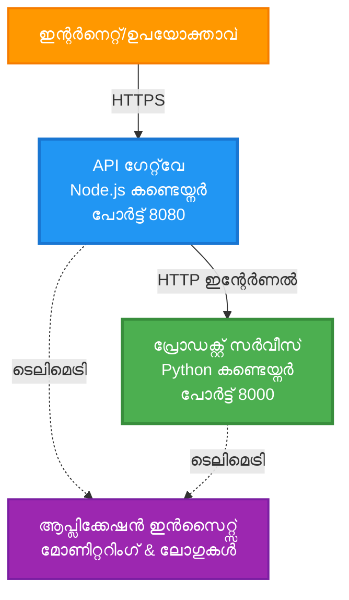
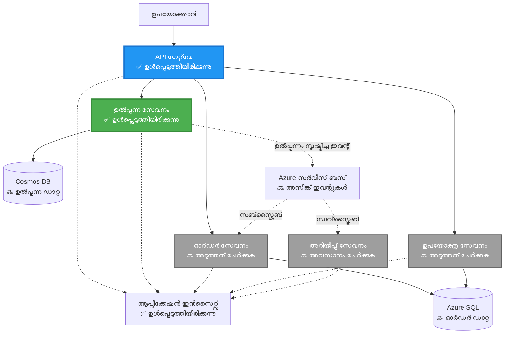
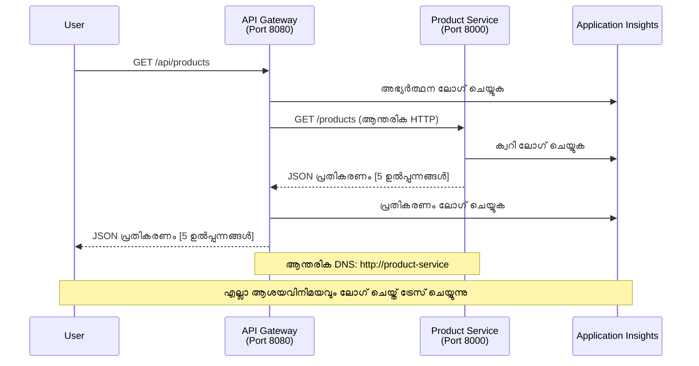

<!--
CO_OP_TRANSLATOR_METADATA:
{
  "original_hash": "eb3a4803a1e80a7f2e64f6bf63738c0f",
  "translation_date": "2025-11-24T22:02:56+00:00",
  "source_file": "examples/microservices/README.md",
  "language_code": "ml"
}
-->
# മൈക്രോസർവീസസ് ആർക്കിടെക്ചർ - കണ്ടെയ്‌നർ ആപ്പ് ഉദാഹരണം

⏱️ **അനുമാനിച്ച സമയം**: 25-35 മിനിറ്റ് | 💰 **അനുമാനിച്ച ചെലവ്**: ~$50-100/മാസം | ⭐ **സങ്കീർണ്ണത**: ഉയർന്ന തലത്തിൽ

**📚 പഠന പാത:**
- ← മുൻപ്: [സിംപിള്‍ Flask API](../../../../examples/container-app/simple-flask-api) - ഒറ്റ കണ്ടെയ്‌നറിന്റെ അടിസ്ഥാനങ്ങൾ
- 🎯 **നിങ്ങൾ ഇവിടെ**: മൈക്രോസർവീസസ് ആർക്കിടെക്ചർ (2-സർവീസ് അടിസ്ഥാനമാക്കി)
- → അടുത്തത്: [AI ഇന്റഗ്രേഷൻ](../../../../docs/ai-foundry) - നിങ്ങളുടെ സർവീസുകളിൽ ബുദ്ധിമുട്ട് ചേർക്കുക
- 🏠 [കോഴ്‌സ് ഹോം](../../README.md)

---

AZD CLI ഉപയോഗിച്ച് Azure Container Apps-ലേക്ക് വിന്യസിക്കുന്ന **ലളിതമായ പക്ഷേ പ്രവർത്തനക്ഷമമായ** മൈക്രോസർവീസസ് ആർക്കിടെക്ചർ. ഈ ഉദാഹരണം സർവീസ്-ടു-സർവീസ് ആശയവിനിമയം, കണ്ടെയ്‌നർ ഓർക്കസ്ട്രേഷൻ, മോണിറ്ററിംഗ് എന്നിവ പ്രായോഗിക 2-സർവീസ് ക്രമീകരണത്തിലൂടെ കാണിക്കുന്നു.

> **📚 പഠന സമീപനം**: ഈ ഉദാഹരണം ഒരു കുറഞ്ഞ 2-സർവീസ് ആർക്കിടെക്ചർ (API Gateway + Backend Service) ഉപയോഗിച്ച് ആരംഭിക്കുന്നു, ഇത് നിങ്ങൾക്ക് യഥാർത്ഥത്തിൽ വിന്യസിക്കുകയും പഠിക്കുകയും ചെയ്യാൻ കഴിയും. ഈ അടിസ്ഥാനത്തിൽ പ്രാവീണ്യം നേടുന്നതിന് ശേഷം, പൂർണ്ണ മൈക്രോസർവീസസ് ഇക്കോസിസ്റ്റത്തിലേക്ക് വികസിപ്പിക്കുന്നതിന് മാർഗനിർദ്ദേശങ്ങൾ നൽകുന്നു.

## നിങ്ങൾ പഠിക്കുന്ന കാര്യങ്ങൾ

ഈ ഉദാഹരണം പൂർത്തിയാക്കുന്നതിലൂടെ, നിങ്ങൾ:
- Azure Container Apps-ലേക്ക് ഒന്നിലധികം കണ്ടെയ്‌നറുകൾ വിന്യസിക്കുക
- ആന്തരിക നെറ്റ്വർക്കിംഗ് ഉപയോഗിച്ച് സർവീസ്-ടു-സർവീസ് ആശയവിനിമയം നടപ്പിലാക്കുക
- പരിസ്ഥിതി അടിസ്ഥാനമാക്കിയുള്ള സ്കെയിലിംഗ്, ഹെൽത്ത് ചെക്കുകൾ എന്നിവ ക്രമീകരിക്കുക
- Application Insights ഉപയോഗിച്ച് വിതരണ ആപ്ലിക്കേഷനുകൾ നിരീക്ഷിക്കുക
- മൈക്രോസർവീസസ് വിന്യാസ പാറ്റേണുകളും മികച്ച രീതികളും മനസ്സിലാക്കുക
- ലളിതമായ ആർക്കിടെക്ചറിൽ നിന്ന് സങ്കീർണ്ണമായ ആർക്കിടെക്ചറിലേക്ക് ക്രമാനുഗതമായ വികസനം പഠിക്കുക

## ആർക്കിടെക്ചർ

### ഘട്ടം 1: ഞങ്ങൾ നിർമ്മിക്കുന്നതെന്താണ് (ഈ ഉദാഹരണത്തിൽ ഉൾപ്പെടുത്തിയിരിക്കുന്നത്)


**ഘടക വിശദാംശങ്ങൾ:**

| ഘടകം | ഉദ്ദേശ്യം | ആക്സസ് | റിസോഴ്സുകൾ |
|-----------|---------|--------|-----------|
| **API Gateway** | പുറമേയുള്ള അഭ്യർത്ഥനകൾ ബാക്ക്എൻഡ് സർവീസുകളിലേക്ക് റൂട്ടുചെയ്യുന്നു | പബ്ലിക് (HTTPS) | 1 vCPU, 2GB RAM, 2-20 റെപ്ലിക്കകൾ |
| **Product Service** | ഇൻ-മെമ്മറി ഡാറ്റ ഉപയോഗിച്ച് ഉൽപ്പന്ന കാറ്റലോഗ് കൈകാര്യം ചെയ്യുന്നു | ആന്തരികമായി മാത്രം | 0.5 vCPU, 1GB RAM, 1-10 റെപ്ലിക്കകൾ |
| **Application Insights** | കേന്ദ്രീകരിച്ച ലോഗിംഗ്, വിതരണ ട്രേസിംഗ് | Azure Portal | 1-2 GB/മാസം ഡാറ്റ ഇൻജക്ഷൻ |

**എന്തുകൊണ്ട് ലളിതമായി ആരംഭിക്കണം?**
- ✅ വേഗത്തിൽ വിന്യസിക്കുകയും മനസ്സിലാക്കുകയും ചെയ്യുക (25-35 മിനിറ്റ്)
- ✅ സങ്കീർണ്ണത ഇല്ലാതെ മൈക്രോസർവീസസ് പാറ്റേണുകൾ പഠിക്കുക
- ✅ പ്രവർത്തനക്ഷമമായ കോഡ്, നിങ്ങൾക്ക് മാറ്റം വരുത്താനും പരീക്ഷിക്കാനും കഴിയും
- ✅ പഠനത്തിനുള്ള കുറഞ്ഞ ചെലവ് (~$50-100/മാസം vs $300-1400/മാസം)
- ✅ ഡാറ്റാബേസുകളും മെസേജ് ക്യൂകളും ചേർക്കുന്നതിന് മുമ്പ് ആത്മവിശ്വാസം നേടുക

**ഉപമ**: ഇത് ഡ്രൈവ് ചെയ്യാൻ പഠിക്കുന്നതുപോലെയാണ്. നിങ്ങൾ ഒരു ശൂന്യമായ പാർക്കിംഗ് ലോട്ടിൽ (2 സർവീസുകൾ) ആരംഭിക്കുന്നു, അടിസ്ഥാനങ്ങൾ കൈവരിക്കുന്നു, തുടർന്ന് നഗര ട്രാഫിക്കിലേക്ക് (5+ സർവീസുകൾ ഡാറ്റാബേസുകളോടെ) പുരോഗമിക്കുന്നു.

### ഘട്ടം 2: ഭാവി വികസനം (റഫറൻസ് ആർക്കിടെക്ചർ)

2-സർവീസ് ആർക്കിടെക്ചറിൽ പ്രാവീണ്യം നേടുന്നതിന് ശേഷം, നിങ്ങൾക്ക് വികസിപ്പിക്കാം:


"Expansion Guide" വിഭാഗത്തിൽ ഘട്ടം ഘട്ടമായ നിർദ്ദേശങ്ങൾ കാണുക.

## ഉൾപ്പെടുത്തിയിരിക്കുന്ന സവിശേഷതകൾ

✅ **Service Discovery**: കണ്ടെയ്‌നറുകൾ തമ്മിലുള്ള DNS അടിസ്ഥാനമാക്കിയുള്ള സ്വയം കണ്ടെത്തൽ  
✅ **Load Balancing**: റെപ്ലിക്കകൾക്കിടയിൽ ബിൽറ്റ്-ഇൻ ലോഡ് ബാലൻസിംഗ്  
✅ **Auto-scaling**: HTTP അഭ്യർത്ഥനകളുടെ അടിസ്ഥാനത്തിൽ സർവീസ്-പ്രത്യേക സ്കെയിലിംഗ്  
✅ **Health Monitoring**: രണ്ട് സർവീസുകൾക്കും ലൈവ്നസ്, റെഡിനസ് പ്രോബുകൾ  
✅ **Distributed Logging**: Application Insights ഉപയോഗിച്ച് കേന്ദ്ര ലോഗിംഗ്  
✅ **Internal Networking**: സുരക്ഷിത സർവീസ്-ടു-സർവീസ് ആശയവിനിമയം  
✅ **Container Orchestration**: സ്വയം വിന്യാസവും സ്കെയിലിംഗും  
✅ **Zero-Downtime Updates**: റോളിംഗ് അപ്ഡേറ്റുകൾ, റിവിഷൻ മാനേജ്മെന്റ്  

## ആവശ്യമായ ഉപകരണങ്ങൾ

### ആവശ്യമായ ടൂളുകൾ

ആരംഭിക്കുന്നതിന് മുമ്പ്, ഈ ടൂളുകൾ ഇൻസ്റ്റാൾ ചെയ്തിട്ടുണ്ടെന്ന് ഉറപ്പാക്കുക:

1. **[Azure Developer CLI (azd)](https://learn.microsoft.com/azure/developer/azure-developer-cli/install-azd)** (പതിപ്പ് 1.0.0 അല്ലെങ്കിൽ അതിനുമുകളിൽ)
   ```bash
   azd version
   # പ്രതീക്ഷിക്കുന്ന ഔട്ട്പുട്ട്: azd പതിപ്പ് 1.0.0 അല്ലെങ്കിൽ അതിനുമുകളിൽ
   ```

2. **[Azure CLI](https://learn.microsoft.com/cli/azure/install-azure-cli)** (പതിപ്പ് 2.50.0 അല്ലെങ്കിൽ അതിനുമുകളിൽ)
   ```bash
   az --version
   # പ്രതീക്ഷിക്കുന്ന ഔട്ട്പുട്ട്: azure-cli 2.50.0 അല്ലെങ്കിൽ അതിനുമുകളിൽ
   ```

3. **[Docker](https://www.docker.com/get-started)** (പ്രാദേശിക വികസനം/പരീക്ഷണത്തിന് - ഐച്ഛികം)
   ```bash
   docker --version
   # പ്രതീക്ഷിക്കുന്ന ഔട്ട്പുട്ട്: Docker പതിപ്പ് 20.10 അല്ലെങ്കിൽ അതിനുമുകളിൽ
   ```

### നിങ്ങളുടെ ക്രമീകരണം സ്ഥിരീകരിക്കുക

നിങ്ങൾ തയ്യാറാണെന്ന് സ്ഥിരീകരിക്കാൻ ഈ കമാൻഡുകൾ പ്രവർത്തിപ്പിക്കുക:

```bash
# ആസൂർ ഡെവലപ്പർ CLI പരിശോധിക്കുക
azd version
# ✅ പ്രതീക്ഷിച്ചത്: azd പതിപ്പ് 1.0.0 അല്ലെങ്കിൽ അതിനുമുകളിൽ

# ആസൂർ CLI പരിശോധിക്കുക
az --version
# ✅ പ്രതീക്ഷിച്ചത്: azure-cli 2.50.0 അല്ലെങ്കിൽ അതിനുമുകളിൽ

# ഡോക്കർ പരിശോധിക്കുക (ഐച്ഛികം)
docker --version
# ✅ പ്രതീക്ഷിച്ചത്: ഡോക്കർ പതിപ്പ് 20.10 അല്ലെങ്കിൽ അതിനുമുകളിൽ
```

**വിജയത്തിന്റെ മാനദണ്ഡം**: എല്ലാ കമാൻഡുകളും കുറഞ്ഞത് ആവശ്യമായ പതിപ്പുകൾ അല്ലെങ്കിൽ അതിനുമുകളിൽ തിരിച്ചുനൽകുന്നു.

### Azure ആവശ്യങ്ങൾ

- സജീവമായ **Azure സബ്സ്ക്രിപ്ഷൻ** ([ഒരു സൗജന്യ അക്കൗണ്ട് സൃഷ്ടിക്കുക](https://azure.microsoft.com/free/))
- നിങ്ങളുടെ സബ്സ്ക്രിപ്ഷനിൽ റിസോഴ്സുകൾ സൃഷ്ടിക്കുന്നതിന് അനുമതികൾ
- സബ്സ്ക്രിപ്ഷൻ അല്ലെങ്കിൽ റിസോഴ്സ് ഗ്രൂപ്പിൽ **Contributor** റോൾ

### അറിവിന്റെ മുൻവശങ്ങൾ

ഇത് ഒരു **ഉയർന്ന തലത്തിലുള്ള** ഉദാഹരണമാണ്. നിങ്ങൾ:
- [സിംപിള്‍ Flask API ഉദാഹരണം](../../../../examples/container-app/simple-flask-api) പൂർത്തിയാക്കിയിരിക്കണം
- മൈക്രോസർവീസസ് ആർക്കിടെക്ചറിന്റെ അടിസ്ഥാന ധാരണ
- REST APIകളും HTTPയും പരിചയമുള്ളത്
- കണ്ടെയ്‌നർ ആശയങ്ങൾ മനസ്സിലാക്കുക

**Container Apps-ലേക്ക് പുതിയവരാണോ?** ആദ്യം [സിംപിള്‍ Flask API ഉദാഹരണം](../../../../examples/container-app/simple-flask-api) ഉപയോഗിച്ച് അടിസ്ഥാനങ്ങൾ പഠിക്കുക.

## ക്വിക്ക് സ്റ്റാർട്ട് (ഘട്ടം ഘട്ടമായി)

### ഘട്ടം 1: ക്ലോൺ ചെയ്യുക, നാവിഗേറ്റ് ചെയ്യുക

```bash
git clone https://github.com/microsoft/AZD-for-beginners.git
cd AZD-for-beginners/examples/microservices
```

**✓ വിജയ പരിശോധന**: `azure.yaml` കാണുന്നുണ്ടെന്ന് സ്ഥിരീകരിക്കുക:
```bash
ls
# പ്രതീക്ഷിച്ചത്: README.md, azure.yaml, infra/, src/
```

### ഘട്ടം 2: Azure-ൽ ഓതന്റിക്കേറ്റ് ചെയ്യുക

```bash
azd auth login
```

ഇത് Azure ഓതന്റിക്കേഷനുള്ള ബ്രൗസർ തുറക്കുന്നു. നിങ്ങളുടെ Azure ക്രെഡൻഷ്യലുകൾ ഉപയോഗിച്ച് സൈൻ ഇൻ ചെയ്യുക.

**✓ വിജയ പരിശോധന**: നിങ്ങൾ കാണണം:
```
Logged in to Azure.
```

### ഘട്ടം 3: പരിസ്ഥിതി ആരംഭിക്കുക

```bash
azd init
```

**നിങ്ങൾ കാണുന്ന പ്രോംപ്റ്റുകൾ**:
- **പരിസ്ഥിതി പേര്**: ഒരു ചുരുങ്ങിയ പേര് നൽകുക (ഉദാ, `microservices-dev`)
- **Azure സബ്സ്ക്രിപ്ഷൻ**: നിങ്ങളുടെ സബ്സ്ക്രിപ്ഷൻ തിരഞ്ഞെടുക്കുക
- **Azure സ്ഥലം**: ഒരു പ്രദേശം തിരഞ്ഞെടുക്കുക (ഉദാ, `eastus`, `westeurope`)

**✓ വിജയ പരിശോധന**: നിങ്ങൾ കാണണം:
```
SUCCESS: New project initialized!
```

### ഘട്ടം 4: ഇൻഫ്രാസ്ട്രക്ചർ, സർവീസുകൾ വിന്യസിക്കുക

```bash
azd up
```

**എന്താണ് സംഭവിക്കുന്നത്** (8-12 മിനിറ്റ്):

```mermaid
graph LR
    A[azd up] --> B[റിസോഴ്‌സ് ഗ്രൂപ്പ് സൃഷ്ടിക്കുക]
    B --> C[കണ്ടെയ്‌നർ രജിസ്ട്രി വിന്യസിക്കുക]
    C --> D[ലോഗ് അനലിറ്റിക്സ് വിന്യസിക്കുക]
    D --> E[ആപ്പ് ഇൻസൈറ്റ്സ് വിന്യസിക്കുക]
    E --> F[കണ്ടെയ്‌നർ പരിസ്ഥിതി സൃഷ്ടിക്കുക]
    F --> G[API ഗേറ്റ്‌വേ ഇമേജ് നിർമ്മിക്കുക]
    F --> H[പ്രോഡക്റ്റ് സർവീസ് ഇമേജ് നിർമ്മിക്കുക]
    G --> I[റജിസ്ട്രിയിലേക്ക് പുഷ് ചെയ്യുക]
    H --> I
    I --> J[API ഗേറ്റ്‌വേ വിന്യസിക്കുക]
    I --> K[പ്രോഡക്റ്റ് സർവീസ് വിന്യസിക്കുക]
    J --> L[ഇൻഗ്രസ് & ഹെൽത്ത് ചെക്കുകൾ ക്രമീകരിക്കുക]
    K --> L
    L --> M[വിന്യാസം പൂർത്തിയായി ✓]
    
    style A fill:#2196F3,stroke:#1976D2,stroke-width:3px,color:#fff
    style M fill:#4CAF50,stroke:#388E3C,stroke-width:3px,color:#fff
```


**✓ വിജയ പരിശോധന**: നിങ്ങൾ കാണണം:
```
SUCCESS: Your application was deployed to Azure in X minutes Y seconds.
Endpoint: https://api-gateway-<unique-id>.azurecontainerapps.io
```

**⏱️ സമയം**: 8-12 മിനിറ്റ്

### ഘട്ടം 5: വിന്യാസം പരീക്ഷിക്കുക

```bash
# ഗേറ്റ്‌വേ എൻഡ്പോയിന്റ് നേടുക
GATEWAY_URL=$(azd env get-values | grep API_GATEWAY_URL | cut -d '=' -f2 | tr -d '"')

# API ഗേറ്റ്‌വേയുടെ ആരോഗ്യസ്ഥിതി പരിശോധിക്കുക
curl $GATEWAY_URL/health
```

**✅ പ്രതീക്ഷിക്കുന്ന ഔട്ട്പുട്ട്**:
```json
{
  "status": "healthy",
  "service": "api-gateway",
  "timestamp": "2025-11-19T10:30:00Z"
}
```

**ഗേറ്റ്വേ വഴി ഉൽപ്പന്ന സർവീസ് പരീക്ഷിക്കുക**:
```bash
# ഉൽപ്പന്നങ്ങൾ പട്ടികയിടുക
curl $GATEWAY_URL/api/products
```

**✅ പ്രതീക്ഷിക്കുന്ന ഔട്ട്പുട്ട്**:
```json
[
  {"id":1,"name":"Laptop","price":999.99,"stock":50},
  {"id":2,"name":"Mouse","price":29.99,"stock":200},
  {"id":3,"name":"Keyboard","price":79.99,"stock":150}
]
```

**✓ വിജയ പരിശോധന**: രണ്ട് എന്റ്പോയിന്റുകളും JSON ഡാറ്റ പിശകുകൾ ഇല്ലാതെ തിരിച്ചുനൽകുന്നു.

---

**🎉 അഭിനന്ദനങ്ങൾ!** നിങ്ങൾ Azure-ലേക്ക് ഒരു മൈക്രോസർവീസസ് ആർക്കിടെക്ചർ വിന്യസിച്ചു!

## പ്രോജക്റ്റ് ഘടന

എല്ലാ നടപ്പിലാക്കൽ ഫയലുകളും ഉൾപ്പെടുത്തിയിട്ടുണ്ട്—ഇത് ഒരു പൂർണ്ണ, പ്രവർത്തനക്ഷമമായ ഉദാഹരണമാണ്:

```
microservices/
│
├── README.md                         # This file
├── azure.yaml                        # AZD configuration
├── .gitignore                        # Git ignore patterns
│
├── infra/                           # Infrastructure as Code (Bicep)
│   ├── main.bicep                   # Main orchestration
│   ├── abbreviations.json           # Naming conventions
│   ├── core/                        # Shared infrastructure
│   │   ├── container-apps-environment.bicep  # Container environment + registry
│   │   └── monitor.bicep            # Application Insights + Log Analytics
│   └── app/                         # Service definitions
│       ├── api-gateway.bicep        # API Gateway container app
│       └── product-service.bicep    # Product Service container app
│
└── src/                             # Application source code
    ├── api-gateway/                 # Node.js API Gateway
    │   ├── app.js                   # Express server with routing
    │   ├── package.json             # Node dependencies
    │   └── Dockerfile               # Container definition
    └── product-service/             # Python Product Service
        ├── main.py                  # Flask API with product data
        ├── requirements.txt         # Python dependencies
        └── Dockerfile               # Container definition
```

**ഓരോ ഘടകവും എന്താണ് ചെയ്യുന്നത്:**

**Infrastructure (infra/)**:
- `main.bicep`: എല്ലാ Azure റിസോഴ്സുകളും അവയുടെ ആശ്രിതത്വങ്ങളും ഓർക്കസ്ട്രേറ്റ് ചെയ്യുന്നു
- `core/container-apps-environment.bicep`: Container Apps പരിസ്ഥിതിയും Azure Container Registryയും സൃഷ്ടിക്കുന്നു
- `core/monitor.bicep`: വിതരണ ലോഗിംഗിനായി Application Insights സജ്ജമാക്കുന്നു
- `app/*.bicep`: സ്കെയിലിംഗ്, ഹെൽത്ത് ചെക്കുകൾ എന്നിവയുള്ള വ്യക്തിഗത കണ്ടെയ്‌നർ ആപ്പ് നിർവചനം

**API Gateway (src/api-gateway/)**:
- പുറമേയുള്ള അഭ്യർത്ഥനകൾ ബാക്ക്എൻഡ് സർവീസുകളിലേക്ക് റൂട്ടുചെയ്യുന്ന പബ്ലിക്-ഫേസിംഗ് സർവീസ്
- ലോഗിംഗ്, പിശക് കൈകാര്യം ചെയ്യൽ, അഭ്യർത്ഥന ഫോർവേഡിംഗ് നടപ്പിലാക്കുന്നു
- സർവീസ്-ടു-സർവീസ് HTTP ആശയവിനിമയം കാണിക്കുന്നു

**Product Service (src/product-service/)**:
- ഉൽപ്പന്ന കാറ്റലോഗ് (ലളിതത്വത്തിനായി ഇൻ-മെമ്മറി) ഉള്ള ആന്തരിക സർവീസ്
- REST API, ഹെൽത്ത് ചെക്കുകൾ
- ബാക്ക്എൻഡ് മൈക്രോസർവീസ് പാറ്റേണിന്റെ ഉദാഹരണം

## സർവീസുകളുടെ അവലോകനം

### API Gateway (Node.js/Express)

**പോർട്ട്**: 8080  
**ആക്സസ്**: പബ്ലിക് (ബാഹ്യ ഇൻഗ്രസ്)  
**ഉദ്ദേശ്യം**: വരുന്ന അഭ്യർത്ഥനകൾ അനുയോജ്യമായ ബാക്ക്എൻഡ് സർവീസുകളിലേക്ക് റൂട്ടുചെയ്യുന്നു  

**എന്റ്പോയിന്റുകൾ**:
- `GET /` - സർവീസ് വിവരങ്ങൾ
- `GET /health` - ഹെൽത്ത് ചെക്ക് എന്റ്പോയിന്റ്
- `GET /api/products` - ഉൽപ്പന്ന സർവീസിലേക്ക് ഫോർവേഡ് ചെയ്യുക (എല്ലാം ലിസ്റ്റ് ചെയ്യുക)
- `GET /api/products/:id` - ഉൽപ്പന്ന സർവീസിലേക്ക് ഫോർവേഡ് ചെയ്യുക (ID പ്രകാരം ലഭിക്കുക)

**പ്രധാന സവിശേഷതകൾ**:
- axios ഉപയോഗിച്ച് അഭ്യർത്ഥന റൂട്ടിംഗ്
- കേന്ദ്ര ലോഗിംഗ്
- പിശക് കൈകാര്യം ചെയ്യൽ, ടൈംഔട്ട് മാനേജ്മെന്റ്
- പരിസ്ഥിതി വേരിയബിൾ വഴി സർവീസ് കണ്ടെത്തൽ
- Application Insights ഇന്റഗ്രേഷൻ

**കോഡ് ഹൈലൈറ്റ്** (`src/api-gateway/app.js`):
```javascript
// ആഭ്യന്തര സേവന ആശയവിനിമയം
app.get('/api/products', async (req, res) => {
  const response = await axios.get(`${PRODUCT_SERVICE_URL}/products`, {
    timeout: 5000
  });
  res.json(response.data);
});
```

### Product Service (Python/Flask)

**പോർട്ട്**: 8000  
**ആക്സസ്**: ആന്തരികമായി മാത്രം (ബാഹ്യ ഇൻഗ്രസ് ഇല്ല)  
**ഉദ്ദേശ്യം**: ഇൻ-മെമ്മറി ഡാറ്റ ഉപയോഗിച്ച് ഉൽപ്പന്ന കാറ്റലോഗ് കൈകാര്യം ചെയ്യുന്നു  

**എന്റ്പോയിന്റുകൾ**:
- `GET /` - സർവീസ് വിവരങ്ങൾ
- `GET /health` - ഹെൽത്ത് ചെക്ക് എന്റ്പോയിന്റ്
- `GET /products` - എല്ലാ ഉൽപ്പന്നങ്ങളും ലിസ്റ്റ് ചെയ്യുക
- `GET /products/<id>` - ID പ്രകാരം ഉൽപ്പന്നം ലഭിക്കുക

**പ്രധാന സവിശേഷതകൾ**:
- Flask ഉപയോഗിച്ച് RESTful API
- ഇൻ-മെമ്മറി ഉൽപ്പന്ന സ്റ്റോർ (ലളിതം, ഡാറ്റാബേസ് ആവശ്യമില്ല)
- പ്രോബുകൾ ഉപയോഗിച്ച് ഹെൽത്ത് മോണിറ്ററിംഗ്
- ഘടനാപരമായ ലോഗിംഗ്
- Application Insights ഇന്റഗ്രേഷൻ

**ഡാറ്റ മോഡൽ**:
```python
{
  "id": 1,
  "name": "Laptop",
  "description": "High-performance laptop",
  "price": 999.99,
  "stock": 50
}
```

**എന്തുകൊണ്ട് ആന്തരികമായി മാത്രം?**
ഉൽപ്പന്ന സർവീസ് പൊതുവായി പ്രദർശിപ്പിക്കുന്നില്ല. എല്ലാ അഭ്യർത്ഥനകളും API Gateway വഴി പോകണം, ഇത് നൽകുന്നു:
- സുരക്ഷ: നിയന്ത്രിത ആക്സസ് പോയിന്റ്
- സൗകര്യം: ക്ലയന്റുകളെ ബാധിക്കാതെ ബാക്ക്എൻഡ് മാറ്റാൻ കഴിയും
- മോണിറ്ററിംഗ്: കേന്ദ്ര അഭ്യർത്ഥന ലോഗിംഗ്

## സർവീസ് ആശയവിനിമയം മനസ്സിലാക്കുക

### സർവീസുകൾ തമ്മിൽ എങ്ങനെ ആശയവിനിമയം നടത്തുന്നു


ഈ ഉദാഹരണത്തിൽ, API Gateway **ആന്തരിക HTTP കോൾ** ഉപയോഗിച്ച് Product Service-യുമായി ആശയവിനിമയം നടത്തുന്നു:

```javascript
// API ഗേറ്റ്‌വേ (src/api-gateway/app.js)
const PRODUCT_SERVICE_URL = process.env.PRODUCT_SERVICE_URL;

// ആന്തരിക HTTP അഭ്യർത്ഥന നടത്തുക
const response = await axios.get(`${PRODUCT_SERVICE_URL}/products`);
```

**പ്രധാന പോയിന്റുകൾ**:

1. **DNS-അടിസ്ഥാനമാക്കിയുള്ള കണ്ടെത്തൽ**: Container Apps സ്വയം DNS നൽകുന്നു
   - Product Service FQDN: `product-service.internal.<environment>.azurecontainerapps.io`
   - ലളിതമാക്കിയത്: `http://product-service` (Container Apps ഇത് പരിഹരിക്കുന്നു)

2. **പൊതുവായ പ്രദർശനം ഇല്ല**: Product Service-ന് Bicep-ൽ `external: false` ഉണ്ട്
   - Container Apps പരിസ്ഥിതിയ്ക്കുള്ളിൽ മാത്രമേ ആക്സസ് ചെയ്യാൻ കഴിയൂ
   - ഇന്റർനെറ്റിൽ നിന്ന് എത്താൻ കഴിയില്ല

3. **പരിസ്ഥിതി വേരിയബിൾ**: സർവീസ് URL-കൾ വിന്യാസ സമയത്ത് ഇൻജെക്റ്റ് ചെയ്യുന്നു
   - Bicep ആന്തരിക FQDN ഗേറ്റ്വേയ്ക്ക് പാസ്സ് ചെയ്യുന്നു
   - ആപ്ലിക്കേഷൻ കോഡിൽ ഹാർഡ്‌കോഡ് ചെയ്ത URL-കൾ ഇല്ല

**ഉപമ**: ഇത് ഓഫീസ് മുറികളുപോലെയാണ്. API Gateway ഒരു റിസപ്ഷൻ ഡെസ്ക് (പബ്ലിക്-ഫേസിംഗ്) ആണ്, Product Service ഒരു ഓഫീസ് മുറി (ആന്തരികമായി മാത്രം) ആണ്. സന്ദർശകർ ഏതെങ്കിലും ഓഫീസ് എത്താൻ റിസപ്ഷൻ വഴി പോകണം.

## വിന്യാസ ഓപ്ഷനുകൾ

### പൂർണ്ണ വിന്യാസം (ശുപാർശ ചെയ്യുന്നു)

```bash
# ഇൻഫ്രാസ്ട്രക്ചറും രണ്ട് സേവനങ്ങളും വിന്യസിക്കുക
azd up
```

ഇത് വിന്യസിക്കുന്നു:
1. Container Apps പരിസ്ഥിതി
2. Application Insights
3. Container Registry
4. API Gateway കണ്ടെയ്‌നർ
5. Product Service കണ്ടെയ്‌നർ

**സമയം**: 8-12 മിനിറ്റ്

### വ്യക്തിഗത സർവീസ് വിന്യസിക്കുക

```bash
# പ്രാരംഭ azd up ശേഷം ഒരു സേവനം മാത്രമേ വിന്യസിക്കൂ
azd deploy api-gateway

# അല്ലെങ്കിൽ ഉൽപ്പന്ന സേവനം വിന്യസിക്കൂ
azd deploy product-service
```

**ഉപയോഗ കേസ്**: നിങ്ങൾ ഒരു സർവീസിൽ കോഡ് അപ്ഡേറ്റ് ചെയ്തിട്ടുണ്ടെങ്കിൽ, ആ സർവീസ് മാത്രം വീണ്ടും വിന്യസിക്കാൻ.

### കോൺഫിഗറേഷൻ അപ്ഡേറ്റ് ചെയ്യുക

```bash
# സ്കെയിലിംഗ് പാരാമീറ്ററുകൾ മാറ്റുക
azd env set GATEWAY_MAX_REPLICAS 30

# പുതിയ കോൺഫിഗറേഷനോടെ വീണ്ടും വിന്യസിക്കുക
azd up
```

## കോൺഫിഗറേഷൻ

### സ്കെയിലിംഗ് കോൺഫിഗറേഷൻ

രണ്ടു സർവീസുകളും അവരുടെ Bicep ഫയലുകളിൽ HTTP-അടിസ്ഥാനമാക്കിയുള്ള ഓട്ടോ സ്കെയിലിംഗ് ഉപയോഗിച്ച് കോൺഫിഗർ ചെയ്തിരിക്കുന്നു:

**API Gateway**:
- മിൻ റെപ്ലിക്കകൾ: 2 (ലഭ്യതയ്ക്കായി എപ്പോഴും കുറഞ്ഞത് 2)
- മാക്സ് റെപ്ലിക്കകൾ: 20
- സ്കെയിൽ ട്രിഗർ: റെപ്ലിക്കിന് 50 സമകാലിക അഭ്യർത്ഥനകൾ

**Product Service**:
- മിൻ റെപ്ലിക്കകൾ: 1 (ആവശമെങ്കിൽ 0-ലേക്ക് സ്കെയിൽ ചെയ്യാം)
- മാക്സ് റെപ്ലിക്കകൾ: 10
- സ്കെയിൽ ട്രിഗർ: റെപ്ലിക്കിന് 100 സമകാലിക അഭ്യർത്ഥനകൾ

**സ്കെയിലിംഗ് ഇഷ്ടാനുസൃതമാക്കുക** (`infra/app/*.bicep`):
```bicep
scale: {
  minReplicas: 1
  maxReplicas: 10
  rules: [
    {
      name: 'http-scale-rule'
      http: {
        metadata: {
          concurrentRequests: '100'  // Adjust this
        }
      }
    }
  ]
}
```


3. രണ്ട് സേവനങ്ങളും വീണ്ടും ഡിപ്ലോയ് ചെയ്യുക:

```bash
azd deploy product-service
azd deploy api-gateway
```

4. പുതിയ എൻഡ്പോയിന്റ് ടെസ്റ്റ് ചെയ്യുക:

```bash
GATEWAY_URL=$(azd env get-values | grep API_GATEWAY_URL | cut -d '=' -f2 | tr -d '"')

# പുതിയ ഉൽപ്പന്നം സൃഷ്ടിക്കുക
curl -X POST $GATEWAY_URL/api/products \
  -H "Content-Type: application/json" \
  -d '{"name":"USB Cable","price":9.99,"stock":500}'
```

**✅ പ്രതീക്ഷിക്കുന്ന ഔട്ട്പുട്ട്:**
```json
{"id":6,"name":"USB Cable","description":"","price":9.99,"stock":500}
```

5. ഇത് ലിസ്റ്റിൽ കാണുന്നുണ്ടോ എന്ന് ഉറപ്പാക്കുക:

```bash
curl $GATEWAY_URL/api/products
# ഇപ്പോൾ പുതിയ USB കേബിൾ ഉൾപ്പെടെ 6 ഉൽപ്പന്നങ്ങൾ കാണിക്കണം
```

**വിജയത്തിന്റെ മാനദണ്ഡങ്ങൾ**:
- ✅ POST അഭ്യർത്ഥന HTTP 201 തിരികെ നൽകുന്നു
- ✅ പുതിയ ഉൽപ്പന്നം GET /api/products ലിസ്റ്റിൽ കാണുന്നു
- ✅ ഉൽപ്പന്നത്തിന് സ്വയം വർദ്ധിപ്പിക്കുന്ന ID ഉണ്ട്

**സമയം**: 10-15 മിനിറ്റ്

---

### വ്യായാമം 2: ഓട്ടോസ്കെയിലിംഗ് റൂളുകൾ മാറ്റുക ⭐⭐ (മധ്യനിരപ്പിൽ)

**ലക്ഷ്യം**: പ്രൊഡക്റ്റ് സർവീസ് കൂടുതൽ ആകാംക്ഷയോടെ സ്കെയിൽ ചെയ്യുക

**ആരംഭിക്കുന്ന സ്ഥലം**: `infra/app/product-service.bicep`

**ചുവടുകൾ**:

1. `infra/app/product-service.bicep` തുറക്കുക, ഏകദേശം 95-ആം വരിയിൽ `scale` ബ്ലോക്ക് കണ്ടെത്തുക

2. ഇത് മാറ്റുക:
```bicep
scale: {
  minReplicas: 1
  maxReplicas: 10
  rules: [
    {
      name: 'http-scale-rule'
      http: {
        metadata: {
          concurrentRequests: '100'  // OLD
        }
      }
    }
  ]
}
```

ഇതിലേക്ക്:
```bicep
scale: {
  minReplicas: 2  // Always have 2 running
  maxReplicas: 20  // Allow more scaling
  rules: [
    {
      name: 'http-scale-rule'
      http: {
        metadata: {
          concurrentRequests: '20'  // Scale at lower threshold
        }
      }
    }
  ]
}
```

3. ഇൻഫ്രാസ്ട്രക്ചർ വീണ്ടും ഡിപ്ലോയ് ചെയ്യുക:

```bash
azd up
```

4. പുതിയ സ്കെയിലിംഗ് കോൺഫിഗറേഷൻ പരിശോധിക്കുക:

```bash
az containerapp show \
  --name $(azd env get-values | grep PRODUCT_SERVICE | head -1 | cut -d '/' -f5) \
  --resource-group $(azd env get-values | grep AZURE_RESOURCE_GROUP | cut -d '=' -f2 | tr -d '"') \
  --query "properties.template.scale" -o json
```

**✅ പ്രതീക്ഷിക്കുന്ന ഔട്ട്പുട്ട്:**
```json
{
  "minReplicas": 2,
  "maxReplicas": 20,
  "rules": [...]
}
```

5. ലോഡോടെ ഓട്ടോസ്കെയിലിംഗ് ടെസ്റ്റ് ചെയ്യുക:

```bash
# സമകാലിക അഭ്യർത്ഥനകൾ സൃഷ്ടിക്കുക
for i in {1..500}; do curl $GATEWAY_URL/api/products & done

# സ്കെയിലിംഗ് സംഭവിക്കുന്നത് കാണുക
azd logs product-service --follow
# നോക്കുക: കണ്ടെയ്നർ ആപ്പുകളുടെ സ്കെയിലിംഗ് സംഭവങ്ങൾ
```

**വിജയത്തിന്റെ മാനദണ്ഡങ്ങൾ**:
- ✅ പ്രൊഡക്റ്റ് സർവീസ് കുറഞ്ഞത് 2 റെപ്ലിക്കാസിൽ പ്രവർത്തിക്കുന്നു
- ✅ ലോഡിൽ, 2 റെപ്ലിക്കാസിൽ കൂടുതൽ സ്കെയിൽ ചെയ്യുന്നു
- ✅ Azure പോർട്ടലിൽ പുതിയ സ്കെയിലിംഗ് റൂളുകൾ കാണിക്കുന്നു

**സമയം**: 15-20 മിനിറ്റ്

---

### വ്യായാമം 3: കസ്റ്റം മോണിറ്ററിംഗ് ക്വറി ചേർക്കുക ⭐⭐ (മധ്യനിരപ്പിൽ)

**ലക്ഷ്യം**: പ്രൊഡക്റ്റ് API പ്രകടനം ട്രാക്ക് ചെയ്യാൻ കസ്റ്റം ആപ്ലിക്കേഷൻ ഇൻസൈറ്റ്സ് ക്വറി സൃഷ്ടിക്കുക

**ചുവടുകൾ**:

1. Azure പോർട്ടലിൽ ആപ്ലിക്കേഷൻ ഇൻസൈറ്റ്സിലേക്ക് പോകുക:
   - Azure പോർട്ടലിലേക്ക് പോകുക
   - നിങ്ങളുടെ റിസോഴ്‌സ് ഗ്രൂപ്പ് (rg-microservices-*) കണ്ടെത്തുക
   - ആപ്ലിക്കേഷൻ ഇൻസൈറ്റ്സ് റിസോഴ്‌സ് ക്ലിക്ക് ചെയ്യുക

2. ഇടത് മെനുവിൽ "Logs" ക്ലിക്ക് ചെയ്യുക

3. ഈ ക്വറി സൃഷ്ടിക്കുക:

```kusto
requests
| where timestamp > ago(1h)
| where name contains "products"
| summarize 
    RequestCount = count(),
    AvgDuration = avg(duration),
    P95Duration = percentile(duration, 95),
    SuccessRate = 100.0 * countif(success == true) / count()
  by bin(timestamp, 5m)
| render timechart
```

4. ക്വറി പ്രവർത്തിപ്പിക്കാൻ "Run" ക്ലിക്ക് ചെയ്യുക

5. ക്വറി സംരക്ഷിക്കുക:
   - "Save" ക്ലിക്ക് ചെയ്യുക
   - പേര്: "Product API Performance"
   - വിഭാഗം: "Performance"

6. ടെസ്റ്റ് ട്രാഫിക് സൃഷ്ടിക്കുക:

```bash
for i in {1..100}; do curl $GATEWAY_URL/api/products; sleep 1; done
```

7. ഡാറ്റ കാണാൻ ക്വറി റിഫ്രെഷ് ചെയ്യുക

**✅ പ്രതീക്ഷിക്കുന്ന ഔട്ട്പുട്ട്:**
- സമയത്തിനൊത്ത് അഭ്യർത്ഥനകളുടെ എണ്ണം കാണിക്കുന്ന ചാർട്ട്
- ശരാശരി ദൈർഘ്യം < 500ms
- വിജയ നിരക്ക് = 100%
- 5 മിനിറ്റ് സമയ ബിൻസ്

**വിജയത്തിന്റെ മാനദണ്ഡങ്ങൾ**:
- ✅ ക്വറി 100+ അഭ്യർത്ഥനകൾ കാണിക്കുന്നു
- ✅ വിജയ നിരക്ക് 100%
- ✅ ശരാശരി ദൈർഘ്യം < 500ms
- ✅ ചാർട്ട് 5 മിനിറ്റ് സമയ ബിൻസ് പ്രദർശിപ്പിക്കുന്നു

**പാഠഫലം**: കസ്റ്റം ക്വറികളിലൂടെ സേവന പ്രകടനം മോണിറ്റർ ചെയ്യുന്നത് മനസിലാക്കുക

**സമയം**: 10-15 മിനിറ്റ്

---

### വ്യായാമം 4: റിട്രൈ ലജിക് നടപ്പിലാക്കുക ⭐⭐⭐ (ഉന്നതനിരപ്പിൽ)

**ലക്ഷ്യം**: പ്രൊഡക്റ്റ് സർവീസ് താൽക്കാലികമായി ലഭ്യമല്ലാത്തപ്പോൾ API ഗേറ്റ്വേയിൽ റിട്രൈ ലജിക് ചേർക്കുക

**ആരംഭിക്കുന്ന സ്ഥലം**: `src/api-gateway/app.js`

**ചുവടുകൾ**:

1. റിട്രൈ ലൈബ്രറി ഇൻസ്റ്റാൾ ചെയ്യുക:

```bash
cd src/api-gateway
npm install axios-retry --save
cd ../..
```

2. `src/api-gateway/app.js` അപ്ഡേറ്റ് ചെയ്യുക (axios ഇമ്പോർട്ടിന് ശേഷം ചേർക്കുക):

```javascript
const axiosRetry = require('axios-retry');

// പുനർശ്രമ ലജിക് കോൺഫിഗർ ചെയ്യുക
axiosRetry(axios, {
  retries: 3,
  retryDelay: (retryCount) => {
    return retryCount * 1000; // 1s, 2s, 3s
  },
  retryCondition: (error) => {
    // നെറ്റ്‌വർക്കിന്റെ പിഴവുകൾ അല്ലെങ്കിൽ 5xx പ്രതികരണങ്ങളിൽ പുനർശ്രമിക്കുക
    return axiosRetry.isNetworkOrIdempotentRequestError(error) ||
           (error.response && error.response.status >= 500);
  }
});

console.log('Retry logic configured: 3 retries with exponential backoff');
```

3. API ഗേറ്റ്വേ വീണ്ടും ഡിപ്ലോയ് ചെയ്യുക:

```bash
azd deploy api-gateway
```

4. സേവന പരാജയം അനുകരിച്ച് റിട്രൈ പെരുമാറ്റം ടെസ്റ്റ് ചെയ്യുക:

```bash
# ഉൽപ്പന്ന സേവനം 0 ആയി സ്കെയിൽ ചെയ്യുക (പരാജയം അനുകരിക്കുക)
az containerapp update \
  --name $(azd env get-values | grep PRODUCT_SERVICE | head -1 | cut -d '/' -f5) \
  --resource-group $(azd env get-values | grep AZURE_RESOURCE_GROUP | cut -d '=' -f2 | tr -d '"') \
  --min-replicas 0 \
  --max-replicas 0

# ഉൽപ്പന്നങ്ങൾ ആക്സസ് ചെയ്യാൻ ശ്രമിക്കുക (3 തവണ വീണ്ടും ശ്രമിക്കും)
time curl -v $GATEWAY_URL/api/products
# നിരീക്ഷിക്കുക: പ്രതികരണം ~6 സെക്കൻഡ് എടുക്കുന്നു (1s + 2s + 3s വീണ്ടും ശ്രമങ്ങൾ)

# ഉൽപ്പന്ന സേവനം പുനസ്ഥാപിക്കുക
az containerapp update \
  --name $(azd env get-values | grep PRODUCT_SERVICE | head -1 | cut -d '/' -f5) \
  --resource-group $(azd env get-values | grep AZURE_RESOURCE_GROUP | cut -d '=' -f2 | tr -d '"') \
  --min-replicas 1 \
  --max-replicas 10
```

5. റിട്രൈ ലോഗുകൾ കാണുക:

```bash
azd logs api-gateway --tail 50
# പുനർശ്രമം സന്ദേശങ്ങൾ അന്വേഷിക്കുക
```

**✅ പ്രതീക്ഷിക്കുന്ന പെരുമാറ്റം:**
- അഭ്യർത്ഥനകൾ പരാജയപ്പെടുന്നതിന് മുമ്പ് 3 തവണ റിട്രൈ ചെയ്യുന്നു
- ഓരോ റിട്രൈക്കും കൂടുതൽ സമയം കാത്തിരിക്കുന്നു (1s, 2s, 3s)
- സേവനം പുനരാരംഭിച്ചതിന് ശേഷം വിജയകരമായ അഭ്യർത്ഥനകൾ
- ലോഗുകളിൽ റിട്രൈ ശ്രമങ്ങൾ കാണിക്കുന്നു

**വിജയത്തിന്റെ മാനദണ്ഡങ്ങൾ**:
- ✅ അഭ്യർത്ഥനകൾ പരാജയപ്പെടുന്നതിന് മുമ്പ് 3 തവണ റിട്രൈ ചെയ്യുന്നു
- ✅ ഓരോ റിട്രൈക്കും കൂടുതൽ സമയം കാത്തിരിക്കുന്നു (എക്സ്പോനൻഷ്യൽ ബാക്കോഫ്)
- ✅ സേവനം പുനരാരംഭിച്ചതിന് ശേഷം വിജയകരമായ അഭ്യർത്ഥനകൾ
- ✅ ലോഗുകളിൽ റിട്രൈ ശ്രമങ്ങൾ കാണിക്കുന്നു

**പാഠഫലം**: മൈക്രോസർവീസുകളിൽ പ്രതിരോധ പാറ്റേണുകൾ (സർക്ക്യൂട്ട് ബ്രേക്കറുകൾ, റിട്രൈകൾ, ടൈമൗട്ടുകൾ) മനസിലാക്കുക

**സമയം**: 20-25 മിനിറ്റ്

---

## അറിവ് പരിശോധിക്കുക

ഈ ഉദാഹരണം പൂർത്തിയാക്കിയ ശേഷം, നിങ്ങളുടെ അറിവ് പരിശോധിക്കുക:

### 1. സേവന ആശയവിനിമയം ✓

നിങ്ങളുടെ അറിവ് പരിശോധിക്കുക:
- [ ] API ഗേറ്റ്വേ പ്രൊഡക്റ്റ് സർവീസിനെ എങ്ങനെ കണ്ടെത്തുന്നു എന്ന് നിങ്ങൾക്ക് വിശദീകരിക്കാമോ? (DNS അടിസ്ഥാനത്തിലുള്ള സേവന കണ്ടെത്തൽ)
- [ ] പ്രൊഡക്റ്റ് സർവീസ് ഡൗൺ ആണെങ്കിൽ എന്ത് സംഭവിക്കും? (ഗേറ്റ്വേ 503 പിശക് തിരികെ നൽകുന്നു)
- [ ] മൂന്നാമത്തെ സേവനം എങ്ങനെ ചേർക്കും? (പുതിയ Bicep ഫയൽ സൃഷ്ടിക്കുക, main.bicep-ൽ ചേർക്കുക, src ഫോൾഡർ സൃഷ്ടിക്കുക)

**പ്രായോഗിക പരിശോധന**:
```bash
# സേവന തകരാർ അനുകരിക്കുക
az containerapp update --name <product-service-name> --min-replicas 0 --max-replicas 0
curl $GATEWAY_URL/api/products
# ✅ പ്രതീക്ഷിച്ചത്: 503 സേവനം ലഭ്യമല്ല

# സേവനം പുനഃസ്ഥാപിക്കുക
az containerapp update --name <product-service-name> --min-replicas 1 --max-replicas 10
```

### 2. മോണിറ്ററിംഗ് & ഓബ്സർവബിലിറ്റി ✓

നിങ്ങളുടെ അറിവ് പരിശോധിക്കുക:
- [ ] വിതരണ ലോഗുകൾ എവിടെ കാണാം? (Azure പോർട്ടലിലെ ആപ്ലിക്കേഷൻ ഇൻസൈറ്റ്സ്)
- [ ] മന്ദഗതിയിലുള്ള അഭ്യർത്ഥനകൾ എങ്ങനെ ട്രാക്ക് ചെയ്യാം? (Kusto ക്വറി: `requests | where duration > 1000`)
- [ ] പിശക് സൃഷ്ടിച്ച സേവനം തിരിച്ചറിയാൻ കഴിയും? (ലോഗുകളിൽ `cloud_RoleName` ഫീൽഡ് പരിശോധിക്കുക)

**പ്രായോഗിക പരിശോധന**:
```bash
# മന്ദഗതിയുള്ള അഭ്യർത്ഥന സിമുലേഷൻ സൃഷ്ടിക്കുക
curl "$GATEWAY_URL/api/products?delay=2000"

# മന്ദഗതിയുള്ള അഭ്യർത്ഥനകൾക്കായി ആപ്ലിക്കേഷൻ ഇൻസൈറ്റ്സ് ചോദിക്കുക
# Azure Portal → Application Insights → Logs എന്നതിലേക്ക് നാവിഗേറ്റ് ചെയ്യുക
# പ്രവർത്തിപ്പിക്കുക: requests | where duration > 1000 | project timestamp, name, duration, cloud_RoleName
```

### 3. സ്കെയിലിംഗ് & പ്രകടനം ✓

നിങ്ങളുടെ അറിവ് പരിശോധിക്കുക:
- [ ] ഓട്ടോസ്കെയിലിംഗ് എന്താണ് ട്രിഗർ ചെയ്യുന്നത്? (HTTP സമകാലിക അഭ്യർത്ഥന റൂളുകൾ: ഗേറ്റ്വേയ്ക്ക് 50, പ്രൊഡക്റ്റിന് 100)
- [ ] ഇപ്പോൾ എത്ര റെപ്ലിക്കാസുകൾ പ്രവർത്തിക്കുന്നു? (`az containerapp revision list` ഉപയോഗിച്ച് പരിശോധിക്കുക)
- [ ] പ്രൊഡക്റ്റ് സർവീസിനെ 5 റെപ്ലിക്കാസിലേക്ക് എങ്ങനെ സ്കെയിൽ ചെയ്യാം? (Bicep-ൽ minReplicas അപ്ഡേറ്റ് ചെയ്യുക)

**പ്രായോഗിക പരിശോധന**:
```bash
# ഓട്ടോസ്കെയിലിംഗ് പരീക്ഷിക്കാൻ ലോഡ് സൃഷ്ടിക്കുക
for i in {1..1000}; do curl $GATEWAY_URL/api/products & done

# പ്രതിനിധികൾ വർദ്ധിക്കുന്നത് കാണുക
azd logs api-gateway --follow
# ✅ പ്രതീക്ഷിച്ചത്: ലോഗുകളിൽ സ്കെയിലിംഗ് ഇവന്റുകൾ കാണുക
```

**വിജയത്തിന്റെ മാനദണ്ഡങ്ങൾ**: നിങ്ങൾക്ക് എല്ലാ ചോദ്യങ്ങൾക്കും ഉത്തരം നൽകാനും പ്രായോഗിക കമാൻഡുകൾ ഉപയോഗിച്ച് സ്ഥിരീകരിക്കാനും കഴിയും.

---

## ചെലവു വിശകലനം

### ഈ 2-സേവന ഉദാഹരണത്തിന് പ്രതീക്ഷിക്കുന്ന മാസാന്ത ചെലവുകൾ

| റിസോഴ്‌സ് | കോൺഫിഗറേഷൻ | പ്രതീക്ഷിക്കുന്ന ചെലവ് |
|----------|--------------|----------------|
| API ഗേറ്റ്വേ | 2-20 റെപ്ലിക്കാസുകൾ, 1 vCPU, 2GB RAM | $30-150 |
| പ്രൊഡക്റ്റ് സർവീസ് | 1-10 റെപ്ലിക്കാസുകൾ, 0.5 vCPU, 1GB RAM | $15-75 |
| കണ്ടെയിനർ രജിസ്ട്രി | ബേസിക് ടയർ | $5 |
| ആപ്ലിക്കേഷൻ ഇൻസൈറ്റ്സ് | 1-2 GB/മാസം | $5-10 |
| ലോഗ് അനലിറ്റിക്സ് | 1 GB/മാസം | $3 |
| **മൊത്തം** | | **$58-243/മാസം** |

### ഉപയോഗം അനുസരിച്ചുള്ള ചെലവ് വിഭജനം

**ലഘു ട്രാഫിക്** (ടെസ്റ്റിംഗ്/പഠനം): ~$60/മാസം
- API ഗേറ്റ്വേ: 2 റെപ്ലിക്കാസുകൾ × 24/7 = $30
- പ്രൊഡക്റ്റ് സർവീസ്: 1 റെപ്ലിക്ക × 24/7 = $15
- മോണിറ്ററിംഗ് + രജിസ്ട്രി = $13

**മിതമായ ട്രാഫിക്** (ചെറിയ പ്രൊഡക്ഷൻ): ~$120/മാസം
- API ഗേറ്റ്വേ: ശരാശരി 5 റെപ്ലിക്കാസുകൾ = $75
- പ്രൊഡക്റ്റ് സർവീസ്: ശരാശരി 3 റെപ്ലിക്കാസുകൾ = $45
- മോണിറ്ററിംഗ് + രജിസ്ട്രി = $13

**ഉയർന്ന ട്രാഫിക്** (വ്യസ്തതയേറിയ കാലയളവ്): ~$240/മാസം
- API ഗേറ്റ്വേ: ശരാശരി 15 റെപ്ലിക്കാസുകൾ = $225
- പ്രൊഡക്റ്റ് സർവീസ്: ശരാശരി 8 റെപ്ലിക്കാസുകൾ = $120
- മോണിറ്ററിംഗ് + രജിസ്ട്രി = $13

### ചെലവ് കുറയ്ക്കാനുള്ള നിർദ്ദേശങ്ങൾ

1. **ഡെവലപ്മെന്റിനായി സീറോയിലേക്ക് സ്കെയിൽ ചെയ്യുക**:
   ```bicep
   scale: {
     minReplicas: 0  // Save $30-40/month when not in use
     maxReplicas: 10
   }
   ```

2. **Cosmos DB-യ്ക്ക് കൺസമ്പ്ഷൻ പ്ലാൻ ഉപയോഗിക്കുക** (ചേർത്താൽ):
   - നിങ്ങൾ ഉപയോഗിക്കുന്നതിന് മാത്രം പണം നൽകുക
   - കുറഞ്ഞ ചാർജ് ഇല്ല

3. **ആപ്ലിക്കേഷൻ ഇൻസൈറ്റ്സ് സാമ്പ്ലിംഗ് സജ്ജമാക്കുക**:
   ```javascript
   appInsights.defaultClient.config.samplingPercentage = 50; // അഭ്യർത്ഥനകളിൽ 50% സാമ്പിള്‍ എടുക്കുക
   ```

4. **ആവശ്യമില്ലാത്തപ്പോൾ ക്ലീൻ അപ്പ് ചെയ്യുക**:
   ```bash
   azd down --force --purge
   ```

### സൗജന്യ ടയർ ഓപ്ഷനുകൾ

പഠന/ടെസ്റ്റിംഗിനായി പരിഗണിക്കുക:
- ✅ Azure സൗജന്യ ക്രെഡിറ്റുകൾ ഉപയോഗിക്കുക ($200 ആദ്യ 30 ദിവസങ്ങൾക്കായി പുതിയ അക്കൗണ്ടുകൾക്ക്)
- ✅ കുറഞ്ഞ റെപ്ലിക്കാസുകളിൽ നിലനിർത്തുക (ചെലവിൽ ~50% ലാഭം)
- ✅ ടെസ്റ്റിംഗിന് ശേഷം ഡിലീറ്റ് ചെയ്യുക (തുടർച്ചയായ ചാർജുകൾ ഇല്ല)
- ✅ പഠന സെഷനുകൾക്കിടയിൽ സീറോയിലേക്ക് സ്കെയിൽ ചെയ്യുക

**ഉദാഹരണം**: ഈ ഉദാഹരണം 2 മണിക്കൂർ/ദിവസം × 30 ദിവസം = ~$5/മാസം, $60/മാസം പകരം

---

## പ്രശ്ന പരിഹാരത്തിനുള്ള ദ്രുത റഫറൻസ്

### പ്രശ്നം: `azd up` "Subscription not found" പിശകോടെ പരാജയപ്പെടുന്നു

**പരിഹാരം**:
```bash
# വ്യക്തമായ സബ്സ്ക്രിപ്ഷനോടെ വീണ്ടും ലോഗിൻ ചെയ്യുക
az account set --subscription <your-subscription-id>
azd env set AZURE_SUBSCRIPTION_ID <your-subscription-id>
azd up
```

### പ്രശ്നം: API ഗേറ്റ്വേ 503 "Product service unavailable" തിരികെ നൽകുന്നു

**പരിശോധിക്കുക**:
```bash
# ഉൽപ്പന്ന സേവന ലോഗുകൾ പരിശോധിക്കുക
azd logs product-service --tail 50

# ഉൽപ്പന്ന സേവനത്തിന്റെ ആരോഗ്യനില പരിശോധിക്കുക
az containerapp show \
  --name $(azd env get-values | grep PRODUCT_SERVICE | head -1 | cut -d '/' -f5) \
  --resource-group $(azd env get-values | grep AZURE_RESOURCE_GROUP | cut -d '=' -f2 | tr -d '"') \
  --query "properties.runningStatus"
```

**സാധാരണ കാരണങ്ങൾ**:
1. പ്രൊഡക്റ്റ് സർവീസ് ആരംഭിച്ചില്ല (Python പിശകുകൾക്കായി ലോഗുകൾ പരിശോധിക്കുക)
2. ഹെൽത്ത് ചെക്ക് പരാജയപ്പെടുന്നു (`/health` എൻഡ്പോയിന്റ് പ്രവർത്തിക്കുന്നുണ്ടോ എന്ന് ഉറപ്പാക്കുക)
3. കണ്ടെയിനർ ഇമേജ് ബിൽഡ് പരാജയപ്പെട്ടു (റജിസ്ട്രിയിൽ ഇമേജ് പരിശോധിക്കുക)

### പ്രശ്നം: ഓട്ടോസ്കെയിലിംഗ് പ്രവർത്തിക്കുന്നില്ല

**പരിശോധിക്കുക**:
```bash
# നിലവിലെ പ്രതിനിധി എണ്ണം പരിശോധിക്കുക
az containerapp revision list \
  --name $(azd env get-values | grep API_GATEWAY | head -1 | cut -d '/' -f5) \
  --resource-group $(azd env get-values | grep AZURE_RESOURCE_GROUP | cut -d '=' -f2 | tr -d '"') \
  --query "[].properties.replicas"

# പരീക്ഷിക്കാൻ ലോഡ് സൃഷ്ടിക്കുക
for i in {1..1000}; do curl $GATEWAY_URL/api/products & done

# സ്കെയിലിംഗ് സംഭവങ്ങൾ നിരീക്ഷിക്കുക
azd logs api-gateway --follow | grep -i scale
```

**സാധാരണ കാരണങ്ങൾ**:
1. സ്കെയിൽ റൂൾ ട്രിഗർ ചെയ്യാൻ ലോഡ് മതിയാകുന്നില്ല (50 സമകാലിക അഭ്യർത്ഥനകൾ ആവശ്യമുണ്ട്)
2. പരമാവധി റെപ്ലിക്കാസുകൾ ഇതിനകം എത്തി (Bicep കോൺഫിഗറേഷൻ പരിശോധിക്കുക)
3. Bicep-ൽ സ്കെയിൽ റൂൾ തെറ്റായി കോൺഫിഗർ ചെയ്തിരിക്കുന്നു (concurrentRequests മൂല്യം പരിശോധിക്കുക)

### പ്രശ്നം: ആപ്ലിക്കേഷൻ ഇൻസൈറ്റ്സ് ലോഗുകൾ കാണിക്കുന്നില്ല

**പരിശോധിക്കുക**:
```bash
# കണക്ഷൻ സ്ട്രിംഗ് സജ്ജീകരിച്ചിട്ടുണ്ടോ എന്ന് പരിശോധിക്കുക
azd env get-values | grep APPLICATIONINSIGHTS

# സേവനങ്ങൾ ടെലിമെട്രി അയയ്ക്കുന്നുണ്ടോ എന്ന് പരിശോധിക്കുക
az monitor app-insights component show \
  --app $(azd env get-values | grep APPLICATIONINSIGHTS_NAME | cut -d '=' -f2 | tr -d '"') \
  --resource-group $(azd env get-values | grep AZURE_RESOURCE_GROUP | cut -d '=' -f2 | tr -d '"') \
  --query "properties.InstrumentationKey"
```

**സാധാരണ കാരണങ്ങൾ**:
1. കണ്ടെയിനറിലേക്ക് കണക്ഷൻ സ്ട്രിംഗ് പാസ്സ് ചെയ്തിട്ടില്ല (പരിസ്ഥിതി വേരിയബിളുകൾ പരിശോധിക്കുക)
2. ആപ്ലിക്കേഷൻ ഇൻസൈറ്റ്സ് SDK കോൺഫിഗർ ചെയ്തിട്ടില്ല (കോഡിൽ ഇമ്പോർട്ടുകൾ പരിശോധിക്കുക)
3. ടെലിമെട്രി തടയുന്ന ഫയർവാൾ (അസാധാരണമായത്, നെറ്റ്‌വർക്ക് റൂളുകൾ പരിശോധിക്കുക)

### പ്രശ്നം: ഡോക്കർ ബിൽഡ് ലോക്കലായി പരാജയപ്പെടുന്നു

**പരിശോധിക്കുക**:
```bash
# API ഗേറ്റ്‌വേ നിർമ്മാണം പരീക്ഷിക്കുക
cd src/api-gateway
docker build -t test-gateway .

# പ്രോഡക്റ്റ് സർവീസ് നിർമ്മാണം പരീക്ഷിക്കുക
cd ../product-service
docker build -t test-product .
```

**സാധാരണ കാരണങ്ങൾ**:
1. package.json/requirements.txt-ൽ ഡിപെൻഡൻസികൾ ഇല്ല
2. Dockerfile സിന്റാക്സ് പിശകുകൾ
3. ഡിപെൻഡൻസികൾ ഡൗൺലോഡ് ചെയ്യുമ്പോൾ നെറ്റ്‌വർക്ക് പ്രശ്നങ്ങൾ

**ഇനിയും പ്രശ്നമുണ്ടോ?** [Common Issues Guide](../../docs/troubleshooting/common-issues.md) അല്ലെങ്കിൽ [Azure Container Apps Troubleshooting](https://learn.microsoft.com/azure/container-apps/troubleshooting) കാണുക

---

## ക്ലീൻ അപ്പ്

തുടർച്ചയായ ചാർജുകൾ ഒഴിവാക്കാൻ, എല്ലാ റിസോഴ്‌സുകളും ഡിലീറ്റ് ചെയ്യുക:

```bash
azd down --force --purge
```

**സ്ഥിരീകരണ പ്രോംപ്റ്റ്**:
```
? Total resources to delete: 6, are you sure you want to continue? (y/N)
```

സ്ഥിരീകരിക്കാൻ `y` ടൈപ്പ് ചെയ്യുക.

**എന്താണ് ഡിലീറ്റ് ചെയ്യുന്നത്**:
- കണ്ടെയിനർ ആപ്സ് എൻവയോൺമെന്റ്
- രണ്ട് കണ്ടെയിനർ ആപ്സ് (ഗേറ്റ്വേ & പ്രൊഡക്റ്റ് സർവീസ്)
- കണ്ടെയിനർ രജിസ്ട്രി
- ആപ്ലിക്കേഷൻ ഇൻസൈറ്റ്സ്
- ലോഗ് അനലിറ്റിക്സ് വർക്ക്‌സ്‌പേസ്
- റിസോഴ്‌സ് ഗ്രൂപ്പ്

**✓ ക്ലീൻ അപ്പ് സ്ഥിരീകരിക്കുക**:
```bash
az group list --query "[?starts_with(name,'rg-microservices')]" --output table
```

ശൂന്യമായിരിക്കണം.

---

## വിപുലീകരണ ഗൈഡ്: 2 മുതൽ 5+ സേവനങ്ങളിലേക്ക്

ഈ 2-സേവന ആർക്കിടെക്ചർ കൈകാര്യം ചെയ്ത ശേഷം, വിപുലീകരിക്കാൻ ഇതാ:

### ഘട്ടം 1: ഡാറ്റാബേസ് സ്ഥിരത ചേർക്കുക (അടുത്ത പടി)

**പ്രൊഡക്റ്റ് സർവീസിനായി Cosmos DB ചേർക്കുക**:

1. `infra/core/cosmos.bicep` സൃഷ്ടിക്കുക:
   ```bicep
   resource cosmosAccount 'Microsoft.DocumentDB/databaseAccounts@2023-04-15' = {
     name: name
     location: location
     kind: 'GlobalDocumentDB'
     properties: {
       databaseAccountOfferType: 'Standard'
       consistencyPolicy: { defaultConsistencyLevel: 'Session' }
       locations: [{ locationName: location, failoverPriority: 0 }]
     }
   }
   ```

2. ഇൻ-മെമ്മറി ഡാറ്റയുടെ പകരം Azure Cosmos DB Python SDK ഉപയോഗിക്കാൻ പ്രൊഡക്റ്റ് സർവീസ് അപ്ഡേറ്റ് ചെയ്യുക

3. പ്രതീക്ഷിക്കുന്ന അധിക ചെലവ്: ~$25/മാസം (സർവർലെസ്)

### ഘട്ടം 2: മൂന്നാമത്തെ സേവനം ചേർക്കുക (ഓർഡർ മാനേജ്മെന്റ്)

**ഓർഡർ സർവീസ് സൃഷ്ടിക്കുക**:

1. പുതിയ ഫോൾഡർ: `src/order-service/` (Python/Node.js/C#)
2. പുതിയ Bicep: `infra/app/order-service.bicep`
3. API ഗേറ്റ്വേ അപ്ഡേറ്റ് ചെയ്യുക `/api/orders` റൂട്ടിലേക്ക്
4. ഓർഡർ സ്ഥിരതയ്ക്കായി Azure SQL ഡാറ്റാബേസ് ചേർക്കുക

**ആർക്കിടെക്ചർ ഇങ്ങനെ ആകുന്നു**:
```
API Gateway → Product Service (Cosmos DB)
           → Order Service (Azure SQL)
```

### ഘട്ടം 3: അസിങ്ക്രോണസ് ആശയവിനിമയം ചേർക്കുക (സർവീസ് ബസ്)

**ഇവന്റ്-ഡ്രിവൻ ആർക്കിടെക്ചർ നടപ്പിലാക്കുക**:

1. Azure Service Bus ചേർക്കുക: `infra/core/servicebus.bicep`
2. പ്രൊഡക്റ്റ് സർവീസ് "ProductCreated" ഇവന്റുകൾ പ്രസിദ്ധീകരിക്കുന്നു
3. ഓർഡർ സർവീസ് പ്രൊഡക്റ്റ് ഇവന്റുകൾ സബ്സ്ക്രൈബ് ചെയ്യുന്നു
4. ഇവന്റുകൾ പ്രോസസ്സ് ചെയ്യാൻ നോട്ടിഫിക്കേഷൻ സർവീസ് ചേർക്കുക

**പാറ്റേൺ**: അഭ്യർത്ഥന/പ്രതികരണം (HTTP) + ഇവന്റ്-
| **മികച്ചത്** | MVPs, പ്രോട്ടോടൈപ്പുകൾ | പ്രൊഡക്ഷൻ ആപ്പുകൾ | മൾട്ടി-ക്ലൗഡ്, അഡ്വാൻസ്ഡ് നെറ്റ്‌വർക്കിംഗ് |

**ശുപാർശ**: കൺടെയ്‌നർ ആപ്പുകൾ (ഈ ഉദാഹരണം) ഉപയോഗിച്ച് ആരംഭിക്കുക, കുബർനെറ്റസ്-സ്പെസിഫിക് ഫീച്ചറുകൾ ആവശ്യമുണ്ടെങ്കിൽ മാത്രമേ AKS-ലേക്ക് മാറേണ്ടതുള്ളൂ.

---

## പലപ്പോഴും ചോദിക്കുന്ന ചോദ്യങ്ങൾ

**ചോ: 5+ സേവനങ്ങൾക്കു പകരം 2 സേവനങ്ങൾ മാത്രം എന്തുകൊണ്ട്?**  
ഉ: വിദ്യാഭ്യാസ പുരോഗതി. സിമ്പിൾ ഉദാഹരണത്തിലൂടെ അടിസ്ഥാനങ്ങൾ (സേവന സംവാദം, മോണിറ്ററിംഗ്, സ്കെയിലിംഗ്) മനസ്സിലാക്കുക, അതിനുശേഷം സങ്കീർണ്ണത കൂട്ടുക. നിങ്ങൾ ഇവിടെ പഠിക്കുന്ന പാറ്റേണുകൾ 100-സേവന ആർക്കിടെക്ചറുകൾക്കും ബാധകമാണ്.

**ചോ: ഞാൻ കൂടുതൽ സേവനങ്ങൾ ചേർക്കാൻ കഴിയും吗?**  
ഉ: തീർച്ചയായും! മുകളിൽ നൽകിയ വിപുലീകരണ ഗൈഡ് പിന്തുടരുക. ഓരോ പുതിയ സേവനവും ഒരേ പാറ്റേൺ പിന്തുടരുന്നു: src ഫോൾഡർ സൃഷ്ടിക്കുക, Bicep ഫയൽ സൃഷ്ടിക്കുക, azure.yaml അപ്ഡേറ്റ് ചെയ്യുക, ഡിപ്ലോയ് ചെയ്യുക.

**ചോ: ഇത് പ്രൊഡക്ഷൻ-റെഡി吗?**  
ഉ: ഇത് ഒരു ഉറച്ച അടിസ്ഥാനമാണ്. പ്രൊഡക്ഷനായി, ചേർക്കുക: മാനേജ്ഡ് ഐഡന്റിറ്റി, Key Vault, സ്ഥിരമായ ഡാറ്റാബേസുകൾ, CI/CD പൈപ്പ്‌ലൈൻ, മോണിറ്ററിംഗ് അലർട്ടുകൾ, ബാക്കപ്പ് തന്ത്രം.

**ചോ: Dapr അല്ലെങ്കിൽ മറ്റ് സർവീസ് മെഷ് ഉപയോഗിക്കാത്തതെന്തുകൊണ്ട്?**  
ഉ: പഠനത്തിനായി ഇത് ലളിതമാക്കുക. നേച്ചറൽ കൺടെയ്‌നർ ആപ്പുകൾ നെറ്റ്‌വർക്കിംഗ് മനസ്സിലാക്കിയ ശേഷം, Dapr ഉപയോഗിച്ച് അഡ്വാൻസ്ഡ് സീനാരിയോകൾ (സ്റ്റേറ്റ് മാനേജ്മെന്റ്, pub/sub, ബൈൻഡിംഗുകൾ) ലെയർ ചെയ്യാം.

**ചോ: ഞാൻ ലോക്കലായി ഡീബഗ് ചെയ്യാൻ എങ്ങനെ?**  
ഉ: Docker ഉപയോഗിച്ച് സേവനങ്ങൾ ലോക്കലായി റൺ ചെയ്യുക:  
```bash
cd src/api-gateway
docker build -t local-gateway .
docker run -p 8080:8080 -e PRODUCT_SERVICE_URL=http://localhost:8000 local-gateway
```
  
**ചോ: വ്യത്യസ്ത പ്രോഗ്രാമിംഗ് ഭാഷകൾ ഉപയോഗിക്കാമ吗?**  
ഉ: അതെ! ഈ ഉദാഹരണം Node.js (gateway) + Python (product service) കാണിക്കുന്നു. കൺടെയ്‌നറുകളിൽ പ്രവർത്തിക്കുന്ന C#, Go, Java, Ruby, PHP തുടങ്ങിയ ഏതെങ്കിലും ഭാഷകൾ മിക്സ് ചെയ്യാം.

**ചോ: Azure ക്രെഡിറ്റുകൾ ഇല്ലെങ്കിൽ怎么办?**  
ഉ: Azure ഫ്രീ ടയർ ഉപയോഗിക്കുക (പുതിയ അക്കൗണ്ടുകൾക്ക് ആദ്യ 30 ദിവസങ്ങൾ $200 ക്രെഡിറ്റുകൾ ലഭിക്കുന്നു) അല്ലെങ്കിൽ ചെറിയ ടെസ്റ്റിംഗ് കാലയളവുകൾക്കായി ഡിപ്ലോയ് ചെയ്യുക, ഉടൻ ഡിലീറ്റ് ചെയ്യുക. ഈ ഉദാഹരണം ഏകദേശം $2/ദിവസം ചെലവാകും.

**ചോ: ഇത് Azure Kubernetes Service (AKS)-നേക്കാൾ വ്യത്യസ്ത吗?**  
ഉ: കൺടെയ്‌നർ ആപ്പുകൾ ലളിതമാണ് (കുബർനെറ്റസ് അറിവ് ആവശ്യമില്ല) പക്ഷേ കുറച്ച് ഫ്ലെക്സിബിളാണ്. AKS നിങ്ങൾക്ക് പൂർണ്ണ കുബർനെറ്റസ് നിയന്ത്രണം നൽകുന്നു, പക്ഷേ കൂടുതൽ വിദഗ്ധത ആവശ്യമാണ്. കൺടെയ്‌നർ ആപ്പുകൾ ഉപയോഗിച്ച് ആരംഭിക്കുക, ആവശ്യമെങ്കിൽ AKS-ലേക്ക് ഗ്രാജുവേറ്റ് ചെയ്യുക.

**ചോ: ഇത് നിലവിലുള്ള Azure സേവനങ്ങളുമായി ഉപയോഗിക്കാമ吗?**  
ഉ: അതെ! നിലവിലുള്ള ഡാറ്റാബേസുകൾ, സ്റ്റോറേജ് അക്കൗണ്ടുകൾ, Service Bus എന്നിവയുമായി കണക്റ്റ് ചെയ്യാം. പുതിയവ സൃഷ്ടിക്കുന്നതിന് പകരം നിലവിലുള്ള റിസോഴ്സുകൾ റഫറൻസ് ചെയ്യാൻ Bicep ഫയലുകൾ അപ്ഡേറ്റ് ചെയ്യുക.

---

> **🎓 പഠന പാത സംഗ്രഹം**: നിങ്ങൾ ഓട്ടോമാറ്റിക് സ്കെയിലിംഗ്, ഇന്റേണൽ നെറ്റ്‌വർക്കിംഗ്, സെൻട്രലൈസ്ഡ് മോണിറ്ററിംഗ്, പ്രൊഡക്ഷൻ-റെഡി പാറ്റേണുകൾ ഉപയോഗിച്ച് മൾട്ടി-സേവന ആർക്കിടെക്ചർ ഡിപ്ലോയ് ചെയ്യാൻ പഠിച്ചു. ഈ അടിസ്ഥാനം സങ്കീർണ്ണമായ ഡിസ്‌ട്രിബ്യൂട്ടഡ് സിസ്റ്റങ്ങൾക്കും എന്റർപ്രൈസ് മൈക്രോസേവീസ് ആർക്കിടെക്ചറുകൾക്കും നിങ്ങളെ തയ്യാറാക്കുന്നു.

**📚 കോഴ്സ് നാവിഗേഷൻ:**
- ← മുൻപ്: [Simple Flask API](../../../../examples/container-app/simple-flask-api)
- → അടുത്തത്: [Database Integration Example](../../../../database-app)
- 🏠 [കോഴ്സ് ഹോം](../../README.md)
- 📖 [Container Apps Best Practices](../../docs/deployment/deployment-guide.md)

---

**✨ അഭിനന്ദനങ്ങൾ!** നിങ്ങൾ മൈക്രോസേവീസ് ഉദാഹരണം പൂർത്തിയാക്കി. Azure Container Apps-ൽ ഡിസ്‌ട്രിബ്യൂട്ടഡ് ആപ്ലിക്കേഷനുകൾ നിർമ്മിക്കാൻ, ഡിപ്ലോയ് ചെയ്യാൻ, മോണിറ്റർ ചെയ്യാൻ എങ്ങനെ എന്ന് നിങ്ങൾ ഇപ്പോൾ മനസ്സിലാക്കുന്നു. AI ശേഷികൾ ചേർക്കാൻ തയ്യാറ吗? [AI Integration Guide](../../../../docs/ai-foundry) പരിശോധിക്കുക!

---

<!-- CO-OP TRANSLATOR DISCLAIMER START -->
**അറിയിപ്പ്**:  
ഈ പ്രമാണം AI വിവർത്തന സേവനം [Co-op Translator](https://github.com/Azure/co-op-translator) ഉപയോഗിച്ച് വിവർത്തനം ചെയ്തതാണ്. ഞങ്ങൾ കൃത്യതയ്ക്കായി ശ്രമിക്കുന്നുവെങ്കിലും, ഓട്ടോമേറ്റഡ് വിവർത്തനങ്ങളിൽ പിഴവുകൾ അല്ലെങ്കിൽ തെറ്റായ വിവരങ്ങൾ ഉണ്ടാകാൻ സാധ്യതയുണ്ട്. അതിന്റെ സ്വഭാവ ഭാഷയിലുള്ള യഥാർത്ഥ പ്രമാണം പ്രാമാണികമായ ഉറവിടമായി പരിഗണിക്കണം. നിർണായകമായ വിവരങ്ങൾക്ക്, പ്രൊഫഷണൽ മനുഷ്യ വിവർത്തനം ശുപാർശ ചെയ്യുന്നു. ഈ വിവർത്തനം ഉപയോഗിച്ച് ഉണ്ടാകുന്ന തെറ്റിദ്ധാരണകൾ അല്ലെങ്കിൽ തെറ്റായ വ്യാഖ്യാനങ്ങൾക്കായി ഞങ്ങൾ ഉത്തരവാദികളല്ല.
<!-- CO-OP TRANSLATOR DISCLAIMER END -->