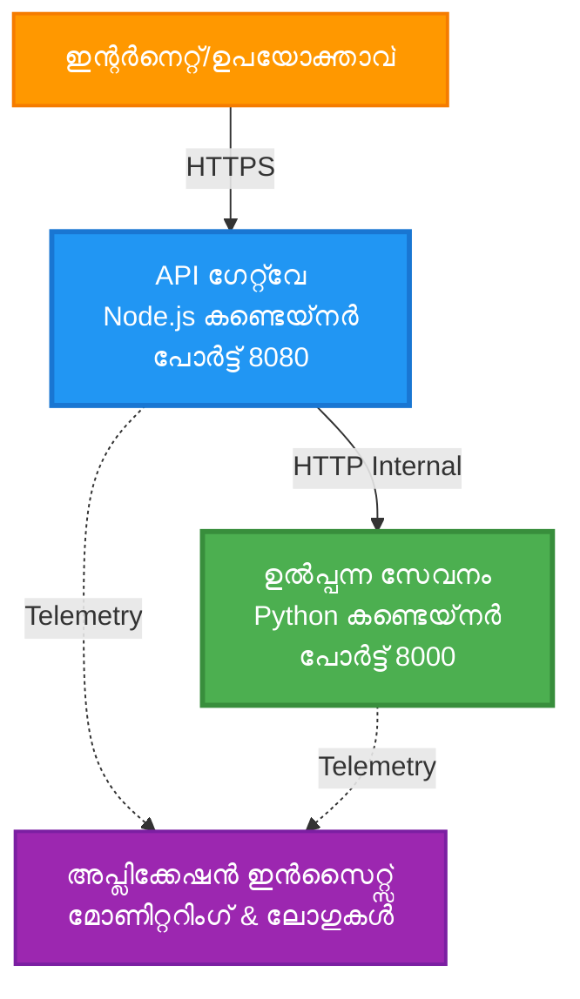
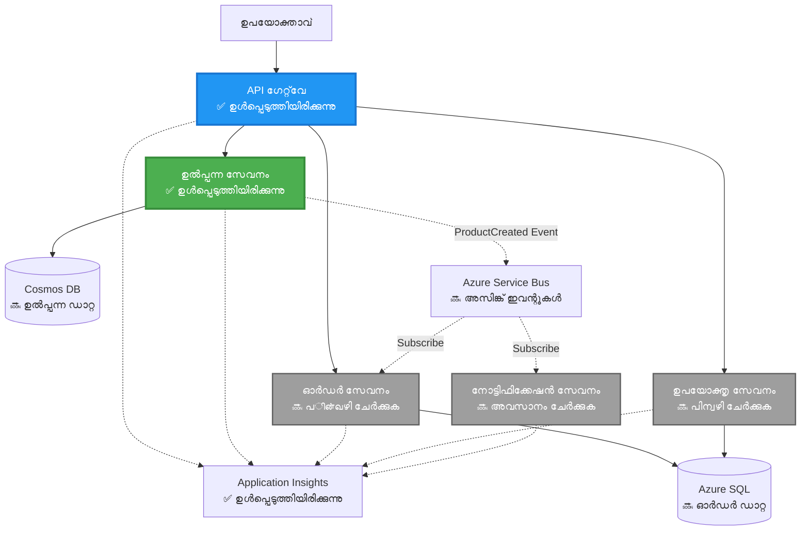
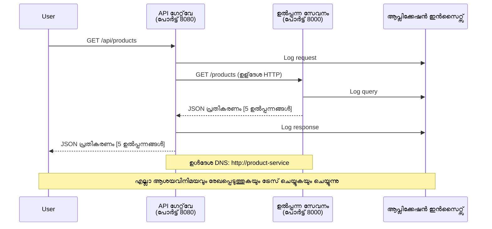

# മൈക്രോസർവിസസ് ആർക്കിടെക്ചർ - കണ്ടെയ്‌നർ ആപ്പ് ഉദാഹരണം

⏱️ **അവസാനിക്കാനിടയായ സമയം**: 25-35 മിനിറ്റ് | 💰 **അവസാനിക്കാനിടയായ ചെലവ്**: ~$50-100/മാസം | ⭐ **സങ്കീർണത**: മുൻനിര

**📚 പഠന പാത:**
- ← മുൻപ്: [സിംപിൾ ഫ്ലാസ്ക് API](../../../../examples/container-app/simple-flask-api) - സിംഗിൾ കണ്ടെയ്‌നർ അടിസ്ഥാനങ്ങൾ
- 🎯 **നിങ്ങൾ ഇവിടെ**: മൈക്രോസർവിസസ് ആർക്കിടെക്ചർ (2-സർവീസ് ഫോണ്ടേഷൻ)
- → അടുത്തത്: [AI ലഭ്യമാണ്](../../../../docs/ai-foundry) - നിങ്ങളുടെ സർവീസുകൾക്ക് ബുദ്ധി ചേർക്കുക
- 🏠 [കോഴ്സ് ഹോം](../../README.md)

---

ഒരു **ഉളളടക്കമുള്ള പക്ഷെ പ്രവർത്തനക്ഷമമായ** മൈക്രോസർവിസസ് ആർക്കിടെക്ചർ Azure Container Apps-ൽ AZD CLI ഉപയോഗിച്ച് ഡിപ്ലോയ് ചെയ്‌തിരിക്കുന്നത്. ഈ ഉദാഹരണം സർവീസ്-ടു-സർവീസ് ആശയവിനിമയം, കണ്ടെയ്‌നർ ഓർക്കസ്ട്രേഷൻ,യും ഒരു പ്രായോഗിക 2-സർവീസ് സജ്ജീകരണവുമായുള്ള മോനിറ്ററിംഗും തെളിയിക്കുന്നു.

> **📚 പഠന സമീപനം**: ഈ ഉദാഹരണം ഒരു മിനിമൽ 2-സർവീസ് ആർക്കിടെക്ചർ (API ഗേറ്റ്വേ + ബാക്ക്എൻഡ് സർവീസ്) ഉപയോഗിച്ച് തുടങ്ങുന്നു, നിങ്ങൾക്ക് യാഥാർത്ഥ്യമായി ഡിപ്ലോയു ചെയ്ത് പഠിക്കാൻ കഴിയും. ഈ അടിസ്ഥാനത്തിൽ പ്രാവീണ്യം നേടിയ ശേഷം, ഒരു പൂർണ്ണ മൈക്രോസർവിസസ് ഇക്കോസിസ്റ്റം വികസിപ്പിക്കാനുള്ള മാർഗ്ഗനിർദ്ദേശം ഞങ്ങൾ നൽകുന്നു.

## നിങ്ങൾ പഠിക്കുന്നതു് എന്ത്

ഈ ഉദാഹരണം പൂർത്തിയാക്കിയാൽ, നിങ്ങൾക്ക്:
- പല കണ്ടെയ്‌നറുകളും Azure Container Apps-ൽ ഡിപ്ലോയ് ചെയ്യാൻ കഴിയും
- ആന്തരിക നെറ്റ്വർക്കിനൊപ്പം സർവീസ്-ടു-സർവീസ് ആശയവിനിമയം എന്നത് നടപ്പിലാക്കാൻ കഴിയും
- പരിസ്ഥിതി-ബേസ്ഡ് സ്കെയ്ലിംഗ്, ഹെൽത്ത് ചെക്കുകൾ ക്രമീകരിക്കാം
- Application Insights ഉപയോഗിച്ച് വിതരണ ആപ്ലിക്കേഷനുകൾ നിരീക്ഷിക്കാം
- മൈക്രോസർവിസസ് ഡിപ്ലോയ്മെന്റ് മാതൃകകളും മികച്ച അവതാരങ്ങളും മനസ്സിലാക്കാം
- ലളിതത്തിൽ നിന്നു സങ്കീർണ ആർക്കിടെക്ചറുകളിലേക്ക് പുരോഗമന വികസനം പഠിക്കാം

## ആർക്കിടെക്ചർ

### ഘട്ടം 1: നമ്മൾ നിർമ്മിക്കുന്നത് (ഈ ഉദാഹരണത്തിൽ ഉൾപ്പെടുത്തിയിരിക്കുന്നത്)


```mermaid
graph TB
    Internet[ഇന്റർനെറ്റ്/ഉപയോക്താവ്]
    Gateway[API ഗേറ്റ്‍വേ<br/>Node.js കണ്ടെയ്‌നർ<br/>പോർട്ട് 8080]
    Product[ഉൽപ്പന്ന സേവനം<br/>Python കണ്ടെയ്‌നർ<br/>പോർട്ട് 8000]
    AppInsights[അപ്ലിക്കേഷൻ ഇൻസൈറ്റ്സ്<br/>മോണിറ്ററിംഗ് & ലോഗുകൾ]
    
    Internet -->|HTTPS| Gateway
    Gateway -->|HTTP Internal| Product
    Gateway -.->|Telemetry| AppInsights
    Product -.->|Telemetry| AppInsights
    
    style Gateway fill:#2196F3,stroke:#1976D2,stroke-width:3px,color:#fff
    style Product fill:#4CAF50,stroke:#388E3C,stroke-width:3px,color:#fff
    style Internet fill:#FF9800,stroke:#F57C00,stroke-width:2px,color:#fff
    style AppInsights fill:#9C27B0,stroke:#7B1FA2,stroke-width:2px,color:#fff
```
**ഘടക വിശദാംശങ്ങൾ:**

| ഘടകം | ലക്ഷ്യം | ആക്സസ് | റിസോഴ്‌സുകൾ |
|-----------|---------|--------|-----------|
| **API ഗേറ്റ്വേ** | ബാക്ക്എൻഡ് സർവീസ്‌സിലേക്ക് ബാഹ്യ അഭ്യർത്ഥനകൾ റൂട്ടുചെയ്യുന്നു | പബ്ലിക് (HTTPS) | 1 vCPU, 2GB RAM, 2-20 റിപ്ലിക്കാസ് |
| **പ്രൊഡക്റ്റ് സർവീസ്** | ഇൻ-മെമ്മറി ഡേറ്റ ഉപയോഗിച്ച് പ്രൊഡക്റ്റ് കാറ്റലോഗ് കൈകാര്യം ചെയ്യുന്നു | ഇൻറ്റർനൽ മാത്രം | 0.5 vCPU, 1GB RAM, 1-10 റിപ്ലിക്കാസ് |
| **അപ്ലിക്കേഷൻ ഇൻസൈറ്റ്സ്** | കേന്ദ്രീകൃത ലോഗിംഗ്, വിതരണ ട്രേസിങ് | Azure പോർട്ടൽ | 1-2 GB/മാസം ഡാറ്റ ഇൻജെക്ഷൻ |

**എന്തുകൊണ്ട് ലളിതമായി തുടങ്ങണം?**
- ✅ വേഗത്തിൽ ഡിപ്ലോയ് ചെയ്ത് മനസ്സിലാക്കാം (25-35 മിനിറ്റ്)
- ✅ സങ്കീർണത ഇല്ലാതെ പ്രധാന മൈക്രോസർവിസസ് മാതൃകകൾ പഠിക്കുക
- ✅ அமைവിനുള്ള শক="{{കരണ code}}ക ഫീത്ടായി ഗ്രന്തം
- ✅ പഠനച്ചെലവ് കുറയ്ക്കാം (~$50-100/മാസം αντί $300-1400/മാസം)
- ✅ ഡാറ്റാബേസുകളും മെസേജ് ക്യൂസും ചേർക്കുന്നതിന് മുൻപ് ആത്മവിശ്വാസം നേടുക

**ഉപമ**: ഡ്രൈവ് പഠിക്കുന്നത് പോലെ ഓർക്കുക. ഒരു ശൂന്യ പാര്ക്കിംഗ് ലോറ്റിൽ (2 സർവീസുകൾ) തുടങ്ങുകയും അടിസ്ഥാനങ്ങൾ അനുഭവിച്ച് മാസ്റ്റർ ചെയ്യുകയും തുടർന്ന് നഗര ട്രാഫിക്കിലേക്ക് (5+ സർവീസുകൾ ഡാറ്റാബേസുകൾ ഉൾക്കൊള്ളുന്നതോടെ) പുരോഗമിക്കുക.

### ഘട്ടം 2: ഭാവി വികസനം (റഫറൻസ് ആർക്കിടെക്ചർ)

2-സർവീസ് ആർക്കിടെക്ചർ നിയന്ത്രണം നേടിയാൽ, നിങ്ങൾ സാധൂകരിക്കാൻ കഴിയും:


```mermaid
graph TB
    User[ഉപയോക്താവ്]
    Gateway[API ഗേറ്റ്‌വേ <br/>✅ ഉൾപ്പെടുത്തിയിരിക്കുന്നു]
    Product[ഉൽപ്പന്ന സേവനം<br/>✅ ഉൾപ്പെടുത്തിയിരിക്കുന്നു]
    Order[ഓർഡർ സേവനം<br/>🔜 പின்வഴി ചേർക്കുക]
    UserSvc[ഉപയോക്തൃ സേവനം<br/>🔜 പിന്വഴി ചേർക്കുക]
    Notify[നോട്ടിഫിക്കേഷൻ സേവനം<br/>🔜 അവസാനം ചേർക്കുക]
    
    CosmosDB[(Cosmos DB<br/>🔜 ഉൽപ്പന്ന ഡാറ്റ)]
    AzureSQL[(Azure SQL<br/>🔜 ഓർഡർ ഡാറ്റ)]
    ServiceBus[Azure Service Bus<br/>🔜 അസിങ്ക് ഇവന്റുകൾ]
    AppInsights[Application Insights<br/>✅ ഉൾപ്പെടുത്തിയിരിക്കുന്നു]
    
    User --> Gateway
    Gateway --> Product
    Gateway --> Order
    Gateway --> UserSvc
    
    Product --> CosmosDB
    Order --> AzureSQL
    UserSvc --> AzureSQL
    
    Product -.->|ProductCreated Event| ServiceBus
    ServiceBus -.->|Subscribe| Notify
    ServiceBus -.->|Subscribe| Order
    
    Gateway -.-> AppInsights
    Product -.-> AppInsights
    Order -.-> AppInsights
    UserSvc -.-> AppInsights
    Notify -.-> AppInsights
    
    style Product fill:#4CAF50,stroke:#388E3C,stroke-width:3px,color:#fff
    style Gateway fill:#2196F3,stroke:#1976D2,stroke-width:3px,color:#fff
    style Order fill:#9E9E9E,stroke:#616161,stroke-width:2px,color:#fff
    style UserSvc fill:#9E9E9E,stroke:#616161,stroke-width:2px,color:#fff
    style Notify fill:#9E9E9E,stroke:#616161,stroke-width:2px,color:#fff
```
അവസാനത്തിൽ "വികസന മാർഗനിർദ്ദേശം" സെക്ഷൻ സന്ദർശിച്ച് ഘട്ടം-ഘട്ടമായി നിർദ്ദേശങ്ങൾ കാണുക.

## ഉൾപ്പെടുത്തിയ ഫീച്ചറുകൾ

✅ **സർവീസ് കണ്ടെത്തൽ**: കണ്ടെയ്‌നറുകൾക്കിടയിൽ ഓട്ടോമാറ്റിക് DNS-അധിഷ്ഠിത കണ്ടെത്തൽ  
✅ **ലോഡ് ബാലൻസിങ്**: റിപ്ലിക്കുകൾക്ക് ഇടയിൽ ബിൽറ്റ്-ഇൻ ലോഡ് ബാലൻസിങ്  
✅ **ഓട്ടോ-സ്കെയിലിംഗ്**: HTTP അഭ്യർത്ഥനകൾ അടിസ്ഥാനമാക്കി ഓരോ സർവീസിനും സ്വതന്ത്ര സ്കെയിലിംഗ്  
✅ **ഹെൽത്ത് മോണിറ്ററിംഗ്**: ഇരumos സర్వീസിനും ലൈവ്നസ്, റീഡിനെസ് പ്രോബുകൾ  
✅ **വിതരണ ലോഗിംഗ്**: Application Insights മുഖേന കേന്ദ്രീകൃത ലോഗിംഗ്  
✅ **ആന്തരിക നെറ്റ്വർക്കിംഗ്**: സുരക്ഷിത സർവീസ്-ടു-സർവീസ് ആശയവിനിമയം  
✅ **കണ്ടെയ്‌നർ ഓർക്കസ്ട്രേഷൻ**: സ്വതന്ത്ര ഡിപ്ലോയ്‌മെന്റും സ്കെയ്ലിംഗും  
✅ **സീറോ-ഡൗൺടൈം അപ്‌ഡേറ്റുകൾ**: റോളിംഗ് അപ്‌ഡേറ്റുകൾ റിവിഷൻ മാനേജുമെന്റോടെ  

## മുൻകൂട്ടി ആവശ്യമായவை

### ആവശ്യമായ ഉപകരണങ്ങൾ

തുടങ്ങുന്നതിനു മുൻപ്, ഈ തരത്തിലുള്ള ഉപകരണങ്ങൾ ഇൻസ്റ്റാൾ ചെയ്തിട്ടുണ്ടെന്ന് ഉറപ്പാക്കുക:

1. **[Azure ഡവലപ്പർ CLI (azd)](https://learn.microsoft.com/azure/developer/azure-developer-cli/install-azd)** (വർഷൻ 1.0.0 അല്ലെങ്കിൽ ഉയരം)  
   ```bash
   azd version
   # പ്രതീക്ഷിച്ച ഫലമായി: azd പതിപ്പ് 1.0.0 അല്ലെങ്കിൽ അതിന് മുകളിലുള്ളത്
   ```

2. **[Azure CLI](https://learn.microsoft.com/cli/azure/install-azure-cli)** (വർഷൻ 2.50.0 അല്ലെങ്കിൽ ഉയരം)  
   ```bash
   az --version
   # പ്രതീക്ഷിക്കപ്പെടുന്ന ഔട്ട്പുട്ട്: azure-cli 2.50.0 അല്ലെങ്കിൽ അതിനും മുകളിൽ
   ```

3. **[ഡോക്കർ](https://www.docker.com/get-started)** (ലോക്കൽ ഡവലപ്പ്മെന്റ്/ടെസ്റ്റിങ്ങിനായി - ഓപ്ഷണൽ)  
   ```bash
   docker --version
   # പ്രതീക്ഷിച്ച ഫലം: ഡോക്കർ സംസ്‌കരണം 20.10 അല്ലെങ്കിൽ അതിനും ഉയർത്തൻ
   ```

### നിങ്ങളുടെ സജ്ജീകരണം പരിശോധിക്കുക

താഴെkomm നിയമങ്ങൾ പ്രവർത്തിക്കാൻ നിശ്ചയിക്കാൻ ഈ കമാൻഡുകൾ চালിക്കുക:

```bash
# Azure Developer CLI പരിശോധിക്കുക
azd version
# ✅ പ്രതീക്ഷിച്ചിരുന്നത്: azd പതിപ്പ് 1.0.0 അല്ലെങ്കിൽ അതിലും ഉയർന്നത്

# Azure CLI പരിശോധിക്കുക
az --version
# ✅ പ്രതീക്ഷിച്ചിരുന്നത്: azure-cli 2.50.0 അല്ലെങ്കിൽ അതിലും ഉയർന്നത്

# Docker പരിശോധിക്കുക (ഐച്ഛികം)
docker --version
# ✅ പ്രതീക്ഷിച്ചിരുന്നത്: Docker പതിപ്പ് 20.10 അല്ലെങ്കിൽ അതിലും ഉയർന്നത്
```

**വിജയത്തിന്റെ മാനദണ്ഡം**: എല്ലാ കമാൻഡുകളും കുറഞ്ഞത് ആവശ്യമായ പതിപ്പുകളോ അതിലധികമോ പ്രദർശിപ്പിക്കും.

### Azure ആവശ്യകതകൾ

- ഒരു സജീവ **Azure സബ്‌സ്‌ക്രിപ്‌ഷൻ** ([ഒരുങ്ങാനായി സൗജന്യ അക്കൗണ്ട് ഉണ്ടാക്കുക](https://azure.microsoft.com/free/))  
- സബ്‌സ്‌ക്രിപ്‌ഷനിൽ റിസോഴ്‌സുകൾ സൃഷ്ടിക്കാൻ അനുമതികൾ  
- സബ്‌സ്‌ക്രിപ്‌ഷൻ അല്ലെങ്കിൽ റിസോഴ്‌സ് ഗ്രൂപ്പിൽ **Contributor** റോൾ

### ജ്ഞാന മുൻകൂർപാടുകൾ

ഇത് ഒരു **മുൻനിര തലത്തിൽ** ഉള്ള ഉദാഹരണമാണ്. നിങ്ങൾക്ക് വേണം:
- [സിംപിൾ ഫ്ലാസ്ക് API ഉദാഹരണം](../../../../examples/container-app/simple-flask-api) പൂർത്തിയാക്കിയിട്ടുണ്ടാകണം  
- മൈക്രോസർവിസസ് ആർക്കിടെക്ചറിന്റെ അടിസ്ഥാന മനസ്സിലാക്കൽ  
- REST APIs, HTTP ഫണ്ട്‌മെന്റ്‌സ് അറിയാം  
- കണ്ടെയ്‌നർ ആശയങ്ങൾ അറിയുക

**കണ്ടെയ്‌നർ ആപ്പിൽ പുതുതായി?** ആദ്യം [സിംപിൾ ഫ്ലാസ്ക് API ഉദാഹരണം](../../../../examples/container-app/simple-flask-api) കാണി പഠിക്കുക.

## വേഗം തുടങ്ങാം (ഘട്ടം-ഘട്ടം)

### ഘട്ടം 1: ക്ലോൺ ചെയ്ത് നാവിഗേറ്റ് ചെയ്യുക

```bash
git clone https://github.com/microsoft/AZD-for-beginners.git
cd AZD-for-beginners/examples/microservices
```

**✓ വിജയം പരിശോധിക്കുക**: നിങ്ങൾക്ക് `azure.yaml` കാണണം:  
```bash
ls
# പ്രതീക്ഷിച്ചതായി: README.md, azure.yaml, infra/, src/
```

### ഘട്ടം 2: Azure-യിൽ ഓതന്റിക്കേറ്റ് ചെയ്യുക

```bash
azd auth login
```

ഇത് ബ്രൗസർ തുറക്കുന്നു Azure ഓതന്റിക്കേഷനായി. നിങ്ങളുടെ Azure ക്രെഡൻഷ്യലുകൾ ഉപയോഗിച്ച് സൈൻ ഇൻ ചെയ്യുക.

**✓ വിജയം പരിശോധിക്കുക**: താഴെ കാണണം:  
```
Logged in to Azure.
```

### ഘട്ടം 3: പരിസ്ഥിതി ആരംഭിക്കുക

```bash
azd init
```

**നിങ്ങൾ കാണാൻ പോകുന്നത്**:  
- **പരിസ്ഥിതി നാമം**: ഒരു ചെറിയ പേര് നൽകുക (ഉദാ: `microservices-dev`)  
- **Azure സബ്‌സ്‌ക്രിപ്‌ഷൻ**: നിങ്ങളുടെ സബ്‌സ്‌ക്രിപ്‌ഷൻ തിരഞ്ഞെടുക്കുക  
- **Azure സ്ഥലം**: ഒരു പ്രദേശം തിരഞ്ഞെടുക്കുക (ഉദാ: `eastus`, `westeurope`)  

**✓ വിജയം പരിശോധിക്കുക**: താഴെ കാണണം:  
```
SUCCESS: New project initialized!
```

### ഘട്ടം 4: ഇൻഫ്രാസ്ട്രക്ചർ, സർവീസുകൾ ഡിപ്ലോയ് ചെയ്യുക

```bash
azd up
```

**ഉണ്ടാകുന്നത്** (8-12 മിനിറ്റ് എടുത്തേക്കാം):  


```mermaid
graph LR
    A[azd up] --> B[റിസോഴ്‌സ് ഗ്രൂപ്പ് സൃഷ്ടിക്കുക]
    B --> C[കൺടെയ്നർ റെജിസ്ട്രി വിന്യസിക്കുക]
    C --> D[ലോഗ് അനലിറ്റിക്സ് വിന്യസിക്കുക]
    D --> E[ആപ്പ് ഇൻസൈറ്റ്സ് വിന്യസിക്കുക]
    E --> F[കൺടെയ്നർ പരിസരം സൃഷ്ടിക്കുക]
    F --> G[API ഗേറ്റ്‌വേ ഇമേജ് നിർമ്മിക്കുക]
    F --> H[ഉൽപ്പന്ന സേവന ഇമേജ് നിർമ്മിക്കുക]
    G --> I[റെജിസ്ട്രിയിലേക്ക് പുള്‍ശ് ചെയ്യുക]
    H --> I
    I --> J[API ഗേറ്റ്‌വേ വിന്യസിക്കുക]
    I --> K[ഉൽപ്പന്ന സേവനം വിന്യസിക്കുക]
    J --> L[ഇൻഗ്രസ് & ഹെൽത്ത് ചെക്കുകൾ ക്രമീകരിക്കുക]
    K --> L
    L --> M[വിന്യാസം പൂർത്തിയായി ✓]
    
    style A fill:#2196F3,stroke:#1976D2,stroke-width:3px,color:#fff
    style M fill:#4CAF50,stroke:#388E3C,stroke-width:3px,color:#fff
```
**✓ വിജയം പരിശോധിക്കുക**: താഴെ കാണണം:  
```
SUCCESS: Your application was deployed to Azure in X minutes Y seconds.
Endpoint: https://api-gateway-<unique-id>.azurecontainerapps.io
```

**⏱️ സമയം**: 8-12 മിനിറ്റ്

### ഘട്ടം 5: ഡിപ്ലോയ്‌മെന്റ് ടെസ്റ്റ് ചെയ്യുക

```bash
# ഗേറ്റ്വേ എന്റ്പോയിന്റ് നേടുക
GATEWAY_URL=$(azd env get-values | grep API_GATEWAY_URL | cut -d '=' -f2 | tr -d '"')

# API ഗേറ്റ്വേ ആരോഗ്യ പരിശോധന നടത്തുക
curl $GATEWAY_URL/health
```

**✅ പ്രതീക്ഷിച്ച ഔട്ട്പുട്ട്:**  
```json
{
  "status": "healthy",
  "service": "api-gateway",
  "timestamp": "2025-11-19T10:30:00Z"
}
```

**ഗേറ്റ്വേ വഴി പ്രൊഡക്റ്റ് സർവീസ് ടെസ്റ്റ് ചെയ്യുക**:  
```bash
# ഉൽപ്പന്നങ്ങൾ പട്ടി ഇട്ടുകാണിക്കുക
curl $GATEWAY_URL/api/products
```

**✅ പ്രതീക്ഷിച്ച ഔട്ട്പുട്ട്:**  
```json
[
  {"id":1,"name":"Laptop","price":999.99,"stock":50},
  {"id":2,"name":"Mouse","price":29.99,"stock":200},
  {"id":3,"name":"Keyboard","price":79.99,"stock":150}
]
```

**✓ വിജയം പരിശോധിക്കുക**: രണ്ടും എൻഡ്‌പോയിന്റുകളും പിശകുകളില്ലാതെ JSON ഡാറ്റ റിട്ടേൺ ചെയ്യണം.

---

**🎉 ആശംസകൾ!** നിങ്ങൾ Azure-ലേക്ക് ഒരു മൈക്രോസർവിസസ് ആർക്കിടെക്ചർ ഡിപ്ലോയ് ചെയ്തിരിക്കുന്നു!

## പ്രോജക്റ്റ് ഘടന

എല്ലാ നടപ്പിലാക്കൽ ഫയലുകളും ഉൾപ്പെടുത്തിയിട്ടുണ്ട്—ഇത് ഒരു സമ്പൂർണ്ണ പ്രവർത്തനിഷ്ഠ ഉദാഹരണമാണ്:

```
microservices/
│
├── README.md                         # This file
├── azure.yaml                        # AZD configuration
├── .gitignore                        # Git ignore patterns
│
├── infra/                           # Infrastructure as Code (Bicep)
│   ├── main.bicep                   # Main orchestration
│   ├── abbreviations.json           # Naming conventions
│   ├── core/                        # Shared infrastructure
│   │   ├── container-apps-environment.bicep  # Container environment + registry
│   │   └── monitor.bicep            # Application Insights + Log Analytics
│   └── app/                         # Service definitions
│       ├── api-gateway.bicep        # API Gateway container app
│       └── product-service.bicep    # Product Service container app
│
└── src/                             # Application source code
    ├── api-gateway/                 # Node.js API Gateway
    │   ├── app.js                   # Express server with routing
    │   ├── package.json             # Node dependencies
    │   └── Dockerfile               # Container definition
    └── product-service/             # Python Product Service
        ├── main.py                  # Flask API with product data
        ├── requirements.txt         # Python dependencies
        └── Dockerfile               # Container definition
```

**ഓരോ ഘടകവും എന്ത് ചെയ്യുന്നുവെന്നുള്ളത്:**

**Infrastructure (infra/):**  
- `main.bicep`: എല്ലാ Azure റിസോഴ്‌സുകളും അവയുടെ ആശ്രിതത്വങ്ങളും ഓർക്കസ്ട്രേറ്റ് ചെയ്യുന്നു  
- `core/container-apps-environment.bicep`: കണ്ടെയ്‌നർ ആപ്പുകൾക്ക് പരിസ്ഥിതി, Azure Container Registry സൃഷ്ടിക്കുന്നു  
- `core/monitor.bicep`: Application Insights സെറ്റ് ചെയ്യുന്നു വിതരണം ചെയ്ത ലോഗിങ്ങിനായി  
- `app/*.bicep`: ഓരോ കണ്ടെയ്‌നർ ആപ്പ് നിർവചനം, സ്കെയ്ലിംഗ്, ഹെൽത്ത് ചെക്കുകൾ ഉൾപ്പെടുത്തി  

**API ഗേറ്റ്വേ (src/api-gateway/):**  
- ബാഹ്യ അഭ്യർത്ഥനകൾ ബാക്ക്എൻഡ് സർവീസ്‌സിലേക്ക് റൂട്ടുചെയ്യുന്ന പബ്ലിക്-ഫേസിംഗ് സർവീസ്  
- ലോഗിംഗ്, പിശക് കൈകാര്യം, അഭ്യർത്ഥന മുന്നോട്ടുവെച്ച് ഉയിർപ്പിക്കുന്നു  
- സർവീസ്-ടു-സർവീസ് HTTP ആശയവിനിമയം പ്രദർശിപ്പിക്കുന്നു  

**പ്രൊഡക്റ്റ് സർവീസ് (src/product-service/):**  
- സിംപിൾ ഇൻ-മെമ്മറി പ്രൊഡക്റ്റ് കാറ്റലോഗ് ഉൾക്കൊള്ളുന്ന ആന്തരിക സർവീസ്  
- REST API സഹിതം ഹെൽത്ത് ചെക്കുകൾ  
- ബാക്ക്എൻഡ് മൈക്രോസർവീസ് മാതൃകയുടെ ഉദാഹരണം  

## സർവീസുകൾ പരാമർശം

### API ഗേറ്റ്വേ (Node.js/Express)

**പോർട്ട്**: 8080  
**ആക്സസ്**: പബ്ലിക് (ബാഹ്യ ഇൻഗ്രസ്)  
**ലക്ഷ്യം**: വരുന്ന അഭ്യർത്ഥനകൾ യോജിച്ച ബാക്ക്എൻഡ് സർവീസുകളിലേക്ക് റൂട്ടുചെയ്യുക  

**എൻഡ്‌പോയിന്റ്സ്**:  
- `GET /` - സർവീസ് വിവരങ്ങൾ  
- `GET /health` - ഹെൽത്ത് ചെക്ക് എൻഡ്‌പോയിന്റ്  
- `GET /api/products` - പ്രൊഡക്റ്റ് സർവീസിലേക്ക് മുന്നോട്ട് (എല്ലാം പട്ടിക)  
- `GET /api/products/:id` - പ്രൊഡക്റ്റ് സർവീസിലേക്ക് മുന്നോട്ട് (ID പ്രകാരം ഒന്ന്)  

**പ്രധാന ഫീച്ചറുകൾ**:  
- axios ഉപയോഗിച്ച് അഭ്യർത്ഥന റൂട്ടിംഗ്  
- കേന്ദ്രീകൃത ലോഗിംഗ്  
- പിശക് കൈകാര്യം, ടൈംഅൗട്ട് മാനേജുമെന്റ്  
- എന്വയോൺമെൻറ് വെരിയബിളുകൾ വഴി സർവീസ് കണ്ടെത്തൽ  
- Application Insights ഇന്റഗ്രേഷൻ  

**കോഡ് ഹൈലൈറ്റ്** (`src/api-gateway/app.js`):  
```javascript
// ആന്തരിക സേവന സംവേദനം
app.get('/api/products', async (req, res) => {
  const response = await axios.get(`${PRODUCT_SERVICE_URL}/products`, {
    timeout: 5000
  });
  res.json(response.data);
});
```

### പ്രൊഡക്റ്റ് സർവീസ് (Python/Flask)

**പോർട്ട്**: 8000  
**ആക്സസ്**: ഇൻറ്റർനൽ മാത്രം (ബാഹ്യ എൻഗ്രസ്സ് ഇല്ല)  
**ലക്ഷ്യം**: ഇൻ-മെമ്മറി ഡാറ്റ ഉപയോഗിച്ച് പ്രൊഡക്റ്റ് കാറ്റലോഗ് നിയന്ത്രിക്കുക  

**എൻഡ്‌പോയിന്റ്സ്**:  
- `GET /` - സർവീസ് വിവരങ്ങൾ  
- `GET /health` - ഹെൽത്ത് ചെക്ക് എൻഡ്‌പോയിന്റ്  
- `GET /products` - എല്ലാ പ്രൊഡക്റ്റുകളും ലിസ്റ്റ് ചെയ്യുക  
- `GET /products/<id>` - ID പ്രകാരം പ്രൊഡക്റ്റ് നേടുക  

**പ്രധാന ഫീച്ചറുകൾ**:  
- Flask ഉപയോഗിച്ച് RESTful API  
- ലളിതം: ഡാറ്റാബേസ് വേണ്ട, ഇൻ-മെമ്മറി സ്‌റ്റോർ  
- ഹെൽത്ത് മോണിറ്ററിംഗ് പ്രോബുകൾ  
- ഘടിതമായ ലോഗിംഗ്  
- Application Insights ഇന്റഗ്രേഷൻ  

**ഡേറ്റാ മോഡൽ**:  
```python
{
  "id": 1,
  "name": "Laptop",
  "description": "High-performance laptop",
  "price": 999.99,
  "stock": 50
}
```

**എന്തുകൊണ്ട് ഇൻടേണൽ മാത്രം?**  
പ്രൊഡക്റ്റ് സർവീസ് പബ്ലിക്കായി പ്രദർശിപ്പിക്കാറില്ല. എല്ലായ്പ്പോഴും അഭ്യര്‍ഥനകൾ API ഗേറ്റ്വേ വഴി മാത്രമേ പോകൂ. അത് നൽകുന്നത്:  
- സുരക്ഷ: നിയന്ത്രിത ആക്സസ് പോയിന്റ്  
- സൗകര്യം: ക്ലയന്റുകളെ ബാധിക്കാതെ ബാക്ക്‌എൻഡ് മാറ്റാം  
- നിരീക്ഷണം: കേന്ദ്രീകൃത അഭ്യർത്ഥന ലോഗിംഗ്  

## സർവീസ് ആശയവിനിമയം മനസ്സിലാക്കൽ

### സർവീസുകൾ എങ്ങനെ സംസാരിക്കുന്നു


```mermaid
sequenceDiagram
    participant User
    participant Gateway as API ഗേറ്റ്‌വേ<br/>(പോർട്ട് 8080)
    participant Product as ഉൽപ്പന്ന സേവനം<br/>(പോർട്ട് 8000)
    participant AI as ആപ്ലിക്കേഷൻ ഇൻസൈറ്റ്സ്
    
    User->>Gateway: GET /api/products
    Gateway->>AI: Log request
    Gateway->>Product: GET /products (ഉള്‌ദേശ HTTP)
    Product->>AI: Log query
    Product-->>Gateway: JSON പ്രതികരണം [5 ഉൽപ്പന്നങ്ങൾ]
    Gateway->>AI: Log response
    Gateway-->>User: JSON പ്രതികരണം [5 ഉൽപ്പന്നങ്ങൾ]
    
    Note over Gateway,Product: ഉൾദേശ DNS: http://product-service
    Note over User,AI: എല്ലാ ആശയവിനിമയവും രേഖപ്പെടുത്തുകയും ട്രേസ് ചെയ്യുകയും ചെയ്യുന്നു
```
ഈ ഉദാഹരണത്തിൽ, API ഗേറ്റ്വേ പ്രൊഡക്റ്റ് സർവീസുമായി **ആന്തരിക HTTP കോൾസ്** ഉപയോഗിച്ച് ആശയവിനിമയം നടത്തുന്നു:

```javascript
// API ഗേറ്റ്വേ (src/api-gateway/app.js)
const PRODUCT_SERVICE_URL = process.env.PRODUCT_SERVICE_URL;

// അകന്റെയുള്ള HTTP അഭ്യർത്ഥന നടത്തുക
const response = await axios.get(`${PRODUCT_SERVICE_URL}/products`);
```

**പ്രധാന കാര്യങ്ങൾ**:

1. **DNS അടിസ്ഥാനമുള്ള കണ്ടെത്തൽ**: കണ്ടെയ്‌നർ ആപ്പുകൾ സ്വയം ആന്തരിക സർവീസിനായി DNS നൽകുന്നു  
   - പ്രൊഡക്റ്റ് സർവീസ് FQDN: `product-service.internal.<environment>.azurecontainerapps.io`  
   - ലളിതമായി: `http://product-service` (കണ്ടെയ്‌നർ ആപ്പുകൾ അതു പരിഹരിക്കുന്നു)  

2. **പബ്ലിക് വെളിച്ചം ഇല്ല**: പ്രൊഡക്റ്റ് സർവീസ് Bicep-ൽ `external: false` ആണ്  
   - കണ്ടെയ്‌നർ ആപ്ലിക്കേഷൻ പരിസരത്തിനുള്ളിൽ മാത്രമേ ലഭ്യമാകൂ  
   - ഇന്റർനെറ്റിൽ നിന്ന് ആക്സസ് സാധിക്കില്ല  

3. **എൻവയോൺമെൻറ് വെരിയബിളുകൾ**: സർവീസ് URLs ഡിപ്ലോയ്മെന്റ് സമയത്ത് എൻജെക്ട് ചെയ്യുന്നു  
   - Bicep ഗേറ്റ്വേയിലേയ്ക്ക് ആന്തരിക FQDN നൽകുന്നു  
   - ആപ്ലിക്കേഷൻ കോഡിൽ ഹാർഡ്‌കോഡുചെയ്യാത്ത URLs  

**ഉപമ**: ഓഫീസ് മുറികളായി വിചാരിക്കുക. API ഗേറ്റ്വേ റെസപ്ഷൻ ഡിസ്ക് (പബ്ലിക്-ഫേസിംഗ്) ആണ്, പ്രൊഡക്റ്റ് സർവീസ് ഓഫീസ് മുറി (ഇൻറ്റേണൽ മാത്രം) ആണ്. സന്ദർശകർക്ക് റെസപ്ഷൻ വഴിയാണ് എല്ലാ ഓഫീസുകളിലും പ്രവേശനം.

## ഡിപ്ലോയ്‌മെന്റ് ഓപ്ഷനുകൾ

### പൂർണ്ണ ഡിപ്ലോയ്‌മെന്റ് (ശുപാർശ ചെയ്യുന്നു)

```bash
# ഇൻഫ്രാസ്ട്രക്ചർയും രണ്ട് സേവനങ്ങളും വിന്യസിക്കുക
azd up
```

ഇത് ഡിപ്ലോയ് ചെയ്യുന്നു:  
1. കണ്ടെയ്‌നർ ആപ്പുകൾ പരിസ്ഥിതി  
2. അപ്ലിക്കേഷൻ ഇൻസൈറ്റ്സ്  
3. കണ്ടെയ്‌നർ രജിസ്ട്രി  
4. API ഗേറ്റ്വേ കണ്ടെയ്‌നർ  
5. പ്രൊഡക്റ്റ് സർവീസ് കണ്ടെയ്‌നർ  

**സമയം**: 8-12 മിനിറ്റ്

### ഓരോ സർവീസും പൊലീസ് ഏകദേശം നേർക്കാഴ്ച

```bash
# ഒരു സവി്േസ് മാ മാത്രമേ വിന്യസിക്കൂ (ആദ്യത്തെ azd up കഴിഞ്ഞ്)
azd deploy api-gateway

# അല്ലെങ്കിൽ ഉൽപ്പന്ന സേവനം വിന്യസിക്കുക
azd deploy product-service
```

**ഉപയോഗ കേസ്**: ഒന്ന് സർവീസ് അപ്ഡേറ്റ് ചെയ്ത് മാത്രമേ അത് വീണ്ടും ഡിപ്ലോയ് ചെയ്യേണ്ടതുണ്ടെങ്കിൽ.

### കോൺഫിഗറേഷൻ അപ്ഡേറ്റ് ചെയ്യുക

```bash
# സ്കെയ്ലിംഗ് പാരാമീറ്ററുകൾ മാറ്റുക
azd env set GATEWAY_MAX_REPLICAS 30

# പുതിയ കോൺഫിഗറേഷനോടെ വീണ്ടും വിന്യസിക്കുക
azd up
```

## കോൺഫിഗറേഷൻ

### സ്കെയിലിംഗ് കോൺഫിഗറേഷൻ

രണ്ടും Bicep ഫയൽസ് HTTP-അധികൃത ഓട്ടോസ്കെയ്ലിങ്ങിനോട് ക്രമീകരിച്ചിരിക്കുന്നു:

**API ഗേറ്റ്വേ**:  
- കുറഞ്ഞ റിപ്ലിക്കകൾ: 2 (എപ്പോഴും കുറഞ്ഞത് 2 സുരക്ഷിതത്വത്തിനായി)  
- പരമാവധി റിപ്ലിക്കകൾ: 20  
- സ്കെയിൽ ട്രിഗർ: ഓരോ റിപ്ലിക്കക്കും 50 സമകാലിക അഭ്യർത്ഥനകൾ  

**പ്രൊഡക്റ്റ് സർവീസ്**:  
- കുറഞ്ഞ റിപ്ലിക്കകൾ: 1 (ആവശ്യപ്പെടുമ്പോൾ 0 വരെ സ്കെയിൽ ചെയ്യാം)  
- പരമാവധി റിപ്ലിക്കകൾ: 10  
- സ്കെയിൽ ട്രിഗർ: രണ്ടു റിപ്ലിക്കുകൾക്ക് 100 സമകാലിക അഭ്യർത്ഥനകൾ  

**സ്കെയിൽ ഇഷ്ടാനുസരണം (infra/app/*.bicep):**  
```bicep
scale: {
  minReplicas: 1
  maxReplicas: 10
  rules: [
    {
      name: 'http-scale-rule'
      http: {
        metadata: {
          concurrentRequests: '100'  // Adjust this
        }
      }
    }
  ]
}
```

### റിസോഴ്‌സ് അനുവദിക്കൽ

**API ഗേറ്റ്വേ**:  
- CPU: 1.0 vCPU  
- മെമ്മറി: 2 GiB  
- കാരണം: എല്ലാ ബാഹ്യ ട്രാഫിക്കിനും കൈകാര്യം ചെയ്യുന്നു  

**പ്രൊഡക്റ്റ് സർവീസ്**:  
- CPU: 0.5 vCPU  
- മെമ്മറി: 1 GiB  
- കാരണം: ലഘുവായ ഇൻ-മെമ്മറി പ്രവർത്തനങ്ങൾ  

### ഹെൽത്ത് ചെക്കുകൾ

രണ്ടും ലൈവ്നസ്, റീഡിനെസ് പ്രോബുകൾ ഉൾക്കൊള്ളുന്നു:  

```bicep
probes: [
  {
    type: 'Liveness'
    httpGet: {
      path: '/health'
      port: 8080
    }
    initialDelaySeconds: 10
    periodSeconds: 30
  }
  {
    type: 'Readiness'
    httpGet: {
      path: '/health'
      port: 8080
    }
    initialDelaySeconds: 5
    periodSeconds: 10
  }
]
```

**ഇതിന്റെ അർത്ഥം**:  
- **ലൈവ്നസ്**: ഹെൽത്ത് ചെക്ക് പരാജയപ്പെട്ടാൽ, കണ്ടെയ്‌നർ ആപ്പുകൾ കണ്ടെയ്‌നർ റീസ്റ്റാർട്ട് ചെയ്യും  
- **റീഡിനെസ്**: തയ്യാറായില്ലെങ്കിൽ, ആ റിപ്ലിക്കയിലേക്കുള്ള ട്രാഫിക് നിരോധിക്കും  

## നിരീക്ഷണം & കണ്ടോപ്റ്റിവിറ്റി

### സർവീസ് ലോഗുകൾ കാണുക

```bash
# ലോഗുകൾ കാണാൻ azd monitor ഉപയോഗിക്കുക
azd monitor --logs

# അല്ലെങ്കിൽ പ്രത്യേക കൺടെയ്‌നർ ആപ്ലിക്കേഷനുകൾക്കായി Azure CLI ഉപയോഗിക്കുക:
# API ഗേറ്റ്വേയിൽ നിന്ന് ലോഗുകൾ സ്റ്റ്രീം ചെയ്യുക
az containerapp logs show --name api-gateway --resource-group $RG_NAME --follow

# ഏറ്റവും പുതിയ പ്രൊഡക്ട് സർവീസ് ലോഗുകൾ കാണുക
az containerapp logs show --name product-service --resource-group $RG_NAME --tail 100
```

**പ്രതീക്ഷിക്കുന്ന ഔട്ട്പുട്ട്**:  
```
[api-gateway] API Gateway listening on port 8080
[api-gateway] Product Service URL: http://product-service
[api-gateway] GET /api/products 200 - 45ms
[product-service] Retrieved 5 products
```

### Application Insights ക്വറികൾ

Azure പോർട്ടലിൽ Application Insights ആക്സസ് ചെയ്ത് ഈ ക്വറികൾ പ്രവർത്തിപ്പിക്കുക:

**നിരയുള്ള അഭ്യർത്ഥനകൾ കണ്ടെത്തുക**:  
```kusto
requests
| where timestamp > ago(1h)
| where duration > 1000  // Requests taking >1 second
| summarize count() by name, cloud_RoleName
| order by count_ desc
```

**സർവീസ്-ടു-സർവീസ് കോൾസ് ട്രാക്ക് ചെയ്യുക**:  
```kusto
dependencies
| where timestamp > ago(1h)
| where type == "Http"
| project timestamp, name, target, duration, success
| order by timestamp desc
```

**സർവീസ് അടിസ്ഥാന പിശക് നിരക്ക്**:  
```kusto
exceptions
| where timestamp > ago(24h)
| summarize errorCount = count() by cloud_RoleName, type
| order by errorCount desc
```

**അഭ്യർത്ഥനാ സംഖ്യ സമയം അനുസരിച്ച്**:  
```kusto
requests
| where timestamp > ago(1h)
| summarize requestCount = count() by bin(timestamp, 5m), cloud_RoleName
| render timechart
```

### നിരീക്ഷണ ഡാഷ്ബോർഡിലേക്ക് ആക്‌സസ്

```bash
# അപ്ലിക്കേഷൻ ഇൻസൈറ്റ്സ് വിശദാംശങ്ങൾ എടുക്കുക
azd env get-values | grep APPLICATIONINSIGHTS

# അഴൂർ പോർട്ടൽ മേൽനോട്ടം തുറക്കുക
az monitor app-insights component show \
  --app $(azd env get-values | grep APPLICATIONINSIGHTS_CONNECTION_STRING | cut -d '=' -f2) \
  --resource-group $(azd env get-values | grep AZURE_RESOURCE_GROUP | cut -d '=' -f2) \
  --query "appId" -o tsv
```

### ലൈവ് മെട്രിക്‌സ്

1. Azure പോർട്ടലിൽ Application Insights-ൽ പോകുക  
2. "Live Metrics" ക്ലിക്ക് ചെയ്യുക  
3. റിയൽ-ടൈം അഭ്യർത്ഥനകൾ, പരാജയങ്ങൾ, പ്രകടനം കാണുക  
4. ടെസ്റ്റ് ആയി ഈ കമാൻഡ് പ്രവർത്തിപ്പിക്കുക: `curl $(azd env get-values | grep API_GATEWAY_URL | cut -d '=' -f2 | tr -d '"')/api/products`

## പ്രായോഗിക അഭ്യാസങ്ങൾ

### അഭ്യാസം 1: പുതിയ പ്രൊഡക്റ്റ് എൻഡ്‌പോയിന്റ് ചേർക്കുക ⭐ (എളുപ്പം)

**ലക്ഷ്യം**: പുതിയ പ്രൊഡക്റ്റുകൾ സൃഷ്ടിക്കാൻ POST എൻഡ്‌പോയിന്റ് ചേർക്കുക

**ആരംഭം**: `src/product-service/main.py`

**പടികൾ**:

1. `main.py`-ൽ `get_product` ഫങ്ഷന്റെ ശേഷം ഈ എൻഡ്‌പോയിന്റ് ചേർക്കുക:

```python
@app.route('/products', methods=['POST'])
def create_product():
    """Create a new product"""
    data = request.get_json()
    
    # ആവശ്യമായ ഫീൽഡുകൾ സാധുത പരിശോധന നടത്തുക
    if not data or 'name' not in data or 'price' not in data:
        return jsonify({'error': 'Missing required fields: name, price'}), 400
    
    new_id = max(p['id'] for p in products) + 1
    new_product = {
        'id': new_id,
        'name': data['name'],
        'description': data.get('description', ''),
        'price': float(data['price']),
        'stock': int(data.get('stock', 0))
    }
    products.append(new_product)
    logger.info(f"Created product {new_id}")
    return jsonify(new_product), 201
```

2. API ഗേറ്റ്വേയിൽ POST റൂട്ടു ചേർക്കുക (`src/api-gateway/app.js`):

```javascript
// GET /api/products റൂട്ടിനു ശേഷം ഇത് ചേർക്കുക
app.post('/api/products', async (req, res) => {
  try {
    console.log(`Forwarding POST request to ${PRODUCT_SERVICE_URL}/products`);
    const response = await axios.post(`${PRODUCT_SERVICE_URL}/products`, req.body, {
      timeout: 5000
    });
    res.status(201).json(response.data);
  } catch (error) {
    console.error('Error calling product service:', error.message);
    res.status(503).json({
      error: 'Product service unavailable',
      message: error.message
    });
  }
});
```

3. രണ്ട് സർവീസുകളും വീണ്ടും വിന്യസിപ്പിക്കുക:

```bash
azd deploy product-service
azd deploy api-gateway
```

4. പുതിയ എന്റ്പോണ്ട് ടെസ്റ്റ് ചെയ്യുക:

```bash
GATEWAY_URL=$(azd env get-values | grep API_GATEWAY_URL | cut -d '=' -f2 | tr -d '"')

# ഒരു പുതിയ ഉൽപ്പന്നം സൃഷ്ടിക്കുക
curl -X POST $GATEWAY_URL/api/products \
  -H "Content-Type: application/json" \
  -d '{"name":"USB Cable","price":9.99,"stock":500}'
```

**✅ പ്രതീക്ഷിക്കാവുന്ന ഔട്ട്‌പുട്ട്:**
```json
{"id":6,"name":"USB Cable","description":"","price":9.99,"stock":500}
```

5. ലിസ്റ്റിൽ ഇത് കാണപ്പെടുന്നുണ്ടോ എന്ന് സ്ഥിരീകരിക്കുക:

```bash
curl $GATEWAY_URL/api/products
# പുതിയ USB കേബിള്‍ ഉള്‍പ്പെടെ ഇപ്പോള്‍ 6 ഉല്‍പ്പന്നങ്ങള്‍ കാണിക്കണം
```

**വിജയ നിർണ്ണയ ഘടകങ്ങൾ**:
- ✅ POST അഭ്യർത്ഥന HTTP 201 റിട്ടേൺ ചെയ്യണം
- ✅ പുതിയ ഉൽപ്പന്നം GET /api/products ലിസ്റ്റിൽ കാണപ്പെടണം
- ✅ ഉൽപ്പന്നത്തിനുള്ള ഐഡി സ്വയംവർദ്ധിതമാകണം

**സമയം**: 10-15 മിനിട്ട്

---

### പരിശീലനം 2: ഓട്ടോസ്‌കെയ്ലിങ് നിയമങ്ങളിൽ മാറ്റം വരുത്തുക ⭐⭐ (മധ്യസ്ഥരം)

**ഉദ്ദേശ്യം**: പ്രൊഡക്റ്റ് സർവീസ് കൂടുതൽ ആക്രമകമായി സ്കെയിൽ ചെയ്യുക

**ആരംഭബിന്ദു**: `infra/app/product-service.bicep`

**ചുവടുകൾ**:

1. `infra/app/product-service.bicep` തുറന്ന് `scale` ബ്ലോക്ക് കണ്ടെത്തുക (ഏകദേശം ലൈനു 95)

2. ഇതിൽ നിന്നു മാറ്റുക:
```bicep
scale: {
  minReplicas: 1
  maxReplicas: 10
  rules: [
    {
      name: 'http-scale-rule'
      http: {
        metadata: {
          concurrentRequests: '100'  // OLD
        }
      }
    }
  ]
}
```

ഇവിടെക്ക്:
```bicep
scale: {
  minReplicas: 2  // Always have 2 running
  maxReplicas: 20  // Allow more scaling
  rules: [
    {
      name: 'http-scale-rule'
      http: {
        metadata: {
          concurrentRequests: '20'  // Scale at lower threshold
        }
      }
    }
  ]
}
```

3. ഇൻഫ്രാസ്ട്രക്ചർ വീണ്ടും വിന്യസിപ്പിക്കുക:

```bash
azd up
```

4. പുതിയ സ്കെയ്ലിങ് കോൺഫിഗറേഷൻ പരിശോധിക്കുക:

```bash
az containerapp show \
  --name $(azd env get-values | grep PRODUCT_SERVICE | head -1 | cut -d '/' -f5) \
  --resource-group $(azd env get-values | grep AZURE_RESOURCE_GROUP | cut -d '=' -f2 | tr -d '"') \
  --query "properties.template.scale" -o json
```

**✅ പ്രതീക്ഷിക്കാവുന്ന ഔട്ട്‌പുട്ട്:**
```json
{
  "minReplicas": 2,
  "maxReplicas": 20,
  "rules": [...]
}
```

5. ലോഡ് ഉപയോഗിച്ച് ഓട്ടോസ്‌കെയ്ലിങ് പരീക്ഷിക്കുക:

```bash
# ഏകకాలീന അഭ്യർത്ഥനകൾ സൃഷ്‌ടിക്കുക
for i in {1..500}; do curl $GATEWAY_URL/api/products & done

# Azure CLI ഉപയോഗിച്ച് സ്കെയിലിംഗ് സംഭവിക്കുന്നത് നിരീക്ഷിക്കുക
az containerapp logs show --name product-service --resource-group $RG_NAME --follow
# നോക്കുക: കണ്ടെയ്‌നർ ആപ്ലിക്കേഷനുകളുടെ സ്കെയിലിംഗ് സംഭവങ്ങൾ
```

**വിജയ നിർണ്ണയ ഘടകങ്ങൾ**:
- ✅ പ്രൊഡക്റ്റ് സർവീസ് എപ്പോഴും കുറഞ്ഞത് 2 റെപ്ലിക്കാസുകൾ പ്രവർത്തിപ്പിക്കും
- ✅ ലോഡ് പരിധിയിൽ 2-ൽ കൂടുതൽ റെപ്ലിക്കാസുകളിലേക്ക് സ്കെയിൽ ചെയ്യും
- ✅ ആസ്യൂർ പോർട്ടൽ പുതിയ സ്കെയ്ലിങ് നിയമങ്ങൾ കാണിക്കുന്നു

**സമയം**: 15-20 മിനിട്ട്

---

### പരിശീലനം 3: കസ്റ്റം മോണിറ്ററിംഗ് ക്വെറി ചേർക്കുക ⭐⭐ (മധ്യസ്ഥരം)

**ഉദ്ദേശ്യം**: ഉൽപ്പന്ന API പെർഫോർമൻസ് ട്രാക്ക് ചെയ്യാൻ ഒരു കസ്റ്റം ആപ്ലിക്കേഷൻ ഇൻസൈറ്റ്സ് ക്വെറി സൃഷ്ടിക്കുക

**ചുവടുകൾ**:

1. ആസ്യൂർ പോർട്ടലിലെ ആപ്ലിക്കേഷൻ ഇൻസൈറ്റ്സിലേക്ക് കേസ്‌ചെയ്യുക:
   - ആസ്യൂർ പോർട്ടൽ പോകുക
   - നിങ്ങളുടെ റിസോഴ്‌സ് ഗ്രൂപ്പ് (rg-microservices-*) കണ്ടെത്തുക
   - ആപ്ലിക്കേഷൻ ഇൻസൈറ്റ്സ് റിസോഴ്‌സ് ക്ലിക്ക് ചെയ്യുക

2. ഇടതുകൈ മെനുവിൽ "Logs" ക്ലിക്ക് ചെയ്യുക

3. ഈ ക്വെറി സൃഷ്ടിക്കുക:

```kusto
requests
| where timestamp > ago(1h)
| where name contains "products"
| summarize 
    RequestCount = count(),
    AvgDuration = avg(duration),
    P95Duration = percentile(duration, 95),
    SuccessRate = 100.0 * countif(success == true) / count()
  by bin(timestamp, 5m)
| render timechart
```

4. ക്വെറി പ്രവർത്തിപ്പിക്കാൻ "Run" ക്ലിക്ക് ചെയ്യുക

5. ക്വെറി സംരക്ഷിക്കുക:
   - "Save" ക്ലിക്ക് ചെയ്യുക
   - പേര്: "Product API Performance"
   - വിഭാഗം: "Performance"

6. ടെസ്റ്റ് ട്രാഫിക് സൃഷ്ടിക്കുക:

```bash
for i in {1..100}; do curl $GATEWAY_URL/api/products; sleep 1; done
```

7. ഡാറ്റ കാണാൻ ക്വെറി റിഫ്രഷ് ചെയ്യുക

**✅ പ്രതീക്ഷിക്കാവുന്ന ഔട്ട്‌പുട്ട്:**
- സമയംകാളമുള്ള അഭ്യർത്ഥനകളുടെ ഗണന കാണിക്കുന്ന ചാർട്ട്
- ശരാശരി ദൈർഘ്യം < 500ms
- വിജയനിരക്ക് = 100%
- 5 മിനിറ്റ് സമയബിൻസ്

**വിജയ നിർണ്ണയ ഘടകങ്ങൾ**:
- ✅ 100-ലധികം അഭ്യർത്ഥനകൾ ക്വെറി കാണിക്കുന്നു
- ✅ വിജയനിരക്ക് 100% ആണ്
- ✅ ശരാശരി ദൈർഘ്യം < 500ms ആണ്
- ✅ ചാർട്ട് 5-മിനിറ്റ് സമയബിൻസ് പ്രദർശിപ്പിക്കുന്നു

**അഭ്യസന മോഹം**: കസ്റ്റം ക്വെറികളിലൂടെ സർവീസ് പ്രകടനം മോണിറ്റർ ചെയ്യുന്നതിനെക്കുറിച്ച് മനസിലാക്കുക

**സമയം**: 10-15 മിനിട്ട്

---

### പരിശീലനം 4: റിട്രൈ ലജിക് നടപ്പിലാക്കുക ⭐⭐⭐ (അക്കാദമിക്)

**ഉദ്ദേശ്യം**: പ്രൊഡക്റ്റ് സർവീസ് താൽക്കാലികമായി ലഭ്യമല്ലാത്തപ്പോൾ API ഗേറ്റ്‌വേയിൽ റിട്രൈ ലജിക് ചേർക്കുക

**ആരംഭബിന്ദു**: `src/api-gateway/app.js`

**ചുവടുകൾ**:

1. റിട്രൈ ലൈബ्रेറി ഇൻസ്റ്റാൾ ചെയ്യുക:

```bash
cd src/api-gateway
npm install axios-retry --save
cd ../..
```

2. `src/api-gateway/app.js` അപ്ഡേറ്റ് ചെയ്യുക (axios ഇറക്കുമതിക്ക് ശേഷം ചേർക്കുക):

```javascript
const axiosRetry = require('axios-retry');

// പുനരായാമ രീതികൾ ക്രമീകരിക്കുക
axiosRetry(axios, {
  retries: 3,
  retryDelay: (retryCount) => {
    return retryCount * 1000; // 1s, 2s, 3s
  },
  retryCondition: (error) => {
    // നെറ്റ്വർക്ക് പിശകുകളിൽ അല്ലെങ്കിൽ 5xx പ്രതികരണങ്ങളിൽ പുനരായാമം നടത്തുക
    return axiosRetry.isNetworkOrIdempotentRequestError(error) ||
           (error.response && error.response.status >= 500);
  }
});

console.log('Retry logic configured: 3 retries with exponential backoff');
```

3. API ഗേറ്റ്‌വേ വീണ്ടും വിന്യസിപ്പിക്കുക:

```bash
azd deploy api-gateway
```

4. സർവീസ് പരാജയം അനുകരിച്ച് റിട്രൈ പെരുമാറ്റം പരീക്ഷിക്കുക:

```bash
# ഉത്പന്ന സേവനം 0 ആയി സ്കെയിൽ ചെയ്യുക (പിഴവ് അനുകരിക്കുക)
az containerapp update \
  --name $(azd env get-values | grep PRODUCT_SERVICE | head -1 | cut -d '/' -f5) \
  --resource-group $(azd env get-values | grep AZURE_RESOURCE_GROUP | cut -d '=' -f2 | tr -d '"') \
  --min-replicas 0 \
  --max-replicas 0

# ഉത്പന്നങ്ങളിൽ പ്രവേശിക്കാൻ ശ്രമിക്കുക (3 തവണ വീണ്ടും ശ്രമിക്കും)
time curl -v $GATEWAY_URL/api/products
# നിരീക്ഷിക്കുക: പ്രതികരണം ഏകദേശം 6 സെക്കൻഡ് എടുക്കുന്നു (1സെ + 2സെ + 3സെ വീണ്ടും ശ്രമങ്ങൾ)

# ഉത്പന്ന സേവനം പുനഃസ്ഥാപിക്കുക
az containerapp update \
  --name $(azd env get-values | grep PRODUCT_SERVICE | head -1 | cut -d '/' -f5) \
  --resource-group $(azd env get-values | grep AZURE_RESOURCE_GROUP | cut -d '=' -f2 | tr -d '"') \
  --min-replicas 1 \
  --max-replicas 10
```

5. റിട്രൈ ലോഗുകൾ കാണുക:

```bash
az containerapp logs show --name api-gateway --resource-group $RG_NAME --tail 50
# തിരുവനന്തപുര<|vq_image_6061|><|vq_image_11911|><|vq_image_12214|><|vq_image_2228|><|vq_image_13026|><|vq_image_1242|><|vq_image_12504|><|vq_image_9572|><|vq_image_4038|><|vq_image_6430|><|vq_image_7161|><|vq_image_13770|><|vq_image_14096|><|vq_image_1725|><|vq_image_12141|><|vq_image_10903|><|image_border_773|><|vq_image_3853|><|vq_image_14866|><|vq_image_5225|><|vq_image_5454|><|vq_image_5570|><|vq_image_14538|><|vq_image_6731|><|vq_image_8055|><|vq_image_14248|><|vq_image_10445|><|vq_image_5949|><|vq_image_1738|><|vq_image_11522|><|vq_image_14096|><|vq_image_8003|><|vq_image_126|><|vq_image_5776|><|vq_image_7185|><|vq_image_2537|><|vq_image_11843|><|vq_image_1067|><|vq_image_13026|><|vq_image_12692|><|vq_image_10837|><|image_border_772|><|vq_image_14237|><|vq_image_8248|><|vq_image_7366|><|vq_image_15131|><|vq_image_11755|><|vq_image_4203|><|vq_image_1211|><|vq_image_1326|><|vq_image_7220|><|vq_image_4644|><|vq_image_11965|><|vq_image_10560|><|vq_image_10997|><|vq_image_2195|><|vq_image_2195|><|vq_image_10808|><|vq_image_1899|><|vq_image_11459|><|vq_image_1899|><|vq_image_11334|><|vq_image_1897|><|vq_image_4617|><|vq_image_11124|><|vq_image_10327|><|image_border_773|><|vq_image_11600|><|vq_image_7101|><|vq_image_13140|><|vq_image_2473|><|vq_image_1255|><|vq_image_12264|><|vq_image_16320|><|vq_image_6533|><|vq_image_6327|><|vq_image_7944|><|vq_image_14677|><|vq_image_16283|><|vq_image_10204|><|vq_image_4405|><|vq_image_7944|><|vq_image_575|><|vq_image_3694|><|vq_image_7793|><|vq_image_14503|><|vq_image_13152|><|vq_image_2272|><|vq_image_6230|><|vq_image_11209|><|vq_image_9509|><|image_border_774|><|vq_image_15102|><|vq_image_12073|><|vq_image_6879|><|vq_image_8530|><|vq_image_7545|><|vq_image_10879|><|vq_image_12157|><|vq_image_11935|><|vq_image_6493|><|vq_image_15414|><|vq_image_4827|><|vq_image_10809|><|vq_image_6127|><|vq_image_8015|><|vq_image_14636|><|vq_image_8595|><|vq_image_6113|><|vq_image_6113|><|vq_image_10530|><|vq_image_15477|><|vq_image_11795|><|vq_image_12612|><|vq_image_11207|><|vq_image_12523|><|image_border_775|><|vq_image_5506|><|vq_image_12093|><|vq_image_10567|><|vq_image_9588|><|vq_image_10687|><|vq_image_3387|><|vq_image_727|><|vq_image_15414|><|vq_image_2862|><|vq_image_14018|><|vq_image_10788|><|vq_image_9176|><|vq_image_15739|><|vq_image_4322|><|vq_image_8175|><|vq_image_3815|><|vq_image_13336|><|vq_image_10788|><|vq_image_11343|><|vq_image_7390|><|vq_image_6867|><|vq_image_12612|><|vq_image_6886|><|vq_image_2008|><|image_border_776|><|vq_image_1418|><|vq_image_11025|><|vq_image_2087|><|vq_image_5129|><|vq_image_11136|><|vq_image_7367|><|vq_image_15786|><|vq_image_696|><|vq_image_5039|><|vq_image_7606|><|vq_image_5881|><|vq_image_717|><|vq_image_6146|><|vq_image_5353|><|vq_image_13444|><|vq_image_10538|><|vq_image_2272|><|vq_image_7816|><|vq_image_5001|><|vq_image_10696|><|vq_image_13416|><|vq_image_4774|><|vq_image_2379|><|vq_image_3906|><|image_border_777|><|vq_image_13214|><|vq_image_6167|><|vq_image_6440|><|vq_image_9200|><|vq_image_3685|><|vq_image_8222|><|vq_image_15406|><|vq_image_721|><|vq_image_4795|><|vq_image_12763|><|vq_image_13562|><|vq_image_3633|><|vq_image_7402|><|vq_image_9688|><|vq_image_891|><|vq_image_5145|><|vq_image_3940|><|vq_image_6272|><|vq_image_12981|><|vq_image_632|><|vq_image_9385|><|vq_image_2166|><|vq_image_10767|><|vq_image_2155|><|image_border_778|><|vq_image_9794|><|vq_image_13060|><|vq_image_14733|><|vq_image_2156|><|vq_image_11004|><|vq_image_11322|><|vq_image_4376|><|vq_image_1775|><|vq_image_10778|><|vq_image_12385|><|vq_image_13031|><|vq_image_11459|><|vq_image_14492|><|vq_image_1848|><|vq_image_4263|><|vq_image_14235|><|vq_image_355|><|vq_image_3400|><|vq_image_5075|><|vq_image_9023|><|vq_image_9327|><|vq_image_9315|><|vq_image_1670|><|vq_image_1477|><|image_border_779|><|vq_image_1384|><|vq_image_8183|><|vq_image_2875|><|vq_image_5032|><|vq_image_7908|><|vq_image_14825|><|vq_image_5350|><|vq_image_3441|><|vq_image_12092|><|vq_image_12464|><|vq_image_9578|><|vq_image_11797|><|vq_image_15769|><|vq_image_13756|><|vq_image_12092|><|vq_image_973|><|vq_image_8080|><|vq_image_11546|><|vq_image_12075|><|vq_image_15416|><|vq_image_5656|><|vq_image_14944|><|vq_image_16204|><|vq_image_8317|><|image_border_780|><|vq_image_3420|><|vq_image_645|><|vq_image_7841|><|vq_image_13077|><|vq_image_12783|><|vq_image_7797|><|vq_image_7868|><|vq_image_7735|><|vq_image_9403|><|vq_image_13500|><|vq_image_12654|><|vq_image_15798|><|vq_image_8601|><|vq_image_13060|><|vq_image_12432|><|vq_image_11774|><|vq_image_10237|><|vq_image_7745|><|vq_image_2089|><|vq_image_14360|><|vq_image_13788|><|vq_image_9965|><|vq_image_6243|><|vq_image_9758|><|image_border_781|><|vq_image_12316|><|vq_image_13281|><|vq_image_11227|><|vq_image_8479|><|vq_image_4839|><|vq_image_7423|><|vq_image_3871|><|vq_image_4969|><|vq_image_3673|><|vq_image_13109|><|vq_image_15194|><|vq_image_1572|><|vq_image_13641|><|vq_image_12664|><|vq_image_8684|><|vq_image_2508|><|vq_image_8656|><|vq_image_6470|><|vq_image_2393|><|vq_image_15605|><|vq_image_15784|><|vq_image_12029|><|vq_image_6534|><|vq_image_14900|><|image_border_782|><|vq_image_9155|><|vq_image_506|><|vq_image_8488|><|vq_image_5161|><|vq_image_12800|><|vq_image_1404|><|vq_image_311|><|vq_image_14008|><|vq_image_4089|><|vq_image_9859|><|vq_image_739|><|vq_image_12561|><|vq_image_16189|><|vq_image_4681|><|vq_image_12449|><|vq_image_12235|><|vq_image_277|><|vq_image_13214|><|vq_image_11538|><|vq_image_14410|><|vq_image_15468|><|vq_image_3917|><|vq_image_4472|><|vq_image_9502|><|image_border_783|><|vq_image_7687|><|vq_image_2701|><|vq_image_13967|><|vq_image_13807|><|vq_image_14657|><|vq_image_3786|><|vq_image_11591|><|vq_image_16099|><|vq_image_4510|><|vq_image_5469|><|vq_image_5750|><|vq_image_12499|><|vq_image_4311|><|vq_image_13052|><|vq_image_4646|><|vq_image_4163|><|vq_image_12084|><|vq_image_3821|><|vq_image_9628|><|vq_image_13011|><|vq_image_12540|><|vq_image_2519|><|vq_image_13279|><|vq_image_7473|>
```

**✅ പ്രതീക്ഷിക്കാവുന്ന പെരുമാറ്റം:**
- പരാജയപ്പെട്ടതിന് മുമ്പ് റിക്വസ്റ്റ് 3 തവണ റിട്രൈ ചെയ്യപ്പെടും
- ഓരോ റിട്രൈക്കും കൂടുതൽ കാലം കാത്തിരിക്കും (1s, 2s, 3s)
- സർവീസ് പുനരാരംഭിക്കുമ്പോൾ വിജയകരമായ അഭ്യർത്ഥനകൾ
- ലോഗുകൾ റിട്രൈ ശ്രമങ്ങൾ കാണിക്കുന്നു

**വിജയ നിർണ്ണയ ഘടകങ്ങൾ**:
- ✅ പരാജയത്തിനുമുന്പ് റിക്വസ്റ്റ് 3 തവണ റിട്രൈ ചെയ്യപ്പെടുക
- ✅ ഓരോ റിട്രൈക്കും വർദ്ധിച്ച കാലാവധി കാത്തിരിക്കുക (എക്സ്പൊണൻഷ്യൽ ബാക്കോഫ്)
- ✅ സർവീസ് പുനരാരംഭിച്ചശേഷം വിജയകരമായ അഭ്യർത്ഥനകൾ
- ✅ ലോഗുകൾ റിട്രൈ ശ്രമങ്ങൾ കാണിക്കുക

**അഭ്യാസ ഫലം**: മൈക്രോസർവീസിൽ സർവൈലൻസ് പാറ്റേണുകൾ മനസ്സിലാക്കുക (സർക്യൂട്ട് ബ്രേക്കേഴ്സ്, റിട്രൈസ്, ടൈംഔട്ട്സ്)

**സമയം**: 20-25 മിനിട്ട്

---

## അറിവ് പരിശോധന

ഈ ഉദാഹരണം പൂർത്തിയാക്കിയതിന് ശേഷം നിങ്ങളുടെ ബോധ്യവും പരിശോദിക്കുക:

### 1. സർവീസ് കമ്മ്യൂണിക്കേഷൻ ✓

നിങ്ങളുടെ അറിവ് പരീക്ഷിക്കുക:
- [ ] API ഗേറ്റ്‌വേയും പ്രൊഡക്റ്റ് സർവീസും തമ്മിൽ എങ്ങനെ കണ്ടെത്തുന്നു? (DNS ആധാരമായ സർവീസ് കണ്ടെത്തൽ)
- [ ] പ്രൊഡക്റ്റ് സർവീസ് ഓണല്ലെങ്കിൽ എന്തു സംഭവിക്കും? (ഗേറ്റ്‌വേ 503 പിശക് നൽകും)
- [ ] മുപ്പത്തിയാം സർവീസ് എങ്ങനെ ചേർക്കാം? (പുതിയ Bicep ഫയൽ സൃഷ്ടിക്കുക, main.bicep-ലേക്ക് ചേർക്കുക, src ഫോൾഡർ സൃഷ്ടിക്കുക)

**ഹാൻഡ്‌സ്-ഓൺ പരിശോധന:**
```bash
# സേവന പരാജയം അനുകരിക്കുക
az containerapp update --name <product-service-name> --min-replicas 0 --max-replicas 0
curl $GATEWAY_URL/api/products
# ✅ പ്രതീക്ഷിച്ചതുള്ളത്: 503 സേവനം ലഭ്യമല്ല

# സേവനം പുനഃസ്ഥാപിക്കുക
az containerapp update --name <product-service-name> --min-replicas 1 --max-replicas 10
```

### 2. മോണിറ്ററിംഗ് & ഒബ്ജർവബിലിറ്റി ✓

നിങ്ങളുടെ അറിവ് പരീക്ഷിക്കുക:
- [ ] ഡിസ്‌ട്രിബ്യൂട്ടഡ് ലോഗ്സ് എവിടെ കാണാം? (ആസ്യൂർ പോർട്ടലിലെ ആപ്ലിക്കേഷൻ ഇൻസൈറ്റ്സ്)
- [ ] മന്ദഗതിയുള്ള അഭ്യർത്ഥനകൾ എങ്ങനെ ട്രാക്ക് ചെയ്യാം? (കുസ്‌റ്റോ ക്വെറി: `requests | where duration > 1000`)
- [ ] ഏത് സർവീസാണ് പിശക് ഉണ്ടാക്കിയതെന്ന് എങ്ങനെ തിരിച്ചറിയാം? (ലോഗുകളിൽ `cloud_RoleName` ഫീൽഡ് പരിശോധിക്കുക)

**ഹാൻഡ്‌സ്-ഓൺ പരിശോധന:**
```bash
# മന്ദഗതിയുടെ അഭ്യർത്ഥന സിമുലേഷൻ സൃഷ്ടിക്കുക
curl "$GATEWAY_URL/api/products?delay=2000"

# മന്ദഗതിയുള്ള അഭ്യർത്ഥനകൾക്കായി അപ്ലിക്കേഷൻ ഇൻസൈറ്റ്സിനെ തിരയുക
# അജ്യൂർ പോർട്ടലിങ → അപ്ലിക്കേഷൻ ഇൻസൈറ്റ്സ് → ലോഗുകൾ എന്നിടത്തേക്ക് നാവിഗേറ്റ് ചെയ്യുക
# റൺ ചെയ്യുക: requests | where duration > 1000 | project timestamp, name, duration, cloud_RoleName
```

### 3. സ്കെയ്ലിങ് & പെർഫോർമൻസ് ✓

നിങ്ങളുടെ അറിവ് പരീക്ഷിക്കുക:
- [ ] ഓട്ടോസ്ക്കെയ്ലിങ്ങ് എന്തുകൊണ്ടാണ് ട്രിഗർ ആവുന്നത്? (HTTP സമാന്തര അഭ്യർത്ഥന നിബന്ധനകൾ: ഗേറ്റ്‌വേയ്ക്ക് 50, പ്രൊഡക്റ്റ് സർവീസിനു 100)
- [ ] ഇപ്പോൾ എത്ര റെപ്ലിക്കാസുകൾ പ്രവർത്തിക്കുന്നു? (`az containerapp revision list` ഉപയോഗിച്ച് പരിശോധിക്കുക)
- [ ] പ്രൊഡക്റ്റ് സർവീസിന്റെ റെപ്ലിക്കാസ് 5 ആക്കാൻ എങ്ങനെ? (Bicep-ൽ minReplicas अपडेट് ചെയ്യുക)

**ഹാൻഡ്‌സ്-ഓൺ പരിശോധന:**
```bash
# ഓട്ടോസ്ക്കെയിലിംഗ് പരീക്ഷിക്കാൻ ലോഡ് സൃഷ്ടിക്കുക
for i in {1..1000}; do curl $GATEWAY_URL/api/products & done

# Azure CLI ഉപയോഗിച്ച് റിപ്പ്ലിക്കാസുകൾ വർദ്ധുന്നത് നിരീക്ഷിക്കുക
az containerapp logs show --name api-gateway --resource-group $RG_NAME --follow
# ✅ പ്രതീക്ഷിക്കുന്നത്: ലോഗുകളിൽ സ്ക്കെയിലിംഗ് ഇവന്റുകൾ കാണുക
```

**വിജയ നിർണ്ണയ ഘടകങ്ങൾ**: നിങ്ങൾക്ക് എല്ലാ ചോദ്യങ്ങൾക്കും ഉത്തരം ലഭിച്ചുവെന്നും ഹാൻഡ്‌സ്-ഓൺ കമാൻഡുകൾ ഉപയോഗിച്ച് പരിശോധിച്ചുവെന്നും ഉറപ്പാക്കുക.

---

## ചെലവ് വിശകലനം

### ഈ 2-സർവീസ് ഉദാഹരണത്തിന്റെ പ്രതീക്ഷിച്ച മാസവില

| റിസോഴ്‌സ് | കോൺഫിഗറേഷൻ | പ്രതീക്ഷിച്ച ചെലവ് |
|----------|--------------|----------------|
| API ഗേറ്റ്‌വേ | 2-20 റെപ്ലിക്കാസുകൾ, 1 vCPU, 2GB RAM | $30-150 |
| പ്രൊഡക്റ്റ് സർവീസ് | 1-10 റെപ്ലിക്കാസുകൾ, 0.5 vCPU, 1GB RAM | $15-75 |
| കണ്ടൈനർ രജിസ്ട്രി | ബേസിക് ടിയർ | $5 |
| ആപ്ലിക്കേഷൻ ഇൻസൈറ്റ്സ് | 1-2 GB/മാസം | $5-10 |
| ലോഗ് അനലിറ്റിക്സ് | 1 GB/മാസം | $3 |
| **മൊത്തം** | | **$58-243/മാസം** |

### ഉപയോഗത്തിന്റെ അടിസ്ഥാനത്തിൽ ചെലവ് വിഭജനങ്ങൾ

**തണുത്ത ട്രാഫിക്** (ടെസ്റ്റിംഗ്/അഭ്യാസം): ~$60/മാസം  
- API ഗേറ്റ്‌വേ: 2 റെപ്ലിക്കാസുകൾ × 24/7 = $30  
- പ്രൊഡക്റ്റ് സർവീസ്: 1 റെപ്ലിക്കാ × 24/7 = $15  
- മോണിറ്ററിംഗ് + രജിസ്ട്രി = $13

**മധ്യത്തെ ട്രാഫിക്** (ചെറു പ്രൊഡക്ഷൻ): ~$120/മാസം  
- API ഗേറ്റ്‌വേ: ശരാശരി 5 റെപ്ലിക്കാസുകൾ = $75  
- പ്രൊഡക്റ്റ് സർവീസ്: ശരാശരി 3 റെപ്ലിക്കാസുകൾ = $45  
- മോണിറ്ററിംഗ് + രജിസ്ട്രി = $13

**ഉയർന്ന ട്രാഫിക്** (വ്യാപക സമയങ്ങൾ): ~$240/മാസം  
- API ഗേറ്റ്‌വേ: ശരാശരി 15 റെപ്ലിക്കാസുകൾ = $225  
- പ്രൊഡക്റ്റ് സർവീസ്: ശരാശരി 8 റെപ്ലിക്കാസുകൾ = $120  
- മോണിറ്ററിംഗ് + രജിസ്ട്രി = $13

### ചെലവ് കുറഞ്ഞുകൊള്ളാനുള്ള ഉപദേശം

1. **ഡെവലപ്മെന്റിന് സിംഗിൾ സ്കെയ്ലിൽ പുതിയ കൂട്ടിലുള്ളത് (Scale to Zero)**:
   ```bicep
   scale: {
     minReplicas: 0  // Save $30-40/month when not in use
     maxReplicas: 10
   }
   ```

2. **Cosmos DB-ക്ക് കൺസംപ്ഷൻ പ്ലാൻ ഉപയോഗിക്കുക** (നിങ്ങൾ ചേർക്കുമ്പോൾ):  
   - ഉപയോഗിക്കുന്നതിനു മാത്രം പേയ് ചെയ്യുക  
   - യാതൊരു കുറഞ്ഞ പിഴവ് ഇല്ല  

3. **ആപ്ലിക്കേഷൻ ഇൻസൈറ്റ്സ് സാമ്പ്ലിംഗ് സജ്ജമാക്കുക**:
   ```javascript
   appInsights.defaultClient.config.samplingPercentage = 50; // ആവശ്യങ്ങളിലെ 50% സാമ്പിള്‍ ചെയ്‌തു
   ```

4. **ആവശ്യമില്ലെങ്കിൽ ക്ലീൻ അപ്പ് ചെയ്യുക**:
   ```bash
   azd down --force --purge
   ```


### സൗജന്യ ടിയർ ഓപ്ഷനുകൾ

അഭ്യാസത്തിനും പരിചയത്തിനും:

- ✅ ആസ്യൂർ മൊത്തം ക്രെഡിറ്റുകൾ ഉപയോഗിക്കുക ($200 ആദ്യ 30 ദിവസങ്ങൾ പുതിയ അക്കൗണ്ടുകൾക്ക്)
- ✅ കുറഞ്ഞ റെപ്ലിക്കാസുകളിൽ തുടരുക (ചെലവ് ഏകദേശം 50% കുറയും)
- ✅ പരീക്ഷണത്തിനുശേഷം ഡിലീറ്റ് ചെയ്യുക (നിലവിലെ ചാർജുകൾ ഇല്ല)
- ✅ അഭ്യാസ സെഷനുകൾക്കിടയിൽ സ്കെയ്ല് ടു സീറോ ചെയ്യുക

**ഉദാഹരണം**: ഈ ഉദാഹരണം 2 മണിക്കൂർ/ദിവസം × 30 ദിവസം ഓടിപ്പിക്കുമ്പോൾ ~$5/മാസം ചെലവ്, $60/മാസത്തിനു പകരം

---

## പ്രശ്നപരിഹാര ക്വിക്ക് റഫറൻസ്

### പ്രശ്നം: `azd up` "Subscription not found" ഫെയിൽ ചെയ്യുന്നു

**പരിഹാരം**:
```bash
# വ്യക്തമായ സബ്സ്ക്രിപ്ഷനുമായി വീണ്ടും ലോഗിൻ ചെയ്യുക
az account set --subscription <your-subscription-id>
azd env set AZURE_SUBSCRIPTION_ID <your-subscription-id>
azd up
```

### പ്രശ്നം: API ഗേറ്റ്‌വേ 503 "Product service unavailable" റിട്ടേൺ ചെയ്യുന്നു

**പറയുക**:
```bash
# Azure CLI ഉപയോഗിച്ച് പ്രോഡക്റ്റ് സർവീസ് ലോഗുകൾ പരിശോധിക്കുക
az containerapp logs show --name product-service --resource-group $RG_NAME --tail 50

# പ്രോഡക്റ്റ് സർവീസ് ആരോഗ്യനില പരിശോധിക്കുക
az containerapp show \
  --name $(azd env get-values | grep PRODUCT_SERVICE | head -1 | cut -d '/' -f5) \
  --resource-group $(azd env get-values | grep AZURE_RESOURCE_GROUP | cut -d '=' -f2 | tr -d '"') \
  --query "properties.runningStatus"
```

**സാധാരണ കാരണങ്ങൾ**:
1. പ്രൊഡക്റ്റ് സർവീസ് ആരംഭിച്ചില്ല (Python പിശകുകൾക്കായി ലോഗ് പരിശോധിക്കുക)
2. ഹെൽത്ത് ചെക്ക് പരാജയപ്പെട്ടിരിക്കുന്നു (`/health` എൻഡ്‌പോയിന്റ് പ്രവർത്തിക്കുന്നതായി സ്ഥിരീകരിക്കുക)
3. കണ്ടൈനർ ഇമേജ് ബിൽഡ് പരാജയപ്പെട്ടു (റജിസ്ട്രി പരിശോധിക്കുക)

### പ്രശ്നം: ഓട്ടോസ്ക്കെയ്ലിങ് പ്രവർത്തിക്കുന്നില്ല

**പറയുക**:
```bash
# നിലവിലുള്ള പ്രതിരൂപം എണ്ണം പരിശോധിക്കുക
az containerapp revision list \
  --name $(azd env get-values | grep API_GATEWAY | head -1 | cut -d '/' -f5) \
  --resource-group $(azd env get-values | grep AZURE_RESOURCE_GROUP | cut -d '=' -f2 | tr -d '"') \
  --query "[].properties.replicas"

# ടെസ്റ്റ് ചെയ്യാൻ ലോഡ് സൃഷ്‌ടിക്കുക
for i in {1..1000}; do curl $GATEWAY_URL/api/products & done

# Azure CLI ഉപയോഗിച്ച് സ്‌കേലിംഗ് ഇവന്റുകൾ കാണുക
az containerapp logs show --name api-gateway --resource-group $RG_NAME --follow | grep -i scale
```

**സാധാരണ കാരണങ്ങൾ**:
1. സ്കെയ്ല് നിയമം ഓടാൻ ആവശ്യമായ ലോഡ് കുറഞ്ഞതാണ് (>50 സമാന്തര അഭ്യർത്ഥനകൾ ആവശ്യമാണ്)
2. പരമാവധി റെപ്ലിക്കാസുകൾ എത്തിവന്നു (Bicep കോൺഫിഗറേഷൻ പരിശോധിക്കുക)
3. സ്കെയ്ലിങ് നിയമം തെറ്റായി കോൺഫിഗർ ചെയ്തിട്ടുണ്ട് (concurrentRequests മൂല്യം പരിശോധിക്കുക)

### പ്രശ്നം: ആപ്ലിക്കേഷൻ ഇൻസൈറ്റ്സ് ലോഗുകൾ കാണിക്കുന്നില്ല

**പറയുക**:
```bash
# കണക്ഷൻ സ്ട്രിംഗ് സജ്ജമാണോ എന്ന് സ്ഥിരീകരിക്കുക
azd env get-values | grep APPLICATIONINSIGHTS

# സർവീസുകൾ ടെലിമെട്രി അയച്ചുകൊണ്ടിരിക്കുന്നുവോ എന്ന് പരിശോധിക്കുക
az monitor app-insights component show \
  --app $(azd env get-values | grep APPLICATIONINSIGHTS_NAME | cut -d '=' -f2 | tr -d '"') \
  --resource-group $(azd env get-values | grep AZURE_RESOURCE_GROUP | cut -d '=' -f2 | tr -d '"') \
  --query "properties.InstrumentationKey"
```

**സാധാരണ കാരണങ്ങൾ**:
1. കണക്ഷൻ സ്ട്രിങ് കണ്ടൈനർ പ്രവർത്തനവാതിലിന് പാസായിട്ടില്ല (പരിസ്ഥിതി വേരിയബിളുകൾ പരിശോധിക്കുക)
2. ആപ്ലിക്കേഷൻ ഇൻസൈറ്റ്സ് SDK കോൺഫിഗർ ചെയ്തിട്ടില്ല (കോഡിലെ ഇറക്കുമതി പരിശോധിക്കുക)
3. ഫയർവാൾ ടെലിമെട്രി തടയുന്നു (പ്രായോഗികമായി കുറഞ്ഞ കാഴ്ച, നെറ്റ്‌വർക്ക് നിബന്ധനകൾ പരിശോധിക്കുക)

### പ്രശ്നം: ഡോക്കർ ബിൽഡ് ലോക്കൽ ആയി പരാജയപ്പെടുന്നു

**പരിശോധിക്കുക**:
```bash
# ടെസ്റ്റ് API ഗേറ്റ്വേ നിർമ്മാണം
cd src/api-gateway
docker build -t test-gateway .

# ടെസ്റ്റ് പ്രോഡക്ട് സർവീസ് നിർമ്മാണം
cd ../product-service
docker build -t test-product .
```

**സാധാരണ കാരണങ്ങൾ**:
1. package.json/requirements.txt ൽ ഡിപെൻഡൻസീസ് നഷ്ടം
2. Dockerfile സിന്‍റ്റാക്‌സ് പിഴവ്
3. ഡിപെൻഡൻസികൾ ഡൗൺലോഡ് ചെയ്യുമ്പോഴുള്ള നെറ്റ്‌വർക്ക് പ്രശ്നങ്ങൾ

**ഇനിയും അറിഞ്ഞില്ലേ?** [Common Issues Guide](../../docs/chapter-07-troubleshooting/common-issues.md) അല്ലെങ്കിൽ [Azure Container Apps Troubleshooting](https://learn.microsoft.com/azure/container-apps/troubleshooting) സന്ദർശിക്കുക

---

## ക്ലീൻഅപ്പ്

നിലവിലുള്ള ചാർജുകൾ ഒഴിവാക്കാൻ എല്ലാ റിസോഴ്സുകളും ഡിലീറ്റ് ചെയ്യുക:

```bash
azd down --force --purge
```

**സ്ഥിരീകരണ പ്രോപ്റ്റ്**:
```
? Total resources to delete: 6, are you sure you want to continue? (y/N)
```

സ്ഥിരീകരിക്കാൻ `y` ടൈപ്പ് ചെയ്യുക.

**എന്താണ് ഡിലീറ്റ് ചെയ്യുന്നത്**:
- കണ്ടൈനർ ആപ്സ് എൻവയോൺമെന്റ്
- രണ്ട് കണ്ടൈനർ ആപ്സ് (ഗേറ്റ്‌വേ & പ്രൊഡക്റ്റ് സർവീസ്)
- കണ്ടൈനർ രജിസ്ട്രി
- ആപ്ലിക്കേഷൻ ഇൻസൈറ്റ്സ്
- ലോഗ് അനലിറ്റിക്സ് വർക്ക്സ്പേസ്
- റിസോഴ്‌സ് ഗ്രൂപ്

**✓ క్లീൻഅപ്പ് സ്ഥിരീകരണം**:
```bash
az group list --query "[?starts_with(name,'rg-microservices')]" --output table
```

ശൂന്യം കാണിക്കണം.

---

## വിപുലീകരണ ഗൈഡ്: 2-ൽ നിന്നു 5+ സർവീസുകളിലേക്ക്

ഈ 2-സർവീസ് ആർകിടെക്ചറിൽ നിപുണത നേടിയശേഷം, വിപുലീകരിക്കാൻHere's എങ്ങനെ:

### ഘട്ടം 1: ഡാറ്റാബേസ് സ്ഥിരത ചേർക്കുക (അടുത്തത്)

**പ്രൊഡക്റ്റ് സർവീസിനായി Cosmos DB ചേർക്കുക**:

1. `infra/core/cosmos.bicep` സൃഷ്ടിക്കുക:
   ```bicep
   resource cosmosAccount 'Microsoft.DocumentDB/databaseAccounts@2023-04-15' = {
     name: name
     location: location
     kind: 'GlobalDocumentDB'
     properties: {
       databaseAccountOfferType: 'Standard'
       consistencyPolicy: { defaultConsistencyLevel: 'Session' }
       locations: [{ locationName: location, failoverPriority: 0 }]
     }
   }
   ```

2. പ്രൊഡക്റ്റ് സർവീസ് Azure Cosmos DB Python SDK ഉപയോഗിക്കാൻ അപ്ഡേറ്റ് ചെയ്യുക, ഇൻ-മെമ്മറി ഡാറ്റ ഒഴിവാക്കി

3. അധിക ചെലവ് കണക്കുകൂട്ടൽ: ~$25/മാസം (സെർവർലെസ്)

### ഘട്ടം 2: മൂന്നാം സർവീസ് ചേർക്കുക (ഓർഡർ മാനേജ്‌മെന്റ്)

**ഓർഡർ സർവീസ് സൃഷ്ടിക്കുക**:

1. പുതിയ ഫോൾഡർ: `src/order-service/` (Python/Node.js/C#)
2. പുതിയ Bicep: `infra/app/order-service.bicep`
3. API ഗേറ്റ്‌വേയിൽ `/api/orders` റൂട്ടിംഗ് അപ്ഡേറ്റ് ചെയ്യുക
4. ഓർഡർ സ്ഥിരതയ്ക്ക് Azure SQL ഡാറ്റാബേസ് ചേർക്കുക

**ആർക്കിടെക്ചർ ഇപ്രകാരമാകും**:
```
API Gateway → Product Service (Cosmos DB)
           → Order Service (Azure SQL)
```

### ഘട്ടം 3: അസിങ്ക് കമ്മ്യൂണിക്കേഷൻ ചേർക്കുക (സർവീസ് ബസ്)

**ഇവന്റ്-ഡ്രിവൻ ആർക്കിടെക്ചർ നടപ്പാക്കുക**:

1. Azure Service Bus ചേർക്കുക: `infra/core/servicebus.bicep`
2. പ്രൊഡക്റ്റ് സർവീസ് "ProductCreated" ഇവന്റുകൾ പ്രസിദ്ധീകരിക്കും
3. ഓർഡർ സർവീസ് ഇവന്റുകൾ സബ്സ്ക്രൈബ് ചെയ്യും
4. നോട്ടിഫിക്കേഷൻ സർവീസ് ഇവന്റുകൾ പ്രോസസ്സ് ചെയ്യും

**പാറ്റേൺ**: Request/Response (HTTP) + Event-Driven (Service Bus)

### ഘട്ടം 4: യൂസർ അതന്തികേഷൻ ചേർക്കുക

**യൂസർ സർവീസ് നടപ്പിലാക്കുക**:

1. `src/user-service/` സൃഷ്ടിക്കുക (Go/Node.js)
2. Azure AD B2C അല്ലെങ്കിൽ കസ്റ്റം JWT അഥന്റിക്കേഷൻ ചേർക്കുക
3. API ഗേറ്റ്‌വേ ടോകണുകൾ പരിശോധിച്ച് റൂട്ടിംഗ് നടത്തുക
4. സർവീസുകൾ യൂസർ അനുമതികൾ പരിശോധിക്കുന്നു

### ഘട്ടം 5: പ്രൊഡക്ഷൻ റെഡി നസ്സ്

**ഈ ഘടകങ്ങൾ ചേർക്കുക**:
- ✅ Azure Front Door (ഗ്ലോബൽ ലോഡ് ബാലൻസിംഗ്)
- ✅ Azure Key Vault (സീക്രട്ട് മാനേജ്മെന്റ്)
- ✅ Azure Monitor Workbooks (കസ്റ്റം ഡാഷ്ബോർഡുകൾ)
- ✅ CI/CD പൈപ്പ്‌ലൈൻ (GitHub Actions)
- ✅ ബ്ലൂ-ഗ്രീൻ ഡീപ്ലോയ്മെന്റുകൾ
- ✅ എല്ലാ സർവീസുകൾക്കും മാനേജ്ഡ് ഐഡൻറിറ്റി

**പൂർണ്ണ പ്രൊഡക്ഷൻ ആർക്കിടെക്ചറിന്റെ ചെലവ്**: ~$300-1,400/മാസം

---

## കൂടുതൽ പഠിക്കുക

### ബന്ധപ്പെട്ട ഡോക്യുമെന്റേഷൻ
- [Azure Container Apps ഡോക്യുമെന്റേഷൻ](https://learn.microsoft.com/azure/container-apps/)
- [മൈക്രോസർവീസസ് ആർക്കിടെക്ചർ ഗൈഡ്](https://learn.microsoft.com/azure/architecture/guide/architecture-styles/microservices)
- [ഡിസ്‌ട്രിബ്യൂട്ടഡ് ട്രേസിംഗിനുള്ള ആപ്ലിക്കേഷൻ ഇൻസൈറ്റ്സ്](https://learn.microsoft.com/azure/azure-monitor/app/distributed-tracing)
- [ആസ്യൂർ ഡെവലപ്പർ CLI ഡോക്](https://learn.microsoft.com/azure/developer/azure-developer-cli/)

### ഈ കോഴ്സിലെ അടുത്ത ഘട്ടങ്ങൾ
- ← മുൻപത്തെ: [സിമ്പിൾ ഫ്ലാസ്ക് API](../../../../examples/container-app/simple-flask-api) - തുടക്കക്കാരന് അനുയോജ്യം ഒരൊറ്റ കണ്ടൈനർ ഉദാഹരണം
- → അടുത്തത്: [എഐ ഇന്റഗ്രേഷൻ ഗൈഡ്](../../../../docs/ai-foundry) - AI സവിശേഷതകൾ ചേർക്കുക
- 🏠 [കോർസ് ഹോം](../../README.md)

### താരതമ്യം: എപ്പോഴെന്ത് ഉപയോഗിക്കണം

| സവിശേഷത | ഒറ്റ കണ്ടൈനർ | മൈക്രോസർവിസസ് (ഇത്) | കുബേർനെറ്റ്സ് (AKS) |
|---------|-----------------|---------------------|------------------|
| **ഉപയോഗം** | ലളിതമായ ആപ്ലിക്കേഷനുകൾ | സങ്കീർണമായ ആപ്ലിക്കേഷനുകൾ | ഊഹാപോഹങ്ങളുള്ള ആപ്‌സുകൾ |
| **സ്കെയ്ലബിലിറ്റി** | ഒറ്റ സർവീസ് | സർവീസ് അടിസ്ഥാനമായ സ്കെയ്ലിംഗ് | പരമാവധി സൗകര്യം |
| **സങ്കീർണത** | കുറവ് | മധ്യസ്ഥരം | ഉയർന്നത് |
| **ടീം വലിപ്പം** | 1-3 ഡെവലപ്പർമാർ | 3-10 ഡെവലപ്പർമാർ | 10+ ഡെവലപ്പർമാർ |
| **ചെലവ്** | ~$15-50/മാസം | ~$60-250/മാസം | ~$150-500/മാസം |
| **ഡിപ്ലോയ്മെന്റ് സമയം** | 5-10 മിനിട്ട് | 8-12 മിനിറ്റ് | 15-30 മിനിറ്റ് |
| **ശ്രേഷ്ഠം** | എംവി.പി, പ്രോട്ടോടൈപ്പുകൾ | പ്രൊഡക്ഷൻ ആപ്ലിക്കേഷനുകൾ | മൾട്ടി-ക്ലൗഡ്, ആഡ്‌വാൻസ്ഡ് നെറ്റ്‌വർക്കിംഗ് |

**ശുപാർശ**: Container Apps (ഈ ഉദാഹരണം) എന്നതിൽ നിന്നു തുടങ്ങി, Kubernetes-സവിശേഷ ഫീച്ചറുകൾ വേണമെങ്കിൽ മാത്രമേ AKS-ലേക്ക് നീങ്ങേണ്ടി വരൂ.

---

## പതിവായി ചോദിക്കുന്ന ചോദ്യങ്ങൾ

**ചോദ്യ൦: 5-ൽപേരും സേവനങ്ങൾക്കു പകരം 2 സേവനങ്ങൾ മാത്രം എന്തുകൊണ്ട്?**  
ഉ: പഠനക്രമം. സങ്കീർണ്ണത കൂട്ടാനായി മുമ്പേ ലളിതമായ ഒരു ഉദാഹരണത്തോടുകൂടി അടിസ്ഥാനങ്ങൾ (സേവന സമ്പർക്കം, മേൽനോട്ടം, സ്കെയിലിംഗ്) പഠിക്കുക. ഇവിടെ നിങ്ങൾ പഠിക്കുന്ന മാതൃകകൾ 100-സേവന معمിയിരന്കളിൽ പ്രയോഗിക്കാം.

**ചോദ്യ൦: ഞാൻ കൂടുതൽ സേവനങ്ങൾ ചേർക്കാമോ?**  
ഉ: തീർച്ചയായും! മുകളിൽ നൽകിയ വിപുലീകരണ മാർഗ്‌‌ദർശനം പാലിക്കുക. ഓരോ പുതിയ സേവനവും താനും ഈ മാതൃക പിന്തുടരും: src ഫോൾഡർ സൃഷ്ടിക്കുക, Bicep ഫയൽ സൃഷ്ടിക്കുക, azure.yaml അപ്‌ഡേറ്റ് ചെയ്യുക, ഡിപ്ലോയ് ചെയ്യുക.

**ചോദ്യ൦: ഇത് പ്രൊഡക്ഷൻ-സജ്ജമാണോ?**  
ഉ: അടിസ്ഥാനം ശക്തമാണ്. പ്രൊഡക്ഷൻ-അപ്ലിക്കേഷൻക്ക്, ഇതിൽ: മാനേജുചെയ്ത ഐഡന്റിറ്റി, കീ വോൾട്ട്, സ്ഥിരമായ ഡാറ്റാബേസുകൾ, CI/CD പൈപ്പ്ലൈൻ, മേൽനോട്ട അലർട്ടുകൾ, ബാക്കപ്പ് തന്ത്രം എന്നിവ ചേർത്ത് നീങ്ങണം.

**ചോദ്യ൦: Dapr അല്ലെങ്കിൽ മറ്റ് സേവന മെഷ് ഉപയോഗിക്കാത്തതെന്തിന്?**  
ഉ: പഠനത്തിന് ലളിതമാക്കാൻ. Container Apps ന്റെ സ്വപ്ന നെറ്റ്‌വർക്കിംഗ് മനസിലാക്കിയ ശേഷമാണ്, പ്രത്യേക സാഹചര്യങ്ങൾക്ക് വേണ്ടി Dapr ഉപയോഗിക്കാം (സ്റ്റേറ്റ് മാനേജ്‌മെന്റ്, പബ്/സബ്, ബൈൻഡിംഗ്സ്).

**ചോദ്യ൦: ഞാൻ ലോക്കൽ ആയി എങ്ങനെ ഡീബഗ് ചെയ്യാം?**  
ഉ: Docker ഉപയോഗിച്ച് സേവനങ്ങൾ ലോക്കലായി പ്രവർത്തിപ്പിക്കുക:  
```bash
cd src/api-gateway
docker build -t local-gateway .
docker run -p 8080:8080 -e PRODUCT_SERVICE_URL=http://localhost:8000 local-gateway
```


**ചോദ്യ൦: വ്യത്യസ്ത പ്രോഗ്രാമിംഗ് ഭാഷകൾ ഉപയോഗിക്കാമോ?**  
ഉ: അതെ! ഈ ഉദാഹരണം കാണിക്കുന്നു Node.js (ഗേറ്റ്വേ) + Python (പ്രൊഡക്‌ട് സേവീസ്). നിങ്ങൾക്ക് കൺറ്റെയിനറുകളിൽ പ്രവർത്തിക്കുന്ന ഏത് ഭാഷയും (C#, Go, Java, Ruby, PHP മുതലായവ) മിശ്രിതമായി ഉപയോഗിക്കാം.

**ചോദ്യ൦: എന്റെ അക്കൗണ്ടിൽ Azure ക്രെഡിറ്റ് ഇല്ലെങ്കിൽ?**  
ഉ: Azure ഫ്രീ ടിയർ ഉപയോഗിക്കുക (പുതിയ അക്കൗണ്ടുകൾക്ക് ആദ്യ 30 ദിവസങ്ങളിൽ $200 ക്രെഡിറ്റ് ലഭിക്കും) അല്ലെങ്കിൽ കുറച്ചു സമയത്തെ പരീക്ഷണത്തിനായി ഡിപ്ലോയ് ചെയ്ത് ഉടനെ ഇല്ലാതാക്കുക. ഈ ഉദാഹരണം ഏകദേശം $2/ദിവസ ചെലവാണ്.

**ചോദ്യ൦: ഇത് Azure Kubernetes Service (AKS) നെ അപേക്ഷിച്ച് എങ്ങനെയാണ് വ്യത്യസ്തം?**  
ഉ: Container Apps ലളിതമാണ് (Kubernetes അറിവ് ആവശ്യമില്ല) പക്ഷേ കുറവ് സുസ്ഥിരതയുണ്ട്. AKS പൂർണ്ണ Kubernetes നിയന്ത്രണം നൽകുന്നു പക്ഷേ കൂടുതൽ വിദഗ്ദ്ധത ആവശ്യമാണ്. Container Apps-ലിൽ നിന്ന് തുടക്കം കുറിക്കുന്നു, ആവശ്യമെങ്കിൽ AKS-ലേക്ക് മടങ്ങാം.

**ചോദ്യ൦: നിലവിലുള്ള Azure സേവനങ്ങൾക്കൊപ്പം ഇത് ഉപയോഗിക്കാമോ?**  
ഉ: അതെ! നിലവിലെ ഡാറ്റാബേസുകൾ, സ്റ്റോറേജ് അക്കൗണ്ടുകൾ, Service Bus മുതലായവയുമായി കണക്ട് ചെയ്യാം. പുതിയവ സൃഷ്ടിക്കാതെ বিদ্যমান ഉറവിടങ്ങൾ ഉപയോഗിക്കാൻ Bicep ഫയലുകൾ അപ്‌ഡേറ്റ് ചെയ്യുക.

---

> **🎓 പഠന പാത സമാരംഭം**: സ്വയമേഘിത സ്കെയിലിംഗ്, ആന്തരിക നെറ്റ്‌വർക്കിംഗ്, കേന്ദ്രകൃതമായ മേൽനോട്ടം, പ്രൊഡക്ഷൻ-സജ്ജ മാതൃകകൾ ഉൾക്കൊള്ളുന്ന മൾട്ടി-സേവന معمിയിരനം നിങ്ങൾ പഠിച്ചു. ഈ ആധാരം സങ്കീർണ്ണമായ വിതരണ സംവിധാനങ്ങൾക്കും എന്റർപ്രൈസ് മൈക്രോസർവീസുകൾക്കും നിങ്ങൾ ഒരുങ്ങിയതാണെന്ന് കാണിക്കുന്നു.

**📚 കോഴ്സ് നാവിഗേഷൻ:**  
- ← മുമ്പ്: [സിമ്പിൾ Flask API](../../../../examples/container-app/simple-flask-api)  
- → അടുത്തത്: [ഡാറ്റാബേസ് ഇന്റഗ്രേഷൻ ഉദാഹരണം](../../../../database-app)  
- 🏠 [കોર્સ് ഹോം](../../README.md)  
- 📖 [Container Apps മികച്ച രീതികൾ](../../docs/chapter-04-infrastructure/deployment-guide.md)  

---

**✨ അഭിനന്ദനങ്ങൾ!** മൈക്രോസർവീസസ് ഉദാഹരണം നിങ്ങൾ പൂർത്തിയാക്കി. Azure Container Apps-ലിൽ വിതരണം ചെയ്യുന്ന അപ്ലിക്കേഷനുകൾ നിർമ്മിച്ച്, ഡിപ്ലോയ ചെയ്ത്, മേൽനോട്ടം വഹിക്കുന്ന വിധം നിങ്ങൾക്ക് മനസിലായി. AI കഴിവുകൾ ചേർക്കാൻ തയ്യാറാകൂ? [AI ഇന്റഗ്രേഷൻ മാർഗ്‌ദർശനം](../../../../docs/ai-foundry) പരിശോധിക്കുക!

---

<!-- CO-OP TRANSLATOR DISCLAIMER START -->
**റദ്ദാക്കൽ**:  
ഈ ഡോക്യുമെന്റ് AI പരിഭാഷാ സേവനം [Co-op Translator](https://github.com/Azure/co-op-translator) ഉപയോഗിച്ച് പരിഭാഷ ചെയ്‌തതാണ്. നാം കൃത്യതക്ക് ശ്രമിക്കുന്നെങ്കിലും, ഓട്ടോമാറ്റിക് പരിഭാഷയിൽ പിഴവുകളും അഴുക്കുകളും ഉണ്ടാകാവുന്നതാണ്. അസൽ ഡോക്യുമെന്റ് അതിന്റെ മാതൃഭാഷയിൽ അംഗീകരിക്കപ്പെട്ട ഉടമസ്ഥതയുള്ള സ്രോതസ്സ് ആയി കണക്കാക്കണം. പ്രധാന്യമുള്ള വിവരങ്ങൾക്ക് പ്രൊഫഷണൽ മനുഷ്യ പരിഭാഷ നിര്‍ദേശിക്കുന്നു. ഈ പരിഭാഷയുടെ ഉപയോഗത്തിൽ നിന്നും ഉണ്ടാകാവുന്ന തെറ്റിദ്ധാരണങ്ങൾക്കോ തെറ്റായ വ്യാഖ്യാനങ്ങൾക്ക് നാം ഉത്തരവാദികളല്ല.
<!-- CO-OP TRANSLATOR DISCLAIMER END -->