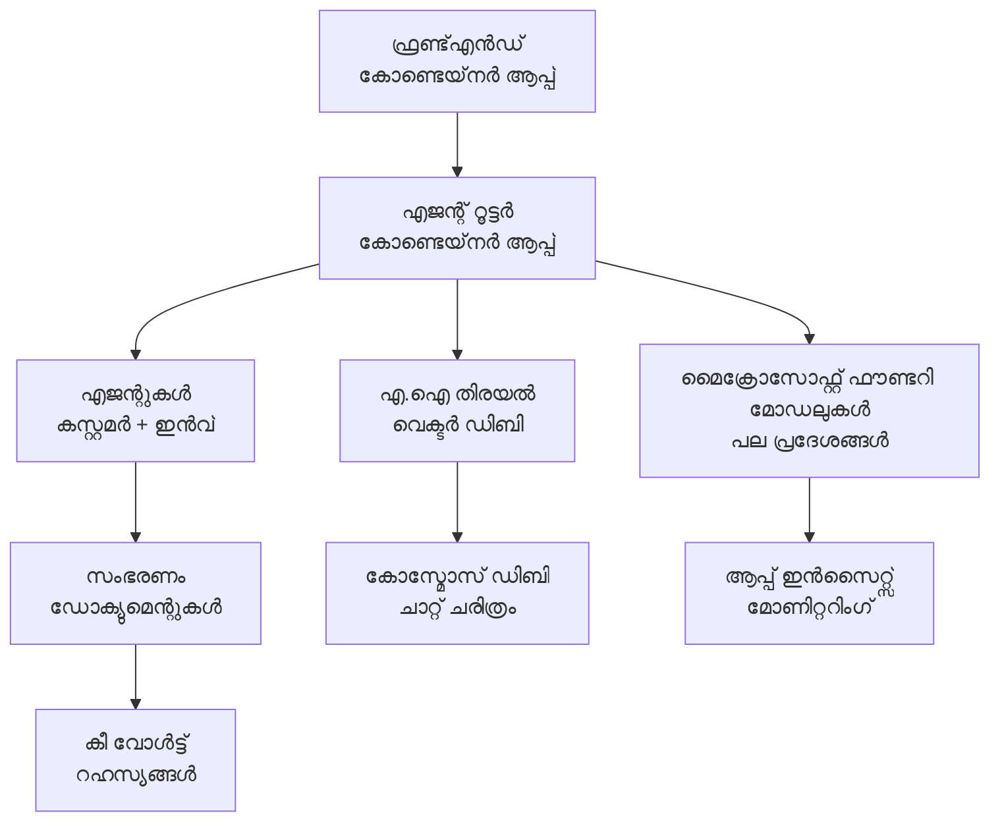

# റീടെയിൽ മൾട്ടി-ഏജന്റ് സൊല്യൂഷൻ - ഇൻഫ്രാസ്ട്രക്ചർ ടെംപ്ലേറ്റ്

**അദ്ധ്യായം 5: പ്രൊഡക്ഷൻ ഡിപ്ലോയ്‌മെന്റ് പാക്കേജ്**  
- **📚 കോഴ്‌സ് ഹോം**: [AZD ഫോർ ബിഗിന്നേഴ്സ്](../../README.md)  
- **📖 ബന്ധപ്പെട്ട അദ്ധ്യായം**: [അദ്ധ്യായം 5: മൾട്ടി-ഏജന്റ് AI സൊല്യൂഷനുകൾ](../../README.md#-chapter-5-multi-agent-ai-solutions-advanced)  
- **📝 സീനാരിയോ ഗൈഡ്**: [സമ്പൂർണ്ണ ആർകിട്ടക്ചർ](../retail-scenario.md)  
- **🎯 ക്വിക്ക് ഡിപ്ലോയ്**: [ഒന്ന്-ക്ലിക്ക് ഡിപ്ലോയ്‌മെന്റ്](#-quick-deployment)  

> **⚠️ ഇൻഫ്രാസ്ട്രക്ചർ ടെംപ്ലേറ്റ് മാത്രം**  
> ഈ ARM ടെംപ്ലേറ്റ് ഒരു മൾട്ടി-ഏജന്റ് സിസ്റ്റത്തിനായി **അസ്യൂർ റിസോഴ്‌സുകൾ** ഡിപ്ലോയ് ചെയ്യുന്നു.  
>  
> **ഡിപ്ലോയ് ചെയ്യുന്നവ (15-25 മിനിറ്റ്):**  
> - ✅ മൈക്രോസോഫ്റ്റ് ഫൗൻഡ്രി മോഡലുകൾ (gpt-4.1, gpt-4.1-മിനി, 3 പ്രവിശ്യകളിൽ എംബർഡിങ്സ്)  
> - ✅ AI സേർച്ച് സർവീസ് (ശൂന്യം, ഇൻഡക്സ് സൃഷ്ടിക്കാനുള്ളതിൽ സജ്ജം)  
> - ✅ കണ്ടെയ്‌നർ ആപ്പുകൾ (പേസ്‌ഹോൾഡർ ചിത്രങ്ങൾ, നിങ്ങളുടെ കോഡിനായി സജ്ജം)  
> - ✅ സ്റ്റോറേജ്, കോസ്മോസ് DB, കീ വോൾട്ട്, അപ്ലിക്കേഷൻ ഇൻസൈറ്റ്‌സ്  
>  
> **ഉൾപ്പെടുത്തിയിട്ടില്ലാത്തവ (ഡെവലപ്മെന്റ് ആവശ്യമാണ്):**  
> - ❌ ഏജന്റ് ഇംപ്ലിമെന്റേഷൻ കോഡ് (കസ്റ്റമർ ഏജന്റ്, ഇൻവെൻ‌ററി ഏജന്റ്)  
> - ❌ റൂട്ടിങ് ലോജിക്, API എൻഡ്‌പോയിന്റുകൾ  
> - ❌ ഫ്രണ്ട്‌എൻഡ് ചാറ്റ് UI  
> - ❌ സേർച്ച് ഇൻഡക്സ് സ്കീമാസും ഡാറ്റ പൈപ്‌ലൈൻസും  
> - ❌ **അനുമാനിച്ച ഡെവലപ്‌മെന്റ് സമയം: 80-120 മണിക്കൂർ**  
>  
> **ഈ ടെംപ്ലേറ്റ് ഉപയോഗിക്കുക, ഒപ്പം:**  
> - ✅ മൾട്ടി-ഏജന്റ് പ്രൊജക്ടിന് അസ്യൂർ ഇൻഫ്രാസ്ട്രക്ചർ പ്രൊവിഷൻ ചെയ്യാൻ  
> - ✅ ഏജന്റ് ഇംപ്ലിമെന്റേഷൻ വേńcി ഡെവലപ് ചെയ്യാൻ  
> - ✅ പ്രൊഡക്ഷൻ റെഡി ഇൻഫ്രാസ്ട്രക്ചർ ബേസ്ലൈൻ ആവശ്യമെങ്കിൽ  
>  
> **ഉപയോഗിക്കരുത്, എന്ന് കരുതുന്നതിൽ:**  
> - ❌ ഉടൻ പ്രവർത്തനക്ഷമമായ മൾട്ടി-ഏജന്റ് ഡെമോ പ്രതീക്ഷിക്കുന്നുവെങ്കിൽ  
> - ❌ പൂർണ്ണമായ ആപ്ലിക്കേഷൻ കോഡ് ഉദാഹരണങ്ങൾ പ്രതീക്ഷിക്കുന്നുവെങ്കിൽ  

## അവലോകനം

ഈ ഡയറക്ടറിയിൽ മൾട്ടി-ഏജന്റ് കസ്റ്റമർ സപ്പോർട്ട് സിസ്റ്റത്തിന് ആവശ്യമായ **ഇൻഫ്രാസ്ട്രക്ചർ അടിസ്ഥാനങ്ങൾ** ഡിപ്ലോയ് ചെയ്യാനുള്ള അസ്യൂർ റിസോഴ്‌സ് മാനേജർ (ARM) ടെംപ്ലേറ്റിന്റെ സമഗ്ര പതിപ്പ് ഉൾപ്പെടുത്തപ്പെട്ടിരിക്കുന്നു. എല്ലാ ആവശ്യമായ അസ്യൂർ സർവിസുകളും ശരിയായി കോൺഫിഗർ ചെയ്ത് ബന്ധിപ്പിച്ചുകൊണ്ട്, നിങ്ങളുടെ ആപ്ലിക്കേഷൻ ഡെവലപ്മെന്റിന് സജ്ജമായി.

**ഡിപ്ലോയ്‌മെൻറ് കഴിഞ്ഞ് നിങ്ങള്‍ക്ക് ലഭിക്കുന്നത്:** പ്രൊഡക്ഷൻ-റെഡി അസ്യൂർ ഇൻഫ്രാസ്ട്രക്ചർ  
**സിസ്റ്റം പൂർത്തിയായി പ്രവർത്തിക്കാൻ ആവശ്യമായത്:** ഏജന്റ് കോഡ്, ഫ്രണ്ട്‌എൻഡ് UI, ഡാറ്റ കോൺഫിഗറേഷൻ (കാണുക [ആർകിറ്റക്ചർ ഗൈഡ്](../retail-scenario.md))  

## 🎯 ഡിപ്ലോയ് ചെയ്യുന്നവ

### കോർ ഇൻഫ്രാസ്ട്രക്ചർ (ഡിപ്ലോയ്‌മെൻ്റിന് ശേഷമുള്ള അവസ്ഥ)

✅ **മൈക്രോസോഫ്റ്റ് ഫൗണ്ട്രി മോഡൽസ്സ് സർവീസസ്** (API കോൾസ് സജ്ജം)  
  - പ്രൈമറി പ്രവിശ്യ: gpt-4.1 ഡിപ്ലോയ്‌മെന്റ് (20K TPM ശേഷിയോടെ)  
  - സെക്കൻഡറി പ്രവിശ്യ: gpt-4.1-മിനി ഡിപ്ലോയ്‌മെന്റ് (10K TPM)  
  - ടേർഷ്യറി പ്രവിശ്യ: ടെക്സ്റ്റ് എംബർഡിംഗ്സ് മോഡൽ (30K TPM)  
  - എവാല്യുവേഷൻ പ്രവിശ്യ: gpt-4.1 ഗ്രേഡർ മോഡൽ (15K TPM)  
  - **അവസ്ഥ:** പൂർണമായും പ്രവർത്തനക്ഷമമായിട്ടുണ്ട് - ഉടൻ API കോൾ ചെയ്യാൻ സാധിക്കും  

✅ **അസ്യൂർ AI സേർച്ച്** (ശൂന്യം - കോൺഫിഗറേഷൻക്കായി സജ്ജം)  
  - വെക്ടർ സേർച്ച് സജീവമാണ്  
  - 1 പാർട്ടിഷൻ, 1 റെപ്ലിക്കയുള്ള സ്റ്റാൻഡേർഡ് ടിയർ  
  - **അവസ്ഥ:** സർവീസ് പ്രവർത്തിക്കുന്നു, ഇൻഡക്സ് സൃഷ്‌ടിക്കാൻ വേണ്ടത്  
  - **ആക്ഷൻ ആവശ്യം:** നിങ്ങളുടെ സ്കീമ പ്രകാരം സെർച്ച് ഇൻഡക്സ് സൃഷ്‌ടിക്കുക  

✅ **അസ്യൂർ സ്റ്റോറേജ് അക്കൗണ്ട്** (ശൂന്യം - അപ്‌ലോഡുകൾക്കായി സജ്ജം)  
  - ബ്ലോബുകൾ: `documents`, `uploads`  
  - സുരക്ഷിത കോൺഫിഗറേഷൻ (HTTPS മാത്രം, പൊതു ആക്‌സസ് ഇല്ല)  
  - **അവസ്ഥ:** ഫയലുകൾ സ്വീകരിക്കാൻ സജ്ജം  
  - **ആക്ഷൻ ആവശ്യം:** നിങ്ങളുടെ ഉൽപ്പന്ന ഡാറ്റയും ഡോക്യുമെന്റുകളും അപ്‌ലോഡ് ചെയ്യുക  

⚠️ **കണ്ടെയ്‌നർ ആപ്പ്സ് എൻവയോൺമെന്റ്** (പേസ്‌ഹോൾഡർ ചിത്രങ്ങൾ ഡിപ്ലോയുചെയ്‌തിരിക്കുന്നു)  
  - ഏജന്റ് റൂട്ടർ ആപ്പ് (nginx ഡിഫോൾട്ട് ഇമേജ്)  
  - ഫ്രണ്ട്‌എൻഡ് ആപ്പ് (nginx ഡിഫോൾട്ട് ഇമേജ്)  
  - ഓട്ടോ-സ്കെയിലിങ് കോൺഫിഗർ ചെയ്യപ്പെട്ടിരിക്കുന്നു (0-10 ഇൻസ്റ്റൻസുകൾ)  
  - **അവസ്ഥ:** പേസ്‌ഹോൾഡർ കണ്ടെയ്‌നറുകൾ പ്രവർത്തിക്കുന്നു  
  - **ആക്ഷൻ ആവശ്യം:** നിങ്ങളുടെ ഏജന്റ് ആപ്പ്ലിക്കേഷനുകൾ നിർമ്മിച്ച് ഡിപ്ലോയ് ചെയ്യുക  

✅ **അസ്യൂർ കോസ്മോസ് DB** (ശൂന്യം - ഡാറ്റയ്ക്കായി സജ്ജം)  
  - ഡാറ്റാബേസ്, കണ്ടെയ്‌നർ മുൻകൂട്ടിയായി കോൺഫിഗർ ചെയ്തു  
  - കുറഞ്ഞ ലേറ്റൻസി ഓപ്പറേഷനുകൾക്കായി ഏറ്റവും നല്ല രീതിയിൽ ഒരുക്കിയത്  
  - TTL സജീവം (സ്വയം ശുദ്ധീകരണത്തിൻറെ സഹായത്തിന്)  
  - **അവസ്ഥ:** ചാറ്റ് ചരിത്രം സൂക്ഷിക്കാൻ സജ്ജം  

✅ **അസ്യൂർ കീ വോൾട്ട്** (ഐച്ഛികം - രഹസ്യങ്ങൾക്കായി സജ്ജം)  
  - സോഫ്‌റ്റ് ഡിലീറ്റ് സജ്ജം  
  - മാനേജ്‌ഡ് ഐഡന്റിടികൾക്കായി RBAC കോൺഫിഗർ ചെയ്തു  
  - **അവസ്ഥ:** API കീകൾ, കണക്ഷൻ സ്ട്രിങ്ങുകൾ സൂക്ഷിക്കാൻ സജ്ജം  

✅ **അപ്ലിക്കേഷൻ ഇൻസൈറ്റ്സ്** (ഐച്ഛികം - മോണിറ്ററിംഗ് സജീവം)  
  - ലോഗ് അനാലിറ്റിക്സ് വർക്ക്സ്പേസിനോട് ബന്ധപ്പെട്ടിരിക്കുന്നു  
  - കസ്റ്റം മെട്രിക്സും അലർട്ടുകളും കോൺഫിഗർ ചെയ്തു  
  - **അവസ്ഥ:** നിങ്ങളുടെ ആപ്പുകളിൽ നിന്നുള്ള ടെലിമെട്രി സ്വീകരിക്കാൻ സജ്ജം  

✅ **ഡോക്യൂമെന്റ് ഇന്റലിജൻസ്** (API കോൾസ് സജ്ജം)  
  - പ്രൊഡക്ഷൻ വർക്ക്‌ലോഡിനായി S0 ടിയർ  
  - **അവസ്ഥ:** അപ്‌ലോഡ് ചെയ്ത ഡോക്യുമെന്റുകൾ പ്രോസസ്സ് ചെയ്യാൻ സജ്ജം  

✅ **ബിംഗ് സേർച്ച് API** (API കോൾസ് സജ്ജം)  
  - റിയൽ-ടൈം സേർച്ച്‌ക്കായി S1 ടിയർ  
  - **അവസ്ഥ:** വെബ് സർച്ച് ക്വെറിയുകൾ നടത്താൻ സജ്ജം  

### ഡിപ്ലോയ്‌മെന്റ് മോടുകൾ

| മോട് | OpenAI ശേഷി | കണ്ടെയ്‌നർ ഇൻസ്റ്റൻസുകൾ | സേർച്ച് ടിയർ | സ്റ്റോറേജ് റെഡണ്ടൻസി | ഏറ്റവും ഉചിതം ഏത് |  
|------|-----------------|---------------------|-------------|-------------------|----------|  
| **മിനിമൽ** | 10K-20K TPM | 0-2 റെപ്ലിക്കകൾ | അടിസ്ഥാന | LRS (ലോകൽ) | ഡെവ്/ടെസ്റ്റ്, പഠിച്ചു, പ്രൂഫ് ഓഫ് കോൺസെപ്റ്റ് |  
| **സ്റ്റാൻഡേർഡ്** | 30K-60K TPM | 2-5 റെപ്ലിക്കകൾ | സ്റ്റാൻഡേർഡ് | ZRS (സോൺ) | പ്രൊഡക്ഷൻ, മിതമായ ട്രാഫിക് (<10K യൂസേഴ്സ്) |  
| **പ്രീമിയം** | 80K-150K TPM | 5-10 റെപ്ലിക്കകൾ, സോൺ റെഡണ്ടൻറ് | പ്രീമിയം | GRS (ജിയോ) | എന്റർപ്രൈസ്, ഉയർന്ന ട്രാഫിക് (>10K യൂസേഴ്സ്), 99.99% SLA |  

**ചെലവിന്റെ ആഘാതം:**  
- **മിനിമൽ → സ്റ്റാൻഡേർഡ്:** ഏകദേശം 4 മടങ്ങ് വർധനവ് ($100-370/മാസം → $420-1,450/മാസം)  
- **സ്റ്റാൻഡേർഡ് → പ്രീമിയം:** ഏകദേശം 3 മടങ്ങ് വർധനവ് ($420-1,450/മാസം → $1,150-3,500/മാസം)  
- **തിരഞ്ഞെടുപ്പിന്:** പ്രതീക്ഷിക്കുന്ന ലോഡ്, SLA ആവശ്യങ്ങൾ, ബജറ്റ് പരിധികൾ  

**സാധ്യതാ പദ്ധതികൾ:**  
- **TPM (ടോക്കൻസ് പെർ മിനിറ്റ്):** എല്ലാ മോഡൽ ഡിപ്ലോയ്മെന്റുകളും ചേർത്തുള്ള മൊത്തം  
- **കണ്ടെയ്‌നർ ഇൻസ്റ്റൻസുകൾ:** ഓട്ടോ-സ്കെയിലിങ് പരിധി (മിനിമം-മാക്സിമം റെപ്ലിക്കകൾ)  
- **സേർച്ച് ടിയർ:** ക്വറി പ്രകടനത്തെയും ഇൻഡക്സ് വലുപ്പം പരിമിതിയേയും സ്വാധീനിക്കുന്നു  

## 📋 മുൻ‌ആവശ്യങ്ങൾ

### ആവശ്യമായ ഉപകരണങ്ങൾ  
1. **Azure CLI** (വർഷൻ 2.50.0 അല്ലെങ്കിൽ ഉയർന്നത്)  
   ```bash
   az --version  # പതിപ്പ് പരിശോധിക്കുക
   az login      # സ്ഥിരീകരിക്കുക
   ```
  
2. **ഓണർ അല്ലെങ്കിൽ കോൺട്രിബ്യുട്ടർ അവകാശം ഉള്ള സജീവ അസ്യൂർ സബ്‌സ്‌ക്രിപ്‌ഷൻ**  
   ```bash
   az account show  # സബ്‌സ്‌ക്രിപ്ഷന്‍ സ്ഥിരീകരിക്കുക
   ```
  
### ആവശ്യമായ അസ്യൂർ ക്വോട്ടാസ്

ഡിപ്ലോയ്‌മെന്റ് തുടങ്ങുന്നതിന് മുൻപ് ലക്ഷ്യമിടുന്നപ്രവിശ്യകളിൽ ക്വാറ്റകൾ മതിയായിരിക്കുന്നുവെന്ന് ഉറപ്പാക്കുക:

```bash
# നിങ്ങളുടെ പ്രദേശത്തെ Microsoft Foundry മോഡലുകളുടെ ലഭ്യത പരിശോധിക്കുക
az cognitiveservices account list-skus \
  --kind OpenAI \
  --location eastus2

# OpenAI ക്വോട്ട ഉറപ്പ് വരുത്തുക (gpt-4.1ക്കുള്ള ഉദാഹരണം)
az cognitiveservices usage list \
  --location eastus2 \
  --query "[?name.value=='OpenAI.Standard.gpt-4.1']"

# കൺടൈനർ ആപ്‌സിന്റെ ക്വോട്ട പരിശോധിക്കുക
az provider show \
  --namespace Microsoft.App \
  --query "resourceTypes[?resourceType=='managedEnvironments'].locations"
```
  
**കുടിശ്ശികയുടെ ഏറ്റവും കുറഞ്ഞ ആവശ്യകതകൾ:**  
- **Microsoft Foundry Models:** 3-4 മോഡൽ ഡിപ്ലോയ്മെന്റുകൾ പ്രവിശ്യകളിൽ  
  - gpt-4.1: 20K TPM (ടോക്കൻസ് പെർ മിനിറ്റ്)  
  - gpt-4.1-മിനി: 10K TPM  
  - text-embedding-ada-002: 30K TPM  
  - **കുറിപ്പ്:** ചില പ്രവിശ്യകളിൽ gpt-4.1ക്ക് വെയ്റ്റ്‌ലിസ്റ്റ് ഉണ്ടാകാം - പരിശോധിക്കുക [model availability](https://learn.microsoft.com/azure/ai-services/openai/concepts/models)  
- **കണ്ടെയ്‌നർ ആപ്പുകൾ:** മാനേജ്‌ഡ് എൻവയോൺമെന്റ് + 2-10 കണ്ടെയ്‌നർ ഇൻസ്റ്റൻസുകൾ  
- **AI സേർച്ച്:** സ്റ്റാൻഡേർഡ് ടിയർ (ബേസിക് വെക്ടർ സേർച്ച്‌ക്കായി മതിയല്ല)  
- **കോസ്മോസ് DB:** സ്റ്റാൻഡേർഡ് പ്രൊവിഷനഡ് ത്രൂപുട്  

**ക്വോട്ട കുറയുകയാണെങ്കിൽ:**  
1. അസ്യൂർ പോർട്ടലിൽ → ക്വോട്ടാസ് → വർധനവിന് അപേക്ഷിക്കുക  
2. അല്ലെങ്കിൽ അസ്യൂർ CLI ഉപയോഗിക്കുക:  
   ```bash
   az support tickets create \
     --ticket-name "OpenAI-Quota-Increase" \
     --severity "minimal" \
     --description "Request quota increase for Microsoft Foundry Models gpt-4.1 in eastus2"
   ```
  
3. ലഭ്യമായ അന്തർ പ്രദേശങ്ങൾക്ക് പരിഗണിക്കുക  

## 🚀 ക്വിക്ക് ഡിപ്ലോയ്‌മെന്റ്

### ഓപ്ഷൻ 1: അസ്യൂർ CLI ഉപയോഗിക്കുക

```bash
# ടെംപ്ലേറ്റ് ഫയലുകൾ ക്ലോൺ ചെയ്യുക അല്ലെങ്കിൽ ഡൗൺലോഡ് ചെയ്യുക
git clone <repository-url>
cd examples/retail-multiagent-arm-template

# ഡിപ്ലോയ്‌മെന്റ് സ്ക്രിപ്റ്റ് പ്രവർത്തനക്ഷമമാക്കുക
chmod +x deploy.sh

# ഡീഫോൾറ്റ് ക്രമീകരണങ്ങളോടെ ഡിപ്ലോയ് ചെയ്യുക
./deploy.sh -g myResourceGroup

# പ്രീമിയം ഫീച്ചറുകളോടെ പ്രൊഡക്ഷനായി ഡിപ്ലോയ് ചെയ്യുക
./deploy.sh -g myProdRG -e prod -m premium -l eastus2
```
  
### ഓപ്ഷൻ 2: അസ്യൂർ പോർട്ടൽ ഉപയോഗിക്കുക

[](https://portal.azure.com/#create/Microsoft.Template/uri/https%3A%2F%2Fraw.githubusercontent.com%2Fmicrosoft%2Fazd-for-beginners%2Fmain%2Fexamples%2Fretail-multiagent-arm-template%2Fazuredeploy.json)  

### ഓപ്ഷൻ 3: നേരിട്ട് അസ്യൂർ CLI ഉപയോഗിക്കുക

```bash
# ഉറവിട ഗ്രൂപ്പ് സൃഷ്ടിക്കുക
az group create --name myResourceGroup --location eastus2

# ടെംപ്ലേറ്റ് വിന്യസിക്കുക
az deployment group create \
  --resource-group myResourceGroup \
  --template-file azuredeploy.json \
  --parameters azuredeploy.parameters.json
```
  
## ⏱️ ഡിപ്ലോയ്‌മെന്റ് സമയരേഖ

### പ്രതീക്ഷിക്കാവുന്നവ

| ഘട്ടം | ദൈർഘ്യം | സംഭവിക്കുന്നത് |  
|-------|----------|--------------|  
| **ടെംപ്ലേറ്റ് വെരിഫിക്കേഷൻ** | 30-60 സെക്കൻഡ് | അസ്യൂർ ARM ടെംപ്ലേറ്റിന്റെ സിന്ടാക്സ്, പാരാമീറ്ററുകൾ പരിശോധിക്കുന്നു |  
| **റിസോഴ്‌സ് ഗ്രൂപ്പ് സജ്ജീകരണം** | 10-20 സെക്കൻഡ് | റിസോഴ്‌സ് ഗ്രൂപ്പ്, ആവശ്യമായെങ്കിൽ സൃഷ്ടിക്കുന്നു |  
| **OpenAI പ്രൊവിഷണിംഗ്** | 5-8 മിനിറ്റ് | 3-4 OpenAI അക്കൗണ്ടുകൾ സൃഷ്ടിച്ച് മോഡലുകൾ ഡിപ്ലോയ്‌ ചെയ്യുന്നു |  
| **കണ്ടെയ്‌നർ ആപ്പുകൾ** | 3-5 മിനിട്ട് | എൻവയോൺമെന്റ് സൃഷ്ടിച്ച് പേസ്‌ഹോൾഡർ കണ്ടെയ്‌നറുകൾ ഡിപ്ലോയ് ചെയ്യുന്നു |  
| **സേർച്ച് & സ്റ്റോറേജ്** | 2-4 മിനിറ്റ് | AI സേർച്ച് സർവീസ്, സ്റ്റോറേജ് അക്കൗണ്ടുകൾ പ്രൊവിഷൻ ചെയ്യുന്നു |  
| **കോസ്മോസ് DB** | 2-3 മിനിറ്റ് | ഡാറ്റാബേസ് സൃഷ്ടിച്ച് കണ്ടെയ്‌നറുകൾ കോൺഫിഗർ ചെയ്യുന്നു |  
| **മോണിറ്ററിംഗ് സജ്ജീകരണം** | 2-3 മിനിറ്റ് | അപ്ലിക്കേഷൻ ഇൻസൈറ്റ്സ്, ലോഗ് അനാലിറ്റിക്സ് സജ്ജമാക്കുന്നു |  
| **RBAC കോൺഫിഗറേഷൻ** | 1-2 മിനിറ്റ് | മാനേജ്‌ഡ് ഐഡന്റിടികൾ, അനുമതികൾ കോൺഫിഗർ ചെയ്യുന്നു |  
| **മൊത്തം ഡിപ്ലോയ്‌മെന്റ്** | **15-25 മിനിറ്റ്** | പൂര്‍ത്തിയായ ഇൻഫ്രാസ്ട്രക്ചർ സജ്ജമാണു് |  

**ഡിപ്ലോയ്‌മെന്റ് കഴിഞ്ഞ്:**  
- ✅ **ഇൻഫ്രാസ്ട്രക്ചർ റെഡി:** എല്ലാ അസ്യൂർ സർവിസുകളും പ്രൊവിഷൻ ചെയ്തു പ്രവര്‍ത്തിക്കുന്നു  
- ⏱️ **ആപ്ലിക്കേഷൻ ഡെവലപ്‌മെന്റ്:** 80-120 മണിക്കൂർ (നിങ്ങളുടെ ഉത്തരവാദിത്വം)  
- ⏱️ **ഇൻഡക്സ് കോൺഫിഗറേഷൻ:** 15-30 മിനിറ്റ് (നിങ്ങളുടെ സ്കീമ ആവശ്യമാണ്)  
- ⏱️ **ഡാറ്റ അപ്‌ലോഡ്:** ഡാറ്റസെറ്റിന്റെ വലുപ്പം അനുസരിച്ച് വ്യത്യാസപ്പെടും  
- ⏱️ **പരിശോധന & വെരിഫിക്കേഷൻ:** 2-4 മണിക്കൂർ  

---

## ✅ ഡിപ്ലോയ്‌മെന്റ് വിജയകരമോ അതാണോ പരിശോധിക്കുക

### ചുവടുകൾ 1: റിസോഴ്‌സ് പ്രൊവിഷണിംഗ് പരിശോധിക്കുക (2 മിനിറ്റ്)

```bash
# എല്ലാ വിഭവങ്ങളും വിജയകരമായി വിന്യസിച്ചിട്ടുണ്ടോ എന്ന് സ്ഥിരീകരിക്കുക
az resource list \
  --resource-group myResourceGroup \
  --query "[?provisioningState!='Succeeded'].{Name:name, Status:provisioningState, Type:type}" \
  --output table
```
  
**പ്രതീക്ഷിക്കേണ്ടത്:** ശൂന്യമായ പട്ടിക (എല്ലാ റിസോഴ്‌സുകളും "Succeeded" അവസ്ഥ കാണിക്കും)  

### ചുവടുകൾ 2: മൈക്രോസോഫ്റ്റ് ഫൗണ്ട്രി മോഡൽസ്സ് ഡിപ്ലോയ്മെന്റുകൾ പരിശോധിക്കുക (3 മിനിറ്റ്)

```bash
# എല്ലാ OpenAI അക്കൗണ്ടുകളും ലിസ്റ്റ് ചെയ്യുക
az cognitiveservices account list \
  --resource-group myResourceGroup \
  --query "[?kind=='OpenAI'].{Name:name, Location:location, Status:properties.provisioningState}" \
  --output table

# പ്രാഥമിക പ്രദേശത്തിനുള്ള മോഡൽ വിന്യാസങ്ങൾ പരിശോധിക്കുക
OPENAI_NAME=$(az cognitiveservices account list \
  --resource-group myResourceGroup \
  --query "[?kind=='OpenAI'] | [0].name" -o tsv)

az cognitiveservices account deployment list \
  --name $OPENAI_NAME \
  --resource-group myResourceGroup \
  --output table
```
  
**പ്രതീക്ഷിക്കേണ്ടത്:**  
- 3-4 OpenAI അക്കൗണ്ടുകൾ (പ്രൈമറി, സെക്കൻഡറി, ടേർഷ്യറി, എവാല്യുവേഷൻ പ്രവിശ്യകൾ)  
- ഓരോ അക്കൗണ്ടിലും 1-2 മോഡൽ ഡിപ്ലോയ്മെന്റുകൾ (gpt-4.1, gpt-4.1-മിനി, text-embedding-ada-002)  

### ചുവടുകൾ 3: ഇൻഫ്രാസ്ട്രക്ചർ എൻഡ്‌പോയിന്റുകൾ ടെസ്റ്റ് ചെയ്യുക (5 മിനിറ്റ്)

```bash
# കണ്ടെയ്‌നർ ആപ്പ് URLs നേടുക
az containerapp list \
  --resource-group myResourceGroup \
  --query "[].{Name:name, URL:properties.configuration.ingress.fqdn, Status:properties.runningStatus}" \
  --output table

# റൂട്ടർ എൻഡ്‌പോയിന്റ് പരിശോധിക്കുക (പ്ലേഗ്ഹോൾഡർ ഇമേജ് പ്രതികരിക്കും)
ROUTER_URL=$(az containerapp show \
  --name retail-router \
  --resource-group myResourceGroup \
  --query "properties.configuration.ingress.fqdn" -o tsv)

echo "Testing: https://$ROUTER_URL"
curl -I https://$ROUTER_URL || echo "Container running (placeholder image - expected)"
```
  
**പ്രതീക്ഷിക്കേണ്ടത്:**  
- കണ്ടെയ്‌നർ ആപ്പുകൾ "Running" അവസ്ഥ കാണിക്കുന്നു  
- പേസ്‌ഹോൾഡർ nginx HTTP 200 അല്ലെങ്കിൽ 404 പ്രതിവചനം നൽകുന്നു (ഇപ്പോൾ വരെ ആപ്ലിക്കേഷൻ കോഡ് ഇല്ല)  

### ചുവടുകൾ 4: മൈക്രോസോഫ്റ്റ് ഫൗണ്ട്രി മോഡൽസ് API ആക്സസ് പരിശോധന (3 മിനിറ്റ്)

```bash
# OpenAI എന്റ്പോയിന്റും കിയും നേടുക
OPENAI_ENDPOINT=$(az cognitiveservices account show \
  --name $OPENAI_NAME \
  --resource-group myResourceGroup \
  --query "properties.endpoint" -o tsv)

OPENAI_KEY=$(az cognitiveservices account keys list \
  --name $OPENAI_NAME \
  --resource-group myResourceGroup \
  --query "key1" -o tsv)

# gpt-4.1 ഡിപ്ലോയ്‌മെന്റ് ടെസ്റ്റ് ചെയ്യുക
curl "${OPENAI_ENDPOINT}openai/deployments/gpt-4.1/chat/completions?api-version=2024-08-01-preview" \
  -H "Content-Type: application/json" \
  -H "api-key: $OPENAI_KEY" \
  -d '{
    "messages": [{"role": "user", "content": "Say hello"}],
    "max_tokens": 10
  }'
```
  
**പ്രതീക്ഷിക്കേണ്ടത്:** JSON പ്രതിവചനത്തോടെ ചാറ്റ് പൂർത്തീകരണം (OpenAI പ്രവർത്തനക്ഷമമാണെന്ന് സ്ഥിരീകരിക്കുന്നു)  

### പ്രവർത്തിക്കുന്നത് vs പ്രവർത്തിക്കാത്തത്

**✅ ഡിപ്ലോയ്‌മെന്റ് കഴിഞ്ഞ് പ്രവർത്തിക്കുന്നു:**  
- Microsoft Foundry Models മോഡലുകൾ ഡിപ്ലോയ് ചെയ്ത് API കോൾ സ്വീകരിക്കുന്നു  
- AI Search സർവീസ് പ്രവർത്തിക്കുന്നു (ശൂന്യം, ഇൻഡക്സ് ഇല്ല)  
- കണ്ടെയ്‌നർ ആപ്പുകൾ പ്രവർത്തിക്കുന്നു (nginx പേസ്‌ഹോൾഡർ ചിത്രങ്ങൾ)  
- സ്റ്റോറേജ് അക്കൗണ്ടുകൾ ആക്‌സസിബിളും അപ്‌ലോഡുകൾക്കുമായി സജ്ജവുമാണ്  
- കോസ്മോസ് DB ഡാറ്റ ഓപ്പറേഷനുകൾക്കായി സജ്ജം  
- അപ്ലിക്കേഷൻ ഇൻസൈറ്റ്സ് ഇൻഫ്രാസ്ട്രക്ചർ ടെലിമെട്രി ശേഖരിക്കുന്നു  
- കീ വോൾട്ട് രഹസ്യങ്ങൾ സൂക്ഷിക്കാൻ സജ്ജം  

**❌ ഇപ്പോഴും പ്രവർത്തിക്കുന്നില്ല (ഡെവലപ്മെന്റ് ആവശ്യമാണ്):**  
- അംഗം എൻഡ്‌പോയിന്റുകൾ (ആപ്ലിക്കേഷൻ കോഡ് ഡിപ്ലോയ് ചെയ്തിട്ടില്ല)  
- ചാറ്റ് പ്രവർത്തനം (ഫ്രണ്ട്‌എൻഡ് + ബാക്ക്‌എൻഡ് ആവശ്യമാണ്)  
- സേർച്ച് ക്വെറികൾ (ഇനിയും ഇൻഡക്സ് സൃഷ്‌ടിച്ചിട്ടില്ല)  
- ഡോക്യുമെന്റ് പ്രോസസ്സിംഗ് പൈപ്പ്ലൈൻ (ഡാറ്റ അപ്‌ലോഡ് ചെയ്തിട്ടില്ല)  
- കസ്റ്റം ടെലിമെട്രി (ആപ്ലിക്കേഷൻ ഇൻസ്ട്രുമെന്റേഷൻ ആവശ്യമാണ്)  

**അടുത്ത ചുവടുകൾ:** കാണുക [പോസ്റ്റ്-ഡിപ്ലോയ്‌മെന്റ് കോൺഫിഗറേഷൻ](#-post-deployment-next-steps) നിങ്ങളുടെ ആപ്ലിക്കേഷൻ വികസിപ്പിക്കാനും ഡിപ്ലോയ്ചെയ്യാനും  

---

## ⚙️ കോൺഫിഗറേഷൻ ഓപ്ഷനുകൾ

### ടെംപ്ലേറ്റ് പാരാമീറ്ററുകൾ

| പാരാമീറ്റർ | തരം | ഡീഫാൾട്ട് | വിവരണം |  
|-----------|------|---------|-------------|  
| `projectName` | string | "retail" | എല്ലാ റിസോഴ്‌സ് പേരുകൾക്കും പ്രിഫിക്‌സ് |  
| `location` | string | റിസോഴ്‌സ് ഗ്രൂപ്പ് സ്ഥലം | പ്രൈമറി ഡിപ്ലോയ്മെന്റ് പ്രവിശ്യ |  
| `secondaryLocation` | string | "westus2" | മൾട്ടി-പ്രവിശണ ഡിപ്ലോയ്മെന്റിന് സെക്കൻഡറി പ്രവിശ്യ |  
| `tertiaryLocation` | string | "francecentral" | എംബർഡിങ്സ് മോഡലിന് പ്രവിശ്യ |  
| `environmentName` | string | "dev" | എൻവയോൺമെന്റ് ഡീസിഗ്‌നെഷൻ (dev/staging/prod) |  
| `deploymentMode` | string | "standard" | ഡിപ്ലോയ്മെന്റ് കോൺഫിഗറേഷൻ (minimal/standard/premium) |  
| `enableMultiRegion` | bool | true | മൾട്ടി-പ്രവിശ്യ ഡിപ്ലോയ്മെന്റ് പിന്തുണയ്‌ക്കാൻ |  
| `enableMonitoring` | bool | true | അപ്ലിക്കേഷൻ ഇൻസൈറ്റ്സ്, ലോഗിംഗ് സജീവമാക്കാൻ |  
| `enableSecurity` | bool | true | കീ വോൾട്ട്, മെച്ചപ്പെട്ട സുരക്ഷ സജ്ജമാക്കാൻ |  

### സജ്ജീകരണ പാരാമീറ്ററുകൾ

എഡിറ്റ് ചെയ്യുക `azuredeploy.parameters.json`:

```json
{
  "$schema": "https://schema.management.azure.com/schemas/2019-04-01/deploymentParameters.json#",
  "contentVersion": "1.0.0.0",
  "parameters": {
    "projectName": {
      "value": "mycompany"
    },
    "environmentName": {
      "value": "prod"
    },
    "deploymentMode": {
      "value": "premium"
    },
    "location": {
      "value": "eastus2"
    }
  }
}
```
  
## 🏗️ ആർക്കിടെക്ചർ അവലോകനം


## 📖 ഡിപ്ലോയ്‌മെന്റ് സ്‌ക്രിപ്റ്റ് ഉപയോഗം

`deploy.sh` സ്‌ക്രിപ്റ്റ് ഇന്ററൊക്ടീവ് ഡിപ്ലോയ്‌മെന്റ് അനുഭവം നൽകുന്നു:

```bash
# സഹായം കാണിക്കുക
./deploy.sh --help

# അടിസ്ഥാന വിന്യാസം
./deploy.sh -g myResourceGroup

# ഇച്ഛാനുസൃത ക്രമീകരണങ്ങളോടുള്ള ഉയർന്ന തോത് വിന്യാസം
./deploy.sh \
  -g myProductionRG \
  -p companyname \
  -e prod \
  -m premium \
  -l eastus2

# മൾട്ടി-റീജിയൻ ഇല്ലാതെ വികസന വിന്യാസം
./deploy.sh \
  -g myDevRG \
  -e dev \
  -m minimal \
  --no-multi-region \
  --no-security
```
  
### സ്‌ക്രിപ്റ്റ് സവിശേഷതകൾ

- ✅ **മുൻ‌ആവശ്യങ്ങൾ പരിശോധിക്കൽ** (Azure CLI, ലോഗിൻ നില, ടെംപ്ലേറ്റ് ഫയലുകൾ)  
- ✅ **റിസോഴ്‌സ് ഗ്രൂപ്പ് മാനേജ്‌മെന്റ്** (ഉണ്ടായില്ലെങ്കിൽ സൃഷ്ടിക്കുന്നു)  
- ✅ **ടെംപ്ലേറ്റ് പരിശോധന** ഡിപ്ലോയ്‌മെൻറ് മുമ്പ്  
- ✅ **പ്രോഗ്രസ് മോൺ‌ടറിംഗ്** നിറമുള്ള ഔട്ട്‌പുട്ടോടെ  
- ✅ **ഡിപ്ലോയ്‌മെന്റ് ഔട്ട്‌പുട്ട് പ്രദർശനം**  
- ✅ **പോസ്റ്റ്‌-ഡിപ്ലോയ്‌മെന്റ് ഗൈഡ്**  

## 📊 ഡിപ്ലോയ്‌മെന്റ് മോൺറിറ്ററിംഗ്

### ഡിപ്ലോയ്‌മെന്റ് നില പരിശോധിക്കുക

```bash
# ഡിപ്ലോയ്മെന്റുകള്‍ പട്ടികവിട്ട് കാണിക്കുക
az deployment group list --resource-group myResourceGroup --output table

# ഡിപ്പ്ലോയ്മെന്റ് വിശദാംശങ്ങള്‍ നേടുക
az deployment group show \
  --resource-group myResourceGroup \
  --name retail-deployment-YYYYMMDD-HHMMSS

# ഡിപ്പ്ലോയ്മെന്റ് പുരോഗതി നിരീക്ഷിക്കുക
az deployment group create \
  --resource-group myResourceGroup \
  --template-file azuredeploy.json \
  --parameters azuredeploy.parameters.json \
  --verbose
```
  
### ഡിപ്ലോയ്‌മെന്റ് ഔട്ട്‌പുട്ട്‌സ്

ഡിപ്ലോയ്‌മെന്റ് വിജയകരമായി കഴിഞ്ഞാൽ താഴെപറയുന്ന ഔട്ട്‌പുട്ട്‌സ് ലഭ്യമാണ്:  

- **ഫ്രണ്ട്‌എൻഡ് URL**: വെബ് ഇന്റർഫേസിന്റെ പൊതു എൻഡ്‌പോയിന്റ്  
- **റൂട്ടർ URL**: ഏജന്റ് റൂട്ടറിനുള്ള API എൻഡ്‌പോയിന്റ്  
- **OpenAI എൻഡ്‌പോയിന്റുകൾ**: പ്രൈമറി, സെക്കൻഡറി OpenAI സർവീസ് എൻഡ്‌പോയിന്റുകൾ  
- **സേർച്ച് സർവീസ്**: അസ്യൂർ AI സെർച്ച് സർവീസ് എൻഡ്‌പോയിന്റ്  
- **സ്റ്റോറേജ് അക്കൗണ്ട്**: ഡോക്യുമെന്റുകൾക്കായുള്ള സ്റ്റോറേജ് അക്കൗണ്ടിന്റെ പേര്  
- **കീ വോൾട്ട്**: കീ വോൾട്ട് (സജ്ജീകരിച്ചാൽ)  
- **അപ്ലിക്കേഷൻ ഇൻസൈറ്റ്സ്**: മോണിറ്ററിംഗ് സർവീസ് പേര് (സജ്ജീകരിച്ചാൽ)  

## 🔧 പോസ്റ്റ്-ഡിപ്ലോയ്‌മെന്റ്: അടുത്ത ചുവടുകൾ
> **📝 പ്രധാനമാണ്:** ഇൻഫ്രാസ്ട്രക്ചർ വിന്യസിച്ചിരിക്കുന്നു, എന്നാൽ നിങ്ങൾക്ക് ആപ്ലിക്കേഷൻ കോഡ് വികസിപ്പിച്ച് വിന്യസിക്കേണ്ടതാണ്.

### ഘട്ടം 1: ഏജന്റ് ആപ്ലിക്കേഷനുകൾ വികസിപ്പിക്കുക (നിങ്ങളുടെ ഉത്തരവാദിത്തം)

ARM ടെംപ്ലേറ്റ് പ്ലേസ്ഹോൾഡർ nginx ഇമേജുകൾ ഉപയോഗിച്ച് **ശൂന്യ കണ്‍ടെയ്‌നർ ആപ്ലിക്കേഷനുകൾ** സൃഷ്ടിക്കുന്നു. നിങ്ങൾ ചെയ്യേണ്ടത്:

**ആവശ്യമായ വികസനം:**
1. **ഏജന്റ് നടപ്പാക്കൽ** (30-40 മണിക്കൂർ)
   - gpt-4.1 സംയോജിത ഉപഭോക്തൃ സേവന ഏജന്റ്
   - gpt-4.1-mini സംയോജിത പട്ടിക ഏജന്റ്
   - ഏജന്റ് റൗട്ടിങ് ലജിക്

2. **ഫ്രണ്ട്‌എൻഡ് വികസനം** (20-30 മണിക്കൂർ)
   - ചാറ്റ് ഇന്റർഫെയ്‌സ് UI (React/Vue/Angular)
   - ഫയൽ അപ്ലോഡ് സവിശേഷത
   - പ്രതികരണത്തിന്റെ പ്രദർശനം, ഫോർമാറ്റിങ്

3. **ബാക്ക്‌എൻഡ് സേവനങ്ങൾ** (12-16 മണിക്കൂർ)
   - FastAPI അല്ലെങ്കിൽ Express റൗട്ടർ
   - പ്രാമാണീകരണ മിഡിൽവെയർ
   - ടെലമെട്രി സംയോജനം

**കാണുക:** [Architecture Guide](../retail-scenario.md) വിശദമായ നടപ്പാക്കൽ പാറ്റേണുകളും കോഡ് ഉദാഹരണങ്ങളും

### ഘട്ടം 2: എഐ സെർച്ച് ഇൻഡക്‌സ് കോൺഫിഗർ ചെയ്യുക (15-30 മിനിറ്റ്)

നിങ്ങളുടെ ഡാറ്റ മോഡലിനോഡു പൊരുത്തപ്പെടുന്ന ഒരു സെർച്ച് ഇൻഡക്‌സ് സൃഷ്ടിക്കുക:

```bash
# തിരയൽ സർവീസ് വിശദാംശങ്ങൾ ලබාക്കുക
SEARCH_NAME=$(az search service list \
  --resource-group myResourceGroup \
  --query "[0].name" -o tsv)

SEARCH_KEY=$(az search admin-key show \
  --service-name $SEARCH_NAME \
  --resource-group myResourceGroup \
  --query "primaryKey" -o tsv)

# നിങ്ങളുടെ സ്കീമ ഉപയോഗിച്ച് ഇൻഡക്സ് സൃഷ്ടിക്കുക (ഉദാഹരണം)
curl -X POST "https://${SEARCH_NAME}.search.windows.net/indexes?api-version=2023-11-01" \
  -H "Content-Type: application/json" \
  -H "api-key: ${SEARCH_KEY}" \
  -d '{
    "name": "products",
    "fields": [
      {"name": "id", "type": "Edm.String", "key": true},
      {"name": "title", "type": "Edm.String", "searchable": true},
      {"name": "content", "type": "Edm.String", "searchable": true},
      {"name": "category", "type": "Edm.String", "filterable": true},
      {"name": "content_vector", "type": "Collection(Edm.Single)", 
       "searchable": true, "dimensions": 1536, "vectorSearchProfile": "default"}
    ],
    "vectorSearch": {
      "algorithms": [{"name": "default", "kind": "hnsw"}],
      "profiles": [{"name": "default", "algorithm": "default"}]
    }
  }'
```

**സ്രോതസ്സ്:**
- [AI Search Index Schema Design](https://learn.microsoft.com/azure/search/search-what-is-an-index)
- [Vector Search Configuration](https://learn.microsoft.com/azure/search/vector-search-how-to-create-index)

### ഘട്ടം 3: നിങ്ങളുടെ ഡാറ്റ അപ്ലോഡ് ചെയ്യുക (സമയം വ്യത്യാസപ്പെട്ടിരിക്കും)

ഉൽപ്പന്ന ഡാറ്റയും ഡോക്യുമെന്റുകളും ലഭിച്ചതിന് ശേഷം:

```bash
# സ്റ്റോറേജ് അക്കൗണ്ട് വിശദാംശങ്ങൾ നേടുക
STORAGE_NAME=$(az storage account list \
  --resource-group myResourceGroup \
  --query "[0].name" -o tsv)

STORAGE_KEY=$(az storage account keys list \
  --account-name $STORAGE_NAME \
  --resource-group myResourceGroup \
  --query "[0].value" -o tsv)

# നിങ്ങളുടെ രേഖകള് അപ്ലോഡ് ചെയ്യുക
az storage blob upload-batch \
  --destination documents \
  --source /path/to/your/product/docs \
  --account-name $STORAGE_NAME \
  --account-key $STORAGE_KEY

# ഉദാഹരണം: ഒറ്റ ഫയൽ അപ്ലോഡ് ചെയ്യുക
az storage blob upload \
  --container-name documents \
  --name "product-manual.pdf" \
  --file /path/to/product-manual.pdf \
  --account-name $STORAGE_NAME \
  --account-key $STORAGE_KEY
```

### ഘട്ടം 4: നിങ്ങളുടെ ആപ്ലിക്കേഷനുകൾ നിർമാണം ചെയ്ത് വിന്യസിക്കുക (8-12 മണിക്കൂർ)

നിങ്ങളുടെ ഏജന്റ് കോഡ് വികസിപ്പിച്ചതിന് ശേഷം:

```bash
# 1. ആസ്യൂറിൽ കന്റെയ്നർ രജിസ്റ്റ്രീ സൃഷ്‌ടിക്കുക (ആവശ്യമായാൽ)
az acr create \
  --name myregistry \
  --resource-group myResourceGroup \
  --sku Basic

# 2. ഏജന്റ് റൂട്ടർ ഇമേജ് നിർമ്മിച്ച് പുഷ് ചെയ്യുക
docker build -t myregistry.azurecr.io/agent-router:v1 /path/to/your/router/code
az acr login --name myregistry
docker push myregistry.azurecr.io/agent-router:v1

# 3. ഫ്രണ്ട്എൻഡ് ഇമേജ് നിർമ്മിച്ച് പുഷ് ചെയ്യുക
docker build -t myregistry.azurecr.io/frontend:v1 /path/to/your/frontend/code
docker push myregistry.azurecr.io/frontend:v1

# 4. നിങ്ങളുടെ ഇമേജുകൾ ഉപയോഗിച്ച് കന്റെയ്നർ ആപ്സ് അപ്‌ഡേറ്റ് ചെയ്യുക
az containerapp update \
  --name retail-router \
  --resource-group myResourceGroup \
  --image myregistry.azurecr.io/agent-router:v1

az containerapp update \
  --name retail-frontend \
  --resource-group myResourceGroup \
  --image myregistry.azurecr.io/frontend:v1

# 5. പരിസ്ഥിതി വേരിയബിളുകൾ ക്രമീകരിക്കുക
az containerapp update \
  --name retail-router \
  --resource-group myResourceGroup \
  --set-env-vars \
    OPENAI_ENDPOINT=secretref:openai-endpoint \
    OPENAI_KEY=secretref:openai-key \
    SEARCH_ENDPOINT=secretref:search-endpoint \
    SEARCH_KEY=secretref:search-key
```

### ഘട്ടം 5: നിങ്ങളുടെ ആപ്ലിക്കേഷൻ പരിശോധിക്കുക (2-4 മണിക്കൂർ)

```bash
# നിങ്ങളുടെ ആപ്ലിക്കേഷൻ URL നേടുക
ROUTER_URL=$(az containerapp show \
  --name retail-router \
  --resource-group myResourceGroup \
  --query "properties.configuration.ingress.fqdn" -o tsv)

# ടെസ്റ്റ് ഏജന്റ് എൻഡ്‌പോയിന്റ് (നിങ്ങളുടെ കോഡ് ഡിപ്ലോയ്മെന്റ് കഴിഞ്ഞിട്ട്)
curl -X POST "https://${ROUTER_URL}/chat" \
  -H "Content-Type: application/json" \
  -d '{
    "message": "Hello, I need help with my order",
    "agent": "customer"
  }'

# ആപ്ലിക്കേഷൻ ലോക്സ് പരിശോധിക്കുക
az containerapp logs show \
  --name retail-router \
  --resource-group myResourceGroup \
  --follow
```

### നടപ്പാക്കൽ സ്രോതസ്സ്

**ആർക്കിടെക്ചറും ഡിസൈനും:**
- 📖 [Complete Architecture Guide](../retail-scenario.md) - വിശദമായ നടപ്പാക്കൽ പാറ്റേണുകൾ
- 📖 [Multi-Agent Design Patterns](https://learn.microsoft.com/azure/architecture/ai-ml/guide/multi-agent-systems)

**കോഡ് ഉദാഹരണങ്ങൾ:**
- 🔗 [Microsoft Foundry Models Chat Sample](https://github.com/Azure-Samples/azure-search-openai-demo) - RAG പാറ്റേൺ
- 🔗 [Semantic Kernel](https://github.com/microsoft/semantic-kernel) - ഏജന്റ് ഫ്രെയിംവർക്കി (C#)
- 🔗 [LangChain Azure](https://github.com/langchain-ai/langchain) - ഏജന്റ് ഓർക്കസ്ട്രേഷൻ (Python)
- 🔗 [AutoGen](https://github.com/microsoft/autogen) - മൾട്ടി-ഏജന്റ് സംഭാഷണങ്ങൾ

**അനുമാനിച്ച മൊത്തം പരിശ്രമം:**
- ഇൻഫ്രാസ്ട്രക്ചർ വിന്യസിക്കൽ: 15-25 മിനിറ്റ് (✅ പൂർത്തിയായി)
- ആപ്ലിക്കേഷൻ വികസനം: 80-120 മണിക്കൂർ (🔨 നിങ്ങളുടെ ജോലി)
- പരിശോധിക്കൽ, മെച്ചപ്പെടുത്തൽ: 15-25 മണിക്കൂർ (🔨 നിങ്ങളുടെ ജോലി)

## 🛠️ പ്രശ്നപരിഹാരം

### സാധാരണ പ്രശ്നങ്ങൾ

#### 1. Microsoft Foundry Models ക്വോട്ട കൂടുതലായി

```bash
# നിലവിലെ കൊറ്റ ഉപയോഗം പരിശോധിക്കുക
az cognitiveservices usage list --location eastus2

# കൊറ്റ വർദ്ധിപ്പിക്കാൻ അപേക്ഷിക്കുക
az support tickets create \
  --ticket-name "OpenAI-Quota-Increase" \
  --severity "minimal" \
  --description "Request quota increase for Microsoft Foundry Models in region X"
```

#### 2. കൺടെയ്‌നർ ആപ്ലിക്കേഷനുകൾ വിന്യസിക്കൽ പരാജയപ്പെട്ടു

```bash
# കണ്ടെയ്നർ ആപ്പ് ലോഗുകൾ പരിശോധിക്കുക
az containerapp logs show \
  --name retail-router \
  --resource-group myResourceGroup \
  --follow

# കണ്ടെയ്നർ ആപ്പ് പുനരാരംഭിക്കുക
az containerapp revision restart \
  --name retail-router \
  --resource-group myResourceGroup
```

#### 3. സെർച്ച് സർവീസ് ഇൻഷിയലൈസേഷൻ

```bash
# സർച്ച് സർവീസ് സ്ഥിതിവിവരം പരിശോധിക്കുക
az search service show \
  --name <search-service-name> \
  --resource-group myResourceGroup

# സർച് സർവീസ് കണക്ഷൻ പരിശോധന നടത്തുക
curl -X GET "https://<search-service-name>.search.windows.net/indexes?api-version=2023-11-01" \
  -H "api-key: <search-admin-key>"
```

### വിന്യസിക്കൽ സ്ഥിരീകരണം

```bash
# എല്ലാ ഉറവിടങ്ങളും സൃഷ്ടിച്ചിട്ടുണ്ടെന്ന് സ്ഥിരീകരിക്കുക
az resource list \
  --resource-group myResourceGroup \
  --output table

# ഉറവിടത്തിന്റെ ആരോഗ്യനില പരിശോധിക്കുക
az resource list \
  --resource-group myResourceGroup \
  --query "[?provisioningState!='Succeeded'].{Name:name, Status:provisioningState, Type:type}" \
  --output table
```

## 🔐 സുരക്ഷാ പരിഗണനകൾ

### കീ മാനേജ്മെന്റ്
- എല്ലാ രഹസ്യങ്ങളും Azure കീ വാൾട്ടിൽ സൂക്ഷിക്കുന്നു (ക്രമീകരിച്ചാൽ)
- കൺടെയ്‌നർ ആപ്ലിക്കേഷനുകൾ മാനേജ്ഡ് ഐഡന്റിറ്റി ഉപയോഗിച്ച് പ്രാമാണീകരണം നടത്തുന്നു
- സ്റ്റോറേജ് അക്കൗണ്ടുകളിൽ സുരക്ഷിത ഡീഫാൾട്ടുകൾ ഉണ്ട് (HTTPS മാത്രം, പബ്ലിക് ബ്ലോബിലേക്ക് പ്രവേശനമില്ല)

### നെറ്റ്‌വർക്കിന്റെ സുരക്ഷ
- കൺടെയ്‌നർ ആപ്ലിക്കേഷനുകൾ 가능한ിൽ ആഭ്യന്തര നെറ്റ്വർക്കിംഗ് ഉപയോഗിക്കുന്നു
- സെർച്ച് സർവീസ് പ്രൈവറ്റ് എന്റ്പോയിന്റുകൾ ഉപയോഗിച്ച് കോൺഫിഗർ ചെയ്തിരിക്കുന്നു
- കോസ്മോസ് DB പരമാവധി കുറഞ്ഞ അനുമതികൾ നൽകി കോൺഫിഗർ ചെയ്തിരിക്കുന്നു

### RBAC കോൺഫിഗറേഷൻ
```bash
# മാനേജുചെയ്ത ഐഡന്റിറ്റിക്കായി ആവശ്യമായ റോൾസ് അനുവദിക്കുക
az role assignment create \
  --assignee <container-app-managed-identity> \
  --role "Cognitive Services OpenAI User" \
  --scope <openai-resource-id>
```

## 💰 ചിലവു ഒരു രീതിയിലേക്ക് കൈകാര്യം ചെയ്യൽ

### ചിലവ് കണക്കുകൾ (മാസാന്ത്യം, യുഎസ്ഡി)

| മോഡ് | OpenAI | കൺടെയ്‌നർ ആപ്ലിക്കേഷനുകൾ | സെർച്ച് | സ്റ്റോറേജ് | മൊത്തം കണക്കുകൾ |
|------|--------|----------------|--------|---------|------------|
| കുറഞ്ഞത് | $50-200 | $20-50 | $25-100 | $5-20 | $100-370 |
| സ്റ്റാൻഡേർഡ് | $200-800 | $100-300 | $100-300 | $20-50 | $420-1450 |
| പ്രീമിയം | $500-2000 | $300-800 | $300-600 | $50-100 | $1150-3500 |

### ചിലവ് നിരീക്ഷണം

```bash
# ബജറ്റ് അലർട്ടുകൾ സജ്ജമാക്കുക
az consumption budget create \
  --account-name <subscription-id> \
  --budget-name "retail-budget" \
  --amount 500 \
  --time-grain Monthly \
  --start-date 2024-01-01 \
  --end-date 2024-12-31
```

## 🔄 അപ്‌ഡേറ്റുകളും പരിപാലനവും

### ടെംപ്ലേറ്റ് അപ്‌ഡേറ്റുകൾ
- ARM ടെംപ്ലേറ്റ് ഫയലുകളുടെ വേർഷൻ നിയന്ത്രണം
- ആദ്യം ഡെവലപ്പ്മെന്റ് പരിതസ്ഥിതിയിൽ മാറ്റങ്ങൾ പരീക്ഷിക്കുക
- അപ്‌ഡേറ്റുകൾക്ക് ഇൻക്രിമെന്റൽ വിന്യാസ മോഡ് ഉപയോഗിക്കുക

### റിസോഴ്സ് അപ്‌ഡേറ്റുകൾ
```bash
# പുതിയ പാരാമീറ്ററുകളോടെ അപ്ഡേറ്റ് ചെയ്യുക
az deployment group create \
  --resource-group myResourceGroup \
  --template-file azuredeploy.json \
  --parameters azuredeploy.parameters.json \
  --mode Incremental
```

### ബാക്ക്അപ്പ്, പുനഃസ്ഥാപനം
- കോസ്മോസ് DB ഓട്ടോമാറ്റിക് ബാക്ക്അപ്പ് മാനേജ്ഡ്
- കീ വാൾട്ട് സോഫ്‌റ്റ് ഡിലീറ്റ് സജ്ജീകരിച്ചിരിക്കുന്നു
- റോള്ബാക്കിനായി കൺടെയ്‌നർ ആപ്പ് റിവിഷനുകൾ സൂക്ഷിക്കുന്നുണ്ട്

## 📞 പിന്തുണ

- **ടെംപ്ലേറ്റ് പ്രശ്‌നങ്ങൾ**: [GitHub Issues](https://github.com/microsoft/azd-for-beginners/issues)
- **Azure Support**: [Azure Support Portal](https://portal.azure.com/#blade/Microsoft_Azure_Support/HelpAndSupportBlade)
- **സമൂഹം**: [Azure AI Discord](https://discord.gg/microsoft-azure)

---

**⚡ നിങ്ങളുടെ മൾട്ടി-ഏജന്റ് പരിഹാരത്തെ വിന്യസിക്കാൻ തയാറാണോ?**

ആരംഭിക്കുക: `./deploy.sh -g myResourceGroup`

---

<!-- CO-OP TRANSLATOR DISCLAIMER START -->
**വ്യക്തിഗത പരാക്രമണം**:  
ഈ പ്രമാണം AI വിവർത്തന സേവനം [Co-op Translator](https://github.com/Azure/co-op-translator) ഉപയോഗിച്ച് വിവർത്തനം ചെയ്തതാണ്. നമുക്ക് കൃത്യതയ്ക്കായി ശ്രമിച്ചിട്ടുണ്ടെങ്കിലും, ഓട്ടോമേറ്റഡ് വിവർത്തനങ്ങളിൽ പിശകുകൾ അല്ലെങ്കിൽ അസമ്മതികൾ ഉണ്ടാകാവുന്നതാണ്. മാതൃഭാഷയിൽ ഉള്ള оригинальный പ്രമാണം പ്രാമാണികമായ ഉറവിടമായി പരിഗണിക്കപ്പെടണം. നിര്‍ണായക വിവരങ്ങൾക്കായി പ്രൊഫഷണൽ മനുഷ്യവിവർത്തനം ശുപാർശ ചെയ്യുന്നു. ഈ വിവർത്തന ഉപയോഗത്തിൽ നിന്നുണ്ടാകുന്ന ഏതു തെറ്റിദ്ധാരണകൾക്കും അല്ലെങ്കിൽ തെറ്റായ വ്യാഖ്യാനങ്ങൾക്കും ഞങ്ങൾ ഉത്തരവാദികളല്ല.
<!-- CO-OP TRANSLATOR DISCLAIMER END -->