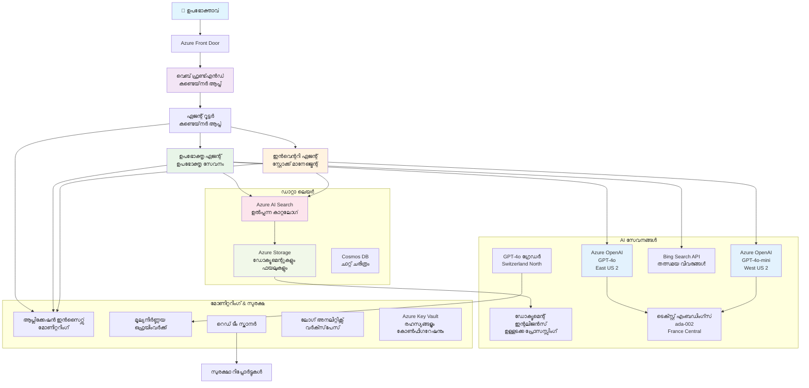

<!--
CO_OP_TRANSLATOR_METADATA:
{
  "original_hash": "77db71c83f2e7fbc9f50320bd1cc7116",
  "translation_date": "2025-11-24T21:16:20+00:00",
  "source_file": "examples/retail-scenario.md",
  "language_code": "ml"
}
-->
# മൾട്ടി-ഏജന്റ് കസ്റ്റമർ സപ്പോർട്ട് സൊല്യൂഷൻ - റീട്ടെയിലർ സീനാരിയോ

**അധ്യായം 5: മൾട്ടി-ഏജന്റ് AI സൊല്യൂഷനുകൾ**
- **📚 കോഴ്സ് ഹോം**: [AZD For Beginners](../README.md)
- **📖 നിലവിലെ അധ്യായം**: [അധ്യായം 5: മൾട്ടി-ഏജന്റ് AI സൊല്യൂഷനുകൾ](../README.md#-chapter-5-multi-agent-ai-solutions-advanced)
- **⬅️ മുൻ‌വശം**: [അധ്യായം 2: AI-First Development](../docs/ai-foundry/azure-ai-foundry-integration.md)
- **➡️ അടുത്ത അധ്യായം**: [അധ്യായം 6: പ്രീ-ഡിപ്ലോയ്‌മെന്റ് വാലിഡേഷൻ](../docs/pre-deployment/capacity-planning.md)
- **🚀 ARM ടെംപ്ലേറ്റുകൾ**: [Deployment Package](retail-multiagent-arm-template/README.md)

> **⚠️ ആർക്കിടെക്ചർ ഗൈഡ് - പ്രവർത്തനക്ഷമമായ ഇംപ്ലിമെന്റേഷൻ അല്ല**  
> ഈ ഡോക്യുമെന്റ് **വ്യാപകമായ ആർക്കിടെക്ചർ ബ്ലൂപ്രിന്റ്** നൽകുന്നു മൾട്ടി-ഏജന്റ് സിസ്റ്റം നിർമ്മിക്കുന്നതിന്.  
> **ഇപ്പോൾ ഉള്ളത്:** ഇൻഫ്രാസ്ട്രക്ചർ ഡിപ്ലോയ്‌മെന്റിനുള്ള ARM ടെംപ്ലേറ്റ് (Azure OpenAI, AI Search, Container Apps, മുതലായവ)  
> **നിങ്ങൾ നിർമ്മിക്കേണ്ടത്:** ഏജന്റ് കോഡ്, റൂട്ടിംഗ് ലജിക്, ഫ്രണ്ട്‌എൻഡ് UI, ഡാറ്റ പൈപ്പ്‌ലൈൻ (അനുമാനിച്ച സമയം 80-120 മണിക്കൂർ)  
>  
> **ഇത് ഉപയോഗിക്കുക:**
> - ✅ നിങ്ങളുടെ സ്വന്തം മൾട്ടി-ഏജന്റ് പ്രോജക്റ്റിനുള്ള ആർക്കിടെക്ചർ റഫറൻസ് ആയി
> - ✅ മൾട്ടി-ഏജന്റ് ഡിസൈൻ പാറ്റേണുകൾ പഠിക്കുന്നതിന്
> - ✅ Azure റിസോഴ്‌സുകൾ ഡിപ്ലോയ് ചെയ്യാനുള്ള ഇൻഫ്രാസ്ട്രക്ചർ ടെംപ്ലേറ്റ് ആയി
> - ❌ പ്രവർത്തനക്ഷമമായ ആപ്ലിക്കേഷൻ അല്ല (വിപുലമായ ഡവലപ്മെന്റ് ആവശ്യമാണ്)

## അവലോകനം

**പഠന ലക്ഷ്യം:** റീട്ടെയിലറിനായി പ്രൊഡക്ഷൻ-റെഡി മൾട്ടി-ഏജന്റ് കസ്റ്റമർ സപ്പോർട്ട് ചാറ്റ്ബോട്ട് നിർമ്മിക്കുന്നതിന് ആർക്കിടെക്ചർ, ഡിസൈൻ തീരുമാനങ്ങൾ, ഇംപ്ലിമെന്റേഷൻ സമീപനം എന്നിവ മനസ്സിലാക്കുക.

**പൂർണ്ണമാക്കാനുള്ള സമയം:** വായന + മനസ്സിലാക്കൽ (2-3 മണിക്കൂർ) | പൂർണ്ണ ഇംപ്ലിമെന്റേഷൻ നിർമ്മിക്കൽ (80-120 മണിക്കൂർ)

**നിങ്ങൾ പഠിക്കുന്നതെന്ത്:**
- മൾട്ടി-ഏജന്റ് ആർക്കിടെക്ചർ പാറ്റേണുകളും ഡിസൈൻ പ്രിൻസിപ്പിളുകളും
- മൾട്ടി-റീജിയൻ Azure OpenAI ഡിപ്ലോയ്‌മെന്റ് തന്ത്രങ്ങൾ
- RAG (Retrieval-Augmented Generation) ഉപയോഗിച്ച് AI Search ഇന്റഗ്രേഷൻ
- ഏജന്റ് മൂല്യനിർണയവും സുരക്ഷാ ടെസ്റ്റിംഗ് ഫ്രെയിംവർക്കുകളും
- പ്രൊഡക്ഷൻ ഡിപ്ലോയ്‌മെന്റ് പരിഗണനകളും ചെലവ് ഓപ്റ്റിമൈസേഷനും

## ആർക്കിടെക്ചർ ലക്ഷ്യങ്ങൾ

**വിദ്യാഭ്യാസ ഫോകസ്:** ഈ ആർക്കിടെക്ചർ മൾട്ടി-ഏജന്റ് സിസ്റ്റങ്ങൾക്കുള്ള എന്റർപ്രൈസ് പാറ്റേണുകൾ പ്രദർശിപ്പിക്കുന്നു.

### സിസ്റ്റം ആവശ്യകതകൾ (നിങ്ങളുടെ ഇംപ്ലിമെന്റേഷനായി)

ഒരു പ്രൊഡക്ഷൻ കസ്റ്റമർ സപ്പോർട്ട് സൊല്യൂഷൻ ആവശ്യമാണ്:
- **വിവിധ ഉപഭോക്തൃ ആവശ്യങ്ങൾക്കുള്ള** നിരവധി സ്പെഷ്യലൈസ്ഡ് ഏജന്റുകൾ (Customer Service + Inventory Management)
- **മൾട്ടി-മോഡൽ ഡിപ്ലോയ്‌മെന്റ്** ശരിയായ ശേഷി പ്ലാനിംഗോടെ (GPT-4o, GPT-4o-mini, embeddings വിവിധ റീജിയനുകളിൽ)
- **ഡൈനാമിക് ഡാറ്റ ഇന്റഗ്രേഷൻ** AI Search, ഫയൽ അപ്ലോഡുകൾ എന്നിവയുമായി (vector search + document processing)
- **വ്യാപകമായ മോണിറ്ററിംഗ്**, മൂല്യനിർണയ ശേഷികൾ (Application Insights + കസ്റ്റം മെട്രിക്സ്)
- **പ്രൊഡക്ഷൻ-ഗ്രേഡ് സുരക്ഷ** റെഡ് ടീമിംഗ് വാലിഡേഷനോടെ (vulnerability scanning + agent evaluation)

### ഈ ഗൈഡ് നൽകുന്നത്

✅ **ആർക്കിടെക്ചർ പാറ്റേണുകൾ** - സ്കെയിലബിൾ മൾട്ടി-ഏജന്റ് സിസ്റ്റങ്ങൾക്കുള്ള തെളിയിച്ച ഡിസൈൻ  
✅ **ഇൻഫ്രാസ്ട്രക്ചർ ടെംപ്ലേറ്റുകൾ** - Azure സേവനങ്ങൾ ഡിപ്ലോയ് ചെയ്യുന്നതിനുള്ള ARM ടെംപ്ലേറ്റുകൾ  
✅ **കോഡ് ഉദാഹരണങ്ങൾ** - പ്രധാന ഘടകങ്ങൾക്കുള്ള റഫറൻസ് ഇംപ്ലിമെന്റേഷനുകൾ  
✅ **കോണ്ഫിഗറേഷൻ മാർഗനിർദ്ദേശങ്ങൾ** - ഘട്ടം ഘട്ടമായി സെറ്റപ്പ് നിർദ്ദേശങ്ങൾ  
✅ **മികച്ച പ്രാക്ടീസുകൾ** - സുരക്ഷ, മോണിറ്ററിംഗ്, ചെലവ് ഓപ്റ്റിമൈസേഷൻ തന്ത്രങ്ങൾ  

❌ **ഉൾപ്പെടുത്തിയിട്ടില്ല** - പൂർണ്ണ പ്രവർത്തനക്ഷമമായ ആപ്ലിക്കേഷൻ (വിപുലമായ ഡവലപ്മെന്റ് ആവശ്യമാണ്)

## 🗺️ ഇംപ്ലിമെന്റേഷൻ റോഡ്‌മാപ്പ്

### ഘട്ടം 1: ആർക്കിടെക്ചർ പഠിക്കുക (2-3 മണിക്കൂർ) - ഇവിടെ ആരംഭിക്കുക

**ലക്ഷ്യം:** സിസ്റ്റം ഡിസൈൻ, ഘടക ഇടപെടലുകൾ എന്നിവ മനസ്സിലാക്കുക

- [ ] ഈ ഡോക്യുമെന്റ് പൂർണ്ണമായി വായിക്കുക
- [ ] ആർക്കിടെക്ചർ ഡയഗ്രവും ഘടക ബന്ധങ്ങളും അവലോകനം ചെയ്യുക
- [ ] മൾട്ടി-ഏജന്റ് പാറ്റേണുകളും ഡിസൈൻ തീരുമാനങ്ങളും മനസ്സിലാക്കുക
- [ ] ഏജന്റ് ടൂളുകൾക്കും റൂട്ടിംഗിനുമുള്ള കോഡ് ഉദാഹരണങ്ങൾ പഠിക്കുക
- [ ] ചെലവ് കണക്കുകൾ, ശേഷി പ്ലാനിംഗ് മാർഗനിർദ്ദേശങ്ങൾ അവലോകനം ചെയ്യുക

**ഫലങ്ങൾ:** നിങ്ങൾ നിർമ്മിക്കേണ്ടതെന്തെന്ന് വ്യക്തമായ ധാരണ

### ഘട്ടം 2: ഇൻഫ്രാസ്ട്രക്ചർ ഡിപ്ലോയ് ചെയ്യുക (30-45 മിനിറ്റ്)

**ലക്ഷ്യം:** ARM ടെംപ്ലേറ്റ് ഉപയോഗിച്ച് Azure റിസോഴ്‌സുകൾ പ്രൊവിഷൻ ചെയ്യുക

```bash
cd retail-multiagent-arm-template
./deploy.sh -g myResourceGroup -m standard
```

**ഡിപ്ലോയ് ചെയ്യുന്നത്:**
- ✅ Azure OpenAI (3 റീജിയനുകൾ: GPT-4o, GPT-4o-mini, embeddings)
- ✅ AI Search സേവനം (ശൂന്യമായത്, ഇൻഡക്സ് കോൺഫിഗറേഷൻ ആവശ്യമാണ്)
- ✅ Container Apps പരിസ്ഥിതി (placeholder images)
- ✅ Storage accounts, Cosmos DB, Key Vault
- ✅ Application Insights മോണിറ്ററിംഗ്

**ഇല്ലാത്തത്:**
- ❌ ഏജന്റ് ഇംപ്ലിമെന്റേഷൻ കോഡ്
- ❌ റൂട്ടിംഗ് ലജിക്
- ❌ ഫ്രണ്ട്‌എൻഡ് UI
- ❌ Search ഇൻഡക്സ് സ്കീമ
- ❌ ഡാറ്റ പൈപ്പ്‌ലൈൻ

### ഘട്ടം 3: ആപ്ലിക്കേഷൻ നിർമ്മിക്കുക (80-120 മണിക്കൂർ)

**ലക്ഷ്യം:** ഈ ആർക്കിടെക്ചർ അടിസ്ഥാനമാക്കി മൾട്ടി-ഏജന്റ് സിസ്റ്റം ഇംപ്ലിമെന്റ് ചെയ്യുക

1. **ഏജന്റ് ഇംപ്ലിമെന്റേഷൻ** (30-40 മണിക്കൂർ)
   - Base agent ക്ലാസും ഇന്റർഫേസുകളും
   - GPT-4o ഉപയോഗിച്ച് Customer service agent
   - GPT-4o-mini ഉപയോഗിച്ച് Inventory agent
   - Tool integrations (AI Search, Bing, file processing)

2. **റൂട്ടിംഗ് സർവീസ്** (12-16 മണിക്കൂർ)
   - Request classification ലജിക്
   - ഏജന്റ് സെലക്ഷനും ഓർക്കസ്ട്രേഷനും
   - FastAPI/Express ബാക്ക്എൻഡ്

3. **ഫ്രണ്ട്‌എൻഡ് ഡവലപ്മെന്റ്** (20-30 മണിക്കൂർ)
   - ചാറ്റ് ഇന്റർഫേസ് UI
   - ഫയൽ അപ്ലോഡ് ഫംഗ്ഷനാലിറ്റി
   - Response rendering

4. **ഡാറ്റ പൈപ്പ്‌ലൈൻ** (8-12 മണിക്കൂർ)
   - AI Search ഇൻഡക്സ് സൃഷ്ടിക്കൽ
   - Document Intelligence ഉപയോഗിച്ച് ഡോക്യുമെന്റ് പ്രോസസ്സിംഗ്
   - Embedding സൃഷ്ടിയും ഇൻഡക്സിംഗും

5. **മോണിറ്ററിംഗ് & മൂല്യനിർണയം** (10-15 മണിക്കൂർ)
   - കസ്റ്റം ടെലിമെട്രി ഇംപ്ലിമെന്റേഷൻ
   - ഏജന്റ് മൂല്യനിർണയ ഫ്രെയിംവർക്കുകൾ
   - Red team security scanner

### ഘട്ടം 4: ഡിപ്ലോയ് & ടെസ്റ്റ് (8-12 മണിക്കൂർ)

- എല്ലാ സേവനങ്ങൾക്കുള്ള Docker images നിർമ്മിക്കുക
- Azure Container Registry-ലേക്ക് push ചെയ്യുക
- Container Apps യഥാർത്ഥ images ഉപയോഗിച്ച് അപ്ഡേറ്റ് ചെയ്യുക
- പരിസ്ഥിതി വേരിയബിളുകളും രഹസ്യങ്ങളും കോൺഫിഗർ ചെയ്യുക
- മൂല്യനിർണയ ടെസ്റ്റ് സ്യൂട്ട് പ്രവർത്തിപ്പിക്കുക
- സുരക്ഷാ സ്കാനിംഗ് നടത്തുക

**ആകെ അനുമാനിച്ച ശ്രമം:** പരിചയസമ്പന്നരായ ഡവലപ്പർമാർക്ക് 80-120 മണിക്കൂർ

## സൊല്യൂഷൻ ആർക്കിടെക്ചർ

### ആർക്കിടെക്ചർ ഡയഗ്രം


### ഘടക അവലോകനം

| ഘടകം | ഉദ്ദേശ്യം | ടെക്നോളജി | റീജിയൻ |
|-----------|---------|------------|---------|
| **Web Frontend** | ഉപഭോക്തൃ ഇടപെടലുകൾക്കുള്ള ഉപയോക്തൃ ഇന്റർഫേസ് | Container Apps | പ്രാഥമിക റീജിയൻ |
| **Agent Router** | ആവശ്യങ്ങൾ അനുയോജ്യമായ ഏജന്റിലേക്ക് റൂട്ടുചെയ്യുന്നു | Container Apps | പ്രാഥമിക റീജിയൻ |
| **Customer Agent** | ഉപഭോക്തൃ സേവന ചോദ്യങ്ങൾ കൈകാര്യം ചെയ്യുന്നു | Container Apps + GPT-4o | പ്രാഥമിക റീജിയൻ |
| **Inventory Agent** | സ്റ്റോക്ക്, ഫുൽഫിൽമെന്റ് എന്നിവ കൈകാര്യം ചെയ്യുന്നു | Container Apps + GPT-4o-mini | പ്രാഥമിക റീജിയൻ |
| **Azure OpenAI** | ഏജന്റുകൾക്കുള്ള LLM inference | Cognitive Services | മൾട്ടി-റീജിയൻ |
| **AI Search** | Vector search, RAG | AI Search Service | പ്രാഥമിക റീജിയൻ |
| **Storage Account** | ഫയൽ അപ്ലോഡുകളും ഡോക്യുമെന്റുകളും | Blob Storage | പ്രാഥമിക റീജിയൻ |
| **Application Insights** | മോണിറ്ററിംഗ്, ടെലിമെട്രി | Monitor | പ്രാഥമിക റീജിയൻ |
| **Grader Model** | ഏജന്റ് മൂല്യനിർണയ സിസ്റ്റം | Azure OpenAI | സെക്കൻഡറി റീജിയൻ |

## 📁 പ്രോജക്റ്റ് ഘടന

> **📍 സ്റ്റാറ്റസ് ലെജൻഡ്:**  
> ✅ = റിപോസിറ്ററിയിൽ ഉണ്ട്  
> 📝 = റഫറൻസ് ഇംപ്ലിമെന്റേഷൻ (ഈ ഡോക്യുമെന്റിലെ കോഡ് ഉദാഹരണം)  
> 🔨 = നിങ്ങൾ സൃഷ്ടിക്കേണ്ടത്

```
retail-multiagent-solution/              🔨 Your project directory
├── .azure/                              🔨 Azure environment configs
│   ├── config.json                      🔨 Global config
│   └── env/
│       ├── .env.development             🔨 Dev environment
│       ├── .env.staging                 🔨 Staging environment
│       └── .env.production              🔨 Production environment
│
├── azure.yaml                          🔨 AZD main configuration
├── azure.parameters.json               🔨 Deployment parameters
├── README.md                           🔨 Solution documentation
│
├── infra/                              🔨 Infrastructure as Code (you create)
│   ├── main.bicep                      🔨 Main Bicep template (optional, ARM exists)
│   ├── main.parameters.json            🔨 Parameters file
│   ├── modules/                        📝 Bicep modules (reference examples below)
│   │   ├── ai-services.bicep           📝 Azure OpenAI deployments
│   │   ├── search.bicep                📝 AI Search configuration
│   │   ├── storage.bicep               📝 Storage accounts
│   │   ├── container-apps.bicep        📝 Container Apps environment
│   │   ├── monitoring.bicep            📝 Application Insights
│   │   ├── security.bicep              📝 Key Vault and RBAC
│   │   └── networking.bicep            📝 Virtual networks and DNS
│   ├── arm-template/                   ✅ ARM template version (EXISTS)
│   │   ├── azuredeploy.json            ✅ ARM main template (retail-multiagent-arm-template/)
│   │   └── azuredeploy.parameters.json ✅ ARM parameters
│   └── scripts/                        ✅/🔨 Deployment scripts
│       ├── deploy.sh                   ✅ Main deployment script (EXISTS)
│       ├── setup-data.sh               🔨 Data setup script (you create)
│       └── configure-rbac.sh           🔨 RBAC configuration (you create)
│
├── src/                                🔨 Application source code (YOU BUILD THIS)
│   ├── agents/                         📝 Agent implementations (examples below)
│   │   ├── base/                       🔨 Base agent classes
│   │   │   ├── agent.py                🔨 Abstract agent class
│   │   │   └── tools.py                🔨 Tool interfaces
│   │   ├── customer/                   🔨 Customer service agent
│   │   │   ├── agent.py                📝 Customer agent implementation (see below)
│   │   │   ├── prompts.py              🔨 System prompts
│   │   │   └── tools/                  🔨 Agent-specific tools
│   │   │       ├── search_tool.py      📝 AI Search integration (example below)
│   │   │       ├── bing_tool.py        📝 Bing Search integration (example below)
│   │   │       └── file_tool.py        🔨 File processing tool
│   │   └── inventory/                  🔨 Inventory management agent
│   │       ├── agent.py                🔨 Inventory agent implementation
│   │       ├── prompts.py              🔨 System prompts
│   │       └── tools/                  🔨 Agent-specific tools
│   │           ├── inventory_search.py 🔨 Inventory search tool
│   │           └── database_tool.py    🔨 Database query tool
│   │
│   ├── router/                         🔨 Agent routing service (you build)
│   │   ├── main.py                     🔨 FastAPI router application
│   │   ├── routing_logic.py            🔨 Request routing logic
│   │   └── middleware.py               🔨 Authentication & logging
│   │
│   ├── frontend/                       🔨 Web user interface (you build)
│   │   ├── Dockerfile                  🔨 Container configuration
│   │   ├── package.json                🔨 Node.js dependencies
│   │   ├── src/                        🔨 React/Vue source code
│   │   │   ├── components/             🔨 UI components
│   │   │   ├── pages/                  🔨 Application pages
│   │   │   ├── services/               🔨 API services
│   │   │   └── styles/                 🔨 CSS and themes
│   │   └── public/                     🔨 Static assets
│   │
│   ├── shared/                         🔨 Shared utilities (you build)
│   │   ├── config.py                   🔨 Configuration management
│   │   ├── telemetry.py                📝 Telemetry utilities (example below)
│   │   ├── security.py                 🔨 Security utilities
│   │   └── models.py                   🔨 Data models
│   │
│   └── evaluation/                     🔨 Evaluation and testing (you build)
│       ├── evaluator.py                📝 Agent evaluator (example below)
│       ├── red_team_scanner.py         📝 Security scanner (example below)
│       ├── test_cases.json             📝 Evaluation test cases (example below)
│       └── reports/                    🔨 Generated reports
│
├── data/                               🔨 Data and configuration (you create)
│   ├── search-schema.json              📝 AI Search index schema (example below)
│   ├── initial-docs/                   🔨 Initial document corpus
│   │   ├── product-manuals/            🔨 Product documentation (your data)
│   │   ├── policies/                   🔨 Company policies (your data)
│   │   └── faqs/                       🔨 Frequently asked questions (your data)
│   ├── fine-tuning/                    🔨 Fine-tuning datasets (optional)
│   │   ├── training.jsonl              🔨 Training data
│   │   └── validation.jsonl            🔨 Validation data
│   └── evaluation/                     🔨 Evaluation datasets
│       ├── test-conversations.json     📝 Test conversation data (example below)
│       └── ground-truth.json           🔨 Expected responses
│
├── scripts/                            # Utility scripts
│   ├── setup/                          # Setup scripts
│   │   ├── bootstrap.sh                # Initial environment setup
│   │   ├── install-dependencies.sh     # Install required tools
│   │   └── configure-env.sh            # Environment configuration
│   ├── data-management/                # Data management scripts
│   │   ├── upload-documents.py         # Document upload utility
│   │   ├── create-search-index.py      # Search index creation
│   │   └── sync-data.py                # Data synchronization
│   ├── deployment/                     # Deployment automation
│   │   ├── deploy-agents.sh            # Agent deployment
│   │   ├── update-frontend.sh          # Frontend updates
│   │   └── rollback.sh                 # Rollback procedures
│   └── monitoring/                     # Monitoring scripts
│       ├── health-check.py             # Health monitoring
│       ├── performance-test.py         # Performance testing
│       └── security-scan.py            # Security scanning
│
├── tests/                              # Test suites
│   ├── unit/                           # Unit tests
│   │   ├── test_agents.py              # Agent unit tests
│   │   ├── test_router.py              # Router unit tests
│   │   └── test_tools.py               # Tool unit tests
│   ├── integration/                    # Integration tests
│   │   ├── test_end_to_end.py          # E2E test scenarios
│   │   └── test_api.py                 # API integration tests
│   └── load/                           # Load testing
│       ├── load_test_config.yaml       # Load test configuration
│       └── scenarios/                  # Load test scenarios
│
├── docs/                               # Documentation
│   ├── architecture.md                 # Architecture documentation
│   ├── deployment-guide.md             # Deployment instructions
│   ├── agent-configuration.md          # Agent setup guide
│   ├── troubleshooting.md              # Troubleshooting guide
│   └── api/                            # API documentation
│       ├── agent-api.md                # Agent API reference
│       └── router-api.md               # Router API reference
│
├── hooks/                              # AZD lifecycle hooks
│   ├── preprovision.sh                 # Pre-provisioning tasks
│   ├── postprovision.sh                # Post-provisioning setup
│   ├── prepackage.sh                   # Pre-packaging tasks
│   └── postdeploy.sh                   # Post-deployment validation
│
└── .github/                            # GitHub workflows
    └── workflows/
        ├── ci-cd.yml                   # CI/CD pipeline
        ├── security-scan.yml           # Security scanning
        └── performance-test.yml        # Performance testing
```

---

## 🚀 ക്വിക് സ്റ്റാർട്ട്: ഇപ്പോൾ നിങ്ങൾക്ക് ചെയ്യാൻ കഴിയുന്ന കാര്യങ്ങൾ

### ഓപ്ഷൻ 1: ഇൻഫ്രാസ്ട്രക്ചർ മാത്രം ഡിപ്ലോയ് ചെയ്യുക (30 മിനിറ്റ്)

**നിങ്ങൾക്ക് ലഭിക്കുന്നത്:** എല്ലാ Azure സേവനങ്ങളും ഡവലപ്മെന്റിനായി പ്രൊവിഷൻ ചെയ്യുന്നു

```bash
# റിപോസിറ്ററി ക്ലോൺ ചെയ്യുക
git clone https://github.com/microsoft/AZD-for-beginners.git
cd AZD-for-beginners/examples/retail-multiagent-arm-template

# ഇൻഫ്രാസ്ട്രക്ചർ വിന്യസിക്കുക
./deploy.sh -g myResourceGroup -m standard

# വിന്യാസം സ്ഥിരീകരിക്കുക
az resource list --resource-group myResourceGroup --output table
```

**പ്രതീക്ഷിക്കുന്ന ഫലം:**
- ✅ Azure OpenAI സേവനങ്ങൾ ഡിപ്ലോയ് ചെയ്തു (3 റീജിയനുകൾ)
- ✅ AI Search സേവനം സൃഷ്ടിച്ചു (ശൂന്യമായത്)
- ✅ Container Apps പരിസ്ഥിതി തയ്യാറായി
- ✅ Storage, Cosmos DB, Key Vault കോൺഫിഗർ ചെയ്തു
- ❌ പ്രവർത്തനക്ഷമമായ ഏജന്റുകൾ ഇല്ല (ഇൻഫ്രാസ്ട്രക്ചർ മാത്രം)

### ഓപ്ഷൻ 2: ആർക്കിടെക്ചർ പഠിക്കുക (2-3 മണിക്കൂർ)

**നിങ്ങൾക്ക് ലഭിക്കുന്നത്:** മൾട്ടി-ഏജന്റ് പാറ്റേണുകളുടെ ആഴത്തിലുള്ള ധാരണ

1. ഈ ഡോക്യുമെന്റ് പൂർണ്ണമായി വായിക്കുക
2. ഓരോ ഘടകത്തിനും കോഡ് ഉദാഹരണങ്ങൾ അവലോകനം ചെയ്യുക
3. ഡിസൈൻ തീരുമാനങ്ങളും ട്രേഡ്-ഓഫുകളും മനസ്സിലാക്കുക
4. ചെലവ് ഓപ്റ്റിമൈസേഷൻ തന്ത്രങ്ങൾ പഠിക്കുക
5. നിങ്ങളുടെ ഇംപ്ലിമെന്റേഷൻ സമീപനം പ്ലാൻ ചെയ്യുക

**പ്രതീക്ഷിക്കുന്ന ഫലം:**
- ✅ സിസ്റ്റം ആർക്കിടെക്ചറിന്റെ വ്യക്തമായ മാനസിക മാതൃക
- ✅ ആവശ്യമായ ഘടകങ്ങളുടെ ധാരണ
- ✅ യഥാർത്ഥ ശ്രമ കണക്കുകൾ
- ✅ ഇംപ്ലിമെന്റേഷൻ പ്ലാൻ

### ഓപ്ഷൻ 3: പൂർണ്ണ സിസ്റ്റം നിർമ്മിക്കുക (80-120 മണിക്കൂർ)

**നിങ്ങൾക്ക് ലഭിക്കുന്നത്:** പ്രൊഡക്ഷൻ-റെഡി മൾട്ടി-ഏജന്റ് സൊല്യൂഷൻ

1. **ഘട്ടം 1:** ഇൻഫ്രാസ്ട്രക്ചർ ഡിപ്ലോയ് ചെയ്യുക (മുകളിൽ പൂർത്തിയാക്കി)
2. **ഘട്ടം 2:** താഴെ കൊടുത്ത കോഡ് ഉദാഹരണങ്ങൾ ഉപയോഗിച്ച് ഏജന്റുകൾ ഇംപ്ലിമെന്റ് ചെയ്യുക (30-40 മണിക്കൂർ)
3. **ഘട്ടം 3:** റൂട്ടിംഗ് സർവീസ് നിർമ്മിക്കുക (12-16 മണിക്കൂർ)
4. **ഘട്ടം 4:** ഫ്രണ്ട്‌എൻഡ് UI സൃഷ്ടിക്കുക (20-30 മണിക്കൂർ)
5. **ഘട്ടം 5:** ഡാറ്റ പൈപ്പ്‌ലൈൻ കോൺഫിഗർ ചെയ്യുക (8-12 മണിക്കൂർ)
6. **ഘട്ടം 6:** മോണിറ്ററിംഗ് & മൂല്യനിർണയം ചേർക്കുക (10-15 മണിക്കൂർ)

**പ്രതീക്ഷിക്കുന്ന ഫലം:**
- ✅ പൂർണ്ണ പ്രവർത്തനക്ഷമമായ മൾട്ടി-ഏജന്റ് സിസ്റ്റം
- ✅ പ്രൊഡക്ഷൻ-ഗ്രേഡ് മോണിറ്ററിംഗ്
- ✅ സുരക്ഷാ വാലിഡേഷൻ
- ✅ ചെലവ്-ഓപ്റ്റിമൈസ്ഡ് ഡിപ്ലോയ്‌മെന്റ്

---

## 📚 ആർക്കിടെക്ചർ റഫറൻസ് & ഇംപ്ലിമെന്റേഷൻ ഗൈഡ്

താഴെ കൊടുത്തിരിക്കുന്ന വിഭാഗങ്ങൾ നിങ്ങളുടെ ഇംപ്ലിമെന്റേഷനു മാർഗനിർദ്ദേശം നൽകുന്ന ആർക്കിടെക്ചർ പാറ്റേണുകൾ, കോൺഫിഗറേഷൻ ഉദാഹരണങ്ങൾ, റഫറൻസ് കോഡ് എന്നിവ നൽകുന്നു.

## പ്രാരംഭ കോൺഫിഗറേഷൻ ആവശ്യകതകൾ

### 1. മൾട്ടിപ്പിൾ ഏജന്റുകളും കോൺഫിഗറേഷനും

**ലക്ഷ്യം**: 2 സ്പെഷ്യലൈസ്ഡ് ഏജന്റുകൾ ഡിപ്ലോയ് ചെയ്യുക - "Customer Agent" (customer service) and "Inventory" (stock management)

> **📝 കുറിപ്പ്:** താഴെ കൊടുത്ത azure.yaml, Bicep കോൺഫിഗറേഷനുകൾ **റഫറൻസ് ഉദാഹരണങ്ങൾ** ആണ്, മൾട്ടി-ഏജന്റ് ഡിപ്ലോയ്‌മെന്റുകൾ എങ്ങനെ ഘടനയിലാക്കാമെന്ന് കാണിക്കുന്നു. നിങ്ങൾ ഈ ഫയലുകളും അനുബന്ധ ഏജന്റ് ഇംപ്ലിമെന്റേഷനുകളും സൃഷ്ടിക്കേണ്ടതുണ്ട്.

#### കോൺഫിഗറേഷൻ ഘട്ടങ്ങൾ:

```yaml
# azure.yaml - Agent Configuration
services:
  agents:
    project: ./infra
    host: containerapp
    config:
      AGENTS_CONFIG: |
        {
          "customer": {
            "name": "Customer",
            "role": "Customer Service Representative",
            "description": "Handles general customer inquiries, returns, and support",
            "model": "gpt-4o",
            "temperature": 0.7,
            "max_tokens": 500,
            "tools": ["search", "file_retrieval", "bing_search"]
          },
          "inventory": {
            "name": "Inventory",
            "role": "Inventory Management Specialist", 
            "description": "Manages stock levels, product availability, and fulfillment",
            "model": "gpt-4o-mini",
            "temperature": 0.3,
            "max_tokens": 300,
            "tools": ["search", "database_query"]
          }
        }
```

#### Bicep ടെംപ്ലേറ്റ് അപ്ഡേറ്റുകൾ:

```bicep
// infra/agents.bicep
param agentsConfig object = {
  customer: {
    name: 'Customer'
    model: 'gpt-4o'
    capacity: 20
  }
  inventory: {
    name: 'Inventory'
    model: 'gpt-4o-mini'
    capacity: 10
  }
}

resource agentDeployments 'Microsoft.App/containerApps@2024-03-01' = [for agent in items(agentsConfig): {
  name: 'agent-${agent.key}'
  properties: {
    template: {
      containers: [{
        name: 'agent-container'
        image: 'your-registry.azurecr.io/agent:latest'
        env: [
          {
            name: 'AGENT_NAME'
            value: agent.value.name
          }
          {
            name: 'AGENT_MODEL'
            value: agent.value.model
          }
        ]
      }]
    }
  }
}]
```

### 2. മൾട്ടിപ്പിൾ മോഡലുകൾ, ശേഷി പ്ലാനിംഗോടെ

**ലക്ഷ്യം**: ചാറ്റ് മോഡൽ (Customer), embeddings മോഡൽ (search), reasoning മോഡൽ (grader) ശരിയായ ക്വോട്ട മാനേജ്മെന്റോടെ ഡിപ്ലോയ് ചെയ്യുക

#### മൾട്ടി-റീജിയൻ തന്ത്രം:

```bicep
// infra/models.bicep
param modelDeployments array = [
  {
    name: 'gpt-4o'
    region: 'eastus2'
    capacity: 20
    usage: 'chat'
    priority: 'high'
  }
  {
    name: 'text-embedding-ada-002'
    region: 'westus2'
    capacity: 30
    usage: 'search'
    priority: 'medium'
  }
  {
    name: 'gpt-4o'
    region: 'francecentral'
    capacity: 15
    usage: 'grading'
    priority: 'low'
  }
]

// Capacity validation script
resource capacityCheck 'Microsoft.Resources/deploymentScripts@2023-08-01' = {
  name: 'capacity-validation'
  kind: 'AzureCLI'
  properties: {
    scriptContent: '''
      #!/bin/bash
      for model in "gpt-4o" "text-embedding-ada-002"; do
        available=$(az cognitiveservices usage list --location ${location} --query "[?name.value=='$model'].{current:currentValue,limit:limit}" -o tsv)
        echo "Model: $model, Available capacity: $available"
      done
    '''
  }
}
```

#### റീജിയൻ ഫാൾബാക്ക് കോൺഫിഗറേഷൻ:

```yaml
# .azure/env/.env.production
AZURE_OPENAI_REGIONS='["eastus2", "westus2", "francecentral"]'
AZURE_OPENAI_FALLBACK_ENABLED=true
MODEL_CAPACITY_REQUIREMENTS='{"gpt-4o": 35, "text-embedding-ada-002": 30}'
```

### 3. AI Search ഡാറ്റ ഇൻഡക്സ് കോൺഫിഗറേഷനോടെ

**ലക്ഷ്യം**: ഡാറ്റ അപ്ഡേറ്റുകൾക്കും ഓട്ടോമേറ്റഡ് ഇൻഡക്സിംഗിനും AI Search കോൺഫിഗർ ചെയ്യുക

#### പ്രീ-പ്രൊവിഷനിംഗ് ഹുക്ക്:

```bash
#!/bin/bash
# hooks/preprovision.sh

echo "Setting up AI Search configuration..."

# പ്രത്യേക SKU ഉപയോഗിച്ച് തിരയൽ സേവനം സൃഷ്ടിക്കുക
az search service create \
  --name "$AZURE_SEARCH_SERVICE_NAME" \
  --resource-group "$AZURE_RESOURCE_GROUP" \
  --sku standard \
  --partition-count 1 \
  --replica-count 1
```

#### പോസ്റ്റ്-പ്രൊവിഷനിംഗ് ഡാറ്റ സെറ്റപ്പ്:

```bash
#!/bin/bash
# hooks/postprovision.sh

echo "Configuring AI Search indexes and uploading initial data..."

# തിരയൽ സേവനത്തിന്റെ കീ നേടുക
SEARCH_KEY=$(az search admin-key show --service-name "$AZURE_SEARCH_SERVICE_NAME" --resource-group "$AZURE_RESOURCE_GROUP" --query primaryKey -o tsv)

# ഇൻഡക്സ് സ്കീമ സൃഷ്ടിക്കുക
curl -X POST "https://$AZURE_SEARCH_SERVICE_NAME.search.windows.net/indexes?api-version=2023-11-01" \
  -H "Content-Type: application/json" \
  -H "api-key: $SEARCH_KEY" \
  -d @"./infra/search-schema.json"

# പ്രാരംഭ ഡോക്യുമെന്റുകൾ അപ്ലോഡ് ചെയ്യുക
python ./scripts/upload_search_data.py \
  --search-service "$AZURE_SEARCH_SERVICE_NAME" \
  --search-key "$SEARCH_KEY" \
  --data-path "./data/initial-docs"
```

#### Search ഇൻഡക്സ് സ്കീമ:

```json
{
  "name": "retail-product-index",
  "fields": [
    {"name": "id", "type": "Edm.String", "key": true},
    {"name": "title", "type": "Edm.String", "searchable": true},
    {"name": "content", "type": "Edm.String", "searchable": true},
    {"name": "category", "type": "Edm.String", "filterable": true},
    {"name": "price", "type": "Edm.Double", "filterable": true},
    {"name": "in_stock", "type": "Edm.Boolean", "filterable": true},
    {"name": "content_vector", "type": "Collection(Edm.Single)", "searchable": true, "vectorSearchDimensions": 1536}
  ],
  "vectorSearch": {
    "algorithms": [
      {
        "name": "default-algorithm",
        "kind": "hnsw"
      }
    ]
  }
}
```

### 4. AI Search ഉപയോഗിച്ച് ഏജന്റ് ടൂൾ കോൺഫിഗറേഷൻ

**ലക്ഷ്യം**: AI Search grounding tool ആയി ഉപയോഗിക്കാൻ ഏജന്റുകൾ കോൺഫിഗർ ചെയ്യുക

#### ഏജന്റ് Search Tool ഇംപ്ലിമെന്റേഷൻ:

```python
# src/agents/tools/search_tool.py
import asyncio
from azure.search.documents.aio import SearchClient
from azure.core.credentials import AzureKeyCredential

class SearchTool:
    def __init__(self, search_service: str, search_key: str, index_name: str):
        self.client = SearchClient(
            endpoint=f"https://{search_service}.search.windows.net",
            index_name=index_name,
            credential=AzureKeyCredential(search_key)
        )
    
    async def search_products(self, query: str, filters: dict = None) -> list:
        """Search for products in the AI Search index"""
        search_params = {
            "search_text": query,
            "top": 5,
            "include_total_count": True
        }
        
        if filters:
            filter_expr = " and ".join([f"{k} eq '{v}'" for k, v in filters.items()])
            search_params["filter"] = filter_expr
        
        results = await self.client.search(**search_params)
        return [doc async for doc in results]
    
    async def vector_search(self, query_vector: list, top_k: int = 5) -> list:
        """Perform vector similarity search"""
        results = await self.client.search(
            search_text="*",
            vector_queries=[{
                "vector": query_vector,
                "k_nearest_neighbors": top_k,
                "fields": "content_vector"
            }]
        )
        return [doc async for doc in results]
```

## ✅ പ്രയോജനത്തിനുള്ള ARM ടെംപ്ലേറ്റ്

> **✨ ഇത് യഥാർത്ഥത്തിൽ നിലവിലുണ്ട്, പ്രവർത്തിക്കുന്നു!**  
> മുകളിൽ നൽകിയ ആശയപരമായ കോഡ് ഉദാഹരണങ്ങൾക്കു വിപരീതമായി, ഈ ARM ടെംപ്ലേറ്റ് **യഥാർത്ഥ, പ്രവർത്തനക്ഷമമായ ഇൻഫ്രാസ്ട്രക്ചർ ഡിപ്ലോയ്‌മെന്റ്** ആണ്, ഇത് ഈ റിപോസിറ്ററിയിൽ ഉൾപ്പെടുത്തിയിരിക്കുന്നു.

### ഈ ടെംപ്ലേറ്റ് എന്താണ് ചെയ്യുന്നത്

[`retail-multiagent-arm-template/`](../../../examples/retail-multiagent-arm-template) എന്ന ARM ടെംപ്ലേറ്റ് **മൾട്ടി-ഏജന്റ് സിസ്റ്റത്തിനുള്ള എല്ലാ Azure ഇൻഫ്രാസ്ട്രക്ചർ** പ്രൊവിഷൻ ചെയ്യുന്നു. ഇത് **പ്രവർത്തനത്തിനുള്ള ഒരേയൊരു തയ്യാറായ ഘടകം** ആണ് - ബാക്കി എല്ലാം വികസനത്തിനായി ആവശ്യമാണ്.

### ARM ടെംപ്ലേറ്റിൽ ഉൾപ്പെടുത്തിയിരിക്കുന്നവ

[`retail-multiagent-arm-template/`](../../../examples/retail-multiagent-arm-template) എന്ന ARM ടെംപ്ലേറ്റിൽ ഉൾപ്പെടുന്നവ:

#### **പൂർണ്ണ ഇൻഫ്രാസ്ട്രക്ചർ**
- ✅ **മൾട്ടി-റീജിയൻ Azure OpenAI** ഡിപ്ലോയ്‌മെന്റുകൾ (GPT-4o, GPT-4o-mini, embeddings, grader)
- ✅ **Azure AI Search** വെക്ടർ സെർച്ച് ശേഷികളോടെ
- ✅ **Azure Storage** ഡോക്യുമെന്റ്, അപ്ലോഡ് കണ്ടെയ്‌നറുകൾ
- ✅ **Container Apps Environment** ഓട്ടോ-സ്കെയിലിംഗോടെ
- ✅ **Agent Router & Frontend** കണ്ടെയ്‌നർ ആപ്പുകൾ
- ✅ **Cosmos DB** ചാറ്റ് ചരിത്രം നിലനിർത്തുന്നതിനായി
- ✅ **Application Insights** സമഗ്രമായ മോണിറ്ററിംഗിനായി
- ✅ **Key Vault** സുരക്ഷിത രഹസ്യ മാനേജ്മെന്റിനായി
- ✅ **Document Intelligence** ഫയൽ പ്രോസസ്സിംഗിനായി
- ✅ **Bing Search API** റിയൽ-ടൈം വിവരങ്ങൾക്കായി

#### **ഡിപ്ലോയ്‌മെന്റ് മോഡുകൾ**
| മോഡ് | ഉപയോഗം | റിസോഴ്സുകൾ | പ്രതീക്ഷിക്കുന്ന ചെലവ്/മാസം |
|------|----------|-----------|---------------------|
| **Minimal** | വികസനം, ടെസ്റ്റിംഗ് | അടിസ്ഥാന SKUs, ഒറ്റ റീജിയൻ | $100-370 |
| **Standard** | പ്രൊഡക്ഷൻ, മിതമായ സ്കെയിൽ | സ്റ്റാൻഡേർഡ് SKUs, മൾട്ടി-റീജിയൻ | $420-1,450 |
| **Premium** | എന്റർപ്രൈസ്, ഉയർന്ന സ്കെയിൽ | പ്രീമിയം SKUs, HA സെറ്റപ്പ് | $1,150-3,500 |

### 🎯 ദ്രുത ഡിപ്ലോയ്‌മെന്റ് ഓപ്ഷനുകൾ

#### ഓപ്ഷൻ 1: ഒറ്റ ക്ലിക്കിൽ Azure ഡിപ്ലോയ്‌മെന്റ്

[](https://portal.azure.com/#create/Microsoft.Template/uri/https%3A%2F%2Fraw.githubusercontent.com%2Fmicrosoft%2Fazd-for-beginners%2Fmain%2Fexamples%2Fretail-multiagent-arm-template%2Fazuredeploy.json)

#### ഓപ്ഷൻ 2: Azure CLI ഡിപ്ലോയ്‌മെന്റ്

```bash
# റിപോസിറ്ററി ക്ലോൺ ചെയ്യുക
git clone https://github.com/microsoft/azd-for-beginners.git
cd azd-for-beginners/examples/retail-multiagent-arm-template

# ഡിപ്ലോയ്മെന്റ് സ്ക്രിപ്റ്റ് എക്സിക്യൂട്ടബിൾ ആക്കുക
chmod +x deploy.sh

# ഡിഫോൾട്ട് ക്രമീകരണങ്ങളോടെ (സ്റ്റാൻഡേർഡ് മോഡ്) ഡിപ്ലോയ് ചെയ്യുക
./deploy.sh -g myResourceGroup

# പ്രീമിയം സവിശേഷതകളോടെ പ്രൊഡക്ഷനായി ഡിപ്ലോയ് ചെയ്യുക
./deploy.sh -g myProdRG -e prod -m premium -l eastus2

# ഡെവലപ്മെന്റിനായി മിനിമൽ പതിപ്പ് ഡിപ്ലോയ് ചെയ്യുക
./deploy.sh -g myDevRG -e dev -m minimal --no-multi-region
```

#### ഓപ്ഷൻ 3: നേരിട്ട് ARM ടെംപ്ലേറ്റ് ഡിപ്ലോയ്‌മെന്റ്

```bash
# റിസോഴ്‌സ് ഗ്രൂപ്പ് സൃഷ്ടിക്കുക
az group create --name myResourceGroup --location eastus2

# ടെംപ്ലേറ്റ് നേരിട്ട് വിന്യസിക്കുക
az deployment group create \
  --resource-group myResourceGroup \
  --template-file azuredeploy.json \
  --parameters azuredeploy.parameters.json \
  --parameters projectName=retail environmentName=prod
```

### ടെംപ്ലേറ്റ് ഔട്ട്പുട്ടുകൾ

വിജയകരമായ ഡിപ്ലോയ്‌മെന്റിന് ശേഷം, നിങ്ങൾക്ക് ലഭിക്കുന്നവ:

```json
{
  "frontendUrl": "https://retail-frontend-abc123.azurecontainerapps.io",
  "routerUrl": "https://retail-router-abc123.azurecontainerapps.io",
  "openAiEndpointPrimary": "https://retail-openai-primary-abc123.openai.azure.com/",
  "searchServiceEndpoint": "https://retail-search-abc123.search.windows.net",
  "storageAccountName": "retailstorage123abc",
  "keyVaultName": "retail-kv-abc123",
  "applicationInsightsName": "retail-ai-abc123"
}
```

### 🔧 ഡിപ്ലോയ്‌മെന്റിന് ശേഷം കോൺഫിഗറേഷൻ

ARM ടെംപ്ലേറ്റ് ഇൻഫ്രാസ്ട്രക്ചർ പ്രൊവിഷനിംഗ് കൈകാര്യം ചെയ്യുന്നു. ഡിപ്ലോയ്‌മെന്റിന് ശേഷം:

1. **Search Index കോൺഫിഗർ ചെയ്യുക**:
   ```bash
   # നൽകിയ തിരയൽ സ്കീമ ഉപയോഗിക്കുക
   curl -X POST "${SEARCH_ENDPOINT}/indexes?api-version=2023-11-01" \
     -H "Content-Type: application/json" \
     -H "api-key: ${SEARCH_KEY}" \
     -d @../data/search-schema.json
   ```

2. **ആദ്യ ഡോക്യുമെന്റുകൾ അപ്ലോഡ് ചെയ്യുക**:
   ```bash
   # ഉൽപ്പന്ന മാനുവലുകളും അറിവ് അടിസ്ഥാനവും അപ്ലോഡ് ചെയ്യുക
   az storage blob upload-batch \
     --destination documents \
     --source ../data/initial-docs \
     --account-name ${STORAGE_ACCOUNT}
   ```

3. **Agent Code ഡിപ്ലോയ് ചെയ്യുക**:
   ```bash
   # യഥാർത്ഥ ഏജന്റ് ആപ്ലിക്കേഷനുകൾ നിർമ്മിച്ച് വിന്യസിക്കുക
   docker build -t myregistry.azurecr.io/agent-router:latest ./src/router
   az containerapp update \
     --name retail-router \
     --resource-group myResourceGroup \
     --image myregistry.azurecr.io/agent-router:latest
   ```

### 🎛️ കസ്റ്റമൈസേഷൻ ഓപ്ഷനുകൾ

`azuredeploy.parameters.json` എഡിറ്റ് ചെയ്ത് നിങ്ങളുടെ ഡിപ്ലോയ്‌മെന്റ് ഇഷ്ടാനുസൃതമാക്കുക:

```json
{
  "projectName": {"value": "mycompany"},
  "environmentName": {"value": "prod"},
  "deploymentMode": {"value": "premium"},
  "location": {"value": "eastus2"},
  "enableMultiRegion": {"value": true},
  "enableMonitoring": {"value": true},
  "enableSecurity": {"value": true}
}
```

### 📊 ഡിപ്ലോയ്‌മെന്റ് സവിശേഷതകൾ

- ✅ **പ്രീറിക്വിസൈറ്റുകൾ വാലിഡേഷൻ** (Azure CLI, ക്വോട്ടകൾ, അനുമതികൾ)
- ✅ **മൾട്ടി-റീജിയൻ ഉയർന്ന ലഭ്യത** ഓട്ടോമാറ്റിക് ഫെയിൽഓവറോടെ
- ✅ **സമഗ്രമായ മോണിറ്ററിംഗ്** Application Insights, Log Analytics ഉപയോഗിച്ച്
- ✅ **സുരക്ഷാ മികച്ച രീതികൾ** Key Vault, RBAC ഉപയോഗിച്ച്
- ✅ **ചെലവ് ഓപ്റ്റിമൈസേഷൻ** കോൺഫിഗറബിൾ ഡിപ്ലോയ്‌മെന്റ് മോഡുകളോടെ
- ✅ **ഓട്ടോമേറ്റഡ് സ്കെയിലിംഗ്** ആവശ്യകതാ മാതൃകകളുടെ അടിസ്ഥാനത്തിൽ
- ✅ **സീറോ-ഡൗൺടൈം അപ്ഡേറ്റുകൾ** Container Apps റിവിഷനുകളോടെ

### 🔍 മോണിറ്ററിംഗ്, മാനേജ്മെന്റ്

ഡിപ്ലോയ്‌ ചെയ്ത ശേഷം, നിങ്ങളുടെ സൊല്യൂഷൻ മോണിറ്റർ ചെയ്യുക:

- **Application Insights**: പ്രകടന മെട്രിക്സ്, ഡിപെൻഡൻസി ട്രാക്കിംഗ്, കസ്റ്റം ടെലിമെട്രി
- **Log Analytics**: എല്ലാ ഘടകങ്ങളിൽ നിന്നുള്ള കേന്ദ്രീകൃത ലോഗിംഗ്
- **Azure Monitor**: റിസോഴ്സ് ആരോഗ്യവും ലഭ്യതയും
- **Cost Management**: റിയൽ-ടൈം ചെലവ് ട്രാക്കിംഗ്, ബജറ്റ് അലർട്ടുകൾ

---

## 📚 പൂർണ്ണ നടപ്പാക്കൽ ഗൈഡ്

ഈ സീനാരിയോ ഡോക്യുമെന്റും ARM ടെംപ്ലേറ്റും ചേർന്ന് പ്രൊഡക്ഷൻ-റെഡി മൾട്ടി-ഏജന്റ് കസ്റ്റമർ സപ്പോർട്ട് സൊല്യൂഷൻ ഡിപ്ലോയ് ചെയ്യാൻ ആവശ്യമായ എല്ലാം നൽകുന്നു. നടപ്പാക്കൽ ഉൾപ്പെടുന്നു:

✅ **ആർക്കിടെക്ചർ ഡിസൈൻ** - ഘടക ബന്ധങ്ങളുള്ള സമഗ്ര സിസ്റ്റം ഡിസൈൻ  
✅ **ഇൻഫ്രാസ്ട്രക്ചർ പ്രൊവിഷനിംഗ്** - ഒറ്റ ക്ലിക്കിൽ ഡിപ്ലോയ്‌മെന്റിനുള്ള പൂർണ്ണ ARM ടെംപ്ലേറ്റ്  
✅ **Agent കോൺഫിഗറേഷൻ** - Customer, Inventory ഏജന്റുകൾക്കുള്ള വിശദമായ സെറ്റപ്പ്  
✅ **മൾട്ടി-മോഡൽ ഡിപ്ലോയ്‌മെന്റ്** - റീജിയൻവ്യാപക മോഡൽ പ്ലേസ്‌മെന്റ്  
✅ **Search Integration** - വെക്ടർ ശേഷികളുള്ള AI Search, ഡാറ്റ ഇൻഡക്സിംഗ്  
✅ **സുരക്ഷാ നടപ്പാക്കൽ** - Red teaming, വൾണറബിലിറ്റി സ്കാനിംഗ്, സുരക്ഷാ രീതികൾ  
✅ **മോണിറ്ററിംഗ്, മൂല്യനിർണയം** - സമഗ്ര ടെലിമെട്രി, ഏജന്റ് മൂല്യനിർണയ ഫ്രെയിംവർക്കുകൾ  
✅ **പ്രൊഡക്ഷൻ റെഡിനസ്** - എന്റർപ്രൈസ്-ഗ്രേഡ് ഡിപ്ലോയ്‌മെന്റ്, HA, ദുരന്തം പുനരുദ്ധാരണം  
✅ **ചെലവ് ഓപ്റ്റിമൈസേഷൻ** - ബുദ്ധിമാനായ റൂട്ടിംഗ്, ഉപയോഗത്തെ അടിസ്ഥാനമാക്കിയുള്ള സ്കെയിലിംഗ്  
✅ **Troubleshooting Guide** - സാധാരണ പ്രശ്നങ്ങൾ, പരിഹാര തന്ത്രങ്ങൾ

---

## 📊 സംഗ്രഹം: നിങ്ങൾ പഠിച്ചതെന്താണ്

### ആർക്കിടെക്ചർ പാറ്റേണുകൾ

✅ **മൾട്ടി-ഏജന്റ് സിസ്റ്റം ഡിസൈൻ** - പ്രത്യേക ഏജന്റുകൾ (Customer + Inventory) സമർപ്പിത മോഡലുകളോടെ  
✅ **മൾട്ടി-റീജിയൻ ഡിപ്ലോയ്‌മെന്റ്** - ചെലവ് ഓപ്റ്റിമൈസേഷനും, റിഡണ്ടൻസിയും  
✅ **RAG ആർക്കിടെക്ചർ** - വെക്ടർ എംബെഡിംഗുകളുള്ള AI Search ഇന്റഗ്രേഷൻ  
✅ **Agent മൂല്യനിർണയം** - ഗുണനിലവാര മൂല്യനിർണയത്തിനുള്ള സമർപ്പിത ഗ്രേഡർ മോഡൽ  
✅ **സുരക്ഷാ ഫ്രെയിംവർക്കുകൾ** - Red teaming, വൾണറബിലിറ്റി സ്കാനിംഗ് പാറ്റേണുകൾ  
✅ **ചെലവ് ഓപ്റ്റിമൈസേഷൻ** - മോഡൽ റൂട്ടിംഗ്, ശേഷി പ്ലാനിംഗ് തന്ത്രങ്ങൾ  
✅ **പ്രൊഡക്ഷൻ മോണിറ്ററിംഗ്** - Application Insights, കസ്റ്റം ടെലിമെട്രിയോടെ  

### ഈ ഡോക്യുമെന്റ് നൽകുന്നത്

| ഘടകം | നില | എവിടെ കണ്ടെത്താം |
|-----------|--------|------------------|
| **Infrastructure Template** | ✅ ഡിപ്ലോയ് ചെയ്യാൻ തയ്യാറാണ് | [`retail-multiagent-arm-template/`](../../../examples/retail-multiagent-arm-template) |
| **Architecture Diagrams** | ✅ പൂർണ്ണമാണ് | മുകളിൽ നൽകിയ Mermaid ഡയഗ്രാം |
| **Code Examples** | ✅ റഫറൻസ് ഇംപ്ലിമെന്റേഷനുകൾ | ഈ ഡോക്യുമെന്റിൽ മുഴുവൻ |
| **Configuration Patterns** | ✅ വിശദമായ മാർഗനിർദ്ദേശങ്ങൾ | മുകളിൽ 1-10 സെക്ഷനുകൾ |
| **Agent Implementations** | 🔨 നിങ്ങൾ നിർമ്മിക്കേണ്ടത് | ~40 മണിക്കൂർ വികസനം |
| **Frontend UI** | 🔨 നിങ്ങൾ നിർമ്മിക്കേണ്ടത് | ~25 മണിക്കൂർ വികസനം |
| **Data Pipelines** | 🔨 നിങ്ങൾ നിർമ്മിക്കേണ്ടത് | ~10 മണിക്കൂർ വികസനം |

### യാഥാർത്ഥ്യ പരിശോധന: നിലവിലുള്ളത്

**റിപോസിറ്ററിയിൽ (ഇപ്പോൾ തയ്യാറാണ്):**
- ✅ ARM ടെംപ്ലേറ്റ് 15+ Azure സേവനങ്ങൾ ഡിപ്ലോയ് ചെയ്യുന്നു (azuredeploy.json)
- ✅ ഡിപ്ലോയ്‌മെന്റ് സ്ക്രിപ്റ്റ് വാലിഡേഷനോടെ (deploy.sh)
- ✅ പാരാമീറ്ററുകൾ കോൺഫിഗറേഷൻ (azuredeploy.parameters.json)

**ഡോക്യുമെന്റിൽ പരാമർശിച്ചിരിക്കുന്നത് (നിങ്ങൾ സൃഷ്ടിക്കുന്നു):**
- 🔨 ഏജന്റ് ഇംപ്ലിമെന്റേഷൻ കോഡ് (~30-40 മണിക്കൂർ)
- 🔨 റൂട്ടിംഗ് സേവനം (~12-16 മണിക്കൂർ)
- 🔨 ഫ്രണ്ട്‌എൻഡ് ആപ്ലിക്കേഷൻ (~20-30 മണിക്കൂർ)
- 🔨 ഡാറ്റ സെറ്റപ്പ് സ്ക്രിപ്റ്റുകൾ (~8-12 മണിക്കൂർ)
- 🔨 മോണിറ്ററിംഗ് ഫ്രെയിംവർക്കുകൾ (~10-15 മണിക്കൂർ)

### നിങ്ങളുടെ അടുത്ത ചുവടുകൾ

#### ഇൻഫ്രാസ്ട്രക്ചർ ഡിപ്ലോയ് ചെയ്യാൻ ആഗ്രഹിക്കുന്നുവെങ്കിൽ (30 മിനിറ്റ്)
```bash
cd retail-multiagent-arm-template
./deploy.sh -g myResourceGroup
```

#### പൂർണ്ണ സിസ്റ്റം നിർമ്മിക്കാൻ ആഗ്രഹിക്കുന്നുവെങ്കിൽ (80-120 മണിക്കൂർ)
1. ✅ ഈ ആർക്കിടെക്ചർ ഡോക്യുമെന്റ് വായിക്കുക, മനസ്സിലാക്കുക (2-3 മണിക്കൂർ)
2. ✅ ARM ടെംപ്ലേറ്റ് ഉപയോഗിച്ച് ഇൻഫ്രാസ്ട്രക്ചർ ഡിപ്ലോയ് ചെയ്യുക (30 മിനിറ്റ്)
3. 🔨 റഫറൻസ് കോഡ് പാറ്റേണുകൾ ഉപയോഗിച്ച് ഏജന്റുകൾ നടപ്പാക്കുക (~40 മണിക്കൂർ)
4. 🔨 FastAPI/Express ഉപയോഗിച്ച് റൂട്ടിംഗ് സേവനം നിർമ്മിക്കുക (~15 മണിക്കൂർ)
5. 🔨 React/Vue ഉപയോഗിച്ച് ഫ്രണ്ട്‌എൻഡ് UI നിർമ്മിക്കുക (~25 മണിക്കൂർ)
6. 🔨 ഡാറ്റ പൈപ്പ്‌ലൈൻ, സെർച്ച് ഇൻഡക്സ് കോൺഫിഗർ ചെയ്യുക (~10 മണിക്കൂർ)
7. 🔨 മോണിറ്ററിംഗ്, മൂല്യനിർണയം ചേർക്കുക (~15 മണിക്കൂർ)
8. ✅ ടെസ്റ്റ് ചെയ്യുക, സുരക്ഷിതമാക്കുക, ഓപ്റ്റിമൈസ് ചെയ്യുക (~10 മണിക്കൂർ)

#### മൾട്ടി-ഏജന്റ് പാറ്റേണുകൾ പഠിക്കാൻ ആഗ്രഹിക്കുന്നുവെങ്കിൽ (പഠനം)
- 📖 ആർക്കിടെക്ചർ ഡയഗ്രാം, ഘടക ബന്ധങ്ങൾ അവലോകനം ചെയ്യുക
- 📖 SearchTool, BingTool, AgentEvaluator കോഡ് ഉദാഹരണങ്ങൾ പഠിക്കുക
- 📖 മൾട്ടി-റീജിയൻ ഡിപ്ലോയ്‌മെന്റ് തന്ത്രം മനസ്സിലാക്കുക
- 📖 മൂല്യനിർണയ, സുരക്ഷാ ഫ്രെയിംവർക്കുകൾ പഠിക്കുക
- 📖 നിങ്ങളുടെ സ്വന്തം പ്രോജക്റ്റുകളിൽ പാറ്റേണുകൾ പ്രയോഗിക്കുക

### പ്രധാന പഠനങ്ങൾ

1. **Infrastructure vs. Application** - ARM ടെംപ്ലേറ്റ് ഇൻഫ്രാസ്ട്രക്ചർ നൽകുന്നു; ഏജന്റുകൾ വികസനത്തിനായി ആവശ്യമാണ്
2. **Multi-Region Strategy** - തന്ത്രപരമായ മോഡൽ പ്ലേസ്‌മെന്റ് ചെലവ് കുറയ്ക്കുകയും വിശ്വാസ്യത മെച്ചപ്പെടുത്തുകയും ചെയ്യുന്നു
3. **Evaluation Framework** - സമർപ്പിത ഗ്രേഡർ മോഡൽ തുടർച്ചയായ ഗുണനിലവാര മൂല്യനിർണയം സാധ്യമാക്കുന്നു
4. **Security First** - Red teaming, വൾണറബിലിറ്റി സ്കാനിംഗ് പ്രൊഡക്ഷനിൽ അനിവാര്യമാണ്
5. **Cost Optimization** - GPT-4o, GPT-4o-mini ഇടയിലുള്ള ബുദ്ധിമാനായ റൂട്ടിംഗ് 60-80% ചെലവ് ലാഭിക്കുന്നു

### പ്രതീക്ഷിക്കുന്ന ചെലവ്

| ഡിപ്ലോയ്‌മെന്റ് മോഡ് | ഇൻഫ്രാസ്ട്രക്ചർ/മാസം | വികസനം (ഒറ്റ തവണ) | ആദ്യ മാസം മൊത്തം |
|-----------------|---------------------|------------------------|-------------------|
| **Minimal** | $100-370 | $15K-25K (80-120 മണിക്കൂർ) | $15.1K-25.4K |
| **Standard** | $420-1,450 | $15K-25K (അതേ ശ്രമം) | $15.4K-26.5K |
| **Premium** | $1,150-3,500 | $15K-25K (അതേ ശ്രമം) | $16.2K-28.5K |

**കുറിപ്പ്:** പുതിയ നടപ്പാക്കലുകൾക്കുള്ള മൊത്തം ചെലവിൽ ഇൻഫ്രാസ്ട്രക്ചർ <5% മാത്രമാണ്. വികസന ശ്രമം പ്രധാന നിക്ഷേപമാണ്.

### ബന്ധപ്പെട്ട റിസോഴ്സുകൾ

- 📚 [ARM ടെംപ്ലേറ്റ് ഡിപ്ലോയ്‌മെന്റ് ഗൈഡ്](retail-multiagent-arm-template/README.md) - ഇൻഫ്രാസ്ട്രക്ചർ സെറ്റപ്പ്
- 📚 [Azure OpenAI മികച്ച രീതികൾ](https://learn.microsoft.com/azure/ai-services/openai/) - മോഡൽ ഡിപ്ലോയ്‌മെന്റ്
- 📚 [AI Search ഡോക്യുമെന്റേഷൻ](https://learn.microsoft.com/azure/search/) - വെക്ടർ സെർച്ച് കോൺഫിഗറേഷൻ
- 📚 [Container Apps പാറ്റേണുകൾ](https://learn.microsoft.com/azure/container-apps/) - മൈക്രോസർവീസുകൾ ഡിപ്ലോയ്‌മെന്റ്
- 📚 [Application Insights](https://learn.microsoft.com/azure/azure-monitor/app/app-insights-overview) - മോണിറ്ററിംഗ് സെറ്റപ്പ്

### ചോദ്യങ്ങൾ അല്ലെങ്കിൽ പ്രശ്നങ്ങൾ?

- 🐛 [പ്രശ്നങ്ങൾ റിപ്പോർട്ട് ചെയ്യുക](https://github.com/microsoft/AZD-for-beginners/issues) - ടെംപ്ലേറ്റ് ബഗുകൾ അല്ലെങ്കിൽ ഡോക്യുമെന്റേഷൻ പിഴവുകൾ
- 💬 [GitHub Discussions](https://github.com/microsoft/AZD-for-beginners/discussions) - ആർക്കിടെക്ചർ ചോദ്യങ്ങൾ
- 📖 [FAQ](../../resources/faq.md) - സാധാരണ ചോദ്യങ്ങൾക്കുള്ള ഉത്തരങ്ങൾ
- 🔧 [Troubleshooting Guide](../../docs/troubleshooting/common-issues.md) - ഡിപ്ലോയ്‌മെന്റ് പ്രശ്നങ്ങൾ

---

**ഈ സമഗ്രമായ സീനാരിയോ Azure Developer CLI ഉപയോഗിച്ച് എന്റർപ്രൈസ്-ഗ്രേഡ് മൾട്ടി-ഏജന്റ് AI സിസ്റ്റങ്ങൾ നിർമ്മിക്കാൻ ആവശ്യമായ ഇൻഫ്രാസ്ട്രക്ചർ ടെംപ്ലേറ്റുകൾ, നടപ്പാക്കൽ മാർഗനിർദ്ദേശങ്ങൾ, പ്രൊഡക്ഷൻ മികച്ച രീതികൾ എന്നിവയുള്ള ഒരു ആർക്കിടെക്ചർ ബ്ലൂപ്രിന്റ് നൽകുന്നു.**

---

<!-- CO-OP TRANSLATOR DISCLAIMER START -->
**അറിയിപ്പ്**:  
ഈ പ്രമാണം AI വിവർത്തന സേവനം [Co-op Translator](https://github.com/Azure/co-op-translator) ഉപയോഗിച്ച് വിവർത്തനം ചെയ്തതാണ്. ഞങ്ങൾ കൃത്യതയ്ക്കായി ശ്രമിക്കുന്നുവെങ്കിലും, ഓട്ടോമേറ്റഡ് വിവർത്തനങ്ങളിൽ പിഴവുകൾ അല്ലെങ്കിൽ തെറ്റായ വിവരങ്ങൾ ഉണ്ടാകാൻ സാധ്യതയുണ്ട്. അതിന്റെ സ്വാഭാവിക ഭാഷയിലുള്ള പ്രാഥമിക പ്രമാണം പ്രാമാണികമായ ഉറവിടമായി പരിഗണിക്കണം. നിർണായകമായ വിവരങ്ങൾക്ക്, പ്രൊഫഷണൽ മനുഷ്യ വിവർത്തനം ശുപാർശ ചെയ്യുന്നു. ഈ വിവർത്തനം ഉപയോഗിച്ച് ഉണ്ടാകുന്ന തെറ്റിദ്ധാരണകൾക്കോ തെറ്റായ വ്യാഖ്യാനങ്ങൾക്കോ ഞങ്ങൾ ഉത്തരവാദികളല്ല.
<!-- CO-OP TRANSLATOR DISCLAIMER END -->