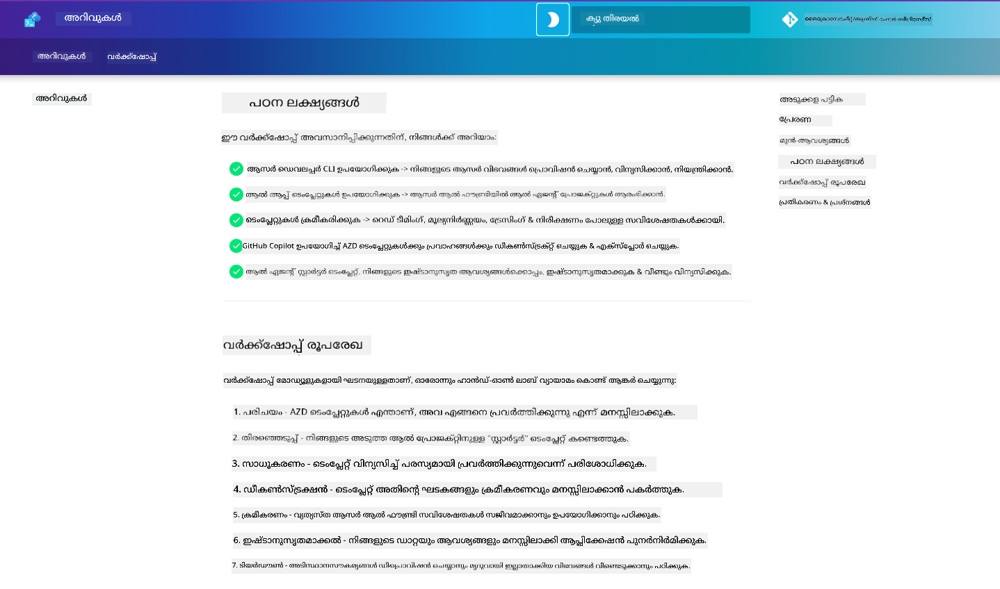

<!--
CO_OP_TRANSLATOR_METADATA:
{
  "original_hash": "390da1a5d0feb705fa0eb9940f6f3b27",
  "translation_date": "2025-11-24T22:18:59+00:00",
  "source_file": "workshop/README.md",
  "language_code": "ml"
}
-->
<div align="center">
  <div style="background: linear-gradient(135deg, #ff6b35, #f7931e); border-radius: 10px; padding: 20px; margin: 20px 0; box-shadow: 0 4px 15px rgba(255, 107, 53, 0.3); border: 2px solid #e55a2b;">
    <h2 style="color: white; margin: 0; font-size: 24px; text-shadow: 1px 1px 2px rgba(0,0,0,0.3);">
      🚧 വർക്ക്‌ഷോപ്പ് നിർമ്മാണത്തിലുണ്ട് 🚧
    </h2>
    <p style="color: white; margin: 10px 0 0 0; font-size: 16px; text-shadow: 1px 1px 2px rgba(0,0,0,0.3);">
      <strong>ഈ വർക്ക്‌ഷോപ്പ് ഇപ്പോൾ സജീവമായി വികസിപ്പിക്കപ്പെടുന്നു.</strong><br>
      ഉള്ളടക്കം അപൂർണ്ണമായിരിക്കാം അല്ലെങ്കിൽ മാറ്റങ്ങൾ വരുത്തിയേക്കാം. അപ്‌ഡേറ്റുകൾക്കായി ഉടൻ തിരികെ വരൂ!
    </p>
    <div style="margin-top: 15px;">
      <span style="background: rgba(255,255,255,0.2); padding: 5px 10px; border-radius: 15px; color: white; font-size: 14px;">
        📅 അവസാനമായി അപ്‌ഡേറ്റ് ചെയ്തത്: ഒക്ടോബർ 2025
      </span>
    </div>
  </div>
</div>

# AZD for AI Developers Workshop

Azure Developer CLI (AZD) ഉപയോഗിച്ച് AI ആപ്ലിക്കേഷൻ ഡിപ്ലോയ്‌മെന്റിൽ ശ്രദ്ധ കേന്ദ്രീകരിച്ച് പഠിക്കുന്നതിനുള്ള ഹാൻഡ്‌സ്-ഓൺ വർക്ക്‌ഷോപ്പിലേക്ക് സ്വാഗതം. AZD ടെംപ്ലേറ്റുകൾ 3 ഘട്ടങ്ങളിൽ പ്രായോഗികമായി മനസ്സിലാക്കാൻ ഈ വർക്ക്‌ഷോപ്പ് നിങ്ങളെ സഹായിക്കുന്നു:

1. **ഡിസ്കവറി** - നിങ്ങളുടെ ആവശ്യത്തിന് അനുയോജ്യമായ ടെംപ്ലേറ്റ് കണ്ടെത്തുക.
1. **ഡിപ്ലോയ്‌മെന്റ്** - ഡിപ്ലോയ് ചെയ്യുക, അത് പ്രവർത്തിക്കുന്നുണ്ടെന്ന് സ്ഥിരീകരിക്കുക.
1. **കസ്റ്റമൈസേഷൻ** - അത് നിങ്ങളുടെ ആവശ്യങ്ങൾക്കനുസരിച്ച് മാറ്റം വരുത്തുക!

ഈ വർക്ക്‌ഷോപ്പിന്റെ ദൈർഘ്യമെങ്ങും, ഡെവലപ്പർ ടൂളുകളും വർക്ക്‌ഫ്ലോകളും പരിചയപ്പെടുത്തും, നിങ്ങളുടെ എന്റു-ടു-എൻഡ് ഡെവലപ്പ്‌മെന്റ് യാത്രയെ ലളിതമാക്കാൻ സഹായിക്കുന്നതിനായി.

<br/>

## ബ്രൗസർ-അടിസ്ഥാനത്തിലുള്ള ഗൈഡ്

വർക്ക്‌ഷോപ്പ് പാഠങ്ങൾ Markdown-ൽ ഉണ്ട്. നിങ്ങൾക്ക് GitHub-ൽ നേരിട്ട് അവ നാവിഗേറ്റ് ചെയ്യാം - അല്ലെങ്കിൽ താഴെ കാണുന്ന സ്ക്രീൻഷോട്ട് പോലെ ഒരു ബ്രൗസർ-അടിസ്ഥാനത്തിലുള്ള പ്രിവ്യൂ ആരംഭിക്കുക.



ഈ ഓപ്ഷൻ ഉപയോഗിക്കാൻ - റിപോസിറ്ററി നിങ്ങളുടെ പ്രൊഫൈലിലേക്ക് ഫോർക്ക് ചെയ്യുക, GitHub Codespaces ആരംഭിക്കുക. VS Code ടെർമിനൽ സജീവമായ ശേഷം, ഈ കമാൻഡ് ടൈപ്പ് ചെയ്യുക:

```bash title="" linenums="0"
mkdocs serve > /dev/null 2>&1 &
```

ചില സെക്കൻഡുകൾക്കുള്ളിൽ, നിങ്ങൾക്ക് ഒരു പോപ്പ്-അപ്പ് ഡയലോഗ് കാണും. `Open in browser` ഓപ്ഷൻ തിരഞ്ഞെടുക്കുക. വെബ്-അടിസ്ഥാനത്തിലുള്ള ഗൈഡ് ഇപ്പോൾ ഒരു പുതിയ ബ്രൗസർ ടാബിൽ തുറക്കും. ഈ പ്രിവ്യൂയുടെ ചില ഗുണങ്ങൾ:

1. **ഇൻബിൽറ്റ് സെർച്ച്** - കീവേഡുകൾ അല്ലെങ്കിൽ പാഠങ്ങൾ വേഗത്തിൽ കണ്ടെത്തുക.
1. **കോഡ്ബ്ലോക്കുകൾ** - കോഡ്ബ്ലോക്കുകൾക്ക് മുകളിൽ ഹോവർ ചെയ്യുമ്പോൾ കോപ്പി ഐക്കൺ കാണുക.
1. **തീം ടോഗിൾ** - ഡാർക്ക്, ലൈറ്റ് തീമുകൾക്കിടയിൽ മാറുക.
1. **സഹായം നേടുക** - ഫൂട്ടറിലെ Discord ഐക്കൺ ക്ലിക്ക് ചെയ്ത് ചേരുക!

<br/>

## വർക്ക്‌ഷോപ്പ് അവലോകനം

**ദൈർഘ്യം:** 3-4 മണിക്കൂർ  
**നില:** തുടക്കക്കാരൻ മുതൽ ഇടത്തരം വരെ  
**മുൻ‌വശങ്ങൾ:** Azure, AI ആശയങ്ങൾ, VS Code & കമാൻഡ്-ലൈൻ ടൂളുകൾ പരിചയമുള്ളത്.

ഇത് ഒരു ഹാൻഡ്‌സ്-ഓൺ വർക്ക്‌ഷോപ്പ് ആണ്, നിങ്ങൾ ചെയ്യുന്നതിലൂടെ പഠിക്കുന്നു. വ്യായാമങ്ങൾ പൂർത്തിയാക്കിയ ശേഷം, സുരക്ഷയും ഉൽപാദനക്ഷമതയും സംബന്ധിച്ച മികച്ച പ്രാക്ടീസുകൾ പഠിക്കാൻ AZD For Beginners പാഠ്യപദ്ധതി അവലോകനം ചെയ്യാൻ ഞങ്ങൾ ശുപാർശ ചെയ്യുന്നു.

| സമയം| മോഡ്യൂൾ  | ലക്ഷ്യം |
|:---|:---|:---|
| 15 മിനിറ്റ് | [പരിചയം](docs/instructions/0-Introduction.md) | ലക്ഷ്യങ്ങൾ മനസ്സിലാക്കുക |
| 30 മിനിറ്റ് | [AI ടെംപ്ലേറ്റ് തിരഞ്ഞെടുക്കുക](docs/instructions/1-Select-AI-Template.md) | ഓപ്ഷനുകൾ പരിശോധിക്കുക, സ്റ്റാർട്ടർ തിരഞ്ഞെടുക്കുക | 
| 30 മിനിറ്റ് | [AI ടെംപ്ലേറ്റ് സ്ഥിരീകരിക്കുക](docs/instructions/2-Validate-AI-Template.md) | ഡിഫോൾട്ട് സൊല്യൂഷൻ Azure-ൽ ഡിപ്ലോയ് ചെയ്യുക |
| 30 മിനിറ്റ് | [AI ടെംപ്ലേറ്റ് ഡീകൺസ്ട്രക്റ്റ് ചെയ്യുക](docs/instructions/3-Deconstruct-AI-Template.md) | ഘടനയും കോൺഫിഗറേഷനും പരിശോധിക്കുക |
| 30 മിനിറ്റ് | [AI ടെംപ്ലേറ്റ് കോൺഫിഗർ ചെയ്യുക](docs/instructions/4-Configure-AI-Template.md) | സവിശേഷതകൾ സജീവമാക്കുക, പരീക്ഷിക്കുക |
| 30 മിനിറ്റ് | [AI ടെംപ്ലേറ്റ് കസ്റ്റമൈസ് ചെയ്യുക](docs/instructions/5-Customize-AI-Template.md) | ടെംപ്ലേറ്റ് നിങ്ങളുടെ ആവശ്യങ്ങൾക്കനുസരിച്ച് മാറ്റുക |
| 30 മിനിറ്റ് | [ഇൻഫ്രാസ്ട്രക്ചർ തകർക്കുക](docs/instructions/6-Teardown-Infrastructure.md) | വൃത്തിയാക്കുക, റിസോഴ്സുകൾ റിലീസ് ചെയ്യുക |
| 15 മിനിറ്റ് | [സമാപനം & അടുത്ത ഘട്ടങ്ങൾ](docs/instructions/7-Wrap-up.md) | പഠന വിഭവങ്ങൾ, വർക്ക്‌ഷോപ്പ് ചലഞ്ച് |

<br/>

## നിങ്ങൾ പഠിക്കുന്നതെന്താണ്?

AZD ടെംപ്ലേറ്റ് Azure AI Foundry-ൽ എന്റു-ടു-എൻഡ് ഡെവലപ്പ്‌മെന്റിനുള്ള വിവിധ ശേഷികളും ടൂളുകളും പരിശോധിക്കാൻ ഒരു പഠന സാൻഡ്‌ബോക്സ് ആയി കരുതുക. വർക്ക്‌ഷോപ്പ് അവസാനത്തോടുകൂടി, ഈ സാഹചര്യത്തിൽ വിവിധ ടൂളുകളും ആശയങ്ങളും സംബന്ധിച്ച് ഒരു സ്വാഭാവിക ബോധം നിങ്ങൾക്ക് ഉണ്ടായിരിക്കണം.

| ആശയം  | ലക്ഷ്യം |
|:---|:---|
| **Azure Developer CLI** | ടൂൾ കമാൻഡുകളും വർക്ക്‌ഫ്ലോകളും മനസ്സിലാക്കുക|
| **AZD ടെംപ്ലേറ്റുകൾ**| പ്രോജക്റ്റ് ഘടനയും കോൺഫിഗറേഷനും മനസ്സിലാക്കുക|
| **Azure AI ഏജന്റ്**| Azure AI Foundry പ്രോജക്റ്റ് പ്രൊവിഷൻ & ഡിപ്ലോയ് ചെയ്യുക |
| **Azure AI സെർച്ച്**| ഏജന്റുകളുമായി കോൺടെക്സ്റ്റ് എഞ്ചിനീയറിംഗ് സജീവമാക്കുക |
| **ഓബ്സർവബിലിറ്റി**| ട്രേസിംഗ്, മോണിറ്ററിംഗ്, മൂല്യനിർണയങ്ങൾ പരിശോധിക്കുക |
| **റെഡ് ടീമിംഗ്**| എഡ്വേഴ്സറിയൽ ടെസ്റ്റിംഗ്, പരിഹാരങ്ങൾ പരിശോധിക്കുക |

<br/>

## വർക്ക്‌ഷോപ്പ് ഘടന

ടെംപ്ലേറ്റ് കണ്ടെത്തൽ മുതൽ ഡിപ്ലോയ്‌മെന്റ്, ഡീകൺസ്ട്രക്ഷൻ, കസ്റ്റമൈസേഷൻ വരെ ഒരു യാത്രയിലേക്ക് നിങ്ങളെ കൊണ്ടുപോകാൻ വർക്ക്‌ഷോപ്പ് രൂപകൽപ്പന ചെയ്തിരിക്കുന്നു - ഔദ്യോഗിക [Getting Started with AI Agents](https://github.com/Azure-Samples/get-started-with-ai-agents) സ്റ്റാർട്ടർ ടെംപ്ലേറ്റ് അടിസ്ഥാനമാക്കി.

### [മോഡ്യൂൾ 1: AI ടെംപ്ലേറ്റ് തിരഞ്ഞെടുക്കുക](docs/instructions/1-Select-AI-Template.md) (30 മിനിറ്റ്)

- AI ടെംപ്ലേറ്റുകൾ എന്താണ്?
- എവിടെ AI ടെംപ്ലേറ്റുകൾ കണ്ടെത്താം?
- AI ഏജന്റുകൾ നിർമ്മിക്കാൻ എങ്ങനെ ആരംഭിക്കാം?
- **ലാബ്**: GitHub Codespaces ഉപയോഗിച്ച് ക്വിക്‌സ്റ്റാർട്ട്

### [മോഡ്യൂൾ 2: AI ടെംപ്ലേറ്റ് സ്ഥിരീകരിക്കുക](docs/instructions/2-Validate-AI-Template.md) (30 മിനിറ്റ്)

- AI ടെംപ്ലേറ്റ് ആർക്കിടെക്ചർ എന്താണ്?
- AZD ഡെവലപ്പ്‌മെന്റ് വർക്ക്‌ഫ്ലോ എന്താണ്?
- AZD ഡെവലപ്പ്‌മെന്റിൽ എങ്ങനെ സഹായം നേടാം?
- **ലാബ്**: AI ഏജന്റുകൾ ടെംപ്ലേറ്റ് ഡിപ്ലോയ് & സ്ഥിരീകരിക്കുക

### [മോഡ്യൂൾ 3: AI ടെംപ്ലേറ്റ് ഡീകൺസ്ട്രക്റ്റ് ചെയ്യുക](docs/instructions/3-Deconstruct-AI-Template.md) (30 മിനിറ്റ്)

- `.azure/`-ൽ നിങ്ങളുടെ പരിസ്ഥിതി പരിശോധിക്കുക 
- `infra/`-ൽ നിങ്ങളുടെ റിസോഴ്സ് സജ്ജീകരണം പരിശോധിക്കുക 
- `azure.yaml`-ൽ AZD കോൺഫിഗറേഷൻ പരിശോധിക്കുക
- **ലാബ്**: പരിസ്ഥിതി വേരിയബിളുകൾ മാറ്റുക & വീണ്ടും ഡിപ്ലോയ് ചെയ്യുക

### [മോഡ്യൂൾ 4: AI ടെംപ്ലേറ്റ് കോൺഫിഗർ ചെയ്യുക](docs/instructions/4-Configure-AI-Template.md) (30 മിനിറ്റ്)
- പരിശോധിക്കുക: Retrieval Augmented Generation
- പരിശോധിക്കുക: ഏജന്റ് മൂല്യനിർണയം & റെഡ് ടീമിംഗ്
- പരിശോധിക്കുക: ട്രേസിംഗ് & മോണിറ്ററിംഗ്
- **ലാബ്**: AI ഏജന്റ് + ഓബ്സർവബിലിറ്റി പരിശോധിക്കുക 

### [മോഡ്യൂൾ 5: AI ടെംപ്ലേറ്റ് കസ്റ്റമൈസ് ചെയ്യുക](docs/instructions/5-Customize-AI-Template.md) (30 മിനിറ്റ്)
- നിർവചിക്കുക: സീനാരിയോ ആവശ്യകതകളുമായി PRD
- കോൺഫിഗർ ചെയ്യുക: AZD പരിസ്ഥിതി വേരിയബിളുകൾ
- നടപ്പാക്കുക: അധിക ടാസ്കുകൾക്കുള്ള ലൈഫ്സൈക്കിൾ ഹുക്കുകൾ
- **ലാബ്**: എന്റെ സീനാരിയോയ്ക്ക് അനുയോജ്യമായ ടെംപ്ലേറ്റ് കസ്റ്റമൈസ് ചെയ്യുക

### [മോഡ്യൂൾ 6: ഇൻഫ്രാസ്ട്രക്ചർ തകർക്കുക](docs/instructions/6-Teardown-Infrastructure.md) (30 മിനിറ്റ്)
- റികാപ്: AZD ടെംപ്ലേറ്റുകൾ എന്താണ്?
- റികാപ്: Azure Developer CLI ഉപയോഗിക്കുന്നതിന്റെ പ്രാധാന്യം
- അടുത്ത ഘട്ടങ്ങൾ: മറ്റൊരു ടെംപ്ലേറ്റ് പരീക്ഷിക്കുക!
- **ലാബ്**: ഇൻഫ്രാസ്ട്രക്ചർ ഡീപ്രൊവിഷൻ ചെയ്യുക & വൃത്തിയാക്കുക

<br/>

## വർക്ക്‌ഷോപ്പ് ചലഞ്ച്

കൂടുതൽ ചെയ്യാൻ നിങ്ങൾക്ക് വെല്ലുവിളി ചെയ്യണോ? ഇവിടെ ചില പ്രോജക്റ്റ് നിർദ്ദേശങ്ങൾ ഉണ്ട് - അല്ലെങ്കിൽ നിങ്ങളുടെ ആശയങ്ങൾ ഞങ്ങളുമായി പങ്കിടൂ!!

| പ്രോജക്റ്റ് | വിവരണം |
|:---|:---|
|1. **ഒരു സങ്കീർണ്ണ AI ടെംപ്ലേറ്റ് ഡീകൺസ്ട്രക്റ്റ് ചെയ്യുക** | ഞങ്ങൾ വിശദീകരിച്ച വർക്ക്‌ഫ്ലോയും ടൂളുകളും ഉപയോഗിച്ച് മറ്റൊരു AI സൊല്യൂഷൻ ടെംപ്ലേറ്റ് ഡിപ്ലോയ്, സ്ഥിരീകരിക്കുക, കസ്റ്റമൈസ് ചെയ്യുക. _നിങ്ങൾ എന്താണ് പഠിച്ചത്?_|
|2. **നിങ്ങളുടെ സീനാരിയോ ഉപയോഗിച്ച് കസ്റ്റമൈസ് ചെയ്യുക**  | മറ്റൊരു സീനാരിയോയ്ക്ക് PRD (Product Requirements Document) എഴുതാൻ ശ്രമിക്കുക. GitHub Copilot ഉപയോഗിച്ച് നിങ്ങളുടെ ടെംപ്ലേറ്റ് റിപോയിൽ Agent Model-ൽ - കസ്റ്റമൈസേഷൻ വർക്ക്‌ഫ്ലോ സൃഷ്ടിക്കാൻ അത് ചോദിക്കുക. _നിങ്ങൾ എന്താണ് പഠിച്ചത്? ഈ നിർദ്ദേശങ്ങൾ എങ്ങനെ മെച്ചപ്പെടുത്താം?_|
| | |

## അഭിപ്രായങ്ങൾ ഉണ്ടോ?

1. ഈ റിപോയിൽ ഒരു ഇഷ്യൂ പോസ്റ്റ് ചെയ്യുക - `Workshop` ടാഗ് ചെയ്യുക.
1. Azure AI Foundry Discord-ൽ ചേരുക - നിങ്ങളുടെ കൂട്ടുകാരുമായി ബന്ധപ്പെടുക!


| | | 
|:---|:---|
| **📚 കോഴ്സ് ഹോം**| [AZD For Beginners](../README.md)|
| **📖 ഡോക്യുമെന്റേഷൻ** | [AI ടെംപ്ലേറ്റുകൾ ഉപയോഗിച്ച് ആരംഭിക്കുക](https://learn.microsoft.com/en-us/azure/ai-foundry/how-to/develop/ai-template-get-started)|
| **🛠️AI ടെംപ്ലേറ്റുകൾ** | [Azure AI Foundry Templates](https://ai.azure.com/templates) |
|**🚀 അടുത്ത ഘട്ടങ്ങൾ** | [ചലഞ്ച് സ്വീകരിക്കുക](../../../workshop) |
| | |

<br/>

---

**മുൻപ്:** [AI Troubleshooting Guide](../docs/troubleshooting/ai-troubleshooting.md) | **അടുത്തത്:** [ലാബ് 1: AZD അടിസ്ഥാനങ്ങൾ](../../../workshop/lab-1-azd-basics)

**AZD ഉപയോഗിച്ച് AI ആപ്ലിക്കേഷനുകൾ നിർമ്മിക്കാൻ തയ്യാറാണോ?**

[ലാബ് 1: AZD Foundations →](./lab-1-azd-basics/README.md)

---

<!-- CO-OP TRANSLATOR DISCLAIMER START -->
**അറിയിപ്പ്**:  
ഈ രേഖ AI വിവർത്തന സേവനമായ [Co-op Translator](https://github.com/Azure/co-op-translator) ഉപയോഗിച്ച് വിവർത്തനം ചെയ്തതാണ്. ഞങ്ങൾ കൃത്യതയ്ക്കായി ശ്രമിക്കുന്നുവെങ്കിലും, ഓട്ടോമേറ്റഡ് വിവർത്തനങ്ങളിൽ പിഴവുകൾ അല്ലെങ്കിൽ തെറ്റായ വിവരങ്ങൾ ഉണ്ടാകാൻ സാധ്യതയുണ്ട്. അതിന്റെ സ്വാഭാവിക ഭാഷയിലുള്ള മൗലിക രേഖ പ്രാമാണികമായ ഉറവിടമായി പരിഗണിക്കണം. നിർണായകമായ വിവരങ്ങൾക്ക്, പ്രൊഫഷണൽ മനുഷ്യ വിവർത്തനം ശുപാർശ ചെയ്യുന്നു. ഈ വിവർത്തനം ഉപയോഗിച്ച് ഉണ്ടാകുന്ന തെറ്റിദ്ധാരണകൾ അല്ലെങ്കിൽ തെറ്റായ വ്യാഖ്യാനങ്ങൾക്കായി ഞങ്ങൾ ഉത്തരവാദികളല്ല.
<!-- CO-OP TRANSLATOR DISCLAIMER END -->