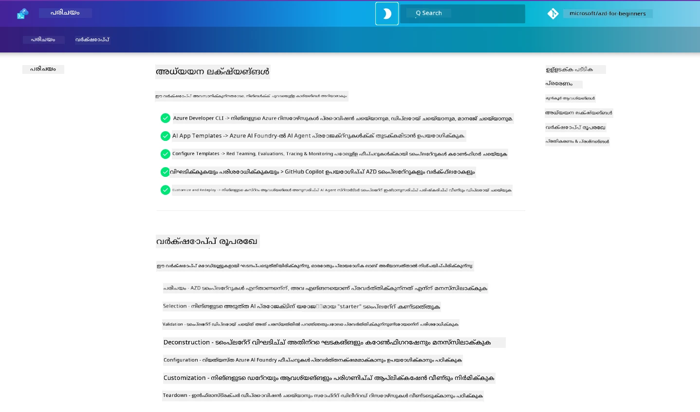

<div align="center">
  <div style="background: linear-gradient(135deg, #0078d4, #106ebe); border-radius: 10px; padding: 20px; margin: 20px 0; box-shadow: 0 4px 15px rgba(0, 120, 212, 0.3); border: 2px solid #005a9e;">
    <h2 style="color: white; margin: 0; font-size: 24px; text-shadow: 1px 1px 2px rgba(0,0,0,0.3);">
      🎯 AI വികസപകർക്ക് предназнач workshop
    </h2>
    <p style="color: white; margin: 10px 0 0 0; font-size: 16px; text-shadow: 1px 1px 2px rgba(0,0,0,0.3);">
      <strong>Azure Developer CLI ഉപയോഗിച്ച് AI അപ്ലിക്കേഷനുകൾ നിർമ്മിക്കുന്നതിനായുള്ള പ്രായോഗിക വർക്‌ഷോപ്പ്.</strong><br>
      AZD ടെംപ്ലേറ്റുകളും AI വിന്യാസ പ്രവൃത്തിപദ്ധതികളും പ്രാവർത്തികമാക്കാൻ 7 മോഡ്യൂളുകൾ പൂർത്തിയാക്കുക.
    </p>
    <div style="margin-top: 15px;">
      <span style="background: rgba(255,255,255,0.2); padding: 5px 10px; border-radius: 15px; color: white; font-size: 14px;">
        📅 അവസാന അപ്ഡേറ്റ് ചെയ്തത്: മാർച്ച് 2026
      </span>
    </div>
  </div>
</div>

# AI വികസപകർക്ക് предназнач workshop

AI അപ്ലിക്കേഷൻ വിന്യാസത്തിൽ കേന്ദ്രീകരിച്ച് Azure Developer CLI (AZD) പഠിക്കുന്നതിനായുള്ള പ്രായോഗിക വർക്‌ഷോപ്പിലേക്ക് സ്വാഗതം. ഈ വർക്‌ഷോപ്പ് AZD ടെംപ്ലേറ്റുകൾ 3 പടികളിൽ പ്രയോഗപരമായി മനസ്സിലാക്കാൻ സഹായിക്കുന്നു:

1. **അന്വേഷണം** - നിങ്ങളെത്തക്കുള്ള അനുയോജ്യമായ ടെംപ്ലേറ്റ് കണ്ടെത്തുക.
1. **വിന്യാസം** - വിന്യസിച്ച് അത് പ്രവർത്തിക്കുന്നതായി സ്ഥിരീകരിക്കുക
1. **ഇരുപക്ഷീയമാക്കൽ** - ഫറിർത്തും മാറ്റിയും നിങ്ങളുടെ സ്വഭാവമാക്കുക!

ഈ വർക്‌ഷോപ്പിന്റെ ընթացքում നിങ്ങൾ പ്രധാന ഡെവലപ്പറിന്റെ ഉപകരണങ്ങളെയും പ്രവൃത്തിപദ്ധതികളെയും പരിചയപ്പെടും, നിങ്ങളുടെ ആനുബന്ധ വികസനയാത്ര സുഗമമാക്കാൻ.

<br/>

## ബ്രushaർ അടിസ്ഥാനമായ മാർഗ്ഗനിർദേശം

വർക്‌ഷോപ്പ് പാഠങ്ങൾ മാർക്‌ഡൗണിൽ ആണ്. നിങ്ങൾക്ക് അവ നേരിട്ട് GitHub-ല്‍ കാണാം - അല്ലെങ്കിൽ താഴെ കാണിക്കുന്ന സ്ക്രീൻഷോട്ട് പോലെ ബ്രൗസർ അടിസ്ഥാന പ്രിവ്യൂ തുടങ്ങാം.



ഈ ഓപ്ഷൻ ഉപയോഗിക്കാൻ - റിപ്പോസിറ്ററി നിങ്ങളുടെ പ്രൊഫൈലിലേക്ക് ഫോർക്ക് ചെയ്ത് GitHub Codespaces ആരംഭിക്കൂ. VS Code ടെർമിനൽ പ്രവർത്തനക്ഷമമാകുമ്പോൾ, ഈ കമാൻഡ് ടൈപ്പുചെയ്യുക:

ഈ ബ്രൗസർ പ്രിവ്യൂ GitHub Codespaces, ഡെവ് കണ്ടെയിനറുകൾ, അല്ലെങ്കിൽ Python, MkDocs ഇൻസ്റ്റാൾ ചെയ്ത ഒരു ലോകൽ ക്ലോൺ എന്നിവയിൽ പ്രവർത്തിക്കുന്നു.

```bash title="" linenums="0"
mkdocs serve > /dev/null 2>&1 &
```

കുറച്ചു സെക്കൻഡുകളിൽ ഒരു പాప్-അപ്പ് ഡയലോഗ് ദൃശ്യമാകും. `Open in browser` ഓപ്ഷൻ തിരഞ്ഞെടുക്കുക. വെബ് അടിസ്ഥാനമുള്ള മാർഗ്ഗനിർദേശം ഇനി പുതിയ ബ്രൗസർ ടാബിൽ തുറക്കും. ഈ പ്രിവ്യുവിന്റെ ചില ഗുണങ്ങൾ:

1. **നിർമിതമായ തിരയൽ** - കീ-വാക്കുകളും പാഠങ്ങളും എളുപ്പത്തിൽ കണ്ടെത്തുക.
1. **കോപി ഐക്കൺ** - കോഡ് ബ്ലോക്കുകളുടെ മുകളിൽ ഹോവർ ചെയ്താൽ കാണാം
1. **തീം ഫോർക്കൽ** - ഇരുണ്ടതും വെളുത്തതുമായ തീമുകൾ арасында മാറുക
1. **സഹായം നേടുക** - അടിക്കുറിപ്പിൽ ഡിസ്‌കോർഡ് ഐക്കണിൽ ക്ലിക്ക് ചെയ്ത് ചേരുക!

<br/>

## വർക്‌ഷോപ്പ് പരിചയം

**സ്വയംപ്രവർത്തന സമയം:** 3-4 മണിക്കൂർ  
**പട്ടം:** തുടക്കം മുതൽ മദ്ധ്യം വരെ  
**മുൻകൂട്ടി ലഭ്യമാക്കേണ്ടത്:** Azure, AI ആശയങ്ങൾ, VS Code & കമാൻഡ്-ലൈൻ ഉപകരണങ്ങളെ പരിചയമുണ്ടായിരിക്കുക.

നിങ്ങൾ ചെയ്യുന്നതുകൊണ്ട് പഠിക്കുന്ന ഒരു പ്രായോഗിക വർക്‌ഷോപ്പാണ് ഇത്. ചുവടെ പ<Abstracted paragraph lengths to comply with instructions>ൻതിച്ച ശേഷം, AZD For Beginners പരിശീലനം പരിശോധിച്ച് നിങ്ങളുടെ സുരക്ഷയും ഉത്പാദനക്ഷമതയും മെച്ചപ്പെടുത്താനുള്ള പഠനം തുടരാൻ ഞങ്ങൾക്ക് ശുപാർശ.

| സമയം| മോഡ്യൂള്‍  | ലക്ഷ്യം |
|:---|:---|:---|
| 15 മിനിറ്റ് | [ആമുഖം](docs/instructions/0-Introduction.md) | സാഹചര്യമൊർപ്പിക്കുക, ലക്ഷ്യങ്ങൾ മനസിലാക്കുക |
| 30 മിനിറ്റ് | [AI ടെംപ്ലേറ്റ് തിരഞ്ഞെടുക്കുക](docs/instructions/1-Select-AI-Template.md) | ഓപ്ഷനുകൾ അന്വേഷിച്ച് ആരംഭിക്കൂ | 
| 30 മിനിറ്റ് | [AI ടെംപ്ലേറ്റ് പരിശോധന](docs/instructions/2-Validate-AI-Template.md) | ഡിഫോൾട്ട് പരിഹാരം Azure-ൽ വിന്യാസം ചെയ്യുക |
| 30 മിനിറ്റ് | [AI ടെംപ്ലേറ്റ് പൊളിക്കുക](docs/instructions/3-Deconstruct-AI-Template.md) | ഘടനയും കോൺഫിഗറും പരിശോധിക്കുക |
| 30 മിനിറ്റ് | [AI ടെംപ്ലേറ്റ് കോൺഫിഗർ ചെയ്യുക](docs/instructions/4-Configure-AI-Template.md) | ലഭ്യമായ ഫീച്ചറുകൾ സജീവമാക്കി പരീക്ഷിക്കുക |
| 30 മിനിറ്റ് | [AI ടെംപ്ലേറ്റ് ഇഷ്‌ടാനുസൃതമാക്കുക](docs/instructions/5-Customize-AI-Template.md) | ടെംപ്ലേറ്റ് നിങ്ങളുടെ ആവശ്യങ്ങൾക്കനുസരിച്ചു മാറ്റുക |
| 30 മിനിറ്റ് | [അവസാന സൗകര്യം നീക്കം ചെയ്യുക](docs/instructions/6-Teardown-Infrastructure.md) | ശുചീകരണവും റിലീസ് ചെയ്‌തും ചെയ്യുക |
| 15 മിനിറ്റ് | [സംഗ്രഹം & അടുത്ത ചുവടുകൾ](docs/instructions/7-Wrap-up.md) | പഠന വിഭവങ്ങളും വർക്‌ഷോപ്പ് ചലഞ്ചും |

<br/>

## നിങ്ങൾ പഠിക്കുന്നതെന്താണ്

AZD ടെംപ്ലേറ്റ് എന്നത് Microsoft Foundry-ൽ end-to-end വികസനത്തിന് വിവിധ കഴിവുകളും ഉപകരണങ്ങളും പരീക്ഷിക്കാൻ പഠന സാങ്‌ബോക്സായി ചിന്തിക്കാം. ഈ വർക്‌ഷോപ്പ് അവസാനം, ഈ പ്രസ്താവനയിൽ ഉള്ള სხვადასხვა ടൂളുകളുടെയും ആശയങ്ങളുടെയും കൂടുതല്‍ അവബോധമുണ്ടാകും.

| ആശയം  | ലക്ഷ്യം |
|:---|:---|
| **Azure Developer CLI** | ഉപകരണം കമാൻഡുകളും പ്രവൃത്തിപദ്ധതികളെയും മനസ്സിലാക്കുക|
| **AZD ടെംപ്ലേറ്റുകൾ**| പ്രോജക്ട് ഘടനയും കോൺഫിഗറേഷനും മനസ്സിലാക്കുക|
| **Azure AI ഏജന്റ്**| Microsoft Foundry പ്രോജക്ട് അനുവദിക്കുകയും വിന്യാസം ചെയ്യുക  |
| **Azure AI സേർച്ച്**| ഏജന്റുമാരോടൊപ്പം ബന്ധമായ എഞ്ചിനീയറിങ് സജ്ജമാക്കുക |
| **പ്രവചനശേഷിപ്പ്**| ട്രേസിങ്, നിരീക്ഷണം, വിലയിരുത്തലുകൾ പരിശോധിക്കുക |
| **റെഡ് ടീം**| എതിരാളിത്ത പരിശോധനയും പരിഹാരങ്ങളും പഠിക്കുക |

<br/>

## വർക്‌ഷോപ്പ് ഘടന

വർക്‌ഷോപ്പ് ടെംപ്ലേറ്റ് കണ്ടെത്തുന്നതിൽ നിന്നും, വിന്യാസം, പൊളിക്കൽ, ഇഷ്‌ടാനുസൃതമാക്കൽ വരെ യാത്ര എത്തിച്ചടുക്കുന്നതാണ് - ഔദ്യോഗിക [Getting Started with AI Agents](https://github.com/Azure-Samples/get-started-with-ai-agents) സ്റ്റാർട്ടർ ടെംപ്ലേറ്റ് അടിസ്ഥാനമാക്കിയാണ്.

### [മോഡ്യൂൾ 1: AI ടെംപ്ലേറ്റ് തിരഞ്ഞെടുക്കുക](docs/instructions/1-Select-AI-Template.md) (30 മിനിറ്റ്)

- AI ടെംപ്ലേറ്റുകൾ എന്തൊക്കെയാണ്?
- എവിടെ AI ടെംപ്ലേറ്റുകൾ കാണാം?
- AI ഏജന്റുകൾ എങ്ങനെ നിർമാണം തുടങ്ങാം?
- **ലാബ്**: Codespaces അല്ലെങ്കിൽ ഡെവ് കണ്ടെയിനറിൽ ക്വിക്‌സ്റ്റാർട്ട്

### [മോഡ്യൂൾ 2: AI ടെംപ്ലേറ്റ് പരിശോധന](docs/instructions/2-Validate-AI-Template.md) (30 മിനിറ്റ്)

- AI ടെംപ്ലേറ്റ് ആർക്കിടെക്ചർ എന്താണ്?
- AZD വികസന പ്രവൃത്തിപദ്ധതി എന്ത്?
- AZD വികസനത്തിൽ എങ്ങനെ സഹായം ലഭിക്കും?
- **ലാബ്**: AI ഏജന്റുകൾ ടെംപ്ലേറ്റ് വിന്യാസവും പരിശോധനയും

### [മോഡ്യൂൾ 3: AI ടെംപ്ലേറ്റ് പൊളിക്കൽ](docs/instructions/3-Deconstruct-AI-Template.md) (30 മിനിറ്റ്)

- `.azure/` -ൽ പരിതസ്ഥിതിയെ പരിശോധിക്കുക
- `infra/` -ൽ സ്രോതസ്സുകളെ പരിശോധന ചെയ്യുക
- `azure.yaml`-കളിലെ AZD കോൺഫിഗറേഷൻ പരിശോധിക്കുക
- **ലാബ്**: പരിതസ്ഥിതി മാറ്റുകയും വീണ്ടും വിന്യസിക്കുകയും ചെയ്യുക

### [മോഡ്യൂൾ 4: AI ടെംപ്ലേറ്റ് കോൺഫിഗർ ചെയ്യുക](docs/instructions/4-Configure-AI-Template.md) (30 മിനിറ്റ്)
- പരിശോധിക്കുക: Retrieval Augmented Generation
- പരിശോധിക്കുക: ഏജന്റ് വിലയിരുത്തൽ & റെഡ് ടീം
- കൂടുതൽ പരിശോധിക്കുക: ട്രേസിംഗ് & നിരീക്ഷണം
- **ലാബ്**: AI ഏജന്റ് + പ്രവചനശേഷിപ്പിന്റെ പരിശോധനം

### [മോഡ്യൂൾ 5: AI ടെംപ്ലേറ്റ് ഇഷ്‌ടാനുസൃതമാക്കുക](docs/instructions/5-Customize-AI-Template.md) (30 മിനിറ്റ്)
- നിർവചിക്കുക: PRD ന്റെ സീനാരിയോ ആവശ്യങ്ങൾ
- കോൺഫിഗർ ചെയ്യുക: AZD-യുടെ പരിതസ്ഥിതി വേരിയബിളുകൾ
- നടപ്പിലാക്കുക: കൂട്ടിച്ചേർക്കപ്പെട്ട ടാസ്കുകൾക്കുള്ള ലൈഫ്സൈകാല വ്യൂഹങ്ങൾ
- **ലാബ്**: എന്റെ സീനാരിയോക്ക് അനുയോജ്യമായി ടെംപ്ലേറ്റ് ഇഷ്‌ടാനുസൃതമാക്കുക

### [മോഡ്യൂൾ 6: സൗകര്യം നീക്കംചെയ്യുക](docs/instructions/6-Teardown-Infrastructure.md) (30 മിനിറ്റ്)
- ഓർമ്മപ്പെടുത്തൽ: AZD ടെംപ്ലേറ്റുകൾ എന്തൊക്കെയാണ്?
- ഓർമ്മപ്പെടുത്തൽ: Azure Developer CLI ഉപയോഗിക്കുന്നതിന്റെ പ്രാധാന്യം
- അടുത്ത ചുവടുകൾ: വ്യത്യസ്ത ടെംപ്ലേറ്റ് പരീക്ഷിച്ച് കാണുക!
- **ലാബ്**: സൗകര്യമിന അപ്രതിരോധം നടത്തി ശുചീകരണം

<br/>

## വർക്‌ഷോപ്പ് ചലഞ്ച്

കൂടുതൽ ചെയ്യാൻ നിങ്ങൾക്ക് തന്നെ വെല്ലുവിളി വേണ്ടേ? ഇവിടെ ചില പ്രോജക്ട് നിർദ്ദേശങ്ങളുണ്ട് - അല്ലെങ്കിൽ നിങ്ങളുടെ ആശയങ്ങൾ ഞങ്ങളോടൊത്ത് പങ്കിടൂ!!

| പ്രോജക്ട് | വിവരണം |
|:---|:---|
|1. **ഒരു സങ്കീർണ്ണമായ AI ടെംപ്ലേറ്റ് പൊളിക്കുക** | നാം രേഖപ്പെടുത്തിയ പ്രവൃത്തിപദ്ധതി ഉപകരണങ്ങൾ ഉപയോഗിച്ച് മറ്റൊരു AI പരിഹാരം ടെംപ്ലേറ്റ് വിന്യാസം, പരിശോധന, ഇഷ്‌ടാനുസൃതമാക്കൽ ചെയ്യാമോ എന്ന് പരീക്ഷിക്കുക. _നിങ്ങൾ എന്ത് പഠിച്ചു?_|
|2. **നിങ്ങളുടെ സീനാരിയോയ്ക്ക് ഇഷ്‌ടാനുസൃതമാക്കുക**  | വ്യത്യസ്തമായ ഒരു സീനാരിയോവുമായി PRD (ഉൽപ്പന്ന ആവശ്യകതാ രേഖ) എഴുതാൻ ശ്രമിക്കുക. പിന്നീട് GitHub Copilot-നെ നിങ്ങളുടെ ടെംപ്ലേറ്റ് റിപ്പോയിൽ Agent Model-ൽ ഉപയോഗിക്കുക, ഇഷ്ടാനുസൃതമാക്കൽ പ്രവൃത്തി പ്രവാഹം സൃഷ്ടിക്കാൻ ആവശ്യപ്പെടുക. _നിങ്ങൾ എന്ത് പഠിച്ചു? ഈ നിർദ്ദേശങ്ങളിൽ എങ്ങനെ മെച്ചപ്പെടുത്താം?_|
| | |

## പ്രതികരണം ഉണ്ടോ?

1. ഈ റിപ്പോസിറ്ററിയിൽ ഒരു ഇഷ്യൂ പോസ്റ്റ് ചെയ്ത് - സൌജ്യം നല്കാൻ `Workshop` ടാഗ് ചേർക്കുക.
1. Microsoft Foundry Discord-ൽ ചേരുക - നിങ്ങളുടെ കൂട്ടുകാരുമായി ബന്ധപ്പെടുക!


| | | 
|:---|:---|
| **📚 കോഴ്സ് ഹോം**| [AZD ആരംഭിക്കുന്നവർക്ക്](../README.md)|
| **📖 ഡോക്യുമെന്റേഷൻ** | [AI ടെംപ്ലേറ്റുകളുമായി തുടങ്ങാം](https://learn.microsoft.com/en-us/azure/ai-foundry/how-to/develop/ai-template-get-started)|
| **🛠️AI ടെംപ്ലേറ്റുകൾ** | [Microsoft Foundry ടെംപ്ലേറ്റുകൾ](https://ai.azure.com/templates) |
|**🚀 അടുത്ത ചുവടുകൾ** | [വർക്‌ഷോപ്പ് ആരംഭിക്കുക](#വർക്‌ഷോപ്പ്-പരിചയം) |
| | |

<br/>

---

**നാവിഗേഷൻ:** [പ്രധാന കോഴ്‌സ്](../README.md) | [ആമുഖം](docs/instructions/0-Introduction.md) | [മോഡ്യൂൾ 1: ടെംപ്ലേറ്റ് തിരഞ്ഞെടുക്കുക](docs/instructions/1-Select-AI-Template.md)

**AZD ഉപയോഗിച്ച് AI അപ്ലിക്കേഷനുകൾ നിർമ്മിക്കാൻ തുടങ്ങാൻ തയാറായി?**

[വർക്‌ഷോപ്പ് ആരംഭിക്കുക: ആമുഖം →](docs/instructions/0-Introduction.md)

---

<!-- CO-OP TRANSLATOR DISCLAIMER START -->
**വിവരണം**:  
ഈ ഡോക്യുമെന്റ് AI പരിഭാഷാ സേവനമായ [Co-op Translator](https://github.com/Azure/co-op-translator) ഉപയോഗിച്ച് പരിഭാഷ ചെയ്തതാണ്. ഞങ്ങൾ കൃത്യതയ്ക്കായി ശ്രമിച്ചിരിക്കുന്നുവെങ്കിലും, സ്വയംശാസിതമായ പരിഭാഷകളിൽ പിഴവുകൾ അല്ലെങ്കിൽ തർക്കങ്ങൾ ഉണ്ടാകാമെന്നും ദയവായി മനസ്സിലാക്കുക. അതിന്റെ നാടൻ ഭാഷയിലെ യഥാർത്ഥ ഡോക്യുമെന്റ് ഔദ്യോഗിക ഉറവിടമായി കണക്കാക്കണം. നിർണ്ണായക വിവരങ്ങൾക്കായി പ്രൊഫഷണൽ മാനവ പരിഭാഷ ശുപാർശ ചെയ്യപ്പെടുന്നു. ഈ പരിഭാഷ ഉപയോഗിച്ചതിൽ നിന്നുള്ള തെറ്റിദ്ധാരണകൾക്കോ തെറ്റായ വ്യാഖ്യാനങ്ങൾക്കോ ഞങ്ങൾ ഉത്തരവാദികളല്ല.
<!-- CO-OP TRANSLATOR DISCLAIMER END -->