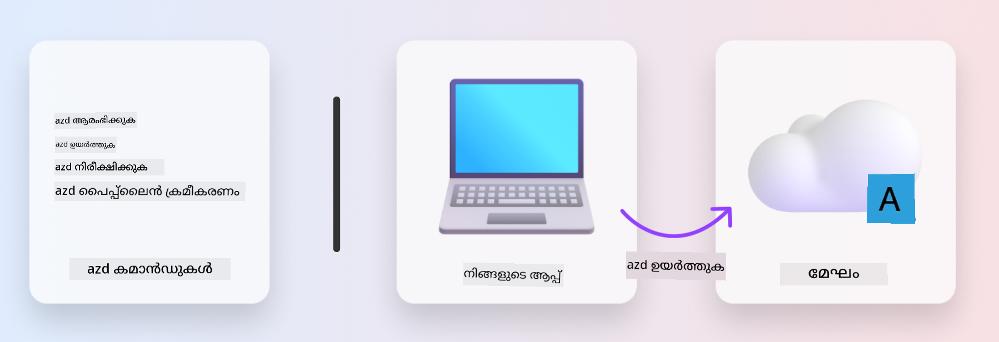
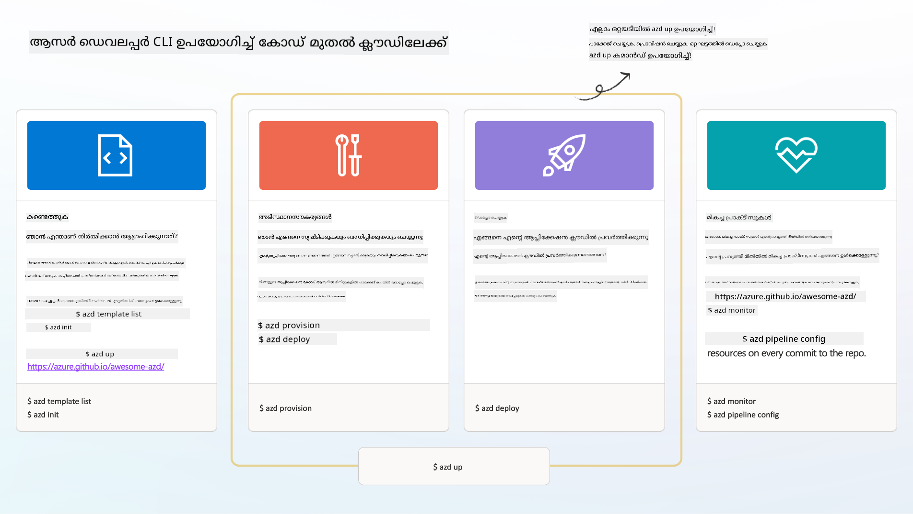

<!--
CO_OP_TRANSLATOR_METADATA:
{
  "original_hash": "06d6207eff634aefcaa41739490a5324",
  "translation_date": "2025-11-24T22:22:22+00:00",
  "source_file": "workshop/docs/instructions/1-Select-AI-Template.md",
  "language_code": "ml"
}
-->
# 1. ഒരു ടെംപ്ലേറ്റ് തിരഞ്ഞെടുക്കുക

!!! tip "ഈ മോഡ്യൂൾ അവസാനിപ്പിക്കുന്നതിന് മുമ്പ് നിങ്ങൾക്ക് കഴിയും"

    - [ ] AZD ടെംപ്ലേറ്റുകൾ എന്താണെന്ന് വിശദീകരിക്കുക
    - [ ] AI-ക്കായി AZD ടെംപ്ലേറ്റുകൾ കണ്ടെത്തുകയും ഉപയോഗിക്കുകയും ചെയ്യുക
    - [ ] AI ഏജന്റുകൾ ടെംപ്ലേറ്റുമായി ആരംഭിക്കുക
    - [ ] **ലാബ് 1:** GitHub Codespaces ഉപയോഗിച്ച് AZD ക്വിക്ക്സ്റ്റാർട്ട്

---

## 1. ഒരു ബിൽഡർ ഉപമ

ആധുനിക എന്റർപ്രൈസ്-റെഡി AI ആപ്ലിക്കേഷൻ _പുതുതായി_ നിർമ്മിക്കുന്നത് ഒരു വലിയ വെല്ലുവിളിയാണ്. ഇത് നിങ്ങളുടെ പുതിയ വീട് ഇഷ്ടാനുസൃതമായി ഓരോ ഇഷ്ടികയും ചേർത്ത് നിർമ്മിക്കുന്നതുപോലെയാണ്. അതെ, ഇത് ചെയ്യാൻ കഴിയും! പക്ഷേ, നിങ്ങൾ ആഗ്രഹിക്കുന്ന ഫലത്തെ നേടാനുള്ള ഏറ്റവും ഫലപ്രദമായ മാർഗം അല്ല!

പകരം, നാം സാധാരണയായി നിലവിലുള്ള _ഡിസൈൻ ബ്ലൂപ്രിന്റ്_ ഉപയോഗിച്ച് ആരംഭിക്കുന്നു, അത് ഞങ്ങളുടെ വ്യക്തിഗത ആവശ്യങ്ങൾക്കനുസരിച്ച് ഇഷ്ടാനുസൃതമാക്കാൻ ഒരു ആർക്കിടെക്റ്റുമായി പ്രവർത്തിക്കുന്നു. ബുദ്ധിമാനായ ആപ്ലിക്കേഷനുകൾ നിർമ്മിക്കുമ്പോൾ സ്വീകരിക്കേണ്ട സമീപനം ഇതാണ്. ആദ്യം, നിങ്ങളുടെ പ്രശ്ന മേഖലയിൽ അനുയോജ്യമായ ഒരു നല്ല ഡിസൈൻ ആർക്കിടെക്ചർ കണ്ടെത്തുക. തുടർന്ന്, നിങ്ങളുടെ പ്രത്യേക സാഹചര്യത്തിനായി പരിഹാരം ഇഷ്ടാനുസൃതമാക്കുകയും വികസിപ്പിക്കുകയും ചെയ്യാൻ ഒരു സൊല്യൂഷൻ ആർക്കിടെക്റ്റുമായി പ്രവർത്തിക്കുക.

പക്ഷേ, ഈ ഡിസൈൻ ബ്ലൂപ്രിന്റുകൾ എവിടെ കണ്ടെത്താം? ഈ ബ്ലൂപ്രിന്റുകൾ ഇഷ്ടാനുസൃതമാക്കാനും ഡിപ്ലോയ് ചെയ്യാനും ഞങ്ങളെ പഠിപ്പിക്കാൻ തയ്യാറുള്ള ഒരു ആർക്കിടെക്റ്റിനെ എങ്ങനെ കണ്ടെത്താം? ഈ വർക്ക്‌ഷോപ്പിൽ, ഈ ചോദ്യങ്ങൾക്ക് ഉത്തരം നൽകുന്നതിന് മൂന്ന് സാങ്കേതികവിദ്യകൾ പരിചയപ്പെടുത്തുന്നു:

1. [Azure Developer CLI](https://aka.ms/azd) - പ്രാദേശിക വികസനത്തിൽ നിന്ന് (build) ക്ലൗഡ് ഡിപ്ലോയ്‌മെന്റിലേക്ക് (ship) ഡെവലപ്പർ പാത വേഗത്തിലാക്കുന്ന ഒരു ഓപ്പൺ-സോഴ്‌സ് ടൂൾ.
1. [Azure AI Foundry Templates](https://ai.azure.com/templates) - AI സൊല്യൂഷൻ ആർക്കിടെക്ചർ ഡിപ്ലോയ് ചെയ്യുന്നതിനുള്ള സാമ്പിൾ കോഡ്, ഇൻഫ്രാസ്ട്രക്ചർ, കോൺഫിഗറേഷൻ ഫയലുകൾ അടങ്ങിയ സ്റ്റാൻഡേർഡ് ഓപ്പൺ-സോഴ്‌സ് റിപോസിറ്ററികൾ.
1. [GitHub Copilot Agent Mode](https://code.visualstudio.com/docs/copilot/chat/chat-agent-mode) - Azure നോളഡ്ജിൽ അടിസ്ഥാനമാക്കിയുള്ള ഒരു കോഡിംഗ് ഏജന്റ്, കോഡ്ബേസ് നാവിഗേറ്റ് ചെയ്യാനും മാറ്റങ്ങൾ ചെയ്യാനും നാചുറൽ ലാംഗ്വേജ് ഉപയോഗിച്ച് ഞങ്ങളെ മാർഗനിർദ്ദേശം നൽകുന്നു.

ഈ ടൂളുകൾ കൈവശമുള്ളപ്പോൾ, നാം _ശോധനം_ ചെയ്ത് ശരിയായ ടെംപ്ലേറ്റ് കണ്ടെത്തുകയും, _ഡിപ്ലോയ്_ ചെയ്ത് അത് പ്രവർത്തിക്കുന്നുണ്ടെന്ന് സ്ഥിരീകരിക്കുകയും, _ഇഷ്ടാനുസൃതമാക്കുകയും ചെയ്യാം. ഇവ എങ്ങനെ പ്രവർത്തിക്കുന്നു എന്ന് പഠിക്കാൻ നമുക്ക് തുടക്കമിടാം.

---

## 2. Azure Developer CLI

[Azure Developer CLI](https://learn.microsoft.com/en-us/azure/developer/azure-developer-cli/) (അഥവാ `azd`) ഒരു ഓപ്പൺ-സോഴ്‌സ് കമാൻഡ്‌ലൈൻ ടൂളാണ്, ഇത് നിങ്ങളുടെ കോഡ്-ടു-ക്ലൗഡ് യാത്രയെ വേഗത്തിലാക്കാൻ സഹായിക്കുന്ന ഡെവലപ്പർ-ഫ്രണ്ട്ലി കമാൻഡുകളുടെ ഒരു സെറ്റ് നൽകുന്നു, ഇത് നിങ്ങളുടെ IDE (വികസനം) മുതൽ CI/CD (ഡെവോപ്സ്) പരിസ്ഥിതികൾ വരെ സ്ഥിരതയോടെ പ്രവർത്തിക്കുന്നു.

`azd` ഉപയോഗിച്ച്, നിങ്ങളുടെ ഡിപ്ലോയ്‌മെന്റ് യാത്ര വളരെ ലളിതമാകാം:

- `azd init` - നിലവിലുള്ള AZD ടെംപ്ലേറ്റിൽ നിന്ന് ഒരു പുതിയ AI പ്രോജക്റ്റ് ആരംഭിക്കുന്നു.
- `azd up` - ഇൻഫ്രാസ്ട്രക്ചർ സജ്ജമാക്കുകയും നിങ്ങളുടെ ആപ്ലിക്കേഷൻ ഒരു ഘട്ടത്തിൽ ഡിപ്ലോയ് ചെയ്യുകയും ചെയ്യുക.
- `azd monitor` - ഡിപ്ലോയ് ചെയ്ത ആപ്ലിക്കേഷനുള്ള റിയൽ-ടൈം മോണിറ്ററിംഗ്, ഡയഗ്നോസ്റ്റിക്സ് നേടുക.
- `azd pipeline config` - Azure-ലേക്ക് ഡിപ്ലോയ്‌മെന്റ് ഓട്ടോമേറ്റ് ചെയ്യാൻ CI/CD പൈപ്പ്‌ലൈൻ സജ്ജമാക്കുക.

**🎯 | EXERCISE**: <br/> GitHub Codespaces പരിസ്ഥിതിയിൽ `azd` കമാൻഡ്‌ലൈൻ ടൂൾ എക്സ്പ്ലോർ ചെയ്യുക. ടൂൾ എന്ത് ചെയ്യാൻ കഴിയും എന്ന് കാണാൻ ഈ കമാൻഡ് ടൈപ്പ് ചെയ്ത് ആരംഭിക്കുക:

```bash title="" linenums="0"
azd help
```



---

## 3. AZD ടെംപ്ലേറ്റ്

`azd` ഇത് നേടാൻ, അത് സജ്ജമാക്കേണ്ട ഇൻഫ്രാസ്ട്രക്ചർ, നടപ്പിലാക്കേണ്ട കോൺഫിഗറേഷൻ ക്രമീകരണങ്ങൾ, ഡിപ്ലോയ് ചെയ്യേണ്ട ആപ്ലിക്കേഷൻ എന്നിവയെക്കുറിച്ച് അറിയണം. ഇതാണ് [AZD ടെംപ്ലേറ്റുകൾ](https://learn.microsoft.com/en-us/azure/developer/azure-developer-cli/azd-templates?tabs=csharp) ഉപയോഗിക്കുന്നതിന്റെ പ്രാധാന്യം.

AZD ടെംപ്ലേറ്റുകൾ ഓപ്പൺ-സോഴ്‌സ് റിപോസിറ്ററികളാണ്, അവ സൊല്യൂഷൻ ആർക്കിടെക്ചർ ഡിപ്ലോയ് ചെയ്യുന്നതിനുള്ള സാമ്പിൾ കോഡ്, ഇൻഫ്രാസ്ട്രക്ചർ, കോൺഫിഗറേഷൻ ഫയലുകൾ സംയോജിപ്പിക്കുന്നു.
_Infrastructure-as-Code_ (IaC) സമീപനം ഉപയോഗിച്ച്, ടെംപ്ലേറ്റ് റിസോഴ്‌സ് നിർവചനങ്ങളും കോൺഫിഗറേഷൻ ക്രമീകരണങ്ങളും പതിപ്പ് നിയന്ത്രണത്തിലാക്കാൻ (ആപ്ലിക്കേഷൻ സോഴ്‌സ് കോഡിനൊപ്പം) അനുവദിക്കുന്നു - ആ പ്രോജക്റ്റിന്റെ ഉപയോക്താക്കളിൽ സ്ഥിരതയുള്ള പ്രവർത്തനങ്ങൾ സൃഷ്ടിക്കുന്നു.

നിങ്ങളുടെ _സാന്ദർഭ്യത്തിനായി_ AZD ടെംപ്ലേറ്റ് സൃഷ്ടിക്കുമ്പോൾ അല്ലെങ്കിൽ ഉപയോഗിക്കുമ്പോൾ, ഈ ചോദ്യങ്ങൾ പരിഗണിക്കുക:

1. നിങ്ങൾ എന്താണ് നിർമ്മിക്കുന്നത്? → ആ സാന്ദർഭ്യത്തിനുള്ള സ്റ്റാർട്ടർ കോഡ് ഉള്ള ടെംപ്ലേറ്റ് ഉണ്ടോ?
1. നിങ്ങളുടെ പരിഹാരം എങ്ങനെ ആർക്കിടെക്ചർ ചെയ്തിരിക്കുന്നു? → ആവശ്യമായ റിസോഴ്‌സുകൾ ഉള്ള ടെംപ്ലേറ്റ് ഉണ്ടോ?
1. നിങ്ങളുടെ പരിഹാരം എങ്ങനെ ഡിപ്ലോയ് ചെയ്യുന്നു? → `azd deploy` പ്രീ/പോസ്റ്റ്-പ്രോസസ്സിംഗ് ഹുക്കുകൾ ചിന്തിക്കുക!
1. നിങ്ങൾ അത് കൂടുതൽ എങ്ങനെ ഓപ്റ്റിമൈസ് ചെയ്യാം? → ബിൽറ്റ്-ഇൻ മോണിറ്ററിംഗ്, ഓട്ടോമേഷൻ പൈപ്പ്‌ലൈൻ ചിന്തിക്കുക!

**🎯 | EXERCISE**: <br/> 
[Awesome AZD](https://azure.github.io/awesome-azd/) ഗാലറി സന്ദർശിച്ച് നിലവിലുള്ള 250+ ടെംപ്ലേറ്റുകൾ എക്സ്പ്ലോർ ചെയ്യാൻ ഫിൽട്ടറുകൾ ഉപയോഗിക്കുക. നിങ്ങളുടെ _സാന്ദർഭ്യ ആവശ്യകതകൾ_ അനുസരിച്ച് ഒന്ന് കണ്ടെത്താൻ ശ്രമിക്കുക.



---

## 4. AI ആപ്പ് ടെംപ്ലേറ്റുകൾ

---

<!-- CO-OP TRANSLATOR DISCLAIMER START -->
**അറിയിപ്പ്**:  
ഈ പ്രമാണം AI വിവർത്തന സേവനം [Co-op Translator](https://github.com/Azure/co-op-translator) ഉപയോഗിച്ച് വിവർത്തനം ചെയ്തതാണ്. ഞങ്ങൾ കൃത്യതയ്ക്കായി ശ്രമിക്കുന്നുവെങ്കിലും, ഓട്ടോമേറ്റഡ് വിവർത്തനങ്ങളിൽ പിഴവുകൾ അല്ലെങ്കിൽ തെറ്റായ വിവരങ്ങൾ ഉണ്ടാകാൻ സാധ്യതയുണ്ട്. പ്രമാണത്തിന്റെ മാതൃഭാഷയിലുള്ള യഥാർത്ഥ പതിപ്പ് പ്രാമാണികമായ ഉറവിടമായി പരിഗണിക്കണം. നിർണായകമായ വിവരങ്ങൾക്ക്, പ്രൊഫഷണൽ മനുഷ്യ വിവർത്തനം ശുപാർശ ചെയ്യുന്നു. ഈ വിവർത്തനം ഉപയോഗിച്ച് ഉണ്ടാകുന്ന തെറ്റിദ്ധാരണകൾ അല്ലെങ്കിൽ തെറ്റായ വ്യാഖ്യാനങ്ങൾക്കായി ഞങ്ങൾ ഉത്തരവാദികളല്ല.
<!-- CO-OP TRANSLATOR DISCLAIMER END -->