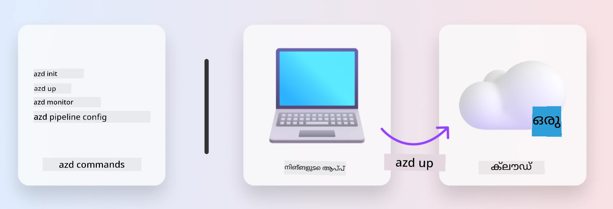
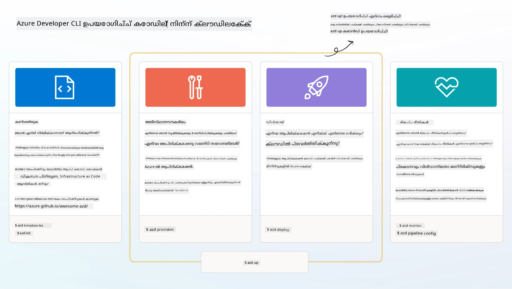

# 1. ഒരു ടെംപ്ലേറ്റ് തിരഞ്ഞെടുക്കുക

!!! tip "ഈ മഡ്യൂൾ അവസാനിക്കുമ്പോൾ നിങ്ങൾക്ക് സാധിക്കാനിരിക്കുന്നതാണ്"

    - [ ] AZD ടെംപ്ലേറ്റുകൾ എന്താണ് എന്ന് വിവരണം നൽകുക
    - [ ] AIക്കായി AZD ടെംപ്ലേറ്റുകൾ കണ്ടെത്തുകയും ഉപയോഗിക്കുകയും ചെയ്യുക
    - [ ] AI ഏജൻറ്സ് ടെംപ്ലേറ്റ് ഉപയോഗിച്ച് തുടക്കം കുറിക്കുക
    - [ ] **ലാബ് 1:** കോഡ്സ്പേസ് അല്ലെങ്കിൽ ഡെവ് കണ്ടെയ്‌നറിൽ AZD ക്വിക്ക്‌സ്റ്റാർട്ട്

---

## 1. ഒരു બિલ്ടറുടെ ഉപമ

പുതിയതായി തുടക്കം കുറിച്ച് പുതിയ എന്റർപ്രൈസ് റെഡിയായ AI അപ്ലിക്കേഷൻ നിർമ്മിക്കുന്നത് ഭീഷണികരമായിരിക്കാം. ഇത് നിങ്ങളുടെ പുതുവീട് സ്വയം ഇട്ട് നിർമ്മിക്കുന്നതിന് സമാനമാണ്, ഇട്ടുകൊണ്ടുപോകുന്ന ഓരോ ഇട്ടയും. അതെ, അത് സാധ്യമാകും! പക്ഷേ ഇങ്ങനെ ചെയ്യുന്നത് ഏറ്റവും ഫലപ്രദമായ രീതിയല്ല!

അതിനുപകരം, നാം സാധാരണയായി ഒരു നിലവിലുള്ള _ഡിസൈൻ ബ്ലൂപ്രിന്റ്_ ഉപയോഗിച്ച് ആരംഭിക്കുകയും അതിനെ ഞങ്ങളുടെ വ്യക്തിഗത ആവശ്യങ്ങൾക്കായി ഒരു ആര്‍ക്കിടെക്ടിനൊപ്പം ഇളവുകളോടെ അഡ്ജസ്റ്റ് ചെയ്യുന്നതിനായി പ്രവർത്തിക്കുകയും ചെയ്യുന്നു. ബുദ്ധിമുട്ടില്ലാത്ത അപ്ലിക്കേഷനുകൾ നിർമ്മിക്കാൻ എ בדיוק ഇതാണ് വേണ്ടതെന്ന് മനസ്സിലാക്കുക. ആദ്യം നിങ്ങളുടെ പ്രശ്ന മേഖലയ്ക്ക് അനുയോജ്യമായ നല്ല ഡിസൈൻ ആർക്കിടെക്ചർ കണ്ടെത്തുക. തുടർന്ന് പരിഹാരവിദഗ്ധരുമായി ചേർന്ന് ആ വ്യക്തിഗത സാഹചര്യത്തിന് അനുയോജ്യമായി പരിഹാരം രൂപകൽപ്പന ചെയ്യുക.

അവിടെ ഈ ഡിസൈൻ ബ്ലൂപ്രിന്റുകൾ എവിടെ കിട്ടും? സ്വന്തം സ്വയം ഇളവുകൾ നൽകാനും വിന്യസിക്കാനും willing ആയ ഒരു ആര്‍ക്കിടെക്റ്റിനെ എങ്ങനെ കണ്ടെത്തും? ഈ വർക്‌ഷോപ്പിൽ അവിടെ ഏത് ഉത്തരം നല്‍കുന്നു എന്ന് നിങ്ങൾക്ക് അറിയാം:

1. [Azure Developer CLI](https://aka.ms/azd) - ഒരു ഓപ്പൺ സോഴ്‌സ് ഉപകരണം, ഇത് ഡവലപ്പർ മാർഗം ലൊക്കൽ ഡവലപ്‌മെന്റ് (ബിൽഡ്) മുതൽ ക്ലൗഡ് വിന്യാസം (ഷിപ്പ്) വരെ വേഗത്തിൽ നടത്താൻ സഹായിക്കുന്നു.
1. [Microsoft Foundry Templates](https://ai.azure.com/templates) - AI പരിഹാര ആർക്കിടെചർ വിന്യസിക്കാൻ ആവശ്യമായ സാമ്പിള്‍ കോഡ്, ഇൻഫ്രാസ്ട്രക്ചർ, കോൺഫിഗറേഷൻ ഫയലുകൾ അടങ്ങിയ സ്റ്റാൻഡേർഡൈസ്ഡ് ഓപ്പൺ സോഴ്‌സ് റിപ്പോസിറ്ററികൾ.
1. [GitHub Copilot Agent Mode](https://code.visualstudio.com/docs/copilot/chat/chat-agent-mode) - Azure അറിവിന്റെ അടിസ്ഥാനത്തിൽ പ്രവർത്തിക്കുന്ന ഒരു കോഡിംഗ് ഏജന്റ്, ഇത് കോഡ്ബേസ് നാവിഗേറ്റ് ചെയ്യാനും മാറ്റങ്ങൾ വരുത്താനുമായും നടത്തി പ്രകൃതിദത്ത ഭാഷ ഉപയോഗിച്ച് സഹായിക്കുന്നു.

ഈ ഉപകരണങ്ങൾ കൈവശം വച്ച്‌ നാം ഇപ്പോൾ ശരിയായ ടെംപ്ലേറ്റ് കണ്ടുപിടിക്കുക, അത് വിന്യസിച്ച് സാധ്യമാണോ എന്ന് സ്ഥിരീകരിക്കുക, ശേഷം അത് ഇമാനെടുക്കുന്നതിനുള്ള പ്രത്യേക സാഹചര്യങ്ങൾക്ക് ഒത്തുകൂട്ടി ഇളവുകൾ നൽകാം. നാം ഇനിയും деталമായി ഇത് എങ്ങനെ പ്രവർത്തിക്കുന്നു എന്നു പഠിക്കാം.

---

## 2. Azure Developer CLI

[Azure Developer CLI](https://learn.microsoft.com/en-us/azure/developer/azure-developer-cli/) (അഥവാ `azd`) ഒരു open-source കമാൻഡ് ലൈൻ ടൂൾ ആണ്, ഇത് നിങ്ങളുടെ കോഡ് മുതൽ ക്ലൗഡ് വരെ യാത്ര വേഗത്തിൽ സാന്ദ്രതയോടെ അവസരപ്പെടുത്തുന്ന ഡവലപ്പർ സൗഹൃദ കമാൻഡുകൾ ഒരു സജ്ജീകരണവുമായി കൺസിസ്റ്റൻറെ ആയും IDE (ഡെവലപ്പ്മെന്റ്) এবং CI/CD (ഡെവ്ഓപ്സ്) പരിസ്ഥിതികളിൽ പ്രവർത്തിക്കുന്നു.

`azd` ഉപയോഗിച്ച് നിങ്ങളുടെ വിന്യാസ യാത്ര വളരെ ലളിതമായിരിക്കും:

- `azd init` - നിലവിലുള്ള AZD ടെംപ്ലേറ്റിൽ നിന്നൊരു പുതിയ AI പ്രോജക്ട് ആരംഭിക്കുന്നു.
- `azd up` - ഒരു ഘട്ടത്തിൽ ഇൻഫ്രാസ്ട്രക്ചർ ഒരുക്കുകയും നിങ്ങളുടെ അപ്ലിക്കേഷൻ വിന്യസിക്കുകയും ചെയ്യുക.
- `azd monitor` - വിന്യസിച്ച അപ്ലിക്കേഷനു വേണ്ടി യഥാർത്ഥ-സമയം നിരീക്ഷണവും ഡയഗ്നോസ്റ്റിക്കും ലഭിക്കുക.
- `azd pipeline config` - വിന്യാസം ഓട്ടോമേറ്റു ചെയ്യാൻ CI/CD പൈപ്ലൈനുകൾ സജ്ജീകരിക്കുക.

**🎯 | അഭ്യാസം**: <br/> ഇപ്പോൾ തന്നെ നിങ്ങളുടെ നിലവിലുള്ള വർക്‌ഷോപ്പ് പരിസരത്ത് `azd` കമാൻഡ് ലൈൻ ടൂൾ പരീക്ഷിക്കുക. GitHub Codespaces, dev കണ്ടെയ്‌നർ, അല്ലെങ്കിൽ പ്രീ-റിക്വിസൈറ്റുകൾ ഇൻസ്റ്റാൾ ചെയ്ത ഒരു ലോക്കൽ ക്ലോൺ ഇവയിൽ ഏതെങ്കിലും ആകാം. ഈ കമാൻഡ് ടൈപ്പ് ചെയ്ത് ടൂളിനുള്ള കഴിവുകൾ നോക്കൂ:

```bash title="" linenums="0"
azd help
```



---

## 3. AZD ടെംപ്ലേറ്റ്

`azd` ഇതു പാലിക്കാനായി, ഇത് എൻഫ്രാസ്ട്രക്ചർ (infrastructure) ഏത് ഒരുക്കണമെന്നു അറിയേണ്ടതുണ്ട്, കോൺഫിഗറേഷൻ ക്രമീകരണങ്ങൾ ഏന്തെന്നു നിർബന്ധിക്കേണ്ടതുണ്ട്, അപ്ലിക്കേഷൻ വിന്യസിക്കേണ്ടതുമാണ്. ഇവിടെ [AZD ടെംപ്ലേറ്റുകൾ](https://learn.microsoft.com/en-us/azure/developer/azure-developer-cli/azd-templates?tabs=csharp) പ്രവേശിക്കുന്നു.

AZD ടെംപ്ലേറ്റുകൾ ഓപ്പൺ സോഴ്‌സ് റിപ്പോസിറ്ററികൾ ആണ്, അവ സാമ്പിൾ കോഡും ഇൻഫ്രാസ്ട്രക്ചർ, കോൺഫിഗറേഷൻ ഫയലുകളും പരിഹാര ആർക്കിടെചർ വിന്യാസത്തിന് ആവശ്യമായ രൂപത്തിൽ സംയോജിപ്പിക്കുന്നു.
ഒരു _Infrastructure-as-Code_ (IaC) സമീപനം ഉപയോഗിച്ച്, ടെംപ്ലേറ്റ് സ്രോത് നിർവ്വചനങ്ങളും കോൺഫിഗറേഷൻ ക്രമീകരണങ്ങളും വേഴ്സൻ നിയന്ത്രണത്തിൻ കീഴിൽ വയ്ക്കപ്പെടുന്നു (അപ്പിന്റെ സ്രോത് കോഡുപോലെ) - ഇതിലൂടെ ഈ പദ്ധതിയുടെ ഉപയോഗക്കാരുടെ ഇടയിൽ പുനഃഉപയോഗയോഗ്യവും ഏകീകൃതവുമായ പ്രവർത്തനവഴികൾ സൃഷ്‌ടിക്കപ്പെടുന്നു.

_നിങ്ങളുടെ_ സീനാരിയോയ്ക്ക് ഉതകുന്ന AZD ടെംപ്ലേറ്റ് സൃഷ്ടിക്കുമ്പോളോ പുനഃപ്രയോജനപ്പെടുത്തുമ്പോളോ, ഈ ചോദ്യങ്ങൾ പരിഗണിക്കുക:

1. നിങ്ങൾ എന്താണ് നിർമ്മിക്കുന്നത്? → ആ സീനാരിയോയ്ക്ക് സ്റ്റാർട്ടർ കോഡ് ഉള്ള ടെംപ്ലേറ്റ് ഉണ്ടോ?
1. നിങ്ങളുടെ പരിഹാരം എങ്ങനെ ആർക്കിടെക്ട് ചെയ്തിരിക്കുന്നു? → ആവശ്യമായ റിസോഴ്സുകൾ ഉള്ള ടെംപ്ലേറ്റ് ഉണ്ടോ?
1. നിങ്ങളുടെ പരിഹാരം എങ്ങനെ വിന്യസിക്കുന്നു? → `azd deploy` മുൻ/ശേഷ പ്രോസസ്സിംഗ് ഹുക്കുകളോടെ?
1. നിങ്ങൾ അത് എങ്ങനെ കൂടുതൽ മെച്ചപ്പെടുത്താം? → ഇൻബിൽറ്റ് നിരീക്ഷണവും ഓട്ടോമേഷൻ പൈപ്പ്‌ലൈൻമാരും അനുസരിക്കുക!

**🎯 | അഭ്യാസം**: <br/>  
[Awesome AZD](https://azure.github.io/awesome-azd/) ഗാലറി സന്ദർശിച്ച് ഇപ്പോൾ ലഭ്യമായ 250+ ടെംപ്ലേറ്റുകളിൽ ഫിൽറ്ററുകൾ ഉപയോഗിച്ച് നിങ്ങളുടെ സീനാരിയോയ്‌ക്ക് അനുയോജ്യമായി ഏതെങ്കിലും കണ്ടെത്താൻ ശ്രമിക്കുക.



---

## 4. AI ആപ്പ് ടെംപ്ലേറ്റുകൾ

AI ശക്തിപ്പെടുത്തിയ അപ്ലിക്കേഷനുകൾക്കായി, Microsoft പ്രത്യേക ടെംപ്ലേറ്റുകൾ നൽകുന്നു, ഇവയില്‍ **Microsoft Foundry**യും **Foundry Agents** ഉം ഉൾപ്പെടുന്നു. ഈ ടെംപ്ലേറ്റുകൾ ബുദ്ധിമുട്ടുകളില്ലാതെ കയ്യിൽപ്പിടുന്ന, ഉത്പാദനത്തിന് യോജ്യമായ അപ്ലിക്കേഷനുകൾ നിർമ്മിക്കാൻ സഹായിക്കുന്നു.

### Microsoft Foundry & Foundry Agents ടെംപ്ലേറ്റുകൾ

കீழെയുള്ള ടെംപ്ലേറ്റ് തിരഞ്ഞെടുക്കാൻ. ഓരോ ടെംപ്ലೇಟും [Awesome AZD](https://azure.github.io/awesome-azd/) സൈറ്റിൽ ലഭ്യവും ഒരു കമാൻഡിൽ പ്രാരംഭീകരിക്കാവുന്നതുമായതാണ്.

| ടെംപ്ലേറ്റ് | വിവരണം | വിന്യാസം കമാൻഡ് |
|----------|-------------|----------------|
| **[AI Chat with RAG](https://azure.github.io/awesome-azd/?tags=ai&tags=rag)** | മൈക്രോസോഫ്റ്റ് ഫൗണ്ട്രി ഉപയോഗിച്ച് Retrieval Augmented Generation ഉള്ള ചാറ്റ് അപ്ലിക്കേഷൻ | `azd init -t azure-samples/azure-search-openai-demo` |
| **[Foundry Agent Service Starter](https://azure.github.io/awesome-azd/?tags=ai&tags=agents)** | Foundry Agents ഉപയോഗിച്ച് സ്വയം നിർവ്വാഹകൻ ടാസ്കുകൾ നിർവ്വഹിക്കുന്ന AI ഏജന്റുകൾ നിർമ്മിക്കുക | `azd init -t azure-samples/foundry-agent-service-starter` |
| **[Multi-Agent Orchestration](https://azure.github.io/awesome-azd/?tags=ai&tags=agents)** | സങ്കീർണ്ണ പ്രവർത്തനങ്ങൾക്കായി നിരവധി Foundry Agents ക്രമീകരിക്കുക | `azd init -t azure-samples/multi-agent-orchestration` |
| **[AI Document Intelligence](https://azure.github.io/awesome-azd/?tags=ai&tags=document)** | Microsoft Foundry മോഡലുകൾ ഉപയോഗിച്ച് ഡോക്യുമെന്റുകൾ പുറിച്ചിറക്കി വിശകലനം ചെയ്യുക | `azd init -t azure-samples/ai-document-processing` |
| **[Conversational AI Bot](https://azure.github.io/awesome-azd/?tags=ai&tags=bot)** | Microsoft Foundry സംയോജനത്തോടെ ബുദ്ധിമുട്ടില്ലാത്ത ചാറ്റ്ബോട്ടുകൾ നിർമ്മിക്കുക | `azd init -t azure-samples/ai-chat-protocol` |
| **[AI Image Generation](https://azure.github.io/awesome-azd/?tags=ai&tags=dalle)** | Microsoft Foundry വഴി DALL-E ഉപയോഗിച്ച് ചിത്രങ്ങൾ സൃഷ്ടിക്കുക | `azd init -t azure-samples/ai-image-generation` |
| **[Semantic Kernel Agent](https://azure.github.io/awesome-azd/?tags=ai&tags=semantic-kernel)** | Semantic Kernel ഉപയോഗിച്ച് Foundry Agents ഉൾപ്പെട്ട AI ഏജന്റുകൾ | `azd init -t azure-samples/semantic-kernel-agent` |
| **[AutoGen Multi-Agent](https://azure.github.io/awesome-azd/?tags=ai&tags=autogen)** | AutoGen ഫ്രെയിമ്വർക്കിൽ നാം ഉപയോഗിക്കുന്ന മൾട്ടി-ഏജന്റ് സിസ്റ്റങ്ങൾ | `azd init -t azure-samples/autogen-multi-agent` |

### ക്വിക്ക് സ്റ്റാർട്ട്

1. **ടെംപ്ലേറ്റുകൾ ബ്രൗസ് ചെയ്യുക**: [https://azure.github.io/awesome-azd/](https://azure.github.io/awesome-azd/) സന്ദർശിച്ച് `AI`, `Agents`, അല്ലെങ്കിൽ `Microsoft Foundry` ഫിൽട്ടറിലൂടെ തെരഞ്ഞടുക്കുക
2. **നിങ്ങളുടെ ടെംപ്ലേറ്റ് തിരഞ്ഞെടുക്കുക**: വേണ്ടിയുള്ള ടെംപ്ലേറ്റ് തിരഞ്ഞെടുക്കുക
3. **ആരംഭിക്കുക**: നിങ്ങളുടെ തിരഞ്ഞെടുപ്പിനുള്ള `azd init` കമാൻഡ് ഓടിക്കുക
4. **വിന്യാസം ചെയ്യുക**: `azd up` കമാൻഡ് ഓടിച്ച് ഇൻഫ്രാസ്ട്രക്ചർ ഒരുക്കുകയും വിന്യസിക്കുകയും ചെയ്യുക

**🎯 | അഭ്യാസം**: <br/>
മുകളിൽ കൊടുത്തിട്ടുള്ള ടെംപ്ലേറ്റുകളിൽ നിങ്ങളുടെ സീനാരിയോ അനുസരിച്ച് ഒരു ടെംപ്ലേറ്റ് തിരഞ്ഞെടുക്കുക:

- **ചാറ്റ്ബോട്ട് നിർമ്മിക്കുകയാണോ?** → **AI Chat with RAG** അല്ലെങ്കിൽ **Conversational AI Bot** ഉപയോഗിച്ച് ആരംഭിക്കുക
- **സ്വയം പ്രവർത്തിക്കുന്ന ഏജന്റുകളാണോ വേണ്ടത്?** → **Foundry Agent Service Starter** അല്ലെങ്കിൽ **Multi-Agent Orchestration** പരീക്ഷിക്കുക
- **ഡോക്യുമെന്റുകൾ പ്രോസസ് ചെയ്യണമെന്ന് ആഗ്രഹിക്കുന്നു?** → **AI Document Intelligence** ഉപയോഗിക്കുക
- **AI കോഡിംഗ് സഹായം വേണമോ?** → **Semantic Kernel Agent** അല്ലെങ്കിൽ **AutoGen Multi-Agent** പരിശോധിക്കുക

```bash title="Example: Deploy the AI Chat with RAG template" linenums="0"
azd init -t azure-samples/azure-search-openai-demo
azd up
```

!!! info "കൂടുതൽ ടെംപ്ലേറ്റുകൾ പരിശോധിക്കുക"
    [Awesome AZD Gallery](https://azure.github.io/awesome-azd/) 250+ ടെംപ്ലേറ്റുകൾ ഉൾക്കൊള്ളുന്നു. ഭാഷ, ഫ്രെയിംവർക്ക്, Azure സേവനങ്ങൾ എന്നിവയുൾപ്പെടെയുള്ള നിങ്ങളുടെ പ്രത്യേക ആവശ്യങ്ങൾക്ക് അനുയോജ്യമായ ടെംപ്ലേറ്റുകൾ കണ്ടെത്താൻ ഫിൽറ്ററുകൾ ഉപയോഗിക്കുക.

---

<!-- CO-OP TRANSLATOR DISCLAIMER START -->
**വിവരം**:  
ഈ രേഖ [Co-op Translator](https://github.com/Azure/co-op-translator) എന്ന AI ഭാഷാന്തര സേവനം ഉപയോഗിച്ച് വിവർത്തനമാക്കിയതാണ്. ഞങ്ങൾ കൃത്യതയ്ക്ക് ശ്രമിച്ചെങ്കിലും, യന്ത്രംമൊഴിമാറ്റം തെറ്റുകൾ അല്ലെങ്കിൽ അശുദ്ധികൾ ഉണ്ടാകാം എന്നതിനുള്ള സൂക്ഷ്മത വേണമെന്ന് ശ്രദ്ധിക്കുക. മിഥ്യയോ നിഷ്കൃതമായോ അറിയിപ്പ് നൽകേണ്ടതുണ്ടെങ്കിൽ, പ്രൊഫഷണൽ മനുഷ്യ വിവർതനം ശിപാർശ ചെയ്യപ്പെടുന്നു. ഈ വിവർത്തനം ഉപയോഗിച്ച് ഉണ്ടായ ഏതൊരു തെറ്റിദ്ധാരണയ്ക്കും ഞങ്ങൾ ഉത്തരവാദികളല്ല.
<!-- CO-OP TRANSLATOR DISCLAIMER END -->