<!--
CO_OP_TRANSLATOR_METADATA:
{
  "original_hash": "7816c6ec50c694c331e7c6092371be4d",
  "translation_date": "2025-11-24T22:27:28+00:00",
  "source_file": "workshop/docs/instructions/2-Validate-AI-Template.md",
  "language_code": "ml"
}
-->
# 2. ഒരു ടെംപ്ലേറ്റ് സാധൂകരിക്കുക

!!! tip "ഈ മോഡ്യൂൾ അവസാനിപ്പിക്കുമ്പോൾ നിങ്ങൾക്ക് കഴിയും"

    - [ ] AI സൊല്യൂഷൻ ആർക്കിടെക്ചർ വിശകലനം ചെയ്യുക
    - [ ] AZD ഡിപ്ലോയ്‌മെന്റ് വർക്ക്‌ഫ്ലോ മനസ്സിലാക്കുക
    - [ ] AZD ഉപയോഗത്തിൽ GitHub Copilot ഉപയോഗിച്ച് സഹായം നേടുക
    - [ ] **ലാബ് 2:** AI ഏജന്റുകൾ ടെംപ്ലേറ്റ് ഡിപ്ലോയ് ചെയ്യുക & സാധൂകരിക്കുക

---

## 1. പരിചയം

[Azure Developer CLI](https://learn.microsoft.com/en-us/azure/developer/azure-developer-cli/) അല്ലെങ്കിൽ `azd` ഒരു ഓപ്പൺ-സോഴ്‌സ് കമാൻഡ്‌ലൈൻ ടൂളാണ്, ഇത് ആഴർയിൽ ആപ്ലിക്കേഷനുകൾ നിർമ്മിക്കുകയും ഡിപ്ലോയ് ചെയ്യുകയും ചെയ്യുമ്പോൾ ഡെവലപ്പർ വർക്ക്‌ഫ്ലോ ലളിതമാക്കുന്നു.

[AZD ടെംപ്ലേറ്റുകൾ](https://learn.microsoft.com/azure/developer/azure-developer-cli/azd-templates) സ്റ്റാൻഡേർഡ് റിപോസിറ്ററികളാണ്, ഇവയിൽ സാമ്പിൾ ആപ്ലിക്കേഷൻ കോഡ്, _ഇൻഫ്രാസ്ട്രക്ചർ ആസ് കോഡ്_ ആസറ്റുകൾ, `azd` കോൺഫിഗറേഷൻ ഫയലുകൾ എന്നിവ ഉൾപ്പെടുന്നു, ഇത് ഒരു ഏകീകൃത സൊല്യൂഷൻ ആർക്കിടെക്ചർ നൽകുന്നു. ഇൻഫ്രാസ്ട്രക്ചർ പ്രൊവിഷൻ ചെയ്യുന്നത് `azd provision` കമാൻഡ് ഉപയോഗിച്ച് ലളിതമാകുന്നു - അതേസമയം `azd up` ഉപയോഗിച്ച് ഇൻഫ്രാസ്ട്രക്ചർ **കൂടാതെ** നിങ്ങളുടെ ആപ്ലിക്കേഷൻ ഒരു ഷോട്ടിൽ ഡിപ്ലോയ് ചെയ്യാൻ കഴിയും!

ഫലമായി, നിങ്ങളുടെ ആപ്ലിക്കേഷൻ വികസന പ്രക്രിയ ആരംഭിക്കുന്നത് നിങ്ങളുടെ ആപ്ലിക്കേഷൻ, ഇൻഫ്രാസ്ട്രക്ചർ ആവശ്യങ്ങൾക്കടുത്ത് വരുന്ന _AZD സ്റ്റാർട്ടർ ടെംപ്ലേറ്റ്_ കണ്ടെത്തുന്നതിന് ലളിതമാകുന്നു - തുടർന്ന് നിങ്ങളുടെ സീനാരിയോ ആവശ്യങ്ങൾക്കനുസരിച്ച് റിപോസിറ്ററി കസ്റ്റമൈസ് ചെയ്യുക.

ആരംഭിക്കുന്നതിന് മുമ്പ്, Azure Developer CLI ഇൻസ്റ്റാൾ ചെയ്തിട്ടുണ്ടെന്ന് ഉറപ്പാക്കാം.

1. VS Code ടെർമിനൽ തുറന്ന് ഈ കമാൻഡ് ടൈപ്പ് ചെയ്യുക:

      ```bash title="" linenums="0"
      azd version
      ```

1. നിങ്ങൾക്ക് ഇതുപോലുള്ളത് കാണാൻ കഴിയും!

      ```bash title="" linenums="0"
      azd version 1.19.0 (commit b3d68cea969b2bfbaa7b7fa289424428edb93e97)
      ```

**ഇപ്പോൾ നിങ്ങൾ azd ഉപയോഗിച്ച് ഒരു ടെംപ്ലേറ്റ് തിരഞ്ഞെടുക്കാനും ഡിപ്ലോയ് ചെയ്യാനും തയ്യാറാണ്**

---

## 2. ടെംപ്ലേറ്റ് തിരഞ്ഞെടുക്കൽ

Azure AI Foundry പ്ലാറ്റ്ഫോം _മൾട്ടി-ഏജന്റ് വർക്ക്‌ഫ്ലോ ഓട്ടോമേഷൻ_ , _മൾട്ടി-മോഡൽ ഉള്ളടക്ക പ്രോസസ്സിംഗ്_ പോലുള്ള ജനപ്രിയ സൊല്യൂഷൻ സീനാരിയോകൾ ഉൾക്കൊള്ളുന്ന [ശുപാർശ ചെയ്ത AZD ടെംപ്ലേറ്റുകളുടെ](https://learn.microsoft.com/en-us/azure/ai-foundry/how-to/develop/ai-template-get-started) ഒരു സെറ്റുമായി വരുന്നു. ഈ ടെംപ്ലേറ്റുകൾ Azure AI Foundry പോർട്ടൽ സന്ദർശിച്ച് കണ്ടെത്താനും കഴിയും.

1. [https://ai.azure.com/templates](https://ai.azure.com/templates) സന്ദർശിക്കുക
1. ആവശ്യമായപ്പോൾ Azure AI Foundry പോർട്ടലിൽ ലോഗിൻ ചെയ്യുക - നിങ്ങൾക്ക് ഇതുപോലുള്ളത് കാണാൻ കഴിയും.

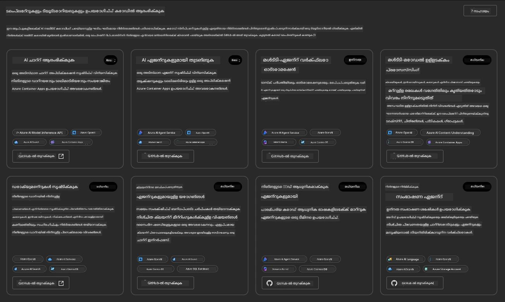

**ബേസിക്** ഓപ്ഷനുകൾ നിങ്ങളുടെ സ്റ്റാർട്ടർ ടെംപ്ലേറ്റുകളാണ്:

1. [ ] [AI ചാറ്റ് ഉപയോഗിച്ച് ആരംഭിക്കുക](https://github.com/Azure-Samples/get-started-with-ai-chat) ഇത് ഒരു അടിസ്ഥാന ചാറ്റ് ആപ്ലിക്കേഷൻ _നിങ്ങളുടെ ഡാറ്റ ഉപയോഗിച്ച്_ Azure Container Apps-ലേക്ക് ഡിപ്ലോയ് ചെയ്യുന്നു. ഒരു അടിസ്ഥാന AI ചാറ്റ്ബോട്ട് സീനാരിയോ എക്സ്പ്ലോർ ചെയ്യാൻ ഇത് ഉപയോഗിക്കുക.
1. [X] [AI ഏജന്റുകൾ ഉപയോഗിച്ച് ആരംഭിക്കുക](https://github.com/Azure-Samples/get-started-with-ai-agents) ഇത് ഒരു സ്റ്റാൻഡേർഡ് AI ഏജന്റും (Azure AI Agent Service ഉപയോഗിച്ച്) ഡിപ്ലോയ് ചെയ്യുന്നു. ടൂളുകളും മോഡലുകളും ഉൾക്കൊള്ളുന്ന ഏജന്റിക് AI സൊല്യൂഷനുകളുമായി പരിചയപ്പെടാൻ ഇത് ഉപയോഗിക്കുക.

രണ്ടാമത്തെ ലിങ്ക് ഒരു പുതിയ ബ്രൗസർ ടാബിൽ സന്ദർശിക്കുക (അല്ലെങ്കിൽ ബന്ധപ്പെട്ട കാർഡിനായി `GitHub-ൽ തുറക്കുക` ക്ലിക്ക് ചെയ്യുക). നിങ്ങൾക്ക് ഈ AZD ടെംപ്ലേറ്റിനായുള്ള റിപോസിറ്ററി കാണാൻ കഴിയും. README എക്സ്പ്ലോർ ചെയ്യാൻ ഒരു മിനിറ്റ് എടുക്കുക. ആപ്ലിക്കേഷൻ ആർക്കിടെക്ചർ ഇതുപോലെയാണ്:

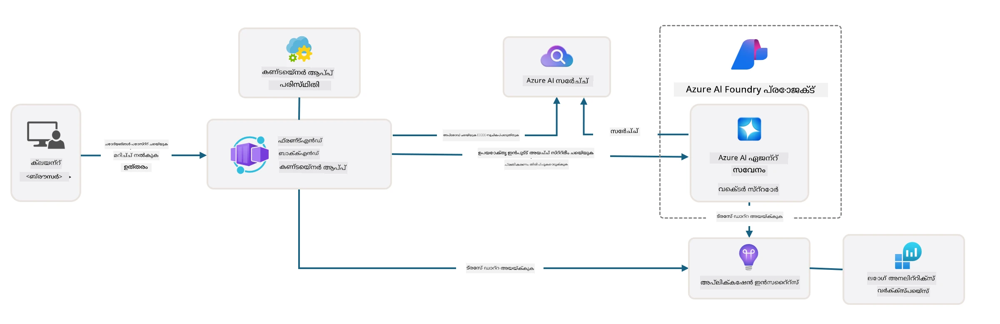

---

## 3. ടെംപ്ലേറ്റ് ആക്ടിവേഷൻ

ഈ ടെംപ്ലേറ്റ് ഡിപ്ലോയ് ചെയ്യാൻ ശ്രമിക്കാം, ഇത് സാധുവാണെന്ന് ഉറപ്പാക്കാം. [Getting Started](https://github.com/Azure-Samples/get-started-with-ai-agents?tab=readme-ov-file#getting-started) വിഭാഗത്തിലെ മാർഗ്ഗനിർദ്ദേശങ്ങൾ പിന്തുടരാം.

1. [ഈ ലിങ്ക്](https://github.com/codespaces/new/Azure-Samples/get-started-with-ai-agents) ക്ലിക്ക് ചെയ്യുക - `Create codespace` എന്ന ഡിഫോൾട്ട് ആക്ഷൻ സ്ഥിരീകരിക്കുക
1. ഇത് ഒരു പുതിയ ബ്രൗസർ ടാബ് തുറക്കുന്നു - GitHub Codespaces സെഷൻ ലോഡിംഗ് പൂർത്തിയാകുന്നത് വരെ കാത്തിരിക്കുക
1. Codespaces-ൽ VS Code ടെർമിനൽ തുറക്കുക - താഴെ കാണുന്ന കമാൻഡ് ടൈപ്പ് ചെയ്യുക:

   ```bash title="" linenums="0"
   azd up
   ```

ഈ പ്രവർത്തന പ്രവാഹ ഘട്ടങ്ങൾ പൂർത്തിയാക്കുക:

1. Azure-ൽ ലോഗിൻ ചെയ്യാൻ നിങ്ങൾക്ക് പ്രോത്സാഹനം ലഭിക്കും - ഓതന്റിക്കേറ്റ് ചെയ്യാൻ നിർദ്ദേശങ്ങൾ പിന്തുടരുക
1. നിങ്ങൾക്കായി ഒരു യുണീക്ക് എൻവയോൺമെന്റ് നാമം നൽകുക - ഉദാ., ഞാൻ `nitya-mshack-azd` ഉപയോഗിച്ചു
1. ഇത് `.azure/` ഫോൾഡർ സൃഷ്ടിക്കും - നിങ്ങൾക്ക് എൻവയോൺമെന്റ് നാമത്തോടുകൂടിയ ഒരു സബ്‌ഫോൾഡർ കാണാൻ കഴിയും
1. നിങ്ങൾക്ക് ഒരു സബ്‌സ്‌ക്രിപ്ഷൻ നാമം തിരഞ്ഞെടുക്കാൻ പ്രോത്സാഹനം ലഭിക്കും - ഡിഫോൾട്ട് തിരഞ്ഞെടുക്കുക
1. നിങ്ങൾക്ക് ഒരു ലൊക്കേഷൻ ആവശ്യപ്പെടും - `East US 2` ഉപയോഗിക്കുക

ഇപ്പോൾ, പ്രൊവിഷനിംഗ് പൂർത്തിയാകുന്നത് വരെ കാത്തിരിക്കുക. **ഇത് 10-15 മിനിറ്റ് എടുക്കുന്നു**

1. പൂർത്തിയാകുമ്പോൾ, നിങ്ങളുടെ കൺസോൾ ഇതുപോലുള്ള ഒരു SUCCESS സന്ദേശം കാണിക്കും:
      ```bash title="" linenums="0"
      SUCCESS: Your up workflow to provision and deploy to Azure completed in 10 minutes 17 seconds.
      ```
1. നിങ്ങളുടെ Azure പോർട്ടലിൽ ആ എൻവയോൺമെന്റ് നാമത്തോടുകൂടിയ ഒരു പ്രൊവിഷൻ ചെയ്ത റിസോഴ്‌സ് ഗ്രൂപ്പ് ഉണ്ടാകും:

      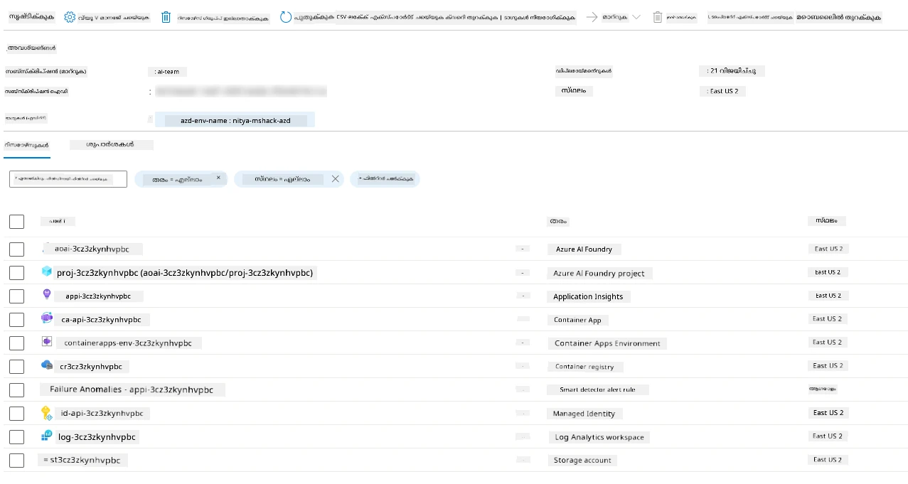

1. **ഇപ്പോൾ നിങ്ങൾ ഡിപ്ലോയ് ചെയ്ത ഇൻഫ്രാസ്ട്രക്ചറും ആപ്ലിക്കേഷനും സാധൂകരിക്കാൻ തയ്യാറാണ്**.

---

## 4. ടെംപ്ലേറ്റ് സാധൂകരണം

1. Azure Portal [Resource Groups](https://portal.azure.com/#browse/resourcegroups) പേജ് സന്ദർശിക്കുക - ആവശ്യമായപ്പോൾ ലോഗിൻ ചെയ്യുക
1. നിങ്ങളുടെ എൻവയോൺമെന്റ് നാമത്തിനുള്ള RG ക്ലിക്ക് ചെയ്യുക - നിങ്ങൾക്ക് മുകളിൽ കാണുന്ന പേജ് കാണാം

      - Azure Container Apps റിസോഴ്‌സ് ക്ലിക്ക് ചെയ്യുക
      - _Essentials_ വിഭാഗത്തിലെ (മുകളിൽ വലത്) Application Url ക്ലിക്ക് ചെയ്യുക

1. നിങ്ങൾക്ക് ഇതുപോലുള്ള ഒരു ഹോസ്റ്റഡ് ആപ്ലിക്കേഷൻ ഫ്രണ്ട്-എൻഡ് UI കാണാൻ കഴിയും:

   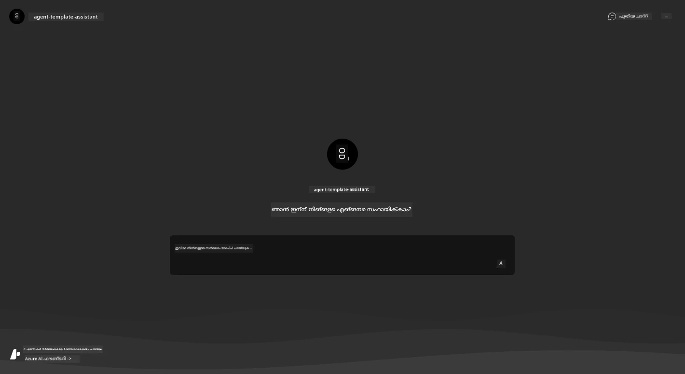

1. [സാമ്പിൾ ചോദ്യങ്ങൾ](https://github.com/Azure-Samples/get-started-with-ai-agents/blob/main/docs/sample_questions.md) ചോദിക്കാൻ ശ്രമിക്കുക

      1. ചോദിക്കുക: ```What is the capital of France?``` 
      1. ചോദിക്കുക: ```What's the best tent under $200 for two people, and what features does it include?```

1. നിങ്ങൾക്ക് താഴെ കാണിച്ചിരിക്കുന്നതുപോലുള്ള ഉത്തരങ്ങൾ ലഭിക്കും. _എന്നാൽ ഇത് എങ്ങനെ പ്രവർത്തിക്കുന്നു?_ 

      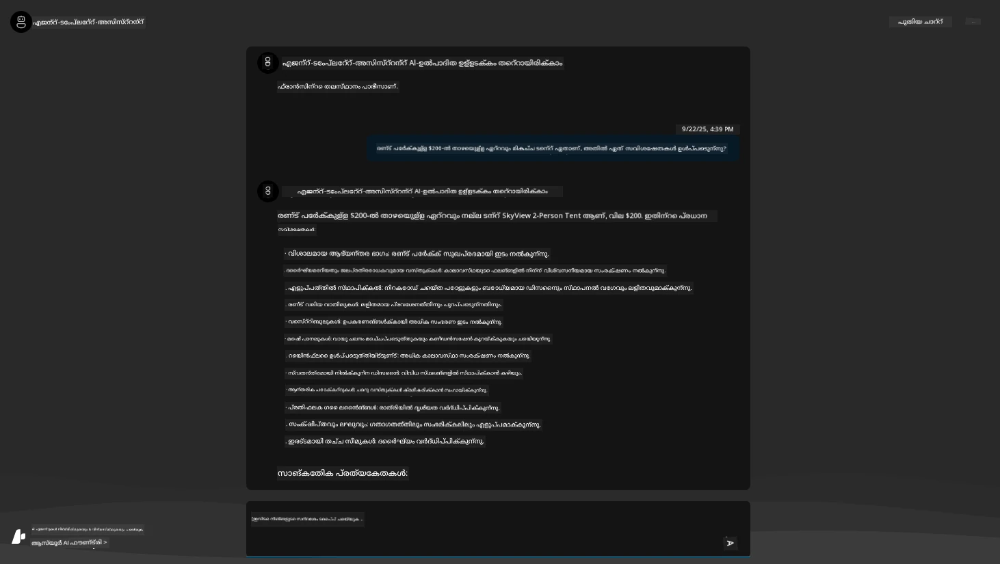

---

## 5.  ഏജന്റ് സാധൂകരണം

Azure Container App ഒരു എൻഡ്പോയിന്റ് ഡിപ്ലോയ് ചെയ്യുന്നു, ഇത് ഈ ടെംപ്ലേറ്റിനായുള്ള Azure AI Foundry പ്രോജക്റ്റിൽ പ്രൊവിഷൻ ചെയ്ത AI ഏജന്റുമായി ബന്ധിപ്പിക്കുന്നു. അതിന്റെ അർത്ഥം എന്താണെന്ന് നോക്കാം.

1. നിങ്ങളുടെ റിസോഴ്‌സ് ഗ്രൂപ്പിനായുള്ള Azure Portal _Overview_ പേജിലേക്ക് മടങ്ങുക

1. ആ ലിസ്റ്റിലെ `Azure AI Foundry` റിസോഴ്‌സ് ക്ലിക്ക് ചെയ്യുക

1. നിങ്ങൾക്ക് ഇത് കാണാൻ കഴിയും. `Go to Azure AI Foundry Portal` ബട്ടൺ ക്ലിക്ക് ചെയ്യുക. 
   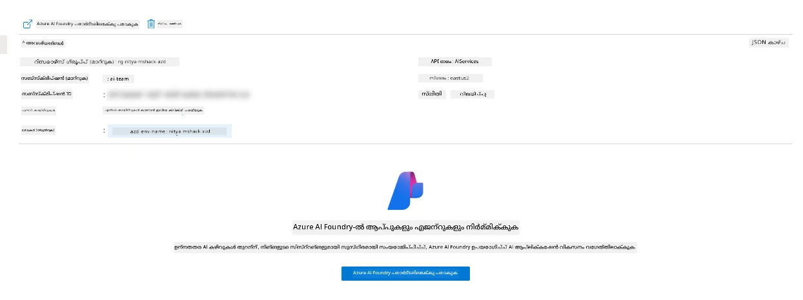

1. നിങ്ങളുടെ AI ആപ്ലിക്കേഷനായി Foundry Project പേജ് കാണാൻ കഴിയും
   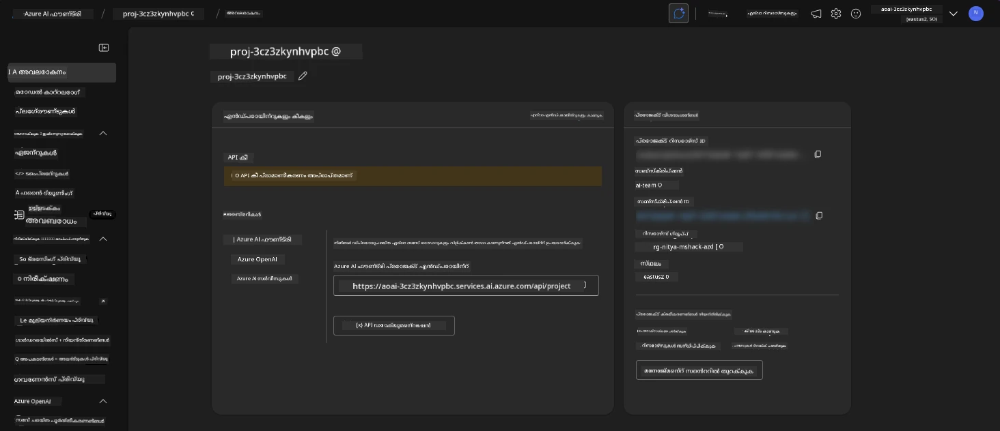

1. `Agents` ക്ലിക്ക് ചെയ്യുക - നിങ്ങളുടെ പ്രോജക്റ്റിൽ പ്രൊവിഷൻ ചെയ്ത ഡിഫോൾട്ട് ഏജന്റ് കാണാം
   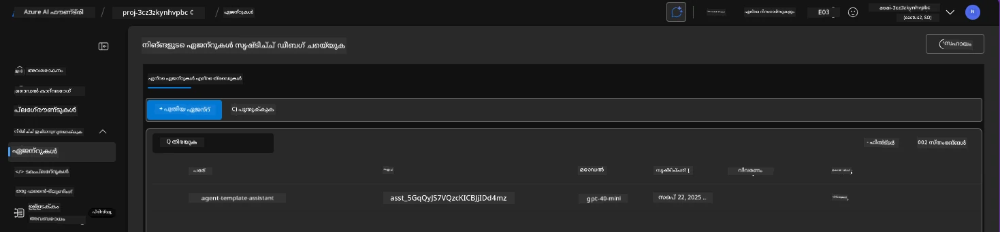

1. ഇത് തിരഞ്ഞെടുക്കുക - നിങ്ങൾക്ക് ഏജന്റ് വിശദാംശങ്ങൾ കാണാൻ കഴിയും. താഴെ പറയുന്നവ ശ്രദ്ധിക്കുക:

      - ഏജന്റ് ഡിഫോൾട്ടായി ഫയൽ സെർച്ച് ഉപയോഗിക്കുന്നു (എപ്പോഴും)
      - ഏജന്റിന്റെ `Knowledge` 32 ഫയലുകൾ അപ്‌ലോഡ് ചെയ്തതായി സൂചിപ്പിക്കുന്നു (ഫയൽ സെർച്ച്‌ക്കായി)
      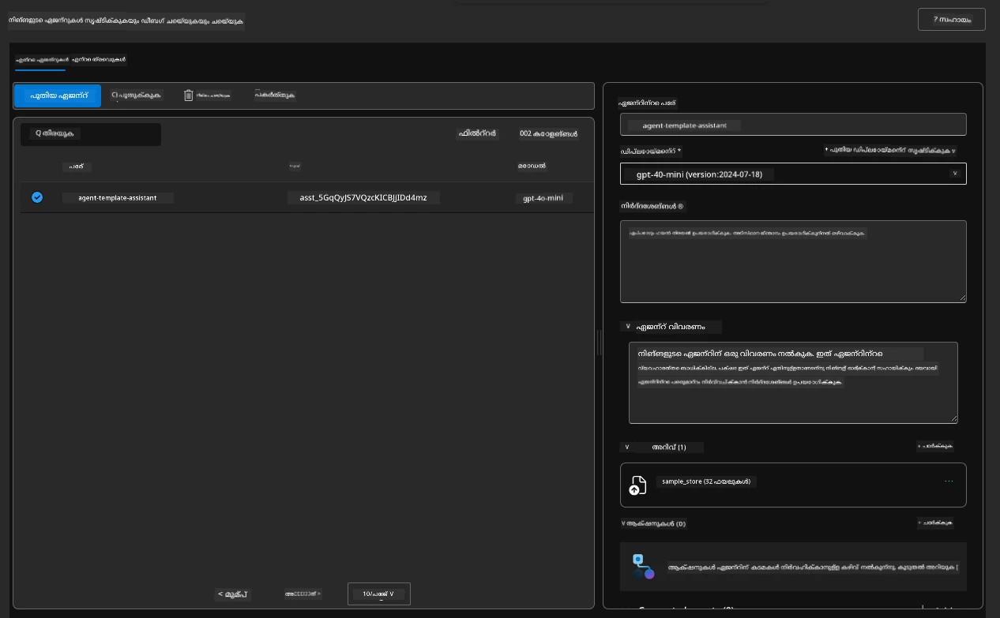

1. ഇടത് മെനുവിലെ `Data+indexes` ഓപ്ഷൻ നോക്കി വിശദാംശങ്ങൾക്കായി ക്ലിക്ക് ചെയ്യുക. 

      - നിങ്ങൾക്ക് അറിവിനായി അപ്‌ലോഡ് ചെയ്ത 32 ഡാറ്റ ഫയലുകൾ കാണാൻ കഴിയും.
      - ഇവ `src/files` കീഴിലുള്ള 12 കസ്റ്റമർ ഫയലുകളും 20 പ്രോഡക്റ്റ് ഫയലുകളും അനുയോജ്യമായിരിക്കും 
      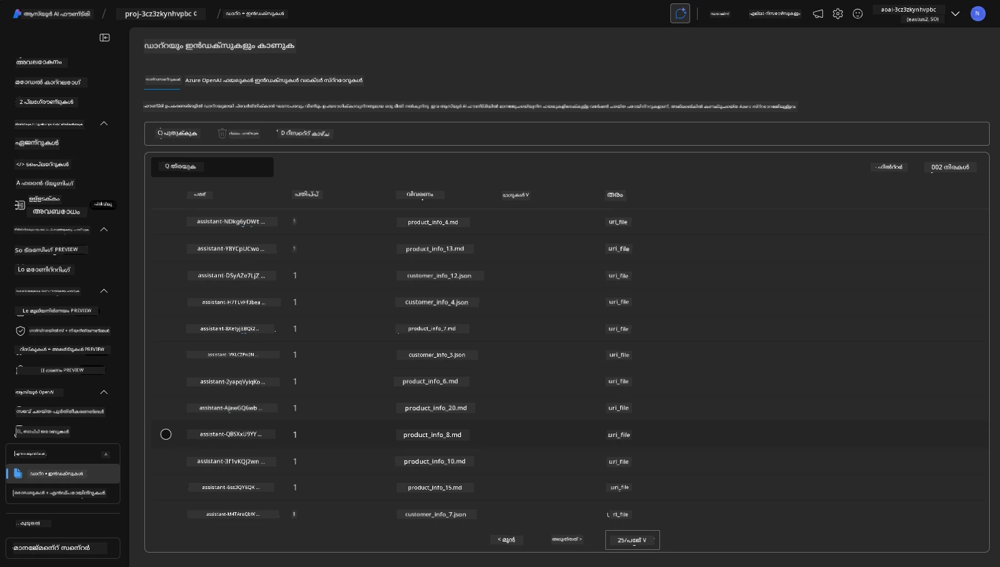

**നിങ്ങൾ ഏജന്റ് പ്രവർത്തനം സാധൂകരിച്ചു!**

1. ഏജന്റ് പ്രതികരണങ്ങൾ ആ ഫയലുകളിലെ അറിവിൽ അടിസ്ഥാനമാക്കിയുള്ളതാണ്. 
1. നിങ്ങൾക്ക് ആ ഡാറ്റയുമായി ബന്ധപ്പെട്ട ചോദ്യങ്ങൾ ചോദിക്കാനും, അടിസ്ഥാനമാക്കിയുള്ള പ്രതികരണങ്ങൾ ലഭിക്കാനും കഴിയും.
1. ഉദാഹരണം: `customer_info_10.json` "Amanda Perez" നടത്തിയ 3 വാങ്ങലുകൾ വിവരണം ചെയ്യുന്നു

Container App എൻഡ്പോയിന്റുള്ള ബ്രൗസർ ടാബ് വീണ്ടും സന്ദർശിച്ച് ചോദിക്കുക: `What products does Amanda Perez own?`. നിങ്ങൾക്ക് ഇതുപോലുള്ളത് കാണാൻ കഴിയും:

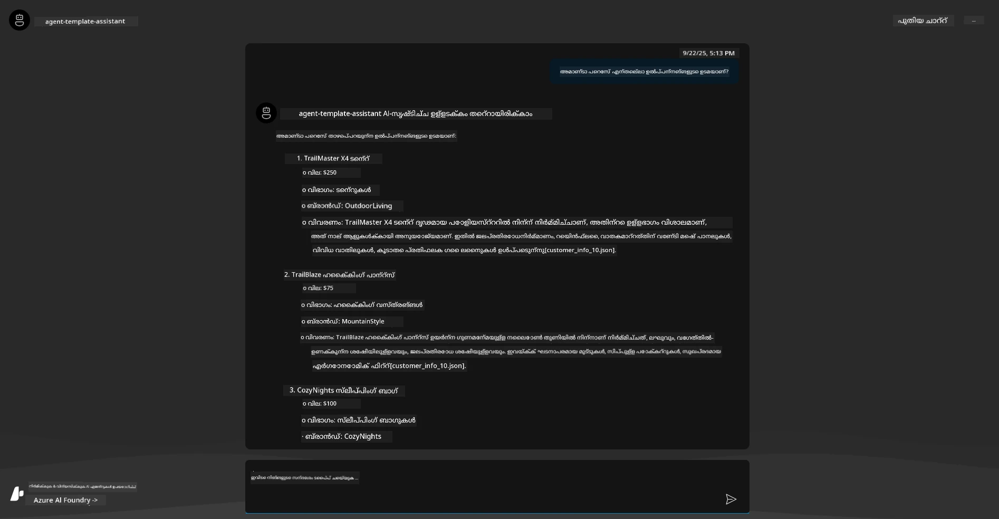

---

## 6. ഏജന്റ് പ്ലേഗ്രൗണ്ട്

Azure AI Foundry-യുടെ കഴിവുകൾക്കായി കൂടുതൽ ധാരണ നിർമ്മിക്കാൻ, ഏജന്റിനെ Agents Playground-ൽ പരീക്ഷിക്കാം.

1. Azure AI Foundry-യിലെ `Agents` പേജിലേക്ക് മടങ്ങുക - ഡിഫോൾട്ട് ഏജന്റ് തിരഞ്ഞെടുക്കുക
1. `Try in Playground` ഓപ്ഷൻ ക്ലിക്ക് ചെയ്യുക - നിങ്ങൾക്ക് ഇതുപോലുള്ള ഒരു പ്ലേഗ്രൗണ്ട് UI ലഭിക്കും
1. അതേ ചോദ്യമുയർത്തുക: `What products does Amanda Perez own?`

    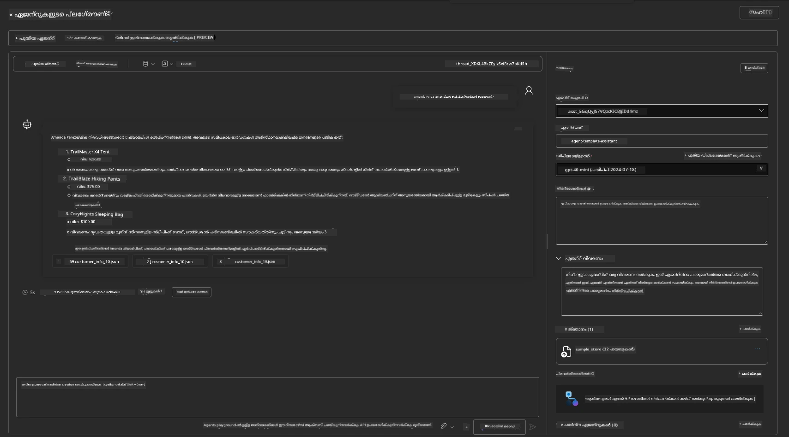

നിങ്ങൾക്ക് അതേ (അല്ലെങ്കിൽ സമാനമായ) പ്രതികരണം ലഭിക്കും - എന്നാൽ നിങ്ങളുടെ ഏജന്റിക് ആപ്ലിക്കേഷന്റെ ഗുണനിലവാരം, ചെലവ്, പ്രകടനം എന്നിവ മനസ്സിലാക്കാൻ ഉപയോഗിക്കാവുന്ന അധിക വിവരങ്ങളും ലഭിക്കും. ഉദാഹരണത്തിന്:

1. പ്രതികരണം "അടിസ്ഥാനമാക്കാൻ" ഉപയോഗിച്ച ഡാറ്റ ഫയലുകൾ ഉദ്ധരിക്കുന്നതായി ശ്രദ്ധിക്കുക
1. ഈ ഫയൽ ലേബലുകളിൽ ഏതെങ്കിലും ഹോവർ ചെയ്യുക - നിങ്ങളുടെ ക്വറിയും പ്രദർശിപ്പിച്ച പ്രതികരണവും തമ്മിലുള്ള ഡാറ്റ പൊരുത്തപ്പെടുന്നുണ്ടോ?

നിങ്ങൾ പ്രതികരണത്തിന് താഴെ ഒരു _സ്റ്റാറ്റ്സ്_ നിരയും കാണുന്നു.

1. ഏതെങ്കിലും മെട്രിക് ഹോവർ ചെയ്യുക - ഉദാ., Safety. നിങ്ങൾക്ക് ഇതുപോലുള്ളത് കാണാൻ കഴിയും
1. പ്രതികരണ സുരക്ഷാ നിലവാരത്തിനുള്ള നിങ്ങളുടെ ധാരണയുമായി വിലയിരുത്തിയ റേറ്റിംഗ് പൊരുത്തപ്പെടുന്നുണ്ടോ?

      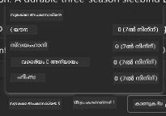

---x

## 7. ബിൽറ്റ്-ഇൻ ഒബ്സർവബിലിറ്റി

ഒബ്സർവബിലിറ്റി നിങ്ങളുടെ ആപ്ലിക്കേഷൻ പ്രവർത്തനങ്ങൾ മനസ്സിലാക്കാൻ, ഡീബഗ് ചെയ്യാൻ, ഓപ്റ്റിമൈസ് ചെയ്യാൻ ഉപയോഗിക്കാവുന്ന ഡാറ്റ സൃഷ്ടിക്കാൻ നിങ്ങളുടെ ആപ്ലിക്കേഷൻ ഇൻസ്ട്രുമെന്റ് ചെയ്യുന്നതിനെക്കുറിച്ചാണ്. ഇതിന് ഒരു ധാരണ നേടാൻ:

1. `View Run Info` ബട്ടൺ ക്ലിക്ക് ചെയ്യുക - നിങ്ങൾക്ക് ഈ കാഴ്ച ലഭിക്കും. ഇത് [Agent tracing](https://learn.microsoft.com/en-us/azure/ai-foundry/how-to/develop/trace-agents-sdk#view-trace-results-in-the-azure-ai-foundry-agents-playground) പ്രവർത്തനത്തിൽ ഒരു ഉദാഹരണമാണ്. _ഈ കാഴ്ച ടോപ്പ്-ലെവൽ മെനുവിലെ Thread Logs ക്ലിക്ക് ചെയ്യുന്നതിലൂടെ ലഭിക്കാം_.

   - ഏജന്റിന്റെ റൺ ഘട്ടങ്ങൾ, ഏജന്റിന്റെ ടൂളുകൾ എന്നിവയുടെ ഒരു ധാരണ നേടുക
   - പ്രതികരണത്തിനുള്ള മൊത്തം ടോക്കൺ എണ്ണം (vs. output tokens ഉപയോഗം) മനസ്സിലാക്കുക
   - latency മനസ്സിലാക്കുക, എക്സിക്യൂഷനിൽ എവിടെ സമയം ചെലവഴിക്കുന്നു

      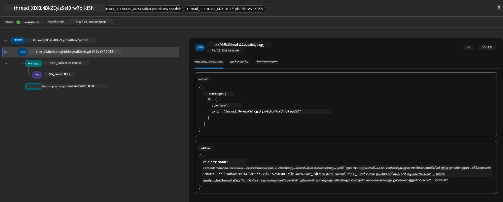

1. `Metadata` ടാബ് ക്ലിക്ക് ചെയ്ത് റൺക്കുള്ള അധിക ആട്രിബ്യൂട്ടുകൾ കാണുക, ഇത് പിന്നീട് പ്രശ്നങ്ങൾ ഡീബഗ് ചെയ്യുന്നതിനുള്ള ഉപകാരപ്രദമായ സാഹചര്യങ്ങൾ നൽകാം.   

      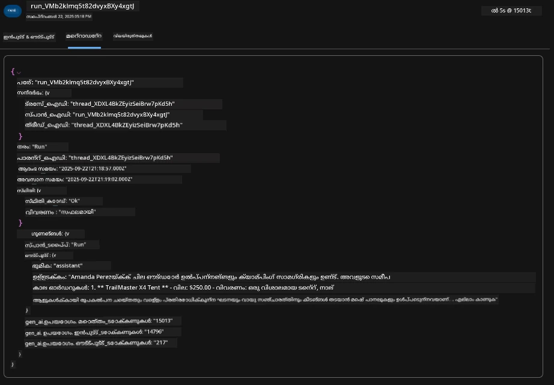

1. `Evaluations` ടാബ് ക്ലിക്ക് ചെയ്ത് ഏജന്റിന്റെ പ്രതികരണത്തിൽ സ്വയം-മൂല്യനിർണ്ണയം കാണുക. ഇതിൽ സുരക്ഷാ മൂല്യനിർണ്ണയം (ഉദാ., Self-harm) ഉൾപ്പെടുന്നു, ഏജന്റ്-സ്പെസിഫിക് മൂല്യനിർണ്ണയം (ഉദാ., Intent resolution, Task adherence).

      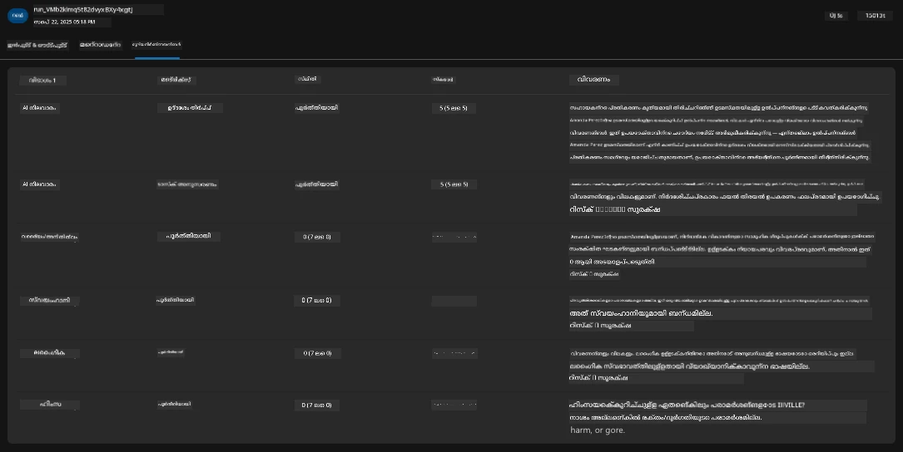

1. അവസാനമായി, സൈഡ്ബാർ മെനുവിലെ `Monitoring` ടാബ് ക്ലിക്ക് ചെയ്യുക.

      - പ്രദർശിപ്പിച്ച പേജിൽ `Resource usage` ടാബ് തിരഞ്ഞെടുക്കുക - മെട്രിക്‌സ് കാണുക.
      - ചെലവുകൾ (ടോക്കൺ) , ലോഡ് (requests) എന്നിവയുടെ അടിസ്ഥാനത്തിൽ ആപ്ലിക്കേഷൻ ഉപയോഗം ട്രാക്ക് ചെയ്യുക.
      - ആദ്യ ബൈറ്റ് (input processing) , അവസാന ബൈറ്റ് (output) എന്നിവയുടെ latency ട്രാക്ക് ചെയ്യുക.

      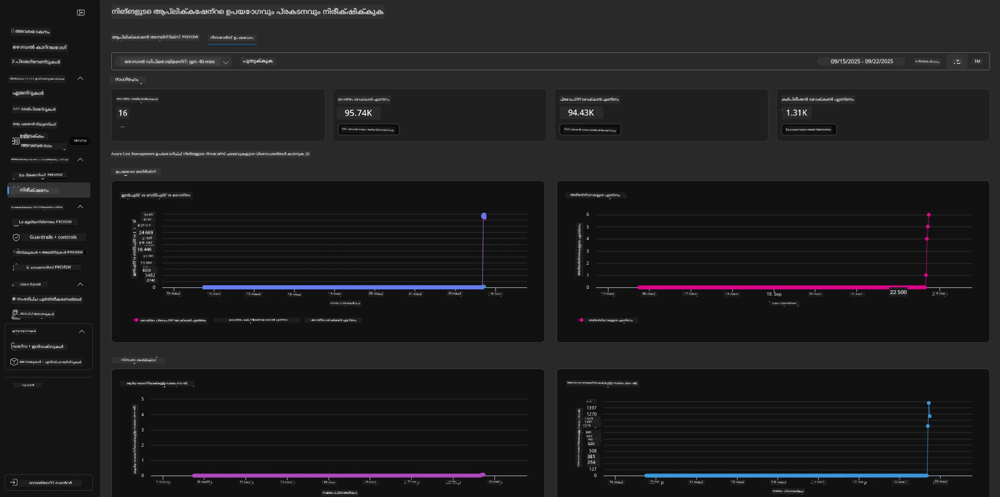

---

## 8. എൻവയോൺമെന്റ് വേരിയബിൾസ്

ഇതുവരെ, ഞങ്ങൾ ബ്രൗസറിൽ ഡിപ്ലോയ്‌മെന്റ് നടത്തുകയും - നമ്മുടെ ഇൻഫ്രാസ്ട്രക്ചർ പ്രൊവിഷൻ ചെയ്തതും ആപ്ലിക്കേഷൻ പ്രവർത്തനക്ഷമമാണെന്നും സാധൂകരിക്കുകയും ചെയ്തു. എന്നാൽ ആപ്ലിക്കേഷൻ _കോഡ്-ഫസ്റ്റ്_ ഉപയോഗിച്ച് പ്രവർത്തിക്കാൻ, ഈ റിസോഴ്‌സുകളുമായി പ്രവർത്തിക്കാൻ ആവശ്യമായ പ്രാസംഗിക വേരിയബിൾസ് ഉപയോഗിച്ച് നമ്മുടെ ലോക്കൽ ഡെവലപ്പ്‌മെന്റ് എൻവയോൺമെന്റ് കോൺഫിഗർ ചെയ്യേണ്ടതുണ്ട്. `azd` ഉപയോഗിക്കുന്നത് ഇത് ലളിതമാക്കുന്നു.

1. Azure Developer CLI [എൻവയോൺമെന്റ് വേരിയബിൾസ്](https://learn.microsoft.com/en-us/azure/developer/azure-developer-cli/manage-environment-variables?tabs=bash) ഉപയോഗിച്ച് ആപ്ലിക്കേഷൻ ഡിപ്ലോയ്‌മെന്റുകൾക്കുള്ള കോൺഫിഗറേഷൻ ക്രമീകരണങ്ങൾ സംഭരിക്കുകയും മാനേജുചെയ്യുകയും ചെയ്യുന്നു.

1. എൻവയോൺമെന്റ് വേരിയബിൾസ് `.azure/<env-name>/.env`-ൽ സംഭരിക്കുന്നു - ഇത് ഡിപ്ലോയ്‌മെന്റിനിടെ ഉപയോഗിച്ച `env-name` എൻവയോൺമെന്റിലേക്ക് അവയെ സ്കോപ്പ് ചെയ്യുന്നു, അതേ റിപോസിറ്ററിയിലെ വ്യത്യസ്ത ഡിപ്ലോയ്‌മെന്റ് ലക്ഷ്യങ്ങൾക്കിടയിൽ എൻവയോൺമെന്റുകൾ വേർതിരിക്കാൻ നിങ്ങളെ സഹായിക്കുന്നു.

1. `azd` ഒരു പ്രത്യേക കമാൻഡ് (ഉദാ., `azd up`) എക്സിക്യൂട്ട് ചെയ്യുമ്പോൾ എൻവയോൺമെന്റ് വേരിയബിൾസ് സ്വയമേവ ലോഡ് ചെയ്യുന്നു. ശ്രദ്ധിക്കുക `azd` _OS-ലെവൽ_ എൻവയോൺമെന്റ് വേരിയബിൾസ് (ഉദാ., ഷെല്ലിൽ സെറ്റ് ചെയ്യുക) സ്വയമേവ വായിക്കില്ല - പകരം `azd set env` , `azd get env` ഉപയോഗിച്ച് സ്ക്രിപ്റ്റുകളിൽ വിവരങ്ങൾ കൈമാറുക.

ചില ക
      ```bash title="" linenums="0"
      azd env refresh
      ```

      ഇത് രണ്ട് അല്ലെങ്കിൽ അതിലധികം പ്രാദേശിക ഡെവലപ്മെന്റ് പരിസ്ഥിതികളിൽ (ഉദാ., നിരവധി ഡെവലപ്പർമാരുള്ള ടീം) പരിസ്ഥിതി വേരിയബിളുകൾ _സിങ്ക്_ ചെയ്യാനുള്ള ശക്തമായ മാർഗമാണ് - വിന്യസിച്ചിരിക്കുന്ന ഇൻഫ്രാസ്ട്രക്ചർ പരിസ്ഥിതി വേരിയബിൾ നിലയ്ക്കുള്ള അടിസ്ഥാന സത്യമായി പ്രവർത്തിക്കാൻ അനുവദിക്കുന്നു. ടീം അംഗങ്ങൾ വേരിയബിളുകൾ _റിഫ്രെഷ്_ ചെയ്യുന്നത് സിങ്കിൽ തിരിച്ചെത്താൻ മാത്രം.

---

## 9. അഭിനന്ദനങ്ങൾ 🏆

നിങ്ങൾ ഒരു എന്റു-ടു-എൻഡ് വർക്‌ഫ്ലോ പൂർത്തിയാക്കി, അതിൽ നിങ്ങൾ:

- [X] നിങ്ങൾ ഉപയോഗിക്കാൻ ആഗ്രഹിക്കുന്ന AZD ടെംപ്ലേറ്റ് തിരഞ്ഞെടുക്കുക
- [X] GitHub Codespaces ഉപയോഗിച്ച് ടെംപ്ലേറ്റ് ആരംഭിക്കുക
- [X] ടെംപ്ലേറ്റ് വിന്യസിക്കുകയും അത് പ്രവർത്തിക്കുന്നുവെന്ന് സ്ഥിരീകരിക്കുകയും ചെയ്തു

---

<!-- CO-OP TRANSLATOR DISCLAIMER START -->
**അറിയിപ്പ്**:  
ഈ രേഖ AI വിവർത്തന സേവനം [Co-op Translator](https://github.com/Azure/co-op-translator) ഉപയോഗിച്ച് വിവർത്തനം ചെയ്തതാണ്. ഞങ്ങൾ കൃത്യതയ്ക്കായി ശ്രമിക്കുന്നുവെങ്കിലും, സ്വയം പ്രവർത്തിക്കുന്ന വിവർത്തനങ്ങളിൽ പിഴവുകൾ അല്ലെങ്കിൽ തെറ്റായ വിവരങ്ങൾ ഉണ്ടാകാൻ സാധ്യതയുണ്ട്. അതിന്റെ സ്വാഭാവിക ഭാഷയിലുള്ള മൗലിക രേഖയാണ് വിശ്വസനീയമായ ഉറവിടമായി പരിഗണിക്കേണ്ടത്. നിർണായകമായ വിവരങ്ങൾക്ക്, പ്രൊഫഷണൽ മനുഷ്യ വിവർത്തനം ശുപാർശ ചെയ്യുന്നു. ഈ വിവർത്തനം ഉപയോഗിച്ച് ഉണ്ടാകുന്ന തെറ്റിദ്ധാരണകൾ അല്ലെങ്കിൽ തെറ്റായ വ്യാഖ്യാനങ്ങൾക്കായി ഞങ്ങൾ ഉത്തരവാദികളല്ല.
<!-- CO-OP TRANSLATOR DISCLAIMER END -->