# 2. ടെംപ്ലേറ്റ് ശരിതല്ലൂ

!!! tip "ഈ മോഡ്യൂൾ അവസാനിച്ചപ്പോൾ നിങ്ങളെക്കുത്തും"

    - [ ] AI സൊല്യൂഷൻ ആർക്കിടെക്ചർ അനലൈസ് ചെയ്യുക
    - [ ] AZD ഡെപ്ലോയ്മെന്റ് വർക്ക്‌ഫ്ലോ മനസിലാക്കുക
    - [ ] GitHub Copilot ഉപയോഗിച്ച് AZD ഉപയോഗത്തെക്കുറിച്ച് സഹായം ലഭിക്കുക
    - [ ] **ലാബ് 2:** AI ഏജന്റ്സ് ടെംപ്ലേറ്റ് ഡെപ്ലോയ് & ശരിതല്ലൂ

---


## 1. പരിചയം

[Azure Developer CLI](https://learn.microsoft.com/en-us/azure/developer/azure-developer-cli/) അല്ലെങ്കിൽ `azd` ഒരു ഓപ്പൺ-സോഴ്‌സ് കമാൻഡ്‌ലೈನ್ ടൂൾ ആണ്, അത് Azure-യിലേക്ക് ആപ്ലിക്കേഷനുകൾ നിർമാണവും ഡെപ്ലോയും ചെയ്യുമ്പോൾ ഡെവലപ്പർ വർക്ക്‌ഫ്ലോ എളുപ്പമാക്കുന്നു. 

[AZD ടെംപ്ലേറ്റുകൾ](https://learn.microsoft.com/azure/developer/azure-developer-cli/azd-templates) ഒരു സാമാന്യ പരിഹാര ആർക്കിടെക്ചറിനായി സാമ്പിൾ ആപ്ലിക്കേഷൻ കോഡ്, _ഇൻഫ്രാസ്ട്രക്ചർ-ആസ്-കോഡ്_ ആസ്‌റ്റുകൾ, `azd` കോൺഫിഗറേഷൻ ഫയലുകൾ എന്നിവ ഉൾക്കൊള്ളുന്ന സ്റ്റാൻഡറ്ഡൈസ്ഡ് റിപോസിറ്ററികളാണ്. ഇൻഫ്രാസ്ട്രക്ചർ പ്രൊവിഷനിംഗ് `azd provision` കമാൻഡ് പോലെ എളുപ്പമാണ് - ആപ്പോൾ `azd up` ഉപയോഗിച്ച് ഒരു ഷോട്ടിൽ തന്നെ ഇൻഫ്രാസ്ട്രക്ചർ പ്രൊവിഷൻ ചെയ്യുകയും ആപ്ലിക്കേഷൻ ഡെപ്ലോ ചെയ്യുകയും ചെയ്യാം!

ഫലം, നിങ്ങളുടെ ആപ്ലിക്കേഷൻ വികസന പ്രക്രിയ ആരംഭിക്കാനാകുക ഏറ്റവും ബാധകമായ _AZD സ്റ്റാർട്ടർ ടെംപ്ലേറ്റ്_ കണ്ടെത്തുന്നതുപോലെയാണ്, അത് നിങ്ങളുടെ ആപ്ലിക്കേഷൻയും ഇൻഫ്രാസ്ട്രക്ചറും ആവശ്യങ്ങൾക്കോൾക്കു അനുസരിച്ച് റിപോസിറ്ററി കസ്റ്റമൈസ് ചെയ്യുക.

ആരംഭിക്കുന്നതിന് മുമ്പ്, നിങ്ങളുടെ കമ്പ്യൂട്ടറിൽ Azure Developer CLI ഇൻസ്റ്റാൾ ചെയ്യപ്പെട്ടിരിക്കുന്നതായിരിക്കണമെന്നതുണ്ടോ എന്ന് ഉറപ്പു വരുത്താം.

1. VS Code ടെർമിനൽ തുറന്ന് ഈ കമാൻഡ് ടൈപ്പ് ചെയ്യുക:

      ```bash title="" linenums="0"
      azd version
      ```

1. നിങ്ങൾ ഇൻപുട്ട് ചെയ്തത് പോലെയുള്ള ഔട്ട്പുട്ട് ലഭിച്ചിരിക്കണം!

      ```bash title="" linenums="0"
      azd version 1.19.0 (commit b3d68cea969b2bfbaa7b7fa289424428edb93e97)
      ```

**ഇപ്പോൾ നിങ്ങൾക്ക് azd-യുമായി ടെംപ്ലേറ്റ് തിരഞ്ഞെടുക്കാനും ഡെപ്ലോ ചെയ്യാനും സജ്ജമാണ്**

---

## 2. ടെംപ്ലേറ്റ് തിരഞ്ഞെടുപ്പ്

Microsoft Foundry പ്ലാറ്റ്‌ഫോംക്കൊപ്പം [ശുപാർശ ചെയ്തത് AZD ടെംപ്ലേറ്റുകളുടെ ഒരു സെറ്റ്](https://learn.microsoft.com/en-us/azure/ai-foundry/how-to/develop/ai-template-get-started) ഉണ്ട്, അവ _മൾട്ടി-ഏജന്റ് വർക്ക്‌ഫ്ലോ ഓട്ടോമേഷൻ_ , _മൾട്ടി-മോഡൽ ഉള്ളടക്ക പ്രോസസ്സിങ്_ പോലുള്ള ജനപ്രിയ പരിഹാര സീനാരിയോകൾ ഉൾക്കൊള്ളുന്നു. Microsoft Foundry പോർട്ടൽ സന്ദർശിച്ച് ഈ ടെംപ്ലേറ്റുകളും കണ്ടെത്താവുന്നതാണ്.

1. സന്ദർശിക്കുക [https://ai.azure.com/templates](https://ai.azure.com/templates)
1. പ്രോംപ്റ്റ് വന്നാൽ Microsoft Foundry പോർട്ടലിൽ ലോഗിൻ ചെയ്യുക - ഇതുപോലൊരു കാണപ്പെടും.

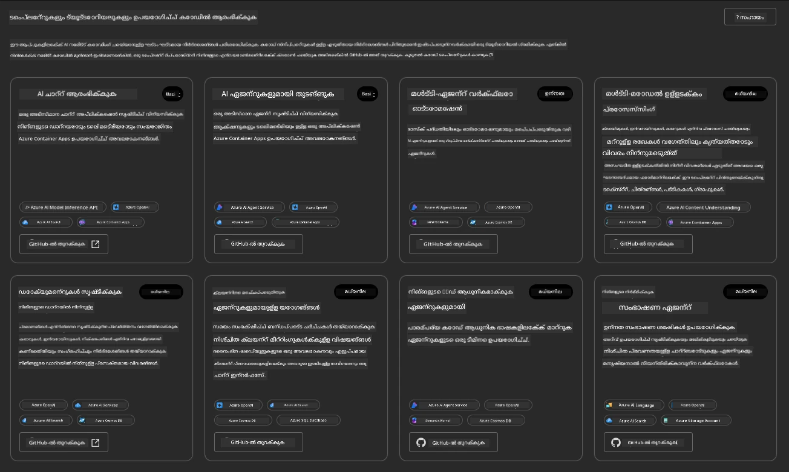


**ബേസിക്** ഓപ്ഷൻസ് നിങ്ങളുടെ സ്റ്റാർട്ടർ ടെംപ്ലേറ്റുകൾ:

1. [ ] [AI ചാറ്റുമായി ആരംഭിക്കുക](https://github.com/Azure-Samples/get-started-with-ai-chat) ബേസിക് ചാറ്റ് ആപ്ലിക്കേഷൻ നിങ്ങളുടെ ഡാറ്റയുമായി Azure Container Apps-ലേക്ക് ഡെപ്ലോ ചെയ്യുന്ന ടെംപ്ലേറ്റ്. ഇത് ബേസിക് AI ചാറ്റ്ബോട്ട് സീനാരിയോ എക്സ്‌പ്ലോർ ചെയ്യാനാണ്.

1. [X] [AI ഏജന്റ്സ് ഉപയോഗിച്ച് ആരംഭിക്കുക](https://github.com/Azure-Samples/get-started-with-ai-agents) ഫൗണ്ട്രി ഏജന്റ്സുമായി ഒരു സ്റ്റാൻഡേർഡ് AI ഏജന്റ് ഡെപ്ലോ ചെയ്യുന്ന ടെംപ്ലേറ്റ്. ടൂളുകളും മോഡലുകളും ഉൾപ്പെടുന്ന ഏജന്റിക് AI പരിഹാരങ്ങൾ പരിചയപ്പെടാൻ ഇത് സഹായിക്കും.

രണ്ടാം ലിങ്ക് പുതിയ ബ്രൗസർ ടാബിൽ തുറക്കുക (അഥവാ രജിസ്റ്റർ ചെയ്ത കാർഡിൽ `Open in GitHub` ക്ലിക്ക് ചെയ്യുക). നിങ്ങൾ AZD ടെംപ്ലേറ്റിന്റെ റിപോസിറ്ററി കാണും. README ഒന്ന് പരിശോധിക്കുക. ആപ്ലിക്കേഷൻ ആർക്കിടെക്ചർ ഇതുപോലെയാണ്:

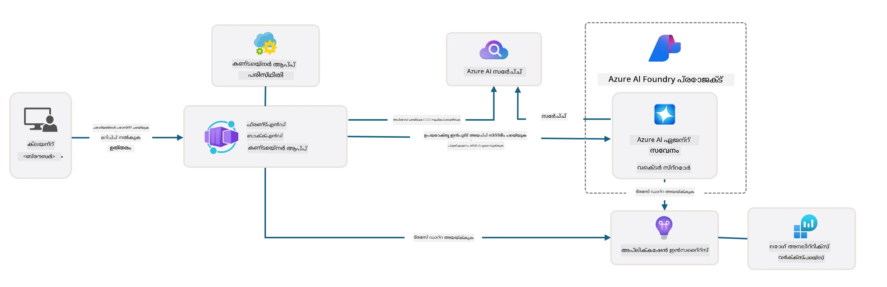

---

## 3. ടെംപ്ലേറ്റ് സജീവമാക്കൽ

ഈ ടെംപ്ലേറ്റ് ഡെപ്ലോ ചെയ്ത് ശരിതല്ലോ എന്ന് പരിശോധിക്കാം. [Getting Started](https://github.com/Azure-Samples/get-started-with-ai-agents?tab=readme-ov-file#getting-started) വിഭാഗത്തിലെ മാർഗ്ഗനിർദ്ദേശങ്ങൾ പാലിക്കാം.

1. ഈ [ലിങ്ക്](https://github.com/codespaces/new/Azure-Samples/get-started-with-ai-agents) ക്ലിക്ക് ചെയ്യുക - ഡിഫോൾട്ട് ആക്ഷൻ `Create codespace` സ്ഥിരീകരിക്കുക
1. പുതിയ ബ്രൗസർ ടാബ് തുറക്കും - GitHub Codespaces സെഷൻ ലോഡിംഗ് പൂർത്തിയാകാൻ കാത്തിരിക്കുക
1. Codespaces-ലുള്ള VS Code ടെർമിനൽ തുറന്ന് താഴെ കാണിച്ച കമാൻഡ് ടൈപ്പ് ചെയ്യുക:

   ```bash title="" linenums="0"
   azd up
   ```

ഈ പ്രവര്‍ത്തനക്രമത്തിന്റെ ഘട്ടങ്ങൾ പൂർത്തിയാക്കുക:

1. Azure-യിൽ ലോഗിൻ ചെയ്യാൻ പ്രോംപ്റ്റ് വരും - ഒത്തുചേരാനുള്ള നിർദ്ദേശങ്ങൾ പിന്തുടരുക
1. നിങ്ങളുടെ ഒറ്റപ്പെട്ട എൻവർണ്ണമെന്റ് പേര് നൽകുക - ഉദാഹരണത്തിന് `nitya-mshack-azd`
1. ഇത് `.azure/` ഫോൾഡർ സൃഷ്ടിക്കും - എൻവയോൺമെന്റ് പേരുമായി ഒരു സബ്‌ഫോൾഡർ കാണപ്പെടും
1. സബ്സ്ക്രിപ്ഷൻ പേരും തിരഞ്ഞെടുക്കാൻ പ്രോംപ്റ്റ് വരും - ഡിഫോൾട്ട് തിരഞ്ഞെടുക്കുക
1. ലോക്കേഷൻ ചോദിക്കും - `East US 2` തെരഞ്ഞെടുക്കുക

ഇപ്പോൾ പ്രൊവിഷനിംഗ് പൂർത്തിയാകാൻ കാത്തിരിക്കുക. **ഇതു 10-15 മിനിറ്റ് തുടങ്ങും**

1. പൂർത്തിയായാൽ, നിങ്ങളുടെ കോൺസോളിൽ ഈ പോലുള്ള SUCCESS സന്ദേശം കാണും:
      ```bash title="" linenums="0"
      SUCCESS: Your up workflow to provision and deploy to Azure completed in 10 minutes 17 seconds.
      ```
1. നിങ്ങളുടെ Azure പോർട്ടലിൽ ആ എൻവയോൺമെന്റ് നാമത്തിലുള്ള ഒരു പ്രൊവിഷൻ ചെയ്ത റെസോഴ്‌സ് ഗ്രൂപ്പ് ഉണ്ടാകും:

      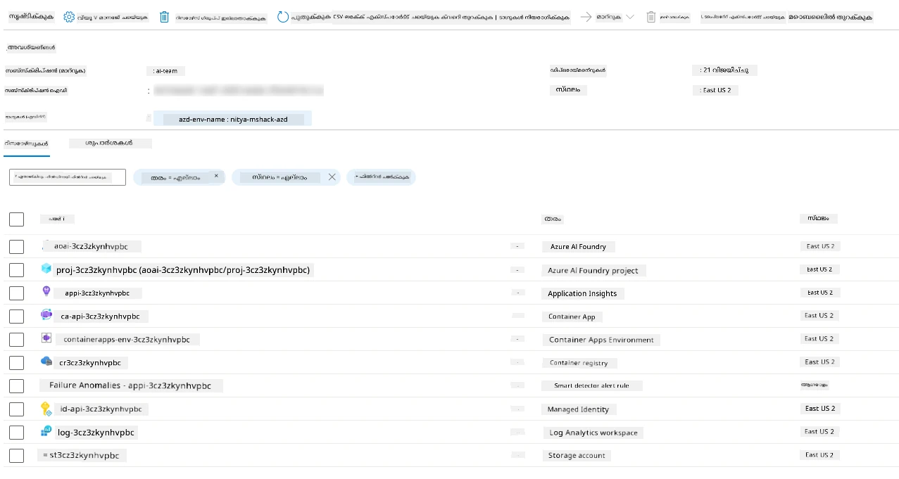

1. **ഇപ്പോൾ നിങ്ങൾക്ക് ഡെപ്ലോയുചെയ്‌ത ഇൻഫ്രാസ്ട്രക്ചറും ആപ്ലിക്കേഷനും ശരിതല്ലാൻ സജ്ജമാണ്**.

---

## 4. ടെംപ്ലേറ്റ് പരിശോധന

1. Azure പോർട്ടൽ [Resource Groups](https://portal.azure.com/#browse/resourcegroups) പേജ് സന്ദർശിക്കുക - പ്രോംപ്റ്റ് വന്നാൽ ലോഗിൻ ചെയ്യുക
1. നിങ്ങളുടെ എൻവയോൺമെന്റ് പേരിലുള്ള RG ക്ലിക്ക് ചെയ്യുക - മുകളിൽ കാണിച്ച പേജ് കാണും

      - Azure Container Apps റെസോഴ്‌സ് ക്ലിക്ക് ചെയ്യുക
      - _Essentials_ വകുപ്പ് (മുകളിൽ വലത്) ഉള്ള Application Url ക്ലിക്ക് ചെയ്യുക

1. നിങ്ങൾക്ക് ഹോസ്റ്റുചെയ്ത ആപ്ലിക്കേഷൻ ഫ്രണ്ട്-എൻഡ് UI ഇങ്ങനെ കാണപ്പെടണം:

   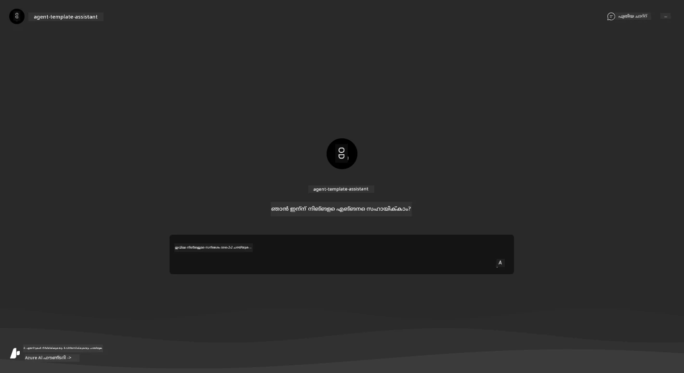

1. കുറച്ച് [സാമ്പിൾ ചോദ്യങ്ങൾ](https://github.com/Azure-Samples/get-started-with-ai-agents/blob/main/docs/sample_questions.md) ചോദിക്കാൻ ശ്രമിക്കുക

      1. ചോദിക്കുക: ```What is the capital of France?``` 
      1. ചോദിക്കുക: ```What's the best tent under $200 for two people, and what features does it include?```

1. നിങ്ങൾ താഴെ കാണുന്ന പോലുള്ള ഉത്തരം കിട്ടും. _എന്താണ് ഇത് എങ്ങനെ പ്രവർത്തിക്കുന്നത്?_

      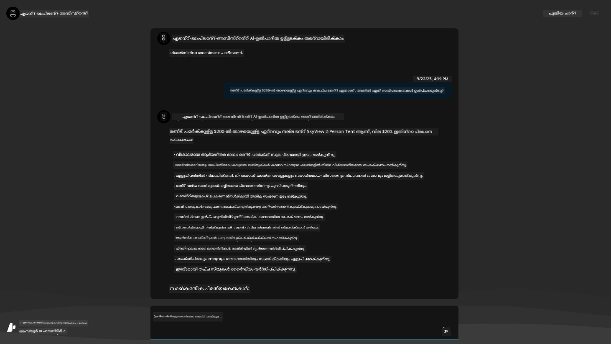

---

## 5. ഏജന്റ് പരിശോധന

Azure Container App ഒരു എൻഡ്‌പോയിന്റ് ഡെപ്ലോയ് ചെയ്യുന്നു, അത് ഈ ടെംപ്ലേറ്റ് ഉപയോഗിച്ച് Microsoft Foundry പ്രോജെക്ടിൽ പ്രൊവിഷൻ ചെയ്‌ത AI ഏജന്റുമായി കണക്ട് ചെയ്യുന്നു. അതിന്റെ അർത്ഥം നമുക്ക് നോക്കാം.

1. Azure പോർട്ടൽ에서 നിങ്ങളുടെ റെസോഴ്‌സ് ഗ്രൂപ്പ് _Overview_ പേജ് തിരികെ പോവുക

1. ആ ലിസ്റ്റിൽ `Microsoft Foundry` റെസോഴ്‌സ് ക്ലിക്ക് ചെയ്യുക

1. ഇതുപോലെയാണ്. `Go to Microsoft Foundry Portal` ബട്ടൺ ക്ലിക്ക് ചെയ്യുക. 
   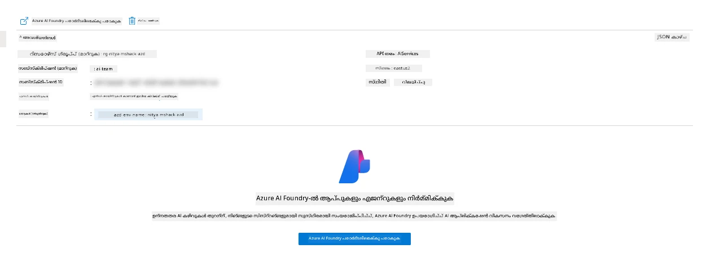

1. നിങ്ങളുടെ AI ആപ്ലിക്കേഷനുളള Foundry Project പേജ് കാണും
   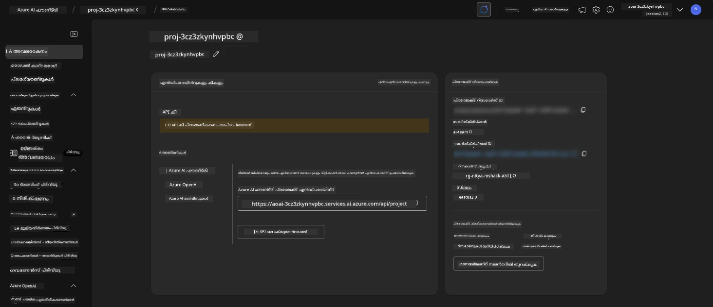

1. `Agents` ക്ലിക്ക് ചെയ്യുക - നിങ്ങളുടെ പ്രോജെക്ടിൽ ഡിഫോൾട്ട് ഏജന്റ് പ്രൊവിഷൻ ചെയ്തിരിക്കുന്നത് കാണും
   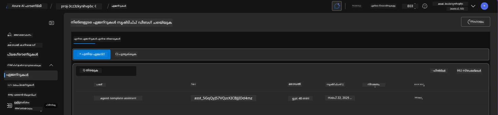

1. അതിൽ സെലക്ട് ചെയ്യുക - ഏജന്റ് വിശദാംശങ്ങൾ കാണാം. ശ്രദ്ധിക്കുക:

      - ഏജന്റ് ഡിഫോൾട്ടായി ഫയൽ തിരയൽ ഉപയോഗിക്കുന്നു (ആദ്യം മുതൽ)
      - ഏജന്റ് `Knowledge` 32 ഫയലുകൾ അപ്‌ലോഡ് ചെയ്തിരിക്കുന്നു (ഫയൽ തിരയലിന്)
      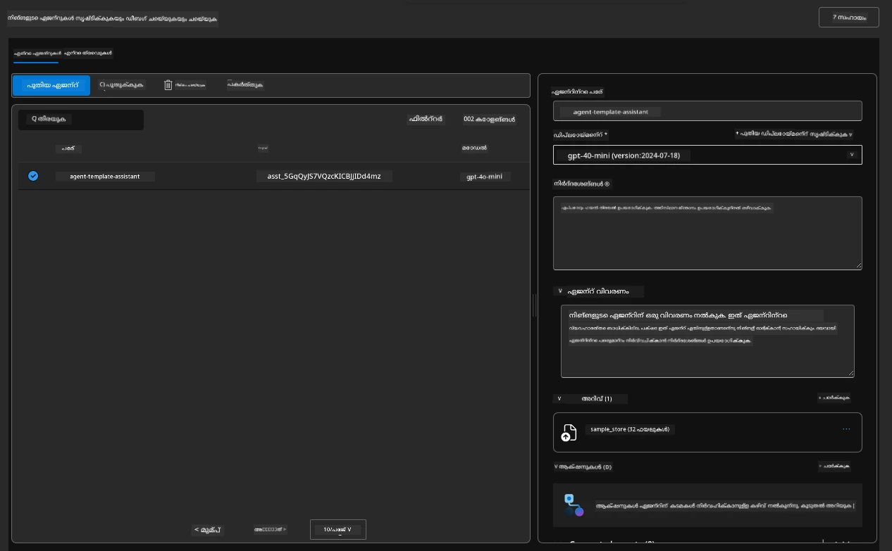

1. ഇടത് മെനുവിൽ `Data+indexes` ഓപ്ഷൻ നോക്കി അതിൽ ക്ലിക്ക് ചെയ്യുക.

      - 32 ഡാറ്റാ ഫയലുകൾ കൂടിയാണ് അറിവിനായി അപ്‌ലോഡ് ചെയ്തിട്ടുള്ളത്.
      - ഈ ഫയലുകൾ `src/files`-ൽ ഉള്ള 12 കസ്റ്റമർ ഫയലുകളും 20 ഉൽപ്പന്ന ഫയലുകളും തുല്യമാണ്
      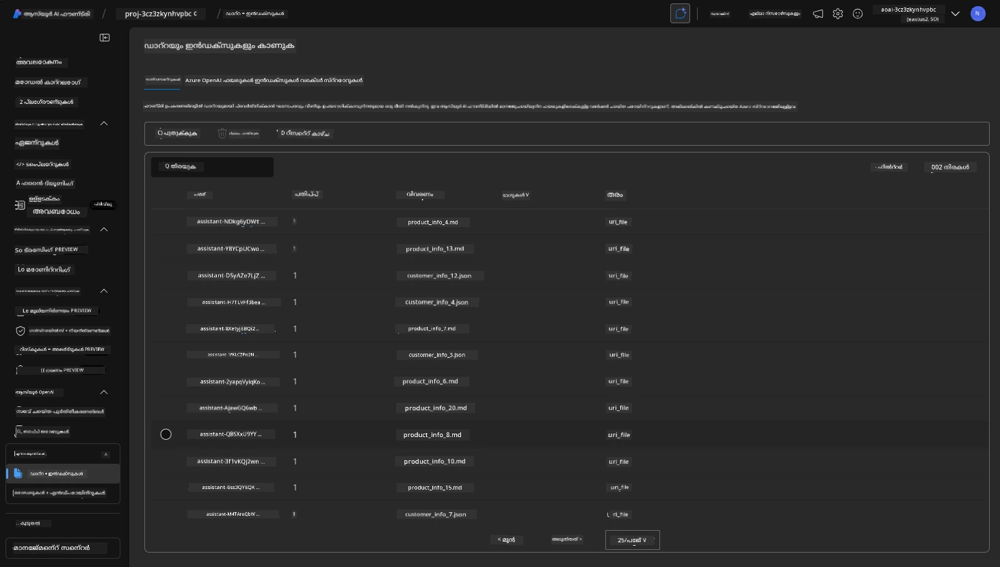

**നിങ്ങൾ ഏജന്റ് പ്രവർത്തനം ശരിതല്ലു ചെയ്‌തു!** 

1. ഏജന്റ് പ്രതികരണങ്ങൾ ആ ഫയലുകളുടെ അറിവിൽ അടിസ്ഥാനമുണ്ട്. 
1. നിങ്ങൾക്ക് ആ ഡാറ്റയുമായി ബന്ധപ്പെട്ട ചോദ്യങ്ങൾ ചോദിക്കാം, തുടർന്നുളള മറുപടികൾ grounded ആയിരിക്കും.
1. ഉദാഹരണം: `customer_info_10.json`  "Amanda Perez" നടത്തിയ 3 വാങ്ങലുകൾ വിശദീകരിക്കുന്നു

Container App എൻഡ്‌പോയിന്റ് ഉള്ള ബ്രൗസർ ടാബിൽ തിരികെ പോവുക, ചോദിക്കുക: `What products does Amanda Perez own?`. ഇത് പോലെയൊരു മറുപടി ലഭിക്കും:

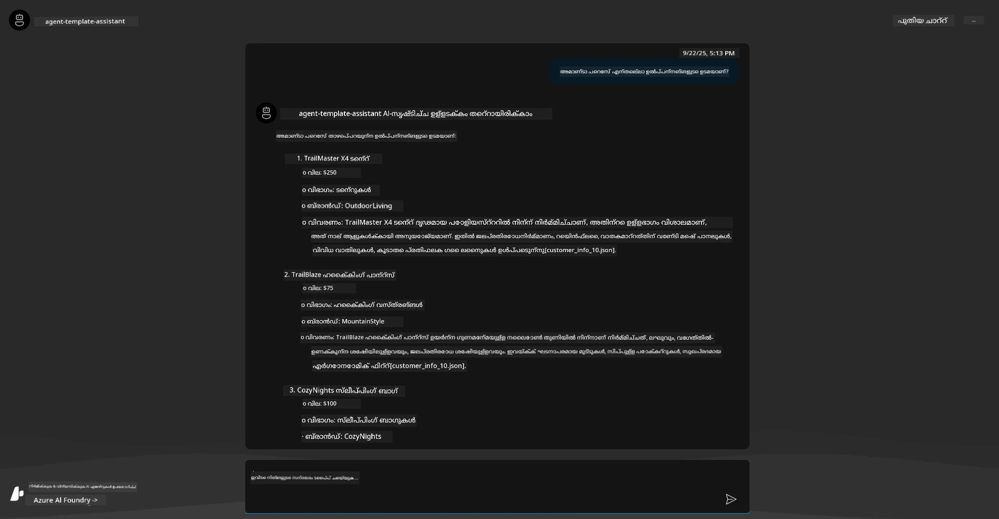

---

## 6. ഏജന്റ് പ്ലേഗ്രൗണ്ട്

Microsoft Foundryയുടെ കഴിവുകൾക്കു കുറച്ച് കൂടുതലായി അറിവ് നേടാം, ഏജന്റിനെ Agents Playground-ൽ പരീക്ഷിച്ചു നോക്കാം.

1. Microsoft Foundry-യിലെ `Agents` പേജിലേയ്ക്കു തിരികെ പോവുക - ഡിഫോൾട്ട് ഏജന്റ് തിരഞ്ഞെടുക്കുക
1. `Try in Playground` ഓപ്ഷൻ ക്ലിക്ക് ചെയ്യുക - ഇങ്ങനെ ഒരു പ്ലേഗ്രൗണ്ട് UI കാണപ്പെടും
1. ഒരുപോലെ ചോദ്യവും ചോദിക്കുക: `What products does Amanda Perez own?`

    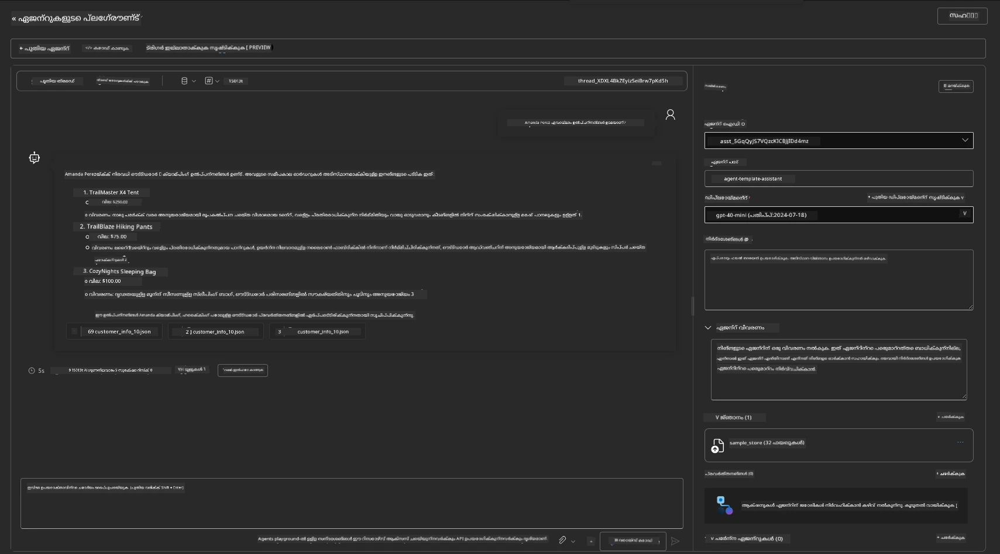

താഴെ പറയുന്ന അധിക വിവരങ്ങളും ലഭിക്കും, ഇതിലൂടെ ഏജന്റിന്റെ ആപ്ലിക്കേഷൻ ഗുണമേന്മ, ചിലവ്, പ്രകടനം എന്നിവ മനസിലാക്കാം:

1. മറുപടി ഗ്രൗണ്ടുചെയ്യുന്നതിനായി ഉപയോഗിച്ച ഡാറ്റ ഫയലുകൾ പരാമർശിക്കുന്നു
1. ഏതെങ്കിലും ഫയൽ ലേബലിൽ ഹോവർ ചെയ്യുക - ഡാറ്റ നിങ്ങളുടെ ചോദ്യം மற்றும் മറുപടിക്ക് യോജിച്ചതാണോ?

താഴെ മറുപടി കാണിക്കുന്നിടം _stats_ വരിയുണ്ട്.

1. ഏതെങ്കിലും മീഡിക്‌സ്-ൽ ഹോവർ ചെയ്യുക - ഉദാ: Safety. ഇതുപോലെയാണ് കാണുക
1. നൽകിയ റേറ്റിങ് നിങ്ങളുടെ പ്രതികരണ സുരക്ഷാ തോതിനോട് യോജിക്കുന്നതാണോ?

      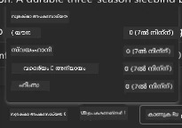

---

## 7. ഇൻബിൽറ്റ് ഒബ്സ്‌ർവബിലിറ്റി

ഒബ്സ്‌ർവബിലിറ്റിയും ശേഖരിക്കുകയും നിങ്ങളുടെ ആപ്ലിക്കേഷൻ സഹായിക്കാനുള്ള ഡാറ്റ ജനറേറ്റ് ചെയ്യുകയും ചെയ്യുന്നതാണ്. ഇത് ആപ്ലിക്കേഷൻ പ്രവര്‍ത്തനം മനസ്സിലാക്കാനും, ഡീബഗ്ഗ് ചെയ്യാനും, ഒപ്റ്റിമൈസ് ചെയ്യാനും സഹായിക്കും. ഇത് അറിവ് നേടാൻ:

1. `View Run Info` ബട്ടൺ ക്ലിക്ക് ചെയ്യുക - ഈ കാഴ്ച കാണും. ഇത് [Agent tracing](https://learn.microsoft.com/en-us/azure/ai-foundry/how-to/develop/trace-agents-sdk#view-trace-results-in-the-azure-ai-foundry-agents-playground) പ്രവർത്തനത്തിന്റെ ഉദാഹരണമാണ്. _തലവരി മെനുവിലെ Thread Logs ക്ലിക്ക് ചെയ്താലും ഇതെ കാഴ്ച ലഭിക്കും_.

   - ഏജന്റ് ഏർപ്പെടുത്തിയ വിധം പ്രവർത്തന ഘട്ടങ്ങളും ടൂളുകളും മനസ്സിലാക്കുക
   - എടുത്ത ടോക്കൺ സംഖ്യ (output tokens ഉപയോഗത്തിനോട് താരതമ്യം ചെയ്ത്) മനസ്സിലാക്കുക
   - പ്രവർത്തന വൈകിയാണ് എവിടെ പുറത്തെടുക്കപ്പെടുന്നത് അറിയുക

      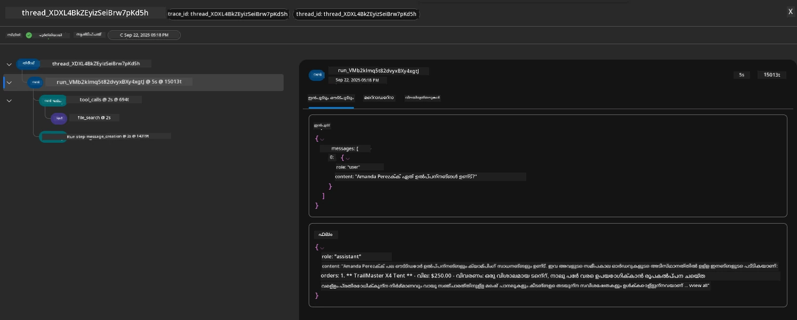

1. ഡീബഗ്ഗിംഗിന് സഹായകരമായ അധിക വിവരങ്ങൾ കാണാൻ `Metadata` ടാബിൽ ക്ലിക്ക് ചെയ്യുക.   

      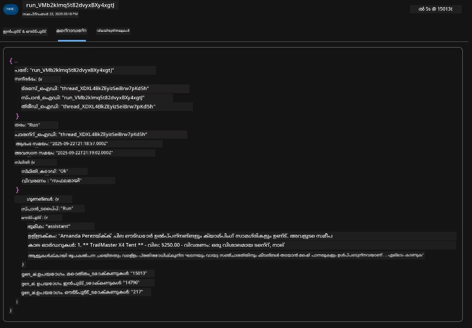


1. ഏജന്റ് പ്രതികരണ അവലോകനങ്ങൾ കാണാൻ `Evaluations` ടാബിൽ ക്ലിക്ക് ചെയ്യുക. ഇതിനകം സുരക്ഷാ മൂല്യനിർണയങ്ങളും (ഉദാ. Self-harm), ഏജന്റ്-സ്പെസിഫിക് മൂല്യനിർണയങ്ങളും (ഉദാ. ഉദ്ദേശം തിരിച്ചറിയൽ, ടാസ്ക് അനുസരണ) ഉൾപ്പെടുന്നു.

      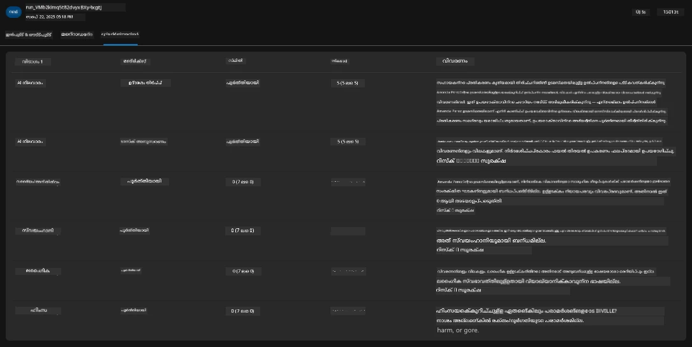

1. അവസാനം, സൈഡ്ബാർ മെനുവിലെ `Monitoring` ടാബിൽ ക്ലിക്ക് ചെയ്യുക.

      - കാണിച്ച പേജിൽ `Resource usage` ടാബ് തിരഞ്ഞെടുക്കുക - മെട്രിക്‌സ് കാണുക.
      - കസ്റ്റങ്ങൾ (tokens) & ലോഡ് (requests)യുടെ അടിസ്ഥാനത്തിൽ ആപ്ലിക്കേഷൻ ഉപയോഗം ട്രാക്ക് ചെയ്യുക.
      - ആദ്യ ബൈറ്റ് (ഇൻപുട്ട് പ്രോസസ്സിങ്) മുതൽ അവസാന ബൈറ്റ് (ഔട്ട്പുട്ട്) വരെ ആപ്ലിക്കേഷൻ ലാറ്റൻസി ട്രാക്ക് ചെയ്യുക.

      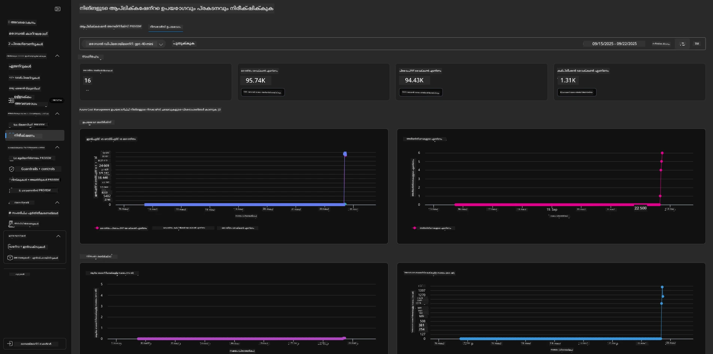

---

## 8. എൻവയോൺമെന്റ് വേരിയബിൾസ്

ഇപ്പോൾ വരെ, ഞങ്ങൾ ബ്രൗസറിൽ ഡെപ്ലോയ്മെന്റ് നടത്തി, ഇൻഫ്രാസ്ട്രക്ചർ പ്രൊവിഷൻ ചെയ്തതും ആപ്ലിക്കേഷൻ പ്രവർത്തനക്ഷമമാണെന്നും ശരിതലഞ്ഞു. എന്നാൽ ആപ്ലിക്കേഷൻ _കോഡ്-ഫസ്റ്റ്_ ആയി കൈകാര്യം ചെയ്യുവാൻ, ഈ റെസോഴ്‌സുകൾ ഉപയോഗിക്കുന്നതിന് ആവശ്യമായ വകവരുത്തലുകൾ നിങ്ങളുടെ ലോക്കൽ ഡെവലപ്പ്മെന്റ് എൻവയോൺമെന്റ് ക്രമീകരിക്കണം. `azd` ഉപയോഗിക്കുന്നതിൽ ഇത് എളുപ്പമാണ്.

1. Azure Developer CLI [എൻവയോൺമെന്റ് വേരിയബിൾസ്](https://learn.microsoft.com/en-us/azure/developer/azure-developer-cli/manage-environment-variables?tabs=bash) ഉപയോ​ഗിച്ച് ആപ്ലിക്കേഷൻ ഡെപ്ലോയ്മെന്റ് കോൺഫിഗറേഷൻ ക്രമീകരണങ്ങൾ സൂക്ഷിക്കുന്നു, നയിക്കുന്നു.

1. എൻവയോൺമെന്റ് വേരിയബിൾസ് `.azure/<env-name>/.env`-ൽ സൂക്ഷിക്കുന്നു - ഇത് deployment-ക്കായുള്ള `env-name` എന്ന എൻവയോൺമെന്റിലേക്ക് പരിമിതമാക്കി, ഒരേ റിപോസിറ്ററിയിൽ വിവിധ deployment ലക്ഷ്യങ്ങൾക്കിടയിൽ എൻവയോൺമെന്റുകൾ আলাদা ചെയ്യാൻ സഹായിക്കുന്നു.

1. `azd` കമാൻഡ് കൽച്ച് ചെയ്താൽ (ഉദാ., `azd up`) ഈ എൻവയോൺമെന്റ് വേരിയബിൾസ് സ്വയം ലോഡ് ചെയ്യും. എന്നാൽ `azd` _ഓപ്പറേറ്റിങ് സിസ്റ്റം തലത്തിലുള്ള_ (ഉദാ., ഷെല്ലിൽ സെറ്റ് ചെയ്‌ത) എന്‍വയോൺമെന്റ് വേരിയബിൾസ് കൂട്ടിച്ചേർക്കുന്നില്ല - പകരം `azd set env` , `azd get env` ഉപയോഗിച്ച് സ്ക്രിപ്റ്റുകളിൽ വിവരങ്ങൾ കൈമാറുക.


ചടങ്ങുകളൊന്ന് പരീക്ഷിക്കാം:

1. ഈ എൻവയോൺമെന്റിൽ `azd`-ക്കായി സജ്ജമാക്കിയ എല്ലാ എൻവയോൺമെന്റ് വേരിയബിൾസും കാണുക:

      ```bash title="" linenums="0"
      azd env get-values
      ```
      
      ഇങ്ങനെ കാണും:

      ```bash title="" linenums="0"
      AZURE_AI_AGENT_DEPLOYMENT_NAME="gpt-4.1-mini"
      AZURE_AI_AGENT_NAME="agent-template-assistant"
      AZURE_AI_EMBED_DEPLOYMENT_NAME="text-embedding-3-small"
      AZURE_AI_EMBED_DIMENSIONS=100
      ...
      ```

1. ഒരു പ്രത്യേക മൂല്യം ലഭിക്കുക - ഉദാഹരണത്തിന്, `AZURE_AI_AGENT_MODEL_NAME` സജ്ജമാക്കിയിട്ടുണ്ടോ എന്ന് അറിയണം

      ```bash title="" linenums="0"
      azd env get-value AZURE_AI_AGENT_MODEL_NAME 
      ```
      
      ഇങ്ങനെ കാണും - ഇത് ഡിഫോൾട്ടായി സജ്ജമാക്കിയിരുന്നില്ല!

      ```bash title="" linenums="0"
      ERROR: key 'AZURE_AI_AGENT_MODEL_NAME' not found in the environment values
      ```

1. `azd`-ക്കായി പുതിയ എൻവയോൺമെന്റ് വേരിയബിൾ നൽകുക. ഇവിടെ, ഏജന്റ് മോഡൽ നാമം പുതുക്കുന്നു. _ശ്രദ്ധിക്കുക: എന്തെങ്കിലും മാറ്റങ്ങൾ `.azure/<env-name>/.env` ഫയലിൽ ഉടൻ പ്രതിഫലിക്കും._

      ```bash title="" linenums="0"
      azd env set AZURE_AI_AGENT_MODEL_NAME gpt-4.1
      azd env set AZURE_AI_AGENT_MODEL_VERSION 2025-04-14
      azd env set AZURE_AI_AGENT_DEPLOYMENT_CAPACITY 150
      ```

      ഇപ്പോൾ മൂല്യം സജ്ജ് ചെയ്തതായി കാണും:

      ```bash title="" linenums="0"
      azd env get-value AZURE_AI_AGENT_MODEL_NAME 
      ```

1. ചില റെസോഴ്‍സുകൾ സ്ഥിരതയുള്ളവയാണ് (ഉദാ. മോഡൽ ഡെപ്ലോയ്മെന്റുകൾ), എന്നാൽ മാറ്റിയ എൻവയോൺമെന്റ് വേരിയബിൾസുമായി പുതിയ ഡെപ്ലോയ്മെന്റ് നടത്താൻ സാധിക്കട്ടെ എന്നു ഉറപ്പാക്കാൻ `azd up` മാത്രമല്ല കൃത്യമാകൂ. പഴയ ഡെപ്ലോയ്മെന്റ് തകർത്തും, പുതിയ എൻവayaromente vars-ഉം ഉപയോഗിച്ച് വീണ്ടും ഡെപ്ലോയ്മെന്റ് നടത്തും.

1. **റിഫ്രഷ്** മുമ്പ് azd ടെംപ്ലേറ്റ് ഉപയോഗിച്ച് നിങ്ങൾ ഇൻഫ്രാസ്ട്രക്ചർ ഡെപ്ലോയ്മെന്റ് ചെയ്തിട്ടുണ്ടെങ്കിൽ - ഇപ്പോഴത്തെ Azure ഡെപ്ലോയ്മെന്റിന്റെ നില പിന്തുടരാനുള്ള എൻവയോൺമെന്റ് വേരിയബിൾസ് റിഫ്രഷ് ചെയ്യാൻ ഈ കമാൻഡ് ഉപയോഗിക്കുക:

      ```bash title="" linenums="0"
      azd env refresh
      ```

      ഇത് രണ്ട് അല്ലെങ്കിൽ അതിലധികം ലൊക്കൽ ഡെവലപ്പ്മെന്റ് പരിസരങ്ങളിൽ (ഉദാഹരണത്തിന്, ബഹുഭൂരിപക്ഷ ഡെവലപ്പർമാരുള്ള ടീം) പരിസ്ഥിതി വേരിയബിളുകൾ _sync_ ചെയ്യാനുള്ള ശക്തമായ മാർഗമാണ് - വിന്യസിച്ച ഇൻഫ്രാസ്ട്രക്ചർ പരിസ്ഥിതി വേരിയബിൾ നിലയുടെ ന്യായമായ സത്യമായിരിക്കാനുള്ള അനുവാദം നൽകുന്നു. ടീം അംഗങ്ങൾ വെറും വേരിയബിളുകൾ _refresh_ ചെയ്യുമ്പോൾ വീണ്ടും sink-ഇൽ എത്തുക.

---

## 9. അഭിനന്ദനങ്ങൾ 🏆

നിങ്ങൾ കൃത്യം സമ്പൂർണമായ ഒരു പ്രവൃത്തി പ്രക്രിയ പൂർത്തിയാക്കി, അവിടെ നിങ്ങൾ:

- [X] നിങ്ങൾ ഉപയോഗിക്കാൻ ആഗ്രഹിക്കുന്ന AZD ടെംപ്ലേറ്റ് തിരഞ്ഞെടുക്കുക
- [X] GitHub Codespaces ഉപയോഗിച്ച് ടെംപ്ലേറ്റ് പ്രവർത്തിപ്പിച്ചു
- [X] ടെംപ്ലേറ്റ് വിന്യസിച്ചു, ഇത് ശരിയായി പ്രവർത്തിക്കുന്നതായി സ്ഥിരീകരിച്ചു

---

<!-- CO-OP TRANSLATOR DISCLAIMER START -->
**ഘോഷണം**:  
ഈ രേഖ AI തർജ്ജമാ സേവനം [Co-op Translator](https://github.com/Azure/co-op-translator) ഉപയോഗിച്ചു തർജ്ജമ ചെയ്തതാണ്. ഞങ്ങൾ കൃത്യതക്കായി ശ്രമിക്കുന്നപ്പോഴും, ഓട്ടോമേറ്റഡ് തർജ്ജമയിൽ പിഴവുകളും അപൂർവ്വതകളും ഉണ്ടാകാമെന്ന് ദയവായി ശ്രദ്ധിക്കുക. അതിന്റെ മൊഴിമാറ്റത്തിലുള്ള ഓരിജിനൽ രേഖ അധികാരപ്രദമായ ഉറവിടമായി കരുതണം. നിർണായക വിവരങ്ങൾക്ക്, പ്രൊഫഷണൽ മനുഷ്യ തർജ്ജമ ശിപാർശ ചെയ്യപ്പെടുന്നു. ഈ തർജ്ജമ ഉപയോഗിച്ചുകൊണ്ട് ഉണ്ടായ തർക്കങ്ങൾക്കോ തെറ്റിദ്ധാരണകൾക്കോ ഞങ്ങൾ ഉത്തരവാദികൾ അല്ല.
<!-- CO-OP TRANSLATOR DISCLAIMER END -->